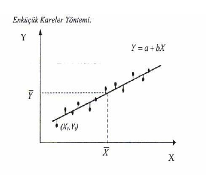

```{r setup, include=FALSE}
knitr::opts_chunk$set(
	echo = TRUE,
	message = FALSE,
	warning = FALSE
)
options(digits=3)
library(dplyr)
library(QuantPsyc)
library(knitr)
library(tidyverse)
library(tuev)
library(emo)

```

# Regresyon

-   Bilindiği üzere, t-testi, varyans analizi gibi ortalama farkları ile ilgili hipotez testleri değişkenler arasındaki ilişkiye dair herhangi bir bilgi vermemektedir.

-   Oysa serpilme diyagramlarına bakıldığında değişkenler arasında bir **ilişki** olabileceği hissedilebilmekte fakat bu tür analizlerle bu **ilişkiler** ortaya koyulamamaktadır.

-   Dolayısıyla değişkenler arasındaki **ilişkinin şeklini, yönünü ve kuvvetini** belirleyebilmemiz için yeni metotlara ihtiyaç vardır. Bu metotlar ise genel olarak **regresyon (eğri uydurma) ve korelasyon analizi** olarak adlandırılır.


## Regresyon Kullanım Alanları

-   Tarımda belli ürünlerin verimi etkileyen toprak türü, tohum, sulama v.b. faktörlerin saptanması ve bunlar yardımıyla belli şartlarda alınacak ürün miktarının kestirilmesi tarımın önemli konusudur.

-   Bir değişkenin değerlerinin ilgili başka değişkenler yardımıyla kestirilmesi, günlük yaşamımızın, ticaretin ekonominin, doğa ve sosyal bilimlerin önemli konularını içendedir.

-   günlük yaşamımızın, ticaretin ekonominin, doğa ve sosyal bilimlerin pek çok alanındaki çalışmalarda iki ya da daha çok değişken arasında fonksiyonel ilişkiler vardır. Bu ilişkiler matematiksel bir denklem yazılabilir.

Örneğin taksi hizmeti ödenen $ücret = a + bx$
<br>
a: sabit (taksimetre açılış ücreti) 
<br>
b: her kilometrede artan ücret


## Regresyon Kullanım Alanları

-   Regresyon çözümlemenin temel amacı; bağımlı değişken ile bağımsız değişken(ler) arasındaki ilişkiyi matematiksel modelle açıklayarak bağlantılar bulmak ve bağımsız değişken(ler) yardımıyla bağımlı değişkenli kestirmek şeklinde özetlenebilir.

-   Sosyal bilimlerde değişkenler arasındaki ilişkiler bir dereceye kadar fonksiyoneldir. (taksimetre örneği kadar net değildir!) Bu ilişkiye **probabilisitik** ilişki denir.


-   Sosyal bilimlerde değişkenler arasındaki ilişkilerin matematiksel olarak kesin ifadelerle yazılamaması, bu değişkenlere ait önceki bilgiler yardımıyla elde edilmesi ve matematiksel ifadelerin bu bilgilere dayanılarak yazılması yolunu açmıştır.

-   Regresyon terimi 19. yüzyılda İngiliz istatistikçisi Francis Galton tarafından bir biyolojik inceleme için ortaya atılmıştır. Bu incelemenin ana konusu kalıtım olup, aile içinde baba ve annenin boyu ile çocukların boyu arasındaki bağlantıyı araştırmakta ve çocukların boylarının bir nesil içinde eski ata nesillerinin ortalamasına geri döndüklerini yani bir nesil içinde ortalamaya geri dönüş olduğu inceleme konusudur.

## Basit Doğrusal Regresyon

- Bir bağımsız $X$ değişkeninin değerlerinden ona bağlı değişkeninin değerlerinin kestirilmesini sağlayan denkleme **$Y$’in $X$’e göre regresyonu** denir. 

$$Y= bx + a$$
- Regresyon denkleminde $b$ doğrunun eğimidir – $X$’in 1 puanlık değişimine karşılık Y’nin ne kadar değişeceğini belirtir. (buna **regresyon katsayısı** denir)

- $a$ ise $Y$-kesişim noktasıdır – $X$ sıfıra eşit olduğunda $Y$’nin alacağı değerdir (buna **regresyon sabiti** denir)

-   **Lise matematik puanlarından** yararlanarak **üniversite genel matematik puanlarını** kestirme amacıyla üniversite genel matematik dersini alan öğrencilerden uygun bir örneklem alınmıştır.

```{r}
lise_not <- c(18,35,53,24,64,58,32,39,64,82,32,49,48,70,57)
uni_not  <- c(33,46,47,21,73,55,74,32,56,68,43,46,68,84,61)
veri <- data.frame(lise_not, uni_not)


```

-   Regresyon analizi yapmadan önce **saçılım diagramı** incelenmelidir. Puanlar saçılım grafiğinde tek bir doğru oluşturmamaktadır. Ancak doğru oluşturma eğilimleri vardır.

```{r}
ggplot2::ggplot(veri, aes(x = lise_not, y = uni_not)) + 
  geom_point() +   
  geom_smooth(method = "lm", se = F)
```

-   Noktalardan olabildiğince yakın geçecek bir doğru çizilebilirse bu doğrudan yararlanarak $X$ puanı bilinen öğrencilerin $Y$ puanları kestirilebilir.


```{r}
basitreg <- lm(uni_not ~ lise_not , veri)
summary(basitreg)
```


## En küçük kareler yöntemi

-   Bu yönteme göre **a** ve **b** öyle bir belirlenmelidir ki dağılımdaki noktaların, doğrunun etrafındaki değişkenliği en aza indirgenmiş olmalıdır.

-   Regresyon doğrusu, noktalar ile regresyon doğrusu arasındaki sapmaların kareler toplamı en az olacak şekilde, saçılım grafiğindeki noktalar kümesine en uygun yere çizildiğinden bu ölçüte **en küçük kareler ölçütü** adı verilir.


```{r echo=FALSE, fig.align='center',out.width="50%"}

```


-   $Y$ değeri ve regresyon doğrusundaki $Y′$ arasındaki farkın en küçük olacak şekilde yerleştirilir.

-   $\sum(Y-Y′)^2$ en küçük olacak şekilde yerleştirir.


- $b_{yx}=\frac{n\sum{XY}-\sum{X}\sum{Y}}{n\sum{X^2}-(\sum{X})^2}$


- $a_{yx}=\frac{n\sum{Y}-b_{YX}\sum{X}}{n}$


- $b_{yx}$ hesaplama

- $b_{YX}=\frac{n\sum{XY}-\sum{X}\sum{Y}}{n\sum{X^2}-(\sum{X})^2}$

```{r }
n <- length(lise_not)
byx = (n*sum(lise_not*uni_not)-sum(lise_not)*sum(uni_not))/
  (n*sum(lise_not^2) - sum(lise_not)^2)
byx
```

- **Regresyon doğrusunun eğimi**, değişkenlerin **standart sapmalarının oranlarıyla** bunlar arasındaki **korelasyonun** çarpımına eşittir. 

```{r}
(sd(uni_not)/sd(lise_not))*cor(lise_not,uni_not)

```


- $a_{yx}$  hesaplama

- $a_{yx}=\frac{n\sum{Y}-b_{yx}\sum{X}}{n}$


```{r }
attach(veri)
ayx = (sum(uni_not) - byx*sum(lise_not))/15
ayx


```


## Kestirimin Standart Hatası

- Kestirim sonunda $Y$ **değişkeninin gözlenen değerleri** ile **regresyon değerleri** $Y'$  arasında fark olmaması veya bu farkın olabildiği kadar küçük olması istenir.

- **Gözlenen** $Y$ ve **kestirilen** $Y'$ değerleri arasındaki farklar kestirimdeki hatalardır. Bu farkların karelerinin ortalamasının kare köküne kestirimin standart hatası adı verilir. 

- $$S_{yx}=\sqrt{\sum{\frac{(Y-Y')^2}{n-2}}}$$

- $$S_{yx}=\sqrt{\frac{\sum{Y^2}-a\sum{Y}-b\sum{XY}}{n-2}}$$


- Ortak dağılımın için **kestirimin standart hatası** tek değişkenli dağılımın standart sapmasına benzer.

- Standart sapma tek değişkenli dağılımın ortalamadan farkının standart bir ölçüsü olduğu gibi, kestirimin standart hatası da noktaların standart regresyon çizgisinden farkının ölçüsüdür. 
- Bu nedenle kestirimin standart hatası verilen X değeri için kestirilen Y değerinin standart sapması şeklinde okunabilen $S_{yx}$ sembolü ile gösterilir.  


$X$  değerlerinden kestirilen $Y'$ ’lerin standart hatası

```{r}
sqrt((sum(uni_not^2)-ayx*sum(uni_not)-
       byx*(sum(uni_not*lise_not)))/13)


res <- basitreg$residuals


```
```{r}
sqrt(sum((res - mean(res)) ^ 2 / (length(res)-2)))

```


### Basit Doğrusal Regresyon Uygulama

```{r}
basitreg <- lm(uni_not ~ lise_not , veri)
library(broom)
glance(basitreg) %>% kable()
```

- $R$ İki değişken arasında pearson korelasyon katsayısı
- $R-Square:$ Determinasyon katsayısı/bağımsız değişkenin bağımlı değişken üzerindeki açıklama oranı
- $\text{Adjusted R Square:}$ Düzeltmiş determinasyon katsayısı, şans eseri açıklanan değişimin neden olduğu hatanın arındırılmış hali.
- $\text{Standart Kestirimin Hatası:}$ Hata teriminin standart sapmasıdır.


- Tablodaki $p$ değeri regresyon modelindeki yordanan ve yordayan değişkenler arasındaki ilişki için hesaplanan değerin anlamlı olup olmadığını göstermektedir. 


```{r}
glance(basitreg)[,c(1,2,4,6,5)]
```

- Yani regresyon modelinde lise matematik puanları ile genel matematik puanları arasında doğrusal ilişki anlamlı düzeydedir. Regresyon modelindeki $\text{df}$ 1 olması nedeni, regresyon modelindeki sabit ve eğimi katsayı olarak almasıdır. 2-1

- $p$ değerleri sabitin ve yordayıcı değişkenin katsayısının anlamlılık testi sonuçları

```{r}
tidy(basitreg)
```


