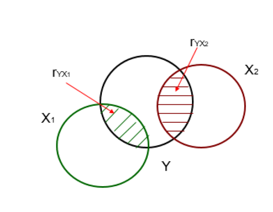
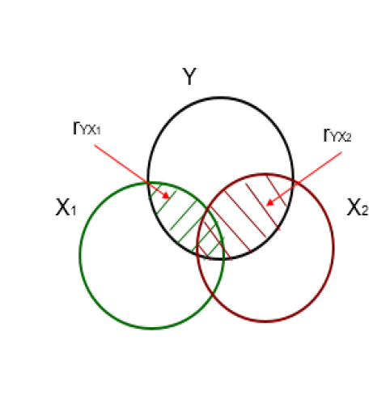
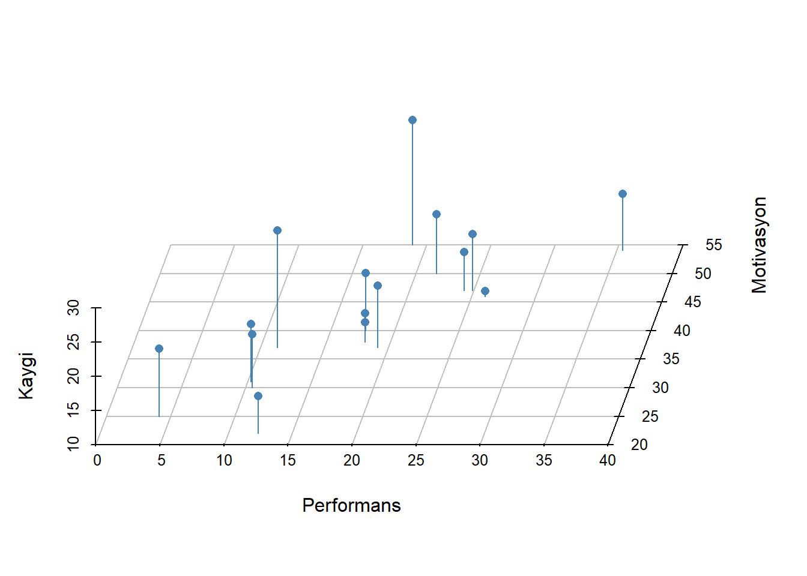
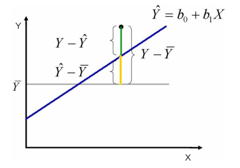
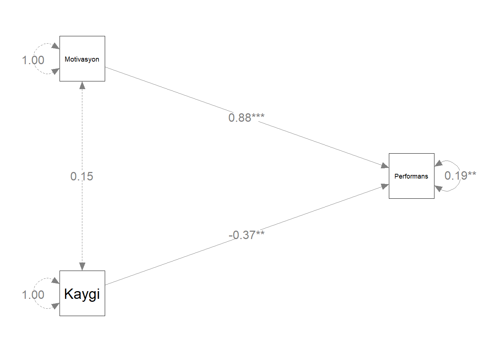
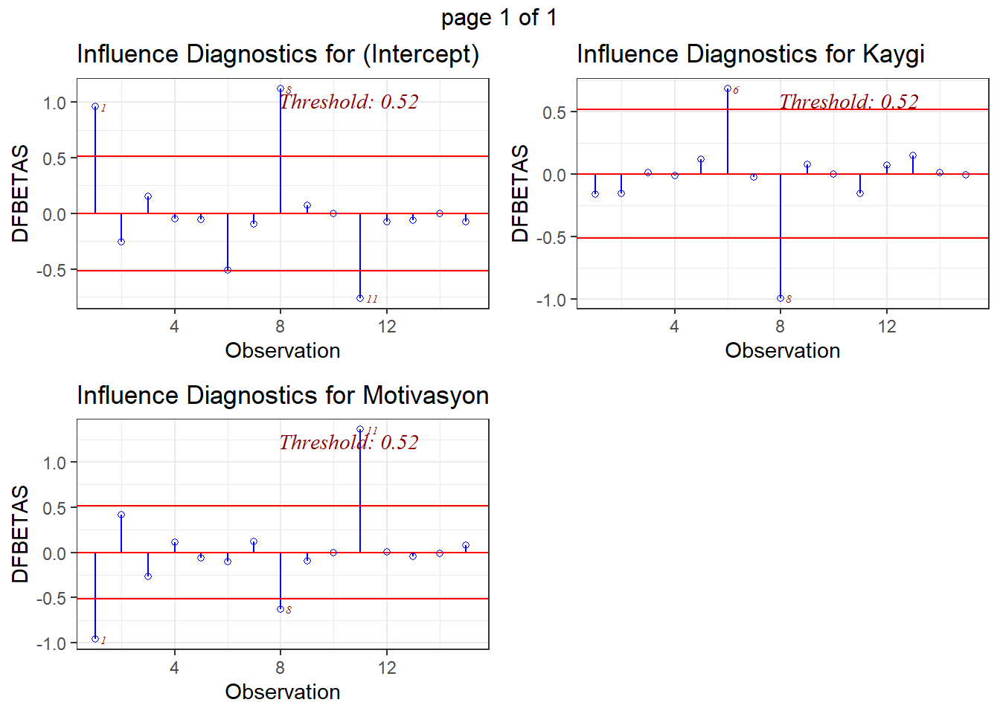
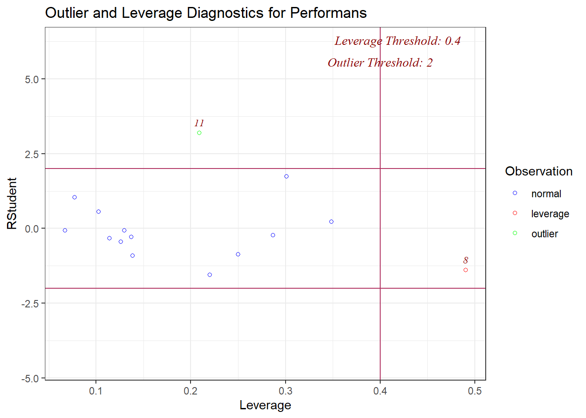
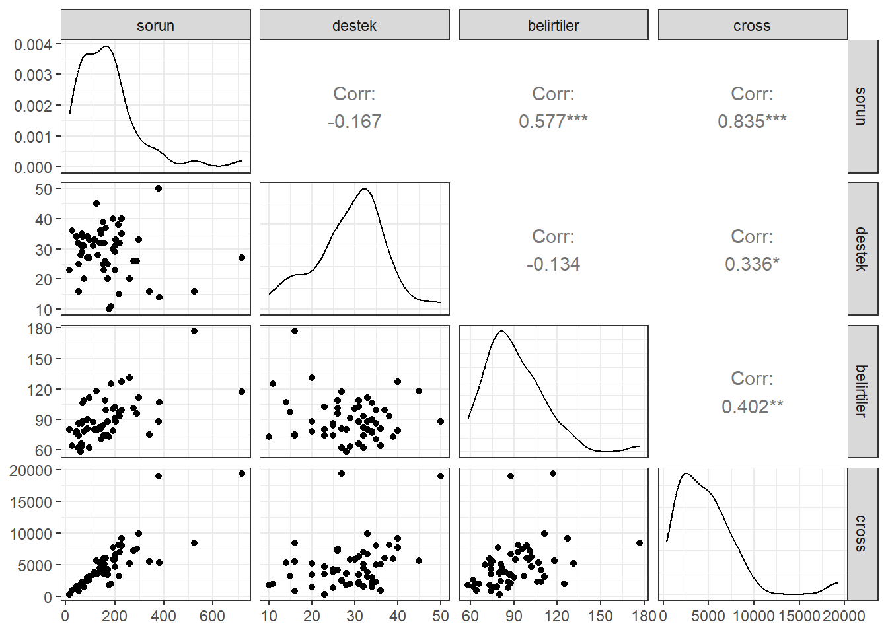

::: small_right

:::


# Ders Hakkında {.unnumbered}

Bu dersin amacı, R yazılımını kullanarak veri üzerinde istenilen çok değişkenli istatistiksel ve psikometrik işlemlerin yapılabilmesini sağlamaktır.

Tez ve makale çalışmalarında öğrencilerimizin analizlerini R yazılımı ile hiçbir paket programa ihtiyaç duymadan kendi başlarına yapmalarını sağlamaktır.

Ders İçeriği: 

- Çok değişkenli İstatistik Varsayımları  
- Çoklu Regresyon  
- Yol Analizi
- Açımlayıcı Faktör Analizi  
- Doğrulayıcı Faktör Analizi  
- Progralamaya Giriş  
- Klasik Test Kuramı  
- Madde Tepki Kuramı  
- Veri Üretimi  

## Eğitmen {.unnumbered}

`<svg aria-hidden="true" role="img" viewBox="0 0 448 512" style="height:1em;width:0.88em;vertical-align:-0.125em;margin-left:auto;margin-right:auto;font-size:inherit;fill:black;overflow:visible;position:relative;"><path d="M224 256A128 128 0 1 1 224 0a128 128 0 1 1 0 256zM209.1 359.2l-18.6-31c-6.4-10.7 1.3-24.2 13.7-24.2H224h19.7c12.4 0 20.1 13.6 13.7 24.2l-18.6 31 33.4 123.9 36-146.9c2-8.1 9.8-13.4 17.9-11.3c70.1 17.6 121.9 81 121.9 156.4c0 17-13.8 30.7-30.7 30.7H285.5c-2.1 0-4-.4-5.8-1.1l.3 1.1H168l.3-1.1c-1.8 .7-3.8 1.1-5.8 1.1H30.7C13.8 512 0 498.2 0 481.3c0-75.5 51.9-138.9 121.9-156.4c8.1-2 15.9 3.3 17.9 11.3l36 146.9 33.4-123.9z"/></svg>`{=html} [Dr. Kübra Atalay Kabasakal](https://avesis.hacettepe.edu.tr/katalay)

`<svg aria-hidden="true" role="img" viewBox="0 0 512 512" style="height:1em;width:1em;vertical-align:-0.125em;margin-left:auto;margin-right:auto;font-size:inherit;fill:black;overflow:visible;position:relative;"><path d="M64 112c-8.8 0-16 7.2-16 16v22.1L220.5 291.7c20.7 17 50.4 17 71.1 0L464 150.1V128c0-8.8-7.2-16-16-16H64zM48 212.2V384c0 8.8 7.2 16 16 16H448c8.8 0 16-7.2 16-16V212.2L322 328.8c-38.4 31.5-93.7 31.5-132 0L48 212.2zM0 128C0 92.7 28.7 64 64 64H448c35.3 0 64 28.7 64 64V384c0 35.3-28.7 64-64 64H64c-35.3 0-64-28.7-64-64V128z"/></svg>`{=html} [kkatalay\@gmail.com](mailto:kkatalay@gmail.com){.email}

`<svg aria-hidden="true" role="img" viewBox="0 0 512 512" style="height:1em;width:1em;vertical-align:-0.125em;margin-left:auto;margin-right:auto;font-size:inherit;fill:black;overflow:visible;position:relative;"><path d="M64 112c-8.8 0-16 7.2-16 16v22.1L220.5 291.7c20.7 17 50.4 17 71.1 0L464 150.1V128c0-8.8-7.2-16-16-16H64zM48 212.2V384c0 8.8 7.2 16 16 16H448c8.8 0 16-7.2 16-16V212.2L322 328.8c-38.4 31.5-93.7 31.5-132 0L48 212.2zM0 128C0 92.7 28.7 64 64 64H448c35.3 0 64 28.7 64 64V384c0 35.3-28.7 64-64 64H64c-35.3 0-64-28.7-64-64V128z"/></svg>`{=html} [katalay\@hacettepe.edu.tr](mailto:katalay@hacettepe.edu.tr){.email}

## Kitaplar {.unnumbered}

-   Atar, B., Atalay Kabasakal, K, Unsal Ozberk, E. B., Ozberk, E. H. & Kibrislioglu Uysal, N. (2020). R ile Veri Analizi ve Psikometri Uygulamaları, Pegem Akademi, Ankara.🔗 [📖](https://pegem.net/urun/R-ile-Veri-Analizi-ve-Psikometri-Uygulamalari/60801)


-   Desjardins, C. D., & Bulut, O. (2018). Handbook of educational measurement and psychometrics using R. Boca Raton, FL: CRC Press. 🔗[📖](https://www.routledge.com/Handbook-of-Educational-Measurement-and-Psychometrics-Using-R/Desjardins-Bulut/p/book/9780367734671)

- Demir, E. R Diliyle İstatistik Uygulamaları. Pegem Akademi, Ankara.(2021). 🔗[📖](https://pegem.net/urun/R-Diliyle-Istatistik-Uygulamalari/61912)

- Kline,R. B. (2019). Yapısal Eşitlik Modellemesinin İlkeleri ve Uygulaması(4. Baskı). (S. Şen, Çev.) Ankara: Nobel Yayınevi.

- Şen, S. (2020). Mplus ile Yapısal Eşitlik Modellemesi Uygulamaları (2020).Nobel Yayınevi.

- Tabachnick, B. G., & Fidell, L. S. (2012). Using Multivariate Statistics (4rd ed.). New York: Harper Collins.


- Wolf, E. J., Harrington, K. M., Clark, S. L., & Miller, M. W. (2013). Sample Size Requirements for Structural Equation Models: An Evaluation of Power, Bias, and Solution Propriety. Educational and Psychological Measurement, 73(6), 913–934. https://doi.org/10.1177/0013164413495237

<!--chapter:end:index.Rmd-->

# Varsayımlar I

-   Veri Dosyasındaki Verinin Doğruluğu

-   Kayıp Verinin Miktarı ve Dağılımı

-   Tek Değişkenli ve Çok Değişkenli Uç Değerler (Outliers)

-   Sayıltılar

-   Çoklu Bağlantı (Multicollinearity) ve Tekillik (Singularity)

## Veri İnceleme

-   Varsayımlar incelenirken ilk olarak yanlış girilmiş bir değer olup
    olmadığına bakılmalıdır.

-   Bu bölümde 🔗 [SCREEN.SAV](import/SCREEN.SAV) adlı
    veri seti kullanılmıştır. Bu veri setinde 20-59 yaşları arasında 465
    kadının 6 değişkene ilişkin bilgileri bulunmaktadır. Değişkenlerden
    timedrs, attdrug, atthouse ve income değişkenleri sürekli, mstatus
    ve race değişkenleriyse iki kategorili değişkenlerdir. Bu veri seti
    **Tabachnick, B. G., & Fidell, L. S. (2012). Using Multivariate
    Statistics (4rd ed.). New York: Harper Collins.** kitabının 4.
    bölümünde kullanılmaktadır.

-   Veri incelemede birden fazla paket kullanılabilir. En temel
    fonksiyon `base` paketin `summary()` fonksiyonudur. `psych`
    paketinde `describe()` fonksiyonu da aynı amaçla kullanılabilir.


```r
library(haven)
screen <- read_sav("import/SCREEN.sav")
head(screen)
```

<div class="kable-table">

| subno| timedrs| attdrug| atthouse| income| mstatus| race|
|-----:|-------:|-------:|--------:|------:|-------:|----:|
|     1|       1|       8|       27|      5|       2|    1|
|     2|       3|       7|       20|      6|       2|    1|
|     3|       0|       8|       23|      3|       2|    1|
|     4|      13|       9|       28|      8|       2|    1|
|     5|      15|       7|       24|      1|       2|    1|
|     6|       3|       8|       25|      4|       2|    1|

</div>

-   Veri setindeki maksimum ve minumum değerleri belirlenmiştir.


```r
summary(screen)
```

```
##      subno          timedrs          attdrug          atthouse    
##  Min.   :  1.0   Min.   : 0.000   Min.   : 5.000   Min.   : 2.00  
##  1st Qu.:137.0   1st Qu.: 2.000   1st Qu.: 7.000   1st Qu.:21.00  
##  Median :314.0   Median : 4.000   Median : 8.000   Median :24.00  
##  Mean   :317.4   Mean   : 7.901   Mean   : 7.686   Mean   :23.54  
##  3rd Qu.:483.0   3rd Qu.:10.000   3rd Qu.: 9.000   3rd Qu.:27.00  
##  Max.   :758.0   Max.   :81.000   Max.   :10.000   Max.   :35.00  
##                                                    NA's   :1      
##      income         mstatus           race      
##  Min.   : 1.00   Min.   :1.000   Min.   :1.000  
##  1st Qu.: 2.50   1st Qu.:2.000   1st Qu.:1.000  
##  Median : 4.00   Median :2.000   Median :1.000  
##  Mean   : 4.21   Mean   :1.778   Mean   :1.088  
##  3rd Qu.: 6.00   3rd Qu.:2.000   3rd Qu.:1.000  
##  Max.   :10.00   Max.   :2.000   Max.   :2.000  
##  NA's   :26
```

-   Elde edilen değerlerin makul olduğu söylenebilir. Ancak bunu elde
    etmek için başka yollar da bulunmaktadır. `psych` paketi ile
    inceleme daha ayrıntılı yapılabilir.


```r
library(psych)
```

```
## 
## Attaching package: 'psych'
```

```
## The following objects are masked from 'package:ggplot2':
## 
##     %+%, alpha
```

```r
round(describe(screen[,-1]),2)
```

<div class="kable-table">

|         | vars|   n|  mean|    sd| median| trimmed|  mad| min| max| range|  skew| kurtosis|   se|
|:--------|----:|---:|-----:|-----:|------:|-------:|----:|---:|---:|-----:|-----:|--------:|----:|
|timedrs  |    1| 465|  7.90| 10.95|      4|    5.61| 4.45|   0|  81|    81|  3.23|    12.88| 0.51|
|attdrug  |    2| 465|  7.69|  1.16|      8|    7.71| 1.48|   5|  10|     5| -0.12|    -0.47| 0.05|
|atthouse |    3| 464| 23.54|  4.48|     24|   23.62| 4.45|   2|  35|    33| -0.45|     1.51| 0.21|
|income   |    4| 439|  4.21|  2.42|      4|    4.01| 2.97|   1|  10|     9|  0.58|    -0.38| 0.12|
|mstatus  |    5| 465|  1.78|  0.42|      2|    1.85| 0.00|   1|   2|     1| -1.34|    -0.21| 0.02|
|race     |    6| 465|  1.09|  0.28|      1|    1.00| 0.00|   1|   2|     1|  2.90|     6.40| 0.01|

</div>

🔗 [personality-project
sayfasını](https://personality-project.org/r/psych/) daha fazla örnek
için inceleyebilirsiniz.

-   `gtsummary` paketi ile inceleme


```r
library(gtsummary)
screen %>% select(2:6) %>%tbl_summary(statistic = all_continuous() ~ c(
"{min}, {max}"),missing ="always")
```

```{=html}
<div id="dgxoxaiplx" style="padding-left:0px;padding-right:0px;padding-top:10px;padding-bottom:10px;overflow-x:auto;overflow-y:auto;width:auto;height:auto;">
<style>#dgxoxaiplx table {
  font-family: system-ui, 'Segoe UI', Roboto, Helvetica, Arial, sans-serif, 'Apple Color Emoji', 'Segoe UI Emoji', 'Segoe UI Symbol', 'Noto Color Emoji';
  -webkit-font-smoothing: antialiased;
  -moz-osx-font-smoothing: grayscale;
}

#dgxoxaiplx thead, #dgxoxaiplx tbody, #dgxoxaiplx tfoot, #dgxoxaiplx tr, #dgxoxaiplx td, #dgxoxaiplx th {
  border-style: none;
}

#dgxoxaiplx p {
  margin: 0;
  padding: 0;
}

#dgxoxaiplx .gt_table {
  display: table;
  border-collapse: collapse;
  line-height: normal;
  margin-left: auto;
  margin-right: auto;
  color: #333333;
  font-size: 16px;
  font-weight: normal;
  font-style: normal;
  background-color: #FFFFFF;
  width: auto;
  border-top-style: solid;
  border-top-width: 2px;
  border-top-color: #A8A8A8;
  border-right-style: none;
  border-right-width: 2px;
  border-right-color: #D3D3D3;
  border-bottom-style: solid;
  border-bottom-width: 2px;
  border-bottom-color: #A8A8A8;
  border-left-style: none;
  border-left-width: 2px;
  border-left-color: #D3D3D3;
}

#dgxoxaiplx .gt_caption {
  padding-top: 4px;
  padding-bottom: 4px;
}

#dgxoxaiplx .gt_title {
  color: #333333;
  font-size: 125%;
  font-weight: initial;
  padding-top: 4px;
  padding-bottom: 4px;
  padding-left: 5px;
  padding-right: 5px;
  border-bottom-color: #FFFFFF;
  border-bottom-width: 0;
}

#dgxoxaiplx .gt_subtitle {
  color: #333333;
  font-size: 85%;
  font-weight: initial;
  padding-top: 3px;
  padding-bottom: 5px;
  padding-left: 5px;
  padding-right: 5px;
  border-top-color: #FFFFFF;
  border-top-width: 0;
}

#dgxoxaiplx .gt_heading {
  background-color: #FFFFFF;
  text-align: center;
  border-bottom-color: #FFFFFF;
  border-left-style: none;
  border-left-width: 1px;
  border-left-color: #D3D3D3;
  border-right-style: none;
  border-right-width: 1px;
  border-right-color: #D3D3D3;
}

#dgxoxaiplx .gt_bottom_border {
  border-bottom-style: solid;
  border-bottom-width: 2px;
  border-bottom-color: #D3D3D3;
}

#dgxoxaiplx .gt_col_headings {
  border-top-style: solid;
  border-top-width: 2px;
  border-top-color: #D3D3D3;
  border-bottom-style: solid;
  border-bottom-width: 2px;
  border-bottom-color: #D3D3D3;
  border-left-style: none;
  border-left-width: 1px;
  border-left-color: #D3D3D3;
  border-right-style: none;
  border-right-width: 1px;
  border-right-color: #D3D3D3;
}

#dgxoxaiplx .gt_col_heading {
  color: #333333;
  background-color: #FFFFFF;
  font-size: 100%;
  font-weight: normal;
  text-transform: inherit;
  border-left-style: none;
  border-left-width: 1px;
  border-left-color: #D3D3D3;
  border-right-style: none;
  border-right-width: 1px;
  border-right-color: #D3D3D3;
  vertical-align: bottom;
  padding-top: 5px;
  padding-bottom: 6px;
  padding-left: 5px;
  padding-right: 5px;
  overflow-x: hidden;
}

#dgxoxaiplx .gt_column_spanner_outer {
  color: #333333;
  background-color: #FFFFFF;
  font-size: 100%;
  font-weight: normal;
  text-transform: inherit;
  padding-top: 0;
  padding-bottom: 0;
  padding-left: 4px;
  padding-right: 4px;
}

#dgxoxaiplx .gt_column_spanner_outer:first-child {
  padding-left: 0;
}

#dgxoxaiplx .gt_column_spanner_outer:last-child {
  padding-right: 0;
}

#dgxoxaiplx .gt_column_spanner {
  border-bottom-style: solid;
  border-bottom-width: 2px;
  border-bottom-color: #D3D3D3;
  vertical-align: bottom;
  padding-top: 5px;
  padding-bottom: 5px;
  overflow-x: hidden;
  display: inline-block;
  width: 100%;
}

#dgxoxaiplx .gt_spanner_row {
  border-bottom-style: hidden;
}

#dgxoxaiplx .gt_group_heading {
  padding-top: 8px;
  padding-bottom: 8px;
  padding-left: 5px;
  padding-right: 5px;
  color: #333333;
  background-color: #FFFFFF;
  font-size: 100%;
  font-weight: initial;
  text-transform: inherit;
  border-top-style: solid;
  border-top-width: 2px;
  border-top-color: #D3D3D3;
  border-bottom-style: solid;
  border-bottom-width: 2px;
  border-bottom-color: #D3D3D3;
  border-left-style: none;
  border-left-width: 1px;
  border-left-color: #D3D3D3;
  border-right-style: none;
  border-right-width: 1px;
  border-right-color: #D3D3D3;
  vertical-align: middle;
  text-align: left;
}

#dgxoxaiplx .gt_empty_group_heading {
  padding: 0.5px;
  color: #333333;
  background-color: #FFFFFF;
  font-size: 100%;
  font-weight: initial;
  border-top-style: solid;
  border-top-width: 2px;
  border-top-color: #D3D3D3;
  border-bottom-style: solid;
  border-bottom-width: 2px;
  border-bottom-color: #D3D3D3;
  vertical-align: middle;
}

#dgxoxaiplx .gt_from_md > :first-child {
  margin-top: 0;
}

#dgxoxaiplx .gt_from_md > :last-child {
  margin-bottom: 0;
}

#dgxoxaiplx .gt_row {
  padding-top: 8px;
  padding-bottom: 8px;
  padding-left: 5px;
  padding-right: 5px;
  margin: 10px;
  border-top-style: solid;
  border-top-width: 1px;
  border-top-color: #D3D3D3;
  border-left-style: none;
  border-left-width: 1px;
  border-left-color: #D3D3D3;
  border-right-style: none;
  border-right-width: 1px;
  border-right-color: #D3D3D3;
  vertical-align: middle;
  overflow-x: hidden;
}

#dgxoxaiplx .gt_stub {
  color: #333333;
  background-color: #FFFFFF;
  font-size: 100%;
  font-weight: initial;
  text-transform: inherit;
  border-right-style: solid;
  border-right-width: 2px;
  border-right-color: #D3D3D3;
  padding-left: 5px;
  padding-right: 5px;
}

#dgxoxaiplx .gt_stub_row_group {
  color: #333333;
  background-color: #FFFFFF;
  font-size: 100%;
  font-weight: initial;
  text-transform: inherit;
  border-right-style: solid;
  border-right-width: 2px;
  border-right-color: #D3D3D3;
  padding-left: 5px;
  padding-right: 5px;
  vertical-align: top;
}

#dgxoxaiplx .gt_row_group_first td {
  border-top-width: 2px;
}

#dgxoxaiplx .gt_row_group_first th {
  border-top-width: 2px;
}

#dgxoxaiplx .gt_summary_row {
  color: #333333;
  background-color: #FFFFFF;
  text-transform: inherit;
  padding-top: 8px;
  padding-bottom: 8px;
  padding-left: 5px;
  padding-right: 5px;
}

#dgxoxaiplx .gt_first_summary_row {
  border-top-style: solid;
  border-top-color: #D3D3D3;
}

#dgxoxaiplx .gt_first_summary_row.thick {
  border-top-width: 2px;
}

#dgxoxaiplx .gt_last_summary_row {
  padding-top: 8px;
  padding-bottom: 8px;
  padding-left: 5px;
  padding-right: 5px;
  border-bottom-style: solid;
  border-bottom-width: 2px;
  border-bottom-color: #D3D3D3;
}

#dgxoxaiplx .gt_grand_summary_row {
  color: #333333;
  background-color: #FFFFFF;
  text-transform: inherit;
  padding-top: 8px;
  padding-bottom: 8px;
  padding-left: 5px;
  padding-right: 5px;
}

#dgxoxaiplx .gt_first_grand_summary_row {
  padding-top: 8px;
  padding-bottom: 8px;
  padding-left: 5px;
  padding-right: 5px;
  border-top-style: double;
  border-top-width: 6px;
  border-top-color: #D3D3D3;
}

#dgxoxaiplx .gt_last_grand_summary_row_top {
  padding-top: 8px;
  padding-bottom: 8px;
  padding-left: 5px;
  padding-right: 5px;
  border-bottom-style: double;
  border-bottom-width: 6px;
  border-bottom-color: #D3D3D3;
}

#dgxoxaiplx .gt_striped {
  background-color: rgba(128, 128, 128, 0.05);
}

#dgxoxaiplx .gt_table_body {
  border-top-style: solid;
  border-top-width: 2px;
  border-top-color: #D3D3D3;
  border-bottom-style: solid;
  border-bottom-width: 2px;
  border-bottom-color: #D3D3D3;
}

#dgxoxaiplx .gt_footnotes {
  color: #333333;
  background-color: #FFFFFF;
  border-bottom-style: none;
  border-bottom-width: 2px;
  border-bottom-color: #D3D3D3;
  border-left-style: none;
  border-left-width: 2px;
  border-left-color: #D3D3D3;
  border-right-style: none;
  border-right-width: 2px;
  border-right-color: #D3D3D3;
}

#dgxoxaiplx .gt_footnote {
  margin: 0px;
  font-size: 90%;
  padding-top: 4px;
  padding-bottom: 4px;
  padding-left: 5px;
  padding-right: 5px;
}

#dgxoxaiplx .gt_sourcenotes {
  color: #333333;
  background-color: #FFFFFF;
  border-bottom-style: none;
  border-bottom-width: 2px;
  border-bottom-color: #D3D3D3;
  border-left-style: none;
  border-left-width: 2px;
  border-left-color: #D3D3D3;
  border-right-style: none;
  border-right-width: 2px;
  border-right-color: #D3D3D3;
}

#dgxoxaiplx .gt_sourcenote {
  font-size: 90%;
  padding-top: 4px;
  padding-bottom: 4px;
  padding-left: 5px;
  padding-right: 5px;
}

#dgxoxaiplx .gt_left {
  text-align: left;
}

#dgxoxaiplx .gt_center {
  text-align: center;
}

#dgxoxaiplx .gt_right {
  text-align: right;
  font-variant-numeric: tabular-nums;
}

#dgxoxaiplx .gt_font_normal {
  font-weight: normal;
}

#dgxoxaiplx .gt_font_bold {
  font-weight: bold;
}

#dgxoxaiplx .gt_font_italic {
  font-style: italic;
}

#dgxoxaiplx .gt_super {
  font-size: 65%;
}

#dgxoxaiplx .gt_footnote_marks {
  font-size: 75%;
  vertical-align: 0.4em;
  position: initial;
}

#dgxoxaiplx .gt_asterisk {
  font-size: 100%;
  vertical-align: 0;
}

#dgxoxaiplx .gt_indent_1 {
  text-indent: 5px;
}

#dgxoxaiplx .gt_indent_2 {
  text-indent: 10px;
}

#dgxoxaiplx .gt_indent_3 {
  text-indent: 15px;
}

#dgxoxaiplx .gt_indent_4 {
  text-indent: 20px;
}

#dgxoxaiplx .gt_indent_5 {
  text-indent: 25px;
}
</style>
<table class="gt_table" data-quarto-disable-processing="false" data-quarto-bootstrap="false">
  <thead>
    <tr class="gt_col_headings">
      <th class="gt_col_heading gt_columns_bottom_border gt_left" rowspan="1" colspan="1" scope="col" id="&lt;strong&gt;Characteristic&lt;/strong&gt;"><strong>Characteristic</strong></th>
      <th class="gt_col_heading gt_columns_bottom_border gt_center" rowspan="1" colspan="1" scope="col" id="&lt;strong&gt;N = 465&lt;/strong&gt;&lt;span class=&quot;gt_footnote_marks&quot; style=&quot;white-space:nowrap;font-style:italic;font-weight:normal;&quot;&gt;&lt;sup&gt;1&lt;/sup&gt;&lt;/span&gt;"><strong>N = 465</strong><span class="gt_footnote_marks" style="white-space:nowrap;font-style:italic;font-weight:normal;"><sup>1</sup></span></th>
    </tr>
  </thead>
  <tbody class="gt_table_body">
    <tr><td headers="label" class="gt_row gt_left">Visits to health professionals</td>
<td headers="stat_0" class="gt_row gt_center">0, 81</td></tr>
    <tr><td headers="label" class="gt_row gt_left">    Unknown</td>
<td headers="stat_0" class="gt_row gt_center">0</td></tr>
    <tr><td headers="label" class="gt_row gt_left">Attitudes toward medication</td>
<td headers="stat_0" class="gt_row gt_center"><br /></td></tr>
    <tr><td headers="label" class="gt_row gt_left">    5</td>
<td headers="stat_0" class="gt_row gt_center">13 (2.8%)</td></tr>
    <tr><td headers="label" class="gt_row gt_left">    6</td>
<td headers="stat_0" class="gt_row gt_center">60 (13%)</td></tr>
    <tr><td headers="label" class="gt_row gt_left">    7</td>
<td headers="stat_0" class="gt_row gt_center">126 (27%)</td></tr>
    <tr><td headers="label" class="gt_row gt_left">    8</td>
<td headers="stat_0" class="gt_row gt_center">149 (32%)</td></tr>
    <tr><td headers="label" class="gt_row gt_left">    9</td>
<td headers="stat_0" class="gt_row gt_center">95 (20%)</td></tr>
    <tr><td headers="label" class="gt_row gt_left">    10</td>
<td headers="stat_0" class="gt_row gt_center">22 (4.7%)</td></tr>
    <tr><td headers="label" class="gt_row gt_left">    Unknown</td>
<td headers="stat_0" class="gt_row gt_center">0</td></tr>
    <tr><td headers="label" class="gt_row gt_left">Attitudes toward housework</td>
<td headers="stat_0" class="gt_row gt_center">2.0, 35.0</td></tr>
    <tr><td headers="label" class="gt_row gt_left">    Unknown</td>
<td headers="stat_0" class="gt_row gt_center">1</td></tr>
    <tr><td headers="label" class="gt_row gt_left">Income</td>
<td headers="stat_0" class="gt_row gt_center">1.00, 10.00</td></tr>
    <tr><td headers="label" class="gt_row gt_left">    Unknown</td>
<td headers="stat_0" class="gt_row gt_center">26</td></tr>
    <tr><td headers="label" class="gt_row gt_left">Whether currently married</td>
<td headers="stat_0" class="gt_row gt_center"><br /></td></tr>
    <tr><td headers="label" class="gt_row gt_left">    1</td>
<td headers="stat_0" class="gt_row gt_center">103 (22%)</td></tr>
    <tr><td headers="label" class="gt_row gt_left">    2</td>
<td headers="stat_0" class="gt_row gt_center">362 (78%)</td></tr>
    <tr><td headers="label" class="gt_row gt_left">    Unknown</td>
<td headers="stat_0" class="gt_row gt_center">0</td></tr>
  </tbody>
  
  <tfoot class="gt_footnotes">
    <tr>
      <td class="gt_footnote" colspan="2"><span class="gt_footnote_marks" style="white-space:nowrap;font-style:italic;font-weight:normal;"><sup>1</sup></span> Range; n (%)</td>
    </tr>
  </tfoot>
</table>
</div>
```

-   🔗[Presentation-Ready Summary Tables] with
    gtsummary(<https://education.rstudio.com/blog/2020/07/gtsummary>)

-   `vtable` paketi ile inceleme


```r
library(vtable)
sumtable(screen, summ=c('notNA(x)','min(x)','max(x)'))
```

<table class="table" style="margin-left: auto; margin-right: auto;">
<caption>(\#tab:unnamed-chunk-5)Summary Statistics</caption>
 <thead>
  <tr>
   <th style="text-align:left;"> Variable </th>
   <th style="text-align:left;"> NotNA </th>
   <th style="text-align:left;"> Min </th>
   <th style="text-align:left;"> Max </th>
  </tr>
 </thead>
<tbody>
  <tr>
   <td style="text-align:left;"> subno </td>
   <td style="text-align:left;"> 465 </td>
   <td style="text-align:left;"> 1 </td>
   <td style="text-align:left;"> 758 </td>
  </tr>
  <tr>
   <td style="text-align:left;"> timedrs </td>
   <td style="text-align:left;"> 465 </td>
   <td style="text-align:left;"> 0 </td>
   <td style="text-align:left;"> 81 </td>
  </tr>
  <tr>
   <td style="text-align:left;"> attdrug </td>
   <td style="text-align:left;"> 465 </td>
   <td style="text-align:left;"> 5 </td>
   <td style="text-align:left;"> 10 </td>
  </tr>
  <tr>
   <td style="text-align:left;"> atthouse </td>
   <td style="text-align:left;"> 464 </td>
   <td style="text-align:left;"> 2 </td>
   <td style="text-align:left;"> 35 </td>
  </tr>
  <tr>
   <td style="text-align:left;"> income </td>
   <td style="text-align:left;"> 439 </td>
   <td style="text-align:left;"> 1 </td>
   <td style="text-align:left;"> 10 </td>
  </tr>
  <tr>
   <td style="text-align:left;"> mstatus </td>
   <td style="text-align:left;"> 465 </td>
   <td style="text-align:left;"> 1 </td>
   <td style="text-align:left;"> 2 </td>
  </tr>
  <tr>
   <td style="text-align:left;"> race </td>
   <td style="text-align:left;"> 465 </td>
   <td style="text-align:left;"> 1 </td>
   <td style="text-align:left;"> 2 </td>
  </tr>
</tbody>
</table>

-   🔗 [vtable paketi için
    örnekler](https://nickch-k.github.io/vtable/index.html)

-   sütun isimleri aşağıdaki gibi değiştirilebilir.


```r
sumtable(screen, summ = c('notNA(x)','min(x)','max(x)'),
         summ.names = c('Frekans'
,'Minimum','Maksimum'))
```

<table class="table" style="margin-left: auto; margin-right: auto;">
<caption>(\#tab:unnamed-chunk-6)Summary Statistics</caption>
 <thead>
  <tr>
   <th style="text-align:left;"> Variable </th>
   <th style="text-align:left;"> Frekans </th>
   <th style="text-align:left;"> Minimum </th>
   <th style="text-align:left;"> Maksimum </th>
  </tr>
 </thead>
<tbody>
  <tr>
   <td style="text-align:left;"> subno </td>
   <td style="text-align:left;"> 465 </td>
   <td style="text-align:left;"> 1 </td>
   <td style="text-align:left;"> 758 </td>
  </tr>
  <tr>
   <td style="text-align:left;"> timedrs </td>
   <td style="text-align:left;"> 465 </td>
   <td style="text-align:left;"> 0 </td>
   <td style="text-align:left;"> 81 </td>
  </tr>
  <tr>
   <td style="text-align:left;"> attdrug </td>
   <td style="text-align:left;"> 465 </td>
   <td style="text-align:left;"> 5 </td>
   <td style="text-align:left;"> 10 </td>
  </tr>
  <tr>
   <td style="text-align:left;"> atthouse </td>
   <td style="text-align:left;"> 464 </td>
   <td style="text-align:left;"> 2 </td>
   <td style="text-align:left;"> 35 </td>
  </tr>
  <tr>
   <td style="text-align:left;"> income </td>
   <td style="text-align:left;"> 439 </td>
   <td style="text-align:left;"> 1 </td>
   <td style="text-align:left;"> 10 </td>
  </tr>
  <tr>
   <td style="text-align:left;"> mstatus </td>
   <td style="text-align:left;"> 465 </td>
   <td style="text-align:left;"> 1 </td>
   <td style="text-align:left;"> 2 </td>
  </tr>
  <tr>
   <td style="text-align:left;"> race </td>
   <td style="text-align:left;"> 465 </td>
   <td style="text-align:left;"> 1 </td>
   <td style="text-align:left;"> 2 </td>
  </tr>
</tbody>
</table>

-   `kable` paketi ile `psych` paketi çıktılarını düzenleme


```r
ozet <- describe(screen[,-1])
kable(ozet,format='markdown',
      caption="Betimsel İstatistikler",digits=2)
```


Table: (\#tab:unnamed-chunk-7)Betimsel İstatistikler

|         | vars|   n|  mean|    sd| median| trimmed|  mad| min| max| range|  skew| kurtosis|   se|
|:--------|----:|---:|-----:|-----:|------:|-------:|----:|---:|---:|-----:|-----:|--------:|----:|
|timedrs  |    1| 465|  7.90| 10.95|      4|    5.61| 4.45|   0|  81|    81|  3.23|    12.88| 0.51|
|attdrug  |    2| 465|  7.69|  1.16|      8|    7.71| 1.48|   5|  10|     5| -0.12|    -0.47| 0.05|
|atthouse |    3| 464| 23.54|  4.48|     24|   23.62| 4.45|   2|  35|    33| -0.45|     1.51| 0.21|
|income   |    4| 439|  4.21|  2.42|      4|    4.01| 2.97|   1|  10|     9|  0.58|    -0.38| 0.12|
|mstatus  |    5| 465|  1.78|  0.42|      2|    1.85| 0.00|   1|   2|     1| -1.34|    -0.21| 0.02|
|race     |    6| 465|  1.09|  0.28|      1|    1.00| 0.00|   1|   2|     1|  2.90|     6.40| 0.01|

-   🔗
    [rmarkdown-cookbook](https://bookdown.org/yihui/rmarkdown-cookbook/kable.html)

## Kayıp Değerler

-   Kayıp veri, veri analizindeki en yaygın problemlerden biridir.

-   Kayıp verinin önemi kayıp verinin miktarına, örüntüsüne ve neden
    eksik olduğuna bağlıdır.

-   Bir değişkene ait beklenmeyen miktarda kayıp veri varsa, ilk olarak
    bunun nedeni araştırılmalıdır. Daha sonra kayıp verinin örüntüsüne
    bakılarak, rastlantısal mı yoksa sistematik bir örüntü mü gösterdiği
    belirlenmelidir.

    -   Örneğin, 30 yaşın üstündeki birçok kadın yaş ile ilgili soruyu
        cevaplamak istemezler.

-   Genellikle kayıp verinin örüntüsü miktarından daha önemlidir.
    Rastlantısal dağılmayan kayıp veriler sonuçların
    genellenebilirliğini etkileyeceğinden miktarları az da olsa,
    rastlantısal dağılan kayıp verilere oranla daha ciddi problemlere
    yol açarlar.

## Kayıp Veri Türleri

-   Kayıp veri türleri arasındaki ayrım 1976 yılında Rubin tarafından
    yapılmıştır. Rubin (1976) kayıp veriyi aşağıdaki şekilde
    sınıflandırmıştır.

    -   Tamamen Rastgele Olarak Kayıp (TRK) - Missing Completely at
        Random MCAR

    -   Rastgele Kayıp (RK) - Missing at Random (MAR)

    -   Rastgele Olmayan Kayıp / İhmal Edilemez Kayıp (ROK) - Not
        Missing at Random (NMAR)

-   Kayıp veri en azından MAR türünde değilse, kayıp verinin ihmal
    edilemeyeceği söylenir. Bu türdeki kayıp veri rastlantısal olamyan
    kayıp veya ihmal edilemez kayıp olarak adlandırılır.

-   Büyük bir veri setinde, verinin %5’i veya daha azı rastlantısal
    olarak kayıpsa çok ciddi problemlerle karşılaşılmaz ve kayıp veri
    ile ilgili problemleri çözmek için kullanılan herhangi bir yöntem
    benzer sonuçlar verir. Halbuki küçük veya orta büyüklükteki bir veri
    setinde çok sayıda veri kaybı varsa ciddi problemler ortaya
    çıkabilir.

-   Eldeki bilgiden yararlanarak kayıp verideki örüntüler test
    edilebilir.

### TRK

-   Bir Y değişkeninde kayıp veri bulunma olasılığının, Y değişkeninin
    kendi değerleriyle ve veri setindeki diğer değişkenlerin
    değerleriyle **ilişkisiz olması durumunda Y değişkenindeki verinin
    tamamen rastgele kayıp (TRK) olduğu söylenir (Allison, 2002).**

-   Örneğin; bir ilkokulda okuma başarısı üzerine yürütülen bir
    boylamsal araştırmada çocuklar hastalık ya da ailede ölüm gibi
    tesadüfi bir sebepten değerlendirmeye katılmadığında veri TRK olarak
    adlandırılır. Ayrıca bu faktörlerin sosyoekonomik düzey gibi ölçülen
    diğer değişkenle ilişkisi olmadığı varsayıldığında, araştırmacı
    tarafından elde edilen veriler hipotetik bir tam veri setinin
    rastgele bir örneklemini temsil eder (Peugh ve Enders, 2004).

### Rastgele kayıp (RK)

-   Bir Y değişkenindeki kayıp veri bulunma olasılığının, analiz
    modelindeki diğer değişkenlerin bazılarıyla ilişkili olduğunu ancak
    Y değişkeninin kendi değerleriyle ilişkili olmadığını ifade eder.

-   Örneğin, kanser hastalarıyla yaşam kalitesi üzerine çalışma yapan
    bir psikologun yaşlı ve eğitim düzeyi düşük hastaların yaşam
    kalitesi anketini reddetme eğiliminin daha yüksek olduğu sonucuna
    ulaştığını düşünelim. Bu durumda kayıp veriye eğilimin, kayıp veri
    bulunan değişkenle arasında artık ilişki yoksa verinin RK olduğu
    söylenir. Başka bir ifadeyle, RK yaş ve eğitim kontrol edildiğinde
    kayıp veri olasılığının yaşam kalitesiyle arasında ilişki olmaması
    durumudur (Enders, 2010). Kayıp veri olasılığı yalnızca diğer
    gözlenen değişkenlerin değerlerine bağlı olduğunda veri RK’dır
    (Robitzsch ve Rupp, 2009).

-   RK türünde veri gerçekte rastlantısal olarak kayıp değildir, veri
    kaybı veri setindeki değişkenlerden bazılarına bağlıdır.
    Rastlantısal olarak kayıp değerler ve gözlenen değerler arasında
    sistematik farklılıkların olabileceği ancak bu farklılıkların diğer
    gözlenen değişkenlerle tamamen açıklanabileceği anlamındadır.

-   Bir değişkenin gözlemleri rastlantısal olarak kayıpsa, şartlı
    değişkenler kontrol edilebilirse , rastlantısal küme elde
    edilebilir; kayıp ve gözlenen değerler kontrol altına alınan
    gruplarda benzer dağılımlara sahip olacaklardır.

-   Örneğin, kayıp verinin bulunduğu değişkene göre eksik değerlere
    sahip bireyler ve tam değerlere sahip bireylerden iki grup
    oluşturulabilir. Sonra analizde bu değişkenle ilgili olabilecek
    diğer değişkenlerde t testi ile iki grup arasındaki ortalama
    farklara bakılabilir.

### Rastgele Olmayan Kayıp

-   Rastgele olmayan kayıp (ROK), bir Y değişkenindeki kayıp veri
    bulunma olasılığının diğer değişkenler kontrol edildiğinde bile Y
    değişkeninin değerleriyle ilişkili olması durumunda meydana gelir.
    Örneğin, okuma becerileri zayıf olan öğrencilerin okuma testinde
    anlama güçlüğü çekerek soruları atlaması kaçınılmaz olacaktır. Bu
    durumda okuma değerlendirmesi okuma başarısıyla doğrudan ilişkilidir
    (Enders, 2010; Peugh ve Enders, 2004).

## Kayıp Veri Atama Yöntemleri

-   Kayıp veriyle baş etme yöntemleri

    -   veri silmeye dayalı yöntemler (liste bazında - çiftler bazında)

    -   Veri atamaya dayalı yöntemler
    -    Model tabanlı yöntemler

-   Veri silmeye dayalı yöntemler TRK veri mekanizmasını
    gerektirmektedir ve bu varsayım sağlanmadığında yanlış parametre
    kestirimleri verebilir. MCAR varsayımı sağlandığında bile verinin
    silinmesi analizin gücünün düşmesine neden olabilmektedir (Enders,
    2010).

### Veri Silmeye Dayalı Yöntemler

| Gözlem | Y1  | Y2  | Y3  |
|--------|-----|-----|-----|
| 1      | 13  | 23  | 21  |
| 2      | 14  | 22  | 17  |
| 3      | 15  | \-  | 11  |
| 4      | 16  | 18  | \-  |
| 5      | 17  | 17  | 12  |
| 6      | \-  | 20  | 8   |
| 7      | \-  | 20  | 15  |

-   Liste bazında veri silme yöntemi uygulandığında veri kümesinde
    sadece birinci,
    ikinci ve beşinci gözlemler üzerinden istatistiksel çözümlemeler
    yapılacaktır.
    Üçüncü, dördüncü, altıncı ve yedinci gözlemler kayıp veri
    bulundurduklarından
    çözümleme dışında bırakılmıştır.

-    çiftler bazında veri silme ile ele alındığında birinci ve ikinci
    değişken için birinci, ikinci, dördüncü ve beşinci gözlemler
    üzerinden işlem     yapılacaktır. Birinci ve üçüncü değişken için yapılacak
    kestirimler,
    birinci, ikinci,     üçüncü ve beşinci gözlemler üzerinden yapılacaktır. 
    İkinci ve üçüncü değişkenler  baz alındığında ise üçüncü ve dördüncü gözlem hariç diğer gözlemler     üzerinden     çözümlemeler yapılacaktır. Yapılan işlemler dikkate
    alındığında ilk      altküme için     dört gözlem çifti, ikinci altküme için
    dört gözlem çifti ve üçüncü     altküme için beş     gözlem çifti üzerinden
    çözümlemeler yapılarak birleştirilecektir.
    Görüldüğü gibi     altkümelerin gözlem sayıları birbirlerinden farklı
    olabilmektedir.     Liste bazında veri     silme yönteminde gözlenmesine 
    rağmen çözümleme dışında kalan    değerlerden     oluşan bilgi kaybı, çiftler
    bazında veri silme yöntemi ile     azaltılmıştır. Her değişkenin farklı 
    örneklem sayısı bulundurmasının  ANOVA ve regresyon çözümlemesi gibi yöntemlerin kullanılacağı    durumlarda problemli olduğunu belirtilmiştir.

### Veri atamaya dayalı yöntemler


- Ortalama veri atama
- Regresyon İle veri atama
- Deck/Deste ile Veri Yükleme
- En Yakın Komşu Yöntemi 
- Son Gözlemi İleri Taşıma

####  Ortalama veri atama

- Bu yöntemde mevcut veriden ilgili
degiskenlere ait ortalamalar hesaplanır ve analize baslamadan
önce kayıp deger yerine ortalama deger koyulur.

-  Örnegin, income degiskeni için ortalama deger 4 ise, gelirini
belirtmeyen birey için gelir 4 olarak kabul edilir.

-  Diger bütün bilgilerin eksikliginde, ortalama, bir degiskenin degeri
hakkındaki en iyi tahmindir. Ancak ortalama deger ortalamaya
kayıp degerden daha yakın olacagından degiskenin varyansı
daralır, degiskenin diger degiskenlerle korelasyonu da daralır.
Varyans daralmasının derecesi kayıp verinin miktarına ve kayıp
olan gerçek degere baglıdır.

- Bir alternatif kayıp deger yerine grup ortalaması yerlestirmektir.
Bu yaklasım, yerine ortalama yerlestirme yönteminden daha iyi
sonuç saglar. Kayıp degerler için atıflar daha yerindedir ve
varyans çok fazla daralmamıs olur. Ancak grupiçi varyansın
daralması gruplar arasında çok büyük farklılıklara neden olabilir.


#### Regresyon Kullanılması

- Bu yöntemde kayıp veriye sahip
degisken bagımlı degisken, diger degiskenlerse bagımsız
degiskenler olarak ele alınarak bir regresyon esitligi yazılır. Tam
veriye sahip bireyler regresyon esitliginin üretilmesinde kullanılır.
Daha sonra esitlik kayıp degerleri tahmin etmek için kullanılır.

-  Bu yöntemle tahmin edilen deger olasılıkla ortalama degere daha
yakın olacagından varyans daralması olabilir.

- Veri setinde iyi bagımsız degiskenlerin bulunması gerekir. Eger
veri setindeki degiskenler kayıp veriye sahip degiskenin iyi birer
yordayıcısı degillerse regresyon tahminini yerlestirmek
ortalamayı yerlestirmek gibidir.

- Bu yöntemle tahmin edilen deger degiskenin alabilecegi olası
deger aralıgındaysa kullanılır, aksi halde kullanılmamalıdır.

### Model tabanlı yöntemler

-  Gözlenmiş değerler üzerinden kurulan bir modelde olabilirlik ve sonsal dağılımlara
bağlı olarak parametrelerin kestirilmesine dayanan kayıp veri yöntemleridir. Bu
yöntemlerin en önemli getirisi esneklikleridir. Geçici yöntemlerden kaçınarak model
varsayımları altında çözümleme yaparlar. Ayrıca veri matrisinde gözlenememiş
değerleri de hesaba katarak varyans kestirimleri verirler.

- ML Yöntemi
- EM Algoritması
- Çoklu Veri Atama 


#### Beklenti Maksimizasyonu: 

- Bu yöntem iki adımdan olusan
iteratif bir yöntemdir – beklenti (expectation (E) ve
maksimizasyon (maximization (M)).

- Ilk olarak, E adımında gözlenen degerlerden ve korelasyon gibi
tahmin edilen parametrelerden kayıp verinin beklentisi bulunur.
Bu beklentiler kayıp veri yerine yerlestirilir.

- Sonra, M adımında kayıp veri doldurulmus gibi maksimum
olabilirlik tahmini gerçeklestirilir.

- Daha sonra,eger yakınsanma basarılırsa, EM varyans/kovaryans
matrisi elde edilebilir veya doldurulan veri, veri setinde
kaydedilebilir.

- Bu yöntemde EM veri seti veri setine hata eklenmedigi için
yanlıdır. Böylece bu veri setine dayalı analizlerde hipotez testleri
için uygun olmayan standart hatalar elde edilebilir.


#### Çoklu Atıf

- Bu yöntemde ilk olarak lojistik regresyon kullanılır;
belli bir degiskende kayıp veriye sahip ve sahip olmayan
gözlemler iki kategorili bagımlı degiskeni olusturur, bagımsız
degiskenler olarak ele alınacak diger degiskenler belirlenir ve bir
regresyon esitligi yazılır.

- Sonra tam veriye sahip gözlemlerden rastlantısal bir örneklem
seçilir ve bu örneklem kayıp veriye sahip degiskenin dagılımının
belirlenmesinde kullanılır.

- Daha sonra kayıp veriye sahip degiskenin dagılımından m tane
rastlantısal örneklem seçilir ve m tane veri seti için degiskene ait
kestirimlerde bulunulur. Çogu durumda bes hatta üç örneklem
yeterli olacaktır.

- Istatistiksel analiz m veri seti için ayrı ayrı uygulanır ve ortalama
parametre kestirimi rapor edilir.

- Bu yöntemin bir avantajı kayıp verinin rastlantısal olduguyla ilgili
bir varsayımda bulunmamasıdır.

### Kayıp Veri Analizinde Kullanılan Paketler

-   Kayıp veriyi incelemek ve kayıp veri ile baş etmek konusunda birden
    fazla paket mevcuttur. Bu paketler arasında
    -   VIM
    -   missMethods
    -   Amelia
    -   naniar paketi sayılabilir.

İlk örnekler **naniar** üzerinden gösterilmektedir.

-   **herhangi bir eksik veri olup olmadığının kontrolü**


```r
library(naniar)

any_na(screen)
```

```
## [1] TRUE
```

-   **toplam kaç eksik veri var**


```r
n_miss(screen)
```

```
## [1] 27
```

-   **eksik veri oranı ne?**


```r
prop_miss(screen)
```

```
## [1] 0.008294931
```

-   **eksik veriler hangi sütunlarda**


```r
screen %>% is.na() %>% colSums()
```

```
##    subno  timedrs  attdrug atthouse   income  mstatus     race 
##        0        0        0        1       26        0        0
```

-   **eksik veri tablosu, frekans ve oran**


```r
miss_var_summary(screen)
```

<div class="kable-table">

|variable | n_miss|  pct_miss|
|:--------|------:|---------:|
|income   |     26| 5.5913978|
|atthouse |      1| 0.2150538|
|subno    |      0| 0.0000000|
|timedrs  |      0| 0.0000000|
|attdrug  |      0| 0.0000000|
|mstatus  |      0| 0.0000000|
|race     |      0| 0.0000000|

</div>

-   **değişkenlere göre eksik veri tablosu**


```r
miss_var_table(screen)
```

<div class="kable-table">

| n_miss_in_var| n_vars| pct_vars|
|-------------:|------:|--------:|
|             0|      5| 71.42857|
|             1|      1| 14.28571|
|            26|      1| 14.28571|

</div>

-   **Hangi bireylerde/satırlarda eksik veri var**


```r
head(miss_case_summary(screen))
```

<div class="kable-table">

| case| n_miss| pct_miss|
|----:|------:|--------:|
|   52|      1| 14.28571|
|   64|      1| 14.28571|
|   69|      1| 14.28571|
|   77|      1| 14.28571|
|  118|      1| 14.28571|
|  135|      1| 14.28571|

</div>

-   **tam ve eksik veri tablosu**


```r
miss_case_table(screen)
```

<div class="kable-table">

| n_miss_in_case| n_cases| pct_cases|
|--------------:|-------:|---------:|
|              0|     438| 94.193548|
|              1|      27|  5.806452|

</div>

-   **Eksik verinin görselleştirilmesi**


```r
gg_miss_var(screen)
```


-   **Eksik verinin görselleştirilmesi**


```r
library(ggplot2)
vis_miss(screen) + theme(axis.text.x = element_text(angle=80))
```


```r
gg_miss_upset(screen)
```

```
## `geom_line()`: Each group consists of only one observation.
## ℹ Do you need to adjust the group aesthetic?
```


### Kayıp Veri Testi

Veri kaybının diğer değişkenlerle ilişkili olup olmadığının incelenmesi
`finalfit` paketi ile gerçekleştirilebilir.

-   income değişleninde eksik veriler diğer değişkenlerle ilişkili mi?


```r
# değişkeni kopyala
screen2 <- screen
screen2$income_m <- screen2$income

library(finalfit)

explanatory = c("timedrs", "attdrug", "atthouse")
dependent = "income_m"
screen2 %>% 
  missing_compare(dependent, explanatory) %>% 
    knitr::kable(row.names=FALSE, align = c("l", "l", "r", "r", "r"), 
        caption = "Eksik veriye sahip olan ve olmayan değişkenlerin ortalama karşılaştırması") 
```


Table: (\#tab:unnamed-chunk-18)Eksik veriye sahip olan ve olmayan değişkenlerin ortalama karşılaştırması

|Missing data analysis: Income  |          | Not missing|    Missing|     p|
|:------------------------------|:---------|-----------:|----------:|-----:|
|Visits to health professionals |Mean (SD) |  7.9 (11.1)|  7.6 (7.4)| 0.891|
|Attitudes toward medication    |Mean (SD) |   7.7 (1.2)|  7.9 (1.0)| 0.368|
|Attitudes toward housework     |Mean (SD) |  23.5 (4.5)| 23.7 (4.2)| 0.860|

#### Bir değişkenin kategorilerinde inceleme


```r
library(tidyverse)
miss_test <- screen2 %>%mutate(miss_income = is.na(income))
  
# evli olmayanlar için
notmarried <- miss_test %>% filter(mstatus == 1) %>%
   pull(miss_income)
  
# Evliler için
married <- miss_test %>% filter(mstatus == 2) %>% pull(miss_income)
  
#c Oran
t.test(notmarried, married)
```

```
## 
## 	Welch Two Sample t-test
## 
## data:  notmarried and married
## t = -0.95833, df = 198.7, p-value = 0.3391
## alternative hypothesis: true difference in means is not equal to 0
## 95 percent confidence interval:
##  -0.06708191  0.02320485
## sample estimates:
##  mean of x  mean of y 
## 0.03883495 0.06077348
```


```r
gg_miss_fct(screen, fct = mstatus)
```


### MCAR test


```r
library(naniar)
mcar_test(data=screen[,2:5])
```

<div class="kable-table">

| statistic| df|   p.value| missing.patterns|
|---------:|--:|---------:|----------------:|
|  3.286262|  6| 0.7721547|                3|

</div>

-   Littleın MCAR testine ilişkin p değerinin . 773 olduğu
    görülmektedir. Böylece kayıp verinin MCAR olduğu sonucuna
    varılabilir.

### Kayıp veri ile başetme

-   Liste bazında silme işlemi **na.omit** ve **complete.cases**
    fonkisyonları ile sağlanabilir.


```r
na.omit(screen) 
screen[!complete.cases(screen),]
screen[complete.cases(screen),]
```

-   Ortalama atama işlemi yapılabir. Tek bir değişkene ortalama atama


```r
df = data.frame(x = 1:20, y = c(1:10,rep(NA,10)))
df$y[is.na(df$y)] = mean(df$y, na.rm=TRUE)
```


```r
screen2 <- screen
screen2$income[is.na(screen2$income)]<- mean(screen2$income, na.rm=TRUE)
```

-   **if_else()** ile ortalama atama işlemi yapılabir.


```r
screen3 <- screen

screen3 = transform(screen3, income = ifelse(is.na(income), 
                                        mean(income, na.rm=TRUE), income))
summary(screen3$income)
```

```
##    Min. 1st Qu.  Median    Mean 3rd Qu.    Max. 
##    1.00    3.00    4.00    4.21    6.00   10.00
```

-   `mutate()` ile ortalama atama işlemi yapılabilir


```r
screen %>%  
mutate(income = ifelse(is.na(income), mean(income, na.rm =TRUE), income))
```

### Veri setindeki kayıp veriler

-   **atthouse** değişkeninde bir kayıp değer bulunmaktadır ve liste
    bazında silme yöntemi ile veri setinden çıkarılmıştır.

-   Veri setinde **income** değişkeni 26 kayıp değere sahiptir ve bu
    sayı örneklemin %5’inden fazladır. Eğer bu değişken araştırma
    açısından öneme sahip değilse, veri setinden çıkarılabilir, aksi
    halde kayıp verinin tahmin edilmesi yöntemlerinden biri
    kullanılabilir.

-   income değişkenindeki kayıp değerler için kayıp verinin tahmin
    edilmesi yöntemlerinden ortalamanın yerleştirilmesi kullanılarak
    kayıp değer yerine değişkenin ortalama değeri (4.21 değeri)
    yerleştirilmiştir.


```r
screen <- screen %>% 
mutate(income = ifelse(is.na(income), mean(income, na.rm =TRUE),
                       income)) %>% na.omit()
summary(screen)
```

```
##      subno          timedrs          attdrug         atthouse    
##  Min.   :  1.0   Min.   : 0.000   Min.   : 5.00   Min.   : 2.00  
##  1st Qu.:136.8   1st Qu.: 2.000   1st Qu.: 7.00   1st Qu.:21.00  
##  Median :313.5   Median : 4.000   Median : 8.00   Median :24.00  
##  Mean   :317.3   Mean   : 7.914   Mean   : 7.69   Mean   :23.54  
##  3rd Qu.:483.2   3rd Qu.:10.000   3rd Qu.: 9.00   3rd Qu.:27.00  
##  Max.   :758.0   Max.   :81.000   Max.   :10.00   Max.   :35.00  
##      income          mstatus          race      
##  Min.   : 1.000   Min.   :1.00   Min.   :1.000  
##  1st Qu.: 3.000   1st Qu.:2.00   1st Qu.:1.000  
##  Median : 4.000   Median :2.00   Median :1.000  
##  Mean   : 4.208   Mean   :1.78   Mean   :1.086  
##  3rd Qu.: 6.000   3rd Qu.:2.00   3rd Qu.:1.000  
##  Max.   :10.000   Max.   :2.00   Max.   :2.000
```


## Daha Fazlası için

-  🔗[Heymans, MW and Eekhout, I. (2019). Applied missing data analysis with SPSS
and (R) Studio. Heymans and Eekhout: Amsterdam, The Netherlands](https://bookdown.org/mwheymans/bookmi/)


-  🔗[naniar paketi vigneti](https://cran.r-project.org/web/packages/naniar/vignettes/getting-started-w-naniar.html)

-  🔗 [Van Buuren, S. (2018). Flexible imputation of missing data. CRC press.](https://stefvanbuuren.name/fimd/)

## ODEV

- Dealing With Missing Data in R ilk üç bölümü
- Handling Missing Data with Imputations in R ilk bölümü
- Introduction to Statistics in R ilk bölümü


## Kaynaklar

- Allison, P. D. (2003). Missing Data Techniques for Structural Equation Modeling.
Journal of Abnormal Psychology. 112(4), 545-557.

- Peugh, J.L. & Enders, J.K. (2004). Missing Data in Educational Research: A Review of
Reporting Practices and Suggestions for İmprovement. Review of
EducationalResearch, 74(4), 525-556, DOI: 10.3102/00346543074004525
Peugh ve Enders, 2004


- Rubin, D. B. (1976). Inference with missing data. Biometrika , 63, 581
592.
-   Robitzsch ve Rupp, 2009


<!--chapter:end:01-Varsayimlar.Rmd-->


# Varsayımlar II


## Uç değerler

-  Uç değerler hem I. tip hem de II. tip hatalara neden olurlar ve 
sonuçların genellenebilirliğini düşürürler.

- Veri setinde uç değer bulunmasının 4 nedeni olabilir
  - Verinin veri dosyasına yanlış girilmesi
  - Kayıp veri kodlamasında hata yapılması
  - Uç değerin örneklemin alındığı evrenin üyesi olmaması
  - Uç değerin örneklemin alındığı evrenin üyesi olması ancak 
  değişkenin evrendeki dağılımının normal dağılıma göre aşırı 
  değerlere sahip olması
  
- Hatalı veri girişi ve kayıp değer kodlaması kolaylıkla 
bulunup düzeltilebilir ancak 3. ve 4. durumlar arasında 
ayrım yapıp uç değerin veri setinden silinip 
silinmemesine karar vermek oldukça güçtür.


- Tek değişkenli uç değerlerin belirlenmesi çok değişkenli 
uç değerlerin belirlenmesine göre daha kolaydır.

- İki kategorili değişkenler için, eşit büyüklükte olmayan 
kategorilerde yanlış kategoride gözlenen bir değer olasılıkla uç 
değerdir. Rummel (1970) iki kategorili bir değişken için kategorilerden biri 
örneklemdeki bireylerin %90’ını diğeri ise %10’unu içeriyorsa, 
değişkenin analiz dışı bırakılmasını önermektedir.


### İki kategorili değişkenlerde uç değerlerin belirlenmesi

- summarytools paketinde `freq()` fonksiyonu ile frekans tabloları oluşturulabilir.

- Veri setinde yer alan mstatus ve race değişkenlerinin frekans tabloları incelenmiştir.

- İlk olarak eksik veri düzenlenmesi yapılmıştır.

```r
library(haven)
library(dplyr)
screen <- read_sav("import/SCREEN.sav")
screen <- screen %>% 
mutate(income = ifelse(is.na(income), mean(income, na.rm =TRUE),
                       income)) %>% na.omit()
```

- race değişkenin frekans tablosu

```r
library(summarytools)
freq(screen$race, 
     round.digits=2,report.nas = FALSE,
 style = "rmarkdown") 
```

```
## ### Frequencies  
## #### screen$race  
## **Label:** Ethnic group membership  
## **Type:** Numeric  
## 
## |    &nbsp; | Freq |      % | % Cum. |
## |----------:|-----:|-------:|-------:|
## |     **1** |  424 |  91.38 |  91.38 |
## |     **2** |   40 |   8.62 | 100.00 |
## | **Total** |  464 | 100.00 | 100.00 |
```


- İki kategorili değişkenlerden **race** değişkeninin kategorilere dağılımları incelendiğinde kategoriler arasında yaklaşık 10.1:1 (91/9) oranı olduğu görülmektedir. Bu oran oldukça yüksektir. Değişken araştırma için önemli değilse çıkarılabilir, aksi halde değişkenle ilgili sonuçlar 
yorumlanırken bu durum göz önüne alınmalıdır.

- mstatus  değişkenin frekans tablosu oluşturulurup `kable()` fonksiyonu ile tablolaştırılmıştır. 

```r
library(knitr)
freq(screen$mstatus,report.nas = FALSE) %>%
  kable(format='markdown', 
      caption="Frekans Tablosu",digits = 2)
```


Table: (\#tab:unnamed-chunk-3)Frekans Tablosu

|      | Freq| % Valid| % Valid Cum.| % Total| % Total Cum.|
|:-----|----:|-------:|------------:|-------:|------------:|
|1     |  102|   21.98|        21.98|   21.98|        21.98|
|2     |  362|   78.02|       100.00|   78.02|       100.00|
|<NA>  |    0|      NA|           NA|    0.00|       100.00|
|Total |  464|  100.00|       100.00|  100.00|       100.00|

- İki kategorili değişkenlerden **mstatus** değişkeninin kategorilere 
dağılımları incelendiğinde kategoriler arasında yaklaşık 3.5:1 (78/22) 
oranı olduğu görülmektedir. Bu oran kabul edilebilir bir orandır.

- 🔗 [summarytools paketinin vignettei için](https://cran.r-project.org/web/packages/summarytools/vignettes/introduction.html)

### Sürekli değişkenlerde uç değerlerin belirlenmesi

- Sürekli değişkenler için tek değişkenli uç değerleri belirlemenin bir 
yolu, değişkene ait bütün değerlerin ortalama 0, standart sapma 1 
olacak şekilde standart değerlere (z puanlarına) dönüştürülmesidir. 
Tek değişkenli uç değerler çok büyük z puanlarına sahiptirler.

- Örneklem büyüklüğü 100 veya daha az olduğunda, eğer herhangi 
bir gözlemin **z puanı ±3.0** veya daha fazlaysa, gözlem uç değerdir. 

- Örneklem büyüklüğü 100’den fazla olduğunda, eğer herhangi bir 
gözlemin **z puanı ±4.0** veya daha fazlaysa, gözlem uç değerdir. 

- Bu yöntem eşit aralık veya eşit oran düzeyinde ölçülen değişkenler 
için veya sürekli değişken olarak ele alınan sıralama ölçeğinde 
ölçülen değişkenler için geçerli olup sınıflama düzeyinde ölçülen 
değişkenler için geçerli değildir.

- outliers paketinde `select()` fonksiyonu ile z değerleri  hesaplanabilir.


```r
library(outliers)
z.scores <- screen %>%  
 select(2:5) %>% 
 scores(type = "z") %>%
 round(2)
head(z.scores)
```

<div class="kable-table">

| timedrs| attdrug| atthouse| income|
|-------:|-------:|--------:|------:|
|   -0.63|    0.27|     0.77|   0.34|
|   -0.45|   -0.60|    -0.79|   0.76|
|   -0.72|    0.27|    -0.12|  -0.51|
|    0.46|    1.13|     0.99|   1.61|
|    0.65|   -0.60|     0.10|  -1.36|
|   -0.45|    0.27|     0.33|  -0.09|

</div>

- summarytools paketinde `descr()` fonksiyonu ile z değerlerinin minumum ve maksimum değerleri incelenebilir.


```r
summarytools::descr(z.scores,
 stats     = c("min", "max"),
 transpose = TRUE,
 headings  = FALSE) %>%   
 kable()
```


|         |   Min|  Max|
|:--------|-----:|----:|
|attdrug  | -2.33| 2.00|
|atthouse | -4.80| 2.56|
|income   | -1.36| 2.46|
|timedrs  | -0.72| 6.67|


- **timedrs** değişkeni için z puanlarının maksimum değerin 4.0’ten büyük olduğu, **atthouse** değişkeni z puanlarının içinse minimum değerin 4.0’ten küçük olduğu görülmektedir.  Diğer değişkenler için değerler beklenen sınırlar içerisindedir.


```r
library(DT)

DT::datatable(z.scores)
```

```{=html}
<div class="datatables html-widget html-fill-item" id="htmlwidget-8be42a383b1595ae0e40" style="width:100%;height:auto;"></div>
<script type="application/json" data-for="htmlwidget-8be42a383b1595ae0e40">{"x":{"filter":"none","vertical":false,"data":[["1","2","3","4","5","6","7","8","9","10","11","12","13","14","15","16","17","18","19","20","21","22","23","24","25","26","27","28","29","30","31","32","33","34","35","36","37","38","39","40","41","42","43","44","45","46","47","48","49","50","51","52","53","54","55","56","57","58","59","60","61","62","63","64","65","66","67","68","69","70","71","72","73","74","75","76","77","78","79","80","81","82","83","84","85","86","87","88","89","90","91","92","93","94","95","96","97","98","99","100","101","102","103","104","105","106","107","108","109","110","111","112","113","114","115","116","117","118","119","120","121","122","123","124","125","126","127","128","129","130","131","132","133","134","135","136","137","138","139","140","141","142","143","144","145","146","147","148","149","150","151","152","153","154","155","156","157","158","159","160","161","162","163","164","165","166","167","168","169","170","171","172","173","174","175","176","177","178","179","180","181","182","183","184","185","186","187","188","189","190","191","192","193","194","195","196","197","198","199","200","201","202","203","204","205","206","207","208","209","210","211","212","213","214","215","216","217","218","219","220","221","222","223","224","225","226","227","228","229","230","231","232","233","234","235","236","237","238","239","240","241","242","243","244","245","246","247","248","249","250","251","252","253","254","255","256","257","258","259","260","261","262","263","264","265","266","267","268","269","270","271","272","273","274","275","276","277","278","279","280","281","282","283","284","285","286","287","288","289","290","291","292","293","294","295","296","297","298","299","300","301","302","303","304","305","306","307","308","309","310","311","312","313","314","315","316","317","318","319","320","321","322","323","324","325","326","327","328","329","330","331","332","333","334","335","336","337","338","339","340","341","342","343","344","345","346","347","348","349","350","351","352","353","354","355","356","357","358","359","360","361","362","363","364","365","366","367","368","369","370","371","372","373","374","375","376","377","378","379","380","381","382","383","384","385","386","387","388","389","390","391","392","393","394","395","396","397","398","399","400","401","402","403","404","405","406","407","408","409","410","411","412","413","414","415","416","417","418","419","420","421","422","423","424","425","426","427","428","429","430","431","432","433","434","435","436","437","438","439","440","441","442","443","444","445","446","447","448","449","450","451","452","453","454","455","456","457","458","459","460","461","462","463","464"],[-0.63,-0.45,-0.72,0.46,0.65,-0.45,-0.54,-0.72,-0.08,-0.36,0.65,-0.72,-0.54,0.46,-0.54,-0.54,-0.63,-0.54,-0.27,-0.27,-0.45,-0.36,-0.54,-0.72,0.46,-0.08,-0.54,0.37,-0.54,-0.27,-0.36,-0.17,-0.54,-0.45,0.5600000000000001,-0.08,-0.72,-0.63,-0.45,4.75,-0.27,-0.45,-0.72,-0.45,-0.54,-0.63,-0.63,0.46,-0.54,-0.27,0.37,0.37,-0.63,1.1,-0.72,-0.27,-0.72,0.01,0.1,0.19,-0.63,-0.27,-0.27,1.38,-0.08,-0.63,2.84,-0.54,-0.08,0.1,-0.72,-0.36,0.74,-0.72,0.74,2.29,-0.36,-0.54,2.75,0.01,-0.54,-0.54,-0.72,0.65,-0.72,-0.63,-0.27,-0.08,0.19,1.29,0.19,-0.72,0.28,0.1,-0.72,2.38,-0.45,-0.63,-0.72,0.19,-0.36,1.74,-0.08,-0.63,-0.08,-0.45,-0.54,0.28,0.1,0.28,0.28,0.01,-0.54,-0.36,-0.36,-0.17,2.02,-0.08,0.65,-0.17,-0.08,-0.54,-0.63,-0.27,-0.63,0.28,0.74,-0.54,0.5600000000000001,0.01,0.83,-0.63,-0.72,-0.63,-0.63,0.19,-0.08,-0.54,-0.27,-0.17,-0.63,0.74,-0.72,0.83,-0.72,0.19,-0.17,1.1,-0.63,1.56,-0.45,-0.17,-0.72,0.01,0.1,1.01,-0.54,-0.54,-0.45,-0.08,-0.54,0.01,3.75,-0.54,-0.63,-0.27,-0.27,4.75,0.19,1.74,-0.08,0.01,0.37,-0.54,-0.54,-0.36,-0.17,1.74,-0.72,0.1,-0.45,-0.72,-0.54,-0.45,-0.27,-0.27,-0.63,-0.08,-0.36,-0.45,-0.08,-0.63,4.02,-0.17,0.92,0.5600000000000001,-0.72,0.01,0.74,-0.54,0.37,-0.45,1.47,-0.72,-0.72,4.48,0.28,-0.63,0.92,-0.63,0.28,-0.72,4.02,0.37,-0.17,-0.72,-0.54,-0.54,0.46,-0.54,-0.45,-0.54,-0.54,-0.63,-0.54,-0.45,-0.63,-0.27,-0.17,-0.63,-0.54,-0.45,-0.08,-0.08,-0.72,-0.08,0.01,0.1,0.01,-0.63,0.5600000000000001,-0.54,-0.36,0.01,-0.45,0.19,1.19,-0.17,4.57,0.37,-0.27,-0.54,-0.36,-0.54,-0.27,-0.72,-0.45,-0.08,-0.63,-0.54,-0.63,-0.36,-0.36,-0.36,-0.54,-0.72,0.46,-0.45,-0.63,-0.36,-0.63,-0.45,-0.63,4.48,-0.63,0.83,0.28,3.2,-0.17,-0.17,-0.63,-0.72,0.19,-0.45,2.65,-0.17,0.28,-0.36,6.12,-0.08,-0.45,-0.45,-0.45,-0.36,-0.27,-0.54,-0.36,-0.54,0.28,-0.72,-0.54,-0.36,-0.17,-0.72,-0.54,-0.27,-0.54,0.19,1.92,-0.45,-0.72,1.19,-0.72,-0.45,-0.63,0.1,-0.45,-0.45,-0.27,-0.17,-0.36,0.74,-0.45,0.46,-0.45,-0.54,-0.54,-0.45,-0.08,-0.54,-0.54,-0.54,-0.54,-0.27,-0.45,-0.54,-0.36,-0.63,-0.45,-0.17,-0.36,2.02,-0.72,1.56,-0.72,-0.27,-0.45,-0.54,-0.54,0.1,-0.54,0.46,-0.63,-0.36,-0.36,-0.45,-0.08,-0.08,0.5600000000000001,-0.36,0.65,2.65,-0.54,-0.36,-0.17,0.19,4.39,-0.45,-0.72,0.92,-0.45,0.92,-0.08,1.92,-0.72,-0.27,-0.36,-0.45,-0.17,1.19,-0.63,-0.45,-0.45,-0.72,0.46,-0.27,-0.27,2.65,-0.54,0.28,0.46,-0.54,-0.36,1.19,-0.54,-0.36,-0.45,-0.45,0.37,-0.63,-0.36,0.46,-0.54,6.67,0.37,-0.54,0.74,1.74,-0.54,-0.54,0.01,-0.54,-0.36,-0.45,1.01,-0.36,-0.63,-0.45,0.65,-0.36,-0.36,0.46,-0.17,-0.63,-0.45,-0.45,-0.72,1.29,-0.36,0.5600000000000001,-0.17,0.74,-0.17,-0.72,0.01,-0.72,-0.36,-0.27,-0.54,-0.17,0.28,-0.63,1.38,-0.36,-0.36,0.74,-0.17,-0.63,-0.54,-0.17,-0.17,-0.45,-0.63,0.65,-0.45,-0.08,0.1,0.92,0.5600000000000001,-0.45,-0.36,0.65,-0.36,-0.45],[0.27,-0.6,0.27,1.13,-0.6,0.27,-0.6,-0.6,-0.6,0.27,1.13,-1.46,-1.46,0.27,-2.33,0.27,0.27,-1.46,0.27,2,-1.46,-2.33,0.27,0.27,1.13,1.13,0.27,1.13,-1.46,1.13,-0.6,-1.46,1.13,-0.6,1.13,-0.6,0.27,0.27,0.27,-0.6,0.27,1.13,-0.6,0.27,-1.46,0.27,1.13,0.27,-0.6,1.13,-1.46,1.13,1.13,1.13,-1.46,-0.6,-0.6,2,0.27,0.27,2,0.27,0.27,-1.46,-1.46,-0.6,-0.6,0.27,0.27,-0.6,-2.33,0.27,2,-0.6,0.27,1.13,-0.6,0.27,0.27,0.27,0.27,1.13,1.13,-0.6,-0.6,0.27,-0.6,1.13,-1.46,1.13,-0.6,-0.6,0.27,-0.6,0.27,-0.6,1.13,-1.46,2,-1.46,0.27,0.27,1.13,-2.33,2,0.27,-1.46,-1.46,-1.46,0.27,0.27,-0.6,1.13,1.13,0.27,-0.6,-2.33,0.27,-0.6,-0.6,-0.6,1.13,-0.6,-0.6,1.13,-1.46,2,-0.6,-2.33,-0.6,0.27,0.27,-1.46,1.13,-1.46,0.27,-0.6,0.27,-1.46,-0.6,0.27,2,-2.33,-0.6,0.27,0.27,-0.6,0.27,0.27,0.27,1.13,1.13,-0.6,0.27,1.13,2,0.27,-0.6,-0.6,0.27,0.27,-1.46,0.27,0.27,0.27,-1.46,0.27,2,-0.6,0.27,1.13,-0.6,0.27,-0.6,-0.6,-0.6,-2.33,1.13,0.27,2,1.13,0.27,-1.46,0.27,0.27,1.13,1.13,1.13,0.27,-0.6,0.27,-0.6,1.13,-0.6,-0.6,-0.6,-0.6,1.13,0.27,1.13,0.27,-0.6,2,1.13,-0.6,1.13,1.13,0.27,-1.46,-2.33,1.13,0.27,0.27,-0.6,-1.46,-0.6,0.27,0.27,2,-0.6,-1.46,1.13,-0.6,-0.6,-0.6,0.27,1.13,-2.33,-0.6,-0.6,0.27,-1.46,2,-1.46,0.27,0.27,-0.6,-0.6,-1.46,1.13,1.13,1.13,-0.6,0.27,0.27,0.27,2,-0.6,-0.6,0.27,-0.6,1.13,-0.6,-0.6,1.13,1.13,0.27,1.13,1.13,0.27,-1.46,-1.46,-0.6,0.27,0.27,0.27,-1.46,0.27,0.27,-0.6,0.27,-0.6,-1.46,0.27,0.27,1.13,-0.6,-1.46,1.13,0.27,1.13,-0.6,-1.46,1.13,1.13,0.27,-0.6,-0.6,1.13,1.13,-1.46,-0.6,-0.6,0.27,1.13,2,-0.6,0.27,1.13,-1.46,-0.6,0.27,1.13,0.27,-1.46,-1.46,-1.46,1.13,1.13,0.27,0.27,0.27,-0.6,0.27,0.27,1.13,0.27,-0.6,0.27,0.27,1.13,-2.33,1.13,1.13,1.13,-1.46,0.27,-0.6,-0.6,0.27,-0.6,-0.6,-0.6,2,-0.6,-1.46,1.13,-0.6,0.27,1.13,0.27,0.27,-0.6,-0.6,-0.6,0.27,0.27,1.13,-0.6,0.27,0.27,-1.46,0.27,1.13,-0.6,1.13,1.13,0.27,-1.46,-0.6,-1.46,1.13,-0.6,-0.6,1.13,-1.46,0.27,2,1.13,-0.6,1.13,-0.6,0.27,0.27,-2.33,-1.46,0.27,-0.6,-0.6,1.13,0.27,-0.6,0.27,-0.6,2,-1.46,0.27,-0.6,0.27,0.27,-0.6,1.13,1.13,1.13,2,0.27,0.27,0.27,0.27,-0.6,-0.6,-0.6,-0.6,0.27,-0.6,0.27,-0.6,0.27,-2.33,-0.6,0.27,0.27,0.27,0.27,-0.6,1.13,-0.6,-0.6,-1.46,0.27,0.27,0.27,1.13,2,1.13,1.13,1.13,-0.6,0.27,-0.6,1.13,-0.6,-1.46,0.27,-1.46,-0.6,-0.6,-1.46,0.27,0.27,0.27,-0.6,-0.6,0.27,1.13,1.13,-0.6,1.13,-1.46,1.13,-1.46,-0.6,-0.6,1.13,-1.46,0.27,-1.46,-1.46,1.13,-1.46,0.27,2,0.27,0.27],[0.77,-0.79,-0.12,0.99,0.1,0.33,1.44,0.1,-0.79,1.44,-1.9,-0.34,-1.01,0.33,-1.46,-1.01,-0.34,-0.57,0.99,0.33,-1.01,1.66,0.33,0.55,0.55,2.11,-0.79,0.55,0.77,1.44,1.66,0.33,0.77,-0.12,-1.9,1.89,-0.57,0.99,-1.68,0.1,-1.01,-0.12,0.1,1.66,1.22,-0.12,0.1,0.33,-0.34,0.55,0.77,0.1,0.77,0.1,-0.12,0.33,-0.34,0.33,-1.9,0.99,0.33,-0.34,-0.57,1.22,0.55,-0.12,0.55,-0.57,-0.34,1.66,2.56,0.99,0.99,-0.79,0.1,0.33,0.33,-1.68,-1.24,-0.12,0.1,1.22,-1.68,-0.34,0.77,-0.12,0.55,1.44,-0.12,0.55,1.44,0.33,-0.34,-0.57,-1.68,-0.12,0.33,-0.79,-1.24,-0.12,-1.46,-0.12,-0.12,-0.34,-0.34,0.99,-1.46,0.77,-1.24,0.55,-0.57,-0.57,0.1,0.55,-0.57,-1.24,0.1,0.99,0.55,0.33,-0.12,-0.34,-1.01,0.55,1.22,-0.79,-0.79,-1.01,0.1,-0.57,1.89,-1.24,-0.34,0.77,-0.57,-1.01,0.33,-1.46,0.33,1.66,-1.68,-1.46,-2.13,1.44,0.33,0.99,-0.34,0.1,-0.57,0.33,0.77,-0.79,0.55,0.33,0.77,-0.12,0.77,-0.57,-0.34,-1.01,0.55,0.33,2.33,0.77,-0.34,-2.13,1.22,1.22,0.55,-1.46,-0.34,-0.79,1.44,-1.46,-0.57,-0.34,1.22,-0.34,-0.79,1.44,0.33,-1.24,-1.01,0.1,-0.34,-0.57,1.22,-0.34,0.55,-1.01,-0.12,-1.01,1.66,0.55,-0.12,1.22,-0.34,1.22,-0.12,-1.46,0.55,0.33,0.33,-1.01,-1.68,0.1,1.22,-0.79,0.33,-1.68,2.56,0.1,-1.01,0.33,1.22,0.33,1.22,-0.79,0.33,1.66,2.11,0.1,0.55,-0.79,-1.46,0.33,0.1,0.77,0.33,0.99,1.22,0.77,0.1,-0.12,-1.01,-0.12,0.1,-0.57,-0.34,-0.57,1.44,1.89,-0.57,-1.01,0.1,0.99,0.99,1.22,1.22,-0.12,0.55,-0.34,0.33,-1.01,-0.34,-1.24,0.33,-0.12,-1.01,-4.8,0.55,0.1,1.44,1.44,-0.34,0.55,1.44,0.33,0.1,-0.12,-1.24,-0.12,2.33,-0.12,-2.35,0.77,-0.57,0.99,0.99,-0.79,-0.57,0.33,0.77,-0.12,0.33,-0.34,0.1,-1.9,2.11,0.1,1.22,-0.57,0.55,1.22,-0.57,-0.57,-1.24,-4.8,0.99,-0.79,0.77,-0.12,0.77,0.77,0.33,-0.34,1.22,-0.12,-2.13,0.99,1.22,0.77,-0.12,-0.12,-0.79,0.1,0.55,-0.12,0.33,0.99,-1.68,1.22,0.33,-0.34,1.22,-0.12,0.55,-1.01,0.77,-0.57,-1.24,-1.01,-0.12,-1.01,-0.57,-0.12,0.99,0.1,0.77,0.77,0.33,1.22,-1.01,0.77,1.66,-1.24,-0.12,1.89,-0.79,-0.57,0.33,-0.57,-0.34,1.22,-0.12,-0.79,-0.57,0.55,-0.57,0.1,0.55,1.44,-1.24,-0.34,0.33,-0.57,-1.01,-0.12,-0.34,-0.57,-0.34,0.1,-1.24,-1.24,0.1,0.33,-1.01,0.77,1.22,-0.34,0.33,0.77,0.55,0.99,-1.01,-0.12,2.11,0.1,0.99,0.99,0.1,-0.57,1.66,-0.12,0.55,0.55,0.55,0.1,-1.24,-0.57,-1.01,-1.46,0.1,0.1,1.66,-1.01,0.99,-0.12,0.55,0.55,-1.24,-1.68,1.22,-2.13,-0.12,1.22,-1.01,-0.34,-0.79,-0.34,-0.57,-0.12,0.55,-1.24,-1.24,0.99,1.66,-0.34,0.99,-0.79,-0.79,0.55,0.77,-2.8,0.55,0.77,-1.68,-2.57,-0.79,-1.01,0.55,-0.79,-0.34,1.44,0.33,-0.12,-0.34,0.1,-0.12,0.77,0.99,0.1,-1.46,-0.34,-0.12,-1.68,-1.24,-0.57,-1.01,-1.46,-1.46,-1.01,-0.12,-1.24],[0.34,0.76,-0.51,1.61,-1.36,-0.09,0.76,0.76,-0.9399999999999999,1.61,1.19,-0.51,0.34,0.76,-1.36,-0.51,-1.36,1.19,-0.9399999999999999,2.04,-0.09,0.34,-0.9399999999999999,-1.36,-0.9399999999999999,-1.36,0.34,-1.36,-0.51,-1.36,-0.09,0.34,0.34,-0.09,-0.09,-0.51,2.04,0.76,-1.36,-1.36,-1.36,0.76,1.61,-0.51,-1.36,-0.09,-0.09,-1.36,-0.9399999999999999,0.34,0.34,0,0.76,0.76,-0.09,-0.09,0.76,2.04,-0.51,0.76,-0.51,1.19,-0.51,0,-1.36,-0.9399999999999999,-0.9399999999999999,-0.51,0,0.34,0.34,0.34,0.34,0.34,-0.51,-1.36,0,-0.51,-0.9399999999999999,-0.9399999999999999,2.04,2.46,-1.36,0.34,2.46,1.61,-1.36,-0.51,-0.51,0.76,-0.51,-0.9399999999999999,-1.36,-0.09,-0.09,0.34,-0.09,0.34,-1.36,-0.09,-0.09,1.61,0.34,-0.9399999999999999,0.76,-0.09,-0.9399999999999999,1.19,-0.09,1.19,1.19,-0.09,2.46,-0.51,-0.51,1.61,2.46,0,-1.36,1.61,0.34,-0.51,0.34,-0.51,-0.51,-0.09,-1.36,0.34,-0.09,-0.51,-1.36,-0.51,-1.36,1.61,0,-1.36,-1.36,1.19,-0.51,-0.09,1.19,1.61,1.61,-0.09,0.76,-1.36,-1.36,0.34,-0.9399999999999999,1.19,1.19,1.19,-1.36,-1.36,-0.51,0.34,-0.51,-0.51,0.34,1.19,0,-0.09,-0.09,-1.36,-0.51,-0.51,-1.36,-0.09,0.76,1.19,-0.51,0,0,0,-1.36,-0.51,-0.51,-1.36,2.04,-0.51,0,0.34,-0.09,-0.51,-0.09,1.61,-1.36,-1.36,1.19,0.76,1.61,2.04,-0.09,-0.9399999999999999,-0.09,0,-0.09,-1.36,1.19,-0.51,-1.36,-0.09,0,-0.09,-0.51,-0.9399999999999999,-0.51,0.76,-0.9399999999999999,0.76,-0.09,1.19,-1.36,-0.09,-0.51,-0.51,-0.9399999999999999,0.76,-1.36,-0.09,0.34,-0.9399999999999999,-0.09,1.19,-0.09,1.19,-0.51,2.46,2.46,1.19,-1.36,-0.09,-0.09,1.19,-0.51,0,-0.51,1.19,-0.51,0,-0.9399999999999999,-1.36,-0.51,2.46,-0.09,-1.36,2.46,1.19,-0.09,-0.09,-1.36,-1.36,0.76,0.34,-0.51,0.34,0,0.34,1.61,-1.36,0.34,-0.51,-0.09,0.34,-0.51,1.19,-0.09,0.34,0.34,-0.51,-0.09,-0.09,-0.09,-0.09,-1.36,1.19,-0.51,1.19,1.19,0.76,-1.36,2.04,2.04,2.46,0.76,-0.9399999999999999,2.04,-0.51,2.04,0.34,1.19,-0.51,-0.9399999999999999,-0.09,-1.36,-1.36,0.34,-0.09,-0.9399999999999999,0.76,-0.09,0.76,0,0.34,-0.09,-0.09,-1.36,1.19,-0.51,1.61,-0.51,1.19,0.76,0.34,-1.36,2.46,-0.51,-1.36,-0.09,0,-0.09,-1.36,2.04,0,-1.36,-0.51,-0.51,0.34,0.34,-0.09,0.76,-0.09,-0.51,1.19,0.76,0.34,-0.51,0.76,-0.9399999999999999,2.46,-0.09,-0.09,0.34,-0.51,-0.51,-0.9399999999999999,1.61,-0.09,1.19,-0.51,0,-0.09,-0.51,-0.09,-1.36,-1.36,-1.36,-1.36,-0.9399999999999999,-1.36,0.76,-0.9399999999999999,-0.9399999999999999,-0.9399999999999999,-0.09,-0.09,-0.51,0.34,-1.36,-1.36,-0.51,-0.09,-0.09,0.34,-0.09,1.61,0,0,-0.9399999999999999,-0.9399999999999999,-1.36,-0.51,0.76,-1.36,-0.9399999999999999,2.04,-0.09,2.46,-0.09,-0.09,2.04,-0.09,-0.51,-0.9399999999999999,-0.09,-0.51,-0.51,-0.09,-0.51,0.34,-0.9399999999999999,1.61,-1.36,2.04,2.46,0.76,-0.09,0,0.34,-0.9399999999999999,0.76,-0.09,-1.36,-0.09,-0.09,-1.36,-0.51,0,-1.36,0,-1.36,0.76,-1.36,2.46,-1.36,-0.09,-0.9399999999999999,-0.9399999999999999,-0.51,-0.9399999999999999,1.19,1.19,-1.36,0,1.19,0.76,-0.09,-0.09,-0.51,0.76,1.19,-0.51,1.19,0.76,-1.36,0.76,1.61,0.34,-0.09,-0.51,-0.51,-0.51,-0.09,2.46,-0.09,-0.51,-0.9399999999999999,-0.09,-0.51,-0.51,-0.51,1.61,-0.9399999999999999,-0.09]],"container":"<table class=\"display\">\n  <thead>\n    <tr>\n      <th> <\/th>\n      <th>timedrs<\/th>\n      <th>attdrug<\/th>\n      <th>atthouse<\/th>\n      <th>income<\/th>\n    <\/tr>\n  <\/thead>\n<\/table>","options":{"columnDefs":[{"className":"dt-right","targets":[1,2,3,4]},{"orderable":false,"targets":0},{"name":" ","targets":0},{"name":"timedrs","targets":1},{"name":"attdrug","targets":2},{"name":"atthouse","targets":3},{"name":"income","targets":4}],"order":[],"autoWidth":false,"orderClasses":false}},"evals":[],"jsHooks":[]}</script>
```


- Tek değişkenli uç değerleri saptamak için grafiksel yöntemlerden de 
yararlanılabilir (Örneğin, histogramlar, kutu grafikleri, normal olasılık 
grafikleri gibi). 

- Histogramlar kolay anlaşılan ve yorumlanan grafiklerdir ve uç 
değerlerin belirlenmesine yardımcı olabilirler. Genellikle ortalamanın 
yakınındaki çoğu gözlemle birlikte ortalamanın iki yönüne doğru 
uzanan gözlemler vardır. Uç değer dağılımın geri kalanıyla 
bağlantısı bulunmayan gözlemdir.

- Kutu grafikleri de basittir. Medyan etrafındaki gözlemler kutu içine 
alınır. Kutudan çok uzağa düşen gözlemler uç değerdir. 

- Normal olasılık grafikleri değişkenlerin dağılımlarının normalliğinin 
değerlendirilmesinde oldukça kullanışlıdır. Uç değerler de bu 
grafiklerde gözlenebilir; diğerlerinden önemli derecede uzakta 
bulunan nokta uçdeğerdir.

### timedrs değişkenin incelenmesi
#### histogram

```r
library(ggplot2)
ggplot(screen, aes(x = timedrs)) +
  geom_histogram(bins = 30L, fill = "#0c4c8a") +
  theme_minimal()
```


- grafik üzerinde ortalamanın gösterilmesi

```r
library(ggpmisc)
ggplot(screen, aes(x = timedrs)) + geom_histogram() + 
geom_vline(xintercept =7.914, color = "red", 
linetype = "dashed") + 
annotate("text", label = "Ort = 7.913", x = 10, y = 100,  color ="black")
```


#### yoğunluk grafiği


```r
ggplot(screen, aes(x = timedrs)) +
 geom_histogram(aes(y=..density..))+
 geom_density(alpha=.5, fill="#0c4c8a") +
  theme_minimal()
```


#### interaktif grafik


```r
library(plotly)
plot_ly(x = screen$timedrs,  type = "histogram", 
histnorm = "probability")
```

```{=html}
<div class="plotly html-widget html-fill-item" id="htmlwidget-f3494e170f8a2dc1f37e" style="width:100%;height:480px;"></div>
<script type="application/json" data-for="htmlwidget-f3494e170f8a2dc1f37e">{"x":{"visdat":{"341410d56e1f":["function () ","plotlyVisDat"]},"cur_data":"341410d56e1f","attrs":{"341410d56e1f":{"x":[1,3,0,13,15,3,2,0,7,4,15,0,2,13,2,2,1,2,5,5,3,4,2,0,13,7,2,12,2,5,4,6,2,3,14,7,0,1,3,60,5,3,0,3,2,1,1,13,2,5,12,12,1,20,0,5,0,8,9,10,1,5,5,23,7,1,39,2,7,9,0,4,16,0,16,33,4,2,38,8,2,2,0,15,0,1,5,7,10,22,10,0,11,9,0,34,3,1,0,10,4,27,7,1,7,3,2,11,9,11,11,8,2,4,4,6,30,7,15,6,7,2,1,5,1,11,16,2,14,8,17,1,0,1,1,10,7,2,5,6,1,16,0,17,0,10,6,20,1,25,3,6,0,8,9,19,2,2,3,7,2,8,49,2,1,5,5,60,10,27,7,8,12,2,2,4,6,27,0,9,3,0,2,3,5,5,1,7,4,3,7,1,52,6,18,14,0,8,16,2,12,3,24,0,0,57,11,1,18,1,11,0,52,12,6,0,2,2,13,2,3,2,2,1,2,3,1,5,6,1,2,3,7,7,0,7,8,9,8,1,14,2,4,8,3,10,21,6,58,12,5,2,4,2,5,0,3,7,1,2,1,4,4,4,2,0,13,3,1,4,1,3,1,57,1,17,11,43,6,6,1,0,10,3,37,6,11,4,75,7,3,3,3,4,5,2,4,2,11,0,2,4,6,0,2,5,2,10,29,3,0,21,0,3,1,9,3,3,5,6,4,16,3,13,3,2,2,3,7,2,2,2,2,5,3,2,4,1,3,6,4,30,0,25,0,5,3,2,2,9,2,13,1,4,4,3,7,7,14,4,15,37,2,4,6,10,56,3,0,18,3,18,7,29,0,5,4,3,6,21,1,3,3,0,13,5,5,37,2,11,13,2,4,21,2,4,3,3,12,1,4,13,2,81,12,2,16,27,2,2,8,2,4,3,19,4,1,3,15,4,4,13,6,1,3,3,0,22,4,14,6,16,6,0,8,0,4,5,2,6,11,1,23,4,4,16,6,1,2,6,6,3,1,15,3,7,9,18,14,3,4,15,4,3],"histnorm":"probability","alpha_stroke":1,"sizes":[10,100],"spans":[1,20],"type":"histogram"}},"layout":{"margin":{"b":40,"l":60,"t":25,"r":10},"xaxis":{"domain":[0,1],"automargin":true,"title":[]},"yaxis":{"domain":[0,1],"automargin":true},"hovermode":"closest","showlegend":false},"source":"A","config":{"modeBarButtonsToAdd":["hoverclosest","hovercompare"],"showSendToCloud":false},"data":[{"x":[1,3,0,13,15,3,2,0,7,4,15,0,2,13,2,2,1,2,5,5,3,4,2,0,13,7,2,12,2,5,4,6,2,3,14,7,0,1,3,60,5,3,0,3,2,1,1,13,2,5,12,12,1,20,0,5,0,8,9,10,1,5,5,23,7,1,39,2,7,9,0,4,16,0,16,33,4,2,38,8,2,2,0,15,0,1,5,7,10,22,10,0,11,9,0,34,3,1,0,10,4,27,7,1,7,3,2,11,9,11,11,8,2,4,4,6,30,7,15,6,7,2,1,5,1,11,16,2,14,8,17,1,0,1,1,10,7,2,5,6,1,16,0,17,0,10,6,20,1,25,3,6,0,8,9,19,2,2,3,7,2,8,49,2,1,5,5,60,10,27,7,8,12,2,2,4,6,27,0,9,3,0,2,3,5,5,1,7,4,3,7,1,52,6,18,14,0,8,16,2,12,3,24,0,0,57,11,1,18,1,11,0,52,12,6,0,2,2,13,2,3,2,2,1,2,3,1,5,6,1,2,3,7,7,0,7,8,9,8,1,14,2,4,8,3,10,21,6,58,12,5,2,4,2,5,0,3,7,1,2,1,4,4,4,2,0,13,3,1,4,1,3,1,57,1,17,11,43,6,6,1,0,10,3,37,6,11,4,75,7,3,3,3,4,5,2,4,2,11,0,2,4,6,0,2,5,2,10,29,3,0,21,0,3,1,9,3,3,5,6,4,16,3,13,3,2,2,3,7,2,2,2,2,5,3,2,4,1,3,6,4,30,0,25,0,5,3,2,2,9,2,13,1,4,4,3,7,7,14,4,15,37,2,4,6,10,56,3,0,18,3,18,7,29,0,5,4,3,6,21,1,3,3,0,13,5,5,37,2,11,13,2,4,21,2,4,3,3,12,1,4,13,2,81,12,2,16,27,2,2,8,2,4,3,19,4,1,3,15,4,4,13,6,1,3,3,0,22,4,14,6,16,6,0,8,0,4,5,2,6,11,1,23,4,4,16,6,1,2,6,6,3,1,15,3,7,9,18,14,3,4,15,4,3],"histnorm":"probability","type":"histogram","marker":{"color":"rgba(31,119,180,1)","line":{"color":"rgba(31,119,180,1)"}},"error_y":{"color":"rgba(31,119,180,1)"},"error_x":{"color":"rgba(31,119,180,1)"},"xaxis":"x","yaxis":"y","frame":null}],"highlight":{"on":"plotly_click","persistent":false,"dynamic":false,"selectize":false,"opacityDim":0.20000000000000001,"selected":{"opacity":1},"debounce":0},"shinyEvents":["plotly_hover","plotly_click","plotly_selected","plotly_relayout","plotly_brushed","plotly_brushing","plotly_clickannotation","plotly_doubleclick","plotly_deselect","plotly_afterplot","plotly_sunburstclick"],"base_url":"https://plot.ly"},"evals":[],"jsHooks":[]}</script>
```


#### kutu grafik


```r
ggplot(screen, aes(y = timedrs)) + 
  geom_boxplot()  
```


- boxplot.stats fonksiyonun out bileşini uç değerleri vermektedir.


```r
out <- boxplot.stats(screen$timedrs)$out
out
```

```
##  [1] 60 23 39 33 38 34 27 30 25 49 60 27 27 52 24 57 52 58 57 43 37 75 29 30 25
## [26] 37 56 29 37 81 27 23
```

- Bu uç değerlerin timedrs değişkeninde hangi gözlemlerde olduğu ise aşağıdaki kodlarla belirlenebilir.


```r
out_ind <- which(screen$timedrs %in% c(out))
out_ind
```

```
##  [1]  40  64  67  76  79  96 102 117 150 163 168 170 178 193 203 206 213 249 274
## [20] 278 285 289 309 342 344 362 367 374 388 404 408 443
```

- interaktif kutu grafiği 


```r
plot_ly(y = screen$timedrs, type = 'box') 
```

```{=html}
<div class="plotly html-widget html-fill-item" id="htmlwidget-61b0773f93697245bcba" style="width:100%;height:480px;"></div>
<script type="application/json" data-for="htmlwidget-61b0773f93697245bcba">{"x":{"visdat":{"34144e4187c":["function () ","plotlyVisDat"]},"cur_data":"34144e4187c","attrs":{"34144e4187c":{"y":[1,3,0,13,15,3,2,0,7,4,15,0,2,13,2,2,1,2,5,5,3,4,2,0,13,7,2,12,2,5,4,6,2,3,14,7,0,1,3,60,5,3,0,3,2,1,1,13,2,5,12,12,1,20,0,5,0,8,9,10,1,5,5,23,7,1,39,2,7,9,0,4,16,0,16,33,4,2,38,8,2,2,0,15,0,1,5,7,10,22,10,0,11,9,0,34,3,1,0,10,4,27,7,1,7,3,2,11,9,11,11,8,2,4,4,6,30,7,15,6,7,2,1,5,1,11,16,2,14,8,17,1,0,1,1,10,7,2,5,6,1,16,0,17,0,10,6,20,1,25,3,6,0,8,9,19,2,2,3,7,2,8,49,2,1,5,5,60,10,27,7,8,12,2,2,4,6,27,0,9,3,0,2,3,5,5,1,7,4,3,7,1,52,6,18,14,0,8,16,2,12,3,24,0,0,57,11,1,18,1,11,0,52,12,6,0,2,2,13,2,3,2,2,1,2,3,1,5,6,1,2,3,7,7,0,7,8,9,8,1,14,2,4,8,3,10,21,6,58,12,5,2,4,2,5,0,3,7,1,2,1,4,4,4,2,0,13,3,1,4,1,3,1,57,1,17,11,43,6,6,1,0,10,3,37,6,11,4,75,7,3,3,3,4,5,2,4,2,11,0,2,4,6,0,2,5,2,10,29,3,0,21,0,3,1,9,3,3,5,6,4,16,3,13,3,2,2,3,7,2,2,2,2,5,3,2,4,1,3,6,4,30,0,25,0,5,3,2,2,9,2,13,1,4,4,3,7,7,14,4,15,37,2,4,6,10,56,3,0,18,3,18,7,29,0,5,4,3,6,21,1,3,3,0,13,5,5,37,2,11,13,2,4,21,2,4,3,3,12,1,4,13,2,81,12,2,16,27,2,2,8,2,4,3,19,4,1,3,15,4,4,13,6,1,3,3,0,22,4,14,6,16,6,0,8,0,4,5,2,6,11,1,23,4,4,16,6,1,2,6,6,3,1,15,3,7,9,18,14,3,4,15,4,3],"alpha_stroke":1,"sizes":[10,100],"spans":[1,20],"type":"box"}},"layout":{"margin":{"b":40,"l":60,"t":25,"r":10},"yaxis":{"domain":[0,1],"automargin":true,"title":[]},"xaxis":{"domain":[0,1],"automargin":true},"hovermode":"closest","showlegend":false},"source":"A","config":{"modeBarButtonsToAdd":["hoverclosest","hovercompare"],"showSendToCloud":false},"data":[{"fillcolor":"rgba(31,119,180,0.5)","y":[1,3,0,13,15,3,2,0,7,4,15,0,2,13,2,2,1,2,5,5,3,4,2,0,13,7,2,12,2,5,4,6,2,3,14,7,0,1,3,60,5,3,0,3,2,1,1,13,2,5,12,12,1,20,0,5,0,8,9,10,1,5,5,23,7,1,39,2,7,9,0,4,16,0,16,33,4,2,38,8,2,2,0,15,0,1,5,7,10,22,10,0,11,9,0,34,3,1,0,10,4,27,7,1,7,3,2,11,9,11,11,8,2,4,4,6,30,7,15,6,7,2,1,5,1,11,16,2,14,8,17,1,0,1,1,10,7,2,5,6,1,16,0,17,0,10,6,20,1,25,3,6,0,8,9,19,2,2,3,7,2,8,49,2,1,5,5,60,10,27,7,8,12,2,2,4,6,27,0,9,3,0,2,3,5,5,1,7,4,3,7,1,52,6,18,14,0,8,16,2,12,3,24,0,0,57,11,1,18,1,11,0,52,12,6,0,2,2,13,2,3,2,2,1,2,3,1,5,6,1,2,3,7,7,0,7,8,9,8,1,14,2,4,8,3,10,21,6,58,12,5,2,4,2,5,0,3,7,1,2,1,4,4,4,2,0,13,3,1,4,1,3,1,57,1,17,11,43,6,6,1,0,10,3,37,6,11,4,75,7,3,3,3,4,5,2,4,2,11,0,2,4,6,0,2,5,2,10,29,3,0,21,0,3,1,9,3,3,5,6,4,16,3,13,3,2,2,3,7,2,2,2,2,5,3,2,4,1,3,6,4,30,0,25,0,5,3,2,2,9,2,13,1,4,4,3,7,7,14,4,15,37,2,4,6,10,56,3,0,18,3,18,7,29,0,5,4,3,6,21,1,3,3,0,13,5,5,37,2,11,13,2,4,21,2,4,3,3,12,1,4,13,2,81,12,2,16,27,2,2,8,2,4,3,19,4,1,3,15,4,4,13,6,1,3,3,0,22,4,14,6,16,6,0,8,0,4,5,2,6,11,1,23,4,4,16,6,1,2,6,6,3,1,15,3,7,9,18,14,3,4,15,4,3],"type":"box","marker":{"color":"rgba(31,119,180,1)","line":{"color":"rgba(31,119,180,1)"}},"line":{"color":"rgba(31,119,180,1)"},"xaxis":"x","yaxis":"y","frame":null}],"highlight":{"on":"plotly_click","persistent":false,"dynamic":false,"selectize":false,"opacityDim":0.20000000000000001,"selected":{"opacity":1},"debounce":0},"shinyEvents":["plotly_hover","plotly_click","plotly_selected","plotly_relayout","plotly_brushed","plotly_brushing","plotly_clickannotation","plotly_doubleclick","plotly_deselect","plotly_afterplot","plotly_sunburstclick"],"base_url":"https://plot.ly"},"evals":[],"jsHooks":[]}</script>
```


- interaktif kutu grafiği üzerine uç değerlerin idlerinin işaretlenmesi ise aşağıdaki kodla yapılabilir.


```r
plot_ly(y = screen$timedrs, type = 'box')  %>% 
  layout(title = 'Box Plot',
annotations = list( x = -0.01,  y = boxplot.stats(screen$timedrs)$out, 
text = paste(out_ind), showarrow = FALSE,
xanchor = "right"))
```

```{=html}
<div class="plotly html-widget html-fill-item" id="htmlwidget-51a8fe39adcc8ba94a1d" style="width:100%;height:480px;"></div>
<script type="application/json" data-for="htmlwidget-51a8fe39adcc8ba94a1d">{"x":{"visdat":{"34141b3a4fd8":["function () ","plotlyVisDat"]},"cur_data":"34141b3a4fd8","attrs":{"34141b3a4fd8":{"y":[1,3,0,13,15,3,2,0,7,4,15,0,2,13,2,2,1,2,5,5,3,4,2,0,13,7,2,12,2,5,4,6,2,3,14,7,0,1,3,60,5,3,0,3,2,1,1,13,2,5,12,12,1,20,0,5,0,8,9,10,1,5,5,23,7,1,39,2,7,9,0,4,16,0,16,33,4,2,38,8,2,2,0,15,0,1,5,7,10,22,10,0,11,9,0,34,3,1,0,10,4,27,7,1,7,3,2,11,9,11,11,8,2,4,4,6,30,7,15,6,7,2,1,5,1,11,16,2,14,8,17,1,0,1,1,10,7,2,5,6,1,16,0,17,0,10,6,20,1,25,3,6,0,8,9,19,2,2,3,7,2,8,49,2,1,5,5,60,10,27,7,8,12,2,2,4,6,27,0,9,3,0,2,3,5,5,1,7,4,3,7,1,52,6,18,14,0,8,16,2,12,3,24,0,0,57,11,1,18,1,11,0,52,12,6,0,2,2,13,2,3,2,2,1,2,3,1,5,6,1,2,3,7,7,0,7,8,9,8,1,14,2,4,8,3,10,21,6,58,12,5,2,4,2,5,0,3,7,1,2,1,4,4,4,2,0,13,3,1,4,1,3,1,57,1,17,11,43,6,6,1,0,10,3,37,6,11,4,75,7,3,3,3,4,5,2,4,2,11,0,2,4,6,0,2,5,2,10,29,3,0,21,0,3,1,9,3,3,5,6,4,16,3,13,3,2,2,3,7,2,2,2,2,5,3,2,4,1,3,6,4,30,0,25,0,5,3,2,2,9,2,13,1,4,4,3,7,7,14,4,15,37,2,4,6,10,56,3,0,18,3,18,7,29,0,5,4,3,6,21,1,3,3,0,13,5,5,37,2,11,13,2,4,21,2,4,3,3,12,1,4,13,2,81,12,2,16,27,2,2,8,2,4,3,19,4,1,3,15,4,4,13,6,1,3,3,0,22,4,14,6,16,6,0,8,0,4,5,2,6,11,1,23,4,4,16,6,1,2,6,6,3,1,15,3,7,9,18,14,3,4,15,4,3],"alpha_stroke":1,"sizes":[10,100],"spans":[1,20],"type":"box"}},"layout":{"margin":{"b":40,"l":60,"t":25,"r":10},"title":"Box Plot","annotations":[{"x":-0.01,"y":60,"text":"40","showarrow":false,"xanchor":"right"},{"x":-0.01,"y":23,"text":"64","showarrow":false,"xanchor":"right"},{"x":-0.01,"y":39,"text":"67","showarrow":false,"xanchor":"right"},{"x":-0.01,"y":33,"text":"76","showarrow":false,"xanchor":"right"},{"x":-0.01,"y":38,"text":"79","showarrow":false,"xanchor":"right"},{"x":-0.01,"y":34,"text":"96","showarrow":false,"xanchor":"right"},{"x":-0.01,"y":27,"text":"102","showarrow":false,"xanchor":"right"},{"x":-0.01,"y":30,"text":"117","showarrow":false,"xanchor":"right"},{"x":-0.01,"y":25,"text":"150","showarrow":false,"xanchor":"right"},{"x":-0.01,"y":49,"text":"163","showarrow":false,"xanchor":"right"},{"x":-0.01,"y":60,"text":"168","showarrow":false,"xanchor":"right"},{"x":-0.01,"y":27,"text":"170","showarrow":false,"xanchor":"right"},{"x":-0.01,"y":27,"text":"178","showarrow":false,"xanchor":"right"},{"x":-0.01,"y":52,"text":"193","showarrow":false,"xanchor":"right"},{"x":-0.01,"y":24,"text":"203","showarrow":false,"xanchor":"right"},{"x":-0.01,"y":57,"text":"206","showarrow":false,"xanchor":"right"},{"x":-0.01,"y":52,"text":"213","showarrow":false,"xanchor":"right"},{"x":-0.01,"y":58,"text":"249","showarrow":false,"xanchor":"right"},{"x":-0.01,"y":57,"text":"274","showarrow":false,"xanchor":"right"},{"x":-0.01,"y":43,"text":"278","showarrow":false,"xanchor":"right"},{"x":-0.01,"y":37,"text":"285","showarrow":false,"xanchor":"right"},{"x":-0.01,"y":75,"text":"289","showarrow":false,"xanchor":"right"},{"x":-0.01,"y":29,"text":"309","showarrow":false,"xanchor":"right"},{"x":-0.01,"y":30,"text":"342","showarrow":false,"xanchor":"right"},{"x":-0.01,"y":25,"text":"344","showarrow":false,"xanchor":"right"},{"x":-0.01,"y":37,"text":"362","showarrow":false,"xanchor":"right"},{"x":-0.01,"y":56,"text":"367","showarrow":false,"xanchor":"right"},{"x":-0.01,"y":29,"text":"374","showarrow":false,"xanchor":"right"},{"x":-0.01,"y":37,"text":"388","showarrow":false,"xanchor":"right"},{"x":-0.01,"y":81,"text":"404","showarrow":false,"xanchor":"right"},{"x":-0.01,"y":27,"text":"408","showarrow":false,"xanchor":"right"},{"x":-0.01,"y":23,"text":"443","showarrow":false,"xanchor":"right"}],"yaxis":{"domain":[0,1],"automargin":true,"title":[]},"xaxis":{"domain":[0,1],"automargin":true},"hovermode":"closest","showlegend":false},"source":"A","config":{"modeBarButtonsToAdd":["hoverclosest","hovercompare"],"showSendToCloud":false},"data":[{"fillcolor":"rgba(31,119,180,0.5)","y":[1,3,0,13,15,3,2,0,7,4,15,0,2,13,2,2,1,2,5,5,3,4,2,0,13,7,2,12,2,5,4,6,2,3,14,7,0,1,3,60,5,3,0,3,2,1,1,13,2,5,12,12,1,20,0,5,0,8,9,10,1,5,5,23,7,1,39,2,7,9,0,4,16,0,16,33,4,2,38,8,2,2,0,15,0,1,5,7,10,22,10,0,11,9,0,34,3,1,0,10,4,27,7,1,7,3,2,11,9,11,11,8,2,4,4,6,30,7,15,6,7,2,1,5,1,11,16,2,14,8,17,1,0,1,1,10,7,2,5,6,1,16,0,17,0,10,6,20,1,25,3,6,0,8,9,19,2,2,3,7,2,8,49,2,1,5,5,60,10,27,7,8,12,2,2,4,6,27,0,9,3,0,2,3,5,5,1,7,4,3,7,1,52,6,18,14,0,8,16,2,12,3,24,0,0,57,11,1,18,1,11,0,52,12,6,0,2,2,13,2,3,2,2,1,2,3,1,5,6,1,2,3,7,7,0,7,8,9,8,1,14,2,4,8,3,10,21,6,58,12,5,2,4,2,5,0,3,7,1,2,1,4,4,4,2,0,13,3,1,4,1,3,1,57,1,17,11,43,6,6,1,0,10,3,37,6,11,4,75,7,3,3,3,4,5,2,4,2,11,0,2,4,6,0,2,5,2,10,29,3,0,21,0,3,1,9,3,3,5,6,4,16,3,13,3,2,2,3,7,2,2,2,2,5,3,2,4,1,3,6,4,30,0,25,0,5,3,2,2,9,2,13,1,4,4,3,7,7,14,4,15,37,2,4,6,10,56,3,0,18,3,18,7,29,0,5,4,3,6,21,1,3,3,0,13,5,5,37,2,11,13,2,4,21,2,4,3,3,12,1,4,13,2,81,12,2,16,27,2,2,8,2,4,3,19,4,1,3,15,4,4,13,6,1,3,3,0,22,4,14,6,16,6,0,8,0,4,5,2,6,11,1,23,4,4,16,6,1,2,6,6,3,1,15,3,7,9,18,14,3,4,15,4,3],"type":"box","marker":{"color":"rgba(31,119,180,1)","line":{"color":"rgba(31,119,180,1)"}},"line":{"color":"rgba(31,119,180,1)"},"xaxis":"x","yaxis":"y","frame":null}],"highlight":{"on":"plotly_click","persistent":false,"dynamic":false,"selectize":false,"opacityDim":0.20000000000000001,"selected":{"opacity":1},"debounce":0},"shinyEvents":["plotly_hover","plotly_click","plotly_selected","plotly_relayout","plotly_brushed","plotly_brushing","plotly_clickannotation","plotly_doubleclick","plotly_deselect","plotly_afterplot","plotly_sunburstclick"],"base_url":"https://plot.ly"},"evals":[],"jsHooks":[]}</script>
```


#### timedrs değişkenin mstatus değişkenine göre incelenmesi


```r
ggplot(screen, aes(x = factor(mstatus), 
y = timedrs, fill = factor(mstatus))) +
  geom_boxplot()
```


### attdrug değişkenin  incelenmesi


```r
ggplot(screen) + aes(x =  attdrug) +
  geom_histogram( bins = 6, fill = "#0c4c8a")+
theme_minimal()
```


### atthouse değişkenin  incelenmesi
#### histogram


```r
ggplot(screen) +
aes(x =  atthouse) +
geom_histogram( bins = 10, fill = "darkgreen") +
theme_minimal()
```


#### kutu grafiği

🔗[Color codes](https://htmlcolorcodes.com/)


```r
ggplot(screen) +
aes(x = "", y = atthouse) +
geom_boxplot(fill = "#3357FF") +
theme_minimal()
```


- Veri setinde potansiyel tek değişkenli uç değerler tespit 
edildiğinde, önce uç değerin nedeni araştırılmalıdır. Eğer 
veri girişinde hata varsa veya kayıp veri kodlanırken hata 
yapıldıysa düzeltilmelidir. 

- Bunun dışındaki nedenlerde değişkenin 
dönüştürülmesinin uygun olup olmayacağına karar 
verilmelidir.

- Dönüşümler hem dağılımların normalliğini geliştirir hem de tek 
değişkenli uç değerleri dağılımın merkezine çekerler ve etkisini 
azaltırlar.

- Dönüşüme karar verilirse çok değişkenli uç değerler 
incelenmeden dönüşüm yapılmalıdır. Çünkü çok değişkenli uç 
değerlerin belirlenmesinde kullanılan istatistikler normal dağılımı 
gerektirir. 


### Uç değerlerin Belirlenmesi

- Veri setinde iki değişken – timedrs ve atthouse uç 
değerlere sahiptir. 

- **timedrs** değişkeni için uç değer olarak belirlenen değerlerin 
beklenen değerlerin üstünde olduğu ancak veri girişinde hata 
bulunmadığı rapor edilmiş, bu değerlere sahip bireylerin veri 
setinde kalmasına karar verilmiştir. 

- **atthouse** değişkeni için uç değerler olarak belirlenen değerler 
diğer değerlerden kopuktur. Bu değerlerin evren için beklenen 
değerler mi olduğuna veya veri girişinde hata yapılıp 
yapılmadığına karar verilmelidir. 

- Her iki durumda da veri setinde  260. ve 296. satırda yer alan 2 birey (346 ve 407 subno.lu bireyler) veri setinden çıkarılabilir. 2 bireyin veri setinden çıkarılması sonucu örneklem büyüklüğü 462’ye eşit olacaktır. 


```r
screen[c(260,298),]
screen <- screen[-c(260,298),]
```

<div class="kable-table">

| subno| timedrs| attdrug| atthouse| income| mstatus| race|
|-----:|-------:|-------:|--------:|------:|-------:|----:|
|   346|       2|       8|        2|      1|       1|    1|
|   407|       2|       8|        2|      4|       1|    1|

</div>


### Mahalanobis Uzaklığı


- Çok değişkenli uç değerleri belirlemenin bir yolu
**Mahalanobis uzaklığını** hesaplamaktır. Mahalanobis uzaklığı z puanının çok boyutlu versiyonudur. Bir gözlemin, dağılımın kovaryansı (çok 
boyutlu varyansı) verildiğinde, dağılımın ağırlık merkezinden (çok 
boyutlu ortalamasından) uzaklığını ölçer. 

- **Mahalonobis uzaklığı** ki-kare dağılımı gösterir (serbestlik derecesi 
hesaplamada kullanılan değişken sayısına eşittir) ve ki-kare dağılımı 
kullanılarak değerlendirilebilir. Eğer hesaplanan Mahalonobis 
uzaklığının gözlenme olasılığı 0.001 veya daha küçükse gözlem 
uçdeğerdir. 

- Bu yöntem eşit aralık veya eşit oran düzeyinde ölçülen değişkenler 
için veya sürekli değişken olarak ele alınan sıralama ölçeğinde 
ölçülen değişkenler için geçerli olup sınıflama düzeyinde ölçülen 
değişkenler için geçerli değildir.


- Mahalanobis uzaklığı hesaplama

```r
library(psych)
veri <- screen[,1:5]
md <- mahalanobis(veri, center = colMeans(veri), cov = cov(veri))
head(md,20)
```

```
##  [1]  3.785517  4.541493  3.501077  7.281365  5.457240  2.896550  5.807898
##  [8]  3.879478  4.751166  7.415405 10.602100  5.249121  6.073732  3.271885
## [15] 12.316463  4.440749  4.836160  6.362806  4.126524 10.797545
```


- Mahalanobis uzaklığı kritik değer belirleme

```r
library(psych)
alpha <- .001
cutoff <- (qchisq(p = 1 - alpha, df = ncol(veri)))
cutoff
```

```
## [1] 20.51501
```

- Mahalonobis uzaklığı değerleri ki-kare ile değerlendirilir (serbestlik 
derecesi bağımsız değişken sayısına eşittir). Buna göre 20.51501 kritik 
değerinden büyük olan değerler 0.001 alfa düzeyinde istatistiksel olarak 
anlamlı olarak değerlendirilir.


```r
ucdegerler <- which(md > cutoff)
veri[ucdegerler, ]

data_temiz <- veri[-ucdegerler, ]
```

<div class="kable-table">

| subno| timedrs| attdrug| atthouse| income|
|-----:|-------:|-------:|--------:|------:|
|    48|      60|       7|       24|      1|
|   235|      60|      10|       29|      4|
|   276|      57|       9|       24|      2|
|   291|      52|       8|       19|      1|
|   330|      58|       7|       29|      4|
|   370|      57|       8|       23|      4|
|   398|      75|       9|       33|      9|
|   502|      56|       8|       19|      3|
|   548|      81|       8|       24|      9|

</div>

 
- 548, 398, 48, 235, 330, 502, 276, 291 ve 370 subno.lu bireyler için 
Mahalonobis uzaklık değerleri kritik değerden büyüktür. Bu gözlemler 
çok değişkenli uç değerler olarak değerlendirilir. 


```r
veri[ucdegerler, ]
```

<div class="kable-table">

| subno| timedrs| attdrug| atthouse| income|
|-----:|-------:|-------:|--------:|------:|
|    48|      60|       7|       24|      1|
|   235|      60|      10|       29|      4|
|   276|      57|       9|       24|      2|
|   291|      52|       8|       19|      1|
|   330|      58|       7|       29|      4|
|   370|      57|       8|       23|      4|
|   398|      75|       9|       33|      9|
|   502|      56|       8|       19|      3|
|   548|      81|       8|       24|      9|

</div>


## Çok Değişkenli Normallik Sayıltısı

- Çok degiskenli normallik sayıltısını test etmek için
doğrudan bir test bulunmadığından, genellikle her bir
değişken ayrı ayrı test edilir ve eğer her bir değişken
normal dağılım gösteriyorsa çok değişkenli normal
oldukları varsayılır.

    - Not: Her bir değişkenin normal olarak dağılım çok değişkenli
normallik için gereklidir ancak yeterli degildir.

- Normalliğin değerlendirilmesi için hem istatistiksel hem
de grafiksel yöntemler vardır.

- Istatistiksel yöntemler normallik için hipotez testlerini içerir.

- Grafiksel yöntemler histogram ve normallik grafiklerinin
incelenmelerini içerir.

- Çok değişkenli normallik her bir değişkenin ve degiskenlerin bütün doğrusal kombinasyonlarının normal dağıldığı sayıltısıdır.

- Sayıltının karşılanması durumunda analizin artıkları (hataları) da normal dağılır.

- Çok değişkenli normallik sayıltısı farklı çok değişkenli istatistikler için farklı ele alınır.


#### Normallik Sayıltısı

 Normalliğin iki bileşeni vardır: Çarpıklık ve basıklık
 
- Bir değişkene ait dağılım normal olduğunda, değişkenin çarpıklık ve basıklık 
değerleri sıfıra eşittir. 

- Kural olarak eğer değişkenin çarpıklık ve basıklık değerleri -1.0 ile +1.0 
arasındaysa, değişkenin normale oldukça yakın olduğu söylenebilir. 

- Hem çarpıklık hem de basıklık için istatistiksel anlamlılık testleri vardır. Bu  testlerde z dağılımı kullanılarak elde edilen çarpıklık veya basıklık değeri sıfır  ile karşılaştırılır:


```r
library(sur)
attach(screen)

skew(timedrs)
```

```
## [1] 3.226868
```


```r
se.skew(timedrs)
```

```
## [1] 0.1135929
```


```r
skew.ratio(timedrs)
```

```
## [1] 28.4073
```


```r
skew(timedrs)/se.skew(timedrs)
```

```
## [1] 28.4073
```

- `jarque.test` fonksiyonu veri normal dağılımdan farklılaşmamaktır yokluk hipotezini test etmektedir.


```r
library(moments)
library(labelled)
jarque.test(remove_labels(timedrs))
```

```
## 
## 	Jarque-Bera Normality Test
## 
## data:  remove_labels(timedrs)
## JB = 3984.7, p-value < 2.2e-16
## alternative hypothesis: greater
```


```r
jarque.test(remove_labels(attdrug))
```

```
## 
## 	Jarque-Bera Normality Test
## 
## data:  remove_labels(attdrug)
## JB = 5.1381, p-value = 0.07661
## alternative hypothesis: greater
```


```r
jarque.test(remove_labels(atthouse))
```

```
## 
## 	Jarque-Bera Normality Test
## 
## data:  remove_labels(atthouse)
## JB = 1.5155, p-value = 0.4687
## alternative hypothesis: greater
```


```r
set.seed(0)
normal <- rnorm(200)
non_normal<- rexp(200, rate=3)
```


```r
par(mfrow=c(1,2)) 
hist(normal, col='steelblue', main='Normal')
hist(non_normal, col='steelblue', main='Non-normal')
```


```r
par(mfrow=c(1,2)) 
qqnorm(normal, main='Normal')
qqline(normal)
qqnorm(non_normal, main='Non-normal')
qqline(non_normal)
```


```r
ggplot(data = screen, aes(sample = atthouse )) + 
  geom_qq()+
  geom_qq_line( ) 
```


## Doğrusallık


- Doğrusallık iki değişken arasında doğrusal bir iliskinin oldugu sayıltısıdır.

- İki değişken arasındaki doğrusallık iki değişkenli saçılım grafik incelenerek değerlendirilebilir. 

- Gruplanmamış veride bütün bireyler analize katılırken, gruplanmamış veride analiz her bir grup içinde ayrı ayrı yapılır.

- Eğer iki değişken de normal dağılıyorsa ve doğrusal olarak ilişkiliyse, saçılım  grafiği oval şeklindedir.

- Eğer değişkenlerden bir normal dağılmıyorsa, saçılım grafik oval şeklinde olmayacaktır.

- Eğer veri setinde çok sayıda değişken varsa, olası bütün değişken çiftlerini incelemek yerine doğrusallıktan uzaklaşabilecek değişken çiftleri incelenebilir

## Varyansların homojenliği


-  Varyansların homojenliği (homoscedasticity), bağımlı 
değişken(ler)in bağımsız değişken(ler)in aralığı boyunca 
aynı düzeyde varyansa sahip olduğu sayıltısıdır.

- Çoğu durumda, bağımsız değişkenin her bir değerinde bağımlı 
değişkenin çok farklı değerleri bulunur. Bu ilişkinin ele 
alınabilmesi için bağımlı değişkenin değerlerinin varyansı, 
bağımsız değişkenin her değerinde oldukça eşit olmalıdır. 

- Varyansların homojenliği normallik sayıltısı ile ilişkilidir. 
Çok değişkenli normallik sayıltısı karşılandığında, 
değişkenler arasındaki ilişkiler homojendir. 

- Varyansların heterojenliği, gruplanmış veri için çok
önemli degildir. İki değişkenli saçılım grafik incelenerek
degerlendirilebilir. Değişkenler arasındaki varyans
farklılıkları tahmin edilebiliyorsa saçılım grafikte bu
farklılıklar gözlenebilir. Grafikte açıklanamayan farklılıklar
varsa analizi zayıflar ve geçerliği düşer.

- Varyansların heterojenligi gruplanmış veride daha
önemlidir. Varyans homojenligini test etmek için Box’s M
test kullanılabilir.

- Varyansların heterojenliği değişkenlerden birinin normal 
dağılım göstermemesinden veya bağımsız değişkendeki 
hatalı ölçümlerden kaynaklanabilir.
-

```r
pairs(screen[,2:5])
```


### Veri Dönüştürme

- Normallik ve varyansların homojenliği sayıltıları ihlal 
edildiği zaman veri dönüştürme düşünülebilir. Ancak veri 
dönüştürüldüğü zaman yorumlanmasının da 
güçleşebileceği göz önünde bulundurulmalıdır. 

- Veri dönüştürmede değişkenlerin normallikten ne kadar 
uzaklaştıkları önemlidir. 

- Eğer dağılım normalden orta derecede farklılık gösteriyorsa, ilk 
olarak karekök dönüştürme denenir.

- Eğer dağılım normalden önemli derecede farklılık gösteriyorsa, 
log dönüştürme denenir.

- Eğer dağılım normalden ciddi derecede farklılık gösteriyorsa, ters 
dönüştürme denenir.


- Veri dönüştürmede değişkenlerin normallikten ne yönde 
uzaklaştıkları önemlidir. 

- Eğer sola çarpıklık varsa, değişkenin yansıtılması ve yansıtılma 
sonucu sağa çarpık şekle dönüşen dağılım üzerinden 
dönüştürme işlemlerinin yapılması önerilir.

- Değişkeni yansıtmak için önce dağılımdaki en yüksek değer bulunur 
ve bu değere 1 eklenerek sabit bir değer elde edilir. Sonra 
dağılımdaki her bir değer sabit değerden çıkarılarak yeni bir değişken 
elde edilir. Böylece dönüştürme işleminden önce sola çarpık dağılım 
sağa çarpık dağılıma dönüştürülmüş olur. 

- Veri dönüştürme işlemlerinden sonra sayıltılar tekrar 
kontrol edilmelidir.


| Dağılım  | Dönüşüm   |
|-|-|
|  Orta düzeyde pozitif çarpık |  Karekök |
|   Yüksek düzeyde pozitif çarpık | Logaritma  |
|   Aşırı düzeyde pozitif çarpık |  Ters Çevirme |
|  Orta düzeyde negatif çarpık | Yansıtma ve karakök   |
|  Yüksek düzeyde negatif çarpık |   Yansıtma ve logaritma |
|   Aşırı düzeyde negatif çarpık|  Yansıtma ve ters çevirme |


- timedrs değişkeni üzerinde yapılan dönüşüm


```r
ltimedrs <- log(timedrs+1)
describe(timedrs)

describe(ltimedrs)
```

<div class="kable-table">

|   | vars|   n|     mean|       sd| median|  trimmed|    mad| min| max| range|     skew| kurtosis|        se|
|:--|----:|---:|--------:|--------:|------:|--------:|------:|---:|---:|-----:|--------:|--------:|---------:|
|X1 |    1| 462| 7.939394| 10.97367|      4| 5.635135| 4.4478|   0|  81|    81| 3.216397| 12.79007| 0.5105414|

</div><div class="kable-table">

|   | vars|   n|     mean|        sd|   median|  trimmed|       mad| min|      max|    range|    skew|   kurtosis|        se|
|:--|----:|---:|--------:|---------:|--------:|--------:|---------:|---:|--------:|--------:|-------:|----------:|---------:|
|X1 |    1| 462| 1.710822| 0.9579993| 1.609438| 1.696916| 0.7573501|   0| 4.406719| 4.406719| 0.21646| -0.2085275| 0.0445702|

</div>


## Çoklu Bağlantı ve Tekillik

-  (Çoklu) bağlantı ve tekillik bağımsız değişkenler 
arasındaki **korelasyon çok yüksek** olduğunda ortaya 
çıkan problemlerdir. 

  - (Çoklu) bağlantıda değişkenler arasındaki korelasyon çok 
yüksektir.

  - Tekillikte değişkenler fazlalıktır; değişkenlerden biri analizdeki iki 
veya daha fazla değişkenin bileşimidir.

- Değişkenler (çoklu) bağlantılıysa veya tekilse, gereksiz 
bilgi içerirler ve analizde bu değişkenlerin hepsine ihtiyaç 
yoktur. Bu değişkenlerin hepsinin modele yer alması 
modeldeki hataları artırır ve analizi zayıflatır. 

- Bağlantı problemini belirlemek için bağımsız değişkenler 
arasındaki iki değişkenli korelasyon katsayılarını içeren 
korelasyon matrisi incelenebilir. 

- Örneğin, iki değişken arasındaki korelasyon katsayısının 0.90 
veya 0.90’dan daha yüksek olması bağlantı problemine işarettir. 


```r
cor(screen[,2:5]) %>% kable(digit=2)
```


|         | timedrs| attdrug| atthouse| income|
|:--------|-------:|-------:|--------:|------:|
|timedrs  |    1.00|    0.10|     0.12|   0.05|
|attdrug  |    0.10|    1.00|     0.03|   0.00|
|atthouse |    0.12|    0.03|     1.00|  -0.02|
|income   |    0.05|    0.00|    -0.02|   1.00|


```r
library(corrplot)

corrplot(cor(screen[,2:5]))
```


  - Not: Yüksek korelasyon değerlerinin bulunmaması, bağlantı 
probleminin olmadığı anlamına gelmez. Bağlantı ilgili bağımsız 
değişken dışındaki diğer bağımsız değişkenlerden iki veya daha 
fazlasının bir aradaki etkisinden kaynaklanabilir ki bu durumda 
çoklu bağlantı söz konusudur. 

- Çoklu bağlantının değerlendirilmesi için her bir bağımsız 
değişkenin diğer bağımsız değişkenler tarafından ne 
ölçüde açıklandığının tespit edilmesi gerekir.


- Çoklu bağlantının belirlenmesinde her bir değişken için 
SMC (squared multiple correlation, $R^2$) değeri 
incelenebilir.  $R^2$ değeri regresyon modelinde belli bir 
bağımsız değişkenin gözlenen varyansının diğer bütün 
bağımsız değişkenler tarafından açıklanan miktarıdır.

-  $R^2$ değeri bağımsız değişkenlerden birinin (Örneğin, X1) bağımlı 
değişken, diğer bağımsız değişkenlerinse bağımsız değişken 
(Örneğin, X2, X3 gibi) olarak ele alındığı bir regresyon modeli 
kurularak hesaplanır.

-  $R^2$ değeri yüksekse, değişken diğer değişkenlerle oldukça 
ilişkilidir ve yüksek değerler çoklu bağlantıya işarettir. 

-  $R^2$ değeri 1’e eşitse, değişken diğer değişkenlerle mükemmel 
derecede ilişkilidir ve bu değer tekilliğe işarettir.


- Çoklu bağlantının belirlenmesinde her bir değişken için 
tolerans (tolerance) ( $1- R^2$) değeri incelenebilir. Bu değer 
belli bir bağımsız değişkenin gözlenen varyansının 
modeldeki diğer bağımsız değişkenler tarafından 
açıklanmayan miktarıdır.

- Örneğin, X1 değişkeninin gözlenen varyansının yaklaşık %25’i 
modeldeki diğer bağımsız değişkenler tarafından açıklanırsa ( $R^2$
= 0.25), X1 değişkeninin tolerans değeri yaklaşık 0.75’tir ( $1- R^2$= 
1-0.25 = 0.75).

- Tolerans değerinin yüksek olması gerekir. Daha düşük tolerans 
değerleri, daha yüksek derecede çoklu bağlantı anlamına gelir. 
Tolerans değeri için önerilen kesme değeri 0.10’dur. Bu değer bir 
bağımsız değişken ve diğer bağımsız değişkenler arasında 0.95 
değerinde bir çoklu korelasyona karşılık gelmektedir.


- Çoklu bağlantının belirlenmesinde her bir değişken için 
**VIF** değeri incelenebilir. **VIF** değeri tolerance değerinin tersi alınarak hesaplanır.( $1/(1- R^2)$)


- Örneğin X1 değişkenin tolerans değeri yaklaşık 0.75 ise **VIF** değeri 1.33 olacaktır. **VIF** değerinin karekoku çoklu bağlantıdan kaynaklı standart hatanın artma derecesini yansıtır.

- **VIF** değerinin kesme değeri 10'dur. Dolayısla standart hatalar hiç çoklu bağlantı bulunmayan duruma oranla üç kattan daha fazla artacaktır.


```r
model <- lm(subno ~ timedrs  +   attdrug  +  atthouse  +income + race+ mstatus ,
data = screen)
library(olsrr)
ols_vif_tol(model) %>% kable(digit=2)
```


|Variables | Tolerance|  VIF|
|:---------|---------:|----:|
|timedrs   |      0.97| 1.03|
|attdrug   |      0.99| 1.01|
|atthouse  |      0.98| 1.03|
|income    |      0.77| 1.30|
|race      |      0.99| 1.01|
|mstatus   |      0.77| 1.29|

- Çoklu bağlantı problemi belirlenirse,

- Birinci seçenek çoklu bağlantıya neden olan değişkenlerden en 
az birisinin analizden çıkarılmasıdır. 

- İkinci seçenek çoklu bağlantıya neden olan değişkenlere ait 
değerlerin toplanması veya ortalamasının alınmasıdır.

- Üçüncü seçenek temel bileşenlerin hesaplanıp analizlerde temel 
bileşenlerin kullanılmasıdır.


## Kaynaklar

Rummel, R. J. (1970). Applied Factor Analyis. Evanston,IL: Northwestern University 
Press.

<!--chapter:end:02-Varsayimlar2.Rmd-->


# Regresyon

-   Bilindiği üzere, t-testi, varyans analizi gibi ortalama farkları ile ilgili hipotez testleri değişkenler arasındaki ilişkiye dair herhangi bir bilgi vermemektedir.

-   Oysa serpilme diyagramlarına bakıldığında değişkenler arasında bir **ilişki** olabileceği hissedilebilmekte fakat bu tür analizlerle bu **ilişkiler** ortaya koyulamamaktadır.

-   Dolayısıyla değişkenler arasındaki **ilişkinin şeklini, yönünü ve kuvvetini** belirleyebilmemiz için yeni metotlara ihtiyaç vardır. Bu metotlar ise genel olarak **regresyon (eğri uydurma) ve korelasyon analizi** olarak adlandırılır.


## Regresyon Kullanım Alanları

-   Tarımda belli ürünlerin verimi etkileyen toprak türü, tohum, sulama v.b. faktörlerin saptanması ve bunlar yardımıyla belli şartlarda alınacak ürün miktarının kestirilmesi tarımın önemli konusudur.

-   Bir değişkenin değerlerinin ilgili başka değişkenler yardımıyla kestirilmesi, günlük yaşamımızın, ticaretin ekonominin, doğa ve sosyal bilimlerin önemli konularını içendedir.

-   günlük yaşamımızın, ticaretin ekonominin, doğa ve sosyal bilimlerin pek çok alanındaki çalışmalarda iki ya da daha çok değişken arasında fonksiyonel ilişkiler vardır. Bu ilişkiler matematiksel bir denklem yazılabilir.

Örneğin taksi hizmeti ödenen $ücret = a + bx$
<br>
a: sabit (taksimetre açılış ücreti) 
<br>
b: her kilometrede artan ücret


## Regresyon Kullanım Alanları

-   Regresyon çözümlemenin temel amacı; bağımlı değişken ile bağımsız değişken(ler) arasındaki ilişkiyi matematiksel modelle açıklayarak bağlantılar bulmak ve bağımsız değişken(ler) yardımıyla bağımlı değişkenli kestirmek şeklinde özetlenebilir.

-   Sosyal bilimlerde değişkenler arasındaki ilişkiler bir dereceye kadar fonksiyoneldir. (taksimetre örneği kadar net değildir!) Bu ilişkiye **probabilisitik** ilişki denir.


-   Sosyal bilimlerde değişkenler arasındaki ilişkilerin matematiksel olarak kesin ifadelerle yazılamaması, bu değişkenlere ait önceki bilgiler yardımıyla elde edilmesi ve matematiksel ifadelerin bu bilgilere dayanılarak yazılması yolunu açmıştır.

-   Regresyon terimi 19. yüzyılda İngiliz istatistikçisi Francis Galton tarafından bir biyolojik inceleme için ortaya atılmıştır. Bu incelemenin ana konusu kalıtım olup, aile içinde baba ve annenin boyu ile çocukların boyu arasındaki bağlantıyı araştırmakta ve çocukların boylarının bir nesil içinde eski ata nesillerinin ortalamasına geri döndüklerini yani bir nesil içinde ortalamaya geri dönüş olduğu inceleme konusudur.

## Basit Doğrusal Regresyon

- Bir bağımsız $X$ değişkeninin değerlerinden ona bağlı değişkeninin değerlerinin kestirilmesini sağlayan denkleme **$Y$’in $X$’e göre regresyonu** denir. 

$$Y= bx + a$$
- Regresyon denkleminde $b$ doğrunun eğimidir – $X$’in 1 puanlık değişimine karşılık Y’nin ne kadar değişeceğini belirtir. (buna **regresyon katsayısı** denir)

- $a$ ise $Y$-kesişim noktasıdır – $X$ sıfıra eşit olduğunda $Y$’nin alacağı değerdir (buna **regresyon sabiti** denir)

-   **Lise matematik puanlarından** yararlanarak **üniversite genel matematik puanlarını** kestirme amacıyla üniversite genel matematik dersini alan öğrencilerden uygun bir örneklem alınmıştır.


```r
lise_not <- c(18,35,53,24,64,58,32,39,64,82,32,49,48,70,57)
uni_not  <- c(33,46,47,21,73,55,74,32,56,68,43,46,68,84,61)
veri <- data.frame(lise_not, uni_not)
```

-   Regresyon analizi yapmadan önce **saçılım diagramı** incelenmelidir. Puanlar saçılım grafiğinde tek bir doğru oluşturmamaktadır. Ancak doğru oluşturma eğilimleri vardır.


```r
ggplot2::ggplot(veri, aes(x = lise_not, y = uni_not)) + 
  geom_point() +   
  geom_smooth(method = "lm", se = F)
```


-   Noktalardan olabildiğince yakın geçecek bir doğru çizilebilirse bu doğrudan yararlanarak $X$ puanı bilinen öğrencilerin $Y$ puanları kestirilebilir.


```r
basitreg <- lm(uni_not ~ lise_not , veri)
summary(basitreg)
```

```
## 
## Call:
## lm(formula = uni_not ~ lise_not, data = veri)
## 
## Residuals:
##     Min      1Q  Median      3Q     Max 
## -16.475  -8.349  -0.449   5.037  31.158 
## 
## Coefficients:
##             Estimate Std. Error t value Pr(>|t|)   
## (Intercept)   21.373     10.196    2.10   0.0562 . 
## lise_not       0.671      0.198    3.38   0.0049 **
## ---
## Signif. codes:  0 '***' 0.001 '**' 0.01 '*' 0.05 '.' 0.1 ' ' 1
## 
## Residual standard error: 13.4 on 13 degrees of freedom
## Multiple R-squared:  0.468,	Adjusted R-squared:  0.427 
## F-statistic: 11.4 on 1 and 13 DF,  p-value: 0.0049
```


## En küçük kareler yöntemi

-   Bu yönteme göre **a** ve **b** öyle bir belirlenmelidir ki dağılımdaki noktaların, doğrunun etrafındaki değişkenliği en aza indirgenmiş olmalıdır.

-   Regresyon doğrusu, noktalar ile regresyon doğrusu arasındaki sapmaların kareler toplamı en az olacak şekilde, saçılım grafiğindeki noktalar kümesine en uygun yere çizildiğinden bu ölçüte **en küçük kareler ölçütü** adı verilir.


-   $Y$ değeri ve regresyon doğrusundaki $Y′$ arasındaki farkın en küçük olacak şekilde yerleştirilir.

-   $\sum(Y-Y′)^2$ en küçük olacak şekilde yerleştirir.


- $b_{yx}=\frac{n\sum{XY}-\sum{X}\sum{Y}}{n\sum{X^2}-(\sum{X})^2}$


- $a_{yx}=\frac{n\sum{Y}-b_{YX}\sum{X}}{n}$


- $b_{yx}$ hesaplama

- $b_{YX}=\frac{n\sum{XY}-\sum{X}\sum{Y}}{n\sum{X^2}-(\sum{X})^2}$


```r
n <- length(lise_not)
byx = (n*sum(lise_not*uni_not)-sum(lise_not)*sum(uni_not))/
  (n*sum(lise_not^2) - sum(lise_not)^2)
byx
```

```
## [1] 0.671
```

- **Regresyon doğrusunun eğimi**, değişkenlerin **standart sapmalarının oranlarıyla** bunlar arasındaki **korelasyonun** çarpımına eşittir. 


```r
(sd(uni_not)/sd(lise_not))*cor(lise_not,uni_not)
```

```
## [1] 0.671
```


- $a_{yx}$  hesaplama

- $a_{yx}=\frac{n\sum{Y}-b_{yx}\sum{X}}{n}$


```r
attach(veri)
ayx = (sum(uni_not) - byx*sum(lise_not))/15
ayx
```

```
## [1] 21.4
```


## Kestirimin Standart Hatası

- Kestirim sonunda $Y$ **değişkeninin gözlenen değerleri** ile **regresyon değerleri** $Y'$  arasında fark olmaması veya bu farkın olabildiği kadar küçük olması istenir.

- **Gözlenen** $Y$ ve **kestirilen** $Y'$ değerleri arasındaki farklar kestirimdeki hatalardır. Bu farkların karelerinin ortalamasının kare köküne kestirimin standart hatası adı verilir. 

- $$S_{yx}=\sqrt{\sum{\frac{(Y-Y')^2}{n-2}}}$$

- $$S_{yx}=\sqrt{\frac{\sum{Y^2}-a\sum{Y}-b\sum{XY}}{n-2}}$$


- Ortak dağılımın için **kestirimin standart hatası** tek değişkenli dağılımın standart sapmasına benzer.

- Standart sapma tek değişkenli dağılımın ortalamadan farkının standart bir ölçüsü olduğu gibi, kestirimin standart hatası da noktaların standart regresyon çizgisinden farkının ölçüsüdür. 
- Bu nedenle kestirimin standart hatası verilen X değeri için kestirilen Y değerinin standart sapması şeklinde okunabilen $S_{yx}$ sembolü ile gösterilir.  


$X$  değerlerinden kestirilen $Y'$ ’lerin standart hatası


```r
sqrt((sum(uni_not^2)-ayx*sum(uni_not)-
       byx*(sum(uni_not*lise_not)))/13)


res <- basitreg$residuals
```

```
## [1] 13.4
```

```r
sqrt(sum((res - mean(res)) ^ 2 / (length(res)-2)))
```

```
## [1] 13.4
```


### Basit Doğrusal Regresyon Uygulama


```r
basitreg <- lm(uni_not ~ lise_not , veri)
library(broom)
glance(basitreg) %>% kable()
```


| r.squared| adj.r.squared| sigma| statistic| p.value| df| logLik| AIC| BIC| deviance| df.residual| nobs|
|---------:|-------------:|-----:|---------:|-------:|--:|------:|---:|---:|--------:|-----------:|----:|
|     0.468|         0.427|  13.4|      11.4|   0.005|  1|  -59.2| 124| 127|     2350|          13|   15|

- $R$ İki değişken arasında pearson korelasyon katsayısı
- $R-Square:$ Determinasyon katsayısı/bağımsız değişkenin bağımlı değişken üzerindeki açıklama oranı
- $\text{Adjusted R Square:}$ Düzeltmiş determinasyon katsayısı, şans eseri açıklanan değişimin neden olduğu hatanın arındırılmış hali.
- $\text{Standart Kestirimin Hatası:}$ Hata teriminin standart sapmasıdır.


- Tablodaki $p$ değeri regresyon modelindeki yordanan ve yordayan değişkenler arasındaki ilişki için hesaplanan değerin anlamlı olup olmadığını göstermektedir. 


```r
glance(basitreg)[,c(1,2,4,6,5)]
```

<div class="kable-table">

| r.squared| adj.r.squared| statistic| df| p.value|
|---------:|-------------:|---------:|--:|-------:|
|     0.468|         0.427|      11.4|  1|   0.005|

</div>

- Yani regresyon modelinde lise matematik puanları ile genel matematik puanları arasında doğrusal ilişki anlamlı düzeydedir. Regresyon modelindeki $\text{df}$ 1 olması nedeni, regresyon modelindeki sabit ve eğimi katsayı olarak almasıdır. 2-1

- $p$ değerleri sabitin ve yordayıcı değişkenin katsayısının anlamlılık testi sonuçları


```r
tidy(basitreg)
```

<div class="kable-table">

|term        | estimate| std.error| statistic| p.value|
|:-----------|--------:|---------:|---------:|-------:|
|(Intercept) |   21.373|    10.196|      2.10|   0.056|
|lise_not    |    0.671|     0.198|      3.38|   0.005|

</div>


<!--chapter:end:03-CR.Rmd-->

# Çoklu Regresyon

- Çok değişkenli analiz, bir çalışmadaki bireylerden veya 
nesnelerden elde edilen çoklu ölçümlerin aynı anda 
analizidir. Dolayısıyla **ikiden fazla değişkenin** aynı anda 
analizi çok değişkenli analiz olarak düşünülebilir.


- Çoklu regresyon, basit regresyonun tek bir bağımlı değişkenin 
**iki veya daha fazla yordayıcısına** izin veren uzantısıdır. Diğer bir 
ifadeyle, çoklu regresyon tek bir bağımlı değişken ile **iki veya daha 
fazla bağımsız (yordayıcı)** değişken arasındaki ilişkinin analiz 
edilmesi için kullanılan istatistiksel bir yöntemdir. 

- Çoklu regresyonun amacı değerleri bilinen **bağımsız değişkenleri 
kullanarak bağımlı değişkenin değerini** yordamaktır. 

- Regresyon yöntemiyle **bağımsız değişkenlerden en fazla yordamayı 
sağlamak üzere her bağımsız değişken**  ağırlıklandırılır. 


- Ağırlıklar bağımsız değişkenin **yordamaya bağıl katkısını** ifade eder 
ve her bir  değişkenin yordamadaki etkisine ilişkin yorumlamayı kolaylaştırır. 

- Çoklu regresyon, hem bağımlı değişken hem de bağımsız 
değişkenler **en az eşit aralıklı ölçek düzeyinde** ölçüldüğünde 
kullanılmalıdır. 

- Ancak bağımsız değişkenler **sınıflama veya sıralama ölçeğinde** ölçüldüğünde ilgili değişkenler **belli koşullar**
altında analize dahil edilebilir.

- Çoklu regresyon her bir bağımsız değişkendeki değişikliklerin 
**bağımlı değişkendeki değişikliklerle ne ölçüde** ilişkili olduğunu 
kestirir. 

- Ancak **bağımsız değişkenler arasındaki korelasyon**
yordama sürecini zorlaştırır.


## Bağımsız değişkenler arasındaki ilişki
ceteris paribus


Örneğin, $X_1$ ve $Y$ arasındaki  korelasyon katsayısı **0.40**, $X_2$ ve $Y$
arasındaki korelasyon katsayısı **0.60**, $X_1$ ve $X_2$ arasındaki korelasyon 
katsayısı sıfır ise, $Y$’nin  varyansının iki değişken tarafından 
açıklanan toplam oranı iki  değişkenin $Y$ ile korelasyonlarının 
kareleri toplamından elde edilebilir: 

$0.40^2 + 0.50^2 = 0.16 + 0.25 = 0.41$





- Ancak, uygulamada çoğunlukla $X_1$ ve $X_2$ birlikte değişim gösterirler 
ve iki değişkenin  $Y$ ile korelasyonlarının kareleri toplamı 
çok yüksek bir oran verir. 

- Bunun nedeni, iki bağımsız  değişkenin aralarındaki  korelasyondan dolayı
her bir  bağımsız değişken tarafından  açıklanan $Y$ varyansının bir  kısmının üst üste gelmesidir. 

- Çoklu regresyonun en önemli  özelliği modele eklenen bağımsız 
değişkenler arasındaki ilişkileri kontrol altına almasıdır. 





- Modeldeki bağımsız değişkenler arasındaki ilişkilerin kontrol altına alınması, modeldeki bir değişkenin bağımlı değişken üzerindeki etkisini incelerken, modeldeki diğer bütün değişkenlerin sabit tutulmasıdır.**ceteris paribus**

   - Örneğin, bir çalışmada kahve tüketiminin ölüm oranını nasıl etkilediği çalışılmıştır. Başta, sonuçlar daha yüksek kahve tüketiminin daha yüksek ölüm riskiyle ilişkili olduğunu göstermiştir. Ancak kahve içen çoğu kişi sigara da içmektedir. Araştırmacılar modellerine sigara içme alışkanlıkları için bir değişken eklediklerinde, sigara içmenin ölüm riskini artırırken, kahve tüketiminin ölüm riskini azalttığını bulmuşlardır.

- Bu durumda modele bütün önemli değişkenlerin eklenmesi gerekmektedir. Önemli değişkenlerin modelin dışında bırakılması, katsayılara ilişkin kestirimlerin **yanlı** olmasına neden olabilmektedir.


## Çoklu Regresyon Uygulama

- Öğrencilerin matematikteki **performans düzeylerini, motivasyon ve 
kaygı düzeylerinden yordamak** ile ilgilendiğimizi düşünelim.

- Bu araştırma sorusuna cevap vermek için çoklu regresyon uygun bir 
istatistiksel analiz yöntemdir.

$$Y_{\text{performans}_i} = b_0 + b_1 X_{\text{motivasyon}_i}  +  b_2 X_{\text{kaygi}_i}  + e_i$$

- Burada, $b_1$ ve $b_2$ motivasyon ve kaygı yordayıcıları için ağırlıklardır. Diğer bir ifadeyle regresyon katsayılarıdır veya eğimlerdir. $b_0$ ise kesişimdir.

- veri seti  🔗 [Performans.sav](import/Performans.sav)
- **Performans:** Öğrencilerin matematik  performans düzeyleri olup eşit aralık 
ölçeğinde ölçülen sürekli bir değişkendir.
- **Motivasyon:** Öğrencilerin motivasyon 
düzeyleri olup eşit aralık ölçeğinde 
ölçülen sürekli bir değişkendir.
- **Kaygı:** Öğrencilerin kaygı düzeyleri olup 
eşit aralık ölçeğinde ölçülen sürekli bir 
değişkendir.
- **Güven:** Öğrencilerin matematiğe karşı 
güven düzeyleri olup eşit aralık ölçeğinde 
ölçülen sürekli bir değişkendir.

- Analize başlamadan önce değişkenlerin betimsel istatistikleri ve değişkenler arası korelasyonlar incelenmelidir.

Betimsel İstatistikler

```r
library(haven)
library(dplyr)
library(knitr)
performans <- read_sav("import/Performans.sav")
psych::describe(performans) %>% kable(digit=3)
```


|           | vars|  n|   mean|     sd| median| trimmed|    mad|    min|    max|  range|   skew| kurtosis|    se|
|:----------|----:|--:|------:|------:|------:|-------:|------:|------:|------:|------:|------:|--------:|-----:|
|Performans |    1| 15| 18.176|  7.828| 18.041|  17.925|  9.215|  4.112| 35.501| 31.390|  0.283|   -0.384| 2.021|
|Motivasyon |    2| 15| 39.933| 10.025| 40.000|  40.154| 10.378| 22.000| 55.000| 33.000| -0.178|   -1.173| 2.588|
|Kaygi      |    3| 15| 18.071|  4.769| 18.298|  17.860|  2.247| 10.720| 28.169| 17.449|  0.593|   -0.079| 1.231|
|Guven      |    4| 15| 21.630|  7.375| 22.000|  21.308|  5.708|  8.750| 38.700| 29.950|  0.300|   -0.101| 1.904|


- Korelasyon değerleri ve anlamlılığı


```r
library(broom)
cor_1 <- cor.test(~ Performans + Motivasyon , data = performans)
tidy(cor_1)  %>% kable(digit=3)
```


| estimate| statistic| p.value| parameter| conf.low| conf.high|method                               |alternative |
|--------:|---------:|-------:|---------:|--------:|---------:|:------------------------------------|:-----------|
|    0.824|     5.252|       0|        13|     0.54|      0.94|Pearson's product-moment correlation |two.sided   |


```r
cor_2 <- cor.test(~ Performans + Kaygi , data = performans)
tidy(cor_2)[,c(1,3)]  %>% kable(digit=3)
```


| estimate| p.value|
|--------:|-------:|
|   -0.241|   0.388|


```r
cor_3 <- cor.test(~ Motivasyon + Kaygi , data = performans)
tidy(cor_3)[,c(1,3)] %>% kable(digit=3)
```


| estimate| p.value|
|--------:|-------:|
|    0.147|   0.601|

- İlişki Grafiği 


```r
library(GGally)
ggpairs(performans[,1:3])
```


- 3D grafik


```r
library(scatterplot3d)
scatterplot3d(performans[,1:3],
              pch = 16,
              color="steelblue", 
              angle=75)
```


- 3D grafik


```r
scatterplot3d(performans[,1:3],
              pch = 16, color="steelblue",
              angle=75,
              box = FALSE,type = "h")
```

```
## Warning: Unknown or uninitialised column: `color`.
```



- 3D grafik


```r
library(rgl)
plot3d(performans$Performans, performans$Motivasyon, performans$Kaygi,
xlab = "Performans", ylab = "Motivasyon", 
zlab = "Kaygi", 
type = "s",size = 1.5,col = "red")
rglwidget() 
```

<div class="figure" style="text-align: center">

```{=html}
<div id="rgl89758" style="width:672px;height:480px;" class="rglWebGL html-widget" role="img" aria-labelledby="rgl89758-aria"></div>
<script type="application/json" data-for="rgl89758">{"x":{"material":{"color":"#000000","alpha":1,"lit":true,"ambient":"#000000","specular":"#FFFFFF","emission":"#000000","shininess":50,"smooth":true,"front":"filled","back":"filled","size":3,"lwd":1,"fog":true,"point_antialias":false,"line_antialias":false,"texture":null,"textype":"rgb","texmode":"modulate","texmipmap":false,"texminfilter":"linear","texmagfilter":"linear","texenvmap":false,"depth_mask":true,"depth_test":"less","isTransparent":false,"polygon_offset":[0,0],"margin":"","floating":false,"tag":"","blend":["src_alpha","one_minus_src_alpha"]},"rootSubscene":7,"objects":{"13":{"id":13,"type":"spheres","material":{},"vertices":"0","colors":"1","radii":[[0.7039732933044434]],"centers":"2","ignoreExtent":false,"fastTransparency":true,"flags":32771},"15":{"id":15,"type":"text","material":{"lit":false,"margin":0,"floating":true,"edge":[0,1,1]},"vertices":"3","colors":"4","texts":[["Performans"]],"cex":[[1]],"adj":[[0.5,0.5,0.5]],"centers":"5","family":[["sans"]],"font":[[1]],"ignoreExtent":true,"flags":33808},"16":{"id":16,"type":"text","material":{"lit":false,"margin":1,"floating":true,"edge":[1,1,1]},"vertices":"6","colors":"7","texts":[["Motivasyon"]],"cex":[[1]],"adj":[[0.5,0.5,0.5]],"centers":"8","family":[["sans"]],"font":[[1]],"ignoreExtent":true,"flags":33808},"17":{"id":17,"type":"text","material":{"lit":false,"margin":2,"floating":true,"edge":[1,1,1]},"vertices":"9","colors":"10","texts":[["Kaygi"]],"cex":[[1]],"adj":[[0.5,0.5,0.5]],"centers":"11","family":[["sans"]],"font":[[1]],"ignoreExtent":true,"flags":33808},"11":{"id":11,"type":"light","vertices":[[0,0,1]],"colors":[[1,1,1,1],[1,1,1,1],[1,1,1,1]],"viewpoint":true,"finite":false},"10":{"id":10,"type":"background","material":{},"colors":"12","centers":"13","sphere":false,"fogtype":"none","fogscale":1,"flags":32768},"12":{"id":12,"type":"background","material":{"lit":false,"back":"lines"},"colors":"14","centers":"15","sphere":false,"fogtype":"none","fogscale":1,"flags":32768},"14":{"id":14,"type":"bboxdeco","material":{"front":"lines","back":"lines"},"vertices":"16","colors":"17","axes":{"mode":["pretty","pretty","pretty"],"step":[5,5,5],"nticks":[5,5,5],"marklen":[15,15,15],"expand":[1.029999971389771,1.029999971389771,1.029999971389771]},"draw_front":true,"flags":32769},"7":{"id":7,"type":"subscene","par3d":{"antialias":8,"FOV":30,"ignoreExtent":false,"listeners":7,"mouseMode":{"none":"none","left":"trackball","right":"zoom","middle":"fov","wheel":"pull"},"observer":[0,0,125.3147583007812],"modelMatrix":[[0.8970806002616882,0,0,-17.76793670654297],[0,0.2918461263179779,1.51644504070282,-40.72311401367188],[0,-0.8018406629562378,0.5519408583641052,-105.1763000488281],[0,0,0,1]],"projMatrix":[[3.732050895690918,0,0,0],[0,3.732050895690918,0,0],[0,0,-3.863703727722168,-451.7452392578125],[0,0,-1,0]],"skipRedraw":false,"userMatrix":[[1,0,0,0],[0,0.3420201433256682,0.9396926207859085,0],[0,-0.9396926207859085,0.3420201433256682,0],[0,0,0,1]],"userProjection":[[1,0,0,0],[0,1,0,0],[0,0,1,0],[0,0,0,1]],"scale":[0.8970806002616882,0.8533009886741638,1.613767147064209],"viewport":{"x":0,"y":0,"width":1,"height":1},"zoom":1,"bbox":[3.32689905166626,36.2859001159668,21.17499923706055,55.82500076293945,10.28402137756348,28.60566902160645],"windowRect":[34,57,290,313],"family":"sans","font":1,"cex":1,"useFreeType":false,"fontname":"TT Arial","maxClipPlanes":8,"glVersion":4.6,"activeSubscene":0},"embeddings":{"viewport":"replace","projection":"replace","model":"replace","mouse":"replace"},"objects":[12,14,13,15,16,17,11],"subscenes":[],"flags":34067}},"crosstalk":{"key":[],"group":[],"id":[],"options":[]},"width":672,"height":480,"buffer":{"accessors":[{"bufferView":0,"componentType":5126,"count":15,"type":"VEC3"},{"bufferView":1,"componentType":5121,"count":1,"type":"VEC4"},{"bufferView":2,"componentType":5126,"count":15,"type":"VEC3"},{"bufferView":3,"componentType":5126,"count":1,"type":"VEC3"},{"bufferView":4,"componentType":5121,"count":1,"type":"VEC4"},{"bufferView":5,"componentType":5126,"count":1,"type":"VEC3"},{"bufferView":6,"componentType":5126,"count":1,"type":"VEC3"},{"bufferView":7,"componentType":5121,"count":1,"type":"VEC4"},{"bufferView":8,"componentType":5126,"count":1,"type":"VEC3"},{"bufferView":9,"componentType":5126,"count":1,"type":"VEC3"},{"bufferView":10,"componentType":5121,"count":1,"type":"VEC4"},{"bufferView":11,"componentType":5126,"count":1,"type":"VEC3"},{"bufferView":12,"componentType":5126,"count":1,"type":"VEC4"},{"bufferView":13,"componentType":5121,"count":1,"type":"VEC3"},{"bufferView":14,"componentType":5121,"count":1,"type":"VEC4"},{"bufferView":15,"componentType":5121,"count":1,"type":"VEC3"},{"bufferView":16,"componentType":5126,"count":17,"type":"VEC3"},{"bufferView":17,"componentType":5121,"count":1,"type":"VEC4"}],"bufferViews":[{"buffer":0,"byteLength":180,"byteOffset":0},{"buffer":0,"byteLength":4,"byteOffset":180},{"buffer":0,"byteLength":180,"byteOffset":184},{"buffer":0,"byteLength":12,"byteOffset":364},{"buffer":0,"byteLength":4,"byteOffset":376},{"buffer":0,"byteLength":12,"byteOffset":380},{"buffer":0,"byteLength":12,"byteOffset":392},{"buffer":0,"byteLength":4,"byteOffset":404},{"buffer":0,"byteLength":12,"byteOffset":408},{"buffer":0,"byteLength":12,"byteOffset":420},{"buffer":0,"byteLength":4,"byteOffset":432},{"buffer":0,"byteLength":12,"byteOffset":436},{"buffer":0,"byteLength":16,"byteOffset":448},{"buffer":0,"byteLength":3,"byteOffset":464},{"buffer":0,"byteLength":4,"byteOffset":467},{"buffer":0,"byteLength":3,"byteOffset":471},{"buffer":0,"byteLength":204,"byteOffset":476},{"buffer":0,"byteLength":4,"byteOffset":680}],"buffers":[{"byteLength":684,"bytes":"Ne5FQQAAsEG5LndBiJKDQAAAyEHygp5BXgOtQQAASEJj+pRB4F7HQQAAPEIUlZFB6rPQQQAA\nOEImhitBAJyNQQAAIEKqojJBgVkkQQAA+EEDT5NByy+XQQAAXEIDW+FBGpmZQQAAFEJdiZhB\nzgGOQQAAIEJTUpNBMQEOQgAAWEJuYpJB/lOQQQAAGEJKLGNBV7s1QQAAFEIVF9lBkAzCQQAA\nPEKHPHpBiq0oQQAA8EENGo5BAQAAATXuRUEAALBBuS53QYiSg0AAAMhB8oKeQV4DrUEAAEhC\nY/qUQeBex0EAADxCFJWRQeqz0EEAADhCJoYrQQCcjUEAACBCqqIyQYFZJEEAAPhBA0+TQcsv\nl0EAAFxCA1vhQRqZmUEAABRCXYmYQc4BjkEAACBCU1KTQTEBDkIAAFhCbmKSQf5TkEEAABhC\nSixjQVe7NUEAABRCFRfZQZAMwkEAADxChzx6QYqtKEEAAPBBDRqOQQAAwH8AAIBAAACAPwAA\nAAEAAMB/AACAQAAAgD8AAMB/AACAQAAAgD8AAAABAADAfwAAgEAAAIA/AADAfwAAgEAAAIA/\nAAAAAQAAwH8AAIBAAACAP5mYmD6ZmJg+mZiYPgAAgD8AAAABAQEBAAAAAAAAAKBAAADAfwAA\nwH8AACBBAADAfwAAwH8AAHBBAADAfwAAwH8AAKBBAADAfwAAwH8AAMhBAADAfwAAwH8AAPBB\nAADAfwAAwH8AAAxCAADAfwAAwH8AAMB/AADIQQAAwH8AAMB/AADwQQAAwH8AAMB/AAAMQgAA\nwH8AAMB/AAAgQgAAwH8AAMB/AAA0QgAAwH8AAMB/AABIQgAAwH8AAMB/AABcQgAAwH8AAMB/\nAADAfwAAcEEAAMB/AADAfwAAoEEAAMB/AADAfwAAyEEAAAAB"}]},"context":{"shiny":false,"rmarkdown":null},"vertexShader":"#line 2 1\n// File 1 is the vertex shader\n#ifdef GL_ES\n#ifdef GL_FRAGMENT_PRECISION_HIGH\nprecision highp float;\n#else\nprecision mediump float;\n#endif\n#endif\n\nattribute vec3 aPos;\nattribute vec4 aCol;\nuniform mat4 mvMatrix;\nuniform mat4 prMatrix;\nvarying vec4 vCol;\nvarying vec4 vPosition;\n\n#ifdef NEEDS_VNORMAL\nattribute vec3 aNorm;\nuniform mat4 normMatrix;\nvarying vec4 vNormal;\n#endif\n\n#if defined(HAS_TEXTURE) || defined (IS_TEXT)\nattribute vec2 aTexcoord;\nvarying vec2 vTexcoord;\n#endif\n\n#ifdef FIXED_SIZE\nuniform vec3 textScale;\n#endif\n\n#ifdef FIXED_QUADS\nattribute vec3 aOfs;\n#endif\n\n#ifdef IS_TWOSIDED\n#ifdef HAS_NORMALS\nvarying float normz;\nuniform mat4 invPrMatrix;\n#else\nattribute vec3 aPos1;\nattribute vec3 aPos2;\nvarying float normz;\n#endif\n#endif // IS_TWOSIDED\n\n#ifdef FAT_LINES\nattribute vec3 aNext;\nattribute vec2 aPoint;\nvarying vec2 vPoint;\nvarying float vLength;\nuniform float uAspect;\nuniform float uLwd;\n#endif\n\n#ifdef USE_ENVMAP\nvarying vec3 vReflection;\n#endif\n\nvoid main(void) {\n  \n#ifndef IS_BRUSH\n#if defined(NCLIPPLANES) || !defined(FIXED_QUADS) || defined(HAS_FOG) || defined(USE_ENVMAP)\n  vPosition = mvMatrix * vec4(aPos, 1.);\n#endif\n  \n#ifndef FIXED_QUADS\n  gl_Position = prMatrix * vPosition;\n#endif\n#endif // !IS_BRUSH\n  \n#ifdef IS_POINTS\n  gl_PointSize = POINTSIZE;\n#endif\n  \n  vCol = aCol;\n  \n// USE_ENVMAP implies NEEDS_VNORMAL\n\n#ifdef NEEDS_VNORMAL\n  vNormal = normMatrix * vec4(-aNorm, dot(aNorm, aPos));\n#endif\n\n#ifdef USE_ENVMAP\n  vReflection = normalize(reflect(vPosition.xyz/vPosition.w, \n                        normalize(vNormal.xyz/vNormal.w)));\n#endif\n  \n#ifdef IS_TWOSIDED\n#ifdef HAS_NORMALS\n  /* normz should be calculated *after* projection */\n  normz = (invPrMatrix*vNormal).z;\n#else\n  vec4 pos1 = prMatrix*(mvMatrix*vec4(aPos1, 1.));\n  pos1 = pos1/pos1.w - gl_Position/gl_Position.w;\n  vec4 pos2 = prMatrix*(mvMatrix*vec4(aPos2, 1.));\n  pos2 = pos2/pos2.w - gl_Position/gl_Position.w;\n  normz = pos1.x*pos2.y - pos1.y*pos2.x;\n#endif\n#endif // IS_TWOSIDED\n  \n#ifdef NEEDS_VNORMAL\n  vNormal = vec4(normalize(vNormal.xyz/vNormal.w), 1);\n#endif\n  \n#if defined(HAS_TEXTURE) || defined(IS_TEXT)\n  vTexcoord = aTexcoord;\n#endif\n  \n#if defined(FIXED_SIZE) && !defined(ROTATING)\n  vec4 pos = prMatrix * mvMatrix * vec4(aPos, 1.);\n  pos = pos/pos.w;\n  gl_Position = pos + vec4(aOfs*textScale, 0.);\n#endif\n  \n#if defined(IS_SPRITES) && !defined(FIXED_SIZE)\n  vec4 pos = mvMatrix * vec4(aPos, 1.);\n  pos = pos/pos.w + vec4(aOfs,  0.);\n  gl_Position = prMatrix*pos;\n#endif\n  \n#ifdef FAT_LINES\n  /* This code was inspired by Matt Deslauriers' code in \n   https://mattdesl.svbtle.com/drawing-lines-is-hard */\n  vec2 aspectVec = vec2(uAspect, 1.0);\n  mat4 projViewModel = prMatrix * mvMatrix;\n  vec4 currentProjected = projViewModel * vec4(aPos, 1.0);\n  currentProjected = currentProjected/currentProjected.w;\n  vec4 nextProjected = projViewModel * vec4(aNext, 1.0);\n  vec2 currentScreen = currentProjected.xy * aspectVec;\n  vec2 nextScreen = (nextProjected.xy / nextProjected.w) * aspectVec;\n  float len = uLwd;\n  vec2 dir = vec2(1.0, 0.0);\n  vPoint = aPoint;\n  vLength = length(nextScreen - currentScreen)/2.0;\n  vLength = vLength/(vLength + len);\n  if (vLength > 0.0) {\n    dir = normalize(nextScreen - currentScreen);\n  }\n  vec2 normal = vec2(-dir.y, dir.x);\n  dir.x /= uAspect;\n  normal.x /= uAspect;\n  vec4 offset = vec4(len*(normal*aPoint.x*aPoint.y - dir), 0.0, 0.0);\n  gl_Position = currentProjected + offset;\n#endif\n  \n#ifdef IS_BRUSH\n  gl_Position = vec4(aPos, 1.);\n#endif\n}","fragmentShader":"#line 2 2\n// File 2 is the fragment shader\n#ifdef GL_ES\n#ifdef GL_FRAGMENT_PRECISION_HIGH\nprecision highp float;\n#else\nprecision mediump float;\n#endif\n#endif\nvarying vec4 vCol; // carries alpha\nvarying vec4 vPosition;\n#if defined(HAS_TEXTURE) || defined (IS_TEXT)\nvarying vec2 vTexcoord;\nuniform sampler2D uSampler;\n#endif\n\n#ifdef HAS_FOG\nuniform int uFogMode;\nuniform vec3 uFogColor;\nuniform vec4 uFogParms;\n#endif\n\n#if defined(IS_LIT) && !defined(FIXED_QUADS)\nvarying vec4 vNormal;\n#endif\n\n#if NCLIPPLANES > 0\nuniform vec4 vClipplane[NCLIPPLANES];\n#endif\n\n#if NLIGHTS > 0\nuniform mat4 mvMatrix;\n#endif\n\n#ifdef IS_LIT\nuniform vec3 emission;\nuniform float shininess;\n#if NLIGHTS > 0\nuniform vec3 ambient[NLIGHTS];\nuniform vec3 specular[NLIGHTS]; // light*material\nuniform vec3 diffuse[NLIGHTS];\nuniform vec3 lightDir[NLIGHTS];\nuniform bool viewpoint[NLIGHTS];\nuniform bool finite[NLIGHTS];\n#endif\n#endif // IS_LIT\n\n#ifdef IS_TWOSIDED\nuniform bool front;\nvarying float normz;\n#endif\n\n#ifdef FAT_LINES\nvarying vec2 vPoint;\nvarying float vLength;\n#endif\n\n#ifdef USE_ENVMAP\nvarying vec3 vReflection;\n#endif\n\nvoid main(void) {\n  vec4 fragColor;\n#ifdef FAT_LINES\n  vec2 point = vPoint;\n  bool neg = point.y < 0.0;\n  point.y = neg ? (point.y + vLength)/(1.0 - vLength) :\n                 -(point.y - vLength)/(1.0 - vLength);\n#if defined(IS_TRANSPARENT) && defined(IS_LINESTRIP)\n  if (neg && length(point) <= 1.0) discard;\n#endif\n  point.y = min(point.y, 0.0);\n  if (length(point) > 1.0) discard;\n#endif // FAT_LINES\n  \n#ifdef ROUND_POINTS\n  vec2 coord = gl_PointCoord - vec2(0.5);\n  if (length(coord) > 0.5) discard;\n#endif\n  \n#if NCLIPPLANES > 0\n  for (int i = 0; i < NCLIPPLANES; i++)\n    if (dot(vPosition, vClipplane[i]) < 0.0) discard;\n#endif\n    \n#ifdef FIXED_QUADS\n    vec3 n = vec3(0., 0., 1.);\n#elif defined(IS_LIT)\n    vec3 n = normalize(vNormal.xyz);\n#endif\n    \n#ifdef IS_TWOSIDED\n    if ((normz <= 0.) != front) discard;\n#endif\n\n#ifdef IS_LIT\n    vec3 eye = normalize(-vPosition.xyz/vPosition.w);\n    vec3 lightdir;\n    vec4 colDiff;\n    vec3 halfVec;\n    vec4 lighteffect = vec4(emission, 0.);\n    vec3 col;\n    float nDotL;\n#ifdef FIXED_QUADS\n    n = -faceforward(n, n, eye);\n#endif\n    \n#if NLIGHTS > 0\n    for (int i=0;i<NLIGHTS;i++) {\n      colDiff = vec4(vCol.rgb * diffuse[i], vCol.a);\n      lightdir = lightDir[i];\n      if (!viewpoint[i])\n        lightdir = (mvMatrix * vec4(lightdir, 1.)).xyz;\n      if (!finite[i]) {\n        halfVec = normalize(lightdir + eye);\n      } else {\n        lightdir = normalize(lightdir - vPosition.xyz/vPosition.w);\n        halfVec = normalize(lightdir + eye);\n      }\n      col = ambient[i];\n      nDotL = dot(n, lightdir);\n      col = col + max(nDotL, 0.) * colDiff.rgb;\n      col = col + pow(max(dot(halfVec, n), 0.), shininess) * specular[i];\n      lighteffect = lighteffect + vec4(col, colDiff.a);\n    }\n#endif\n    \n#else // not IS_LIT\n    vec4 colDiff = vCol;\n    vec4 lighteffect = colDiff;\n#endif\n    \n#ifdef IS_TEXT\n    vec4 textureColor = lighteffect*texture2D(uSampler, vTexcoord);\n#endif\n    \n#ifdef HAS_TEXTURE\n\n// These calculations use the definitions from \n// https://docs.gl/gl3/glTexEnv\n\n#ifdef USE_ENVMAP\n    float m = 2.0 * sqrt(dot(vReflection, vReflection) + 2.0*vReflection.z + 1.0);\n    vec4 textureColor = texture2D(uSampler, vReflection.xy / m + vec2(0.5, 0.5));\n#else\n    vec4 textureColor = texture2D(uSampler, vTexcoord);\n#endif\n\n#ifdef TEXTURE_rgb\n\n#if defined(TEXMODE_replace) || defined(TEXMODE_decal)\n    textureColor = vec4(textureColor.rgb, lighteffect.a);\n#endif \n\n#ifdef TEXMODE_modulate\n    textureColor = lighteffect*vec4(textureColor.rgb, 1.);\n#endif\n\n#ifdef TEXMODE_blend\n    textureColor = vec4((1. - textureColor.rgb) * lighteffect.rgb, lighteffect.a);\n#endif\n\n#ifdef TEXMODE_add\n    textureColor = vec4(lighteffect.rgb + textureColor.rgb, lighteffect.a);\n#endif\n\n#endif //TEXTURE_rgb\n        \n#ifdef TEXTURE_rgba\n\n#ifdef TEXMODE_replace\n// already done\n#endif \n\n#ifdef TEXMODE_modulate\n    textureColor = lighteffect*textureColor;\n#endif\n\n#ifdef TEXMODE_decal\n    textureColor = vec4((1. - textureColor.a)*lighteffect.rgb) +\n                     textureColor.a*textureColor.rgb, \n                     lighteffect.a);\n#endif\n\n#ifdef TEXMODE_blend\n    textureColor = vec4((1. - textureColor.rgb) * lighteffect.rgb,\n                    lighteffect.a*textureColor.a);\n#endif\n\n#ifdef TEXMODE_add\n    textureColor = vec4(lighteffect.rgb + textureColor.rgb,\n                    lighteffect.a*textureColor.a);\n#endif\n    \n#endif //TEXTURE_rgba\n    \n#ifdef TEXTURE_alpha\n#if defined(TEXMODE_replace) || defined(TEXMODE_decal)\n    textureColor = vec4(lighteffect.rgb, textureColor.a);\n#endif \n\n#if defined(TEXMODE_modulate) || defined(TEXMODE_blend) || defined(TEXMODE_add)\n    textureColor = vec4(lighteffect.rgb, lighteffect.a*textureColor.a);\n#endif\n \n#endif\n    \n// The TEXTURE_luminance values are not from that reference    \n#ifdef TEXTURE_luminance\n    float luminance = dot(vec3(1.,1.,1.),textureColor.rgb)/3.;\n\n#if defined(TEXMODE_replace) || defined(TEXMODE_decal)\n    textureColor = vec4(luminance, luminance, luminance, lighteffect.a);\n#endif \n\n#ifdef TEXMODE_modulate\n    textureColor = vec4(luminance*lighteffect.rgb, lighteffect.a);\n#endif\n\n#ifdef TEXMODE_blend\n    textureColor = vec4((1. - luminance)*lighteffect.rgb,\n                        lighteffect.a);\n#endif\n\n#ifdef TEXMODE_add\n    textureColor = vec4(luminance + lighteffect.rgb, lighteffect.a);\n#endif\n\n#endif // TEXTURE_luminance\n \n    \n#ifdef TEXTURE_luminance_alpha\n    float luminance = dot(vec3(1.,1.,1.),textureColor.rgb)/3.;\n\n#if defined(TEXMODE_replace) || defined(TEXMODE_decal)\n    textureColor = vec4(luminance, luminance, luminance, textureColor.a);\n#endif \n\n#ifdef TEXMODE_modulate\n    textureColor = vec4(luminance*lighteffect.rgb, \n                        textureColor.a*lighteffect.a);\n#endif\n\n#ifdef TEXMODE_blend\n    textureColor = vec4((1. - luminance)*lighteffect.rgb,\n                        textureColor.a*lighteffect.a);\n#endif\n\n#ifdef TEXMODE_add\n    textureColor = vec4(luminance + lighteffect.rgb, \n                        textureColor.a*lighteffect.a);\n\n#endif\n\n#endif // TEXTURE_luminance_alpha\n    \n    fragColor = textureColor;\n\n#elif defined(IS_TEXT)\n    if (textureColor.a < 0.1)\n      discard;\n    else\n      fragColor = textureColor;\n#else\n    fragColor = lighteffect;\n#endif // HAS_TEXTURE\n    \n#ifdef HAS_FOG\n    // uFogParms elements: x = near, y = far, z = fogscale, w = (1-sin(FOV/2))/(1+sin(FOV/2))\n    // In Exp and Exp2: use density = density/far\n    // fogF will be the proportion of fog\n    // Initialize it to the linear value\n    float fogF;\n    if (uFogMode > 0) {\n      fogF = (uFogParms.y - vPosition.z/vPosition.w)/(uFogParms.y - uFogParms.x);\n      if (uFogMode > 1)\n        fogF = mix(uFogParms.w, 1.0, fogF);\n      fogF = fogF*uFogParms.z;\n      if (uFogMode == 2)\n        fogF = 1.0 - exp(-fogF);\n      // Docs are wrong: use (density*c)^2, not density*c^2\n      // https://gitlab.freedesktop.org/mesa/mesa/-/blob/master/src/mesa/swrast/s_fog.c#L58\n      else if (uFogMode == 3)\n        fogF = 1.0 - exp(-fogF*fogF);\n      fogF = clamp(fogF, 0.0, 1.0);\n      gl_FragColor = vec4(mix(fragColor.rgb, uFogColor, fogF), fragColor.a);\n    } else gl_FragColor = fragColor;\n#else\n    gl_FragColor = fragColor;\n#endif // HAS_FOG\n    \n}","players":[],"webGLoptions":{"preserveDrawingBuffer":true}},"evals":[],"jsHooks":[]}</script>
```

<p id="rgl89758-aria" hidden></p>
</div>


- Regresyonda amaç hata puanlarının (artıkların) kareleri toplamının küçüleceği, 
diğer bir ifade ile $Y$ ve yordanan $Y'$ arasındaki korelasyonun 
büyüyeceği, $b_0$, $b_1$ ve $b_2$ değerleri için tek bir çözüm kümesi 
bulmaktır.

- Grafiğin sadeleştirilmesi için bir bağımsız değişken kullanılmıştır. Tek bir çözüm bulmak için  kullanılan yöntem **Sıradan En 
Küçük Kareler Yöntemi**  (Ordinary Least Squares  Procedure) olarak adlandırılır. 





- $R^2$ değeri *çoklu korelasyon katsayısı* (multiple correlation 
coefficient) olup bağımlı değişkenin gözlenen değerleri ile bağımsız 
değişkenlerin *en iyi doğrusal kombinasyonu* arasındaki 
korelasyondur. 

- **En iyi doğrusal kombinasyon**, bağımlı değişkenin 
bağımsız değişkenlerden yordanmasında, daha iyi bir iş yapacak 
regresyon katsayıları kümesi olmadığı anlamına gelir.


Çoklu Korelasyon

```r
model <- lm(Performans ~ Motivasyon + Kaygi,data=performans)
sqrt(glance(model)[,1]) #r.squared değerinin karekoku alınır
```

<div class="kable-table">

| r.squared|
|---------:|
| 0.9019952|

</div>

-  R değeri bağımlı değişkenin **gözlenen** ve **yordanan** değerleri arasındaki **korelasyondur**.

- Bağımlı değişkenin **yordanan değerinin** bağımlı değişkenin 
**gözlenen değerine** mümkün olduğunca yakın olmasını 
gerektiren **en küçük kareler kriterinden** dolayı bağımlı 
değişkenin **gözlenen ve yordanan değerleri arasındaki korelasyon eksi 
değerler** alamaz. Dolayısıyla çoklu korelasyon katsayısı 0 ile 1 
arasında değişir


**Çoklu Korelasyon Formulu **
$$R_{Y_{12}}= \sqrt{\frac{r^2_{Y_1}+r^2_{Y_2}-2r^2_{Y_1}r^2_{Y_2}r_{12}}{1-r_{12}}}$$
$$R_{Y_{12}}=\sqrt{\frac{(0.824)^2+(-0.241)^2-2*(0.824)(-0.241)(0.147)}{1-(0.147)^2}}) = 0.902$$

```r
model_s <- augment(model,data=performans)
cor(model_s[,1], model_s[,5]) # Y ve Y' arası korelasyon
```

```
##              .fitted
## Performans 0.9019952
```

öğrencilerin **gözlenen performans puanları** ve **yoradan performans puanları** arasındaki korelasyon katsayısı nokta **0.902** eşittir


- Çoklu korelasyon katsayısının kestirimi hem örneklem büyüklüğüne 
$(n)$ hem de bağımsız değişkenlerin sayısına $(k)$ bağlıdır. 

- Bağımlı değişken ile bağımsız değişkenler arasında hiç ilişki yoksa, 
$R$ değerinin sıfıra yakın olması beklenir ancak $R$’nin beklenen değeri 
rastgele bir veri için $k/(n-1)$’dir. 

  - Örneğin, örneklem büyüklüğünün **50**, bağımsız değişken sayısının **2** olduğu bir  durumda, bağımlı değişken ile bağımsız değişkenler arasında hiç ilişki yoksa, R değeri **0.04** olacaktır, **0** değil.

- Bu nedenle büyük örnekleme sahip olmak önemlidir. Her bağımsız 
değişken için **en az 10** gözlem önerilmektedir. Bir başka öneri de 
örneklem büyüklüğünün **bağımsız değişken sayısından en az 50 
fazla olması** yönündedir.

- Bir çalışmada, tek bir bağımsız değişken bulunduğunda, **0.80** güce sahip olmak için **0.30** evren korelasyonunun **124** birey gerektireceği belirtilmiştir. **Beş bağımsız** değişken bulunduğundaysa, örneklem büyüklüğünün **187** olması gerekmektedir.


## Belirlilik Katsayısı 


```r
model <- lm(Performans ~ Motivasyon + Kaygi,data=performans)
glance(model)[,1]
```

<div class="kable-table">

| r.squared|
|---------:|
| 0.8135954|

</div>

$R^2$ değeri **belirlilik katsayısı** (coefficient of determination) olup 
bağımlı değişkenin gözlenen ve yordanan değerleri arasındaki 
korelasyonun karesi alınarak hesaplanır. Bu değer bağımlı 
değişkendeki varyansın model tarafından açıklanan oranını ifade 
eder. Diğer bir ifadeyle **bağımlı değişkenin varyansının bağımsız 
değişkenlerin en iyi doğrusal kombinasyonu** ile paylaşılan oranını 
ifade eder. 
 **Performans puanlarındaki varyansın yaklaşık %81’i öğrencilerin motivasyon ve kaygı puanları** tarafından açıklanabilir. 

- Modele yeni bir bağımsız değişken eklendiğinde, $R^2$ değeri artar, 
sadece **şans eseri olsa bile**. Böylece daha fazla bağımsız değişken 
içeren model sadece daha fazla bağımsız değişken içerdiği için 
veriye daha iyi uyum sağlıyor gibi gözükebilir. 

- Bu etkiyi gidermek için  $adj R^2$ değeri hesaplanabilir.

-  $\text{adj}{R^2}$ değeri, $R^2$ değerinin modeldeki bağımsız değişken sayısı için modifiye edilmiş  versiyonudur.  $\text{adj}{R^2}$  değeri, yeni eklenen bağımsız
değişken modeli şans eseri beklenenden daha fazla geliştirirse artar, 
daha az geliştirirse azalır. 

-  $\text{adj}{R^2}$  değeri, eksi değerler alabilir ancak genellikle artı değerler alır. Her zaman $R^2$ değerinden daha düşüktür.


- $R^2$ değeri, $n$ gözlemlerin sayısı, $k$ bağımsız değişkenlerin  sayısı olmak üzere, aşağıdaki eşitlikle hesaplanabilir.
$$R^2_{adj}= R^2 - \frac{k-(1-R^2)}{n-k-1}$$
$$R^2_{adj}= 0.814 - \frac{2-(1-0.814)}{15-2-1} =0.783$$


```r
glance(model)[,2]
```

<div class="kable-table">

| adj.r.squared|
|-------------:|
|     0.7825279|

</div>
$adj R^2$ evrende gerçek korelasyonun karesinin daha az yanlı kestirimi olsa da, çoğunlukla $R^2$ değeri rapor edilir.


## Kestirimin standart hatası

- **Kestirimin standart hatası**  (standard error of the estimation), modeldeki  artıkların karelerinin toplamının, $n-p$ ( $n$ örneklem büyüklüğü ve $p$ modeldeki parametrelerin sayısı) ile bölünmesiyle elde  edilen bölümün kareköküdür.


```r
res <- model$residuals


sqrt(sum((res - mean(res)) ^ 2 / (length(res)-3)))
```

```
## [1] 3.650458
```


```r
glance(model)[,3]
```

<div class="kable-table">

|    sigma|
|--------:|
| 3.650457|

</div>


## Model veri uyumu

- Modelin veriye iyi uyup uymadığının test edilmesinde kullanılacak **F** değeri varyans analizi sonucunda elde edilir.

- Regresyonun anlamlılığının test edildiği varyans analizinde, birlikte ele alınan bir grup bağımsız değişkenin (motivasyon ve kaygı gibi)  en iyi doğrusal kombinasyonu ile bağımlı değişken (performans gibi)  arasında **korelasyon yoktur sıfır hipotezi** test edilir. İstatistiksel olarak  **anlamlı etki**, **evrende çoklu korelasyon katsayısının sıfırdan farklı  olduğu anlamına **gelir.


```r
glance(model)[,4:6] %>% kable(digit=3)
```


| statistic| p.value| df|
|---------:|-------:|--:|
|    26.188|       0|  2|

- F istatistiği 26.2 değerine eşittir ve istatistiğe ilişkin p < 0.001. Bu olasılık 0.05’ten küçük olduğundan, sıfır hipotezi reddedilir. 

- Bu sonuç **motivasyon ve kaygı değişkenlerinin ikisi birlikte kullanıldığında, çoklu korelasyon katsayısının anlamlı olarak sıfırdan büyük olduğunu** ifade etmektedir. Diğer bir ifadeyle, motivasyon ve kaygı değişkenleri  performansı istatistiksel olarak anlamlı bir şekilde yordamaktadır. 
- **Regresyon modeli veriye iyi uyum sağlamaktadır.**

- Model sonuçları


```r
tidy(model) %>% kable(digit=3)
```


|term        | estimate| std.error| statistic| p.value|
|:-----------|--------:|---------:|---------:|-------:|
|(Intercept) |    1.744|     5.096|     0.342|   0.738|
|Motivasyon  |    0.686|     0.098|     6.975|   0.000|
|Kaygi       |   -0.607|     0.207|    -2.936|   0.012|

Performans puanlarındaki farklılıkların **bir kısmı motivasyon puanlarındaki farklılıklardan**, **bir kısmı ise kaygı puanlarındaki farklılıklardan** kaynaklanmaktadır


## Kaygının sabit tutulması

- **Performansın** sadece **kaygıdan yordandığı basit regresyon analizi**  gerçekleştirilirse, yordanan puanlar ve gözlenen puanlar arasındaki fark **(artıkPER1)**, **performansın kaygıdan yordanamayan kısmı** olacaktır. 


```r
artıkPER1 <- lm(Performans ~  Kaygi,data=performans)$residuals
```

- **Motivasyonun** sadece **kaygıdan yordandığı basit regresyon analizi**  gerçekleştirilirse, yordanan puanlar ve gözlenen puanlar arasındaki fark  **(artıkMOT)**, **motivasyonun kaygıdan yordanamayan kısmı** olacaktır.


```r
artıkMOT <- lm(Motivasyon  ~  Kaygi,data=performans)$residuals
```

- Böylece **artıkPER1** ve **artıkMOT** olarak adlandırılan artık puanlar kaygıdan bağımsız olacaktır. 


-  Diğer bir ifadeyle, **kaygı ilişkilerinde** herhangi bir rol oynamayacaktır. **artıkPER1** puanları **artıkMOT** puanlarından yordanırsa, **artıkMOT** puanlarına  ilişkin eğim katsayısı **0.686** olarak kestirilecektir. Bu değer, **öğrencilerin kaygı düzeyleri kontrol altına** alındıktan sonra, **motivasyon düzeylerindeki bir birimlik** artışın matematikteki **performans düzeylerini 0.686** birim artırmaya eğilimli  olduğunu önermektedir


```r
lm(artıkPER1  ~  artıkMOT,
   data=data.frame(artıkPER1,artıkMOT))$coefficients %>% kable(digit=3)
```


|            |     x|
|:-----------|-----:|
|(Intercept) | 0.000|
|artıkMOT    | 0.686|


- $$B_{Y_{12}} = \frac{r_{Y1}-r_{Y2}r_{12}}{1-r^2_{12}}\frac{sd_Y}{sd_1}$$

- $$B_{Y_{12}} = \frac{(0.824)-(-0.241)(0.147)}{1-(0.022)}\frac{7.827}{10.025} = 0.879 * 0.780 =0.686$$

- Bu değer, **kaygı puanı kontrol altına alındıktan sonra**, **motivasyon** puanlarındaki
**bir birimlik artışın** öğrencilerin **matematik performansından 0.686** birim artmaya eğilimi olduğunu önermektedir.


```r
((cor(performans)[2,1] - cor(performans)[3,1]*cor(performans)[2,3])/
   (1-cor(performans)[2,3]^2))*(sd(performans$Performans)/sd(performans$Motivasyon))
```

```
## [1] 0.6862988
```


## Motivasyonun sabit tutulması

- **Performansın** sadece **motivasyondan** yordandığı basit regresyon analizi 
gerçekleştirilirse, yordanan puanlar ve gözlenen puanlar arasındaki fark 
**(artıkPER2)**, **performansın motivasyondan** yordanamayan kısmı olacaktır. 


```r
artıkPER2 <- lm(Performans ~  Motivasyon ,data=performans)$residuals
```

- **Kaygının** sadece **motivasyondan** yordandığı basit regresyon analizi  
gerçekleştirilirse, yordanan puanlar ve gözlenen puanlar arasındaki 
fark **(artıkKAY)**, **kaygının motivasyondan** yordanamayan kısmı olacaktır. 


```r
artıkKAY <- lm(Kaygi ~  Motivasyon ,data=performans)$residuals
```


- Böylece **artıkPER2** ve **artıkKAY** olarak adlandırılan artık puanlar motivasyondan bağımsız olacaktır. Diğer bir ifadeyle, **motivasyon ilişkilerinde herhangi bir rol** oynamayacaktır. 

- **artıkPER2** puanları **artıkKAY** puanlarından yordanırsa, **artıkKAY** 
puanlarına ilişkin eğim katsayısı **-0.607** olarak kestirilecektir. Bu değer,
**öğrencilerin motivasyon düzeyleri kontrol altına alındıktan sonra**, kaygı 
düzeylerindeki **bir birimlik** artışın matematikteki performans düzeylerini **0.607** birim azaltmaya eğilimli olduğunu önermektedir


```r
lm(artıkPER2  ~  artıkKAY,
   data=data.frame(artıkPER2,artıkKAY))$coefficients %>% kable(digit=3)
```


|            |      x|
|:-----------|------:|
|(Intercept) |  0.000|
|artıkKAY    | -0.607|


$$B_{Y_{21}} = \frac{r_{Y2}-r_{Y1}r_{12}}{1-r^2_{12}}\frac{sd_Y}{sd_2}$$

$$B_{Y_{12}} = \frac{(-0.241)-(0.824)(0.147)}{1-(0.022)}\frac{7.827}{4.769}=(-0.370)*(1.641) =-0.607$$

Bu değer, **motivasyon puanı kontrol altına alındıktan sonra**,  kaygı puanlarındaki **bir birimlik** artışın öğrencilerin matematik performansından **0.607** birim azaltmaya eğilimli olduğunu önermektedir.


```r
((cor(performans)[3,1] - cor(performans)[2,1]*cor(performans)[2,3])/
   (1-cor(performans)[2,3]^2))*(sd(performans$Performans)/sd(performans$Kaygi))
```

```
## [1] -0.6072857
```

## Regresyon Sabiti

$$B_0 = M_Y - B_{Y12}*M_1 -B_{Y21}*M_2$$
$$B_0 = 18.176  - (0.686)*(39.933) -(-0.607)*(18.701) = 1.744$$


```r
mean(performans$Performans)-
  model$coefficients[2]*mean(performans$Motivasyon)-
  model$coefficients[3]*mean(performans$Kaygi)
```

```
## Motivasyon 
##   1.744129
```

Bu değer hem motivasyon puanı hem de kaygı puanı 0'a eşit olduğunda yordanan performans puanıdır.


- Böylece yordanan performans puanı 

$$Y_{\text{performans}_i} = 1.744 + 0.686 X_{\text{motivasyon}_i} -  0.607 X_{\text{kaygi}_i}$$


## Standart puanlar ile regresyon

- Çoklu regresyon eşitliğini elde etmeden önce değişkenlerin her biri 
**standartlaştırılırsa** (değişkenlerin her birinin ortalaması 0, standart sapması 1  olacak şekilde ayarlanırsa), sonuçlar **standart sapma** birimlerince ifade edilir.


```r
library(QuantPsyc)
lm.beta(model) %>% kable(digit=3)
```


|           |      x|
|:----------|------:|
|Motivasyon |  0.879|
|Kaygi      | -0.370|


- Böylece örnekte standartlaştırılmış değişkenler kullanıldığında, yordanan 
standartlaştırılmış performans düzeyleri aşağıdaki eşitlikle hesaplanabilir:

$$Y_\text{Zperformans_i} = 0.879 X_\text{Zmotivasyon_i} + -0.370 X_\text{Zkaygi_i}$$
- Değişkenler standartlaştırıldığında, **kesişim katsayısı 0** olacaktır ve eşitlikte gösterilmeyecektir.


- Motivasyon için **standartlaştırılmış eğim katsayısı** $\beta_\text{motivasyon}$ **0.879** değerine eşittir. Bu değer, **kaygı puanı kontrol altına alındıktan** sonra, **motivasyon** 
puanındaki **bir standart sapmalık artışın** öğrencilerin matematikteki 
performans puanlarını **0.879 standart sapma** artırmaya eğilimli olduğunu 
önermektedir.

- Benzer şekilde, **kaygı için standartlaştırılmamış eğim katsayısı** $\beta_{motivasyon}$ **-0.370** değerine eşittir. Bu değer, **motivasyon puanı kontrol altına** alındıktan sonra, kaygı puanındaki **bir standart sapmalık artışın** öğrencilerin matematikteki performans puanlarını **0.370 standart sapma** azaltmaya eğilimli olduğunu 
önermektedir.


- Motivasyonun standartlaştırılmış eğim katsayısının mutlak değeri, 
kaygının standartlaştırılmış eğim katsayının mutlak değerinden daha büyük olduğundan, 
motivasyonun öğrencilerin matematikteki performanslarını yordamada kaygıya 
göre daha önemli bir yordayıcı olduğu söylenebilir.


**|0.879| > |-0.307|**
    
    
- Standartlaştırılmış eğim katsayılarının bağıl büyüklükleri "önemin" en iyi 
göstergeleri olmasa da, yorumlanmaları kolaydır ve regresyon analizlerinin 
yürütülmesinde yararlanılan bilgisayar programlarının çoğu tarafından yazdırılır.

  - Ancak bağımsız değişkenlerin **standartlaştırılmamış eğim katsayılarını karşılaştırmak uygun değildir.** 

  - NOT: Bağımsız değişkenler arasında korelasyon olduğunda, **standartlaştırılmış ğim katsayısı** bağımlı değişken ile bağımsız değişken arasındaki **korelasyon katsayısı değildir.**


## Yordanan ve Artık Değerler


- Öğrencilerin **standratlaştırılmamış yordanan matematik performans düzeyleri** ve **standartlaştırılmamış artıkları** modelden çekilebilir. 


```r
data.frame(
  gercek = performans$Performans,
  yordanan = model$fitted.values,
  artik = model$residuals) %>% kable(digit=3)
```


| gercek| yordanan|  artik|
|------:|--------:|------:|
| 12.371|    7.461|  4.910|
|  4.112|    6.869| -2.757|
| 21.627|   24.750| -3.123|
| 24.921|   22.949|  1.972|
| 26.088|   26.804| -0.716|
| 17.701|   22.416| -4.715|
| 10.272|   11.837| -1.565|
| 18.898|   22.384| -3.485|
| 19.200|   15.558|  3.642|
| 17.751|   18.013| -0.262|
| 35.501|   27.692|  7.809|
| 18.041|   19.201| -1.160|
| 11.358|   10.658|  0.701|
| 24.256|   24.502| -0.246|
| 10.542|   11.546| -1.004|


- Örneğin, ilk öğrenci için standratlaştırılmamış yordanan değer yaklaşık **7.46**, artık ise yaklaşık **4.910**’tir.


## Yordanan ve Artık Değerlerin Standart Puanları


```r
library(outliers)
yordanan_s <- model$fitted.values %>% scores(type = "z")
artik_s <- model$residuals %>% scores(type = "z")
data.frame(yordanan_s,artik_s)  %>% kable(digit=3)
```


| yordanan_s| artik_s|
|----------:|-------:|
|     -1.518|   1.453|
|     -1.601|  -0.816|
|      0.931|  -0.924|
|      0.676|   0.584|
|      1.222|  -0.212|
|      0.601|  -1.395|
|     -0.898|  -0.463|
|      0.596|  -1.031|
|     -0.371|   1.078|
|     -0.023|  -0.077|
|      1.348|   2.311|
|      0.145|  -0.343|
|     -1.065|   0.207|
|      0.896|  -0.073|
|     -0.939|  -0.297|

- Öğrencilerin **standratlaştırılmış yordanan matematik performans düzeyleri** ve **standartlaştırılmış artıkları** modelden çekilebilir.

## Çoklu Regresyon

- Regresyon katsayılarından her birinin istatistiksel olarak sıfırdan 
farklı olup olmadığı test edilebilir. Bu durumda regresyon 
katsayılarına ilişkin test edilecek sıfır hipotezleri aşağıdaki gibidir:

$H_0: \beta_1 = 0$
 - Kaygı düzeyleri eşit olan öğrenciler için 
motivasyon düzeylerindeki farklılıklar 
performans düzeylerinde farklılığa yol açar mı?

$H_0: \beta_2 = 0$
- Motivasyon düzeyleri eşit olan öğrenciler için 
kaygı düzeylerindeki farklılıklar performans 
düzeylerinde farklılığa yol açar mı?


- Hipotez testlerine ilişkin **t istatistiği**, standartlaştırılmamış regresyon 
katsayılarının standart hatalarına bölünmesi ile hesaplanır. 

```r
tidy(model) %>% kable(digit=3)
```


|term        | estimate| std.error| statistic| p.value|
|:-----------|--------:|---------:|---------:|-------:|
|(Intercept) |    1.744|     5.096|     0.342|   0.738|
|Motivasyon  |    0.686|     0.098|     6.975|   0.000|
|Kaygi       |   -0.607|     0.207|    -2.936|   0.012|


```r
0.686 /0.0984
```

```
## [1] 6.971545
```


- Motivasyona ilişkin eğim için testin, olasılık değeri (p ˂ 0.001) 
0.05’ten daha küçük olduğundan, anlamlı olarak sıfırdan farklı 
olduğu görülmektedir.


- Hipotez testlerine ilişkin t istatistiği standartlaştırılmamış regresyon 
katsayılarının standart hatalarına bölünmesi ile hesaplanır. 

- Kaygıya ilişkin eğim de anlamlıdır  **(t = -2.936, p = 0.012)**, öğrencilerin 
motivasyon düzeylerindeki farklılıklar  kontrol altına alınsa bile, öğrencilerin 
kaygı düzeyleri performans  düzeylerinde fark yapmaktadır ve  kaygı düzeyi negatif bir etkiye 
sahiptir.


- Hipotez testlerine ilişkin t istatistiği **standartlaştırılmamış regresyon 
katsayılarının standart hatalarına** bölünmesi ile hesaplanır. 

- Regresyon katsayısının **standart hatası tekrarlanan örneklemlerde 
istatistiğin değişkenliğini** belirtir. 

- İki regresyon katsayısı ile ilgili **p** değerleri 0.05 alfa düzeyinden daha 
küçüktür, bu nedenle her iki bağımsız değişken de öğrencilerin matematikteki 
performanslarını yordamada **istatistiksel olarak anlamlıdır.**


## Yol Şeması

- Çoklu regresyon modelini bir **yol şeması** ile sunmak oldukça kullanışlıdır.


```r
# path model
library(lavaan)
```

```
## This is lavaan 0.6-17
## lavaan is FREE software! Please report any bugs.
```

```r
library(lavaanPlot)
model_1 <- 'Performans ~  Motivasyon + Kaygi'
fit1 <- sem(model_1, data = performans)
```


- Standart çözüm

```r
lavaanPlot(model = fit1, coefs = TRUE, stand = TRUE, sig = 0.05) 
```

```{=html}
<div class="grViz html-widget html-fill-item" id="htmlwidget-951b26da22ec1c5e4139" style="width:30%;height:480px;"></div>
<script type="application/json" data-for="htmlwidget-951b26da22ec1c5e4139">{"x":{"diagram":" digraph plot { \n graph [ overlap = true, fontsize = 10 ] \n node [ shape = box ] \n node [shape = box] \n Motivasyon; Kaygi; Performans \n node [shape = oval] \n  \n \n edge [ color = black ] \n Motivasyon->Performans [label = \"0.88\"] Kaygi->Performans [label = \"-0.37\"]  \n}","config":{"engine":"dot","options":null}},"evals":[],"jsHooks":[]}</script>
```


- Standart olmayan çözüm:

Not: Araştırmacılar özellikle ortalamaların yapısı ile ilgilenmedikleri sürece yol şemasında $b_0$ gösterilmez.


```r
lavaanPlot(model = fit1, coefs = TRUE, stand = FALSE, sig = 0.05) 
```

```{=html}
<div class="grViz html-widget html-fill-item" id="htmlwidget-73a96b7b4918b0962582" style="width:30%;height:480px;"></div>
<script type="application/json" data-for="htmlwidget-73a96b7b4918b0962582">{"x":{"diagram":" digraph plot { \n graph [ overlap = true, fontsize = 10 ] \n node [ shape = box ] \n node [shape = box] \n Motivasyon; Kaygi; Performans \n node [shape = oval] \n  \n \n edge [ color = black ] \n Motivasyon->Performans [label = \"0.69\"] Kaygi->Performans [label = \"-0.61\"]  \n}","config":{"engine":"dot","options":null}},"evals":[],"jsHooks":[]}</script>
```


- Yol şemeasını istediğiniz formata getirebilirsiniz. 


```r
library(semptools)
library(semPlot)
m <- matrix(c("Motivasyon", NA, "NA",  NA,   NA,
                NA, NA, NA,  NA, "Performans",
              "Kaygi",    NA, NA,  NA,   NA), byrow = TRUE, 3, 5)


yol<- semPaths( fit1,  whatLabels = "std",
           sizeMan = 10,
           edge.label.cex = 1.15,
           style = "ram",
           nCharNodes = 0, nCharEdges = 0,
           layout = m)
```


- Anlamlılık düzeylerini ekleyebilirsiniz.

```r
yol <- mark_sig(yol, fit1)

plot(yol)
```



- Öğrencilerin matematik performanslarının düzeyini motivasyon 
ve kaygı düzeylerinden yordamak için çoklu regresyon analizi 
gerçekleştirilmiştir. Genel regresyon istatistiksel olarak anlamlıdır 
$F_{[2, 12]} = 26.188, p < .001$ ve $R^2 = 0.814$ Öğrencilerin hem 
motivasyonlarının düzeyi ( $b_1 = 0.686$) hem kaygılarının düzeyi ( $b_2 = -0.607$) matematik performanslarının düzeyinin istatistiksel  olarak anlamlı yordayıcılarıdır, 
$t = 6.975; p < .001, t = -2.936; p = .012$


## Aşamalı (Stepwise) Regresyon

- Bir regresyon modeline dahil edilebilecek çok sayıda değişken 
bulunduğunda, bu değişkenlerden **en uygun** regresyon eşitliğinin 
oluşturulması için değişken seçiminde çeşitli yöntemler vardır. Bu 
yöntemlerden birisi aşamalı **stepwise** regresyondur.

- Aşamalı regresyon yöntemi **her bağımsız değişkenin regresyon 
modeline** katkısının incelenmesini sağlar. 

- Bu yönteme göre önce **bağımlı değişkenle en yüksek korelasyona** 
sahip bağımsız değişken seçilerek basit regresyon modeli kurulur. 


- Birinci regresyon eşitliğinden kalan **hata varyansının istatistiksel olarak anlamlı kısmını en çok açıklayan bağımsız değişkeni** bulmak 
için **kısmi korelasyon** katsayıları incelenir ve en yüksek **kısmi korelasyon katsayısına** sahip bağımsız değişken modele eklenir.

- İki bağımsız değişken ile regresyon eşitliği yeniden hesaplanır ve 
**eklenen değişkenin modele anlamlı katkısı olup olmadığı** test edilir. 
Bu işlem modele anlamlı katkı sağlayacak değişken kalmayana 
kadar devam eder. 


```r
sadece_kesisim  <- lm(Performans ~ Motivasyon, data=performans)
glance(sadece_kesisim) %>%  kable(digit=3)
```


| r.squared| adj.r.squared| sigma| statistic| p.value| df|  logLik|    AIC|    BIC| deviance| df.residual| nobs|
|---------:|-------------:|-----:|---------:|-------:|--:|-------:|------:|------:|--------:|-----------:|----:|
|      0.68|         0.655| 4.598|    27.585|       0|  1| -43.094| 92.188| 94.312|  274.791|          13|   15|


```r
tum  <- lm(Performans ~  Motivasyon + Kaygi, data=performans)
glance(tum) %>%  kable(digit=3)
```


| r.squared| adj.r.squared| sigma| statistic| p.value| df|  logLik|    AIC|    BIC| deviance| df.residual| nobs|
|---------:|-------------:|-----:|---------:|-------:|--:|-------:|------:|------:|--------:|-----------:|----:|
|     0.814|         0.783|  3.65|    26.188|       0|  2| -39.033| 86.067| 88.899|   159.91|          12|   15|


- Birinci modelde **motivasyon tek yordayıcıdır** ve performans ile korelasyonu **0.824’tür**  $R = 0.824$ . Motivasyon tek başına performans puanlarındaki 
varyansın yaklaşık **%68’ini** $R^2 = 0.680$ açıklamaktadır. 

- Modele **kaygının yordayıcı olarak eklenmesiyle** korelasyon **0.902**’ye $R = 0.902$  yükselmiştir. Motivasyon ve kaygı birlikte performans puanlarındaki 
varyansın yaklaşık **%81**’ini $R^2 = 0.814$  açıklamaktadır. 

- Modele kaygının eklenmesiyle $R^2$ değişimi (R Square Change) 0.134’tür. $R^2$ değerindeki bu değişim kaygının eklenmesiyle açıklanan varyans oranında 
**%13**’lük bir artış olduğu anlamındadır. $R^2$ değişimi F testi (F Change) ile test edilmiştir ve F değerindeki değişim istatistiksel olarak anlamlıdır $p = 0.012$ Dolayısıyla modele eklenen kaygı değişkeni yordamayı anlamlı olarak 
geliştirmiştir. 


```r
asamali <- step(sadece_kesisim, direction='forward', 
                scope=formula(tum), trace=0)
tidy(anova(tum,sadece_kesisim))
```

<div class="kable-table">

|term                            | df.residual|      rss| df|     sumsq| statistic|   p.value|
|:-------------------------------|-----------:|--------:|--:|---------:|---------:|---------:|
|Performans ~ Motivasyon + Kaygi |          12| 159.9101| NA|        NA|        NA|        NA|
|Performans ~ Motivasyon         |          13| 274.7906| -1| -114.8805|  8.620882| 0.0124612|

</div>


- Modelde tek bir yordayıcı (motivasyon) varken, korelasyon **0.824**’tür ve sıfır  hipotezi doğruysa bu kadar yüksek bir korelasyon elde etme olasılığı p < 0.001. 
Bu olasılık 0.05’ten küçük olduğundan, korelasyonun anlamlı olarak sıfırdan 
büyük olduğu söylenebilir. 

- Modele motivasyon değişkeninin yanı sıra kaygı değişkeni de yordayıcı olarak 
eklendiğinde, çoklu korelasyon **0.902**’dir ve sıfır hipotezi doğruysa bu kadar  yüksek bir korelasyon elde etme olasılığı p < 0.001. Bu olasılık 0.05’ten küçük  olduğundan, çoklu korelasyonun anlamlı olarak sıfırdan büyük olduğu söylenebilir.


- Birinci modelde motivasyon tek yordayıcıdır. Bu modelde motivasyona ilişkin 
standartlaştırılmamış eğim katsayısı **0.644** olarak kestirilmiş olup kestirimin standart hatası **0.123**’tür. Bu katsayı p ˂ .05’te anlamlıdır. Standartlaştırılmış eğim  katsayısı 0.824 olarak kestirilmiştir ve bu değer motivasyon ile performansarasındaki korelasyondur. 

- İkinci modelde **motivasyon ve kaygı** yordayıcılardır. Bu modelde motivasyona ilişkin standartlaştırılmamış eğim katsayısı **0.686** olarak kestirilmiş olup kestirimin  standart hatası **0.098**’dir.


- Öğrencilerin kaygı düzeyi kontrol altına alındığında, 
artan motivasyon düzeyi daha yüksek performans puanları ile ilişkilidir. Bu katsayı p ˂ .05’te anlamlıdır. Standartlaştırılmış eğim katsayısı **0.879** olarak kestirilmiştir. Kaygıya ilişkin standartlaştırılmamış eğim katsayısı **-0.607** olarak kestirilmiş olup  kestirimin standart hatası **0.207**’dir. Öğrencilerin motivasyon düzeyi kontrol altına  alındığında, artan kaygı düzeyi daha düşük performans puanları ile ilişkilidir. 

- Kaygının modele eklenmesi korelasyonu çok fazla artırmasa da istatistiksel olarak anlamlı bir yordayıcıdır. Standartlaştırılmış eğim katsayısı -0.370 olarak kestirilmiştir. 


## Etkili Gözlemlerin Belirlenmesi

- Etkili gözlemler (influential observations) regresyon sonuçları 
üzerinde **orantısız etkisi** olan bütün gözlemleri içerir. 

- Bu **aşırı değerler regresyon doğrusunu kendilerine doğru çekerek** modelin 
katsayıları üzerinde anlamlı etkileri olan değerlerdir. 


- Regresyon analizinin sonuçları ve sonuçların genellenebilirliği 
**birkaç gözlemle değişebilir.** Dolayısıyla bu gözlemlerin etkilerinin 
değerlendirilmesi için belirlenmesi gerekir. 

- Etkili gözlem, gözlemlerdeki veya veri girişindeki bir hatadan 
kaynaklanabilir. Bu durumda birey analizden çıkarılabilir veya veri 
düzeltilebilir. 

- Sıradışı bir durumla açıklanabilen, ender karşılaşılan geçerli bir 
gözlem analizden çıkarılabilir. Halbuki olası bir açıklaması olmayan, 
ender karşılaşılan bir gözlemi bir neden olmadan çıkarmak 
problemlidir ancak gözlemin analize dahil edilmesi de 
savunulamayabilir. **Bu durumda analizlerin gözlem dahil edilerek ve 
dahil edilmeyerek tekrarlanması önerilir.**


- **Cook’s D**

  - Etkinin en yaygın ölçümü **Cook’s D** olarak bilinir. 
  
  - **Bağımlı değişkenlerdeki potansiyel uç değerlerin**  belirlenmesinde kullanışlı bir istatistiktir. **Uzaklık için en yaygın ölçüm artıktır**. 
  
  - Artık herhangi **bir nokta ve regresyon eğrisi arasındaki dikey uzaklığı** ölçer. Bu noktalar **rastgele hatayı temsil edebilir**, veri yanlış kodlanmış olabilir veya veri setine ait  olmayan olağan dışı durumları yansıtabilir. 
  - Cook’s D **i** gözlemi veriden çıkarılıp analiz yeniden gerçekleştirilirse, $b_j$ katsayısındaki  değişikliğin karesinin toplamının bir fonksiyonudur. 
  
  - Her gözlem için hesaplanabilir. Her gözlem için bu değer, **N** gözlemlerin sayısı olmak üzere **4/N** ile karşılaştırılabilir. **4/N** üzerindeki değerler problem olabilecek gözlemlere işaret eder.
  

- Cook's D için kesme noktası 4/15= 0.267, 8. ve 11. gözlemler bu sınırı asıyor

**Cook’s D**

```r
library(olsrr)
ols_plot_cooksd_bar(model)
```


 **DFBETA**
 
 
- **Cook’s D** etkinin genel bir ölçümü olarak düşünülebilir. Gözlemin 
eklenmesiyle her katsayının nasıl değiştiğini ölçen daha spesifik bir 
ölçüm ele alınabilir. Bu ölçüm **DFBETA** olarak adlandırılır ve her 
gözlem için hesaplanabilir. (kritik değer $2/\sqrt{n}$  
  
  

DFBETA için kesme noktası ise 2/(15^1/2) = 0.516
hat değerleri ise levarge a karşılık geliyor.

**DFBETA**


```r
ols_plot_dfbetas(model)
```




```r
influence.measures(model, infl = influence(model))
```

```
## Influence measures of
## 	 lm(formula = Performans ~ Motivasyon + Kaygi, data = performans) :
## 
##      dfb.1_  dfb.Mtvs dfb.Kayg   dffit cov.r   cook.d    hat inf
## 1   0.95795 -0.960377 -0.16108  1.1422 0.896 0.372039 0.3012    
## 2  -0.25252  0.415588 -0.15745 -0.4984 1.422 0.084595 0.2501    
## 3   0.14949 -0.263213  0.00861 -0.3676 1.209 0.045656 0.1388    
## 4  -0.04850  0.110703 -0.01220  0.1872 1.332 0.012398 0.1026    
## 5  -0.05212 -0.059328  0.11625 -0.1413 1.796 0.007232 0.2869   *
## 6  -0.50564 -0.103904  0.68481 -0.8203 0.924 0.201071 0.2200    
## 7  -0.09262  0.115511 -0.02600 -0.1686 1.409 0.010150 0.1264    
## 8   1.12071 -0.626060 -0.99660 -1.3623 1.570 0.574244 0.4905   *
## 9   0.07075 -0.094818  0.07387  0.3019 1.061 0.030173 0.0774    
## 10 -0.00254  0.000079 -0.00142 -0.0191 1.390 0.000132 0.0670    
## 11 -0.76153  1.357765 -0.15466  1.6459 0.228 0.510106 0.2092   *
## 12 -0.07535  0.006834  0.07308 -0.1166 1.424 0.004897 0.1142    
## 13 -0.06170 -0.043739  0.14852  0.1670 1.965 0.010089 0.3487   *
## 14 -0.00051 -0.015642  0.01231 -0.0267 1.490 0.000260 0.1297    
## 15 -0.07231  0.081208 -0.00672 -0.1135 1.472 0.004648 0.1373
```


- **Leverage (hi)**

   - **Bağımsız değişkenlerdeki potansiyel uç değerlerin belirlenmesinde **
  kullanışlı bir istatistiktir. 
  
  - Levarage bir gözlemin bir bağımsız değişkene, $X_j$, göre **olağan dışı olma derecesini** ölçer. 
  
  - Leverage için olası değerler, N gözlemlerin sayısı olmak üzere, **1/N** ile **1.0** arasında değişir. 
  
  - Ortalama leverage puanı, **p** bağımsız değişken sayısı ve **N** gözlem sayısı olmak üzere, **(p +1)/N** eşitliği ile hesaplanabilir. 
  
  - **Yüksek leverage değerine** sahip gözlemler ortalama değerden 2  veya 3 kat daha yüksek leverage puanlarına sahip olacaktır. 


```r
library(olsrr)
ols_plot_resid_lev(model)
```




- **Influence (Etki)**


  - Etkili bir gözlem **uzaklık ve/veya leverage için yüksek değere** 
  sahip olan ve **modelin kesişim ve eğim katsayılarını anlamlı** olarak etkileyen bir 
  gözlemdir. 
  
  - Bu gözlemin varlığı veya yokluğu regresyon yüzeyinin yerini önemli 
  ölçüde değiştirecektir. 
  
  - Uzaklık ve/veya leverage için yüksek değere sahip gözlemlerin regresyon 
  üzerinde önemli bir etkisi olmayabilir. Bir gözlemin etkide yüksek olması için 
  **hem uzaklık hem de leverage için yüksek değerlere** sahip olması gerekir.


```r
ols_plot_dffits(model)
```


## Kategorik Bağımsız bir Değişken ile Çoklu Regresyon

- Regresyon modellerinde bağımsız bir değişken sürekli 
veya kategorik olabilir.

- Bir regresyon analizine kategorik bir değişkeni dahil 
ederken, regresyon modelinin değişkenin düzeylerindeki 
farkliliklari doğru olarak kestirmesini saglamak için,
değişkenin düzeylerinin **yeniden kodlanması**
gerekmektedir. 

- Kategorik değişkenleri kodlamanın en basit yöntemi **dummy 
(yapay)** kodlamadır. 

- Dummy kodlama ile kategorik değişkenin 
düzeylerine sayısal değerler atanarak dummy değişken(ler) 
oluşturulur.

### Dummy değişken kategorik bir değişkenin düzeylerinin sayısal 
gösterimidir.


- Bir bireyin **k** tane düzeye sahip kategorik bağımsız bir değişkenin 
belli bir düzeyine ilişkin üyeliğini temsil eden **k-1** tane dummy 
değişken oluşturulur. 

- Eğer bir birey kategorik değişkenin birinci düzeyindeyse birinci dummy 
değişkene 1 değeri verilir, birey değişkenin başka bir düzeyindeyse 
birinci dummy değişkene 0 değeri verilir.

- Eğer aynı birey kategorik değişkenin ikinci düzeyindeyse ikinci dummy 
değişkene 1 değeri verilir, birey değişkenin başka bir düzeyindeyse ikinci 
dummy değişkene 0 değeri verilir.

- Eğer aynı birey kategorik değişkenin (k-1). düzeyindeyse (k-1). dummy 
değişkene 1 değeri verilir, birey değişkenin başka bir düzeyindeyse (k-1). dummy değişkene 0 değeri verilir.

- Böyle bir kodlama ile oluşturulan her bir dummy değişken iki düzeye 
sahiptir: 1 ve 0


- Bir kategorik değişken için oluşturulan dummy değişkenlerle 
gerçekleştirilen bir regresyon analizinde regresyon katsayılarının  
yorumlanması aşağıdaki gibidir:

- **Birinci dummy değişkene ilişkin katsayı**, diğer bütün değişkenler kontrol 
altına alındığında, **kategorik değişkenin birinci düzeyi ve kategorik değişkenin son düzeyi** arasındaki bağımlı değişkenin yordanan değerinin 
farkıdır.

- **Ikinci dummy değişkene ilişkin katsayı**, diğer bütün değişkenler kontrol 
altına alındığında, **kategorik değişkenin ikinci düzeyi** ve **kategorik değişkenin son düzeyi** arasındaki bağımlı değişkenin yordanan değerinin 
farkıdır.

- **j. dummy değişkene ilişkin katsayı**, diğer bütün değişkenler kontrol altına alındığında, **kategorik değişkenin j. düzeyi** ve **kategorik değişkenin son düzeyi** arasındaki bağımlı değişkenin yordanan değerinin farkıdır.


### Dummy Değişkenlerin Oluşturulması Örnek: Performansın Yordanması

- Üç düzeyi (evil, bekar ve diger) bulunan medeni durum değişkeni 
için biri “Evli”, digeri “Bekar” olarak adlandırılan iki dummy değişken 
(ornegin, D1 ve D2) oluşturulabilir.

| Medeni Durum | D1 (Evli) | D2 (Bekar) | D3 (Diger)|
|---|---|---|---|---|---|
|Evli |1 |0 |0|
|Bekar|0 |1 |0|
|Diger|0 |0 |1|
- Referans Grup: Diğer

- Kategorik değişkenin **üç düzeyini** göstermek için üç gösterge  değişkenine ihtiyaç yoktur. değişkenin düzeyleri sadece **iki  göstergeyle tanımlanmıştır.**

- D1 değişkeni için 0 değerine, D2 değişkeni için 0 değerine sahip bir birey diğer kategorisine aittir.


- D1 ve D2 bağımsız değişkenleri ile gerçekleştirilen bir regresyon 
analizinde kestirilen $b_1$ eğim katsayısı evliler ve diğerleri arasındaki 
yordanan matematik performansi farkini, $b_2$ eğim katsayısı ise 
bekarlar ve diğerleri arasındaki yordanan matematik performansi 
farkını belirtir.

- Evliler ve bekarlar arasındaki yordanan matematik performansi farkı, 
birinci ve ikinci medeni durum katsayıları arasındaki farktır: $b_1 - b_2$


- veri seti  🔗[Performansd1.sav](import/Performansd1.sav)


```r
library(haven)
Performansd1 <- read_sav("import/Performansd1.sav")
summary(Performansd1)
```

```
##    Performans       Motivasyon        Kaygi           Guven      
##  Min.   : 4.112   Min.   :22.00   Min.   :10.72   Min.   : 8.75  
##  1st Qu.:11.864   1st Qu.:34.00   1st Qu.:15.54   1st Qu.:17.12  
##  Median :18.041   Median :40.00   Median :18.30   Median :22.00  
##  Mean   :18.176   Mean   :39.93   Mean   :18.07   Mean   :21.63  
##  3rd Qu.:22.941   3rd Qu.:47.00   3rd Qu.:18.84   3rd Qu.:25.60  
##  Max.   :35.501   Max.   :55.00   Max.   :28.17   Max.   :38.70  
##     Medeni         
##  Length:15         
##  Class :character  
##  Mode  :character  
##                    
##                    
## 
```


```r
library(fastDummies)
```

```
## Thank you for using fastDummies!
```

```
## To acknowledge our work, please cite the package:
```

```
## Kaplan, J. & Schlegel, B. (2023). fastDummies: Fast Creation of Dummy (Binary) Columns and Rows from Categorical Variables. Version 1.7.1. URL: https://github.com/jacobkap/fastDummies, https://jacobkap.github.io/fastDummies/.
```

```r
# Performansd1$D1 <- ifelse(Performansd1$Medeni  == "Evli", 1, 0)
# Performansd1$D2<- ifelse(Performansd1$Medeni  == "Bekar", 1, 0)
dataf <- dummy_cols(Performansd1, select_columns = 'Medeni')
summary(dataf)
```

```
##    Performans       Motivasyon        Kaygi           Guven      
##  Min.   : 4.112   Min.   :22.00   Min.   :10.72   Min.   : 8.75  
##  1st Qu.:11.864   1st Qu.:34.00   1st Qu.:15.54   1st Qu.:17.12  
##  Median :18.041   Median :40.00   Median :18.30   Median :22.00  
##  Mean   :18.176   Mean   :39.93   Mean   :18.07   Mean   :21.63  
##  3rd Qu.:22.941   3rd Qu.:47.00   3rd Qu.:18.84   3rd Qu.:25.60  
##  Max.   :35.501   Max.   :55.00   Max.   :28.17   Max.   :38.70  
##     Medeni             Medeni_1         Medeni_2         Medeni_3     
##  Length:15          Min.   :0.0000   Min.   :0.0000   Min.   :0.0000  
##  Class :character   1st Qu.:0.0000   1st Qu.:0.0000   1st Qu.:0.0000  
##  Mode  :character   Median :0.0000   Median :0.0000   Median :0.0000  
##                     Mean   :0.2667   Mean   :0.4667   Mean   :0.2667  
##                     3rd Qu.:0.5000   3rd Qu.:1.0000   3rd Qu.:0.5000  
##                     Max.   :1.0000   Max.   :1.0000   Max.   :1.0000
```


```r
model_dummy <- lm(Performans ~ Medeni_1 + Medeni_2 , 
                  data=dataf)
model_dummy
```

```
## 
## Call:
## lm(formula = Performans ~ Medeni_1 + Medeni_2, data = dataf)
## 
## Coefficients:
## (Intercept)     Medeni_1     Medeni_2  
##     19.6442      -6.6234       0.6386
```


- Kesişim katsayısı $b_0$  19.644 matematik değerine eşittir. Bu değer, medeni 
durumu diğer olan öğrencilerin yordanan performans puanıdır. 

- Evli için standartlaştırılmamış eğim katsayısı $b_1$ -6.623 değerine eşittir. Bu değer, **evliler ve diğerleri arasındaki** yordanan matematik performans 
puanları farkının -6.623 birim olduğunu önerir.

- $19.644 – 6.623 = 13.021$ medeni durumu evli  olan öğrencilerin yordanan matematik performans puanıdır.


```r
model_dummy
```

```
## 
## Call:
## lm(formula = Performans ~ Medeni_1 + Medeni_2, data = dataf)
## 
## Coefficients:
## (Intercept)     Medeni_1     Medeni_2  
##     19.6442      -6.6234       0.6386
```

- benzer şekilde, bekar için standartlaştırılmamış eğim katsayısı $b_21$ 0.639 
değerine eşittir. Bu değer, **bekarlar ve diğerleri arasındaki** yordanan 
matematik performans puanları farkının 0.639 birim olduğunu önerir.

- $19.644 + 0.639 = 20.283$ medeni durumu bekar olan öğrencilerin yordanan matematik 
performans puanıdir.


## Çoklu Regresyonda Iki-Yönlü Etkileşim Etkisi

- Eğer bir coklu regresyon modelinde bir bağımsız değişken ile
bağımlı değişken arasındaki ilişkinin büyüklüğü diğer bir bağımsız
değişkenin düzeyine göre değişirse, etkileşim gözlenir.

- Etkileşim etkisi, düzenleyici (moderator) etki olarak da bilinmektedir. 

<!--   - Örneğin, klinik çalışmalarla test edilen kolesterol düşürücü bir ilacın dozunun $X_1$ ve ilaci kullanan bireylerin cinsiyetinin $X_2$   -->
<!--   kolesterol düşürme miktarı $Y$ -->
<!-- üzerindeki etkisini gösteren grafikler aşağıdaki gibi olabilir. -->


- Etkileşim terimi $X_1$ değişkeninin değerlerinin aracı $X_2$ değişkeninin 
değerleriyle çarpılmasıyla oluşan bileşik bir değişkendir.

- Regresyon eşitliği aşağıdaki gibidir:

$$Y= a + b_1x_{1i} +  b_2x_{2i} + b_3x_{1i}x_{2i}$$

- Burada, $b_3$ katsayısı aracı etki olup $X_2$ değişkenin değeri değişirken $X_1$
değişkeninin etkisindeki birim değişimi belirtir.


$$Y= a + b_1x_{1i} +  b_2x_{2i} + b_3x_{1i}x_{2i}$$

- $b_1$ katsayısı  $X_2$ değişkenine ilişkin  değer sıfırken $X_1$ değişkeninin etkisini,

- $b_2$ katsayısı $X_1$ değişkenine ilişkin değer sıfırken $X_2$ değişkeninin etkisini belirtir (Etkileşim etkisinin bulunmadığı modelde, $b_1$ katsayısı $X_2$ değişkeninin bütün düzeylerinde $X_1$ değişkeninin etkisini, $b_2$ katsayısı $X_1$ değişkeninin bütün düzeylerinde $X_2$ değişkeninin etkisini temsil eder). 


- Bağımsız değişkenin toplam etkisini belirlemek için değişkenin ayrı ve aracı etkisi bir araya getirilmelidir. 

- $X_1$  değişkeninin $X_2$  değişkeninin herhangi bir değerindeki  toplam etkisi aşağıdaki eşitlikle hesaplanabilir:


$$ b_{toplam} = b_1+b_3X_2$$


- Sunumdaki ornek Wagner, Compas ve Howell (1988)’in çalışmasından 
gelmektedir. 

- Wagner ve diğerleri çalışmalarında **daha fazla strese maruz kalan bireylerin psikolojik belirtileri daha yüksek düzeyde göstereceğini**
önermiştir. 

- Ancak bir birey stresiyle basa çıkmasına yardımcı olacak yüksek
düzeyde **sosyal desteğe sahipse**, belirtilerin stres arttıkça daha yavaş
artmasinin beklenecegini, daha az sosyal desteğe sahip bireyler icin ise,
semptomlarin stres arttıkça daha hizli artmasinin beklenecegini belirttiler.

- Wagner, B. M., Compas, B. E., & Howell, D. C. (1988). Daily and major life events: A test  of an integrative model of psychosocial stress. American Journal of Community Psychology, 16 (2), 189-205. 


- veri seti  🔗 [Hassles.sav](import/Hassles.sav)


- “Hassles.sav” SPSS veri dosyası bir ID değişkeni ve ID değişkeni 
dışında dört değişken ve 56 universite birinci sınıf öğrencisini 
icermektedir. Veri setine aşağıdaki web adresinden ulaşılabilir:

- https://www.uvm.edu/~dhowell/methods8/DataFiles/DataSets.html


```r
library(haven)
zorluklar <- read_sav("import/Hassles.sav")[,c(1,2,4,5)]
colnames(zorluklar)  <- c("id","sorun","destek","belirtiler")
```


- İlk olarak değişkenler arasındaki ilişkilere bakılır.


```r
ggpairs(zorluklar[,-1])
```


- Destek, sorun veya belirtiler ile ilişkili olmamasına rağmen, beklendiği
gibi, Zorluklar ve Belirtiler arasında istatistiksel olarak bir iliski vardır (r = 0,
577).

- Ancak bu bulgular sorun ve belirtiler arasındaki ilişkinin destek
düzeyine bağlı olup olmadığı sorusuna cevap vermemektedir


- Sorun ve Destek etkileşimini test etmek için sorun değerleri ile
destek değerlerinin carpımıyla yeni bir değişken olusturulur.

- Ancak bu iki değişkene ilişkin değerlerin carpılmasıyla oluşan değişkenin
analize dahil edilmesinde iki problem ortaya çıkacaktır.

- Sorun veya Destek değişkenlerinden biri veya ikisi, çarpımlarıyla oluşan
değişken ile yüksek düzeyde korelasyona sahip olacaktır ki bu da veride **çoklu bağlantı problemine** neden olacaktir. 

-  Regresyon analizinde Sorun veya Destek değişkeninin herhangi bir etkisi
diğer değişkenin değerinin 0 olduğu durumda değerlendirilecektir. 

- diğer bir ifadeyle, Sorun uzerindeki test hiç sosyal desteği olmayan bir katılımcı için Sorunların belirtilerle ilişkili olup olmadığı testi olacaktır.  

- Benzer şekilde, destek üzerindeki test hic Sorunları olmayan katılımcılar için değerlendirilecektir. 

- Hem **coçokluklu bağlantı problemi**, hem de **ana etkilerden birinin diğer ana etkinin uc değerinde değerlendirilmesi** problemi istenmeyen 
durumlardir.


- Bahsedilen problemlerle başa çıkmak için **sorun değişkeni ve destek 
değişkeni** merkezlenebilir. 

- Bunun için her bir değişkene ilişkin bireysel gözlemlerden ilgili 
değişkenin ortalaması çıkarılarak sapma puanları hesaplanacaktır.


```r
zorluklar$csorun <- zorluklar$sorun -mean(zorluklar$sorun)
zorluklar$cdestek <- zorluklar$destek -mean(zorluklar$destek)
zorluklar$cross  <- zorluklar$sorun*zorluklar$destek
zorluklar$cross_m  <- zorluklar$csorun*zorluklar$cdestek
```


- değişkenler merkezlendikten sonra merkezlenen sorun 
değişkeni için 0 değeri sorun değişkeninin ortalama düzeyindeki 
katılımcıları temsil ederken,  merkezlenen destek değişkeni için 0 değeri 
destek değişkeninin ortalama düzeyindeki katılımcıları 
temsil eder. 

- Böylece ana etkiler diğer değişkenin uygun düzeyinde değerlendirilir. 

- değişkenlerin merkezlenmesiyle sorun ve destek değişkenleri 
arasındakı **çoklu baglantı** da önemli ölçüde düşecektir. 

- Merkezlenen sorun, Merkezlenen destek, Merkezlenen sorun 
değişkeninin değerleri ile Merkezlenen Destek değişkeninin değerlerinin 
çarpılmasıyla elde edilen etkileşim terimi ve Belirtiler arasındaki
korelasyon matrisi incelenir.


```r
ggpairs(zorluklar[,c(2:4,7)])
```




```r
ggpairs(zorluklar[,c(5,6,4,8)])
```


- Belirtilerin bağımlı degişken, merkezlenen sorunların ve merkezlenen
Destegin bağımsız değişken olarak modellendigi regresyonda, iki
bağımsız değişkenin etkilesimini incelemek uzere etkilesim terimi de 
regresyon modeline eklenir.


```r
cross_model <- lm(belirtiler  ~ csorun  + cdestek + cross_m ,data=zorluklar)
glance(cross_model)
```

<div class="kable-table">

| r.squared| adj.r.squared|    sigma| statistic|  p.value| df|    logLik|      AIC|      BIC| deviance| df.residual| nobs|
|---------:|-------------:|--------:|---------:|--------:|--:|---------:|--------:|--------:|--------:|-----------:|----:|
| 0.3884955|     0.3532164| 16.89323|  11.01206| 1.05e-05|  3| -235.6926| 481.3853| 491.5121| 14839.82|          52|   56|

</div>

- $R^2$ değeri yaklasik 0.39 olup belirtilerdeki varyansin yaklasik
%39’unun dogrusal regresyon modeli tarafindan aciklandigi
anlamina gelmektedir. 


```r
tidy(cross_model)
```

<div class="kable-table">

|term        |   estimate| std.error|  statistic|   p.value|
|:-----------|----------:|---------:|----------:|---------:|
|(Intercept) | 89.5849395| 2.2915032| 39.0943989| 0.0000000|
|csorun      |  0.0859416| 0.0192129|  4.4731132| 0.0000422|
|cdestek     |  0.1463575| 0.3052438|  0.4794774| 0.6336095|
|cross_m     | -0.0050649| 0.0023629| -2.1435460| 0.0367670|

</div>

- Hem merkezlenen sorun hem de etkileşim terimi istatistiksel olarak 
anlamlıdır (sırasıyla p ˂ 0.001 ve p = 0.037). Ancak merkezlenen Destek 
istatistiksel olarak anlamlı değildir (p = 0.634). Destek değişkeni 
etkileşim teriminin hesaplanmasında yer aldığından, regresyon 
modelinde kalabilir. 


- Etkilesim etkisinin anlamını yorumlamak için değişkenler arasındaki
ilişkilerin grafik ile gösterimi yardımcı olabilir. En basit çözüm sosyal 
desteğin sabit düzeyleri için zorluklar ve psikolojik belirtiler 
arasındaki ilişkiye bakmaktır. 


- Merkezlenen sosyal destek değişkeninin değerileri -21 ile +19 arasında 
değişmektedir. Bu değişken için dusuk, orta ve yüksek değerleri temsil etmek 
üzere sırasıyla -15, 0 ve +15 değerleri seçilebilir.


```r
library(dplyr)
zorluklar <- zorluklar %>% mutate(
  cdestek_kat = case_when(
  cdestek <= -15 ~ "dusuk",
  cdestek >-15 &    cdestek <15~ "orta",
  cdestek >=15 ~ "yuksek",
  )
)
zorluklar <- zorluklar %>%  arrange(csorun)
```


```{=html}
<div class="plotly html-widget html-fill-item" id="htmlwidget-d8566db51d53a3779f9b" style="width:100%;height:480px;"></div>
<script type="application/json" data-for="htmlwidget-d8566db51d53a3779f9b">{"x":{"data":[{"x":[-200,-193.22033898305085,-186.4406779661017,-179.66101694915255,-172.88135593220341,-166.10169491525426,-159.32203389830508,-152.54237288135593,-145.76271186440678,-138.98305084745763,-132.20338983050848,-125.42372881355932,-118.64406779661017,-111.86440677966102,-105.08474576271186,-98.305084745762713,-91.525423728813564,-84.745762711864415,-77.966101694915267,-71.186440677966118,-64.406779661016969,-57.627118644067792,-50.847457627118644,-44.067796610169495,-37.288135593220346,-30.508474576271198,-23.728813559322049,-16.9491525423729,-10.169491525423723,-3.3898305084745743,3.3898305084745743,10.169491525423723,16.949152542372872,23.72881355932202,30.508474576271169,37.288135593220318,44.067796610169466,50.847457627118644,57.627118644067764,64.406779661016913,71.186440677966061,77.966101694915267,84.745762711864415,91.525423728813564,98.305084745762713,105.08474576271186,111.86440677966101,118.64406779661016,125.42372881355931,132.20338983050846,138.9830508474576,145.76271186440675,152.5423728813559,159.32203389830505,166.1016949152542,172.88135593220335,179.66101694915255,186.4406779661017,193.22033898305085,200],"y":[55.006551593285131,56.104281267401738,57.202010941518353,58.299740615634946,59.397470289751553,60.49519996386816,61.592929637984774,62.690659312101381,63.788388986217996,64.886118660334589,65.983848334451196,67.081578008567803,68.179307682684424,69.277037356801031,70.374767030917624,71.472496705034231,72.570226379150839,73.667956053267446,74.765685727384053,75.86341540150066,76.961145075617267,78.058874749733874,79.156604423850482,80.254334097967089,81.352063772083682,82.449793446200303,83.54752312031691,84.645252794433517,85.742982468550125,86.840712142666732,87.938441816783339,89.036171490899946,90.133901165016553,91.23163083913316,92.329360513249767,93.42709018736636,94.524819861482968,95.622549535599589,96.720279209716196,97.818008883832789,98.915738557949396,100.01346823206602,101.11119790618262,102.20892758029923,103.30665725441584,104.40438692853245,105.50211660264904,106.59984627676565,107.69757595088227,108.79530562499887,109.89303529911548,110.99076497323207,112.08849464734868,113.18622432146529,114.28395399558191,115.3816836696985,116.47941334381512,117.57714301793172,118.67487269204833,119.77260236616495],"text":["csorun: -200.000000<br />belirtiler:  55.00655<br />destek: dusuk","csorun: -193.220339<br />belirtiler:  56.10428<br />destek: dusuk","csorun: -186.440678<br />belirtiler:  57.20201<br />destek: dusuk","csorun: -179.661017<br />belirtiler:  58.29974<br />destek: dusuk","csorun: -172.881356<br />belirtiler:  59.39747<br />destek: dusuk","csorun: -166.101695<br />belirtiler:  60.49520<br />destek: dusuk","csorun: -159.322034<br />belirtiler:  61.59293<br />destek: dusuk","csorun: -152.542373<br />belirtiler:  62.69066<br />destek: dusuk","csorun: -145.762712<br />belirtiler:  63.78839<br />destek: dusuk","csorun: -138.983051<br />belirtiler:  64.88612<br />destek: dusuk","csorun: -132.203390<br />belirtiler:  65.98385<br />destek: dusuk","csorun: -125.423729<br />belirtiler:  67.08158<br />destek: dusuk","csorun: -118.644068<br />belirtiler:  68.17931<br />destek: dusuk","csorun: -111.864407<br />belirtiler:  69.27704<br />destek: dusuk","csorun: -105.084746<br />belirtiler:  70.37477<br />destek: dusuk","csorun:  -98.305085<br />belirtiler:  71.47250<br />destek: dusuk","csorun:  -91.525424<br />belirtiler:  72.57023<br />destek: dusuk","csorun:  -84.745763<br />belirtiler:  73.66796<br />destek: dusuk","csorun:  -77.966102<br />belirtiler:  74.76569<br />destek: dusuk","csorun:  -71.186441<br />belirtiler:  75.86342<br />destek: dusuk","csorun:  -64.406780<br />belirtiler:  76.96115<br />destek: dusuk","csorun:  -57.627119<br />belirtiler:  78.05887<br />destek: dusuk","csorun:  -50.847458<br />belirtiler:  79.15660<br />destek: dusuk","csorun:  -44.067797<br />belirtiler:  80.25433<br />destek: dusuk","csorun:  -37.288136<br />belirtiler:  81.35206<br />destek: dusuk","csorun:  -30.508475<br />belirtiler:  82.44979<br />destek: dusuk","csorun:  -23.728814<br />belirtiler:  83.54752<br />destek: dusuk","csorun:  -16.949153<br />belirtiler:  84.64525<br />destek: dusuk","csorun:  -10.169492<br />belirtiler:  85.74298<br />destek: dusuk","csorun:   -3.389831<br />belirtiler:  86.84071<br />destek: dusuk","csorun:    3.389831<br />belirtiler:  87.93844<br />destek: dusuk","csorun:   10.169492<br />belirtiler:  89.03617<br />destek: dusuk","csorun:   16.949153<br />belirtiler:  90.13390<br />destek: dusuk","csorun:   23.728814<br />belirtiler:  91.23163<br />destek: dusuk","csorun:   30.508475<br />belirtiler:  92.32936<br />destek: dusuk","csorun:   37.288136<br />belirtiler:  93.42709<br />destek: dusuk","csorun:   44.067797<br />belirtiler:  94.52482<br />destek: dusuk","csorun:   50.847458<br />belirtiler:  95.62255<br />destek: dusuk","csorun:   57.627119<br />belirtiler:  96.72028<br />destek: dusuk","csorun:   64.406780<br />belirtiler:  97.81801<br />destek: dusuk","csorun:   71.186441<br />belirtiler:  98.91574<br />destek: dusuk","csorun:   77.966102<br />belirtiler: 100.01347<br />destek: dusuk","csorun:   84.745763<br />belirtiler: 101.11120<br />destek: dusuk","csorun:   91.525424<br />belirtiler: 102.20893<br />destek: dusuk","csorun:   98.305085<br />belirtiler: 103.30666<br />destek: dusuk","csorun:  105.084746<br />belirtiler: 104.40439<br />destek: dusuk","csorun:  111.864407<br />belirtiler: 105.50212<br />destek: dusuk","csorun:  118.644068<br />belirtiler: 106.59985<br />destek: dusuk","csorun:  125.423729<br />belirtiler: 107.69758<br />destek: dusuk","csorun:  132.203390<br />belirtiler: 108.79531<br />destek: dusuk","csorun:  138.983051<br />belirtiler: 109.89304<br />destek: dusuk","csorun:  145.762712<br />belirtiler: 110.99076<br />destek: dusuk","csorun:  152.542373<br />belirtiler: 112.08849<br />destek: dusuk","csorun:  159.322034<br />belirtiler: 113.18622<br />destek: dusuk","csorun:  166.101695<br />belirtiler: 114.28395<br />destek: dusuk","csorun:  172.881356<br />belirtiler: 115.38168<br />destek: dusuk","csorun:  179.661017<br />belirtiler: 116.47941<br />destek: dusuk","csorun:  186.440678<br />belirtiler: 117.57714<br />destek: dusuk","csorun:  193.220339<br />belirtiler: 118.67487<br />destek: dusuk","csorun:  200.000000<br />belirtiler: 119.77260<br />destek: dusuk"],"type":"scatter","mode":"lines","line":{"width":1.8897637795275593,"color":"rgba(248,118,109,1)","dash":"solid"},"hoveron":"points","name":"dusuk","legendgroup":"dusuk","showlegend":true,"xaxis":"x","yaxis":"y","hoverinfo":"text","frame":null},{"x":[-200,-193.22033898305085,-186.4406779661017,-179.66101694915255,-172.88135593220341,-166.10169491525426,-159.32203389830508,-152.54237288135593,-145.76271186440678,-138.98305084745763,-132.20338983050848,-125.42372881355932,-118.64406779661017,-111.86440677966102,-105.08474576271186,-98.305084745762713,-91.525423728813564,-84.745762711864415,-77.966101694915267,-71.186440677966118,-64.406779661016969,-57.627118644067792,-50.847457627118644,-44.067796610169495,-37.288135593220346,-30.508474576271198,-23.728813559322049,-16.9491525423729,-10.169491525423723,-3.3898305084745743,3.3898305084745743,10.169491525423723,16.949152542372872,23.72881355932202,30.508474576271169,37.288135593220318,44.067796610169466,50.847457627118644,57.627118644067764,64.406779661016913,71.186440677966061,77.966101694915267,84.745762711864415,91.525423728813564,98.305084745762713,105.08474576271186,111.86440677966101,118.64406779661016,125.42372881355931,132.20338983050846,138.9830508474576,145.76271186440675,152.5423728813559,159.32203389830505,166.1016949152542,172.88135593220335,179.66101694915255,186.4406779661017,193.22033898305085,200],"y":[72.396610497096916,72.979265718704909,73.561920940312902,74.144576161920881,74.727231383528874,75.309886605136867,75.892541826744861,76.475197048352854,77.057852269960847,77.640507491568826,78.223162713176819,78.805817934784812,79.388473156392806,79.971128378000799,80.553783599608778,81.136438821216771,81.719094042824764,82.301749264432758,82.884404486040751,83.46705970764873,84.049714929256723,84.632370150864716,85.215025372472709,85.797680594080703,86.380335815688682,86.962991037296675,87.545646258904668,88.128301480512661,88.710956702120654,89.293611923728648,89.876267145336627,90.45892236694462,91.041577588552613,91.624232810160606,92.206888031768599,92.789543253376578,93.372198474984572,93.954853696592565,94.537508918200558,95.120164139808537,95.70281936141653,96.285474583024524,96.868129804632517,97.45078502624051,98.033440247848503,98.616095469456496,99.198750691064475,99.781405912672469,100.36406113428046,100.94671635588846,101.52937157749645,102.11202679910443,102.69468202071242,103.27733724232041,103.85999246392841,104.44264768553639,105.02530290714439,105.60795812875237,106.19061335036037,106.77326857196836],"text":["csorun: -200.000000<br />belirtiler:  72.39661<br />destek: orta","csorun: -193.220339<br />belirtiler:  72.97927<br />destek: orta","csorun: -186.440678<br />belirtiler:  73.56192<br />destek: orta","csorun: -179.661017<br />belirtiler:  74.14458<br />destek: orta","csorun: -172.881356<br />belirtiler:  74.72723<br />destek: orta","csorun: -166.101695<br />belirtiler:  75.30989<br />destek: orta","csorun: -159.322034<br />belirtiler:  75.89254<br />destek: orta","csorun: -152.542373<br />belirtiler:  76.47520<br />destek: orta","csorun: -145.762712<br />belirtiler:  77.05785<br />destek: orta","csorun: -138.983051<br />belirtiler:  77.64051<br />destek: orta","csorun: -132.203390<br />belirtiler:  78.22316<br />destek: orta","csorun: -125.423729<br />belirtiler:  78.80582<br />destek: orta","csorun: -118.644068<br />belirtiler:  79.38847<br />destek: orta","csorun: -111.864407<br />belirtiler:  79.97113<br />destek: orta","csorun: -105.084746<br />belirtiler:  80.55378<br />destek: orta","csorun:  -98.305085<br />belirtiler:  81.13644<br />destek: orta","csorun:  -91.525424<br />belirtiler:  81.71909<br />destek: orta","csorun:  -84.745763<br />belirtiler:  82.30175<br />destek: orta","csorun:  -77.966102<br />belirtiler:  82.88440<br />destek: orta","csorun:  -71.186441<br />belirtiler:  83.46706<br />destek: orta","csorun:  -64.406780<br />belirtiler:  84.04971<br />destek: orta","csorun:  -57.627119<br />belirtiler:  84.63237<br />destek: orta","csorun:  -50.847458<br />belirtiler:  85.21503<br />destek: orta","csorun:  -44.067797<br />belirtiler:  85.79768<br />destek: orta","csorun:  -37.288136<br />belirtiler:  86.38034<br />destek: orta","csorun:  -30.508475<br />belirtiler:  86.96299<br />destek: orta","csorun:  -23.728814<br />belirtiler:  87.54565<br />destek: orta","csorun:  -16.949153<br />belirtiler:  88.12830<br />destek: orta","csorun:  -10.169492<br />belirtiler:  88.71096<br />destek: orta","csorun:   -3.389831<br />belirtiler:  89.29361<br />destek: orta","csorun:    3.389831<br />belirtiler:  89.87627<br />destek: orta","csorun:   10.169492<br />belirtiler:  90.45892<br />destek: orta","csorun:   16.949153<br />belirtiler:  91.04158<br />destek: orta","csorun:   23.728814<br />belirtiler:  91.62423<br />destek: orta","csorun:   30.508475<br />belirtiler:  92.20689<br />destek: orta","csorun:   37.288136<br />belirtiler:  92.78954<br />destek: orta","csorun:   44.067797<br />belirtiler:  93.37220<br />destek: orta","csorun:   50.847458<br />belirtiler:  93.95485<br />destek: orta","csorun:   57.627119<br />belirtiler:  94.53751<br />destek: orta","csorun:   64.406780<br />belirtiler:  95.12016<br />destek: orta","csorun:   71.186441<br />belirtiler:  95.70282<br />destek: orta","csorun:   77.966102<br />belirtiler:  96.28547<br />destek: orta","csorun:   84.745763<br />belirtiler:  96.86813<br />destek: orta","csorun:   91.525424<br />belirtiler:  97.45079<br />destek: orta","csorun:   98.305085<br />belirtiler:  98.03344<br />destek: orta","csorun:  105.084746<br />belirtiler:  98.61610<br />destek: orta","csorun:  111.864407<br />belirtiler:  99.19875<br />destek: orta","csorun:  118.644068<br />belirtiler:  99.78141<br />destek: orta","csorun:  125.423729<br />belirtiler: 100.36406<br />destek: orta","csorun:  132.203390<br />belirtiler: 100.94672<br />destek: orta","csorun:  138.983051<br />belirtiler: 101.52937<br />destek: orta","csorun:  145.762712<br />belirtiler: 102.11203<br />destek: orta","csorun:  152.542373<br />belirtiler: 102.69468<br />destek: orta","csorun:  159.322034<br />belirtiler: 103.27734<br />destek: orta","csorun:  166.101695<br />belirtiler: 103.85999<br />destek: orta","csorun:  172.881356<br />belirtiler: 104.44265<br />destek: orta","csorun:  179.661017<br />belirtiler: 105.02530<br />destek: orta","csorun:  186.440678<br />belirtiler: 105.60796<br />destek: orta","csorun:  193.220339<br />belirtiler: 106.19061<br />destek: orta","csorun:  200.000000<br />belirtiler: 106.77327<br />destek: orta"],"type":"scatter","mode":"lines","line":{"width":1.8897637795275593,"color":"rgba(0,186,56,1)","dash":"solid"},"hoveron":"points","name":"orta","legendgroup":"orta","showlegend":true,"xaxis":"x","yaxis":"y","hoverinfo":"text","frame":null},{"x":[-200,-193.22033898305085,-186.4406779661017,-179.66101694915255,-172.88135593220341,-166.10169491525426,-159.32203389830508,-152.54237288135593,-145.76271186440678,-138.98305084745763,-132.20338983050848,-125.42372881355932,-118.64406779661017,-111.86440677966102,-105.08474576271186,-98.305084745762713,-91.525423728813564,-84.745762711864415,-77.966101694915267,-71.186440677966118,-64.406779661016969,-57.627118644067792,-50.847457627118644,-44.067796610169495,-37.288135593220346,-30.508474576271198,-23.728813559322049,-16.9491525423729,-10.169491525423723,-3.3898305084745743,3.3898305084745743,10.169491525423723,16.949152542372872,23.72881355932202,30.508474576271169,37.288135593220318,44.067796610169466,50.847457627118644,57.627118644067764,64.406779661016913,71.186440677966061,77.966101694915267,84.745762711864415,91.525423728813564,98.305084745762713,105.08474576271186,111.86440677966101,118.64406779661016,125.42372881355931,132.20338983050846,138.9830508474576,145.76271186440675,152.5423728813559,159.32203389830505,166.1016949152542,172.88135593220335,179.66101694915255,186.4406779661017,193.22033898305085,200],"y":[89.786669400908707,89.854250170008072,89.921830939107451,89.989411708206816,90.056992477306196,90.124573246405575,90.19215401550494,90.259734784604319,90.327315553703698,90.394896322803064,90.462477091902443,90.530057861001822,90.597638630101187,90.665219399200566,90.732800168299931,90.800380937399311,90.86796170649869,90.935542475598069,91.003123244697449,91.070704013796799,91.138284782896179,91.205865551995558,91.273446321094937,91.341027090194316,91.408607859293681,91.476188628393047,91.543769397492426,91.611350166591805,91.678930935691184,91.746511704790564,91.814092473889914,91.881673242989294,91.949254012088673,92.016834781188052,92.084415550287432,92.151996319386797,92.219577088486176,92.287157857585541,92.35473862668492,92.422319395784285,92.489900164883665,92.55748093398303,92.625061703082409,92.692642472181788,92.760223241281167,92.827804010380547,92.895384779479912,92.962965548579291,93.030546317678656,93.098127086778035,93.165707855877415,93.23328862497678,93.300869394076159,93.368450163175538,93.436030932274903,93.503611701374268,93.571192470473662,93.638773239573027,93.706354008672406,93.773934777771771],"text":["csorun: -200.000000<br />belirtiler:  89.78667<br />destek: yuksek","csorun: -193.220339<br />belirtiler:  89.85425<br />destek: yuksek","csorun: -186.440678<br />belirtiler:  89.92183<br />destek: yuksek","csorun: -179.661017<br />belirtiler:  89.98941<br />destek: yuksek","csorun: -172.881356<br />belirtiler:  90.05699<br />destek: yuksek","csorun: -166.101695<br />belirtiler:  90.12457<br />destek: yuksek","csorun: -159.322034<br />belirtiler:  90.19215<br />destek: yuksek","csorun: -152.542373<br />belirtiler:  90.25973<br />destek: yuksek","csorun: -145.762712<br />belirtiler:  90.32732<br />destek: yuksek","csorun: -138.983051<br />belirtiler:  90.39490<br />destek: yuksek","csorun: -132.203390<br />belirtiler:  90.46248<br />destek: yuksek","csorun: -125.423729<br />belirtiler:  90.53006<br />destek: yuksek","csorun: -118.644068<br />belirtiler:  90.59764<br />destek: yuksek","csorun: -111.864407<br />belirtiler:  90.66522<br />destek: yuksek","csorun: -105.084746<br />belirtiler:  90.73280<br />destek: yuksek","csorun:  -98.305085<br />belirtiler:  90.80038<br />destek: yuksek","csorun:  -91.525424<br />belirtiler:  90.86796<br />destek: yuksek","csorun:  -84.745763<br />belirtiler:  90.93554<br />destek: yuksek","csorun:  -77.966102<br />belirtiler:  91.00312<br />destek: yuksek","csorun:  -71.186441<br />belirtiler:  91.07070<br />destek: yuksek","csorun:  -64.406780<br />belirtiler:  91.13828<br />destek: yuksek","csorun:  -57.627119<br />belirtiler:  91.20587<br />destek: yuksek","csorun:  -50.847458<br />belirtiler:  91.27345<br />destek: yuksek","csorun:  -44.067797<br />belirtiler:  91.34103<br />destek: yuksek","csorun:  -37.288136<br />belirtiler:  91.40861<br />destek: yuksek","csorun:  -30.508475<br />belirtiler:  91.47619<br />destek: yuksek","csorun:  -23.728814<br />belirtiler:  91.54377<br />destek: yuksek","csorun:  -16.949153<br />belirtiler:  91.61135<br />destek: yuksek","csorun:  -10.169492<br />belirtiler:  91.67893<br />destek: yuksek","csorun:   -3.389831<br />belirtiler:  91.74651<br />destek: yuksek","csorun:    3.389831<br />belirtiler:  91.81409<br />destek: yuksek","csorun:   10.169492<br />belirtiler:  91.88167<br />destek: yuksek","csorun:   16.949153<br />belirtiler:  91.94925<br />destek: yuksek","csorun:   23.728814<br />belirtiler:  92.01683<br />destek: yuksek","csorun:   30.508475<br />belirtiler:  92.08442<br />destek: yuksek","csorun:   37.288136<br />belirtiler:  92.15200<br />destek: yuksek","csorun:   44.067797<br />belirtiler:  92.21958<br />destek: yuksek","csorun:   50.847458<br />belirtiler:  92.28716<br />destek: yuksek","csorun:   57.627119<br />belirtiler:  92.35474<br />destek: yuksek","csorun:   64.406780<br />belirtiler:  92.42232<br />destek: yuksek","csorun:   71.186441<br />belirtiler:  92.48990<br />destek: yuksek","csorun:   77.966102<br />belirtiler:  92.55748<br />destek: yuksek","csorun:   84.745763<br />belirtiler:  92.62506<br />destek: yuksek","csorun:   91.525424<br />belirtiler:  92.69264<br />destek: yuksek","csorun:   98.305085<br />belirtiler:  92.76022<br />destek: yuksek","csorun:  105.084746<br />belirtiler:  92.82780<br />destek: yuksek","csorun:  111.864407<br />belirtiler:  92.89538<br />destek: yuksek","csorun:  118.644068<br />belirtiler:  92.96297<br />destek: yuksek","csorun:  125.423729<br />belirtiler:  93.03055<br />destek: yuksek","csorun:  132.203390<br />belirtiler:  93.09813<br />destek: yuksek","csorun:  138.983051<br />belirtiler:  93.16571<br />destek: yuksek","csorun:  145.762712<br />belirtiler:  93.23329<br />destek: yuksek","csorun:  152.542373<br />belirtiler:  93.30087<br />destek: yuksek","csorun:  159.322034<br />belirtiler:  93.36845<br />destek: yuksek","csorun:  166.101695<br />belirtiler:  93.43603<br />destek: yuksek","csorun:  172.881356<br />belirtiler:  93.50361<br />destek: yuksek","csorun:  179.661017<br />belirtiler:  93.57119<br />destek: yuksek","csorun:  186.440678<br />belirtiler:  93.63877<br />destek: yuksek","csorun:  193.220339<br />belirtiler:  93.70635<br />destek: yuksek","csorun:  200.000000<br />belirtiler:  93.77393<br />destek: yuksek"],"type":"scatter","mode":"lines","line":{"width":1.8897637795275593,"color":"rgba(97,156,255,1)","dash":"solid"},"hoveron":"points","name":"yuksek","legendgroup":"yuksek","showlegend":true,"xaxis":"x","yaxis":"y","hoverinfo":"text","frame":null}],"layout":{"margin":{"t":26.228310502283104,"r":7.3059360730593621,"b":40.182648401826491,"l":43.105022831050235},"plot_bgcolor":"rgba(255,255,255,1)","paper_bgcolor":"rgba(255,255,255,1)","font":{"color":"rgba(0,0,0,1)","family":"","size":14.611872146118724},"xaxis":{"domain":[0,1],"automargin":true,"type":"linear","autorange":false,"range":[-220,220],"tickmode":"array","ticktext":["-200","-100","0","100","200"],"tickvals":[-200,-100.00000000000001,0,100,200],"categoryorder":"array","categoryarray":["-200","-100","0","100","200"],"nticks":null,"ticks":"outside","tickcolor":"rgba(51,51,51,1)","ticklen":3.6529680365296811,"tickwidth":0.66417600664176002,"showticklabels":true,"tickfont":{"color":"rgba(77,77,77,1)","family":"","size":11.68949771689498},"tickangle":-0,"showline":false,"linecolor":null,"linewidth":0,"showgrid":true,"gridcolor":"rgba(235,235,235,1)","gridwidth":0.66417600664176002,"zeroline":false,"anchor":"y","title":{"text":"csorun","font":{"color":"rgba(0,0,0,1)","family":"","size":14.611872146118724}},"hoverformat":".2f"},"yaxis":{"domain":[0,1],"automargin":true,"type":"linear","autorange":false,"range":[51.768249054641139,123.01090490480894],"tickmode":"array","ticktext":["60","80","100","120"],"tickvals":[60,80,100,120],"categoryorder":"array","categoryarray":["60","80","100","120"],"nticks":null,"ticks":"outside","tickcolor":"rgba(51,51,51,1)","ticklen":3.6529680365296811,"tickwidth":0.66417600664176002,"showticklabels":true,"tickfont":{"color":"rgba(77,77,77,1)","family":"","size":11.68949771689498},"tickangle":-0,"showline":false,"linecolor":null,"linewidth":0,"showgrid":true,"gridcolor":"rgba(235,235,235,1)","gridwidth":0.66417600664176002,"zeroline":false,"anchor":"x","title":{"text":"belirtiler","font":{"color":"rgba(0,0,0,1)","family":"","size":14.611872146118724}},"hoverformat":".2f"},"shapes":[{"type":"rect","fillcolor":"transparent","line":{"color":"rgba(51,51,51,1)","width":0.66417600664176002,"linetype":"solid"},"yref":"paper","xref":"paper","x0":0,"x1":1,"y0":0,"y1":1}],"showlegend":true,"legend":{"bgcolor":"rgba(255,255,255,1)","bordercolor":"transparent","borderwidth":1.8897637795275593,"font":{"color":"rgba(0,0,0,1)","family":"","size":11.68949771689498},"title":{"text":"destek","font":{"color":"rgba(0,0,0,1)","family":"","size":14.611872146118724}}},"hovermode":"closest","barmode":"relative"},"config":{"doubleClick":"reset","modeBarButtonsToAdd":["hoverclosest","hovercompare"],"showSendToCloud":false},"source":"A","attrs":{"36802d84310b":{"x":{},"y":{},"colour":{},"type":"scatter"}},"cur_data":"36802d84310b","visdat":{"36802d84310b":["function (y) ","x"]},"highlight":{"on":"plotly_click","persistent":false,"dynamic":false,"selectize":false,"opacityDim":0.20000000000000001,"selected":{"opacity":1},"debounce":0},"shinyEvents":["plotly_hover","plotly_click","plotly_selected","plotly_relayout","plotly_brushed","plotly_brushing","plotly_clickannotation","plotly_doubleclick","plotly_deselect","plotly_afterplot","plotly_sunburstclick"],"base_url":"https://plot.ly"},"evals":[],"jsHooks":[]}</script>
```


- yüksek düzeyde sosyal destek ile sorunlardaki artışlar psikolojik belirtilerde küçük artışlarla ilişkilendirilirler. 

- Orta düzeyde sosyal destek ile sorunlardaki artışlar psikolojik belirtilerde
daha büyük artışlarla ilişkilendirilir.

- Düşük düzeyde sosyal destek ile sorunlardakı artışlar psikolojik belirtilerde
dramatik artışlarla ilişkilendirilir.


<!-- require(stats); require(graphics) -->
<!-- pairs(LifeCycleSavings, panel = panel.smooth, -->
<!--       main = "LifeCycleSavings data") -->
<!-- fm1 <- lm(sr ~ pop15 + pop75 + dpi + ddpi, data = LifeCycleSavings) -->
<!-- summary(fm1) -->


<!-- sr_3 <- lm(sr ~ pop75 + dpi + ddpi, data = LifeCycleSavings) -->
<!-- summary(sr_3)$residuals -->
<!-- pop15_3 <- lm(pop15 ~ pop75 + dpi + ddpi, data = LifeCycleSavings) -->
<!-- summary(pop15_3)$residuals -->
<!-- model_last <- lm(summary(sr_3)$residuals ~ summary(pop15_3)$residuals) -->
<!-- round(model_last$coefficients,3) -->


<!--chapter:end:04-CR.Rmd-->

