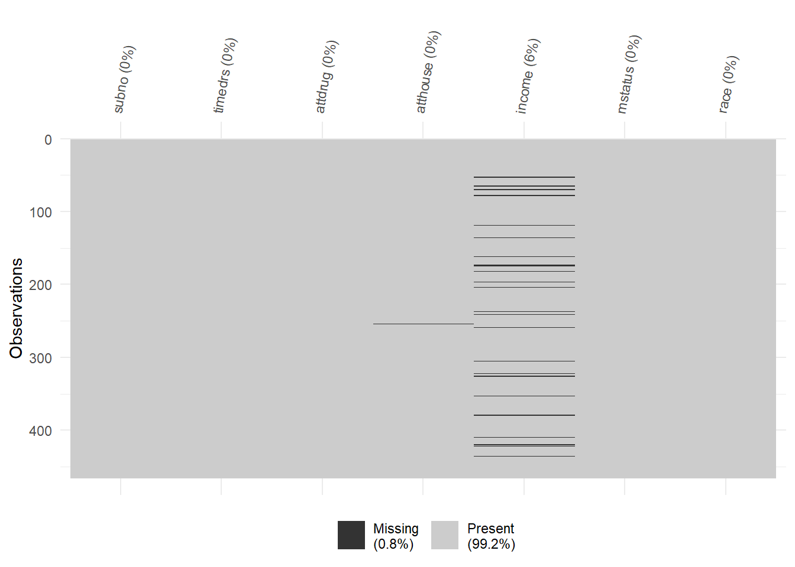
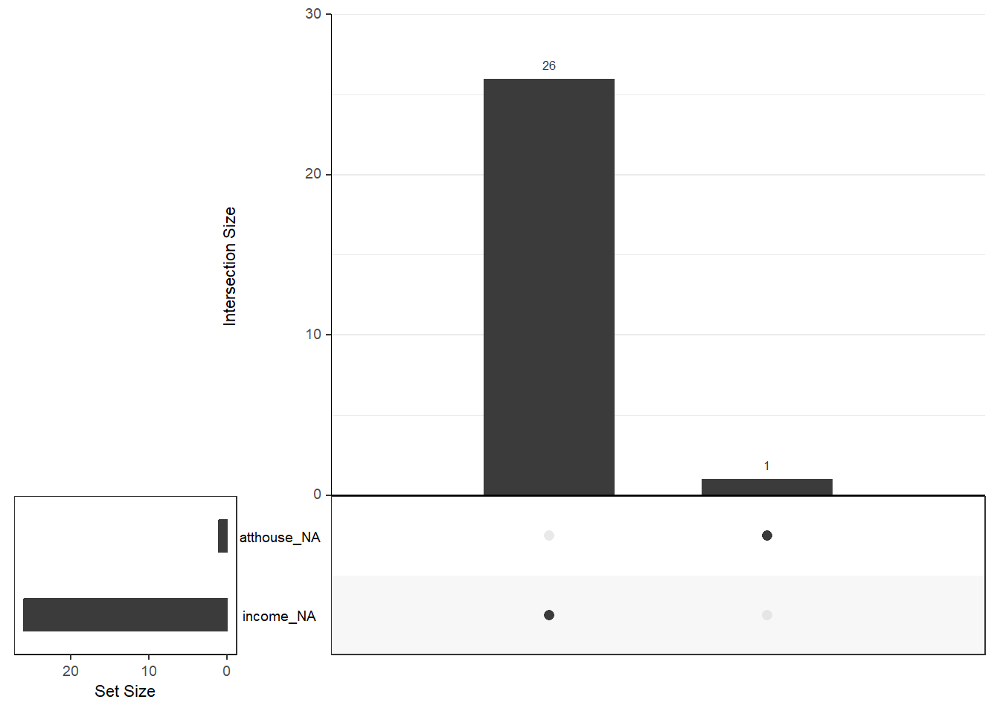
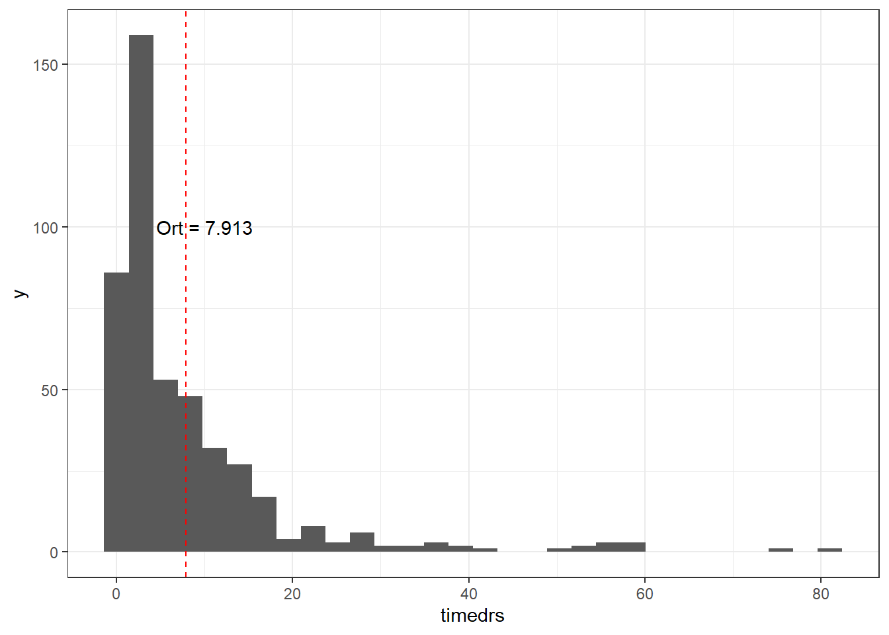
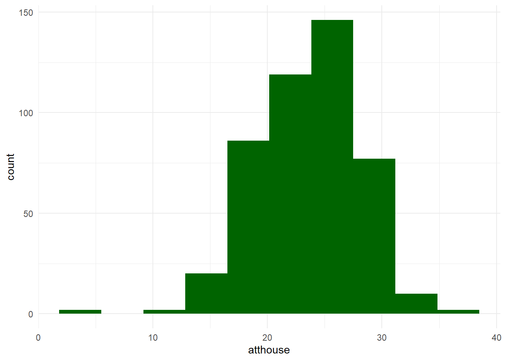
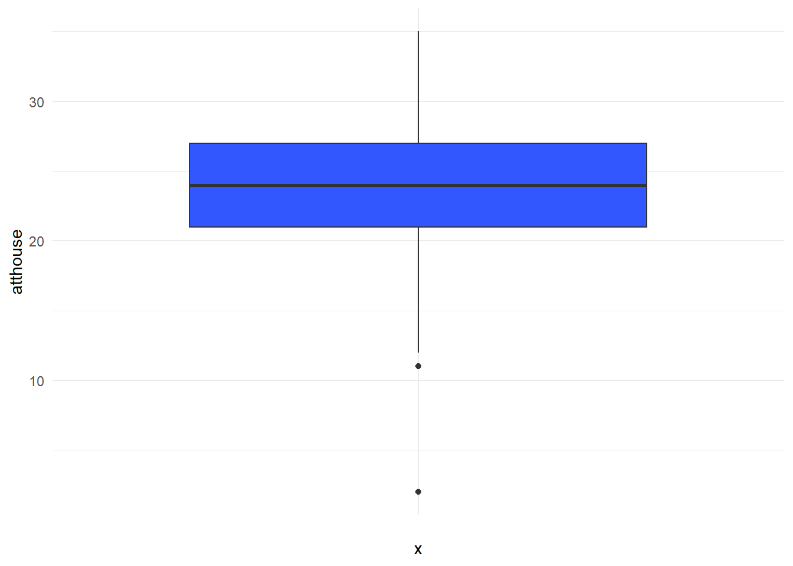
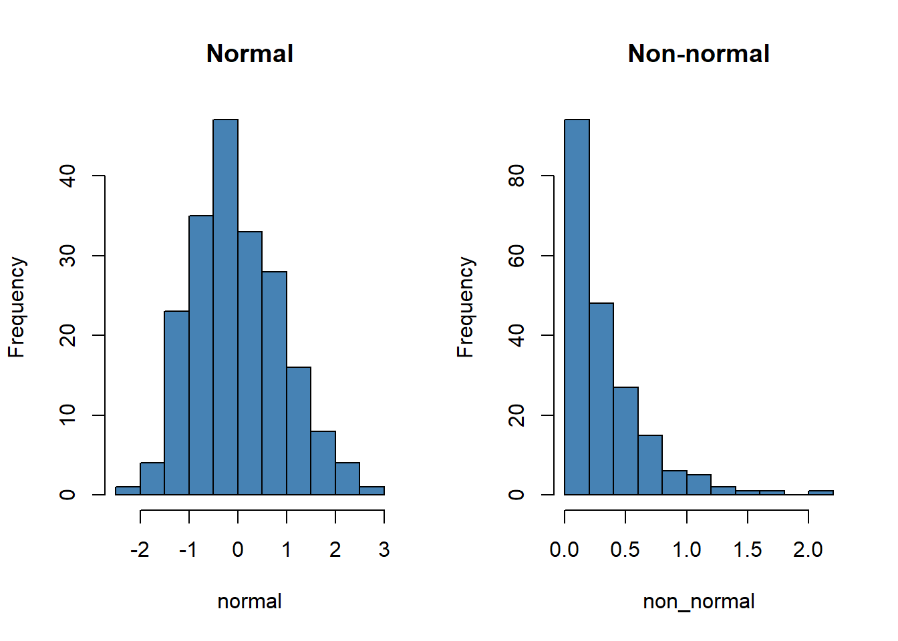
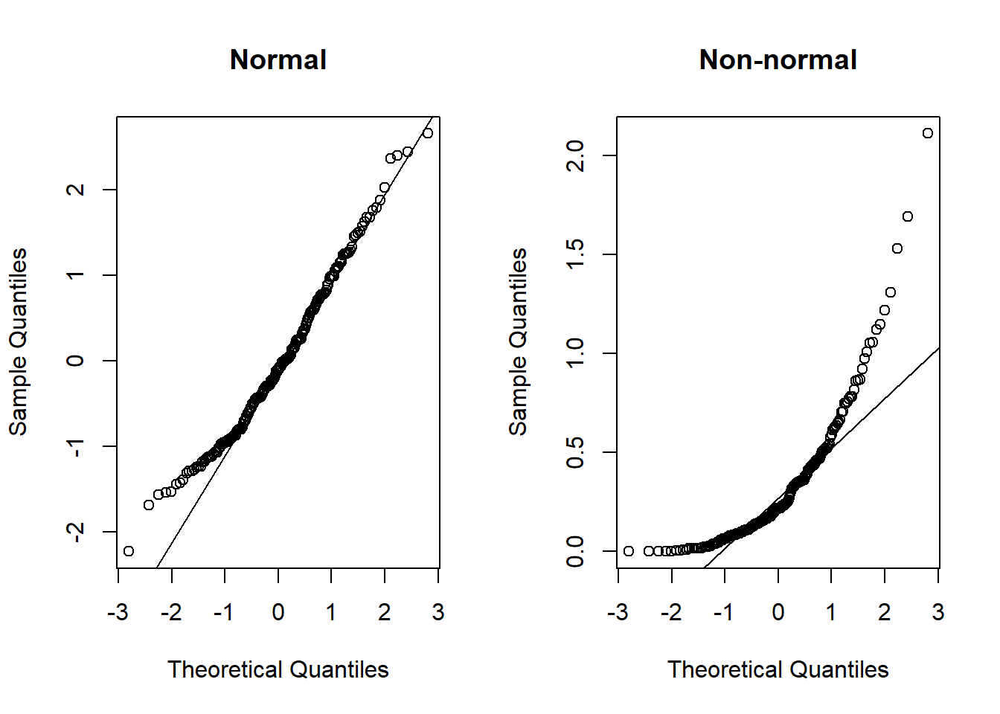
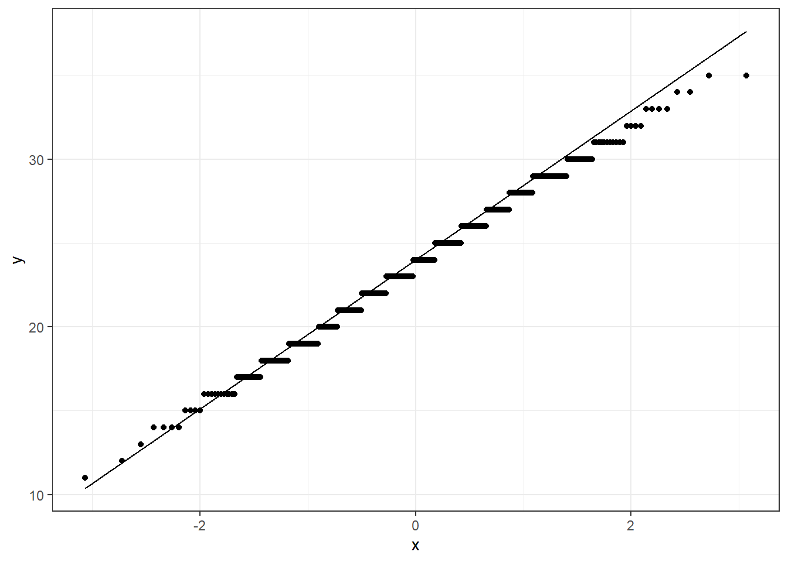
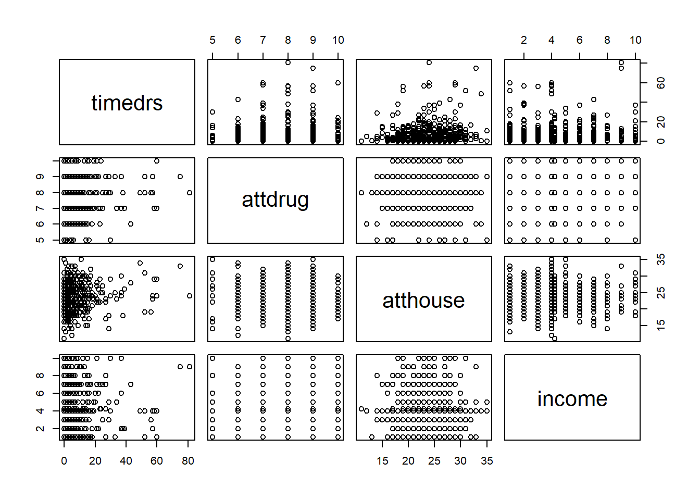
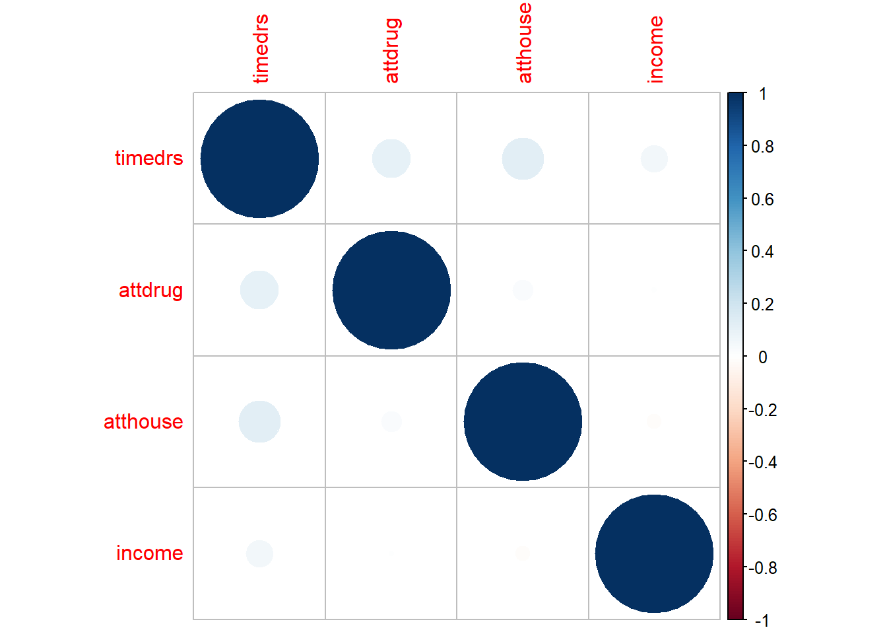

::: small_right

:::


# Ders Hakkında {.unnumbered}

Bu dersin amacı, R yazılımını kullanarak veri üzerinde istenilen çok değişkenli istatistiksel ve psikometrik işlemlerin yapılabilmesini sağlamaktır.

Tez ve makale çalışmalarında öğrencilerimizin analizlerini R yazılımı ile hiçbir paket programa ihtiyaç duymadan kendi başlarına yapmalarını sağlamaktır.

Ders İçeriği: 

- Çok değişkenli İstatistik Varsayımları  
- Çoklu Regresyon  
- Yol Analizi
- Açımlayıcı Faktör Analizi  
- Doğrulayıcı Faktör Analizi  
- Progralamaya Giriş  
- Klasik Test Kuramı  
- Madde Tepki Kuramı  
- Veri Üretimi  

## Eğitmen {.unnumbered}

`<svg aria-hidden="true" role="img" viewBox="0 0 448 512" style="height:1em;width:0.88em;vertical-align:-0.125em;margin-left:auto;margin-right:auto;font-size:inherit;fill:black;overflow:visible;position:relative;"><path d="M224 256A128 128 0 1 1 224 0a128 128 0 1 1 0 256zM209.1 359.2l-18.6-31c-6.4-10.7 1.3-24.2 13.7-24.2H224h19.7c12.4 0 20.1 13.6 13.7 24.2l-18.6 31 33.4 123.9 36-146.9c2-8.1 9.8-13.4 17.9-11.3c70.1 17.6 121.9 81 121.9 156.4c0 17-13.8 30.7-30.7 30.7H285.5c-2.1 0-4-.4-5.8-1.1l.3 1.1H168l.3-1.1c-1.8 .7-3.8 1.1-5.8 1.1H30.7C13.8 512 0 498.2 0 481.3c0-75.5 51.9-138.9 121.9-156.4c8.1-2 15.9 3.3 17.9 11.3l36 146.9 33.4-123.9z"/></svg>`{=html} [Dr. Kübra Atalay Kabasakal](https://avesis.hacettepe.edu.tr/katalay)

`<svg aria-hidden="true" role="img" viewBox="0 0 512 512" style="height:1em;width:1em;vertical-align:-0.125em;margin-left:auto;margin-right:auto;font-size:inherit;fill:black;overflow:visible;position:relative;"><path d="M64 112c-8.8 0-16 7.2-16 16v22.1L220.5 291.7c20.7 17 50.4 17 71.1 0L464 150.1V128c0-8.8-7.2-16-16-16H64zM48 212.2V384c0 8.8 7.2 16 16 16H448c8.8 0 16-7.2 16-16V212.2L322 328.8c-38.4 31.5-93.7 31.5-132 0L48 212.2zM0 128C0 92.7 28.7 64 64 64H448c35.3 0 64 28.7 64 64V384c0 35.3-28.7 64-64 64H64c-35.3 0-64-28.7-64-64V128z"/></svg>`{=html} [kkatalay\@gmail.com](mailto:kkatalay@gmail.com){.email}

`<svg aria-hidden="true" role="img" viewBox="0 0 512 512" style="height:1em;width:1em;vertical-align:-0.125em;margin-left:auto;margin-right:auto;font-size:inherit;fill:black;overflow:visible;position:relative;"><path d="M64 112c-8.8 0-16 7.2-16 16v22.1L220.5 291.7c20.7 17 50.4 17 71.1 0L464 150.1V128c0-8.8-7.2-16-16-16H64zM48 212.2V384c0 8.8 7.2 16 16 16H448c8.8 0 16-7.2 16-16V212.2L322 328.8c-38.4 31.5-93.7 31.5-132 0L48 212.2zM0 128C0 92.7 28.7 64 64 64H448c35.3 0 64 28.7 64 64V384c0 35.3-28.7 64-64 64H64c-35.3 0-64-28.7-64-64V128z"/></svg>`{=html} [katalay\@hacettepe.edu.tr](mailto:katalay@hacettepe.edu.tr){.email}

## Kitaplar {.unnumbered}

-   Atar, B., Atalay Kabasakal, K, Unsal Ozberk, E. B., Ozberk, E. H. & Kibrislioglu Uysal, N. (2020). R ile Veri Analizi ve Psikometri Uygulamaları, Pegem Akademi, Ankara.🔗 [📖](https://pegem.net/urun/R-ile-Veri-Analizi-ve-Psikometri-Uygulamalari/60801)


-   Desjardins, C. D., & Bulut, O. (2018). Handbook of educational measurement and psychometrics using R. Boca Raton, FL: CRC Press. 🔗[📖](https://www.routledge.com/Handbook-of-Educational-Measurement-and-Psychometrics-Using-R/Desjardins-Bulut/p/book/9780367734671)

- Demir, E. R Diliyle İstatistik Uygulamaları. Pegem Akademi, Ankara.(2021). 🔗[📖](https://pegem.net/urun/R-Diliyle-Istatistik-Uygulamalari/61912)

- Kline,R. B. (2019). Yapısal Eşitlik Modellemesinin İlkeleri ve Uygulaması(4. Baskı). (S. Şen, Çev.) Ankara: Nobel Yayınevi.

- Şen, S. (2020). Mplus ile Yapısal Eşitlik Modellemesi Uygulamaları (2020).Nobel Yayınevi.

- Tabachnick, B. G., & Fidell, L. S. (2012). Using Multivariate Statistics (4rd ed.). New York: Harper Collins.


- Wolf, E. J., Harrington, K. M., Clark, S. L., & Miller, M. W. (2013). Sample Size Requirements for Structural Equation Models: An Evaluation of Power, Bias, and Solution Propriety. Educational and Psychological Measurement, 73(6), 913–934. https://doi.org/10.1177/0013164413495237

<!--chapter:end:index.Rmd-->


# Varsayımlar I

-   Veri Dosyasındaki Verinin Doğruluğu

-   Kayıp Verinin Miktarı ve Dağılımı

-   Tek Değişkenli ve Çok Değişkenli Uç Değerler (Outliers)

-   Sayıltılar

-   Çoklu Bağlantı (Multicollinearity) ve Tekillik (Singularity)

## Veri İnceleme

-   Varsayımlar incelenirken ilk olarak yanlış girilmiş bir değer olup
    olmadığına bakılmalıdır.

-   Bu bölümde 🔗 [SCREEN.SAV](import/SCREEN.SAV) adlı
    veri seti kullanılmıştır. Bu veri setinde 20-59 yaşları arasında 465
    kadının 6 değişkene ilişkin bilgileri bulunmaktadır. Değişkenlerden
    timedrs, attdrug, atthouse ve income değişkenleri sürekli, mstatus
    ve race değişkenleriyse iki kategorili değişkenlerdir. Bu veri seti
    **Tabachnick, B. G., & Fidell, L. S. (2012). Using Multivariate
    Statistics (4rd ed.). New York: Harper Collins.** kitabının 4.
    bölümünde kullanılmaktadır.

-   Veri incelemede birden fazla paket kullanılabilir. En temel
    fonksiyon `base` paketin `summary()` fonksiyonudur. `psych`
    paketinde `describe()` fonksiyonu da aynı amaçla kullanılabilir.


```r
library(haven)
screen <- read_sav("import/SCREEN.sav")
head(screen)
```

<div class="kable-table">

| subno| timedrs| attdrug| atthouse| income| mstatus| race|
|-----:|-------:|-------:|--------:|------:|-------:|----:|
|     1|       1|       8|       27|      5|       2|    1|
|     2|       3|       7|       20|      6|       2|    1|
|     3|       0|       8|       23|      3|       2|    1|
|     4|      13|       9|       28|      8|       2|    1|
|     5|      15|       7|       24|      1|       2|    1|
|     6|       3|       8|       25|      4|       2|    1|

</div>

-   Veri setindeki maksimum ve minumum değerleri belirlenmiştir.


```r
summary(screen)
```

```
##      subno          timedrs          attdrug          atthouse    
##  Min.   :  1.0   Min.   : 0.000   Min.   : 5.000   Min.   : 2.00  
##  1st Qu.:137.0   1st Qu.: 2.000   1st Qu.: 7.000   1st Qu.:21.00  
##  Median :314.0   Median : 4.000   Median : 8.000   Median :24.00  
##  Mean   :317.4   Mean   : 7.901   Mean   : 7.686   Mean   :23.54  
##  3rd Qu.:483.0   3rd Qu.:10.000   3rd Qu.: 9.000   3rd Qu.:27.00  
##  Max.   :758.0   Max.   :81.000   Max.   :10.000   Max.   :35.00  
##                                                    NA's   :1      
##      income         mstatus           race      
##  Min.   : 1.00   Min.   :1.000   Min.   :1.000  
##  1st Qu.: 2.50   1st Qu.:2.000   1st Qu.:1.000  
##  Median : 4.00   Median :2.000   Median :1.000  
##  Mean   : 4.21   Mean   :1.778   Mean   :1.088  
##  3rd Qu.: 6.00   3rd Qu.:2.000   3rd Qu.:1.000  
##  Max.   :10.00   Max.   :2.000   Max.   :2.000  
##  NA's   :26
```

-   Elde edilen değerlerin makul olduğu söylenebilir. Ancak bunu elde
    etmek için başka yollar da bulunmaktadır. `psych` paketi ile
    inceleme daha ayrıntılı yapılabilir.


```r
library(psych)
```

```
## 
## Attaching package: 'psych'
```

```
## The following objects are masked from 'package:ggplot2':
## 
##     %+%, alpha
```

```r
round(describe(screen[,-1]),2)
```

<div class="kable-table">

|         | vars|   n|  mean|    sd| median| trimmed|  mad| min| max| range|  skew| kurtosis|   se|
|:--------|----:|---:|-----:|-----:|------:|-------:|----:|---:|---:|-----:|-----:|--------:|----:|
|timedrs  |    1| 465|  7.90| 10.95|      4|    5.61| 4.45|   0|  81|    81|  3.23|    12.88| 0.51|
|attdrug  |    2| 465|  7.69|  1.16|      8|    7.71| 1.48|   5|  10|     5| -0.12|    -0.47| 0.05|
|atthouse |    3| 464| 23.54|  4.48|     24|   23.62| 4.45|   2|  35|    33| -0.45|     1.51| 0.21|
|income   |    4| 439|  4.21|  2.42|      4|    4.01| 2.97|   1|  10|     9|  0.58|    -0.38| 0.12|
|mstatus  |    5| 465|  1.78|  0.42|      2|    1.85| 0.00|   1|   2|     1| -1.34|    -0.21| 0.02|
|race     |    6| 465|  1.09|  0.28|      1|    1.00| 0.00|   1|   2|     1|  2.90|     6.40| 0.01|

</div>

🔗 [personality-project
sayfasını](https://personality-project.org/r/psych/) daha fazla örnek
için inceleyebilirsiniz.

-   `gtsummary` paketi ile inceleme


```r
library(gtsummary)
```

```
## #BlackLivesMatter
```

```r
screen %>% select(2:6) %>%tbl_summary(statistic = all_continuous() ~ c(
"{min}, {max}"),missing ="always")
```

```{=html}
<div id="ksosqalish" style="padding-left:0px;padding-right:0px;padding-top:10px;padding-bottom:10px;overflow-x:auto;overflow-y:auto;width:auto;height:auto;">
<style>#ksosqalish table {
  font-family: system-ui, 'Segoe UI', Roboto, Helvetica, Arial, sans-serif, 'Apple Color Emoji', 'Segoe UI Emoji', 'Segoe UI Symbol', 'Noto Color Emoji';
  -webkit-font-smoothing: antialiased;
  -moz-osx-font-smoothing: grayscale;
}

#ksosqalish thead, #ksosqalish tbody, #ksosqalish tfoot, #ksosqalish tr, #ksosqalish td, #ksosqalish th {
  border-style: none;
}

#ksosqalish p {
  margin: 0;
  padding: 0;
}

#ksosqalish .gt_table {
  display: table;
  border-collapse: collapse;
  line-height: normal;
  margin-left: auto;
  margin-right: auto;
  color: #333333;
  font-size: 16px;
  font-weight: normal;
  font-style: normal;
  background-color: #FFFFFF;
  width: auto;
  border-top-style: solid;
  border-top-width: 2px;
  border-top-color: #A8A8A8;
  border-right-style: none;
  border-right-width: 2px;
  border-right-color: #D3D3D3;
  border-bottom-style: solid;
  border-bottom-width: 2px;
  border-bottom-color: #A8A8A8;
  border-left-style: none;
  border-left-width: 2px;
  border-left-color: #D3D3D3;
}

#ksosqalish .gt_caption {
  padding-top: 4px;
  padding-bottom: 4px;
}

#ksosqalish .gt_title {
  color: #333333;
  font-size: 125%;
  font-weight: initial;
  padding-top: 4px;
  padding-bottom: 4px;
  padding-left: 5px;
  padding-right: 5px;
  border-bottom-color: #FFFFFF;
  border-bottom-width: 0;
}

#ksosqalish .gt_subtitle {
  color: #333333;
  font-size: 85%;
  font-weight: initial;
  padding-top: 3px;
  padding-bottom: 5px;
  padding-left: 5px;
  padding-right: 5px;
  border-top-color: #FFFFFF;
  border-top-width: 0;
}

#ksosqalish .gt_heading {
  background-color: #FFFFFF;
  text-align: center;
  border-bottom-color: #FFFFFF;
  border-left-style: none;
  border-left-width: 1px;
  border-left-color: #D3D3D3;
  border-right-style: none;
  border-right-width: 1px;
  border-right-color: #D3D3D3;
}

#ksosqalish .gt_bottom_border {
  border-bottom-style: solid;
  border-bottom-width: 2px;
  border-bottom-color: #D3D3D3;
}

#ksosqalish .gt_col_headings {
  border-top-style: solid;
  border-top-width: 2px;
  border-top-color: #D3D3D3;
  border-bottom-style: solid;
  border-bottom-width: 2px;
  border-bottom-color: #D3D3D3;
  border-left-style: none;
  border-left-width: 1px;
  border-left-color: #D3D3D3;
  border-right-style: none;
  border-right-width: 1px;
  border-right-color: #D3D3D3;
}

#ksosqalish .gt_col_heading {
  color: #333333;
  background-color: #FFFFFF;
  font-size: 100%;
  font-weight: normal;
  text-transform: inherit;
  border-left-style: none;
  border-left-width: 1px;
  border-left-color: #D3D3D3;
  border-right-style: none;
  border-right-width: 1px;
  border-right-color: #D3D3D3;
  vertical-align: bottom;
  padding-top: 5px;
  padding-bottom: 6px;
  padding-left: 5px;
  padding-right: 5px;
  overflow-x: hidden;
}

#ksosqalish .gt_column_spanner_outer {
  color: #333333;
  background-color: #FFFFFF;
  font-size: 100%;
  font-weight: normal;
  text-transform: inherit;
  padding-top: 0;
  padding-bottom: 0;
  padding-left: 4px;
  padding-right: 4px;
}

#ksosqalish .gt_column_spanner_outer:first-child {
  padding-left: 0;
}

#ksosqalish .gt_column_spanner_outer:last-child {
  padding-right: 0;
}

#ksosqalish .gt_column_spanner {
  border-bottom-style: solid;
  border-bottom-width: 2px;
  border-bottom-color: #D3D3D3;
  vertical-align: bottom;
  padding-top: 5px;
  padding-bottom: 5px;
  overflow-x: hidden;
  display: inline-block;
  width: 100%;
}

#ksosqalish .gt_spanner_row {
  border-bottom-style: hidden;
}

#ksosqalish .gt_group_heading {
  padding-top: 8px;
  padding-bottom: 8px;
  padding-left: 5px;
  padding-right: 5px;
  color: #333333;
  background-color: #FFFFFF;
  font-size: 100%;
  font-weight: initial;
  text-transform: inherit;
  border-top-style: solid;
  border-top-width: 2px;
  border-top-color: #D3D3D3;
  border-bottom-style: solid;
  border-bottom-width: 2px;
  border-bottom-color: #D3D3D3;
  border-left-style: none;
  border-left-width: 1px;
  border-left-color: #D3D3D3;
  border-right-style: none;
  border-right-width: 1px;
  border-right-color: #D3D3D3;
  vertical-align: middle;
  text-align: left;
}

#ksosqalish .gt_empty_group_heading {
  padding: 0.5px;
  color: #333333;
  background-color: #FFFFFF;
  font-size: 100%;
  font-weight: initial;
  border-top-style: solid;
  border-top-width: 2px;
  border-top-color: #D3D3D3;
  border-bottom-style: solid;
  border-bottom-width: 2px;
  border-bottom-color: #D3D3D3;
  vertical-align: middle;
}

#ksosqalish .gt_from_md > :first-child {
  margin-top: 0;
}

#ksosqalish .gt_from_md > :last-child {
  margin-bottom: 0;
}

#ksosqalish .gt_row {
  padding-top: 8px;
  padding-bottom: 8px;
  padding-left: 5px;
  padding-right: 5px;
  margin: 10px;
  border-top-style: solid;
  border-top-width: 1px;
  border-top-color: #D3D3D3;
  border-left-style: none;
  border-left-width: 1px;
  border-left-color: #D3D3D3;
  border-right-style: none;
  border-right-width: 1px;
  border-right-color: #D3D3D3;
  vertical-align: middle;
  overflow-x: hidden;
}

#ksosqalish .gt_stub {
  color: #333333;
  background-color: #FFFFFF;
  font-size: 100%;
  font-weight: initial;
  text-transform: inherit;
  border-right-style: solid;
  border-right-width: 2px;
  border-right-color: #D3D3D3;
  padding-left: 5px;
  padding-right: 5px;
}

#ksosqalish .gt_stub_row_group {
  color: #333333;
  background-color: #FFFFFF;
  font-size: 100%;
  font-weight: initial;
  text-transform: inherit;
  border-right-style: solid;
  border-right-width: 2px;
  border-right-color: #D3D3D3;
  padding-left: 5px;
  padding-right: 5px;
  vertical-align: top;
}

#ksosqalish .gt_row_group_first td {
  border-top-width: 2px;
}

#ksosqalish .gt_row_group_first th {
  border-top-width: 2px;
}

#ksosqalish .gt_summary_row {
  color: #333333;
  background-color: #FFFFFF;
  text-transform: inherit;
  padding-top: 8px;
  padding-bottom: 8px;
  padding-left: 5px;
  padding-right: 5px;
}

#ksosqalish .gt_first_summary_row {
  border-top-style: solid;
  border-top-color: #D3D3D3;
}

#ksosqalish .gt_first_summary_row.thick {
  border-top-width: 2px;
}

#ksosqalish .gt_last_summary_row {
  padding-top: 8px;
  padding-bottom: 8px;
  padding-left: 5px;
  padding-right: 5px;
  border-bottom-style: solid;
  border-bottom-width: 2px;
  border-bottom-color: #D3D3D3;
}

#ksosqalish .gt_grand_summary_row {
  color: #333333;
  background-color: #FFFFFF;
  text-transform: inherit;
  padding-top: 8px;
  padding-bottom: 8px;
  padding-left: 5px;
  padding-right: 5px;
}

#ksosqalish .gt_first_grand_summary_row {
  padding-top: 8px;
  padding-bottom: 8px;
  padding-left: 5px;
  padding-right: 5px;
  border-top-style: double;
  border-top-width: 6px;
  border-top-color: #D3D3D3;
}

#ksosqalish .gt_last_grand_summary_row_top {
  padding-top: 8px;
  padding-bottom: 8px;
  padding-left: 5px;
  padding-right: 5px;
  border-bottom-style: double;
  border-bottom-width: 6px;
  border-bottom-color: #D3D3D3;
}

#ksosqalish .gt_striped {
  background-color: rgba(128, 128, 128, 0.05);
}

#ksosqalish .gt_table_body {
  border-top-style: solid;
  border-top-width: 2px;
  border-top-color: #D3D3D3;
  border-bottom-style: solid;
  border-bottom-width: 2px;
  border-bottom-color: #D3D3D3;
}

#ksosqalish .gt_footnotes {
  color: #333333;
  background-color: #FFFFFF;
  border-bottom-style: none;
  border-bottom-width: 2px;
  border-bottom-color: #D3D3D3;
  border-left-style: none;
  border-left-width: 2px;
  border-left-color: #D3D3D3;
  border-right-style: none;
  border-right-width: 2px;
  border-right-color: #D3D3D3;
}

#ksosqalish .gt_footnote {
  margin: 0px;
  font-size: 90%;
  padding-top: 4px;
  padding-bottom: 4px;
  padding-left: 5px;
  padding-right: 5px;
}

#ksosqalish .gt_sourcenotes {
  color: #333333;
  background-color: #FFFFFF;
  border-bottom-style: none;
  border-bottom-width: 2px;
  border-bottom-color: #D3D3D3;
  border-left-style: none;
  border-left-width: 2px;
  border-left-color: #D3D3D3;
  border-right-style: none;
  border-right-width: 2px;
  border-right-color: #D3D3D3;
}

#ksosqalish .gt_sourcenote {
  font-size: 90%;
  padding-top: 4px;
  padding-bottom: 4px;
  padding-left: 5px;
  padding-right: 5px;
}

#ksosqalish .gt_left {
  text-align: left;
}

#ksosqalish .gt_center {
  text-align: center;
}

#ksosqalish .gt_right {
  text-align: right;
  font-variant-numeric: tabular-nums;
}

#ksosqalish .gt_font_normal {
  font-weight: normal;
}

#ksosqalish .gt_font_bold {
  font-weight: bold;
}

#ksosqalish .gt_font_italic {
  font-style: italic;
}

#ksosqalish .gt_super {
  font-size: 65%;
}

#ksosqalish .gt_footnote_marks {
  font-size: 75%;
  vertical-align: 0.4em;
  position: initial;
}

#ksosqalish .gt_asterisk {
  font-size: 100%;
  vertical-align: 0;
}

#ksosqalish .gt_indent_1 {
  text-indent: 5px;
}

#ksosqalish .gt_indent_2 {
  text-indent: 10px;
}

#ksosqalish .gt_indent_3 {
  text-indent: 15px;
}

#ksosqalish .gt_indent_4 {
  text-indent: 20px;
}

#ksosqalish .gt_indent_5 {
  text-indent: 25px;
}
</style>
<table class="gt_table" data-quarto-disable-processing="false" data-quarto-bootstrap="false">
  <thead>
    <tr class="gt_col_headings">
      <th class="gt_col_heading gt_columns_bottom_border gt_left" rowspan="1" colspan="1" scope="col" id="&lt;strong&gt;Characteristic&lt;/strong&gt;"><strong>Characteristic</strong></th>
      <th class="gt_col_heading gt_columns_bottom_border gt_center" rowspan="1" colspan="1" scope="col" id="&lt;strong&gt;N = 465&lt;/strong&gt;&lt;span class=&quot;gt_footnote_marks&quot; style=&quot;white-space:nowrap;font-style:italic;font-weight:normal;&quot;&gt;&lt;sup&gt;1&lt;/sup&gt;&lt;/span&gt;"><strong>N = 465</strong><span class="gt_footnote_marks" style="white-space:nowrap;font-style:italic;font-weight:normal;"><sup>1</sup></span></th>
    </tr>
  </thead>
  <tbody class="gt_table_body">
    <tr><td headers="label" class="gt_row gt_left">Visits to health professionals</td>
<td headers="stat_0" class="gt_row gt_center">0, 81</td></tr>
    <tr><td headers="label" class="gt_row gt_left">    Unknown</td>
<td headers="stat_0" class="gt_row gt_center">0</td></tr>
    <tr><td headers="label" class="gt_row gt_left">Attitudes toward medication</td>
<td headers="stat_0" class="gt_row gt_center"><br /></td></tr>
    <tr><td headers="label" class="gt_row gt_left">    5</td>
<td headers="stat_0" class="gt_row gt_center">13 (2.8%)</td></tr>
    <tr><td headers="label" class="gt_row gt_left">    6</td>
<td headers="stat_0" class="gt_row gt_center">60 (13%)</td></tr>
    <tr><td headers="label" class="gt_row gt_left">    7</td>
<td headers="stat_0" class="gt_row gt_center">126 (27%)</td></tr>
    <tr><td headers="label" class="gt_row gt_left">    8</td>
<td headers="stat_0" class="gt_row gt_center">149 (32%)</td></tr>
    <tr><td headers="label" class="gt_row gt_left">    9</td>
<td headers="stat_0" class="gt_row gt_center">95 (20%)</td></tr>
    <tr><td headers="label" class="gt_row gt_left">    10</td>
<td headers="stat_0" class="gt_row gt_center">22 (4.7%)</td></tr>
    <tr><td headers="label" class="gt_row gt_left">    Unknown</td>
<td headers="stat_0" class="gt_row gt_center">0</td></tr>
    <tr><td headers="label" class="gt_row gt_left">Attitudes toward housework</td>
<td headers="stat_0" class="gt_row gt_center">2.0, 35.0</td></tr>
    <tr><td headers="label" class="gt_row gt_left">    Unknown</td>
<td headers="stat_0" class="gt_row gt_center">1</td></tr>
    <tr><td headers="label" class="gt_row gt_left">Income</td>
<td headers="stat_0" class="gt_row gt_center">1.00, 10.00</td></tr>
    <tr><td headers="label" class="gt_row gt_left">    Unknown</td>
<td headers="stat_0" class="gt_row gt_center">26</td></tr>
    <tr><td headers="label" class="gt_row gt_left">Whether currently married</td>
<td headers="stat_0" class="gt_row gt_center"><br /></td></tr>
    <tr><td headers="label" class="gt_row gt_left">    1</td>
<td headers="stat_0" class="gt_row gt_center">103 (22%)</td></tr>
    <tr><td headers="label" class="gt_row gt_left">    2</td>
<td headers="stat_0" class="gt_row gt_center">362 (78%)</td></tr>
    <tr><td headers="label" class="gt_row gt_left">    Unknown</td>
<td headers="stat_0" class="gt_row gt_center">0</td></tr>
  </tbody>
  
  <tfoot class="gt_footnotes">
    <tr>
      <td class="gt_footnote" colspan="2"><span class="gt_footnote_marks" style="white-space:nowrap;font-style:italic;font-weight:normal;"><sup>1</sup></span> Range; n (%)</td>
    </tr>
  </tfoot>
</table>
</div>
```

-   🔗[Presentation-Ready Summary Tables] with
    gtsummary(<https://education.rstudio.com/blog/2020/07/gtsummary>)

-   `vtable` paketi ile inceleme


```r
library(vtable)
sumtable(screen, summ=c('notNA(x)','min(x)','max(x)'))
```

<table class="table" style="margin-left: auto; margin-right: auto;">
<caption>(\#tab:unnamed-chunk-5)Summary Statistics</caption>
 <thead>
  <tr>
   <th style="text-align:left;"> Variable </th>
   <th style="text-align:left;"> NotNA </th>
   <th style="text-align:left;"> Min </th>
   <th style="text-align:left;"> Max </th>
  </tr>
 </thead>
<tbody>
  <tr>
   <td style="text-align:left;"> subno </td>
   <td style="text-align:left;"> 465 </td>
   <td style="text-align:left;"> 1 </td>
   <td style="text-align:left;"> 758 </td>
  </tr>
  <tr>
   <td style="text-align:left;"> timedrs </td>
   <td style="text-align:left;"> 465 </td>
   <td style="text-align:left;"> 0 </td>
   <td style="text-align:left;"> 81 </td>
  </tr>
  <tr>
   <td style="text-align:left;"> attdrug </td>
   <td style="text-align:left;"> 465 </td>
   <td style="text-align:left;"> 5 </td>
   <td style="text-align:left;"> 10 </td>
  </tr>
  <tr>
   <td style="text-align:left;"> atthouse </td>
   <td style="text-align:left;"> 464 </td>
   <td style="text-align:left;"> 2 </td>
   <td style="text-align:left;"> 35 </td>
  </tr>
  <tr>
   <td style="text-align:left;"> income </td>
   <td style="text-align:left;"> 439 </td>
   <td style="text-align:left;"> 1 </td>
   <td style="text-align:left;"> 10 </td>
  </tr>
  <tr>
   <td style="text-align:left;"> mstatus </td>
   <td style="text-align:left;"> 465 </td>
   <td style="text-align:left;"> 1 </td>
   <td style="text-align:left;"> 2 </td>
  </tr>
  <tr>
   <td style="text-align:left;"> race </td>
   <td style="text-align:left;"> 465 </td>
   <td style="text-align:left;"> 1 </td>
   <td style="text-align:left;"> 2 </td>
  </tr>
</tbody>
</table>

-   🔗 [vtable paketi için
    örnekler](https://nickch-k.github.io/vtable/index.html)

-   sütun isimleri aşağıdaki gibi değiştirilebilir.


```r
sumtable(screen, summ = c('notNA(x)','min(x)','max(x)'),
         summ.names = c('Frekans'
,'Minimum','Maksimum'))
```

<table class="table" style="margin-left: auto; margin-right: auto;">
<caption>(\#tab:unnamed-chunk-6)Summary Statistics</caption>
 <thead>
  <tr>
   <th style="text-align:left;"> Variable </th>
   <th style="text-align:left;"> Frekans </th>
   <th style="text-align:left;"> Minimum </th>
   <th style="text-align:left;"> Maksimum </th>
  </tr>
 </thead>
<tbody>
  <tr>
   <td style="text-align:left;"> subno </td>
   <td style="text-align:left;"> 465 </td>
   <td style="text-align:left;"> 1 </td>
   <td style="text-align:left;"> 758 </td>
  </tr>
  <tr>
   <td style="text-align:left;"> timedrs </td>
   <td style="text-align:left;"> 465 </td>
   <td style="text-align:left;"> 0 </td>
   <td style="text-align:left;"> 81 </td>
  </tr>
  <tr>
   <td style="text-align:left;"> attdrug </td>
   <td style="text-align:left;"> 465 </td>
   <td style="text-align:left;"> 5 </td>
   <td style="text-align:left;"> 10 </td>
  </tr>
  <tr>
   <td style="text-align:left;"> atthouse </td>
   <td style="text-align:left;"> 464 </td>
   <td style="text-align:left;"> 2 </td>
   <td style="text-align:left;"> 35 </td>
  </tr>
  <tr>
   <td style="text-align:left;"> income </td>
   <td style="text-align:left;"> 439 </td>
   <td style="text-align:left;"> 1 </td>
   <td style="text-align:left;"> 10 </td>
  </tr>
  <tr>
   <td style="text-align:left;"> mstatus </td>
   <td style="text-align:left;"> 465 </td>
   <td style="text-align:left;"> 1 </td>
   <td style="text-align:left;"> 2 </td>
  </tr>
  <tr>
   <td style="text-align:left;"> race </td>
   <td style="text-align:left;"> 465 </td>
   <td style="text-align:left;"> 1 </td>
   <td style="text-align:left;"> 2 </td>
  </tr>
</tbody>
</table>

-   `kable` paketi ile `psych` paketi çıktılarını düzenleme


```r
ozet <- describe(screen[,-1])
kable(ozet,format='markdown',
      caption="Betimsel İstatistikler",digits=2)
```


Table: (\#tab:unnamed-chunk-7)Betimsel İstatistikler

|         | vars|   n|  mean|    sd| median| trimmed|  mad| min| max| range|  skew| kurtosis|   se|
|:--------|----:|---:|-----:|-----:|------:|-------:|----:|---:|---:|-----:|-----:|--------:|----:|
|timedrs  |    1| 465|  7.90| 10.95|      4|    5.61| 4.45|   0|  81|    81|  3.23|    12.88| 0.51|
|attdrug  |    2| 465|  7.69|  1.16|      8|    7.71| 1.48|   5|  10|     5| -0.12|    -0.47| 0.05|
|atthouse |    3| 464| 23.54|  4.48|     24|   23.62| 4.45|   2|  35|    33| -0.45|     1.51| 0.21|
|income   |    4| 439|  4.21|  2.42|      4|    4.01| 2.97|   1|  10|     9|  0.58|    -0.38| 0.12|
|mstatus  |    5| 465|  1.78|  0.42|      2|    1.85| 0.00|   1|   2|     1| -1.34|    -0.21| 0.02|
|race     |    6| 465|  1.09|  0.28|      1|    1.00| 0.00|   1|   2|     1|  2.90|     6.40| 0.01|

-   🔗
    [rmarkdown-cookbook](https://bookdown.org/yihui/rmarkdown-cookbook/kable.html)

## Kayıp Değerler

-   Kayıp veri, veri analizindeki en yaygın problemlerden biridir.

-   Kayıp verinin önemi kayıp verinin miktarına, örüntüsüne ve neden
    eksik olduğuna bağlıdır.

-   Bir değişkene ait beklenmeyen miktarda kayıp veri varsa, ilk olarak
    bunun nedeni araştırılmalıdır. Daha sonra kayıp verinin örüntüsüne
    bakılarak, rastlantısal mı yoksa sistematik bir örüntü mü gösterdiği
    belirlenmelidir.

    -   Örneğin, 30 yaşın üstündeki birçok kadın yaş ile ilgili soruyu
        cevaplamak istemezler.

-   Genellikle kayıp verinin örüntüsü miktarından daha önemlidir.
    Rastlantısal dağılmayan kayıp veriler sonuçların
    genellenebilirliğini etkileyeceğinden miktarları az da olsa,
    rastlantısal dağılan kayıp verilere oranla daha ciddi problemlere
    yol açarlar.

### Kayıp Veri Türleri

-   Kayıp veri türleri arasındaki ayrım 1976 yılında Rubin tarafından
    yapılmıştır. Rubin (1976) kayıp veriyi aşağıdaki şekilde
    sınıflandırmıştır.

    -   Tamamen Rastgele Olarak Kayıp (TRK) - Missing Completely at
        Random MCAR

    -   Rastgele Kayıp (RK) - Missing at Random (MAR)

    -   Rastgele Olmayan Kayıp / İhmal Edilemez Kayıp (ROK) - Not
        Missing at Random (NMAR)

-   Kayıp veri en azından MAR türünde değilse, kayıp verinin ihmal
    edilemeyeceği söylenir. Bu türdeki kayıp veri rastlantısal olamyan
    kayıp veya ihmal edilemez kayıp olarak adlandırılır.

-   Büyük bir veri setinde, verinin %5’i veya daha azı rastlantısal
    olarak kayıpsa çok ciddi problemlerle karşılaşılmaz ve kayıp veri
    ile ilgili problemleri çözmek için kullanılan herhangi bir yöntem
    benzer sonuçlar verir. Halbuki küçük veya orta büyüklükteki bir veri
    setinde çok sayıda veri kaybı varsa ciddi problemler ortaya
    çıkabilir.

-   Eldeki bilgiden yararlanarak kayıp verideki örüntüler test
    edilebilir.

### TRK

-   Bir Y değişkeninde kayıp veri bulunma olasılığının, Y değişkeninin
    kendi değerleriyle ve veri setindeki diğer değişkenlerin
    değerleriyle **ilişkisiz olması durumunda Y değişkenindeki verinin
    tamamen rastgele kayıp (TRK) olduğu söylenir (Allison, 2002).**

-   Örneğin; bir ilkokulda okuma başarısı üzerine yürütülen bir
    boylamsal araştırmada çocuklar hastalık ya da ailede ölüm gibi
    tesadüfi bir sebepten değerlendirmeye katılmadığında veri TRK olarak
    adlandırılır. Ayrıca bu faktörlerin sosyoekonomik düzey gibi ölçülen
    diğer değişkenle ilişkisi olmadığı varsayıldığında, araştırmacı
    tarafından elde edilen veriler hipotetik bir tam veri setinin
    rastgele bir örneklemini temsil eder (Peugh ve Enders, 2004).

### Rastgele kayıp (RK)

-   Bir Y değişkenindeki kayıp veri bulunma olasılığının, analiz
    modelindeki diğer değişkenlerin bazılarıyla ilişkili olduğunu ancak
    Y değişkeninin kendi değerleriyle ilişkili olmadığını ifade eder.

-   Örneğin, kanser hastalarıyla yaşam kalitesi üzerine çalışma yapan
    bir psikologun yaşlı ve eğitim düzeyi düşük hastaların yaşam
    kalitesi anketini reddetme eğiliminin daha yüksek olduğu sonucuna
    ulaştığını düşünelim. Bu durumda kayıp veriye eğilimin, kayıp veri
    bulunan değişkenle arasında artık ilişki yoksa verinin RK olduğu
    söylenir. Başka bir ifadeyle, RK yaş ve eğitim kontrol edildiğinde
    kayıp veri olasılığının yaşam kalitesiyle arasında ilişki olmaması
    durumudur (Enders, 2010). Kayıp veri olasılığı yalnızca diğer
    gözlenen değişkenlerin değerlerine bağlı olduğunda veri RK’dır
    (Robitzsch ve Rupp, 2009).

-   RK türünde veri gerçekte rastlantısal olarak kayıp değildir, veri
    kaybı veri setindeki değişkenlerden bazılarına bağlıdır.
    Rastlantısal olarak kayıp değerler ve gözlenen değerler arasında
    sistematik farklılıkların olabileceği ancak bu farklılıkların diğer
    gözlenen değişkenlerle tamamen açıklanabileceği anlamındadır.

-   Bir değişkenin gözlemleri rastlantısal olarak kayıpsa, şartlı
    değişkenler kontrol edilebilirse , rastlantısal küme elde
    edilebilir; kayıp ve gözlenen değerler kontrol altına alınan
    gruplarda benzer dağılımlara sahip olacaklardır.

-   Örneğin, kayıp verinin bulunduğu değişkene göre eksik değerlere
    sahip bireyler ve tam değerlere sahip bireylerden iki grup
    oluşturulabilir. Sonra analizde bu değişkenle ilgili olabilecek
    diğer değişkenlerde t testi ile iki grup arasındaki ortalama
    farklara bakılabilir.

### Rastgele Olmayan Kayıp

-   Rastgele olmayan kayıp (ROK), bir Y değişkenindeki kayıp veri
    bulunma olasılığının diğer değişkenler kontrol edildiğinde bile Y
    değişkeninin değerleriyle ilişkili olması durumunda meydana gelir.
    Örneğin, okuma becerileri zayıf olan öğrencilerin okuma testinde
    anlama güçlüğü çekerek soruları atlaması kaçınılmaz olacaktır. Bu
    durumda okuma değerlendirmesi okuma başarısıyla doğrudan ilişkilidir
    (Enders, 2010; Peugh ve Enders, 2004).

## Kayıp Veri Atama Yöntemleri

-   Kayıp veriyle baş etme yöntemleri

    -   veri silmeye dayalı yöntemler (liste bazında - çiftler bazında)

    -   Veri atamaya dayalı yöntemler
    -    Model tabanlı yöntemler

-   Veri silmeye dayalı yöntemler TRK veri mekanizmasını
    gerektirmektedir ve bu varsayım sağlanmadığında yanlış parametre
    kestirimleri verebilir. MCAR varsayımı sağlandığında bile verinin
    silinmesi analizin gücünün düşmesine neden olabilmektedir (Enders,
    2010).

### Veri Silmeye Dayalı Yöntemler

| Gözlem | Y1  | Y2  | Y3  |
|--------|-----|-----|-----|
| 1      | 13  | 23  | 21  |
| 2      | 14  | 22  | 17  |
| 3      | 15  | \-  | 11  |
| 4      | 16  | 18  | \-  |
| 5      | 17  | 17  | 12  |
| 6      | \-  | 20  | 8   |
| 7      | \-  | 20  | 15  |

-   Liste bazında veri silme yöntemi uygulandığında veri kümesinde
    sadece birinci,
    ikinci ve beşinci gözlemler üzerinden istatistiksel çözümlemeler
    yapılacaktır.
    Üçüncü, dördüncü, altıncı ve yedinci gözlemler kayıp veri
    bulundurduklarından
    çözümleme dışında bırakılmıştır.

-    çiftler bazında veri silme ile ele alındığında birinci ve ikinci
    değişken için birinci, ikinci, dördüncü ve beşinci gözlemler
    üzerinden işlem     yapılacaktır. Birinci ve üçüncü değişken için yapılacak
    kestirimler,
    birinci, ikinci,     üçüncü ve beşinci gözlemler üzerinden yapılacaktır. 
    İkinci ve üçüncü değişkenler  baz alındığında ise üçüncü ve dördüncü gözlem hariç diğer gözlemler     üzerinden     çözümlemeler yapılacaktır. Yapılan işlemler dikkate
    alındığında ilk      altküme için     dört gözlem çifti, ikinci altküme için
    dört gözlem çifti ve üçüncü     altküme için beş     gözlem çifti üzerinden
    çözümlemeler yapılarak birleştirilecektir.
    Görüldüğü gibi     altkümelerin gözlem sayıları birbirlerinden farklı
    olabilmektedir.     Liste bazında veri     silme yönteminde gözlenmesine 
    rağmen çözümleme dışında kalan    değerlerden     oluşan bilgi kaybı, çiftler
    bazında veri silme yöntemi ile     azaltılmıştır. Her değişkenin farklı 
    örneklem sayısı bulundurmasının  ANOVA ve regresyon çözümlemesi gibi yöntemlerin kullanılacağı    durumlarda problemli olduğunu belirtilmiştir.

### Veri atamaya dayalı yöntemler


- Ortalama veri atama
- Regresyon İle veri atama
- Deck/Deste ile Veri Yükleme
- En Yakın Komşu Yöntemi 
- Son Gözlemi İleri Taşıma

####  Ortalama veri atama

- Bu yöntemde mevcut veriden ilgili
degiskenlere ait ortalamalar hesaplanır ve analize baslamadan
önce kayıp deger yerine ortalama deger koyulur.

-  Örnegin, income degiskeni için ortalama deger 4 ise, gelirini
belirtmeyen birey için gelir 4 olarak kabul edilir.

-  Diger bütün bilgilerin eksikliginde, ortalama, bir degiskenin degeri
hakkındaki en iyi tahmindir. Ancak ortalama deger ortalamaya
kayıp degerden daha yakın olacagından degiskenin varyansı
daralır, degiskenin diger degiskenlerle korelasyonu da daralır.
Varyans daralmasının derecesi kayıp verinin miktarına ve kayıp
olan gerçek degere baglıdır.

- Bir alternatif kayıp deger yerine grup ortalaması yerlestirmektir.
Bu yaklasım, yerine ortalama yerlestirme yönteminden daha iyi
sonuç saglar. Kayıp degerler için atıflar daha yerindedir ve
varyans çok fazla daralmamıs olur. Ancak grupiçi varyansın
daralması gruplar arasında çok büyük farklılıklara neden olabilir.


#### Regresyon Kullanılması

- Bu yöntemde kayıp veriye sahip
degisken bagımlı degisken, diger degiskenlerse bagımsız
degiskenler olarak ele alınarak bir regresyon esitligi yazılır. Tam
veriye sahip bireyler regresyon esitliginin üretilmesinde kullanılır.
Daha sonra esitlik kayıp degerleri tahmin etmek için kullanılır.

-  Bu yöntemle tahmin edilen deger olasılıkla ortalama degere daha
yakın olacagından varyans daralması olabilir.

- Veri setinde iyi bagımsız degiskenlerin bulunması gerekir. Eger
veri setindeki degiskenler kayıp veriye sahip degiskenin iyi birer
yordayıcısı degillerse regresyon tahminini yerlestirmek
ortalamayı yerlestirmek gibidir.

- Bu yöntemle tahmin edilen deger degiskenin alabilecegi olası
deger aralıgındaysa kullanılır, aksi halde kullanılmamalıdır.

### Model tabanlı yöntemler

-  Gözlenmiş değerler üzerinden kurulan bir modelde olabilirlik ve sonsal dağılımlara
bağlı olarak parametrelerin kestirilmesine dayanan kayıp veri yöntemleridir. Bu
yöntemlerin en önemli getirisi esneklikleridir. Geçici yöntemlerden kaçınarak model
varsayımları altında çözümleme yaparlar. Ayrıca veri matrisinde gözlenememiş
değerleri de hesaba katarak varyans kestirimleri verirler.

- ML Yöntemi
- EM Algoritması
- Çoklu Veri Atama 


#### Beklenti Maksimizasyonu: 

- Bu yöntem iki adımdan olusan
iteratif bir yöntemdir – beklenti (expectation (E) ve
maksimizasyon (maximization (M)).

- Ilk olarak, E adımında gözlenen degerlerden ve korelasyon gibi
tahmin edilen parametrelerden kayıp verinin beklentisi bulunur.
Bu beklentiler kayıp veri yerine yerlestirilir.

- Sonra, M adımında kayıp veri doldurulmus gibi maksimum
olabilirlik tahmini gerçeklestirilir.

- Daha sonra,eger yakınsanma basarılırsa, EM varyans/kovaryans
matrisi elde edilebilir veya doldurulan veri, veri setinde
kaydedilebilir.

- Bu yöntemde EM veri seti veri setine hata eklenmedigi için
yanlıdır. Böylece bu veri setine dayalı analizlerde hipotez testleri
için uygun olmayan standart hatalar elde edilebilir.


#### Çoklu Atıf: 

- Bu yöntemde ilk olarak lojistik regresyon kullanılır;
belli bir degiskende kayıp veriye sahip ve sahip olmayan
gözlemler iki kategorili bagımlı degiskeni olusturur, bagımsız
degiskenler olarak ele alınacak diger degiskenler belirlenir ve bir
regresyon esitligi yazılır.

- Sonra tam veriye sahip gözlemlerden rastlantısal bir örneklem
seçilir ve bu örneklem kayıp veriye sahip degiskenin dagılımının
belirlenmesinde kullanılır.

- Daha sonra kayıp veriye sahip degiskenin dagılımından m tane
rastlantısal örneklem seçilir ve m tane veri seti için degiskene ait
kestirimlerde bulunulur. Çogu durumda bes hatta üç örneklem
yeterli olacaktır.

- Istatistiksel analiz m veri seti için ayrı ayrı uygulanır ve ortalama
parametre kestirimi rapor edilir.

- Bu yöntemin bir avantajı kayıp verinin rastlantısal olduguyla ilgili
bir varsayımda bulunmamasıdır.

### Kayıp Veri Analizinde Kullanılan Paketler

-   Kayıp veriyi incelemek ve kayıp veri ile baş etmek konusunda birden
    fazla paket mevcuttur. Bu paketler arasında
    -   VIM
    -   missMethods
    -   Amelia
    -   naniar paketi sayılabilir.

İlk örnekler **naniar** üzerinden gösterilmektedir.

-   **herhangi bir eksik veri olup olmadığının kontrolü**


```r
library(naniar)

any_na(screen)
```

```
## [1] TRUE
```

-   **toplam kaç eksik veri var**


```r
n_miss(screen)
```

```
## [1] 27
```

-   **eksik veri oranı ne?**


```r
prop_miss(screen)
```

```
## [1] 0.008294931
```

-   **eksik veriler hangi sütunlarda**


```r
screen %>% is.na() %>% colSums()
```

```
##    subno  timedrs  attdrug atthouse   income  mstatus     race 
##        0        0        0        1       26        0        0
```

-   **eksik veri tablosu, frekans ve oran**


```r
miss_var_summary(screen)
```

<div class="kable-table">

|variable | n_miss|  pct_miss|
|:--------|------:|---------:|
|income   |     26| 5.5913978|
|atthouse |      1| 0.2150538|
|subno    |      0| 0.0000000|
|timedrs  |      0| 0.0000000|
|attdrug  |      0| 0.0000000|
|mstatus  |      0| 0.0000000|
|race     |      0| 0.0000000|

</div>

-   **değişkenlere göre eksik veri tablosu**


```r
miss_var_table(screen)
```

<div class="kable-table">

| n_miss_in_var| n_vars| pct_vars|
|-------------:|------:|--------:|
|             0|      5| 71.42857|
|             1|      1| 14.28571|
|            26|      1| 14.28571|

</div>

-   **Hangi bireylerde/satırlarda eksik veri var**


```r
head(miss_case_summary(screen))
```

<div class="kable-table">

| case| n_miss| pct_miss|
|----:|------:|--------:|
|   52|      1| 14.28571|
|   64|      1| 14.28571|
|   69|      1| 14.28571|
|   77|      1| 14.28571|
|  118|      1| 14.28571|
|  135|      1| 14.28571|

</div>

-   **tam ve eksik veri tablosu**


```r
miss_case_table(screen)
```

<div class="kable-table">

| n_miss_in_case| n_cases| pct_cases|
|--------------:|-------:|---------:|
|              0|     438| 94.193548|
|              1|      27|  5.806452|

</div>

-   **Eksik verinin görselleştirilmesi**


```r
gg_miss_var(screen)
```


-   **Eksik verinin görselleştirilmesi**


```r
library(ggplot2)
vis_miss(screen) + theme(axis.text.x = element_text(angle=80))
```



```r
gg_miss_upset(screen)
```

```
## `geom_line()`: Each group consists of only one observation.
## ℹ Do you need to adjust the group aesthetic?
```



### Kayıp Veri Testi

Veri kaybının diğer değişkenlerle ilişkili olup olmadığının incelenmesi
`finalfit` paketi ile gerçekleştirilebilir.

-   income değişleninde eksik veriler diğer değişkenlerle ilişkili mi?


```r
# değişkeni kopyala
screen2 <- screen
screen2$income_m <- screen2$income

library(finalfit)

explanatory = c("timedrs", "attdrug", "atthouse")
dependent = "income_m"
screen2 %>% 
  missing_compare(dependent, explanatory) %>% 
    knitr::kable(row.names=FALSE, align = c("l", "l", "r", "r", "r"), 
        caption = "Eksik veriye sahip olan ve olmayan değişkenlerin ortalama karşılaştırması") 
```


Table: (\#tab:unnamed-chunk-18)Eksik veriye sahip olan ve olmayan değişkenlerin ortalama karşılaştırması

|Missing data analysis: Income  |          | Not missing|    Missing|     p|
|:------------------------------|:---------|-----------:|----------:|-----:|
|Visits to health professionals |Mean (SD) |  7.9 (11.1)|  7.6 (7.4)| 0.891|
|Attitudes toward medication    |Mean (SD) |   7.7 (1.2)|  7.9 (1.0)| 0.368|
|Attitudes toward housework     |Mean (SD) |  23.5 (4.5)| 23.7 (4.2)| 0.860|

#### Bir değişkenin kategorilerinde inceleme


```r
library(tidyverse)
miss_test <- screen2 %>%mutate(miss_income = is.na(income))
  
# evli olmayanlar için
notmarried <- miss_test %>% filter(mstatus == 1) %>%
   pull(miss_income)
  
# Evliler için
married <- miss_test %>% filter(mstatus == 2) %>% pull(miss_income)
  
#c Oran
t.test(notmarried, married)
```

```
## 
## 	Welch Two Sample t-test
## 
## data:  notmarried and married
## t = -0.95833, df = 198.7, p-value = 0.3391
## alternative hypothesis: true difference in means is not equal to 0
## 95 percent confidence interval:
##  -0.06708191  0.02320485
## sample estimates:
##  mean of x  mean of y 
## 0.03883495 0.06077348
```


```r
gg_miss_fct(screen, fct = mstatus)
```


### MCAR test


```r
library(naniar)
mcar_test(data=screen[,2:5])
```

<div class="kable-table">

| statistic| df|   p.value| missing.patterns|
|---------:|--:|---------:|----------------:|
|  3.286262|  6| 0.7721547|                3|

</div>

-   Littleın MCAR testine ilişkin p değerinin . 773 olduğu
    görülmektedir. Böylece kayıp verinin MCAR olduğu sonucuna
    varılabilir.

### Kayıp veri ile başetme

-   Liste bazında silme işlemi **na.omit** ve **complete.cases**
    fonkisyonları ile sağlanabilir.


```r
na.omit(screen) 
screen[!complete.cases(screen),]
screen[complete.cases(screen),]
```

-   Ortalama atama işlemi yapılabir. Tek bir değişkene ortalama atama


```r
df = data.frame(x = 1:20, y = c(1:10,rep(NA,10)))
df$y[is.na(df$y)] = mean(df$y, na.rm=TRUE)
```


```r
screen2 <- screen
screen2$income[is.na(screen2$income)]<- mean(screen2$income, na.rm=TRUE)
```

-   **if_else()** ile ortalama atama işlemi yapılabir.


```r
screen3 <- screen

screen3 = transform(screen3, income = ifelse(is.na(income), 
                                        mean(income, na.rm=TRUE), income))
summary(screen3$income)
```

```
##    Min. 1st Qu.  Median    Mean 3rd Qu.    Max. 
##    1.00    3.00    4.00    4.21    6.00   10.00
```

-   `mutate()` ile ortalama atama işlemi yapılabilir


```r
screen %>%  
mutate(income = ifelse(is.na(income), mean(income, na.rm =TRUE), income))
```

### Veri setindeki kayıp veriler

-   **atthouse** değişkeninde bir kayıp değer bulunmaktadır ve liste
    bazında silme yöntemi ile veri setinden çıkarılmıştır.

-   Veri setinde **income** değişkeni 26 kayıp değere sahiptir ve bu
    sayı örneklemin %5’inden fazladır. Eğer bu değişken araştırma
    açısından öneme sahip değilse, veri setinden çıkarılabilir, aksi
    halde kayıp verinin tahmin edilmesi yöntemlerinden biri
    kullanılabilir.

-   income değişkenindeki kayıp değerler için kayıp verinin tahmin
    edilmesi yöntemlerinden ortalamanın yerleştirilmesi kullanılarak
    kayıp değer yerine değişkenin ortalama değeri (4.21 değeri)
    yerleştirilmiştir.


```r
screen <- screen %>% 
mutate(income = ifelse(is.na(income), mean(income, na.rm =TRUE),
                       income)) %>% na.omit()
summary(screen)
```

```
##      subno          timedrs          attdrug         atthouse    
##  Min.   :  1.0   Min.   : 0.000   Min.   : 5.00   Min.   : 2.00  
##  1st Qu.:136.8   1st Qu.: 2.000   1st Qu.: 7.00   1st Qu.:21.00  
##  Median :313.5   Median : 4.000   Median : 8.00   Median :24.00  
##  Mean   :317.3   Mean   : 7.914   Mean   : 7.69   Mean   :23.54  
##  3rd Qu.:483.2   3rd Qu.:10.000   3rd Qu.: 9.00   3rd Qu.:27.00  
##  Max.   :758.0   Max.   :81.000   Max.   :10.00   Max.   :35.00  
##      income          mstatus          race      
##  Min.   : 1.000   Min.   :1.00   Min.   :1.000  
##  1st Qu.: 3.000   1st Qu.:2.00   1st Qu.:1.000  
##  Median : 4.000   Median :2.00   Median :1.000  
##  Mean   : 4.208   Mean   :1.78   Mean   :1.086  
##  3rd Qu.: 6.000   3rd Qu.:2.00   3rd Qu.:1.000  
##  Max.   :10.000   Max.   :2.00   Max.   :2.000
```


## Daha Fazlası için

-  🔗[Heymans, MW and Eekhout, I. (2019). Applied missing data analysis with SPSS
and (R) Studio. Heymans and Eekhout: Amsterdam, The Netherlands](https://bookdown.org/mwheymans/bookmi/)


-  🔗[naniar paketi vigneti](https://cran.r-project.org/web/packages/naniar/vignettes/getting-started-w-naniar.html)

-  🔗 [Van Buuren, S. (2018). Flexible imputation of missing data. CRC press.](https://stefvanbuuren.name/fimd/)

## ODEV

- Dealing With Missing Data in R ilk üç bölümü
- Handling Missing Data with Imputations in R ilk bölümü
- Introduction to Statistics in R ilk bölümü


## Kaynaklar

- Allison, P. D. (2003). Missing Data Techniques for Structural Equation Modeling.
Journal of Abnormal Psychology. 112(4), 545-557.

- Peugh, J.L. & Enders, J.K. (2004). Missing Data in Educational Research: A Review of
Reporting Practices and Suggestions for İmprovement. Review of
EducationalResearch, 74(4), 525-556, DOI: 10.3102/00346543074004525
Peugh ve Enders, 2004


- Rubin, D. B. (1976). Inference with missing data. Biometrika , 63, 581
592.
-   Robitzsch ve Rupp, 2009


<!--chapter:end:01-Varsayimlar.Rmd-->


# Varsayımlar II


## Uç değerler

-  Uç değerler hem I. tip hem de II. tip hatalara neden olurlar ve 
sonuçların genellenebilirliğini düşürürler.

- Veri setinde uç değer bulunmasının 4 nedeni olabilir
  - Verinin veri dosyasına yanlış girilmesi
  - Kayıp veri kodlamasında hata yapılması
  - Uç değerin örneklemin alındığı evrenin üyesi olmaması
  - Uç değerin örneklemin alındığı evrenin üyesi olması ancak 
  değişkenin evrendeki dağılımının normal dağılıma göre aşırı 
  değerlere sahip olması
  
- Hatalı veri girişi ve kayıp değer kodlaması kolaylıkla 
bulunup düzeltilebilir ancak 3. ve 4. durumlar arasında 
ayrım yapıp uç değerin veri setinden silinip 
silinmemesine karar vermek oldukça güçtür.


- Tek değişkenli uç değerlerin belirlenmesi çok değişkenli 
uç değerlerin belirlenmesine göre daha kolaydır.

- İki kategorili değişkenler için, eşit büyüklükte olmayan 
kategorilerde yanlış kategoride gözlenen bir değer olasılıkla uç 
değerdir. Rummel (1970) iki kategorili bir değişken için kategorilerden biri 
örneklemdeki bireylerin %90’ını diğeri ise %10’unu içeriyorsa, 
değişkenin analiz dışı bırakılmasını önermektedir.


### İki kategorili değişkenlerde uç değerlerin belirlenmesi

- summarytools paketinde `freq()` fonksiyonu ile frekans tabloları oluşturulabilir.

- Veri setinde yer alan mstatus ve race değişkenlerinin frekans tabloları incelenmiştir.

- İlk olarak eksik veri düzenlenmesi yapılmıştır.

```r
library(haven)
library(dplyr)
screen <- read_sav("import/SCREEN.sav")
screen <- screen %>% 
mutate(income = ifelse(is.na(income), mean(income, na.rm =TRUE),
                       income)) %>% na.omit()
```

- race değişkenin frekans tablosu

```r
library(summarytools)
freq(screen$race, 
     round.digits=2,report.nas = FALSE,
 style = "rmarkdown") 
```

```
## ### Frequencies  
## #### screen$race  
## **Label:** Ethnic group membership  
## **Type:** Numeric  
## 
## |    &nbsp; | Freq |      % | % Cum. |
## |----------:|-----:|-------:|-------:|
## |     **1** |  424 |  91.38 |  91.38 |
## |     **2** |   40 |   8.62 | 100.00 |
## | **Total** |  464 | 100.00 | 100.00 |
```


- İki kategorili değişkenlerden **race** değişkeninin kategorilere dağılımları incelendiğinde kategoriler arasında yaklaşık 10.1:1 (91/9) oranı olduğu görülmektedir. Bu oran oldukça yüksektir. Değişken araştırma için önemli değilse çıkarılabilir, aksi halde değişkenle ilgili sonuçlar 
yorumlanırken bu durum göz önüne alınmalıdır.

- mstatus  değişkenin frekans tablosu oluşturulurup `kable()` fonksiyonu ile tablolaştırılmıştır. 

```r
library(knitr)
freq(screen$mstatus,report.nas = FALSE) %>%
  kable(format='markdown', 
      caption="Frekans Tablosu",digits = 2)
```


Table: (\#tab:unnamed-chunk-3)Frekans Tablosu

|      | Freq| % Valid| % Valid Cum.| % Total| % Total Cum.|
|:-----|----:|-------:|------------:|-------:|------------:|
|1     |  102|   21.98|        21.98|   21.98|        21.98|
|2     |  362|   78.02|       100.00|   78.02|       100.00|
|<NA>  |    0|      NA|           NA|    0.00|       100.00|
|Total |  464|  100.00|       100.00|  100.00|       100.00|

- İki kategorili değişkenlerden **mstatus** değişkeninin kategorilere 
dağılımları incelendiğinde kategoriler arasında yaklaşık 3.5:1 (78/22) 
oranı olduğu görülmektedir. Bu oran kabul edilebilir bir orandır.

- 🔗 [summarytools paketinin vignettei için](https://cran.r-project.org/web/packages/summarytools/vignettes/introduction.html)

### Sürekli değişkenlerde uç değerlerin belirlenmesi

- Sürekli değişkenler için tek değişkenli uç değerleri belirlemenin bir 
yolu, değişkene ait bütün değerlerin ortalama 0, standart sapma 1 
olacak şekilde standart değerlere (z puanlarına) dönüştürülmesidir. 
Tek değişkenli uç değerler çok büyük z puanlarına sahiptirler.

- Örneklem büyüklüğü 100 veya daha az olduğunda, eğer herhangi 
bir gözlemin **z puanı ±3.0** veya daha fazlaysa, gözlem uç değerdir. 

- Örneklem büyüklüğü 100’den fazla olduğunda, eğer herhangi bir 
gözlemin **z puanı ±4.0** veya daha fazlaysa, gözlem uç değerdir. 

- Bu yöntem eşit aralık veya eşit oran düzeyinde ölçülen değişkenler 
için veya sürekli değişken olarak ele alınan sıralama ölçeğinde 
ölçülen değişkenler için geçerli olup sınıflama düzeyinde ölçülen 
değişkenler için geçerli değildir.

- outliers paketinde `select()` fonksiyonu ile z değerleri  hesaplanabilir.


```r
library(outliers)
z.scores <- screen %>%  
 select(2:5) %>% 
 scores(type = "z") %>%
 round(2)
head(z.scores)
```

<div class="kable-table">

| timedrs| attdrug| atthouse| income|
|-------:|-------:|--------:|------:|
|   -0.63|    0.27|     0.77|   0.34|
|   -0.45|   -0.60|    -0.79|   0.76|
|   -0.72|    0.27|    -0.12|  -0.51|
|    0.46|    1.13|     0.99|   1.61|
|    0.65|   -0.60|     0.10|  -1.36|
|   -0.45|    0.27|     0.33|  -0.09|

</div>

- summarytools paketinde `descr()` fonksiyonu ile z değerlerinin minumum ve maksimum değerleri incelenebilir.


```r
summarytools::descr(z.scores,
 stats     = c("min", "max"),
 transpose = TRUE,
 headings  = FALSE) %>%   
 kable()
```


|         |   Min|  Max|
|:--------|-----:|----:|
|attdrug  | -2.33| 2.00|
|atthouse | -4.80| 2.56|
|income   | -1.36| 2.46|
|timedrs  | -0.72| 6.67|


- **timedrs** değişkeni için z puanlarının maksimum değerin 4.0’ten büyük olduğu, **atthouse** değişkeni z puanlarının içinse minimum değerin 4.0’ten küçük olduğu görülmektedir.  Diğer değişkenler için değerler beklenen sınırlar içerisindedir.


```r
library(DT)

DT::datatable(z.scores)
```

```{=html}
<div class="datatables html-widget html-fill-item" id="htmlwidget-e301f69001813104f51c" style="width:100%;height:auto;"></div>
<script type="application/json" data-for="htmlwidget-e301f69001813104f51c">{"x":{"filter":"none","vertical":false,"data":[["1","2","3","4","5","6","7","8","9","10","11","12","13","14","15","16","17","18","19","20","21","22","23","24","25","26","27","28","29","30","31","32","33","34","35","36","37","38","39","40","41","42","43","44","45","46","47","48","49","50","51","52","53","54","55","56","57","58","59","60","61","62","63","64","65","66","67","68","69","70","71","72","73","74","75","76","77","78","79","80","81","82","83","84","85","86","87","88","89","90","91","92","93","94","95","96","97","98","99","100","101","102","103","104","105","106","107","108","109","110","111","112","113","114","115","116","117","118","119","120","121","122","123","124","125","126","127","128","129","130","131","132","133","134","135","136","137","138","139","140","141","142","143","144","145","146","147","148","149","150","151","152","153","154","155","156","157","158","159","160","161","162","163","164","165","166","167","168","169","170","171","172","173","174","175","176","177","178","179","180","181","182","183","184","185","186","187","188","189","190","191","192","193","194","195","196","197","198","199","200","201","202","203","204","205","206","207","208","209","210","211","212","213","214","215","216","217","218","219","220","221","222","223","224","225","226","227","228","229","230","231","232","233","234","235","236","237","238","239","240","241","242","243","244","245","246","247","248","249","250","251","252","253","254","255","256","257","258","259","260","261","262","263","264","265","266","267","268","269","270","271","272","273","274","275","276","277","278","279","280","281","282","283","284","285","286","287","288","289","290","291","292","293","294","295","296","297","298","299","300","301","302","303","304","305","306","307","308","309","310","311","312","313","314","315","316","317","318","319","320","321","322","323","324","325","326","327","328","329","330","331","332","333","334","335","336","337","338","339","340","341","342","343","344","345","346","347","348","349","350","351","352","353","354","355","356","357","358","359","360","361","362","363","364","365","366","367","368","369","370","371","372","373","374","375","376","377","378","379","380","381","382","383","384","385","386","387","388","389","390","391","392","393","394","395","396","397","398","399","400","401","402","403","404","405","406","407","408","409","410","411","412","413","414","415","416","417","418","419","420","421","422","423","424","425","426","427","428","429","430","431","432","433","434","435","436","437","438","439","440","441","442","443","444","445","446","447","448","449","450","451","452","453","454","455","456","457","458","459","460","461","462","463","464"],[-0.63,-0.45,-0.72,0.46,0.65,-0.45,-0.54,-0.72,-0.08,-0.36,0.65,-0.72,-0.54,0.46,-0.54,-0.54,-0.63,-0.54,-0.27,-0.27,-0.45,-0.36,-0.54,-0.72,0.46,-0.08,-0.54,0.37,-0.54,-0.27,-0.36,-0.17,-0.54,-0.45,0.5600000000000001,-0.08,-0.72,-0.63,-0.45,4.75,-0.27,-0.45,-0.72,-0.45,-0.54,-0.63,-0.63,0.46,-0.54,-0.27,0.37,0.37,-0.63,1.1,-0.72,-0.27,-0.72,0.01,0.1,0.19,-0.63,-0.27,-0.27,1.38,-0.08,-0.63,2.84,-0.54,-0.08,0.1,-0.72,-0.36,0.74,-0.72,0.74,2.29,-0.36,-0.54,2.75,0.01,-0.54,-0.54,-0.72,0.65,-0.72,-0.63,-0.27,-0.08,0.19,1.29,0.19,-0.72,0.28,0.1,-0.72,2.38,-0.45,-0.63,-0.72,0.19,-0.36,1.74,-0.08,-0.63,-0.08,-0.45,-0.54,0.28,0.1,0.28,0.28,0.01,-0.54,-0.36,-0.36,-0.17,2.02,-0.08,0.65,-0.17,-0.08,-0.54,-0.63,-0.27,-0.63,0.28,0.74,-0.54,0.5600000000000001,0.01,0.83,-0.63,-0.72,-0.63,-0.63,0.19,-0.08,-0.54,-0.27,-0.17,-0.63,0.74,-0.72,0.83,-0.72,0.19,-0.17,1.1,-0.63,1.56,-0.45,-0.17,-0.72,0.01,0.1,1.01,-0.54,-0.54,-0.45,-0.08,-0.54,0.01,3.75,-0.54,-0.63,-0.27,-0.27,4.75,0.19,1.74,-0.08,0.01,0.37,-0.54,-0.54,-0.36,-0.17,1.74,-0.72,0.1,-0.45,-0.72,-0.54,-0.45,-0.27,-0.27,-0.63,-0.08,-0.36,-0.45,-0.08,-0.63,4.02,-0.17,0.92,0.5600000000000001,-0.72,0.01,0.74,-0.54,0.37,-0.45,1.47,-0.72,-0.72,4.48,0.28,-0.63,0.92,-0.63,0.28,-0.72,4.02,0.37,-0.17,-0.72,-0.54,-0.54,0.46,-0.54,-0.45,-0.54,-0.54,-0.63,-0.54,-0.45,-0.63,-0.27,-0.17,-0.63,-0.54,-0.45,-0.08,-0.08,-0.72,-0.08,0.01,0.1,0.01,-0.63,0.5600000000000001,-0.54,-0.36,0.01,-0.45,0.19,1.19,-0.17,4.57,0.37,-0.27,-0.54,-0.36,-0.54,-0.27,-0.72,-0.45,-0.08,-0.63,-0.54,-0.63,-0.36,-0.36,-0.36,-0.54,-0.72,0.46,-0.45,-0.63,-0.36,-0.63,-0.45,-0.63,4.48,-0.63,0.83,0.28,3.2,-0.17,-0.17,-0.63,-0.72,0.19,-0.45,2.65,-0.17,0.28,-0.36,6.12,-0.08,-0.45,-0.45,-0.45,-0.36,-0.27,-0.54,-0.36,-0.54,0.28,-0.72,-0.54,-0.36,-0.17,-0.72,-0.54,-0.27,-0.54,0.19,1.92,-0.45,-0.72,1.19,-0.72,-0.45,-0.63,0.1,-0.45,-0.45,-0.27,-0.17,-0.36,0.74,-0.45,0.46,-0.45,-0.54,-0.54,-0.45,-0.08,-0.54,-0.54,-0.54,-0.54,-0.27,-0.45,-0.54,-0.36,-0.63,-0.45,-0.17,-0.36,2.02,-0.72,1.56,-0.72,-0.27,-0.45,-0.54,-0.54,0.1,-0.54,0.46,-0.63,-0.36,-0.36,-0.45,-0.08,-0.08,0.5600000000000001,-0.36,0.65,2.65,-0.54,-0.36,-0.17,0.19,4.39,-0.45,-0.72,0.92,-0.45,0.92,-0.08,1.92,-0.72,-0.27,-0.36,-0.45,-0.17,1.19,-0.63,-0.45,-0.45,-0.72,0.46,-0.27,-0.27,2.65,-0.54,0.28,0.46,-0.54,-0.36,1.19,-0.54,-0.36,-0.45,-0.45,0.37,-0.63,-0.36,0.46,-0.54,6.67,0.37,-0.54,0.74,1.74,-0.54,-0.54,0.01,-0.54,-0.36,-0.45,1.01,-0.36,-0.63,-0.45,0.65,-0.36,-0.36,0.46,-0.17,-0.63,-0.45,-0.45,-0.72,1.29,-0.36,0.5600000000000001,-0.17,0.74,-0.17,-0.72,0.01,-0.72,-0.36,-0.27,-0.54,-0.17,0.28,-0.63,1.38,-0.36,-0.36,0.74,-0.17,-0.63,-0.54,-0.17,-0.17,-0.45,-0.63,0.65,-0.45,-0.08,0.1,0.92,0.5600000000000001,-0.45,-0.36,0.65,-0.36,-0.45],[0.27,-0.6,0.27,1.13,-0.6,0.27,-0.6,-0.6,-0.6,0.27,1.13,-1.46,-1.46,0.27,-2.33,0.27,0.27,-1.46,0.27,2,-1.46,-2.33,0.27,0.27,1.13,1.13,0.27,1.13,-1.46,1.13,-0.6,-1.46,1.13,-0.6,1.13,-0.6,0.27,0.27,0.27,-0.6,0.27,1.13,-0.6,0.27,-1.46,0.27,1.13,0.27,-0.6,1.13,-1.46,1.13,1.13,1.13,-1.46,-0.6,-0.6,2,0.27,0.27,2,0.27,0.27,-1.46,-1.46,-0.6,-0.6,0.27,0.27,-0.6,-2.33,0.27,2,-0.6,0.27,1.13,-0.6,0.27,0.27,0.27,0.27,1.13,1.13,-0.6,-0.6,0.27,-0.6,1.13,-1.46,1.13,-0.6,-0.6,0.27,-0.6,0.27,-0.6,1.13,-1.46,2,-1.46,0.27,0.27,1.13,-2.33,2,0.27,-1.46,-1.46,-1.46,0.27,0.27,-0.6,1.13,1.13,0.27,-0.6,-2.33,0.27,-0.6,-0.6,-0.6,1.13,-0.6,-0.6,1.13,-1.46,2,-0.6,-2.33,-0.6,0.27,0.27,-1.46,1.13,-1.46,0.27,-0.6,0.27,-1.46,-0.6,0.27,2,-2.33,-0.6,0.27,0.27,-0.6,0.27,0.27,0.27,1.13,1.13,-0.6,0.27,1.13,2,0.27,-0.6,-0.6,0.27,0.27,-1.46,0.27,0.27,0.27,-1.46,0.27,2,-0.6,0.27,1.13,-0.6,0.27,-0.6,-0.6,-0.6,-2.33,1.13,0.27,2,1.13,0.27,-1.46,0.27,0.27,1.13,1.13,1.13,0.27,-0.6,0.27,-0.6,1.13,-0.6,-0.6,-0.6,-0.6,1.13,0.27,1.13,0.27,-0.6,2,1.13,-0.6,1.13,1.13,0.27,-1.46,-2.33,1.13,0.27,0.27,-0.6,-1.46,-0.6,0.27,0.27,2,-0.6,-1.46,1.13,-0.6,-0.6,-0.6,0.27,1.13,-2.33,-0.6,-0.6,0.27,-1.46,2,-1.46,0.27,0.27,-0.6,-0.6,-1.46,1.13,1.13,1.13,-0.6,0.27,0.27,0.27,2,-0.6,-0.6,0.27,-0.6,1.13,-0.6,-0.6,1.13,1.13,0.27,1.13,1.13,0.27,-1.46,-1.46,-0.6,0.27,0.27,0.27,-1.46,0.27,0.27,-0.6,0.27,-0.6,-1.46,0.27,0.27,1.13,-0.6,-1.46,1.13,0.27,1.13,-0.6,-1.46,1.13,1.13,0.27,-0.6,-0.6,1.13,1.13,-1.46,-0.6,-0.6,0.27,1.13,2,-0.6,0.27,1.13,-1.46,-0.6,0.27,1.13,0.27,-1.46,-1.46,-1.46,1.13,1.13,0.27,0.27,0.27,-0.6,0.27,0.27,1.13,0.27,-0.6,0.27,0.27,1.13,-2.33,1.13,1.13,1.13,-1.46,0.27,-0.6,-0.6,0.27,-0.6,-0.6,-0.6,2,-0.6,-1.46,1.13,-0.6,0.27,1.13,0.27,0.27,-0.6,-0.6,-0.6,0.27,0.27,1.13,-0.6,0.27,0.27,-1.46,0.27,1.13,-0.6,1.13,1.13,0.27,-1.46,-0.6,-1.46,1.13,-0.6,-0.6,1.13,-1.46,0.27,2,1.13,-0.6,1.13,-0.6,0.27,0.27,-2.33,-1.46,0.27,-0.6,-0.6,1.13,0.27,-0.6,0.27,-0.6,2,-1.46,0.27,-0.6,0.27,0.27,-0.6,1.13,1.13,1.13,2,0.27,0.27,0.27,0.27,-0.6,-0.6,-0.6,-0.6,0.27,-0.6,0.27,-0.6,0.27,-2.33,-0.6,0.27,0.27,0.27,0.27,-0.6,1.13,-0.6,-0.6,-1.46,0.27,0.27,0.27,1.13,2,1.13,1.13,1.13,-0.6,0.27,-0.6,1.13,-0.6,-1.46,0.27,-1.46,-0.6,-0.6,-1.46,0.27,0.27,0.27,-0.6,-0.6,0.27,1.13,1.13,-0.6,1.13,-1.46,1.13,-1.46,-0.6,-0.6,1.13,-1.46,0.27,-1.46,-1.46,1.13,-1.46,0.27,2,0.27,0.27],[0.77,-0.79,-0.12,0.99,0.1,0.33,1.44,0.1,-0.79,1.44,-1.9,-0.34,-1.01,0.33,-1.46,-1.01,-0.34,-0.57,0.99,0.33,-1.01,1.66,0.33,0.55,0.55,2.11,-0.79,0.55,0.77,1.44,1.66,0.33,0.77,-0.12,-1.9,1.89,-0.57,0.99,-1.68,0.1,-1.01,-0.12,0.1,1.66,1.22,-0.12,0.1,0.33,-0.34,0.55,0.77,0.1,0.77,0.1,-0.12,0.33,-0.34,0.33,-1.9,0.99,0.33,-0.34,-0.57,1.22,0.55,-0.12,0.55,-0.57,-0.34,1.66,2.56,0.99,0.99,-0.79,0.1,0.33,0.33,-1.68,-1.24,-0.12,0.1,1.22,-1.68,-0.34,0.77,-0.12,0.55,1.44,-0.12,0.55,1.44,0.33,-0.34,-0.57,-1.68,-0.12,0.33,-0.79,-1.24,-0.12,-1.46,-0.12,-0.12,-0.34,-0.34,0.99,-1.46,0.77,-1.24,0.55,-0.57,-0.57,0.1,0.55,-0.57,-1.24,0.1,0.99,0.55,0.33,-0.12,-0.34,-1.01,0.55,1.22,-0.79,-0.79,-1.01,0.1,-0.57,1.89,-1.24,-0.34,0.77,-0.57,-1.01,0.33,-1.46,0.33,1.66,-1.68,-1.46,-2.13,1.44,0.33,0.99,-0.34,0.1,-0.57,0.33,0.77,-0.79,0.55,0.33,0.77,-0.12,0.77,-0.57,-0.34,-1.01,0.55,0.33,2.33,0.77,-0.34,-2.13,1.22,1.22,0.55,-1.46,-0.34,-0.79,1.44,-1.46,-0.57,-0.34,1.22,-0.34,-0.79,1.44,0.33,-1.24,-1.01,0.1,-0.34,-0.57,1.22,-0.34,0.55,-1.01,-0.12,-1.01,1.66,0.55,-0.12,1.22,-0.34,1.22,-0.12,-1.46,0.55,0.33,0.33,-1.01,-1.68,0.1,1.22,-0.79,0.33,-1.68,2.56,0.1,-1.01,0.33,1.22,0.33,1.22,-0.79,0.33,1.66,2.11,0.1,0.55,-0.79,-1.46,0.33,0.1,0.77,0.33,0.99,1.22,0.77,0.1,-0.12,-1.01,-0.12,0.1,-0.57,-0.34,-0.57,1.44,1.89,-0.57,-1.01,0.1,0.99,0.99,1.22,1.22,-0.12,0.55,-0.34,0.33,-1.01,-0.34,-1.24,0.33,-0.12,-1.01,-4.8,0.55,0.1,1.44,1.44,-0.34,0.55,1.44,0.33,0.1,-0.12,-1.24,-0.12,2.33,-0.12,-2.35,0.77,-0.57,0.99,0.99,-0.79,-0.57,0.33,0.77,-0.12,0.33,-0.34,0.1,-1.9,2.11,0.1,1.22,-0.57,0.55,1.22,-0.57,-0.57,-1.24,-4.8,0.99,-0.79,0.77,-0.12,0.77,0.77,0.33,-0.34,1.22,-0.12,-2.13,0.99,1.22,0.77,-0.12,-0.12,-0.79,0.1,0.55,-0.12,0.33,0.99,-1.68,1.22,0.33,-0.34,1.22,-0.12,0.55,-1.01,0.77,-0.57,-1.24,-1.01,-0.12,-1.01,-0.57,-0.12,0.99,0.1,0.77,0.77,0.33,1.22,-1.01,0.77,1.66,-1.24,-0.12,1.89,-0.79,-0.57,0.33,-0.57,-0.34,1.22,-0.12,-0.79,-0.57,0.55,-0.57,0.1,0.55,1.44,-1.24,-0.34,0.33,-0.57,-1.01,-0.12,-0.34,-0.57,-0.34,0.1,-1.24,-1.24,0.1,0.33,-1.01,0.77,1.22,-0.34,0.33,0.77,0.55,0.99,-1.01,-0.12,2.11,0.1,0.99,0.99,0.1,-0.57,1.66,-0.12,0.55,0.55,0.55,0.1,-1.24,-0.57,-1.01,-1.46,0.1,0.1,1.66,-1.01,0.99,-0.12,0.55,0.55,-1.24,-1.68,1.22,-2.13,-0.12,1.22,-1.01,-0.34,-0.79,-0.34,-0.57,-0.12,0.55,-1.24,-1.24,0.99,1.66,-0.34,0.99,-0.79,-0.79,0.55,0.77,-2.8,0.55,0.77,-1.68,-2.57,-0.79,-1.01,0.55,-0.79,-0.34,1.44,0.33,-0.12,-0.34,0.1,-0.12,0.77,0.99,0.1,-1.46,-0.34,-0.12,-1.68,-1.24,-0.57,-1.01,-1.46,-1.46,-1.01,-0.12,-1.24],[0.34,0.76,-0.51,1.61,-1.36,-0.09,0.76,0.76,-0.9399999999999999,1.61,1.19,-0.51,0.34,0.76,-1.36,-0.51,-1.36,1.19,-0.9399999999999999,2.04,-0.09,0.34,-0.9399999999999999,-1.36,-0.9399999999999999,-1.36,0.34,-1.36,-0.51,-1.36,-0.09,0.34,0.34,-0.09,-0.09,-0.51,2.04,0.76,-1.36,-1.36,-1.36,0.76,1.61,-0.51,-1.36,-0.09,-0.09,-1.36,-0.9399999999999999,0.34,0.34,0,0.76,0.76,-0.09,-0.09,0.76,2.04,-0.51,0.76,-0.51,1.19,-0.51,0,-1.36,-0.9399999999999999,-0.9399999999999999,-0.51,0,0.34,0.34,0.34,0.34,0.34,-0.51,-1.36,0,-0.51,-0.9399999999999999,-0.9399999999999999,2.04,2.46,-1.36,0.34,2.46,1.61,-1.36,-0.51,-0.51,0.76,-0.51,-0.9399999999999999,-1.36,-0.09,-0.09,0.34,-0.09,0.34,-1.36,-0.09,-0.09,1.61,0.34,-0.9399999999999999,0.76,-0.09,-0.9399999999999999,1.19,-0.09,1.19,1.19,-0.09,2.46,-0.51,-0.51,1.61,2.46,0,-1.36,1.61,0.34,-0.51,0.34,-0.51,-0.51,-0.09,-1.36,0.34,-0.09,-0.51,-1.36,-0.51,-1.36,1.61,0,-1.36,-1.36,1.19,-0.51,-0.09,1.19,1.61,1.61,-0.09,0.76,-1.36,-1.36,0.34,-0.9399999999999999,1.19,1.19,1.19,-1.36,-1.36,-0.51,0.34,-0.51,-0.51,0.34,1.19,0,-0.09,-0.09,-1.36,-0.51,-0.51,-1.36,-0.09,0.76,1.19,-0.51,0,0,0,-1.36,-0.51,-0.51,-1.36,2.04,-0.51,0,0.34,-0.09,-0.51,-0.09,1.61,-1.36,-1.36,1.19,0.76,1.61,2.04,-0.09,-0.9399999999999999,-0.09,0,-0.09,-1.36,1.19,-0.51,-1.36,-0.09,0,-0.09,-0.51,-0.9399999999999999,-0.51,0.76,-0.9399999999999999,0.76,-0.09,1.19,-1.36,-0.09,-0.51,-0.51,-0.9399999999999999,0.76,-1.36,-0.09,0.34,-0.9399999999999999,-0.09,1.19,-0.09,1.19,-0.51,2.46,2.46,1.19,-1.36,-0.09,-0.09,1.19,-0.51,0,-0.51,1.19,-0.51,0,-0.9399999999999999,-1.36,-0.51,2.46,-0.09,-1.36,2.46,1.19,-0.09,-0.09,-1.36,-1.36,0.76,0.34,-0.51,0.34,0,0.34,1.61,-1.36,0.34,-0.51,-0.09,0.34,-0.51,1.19,-0.09,0.34,0.34,-0.51,-0.09,-0.09,-0.09,-0.09,-1.36,1.19,-0.51,1.19,1.19,0.76,-1.36,2.04,2.04,2.46,0.76,-0.9399999999999999,2.04,-0.51,2.04,0.34,1.19,-0.51,-0.9399999999999999,-0.09,-1.36,-1.36,0.34,-0.09,-0.9399999999999999,0.76,-0.09,0.76,0,0.34,-0.09,-0.09,-1.36,1.19,-0.51,1.61,-0.51,1.19,0.76,0.34,-1.36,2.46,-0.51,-1.36,-0.09,0,-0.09,-1.36,2.04,0,-1.36,-0.51,-0.51,0.34,0.34,-0.09,0.76,-0.09,-0.51,1.19,0.76,0.34,-0.51,0.76,-0.9399999999999999,2.46,-0.09,-0.09,0.34,-0.51,-0.51,-0.9399999999999999,1.61,-0.09,1.19,-0.51,0,-0.09,-0.51,-0.09,-1.36,-1.36,-1.36,-1.36,-0.9399999999999999,-1.36,0.76,-0.9399999999999999,-0.9399999999999999,-0.9399999999999999,-0.09,-0.09,-0.51,0.34,-1.36,-1.36,-0.51,-0.09,-0.09,0.34,-0.09,1.61,0,0,-0.9399999999999999,-0.9399999999999999,-1.36,-0.51,0.76,-1.36,-0.9399999999999999,2.04,-0.09,2.46,-0.09,-0.09,2.04,-0.09,-0.51,-0.9399999999999999,-0.09,-0.51,-0.51,-0.09,-0.51,0.34,-0.9399999999999999,1.61,-1.36,2.04,2.46,0.76,-0.09,0,0.34,-0.9399999999999999,0.76,-0.09,-1.36,-0.09,-0.09,-1.36,-0.51,0,-1.36,0,-1.36,0.76,-1.36,2.46,-1.36,-0.09,-0.9399999999999999,-0.9399999999999999,-0.51,-0.9399999999999999,1.19,1.19,-1.36,0,1.19,0.76,-0.09,-0.09,-0.51,0.76,1.19,-0.51,1.19,0.76,-1.36,0.76,1.61,0.34,-0.09,-0.51,-0.51,-0.51,-0.09,2.46,-0.09,-0.51,-0.9399999999999999,-0.09,-0.51,-0.51,-0.51,1.61,-0.9399999999999999,-0.09]],"container":"<table class=\"display\">\n  <thead>\n    <tr>\n      <th> <\/th>\n      <th>timedrs<\/th>\n      <th>attdrug<\/th>\n      <th>atthouse<\/th>\n      <th>income<\/th>\n    <\/tr>\n  <\/thead>\n<\/table>","options":{"columnDefs":[{"className":"dt-right","targets":[1,2,3,4]},{"orderable":false,"targets":0},{"name":" ","targets":0},{"name":"timedrs","targets":1},{"name":"attdrug","targets":2},{"name":"atthouse","targets":3},{"name":"income","targets":4}],"order":[],"autoWidth":false,"orderClasses":false}},"evals":[],"jsHooks":[]}</script>
```


- Tek değişkenli uç değerleri saptamak için grafiksel yöntemlerden de 
yararlanılabilir (Örneğin, histogramlar, kutu grafikleri, normal olasılık 
grafikleri gibi). 

- Histogramlar kolay anlaşılan ve yorumlanan grafiklerdir ve uç 
değerlerin belirlenmesine yardımcı olabilirler. Genellikle ortalamanın 
yakınındaki çoğu gözlemle birlikte ortalamanın iki yönüne doğru 
uzanan gözlemler vardır. Uç değer dağılımın geri kalanıyla 
bağlantısı bulunmayan gözlemdir.

- Kutu grafikleri de basittir. Medyan etrafındaki gözlemler kutu içine 
alınır. Kutudan çok uzağa düşen gözlemler uç değerdir. 

- Normal olasılık grafikleri değişkenlerin dağılımlarının normalliğinin 
değerlendirilmesinde oldukça kullanışlıdır. Uç değerler de bu 
grafiklerde gözlenebilir; diğerlerinden önemli derecede uzakta 
bulunan nokta uçdeğerdir.

### timedrs değişkenin incelenmesi
#### histogram

```r
library(ggplot2)
ggplot(screen, aes(x = timedrs)) +
  geom_histogram(bins = 30L, fill = "#0c4c8a") +
  theme_minimal()
```


- grafik üzerinde ortalamanın gösterilmesi

```r
library(ggpmisc)
ggplot(screen, aes(x = timedrs)) + geom_histogram() + 
geom_vline(xintercept =7.914, color = "red", 
linetype = "dashed") + 
annotate("text", label = "Ort = 7.913", x = 10, y = 100,  color ="black")
```



#### yoğunluk grafiği


```r
ggplot(screen, aes(x = timedrs)) +
 geom_histogram(aes(y=..density..))+
 geom_density(alpha=.5, fill="#0c4c8a") +
  theme_minimal()
```


#### interaktif grafik


```r
library(plotly)
plot_ly(x = screen$timedrs,  type = "histogram", 
histnorm = "probability")
```

```{=html}
<div class="plotly html-widget html-fill-item" id="htmlwidget-27cb80442a26c0463af6" style="width:100%;height:480px;"></div>
<script type="application/json" data-for="htmlwidget-27cb80442a26c0463af6">{"x":{"visdat":{"264032f43618":["function () ","plotlyVisDat"]},"cur_data":"264032f43618","attrs":{"264032f43618":{"x":[1,3,0,13,15,3,2,0,7,4,15,0,2,13,2,2,1,2,5,5,3,4,2,0,13,7,2,12,2,5,4,6,2,3,14,7,0,1,3,60,5,3,0,3,2,1,1,13,2,5,12,12,1,20,0,5,0,8,9,10,1,5,5,23,7,1,39,2,7,9,0,4,16,0,16,33,4,2,38,8,2,2,0,15,0,1,5,7,10,22,10,0,11,9,0,34,3,1,0,10,4,27,7,1,7,3,2,11,9,11,11,8,2,4,4,6,30,7,15,6,7,2,1,5,1,11,16,2,14,8,17,1,0,1,1,10,7,2,5,6,1,16,0,17,0,10,6,20,1,25,3,6,0,8,9,19,2,2,3,7,2,8,49,2,1,5,5,60,10,27,7,8,12,2,2,4,6,27,0,9,3,0,2,3,5,5,1,7,4,3,7,1,52,6,18,14,0,8,16,2,12,3,24,0,0,57,11,1,18,1,11,0,52,12,6,0,2,2,13,2,3,2,2,1,2,3,1,5,6,1,2,3,7,7,0,7,8,9,8,1,14,2,4,8,3,10,21,6,58,12,5,2,4,2,5,0,3,7,1,2,1,4,4,4,2,0,13,3,1,4,1,3,1,57,1,17,11,43,6,6,1,0,10,3,37,6,11,4,75,7,3,3,3,4,5,2,4,2,11,0,2,4,6,0,2,5,2,10,29,3,0,21,0,3,1,9,3,3,5,6,4,16,3,13,3,2,2,3,7,2,2,2,2,5,3,2,4,1,3,6,4,30,0,25,0,5,3,2,2,9,2,13,1,4,4,3,7,7,14,4,15,37,2,4,6,10,56,3,0,18,3,18,7,29,0,5,4,3,6,21,1,3,3,0,13,5,5,37,2,11,13,2,4,21,2,4,3,3,12,1,4,13,2,81,12,2,16,27,2,2,8,2,4,3,19,4,1,3,15,4,4,13,6,1,3,3,0,22,4,14,6,16,6,0,8,0,4,5,2,6,11,1,23,4,4,16,6,1,2,6,6,3,1,15,3,7,9,18,14,3,4,15,4,3],"histnorm":"probability","alpha_stroke":1,"sizes":[10,100],"spans":[1,20],"type":"histogram"}},"layout":{"margin":{"b":40,"l":60,"t":25,"r":10},"xaxis":{"domain":[0,1],"automargin":true,"title":[]},"yaxis":{"domain":[0,1],"automargin":true},"hovermode":"closest","showlegend":false},"source":"A","config":{"modeBarButtonsToAdd":["hoverclosest","hovercompare"],"showSendToCloud":false},"data":[{"x":[1,3,0,13,15,3,2,0,7,4,15,0,2,13,2,2,1,2,5,5,3,4,2,0,13,7,2,12,2,5,4,6,2,3,14,7,0,1,3,60,5,3,0,3,2,1,1,13,2,5,12,12,1,20,0,5,0,8,9,10,1,5,5,23,7,1,39,2,7,9,0,4,16,0,16,33,4,2,38,8,2,2,0,15,0,1,5,7,10,22,10,0,11,9,0,34,3,1,0,10,4,27,7,1,7,3,2,11,9,11,11,8,2,4,4,6,30,7,15,6,7,2,1,5,1,11,16,2,14,8,17,1,0,1,1,10,7,2,5,6,1,16,0,17,0,10,6,20,1,25,3,6,0,8,9,19,2,2,3,7,2,8,49,2,1,5,5,60,10,27,7,8,12,2,2,4,6,27,0,9,3,0,2,3,5,5,1,7,4,3,7,1,52,6,18,14,0,8,16,2,12,3,24,0,0,57,11,1,18,1,11,0,52,12,6,0,2,2,13,2,3,2,2,1,2,3,1,5,6,1,2,3,7,7,0,7,8,9,8,1,14,2,4,8,3,10,21,6,58,12,5,2,4,2,5,0,3,7,1,2,1,4,4,4,2,0,13,3,1,4,1,3,1,57,1,17,11,43,6,6,1,0,10,3,37,6,11,4,75,7,3,3,3,4,5,2,4,2,11,0,2,4,6,0,2,5,2,10,29,3,0,21,0,3,1,9,3,3,5,6,4,16,3,13,3,2,2,3,7,2,2,2,2,5,3,2,4,1,3,6,4,30,0,25,0,5,3,2,2,9,2,13,1,4,4,3,7,7,14,4,15,37,2,4,6,10,56,3,0,18,3,18,7,29,0,5,4,3,6,21,1,3,3,0,13,5,5,37,2,11,13,2,4,21,2,4,3,3,12,1,4,13,2,81,12,2,16,27,2,2,8,2,4,3,19,4,1,3,15,4,4,13,6,1,3,3,0,22,4,14,6,16,6,0,8,0,4,5,2,6,11,1,23,4,4,16,6,1,2,6,6,3,1,15,3,7,9,18,14,3,4,15,4,3],"histnorm":"probability","type":"histogram","marker":{"color":"rgba(31,119,180,1)","line":{"color":"rgba(31,119,180,1)"}},"error_y":{"color":"rgba(31,119,180,1)"},"error_x":{"color":"rgba(31,119,180,1)"},"xaxis":"x","yaxis":"y","frame":null}],"highlight":{"on":"plotly_click","persistent":false,"dynamic":false,"selectize":false,"opacityDim":0.20000000000000001,"selected":{"opacity":1},"debounce":0},"shinyEvents":["plotly_hover","plotly_click","plotly_selected","plotly_relayout","plotly_brushed","plotly_brushing","plotly_clickannotation","plotly_doubleclick","plotly_deselect","plotly_afterplot","plotly_sunburstclick"],"base_url":"https://plot.ly"},"evals":[],"jsHooks":[]}</script>
```


#### kutu grafik


```r
ggplot(screen, aes(y = timedrs)) + 
  geom_boxplot()  
```


- boxplot.stats fonksiyonun out bileşini uç değerleri vermektedir.


```r
out <- boxplot.stats(screen$timedrs)$out
out
```

```
##  [1] 60 23 39 33 38 34 27 30 25 49 60 27 27 52 24 57 52 58 57 43 37 75 29 30 25
## [26] 37 56 29 37 81 27 23
```

- Bu uç değerlerin timedrs değişkeninde hangi gözlemlerde olduğu ise aşağıdaki kodlarla belirlenebilir.


```r
out_ind <- which(screen$timedrs %in% c(out))
out_ind
```

```
##  [1]  40  64  67  76  79  96 102 117 150 163 168 170 178 193 203 206 213 249 274
## [20] 278 285 289 309 342 344 362 367 374 388 404 408 443
```

- interaktif kutu grafiği 


```r
plot_ly(y = screen$timedrs, type = 'box') 
```

```{=html}
<div class="plotly html-widget html-fill-item" id="htmlwidget-e2d50e5585a92e2be92b" style="width:100%;height:480px;"></div>
<script type="application/json" data-for="htmlwidget-e2d50e5585a92e2be92b">{"x":{"visdat":{"26406f070a4":["function () ","plotlyVisDat"]},"cur_data":"26406f070a4","attrs":{"26406f070a4":{"y":[1,3,0,13,15,3,2,0,7,4,15,0,2,13,2,2,1,2,5,5,3,4,2,0,13,7,2,12,2,5,4,6,2,3,14,7,0,1,3,60,5,3,0,3,2,1,1,13,2,5,12,12,1,20,0,5,0,8,9,10,1,5,5,23,7,1,39,2,7,9,0,4,16,0,16,33,4,2,38,8,2,2,0,15,0,1,5,7,10,22,10,0,11,9,0,34,3,1,0,10,4,27,7,1,7,3,2,11,9,11,11,8,2,4,4,6,30,7,15,6,7,2,1,5,1,11,16,2,14,8,17,1,0,1,1,10,7,2,5,6,1,16,0,17,0,10,6,20,1,25,3,6,0,8,9,19,2,2,3,7,2,8,49,2,1,5,5,60,10,27,7,8,12,2,2,4,6,27,0,9,3,0,2,3,5,5,1,7,4,3,7,1,52,6,18,14,0,8,16,2,12,3,24,0,0,57,11,1,18,1,11,0,52,12,6,0,2,2,13,2,3,2,2,1,2,3,1,5,6,1,2,3,7,7,0,7,8,9,8,1,14,2,4,8,3,10,21,6,58,12,5,2,4,2,5,0,3,7,1,2,1,4,4,4,2,0,13,3,1,4,1,3,1,57,1,17,11,43,6,6,1,0,10,3,37,6,11,4,75,7,3,3,3,4,5,2,4,2,11,0,2,4,6,0,2,5,2,10,29,3,0,21,0,3,1,9,3,3,5,6,4,16,3,13,3,2,2,3,7,2,2,2,2,5,3,2,4,1,3,6,4,30,0,25,0,5,3,2,2,9,2,13,1,4,4,3,7,7,14,4,15,37,2,4,6,10,56,3,0,18,3,18,7,29,0,5,4,3,6,21,1,3,3,0,13,5,5,37,2,11,13,2,4,21,2,4,3,3,12,1,4,13,2,81,12,2,16,27,2,2,8,2,4,3,19,4,1,3,15,4,4,13,6,1,3,3,0,22,4,14,6,16,6,0,8,0,4,5,2,6,11,1,23,4,4,16,6,1,2,6,6,3,1,15,3,7,9,18,14,3,4,15,4,3],"alpha_stroke":1,"sizes":[10,100],"spans":[1,20],"type":"box"}},"layout":{"margin":{"b":40,"l":60,"t":25,"r":10},"yaxis":{"domain":[0,1],"automargin":true,"title":[]},"xaxis":{"domain":[0,1],"automargin":true},"hovermode":"closest","showlegend":false},"source":"A","config":{"modeBarButtonsToAdd":["hoverclosest","hovercompare"],"showSendToCloud":false},"data":[{"fillcolor":"rgba(31,119,180,0.5)","y":[1,3,0,13,15,3,2,0,7,4,15,0,2,13,2,2,1,2,5,5,3,4,2,0,13,7,2,12,2,5,4,6,2,3,14,7,0,1,3,60,5,3,0,3,2,1,1,13,2,5,12,12,1,20,0,5,0,8,9,10,1,5,5,23,7,1,39,2,7,9,0,4,16,0,16,33,4,2,38,8,2,2,0,15,0,1,5,7,10,22,10,0,11,9,0,34,3,1,0,10,4,27,7,1,7,3,2,11,9,11,11,8,2,4,4,6,30,7,15,6,7,2,1,5,1,11,16,2,14,8,17,1,0,1,1,10,7,2,5,6,1,16,0,17,0,10,6,20,1,25,3,6,0,8,9,19,2,2,3,7,2,8,49,2,1,5,5,60,10,27,7,8,12,2,2,4,6,27,0,9,3,0,2,3,5,5,1,7,4,3,7,1,52,6,18,14,0,8,16,2,12,3,24,0,0,57,11,1,18,1,11,0,52,12,6,0,2,2,13,2,3,2,2,1,2,3,1,5,6,1,2,3,7,7,0,7,8,9,8,1,14,2,4,8,3,10,21,6,58,12,5,2,4,2,5,0,3,7,1,2,1,4,4,4,2,0,13,3,1,4,1,3,1,57,1,17,11,43,6,6,1,0,10,3,37,6,11,4,75,7,3,3,3,4,5,2,4,2,11,0,2,4,6,0,2,5,2,10,29,3,0,21,0,3,1,9,3,3,5,6,4,16,3,13,3,2,2,3,7,2,2,2,2,5,3,2,4,1,3,6,4,30,0,25,0,5,3,2,2,9,2,13,1,4,4,3,7,7,14,4,15,37,2,4,6,10,56,3,0,18,3,18,7,29,0,5,4,3,6,21,1,3,3,0,13,5,5,37,2,11,13,2,4,21,2,4,3,3,12,1,4,13,2,81,12,2,16,27,2,2,8,2,4,3,19,4,1,3,15,4,4,13,6,1,3,3,0,22,4,14,6,16,6,0,8,0,4,5,2,6,11,1,23,4,4,16,6,1,2,6,6,3,1,15,3,7,9,18,14,3,4,15,4,3],"type":"box","marker":{"color":"rgba(31,119,180,1)","line":{"color":"rgba(31,119,180,1)"}},"line":{"color":"rgba(31,119,180,1)"},"xaxis":"x","yaxis":"y","frame":null}],"highlight":{"on":"plotly_click","persistent":false,"dynamic":false,"selectize":false,"opacityDim":0.20000000000000001,"selected":{"opacity":1},"debounce":0},"shinyEvents":["plotly_hover","plotly_click","plotly_selected","plotly_relayout","plotly_brushed","plotly_brushing","plotly_clickannotation","plotly_doubleclick","plotly_deselect","plotly_afterplot","plotly_sunburstclick"],"base_url":"https://plot.ly"},"evals":[],"jsHooks":[]}</script>
```


- interaktif kutu grafiği üzerine uç değerlerin idlerinin işaretlenmesi ise aşağıdaki kodla yapılabilir.


```r
plot_ly(y = screen$timedrs, type = 'box')  %>% 
  layout(title = 'Box Plot',
annotations = list( x = -0.01,  y = boxplot.stats(screen$timedrs)$out, 
text = paste(out_ind), showarrow = FALSE,
xanchor = "right"))
```

```{=html}
<div class="plotly html-widget html-fill-item" id="htmlwidget-3c0aa916f1dcbc472862" style="width:100%;height:480px;"></div>
<script type="application/json" data-for="htmlwidget-3c0aa916f1dcbc472862">{"x":{"visdat":{"26403c323ca3":["function () ","plotlyVisDat"]},"cur_data":"26403c323ca3","attrs":{"26403c323ca3":{"y":[1,3,0,13,15,3,2,0,7,4,15,0,2,13,2,2,1,2,5,5,3,4,2,0,13,7,2,12,2,5,4,6,2,3,14,7,0,1,3,60,5,3,0,3,2,1,1,13,2,5,12,12,1,20,0,5,0,8,9,10,1,5,5,23,7,1,39,2,7,9,0,4,16,0,16,33,4,2,38,8,2,2,0,15,0,1,5,7,10,22,10,0,11,9,0,34,3,1,0,10,4,27,7,1,7,3,2,11,9,11,11,8,2,4,4,6,30,7,15,6,7,2,1,5,1,11,16,2,14,8,17,1,0,1,1,10,7,2,5,6,1,16,0,17,0,10,6,20,1,25,3,6,0,8,9,19,2,2,3,7,2,8,49,2,1,5,5,60,10,27,7,8,12,2,2,4,6,27,0,9,3,0,2,3,5,5,1,7,4,3,7,1,52,6,18,14,0,8,16,2,12,3,24,0,0,57,11,1,18,1,11,0,52,12,6,0,2,2,13,2,3,2,2,1,2,3,1,5,6,1,2,3,7,7,0,7,8,9,8,1,14,2,4,8,3,10,21,6,58,12,5,2,4,2,5,0,3,7,1,2,1,4,4,4,2,0,13,3,1,4,1,3,1,57,1,17,11,43,6,6,1,0,10,3,37,6,11,4,75,7,3,3,3,4,5,2,4,2,11,0,2,4,6,0,2,5,2,10,29,3,0,21,0,3,1,9,3,3,5,6,4,16,3,13,3,2,2,3,7,2,2,2,2,5,3,2,4,1,3,6,4,30,0,25,0,5,3,2,2,9,2,13,1,4,4,3,7,7,14,4,15,37,2,4,6,10,56,3,0,18,3,18,7,29,0,5,4,3,6,21,1,3,3,0,13,5,5,37,2,11,13,2,4,21,2,4,3,3,12,1,4,13,2,81,12,2,16,27,2,2,8,2,4,3,19,4,1,3,15,4,4,13,6,1,3,3,0,22,4,14,6,16,6,0,8,0,4,5,2,6,11,1,23,4,4,16,6,1,2,6,6,3,1,15,3,7,9,18,14,3,4,15,4,3],"alpha_stroke":1,"sizes":[10,100],"spans":[1,20],"type":"box"}},"layout":{"margin":{"b":40,"l":60,"t":25,"r":10},"title":"Box Plot","annotations":[{"x":-0.01,"y":60,"text":"40","showarrow":false,"xanchor":"right"},{"x":-0.01,"y":23,"text":"64","showarrow":false,"xanchor":"right"},{"x":-0.01,"y":39,"text":"67","showarrow":false,"xanchor":"right"},{"x":-0.01,"y":33,"text":"76","showarrow":false,"xanchor":"right"},{"x":-0.01,"y":38,"text":"79","showarrow":false,"xanchor":"right"},{"x":-0.01,"y":34,"text":"96","showarrow":false,"xanchor":"right"},{"x":-0.01,"y":27,"text":"102","showarrow":false,"xanchor":"right"},{"x":-0.01,"y":30,"text":"117","showarrow":false,"xanchor":"right"},{"x":-0.01,"y":25,"text":"150","showarrow":false,"xanchor":"right"},{"x":-0.01,"y":49,"text":"163","showarrow":false,"xanchor":"right"},{"x":-0.01,"y":60,"text":"168","showarrow":false,"xanchor":"right"},{"x":-0.01,"y":27,"text":"170","showarrow":false,"xanchor":"right"},{"x":-0.01,"y":27,"text":"178","showarrow":false,"xanchor":"right"},{"x":-0.01,"y":52,"text":"193","showarrow":false,"xanchor":"right"},{"x":-0.01,"y":24,"text":"203","showarrow":false,"xanchor":"right"},{"x":-0.01,"y":57,"text":"206","showarrow":false,"xanchor":"right"},{"x":-0.01,"y":52,"text":"213","showarrow":false,"xanchor":"right"},{"x":-0.01,"y":58,"text":"249","showarrow":false,"xanchor":"right"},{"x":-0.01,"y":57,"text":"274","showarrow":false,"xanchor":"right"},{"x":-0.01,"y":43,"text":"278","showarrow":false,"xanchor":"right"},{"x":-0.01,"y":37,"text":"285","showarrow":false,"xanchor":"right"},{"x":-0.01,"y":75,"text":"289","showarrow":false,"xanchor":"right"},{"x":-0.01,"y":29,"text":"309","showarrow":false,"xanchor":"right"},{"x":-0.01,"y":30,"text":"342","showarrow":false,"xanchor":"right"},{"x":-0.01,"y":25,"text":"344","showarrow":false,"xanchor":"right"},{"x":-0.01,"y":37,"text":"362","showarrow":false,"xanchor":"right"},{"x":-0.01,"y":56,"text":"367","showarrow":false,"xanchor":"right"},{"x":-0.01,"y":29,"text":"374","showarrow":false,"xanchor":"right"},{"x":-0.01,"y":37,"text":"388","showarrow":false,"xanchor":"right"},{"x":-0.01,"y":81,"text":"404","showarrow":false,"xanchor":"right"},{"x":-0.01,"y":27,"text":"408","showarrow":false,"xanchor":"right"},{"x":-0.01,"y":23,"text":"443","showarrow":false,"xanchor":"right"}],"yaxis":{"domain":[0,1],"automargin":true,"title":[]},"xaxis":{"domain":[0,1],"automargin":true},"hovermode":"closest","showlegend":false},"source":"A","config":{"modeBarButtonsToAdd":["hoverclosest","hovercompare"],"showSendToCloud":false},"data":[{"fillcolor":"rgba(31,119,180,0.5)","y":[1,3,0,13,15,3,2,0,7,4,15,0,2,13,2,2,1,2,5,5,3,4,2,0,13,7,2,12,2,5,4,6,2,3,14,7,0,1,3,60,5,3,0,3,2,1,1,13,2,5,12,12,1,20,0,5,0,8,9,10,1,5,5,23,7,1,39,2,7,9,0,4,16,0,16,33,4,2,38,8,2,2,0,15,0,1,5,7,10,22,10,0,11,9,0,34,3,1,0,10,4,27,7,1,7,3,2,11,9,11,11,8,2,4,4,6,30,7,15,6,7,2,1,5,1,11,16,2,14,8,17,1,0,1,1,10,7,2,5,6,1,16,0,17,0,10,6,20,1,25,3,6,0,8,9,19,2,2,3,7,2,8,49,2,1,5,5,60,10,27,7,8,12,2,2,4,6,27,0,9,3,0,2,3,5,5,1,7,4,3,7,1,52,6,18,14,0,8,16,2,12,3,24,0,0,57,11,1,18,1,11,0,52,12,6,0,2,2,13,2,3,2,2,1,2,3,1,5,6,1,2,3,7,7,0,7,8,9,8,1,14,2,4,8,3,10,21,6,58,12,5,2,4,2,5,0,3,7,1,2,1,4,4,4,2,0,13,3,1,4,1,3,1,57,1,17,11,43,6,6,1,0,10,3,37,6,11,4,75,7,3,3,3,4,5,2,4,2,11,0,2,4,6,0,2,5,2,10,29,3,0,21,0,3,1,9,3,3,5,6,4,16,3,13,3,2,2,3,7,2,2,2,2,5,3,2,4,1,3,6,4,30,0,25,0,5,3,2,2,9,2,13,1,4,4,3,7,7,14,4,15,37,2,4,6,10,56,3,0,18,3,18,7,29,0,5,4,3,6,21,1,3,3,0,13,5,5,37,2,11,13,2,4,21,2,4,3,3,12,1,4,13,2,81,12,2,16,27,2,2,8,2,4,3,19,4,1,3,15,4,4,13,6,1,3,3,0,22,4,14,6,16,6,0,8,0,4,5,2,6,11,1,23,4,4,16,6,1,2,6,6,3,1,15,3,7,9,18,14,3,4,15,4,3],"type":"box","marker":{"color":"rgba(31,119,180,1)","line":{"color":"rgba(31,119,180,1)"}},"line":{"color":"rgba(31,119,180,1)"},"xaxis":"x","yaxis":"y","frame":null}],"highlight":{"on":"plotly_click","persistent":false,"dynamic":false,"selectize":false,"opacityDim":0.20000000000000001,"selected":{"opacity":1},"debounce":0},"shinyEvents":["plotly_hover","plotly_click","plotly_selected","plotly_relayout","plotly_brushed","plotly_brushing","plotly_clickannotation","plotly_doubleclick","plotly_deselect","plotly_afterplot","plotly_sunburstclick"],"base_url":"https://plot.ly"},"evals":[],"jsHooks":[]}</script>
```


#### timedrs değişkenin mstatus değişkenine göre incelenmesi


```r
ggplot(screen, aes(x = factor(mstatus), 
y = timedrs, fill = factor(mstatus))) +
  geom_boxplot()
```


### attdrug değişkenin  incelenmesi


```r
ggplot(screen) + aes(x =  attdrug) +
  geom_histogram( bins = 6, fill = "#0c4c8a")+
theme_minimal()
```


### atthouse değişkenin  incelenmesi
#### histogram


```r
ggplot(screen) +
aes(x =  atthouse) +
geom_histogram( bins = 10, fill = "darkgreen") +
theme_minimal()
```




#### kutu grafiği

🔗[Color codes](https://htmlcolorcodes.com/)


```r
ggplot(screen) +
aes(x = "", y = atthouse) +
geom_boxplot(fill = "#3357FF") +
theme_minimal()
```




- Veri setinde potansiyel tek değişkenli uç değerler tespit 
edildiğinde, önce uç değerin nedeni araştırılmalıdır. Eğer 
veri girişinde hata varsa veya kayıp veri kodlanırken hata 
yapıldıysa düzeltilmelidir. 

- Bunun dışındaki nedenlerde değişkenin 
dönüştürülmesinin uygun olup olmayacağına karar 
verilmelidir.

- Dönüşümler hem dağılımların normalliğini geliştirir hem de tek 
değişkenli uç değerleri dağılımın merkezine çekerler ve etkisini 
azaltırlar.

- Dönüşüme karar verilirse çok değişkenli uç değerler 
incelenmeden dönüşüm yapılmalıdır. Çünkü çok değişkenli uç 
değerlerin belirlenmesinde kullanılan istatistikler normal dağılımı 
gerektirir. 


### Uç değerlerin Belirlenmesi

- Veri setinde iki değişken – timedrs ve atthouse uç 
değerlere sahiptir. 

- **timedrs** değişkeni için uç değer olarak belirlenen değerlerin 
beklenen değerlerin üstünde olduğu ancak veri girişinde hata 
bulunmadığı rapor edilmiş, bu değerlere sahip bireylerin veri 
setinde kalmasına karar verilmiştir. 

- **atthouse** değişkeni için uç değerler olarak belirlenen değerler 
diğer değerlerden kopuktur. Bu değerlerin evren için beklenen 
değerler mi olduğuna veya veri girişinde hata yapılıp 
yapılmadığına karar verilmelidir. 

- Her iki durumda da veri setinde  260. ve 296. satırda yer alan 2 birey (346 ve 407 subno.lu bireyler) veri setinden çıkarılabilir. 2 bireyin veri setinden çıkarılması sonucu örneklem büyüklüğü 462’ye eşit olacaktır. 


```r
screen[c(260,298),]
screen <- screen[-c(260,298),]
```

<div class="kable-table">

| subno| timedrs| attdrug| atthouse| income| mstatus| race|
|-----:|-------:|-------:|--------:|------:|-------:|----:|
|   346|       2|       8|        2|      1|       1|    1|
|   407|       2|       8|        2|      4|       1|    1|

</div>


### Mahalanobis Uzaklığı


- Çok değişkenli uç değerleri belirlemenin bir yolu
**Mahalanobis uzaklığını** hesaplamaktır. Mahalanobis uzaklığı z puanının çok boyutlu versiyonudur. Bir gözlemin, dağılımın kovaryansı (çok 
boyutlu varyansı) verildiğinde, dağılımın ağırlık merkezinden (çok 
boyutlu ortalamasından) uzaklığını ölçer. 

- **Mahalonobis uzaklığı** ki-kare dağılımı gösterir (serbestlik derecesi 
hesaplamada kullanılan değişken sayısına eşittir) ve ki-kare dağılımı 
kullanılarak değerlendirilebilir. Eğer hesaplanan Mahalonobis 
uzaklığının gözlenme olasılığı 0.001 veya daha küçükse gözlem 
uçdeğerdir. 

- Bu yöntem eşit aralık veya eşit oran düzeyinde ölçülen değişkenler 
için veya sürekli değişken olarak ele alınan sıralama ölçeğinde 
ölçülen değişkenler için geçerli olup sınıflama düzeyinde ölçülen 
değişkenler için geçerli değildir.


- Mahalanobis uzaklığı hesaplama

```r
library(psych)
veri <- screen[,1:5]
md <- mahalanobis(veri, center = colMeans(veri), cov = cov(veri))
head(md,20)
```

```
##  [1]  3.785517  4.541493  3.501077  7.281365  5.457240  2.896550  5.807898
##  [8]  3.879478  4.751166  7.415405 10.602100  5.249121  6.073732  3.271885
## [15] 12.316463  4.440749  4.836160  6.362806  4.126524 10.797545
```


- Mahalanobis uzaklığı kritik değer belirleme

```r
library(psych)
alpha <- .001
cutoff <- (qchisq(p = 1 - alpha, df = ncol(veri)))
cutoff
```

```
## [1] 20.51501
```

- Mahalonobis uzaklığı değerleri ki-kare ile değerlendirilir (serbestlik 
derecesi bağımsız değişken sayısına eşittir). Buna göre 20.51501 kritik 
değerinden büyük olan değerler 0.001 alfa düzeyinde istatistiksel olarak 
anlamlı olarak değerlendirilir.


```r
ucdegerler <- which(md > cutoff)
veri[ucdegerler, ]

data_temiz <- veri[-ucdegerler, ]
```

<div class="kable-table">

| subno| timedrs| attdrug| atthouse| income|
|-----:|-------:|-------:|--------:|------:|
|    48|      60|       7|       24|      1|
|   235|      60|      10|       29|      4|
|   276|      57|       9|       24|      2|
|   291|      52|       8|       19|      1|
|   330|      58|       7|       29|      4|
|   370|      57|       8|       23|      4|
|   398|      75|       9|       33|      9|
|   502|      56|       8|       19|      3|
|   548|      81|       8|       24|      9|

</div>

 
- 548, 398, 48, 235, 330, 502, 276, 291 ve 370 subno.lu bireyler için 
Mahalonobis uzaklık değerleri kritik değerden büyüktür. Bu gözlemler 
çok değişkenli uç değerler olarak değerlendirilir. 


```r
veri[ucdegerler, ]
```

<div class="kable-table">

| subno| timedrs| attdrug| atthouse| income|
|-----:|-------:|-------:|--------:|------:|
|    48|      60|       7|       24|      1|
|   235|      60|      10|       29|      4|
|   276|      57|       9|       24|      2|
|   291|      52|       8|       19|      1|
|   330|      58|       7|       29|      4|
|   370|      57|       8|       23|      4|
|   398|      75|       9|       33|      9|
|   502|      56|       8|       19|      3|
|   548|      81|       8|       24|      9|

</div>


## Çok Değişkenli Normallik Sayıltısı

- Çok degiskenli normallik sayıltısını test etmek için
doğrudan bir test bulunmadığından, genellikle her bir
değişken ayrı ayrı test edilir ve eğer her bir değişken
normal dağılım gösteriyorsa çok değişkenli normal
oldukları varsayılır.

    - Not: Her bir değişkenin normal olarak dağılım çok değişkenli
normallik için gereklidir ancak yeterli degildir.

- Normalliğin değerlendirilmesi için hem istatistiksel hem
de grafiksel yöntemler vardır.

- Istatistiksel yöntemler normallik için hipotez testlerini içerir.

- Grafiksel yöntemler histogram ve normallik grafiklerinin
incelenmelerini içerir.

- Çok değişkenli normallik her bir değişkenin ve degiskenlerin bütün doğrusal kombinasyonlarının normal dağıldığı sayıltısıdır.

- Sayıltının karşılanması durumunda analizin artıkları (hataları) da normal dağılır.

- Çok değişkenli normallik sayıltısı farklı çok değişkenli istatistikler için farklı ele alınır.


#### Normallik Sayıltısı

 Normalliğin iki bileşeni vardır: Çarpıklık ve basıklık
 
- Bir değişkene ait dağılım normal olduğunda, değişkenin çarpıklık ve basıklık 
değerleri sıfıra eşittir. 

- Kural olarak eğer değişkenin çarpıklık ve basıklık değerleri -1.0 ile +1.0 
arasındaysa, değişkenin normale oldukça yakın olduğu söylenebilir. 

- Hem çarpıklık hem de basıklık için istatistiksel anlamlılık testleri vardır. Bu  testlerde z dağılımı kullanılarak elde edilen çarpıklık veya basıklık değeri sıfır  ile karşılaştırılır:


```r
library(sur)
attach(screen)

skew(timedrs)
```

```
## [1] 3.226868
```


```r
se.skew(timedrs)
```

```
## [1] 0.1135929
```


```r
skew.ratio(timedrs)
```

```
## [1] 28.4073
```


```r
skew(timedrs)/se.skew(timedrs)
```

```
## [1] 28.4073
```

- `jarque.test` fonksiyonu veri normal dağılımdan farklılaşmamaktır yokluk hipotezini test etmektedir.


```r
library(moments)
library(labelled)
jarque.test(remove_labels(timedrs))
```

```
## 
## 	Jarque-Bera Normality Test
## 
## data:  remove_labels(timedrs)
## JB = 3984.7, p-value < 2.2e-16
## alternative hypothesis: greater
```


```r
jarque.test(remove_labels(attdrug))
```

```
## 
## 	Jarque-Bera Normality Test
## 
## data:  remove_labels(attdrug)
## JB = 5.1381, p-value = 0.07661
## alternative hypothesis: greater
```


```r
jarque.test(remove_labels(atthouse))
```

```
## 
## 	Jarque-Bera Normality Test
## 
## data:  remove_labels(atthouse)
## JB = 1.5155, p-value = 0.4687
## alternative hypothesis: greater
```


```r
set.seed(0)
normal <- rnorm(200)
non_normal<- rexp(200, rate=3)
```


```r
par(mfrow=c(1,2)) 
hist(normal, col='steelblue', main='Normal')
hist(non_normal, col='steelblue', main='Non-normal')
```




```r
par(mfrow=c(1,2)) 
qqnorm(normal, main='Normal')
qqline(normal)
qqnorm(non_normal, main='Non-normal')
qqline(non_normal)
```




```r
ggplot(data = screen, aes(sample = atthouse )) + 
  geom_qq()+
  geom_qq_line( ) 
```



## Doğrusallık


- Doğrusallık iki değişken arasında doğrusal bir iliskinin oldugu sayıltısıdır.

- İki değişken arasındaki doğrusallık iki değişkenli saçılım grafik incelenerek değerlendirilebilir. 

- Gruplanmamış veride bütün bireyler analize katılırken, gruplanmamış veride analiz her bir grup içinde ayrı ayrı yapılır.

- Eğer iki değişken de normal dağılıyorsa ve doğrusal olarak ilişkiliyse, saçılım  grafiği oval şeklindedir.

- Eğer değişkenlerden bir normal dağılmıyorsa, saçılım grafik oval şeklinde olmayacaktır.

- Eğer veri setinde çok sayıda değişken varsa, olası bütün değişken çiftlerini incelemek yerine doğrusallıktan uzaklaşabilecek değişken çiftleri incelenebilir

## Varyansların homojenliği


-  Varyansların homojenliği (homoscedasticity), bağımlı 
değişken(ler)in bağımsız değişken(ler)in aralığı boyunca 
aynı düzeyde varyansa sahip olduğu sayıltısıdır.

- Çoğu durumda, bağımsız değişkenin her bir değerinde bağımlı 
değişkenin çok farklı değerleri bulunur. Bu ilişkinin ele 
alınabilmesi için bağımlı değişkenin değerlerinin varyansı, 
bağımsız değişkenin her değerinde oldukça eşit olmalıdır. 

- Varyansların homojenliği normallik sayıltısı ile ilişkilidir. 
Çok değişkenli normallik sayıltısı karşılandığında, 
değişkenler arasındaki ilişkiler homojendir. 

- Varyansların heterojenliği, gruplanmış veri için çok
önemli degildir. İki değişkenli saçılım grafik incelenerek
degerlendirilebilir. Değişkenler arasındaki varyans
farklılıkları tahmin edilebiliyorsa saçılım grafikte bu
farklılıklar gözlenebilir. Grafikte açıklanamayan farklılıklar
varsa analizi zayıflar ve geçerliği düşer.

- Varyansların heterojenligi gruplanmış veride daha
önemlidir. Varyans homojenligini test etmek için Box’s M
test kullanılabilir.

- Varyansların heterojenliği değişkenlerden birinin normal 
dağılım göstermemesinden veya bağımsız değişkendeki 
hatalı ölçümlerden kaynaklanabilir.
-

```r
pairs(screen[,2:5])
```




### Veri Dönüştürme

- Normallik ve varyansların homojenliği sayıltıları ihlal 
edildiği zaman veri dönüştürme düşünülebilir. Ancak veri 
dönüştürüldüğü zaman yorumlanmasının da 
güçleşebileceği göz önünde bulundurulmalıdır. 

- Veri dönüştürmede değişkenlerin normallikten ne kadar 
uzaklaştıkları önemlidir. 

- Eğer dağılım normalden orta derecede farklılık gösteriyorsa, ilk 
olarak karekök dönüştürme denenir.

- Eğer dağılım normalden önemli derecede farklılık gösteriyorsa, 
log dönüştürme denenir.

- Eğer dağılım normalden ciddi derecede farklılık gösteriyorsa, ters 
dönüştürme denenir.


- Veri dönüştürmede değişkenlerin normallikten ne yönde 
uzaklaştıkları önemlidir. 

- Eğer sola çarpıklık varsa, değişkenin yansıtılması ve yansıtılma 
sonucu sağa çarpık şekle dönüşen dağılım üzerinden 
dönüştürme işlemlerinin yapılması önerilir.

- Değişkeni yansıtmak için önce dağılımdaki en yüksek değer bulunur 
ve bu değere 1 eklenerek sabit bir değer elde edilir. Sonra 
dağılımdaki her bir değer sabit değerden çıkarılarak yeni bir değişken 
elde edilir. Böylece dönüştürme işleminden önce sola çarpık dağılım 
sağa çarpık dağılıma dönüştürülmüş olur. 

- Veri dönüştürme işlemlerinden sonra sayıltılar tekrar 
kontrol edilmelidir.


| Dağılım  | Dönüşüm   |
|-|-|
|  Orta düzeyde pozitif çarpık |  Karekök |
|   Yüksek düzeyde pozitif çarpık | Logaritma  |
|   Aşırı düzeyde pozitif çarpık |  Ters Çevirme |
|  Orta düzeyde negatif çarpık | Yansıtma ve karakök   |
|  Yüksek düzeyde negatif çarpık |   Yansıtma ve logaritma |
|   Aşırı düzeyde negatif çarpık|  Yansıtma ve ters çevirme |


- timedrs değişkeni üzerinde yapılan dönüşüm


```r
ltimedrs <- log(timedrs+1)
describe(timedrs)

describe(ltimedrs)
```

<div class="kable-table">

|   | vars|   n|     mean|       sd| median|  trimmed|    mad| min| max| range|     skew| kurtosis|        se|
|:--|----:|---:|--------:|--------:|------:|--------:|------:|---:|---:|-----:|--------:|--------:|---------:|
|X1 |    1| 462| 7.939394| 10.97367|      4| 5.635135| 4.4478|   0|  81|    81| 3.216397| 12.79007| 0.5105414|

</div><div class="kable-table">

|   | vars|   n|     mean|        sd|   median|  trimmed|       mad| min|      max|    range|    skew|   kurtosis|        se|
|:--|----:|---:|--------:|---------:|--------:|--------:|---------:|---:|--------:|--------:|-------:|----------:|---------:|
|X1 |    1| 462| 1.710822| 0.9579993| 1.609438| 1.696916| 0.7573501|   0| 4.406719| 4.406719| 0.21646| -0.2085275| 0.0445702|

</div>


### Çoklu Bağlantı ve Tekillik

-  (Çoklu) bağlantı ve tekillik bağımsız değişkenler 
arasındaki **korelasyon çok yüksek** olduğunda ortaya 
çıkan problemlerdir. 

  - (Çoklu) bağlantıda değişkenler arasındaki korelasyon çok 
yüksektir.

  - Tekillikte değişkenler fazlalıktır; değişkenlerden biri analizdeki iki 
veya daha fazla değişkenin bileşimidir.

- Değişkenler (çoklu) bağlantılıysa veya tekilse, gereksiz 
bilgi içerirler ve analizde bu değişkenlerin hepsine ihtiyaç 
yoktur. Bu değişkenlerin hepsinin modele yer alması 
modeldeki hataları artırır ve analizi zayıflatır. 

- Bağlantı problemini belirlemek için bağımsız değişkenler 
arasındaki iki değişkenli korelasyon katsayılarını içeren 
korelasyon matrisi incelenebilir. 

- Örneğin, iki değişken arasındaki korelasyon katsayısının 0.90 
veya 0.90’dan daha yüksek olması bağlantı problemine işarettir. 


```r
cor(screen[,2:5]) %>% kable(digit=2)
```


|         | timedrs| attdrug| atthouse| income|
|:--------|-------:|-------:|--------:|------:|
|timedrs  |    1.00|    0.10|     0.12|   0.05|
|attdrug  |    0.10|    1.00|     0.03|   0.00|
|atthouse |    0.12|    0.03|     1.00|  -0.02|
|income   |    0.05|    0.00|    -0.02|   1.00|


```r
library(corrplot)

corrplot(cor(screen[,2:5]))
```




  - Not: Yüksek korelasyon değerlerinin bulunmaması, bağlantı 
probleminin olmadığı anlamına gelmez. Bağlantı ilgili bağımsız 
değişken dışındaki diğer bağımsız değişkenlerden iki veya daha 
fazlasının bir aradaki etkisinden kaynaklanabilir ki bu durumda 
çoklu bağlantı söz konusudur. 

- Çoklu bağlantının değerlendirilmesi için her bir bağımsız 
değişkenin diğer bağımsız değişkenler tarafından ne 
ölçüde açıklandığının tespit edilmesi gerekir.


- Çoklu bağlantının belirlenmesinde her bir değişken için 
SMC (squared multiple correlation, $R^2$) değeri 
incelenebilir.  $R^2$ değeri regresyon modelinde belli bir 
bağımsız değişkenin gözlenen varyansının diğer bütün 
bağımsız değişkenler tarafından açıklanan miktarıdır.

-  $R^2$ değeri bağımsız değişkenlerden birinin (Örneğin, X1) bağımlı 
değişken, diğer bağımsız değişkenlerinse bağımsız değişken 
(Örneğin, X2, X3 gibi) olarak ele alındığı bir regresyon modeli 
kurularak hesaplanır.

-  $R^2$ değeri yüksekse, değişken diğer değişkenlerle oldukça 
ilişkilidir ve yüksek değerler çoklu bağlantıya işarettir. 

-  $R^2$ değeri 1’e eşitse, değişken diğer değişkenlerle mükemmel 
derecede ilişkilidir ve bu değer tekilliğe işarettir.


- Çoklu bağlantının belirlenmesinde her bir değişken için 
tolerans (tolerance) ( $1- R^2$) değeri incelenebilir. Bu değer 
belli bir bağımsız değişkenin gözlenen varyansının 
modeldeki diğer bağımsız değişkenler tarafından 
açıklanmayan miktarıdır.

- Örneğin, X1 değişkeninin gözlenen varyansının yaklaşık %25’i 
modeldeki diğer bağımsız değişkenler tarafından açıklanırsa ( $R^2$
= 0.25), X1 değişkeninin tolerans değeri yaklaşık 0.75’tir ( $1- R^2$= 
1-0.25 = 0.75).

- Tolerans değerinin yüksek olması gerekir. Daha düşük tolerans 
değerleri, daha yüksek derecede çoklu bağlantı anlamına gelir. 
Tolerans değeri için önerilen kesme değeri 0.10’dur. Bu değer bir 
bağımsız değişken ve diğer bağımsız değişkenler arasında 0.95 
değerinde bir çoklu korelasyona karşılık gelmektedir.


- Çoklu bağlantının belirlenmesinde her bir değişken için 
**VIF** değeri incelenebilir. **VIF** değeri tolerance değerinin tersi alınarak hesaplanır.( $1/(1- R^2)$)


- Örneğin X1 değişkenin tolerans değeri yaklaşık 0.75 ise **VIF** değeri 1.33 olacaktır. **VIF** değerinin karekoku çoklu bağlantıdan kaynaklı standart hatanın artma derecesini yansıtır.

- **VIF** değerinin kesme değeri 10'dur. Dolayısla standart hatalar hiç çoklu bağlantı bulunmayan duruma oranla üç kattan daha fazla artacaktır.


```r
model <- lm(subno ~ timedrs  +   attdrug  +  atthouse  +income + race+ mstatus ,
data = screen)
library(olsrr)
ols_vif_tol(model) %>% kable(digit=2)
```


|Variables | Tolerance|  VIF|
|:---------|---------:|----:|
|timedrs   |      0.97| 1.03|
|attdrug   |      0.99| 1.01|
|atthouse  |      0.98| 1.03|
|income    |      0.77| 1.30|
|race      |      0.99| 1.01|
|mstatus   |      0.77| 1.29|

- Çoklu bağlantı problemi belirlenirse,

- Birinci seçenek çoklu bağlantıya neden olan değişkenlerden en 
az birisinin analizden çıkarılmasıdır. 

- İkinci seçenek çoklu bağlantıya neden olan değişkenlere ait 
değerlerin toplanması veya ortalamasının alınmasıdır.

- Üçüncü seçenek temel bileşenlerin hesaplanıp analizlerde temel 
bileşenlerin kullanılmasıdır.


## Kaynaklar

Rummel, R. J. (1970). Applied Factor Analyis. Evanston,IL: Northwestern University 
Press.

<!--chapter:end:02-Varsayimlar2.Rmd-->

# CR

<!--chapter:end:03-CR.Rmd-->

