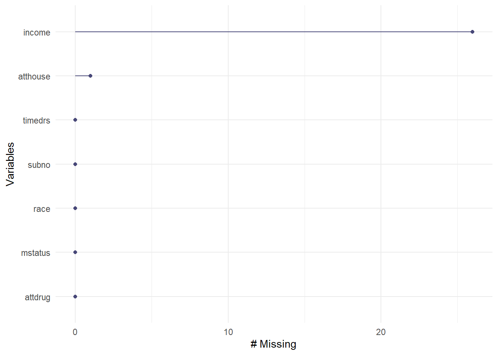

::: small_right

:::


# Ders Hakkında {.unnumbered}

Bu dersin amacı, R yazılımını kullanarak veri üzerinde istenilen çok değişkenli istatistiksel ve psikometrik işlemlerin yapılabilmesini sağlamaktır.

Tez ve makale çalışmalarında öğrencilerimizin analizlerini R yazılımı ile hiçbir paket programa ihtiyaç duymadan kendi başlarına yapmalarını sağlamaktır.

Ders İçeriği: 

- Çok değişkenli İstatistik Varsayımları  
- Çoklu Regresyon  
- Yol Analizi
- Açımlayıcı Faktör Analizi  
- Doğrulayıcı Faktör Analizi  
- Progralamaya Giriş  
- Klasik Test Kuramı  
- Madde Tepki Kuramı  
- Veri Üretimi  

## Eğitmen {.unnumbered}

`<svg aria-hidden="true" role="img" viewBox="0 0 448 512" style="height:1em;width:0.88em;vertical-align:-0.125em;margin-left:auto;margin-right:auto;font-size:inherit;fill:black;overflow:visible;position:relative;"><path d="M224 256A128 128 0 1 1 224 0a128 128 0 1 1 0 256zM209.1 359.2l-18.6-31c-6.4-10.7 1.3-24.2 13.7-24.2H224h19.7c12.4 0 20.1 13.6 13.7 24.2l-18.6 31 33.4 123.9 36-146.9c2-8.1 9.8-13.4 17.9-11.3c70.1 17.6 121.9 81 121.9 156.4c0 17-13.8 30.7-30.7 30.7H285.5c-2.1 0-4-.4-5.8-1.1l.3 1.1H168l.3-1.1c-1.8 .7-3.8 1.1-5.8 1.1H30.7C13.8 512 0 498.2 0 481.3c0-75.5 51.9-138.9 121.9-156.4c8.1-2 15.9 3.3 17.9 11.3l36 146.9 33.4-123.9z"/></svg>`{=html} [Dr. Kübra Atalay Kabasakal](https://avesis.hacettepe.edu.tr/katalay)

`<svg aria-hidden="true" role="img" viewBox="0 0 512 512" style="height:1em;width:1em;vertical-align:-0.125em;margin-left:auto;margin-right:auto;font-size:inherit;fill:black;overflow:visible;position:relative;"><path d="M64 112c-8.8 0-16 7.2-16 16v22.1L220.5 291.7c20.7 17 50.4 17 71.1 0L464 150.1V128c0-8.8-7.2-16-16-16H64zM48 212.2V384c0 8.8 7.2 16 16 16H448c8.8 0 16-7.2 16-16V212.2L322 328.8c-38.4 31.5-93.7 31.5-132 0L48 212.2zM0 128C0 92.7 28.7 64 64 64H448c35.3 0 64 28.7 64 64V384c0 35.3-28.7 64-64 64H64c-35.3 0-64-28.7-64-64V128z"/></svg>`{=html} [kkatalay\@gmail.com](mailto:kkatalay@gmail.com){.email}

`<svg aria-hidden="true" role="img" viewBox="0 0 512 512" style="height:1em;width:1em;vertical-align:-0.125em;margin-left:auto;margin-right:auto;font-size:inherit;fill:black;overflow:visible;position:relative;"><path d="M64 112c-8.8 0-16 7.2-16 16v22.1L220.5 291.7c20.7 17 50.4 17 71.1 0L464 150.1V128c0-8.8-7.2-16-16-16H64zM48 212.2V384c0 8.8 7.2 16 16 16H448c8.8 0 16-7.2 16-16V212.2L322 328.8c-38.4 31.5-93.7 31.5-132 0L48 212.2zM0 128C0 92.7 28.7 64 64 64H448c35.3 0 64 28.7 64 64V384c0 35.3-28.7 64-64 64H64c-35.3 0-64-28.7-64-64V128z"/></svg>`{=html} [katalay\@hacettepe.edu.tr](mailto:katalay@hacettepe.edu.tr){.email}

## Kitaplar {.unnumbered}

-   Atar, B., Atalay Kabasakal, K, Unsal Ozberk, E. B., Ozberk, E. H. & Kibrislioglu Uysal, N. (2020). R ile Veri Analizi ve Psikometri Uygulamaları, Pegem Akademi, Ankara.🔗 [📖](https://pegem.net/urun/R-ile-Veri-Analizi-ve-Psikometri-Uygulamalari/60801)


-   Desjardins, C. D., & Bulut, O. (2018). Handbook of educational measurement and psychometrics using R. Boca Raton, FL: CRC Press. 🔗[📖](https://www.routledge.com/Handbook-of-Educational-Measurement-and-Psychometrics-Using-R/Desjardins-Bulut/p/book/9780367734671)

- Demir, E. R Diliyle İstatistik Uygulamaları. Pegem Akademi, Ankara.(2021). 🔗[📖](https://pegem.net/urun/R-Diliyle-Istatistik-Uygulamalari/61912)

- Kline,R. B. (2019). Yapısal Eşitlik Modellemesinin İlkeleri ve Uygulaması(4. Baskı). (S. Şen, Çev.) Ankara: Nobel Yayınevi.

- Şen, S. (2020). Mplus ile Yapısal Eşitlik Modellemesi Uygulamaları (2020).Nobel Yayınevi.

- Wolf, E. J., Harrington, K. M., Clark, S. L., & Miller, M. W. (2013). Sample Size Requirements for Structural Equation Models: An Evaluation of Power, Bias, and Solution Propriety. Educational and Psychological Measurement, 73(6), 913–934. https://doi.org/10.1177/0013164413495237

<!--chapter:end:index.Rmd-->

# Varsayımlar


-   Veri Dosyasındaki Verinin Doğruluğu

-   Kayıp Verinin Miktarı ve Dağılımı

-   Tek Değişkenli ve Çok Değişkenli Uç Değerler (Outliers)

-   Sayıltılar

-   Çoklu Bağlantı (Multicollinearity) ve Tekillik (Singularity)

## Veri İnceleme

-   Varsayımlar incelenirken ilk olarak yanlış girilmiş bir değer olup
olmadığına bakılmalıdır.

-   Bu bölümde 🔗 [SCREEN.sav](book\data\SCREEN.sav) adlı veri seti
kullanılmıştır. Bu veri setinde 20-59 yaşları arasında 465 kadının 6 değişkene
ilişkin bilgileri bulunmaktadır. Değişkenlerden timedrs, attdrug, atthouse ve 
income değişkenleri sürekli, mstatus ve race değişkenleriyse iki kategorili değişkenlerdir.

-   Bu veri seti **Tabachnick, B. G., & Fidell, L. S. (2012). Using Multivariate
Statistics (4rd ed.). New York: Harper Collins.** kitabının 4. bölümünde 
kullanılmaktadır.

- Veri incelemede birden fazla paket kullanılabilir. En temel fonksiyon `base`
paketin `summary()` fonksiyonudur. `psych` paketinde `describe`; 
`gtsummary` paketinde `describe`;`vtable` paketinde `sumtable` 
fonksiyonu da aynı amaçla kullanılabilir.
 


```r
library(haven)
screen <- read_sav("data/SCREEN.sav")
head(screen)
```

<div class="kable-table">

| subno| timedrs| attdrug| atthouse| income| mstatus| race|
|-----:|-------:|-------:|--------:|------:|-------:|----:|
|     1|       1|       8|       27|      5|       2|    1|
|     2|       3|       7|       20|      6|       2|    1|
|     3|       0|       8|       23|      3|       2|    1|
|     4|      13|       9|       28|      8|       2|    1|
|     5|      15|       7|       24|      1|       2|    1|
|     6|       3|       8|       25|      4|       2|    1|

</div>

-   Veri setindeki maksimum ve minumum değerleri belirlenmiştir.


```r
summary(screen)
```

```
##      subno          timedrs          attdrug          atthouse    
##  Min.   :  1.0   Min.   : 0.000   Min.   : 5.000   Min.   : 2.00  
##  1st Qu.:137.0   1st Qu.: 2.000   1st Qu.: 7.000   1st Qu.:21.00  
##  Median :314.0   Median : 4.000   Median : 8.000   Median :24.00  
##  Mean   :317.4   Mean   : 7.901   Mean   : 7.686   Mean   :23.54  
##  3rd Qu.:483.0   3rd Qu.:10.000   3rd Qu.: 9.000   3rd Qu.:27.00  
##  Max.   :758.0   Max.   :81.000   Max.   :10.000   Max.   :35.00  
##                                                    NA's   :1      
##      income         mstatus           race      
##  Min.   : 1.00   Min.   :1.000   Min.   :1.000  
##  1st Qu.: 2.50   1st Qu.:2.000   1st Qu.:1.000  
##  Median : 4.00   Median :2.000   Median :1.000  
##  Mean   : 4.21   Mean   :1.778   Mean   :1.088  
##  3rd Qu.: 6.00   3rd Qu.:2.000   3rd Qu.:1.000  
##  Max.   :10.00   Max.   :2.000   Max.   :2.000  
##  NA's   :26
```

-   Elde edilen değerlerin makul olduğu söylenebilir. Ancak bunu elde etmek için başka yollar da bulunmaktadır.  `psych` paketi ile inceleme daha ayrıntılı yapılabilir.


```r
library(psych)
```

```
## 
## Attaching package: 'psych'
```

```
## The following objects are masked from 'package:ggplot2':
## 
##     %+%, alpha
```

```r
describe(round(screen[,-1],2))
```

<div class="kable-table">

|         | vars|   n|      mean|         sd| median|   trimmed|    mad| min| max| range|       skew|   kurtosis|        se|
|:--------|----:|---:|---------:|----------:|------:|---------:|------:|---:|---:|-----:|----------:|----------:|---------:|
|timedrs  |    1| 465|  7.901075| 10.9484932|      4|  5.605898| 4.4478|   0|  81|    81|  3.2271914| 12.8786814| 0.5077242|
|attdrug  |    2| 465|  7.686021|  1.1560925|      8|  7.707775| 1.4826|   5|  10|     5| -0.1217206| -0.4660855| 0.0536125|
|atthouse |    3| 464| 23.540948|  4.4835244|     24| 23.623656| 4.4478|   2|  35|    33| -0.4542073|  1.5067335| 0.2081424|
|income   |    4| 439|  4.209567|  2.4188755|      4|  4.014164| 2.9652|   1|  10|     9|  0.5776184| -0.3808944| 0.1154466|
|mstatus  |    5| 465|  1.778495|  0.4157071|      2|  1.847185| 0.0000|   1|   2|     1| -1.3369785| -0.2129327| 0.0192780|
|race     |    6| 465|  1.088172|  0.2838503|      1|  1.000000| 0.0000|   1|   2|     1|  2.8954859|  6.3976109| 0.0131632|

</div>

🔗 [personality-project sayfasını](https://personality-project.org/r/psych/) daha fazla örnek için inceleyebilirsiniz.

-   `gtsummary` paketi ile inceleme


```r
library(gtsummary)
screen %>% select(2:6) %>%tbl_summary(statistic = all_continuous() ~ c(
"{min}, {max}"),missing ="always")
```

```{=html}
<div id="dozooyqaww" style="padding-left:0px;padding-right:0px;padding-top:10px;padding-bottom:10px;overflow-x:auto;overflow-y:auto;width:auto;height:auto;">
<style>#dozooyqaww table {
  font-family: system-ui, 'Segoe UI', Roboto, Helvetica, Arial, sans-serif, 'Apple Color Emoji', 'Segoe UI Emoji', 'Segoe UI Symbol', 'Noto Color Emoji';
  -webkit-font-smoothing: antialiased;
  -moz-osx-font-smoothing: grayscale;
}

#dozooyqaww thead, #dozooyqaww tbody, #dozooyqaww tfoot, #dozooyqaww tr, #dozooyqaww td, #dozooyqaww th {
  border-style: none;
}

#dozooyqaww p {
  margin: 0;
  padding: 0;
}

#dozooyqaww .gt_table {
  display: table;
  border-collapse: collapse;
  line-height: normal;
  margin-left: auto;
  margin-right: auto;
  color: #333333;
  font-size: 16px;
  font-weight: normal;
  font-style: normal;
  background-color: #FFFFFF;
  width: auto;
  border-top-style: solid;
  border-top-width: 2px;
  border-top-color: #A8A8A8;
  border-right-style: none;
  border-right-width: 2px;
  border-right-color: #D3D3D3;
  border-bottom-style: solid;
  border-bottom-width: 2px;
  border-bottom-color: #A8A8A8;
  border-left-style: none;
  border-left-width: 2px;
  border-left-color: #D3D3D3;
}

#dozooyqaww .gt_caption {
  padding-top: 4px;
  padding-bottom: 4px;
}

#dozooyqaww .gt_title {
  color: #333333;
  font-size: 125%;
  font-weight: initial;
  padding-top: 4px;
  padding-bottom: 4px;
  padding-left: 5px;
  padding-right: 5px;
  border-bottom-color: #FFFFFF;
  border-bottom-width: 0;
}

#dozooyqaww .gt_subtitle {
  color: #333333;
  font-size: 85%;
  font-weight: initial;
  padding-top: 3px;
  padding-bottom: 5px;
  padding-left: 5px;
  padding-right: 5px;
  border-top-color: #FFFFFF;
  border-top-width: 0;
}

#dozooyqaww .gt_heading {
  background-color: #FFFFFF;
  text-align: center;
  border-bottom-color: #FFFFFF;
  border-left-style: none;
  border-left-width: 1px;
  border-left-color: #D3D3D3;
  border-right-style: none;
  border-right-width: 1px;
  border-right-color: #D3D3D3;
}

#dozooyqaww .gt_bottom_border {
  border-bottom-style: solid;
  border-bottom-width: 2px;
  border-bottom-color: #D3D3D3;
}

#dozooyqaww .gt_col_headings {
  border-top-style: solid;
  border-top-width: 2px;
  border-top-color: #D3D3D3;
  border-bottom-style: solid;
  border-bottom-width: 2px;
  border-bottom-color: #D3D3D3;
  border-left-style: none;
  border-left-width: 1px;
  border-left-color: #D3D3D3;
  border-right-style: none;
  border-right-width: 1px;
  border-right-color: #D3D3D3;
}

#dozooyqaww .gt_col_heading {
  color: #333333;
  background-color: #FFFFFF;
  font-size: 100%;
  font-weight: normal;
  text-transform: inherit;
  border-left-style: none;
  border-left-width: 1px;
  border-left-color: #D3D3D3;
  border-right-style: none;
  border-right-width: 1px;
  border-right-color: #D3D3D3;
  vertical-align: bottom;
  padding-top: 5px;
  padding-bottom: 6px;
  padding-left: 5px;
  padding-right: 5px;
  overflow-x: hidden;
}

#dozooyqaww .gt_column_spanner_outer {
  color: #333333;
  background-color: #FFFFFF;
  font-size: 100%;
  font-weight: normal;
  text-transform: inherit;
  padding-top: 0;
  padding-bottom: 0;
  padding-left: 4px;
  padding-right: 4px;
}

#dozooyqaww .gt_column_spanner_outer:first-child {
  padding-left: 0;
}

#dozooyqaww .gt_column_spanner_outer:last-child {
  padding-right: 0;
}

#dozooyqaww .gt_column_spanner {
  border-bottom-style: solid;
  border-bottom-width: 2px;
  border-bottom-color: #D3D3D3;
  vertical-align: bottom;
  padding-top: 5px;
  padding-bottom: 5px;
  overflow-x: hidden;
  display: inline-block;
  width: 100%;
}

#dozooyqaww .gt_spanner_row {
  border-bottom-style: hidden;
}

#dozooyqaww .gt_group_heading {
  padding-top: 8px;
  padding-bottom: 8px;
  padding-left: 5px;
  padding-right: 5px;
  color: #333333;
  background-color: #FFFFFF;
  font-size: 100%;
  font-weight: initial;
  text-transform: inherit;
  border-top-style: solid;
  border-top-width: 2px;
  border-top-color: #D3D3D3;
  border-bottom-style: solid;
  border-bottom-width: 2px;
  border-bottom-color: #D3D3D3;
  border-left-style: none;
  border-left-width: 1px;
  border-left-color: #D3D3D3;
  border-right-style: none;
  border-right-width: 1px;
  border-right-color: #D3D3D3;
  vertical-align: middle;
  text-align: left;
}

#dozooyqaww .gt_empty_group_heading {
  padding: 0.5px;
  color: #333333;
  background-color: #FFFFFF;
  font-size: 100%;
  font-weight: initial;
  border-top-style: solid;
  border-top-width: 2px;
  border-top-color: #D3D3D3;
  border-bottom-style: solid;
  border-bottom-width: 2px;
  border-bottom-color: #D3D3D3;
  vertical-align: middle;
}

#dozooyqaww .gt_from_md > :first-child {
  margin-top: 0;
}

#dozooyqaww .gt_from_md > :last-child {
  margin-bottom: 0;
}

#dozooyqaww .gt_row {
  padding-top: 8px;
  padding-bottom: 8px;
  padding-left: 5px;
  padding-right: 5px;
  margin: 10px;
  border-top-style: solid;
  border-top-width: 1px;
  border-top-color: #D3D3D3;
  border-left-style: none;
  border-left-width: 1px;
  border-left-color: #D3D3D3;
  border-right-style: none;
  border-right-width: 1px;
  border-right-color: #D3D3D3;
  vertical-align: middle;
  overflow-x: hidden;
}

#dozooyqaww .gt_stub {
  color: #333333;
  background-color: #FFFFFF;
  font-size: 100%;
  font-weight: initial;
  text-transform: inherit;
  border-right-style: solid;
  border-right-width: 2px;
  border-right-color: #D3D3D3;
  padding-left: 5px;
  padding-right: 5px;
}

#dozooyqaww .gt_stub_row_group {
  color: #333333;
  background-color: #FFFFFF;
  font-size: 100%;
  font-weight: initial;
  text-transform: inherit;
  border-right-style: solid;
  border-right-width: 2px;
  border-right-color: #D3D3D3;
  padding-left: 5px;
  padding-right: 5px;
  vertical-align: top;
}

#dozooyqaww .gt_row_group_first td {
  border-top-width: 2px;
}

#dozooyqaww .gt_row_group_first th {
  border-top-width: 2px;
}

#dozooyqaww .gt_summary_row {
  color: #333333;
  background-color: #FFFFFF;
  text-transform: inherit;
  padding-top: 8px;
  padding-bottom: 8px;
  padding-left: 5px;
  padding-right: 5px;
}

#dozooyqaww .gt_first_summary_row {
  border-top-style: solid;
  border-top-color: #D3D3D3;
}

#dozooyqaww .gt_first_summary_row.thick {
  border-top-width: 2px;
}

#dozooyqaww .gt_last_summary_row {
  padding-top: 8px;
  padding-bottom: 8px;
  padding-left: 5px;
  padding-right: 5px;
  border-bottom-style: solid;
  border-bottom-width: 2px;
  border-bottom-color: #D3D3D3;
}

#dozooyqaww .gt_grand_summary_row {
  color: #333333;
  background-color: #FFFFFF;
  text-transform: inherit;
  padding-top: 8px;
  padding-bottom: 8px;
  padding-left: 5px;
  padding-right: 5px;
}

#dozooyqaww .gt_first_grand_summary_row {
  padding-top: 8px;
  padding-bottom: 8px;
  padding-left: 5px;
  padding-right: 5px;
  border-top-style: double;
  border-top-width: 6px;
  border-top-color: #D3D3D3;
}

#dozooyqaww .gt_last_grand_summary_row_top {
  padding-top: 8px;
  padding-bottom: 8px;
  padding-left: 5px;
  padding-right: 5px;
  border-bottom-style: double;
  border-bottom-width: 6px;
  border-bottom-color: #D3D3D3;
}

#dozooyqaww .gt_striped {
  background-color: rgba(128, 128, 128, 0.05);
}

#dozooyqaww .gt_table_body {
  border-top-style: solid;
  border-top-width: 2px;
  border-top-color: #D3D3D3;
  border-bottom-style: solid;
  border-bottom-width: 2px;
  border-bottom-color: #D3D3D3;
}

#dozooyqaww .gt_footnotes {
  color: #333333;
  background-color: #FFFFFF;
  border-bottom-style: none;
  border-bottom-width: 2px;
  border-bottom-color: #D3D3D3;
  border-left-style: none;
  border-left-width: 2px;
  border-left-color: #D3D3D3;
  border-right-style: none;
  border-right-width: 2px;
  border-right-color: #D3D3D3;
}

#dozooyqaww .gt_footnote {
  margin: 0px;
  font-size: 90%;
  padding-top: 4px;
  padding-bottom: 4px;
  padding-left: 5px;
  padding-right: 5px;
}

#dozooyqaww .gt_sourcenotes {
  color: #333333;
  background-color: #FFFFFF;
  border-bottom-style: none;
  border-bottom-width: 2px;
  border-bottom-color: #D3D3D3;
  border-left-style: none;
  border-left-width: 2px;
  border-left-color: #D3D3D3;
  border-right-style: none;
  border-right-width: 2px;
  border-right-color: #D3D3D3;
}

#dozooyqaww .gt_sourcenote {
  font-size: 90%;
  padding-top: 4px;
  padding-bottom: 4px;
  padding-left: 5px;
  padding-right: 5px;
}

#dozooyqaww .gt_left {
  text-align: left;
}

#dozooyqaww .gt_center {
  text-align: center;
}

#dozooyqaww .gt_right {
  text-align: right;
  font-variant-numeric: tabular-nums;
}

#dozooyqaww .gt_font_normal {
  font-weight: normal;
}

#dozooyqaww .gt_font_bold {
  font-weight: bold;
}

#dozooyqaww .gt_font_italic {
  font-style: italic;
}

#dozooyqaww .gt_super {
  font-size: 65%;
}

#dozooyqaww .gt_footnote_marks {
  font-size: 75%;
  vertical-align: 0.4em;
  position: initial;
}

#dozooyqaww .gt_asterisk {
  font-size: 100%;
  vertical-align: 0;
}

#dozooyqaww .gt_indent_1 {
  text-indent: 5px;
}

#dozooyqaww .gt_indent_2 {
  text-indent: 10px;
}

#dozooyqaww .gt_indent_3 {
  text-indent: 15px;
}

#dozooyqaww .gt_indent_4 {
  text-indent: 20px;
}

#dozooyqaww .gt_indent_5 {
  text-indent: 25px;
}
</style>
<table class="gt_table" data-quarto-disable-processing="false" data-quarto-bootstrap="false">
  <thead>
    <tr class="gt_col_headings">
      <th class="gt_col_heading gt_columns_bottom_border gt_left" rowspan="1" colspan="1" scope="col" id="&lt;strong&gt;Characteristic&lt;/strong&gt;"><strong>Characteristic</strong></th>
      <th class="gt_col_heading gt_columns_bottom_border gt_center" rowspan="1" colspan="1" scope="col" id="&lt;strong&gt;N = 465&lt;/strong&gt;&lt;span class=&quot;gt_footnote_marks&quot; style=&quot;white-space:nowrap;font-style:italic;font-weight:normal;&quot;&gt;&lt;sup&gt;1&lt;/sup&gt;&lt;/span&gt;"><strong>N = 465</strong><span class="gt_footnote_marks" style="white-space:nowrap;font-style:italic;font-weight:normal;"><sup>1</sup></span></th>
    </tr>
  </thead>
  <tbody class="gt_table_body">
    <tr><td headers="label" class="gt_row gt_left">Visits to health professionals</td>
<td headers="stat_0" class="gt_row gt_center">0, 81</td></tr>
    <tr><td headers="label" class="gt_row gt_left">    Unknown</td>
<td headers="stat_0" class="gt_row gt_center">0</td></tr>
    <tr><td headers="label" class="gt_row gt_left">Attitudes toward medication</td>
<td headers="stat_0" class="gt_row gt_center"><br /></td></tr>
    <tr><td headers="label" class="gt_row gt_left">    5</td>
<td headers="stat_0" class="gt_row gt_center">13 (2.8%)</td></tr>
    <tr><td headers="label" class="gt_row gt_left">    6</td>
<td headers="stat_0" class="gt_row gt_center">60 (13%)</td></tr>
    <tr><td headers="label" class="gt_row gt_left">    7</td>
<td headers="stat_0" class="gt_row gt_center">126 (27%)</td></tr>
    <tr><td headers="label" class="gt_row gt_left">    8</td>
<td headers="stat_0" class="gt_row gt_center">149 (32%)</td></tr>
    <tr><td headers="label" class="gt_row gt_left">    9</td>
<td headers="stat_0" class="gt_row gt_center">95 (20%)</td></tr>
    <tr><td headers="label" class="gt_row gt_left">    10</td>
<td headers="stat_0" class="gt_row gt_center">22 (4.7%)</td></tr>
    <tr><td headers="label" class="gt_row gt_left">    Unknown</td>
<td headers="stat_0" class="gt_row gt_center">0</td></tr>
    <tr><td headers="label" class="gt_row gt_left">Attitudes toward housework</td>
<td headers="stat_0" class="gt_row gt_center">2.0, 35.0</td></tr>
    <tr><td headers="label" class="gt_row gt_left">    Unknown</td>
<td headers="stat_0" class="gt_row gt_center">1</td></tr>
    <tr><td headers="label" class="gt_row gt_left">Income</td>
<td headers="stat_0" class="gt_row gt_center">1.00, 10.00</td></tr>
    <tr><td headers="label" class="gt_row gt_left">    Unknown</td>
<td headers="stat_0" class="gt_row gt_center">26</td></tr>
    <tr><td headers="label" class="gt_row gt_left">Whether currently married</td>
<td headers="stat_0" class="gt_row gt_center"><br /></td></tr>
    <tr><td headers="label" class="gt_row gt_left">    1</td>
<td headers="stat_0" class="gt_row gt_center">103 (22%)</td></tr>
    <tr><td headers="label" class="gt_row gt_left">    2</td>
<td headers="stat_0" class="gt_row gt_center">362 (78%)</td></tr>
    <tr><td headers="label" class="gt_row gt_left">    Unknown</td>
<td headers="stat_0" class="gt_row gt_center">0</td></tr>
  </tbody>
  
  <tfoot class="gt_footnotes">
    <tr>
      <td class="gt_footnote" colspan="2"><span class="gt_footnote_marks" style="white-space:nowrap;font-style:italic;font-weight:normal;"><sup>1</sup></span> Range; n (%)</td>
    </tr>
  </tfoot>
</table>
</div>
```

-   🔗[Presentation-Ready Summary Tables] with gtsummary(https://education.rstudio.com/blog/2020/07/gtsummary)

-   `vtable` paketi ile inceleme


```r
library(vtable)
sumtable(screen, summ=c('notNA(x)','min(x)','max(x)'))
```

<table class="table" style="margin-left: auto; margin-right: auto;">
<caption>(\#tab:unnamed-chunk-5)Summary Statistics</caption>
 <thead>
  <tr>
   <th style="text-align:left;"> Variable </th>
   <th style="text-align:left;"> NotNA </th>
   <th style="text-align:left;"> Min </th>
   <th style="text-align:left;"> Max </th>
  </tr>
 </thead>
<tbody>
  <tr>
   <td style="text-align:left;"> subno </td>
   <td style="text-align:left;"> 465 </td>
   <td style="text-align:left;"> 1 </td>
   <td style="text-align:left;"> 758 </td>
  </tr>
  <tr>
   <td style="text-align:left;"> timedrs </td>
   <td style="text-align:left;"> 465 </td>
   <td style="text-align:left;"> 0 </td>
   <td style="text-align:left;"> 81 </td>
  </tr>
  <tr>
   <td style="text-align:left;"> attdrug </td>
   <td style="text-align:left;"> 465 </td>
   <td style="text-align:left;"> 5 </td>
   <td style="text-align:left;"> 10 </td>
  </tr>
  <tr>
   <td style="text-align:left;"> atthouse </td>
   <td style="text-align:left;"> 464 </td>
   <td style="text-align:left;"> 2 </td>
   <td style="text-align:left;"> 35 </td>
  </tr>
  <tr>
   <td style="text-align:left;"> income </td>
   <td style="text-align:left;"> 439 </td>
   <td style="text-align:left;"> 1 </td>
   <td style="text-align:left;"> 10 </td>
  </tr>
  <tr>
   <td style="text-align:left;"> mstatus </td>
   <td style="text-align:left;"> 465 </td>
   <td style="text-align:left;"> 1 </td>
   <td style="text-align:left;"> 2 </td>
  </tr>
  <tr>
   <td style="text-align:left;"> race </td>
   <td style="text-align:left;"> 465 </td>
   <td style="text-align:left;"> 1 </td>
   <td style="text-align:left;"> 2 </td>
  </tr>
</tbody>
</table>

-   🔗 [vtable paketi için örnekler](https://nickch-k.github.io/vtable/index.html)

-   sütun isimleri aşağıdaki gibi değiştirilebilir.


```r
sumtable(screen, summ = c('notNA(x)','min(x)','max(x)'),
         summ.names = c('Frekans'
,'Minimum','Maksimum'))
```

<table class="table" style="margin-left: auto; margin-right: auto;">
<caption>(\#tab:unnamed-chunk-6)Summary Statistics</caption>
 <thead>
  <tr>
   <th style="text-align:left;"> Variable </th>
   <th style="text-align:left;"> Frekans </th>
   <th style="text-align:left;"> Minimum </th>
   <th style="text-align:left;"> Maksimum </th>
  </tr>
 </thead>
<tbody>
  <tr>
   <td style="text-align:left;"> subno </td>
   <td style="text-align:left;"> 465 </td>
   <td style="text-align:left;"> 1 </td>
   <td style="text-align:left;"> 758 </td>
  </tr>
  <tr>
   <td style="text-align:left;"> timedrs </td>
   <td style="text-align:left;"> 465 </td>
   <td style="text-align:left;"> 0 </td>
   <td style="text-align:left;"> 81 </td>
  </tr>
  <tr>
   <td style="text-align:left;"> attdrug </td>
   <td style="text-align:left;"> 465 </td>
   <td style="text-align:left;"> 5 </td>
   <td style="text-align:left;"> 10 </td>
  </tr>
  <tr>
   <td style="text-align:left;"> atthouse </td>
   <td style="text-align:left;"> 464 </td>
   <td style="text-align:left;"> 2 </td>
   <td style="text-align:left;"> 35 </td>
  </tr>
  <tr>
   <td style="text-align:left;"> income </td>
   <td style="text-align:left;"> 439 </td>
   <td style="text-align:left;"> 1 </td>
   <td style="text-align:left;"> 10 </td>
  </tr>
  <tr>
   <td style="text-align:left;"> mstatus </td>
   <td style="text-align:left;"> 465 </td>
   <td style="text-align:left;"> 1 </td>
   <td style="text-align:left;"> 2 </td>
  </tr>
  <tr>
   <td style="text-align:left;"> race </td>
   <td style="text-align:left;"> 465 </td>
   <td style="text-align:left;"> 1 </td>
   <td style="text-align:left;"> 2 </td>
  </tr>
</tbody>
</table>

-   `kable` paketi ile `psych` paketi çıktılarını düzenleme


```r
ozet <- describe(screen[,-1])
kable(ozet,format='markdown',
      caption="Betimsel İstatistikler",digits=2)
```


Table: (\#tab:unnamed-chunk-7)Betimsel İstatistikler

|         | vars|   n|  mean|    sd| median| trimmed|  mad| min| max| range|  skew| kurtosis|   se|
|:--------|----:|---:|-----:|-----:|------:|-------:|----:|---:|---:|-----:|-----:|--------:|----:|
|timedrs  |    1| 465|  7.90| 10.95|      4|    5.61| 4.45|   0|  81|    81|  3.23|    12.88| 0.51|
|attdrug  |    2| 465|  7.69|  1.16|      8|    7.71| 1.48|   5|  10|     5| -0.12|    -0.47| 0.05|
|atthouse |    3| 464| 23.54|  4.48|     24|   23.62| 4.45|   2|  35|    33| -0.45|     1.51| 0.21|
|income   |    4| 439|  4.21|  2.42|      4|    4.01| 2.97|   1|  10|     9|  0.58|    -0.38| 0.12|
|mstatus  |    5| 465|  1.78|  0.42|      2|    1.85| 0.00|   1|   2|     1| -1.34|    -0.21| 0.02|
|race     |    6| 465|  1.09|  0.28|      1|    1.00| 0.00|   1|   2|     1|  2.90|     6.40| 0.01|

-   🔗 [rmarkdown-cookbook](https://bookdown.org/yihui/rmarkdown-cookbook/kable.html)


## Kayıp Değerler

- Kayıp veri, veri analizindeki en yaygın problemlerden biridir.

- Kayıp verinin önemi kayıp verinin miktarına, örüntüsüne ve neden eksik olduğuna
bağlıdır.

- Bir değişkene ait beklenmeyen miktarda kayıp veri varsa, ilk olarak 
bunun nedeni araştırılmalıdır. Daha sonra kayıp verinin örüntüsüne bakılarak,rastlantısal mı
yoksa sistematik bir örüntü mü gösterdiği belirlenmelidir.

    - Örneğin, 30 yaşın üstündeki birçok kadın yaş ile ilgili soruyu
cevaplamak istemezler.

- Genellikle kayıp verinin örüntüsü miktarından daha önemlidir. Rastlantısal 
dağılmayan kayıp veriler sonuçların genellenebilirliğini 
etkileyeceğinden miktarları az da olsa,
rastlantısal dağılan kayıp verilere oranla daha ciddi problemlere yol açarlar.

### Kayıp Veri Türleri

- Kayıp veri türleri arasındaki ayrım 1976 yılında Rubin tarafından yapılmıştır.
Rubin (1976) kayıp veriyi aşağıdaki şekilde sınıflandırmıştır.

  - Tamamen Rastlantısal Olarak Kayıp (TROK) - Missing Completely at Random MCAR

  - Rastlantısal Olarak Kayıp (ROK) -  Missing at R andom (MAR)

  - Rastlantısal Olmayan Kayıp / İhmal Edilemez Kayıp (İEK) - Not Missing at Random
(NMAR)

- Kayıp veri en azından MAR türünde değilse, kayıp verinin
ihmal edilemeyeceği söylenir. Bu türdeki kayıp veri
rastlantısal olamyan kayıp veya ihmal edilemez kayıp olarak adlandırılır.

- Büyük bir veri setinde, verinin %5’i veya daha azı rastlantısal olarak kayıpsa
çok ciddi problemlerle karşılaşılmaz ve kayıp veri ile ilgili problemleri
çözmek için kullanılan herhangi bir yöntem benzer sonuçlar verir.
Halbuki küçük veya orta büyüklükteki bir veri setinde çok sayıda veri kaybı
varsa ciddi problemler ortaya çıkabilir.

- Eldeki bilgiden yararlanarak kayıp verideki örüntüler test edilebilir.


### MAR

- MAR türünde veri gerçekte rastlantısal olarak kayıp değildir, veri kaybı veri
setindeki değişkenlerden bazılarına bağlıdır.

- MAR türünde bir veri noktasının kayıp olma eğilimi kayıp veriyle ilişkili
değildir ancak gözlenen verinin bir kısmıyla İlişkilidir.

- Rastlantısal olarak kayıp değerler ve gözlenen değerler arasında sistematik
farklılıkların olabileceği ancak bu farklılıkların diğer gözlenen değişkenlerle
tamamen açıklanabileceği anlamındadır.

- Bir değişkenin gözlemleri rastlantısal olarak kayıpsa, şartlı değişkenler
kontrol edilebilirse , rastlantısal küme elde edilebilir; kayıp ve gözlenen
değerler kontrol altına alınan gruplarda benzer dağılımlara sahip
olacaklardır.

- Örneğin, kayıp verinin bulunduğu değişkene göre eksik değerlere sahip
bireyler ve tam değerlere sahip bireylerden iki grup oluşturulabilir. Sonra
analizde bu değişkenle ilgili olabilecek diğer değişkenlerde t testi ile iki
grup arasındaki ortalama farklara bakılabilir.

- Kayıp veriyi incelemek ve kayıp veri ile baş etmek konusunda birden fazla
paket mevcuttur. Bu paketler arasında
  - VIM
  - missMethods
  - Amelia
  - naniar paketi sayılabilir.

İlk örnekler **naniar** üzerinden gösterilmektedir.

- **herhangi bir eksik veri olup olmadığının kontrolü**


```r
library(naniar)

any_na(screen)
```

```
## [1] TRUE
```

- **toplam kaç eksik veri var**


```r
n_miss(screen)
```

```
## [1] 27
```

- **eksik veri oranı ne?**


```r
prop_miss(screen)
```

```
## [1] 0.008294931
```

- **eksik veriler hangi sütunlarda**


```r
screen %>% is.na() %>% colSums()
```

```
##    subno  timedrs  attdrug atthouse   income  mstatus     race 
##        0        0        0        1       26        0        0
```

- **eksik veri tablosu, frekans ve oran**


```r
miss_var_summary(screen)
```

<div class="kable-table">

|variable | n_miss|  pct_miss|
|:--------|------:|---------:|
|income   |     26| 5.5913978|
|atthouse |      1| 0.2150538|
|subno    |      0| 0.0000000|
|timedrs  |      0| 0.0000000|
|attdrug  |      0| 0.0000000|
|mstatus  |      0| 0.0000000|
|race     |      0| 0.0000000|

</div>

- **değişkenlere göre eksik veri tablosu**


```r
miss_var_table(screen)
```

<div class="kable-table">

| n_miss_in_var| n_vars| pct_vars|
|-------------:|------:|--------:|
|             0|      5| 71.42857|
|             1|      1| 14.28571|
|            26|      1| 14.28571|

</div>

- **Hangi bireylerde/satırlarda eksik veri var**


```r
head(miss_case_summary(screen))
```

<div class="kable-table">

| case| n_miss| pct_miss|
|----:|------:|--------:|
|   52|      1| 14.28571|
|   64|      1| 14.28571|
|   69|      1| 14.28571|
|   77|      1| 14.28571|
|  118|      1| 14.28571|
|  135|      1| 14.28571|

</div>

- **tam ve eksik veri tablosu**


```r
miss_case_table(screen)
```

<div class="kable-table">

| n_miss_in_case| n_cases| pct_cases|
|--------------:|-------:|---------:|
|              0|     438| 94.193548|
|              1|      27|  5.806452|

</div>

- **Eksik verinin görselleştirilmesi**


```r
gg_miss_var(screen)
```



- **Eksik verinin görselleştirilmesi**


```r
library(ggplot2)
vis_miss(screen) + theme(axis.text.x = element_text(angle=80))
```


```r
gg_miss_upset(screen)
```

```
## `geom_line()`: Each group consists of only one observation.
## ℹ Do you need to adjust the group aesthetic?
```


### Kayıp Veri Testi

Veri kaybının diğer değişkenlerle ilişkili olup olmadığının incelenmesi
`finalfit` paketi ile gerçekleştirilebilir.

- income değişleninde eksik veriler diğer değişkenlerle ilişkili mi?


```r
# değişkeni kopyala
screen2 <- screen
screen2$income_m <- screen2$income

library(finalfit)

explanatory = c("timedrs", "attdrug", "atthouse")
dependent = "income_m"
screen2 %>% 
  missing_compare(dependent, explanatory) %>% 
    knitr::kable(row.names=FALSE, align = c("l", "l", "r", "r", "r"), 
        caption = "Eksik veriye sahip olan ve olmayan değişkenlerin ortalama karşılaştırması") 
```


Table: (\#tab:unnamed-chunk-18)Eksik veriye sahip olan ve olmayan değişkenlerin ortalama karşılaştırması

|Missing data analysis: Income  |          | Not missing|    Missing|     p|
|:------------------------------|:---------|-----------:|----------:|-----:|
|Visits to health professionals |Mean (SD) |  7.9 (11.1)|  7.6 (7.4)| 0.891|
|Attitudes toward medication    |Mean (SD) |   7.7 (1.2)|  7.9 (1.0)| 0.368|
|Attitudes toward housework     |Mean (SD) |  23.5 (4.5)| 23.7 (4.2)| 0.860|


#### Bir değişkenin kategorilerinde inceleme


```r
library(tidyverse)
miss_test <- screen2 %>%mutate(miss_income = is.na(income))
  
# evli olmayanlar için
notmarried <- miss_test %>% filter(mstatus == 1) %>%
   pull(miss_income)
  
# Evliler için
married <- miss_test %>% filter(mstatus == 2) %>% pull(miss_income)
  
#c Oran
t.test(notmarried, married)
```

```
## 
## 	Welch Two Sample t-test
## 
## data:  notmarried and married
## t = -0.95833, df = 198.7, p-value = 0.3391
## alternative hypothesis: true difference in means is not equal to 0
## 95 percent confidence interval:
##  -0.06708191  0.02320485
## sample estimates:
##  mean of x  mean of y 
## 0.03883495 0.06077348
```


```r
gg_miss_fct(screen, fct = mstatus)
```


### MCAR test


```r
library(naniar)
mcar_test(data=screen[,2:5])
```

<div class="kable-table">

| statistic| df|   p.value| missing.patterns|
|---------:|--:|---------:|----------------:|
|  3.286262|  6| 0.7721547|                3|

</div>

- Littleın MCAR testine ilişkin p değerinin . 773 olduğu görülmektedir.
Böylece kayıp verinin MCAR olduğu sonucuna varılabilir.

### Kayıp veri ile başetme

- Liste bazında silme işlemi **na.omit** ve **complete.cases** fonkisyonları ile sağlanabilir.


```r
na.omit(screen) 
screen[!complete.cases(screen),]
screen[complete.cases(screen),]
```

- Ortalama atama işlemi yapılabir. Tek bir değişkene ortalama atama


```r
df = data.frame(x = 1:20, y = c(1:10,rep(NA,10)))
df$y[is.na(df$y)] = mean(df$y, na.rm=TRUE)
```


```r
screen2 <- screen
screen2$income[is.na(screen2$income)]<- mean(screen2$income, na.rm=TRUE)
summary(screen2$income)
```

```
##    Min. 1st Qu.  Median    Mean 3rd Qu.    Max. 
##    1.00    3.00    4.00    4.21    6.00   10.00
```

- **if_else()** ile Ortalama atama işlemi yapılabir. 


```r
screen3 <- screen

screen3 = transform(screen3, income = ifelse(is.na(income), mean(income, na.rm=TRUE), income))
summary(screen3$income)
```

```
##    Min. 1st Qu.  Median    Mean 3rd Qu.    Max. 
##    1.00    3.00    4.00    4.21    6.00   10.00
```


```r
screen2 <- screen
screen2$income[is.na(screen3$income)]<- mean(screen3$income, na.rm=TRUE)
summary(screen2$income)
```

```
##    Min. 1st Qu.  Median    Mean 3rd Qu.    Max.    NA's 
##    1.00    2.50    4.00    4.21    6.00   10.00      26
```


**mutate() ile**

<div class="kable-table">

| subno| timedrs| attdrug| atthouse|    income| mstatus| race|
|-----:|-------:|-------:|--------:|---------:|-------:|----:|
|     1|       1|       8|       27|  5.000000|       2|    1|
|     2|       3|       7|       20|  6.000000|       2|    1|
|     3|       0|       8|       23|  3.000000|       2|    1|
|     4|      13|       9|       28|  8.000000|       2|    1|
|     5|      15|       7|       24|  1.000000|       2|    1|
|     6|       3|       8|       25|  4.000000|       2|    1|
|     7|       2|       7|       30|  6.000000|       2|    1|
|     8|       0|       7|       24|  6.000000|       2|    1|
|     9|       7|       7|       20|  2.000000|       2|    1|
|    10|       4|       8|       30|  8.000000|       1|    1|
|    11|      15|       9|       15|  7.000000|       2|    1|
|    12|       0|       6|       22|  3.000000|       2|    1|
|    13|       2|       6|       19|  5.000000|       2|    1|
|    14|      13|       8|       25|  6.000000|       2|    1|
|    15|       2|       5|       17|  1.000000|       2|    1|
|    16|       2|       8|       19|  3.000000|       2|    2|
|    21|       1|       8|       22|  1.000000|       2|    1|
|    22|       2|       6|       21|  7.000000|       1|    1|
|    23|       5|       8|       28|  2.000000|       2|    1|
|    24|       5|      10|       25|  9.000000|       2|    1|
|    25|       3|       6|       19|  4.000000|       2|    1|
|    26|       4|       5|       31|  5.000000|       2|    1|
|    27|       2|       8|       25|  2.000000|       2|    1|
|    28|       0|       8|       26|  1.000000|       2|    1|
|    29|      13|       9|       26|  2.000000|       2|    1|
|    30|       7|       9|       33|  1.000000|       2|    1|
|    31|       2|       8|       20|  5.000000|       2|    1|
|    32|      12|       9|       26|  1.000000|       2|    1|
|    33|       2|       6|       27|  3.000000|       1|    1|
|    34|       5|       9|       30|  1.000000|       2|    1|
|    35|       4|       7|       31|  4.000000|       2|    1|
|    36|       6|       6|       25|  5.000000|       2|    1|
|    37|       2|       9|       27|  5.000000|       2|    1|
|    38|       3|       7|       23|  4.000000|       2|    1|
|    39|      14|       9|       15|  4.000000|       2|    1|
|    40|       7|       7|       32|  3.000000|       2|    1|
|    45|       0|       8|       21|  9.000000|       1|    2|
|    46|       1|       8|       28|  6.000000|       2|    2|
|    47|       3|       8|       16|  1.000000|       2|    1|
|    48|      60|       7|       24|  1.000000|       2|    1|
|    49|       5|       8|       19|  1.000000|       2|    1|
|    50|       3|       9|       23|  6.000000|       2|    1|
|    51|       0|       7|       24|  8.000000|       2|    1|
|    52|       3|       8|       31|  3.000000|       2|    1|
|    53|       2|       6|       29|  1.000000|       1|    1|
|    54|       1|       8|       23|  4.000000|       2|    1|
|    55|       1|       9|       24|  4.000000|       2|    1|
|    56|      13|       8|       25|  1.000000|       2|    1|
|    57|       2|       7|       22|  2.000000|       2|    1|
|    65|       5|       9|       26|  5.000000|       1|    1|
|    66|      12|       6|       27|  5.000000|       2|    1|
|    67|      12|       9|       24|  4.209567|       2|    1|
|    68|       1|       9|       27|  6.000000|       2|    1|
|    69|      20|       9|       24|  6.000000|       2|    1|
|    70|       0|       6|       23|  4.000000|       2|    1|
|    71|       5|       7|       25|  4.000000|       2|    1|
|    72|       0|       7|       22|  6.000000|       2|    2|
|    73|       8|      10|       25|  9.000000|       1|    2|
|    74|       9|       8|       15|  3.000000|       2|    1|
|    75|      10|       8|       28|  6.000000|       1|    1|
|    76|       1|      10|       25|  3.000000|       2|    1|
|    77|       5|       8|       22|  7.000000|       1|    1|
|    78|       5|       8|       21|  3.000000|       2|    1|
|    79|      23|       6|       29|  4.209567|       2|    1|
|    80|       7|       6|       26|  1.000000|       1|    2|
|    81|       1|       7|       23|  2.000000|       2|    1|
|    82|      39|       7|       26|  2.000000|       2|    1|
|    83|       2|       8|       21|  3.000000|       1|    1|
|    84|       7|       8|       22|  4.209567|       2|    1|
|    85|       9|       7|       31|  5.000000|       1|    1|
|    86|       0|       5|       35|  5.000000|       2|    1|
|    87|       4|       8|       28|  5.000000|       2|    1|
|    88|      16|      10|       28|  5.000000|       2|    1|
|    89|       0|       7|       20|  5.000000|       2|    1|
|    90|      16|       8|       24|  3.000000|       2|    1|
|    91|      33|       9|       25|  1.000000|       2|    1|
|    95|       4|       7|       25|  4.209567|       2|    1|
|    97|       2|       8|       16|  3.000000|       2|    1|
|    98|      38|       8|       18|  2.000000|       2|    1|
|    99|       8|       8|       23|  2.000000|       2|    1|
|   101|       2|       8|       24|  9.000000|       1|    1|
|   102|       2|       9|       29| 10.000000|       1|    1|
|   103|       0|       9|       16|  1.000000|       2|    2|
|   104|      15|       7|       22|  5.000000|       2|    2|
|   105|       0|       7|       27| 10.000000|       1|    1|
|   106|       1|       8|       23|  8.000000|       1|    1|
|   107|       5|       7|       26|  1.000000|       2|    1|
|   108|       7|       9|       30|  3.000000|       2|    1|
|   109|      10|       6|       23|  3.000000|       2|    1|
|   110|      22|       9|       26|  6.000000|       1|    1|
|   111|      10|       7|       30|  3.000000|       2|    1|
|   112|       0|       7|       25|  2.000000|       2|    1|
|   113|      11|       8|       22|  1.000000|       2|    1|
|   114|       9|       7|       21|  4.000000|       2|    1|
|   115|       0|       8|       16|  4.000000|       2|    1|
|   116|      34|       7|       23|  5.000000|       2|    1|
|   117|       3|       9|       25|  4.000000|       1|    1|
|   118|       1|       6|       20|  5.000000|       1|    1|
|   119|       0|      10|       18|  1.000000|       2|    2|
|   120|      10|       6|       23|  4.000000|       2|    1|
|   121|       4|       8|       17|  4.000000|       2|    2|
|   122|      27|       8|       23|  8.000000|       1|    2|
|   123|       7|       9|       23|  5.000000|       2|    2|
|   124|       1|       5|       22|  2.000000|       2|    2|
|   125|       7|      10|       22|  6.000000|       1|    1|
|   126|       3|       8|       28|  4.000000|       2|    1|
|   127|       2|       6|       17|  2.000000|       2|    1|
|   128|      11|       6|       27|  7.000000|       2|    1|
|   129|       9|       6|       18|  4.000000|       2|    1|
|   130|      11|       8|       26|  7.000000|       2|    2|
|   131|      11|       8|       21|  7.000000|       2|    1|
|   132|       8|       7|       21|  4.000000|       2|    1|
|   133|       2|       9|       24| 10.000000|       1|    1|
|   134|       4|       9|       26|  3.000000|       2|    1|
|   135|       4|       8|       21|  3.000000|       2|    1|
|   136|       6|       7|       18|  8.000000|       2|    1|
|   137|      30|       5|       24| 10.000000|       2|    2|
|   138|       7|       8|       28|  4.209567|       1|    1|
|   139|      15|       7|       26|  1.000000|       2|    1|
|   140|       6|       7|       25|  8.000000|       2|    2|
|   141|       7|       7|       23|  5.000000|       2|    1|
|   142|       2|       9|       22|  3.000000|       2|    1|
|   143|       1|       7|       19|  5.000000|       2|    1|
|   144|       5|       7|       26|  3.000000|       2|    1|
|   145|       1|       9|       29|  3.000000|       2|    1|
|   146|      11|       6|       20|  4.000000|       2|    1|
|   148|      16|      10|       20|  1.000000|       2|    1|
|   149|       2|       7|       19|  5.000000|       2|    1|
|   150|      14|       5|       24|  4.000000|       2|    1|
|   151|       8|       7|       21|  3.000000|       2|    1|
|   152|      17|       8|       32|  1.000000|       2|    1|
|   153|       1|       8|       18|  3.000000|       2|    1|
|   154|       0|       6|       22|  1.000000|       2|    1|
|   155|       1|       9|       27|  8.000000|       1|    2|
|   156|       1|       6|       21|  4.209567|       1|    1|
|   157|      10|       8|       19|  1.000000|       1|    1|
|   158|       7|       7|       25|  1.000000|       2|    1|
|   159|       2|       8|       17|  7.000000|       1|    1|
|   160|       5|       6|       25|  3.000000|       2|    1|
|   166|       6|       7|       31|  4.000000|       1|    1|
|   167|       1|       8|       16|  7.000000|       2|    1|
|   183|      16|      10|       17|  8.000000|       2|    1|
|   184|       0|       5|       14|  8.000000|       1|    1|
|   185|      17|       7|       30|  4.000000|       2|    2|
|   187|       0|       8|       25|  6.000000|       2|    1|
|   190|      10|       8|       28|  1.000000|       2|    1|
|   192|       6|       7|       22|  1.000000|       2|    1|
|   202|      20|       8|       24|  5.000000|       2|    1|
|   203|       1|       8|       21|  2.000000|       2|    1|
|   204|      25|       8|       25|  7.000000|       1|    1|
|   205|       3|       9|       27|  7.000000|       2|    1|
|   206|       6|       9|       20|  7.000000|       1|    1|
|   208|       0|       7|       26|  1.000000|       2|    1|
|   210|       8|       8|       25|  1.000000|       2|    1|
|   212|       9|       9|       27|  3.000000|       1|    1|
|   213|      19|      10|       23|  5.000000|       2|    1|
|   214|       2|       8|       27|  3.000000|       2|    1|
|   225|       2|       7|       21|  3.000000|       2|    1|
|   226|       3|       7|       22|  5.000000|       2|    1|
|   227|       7|       8|       19|  7.000000|       2|    1|
|   228|       2|       8|       26|  4.209567|       2|    1|
|   229|       8|       6|       25|  4.000000|       2|    1|
|   230|      49|       8|       34|  4.000000|       2|    1|
|   231|       2|       8|       27|  1.000000|       2|    2|
|   232|       1|       8|       22|  3.000000|       2|    1|
|   233|       5|       6|       14|  3.000000|       2|    1|
|   234|       5|       8|       29|  1.000000|       2|    1|
|   235|      60|      10|       29|  4.000000|       1|    1|
|   236|      10|       7|       26|  6.000000|       2|    1|
|   237|      27|       8|       17|  7.000000|       2|    1|
|   238|       7|       9|       22|  3.000000|       2|    1|
|   239|       8|       7|       20|  4.209567|       2|    1|
|   240|      12|       8|       30|  4.209567|       2|    1|
|   241|       2|       7|       17|  4.209567|       2|    1|
|   242|       2|       7|       21|  1.000000|       2|    1|
|   243|       4|       7|       22|  3.000000|       2|    1|
|   244|       6|       5|       29|  3.000000|       2|    1|
|   245|      27|       9|       22|  1.000000|       2|    1|
|   246|       0|       8|       20|  9.000000|       1|    1|
|   247|       9|      10|       30|  3.000000|       2|    1|
|   248|       3|       9|       25|  4.209567|       2|    1|
|   249|       0|       8|       18|  5.000000|       2|    1|
|   250|       2|       6|       19|  4.000000|       2|    1|
|   251|       3|       8|       24|  3.000000|       2|    1|
|   252|       5|       8|       22|  4.000000|       2|    1|
|   253|       5|       9|       21|  8.000000|       1|    2|
|   254|       1|       9|       29|  1.000000|       2|    1|
|   255|       7|       9|       22|  1.000000|       2|    1|
|   258|       4|       8|       26|  7.000000|       2|    1|
|   259|       3|       7|       19|  6.000000|       1|    1|
|   260|       7|       8|       23|  8.000000|       1|    1|
|   261|       1|       7|       19|  9.000000|       1|    1|
|   262|      52|       9|       31|  4.000000|       2|    2|
|   263|       6|       7|       26|  2.000000|       2|    1|
|   264|      18|       7|       23|  4.000000|       2|    1|
|   265|      14|       7|       29|  4.209567|       1|    2|
|   266|       0|       7|       22|  4.000000|       2|    1|
|   267|       8|       9|       29|  1.000000|       2|    2|
|   268|      16|       8|       23|  7.000000|       1|    1|
|   269|       2|       9|       17|  3.000000|       2|    1|
|   270|      12|       8|       26|  1.000000|       2|    1|
|   271|       3|       7|       25|  4.000000|       2|    1|
|   272|      24|      10|       25|  4.209567|       2|    1|
|   273|       0|       9|       19|  4.000000|       1|    1|
|   274|       0|       7|       16|  3.000000|       2|    1|
|   276|      57|       9|       24|  2.000000|       2|    1|
|   277|      11|       9|       29|  3.000000|       2|    1|
|   278|       1|       8|       20|  6.000000|       2|    1|
|   279|      18|       6|       25|  2.000000|       2|    1|
|   280|       1|       5|       16|  6.000000|       1|    1|
|   289|      11|       9|       35|  4.000000|       2|    1|
|   290|       0|       8|       24|  7.000000|       2|    1|
|   291|      52|       8|       19|  1.000000|       2|    1|
|   292|      12|       7|       25|  4.000000|       1|    1|
|   293|       6|       6|       29|  3.000000|       2|    1|
|   294|       0|       7|       25|  3.000000|       1|    1|
|   295|       2|       8|       29|  2.000000|       2|    1|
|   299|       2|       8|       20|  6.000000|       2|    1|
|   300|      13|      10|       25|  1.000000|       1|    1|
|   301|       2|       7|       31|  4.000000|       2|    1|
|   302|       3|       6|       33|  5.000000|       2|    1|
|   303|       2|       9|       24|  2.000000|       2|    1|
|   304|       2|       7|       26|  4.000000|       2|    1|
|   305|       1|       7|       20|  7.000000|       1|    1|
|   306|       2|       7|       17|  4.000000|       2|    1|
|   307|       3|       8|       25|  7.000000|       1|    1|
|   308|       1|       9|       24|  3.000000|       2|    1|
|   309|       5|       5|       27| 10.000000|       1|    1|
|   310|       6|       7|       25| 10.000000|       1|    1|
|   311|       1|       7|       28|  7.000000|       1|    1|
|   312|       2|       8|       29|  1.000000|       2|    1|
|   313|       3|       6|       27|  4.000000|       2|    1|
|   314|       7|      10|       24|  4.000000|       2|    1|
|   315|       7|       6|       23|  7.000000|       2|    1|
|   316|       0|       8|       19|  3.000000|       2|    1|
|   317|       7|       8|       23|  4.209567|       2|    1|
|   318|       8|       7|       24|  3.000000|       2|    1|
|   319|       9|       7|       21|  7.000000|       2|    1|
|   320|       8|       6|       22|  3.000000|       2|    1|
|   321|       1|       9|       21|  4.209567|       2|    1|
|   322|      14|       9|       30|  2.000000|       2|    1|
|   323|       2|       9|       32|  1.000000|       2|    1|
|   324|       4|       7|       21|  3.000000|       2|    1|
|   325|       8|       8|       19| 10.000000|       1|    1|
|   326|       3|       8|       24|  4.000000|       2|    1|
|   327|      10|       8|       28|  1.000000|       2|    1|
|   328|      21|      10|       28| 10.000000|       1|    1|
|   329|       6|       7|       29|  7.000000|       2|    1|
|   330|      58|       7|       29|  4.000000|       2|    1|
|   335|      12|       8|       23|  4.000000|       1|    1|
|   336|       5|       7|       26|  1.000000|       2|    1|
|   337|       2|       9|       22|  1.000000|       2|    1|
|   338|       2|       6|       NA|  5.000000|       1|    2|
|   339|       4|       7|       25|  6.000000|       2|    2|
|   340|       2|       7|       19|  5.000000|       2|    2|
|   341|       5|       9|       22|  3.000000|       2|    1|
|   342|       0|       9|       18|  5.000000|       2|    1|
|   343|       3|       8|       25|  4.209567|       2|    2|
|   344|       7|       9|       23|  5.000000|       2|    1|
|   345|       1|       9|       19|  8.000000|       2|    2|
|   346|       2|       8|        2|  1.000000|       1|    1|
|   347|       1|       6|       26|  5.000000|       2|    1|
|   348|       4|       6|       24|  3.000000|       2|    1|
|   349|       4|       7|       30|  4.000000|       2|    1|
|   355|       4|       8|       30|  5.000000|       2|    1|
|   357|       2|       8|       22|  3.000000|       2|    1|
|   358|       0|       8|       26|  7.000000|       2|    1|
|   359|      13|       6|       30|  4.000000|       2|    1|
|   361|       3|       8|       25|  5.000000|       2|    1|
|   362|       1|       8|       24|  5.000000|       2|    1|
|   363|       4|       7|       23|  3.000000|       2|    1|
|   365|       1|       8|       18|  4.000000|       2|    1|
|   367|       3|       7|       23|  4.000000|       2|    1|
|   369|       1|       6|       34|  4.000000|       2|    1|
|   370|      57|       8|       23|  4.000000|       2|    1|
|   372|       1|       8|       13|  1.000000|       2|    2|
|   374|      17|       9|       27|  7.000000|       2|    1|
|   378|      11|       7|       21|  3.000000|       2|    1|
|   379|      43|       6|       28|  7.000000|       1|    1|
|   380|       6|       9|       28|  7.000000|       1|    1|
|   381|       6|       8|       20|  6.000000|       1|    1|
|   382|       1|       9|       21|  1.000000|       2|    1|
|   383|       0|       7|       25|  9.000000|       1|    1|
|   384|      10|       6|       27|  9.000000|       1|    1|
|   385|       3|       9|       23| 10.000000|       2|    1|
|   386|      37|       9|       25|  6.000000|       1|    1|
|   387|       6|       8|       22|  2.000000|       2|    1|
|   392|      11|       7|       24|  9.000000|       1|    1|
|   397|       4|       7|       15|  3.000000|       2|    2|
|   398|      75|       9|       33|  9.000000|       1|    1|
|   399|       7|       9|       24|  5.000000|       2|    1|
|   400|       3|       6|       29|  7.000000|       1|    2|
|   401|       3|       7|       21|  3.000000|       2|    1|
|   402|       3|       7|       26|  2.000000|       2|    1|
|   403|       4|       8|       29|  4.000000|       1|    1|
|   404|       5|       9|       21|  1.000000|       2|    1|
|   405|       2|      10|       21|  1.000000|       2|    1|
|   406|       4|       7|       18|  5.000000|       1|    1|
|   407|       2|       8|        2|  4.000000|       1|    1|
|   413|      11|       9|       28|  2.000000|       1|    1|
|   414|       0|       6|       20|  6.000000|       2|    1|
|   417|       2|       7|       27|  4.000000|       2|    1|
|   418|       4|       8|       23|  6.000000|       2|    1|
|   420|       6|       9|       27|  4.209567|       2|    1|
|   421|       0|       8|       27|  5.000000|       2|    2|
|   424|       2|       6|       25|  4.000000|       2|    1|
|   425|       5|       6|       22|  4.000000|       2|    1|
|   434|       2|       6|       29|  1.000000|       2|    1|
|   435|      10|       9|       23|  7.000000|       2|    1|
|   436|      29|       9|       14|  3.000000|       2|    1|
|   437|       3|       8|       28|  8.000000|       1|    1|
|   438|       0|       8|       29|  3.000000|       2|    1|
|   439|      21|       8|       27|  7.000000|       1|    1|
|   440|       0|       7|       23|  6.000000|       1|    1|
|   441|       3|       8|       23|  5.000000|       2|    1|
|   442|       1|       8|       20|  1.000000|       2|    1|
|   443|       9|       9|       24| 10.000000|       1|    1|
|   444|       3|       8|       26|  3.000000|       2|    1|
|   445|       3|       7|       23|  1.000000|       2|    1|
|   446|       5|       8|       25|  4.000000|       1|    1|
|   447|       6|       8|       28|  4.209567|       2|    1|
|   448|       4|       9|       16|  4.000000|       2|    1|
|   451|      16|       5|       29|  1.000000|       1|    1|
|   452|       3|       9|       25|  9.000000|       1|    1|
|   453|      13|       9|       22|  4.209567|       2|    1|
|   454|       3|       9|       29|  1.000000|       2|    1|
|   455|       2|       6|       23|  3.000000|       2|    1|
|   456|       2|       8|       26|  3.000000|       2|    2|
|   457|       3|       7|       19|  5.000000|       2|    2|
|   458|       7|       7|       27|  5.000000|       1|    1|
|   459|       2|       8|       21|  4.000000|       2|    2|
|   460|       2|       7|       18|  6.000000|       2|    1|
|   461|       2|       7|       19|  4.000000|       2|    1|
|   462|       2|       7|       23|  3.000000|       2|    2|
|   463|       5|      10|       19|  7.000000|       1|    2|
|   464|       3|       7|       21|  6.000000|       2|    1|
|   465|       2|       6|       23|  5.000000|       2|    1|
|   466|       4|       9|       28|  3.000000|       2|    1|
|   467|       1|       7|       24|  6.000000|       2|    1|
|   469|       3|       8|       27|  2.000000|       2|    1|
|   472|       6|       9|       27| 10.000000|       1|    1|
|   473|       4|       8|       25|  4.000000|       1|    1|
|   474|      30|       8|       29|  4.000000|       1|    1|
|   476|       0|       7|       19|  5.000000|       2|    1|
|   479|      25|       7|       27|  3.000000|       2|    1|
|   480|       0|       7|       31|  3.000000|       1|    1|
|   481|       5|       8|       18|  2.000000|       2|    1|
|   482|       3|       8|       23|  8.000000|       1|    1|
|   483|       2|       9|       32|  4.000000|       1|    1|
|   484|       2|       7|       20|  7.000000|       1|    1|
|   485|       9|       8|       21|  3.000000|       2|    1|
|   486|       2|       8|       25|  4.209567|       2|    1|
|   487|      13|       6|       21|  4.000000|       2|    1|
|   488|       1|       8|       22|  3.000000|       2|    1|
|   489|       4|       9|       29|  4.000000|       2|    1|
|   490|       4|       7|       23|  1.000000|       1|    1|
|   491|       3|       9|       20|  1.000000|       2|    1|
|   492|       7|       9|       21|  1.000000|       2|    1|
|   493|       7|       8|       26|  1.000000|       2|    1|
|   494|      14|       6|       21|  2.000000|       2|    1|
|   495|       4|       7|       24|  1.000000|       2|    1|
|   496|      15|       6|       26|  6.000000|       2|    1|
|   497|      37|       9|       30|  2.000000|       2|    1|
|   498|       2|       7|       18|  2.000000|       2|    1|
|   499|       4|       7|       22|  2.000000|       2|    1|
|   500|       6|       9|       25|  4.000000|       2|    1|
|   501|      10|       6|       21|  4.000000|       2|    1|
|   502|      56|       8|       19|  3.000000|       2|    1|
|   503|       3|      10|       23|  5.000000|       2|    1|
|   504|       0|       9|       22|  1.000000|       2|    1|
|   505|      18|       7|       21|  1.000000|       2|    1|
|   506|       3|       9|       22|  3.000000|       2|    1|
|   507|      18|       7|       24|  4.000000|       2|    1|
|   508|       7|       8|       18|  4.000000|       2|    1|
|   509|      29|       8|       18|  5.000000|       2|    1|
|   510|       0|       5|       24|  4.000000|       2|    1|
|   511|       5|       6|       25|  8.000000|       1|    1|
|   512|       4|       8|       19|  4.209567|       2|    1|
|   513|       3|       7|       27|  4.209567|       2|    1|
|   514|       6|       7|       29|  2.000000|       2|    1|
|   515|      21|       9|       22|  2.000000|       2|    1|
|   516|       1|       8|       25|  1.000000|       2|    1|
|   517|       3|       7|       27|  3.000000|       2|    1|
|   518|       3|       8|       26|  6.000000|       1|    2|
|   519|       0|       7|       28|  1.000000|       2|    1|
|   520|      13|      10|       19|  2.000000|       2|    1|
|   521|       5|       6|       23|  9.000000|       1|    1|
|   522|       5|       8|       33|  4.000000|       2|    1|
|   523|      37|       7|       24| 10.000000|       1|    1|
|   524|       2|       8|       28|  4.000000|       2|    1|
|   525|      11|       8|       28|  4.000000|       2|    1|
|   526|      13|       7|       24|  9.000000|       2|    1|
|   527|       2|       9|       21|  4.000000|       2|    1|
|   528|       4|       9|       31|  3.000000|       2|    1|
|   529|      21|       9|       23|  2.000000|       2|    1|
|   530|       2|      10|       26|  4.000000|       2|    1|
|   533|       4|       8|       26|  3.000000|       2|    1|
|   534|       3|       8|       26|  3.000000|       2|    2|
|   535|       3|       8|       24|  4.000000|       2|    1|
|   536|      12|       8|       18|  3.000000|       2|    1|
|   538|       1|       7|       21|  5.000000|       1|    1|
|   539|       4|       7|       19|  2.000000|       2|    1|
|   540|      13|       7|       17|  8.000000|       1|    1|
|   547|       2|       7|       24|  1.000000|       2|    1|
|   548|      81|       8|       24|  9.000000|       1|    1|
|   549|      12|       7|       31| 10.000000|       1|    1|
|   550|       2|       8|       19|  6.000000|       2|    1|
|   551|      16|       7|       28|  4.000000|       2|    1|
|   552|      27|       8|       23|  4.209567|       2|    1|
|   553|       2|       5|       26|  5.000000|       2|    1|
|   554|       2|       7|       26|  2.000000|       1|    1|
|   555|       8|       8|       18|  6.000000|       2|    1|
|   556|       2|       8|       16|  4.000000|       2|    1|
|   557|       4|       8|       29|  1.000000|       2|    1|
|   558|       3|       8|       14|  4.000000|       2|    1|
|   559|      19|       7|       23|  4.000000|       2|    1|
|   560|       4|       9|       29|  1.000000|       2|    1|
|   567|       1|       7|       19|  3.000000|       2|    1|
|   568|       3|       7|       22|  4.209567|       2|    1|
|   569|      15|       6|       20|  1.000000|       2|    1|
|   570|       4|       8|       22|  4.209567|       1|    1|
|   571|       4|       8|       21|  1.000000|       2|    1|
|   572|      13|       8|       23|  6.000000|       2|    1|
|   573|       6|       9|       26|  1.000000|       2|    1|
|   574|       1|      10|       18| 10.000000|       1|    1|
|   575|       3|       9|       18|  1.000000|       2|    1|
|   576|       3|       9|       28|  4.000000|       2|    1|
|   577|       0|       9|       31|  2.000000|       2|    1|
|   578|      22|       7|       22|  2.000000|       2|    1|
|   579|       4|       8|       28|  3.000000|       2|    1|
|   580|      14|       7|       20|  2.000000|       1|    1|
|   581|       6|       9|       20|  7.000000|       1|    1|
|   582|      16|       7|       26|  7.000000|       2|    2|
|   583|       6|       6|       27|  1.000000|       2|    1|
|   584|       0|       8|       11|  4.209567|       2|    2|
|   585|       8|       6|       26|  7.000000|       2|    1|
|   586|       0|       7|       27|  6.000000|       2|    1|
|   587|       4|       7|       16|  4.000000|       2|    1|
|   588|       5|       6|       12|  4.000000|       2|    1|
|   589|       2|       8|       20|  3.000000|       2|    1|
|   590|       6|       8|       19|  6.000000|       1|    1|
|   591|      11|       8|       26|  7.000000|       2|    1|
|   592|       1|       7|       20|  3.000000|       2|    1|
|   593|      23|       7|       22|  7.000000|       1|    1|
|   683|       4|       8|       30|  6.000000|       2|    1|
|   685|       4|       9|       25|  1.000000|       2|    1|
|   686|      16|       9|       23|  6.000000|       1|    1|
|   687|       6|       7|       22|  8.000000|       1|    1|
|   688|       1|       9|       24|  5.000000|       2|    1|
|   689|       2|       6|       23|  4.000000|       1|    1|
|   690|       6|       9|       27|  3.000000|       2|    1|
|   691|       6|       6|       28|  3.000000|       2|    1|
|   706|       3|       7|       24|  3.000000|       2|    1|
|   707|       1|       7|       17|  4.000000|       2|    1|
|   708|      15|       9|       22| 10.000000|       2|    1|
|   709|       3|       6|       23|  4.000000|       2|    1|
|   710|       7|       8|       16|  3.000000|       2|    1|
|   711|       9|       6|       18|  2.000000|       2|    1|
|   717|      18|       6|       21|  4.000000|       2|    1|
|   724|      14|       9|       19|  3.000000|       2|    1|
|   754|       3|       6|       17|  3.000000|       2|    1|
|   755|       4|       8|       17|  3.000000|       2|    1|
|   756|      15|      10|       19|  8.000000|       2|    1|
|   757|       4|       8|       23|  2.000000|       2|    1|
|   758|       3|       8|       18|  4.000000|       2|    1|

</div>


### Veri setindeki kayıp veriler


```r
screen <- screen %>% mutate(income = ifelse(is.na(income), mean(income, na.rm =TRUE), income)) %>% na.omit()
summary(screen)
```

```
##      subno          timedrs          attdrug         atthouse    
##  Min.   :  1.0   Min.   : 0.000   Min.   : 5.00   Min.   : 2.00  
##  1st Qu.:136.8   1st Qu.: 2.000   1st Qu.: 7.00   1st Qu.:21.00  
##  Median :313.5   Median : 4.000   Median : 8.00   Median :24.00  
##  Mean   :317.3   Mean   : 7.914   Mean   : 7.69   Mean   :23.54  
##  3rd Qu.:483.2   3rd Qu.:10.000   3rd Qu.: 9.00   3rd Qu.:27.00  
##  Max.   :758.0   Max.   :81.000   Max.   :10.00   Max.   :35.00  
##      income          mstatus          race      
##  Min.   : 1.000   Min.   :1.00   Min.   :1.000  
##  1st Qu.: 3.000   1st Qu.:2.00   1st Qu.:1.000  
##  Median : 4.000   Median :2.00   Median :1.000  
##  Mean   : 4.208   Mean   :1.78   Mean   :1.086  
##  3rd Qu.: 6.000   3rd Qu.:2.00   3rd Qu.:1.000  
##  Max.   :10.000   Max.   :2.00   Max.   :2.000
```


### Veri setindeki kayıp veriler

- **atthouse** değişkeninde bir kayıp değer bulunmaktadır 
ve liste bazında silme yöntemi ile veri setinden 
çıkarılmıştır.

- Veri setinde **income** değişkeni 26 kayıp değere sahiptir 
ve bu sayı örneklemin %5’inden fazladır. Eğer bu 
değişken araştırma açısından öneme sahip değilse, veri 
setinden çıkarılabilir, aksi halde kayıp verinin tahmin 
edilmesi yöntemlerinden biri kullanılabilir.

- income değişkenindeki kayıp değerler için kayıp verinin 
tahmin edilmesi yöntemlerinden ortalamanın 
yerleştirilmesi kullanılarak kayıp değer yerine değişkenin ortalama değeri (4.21 değeri) yerleştirilmiştir.


---
### Veri setindeki kayıp veriler


```r
screen <- screen %>% 
  mutate(income = ifelse(is.na(income), mean(income, na.rm =TRUE), income)) %>% na.omit()
summary(screen)
```

```
##      subno          timedrs          attdrug         atthouse    
##  Min.   :  1.0   Min.   : 0.000   Min.   : 5.00   Min.   : 2.00  
##  1st Qu.:136.8   1st Qu.: 2.000   1st Qu.: 7.00   1st Qu.:21.00  
##  Median :313.5   Median : 4.000   Median : 8.00   Median :24.00  
##  Mean   :317.3   Mean   : 7.914   Mean   : 7.69   Mean   :23.54  
##  3rd Qu.:483.2   3rd Qu.:10.000   3rd Qu.: 9.00   3rd Qu.:27.00  
##  Max.   :758.0   Max.   :81.000   Max.   :10.00   Max.   :35.00  
##      income          mstatus          race      
##  Min.   : 1.000   Min.   :1.00   Min.   :1.000  
##  1st Qu.: 3.000   1st Qu.:2.00   1st Qu.:1.000  
##  Median : 4.000   Median :2.00   Median :1.000  
##  Mean   : 4.208   Mean   :1.78   Mean   :1.086  
##  3rd Qu.: 6.000   3rd Qu.:2.00   3rd Qu.:1.000  
##  Max.   :10.000   Max.   :2.00   Max.   :2.000
```


daha fazla bilgi için [\<https://bookdown.org/mwheymans/bookmi/missing-data-evaluation.html\>](https://bookdown.org/mwheymans/bookmi/missing-data-evaluation.html){.uri}


Rubin, D. B. (1976). Inference with missing data. Biometrika , 63, 581 592.

<!--chapter:end:01-Varsayımlar.Rmd-->

