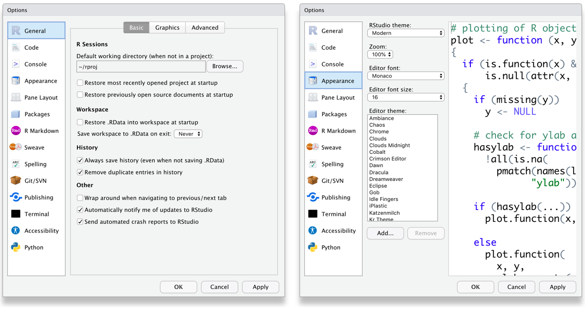

#```{r cite-packages, include = FALSE}
# automatically create a bib database for R packages
# add any packages you want to cite here
knitr::write_bib(c(
  .packages(), 'bookdown', 'tidyverse', 'tinytex'
), 'packages.bib')

```

::: small_right

:::


# Ders Hakkında {.unnumbered}

Bu dersin amacı, R yazılımını kullanarak veri üzerinde istenilen çok değişkenli istatistiksel ve psikometrik işlemlerin yapılabilmesini sağlamaktır.

Tez ve makale çalışmalarında öğrencilerimizin analizlerini R yazılımı ile hiçbir paket programa ihtiyaç duymadan kendi başlarına yapmalarını sağlamaktır.

(İzlence) [**İzlence**](Izlence.html).

## Eğitmen {.unnumbered}

`<svg aria-hidden="true" role="img" viewBox="0 0 448 512" style="height:1em;width:0.88em;vertical-align:-0.125em;margin-left:auto;margin-right:auto;font-size:inherit;fill:black;overflow:visible;position:relative;"><path d="M224 256A128 128 0 1 1 224 0a128 128 0 1 1 0 256zM209.1 359.2l-18.6-31c-6.4-10.7 1.3-24.2 13.7-24.2H224h19.7c12.4 0 20.1 13.6 13.7 24.2l-18.6 31 33.4 123.9 36-146.9c2-8.1 9.8-13.4 17.9-11.3c70.1 17.6 121.9 81 121.9 156.4c0 17-13.8 30.7-30.7 30.7H285.5c-2.1 0-4-.4-5.8-1.1l.3 1.1H168l.3-1.1c-1.8 .7-3.8 1.1-5.8 1.1H30.7C13.8 512 0 498.2 0 481.3c0-75.5 51.9-138.9 121.9-156.4c8.1-2 15.9 3.3 17.9 11.3l36 146.9 33.4-123.9z"/></svg>`{=html} [Dr. Kübra Atalay Kabasakal](https://avesis.hacettepe.edu.tr/katalay)

`<svg aria-hidden="true" role="img" viewBox="0 0 512 512" style="height:1em;width:1em;vertical-align:-0.125em;margin-left:auto;margin-right:auto;font-size:inherit;fill:black;overflow:visible;position:relative;"><path d="M64 112c-8.8 0-16 7.2-16 16v22.1L220.5 291.7c20.7 17 50.4 17 71.1 0L464 150.1V128c0-8.8-7.2-16-16-16H64zM48 212.2V384c0 8.8 7.2 16 16 16H448c8.8 0 16-7.2 16-16V212.2L322 328.8c-38.4 31.5-93.7 31.5-132 0L48 212.2zM0 128C0 92.7 28.7 64 64 64H448c35.3 0 64 28.7 64 64V384c0 35.3-28.7 64-64 64H64c-35.3 0-64-28.7-64-64V128z"/></svg>`{=html} [kkatalay\@gmail.com](mailto:kkatalay@gmail.com){.email}

`<svg aria-hidden="true" role="img" viewBox="0 0 512 512" style="height:1em;width:1em;vertical-align:-0.125em;margin-left:auto;margin-right:auto;font-size:inherit;fill:black;overflow:visible;position:relative;"><path d="M64 112c-8.8 0-16 7.2-16 16v22.1L220.5 291.7c20.7 17 50.4 17 71.1 0L464 150.1V128c0-8.8-7.2-16-16-16H64zM48 212.2V384c0 8.8 7.2 16 16 16H448c8.8 0 16-7.2 16-16V212.2L322 328.8c-38.4 31.5-93.7 31.5-132 0L48 212.2zM0 128C0 92.7 28.7 64 64 64H448c35.3 0 64 28.7 64 64V384c0 35.3-28.7 64-64 64H64c-35.3 0-64-28.7-64-64V128z"/></svg>`{=html} [katalay\@hacettepe.edu.tr](mailto:katalay@hacettepe.edu.tr){.email}

## Kitaplar {.unnumbered}

-   Atar, B., Atalay Kabasakal, K, Unsal Ozberk, E. B., Ozberk, E. H. & Kibrislioglu Uysal, N. (2020). R ile Veri Analizi ve Psikometri Uygulamaları, Pegem Akademi, Ankara.🔗 [📖](https://pegem.net/urun/R-ile-Veri-Analizi-ve-Psikometri-Uygulamalari/60801)


-   Desjardins, C. D., & Bulut, O. (2018). Handbook of educational measurement and psychometrics using R. Boca Raton, FL: CRC Press. 🔗[📖](https://www.routledge.com/Handbook-of-Educational-Measurement-and-Psychometrics-Using-R/Desjardins-Bulut/p/book/9780367734671)

- Demir, E. R Diliyle İstatistik Uygulamaları. Pegem Akademi, Ankara.(2021). 🔗[📖](https://pegem.net/urun/R-Diliyle-Istatistik-Uygulamalari/61912)


## Kaynaklar {.unnumbered}

* Bu ders materyallerine ek olarak, R öğrenmek için bir dizi mükemmel kaynak vardır:

- 🔗 [R kurulumu ile ilgili bilgiler içerir. ](https://psyteachr.github.io/data-skills-v2/installing-r.html)

- 🔗 [R studio ve güncellemeler ile ilgili bilgiler içerir. ](https://psyteachr.github.io/analysis-v2/updating-r-rstudio-and-packages.html)

-   * 🔗[Alana ozgu paketlerini inceleyebilirsiniz ](https://cran.r* project.org/web/views/Psychometrics.html)


-  🔗 📖[R Cookbook](http://www.cookbook-r.com/)

-  🔗📖[Veri Bilimi için R](https://r4ds.had.co.nz/)

* 🔗 👨 [Hadley Wickham](https://hadley.nz/)


-  🔗[StackOverflow soru-cevap platfromu](https://stackoverflow.com/)

-  Twitter'da [#rstats](https://twitter.com/search?f=tweets&q=%23rstats&src=typd) hashtag'ini arayın veya kullanın. 
  
  -  e-posta gruplarındaki e-postalara `RSiteSearch ("sample.int")` "

* 🔗[R ile ilgili farklı ücretsiz kaynakları bulabilirsiniz (kitaplar, videolar, websiteleri). Bu kaynakların bazıları başlangıç seviyesinde.](https://www.learnr4free.com/tr/index.html){.uri}
* 🔗[Referans kartları](https://cran.r-project.org/doc/contrib/Short-refcard.pdf)

* 🔗[Cheat Sheets](https://www.rstudio.com/resources/cheatsheets/)

<!--chapter:end:index.Rmd-->

# Inclusion

We want our resources to be accessible to everyone. This means thinking about accessibility with regards to disability, language, identity, and other characteristics. This is a work in progress; feel free to suggest additions.


## Tips for text-readers

Some students need to use text readers for accessibility; others just prefer this method. Here are some tips for improving their experience from the [Dyslexia Style Guide](https://www.bdadyslexia.org.uk/advice/employers/creating-a-dyslexia-friendly-workplace/dyslexia-friendly-style-guide).

* Use straight quotation marks
* Avoid roman numerals
* Avoid text in figures

Bookdown books allow readers to change the font style, size, and background colour. This provides essential accessibility for some people, such as those with dyslexia or visual impairments. Therefore, avoid putting too much text in figures and provide descriptions of images in the figure caption.

## Resources for blind coders

* [BrailleR](https://github.com/ajrgodfrey/BrailleR): a collection of tools to make use of R a happier experience for blind people
* [Statistical Software from a Blind Person’s Perspective](https://journal.r-project.org/archive/2013/RJ-2013-007/RJ-2013-007.pdf)

## Dyslexia-friendly resources

* [British Dyslexia Association](https://www.bdadyslexia.org.uk/educator)
* [Dyslexia Style Guide](https://www.bdadyslexia.org.uk/advice/employers/creating-a-dyslexia-friendly-workplace/dyslexia-friendly-style-guide)
* [Dyslexia and Coding](https://datacarpentry.org/blog/2017/09/coding-and-dyslexia): Data Carpentry blog post
* [fcuk](https://cran.r-project.org/web/packages/fcuk/vignettes/fcuk.html): A package designed to help people with clumsy fingers


Some recommendations are highlighted below.

* Avoid underlining, block capitals, and italics -- Use bold instead
* Use [boxes and borders](conventions.html#alert-boxes) for effective emphasis
* Use left-justified with ragged right edge (don't full-justify)
* Use bullet points and numbering rather than continuous prose
* Use the active voice with concise, direct sentences
* Avoid abbreviations and provide a [glossary](glossary.html) of jargon


## Colour

You can check your images for how they look to people with different types of colourblindness with the [Coblis Color Blindness Simulator](https://www.color-blindness.com/coblis-color-blindness-simulator/).

Desi Quintans made [dark and light colour-blind safe RStudio themes](https://github.com/DesiQuintans/Pebble-safe).

The "pink" and "green" colours from the [psyteachr_colours()]() function are distinguishable by people with protanopia (red-blind), deuteronopia (green-blind), and tritanopia (blue-blind) colourblindness. You can also use viridis colours with `ggplot2::scale_colour_viridis_d()` and `ggplot2::scale_fill_viridis_d()` (for discrete colours) or `ggplot2::scale_colour_viridis_c()` and `ggplot2::scale_fill_viridis_c()` (for continuous colours).

In plots, add secondary indicators in addition to colour, such as text labels or shapes.

<div class="figure" style="text-align: center">

<p class="caption">(\#fig:plot-text-labels)Text labels supplement colour information.</p>
</div>


<div class="figure" style="text-align: center">

<p class="caption">(\#fig:plot-text-labels-facet)Facet labels and redundant colour information.</p>
</div>

<div class="figure" style="text-align: center">

<p class="caption">(\#fig:plot-shapes)Supplement point colours with shapes.</p>
</div>

## Sex, gender and sexuality

When teaching about experimental design, sex always used to be my go-to example of a two-level between-subjects factor. But this can make some people feel like their very existence is being ignored. In your examples, avoid implicitly assuming heterosexuality or binary gender.

If you want to suggest an in-class exercise that uses data from the students, make sure to choose something that doesn't exclude anyone. 

* Pet owners/non-pet owners
* Normally does/doesn't wear glasses
* Can/can't juggle
* Native/non-native English speakers
* Born in Scotland/elsewhere


<!--chapter:end:01-intro.Rmd-->

# (APPENDIX) Appendices {-} 

<!--chapter:end:appendix-0.Rmd-->

# Installing `R` {#installing-r}

Installing R and RStudio is usually straightforward. The sections below explain how and [there is a helpful YouTube video here](https://www.youtube.com/watch?v=lVKMsaWju8w){target="_blank"}.

## Installing Base R

[Install base R](https://cran.rstudio.com/){target="_blank"}. Choose the download link for your operating system (Linux, Mac OS X, or Windows).

If you have a Mac, install the latest release from the newest `R-x.x.x.pkg` link (or a legacy version if you have an older operating system). After you install R, you should also install [XQuartz](http://xquartz.macosforge.org/){target="_blank"} to be able to use some visualisation packages.

If you are installing the Windows version, choose the "[base](https://cran.rstudio.com/bin/windows/base/)" subdirectory and click on the download link at the top of the page. After you install R, you should also install [RTools](https://cran.rstudio.com/bin/windows/Rtools/){target="_blank"}; use the "recommended" version highlighted near the top of the list.

If you are using Linux, choose your specific operating system and follow the installation instructions.

## Installing RStudio

Go to [rstudio.com](https://www.rstudio.com/products/rstudio/download/#download){target="_blank"} and download the RStudio Desktop (Open Source License) version for your operating system under the list titled **Installers for Supported Platforms**.

## RStudio Settings

There are a few settings you should fix immediately after updating RStudio. Go to **`Global Options...`** under the **`Tools`** menu (&#8984;,), and in the General tab, uncheck the box that says **`Restore .RData into workspace at startup`**.  If you keep things around in your workspace, things will get messy, and unexpected things will happen. You should always start with a clear workspace. This also means that you never want to save your workspace when you exit, so set this to **`Never`**. The only thing you want to save are your scripts.

You may also want to change the appearance of your code. Different fonts and themes can sometimes help with visual difficulties or [dyslexia](https://datacarpentry.org/blog/2017/09/coding-and-dyslexia){target="_blank"}. 

<div class="figure" style="text-align: center">

<p class="caption">(\#fig:settings-general)RStudio General and Appearance settings</p>
</div>

You may also want to change the settings in the Code tab. Foe example, Lisa prefers two spaces instead of tabs for my code and likes to be able to see the <a class='glossary'>whitespace<span class='def'></span></a> characters. But these are all a matter of personal preference.

<div class="figure" style="text-align: center">

<p class="caption">(\#fig:settings-code)RStudio Code settings</p>
</div>


## Installing LaTeX

You can install the LaTeX typesetting system to produce PDF reports from RStudio. Without this additional installation, you will be able to produce reports in HTML but not PDF. This course will not require you to make PDFs. To generate PDF reports, you will additionally need to install <code class='package'>tinytex</code> [@R-tinytex] and run the following code:


```r
tinytex::install_tinytex()
```

<!--chapter:end:appendix-a-installing-r.Rmd-->

# Symbols {#symbols}

| Symbol | psyTeachR Term    | Also Known As     |
|:------:|:------------------|:------------------|
| ()     | (round) brackets  | parentheses       |
| []     | square brackets   | brackets          |
| {}     | curly brackets    | squiggly brackets |
| <>     | chevrons          | angled brackets / guillemets |
| <      | less than         |                   |
| >      | greater than      |                   |
| &      | ampersand         | "and" symbol      |
| #      | hash              | pound / octothorpe|
| /      | slash             | forward slash     |
| \\     | backslash         |                   |
| -      | dash              | hyphen / minus    |
| _      | underscore        |                   |
| *      | asterisk          | star              |
| ^      | caret             | power symbol      |
| ~      | tilde             | twiddle / squiggle|
| =      | equal sign        |                   |
| ==     | double equal sign |                   |
| .      | full stop         | period / point    |
| !      | exclamation mark  | bang / not        |
| ?      | question mark     |                   |
| '      | single quote      | quote / apostrophe|
| "      | double quote      | quote             |
| %>%    | pipe              | magrittr pipe     |
| \|     | vertical bar      | pipe              |
| ,      | comma             |                   |
| ;      | semi-colon        |                   |
| :      | colon             |                   |
| @      | "at" symbol       | [various hilarious regional terms](https://www.theguardian.com/notesandqueries/query/0,5753,-1773,00.html) |
| ...    | `glossary("ellipsis")`| dots     |


<div class="figure" style="text-align: center">

<p class="caption">(\#fig:img-soundimals-hash)[Image by James Chapman/Soundimals](https://soundimals.tumblr.com/post/167354564886/chapmangamo-the-symbol-has-too-many-names)</p>
</div>


<!--chapter:end:appendix-b-symbols.Rmd-->

# Conventions

This book will use the following conventions:

* Generic code: `list(number = 1, letter = "A")`
* Highlighted code: <code><span><span class='fu'>dplyr</span><span class='fu'>::</span><span class='fu'><a target='_blank' href='https://dplyr.tidyverse.org/reference/slice.html'>slice_max</a></span><span class='op'>(</span><span class='op'>)</span></span></code>
* File paths: <code class='path'>data/sales.csv</code>
* R Packages: <code class='package'>tidyverse</code>
* Functions: <code><span><span class='fu'><a target='_blank' href='https://rdrr.io/r/base/paste.html'>paste</a></span><span class='op'>(</span><span class='op'>)</span></span></code>
* Strings: <code><span><span class='st'>"psyTeachR"</span></span></code>
* Numbers: <code><span><span class='fl'>100</span></span></code>, <code><span><span class='fl'>3.14</span></span></code>
* Logical values: <code><span><span class='cn'>TRUE</span></span></code>, <code><span><span class='cn'>FALSE</span></span></code>
* Glossary items: <a class='glossary'>ordinal<span class='def'></span></a>
* Citations: @R-tidyverse
* Internal links: Chapter\ \@ref(inclusion)
* External links: [R for Data Science](https://r4ds.had.co.nz/){target="_blank"}
* Menu/interface options: **`New File...`**

## Webexercises

See [webexercises](https://psyteachr.github.io/webexercises/) for more details about how to use this in your materials.

* Type an integer: <input class='webex-solveme nospaces regex' size='1' data-answer='["^[0-9]{1}$"]'/>
* I am going to learn a lot: <select class='webex-select'><option value='blank'></option><option value='answer'>TRUE</option><option value='x'>FALSE</option></select>
* What is a p-value? <div class='webex-radiogroup' id='radio_CHAREOXOZX'><label><input type="radio" autocomplete="off" name="radio_CHAREOXOZX" value="x"></input> <span>the probability that the null hypothesis is true</span></label><label><input type="radio" autocomplete="off" name="radio_CHAREOXOZX" value="answer"></input> <span>the probability of the observed (or more extreme) data, under the assumption that the null-hypothesis is true</span></label><label><input type="radio" autocomplete="off" name="radio_CHAREOXOZX" value="x"></input> <span>the probability of making an error in your conclusion</span></label></div>


<div class='webex-solution'><button>Hidden Text</button>
You found some hidden text!
</div>


<div class='webex-solution'><button>Hidden Code</button>

```r
print("You found some hidden code!")
```

```
## [1] "You found some hidden code!"
```


</div>

## Alert boxes

::: {.info data-latex=""}
Informational asides.
:::

::: {.warning data-latex=""}
Notes to warn you about something.
:::

::: {.dangerous data-latex=""}
Notes about things that could cause serious errors.
:::

::: {.try data-latex=""}
Try it yourself.
:::

## Code Chunks


```r
# code chunks
paste("Applied", "Data", "Skills", 1, sep = " ")
```

```
## [1] "Applied Data Skills 1"
```


<div class='verbatim'><pre class='sourceCode r'><code class='sourceCode R'>&#96;&#96;&#96;{r setup, message = FALSE}</code></pre>

```r
# code chunks with visible r headers
library(tidyverse)
```

<pre class='sourceCode r'><code class='sourceCode R'>&#96;&#96;&#96;</code></pre></div>

## Glossary

<table class="table" style="margin-left: auto; margin-right: auto;">
 <thead>
  <tr>
   <th style="text-align:left;"> term </th>
   <th style="text-align:left;"> definition </th>
  </tr>
 </thead>
<tbody>
  <tr>
   <td style="text-align:left;"> ordinal </td>
   <td style="text-align:left;">  </td>
  </tr>
</tbody>
</table>


<!--chapter:end:appendix-c-conventions.Rmd-->

# Glossary


<!--chapter:end:appendix-d-glossary.Rmd-->

# License {-}

This book is licensed under Creative Commons Attribution-ShareAlike 4.0 International License [(CC-BY-SA 4.0)](https://creativecommons.org/licenses/by-sa/4.0/){target="_blank"}. You are free to share and adapt this book. You must give appropriate credit [@psyteachr-template], provide a link to the license, and indicate if changes were made. If you adapt the material, you must distribute your contributions under the same license as the original. 


<!--chapter:end:appendix-y-license.Rmd-->

# References {-}

<!--chapter:end:appendix-z-refs.Rmd-->

