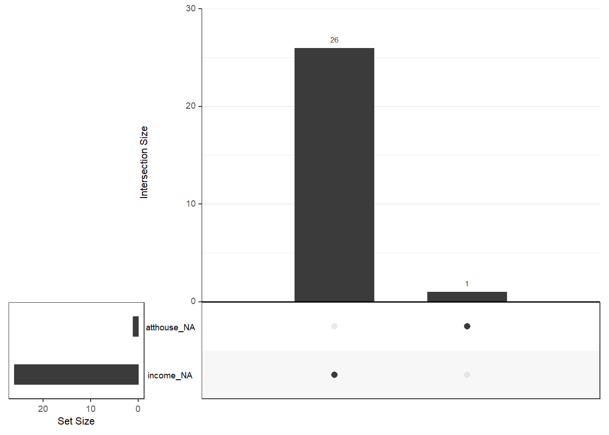

# Varsayımlar I

-   Veri Dosyasındaki Verinin Doğruluğu

-   Kayıp Verinin Miktarı ve Dağılımı

-   Tek Değişkenli ve Çok Değişkenli Uç Değerler (Outliers)

-   Sayıltılar

-   Çoklu Bağlantı (Multicollinearity) ve Tekillik (Singularity)

## Veri İnceleme

-   Varsayımlar incelenirken ilk olarak yanlış girilmiş bir değer olup
    olmadığına bakılmalıdır.

-   Bu bölümde 🔗 [SCREEN.SAV](import/SCREEN.SAV) adlı
    veri seti kullanılmıştır. Bu veri setinde 20-59 yaşları arasında 465
    kadının 6 değişkene ilişkin bilgileri bulunmaktadır. Değişkenlerden
    timedrs, attdrug, atthouse ve income değişkenleri sürekli, mstatus
    ve race değişkenleriyse iki kategorili değişkenlerdir. Bu veri seti
    **Tabachnick, B. G., & Fidell, L. S. (2012). Using Multivariate
    Statistics (4rd ed.). New York: Harper Collins.** kitabının 4.
    bölümünde kullanılmaktadır.

-   Veri incelemede birden fazla paket kullanılabilir. En temel
    fonksiyon `base` paketin `summary()` fonksiyonudur. `psych`
    paketinde `describe()` fonksiyonu da aynı amaçla kullanılabilir.


```r
library(haven)
screen <- read_sav("import/SCREEN.sav")
head(screen)
```

<div class="kable-table">

| subno| timedrs| attdrug| atthouse| income| mstatus| race|
|-----:|-------:|-------:|--------:|------:|-------:|----:|
|     1|       1|       8|       27|      5|       2|    1|
|     2|       3|       7|       20|      6|       2|    1|
|     3|       0|       8|       23|      3|       2|    1|
|     4|      13|       9|       28|      8|       2|    1|
|     5|      15|       7|       24|      1|       2|    1|
|     6|       3|       8|       25|      4|       2|    1|

</div>

-   Veri setindeki maksimum ve minumum değerleri belirlenmiştir.


```r
summary(screen)
```

```
##      subno          timedrs          attdrug          atthouse    
##  Min.   :  1.0   Min.   : 0.000   Min.   : 5.000   Min.   : 2.00  
##  1st Qu.:137.0   1st Qu.: 2.000   1st Qu.: 7.000   1st Qu.:21.00  
##  Median :314.0   Median : 4.000   Median : 8.000   Median :24.00  
##  Mean   :317.4   Mean   : 7.901   Mean   : 7.686   Mean   :23.54  
##  3rd Qu.:483.0   3rd Qu.:10.000   3rd Qu.: 9.000   3rd Qu.:27.00  
##  Max.   :758.0   Max.   :81.000   Max.   :10.000   Max.   :35.00  
##                                                    NA's   :1      
##      income         mstatus           race      
##  Min.   : 1.00   Min.   :1.000   Min.   :1.000  
##  1st Qu.: 2.50   1st Qu.:2.000   1st Qu.:1.000  
##  Median : 4.00   Median :2.000   Median :1.000  
##  Mean   : 4.21   Mean   :1.778   Mean   :1.088  
##  3rd Qu.: 6.00   3rd Qu.:2.000   3rd Qu.:1.000  
##  Max.   :10.00   Max.   :2.000   Max.   :2.000  
##  NA's   :26
```

-   Elde edilen değerlerin makul olduğu söylenebilir. Ancak bunu elde
    etmek için başka yollar da bulunmaktadır. `psych` paketi ile
    inceleme daha ayrıntılı yapılabilir.


```r
library(psych)
```

```
## 
## Attaching package: 'psych'
```

```
## The following objects are masked from 'package:ggplot2':
## 
##     %+%, alpha
```

```r
round(describe(screen[,-1]),2)
```

<div class="kable-table">

|         | vars|   n|  mean|    sd| median| trimmed|  mad| min| max| range|  skew| kurtosis|   se|
|:--------|----:|---:|-----:|-----:|------:|-------:|----:|---:|---:|-----:|-----:|--------:|----:|
|timedrs  |    1| 465|  7.90| 10.95|      4|    5.61| 4.45|   0|  81|    81|  3.23|    12.88| 0.51|
|attdrug  |    2| 465|  7.69|  1.16|      8|    7.71| 1.48|   5|  10|     5| -0.12|    -0.47| 0.05|
|atthouse |    3| 464| 23.54|  4.48|     24|   23.62| 4.45|   2|  35|    33| -0.45|     1.51| 0.21|
|income   |    4| 439|  4.21|  2.42|      4|    4.01| 2.97|   1|  10|     9|  0.58|    -0.38| 0.12|
|mstatus  |    5| 465|  1.78|  0.42|      2|    1.85| 0.00|   1|   2|     1| -1.34|    -0.21| 0.02|
|race     |    6| 465|  1.09|  0.28|      1|    1.00| 0.00|   1|   2|     1|  2.90|     6.40| 0.01|

</div>

🔗 [personality-project
sayfasını](https://personality-project.org/r/psych/) daha fazla örnek
için inceleyebilirsiniz.

-   `gtsummary` paketi ile inceleme


```r
library(gtsummary)
screen %>% select(2:6) %>%tbl_summary(statistic = all_continuous() ~ c(
"{min}, {max}"),missing ="always")
```

```{=html}
<div id="reajefnsly" style="padding-left:0px;padding-right:0px;padding-top:10px;padding-bottom:10px;overflow-x:auto;overflow-y:auto;width:auto;height:auto;">
<style>#reajefnsly table {
  font-family: system-ui, 'Segoe UI', Roboto, Helvetica, Arial, sans-serif, 'Apple Color Emoji', 'Segoe UI Emoji', 'Segoe UI Symbol', 'Noto Color Emoji';
  -webkit-font-smoothing: antialiased;
  -moz-osx-font-smoothing: grayscale;
}

#reajefnsly thead, #reajefnsly tbody, #reajefnsly tfoot, #reajefnsly tr, #reajefnsly td, #reajefnsly th {
  border-style: none;
}

#reajefnsly p {
  margin: 0;
  padding: 0;
}

#reajefnsly .gt_table {
  display: table;
  border-collapse: collapse;
  line-height: normal;
  margin-left: auto;
  margin-right: auto;
  color: #333333;
  font-size: 16px;
  font-weight: normal;
  font-style: normal;
  background-color: #FFFFFF;
  width: auto;
  border-top-style: solid;
  border-top-width: 2px;
  border-top-color: #A8A8A8;
  border-right-style: none;
  border-right-width: 2px;
  border-right-color: #D3D3D3;
  border-bottom-style: solid;
  border-bottom-width: 2px;
  border-bottom-color: #A8A8A8;
  border-left-style: none;
  border-left-width: 2px;
  border-left-color: #D3D3D3;
}

#reajefnsly .gt_caption {
  padding-top: 4px;
  padding-bottom: 4px;
}

#reajefnsly .gt_title {
  color: #333333;
  font-size: 125%;
  font-weight: initial;
  padding-top: 4px;
  padding-bottom: 4px;
  padding-left: 5px;
  padding-right: 5px;
  border-bottom-color: #FFFFFF;
  border-bottom-width: 0;
}

#reajefnsly .gt_subtitle {
  color: #333333;
  font-size: 85%;
  font-weight: initial;
  padding-top: 3px;
  padding-bottom: 5px;
  padding-left: 5px;
  padding-right: 5px;
  border-top-color: #FFFFFF;
  border-top-width: 0;
}

#reajefnsly .gt_heading {
  background-color: #FFFFFF;
  text-align: center;
  border-bottom-color: #FFFFFF;
  border-left-style: none;
  border-left-width: 1px;
  border-left-color: #D3D3D3;
  border-right-style: none;
  border-right-width: 1px;
  border-right-color: #D3D3D3;
}

#reajefnsly .gt_bottom_border {
  border-bottom-style: solid;
  border-bottom-width: 2px;
  border-bottom-color: #D3D3D3;
}

#reajefnsly .gt_col_headings {
  border-top-style: solid;
  border-top-width: 2px;
  border-top-color: #D3D3D3;
  border-bottom-style: solid;
  border-bottom-width: 2px;
  border-bottom-color: #D3D3D3;
  border-left-style: none;
  border-left-width: 1px;
  border-left-color: #D3D3D3;
  border-right-style: none;
  border-right-width: 1px;
  border-right-color: #D3D3D3;
}

#reajefnsly .gt_col_heading {
  color: #333333;
  background-color: #FFFFFF;
  font-size: 100%;
  font-weight: normal;
  text-transform: inherit;
  border-left-style: none;
  border-left-width: 1px;
  border-left-color: #D3D3D3;
  border-right-style: none;
  border-right-width: 1px;
  border-right-color: #D3D3D3;
  vertical-align: bottom;
  padding-top: 5px;
  padding-bottom: 6px;
  padding-left: 5px;
  padding-right: 5px;
  overflow-x: hidden;
}

#reajefnsly .gt_column_spanner_outer {
  color: #333333;
  background-color: #FFFFFF;
  font-size: 100%;
  font-weight: normal;
  text-transform: inherit;
  padding-top: 0;
  padding-bottom: 0;
  padding-left: 4px;
  padding-right: 4px;
}

#reajefnsly .gt_column_spanner_outer:first-child {
  padding-left: 0;
}

#reajefnsly .gt_column_spanner_outer:last-child {
  padding-right: 0;
}

#reajefnsly .gt_column_spanner {
  border-bottom-style: solid;
  border-bottom-width: 2px;
  border-bottom-color: #D3D3D3;
  vertical-align: bottom;
  padding-top: 5px;
  padding-bottom: 5px;
  overflow-x: hidden;
  display: inline-block;
  width: 100%;
}

#reajefnsly .gt_spanner_row {
  border-bottom-style: hidden;
}

#reajefnsly .gt_group_heading {
  padding-top: 8px;
  padding-bottom: 8px;
  padding-left: 5px;
  padding-right: 5px;
  color: #333333;
  background-color: #FFFFFF;
  font-size: 100%;
  font-weight: initial;
  text-transform: inherit;
  border-top-style: solid;
  border-top-width: 2px;
  border-top-color: #D3D3D3;
  border-bottom-style: solid;
  border-bottom-width: 2px;
  border-bottom-color: #D3D3D3;
  border-left-style: none;
  border-left-width: 1px;
  border-left-color: #D3D3D3;
  border-right-style: none;
  border-right-width: 1px;
  border-right-color: #D3D3D3;
  vertical-align: middle;
  text-align: left;
}

#reajefnsly .gt_empty_group_heading {
  padding: 0.5px;
  color: #333333;
  background-color: #FFFFFF;
  font-size: 100%;
  font-weight: initial;
  border-top-style: solid;
  border-top-width: 2px;
  border-top-color: #D3D3D3;
  border-bottom-style: solid;
  border-bottom-width: 2px;
  border-bottom-color: #D3D3D3;
  vertical-align: middle;
}

#reajefnsly .gt_from_md > :first-child {
  margin-top: 0;
}

#reajefnsly .gt_from_md > :last-child {
  margin-bottom: 0;
}

#reajefnsly .gt_row {
  padding-top: 8px;
  padding-bottom: 8px;
  padding-left: 5px;
  padding-right: 5px;
  margin: 10px;
  border-top-style: solid;
  border-top-width: 1px;
  border-top-color: #D3D3D3;
  border-left-style: none;
  border-left-width: 1px;
  border-left-color: #D3D3D3;
  border-right-style: none;
  border-right-width: 1px;
  border-right-color: #D3D3D3;
  vertical-align: middle;
  overflow-x: hidden;
}

#reajefnsly .gt_stub {
  color: #333333;
  background-color: #FFFFFF;
  font-size: 100%;
  font-weight: initial;
  text-transform: inherit;
  border-right-style: solid;
  border-right-width: 2px;
  border-right-color: #D3D3D3;
  padding-left: 5px;
  padding-right: 5px;
}

#reajefnsly .gt_stub_row_group {
  color: #333333;
  background-color: #FFFFFF;
  font-size: 100%;
  font-weight: initial;
  text-transform: inherit;
  border-right-style: solid;
  border-right-width: 2px;
  border-right-color: #D3D3D3;
  padding-left: 5px;
  padding-right: 5px;
  vertical-align: top;
}

#reajefnsly .gt_row_group_first td {
  border-top-width: 2px;
}

#reajefnsly .gt_row_group_first th {
  border-top-width: 2px;
}

#reajefnsly .gt_summary_row {
  color: #333333;
  background-color: #FFFFFF;
  text-transform: inherit;
  padding-top: 8px;
  padding-bottom: 8px;
  padding-left: 5px;
  padding-right: 5px;
}

#reajefnsly .gt_first_summary_row {
  border-top-style: solid;
  border-top-color: #D3D3D3;
}

#reajefnsly .gt_first_summary_row.thick {
  border-top-width: 2px;
}

#reajefnsly .gt_last_summary_row {
  padding-top: 8px;
  padding-bottom: 8px;
  padding-left: 5px;
  padding-right: 5px;
  border-bottom-style: solid;
  border-bottom-width: 2px;
  border-bottom-color: #D3D3D3;
}

#reajefnsly .gt_grand_summary_row {
  color: #333333;
  background-color: #FFFFFF;
  text-transform: inherit;
  padding-top: 8px;
  padding-bottom: 8px;
  padding-left: 5px;
  padding-right: 5px;
}

#reajefnsly .gt_first_grand_summary_row {
  padding-top: 8px;
  padding-bottom: 8px;
  padding-left: 5px;
  padding-right: 5px;
  border-top-style: double;
  border-top-width: 6px;
  border-top-color: #D3D3D3;
}

#reajefnsly .gt_last_grand_summary_row_top {
  padding-top: 8px;
  padding-bottom: 8px;
  padding-left: 5px;
  padding-right: 5px;
  border-bottom-style: double;
  border-bottom-width: 6px;
  border-bottom-color: #D3D3D3;
}

#reajefnsly .gt_striped {
  background-color: rgba(128, 128, 128, 0.05);
}

#reajefnsly .gt_table_body {
  border-top-style: solid;
  border-top-width: 2px;
  border-top-color: #D3D3D3;
  border-bottom-style: solid;
  border-bottom-width: 2px;
  border-bottom-color: #D3D3D3;
}

#reajefnsly .gt_footnotes {
  color: #333333;
  background-color: #FFFFFF;
  border-bottom-style: none;
  border-bottom-width: 2px;
  border-bottom-color: #D3D3D3;
  border-left-style: none;
  border-left-width: 2px;
  border-left-color: #D3D3D3;
  border-right-style: none;
  border-right-width: 2px;
  border-right-color: #D3D3D3;
}

#reajefnsly .gt_footnote {
  margin: 0px;
  font-size: 90%;
  padding-top: 4px;
  padding-bottom: 4px;
  padding-left: 5px;
  padding-right: 5px;
}

#reajefnsly .gt_sourcenotes {
  color: #333333;
  background-color: #FFFFFF;
  border-bottom-style: none;
  border-bottom-width: 2px;
  border-bottom-color: #D3D3D3;
  border-left-style: none;
  border-left-width: 2px;
  border-left-color: #D3D3D3;
  border-right-style: none;
  border-right-width: 2px;
  border-right-color: #D3D3D3;
}

#reajefnsly .gt_sourcenote {
  font-size: 90%;
  padding-top: 4px;
  padding-bottom: 4px;
  padding-left: 5px;
  padding-right: 5px;
}

#reajefnsly .gt_left {
  text-align: left;
}

#reajefnsly .gt_center {
  text-align: center;
}

#reajefnsly .gt_right {
  text-align: right;
  font-variant-numeric: tabular-nums;
}

#reajefnsly .gt_font_normal {
  font-weight: normal;
}

#reajefnsly .gt_font_bold {
  font-weight: bold;
}

#reajefnsly .gt_font_italic {
  font-style: italic;
}

#reajefnsly .gt_super {
  font-size: 65%;
}

#reajefnsly .gt_footnote_marks {
  font-size: 75%;
  vertical-align: 0.4em;
  position: initial;
}

#reajefnsly .gt_asterisk {
  font-size: 100%;
  vertical-align: 0;
}

#reajefnsly .gt_indent_1 {
  text-indent: 5px;
}

#reajefnsly .gt_indent_2 {
  text-indent: 10px;
}

#reajefnsly .gt_indent_3 {
  text-indent: 15px;
}

#reajefnsly .gt_indent_4 {
  text-indent: 20px;
}

#reajefnsly .gt_indent_5 {
  text-indent: 25px;
}
</style>
<table class="gt_table" data-quarto-disable-processing="false" data-quarto-bootstrap="false">
  <thead>
    <tr class="gt_col_headings">
      <th class="gt_col_heading gt_columns_bottom_border gt_left" rowspan="1" colspan="1" scope="col" id="&lt;strong&gt;Characteristic&lt;/strong&gt;"><strong>Characteristic</strong></th>
      <th class="gt_col_heading gt_columns_bottom_border gt_center" rowspan="1" colspan="1" scope="col" id="&lt;strong&gt;N = 465&lt;/strong&gt;&lt;span class=&quot;gt_footnote_marks&quot; style=&quot;white-space:nowrap;font-style:italic;font-weight:normal;&quot;&gt;&lt;sup&gt;1&lt;/sup&gt;&lt;/span&gt;"><strong>N = 465</strong><span class="gt_footnote_marks" style="white-space:nowrap;font-style:italic;font-weight:normal;"><sup>1</sup></span></th>
    </tr>
  </thead>
  <tbody class="gt_table_body">
    <tr><td headers="label" class="gt_row gt_left">Visits to health professionals</td>
<td headers="stat_0" class="gt_row gt_center">0, 81</td></tr>
    <tr><td headers="label" class="gt_row gt_left">    Unknown</td>
<td headers="stat_0" class="gt_row gt_center">0</td></tr>
    <tr><td headers="label" class="gt_row gt_left">Attitudes toward medication</td>
<td headers="stat_0" class="gt_row gt_center"><br /></td></tr>
    <tr><td headers="label" class="gt_row gt_left">    5</td>
<td headers="stat_0" class="gt_row gt_center">13 (2.8%)</td></tr>
    <tr><td headers="label" class="gt_row gt_left">    6</td>
<td headers="stat_0" class="gt_row gt_center">60 (13%)</td></tr>
    <tr><td headers="label" class="gt_row gt_left">    7</td>
<td headers="stat_0" class="gt_row gt_center">126 (27%)</td></tr>
    <tr><td headers="label" class="gt_row gt_left">    8</td>
<td headers="stat_0" class="gt_row gt_center">149 (32%)</td></tr>
    <tr><td headers="label" class="gt_row gt_left">    9</td>
<td headers="stat_0" class="gt_row gt_center">95 (20%)</td></tr>
    <tr><td headers="label" class="gt_row gt_left">    10</td>
<td headers="stat_0" class="gt_row gt_center">22 (4.7%)</td></tr>
    <tr><td headers="label" class="gt_row gt_left">    Unknown</td>
<td headers="stat_0" class="gt_row gt_center">0</td></tr>
    <tr><td headers="label" class="gt_row gt_left">Attitudes toward housework</td>
<td headers="stat_0" class="gt_row gt_center">2.0, 35.0</td></tr>
    <tr><td headers="label" class="gt_row gt_left">    Unknown</td>
<td headers="stat_0" class="gt_row gt_center">1</td></tr>
    <tr><td headers="label" class="gt_row gt_left">Income</td>
<td headers="stat_0" class="gt_row gt_center">1.00, 10.00</td></tr>
    <tr><td headers="label" class="gt_row gt_left">    Unknown</td>
<td headers="stat_0" class="gt_row gt_center">26</td></tr>
    <tr><td headers="label" class="gt_row gt_left">Whether currently married</td>
<td headers="stat_0" class="gt_row gt_center"><br /></td></tr>
    <tr><td headers="label" class="gt_row gt_left">    1</td>
<td headers="stat_0" class="gt_row gt_center">103 (22%)</td></tr>
    <tr><td headers="label" class="gt_row gt_left">    2</td>
<td headers="stat_0" class="gt_row gt_center">362 (78%)</td></tr>
    <tr><td headers="label" class="gt_row gt_left">    Unknown</td>
<td headers="stat_0" class="gt_row gt_center">0</td></tr>
  </tbody>
  
  <tfoot class="gt_footnotes">
    <tr>
      <td class="gt_footnote" colspan="2"><span class="gt_footnote_marks" style="white-space:nowrap;font-style:italic;font-weight:normal;"><sup>1</sup></span> Range; n (%)</td>
    </tr>
  </tfoot>
</table>
</div>
```

-   🔗[Presentation-Ready Summary Tables] with
    gtsummary(<https://education.rstudio.com/blog/2020/07/gtsummary>)

-   `vtable` paketi ile inceleme


```r
library(vtable)
sumtable(screen, summ=c('notNA(x)','min(x)','max(x)'))
```

<table class="table" style="margin-left: auto; margin-right: auto;">
<caption>(\#tab:unnamed-chunk-5)Summary Statistics</caption>
 <thead>
  <tr>
   <th style="text-align:left;"> Variable </th>
   <th style="text-align:left;"> NotNA </th>
   <th style="text-align:left;"> Min </th>
   <th style="text-align:left;"> Max </th>
  </tr>
 </thead>
<tbody>
  <tr>
   <td style="text-align:left;"> subno </td>
   <td style="text-align:left;"> 465 </td>
   <td style="text-align:left;"> 1 </td>
   <td style="text-align:left;"> 758 </td>
  </tr>
  <tr>
   <td style="text-align:left;"> timedrs </td>
   <td style="text-align:left;"> 465 </td>
   <td style="text-align:left;"> 0 </td>
   <td style="text-align:left;"> 81 </td>
  </tr>
  <tr>
   <td style="text-align:left;"> attdrug </td>
   <td style="text-align:left;"> 465 </td>
   <td style="text-align:left;"> 5 </td>
   <td style="text-align:left;"> 10 </td>
  </tr>
  <tr>
   <td style="text-align:left;"> atthouse </td>
   <td style="text-align:left;"> 464 </td>
   <td style="text-align:left;"> 2 </td>
   <td style="text-align:left;"> 35 </td>
  </tr>
  <tr>
   <td style="text-align:left;"> income </td>
   <td style="text-align:left;"> 439 </td>
   <td style="text-align:left;"> 1 </td>
   <td style="text-align:left;"> 10 </td>
  </tr>
  <tr>
   <td style="text-align:left;"> mstatus </td>
   <td style="text-align:left;"> 465 </td>
   <td style="text-align:left;"> 1 </td>
   <td style="text-align:left;"> 2 </td>
  </tr>
  <tr>
   <td style="text-align:left;"> race </td>
   <td style="text-align:left;"> 465 </td>
   <td style="text-align:left;"> 1 </td>
   <td style="text-align:left;"> 2 </td>
  </tr>
</tbody>
</table>

-   🔗 [vtable paketi için
    örnekler](https://nickch-k.github.io/vtable/index.html)

-   sütun isimleri aşağıdaki gibi değiştirilebilir.


```r
sumtable(screen, summ = c('notNA(x)','min(x)','max(x)'),
         summ.names = c('Frekans'
,'Minimum','Maksimum'))
```

<table class="table" style="margin-left: auto; margin-right: auto;">
<caption>(\#tab:unnamed-chunk-6)Summary Statistics</caption>
 <thead>
  <tr>
   <th style="text-align:left;"> Variable </th>
   <th style="text-align:left;"> Frekans </th>
   <th style="text-align:left;"> Minimum </th>
   <th style="text-align:left;"> Maksimum </th>
  </tr>
 </thead>
<tbody>
  <tr>
   <td style="text-align:left;"> subno </td>
   <td style="text-align:left;"> 465 </td>
   <td style="text-align:left;"> 1 </td>
   <td style="text-align:left;"> 758 </td>
  </tr>
  <tr>
   <td style="text-align:left;"> timedrs </td>
   <td style="text-align:left;"> 465 </td>
   <td style="text-align:left;"> 0 </td>
   <td style="text-align:left;"> 81 </td>
  </tr>
  <tr>
   <td style="text-align:left;"> attdrug </td>
   <td style="text-align:left;"> 465 </td>
   <td style="text-align:left;"> 5 </td>
   <td style="text-align:left;"> 10 </td>
  </tr>
  <tr>
   <td style="text-align:left;"> atthouse </td>
   <td style="text-align:left;"> 464 </td>
   <td style="text-align:left;"> 2 </td>
   <td style="text-align:left;"> 35 </td>
  </tr>
  <tr>
   <td style="text-align:left;"> income </td>
   <td style="text-align:left;"> 439 </td>
   <td style="text-align:left;"> 1 </td>
   <td style="text-align:left;"> 10 </td>
  </tr>
  <tr>
   <td style="text-align:left;"> mstatus </td>
   <td style="text-align:left;"> 465 </td>
   <td style="text-align:left;"> 1 </td>
   <td style="text-align:left;"> 2 </td>
  </tr>
  <tr>
   <td style="text-align:left;"> race </td>
   <td style="text-align:left;"> 465 </td>
   <td style="text-align:left;"> 1 </td>
   <td style="text-align:left;"> 2 </td>
  </tr>
</tbody>
</table>

-   `kable` paketi ile `psych` paketi çıktılarını düzenleme


```r
ozet <- describe(screen[,-1])
kable(ozet,format='markdown',
      caption="Betimsel İstatistikler",digits=2)
```


Table: (\#tab:unnamed-chunk-7)Betimsel İstatistikler

|         | vars|   n|  mean|    sd| median| trimmed|  mad| min| max| range|  skew| kurtosis|   se|
|:--------|----:|---:|-----:|-----:|------:|-------:|----:|---:|---:|-----:|-----:|--------:|----:|
|timedrs  |    1| 465|  7.90| 10.95|      4|    5.61| 4.45|   0|  81|    81|  3.23|    12.88| 0.51|
|attdrug  |    2| 465|  7.69|  1.16|      8|    7.71| 1.48|   5|  10|     5| -0.12|    -0.47| 0.05|
|atthouse |    3| 464| 23.54|  4.48|     24|   23.62| 4.45|   2|  35|    33| -0.45|     1.51| 0.21|
|income   |    4| 439|  4.21|  2.42|      4|    4.01| 2.97|   1|  10|     9|  0.58|    -0.38| 0.12|
|mstatus  |    5| 465|  1.78|  0.42|      2|    1.85| 0.00|   1|   2|     1| -1.34|    -0.21| 0.02|
|race     |    6| 465|  1.09|  0.28|      1|    1.00| 0.00|   1|   2|     1|  2.90|     6.40| 0.01|

-   🔗
    [rmarkdown-cookbook](https://bookdown.org/yihui/rmarkdown-cookbook/kable.html)

## Kayıp Değerler

-   Kayıp veri, veri analizindeki en yaygın problemlerden biridir.

-   Kayıp verinin önemi kayıp verinin miktarına, örüntüsüne ve neden
    eksik olduğuna bağlıdır.

-   Bir değişkene ait beklenmeyen miktarda kayıp veri varsa, ilk olarak
    bunun nedeni araştırılmalıdır. Daha sonra kayıp verinin örüntüsüne
    bakılarak, rastlantısal mı yoksa sistematik bir örüntü mü gösterdiği
    belirlenmelidir.

    -   Örneğin, 30 yaşın üstündeki birçok kadın yaş ile ilgili soruyu
        cevaplamak istemezler.

-   Genellikle kayıp verinin örüntüsü miktarından daha önemlidir.
    Rastlantısal dağılmayan kayıp veriler sonuçların
    genellenebilirliğini etkileyeceğinden miktarları az da olsa,
    rastlantısal dağılan kayıp verilere oranla daha ciddi problemlere
    yol açarlar.

## Kayıp Veri Türleri

-   Kayıp veri türleri arasındaki ayrım 1976 yılında Rubin tarafından
    yapılmıştır. Rubin (1976) kayıp veriyi aşağıdaki şekilde
    sınıflandırmıştır.

    -   Tamamen Rastgele Olarak Kayıp (TRK) - Missing Completely at
        Random MCAR

    -   Rastgele Kayıp (RK) - Missing at Random (MAR)

    -   Rastgele Olmayan Kayıp / İhmal Edilemez Kayıp (ROK) - Not
        Missing at Random (NMAR)

-   Kayıp veri en azından MAR türünde değilse, kayıp verinin ihmal
    edilemeyeceği söylenir. Bu türdeki kayıp veri rastlantısal olamyan
    kayıp veya ihmal edilemez kayıp olarak adlandırılır.

-   Büyük bir veri setinde, verinin %5’i veya daha azı rastlantısal
    olarak kayıpsa çok ciddi problemlerle karşılaşılmaz ve kayıp veri
    ile ilgili problemleri çözmek için kullanılan herhangi bir yöntem
    benzer sonuçlar verir. Halbuki küçük veya orta büyüklükteki bir veri
    setinde çok sayıda veri kaybı varsa ciddi problemler ortaya
    çıkabilir.

-   Eldeki bilgiden yararlanarak kayıp verideki örüntüler test
    edilebilir.

### TRK

-   Bir Y değişkeninde kayıp veri bulunma olasılığının, Y değişkeninin
    kendi değerleriyle ve veri setindeki diğer değişkenlerin
    değerleriyle **ilişkisiz olması durumunda Y değişkenindeki verinin
    tamamen rastgele kayıp (TRK) olduğu söylenir (Allison, 2002).**

-   Örneğin; bir ilkokulda okuma başarısı üzerine yürütülen bir
    boylamsal araştırmada çocuklar hastalık ya da ailede ölüm gibi
    tesadüfi bir sebepten değerlendirmeye katılmadığında veri TRK olarak
    adlandırılır. Ayrıca bu faktörlerin sosyoekonomik düzey gibi ölçülen
    diğer değişkenle ilişkisi olmadığı varsayıldığında, araştırmacı
    tarafından elde edilen veriler hipotetik bir tam veri setinin
    rastgele bir örneklemini temsil eder (Peugh ve Enders, 2004).

### Rastgele kayıp (RK)

-   Bir Y değişkenindeki kayıp veri bulunma olasılığının, analiz
    modelindeki diğer değişkenlerin bazılarıyla ilişkili olduğunu ancak
    Y değişkeninin kendi değerleriyle ilişkili olmadığını ifade eder.

-   Örneğin, kanser hastalarıyla yaşam kalitesi üzerine çalışma yapan
    bir psikologun yaşlı ve eğitim düzeyi düşük hastaların yaşam
    kalitesi anketini reddetme eğiliminin daha yüksek olduğu sonucuna
    ulaştığını düşünelim. Bu durumda kayıp veriye eğilimin, kayıp veri
    bulunan değişkenle arasında artık ilişki yoksa verinin RK olduğu
    söylenir. Başka bir ifadeyle, RK yaş ve eğitim kontrol edildiğinde
    kayıp veri olasılığının yaşam kalitesiyle arasında ilişki olmaması
    durumudur (Enders, 2010). Kayıp veri olasılığı yalnızca diğer
    gözlenen değişkenlerin değerlerine bağlı olduğunda veri RK’dır
    (Robitzsch ve Rupp, 2009).

-   RK türünde veri gerçekte rastlantısal olarak kayıp değildir, veri
    kaybı veri setindeki değişkenlerden bazılarına bağlıdır.
    Rastlantısal olarak kayıp değerler ve gözlenen değerler arasında
    sistematik farklılıkların olabileceği ancak bu farklılıkların diğer
    gözlenen değişkenlerle tamamen açıklanabileceği anlamındadır.

-   Bir değişkenin gözlemleri rastlantısal olarak kayıpsa, şartlı
    değişkenler kontrol edilebilirse , rastlantısal küme elde
    edilebilir; kayıp ve gözlenen değerler kontrol altına alınan
    gruplarda benzer dağılımlara sahip olacaklardır.

-   Örneğin, kayıp verinin bulunduğu değişkene göre eksik değerlere
    sahip bireyler ve tam değerlere sahip bireylerden iki grup
    oluşturulabilir. Sonra analizde bu değişkenle ilgili olabilecek
    diğer değişkenlerde t testi ile iki grup arasındaki ortalama
    farklara bakılabilir.

### Rastgele Olmayan Kayıp

-   Rastgele olmayan kayıp (ROK), bir Y değişkenindeki kayıp veri
    bulunma olasılığının diğer değişkenler kontrol edildiğinde bile Y
    değişkeninin değerleriyle ilişkili olması durumunda meydana gelir.
    Örneğin, okuma becerileri zayıf olan öğrencilerin okuma testinde
    anlama güçlüğü çekerek soruları atlaması kaçınılmaz olacaktır. Bu
    durumda okuma değerlendirmesi okuma başarısıyla doğrudan ilişkilidir
    (Enders, 2010; Peugh ve Enders, 2004).

## Kayıp Veri Atama Yöntemleri

-   Kayıp veriyle baş etme yöntemleri

    -   veri silmeye dayalı yöntemler (liste bazında - çiftler bazında)

    -   Veri atamaya dayalı yöntemler
    -    Model tabanlı yöntemler

-   Veri silmeye dayalı yöntemler TRK veri mekanizmasını
    gerektirmektedir ve bu varsayım sağlanmadığında yanlış parametre
    kestirimleri verebilir. MCAR varsayımı sağlandığında bile verinin
    silinmesi analizin gücünün düşmesine neden olabilmektedir (Enders,
    2010).

### Veri Silmeye Dayalı Yöntemler

| Gözlem | Y1  | Y2  | Y3  |
|--------|-----|-----|-----|
| 1      | 13  | 23  | 21  |
| 2      | 14  | 22  | 17  |
| 3      | 15  | \-  | 11  |
| 4      | 16  | 18  | \-  |
| 5      | 17  | 17  | 12  |
| 6      | \-  | 20  | 8   |
| 7      | \-  | 20  | 15  |

-   Liste bazında veri silme yöntemi uygulandığında veri kümesinde
    sadece birinci,
    ikinci ve beşinci gözlemler üzerinden istatistiksel çözümlemeler
    yapılacaktır.
    Üçüncü, dördüncü, altıncı ve yedinci gözlemler kayıp veri
    bulundurduklarından
    çözümleme dışında bırakılmıştır.

-    çiftler bazında veri silme ile ele alındığında birinci ve ikinci
    değişken için birinci, ikinci, dördüncü ve beşinci gözlemler
    üzerinden işlem     yapılacaktır. Birinci ve üçüncü değişken için yapılacak
    kestirimler,
    birinci, ikinci,     üçüncü ve beşinci gözlemler üzerinden yapılacaktır. 
    İkinci ve üçüncü değişkenler  baz alındığında ise üçüncü ve dördüncü gözlem hariç diğer gözlemler     üzerinden     çözümlemeler yapılacaktır. Yapılan işlemler dikkate
    alındığında ilk      altküme için     dört gözlem çifti, ikinci altküme için
    dört gözlem çifti ve üçüncü     altküme için beş     gözlem çifti üzerinden
    çözümlemeler yapılarak birleştirilecektir.
    Görüldüğü gibi     altkümelerin gözlem sayıları birbirlerinden farklı
    olabilmektedir.     Liste bazında veri     silme yönteminde gözlenmesine 
    rağmen çözümleme dışında kalan    değerlerden     oluşan bilgi kaybı, çiftler
    bazında veri silme yöntemi ile     azaltılmıştır. Her değişkenin farklı 
    örneklem sayısı bulundurmasının  ANOVA ve regresyon çözümlemesi gibi yöntemlerin kullanılacağı    durumlarda problemli olduğunu belirtilmiştir.

### Veri atamaya dayalı yöntemler


- Ortalama veri atama
- Regresyon İle veri atama
- Deck/Deste ile Veri Yükleme
- En Yakın Komşu Yöntemi 
- Son Gözlemi İleri Taşıma

####  Ortalama veri atama

- Bu yöntemde mevcut veriden ilgili
degiskenlere ait ortalamalar hesaplanır ve analize baslamadan
önce kayıp deger yerine ortalama deger koyulur.

-  Örnegin, income degiskeni için ortalama deger 4 ise, gelirini
belirtmeyen birey için gelir 4 olarak kabul edilir.

-  Diger bütün bilgilerin eksikliginde, ortalama, bir degiskenin degeri
hakkındaki en iyi tahmindir. Ancak ortalama deger ortalamaya
kayıp degerden daha yakın olacagından degiskenin varyansı
daralır, degiskenin diger degiskenlerle korelasyonu da daralır.
Varyans daralmasının derecesi kayıp verinin miktarına ve kayıp
olan gerçek degere baglıdır.

- Bir alternatif kayıp deger yerine grup ortalaması yerlestirmektir.
Bu yaklasım, yerine ortalama yerlestirme yönteminden daha iyi
sonuç saglar. Kayıp degerler için atıflar daha yerindedir ve
varyans çok fazla daralmamıs olur. Ancak grupiçi varyansın
daralması gruplar arasında çok büyük farklılıklara neden olabilir.


#### Regresyon Kullanılması

- Bu yöntemde kayıp veriye sahip
degisken bagımlı degisken, diger degiskenlerse bagımsız
degiskenler olarak ele alınarak bir regresyon esitligi yazılır. Tam
veriye sahip bireyler regresyon esitliginin üretilmesinde kullanılır.
Daha sonra esitlik kayıp degerleri tahmin etmek için kullanılır.

-  Bu yöntemle tahmin edilen deger olasılıkla ortalama degere daha
yakın olacagından varyans daralması olabilir.

- Veri setinde iyi bagımsız degiskenlerin bulunması gerekir. Eger
veri setindeki degiskenler kayıp veriye sahip degiskenin iyi birer
yordayıcısı degillerse regresyon tahminini yerlestirmek
ortalamayı yerlestirmek gibidir.

- Bu yöntemle tahmin edilen deger degiskenin alabilecegi olası
deger aralıgındaysa kullanılır, aksi halde kullanılmamalıdır.

### Model tabanlı yöntemler

-  Gözlenmiş değerler üzerinden kurulan bir modelde olabilirlik ve sonsal dağılımlara
bağlı olarak parametrelerin kestirilmesine dayanan kayıp veri yöntemleridir. Bu
yöntemlerin en önemli getirisi esneklikleridir. Geçici yöntemlerden kaçınarak model
varsayımları altında çözümleme yaparlar. Ayrıca veri matrisinde gözlenememiş
değerleri de hesaba katarak varyans kestirimleri verirler.

- ML Yöntemi
- EM Algoritması
- Çoklu Veri Atama 


#### Beklenti Maksimizasyonu: 

- Bu yöntem iki adımdan olusan
iteratif bir yöntemdir – beklenti (expectation (E) ve
maksimizasyon (maximization (M)).

- Ilk olarak, E adımında gözlenen degerlerden ve korelasyon gibi
tahmin edilen parametrelerden kayıp verinin beklentisi bulunur.
Bu beklentiler kayıp veri yerine yerlestirilir.

- Sonra, M adımında kayıp veri doldurulmus gibi maksimum
olabilirlik tahmini gerçeklestirilir.

- Daha sonra,eger yakınsanma basarılırsa, EM varyans/kovaryans
matrisi elde edilebilir veya doldurulan veri, veri setinde
kaydedilebilir.

- Bu yöntemde EM veri seti veri setine hata eklenmedigi için
yanlıdır. Böylece bu veri setine dayalı analizlerde hipotez testleri
için uygun olmayan standart hatalar elde edilebilir.


#### Çoklu Atıf

- Bu yöntemde ilk olarak lojistik regresyon kullanılır;
belli bir degiskende kayıp veriye sahip ve sahip olmayan
gözlemler iki kategorili bagımlı degiskeni olusturur, bagımsız
degiskenler olarak ele alınacak diger degiskenler belirlenir ve bir
regresyon esitligi yazılır.

- Sonra tam veriye sahip gözlemlerden rastlantısal bir örneklem
seçilir ve bu örneklem kayıp veriye sahip degiskenin dagılımının
belirlenmesinde kullanılır.

- Daha sonra kayıp veriye sahip degiskenin dagılımından m tane
rastlantısal örneklem seçilir ve m tane veri seti için degiskene ait
kestirimlerde bulunulur. Çogu durumda bes hatta üç örneklem
yeterli olacaktır.

- Istatistiksel analiz m veri seti için ayrı ayrı uygulanır ve ortalama
parametre kestirimi rapor edilir.

- Bu yöntemin bir avantajı kayıp verinin rastlantısal olduguyla ilgili
bir varsayımda bulunmamasıdır.

### Kayıp Veri Analizinde Kullanılan Paketler

-   Kayıp veriyi incelemek ve kayıp veri ile baş etmek konusunda birden
    fazla paket mevcuttur. Bu paketler arasında
    -   VIM
    -   missMethods
    -   Amelia
    -   naniar paketi sayılabilir.

İlk örnekler **naniar** üzerinden gösterilmektedir.

-   **herhangi bir eksik veri olup olmadığının kontrolü**


```r
library(naniar)

any_na(screen)
```

```
## [1] TRUE
```

-   **toplam kaç eksik veri var**


```r
n_miss(screen)
```

```
## [1] 27
```

-   **eksik veri oranı ne?**


```r
prop_miss(screen)
```

```
## [1] 0.008294931
```

-   **eksik veriler hangi sütunlarda**


```r
screen %>% is.na() %>% colSums()
```

```
##    subno  timedrs  attdrug atthouse   income  mstatus     race 
##        0        0        0        1       26        0        0
```

-   **eksik veri tablosu, frekans ve oran**


```r
miss_var_summary(screen)
```

<div class="kable-table">

|variable | n_miss|  pct_miss|
|:--------|------:|---------:|
|income   |     26| 5.5913978|
|atthouse |      1| 0.2150538|
|subno    |      0| 0.0000000|
|timedrs  |      0| 0.0000000|
|attdrug  |      0| 0.0000000|
|mstatus  |      0| 0.0000000|
|race     |      0| 0.0000000|

</div>

-   **değişkenlere göre eksik veri tablosu**


```r
miss_var_table(screen)
```

<div class="kable-table">

| n_miss_in_var| n_vars| pct_vars|
|-------------:|------:|--------:|
|             0|      5| 71.42857|
|             1|      1| 14.28571|
|            26|      1| 14.28571|

</div>

-   **Hangi bireylerde/satırlarda eksik veri var**


```r
head(miss_case_summary(screen))
```

<div class="kable-table">

| case| n_miss| pct_miss|
|----:|------:|--------:|
|   52|      1| 14.28571|
|   64|      1| 14.28571|
|   69|      1| 14.28571|
|   77|      1| 14.28571|
|  118|      1| 14.28571|
|  135|      1| 14.28571|

</div>

-   **tam ve eksik veri tablosu**


```r
miss_case_table(screen)
```

<div class="kable-table">

| n_miss_in_case| n_cases| pct_cases|
|--------------:|-------:|---------:|
|              0|     438| 94.193548|
|              1|      27|  5.806452|

</div>

-   **Eksik verinin görselleştirilmesi**


```r
gg_miss_var(screen)
```


-   **Eksik verinin görselleştirilmesi**


```r
library(ggplot2)
vis_miss(screen) + theme(axis.text.x = element_text(angle=80))
```


```r
gg_miss_upset(screen)
```

```
## `geom_line()`: Each group consists of only one observation.
## ℹ Do you need to adjust the group aesthetic?
```



### Kayıp Veri Testi

Veri kaybının diğer değişkenlerle ilişkili olup olmadığının incelenmesi
`finalfit` paketi ile gerçekleştirilebilir.

-   income değişleninde eksik veriler diğer değişkenlerle ilişkili mi?


```r
# değişkeni kopyala
screen2 <- screen
screen2$income_m <- screen2$income

library(finalfit)

explanatory = c("timedrs", "attdrug", "atthouse")
dependent = "income_m"
screen2 %>% 
  missing_compare(dependent, explanatory) %>% 
    knitr::kable(row.names=FALSE, align = c("l", "l", "r", "r", "r"), 
        caption = "Eksik veriye sahip olan ve olmayan değişkenlerin ortalama karşılaştırması") 
```


Table: (\#tab:unnamed-chunk-18)Eksik veriye sahip olan ve olmayan değişkenlerin ortalama karşılaştırması

|Missing data analysis: Income  |          | Not missing|    Missing|     p|
|:------------------------------|:---------|-----------:|----------:|-----:|
|Visits to health professionals |Mean (SD) |  7.9 (11.1)|  7.6 (7.4)| 0.891|
|Attitudes toward medication    |Mean (SD) |   7.7 (1.2)|  7.9 (1.0)| 0.368|
|Attitudes toward housework     |Mean (SD) |  23.5 (4.5)| 23.7 (4.2)| 0.860|

#### Bir değişkenin kategorilerinde inceleme


```r
library(tidyverse)
miss_test <- screen2 %>%mutate(miss_income = is.na(income))
  
# evli olmayanlar için
notmarried <- miss_test %>% filter(mstatus == 1) %>%
   pull(miss_income)
  
# Evliler için
married <- miss_test %>% filter(mstatus == 2) %>% pull(miss_income)
  
#c Oran
t.test(notmarried, married)
```

```
## 
## 	Welch Two Sample t-test
## 
## data:  notmarried and married
## t = -0.95833, df = 198.7, p-value = 0.3391
## alternative hypothesis: true difference in means is not equal to 0
## 95 percent confidence interval:
##  -0.06708191  0.02320485
## sample estimates:
##  mean of x  mean of y 
## 0.03883495 0.06077348
```


```r
gg_miss_fct(screen, fct = mstatus)
```


### MCAR test


```r
library(naniar)
mcar_test(data=screen[,2:5])
```

<div class="kable-table">

| statistic| df|   p.value| missing.patterns|
|---------:|--:|---------:|----------------:|
|  3.286262|  6| 0.7721547|                3|

</div>

-   Littleın MCAR testine ilişkin p değerinin . 773 olduğu
    görülmektedir. Böylece kayıp verinin MCAR olduğu sonucuna
    varılabilir.

### Kayıp veri ile başetme

-   Liste bazında silme işlemi **na.omit** ve **complete.cases**
    fonkisyonları ile sağlanabilir.


```r
na.omit(screen) 
screen[!complete.cases(screen),]
screen[complete.cases(screen),]
```

-   Ortalama atama işlemi yapılabir. Tek bir değişkene ortalama atama


```r
df = data.frame(x = 1:20, y = c(1:10,rep(NA,10)))
df$y[is.na(df$y)] = mean(df$y, na.rm=TRUE)
```


```r
screen2 <- screen
screen2$income[is.na(screen2$income)]<- mean(screen2$income, na.rm=TRUE)
```

-   **if_else()** ile ortalama atama işlemi yapılabir.


```r
screen3 <- screen

screen3 = transform(screen3, income = ifelse(is.na(income), 
                                        mean(income, na.rm=TRUE), income))
summary(screen3$income)
```

```
##    Min. 1st Qu.  Median    Mean 3rd Qu.    Max. 
##    1.00    3.00    4.00    4.21    6.00   10.00
```

-   `mutate()` ile ortalama atama işlemi yapılabilir


```r
screen %>%  
mutate(income = ifelse(is.na(income), mean(income, na.rm =TRUE), income))
```

### Veri setindeki kayıp veriler

-   **atthouse** değişkeninde bir kayıp değer bulunmaktadır ve liste
    bazında silme yöntemi ile veri setinden çıkarılmıştır.

-   Veri setinde **income** değişkeni 26 kayıp değere sahiptir ve bu
    sayı örneklemin %5’inden fazladır. Eğer bu değişken araştırma
    açısından öneme sahip değilse, veri setinden çıkarılabilir, aksi
    halde kayıp verinin tahmin edilmesi yöntemlerinden biri
    kullanılabilir.

-   income değişkenindeki kayıp değerler için kayıp verinin tahmin
    edilmesi yöntemlerinden ortalamanın yerleştirilmesi kullanılarak
    kayıp değer yerine değişkenin ortalama değeri (4.21 değeri)
    yerleştirilmiştir.


```r
screen <- screen %>% 
mutate(income = ifelse(is.na(income), mean(income, na.rm =TRUE),
                       income)) %>% na.omit()
summary(screen)
```

```
##      subno          timedrs          attdrug         atthouse    
##  Min.   :  1.0   Min.   : 0.000   Min.   : 5.00   Min.   : 2.00  
##  1st Qu.:136.8   1st Qu.: 2.000   1st Qu.: 7.00   1st Qu.:21.00  
##  Median :313.5   Median : 4.000   Median : 8.00   Median :24.00  
##  Mean   :317.3   Mean   : 7.914   Mean   : 7.69   Mean   :23.54  
##  3rd Qu.:483.2   3rd Qu.:10.000   3rd Qu.: 9.00   3rd Qu.:27.00  
##  Max.   :758.0   Max.   :81.000   Max.   :10.00   Max.   :35.00  
##      income          mstatus          race      
##  Min.   : 1.000   Min.   :1.00   Min.   :1.000  
##  1st Qu.: 3.000   1st Qu.:2.00   1st Qu.:1.000  
##  Median : 4.000   Median :2.00   Median :1.000  
##  Mean   : 4.208   Mean   :1.78   Mean   :1.086  
##  3rd Qu.: 6.000   3rd Qu.:2.00   3rd Qu.:1.000  
##  Max.   :10.000   Max.   :2.00   Max.   :2.000
```


## Daha Fazlası için

-  🔗[Heymans, MW and Eekhout, I. (2019). Applied missing data analysis with SPSS
and (R) Studio. Heymans and Eekhout: Amsterdam, The Netherlands](https://bookdown.org/mwheymans/bookmi/)


-  🔗[naniar paketi vigneti](https://cran.r-project.org/web/packages/naniar/vignettes/getting-started-w-naniar.html)

-  🔗 [Van Buuren, S. (2018). Flexible imputation of missing data. CRC press.](https://stefvanbuuren.name/fimd/)

## ODEV

- Dealing With Missing Data in R ilk üç bölümü
- Handling Missing Data with Imputations in R ilk bölümü
- Introduction to Statistics in R ilk bölümü


## Kaynaklar

- Allison, P. D. (2003). Missing Data Techniques for Structural Equation Modeling.
Journal of Abnormal Psychology. 112(4), 545-557.

- Peugh, J.L. & Enders, J.K. (2004). Missing Data in Educational Research: A Review of
Reporting Practices and Suggestions for İmprovement. Review of
EducationalResearch, 74(4), 525-556, DOI: 10.3102/00346543074004525
Peugh ve Enders, 2004


- Rubin, D. B. (1976). Inference with missing data. Biometrika , 63, 581
592.
-   Robitzsch ve Rupp, 2009


