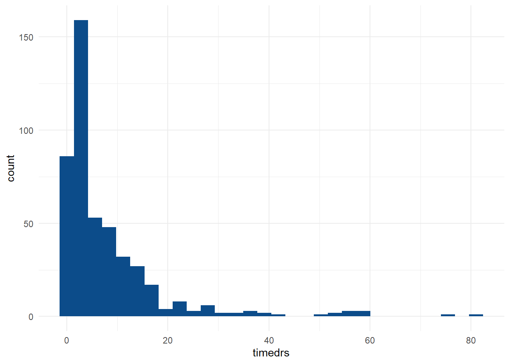
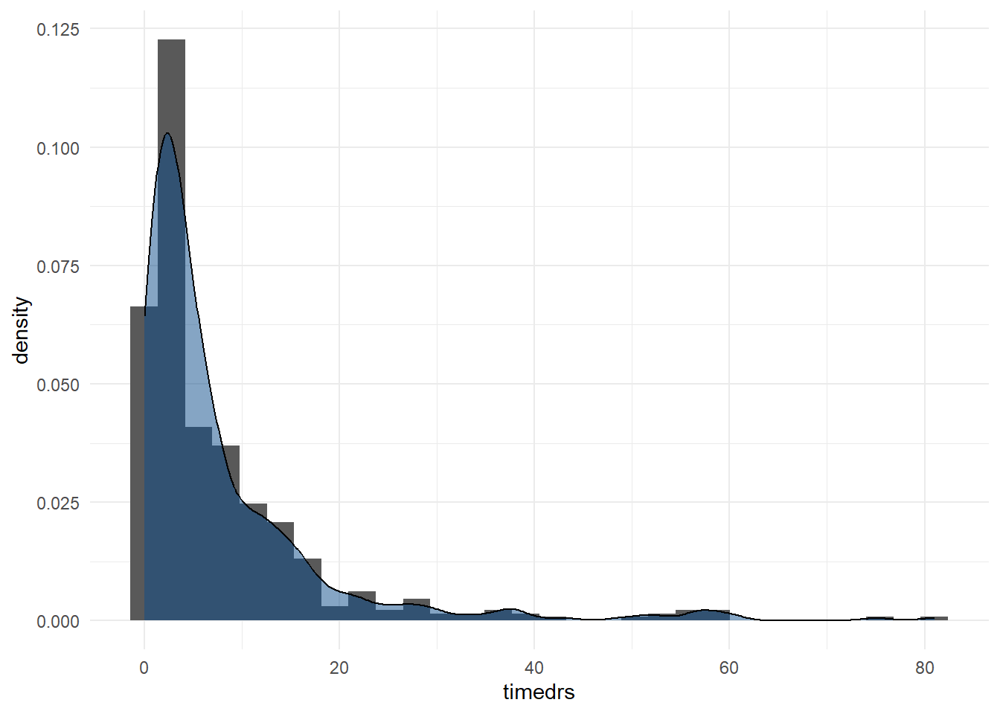
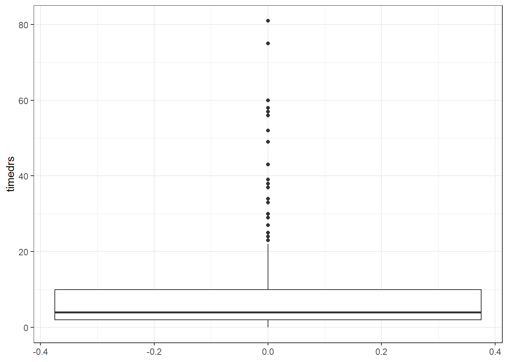
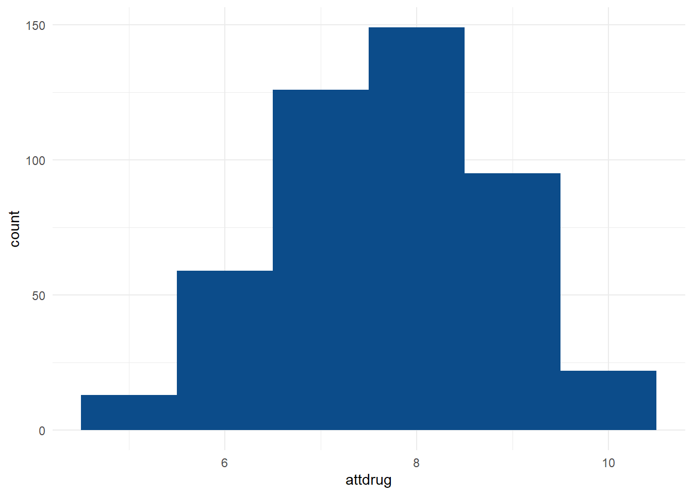
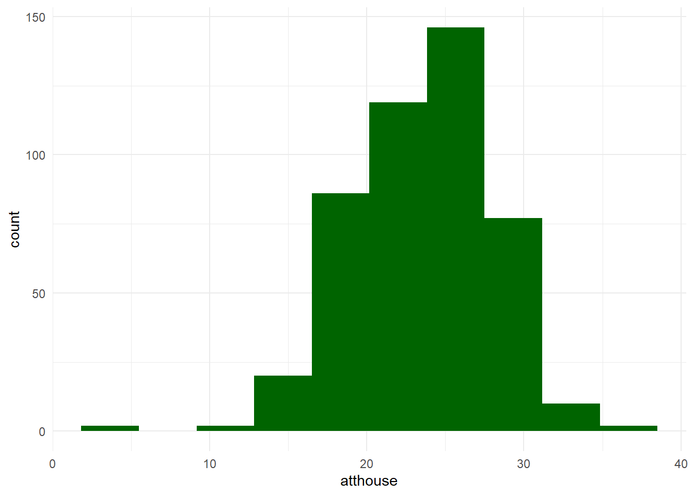
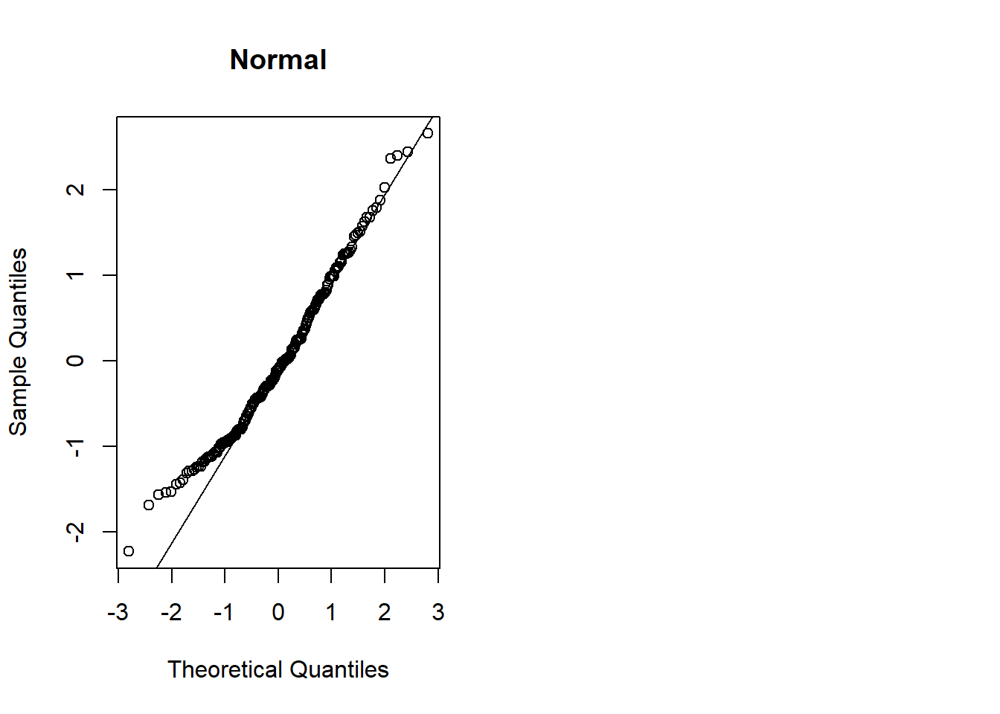
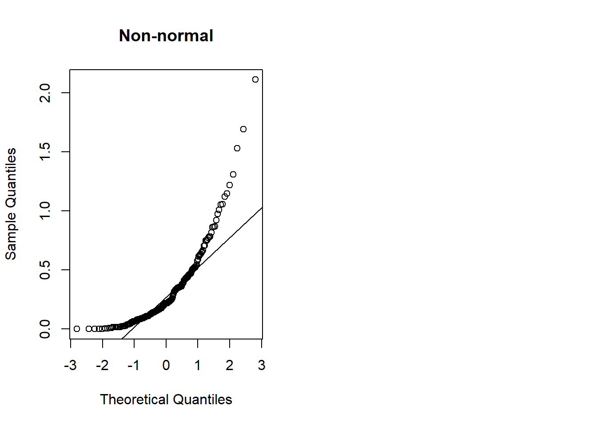
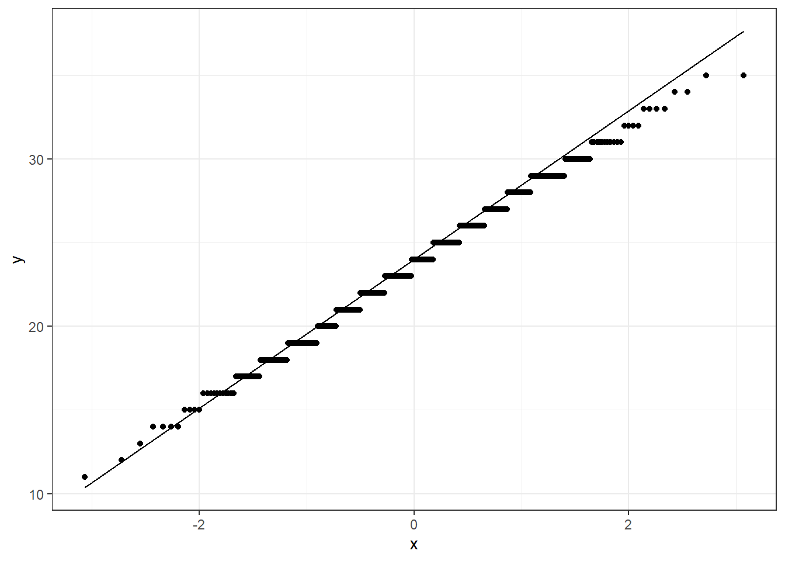
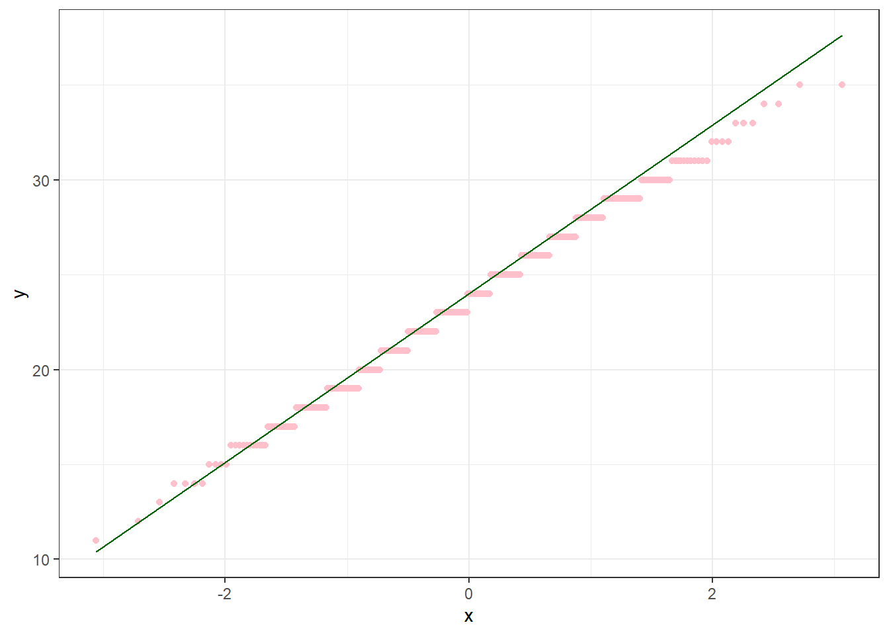
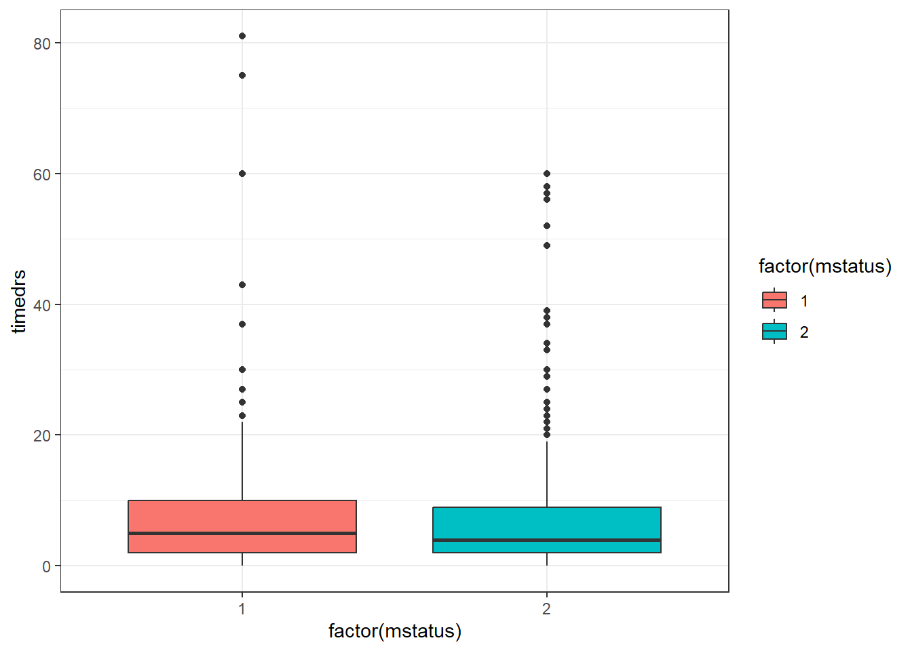

# Varsayımlar II


## Uç değerler

-  Uç değerler hem I. tip hem de II. tip hatalara neden olurlar ve 
sonuçların genellenebilirliğini düşürürler.

- Veri setinde uç değer bulunmasının 4 nedeni olabilir
  - Verinin veri dosyasına yanlış girilmesi
  - Kayıp veri kodlamasında hata yapılması
  - Uç değerin örneklemin alındığı evrenin üyesi olmaması
  - Uç değerin örneklemin alındığı evrenin üyesi olması ancak 
  değişkenin evrendeki dağılımının normal dağılıma göre aşırı 
  değerlere sahip olması
  
- Hatalı veri girişi ve kayıp değer kodlaması kolaylıkla 
bulunup düzeltilebilir ancak 3. ve 4. durumlar arasında 
ayrım yapıp uç değerin veri setinden silinip 
silinmemesine karar vermek oldukça güçtür.


- Tek değişkenli uç değerlerin belirlenmesi çok değişkenli 
uç değerlerin belirlenmesine göre daha kolaydır.

- İki kategorili değişkenler için, eşit büyüklükte olmayan 
kategorilerde yanlış kategoride gözlenen bir değer olasılıkla uç 
değerdir. Rummel (1970) iki kategorili bir değişken için kategorilerden biri 
örneklemdeki bireylerin %90’ını diğeri ise %10’unu içeriyorsa, 
değişkenin analiz dışı bırakılmasını önermektedir.


### İki kategorili değişkenlerde uç değerlerin belirlenmesi

- summarytools paketinde `freq()` fonksiyonu ile frekans tabloları oluşturulabilir.

- Veri setinde yer alan mstatus ve race değişkenlerinin frekans tabloları incelenmiştir.

- İlk olarak eksik veri düzenlenmesi yapılmıştır.

```r
library(haven)
library(dplyr)
screen <- read_sav("import/SCREEN.sav")
screen <- screen %>% 
mutate(income = ifelse(is.na(income), mean(income, na.rm =TRUE),
                       income)) %>% na.omit()
```

- race değişkenin frekans tablosu

```r
library(summarytools)
freq(screen$race, 
     round.digits=2,report.nas = FALSE,
 style = "rmarkdown") 
```

```
## ### Frequencies  
## #### screen$race  
## **Label:** Ethnic group membership  
## **Type:** Numeric  
## 
## |    &nbsp; | Freq |      % | % Cum. |
## |----------:|-----:|-------:|-------:|
## |     **1** |  424 |  91.38 |  91.38 |
## |     **2** |   40 |   8.62 | 100.00 |
## | **Total** |  464 | 100.00 | 100.00 |
```


- İki kategorili değişkenlerden **race** değişkeninin kategorilere dağılımları incelendiğinde kategoriler arasında yaklaşık 10.1:1 (91/9) oranı olduğu görülmektedir. Bu oran oldukça yüksektir. Değişken araştırma için önemli değilse çıkarılabilir, aksi halde değişkenle ilgili sonuçlar 
yorumlanırken bu durum göz önüne alınmalıdır.

- mstatus  değişkenin frekans tablosu oluşturulurup `kable()` fonksiyonu ile tablolaştırılmıştır. 

```r
library(knitr)
freq(screen$mstatus,report.nas = FALSE) %>%
  kable(format='markdown', 
      caption="Frekans Tablosu",digits = 2)
```


Table: (\#tab:unnamed-chunk-3)Frekans Tablosu

|      | Freq| % Valid| % Valid Cum.| % Total| % Total Cum.|
|:-----|----:|-------:|------------:|-------:|------------:|
|1     |  102|   21.98|        21.98|   21.98|        21.98|
|2     |  362|   78.02|       100.00|   78.02|       100.00|
|<NA>  |    0|      NA|           NA|    0.00|       100.00|
|Total |  464|  100.00|       100.00|  100.00|       100.00|

- İki kategorili değişkenlerden **mstatus** değişkeninin kategorilere 
dağılımları incelendiğinde kategoriler arasında yaklaşık 3.5:1 (78/22) 
oranı olduğu görülmektedir. Bu oran kabul edilebilir bir orandır.

- 🔗 [summarytools paketinin vignettei için](https://cran.r-project.org/web/packages/summarytools/vignettes/introduction.html)

### Sürekli değişkenlerde uç değerlerin belirlenmesi

- Sürekli değişkenler için tek değişkenli uç değerleri belirlemenin bir 
yolu, değişkene ait bütün değerlerin ortalama 0, standart sapma 1 
olacak şekilde standart değerlere (z puanlarına) dönüştürülmesidir. 
Tek değişkenli uç değerler çok büyük z puanlarına sahiptirler.

- Örneklem büyüklüğü 100 veya daha az olduğunda, eğer herhangi 
bir gözlemin **z puanı ±3.0** veya daha fazlaysa, gözlem uç değerdir. 

- Örneklem büyüklüğü 100’den fazla olduğunda, eğer herhangi bir 
gözlemin **z puanı ±4.0** veya daha fazlaysa, gözlem uç değerdir. 

- Bu yöntem eşit aralık veya eşit oran düzeyinde ölçülen değişkenler 
için veya sürekli değişken olarak ele alınan sıralama ölçeğinde 
ölçülen değişkenler için geçerli olup sınıflama düzeyinde ölçülen 
değişkenler için geçerli değildir.

- outliers paketinde `select()` fonksiyonu ile z değerleri  hesaplanabilir.


```r
library(outliers)
z.scores <- screen %>%  
 select(2:5) %>% 
 scores(type = "z") %>%
 round(2)
head(z.scores)
```

<div class="kable-table">

| timedrs| attdrug| atthouse| income|
|-------:|-------:|--------:|------:|
|   -0.63|    0.27|     0.77|   0.34|
|   -0.45|   -0.60|    -0.79|   0.76|
|   -0.72|    0.27|    -0.12|  -0.51|
|    0.46|    1.13|     0.99|   1.61|
|    0.65|   -0.60|     0.10|  -1.36|
|   -0.45|    0.27|     0.33|  -0.09|

</div>

- summarytools paketinde `descr()` fonksiyonu ile z değerlerinin minumum ve maksimum değerleri incelenebilir.


```r
summarytools::descr(z.scores,
 stats     = c("min", "max"),
 transpose = TRUE,
 headings  = FALSE) %>%   
 kable()
```


|         |   Min|  Max|
|:--------|-----:|----:|
|attdrug  | -2.33| 2.00|
|atthouse | -4.80| 2.56|
|income   | -1.36| 2.46|
|timedrs  | -0.72| 6.67|


- **timedrs** değişkeni için z puanlarının maksimum değerin 4.0’ten büyük olduğu, **atthouse** değişkeni z puanlarının içinse minimum değerin 4.0’ten küçük olduğu görülmektedir.  Diğer değişkenler için değerler beklenen sınırlar içerisindedir.


```r
library(DT)

DT::datatable(z.scores)
```

```{=html}
<div class="datatables html-widget html-fill-item" id="htmlwidget-fc907cad6f4da8acbe88" style="width:100%;height:auto;"></div>
<script type="application/json" data-for="htmlwidget-fc907cad6f4da8acbe88">{"x":{"filter":"none","vertical":false,"data":[["1","2","3","4","5","6","7","8","9","10","11","12","13","14","15","16","17","18","19","20","21","22","23","24","25","26","27","28","29","30","31","32","33","34","35","36","37","38","39","40","41","42","43","44","45","46","47","48","49","50","51","52","53","54","55","56","57","58","59","60","61","62","63","64","65","66","67","68","69","70","71","72","73","74","75","76","77","78","79","80","81","82","83","84","85","86","87","88","89","90","91","92","93","94","95","96","97","98","99","100","101","102","103","104","105","106","107","108","109","110","111","112","113","114","115","116","117","118","119","120","121","122","123","124","125","126","127","128","129","130","131","132","133","134","135","136","137","138","139","140","141","142","143","144","145","146","147","148","149","150","151","152","153","154","155","156","157","158","159","160","161","162","163","164","165","166","167","168","169","170","171","172","173","174","175","176","177","178","179","180","181","182","183","184","185","186","187","188","189","190","191","192","193","194","195","196","197","198","199","200","201","202","203","204","205","206","207","208","209","210","211","212","213","214","215","216","217","218","219","220","221","222","223","224","225","226","227","228","229","230","231","232","233","234","235","236","237","238","239","240","241","242","243","244","245","246","247","248","249","250","251","252","253","254","255","256","257","258","259","260","261","262","263","264","265","266","267","268","269","270","271","272","273","274","275","276","277","278","279","280","281","282","283","284","285","286","287","288","289","290","291","292","293","294","295","296","297","298","299","300","301","302","303","304","305","306","307","308","309","310","311","312","313","314","315","316","317","318","319","320","321","322","323","324","325","326","327","328","329","330","331","332","333","334","335","336","337","338","339","340","341","342","343","344","345","346","347","348","349","350","351","352","353","354","355","356","357","358","359","360","361","362","363","364","365","366","367","368","369","370","371","372","373","374","375","376","377","378","379","380","381","382","383","384","385","386","387","388","389","390","391","392","393","394","395","396","397","398","399","400","401","402","403","404","405","406","407","408","409","410","411","412","413","414","415","416","417","418","419","420","421","422","423","424","425","426","427","428","429","430","431","432","433","434","435","436","437","438","439","440","441","442","443","444","445","446","447","448","449","450","451","452","453","454","455","456","457","458","459","460","461","462","463","464"],[-0.63,-0.45,-0.72,0.46,0.65,-0.45,-0.54,-0.72,-0.08,-0.36,0.65,-0.72,-0.54,0.46,-0.54,-0.54,-0.63,-0.54,-0.27,-0.27,-0.45,-0.36,-0.54,-0.72,0.46,-0.08,-0.54,0.37,-0.54,-0.27,-0.36,-0.17,-0.54,-0.45,0.5600000000000001,-0.08,-0.72,-0.63,-0.45,4.75,-0.27,-0.45,-0.72,-0.45,-0.54,-0.63,-0.63,0.46,-0.54,-0.27,0.37,0.37,-0.63,1.1,-0.72,-0.27,-0.72,0.01,0.1,0.19,-0.63,-0.27,-0.27,1.38,-0.08,-0.63,2.84,-0.54,-0.08,0.1,-0.72,-0.36,0.74,-0.72,0.74,2.29,-0.36,-0.54,2.75,0.01,-0.54,-0.54,-0.72,0.65,-0.72,-0.63,-0.27,-0.08,0.19,1.29,0.19,-0.72,0.28,0.1,-0.72,2.38,-0.45,-0.63,-0.72,0.19,-0.36,1.74,-0.08,-0.63,-0.08,-0.45,-0.54,0.28,0.1,0.28,0.28,0.01,-0.54,-0.36,-0.36,-0.17,2.02,-0.08,0.65,-0.17,-0.08,-0.54,-0.63,-0.27,-0.63,0.28,0.74,-0.54,0.5600000000000001,0.01,0.83,-0.63,-0.72,-0.63,-0.63,0.19,-0.08,-0.54,-0.27,-0.17,-0.63,0.74,-0.72,0.83,-0.72,0.19,-0.17,1.1,-0.63,1.56,-0.45,-0.17,-0.72,0.01,0.1,1.01,-0.54,-0.54,-0.45,-0.08,-0.54,0.01,3.75,-0.54,-0.63,-0.27,-0.27,4.75,0.19,1.74,-0.08,0.01,0.37,-0.54,-0.54,-0.36,-0.17,1.74,-0.72,0.1,-0.45,-0.72,-0.54,-0.45,-0.27,-0.27,-0.63,-0.08,-0.36,-0.45,-0.08,-0.63,4.02,-0.17,0.92,0.5600000000000001,-0.72,0.01,0.74,-0.54,0.37,-0.45,1.47,-0.72,-0.72,4.48,0.28,-0.63,0.92,-0.63,0.28,-0.72,4.02,0.37,-0.17,-0.72,-0.54,-0.54,0.46,-0.54,-0.45,-0.54,-0.54,-0.63,-0.54,-0.45,-0.63,-0.27,-0.17,-0.63,-0.54,-0.45,-0.08,-0.08,-0.72,-0.08,0.01,0.1,0.01,-0.63,0.5600000000000001,-0.54,-0.36,0.01,-0.45,0.19,1.19,-0.17,4.57,0.37,-0.27,-0.54,-0.36,-0.54,-0.27,-0.72,-0.45,-0.08,-0.63,-0.54,-0.63,-0.36,-0.36,-0.36,-0.54,-0.72,0.46,-0.45,-0.63,-0.36,-0.63,-0.45,-0.63,4.48,-0.63,0.83,0.28,3.2,-0.17,-0.17,-0.63,-0.72,0.19,-0.45,2.65,-0.17,0.28,-0.36,6.12,-0.08,-0.45,-0.45,-0.45,-0.36,-0.27,-0.54,-0.36,-0.54,0.28,-0.72,-0.54,-0.36,-0.17,-0.72,-0.54,-0.27,-0.54,0.19,1.92,-0.45,-0.72,1.19,-0.72,-0.45,-0.63,0.1,-0.45,-0.45,-0.27,-0.17,-0.36,0.74,-0.45,0.46,-0.45,-0.54,-0.54,-0.45,-0.08,-0.54,-0.54,-0.54,-0.54,-0.27,-0.45,-0.54,-0.36,-0.63,-0.45,-0.17,-0.36,2.02,-0.72,1.56,-0.72,-0.27,-0.45,-0.54,-0.54,0.1,-0.54,0.46,-0.63,-0.36,-0.36,-0.45,-0.08,-0.08,0.5600000000000001,-0.36,0.65,2.65,-0.54,-0.36,-0.17,0.19,4.39,-0.45,-0.72,0.92,-0.45,0.92,-0.08,1.92,-0.72,-0.27,-0.36,-0.45,-0.17,1.19,-0.63,-0.45,-0.45,-0.72,0.46,-0.27,-0.27,2.65,-0.54,0.28,0.46,-0.54,-0.36,1.19,-0.54,-0.36,-0.45,-0.45,0.37,-0.63,-0.36,0.46,-0.54,6.67,0.37,-0.54,0.74,1.74,-0.54,-0.54,0.01,-0.54,-0.36,-0.45,1.01,-0.36,-0.63,-0.45,0.65,-0.36,-0.36,0.46,-0.17,-0.63,-0.45,-0.45,-0.72,1.29,-0.36,0.5600000000000001,-0.17,0.74,-0.17,-0.72,0.01,-0.72,-0.36,-0.27,-0.54,-0.17,0.28,-0.63,1.38,-0.36,-0.36,0.74,-0.17,-0.63,-0.54,-0.17,-0.17,-0.45,-0.63,0.65,-0.45,-0.08,0.1,0.92,0.5600000000000001,-0.45,-0.36,0.65,-0.36,-0.45],[0.27,-0.6,0.27,1.13,-0.6,0.27,-0.6,-0.6,-0.6,0.27,1.13,-1.46,-1.46,0.27,-2.33,0.27,0.27,-1.46,0.27,2,-1.46,-2.33,0.27,0.27,1.13,1.13,0.27,1.13,-1.46,1.13,-0.6,-1.46,1.13,-0.6,1.13,-0.6,0.27,0.27,0.27,-0.6,0.27,1.13,-0.6,0.27,-1.46,0.27,1.13,0.27,-0.6,1.13,-1.46,1.13,1.13,1.13,-1.46,-0.6,-0.6,2,0.27,0.27,2,0.27,0.27,-1.46,-1.46,-0.6,-0.6,0.27,0.27,-0.6,-2.33,0.27,2,-0.6,0.27,1.13,-0.6,0.27,0.27,0.27,0.27,1.13,1.13,-0.6,-0.6,0.27,-0.6,1.13,-1.46,1.13,-0.6,-0.6,0.27,-0.6,0.27,-0.6,1.13,-1.46,2,-1.46,0.27,0.27,1.13,-2.33,2,0.27,-1.46,-1.46,-1.46,0.27,0.27,-0.6,1.13,1.13,0.27,-0.6,-2.33,0.27,-0.6,-0.6,-0.6,1.13,-0.6,-0.6,1.13,-1.46,2,-0.6,-2.33,-0.6,0.27,0.27,-1.46,1.13,-1.46,0.27,-0.6,0.27,-1.46,-0.6,0.27,2,-2.33,-0.6,0.27,0.27,-0.6,0.27,0.27,0.27,1.13,1.13,-0.6,0.27,1.13,2,0.27,-0.6,-0.6,0.27,0.27,-1.46,0.27,0.27,0.27,-1.46,0.27,2,-0.6,0.27,1.13,-0.6,0.27,-0.6,-0.6,-0.6,-2.33,1.13,0.27,2,1.13,0.27,-1.46,0.27,0.27,1.13,1.13,1.13,0.27,-0.6,0.27,-0.6,1.13,-0.6,-0.6,-0.6,-0.6,1.13,0.27,1.13,0.27,-0.6,2,1.13,-0.6,1.13,1.13,0.27,-1.46,-2.33,1.13,0.27,0.27,-0.6,-1.46,-0.6,0.27,0.27,2,-0.6,-1.46,1.13,-0.6,-0.6,-0.6,0.27,1.13,-2.33,-0.6,-0.6,0.27,-1.46,2,-1.46,0.27,0.27,-0.6,-0.6,-1.46,1.13,1.13,1.13,-0.6,0.27,0.27,0.27,2,-0.6,-0.6,0.27,-0.6,1.13,-0.6,-0.6,1.13,1.13,0.27,1.13,1.13,0.27,-1.46,-1.46,-0.6,0.27,0.27,0.27,-1.46,0.27,0.27,-0.6,0.27,-0.6,-1.46,0.27,0.27,1.13,-0.6,-1.46,1.13,0.27,1.13,-0.6,-1.46,1.13,1.13,0.27,-0.6,-0.6,1.13,1.13,-1.46,-0.6,-0.6,0.27,1.13,2,-0.6,0.27,1.13,-1.46,-0.6,0.27,1.13,0.27,-1.46,-1.46,-1.46,1.13,1.13,0.27,0.27,0.27,-0.6,0.27,0.27,1.13,0.27,-0.6,0.27,0.27,1.13,-2.33,1.13,1.13,1.13,-1.46,0.27,-0.6,-0.6,0.27,-0.6,-0.6,-0.6,2,-0.6,-1.46,1.13,-0.6,0.27,1.13,0.27,0.27,-0.6,-0.6,-0.6,0.27,0.27,1.13,-0.6,0.27,0.27,-1.46,0.27,1.13,-0.6,1.13,1.13,0.27,-1.46,-0.6,-1.46,1.13,-0.6,-0.6,1.13,-1.46,0.27,2,1.13,-0.6,1.13,-0.6,0.27,0.27,-2.33,-1.46,0.27,-0.6,-0.6,1.13,0.27,-0.6,0.27,-0.6,2,-1.46,0.27,-0.6,0.27,0.27,-0.6,1.13,1.13,1.13,2,0.27,0.27,0.27,0.27,-0.6,-0.6,-0.6,-0.6,0.27,-0.6,0.27,-0.6,0.27,-2.33,-0.6,0.27,0.27,0.27,0.27,-0.6,1.13,-0.6,-0.6,-1.46,0.27,0.27,0.27,1.13,2,1.13,1.13,1.13,-0.6,0.27,-0.6,1.13,-0.6,-1.46,0.27,-1.46,-0.6,-0.6,-1.46,0.27,0.27,0.27,-0.6,-0.6,0.27,1.13,1.13,-0.6,1.13,-1.46,1.13,-1.46,-0.6,-0.6,1.13,-1.46,0.27,-1.46,-1.46,1.13,-1.46,0.27,2,0.27,0.27],[0.77,-0.79,-0.12,0.99,0.1,0.33,1.44,0.1,-0.79,1.44,-1.9,-0.34,-1.01,0.33,-1.46,-1.01,-0.34,-0.57,0.99,0.33,-1.01,1.66,0.33,0.55,0.55,2.11,-0.79,0.55,0.77,1.44,1.66,0.33,0.77,-0.12,-1.9,1.89,-0.57,0.99,-1.68,0.1,-1.01,-0.12,0.1,1.66,1.22,-0.12,0.1,0.33,-0.34,0.55,0.77,0.1,0.77,0.1,-0.12,0.33,-0.34,0.33,-1.9,0.99,0.33,-0.34,-0.57,1.22,0.55,-0.12,0.55,-0.57,-0.34,1.66,2.56,0.99,0.99,-0.79,0.1,0.33,0.33,-1.68,-1.24,-0.12,0.1,1.22,-1.68,-0.34,0.77,-0.12,0.55,1.44,-0.12,0.55,1.44,0.33,-0.34,-0.57,-1.68,-0.12,0.33,-0.79,-1.24,-0.12,-1.46,-0.12,-0.12,-0.34,-0.34,0.99,-1.46,0.77,-1.24,0.55,-0.57,-0.57,0.1,0.55,-0.57,-1.24,0.1,0.99,0.55,0.33,-0.12,-0.34,-1.01,0.55,1.22,-0.79,-0.79,-1.01,0.1,-0.57,1.89,-1.24,-0.34,0.77,-0.57,-1.01,0.33,-1.46,0.33,1.66,-1.68,-1.46,-2.13,1.44,0.33,0.99,-0.34,0.1,-0.57,0.33,0.77,-0.79,0.55,0.33,0.77,-0.12,0.77,-0.57,-0.34,-1.01,0.55,0.33,2.33,0.77,-0.34,-2.13,1.22,1.22,0.55,-1.46,-0.34,-0.79,1.44,-1.46,-0.57,-0.34,1.22,-0.34,-0.79,1.44,0.33,-1.24,-1.01,0.1,-0.34,-0.57,1.22,-0.34,0.55,-1.01,-0.12,-1.01,1.66,0.55,-0.12,1.22,-0.34,1.22,-0.12,-1.46,0.55,0.33,0.33,-1.01,-1.68,0.1,1.22,-0.79,0.33,-1.68,2.56,0.1,-1.01,0.33,1.22,0.33,1.22,-0.79,0.33,1.66,2.11,0.1,0.55,-0.79,-1.46,0.33,0.1,0.77,0.33,0.99,1.22,0.77,0.1,-0.12,-1.01,-0.12,0.1,-0.57,-0.34,-0.57,1.44,1.89,-0.57,-1.01,0.1,0.99,0.99,1.22,1.22,-0.12,0.55,-0.34,0.33,-1.01,-0.34,-1.24,0.33,-0.12,-1.01,-4.8,0.55,0.1,1.44,1.44,-0.34,0.55,1.44,0.33,0.1,-0.12,-1.24,-0.12,2.33,-0.12,-2.35,0.77,-0.57,0.99,0.99,-0.79,-0.57,0.33,0.77,-0.12,0.33,-0.34,0.1,-1.9,2.11,0.1,1.22,-0.57,0.55,1.22,-0.57,-0.57,-1.24,-4.8,0.99,-0.79,0.77,-0.12,0.77,0.77,0.33,-0.34,1.22,-0.12,-2.13,0.99,1.22,0.77,-0.12,-0.12,-0.79,0.1,0.55,-0.12,0.33,0.99,-1.68,1.22,0.33,-0.34,1.22,-0.12,0.55,-1.01,0.77,-0.57,-1.24,-1.01,-0.12,-1.01,-0.57,-0.12,0.99,0.1,0.77,0.77,0.33,1.22,-1.01,0.77,1.66,-1.24,-0.12,1.89,-0.79,-0.57,0.33,-0.57,-0.34,1.22,-0.12,-0.79,-0.57,0.55,-0.57,0.1,0.55,1.44,-1.24,-0.34,0.33,-0.57,-1.01,-0.12,-0.34,-0.57,-0.34,0.1,-1.24,-1.24,0.1,0.33,-1.01,0.77,1.22,-0.34,0.33,0.77,0.55,0.99,-1.01,-0.12,2.11,0.1,0.99,0.99,0.1,-0.57,1.66,-0.12,0.55,0.55,0.55,0.1,-1.24,-0.57,-1.01,-1.46,0.1,0.1,1.66,-1.01,0.99,-0.12,0.55,0.55,-1.24,-1.68,1.22,-2.13,-0.12,1.22,-1.01,-0.34,-0.79,-0.34,-0.57,-0.12,0.55,-1.24,-1.24,0.99,1.66,-0.34,0.99,-0.79,-0.79,0.55,0.77,-2.8,0.55,0.77,-1.68,-2.57,-0.79,-1.01,0.55,-0.79,-0.34,1.44,0.33,-0.12,-0.34,0.1,-0.12,0.77,0.99,0.1,-1.46,-0.34,-0.12,-1.68,-1.24,-0.57,-1.01,-1.46,-1.46,-1.01,-0.12,-1.24],[0.34,0.76,-0.51,1.61,-1.36,-0.09,0.76,0.76,-0.9399999999999999,1.61,1.19,-0.51,0.34,0.76,-1.36,-0.51,-1.36,1.19,-0.9399999999999999,2.04,-0.09,0.34,-0.9399999999999999,-1.36,-0.9399999999999999,-1.36,0.34,-1.36,-0.51,-1.36,-0.09,0.34,0.34,-0.09,-0.09,-0.51,2.04,0.76,-1.36,-1.36,-1.36,0.76,1.61,-0.51,-1.36,-0.09,-0.09,-1.36,-0.9399999999999999,0.34,0.34,0,0.76,0.76,-0.09,-0.09,0.76,2.04,-0.51,0.76,-0.51,1.19,-0.51,0,-1.36,-0.9399999999999999,-0.9399999999999999,-0.51,0,0.34,0.34,0.34,0.34,0.34,-0.51,-1.36,0,-0.51,-0.9399999999999999,-0.9399999999999999,2.04,2.46,-1.36,0.34,2.46,1.61,-1.36,-0.51,-0.51,0.76,-0.51,-0.9399999999999999,-1.36,-0.09,-0.09,0.34,-0.09,0.34,-1.36,-0.09,-0.09,1.61,0.34,-0.9399999999999999,0.76,-0.09,-0.9399999999999999,1.19,-0.09,1.19,1.19,-0.09,2.46,-0.51,-0.51,1.61,2.46,0,-1.36,1.61,0.34,-0.51,0.34,-0.51,-0.51,-0.09,-1.36,0.34,-0.09,-0.51,-1.36,-0.51,-1.36,1.61,0,-1.36,-1.36,1.19,-0.51,-0.09,1.19,1.61,1.61,-0.09,0.76,-1.36,-1.36,0.34,-0.9399999999999999,1.19,1.19,1.19,-1.36,-1.36,-0.51,0.34,-0.51,-0.51,0.34,1.19,0,-0.09,-0.09,-1.36,-0.51,-0.51,-1.36,-0.09,0.76,1.19,-0.51,0,0,0,-1.36,-0.51,-0.51,-1.36,2.04,-0.51,0,0.34,-0.09,-0.51,-0.09,1.61,-1.36,-1.36,1.19,0.76,1.61,2.04,-0.09,-0.9399999999999999,-0.09,0,-0.09,-1.36,1.19,-0.51,-1.36,-0.09,0,-0.09,-0.51,-0.9399999999999999,-0.51,0.76,-0.9399999999999999,0.76,-0.09,1.19,-1.36,-0.09,-0.51,-0.51,-0.9399999999999999,0.76,-1.36,-0.09,0.34,-0.9399999999999999,-0.09,1.19,-0.09,1.19,-0.51,2.46,2.46,1.19,-1.36,-0.09,-0.09,1.19,-0.51,0,-0.51,1.19,-0.51,0,-0.9399999999999999,-1.36,-0.51,2.46,-0.09,-1.36,2.46,1.19,-0.09,-0.09,-1.36,-1.36,0.76,0.34,-0.51,0.34,0,0.34,1.61,-1.36,0.34,-0.51,-0.09,0.34,-0.51,1.19,-0.09,0.34,0.34,-0.51,-0.09,-0.09,-0.09,-0.09,-1.36,1.19,-0.51,1.19,1.19,0.76,-1.36,2.04,2.04,2.46,0.76,-0.9399999999999999,2.04,-0.51,2.04,0.34,1.19,-0.51,-0.9399999999999999,-0.09,-1.36,-1.36,0.34,-0.09,-0.9399999999999999,0.76,-0.09,0.76,0,0.34,-0.09,-0.09,-1.36,1.19,-0.51,1.61,-0.51,1.19,0.76,0.34,-1.36,2.46,-0.51,-1.36,-0.09,0,-0.09,-1.36,2.04,0,-1.36,-0.51,-0.51,0.34,0.34,-0.09,0.76,-0.09,-0.51,1.19,0.76,0.34,-0.51,0.76,-0.9399999999999999,2.46,-0.09,-0.09,0.34,-0.51,-0.51,-0.9399999999999999,1.61,-0.09,1.19,-0.51,0,-0.09,-0.51,-0.09,-1.36,-1.36,-1.36,-1.36,-0.9399999999999999,-1.36,0.76,-0.9399999999999999,-0.9399999999999999,-0.9399999999999999,-0.09,-0.09,-0.51,0.34,-1.36,-1.36,-0.51,-0.09,-0.09,0.34,-0.09,1.61,0,0,-0.9399999999999999,-0.9399999999999999,-1.36,-0.51,0.76,-1.36,-0.9399999999999999,2.04,-0.09,2.46,-0.09,-0.09,2.04,-0.09,-0.51,-0.9399999999999999,-0.09,-0.51,-0.51,-0.09,-0.51,0.34,-0.9399999999999999,1.61,-1.36,2.04,2.46,0.76,-0.09,0,0.34,-0.9399999999999999,0.76,-0.09,-1.36,-0.09,-0.09,-1.36,-0.51,0,-1.36,0,-1.36,0.76,-1.36,2.46,-1.36,-0.09,-0.9399999999999999,-0.9399999999999999,-0.51,-0.9399999999999999,1.19,1.19,-1.36,0,1.19,0.76,-0.09,-0.09,-0.51,0.76,1.19,-0.51,1.19,0.76,-1.36,0.76,1.61,0.34,-0.09,-0.51,-0.51,-0.51,-0.09,2.46,-0.09,-0.51,-0.9399999999999999,-0.09,-0.51,-0.51,-0.51,1.61,-0.9399999999999999,-0.09]],"container":"<table class=\"display\">\n  <thead>\n    <tr>\n      <th> <\/th>\n      <th>timedrs<\/th>\n      <th>attdrug<\/th>\n      <th>atthouse<\/th>\n      <th>income<\/th>\n    <\/tr>\n  <\/thead>\n<\/table>","options":{"columnDefs":[{"className":"dt-right","targets":[1,2,3,4]},{"orderable":false,"targets":0},{"name":" ","targets":0},{"name":"timedrs","targets":1},{"name":"attdrug","targets":2},{"name":"atthouse","targets":3},{"name":"income","targets":4}],"order":[],"autoWidth":false,"orderClasses":false}},"evals":[],"jsHooks":[]}</script>
```


- Tek değişkenli uç değerleri saptamak için grafiksel yöntemlerden de 
yararlanılabilir (Örneğin, histogramlar, kutu grafikleri, normal olasılık 
grafikleri gibi). 

- Histogramlar kolay anlaşılan ve yorumlanan grafiklerdir ve uç 
değerlerin belirlenmesine yardımcı olabilirler. Genellikle ortalamanın 
yakınındaki çoğu gözlemle birlikte ortalamanın iki yönüne doğru 
uzanan gözlemler vardır. Uç değer dağılımın geri kalanıyla 
bağlantısı bulunmayan gözlemdir.

- Kutu grafikleri de basittir. Medyan etrafındaki gözlemler kutu içine 
alınır. Kutudan çok uzağa düşen gözlemler uç değerdir. 

- Normal olasılık grafikleri değişkenlerin dağılımlarının normalliğinin 
değerlendirilmesinde oldukça kullanışlıdır. Uç değerler de bu 
grafiklerde gözlenebilir; diğerlerinden önemli derecede uzakta 
bulunan nokta uçdeğerdir.

### timedrs değişkenin incelenmesi
#### histogram

```r
library(ggplot2)
ggplot(screen, aes(x = timedrs)) +
  geom_histogram(bins = 30L, fill = "#0c4c8a") +
  theme_minimal()
```




- grafik üzerinde ortalamanın gösterilmesi

```r
library(ggpmisc)
ggplot(screen, aes(x = timedrs)) + geom_histogram() + 
geom_vline(xintercept =7.914, color = "red", 
linetype = "dashed") + 
annotate("text", label = "Ort = 7.913", x = 10, y = 100,  color ="black")
```


#### yoğunluk grafiği


```r
ggplot(screen, aes(x = timedrs)) +
 geom_histogram(aes(y=..density..))+
 geom_density(alpha=.5, fill="#0c4c8a") +
  theme_minimal()
```



#### interaktif grafik


```r
library(plotly)
plot_ly(x = screen$timedrs,  type = "histogram", 
histnorm = "probability")
```

```{=html}
<div class="plotly html-widget html-fill-item" id="htmlwidget-513caf5bb1b7473c4235" style="width:100%;height:480px;"></div>
<script type="application/json" data-for="htmlwidget-513caf5bb1b7473c4235">{"x":{"visdat":{"8c075bf5ae1":["function () ","plotlyVisDat"]},"cur_data":"8c075bf5ae1","attrs":{"8c075bf5ae1":{"x":[1,3,0,13,15,3,2,0,7,4,15,0,2,13,2,2,1,2,5,5,3,4,2,0,13,7,2,12,2,5,4,6,2,3,14,7,0,1,3,60,5,3,0,3,2,1,1,13,2,5,12,12,1,20,0,5,0,8,9,10,1,5,5,23,7,1,39,2,7,9,0,4,16,0,16,33,4,2,38,8,2,2,0,15,0,1,5,7,10,22,10,0,11,9,0,34,3,1,0,10,4,27,7,1,7,3,2,11,9,11,11,8,2,4,4,6,30,7,15,6,7,2,1,5,1,11,16,2,14,8,17,1,0,1,1,10,7,2,5,6,1,16,0,17,0,10,6,20,1,25,3,6,0,8,9,19,2,2,3,7,2,8,49,2,1,5,5,60,10,27,7,8,12,2,2,4,6,27,0,9,3,0,2,3,5,5,1,7,4,3,7,1,52,6,18,14,0,8,16,2,12,3,24,0,0,57,11,1,18,1,11,0,52,12,6,0,2,2,13,2,3,2,2,1,2,3,1,5,6,1,2,3,7,7,0,7,8,9,8,1,14,2,4,8,3,10,21,6,58,12,5,2,4,2,5,0,3,7,1,2,1,4,4,4,2,0,13,3,1,4,1,3,1,57,1,17,11,43,6,6,1,0,10,3,37,6,11,4,75,7,3,3,3,4,5,2,4,2,11,0,2,4,6,0,2,5,2,10,29,3,0,21,0,3,1,9,3,3,5,6,4,16,3,13,3,2,2,3,7,2,2,2,2,5,3,2,4,1,3,6,4,30,0,25,0,5,3,2,2,9,2,13,1,4,4,3,7,7,14,4,15,37,2,4,6,10,56,3,0,18,3,18,7,29,0,5,4,3,6,21,1,3,3,0,13,5,5,37,2,11,13,2,4,21,2,4,3,3,12,1,4,13,2,81,12,2,16,27,2,2,8,2,4,3,19,4,1,3,15,4,4,13,6,1,3,3,0,22,4,14,6,16,6,0,8,0,4,5,2,6,11,1,23,4,4,16,6,1,2,6,6,3,1,15,3,7,9,18,14,3,4,15,4,3],"histnorm":"probability","alpha_stroke":1,"sizes":[10,100],"spans":[1,20],"type":"histogram"}},"layout":{"margin":{"b":40,"l":60,"t":25,"r":10},"xaxis":{"domain":[0,1],"automargin":true,"title":[]},"yaxis":{"domain":[0,1],"automargin":true},"hovermode":"closest","showlegend":false},"source":"A","config":{"modeBarButtonsToAdd":["hoverclosest","hovercompare"],"showSendToCloud":false},"data":[{"x":[1,3,0,13,15,3,2,0,7,4,15,0,2,13,2,2,1,2,5,5,3,4,2,0,13,7,2,12,2,5,4,6,2,3,14,7,0,1,3,60,5,3,0,3,2,1,1,13,2,5,12,12,1,20,0,5,0,8,9,10,1,5,5,23,7,1,39,2,7,9,0,4,16,0,16,33,4,2,38,8,2,2,0,15,0,1,5,7,10,22,10,0,11,9,0,34,3,1,0,10,4,27,7,1,7,3,2,11,9,11,11,8,2,4,4,6,30,7,15,6,7,2,1,5,1,11,16,2,14,8,17,1,0,1,1,10,7,2,5,6,1,16,0,17,0,10,6,20,1,25,3,6,0,8,9,19,2,2,3,7,2,8,49,2,1,5,5,60,10,27,7,8,12,2,2,4,6,27,0,9,3,0,2,3,5,5,1,7,4,3,7,1,52,6,18,14,0,8,16,2,12,3,24,0,0,57,11,1,18,1,11,0,52,12,6,0,2,2,13,2,3,2,2,1,2,3,1,5,6,1,2,3,7,7,0,7,8,9,8,1,14,2,4,8,3,10,21,6,58,12,5,2,4,2,5,0,3,7,1,2,1,4,4,4,2,0,13,3,1,4,1,3,1,57,1,17,11,43,6,6,1,0,10,3,37,6,11,4,75,7,3,3,3,4,5,2,4,2,11,0,2,4,6,0,2,5,2,10,29,3,0,21,0,3,1,9,3,3,5,6,4,16,3,13,3,2,2,3,7,2,2,2,2,5,3,2,4,1,3,6,4,30,0,25,0,5,3,2,2,9,2,13,1,4,4,3,7,7,14,4,15,37,2,4,6,10,56,3,0,18,3,18,7,29,0,5,4,3,6,21,1,3,3,0,13,5,5,37,2,11,13,2,4,21,2,4,3,3,12,1,4,13,2,81,12,2,16,27,2,2,8,2,4,3,19,4,1,3,15,4,4,13,6,1,3,3,0,22,4,14,6,16,6,0,8,0,4,5,2,6,11,1,23,4,4,16,6,1,2,6,6,3,1,15,3,7,9,18,14,3,4,15,4,3],"histnorm":"probability","type":"histogram","marker":{"color":"rgba(31,119,180,1)","line":{"color":"rgba(31,119,180,1)"}},"error_y":{"color":"rgba(31,119,180,1)"},"error_x":{"color":"rgba(31,119,180,1)"},"xaxis":"x","yaxis":"y","frame":null}],"highlight":{"on":"plotly_click","persistent":false,"dynamic":false,"selectize":false,"opacityDim":0.20000000000000001,"selected":{"opacity":1},"debounce":0},"shinyEvents":["plotly_hover","plotly_click","plotly_selected","plotly_relayout","plotly_brushed","plotly_brushing","plotly_clickannotation","plotly_doubleclick","plotly_deselect","plotly_afterplot","plotly_sunburstclick"],"base_url":"https://plot.ly"},"evals":[],"jsHooks":[]}</script>
```


#### kutu grafik


```r
ggplot(screen, aes(y = timedrs)) + 
  geom_boxplot()  
```




- boxplot.stats fonksiyonun out bileşini uç değerleri vermektedir.


```r
out <- boxplot.stats(screen$timedrs)$out
out
```

```
##  [1] 60 23 39 33 38 34 27 30 25 49 60 27 27 52 24 57 52 58 57 43 37 75 29 30 25
## [26] 37 56 29 37 81 27 23
```

- Bu uç değerlerin timedrs değişkeninde hangi gözlemlerde olduğu ise aşağıdaki kodlarla belirlenebilir.


```r
out_ind <- which(screen$timedrs %in% c(out))
out_ind
```

```
##  [1]  40  64  67  76  79  96 102 117 150 163 168 170 178 193 203 206 213 249 274
## [20] 278 285 289 309 342 344 362 367 374 388 404 408 443
```

- interaktif kutu grafiği 


```r
plot_ly(y = screen$timedrs, type = 'box') 
```

```{=html}
<div class="plotly html-widget html-fill-item" id="htmlwidget-b2fd4f0b70fee32f652c" style="width:100%;height:480px;"></div>
<script type="application/json" data-for="htmlwidget-b2fd4f0b70fee32f652c">{"x":{"visdat":{"8c01ef13742":["function () ","plotlyVisDat"]},"cur_data":"8c01ef13742","attrs":{"8c01ef13742":{"y":[1,3,0,13,15,3,2,0,7,4,15,0,2,13,2,2,1,2,5,5,3,4,2,0,13,7,2,12,2,5,4,6,2,3,14,7,0,1,3,60,5,3,0,3,2,1,1,13,2,5,12,12,1,20,0,5,0,8,9,10,1,5,5,23,7,1,39,2,7,9,0,4,16,0,16,33,4,2,38,8,2,2,0,15,0,1,5,7,10,22,10,0,11,9,0,34,3,1,0,10,4,27,7,1,7,3,2,11,9,11,11,8,2,4,4,6,30,7,15,6,7,2,1,5,1,11,16,2,14,8,17,1,0,1,1,10,7,2,5,6,1,16,0,17,0,10,6,20,1,25,3,6,0,8,9,19,2,2,3,7,2,8,49,2,1,5,5,60,10,27,7,8,12,2,2,4,6,27,0,9,3,0,2,3,5,5,1,7,4,3,7,1,52,6,18,14,0,8,16,2,12,3,24,0,0,57,11,1,18,1,11,0,52,12,6,0,2,2,13,2,3,2,2,1,2,3,1,5,6,1,2,3,7,7,0,7,8,9,8,1,14,2,4,8,3,10,21,6,58,12,5,2,4,2,5,0,3,7,1,2,1,4,4,4,2,0,13,3,1,4,1,3,1,57,1,17,11,43,6,6,1,0,10,3,37,6,11,4,75,7,3,3,3,4,5,2,4,2,11,0,2,4,6,0,2,5,2,10,29,3,0,21,0,3,1,9,3,3,5,6,4,16,3,13,3,2,2,3,7,2,2,2,2,5,3,2,4,1,3,6,4,30,0,25,0,5,3,2,2,9,2,13,1,4,4,3,7,7,14,4,15,37,2,4,6,10,56,3,0,18,3,18,7,29,0,5,4,3,6,21,1,3,3,0,13,5,5,37,2,11,13,2,4,21,2,4,3,3,12,1,4,13,2,81,12,2,16,27,2,2,8,2,4,3,19,4,1,3,15,4,4,13,6,1,3,3,0,22,4,14,6,16,6,0,8,0,4,5,2,6,11,1,23,4,4,16,6,1,2,6,6,3,1,15,3,7,9,18,14,3,4,15,4,3],"alpha_stroke":1,"sizes":[10,100],"spans":[1,20],"type":"box"}},"layout":{"margin":{"b":40,"l":60,"t":25,"r":10},"yaxis":{"domain":[0,1],"automargin":true,"title":[]},"xaxis":{"domain":[0,1],"automargin":true},"hovermode":"closest","showlegend":false},"source":"A","config":{"modeBarButtonsToAdd":["hoverclosest","hovercompare"],"showSendToCloud":false},"data":[{"fillcolor":"rgba(31,119,180,0.5)","y":[1,3,0,13,15,3,2,0,7,4,15,0,2,13,2,2,1,2,5,5,3,4,2,0,13,7,2,12,2,5,4,6,2,3,14,7,0,1,3,60,5,3,0,3,2,1,1,13,2,5,12,12,1,20,0,5,0,8,9,10,1,5,5,23,7,1,39,2,7,9,0,4,16,0,16,33,4,2,38,8,2,2,0,15,0,1,5,7,10,22,10,0,11,9,0,34,3,1,0,10,4,27,7,1,7,3,2,11,9,11,11,8,2,4,4,6,30,7,15,6,7,2,1,5,1,11,16,2,14,8,17,1,0,1,1,10,7,2,5,6,1,16,0,17,0,10,6,20,1,25,3,6,0,8,9,19,2,2,3,7,2,8,49,2,1,5,5,60,10,27,7,8,12,2,2,4,6,27,0,9,3,0,2,3,5,5,1,7,4,3,7,1,52,6,18,14,0,8,16,2,12,3,24,0,0,57,11,1,18,1,11,0,52,12,6,0,2,2,13,2,3,2,2,1,2,3,1,5,6,1,2,3,7,7,0,7,8,9,8,1,14,2,4,8,3,10,21,6,58,12,5,2,4,2,5,0,3,7,1,2,1,4,4,4,2,0,13,3,1,4,1,3,1,57,1,17,11,43,6,6,1,0,10,3,37,6,11,4,75,7,3,3,3,4,5,2,4,2,11,0,2,4,6,0,2,5,2,10,29,3,0,21,0,3,1,9,3,3,5,6,4,16,3,13,3,2,2,3,7,2,2,2,2,5,3,2,4,1,3,6,4,30,0,25,0,5,3,2,2,9,2,13,1,4,4,3,7,7,14,4,15,37,2,4,6,10,56,3,0,18,3,18,7,29,0,5,4,3,6,21,1,3,3,0,13,5,5,37,2,11,13,2,4,21,2,4,3,3,12,1,4,13,2,81,12,2,16,27,2,2,8,2,4,3,19,4,1,3,15,4,4,13,6,1,3,3,0,22,4,14,6,16,6,0,8,0,4,5,2,6,11,1,23,4,4,16,6,1,2,6,6,3,1,15,3,7,9,18,14,3,4,15,4,3],"type":"box","marker":{"color":"rgba(31,119,180,1)","line":{"color":"rgba(31,119,180,1)"}},"line":{"color":"rgba(31,119,180,1)"},"xaxis":"x","yaxis":"y","frame":null}],"highlight":{"on":"plotly_click","persistent":false,"dynamic":false,"selectize":false,"opacityDim":0.20000000000000001,"selected":{"opacity":1},"debounce":0},"shinyEvents":["plotly_hover","plotly_click","plotly_selected","plotly_relayout","plotly_brushed","plotly_brushing","plotly_clickannotation","plotly_doubleclick","plotly_deselect","plotly_afterplot","plotly_sunburstclick"],"base_url":"https://plot.ly"},"evals":[],"jsHooks":[]}</script>
```


- interaktif kutu grafiği üzerine uç değerlerin idlerinin işaretlenmesi ise aşağıdaki kodla yapılabilir.


```r
plot_ly(y = screen$timedrs, type = 'box')  %>% 
  layout(title = 'Box Plot',
annotations = list( x = -0.01,  y = boxplot.stats(screen$timedrs)$out, 
text = paste(out_ind), showarrow = FALSE,
xanchor = "right"))
```

```{=html}
<div class="plotly html-widget html-fill-item" id="htmlwidget-785b3df00d2558d16cbf" style="width:100%;height:480px;"></div>
<script type="application/json" data-for="htmlwidget-785b3df00d2558d16cbf">{"x":{"visdat":{"8c03e6c2bab":["function () ","plotlyVisDat"]},"cur_data":"8c03e6c2bab","attrs":{"8c03e6c2bab":{"y":[1,3,0,13,15,3,2,0,7,4,15,0,2,13,2,2,1,2,5,5,3,4,2,0,13,7,2,12,2,5,4,6,2,3,14,7,0,1,3,60,5,3,0,3,2,1,1,13,2,5,12,12,1,20,0,5,0,8,9,10,1,5,5,23,7,1,39,2,7,9,0,4,16,0,16,33,4,2,38,8,2,2,0,15,0,1,5,7,10,22,10,0,11,9,0,34,3,1,0,10,4,27,7,1,7,3,2,11,9,11,11,8,2,4,4,6,30,7,15,6,7,2,1,5,1,11,16,2,14,8,17,1,0,1,1,10,7,2,5,6,1,16,0,17,0,10,6,20,1,25,3,6,0,8,9,19,2,2,3,7,2,8,49,2,1,5,5,60,10,27,7,8,12,2,2,4,6,27,0,9,3,0,2,3,5,5,1,7,4,3,7,1,52,6,18,14,0,8,16,2,12,3,24,0,0,57,11,1,18,1,11,0,52,12,6,0,2,2,13,2,3,2,2,1,2,3,1,5,6,1,2,3,7,7,0,7,8,9,8,1,14,2,4,8,3,10,21,6,58,12,5,2,4,2,5,0,3,7,1,2,1,4,4,4,2,0,13,3,1,4,1,3,1,57,1,17,11,43,6,6,1,0,10,3,37,6,11,4,75,7,3,3,3,4,5,2,4,2,11,0,2,4,6,0,2,5,2,10,29,3,0,21,0,3,1,9,3,3,5,6,4,16,3,13,3,2,2,3,7,2,2,2,2,5,3,2,4,1,3,6,4,30,0,25,0,5,3,2,2,9,2,13,1,4,4,3,7,7,14,4,15,37,2,4,6,10,56,3,0,18,3,18,7,29,0,5,4,3,6,21,1,3,3,0,13,5,5,37,2,11,13,2,4,21,2,4,3,3,12,1,4,13,2,81,12,2,16,27,2,2,8,2,4,3,19,4,1,3,15,4,4,13,6,1,3,3,0,22,4,14,6,16,6,0,8,0,4,5,2,6,11,1,23,4,4,16,6,1,2,6,6,3,1,15,3,7,9,18,14,3,4,15,4,3],"alpha_stroke":1,"sizes":[10,100],"spans":[1,20],"type":"box"}},"layout":{"margin":{"b":40,"l":60,"t":25,"r":10},"title":"Box Plot","annotations":[{"x":-0.01,"y":60,"text":"40","showarrow":false,"xanchor":"right"},{"x":-0.01,"y":23,"text":"64","showarrow":false,"xanchor":"right"},{"x":-0.01,"y":39,"text":"67","showarrow":false,"xanchor":"right"},{"x":-0.01,"y":33,"text":"76","showarrow":false,"xanchor":"right"},{"x":-0.01,"y":38,"text":"79","showarrow":false,"xanchor":"right"},{"x":-0.01,"y":34,"text":"96","showarrow":false,"xanchor":"right"},{"x":-0.01,"y":27,"text":"102","showarrow":false,"xanchor":"right"},{"x":-0.01,"y":30,"text":"117","showarrow":false,"xanchor":"right"},{"x":-0.01,"y":25,"text":"150","showarrow":false,"xanchor":"right"},{"x":-0.01,"y":49,"text":"163","showarrow":false,"xanchor":"right"},{"x":-0.01,"y":60,"text":"168","showarrow":false,"xanchor":"right"},{"x":-0.01,"y":27,"text":"170","showarrow":false,"xanchor":"right"},{"x":-0.01,"y":27,"text":"178","showarrow":false,"xanchor":"right"},{"x":-0.01,"y":52,"text":"193","showarrow":false,"xanchor":"right"},{"x":-0.01,"y":24,"text":"203","showarrow":false,"xanchor":"right"},{"x":-0.01,"y":57,"text":"206","showarrow":false,"xanchor":"right"},{"x":-0.01,"y":52,"text":"213","showarrow":false,"xanchor":"right"},{"x":-0.01,"y":58,"text":"249","showarrow":false,"xanchor":"right"},{"x":-0.01,"y":57,"text":"274","showarrow":false,"xanchor":"right"},{"x":-0.01,"y":43,"text":"278","showarrow":false,"xanchor":"right"},{"x":-0.01,"y":37,"text":"285","showarrow":false,"xanchor":"right"},{"x":-0.01,"y":75,"text":"289","showarrow":false,"xanchor":"right"},{"x":-0.01,"y":29,"text":"309","showarrow":false,"xanchor":"right"},{"x":-0.01,"y":30,"text":"342","showarrow":false,"xanchor":"right"},{"x":-0.01,"y":25,"text":"344","showarrow":false,"xanchor":"right"},{"x":-0.01,"y":37,"text":"362","showarrow":false,"xanchor":"right"},{"x":-0.01,"y":56,"text":"367","showarrow":false,"xanchor":"right"},{"x":-0.01,"y":29,"text":"374","showarrow":false,"xanchor":"right"},{"x":-0.01,"y":37,"text":"388","showarrow":false,"xanchor":"right"},{"x":-0.01,"y":81,"text":"404","showarrow":false,"xanchor":"right"},{"x":-0.01,"y":27,"text":"408","showarrow":false,"xanchor":"right"},{"x":-0.01,"y":23,"text":"443","showarrow":false,"xanchor":"right"}],"yaxis":{"domain":[0,1],"automargin":true,"title":[]},"xaxis":{"domain":[0,1],"automargin":true},"hovermode":"closest","showlegend":false},"source":"A","config":{"modeBarButtonsToAdd":["hoverclosest","hovercompare"],"showSendToCloud":false},"data":[{"fillcolor":"rgba(31,119,180,0.5)","y":[1,3,0,13,15,3,2,0,7,4,15,0,2,13,2,2,1,2,5,5,3,4,2,0,13,7,2,12,2,5,4,6,2,3,14,7,0,1,3,60,5,3,0,3,2,1,1,13,2,5,12,12,1,20,0,5,0,8,9,10,1,5,5,23,7,1,39,2,7,9,0,4,16,0,16,33,4,2,38,8,2,2,0,15,0,1,5,7,10,22,10,0,11,9,0,34,3,1,0,10,4,27,7,1,7,3,2,11,9,11,11,8,2,4,4,6,30,7,15,6,7,2,1,5,1,11,16,2,14,8,17,1,0,1,1,10,7,2,5,6,1,16,0,17,0,10,6,20,1,25,3,6,0,8,9,19,2,2,3,7,2,8,49,2,1,5,5,60,10,27,7,8,12,2,2,4,6,27,0,9,3,0,2,3,5,5,1,7,4,3,7,1,52,6,18,14,0,8,16,2,12,3,24,0,0,57,11,1,18,1,11,0,52,12,6,0,2,2,13,2,3,2,2,1,2,3,1,5,6,1,2,3,7,7,0,7,8,9,8,1,14,2,4,8,3,10,21,6,58,12,5,2,4,2,5,0,3,7,1,2,1,4,4,4,2,0,13,3,1,4,1,3,1,57,1,17,11,43,6,6,1,0,10,3,37,6,11,4,75,7,3,3,3,4,5,2,4,2,11,0,2,4,6,0,2,5,2,10,29,3,0,21,0,3,1,9,3,3,5,6,4,16,3,13,3,2,2,3,7,2,2,2,2,5,3,2,4,1,3,6,4,30,0,25,0,5,3,2,2,9,2,13,1,4,4,3,7,7,14,4,15,37,2,4,6,10,56,3,0,18,3,18,7,29,0,5,4,3,6,21,1,3,3,0,13,5,5,37,2,11,13,2,4,21,2,4,3,3,12,1,4,13,2,81,12,2,16,27,2,2,8,2,4,3,19,4,1,3,15,4,4,13,6,1,3,3,0,22,4,14,6,16,6,0,8,0,4,5,2,6,11,1,23,4,4,16,6,1,2,6,6,3,1,15,3,7,9,18,14,3,4,15,4,3],"type":"box","marker":{"color":"rgba(31,119,180,1)","line":{"color":"rgba(31,119,180,1)"}},"line":{"color":"rgba(31,119,180,1)"},"xaxis":"x","yaxis":"y","frame":null}],"highlight":{"on":"plotly_click","persistent":false,"dynamic":false,"selectize":false,"opacityDim":0.20000000000000001,"selected":{"opacity":1},"debounce":0},"shinyEvents":["plotly_hover","plotly_click","plotly_selected","plotly_relayout","plotly_brushed","plotly_brushing","plotly_clickannotation","plotly_doubleclick","plotly_deselect","plotly_afterplot","plotly_sunburstclick"],"base_url":"https://plot.ly"},"evals":[],"jsHooks":[]}</script>
```


#### timedrs değişkenin mstatus değişkenine göre incelenmesi


```r
ggplot(screen, aes(x = factor(mstatus), 
y = timedrs, fill = factor(mstatus))) +
  geom_boxplot()
```




### attdrug değişkenin  incelenmesi


```r
ggplot(screen) + aes(x =  attdrug) +
  geom_histogram( bins = 6, fill = "#0c4c8a")+
theme_minimal()
```


### atthouse değişkenin  incelenmesi
#### histogram


```r
ggplot(screen) +
aes(x =  atthouse) +
geom_histogram( bins = 10, fill = "darkgreen") +
theme_minimal()
```




#### kutu grafiği

🔗[Color codes](https://htmlcolorcodes.com/)


```r
ggplot(screen) +
aes(x = "", y = atthouse) +
geom_boxplot(fill = "#3357FF") +
theme_minimal()
```


- Veri setinde potansiyel tek değişkenli uç değerler tespit 
edildiğinde, önce uç değerin nedeni araştırılmalıdır. Eğer 
veri girişinde hata varsa veya kayıp veri kodlanırken hata 
yapıldıysa düzeltilmelidir. 

- Bunun dışındaki nedenlerde değişkenin 
dönüştürülmesinin uygun olup olmayacağına karar 
verilmelidir.

- Dönüşümler hem dağılımların normalliğini geliştirir hem de tek 
değişkenli uç değerleri dağılımın merkezine çekerler ve etkisini 
azaltırlar.

- Dönüşüme karar verilirse çok değişkenli uç değerler 
incelenmeden dönüşüm yapılmalıdır. Çünkü çok değişkenli uç 
değerlerin belirlenmesinde kullanılan istatistikler normal dağılımı 
gerektirir. 


### Uç değerlerin Belirlenmesi

- Veri setinde iki değişken – timedrs ve atthouse uç 
değerlere sahiptir. 

- **timedrs** değişkeni için uç değer olarak belirlenen değerlerin 
beklenen değerlerin üstünde olduğu ancak veri girişinde hata 
bulunmadığı rapor edilmiş, bu değerlere sahip bireylerin veri 
setinde kalmasına karar verilmiştir. 

- **atthouse** değişkeni için uç değerler olarak belirlenen değerler 
diğer değerlerden kopuktur. Bu değerlerin evren için beklenen 
değerler mi olduğuna veya veri girişinde hata yapılıp 
yapılmadığına karar verilmelidir. 

- Her iki durumda da veri setinde  260. ve 296. satırda yer alan 2 birey (346 ve 407 subno.lu bireyler) veri setinden çıkarılabilir. 2 bireyin veri setinden çıkarılması sonucu örneklem büyüklüğü 462’ye eşit olacaktır. 


```r
screen[c(260,298),]
screen <- screen[-c(260,298),]
```

<div class="kable-table">

| subno| timedrs| attdrug| atthouse| income| mstatus| race|
|-----:|-------:|-------:|--------:|------:|-------:|----:|
|   346|       2|       8|        2|      1|       1|    1|
|   407|       2|       8|        2|      4|       1|    1|

</div>


### Mahalanobis Uzaklığı


- Çok değişkenli uç değerleri belirlemenin bir yolu
**Mahalanobis uzaklığını** hesaplamaktır. Mahalanobis uzaklığı z puanının çok boyutlu versiyonudur. Bir gözlemin, dağılımın kovaryansı (çok 
boyutlu varyansı) verildiğinde, dağılımın ağırlık merkezinden (çok 
boyutlu ortalamasından) uzaklığını ölçer. 

- **Mahalonobis uzaklığı** ki-kare dağılımı gösterir (serbestlik derecesi 
hesaplamada kullanılan değişken sayısına eşittir) ve ki-kare dağılımı 
kullanılarak değerlendirilebilir. Eğer hesaplanan Mahalonobis 
uzaklığının gözlenme olasılığı 0.001 veya daha küçükse gözlem 
uçdeğerdir. 

- Bu yöntem eşit aralık veya eşit oran düzeyinde ölçülen değişkenler 
için veya sürekli değişken olarak ele alınan sıralama ölçeğinde 
ölçülen değişkenler için geçerli olup sınıflama düzeyinde ölçülen 
değişkenler için geçerli değildir.


- Mahalanobis uzaklığı hesaplama

```r
library(psych)
veri <- screen[,1:5]
md <- mahalanobis(veri, center = colMeans(veri), cov = cov(veri))
head(md,20)
```

```
##  [1]  3.785517  4.541493  3.501077  7.281365  5.457240  2.896550  5.807898
##  [8]  3.879478  4.751166  7.415405 10.602100  5.249121  6.073732  3.271885
## [15] 12.316463  4.440749  4.836160  6.362806  4.126524 10.797545
```


- Mahalanobis uzaklığı kritik değer belirleme

```r
library(psych)
alpha <- .001
cutoff <- (qchisq(p = 1 - alpha, df = ncol(veri)))
cutoff
```

```
## [1] 20.51501
```

- Mahalonobis uzaklığı değerleri ki-kare ile değerlendirilir (serbestlik 
derecesi bağımsız değişken sayısına eşittir). Buna göre 20.51501 kritik 
değerinden büyük olan değerler 0.001 alfa düzeyinde istatistiksel olarak 
anlamlı olarak değerlendirilir.


```r
ucdegerler <- which(md > cutoff)
veri[ucdegerler, ]

data_temiz <- veri[-ucdegerler, ]
```

<div class="kable-table">

| subno| timedrs| attdrug| atthouse| income|
|-----:|-------:|-------:|--------:|------:|
|    48|      60|       7|       24|      1|
|   235|      60|      10|       29|      4|
|   276|      57|       9|       24|      2|
|   291|      52|       8|       19|      1|
|   330|      58|       7|       29|      4|
|   370|      57|       8|       23|      4|
|   398|      75|       9|       33|      9|
|   502|      56|       8|       19|      3|
|   548|      81|       8|       24|      9|

</div>

 
- 548, 398, 48, 235, 330, 502, 276, 291 ve 370 subno.lu bireyler için 
Mahalonobis uzaklık değerleri kritik değerden büyüktür. Bu gözlemler 
çok değişkenli uç değerler olarak değerlendirilir. 


```r
veri[ucdegerler, ]
```

<div class="kable-table">

| subno| timedrs| attdrug| atthouse| income|
|-----:|-------:|-------:|--------:|------:|
|    48|      60|       7|       24|      1|
|   235|      60|      10|       29|      4|
|   276|      57|       9|       24|      2|
|   291|      52|       8|       19|      1|
|   330|      58|       7|       29|      4|
|   370|      57|       8|       23|      4|
|   398|      75|       9|       33|      9|
|   502|      56|       8|       19|      3|
|   548|      81|       8|       24|      9|

</div>


## Çok Değişkenli Normallik Sayıltısı

- Çok degiskenli normallik sayıltısını test etmek için
doğrudan bir test bulunmadığından, genellikle her bir
değişken ayrı ayrı test edilir ve eğer her bir değişken
normal dağılım gösteriyorsa çok değişkenli normal
oldukları varsayılır.

    - Not: Her bir değişkenin normal olarak dağılım çok değişkenli
normallik için gereklidir ancak yeterli degildir.

- Normalliğin değerlendirilmesi için hem istatistiksel hem
de grafiksel yöntemler vardır.

- Istatistiksel yöntemler normallik için hipotez testlerini içerir.

- Grafiksel yöntemler histogram ve normallik grafiklerinin
incelenmelerini içerir.

- Çok değişkenli normallik her bir değişkenin ve degiskenlerin bütün doğrusal kombinasyonlarının normal dağıldığı sayıltısıdır.

- Sayıltının karşılanması durumunda analizin artıkları (hataları) da normal dağılır.

- Çok değişkenli normallik sayıltısı farklı çok değişkenli istatistikler için farklı ele alınır.


#### Normallik Sayıltısı

 Normalliğin iki bileşeni vardır: Çarpıklık ve basıklık
 
- Bir değişkene ait dağılım normal olduğunda, değişkenin çarpıklık ve basıklık 
değerleri sıfıra eşittir. 

- Kural olarak eğer değişkenin çarpıklık ve basıklık değerleri -1.0 ile +1.0 
arasındaysa, değişkenin normale oldukça yakın olduğu söylenebilir. 

- Hem çarpıklık hem de basıklık için istatistiksel anlamlılık testleri vardır. Bu  testlerde z dağılımı kullanılarak elde edilen çarpıklık veya basıklık değeri sıfır  ile karşılaştırılır:


```r
library(sur)
attach(screen)

skew(timedrs)
```

```
## [1] 3.226868
```


```r
se.skew(timedrs)
```

```
## [1] 0.1135929
```


```r
skew.ratio(timedrs)
```

```
## [1] 28.4073
```


```r
skew(timedrs)/se.skew(timedrs)
```

```
## [1] 28.4073
```

- `jarque.test` fonksiyonu veri normal dağılımdan farklılaşmamaktır yokluk hipotezini test etmektedir.


```r
library(moments)
library(labelled)
jarque.test(remove_labels(timedrs))
```

```
## 
## 	Jarque-Bera Normality Test
## 
## data:  remove_labels(timedrs)
## JB = 3984.7, p-value < 2.2e-16
## alternative hypothesis: greater
```


```r
jarque.test(remove_labels(attdrug))
```

```
## 
## 	Jarque-Bera Normality Test
## 
## data:  remove_labels(attdrug)
## JB = 5.1381, p-value = 0.07661
## alternative hypothesis: greater
```


```r
jarque.test(remove_labels(atthouse))
```

```
## 
## 	Jarque-Bera Normality Test
## 
## data:  remove_labels(atthouse)
## JB = 1.5155, p-value = 0.4687
## alternative hypothesis: greater
```


```r
set.seed(0)
normal <- rnorm(200)
non_normal<- rexp(200, rate=3)
```


```r
par(mfrow=c(1,2)) 
hist(normal, col='steelblue', main='Normal')
hist(non_normal, col='steelblue', main='Non-normal')
```




```r
par(mfrow=c(1,2)) 
qqnorm(normal, main='Normal')
qqline(normal)
qqnorm(non_normal, main='Non-normal')
qqline(non_normal)
```




```r
ggplot(data = screen, aes(sample = atthouse )) + 
  geom_qq()+
  geom_qq_line( ) 
```



## Doğrusallık


- Doğrusallık iki değişken arasında doğrusal bir iliskinin oldugu sayıltısıdır.

- İki değişken arasındaki doğrusallık iki değişkenli saçılım grafik incelenerek değerlendirilebilir. 

- Gruplanmamış veride bütün bireyler analize katılırken, gruplanmamış veride analiz her bir grup içinde ayrı ayrı yapılır.

- Eğer iki değişken de normal dağılıyorsa ve doğrusal olarak ilişkiliyse, saçılım  grafiği oval şeklindedir.

- Eğer değişkenlerden bir normal dağılmıyorsa, saçılım grafik oval şeklinde olmayacaktır.

- Eğer veri setinde çok sayıda değişken varsa, olası bütün değişken çiftlerini incelemek yerine doğrusallıktan uzaklaşabilecek değişken çiftleri incelenebilir

## Varyansların homojenliği


-  Varyansların homojenliği (homoscedasticity), bağımlı 
değişken(ler)in bağımsız değişken(ler)in aralığı boyunca 
aynı düzeyde varyansa sahip olduğu sayıltısıdır.

- Çoğu durumda, bağımsız değişkenin her bir değerinde bağımlı 
değişkenin çok farklı değerleri bulunur. Bu ilişkinin ele 
alınabilmesi için bağımlı değişkenin değerlerinin varyansı, 
bağımsız değişkenin her değerinde oldukça eşit olmalıdır. 

- Varyansların homojenliği normallik sayıltısı ile ilişkilidir. 
Çok değişkenli normallik sayıltısı karşılandığında, 
değişkenler arasındaki ilişkiler homojendir. 

- Varyansların heterojenliği, gruplanmış veri için çok
önemli degildir. İki değişkenli saçılım grafik incelenerek
degerlendirilebilir. Değişkenler arasındaki varyans
farklılıkları tahmin edilebiliyorsa saçılım grafikte bu
farklılıklar gözlenebilir. Grafikte açıklanamayan farklılıklar
varsa analizi zayıflar ve geçerliği düşer.

- Varyansların heterojenligi gruplanmış veride daha
önemlidir. Varyans homojenligini test etmek için Box’s M
test kullanılabilir.

- Varyansların heterojenliği değişkenlerden birinin normal 
dağılım göstermemesinden veya bağımsız değişkendeki 
hatalı ölçümlerden kaynaklanabilir.
-

```r
pairs(screen[,2:5])
```




### Veri Dönüştürme

- Normallik ve varyansların homojenliği sayıltıları ihlal 
edildiği zaman veri dönüştürme düşünülebilir. Ancak veri 
dönüştürüldüğü zaman yorumlanmasının da 
güçleşebileceği göz önünde bulundurulmalıdır. 

- Veri dönüştürmede değişkenlerin normallikten ne kadar 
uzaklaştıkları önemlidir. 

- Eğer dağılım normalden orta derecede farklılık gösteriyorsa, ilk 
olarak karekök dönüştürme denenir.

- Eğer dağılım normalden önemli derecede farklılık gösteriyorsa, 
log dönüştürme denenir.

- Eğer dağılım normalden ciddi derecede farklılık gösteriyorsa, ters 
dönüştürme denenir.


- Veri dönüştürmede değişkenlerin normallikten ne yönde 
uzaklaştıkları önemlidir. 

- Eğer sola çarpıklık varsa, değişkenin yansıtılması ve yansıtılma 
sonucu sağa çarpık şekle dönüşen dağılım üzerinden 
dönüştürme işlemlerinin yapılması önerilir.

- Değişkeni yansıtmak için önce dağılımdaki en yüksek değer bulunur 
ve bu değere 1 eklenerek sabit bir değer elde edilir. Sonra 
dağılımdaki her bir değer sabit değerden çıkarılarak yeni bir değişken 
elde edilir. Böylece dönüştürme işleminden önce sola çarpık dağılım 
sağa çarpık dağılıma dönüştürülmüş olur. 

- Veri dönüştürme işlemlerinden sonra sayıltılar tekrar 
kontrol edilmelidir.


| Dağılım  | Dönüşüm   |
|-|-|
|  Orta düzeyde pozitif çarpık |  Karekök |
|   Yüksek düzeyde pozitif çarpık | Logaritma  |
|   Aşırı düzeyde pozitif çarpık |  Ters Çevirme |
|  Orta düzeyde negatif çarpık | Yansıtma ve karakök   |
|  Yüksek düzeyde negatif çarpık |   Yansıtma ve logaritma |
|   Aşırı düzeyde negatif çarpık|  Yansıtma ve ters çevirme |


- timedrs değişkeni üzerinde yapılan dönüşüm


```r
ltimedrs <- log(timedrs+1)
describe(timedrs)

describe(ltimedrs)
```

<div class="kable-table">

|   | vars|   n|     mean|       sd| median|  trimmed|    mad| min| max| range|     skew| kurtosis|        se|
|:--|----:|---:|--------:|--------:|------:|--------:|------:|---:|---:|-----:|--------:|--------:|---------:|
|X1 |    1| 462| 7.939394| 10.97367|      4| 5.635135| 4.4478|   0|  81|    81| 3.216397| 12.79007| 0.5105414|

</div><div class="kable-table">

|   | vars|   n|     mean|        sd|   median|  trimmed|       mad| min|      max|    range|    skew|   kurtosis|        se|
|:--|----:|---:|--------:|---------:|--------:|--------:|---------:|---:|--------:|--------:|-------:|----------:|---------:|
|X1 |    1| 462| 1.710822| 0.9579993| 1.609438| 1.696916| 0.7573501|   0| 4.406719| 4.406719| 0.21646| -0.2085275| 0.0445702|

</div>


## Çoklu Bağlantı ve Tekillik

-  (Çoklu) bağlantı ve tekillik bağımsız değişkenler 
arasındaki **korelasyon çok yüksek** olduğunda ortaya 
çıkan problemlerdir. 

  - (Çoklu) bağlantıda değişkenler arasındaki korelasyon çok 
yüksektir.

  - Tekillikte değişkenler fazlalıktır; değişkenlerden biri analizdeki iki 
veya daha fazla değişkenin bileşimidir.

- Değişkenler (çoklu) bağlantılıysa veya tekilse, gereksiz 
bilgi içerirler ve analizde bu değişkenlerin hepsine ihtiyaç 
yoktur. Bu değişkenlerin hepsinin modele yer alması 
modeldeki hataları artırır ve analizi zayıflatır. 

- Bağlantı problemini belirlemek için bağımsız değişkenler 
arasındaki iki değişkenli korelasyon katsayılarını içeren 
korelasyon matrisi incelenebilir. 

- Örneğin, iki değişken arasındaki korelasyon katsayısının 0.90 
veya 0.90’dan daha yüksek olması bağlantı problemine işarettir. 


```r
cor(screen[,2:5]) %>% kable(digit=2)
```


|         | timedrs| attdrug| atthouse| income|
|:--------|-------:|-------:|--------:|------:|
|timedrs  |    1.00|    0.10|     0.12|   0.05|
|attdrug  |    0.10|    1.00|     0.03|   0.00|
|atthouse |    0.12|    0.03|     1.00|  -0.02|
|income   |    0.05|    0.00|    -0.02|   1.00|


```r
library(corrplot)

corrplot(cor(screen[,2:5]))
```




  - Not: Yüksek korelasyon değerlerinin bulunmaması, bağlantı 
probleminin olmadığı anlamına gelmez. Bağlantı ilgili bağımsız 
değişken dışındaki diğer bağımsız değişkenlerden iki veya daha 
fazlasının bir aradaki etkisinden kaynaklanabilir ki bu durumda 
çoklu bağlantı söz konusudur. 

- Çoklu bağlantının değerlendirilmesi için her bir bağımsız 
değişkenin diğer bağımsız değişkenler tarafından ne 
ölçüde açıklandığının tespit edilmesi gerekir.


- Çoklu bağlantının belirlenmesinde her bir değişken için 
SMC (squared multiple correlation, $R^2$) değeri 
incelenebilir.  $R^2$ değeri regresyon modelinde belli bir 
bağımsız değişkenin gözlenen varyansının diğer bütün 
bağımsız değişkenler tarafından açıklanan miktarıdır.

-  $R^2$ değeri bağımsız değişkenlerden birinin (Örneğin, X1) bağımlı 
değişken, diğer bağımsız değişkenlerinse bağımsız değişken 
(Örneğin, X2, X3 gibi) olarak ele alındığı bir regresyon modeli 
kurularak hesaplanır.

-  $R^2$ değeri yüksekse, değişken diğer değişkenlerle oldukça 
ilişkilidir ve yüksek değerler çoklu bağlantıya işarettir. 

-  $R^2$ değeri 1’e eşitse, değişken diğer değişkenlerle mükemmel 
derecede ilişkilidir ve bu değer tekilliğe işarettir.


- Çoklu bağlantının belirlenmesinde her bir değişken için 
tolerans (tolerance) ( $1- R^2$) değeri incelenebilir. Bu değer 
belli bir bağımsız değişkenin gözlenen varyansının 
modeldeki diğer bağımsız değişkenler tarafından 
açıklanmayan miktarıdır.

- Örneğin, X1 değişkeninin gözlenen varyansının yaklaşık %25’i 
modeldeki diğer bağımsız değişkenler tarafından açıklanırsa ( $R^2$
= 0.25), X1 değişkeninin tolerans değeri yaklaşık 0.75’tir ( $1- R^2$= 
1-0.25 = 0.75).

- Tolerans değerinin yüksek olması gerekir. Daha düşük tolerans 
değerleri, daha yüksek derecede çoklu bağlantı anlamına gelir. 
Tolerans değeri için önerilen kesme değeri 0.10’dur. Bu değer bir 
bağımsız değişken ve diğer bağımsız değişkenler arasında 0.95 
değerinde bir çoklu korelasyona karşılık gelmektedir.


- Çoklu bağlantının belirlenmesinde her bir değişken için 
**VIF** değeri incelenebilir. **VIF** değeri tolerance değerinin tersi alınarak hesaplanır.( $1/(1- R^2)$)


- Örneğin X1 değişkenin tolerans değeri yaklaşık 0.75 ise **VIF** değeri 1.33 olacaktır. **VIF** değerinin karekoku çoklu bağlantıdan kaynaklı standart hatanın artma derecesini yansıtır.

- **VIF** değerinin kesme değeri 10'dur. Dolayısla standart hatalar hiç çoklu bağlantı bulunmayan duruma oranla üç kattan daha fazla artacaktır.


```r
model <- lm(subno ~ timedrs  +   attdrug  +  atthouse  +income + race+ mstatus ,
data = screen)
library(olsrr)
ols_vif_tol(model) %>% kable(digit=2)
```


|Variables | Tolerance|  VIF|
|:---------|---------:|----:|
|timedrs   |      0.97| 1.03|
|attdrug   |      0.99| 1.01|
|atthouse  |      0.98| 1.03|
|income    |      0.77| 1.30|
|race      |      0.99| 1.01|
|mstatus   |      0.77| 1.29|

- Çoklu bağlantı problemi belirlenirse,

- Birinci seçenek çoklu bağlantıya neden olan değişkenlerden en 
az birisinin analizden çıkarılmasıdır. 

- İkinci seçenek çoklu bağlantıya neden olan değişkenlere ait 
değerlerin toplanması veya ortalamasının alınmasıdır.

- Üçüncü seçenek temel bileşenlerin hesaplanıp analizlerde temel 
bileşenlerin kullanılmasıdır.


## Kaynaklar

Rummel, R. J. (1970). Applied Factor Analyis. Evanston,IL: Northwestern University 
Press.
