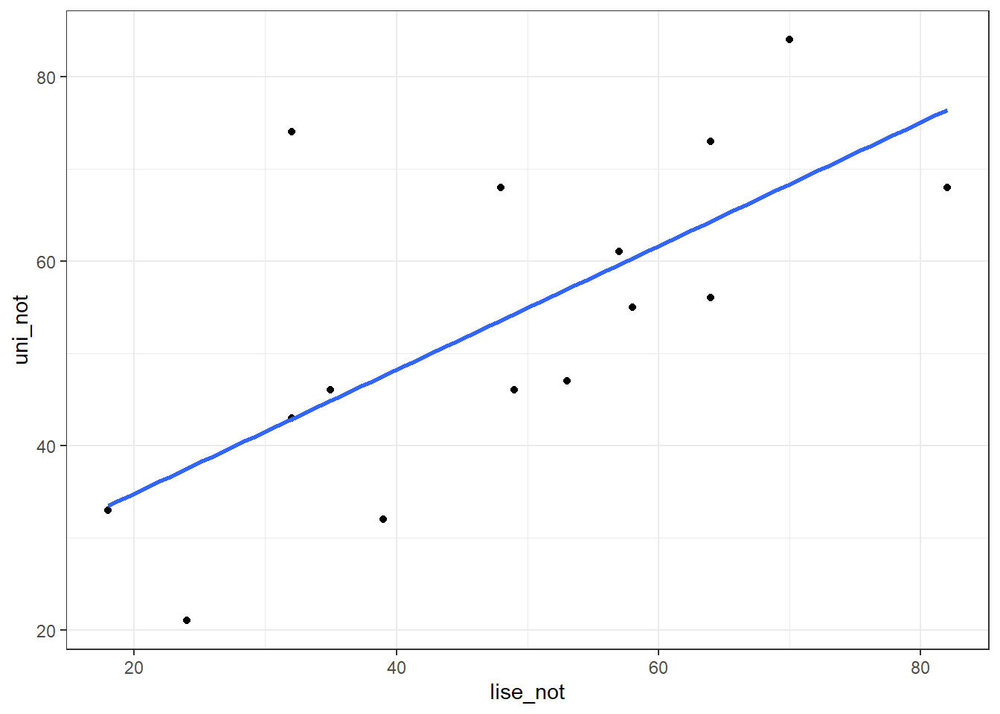

# Regresyon

-   Bilindiği üzere, t-testi, varyans analizi gibi ortalama farkları ile ilgili hipotez testleri değişkenler arasındaki ilişkiye dair herhangi bir bilgi vermemektedir.

-   Oysa serpilme diyagramlarına bakıldığında değişkenler arasında bir **ilişki** olabileceği hissedilebilmekte fakat bu tür analizlerle bu **ilişkiler** ortaya koyulamamaktadır.

-   Dolayısıyla değişkenler arasındaki **ilişkinin şeklini, yönünü ve kuvvetini** belirleyebilmemiz için yeni metotlara ihtiyaç vardır. Bu metotlar ise genel olarak **regresyon (eğri uydurma) ve korelasyon analizi** olarak adlandırılır.


## Regresyon Kullanım Alanları

-   Tarımda belli ürünlerin verimi etkileyen toprak türü, tohum, sulama v.b. faktörlerin saptanması ve bunlar yardımıyla belli şartlarda alınacak ürün miktarının kestirilmesi tarımın önemli konusudur.

-   Bir değişkenin değerlerinin ilgili başka değişkenler yardımıyla kestirilmesi, günlük yaşamımızın, ticaretin ekonominin, doğa ve sosyal bilimlerin önemli konularını içendedir.

-   günlük yaşamımızın, ticaretin ekonominin, doğa ve sosyal bilimlerin pek çok alanındaki çalışmalarda iki ya da daha çok değişken arasında fonksiyonel ilişkiler vardır. Bu ilişkiler matematiksel bir denklem yazılabilir.

Örneğin taksi hizmeti ödenen $ücret = a + bx$
<br>
a: sabit (taksimetre açılış ücreti) 
<br>
b: her kilometrede artan ücret


## Regresyon Kullanım Alanları

-   Regresyon çözümlemenin temel amacı; bağımlı değişken ile bağımsız değişken(ler) arasındaki ilişkiyi matematiksel modelle açıklayarak bağlantılar bulmak ve bağımsız değişken(ler) yardımıyla bağımlı değişkenli kestirmek şeklinde özetlenebilir.

-   Sosyal bilimlerde değişkenler arasındaki ilişkiler bir dereceye kadar fonksiyoneldir. (taksimetre örneği kadar net değildir!) Bu ilişkiye **probabilisitik** ilişki denir.


-   Sosyal bilimlerde değişkenler arasındaki ilişkilerin matematiksel olarak kesin ifadelerle yazılamaması, bu değişkenlere ait önceki bilgiler yardımıyla elde edilmesi ve matematiksel ifadelerin bu bilgilere dayanılarak yazılması yolunu açmıştır.

-   Regresyon terimi 19. yüzyılda İngiliz istatistikçisi Francis Galton tarafından bir biyolojik inceleme için ortaya atılmıştır. Bu incelemenin ana konusu kalıtım olup, aile içinde baba ve annenin boyu ile çocukların boyu arasındaki bağlantıyı araştırmakta ve çocukların boylarının bir nesil içinde eski ata nesillerinin ortalamasına geri döndüklerini yani bir nesil içinde ortalamaya geri dönüş olduğu inceleme konusudur.

## Basit Doğrusal Regresyon

- Bir bağımsız $X$ değişkeninin değerlerinden ona bağlı değişkeninin değerlerinin kestirilmesini sağlayan denkleme **$Y$’in $X$’e göre regresyonu** denir. 

$$Y= bx + a$$
- Regresyon denkleminde 
$b$ doğrunun eğimidir – $X$’in 1 puanlık değişimine karşılık Y’nin ne kadar değişeceğini belirtir. (buna **regresyon katsayısı** denir)

- $a$ ise $Y$-kesişim noktasıdır – $X$ sıfıra eşit olduğunda $Y$’nin alacağı değerdir (buna **regresyon sabiti** denir)

-   **Lise matematik puanlarından** yararlanarak **üniversite genel matematik puanlarını** kestirme amacıyla üniversite genel matematik dersini alan öğrencilerden uygun bir örneklem alınmıştır.


```r
lise_not <- c(18,35,53,24,64,58,32,39,64,82,32,49,48,70,57)
uni_not  <- c(33,46,47,21,73,55,74,32,56,68,43,46,68,84,61)
veri <- data.frame(lise_not, uni_not)
```

-   Regresyon analizi yapmadan önce **saçılım diagramı** incelenmelidir. Puanlar saçılım grafiğinde tek bir doğru oluşturmamaktadır. Ancak doğru oluşturma eğilimleri vardır.


```r
ggplot2::ggplot(veri, aes(x = lise_not, y = uni_not)) + geom_point() +   geom_smooth(method = "lm", se = F)
```



-   Noktalardan olabildiğince yakın geçecek bir doğru çizilebilirse bu doğrudan yararlanarak $X$ puanı bilinen öğrencilerin $Y$ puanları kestirilebilir.


```r
basitreg <- lm(uni_not ~ lise_not , veri)
summary(basitreg)
```

```
## 
## Call:
## lm(formula = uni_not ~ lise_not, data = veri)
## 
## Residuals:
##     Min      1Q  Median      3Q     Max 
## -16.475  -8.349  -0.449   5.037  31.158 
## 
## Coefficients:
##             Estimate Std. Error t value Pr(>|t|)   
## (Intercept)   21.373     10.196    2.10   0.0562 . 
## lise_not       0.671      0.198    3.38   0.0049 **
## ---
## Signif. codes:  0 '***' 0.001 '**' 0.01 '*' 0.05 '.' 0.1 ' ' 1
## 
## Residual standard error: 13.4 on 13 degrees of freedom
## Multiple R-squared:  0.468,	Adjusted R-squared:  0.427 
## F-statistic: 11.4 on 1 and 13 DF,  p-value: 0.0049
```


## En küçük kareler yöntemi

-   Bu yönteme göre **a** ve **b** öyle bir belirlenmelidir ki dağılımdaki noktaların, doğrunun etrafındaki değişkenliği en aza indirgenmiş olmalıdır.

-   Regresyon doğrusu, noktalar ile regresyon doğrusu arasındaki sapmaların kareler toplamı en az olacak şekilde, saçılım grafiğindeki noktalar kümesine en uygun yere çizildiğinden bu ölçüte **en küçük kareler ölçütü** adı verilir.


-   $Y$ değeri ve regresyon doğrusundaki $Y′$ arasındaki farkın en küçük olacak şekilde yerleştirilir.

-   $\sum(Y-Y′)^2$ en küçük olacak şekilde yerleştirir.


- $b_{yx}=\frac{n\sum{XY}-\sum{X}\sum{Y}}{n\sum{X^2}-(\sum{X})^2}$


- $a_{yx}=\frac{n\sum{Y}-b_{YX}\sum{X}}{n}$


- $b_{yx}$ hesaplama

- $b_{YX}=\frac{n\sum{XY}-\sum{X}\sum{Y}}{n\sum{X^2}-(\sum{X})^2}$


```r
n <- length(lise_not)
byx = (n*sum(lise_not*uni_not)-sum(lise_not)*sum(uni_not))/
  (n*sum(lise_not^2) - sum(lise_not)^2)
byx
```

```
## [1] 0.671
```

- **Regresyon doğrusunun eğimi**, değişkenlerin **standart sapmalarının oranlarıyla** bunlar arasındaki **korelasyonun** çarpımına eşittir. 


```r
(sd(uni_not)/sd(lise_not))*cor(lise_not,uni_not)
```

```
## [1] 0.671
```


- $a_{yx}$  hesaplama

- $a_{yx}=\frac{n\sum{Y}-b_{yx}\sum{X}}{n}$


```r
attach(veri)
ayx = (sum(uni_not) - byx*sum(lise_not))/15
ayx
```

```
## [1] 21.4
```


## Kestirimin Standart Hatası

- Kestirim sonunda $Y$ **değişkeninin gözlenen değerleri** ile **regresyon değerleri** $Y'$  arasında fark olmaması veya bu farkın olabildiği kadar küçük olması istenir.

- **Gözlenen** $Y$ ve **kestirilen** $Y'$ değerleri arasındaki farklar kestirimdeki hatalardır. Bu farkların karelerinin ortalamasının kare köküne kestirimin standart hatası adı verilir. 

- $$S_{yx}=\sqrt{\sum{\frac{(Y-Y')^2}{n-2}}}$$

- $$S_{yx}=\sqrt{\frac{\sum{Y^2}-a\sum{Y}-b\sum{XY}}{n-2}}$$


- Ortak dağılımın için **kestirimin standart hatası** tek değişkenli dağılımın standart sapmasına benzer.

- Standart sapma tek değişkenli dağılımın ortalamadan farkının standart bir ölçüsü olduğu gibi, kestirimin standart hatası da noktaların standart regresyon çizgisinden farkının ölçüsüdür. 
- Bu nedenle kestirimin standart hatası verilen X değeri için kestirilen Y değerinin standart sapması şeklinde okunabilen $S_{yx}$ sembolü ile gösterilir.  


$X$  değerlerinden kestirilen $Y'$ ’lerin standart hatası


```r
sqrt((sum(uni_not^2)-ayx*sum(uni_not)-
       byx*(sum(uni_not*lise_not)))/13)


res <- basitreg$residuals

sqrt(sum((res - mean(res)) ^ 2 / (length(res)-2)))
```

```
## [1] 13.4
## [1] 13.4
```


### Basit Doğrusal Regresyon Uygulama


```r
basitreg <- lm(uni_not ~ lise_not , veri)
library(broom)
glance(basitreg) %>% kable()
```


| r.squared| adj.r.squared| sigma| statistic| p.value| df| logLik| AIC| BIC| deviance| df.residual| nobs|
|---------:|-------------:|-----:|---------:|-------:|--:|------:|---:|---:|--------:|-----------:|----:|
|     0.468|         0.427|  13.4|      11.4|   0.005|  1|  -59.2| 124| 127|     2350|          13|   15|

- $R$ İki değişken arasında pearson korelasyon katsayısı
- $R-Square:$ Determinasyon katsayısı/bağımsız değişkenin bağımlı değişken üzerindeki açıklama oranı
- $\text{Adjusted R Square:}$: Düzeltmiş determinasyon katsayısı, şans eseri açıklanan değişimin neden olduğu hatanın arındırılmış hali.
- $\text{Standart Kestirimin Hatası:}$ Hata teriminin standart sapmasıdır.


- Tablodaki $p$ değeri regresyon modelindeki yordanan ve yordayan değişkenler arasındaki ilişki için hesaplanan değerin anlamlı olup olmadığını göstermektedir. 


```r
glance(basitreg)[,c(1,2,4,6,5)]
```

<div class="kable-table">

| r.squared| adj.r.squared| statistic| df| p.value|
|---------:|-------------:|---------:|--:|-------:|
|     0.468|         0.427|      11.4|  1|   0.005|

</div>

- Yani regresyon modelinde lise matematik puanları ile genel matematik puanları arasında doğrusal ilişki anlamlı düzeydedir. Regresyon modelindeki $df$ 1 olması nedeni,regresyon modelindeki sabit ve eğimi katsayı olarak almasıdır. 2-1


```r
tidy(basitreg)
```

<div class="kable-table">

|term        | estimate| std.error| statistic| p.value|
|:-----------|--------:|---------:|---------:|-------:|
|(Intercept) |   21.373|    10.196|      2.10|   0.056|
|lise_not    |    0.671|     0.198|      3.38|   0.005|

</div>

- $p$ değerleri sabitin ve yordayıcı değişkenin katsayısının anlamlılık testi sonuçları


# Çoklu Regresyon

- Çok değişkenli analiz, bir çalışmadaki bireylerden veya 
nesnelerden elde edilen çoklu ölçümlerin aynı anda 
analizidir. Dolayısıyla **ikiden fazla değişkenin** aynı anda 
analizi çok değişkenli analiz olarak düşünülebilir.

- Çok değişkenli analiz yöntemlerinin çoğu **tek veya iki 
değişkenli** analiz yöntemlerinin uzantısıdır.

- Çoklu regresyon, basit regresyonun tek bir bağımlı değişkenin 
**iki veya daha fazla yordayıcısına** izin veren uzantısıdır. Diğer bir 
ifadeyle, çoklu regresyon tek bir bağımlı değişken ile **iki veya daha 
fazla bağımsız (yordayıcı)** değişken arasındaki ilişkinin analiz 
edilmesi için kullanılan istatistiksel bir yöntemdir. 

- Çoklu regresyonun amacı değerleri bilinen **bağımsız değişkenleri 
kullanarak bağımlı değişkenin değerini** yordamaktır. 

- Regresyon yöntemiyle **bağımsız değişkenlerden en fazla yordamayı 
sağlamak üzere her bağımsız değişken**  ağırlıklandırılır. 


- Ağırlıklar bağımsız değişkenin **yordamaya bağıl katkısını** ifade eder 
ve her bir  değişkenin yordamadaki etkisine ilişkin yorumlamayı kolaylaştırır. 

- Çoklu regresyon, hem bağımlı değişken hem de bağımsız 
değişkenler **en az eşit aralıklı ölçek düzeyinde** ölçüldüğünde 
kullanılmalıdır. 

- Ancak bağımsız değişkenler **sınıflama veya sıralama ölçeğinde** ölçüldüğünde ilgili değişkenler **belli koşullar**
altında analize dahil edilebilir.

- Çoklu regresyon her bir bağımsız değişkendeki değişikliklerin 
**bağımlı değişkendeki değişikliklerle ne ölçüde** ilişkili olduğunu 
kestirir. 

- Ancak **bağımsız değişkenler arasındaki korelasyon**
yordama sürecini zorlaştırır.


## Çoklu Regresyon


Örneğin, $X_1$ ve $Y$ arasındaki  korelasyon katsayısı **0.40**, $X_2$ ve $Y$
arasındaki korelasyon katsayısı **0.60**, $X_1$ ve $X_2$ arasındaki korelasyon 
katsayısı sıfır ise, $Y$’nin  varyansının iki değişken tarafından 
açıklanan toplam oranı iki  değişkenin $Y$ ile korelasyonlarının 
kareleri toplamından elde edilebilir: 

$0.40^2 + 0.50^2 = 0.16 + 0.25 = 0.41$


- Ancak, uygulamada çoğunlukla $X_1$ ve $X_2$ birlikte değişim gösterirler 
ve iki değişkenin  $Y$ ile korelasyonlarının kareleri toplamı 
çok yüksek bir oran verir. 

- Bunun nedeni, iki bağımsız  değişkenin aralarındaki  korelasyondan dolayı
her bir  bağımsız değişken tarafından  açıklanan $Y$ varyansının bir  kısmının üst üste gelmesidir. 

- Çoklu regresyonun en önemli  özelliği modele eklenen bağımsız 
değişkenler arasındaki ilişkileri kontrol altına almasıdır. 


- Modeldeki bağımsız değişkenler arasındaki ilişkilerin kontrol altına alınması, modeldeki bir değişkenin bağımlı değişken üzerindeki etkisini incelerken, modeldeki diğer bütün değişkenlerin sabit tutulmasıdır.**ceteris paribus**

  - Örneğin, bir çalısmada kahve tuketiminin ölüm oranını nasıl etkilediği calisilmistir. Basta, sonuclar daha yuksek kahve tuketiminin daha yuksek ölüm riskiyle ilişkili oldugunu gostermistir. Ancak kahve icen cogu kisi sigara da icmektedir. Arastirmacilar modellerine sigara icme aliskanliklari icin bir degisken eklediklerinde, sigara icmenin ölüm riskini artırırken, kahve tuketiminin ölüm riskini azalttığını bulmuşlardır.

- Bu durumda modele bütün onemli değişkenlerin eklenmesi gerekmektedir. Onemli değişkenlerin modelin dışında bırakılması, katsayılara ilişkin kestirimlerin **yanlı** olmasina neden olabilmektedir.


## Çoklu Regresyon Uygulama


- **Performans:** Öğrencilerin matematik  performans düzeyleri olup eşit aralık 
ölçeğinde ölçülen sürekli bir değişkendir.
- **Motivasyon:** Öğrencilerin motivasyon 
düzeyleri olup eşit aralık ölçeğinde 
ölçülen sürekli bir değişkendir.
- **Kaygı:** Öğrencilerin kaygı düzeyleri olup 
eşit aralık ölçeğinde ölçülen sürekli bir 
değişkendir.
- **Güven:** Öğrencilerin matematiğe karşı 
güven düzeyleri olup eşit aralık ölçeğinde 
ölçülen sürekli bir değişkendir.


Betimsel İstatistikler

```r
library(haven)
performans <- read_sav("import/Performans.sav")
psych::describe(performans)[,3:4]
```

<div class="kable-table">

|           | mean|    sd|
|:----------|----:|-----:|
|Performans | 18.2|  7.83|
|Motivasyon | 39.9| 10.03|
|Kaygi      | 18.1|  4.77|
|Guven      | 21.6|  7.38|

</div>


## Korelasyon değerleri ve anlamlılığı


```r
cor_1 <- cor.test(~ Performans + Motivasyon , data = performans)
tidy(cor_1)[,c(1,3)]
```

<div class="kable-table">

| estimate| p.value|
|--------:|-------:|
|    0.824|       0|

</div>


```r
cor_2 <- cor.test(~ Performans + Kaygi , data = performans)
tidy(cor_2)[,c(1,3)]
```

<div class="kable-table">

| estimate| p.value|
|--------:|-------:|
|   -0.241|   0.388|

</div>


```r
cor_3 <- cor.test(~ Motivasyon + Kaygi , data = performans)
tidy(cor_3)[,c(1,3)]
```

<div class="kable-table">

| estimate| p.value|
|--------:|-------:|
|    0.147|   0.601|

</div>


## Çoklu Regresyon

- Öğrencilerin matematikteki **performans düzeylerini, motivasyon ve 
kaygı düzeylerinden yordamak** ile ilgilendiğimizi düşünelim.

- Bu araştırma sorusuna cevap vermek için çoklu regresyon uygun bir 
istatistiksel analiz yöntemdir.

$$Y_{performans_i} = b_0 + b_1 X_{motivasyon_i} +  b_2 X_{kaygi_i} + e_i$$

- Burada, $b_1$ ve $b_2$ motivasyon ve kaygı yordayıcıları için ağırlıklardır. Diğer bir ifadeyle regresyon katsayılarıdır veya eğimlerdir. $b_0$ ise kesişimdir.


## Çoklu Regresyon

- Amaç hata puanlarının (artiklarin) kareleri toplamının küçüleceği, 
diğer bir ifade ile $Y$ ve yordanan $Y'$ arasındaki korelasyonun 
büyüyeceği, $b_0$, $b_1$ ve $b_2$ değerleri için tek bir çözüm kümesi 
bulmaktır.

- Grafiğin sadeleştirilmesi için bir bağımsız değişken kullanılmıştır.

- Tek bir çözüm bulmak için  kullanılan yöntem Sıradan **En 
Küçük Kareler Yöntemi**  (Ordinary Least Squares  Procedure) olarak adlandırılır. 


## Çoklu Regresyon

- $R^2$ değeri *çoklu korelasyon katsayısı* (multiple correlation 
coefficient) olup bağımlı değişkenin gözlenen değerleri ile bağımsız 
değişkenlerin *en iyi doğrusal kombinasyonu* arasındaki 
korelasyondur. 

- **En iyi doğrusal kombinasyon**, bağımlı değişkenin 
bağımsız değişkenlerden yordanmasında, daha iyi bir iş yapacak 
regresyon katsayıları kümesi olmadığı anlamına gelir.


## Çoklu Regresyon

Çoklu Korelasyon

```r
model <- lm(Performans ~ Motivasyon + Kaygi,data=performans)
sqrt(glance(model)[,1])
```

<div class="kable-table">

| r.squared|
|---------:|
|     0.902|

</div>

-  R değeri bağımlı değişkenin **gözlenen** ve **yordanan** değerleri arasındaki **korelasyondur**.

- Bağımlı değişkenin **yordanan değerinin** bağımlı değişkenin 
**gözlenen değerine** mümkün olduğunca yakın olmasını 
gerektiren **en küçük kareler kriterinden** dolayı bağımlı 
değişkenin **gözlenen ve yordanan değerleri arasındaki korelasyon eksi 
değerler** alamaz. Dolayısıyla çoklu korelasyon katsayısı 0 ile 1 
arasında değişir


## Çoklu Regresyon

** Çoklu Korelasyon**
$$R_{Y_{12}}= \sqrt{\frac{r^2_{Y_1}+r^2_{Y_2}-2r^2_{Y_1}r^2_{Y_2}r_{12}}{1-r_{12}}}$$
$$R_{Y_{12}}=\sqrt{\frac{(0.824)^2+(-0.241)^2-2*(0.824)(-0.241)(0.147)}{1-(0.147)^2}}) = 0.902$$

```r
model_s <- augment(model,data=performans)
cor(model_s[,1], model_s[,5])
```

```
##            .fitted
## Performans   0.902
```

öğrencilerin **gözlenen performans puanları** ve **yoradan performans puanları** arasındaki korelasyon katsayısı nokta **0.902** eşittir


## Çoklu Regresyon


Çoklu Korelasyon

- Çoklu korelasyon katsayısının kestirimi hem örneklem büyüklüğüne 
$(n)$ hem de bağımsız değişkenlerin sayısına $(k)$ bağlıdır. 

- Bağımlı değişken ile bağımsız değişkenler arasında hiç ilişki yoksa, 
$R$ değerinin sıfıra yakın olması beklenir ancak $R$’nin beklenen değeri 
rastgele bir veri için $k/(n-1)$’dir. 


## Çoklu Regresyon


  - Örneğin, örneklem büyüklüğünün **50**, bağımsız değişken sayısının **2** olduğu bir  durumda, bağımlı değişken ile bağımsız değişkenler arasında hiç ilişki yoksa, R değeri **0.04** olacaktır, **0** değil.

- Bu nedenle büyük örnekleme sahip olmak önemlidir. Her bağımsız 
değişken için **en az 10** gözlem önerilmektedir. Bir başka öneri de 
örneklem büyüklüğünün **bağımsız değişken sayısından en az 50 
fazla olması** yönündedir.

- Bir çalışmada, tek bir bağımsız değişken bulunduğunda, **0.80** güce sahip olmak için **0.30** evren korelasyonunun **124** birey gerektireceği belirtilmiştir. **Beş bağımsız** değişken bulunduğundaysa, örneklem büyüklüğünün **187** olması gerekmektedir.


## Çoklu Regresyon

**Çoklu Korelasyon**


```r
model <- lm(Performans ~ Motivasyon + Kaygi,data=performans)
glance(model)[,1]
```

<div class="kable-table">

| r.squared|
|---------:|
|     0.814|

</div>

$R^2$ değeri **belirlilik katsayısı** (coefficient of determination) olup 
bağımlı değişkenin gözlenen ve yordanan değerleri arasındaki 
korelasyonun karesi alınarak hesaplanır. Bu değer bağımlı 
değişkendeki varyansın model tarafından açıklanan oranını ifade 
eder. Diğer bir ifadeyle **bağımlı değişkenin varyansının bağımsız 
değişkenlerin en iyi doğrusal kombinasyonu** ile paylaşılan oranını 
ifade eder. 
 **Performans puanlarındaki varyansın yaklaşık %81’i öğrencilerin motivasyon ve kaygı puanları** tarafından açıklanabilir. 


## Çoklu Regresyon

- Modele yeni bir bağımsız değişken eklendiginde, $R^2$ degeri artar, 
sadece **sans eseri olsa bile**. Boylece daha fazla bağımsız değişken 
iceren model sadece daha fazla bağımsız değişken icerdigi icin 
veriye daha iyi uyum sagliyor gibi gozukebilir. 

- Bu etkiyi gidermek icin  $adj R^2$ degeri hesaplanabilir.

-  $adj R^2$ değeri, $R^2$ değerinin modeldeki bağımsız degisken sayısı için modifiye edilmis versiyonudur.  $adj R^2$ degeri yeni eklenen bağımsız
degisken modeli sans eseri beklenenden daha fazla gelistirirse artar, 
daha az gelistirirse azalir. 

-  $adj R^2$ değeri, eksi değerler alabilir ancak genellikle artı değerler alır. Her zaman $R^2$ değerinden daha düşüktür.


## Çoklu Regresyon


$R^2$ değeri, $n$ gözlemlerin sayısı, $k$ bağımsız değişkenlerin  sayısı olmak üzere, aşağıdaki eşitlikle hesaplanabilir.
$$R^2_{adj}= R^2 - \frac{k-(1-R^2)}{n-k-1}$$
$$R^2_{adj}= 0.814 - \frac{2-(1-0.814)}{15-2-1} =0.783$$


```r
glance(model)[,2]
```

<div class="kable-table">

| adj.r.squared|
|-------------:|
|         0.783|

</div>
$adj R^2$ evrende gerçek korelasyonun karesinin daha az yanlı kestirimi olsa da, çoğunlukla $R^2$ değeri rapor edilir.


## Çoklu Regresyon

- **Kestirimin standart hatası**  (standard error of the estimation), modeldeki  artıkların karelerinin toplamının, $n-p$ ( $n$ örneklem büyüklüğü ve $p$ modeldeki parametrelerin sayısı) ile bölünmesiyle elde  edilen bölümün kareköküdür.


```r
glance(model)[,3]


res <- model$residuals
sd(res)

sqrt(sum((res - mean(res)) ^ 2 / (length(res)-3)))
```

<div class="kable-table">

| sigma|
|-----:|
|  3.65|

</div>

```
## [1] 3.38
## [1] 3.65
```
]


## Çoklu Regresyon

- Modelin veriye iyi uyup uymadığının test edilmesinde kullanılacak **F** değeri varyans analizi sonucunda elde edilir.

- Regresyonun anlamlılığının test edildiği varyans analizinde, birlikte ele alınan bir grup bağımsız değişkenin (motivasyon ve kaygı gibi)  en iyi doğrusal kombinasyonu ile bağımlı değişken (performans gibi)  arasında **korelasyon yoktur sıfır hipotezi** test edilir. İstatistiksel olarak  **anlamlı etki**, **evrende çoklu korelasyon katsayısının sıfırdan farklı  olduğu anlamına **gelir.


## Çoklu Regresyon


```r
glance(model)[,4:6]
```

<div class="kable-table">

| statistic| p.value| df|
|---------:|-------:|--:|
|      26.2|       0|  2|

</div>

- F istatistiği 26.2 değerine eşittir ve istatistiğe ilişkin p < 0.001. Bu olasılık 0.05’ten küçük olduğundan, sıfır hipotezi reddedilir. 

- Bu sonuç **motivasyon ve kaygı değişkenlerinin ikisi birlikte kullanıldığında, çoklu korelasyon katsayısının anlamlı olarak sıfırdan büyük olduğunu** ifade etmektedir. Diğer bir ifadeyle, motivasyon ve kaygı değişkenleri  performansı istatistiksel olarak anlamlı bir şekilde yordamaktadır. 
- **Regresyon modeli veriye iyi uyum sağlamaktadır.**


## Çoklu Regresyon

```r
library(knitr)
tidy(model) %>% kable()
```


|term        | estimate| std.error| statistic| p.value|
|:-----------|--------:|---------:|---------:|-------:|
|(Intercept) |    1.744|     5.096|     0.342|   0.738|
|Motivasyon  |    0.686|     0.098|     6.975|   0.000|
|Kaygi       |   -0.607|     0.207|    -2.936|   0.012|

Performans puanlarındaki farklılıkların **bir kısmı motivasyon puanlarındaki farklılıklardan**, **bir kısmı ise kaygı puanlarındaki farklılıklardan** kaynaklanmaktadır


## Çoklu Regresyon

- **Performansın** sadece **kaygıdan yordandığı basit regresyon analizi**  gerçekleştirilirse, yordanan puanlar ve gözlenen puanlar arasındaki fark **(artıkPER1)**, **performansın kaygıdan yordanamayan kısmı** olacaktır. 


```r
artıkPER1 <- lm(Performans ~  Kaygi,data=performans)$residuals
```

- **Motivasyonun** sadece **kaygıdan yordandığı basit regresyon analizi**  gerçekleştirilirse, yordanan puanlar ve gözlenen puanlar arasındaki fark  **(artıkMOT)**, **motivasyonun kaygıdan yordanamayan kısmı** olacaktır.


```r
artıkMOT <- lm(Motivasyon  ~  Kaygi,data=performans)$residuals
```

- Böylece **artıkPER1** ve **artıkMOT** olarak adlandırılan artık puanlar kaygıdan bağımsız olacaktır. 


## Çoklu Regresyon

-  Diğer bir ifadeyle, **kaygı ilişkilerinde** herhangi bir rol oynamayacaktır. **artıkPER1** puanları **artıkMOT** puanlarından yordanırsa, **artıkMOT** puanlarına  ilişkin eğim katsayısı **0.686** olarak kestirilecektir. Bu değer, **öğrencilerin kaygı düzeyleri kontrol altına** alındıktan sonra, **motivasyon düzeylerindeki bir birimlik** artışın matematikteki **performans düzeylerini 0.686** birim artırmaya eğilimli  olduğunu önermektedir


```r
lm(artıkPER1  ~  artıkMOT,data=data.frame(artıkPER1,artıkMOT))$coefficients 
```

```
## (Intercept)    artıkMOT 
##    4.59e-16    6.86e-01
```


## Çoklu Regresyon

- $$B_{Y_{12}} = \frac{r_{Y1}-r_{Y2}r_{12}}{1-r^2_{12}}\frac{sd_Y}{sd_1}$$

- $$B_{Y_{12}} = \frac{(0.824)-(-0.241)(0.147)}{1-(0.022)}\frac{7.827}{10.025} = 0.879 * 0.780 =0.686$$

- Bu değer, **kaygı puanı kontrol altına alındıktan sonra**, **motivasyon** puanlarındaki
**bir birimlik artışın** öğrencilerin **matematik performansından 0.686** birim artmaya eğilimi olduğunu önermektedir.


```r
((cor(performans)[2,1] - cor(performans)[3,1]*cor(performans)[2,3])/
   (1-cor(performans)[2,3]^2))*(sd(performans$Performans)/sd(performans$Motivasyon))
```

```
## [1] 0.686
```


## Çoklu Regresyon

- **Performansın** sadece **motivasyondan** yordandığı basit regresyon analizi 
gerçekleştirilirse, yordanan puanlar ve gözlenen puanlar arasındaki fark 
**(artıkPER2)**, **performansın motivasyondan** yordanamayan kısmı olacaktır. 


```r
artıkPER2 <- lm(Performans ~  Motivasyon ,data=performans)$residuals
```

- **Kaygının** sadece **motivasyondan** yordandığı basit regresyon analizi  
gerçekleştirilirse, yordanan puanlar ve gözlenen puanlar arasındaki 
fark **(artıkKAY)**, **kaygının motivasyondan** yordanamayan kısmı olacaktır. 


```r
artıkKAY <- lm(Kaygi ~  Motivasyon ,data=performans)$residuals
```


## Çoklu Regresyon

- Böylece **artıkPER2** ve **artıkKAY** olarak adlandırılan artık puanlar motivasyondan bağımsız olacaktır. Diğer bir ifadeyle, **motivasyon ilişkilerinde herhangi bir rol** oynamayacaktır. 

- **artıkPER2** puanları **artıkKAY** puanlarından yordanırsa, **artıkKAY** 
puanlarına ilişkin eğim katsayısı **-0.607** olarak kestirilecektir. Bu değer,
**öğrencilerin motivasyon düzeyleri kontrol altına alındıktan sonra**, kaygı 
düzeylerindeki **bir birimlik** artışın matematikteki performans düzeylerini **0.607** birim azaltmaya eğilimli olduğunu önermektedir


```r
lm(artıkPER2  ~  artıkKAY,data=data.frame(artıkPER2,artıkKAY))$coefficients
```

```
## (Intercept)    artıkKAY 
##   -6.18e-16   -6.07e-01
```


## Çoklu Regresyon

$$B_{Y_{21}} = \frac{r_{Y2}-r_{Y1}r_{12}}{1-r^2_{12}}\frac{sd_Y}{sd_2}$$

$$B_{Y_{12}} = \frac{(-0.241)-(0.824)(0.147)}{1-(0.022)}\frac{7.827}{4.769}=(-0.370)*(1.641) =-0.607$$

Bu değer, **motivasyon puanı kontrol altına alındıktan sonra**,  kaygı puanlarındaki **bir birimlik** artışın öğrencilerin matematik performansından **0.607** birim azaltmaya eğilimli olduğunu önermektedir.


```r
((cor(performans)[3,1] - cor(performans)[2,1]*cor(performans)[2,3])/
   (1-cor(performans)[2,3]^2))*(sd(performans$Performans)/sd(performans$Kaygi))
```

```
## [1] -0.607
```


## Çoklu Regresyon

$$B_0 = M_Y - B_{Y12}*M_1 -B_{Y21}*M_2$$
$$B_0 = 18.176  - (0.686)*(39.933) -(-0.607)*(18.701) = 1.744$$


```r
mean(performans$Performans)-
  model$coefficients[2]*mean(performans$Motivasyon)-
  model$coefficients[3]*mean(performans$Kaygi)
```

```
## Motivasyon 
##       1.74
```

Bu değer hem motivasyon puanı hem de kaygı puanı 0'a eşit olduğunda yordanan performans puanıdır.


## Çoklu Regresyon

Böylece yordanan performans puanı 

$$Y_{performans_i} = 1.744 + 0.686 X_{motivasyon_i} -  0.607 X_{kaygi_i}$$


## Çoklu Regresyon


```r
library(QuantPsyc)
lm.beta(model)
```

```
## Motivasyon      Kaygi 
##      0.879     -0.370
```

- Çoklu regresyon eşitliğini elde etmeden önce değişkenlerin her biri 
**standartlaştırılırsa** (değişkenlerin her birinin ortalaması 0, standart sapması 1  olacak şekilde ayarlanırsa), sonuçlar **standart sapma** birimlerince ifade edilir.

- Böylece örnekte standartlaştırılmış değişkenler kullanıldığında, yordanan 
standartlaştırılmış performans düzeyleri aşağıdaki eşitlikle hesaplanabilir:

$$Y_{Zperformans_i} = 0.879 X_{Zmotivasyon_i} + -0.370 X_{Zkaygi_i}$$
- Değişkenler standartlaştırıldığında, **kesişim katsayısı 0** olacaktır ve eşitlikte gösterilmeyecektir.


## Çoklu Regresyon


- Motivasyon için **standartlaştırılmış eğim katsayısı** $\beta_{motivasyon}$ **0.879** değerine eşittir. 

- Bu değer, **kaygı puanı kontrol altına alındıktan** sonra, **motivasyon** 
puanındaki **bir standart sapmalık artışın** öğrencilerin matematikteki 
performans puanlarını **0.879 standart sapma** artırmaya eğilimli olduğunu 
önermektedir.

- Benzer şekilde, **kaygı için standartlaştırılmamış eğim katsayısı** $\beta_{motivasyon}$ -0.370 değerine eşittir. Bu değer, **motivasyon puanı kontrol altına** alındıktan sonra, kaygı puanındaki **bir standart sapmalık artışın** öğrencilerin matematikteki performans puanlarını **0.370 standart sapma** azaltmaya eğilimli olduğunu 
önermektedir.


## Çoklu Regresyon

- Motivasyonun standartlaştırılmış eğim katsayısının mutlak değeri, 
kaygının standartlaştırılmış eğim katsayının mutlak değerinden daha büyük olduğundan, 
motivasyonun öğrencilerin matematikteki performanslarını yordamada kaygıya 
göre daha önemli bir yordayıcı olduğu söylenebilir.


**|0.879| > |-0.307|**
    
    

## Çoklu Regresyon

- Standartlaştırılmış eğim katsayılarının bağıl büyüklükleri "önemin" en iyi 
göstergeleri olmasa da, yorumlanmaları kolaydır ve regresyon analizlerinin 
yürütülmesinde yararlanılan bilgisayar programlarının çoğu tarafından yazdırılır.

- Ancak bağımsız değişkenlerin **standartlaştırılmamış eğim katsayılarını karşılaştırmak uygun değildir.** 

- NOT: Bağımsız değişkenler arasında korelasyon olduğunda, **standartlaştırılmış ğim katsayısı** bağımlı değişken ile bağımsız değişken arasındaki **korelasyon katsayısı değildir.**


## Çoklu Regresyon


```r
library(GGally)
ggpairs(performans[,1:3])
```


## Çoklu Regresyon


```r
library(scatterplot3d)
scatterplot3d(performans[,1:3])
```


## Çoklu Regresyon


```r
library(scatterplot3d)
scatterplot3d(performans[,1:3],pch = 16, color="steelblue", angle=75)
```


## Çoklu Regresyon


```r
scatterplot3d(performans[,1:3],pch = 16, color="steelblue",angle=75,box = FALSE,type = "h")
```


## Çoklu Regresyon


```r
library(rgl)
plot3d(performans$Performans, performans$Motivasyon, performans$Kaygi,
xlab = "Performans", ylab = "Motivasyon", zlab = "Kaygi", type = "s",size = 1.5,col = "red")
rglwidget() 
```

<div class="figure" style="text-align: center">

```{=html}
<div id="rgl69370" style="width:672px;height:480px;" class="rglWebGL html-widget" role="img" aria-labelledby="rgl69370-aria"></div>
<script type="application/json" data-for="rgl69370">{"x":{"material":{"color":"#000000","alpha":1,"lit":true,"ambient":"#000000","specular":"#FFFFFF","emission":"#000000","shininess":50,"smooth":true,"front":"filled","back":"filled","size":3,"lwd":1,"fog":true,"point_antialias":false,"line_antialias":false,"texture":null,"textype":"rgb","texmode":"modulate","texmipmap":false,"texminfilter":"linear","texmagfilter":"linear","texenvmap":false,"depth_mask":true,"depth_test":"less","isTransparent":false,"polygon_offset":[0,0],"margin":"","floating":false,"tag":"","blend":["src_alpha","one_minus_src_alpha"]},"rootSubscene":7,"objects":{"13":{"id":13,"type":"spheres","material":{},"vertices":"0","colors":"1","radii":[[0.7039732933044434]],"centers":"2","ignoreExtent":false,"fastTransparency":true,"flags":32771},"15":{"id":15,"type":"text","material":{"lit":false,"margin":0,"floating":true,"edge":[0,1,1]},"vertices":"3","colors":"4","texts":[["Performans"]],"cex":[[1]],"adj":[[0.5,0.5,0.5]],"centers":"5","family":[["sans"]],"font":[[1]],"ignoreExtent":true,"flags":33808},"16":{"id":16,"type":"text","material":{"lit":false,"margin":1,"floating":true,"edge":[1,1,1]},"vertices":"6","colors":"7","texts":[["Motivasyon"]],"cex":[[1]],"adj":[[0.5,0.5,0.5]],"centers":"8","family":[["sans"]],"font":[[1]],"ignoreExtent":true,"flags":33808},"17":{"id":17,"type":"text","material":{"lit":false,"margin":2,"floating":true,"edge":[1,1,1]},"vertices":"9","colors":"10","texts":[["Kaygi"]],"cex":[[1]],"adj":[[0.5,0.5,0.5]],"centers":"11","family":[["sans"]],"font":[[1]],"ignoreExtent":true,"flags":33808},"11":{"id":11,"type":"light","vertices":[[0,0,1]],"colors":[[1,1,1,1],[1,1,1,1],[1,1,1,1]],"viewpoint":true,"finite":false},"10":{"id":10,"type":"background","material":{},"colors":"12","centers":"13","sphere":false,"fogtype":"none","fogscale":1,"flags":32768},"12":{"id":12,"type":"background","material":{"lit":false,"back":"lines"},"colors":"14","centers":"15","sphere":false,"fogtype":"none","fogscale":1,"flags":32768},"14":{"id":14,"type":"bboxdeco","material":{"front":"lines","back":"lines"},"vertices":"16","colors":"17","axes":{"mode":["pretty","pretty","pretty"],"step":[5,5,5],"nticks":[5,5,5],"marklen":[15,15,15],"expand":[1.029999971389771,1.029999971389771,1.029999971389771]},"draw_front":true,"flags":32769},"7":{"id":7,"type":"subscene","par3d":{"antialias":8,"FOV":30,"ignoreExtent":false,"listeners":7,"mouseMode":{"none":"none","left":"trackball","right":"zoom","middle":"fov","wheel":"pull"},"observer":[0,0,125.3147583007812],"modelMatrix":[[0.8970806002616882,0,0,-17.76793670654297],[0,0.2918461263179779,1.51644504070282,-40.72311401367188],[0,-0.8018406629562378,0.5519408583641052,-105.1763000488281],[0,0,0,1]],"projMatrix":[[3.732050895690918,0,0,0],[0,3.732050895690918,0,0],[0,0,-3.863703727722168,-451.7452392578125],[0,0,-1,0]],"skipRedraw":false,"userMatrix":[[1,0,0,0],[0,0.3420201433256682,0.9396926207859085,0],[0,-0.9396926207859085,0.3420201433256682,0],[0,0,0,1]],"userProjection":[[1,0,0,0],[0,1,0,0],[0,0,1,0],[0,0,0,1]],"scale":[0.8970806002616882,0.8533009886741638,1.613767147064209],"viewport":{"x":0,"y":0,"width":1,"height":1},"zoom":1,"bbox":[3.32689905166626,36.2859001159668,21.17499923706055,55.82500076293945,10.28402137756348,28.60566902160645],"windowRect":[34,57,290,313],"family":"sans","font":1,"cex":1,"useFreeType":false,"fontname":"TT Arial","maxClipPlanes":8,"glVersion":4.6,"activeSubscene":0},"embeddings":{"viewport":"replace","projection":"replace","model":"replace","mouse":"replace"},"objects":[12,14,13,15,16,17,11],"subscenes":[],"flags":34067}},"crosstalk":{"key":[],"group":[],"id":[],"options":[]},"width":672,"height":480,"buffer":{"accessors":[{"bufferView":0,"componentType":5126,"count":15,"type":"VEC3"},{"bufferView":1,"componentType":5121,"count":1,"type":"VEC4"},{"bufferView":2,"componentType":5126,"count":15,"type":"VEC3"},{"bufferView":3,"componentType":5126,"count":1,"type":"VEC3"},{"bufferView":4,"componentType":5121,"count":1,"type":"VEC4"},{"bufferView":5,"componentType":5126,"count":1,"type":"VEC3"},{"bufferView":6,"componentType":5126,"count":1,"type":"VEC3"},{"bufferView":7,"componentType":5121,"count":1,"type":"VEC4"},{"bufferView":8,"componentType":5126,"count":1,"type":"VEC3"},{"bufferView":9,"componentType":5126,"count":1,"type":"VEC3"},{"bufferView":10,"componentType":5121,"count":1,"type":"VEC4"},{"bufferView":11,"componentType":5126,"count":1,"type":"VEC3"},{"bufferView":12,"componentType":5126,"count":1,"type":"VEC4"},{"bufferView":13,"componentType":5121,"count":1,"type":"VEC3"},{"bufferView":14,"componentType":5121,"count":1,"type":"VEC4"},{"bufferView":15,"componentType":5121,"count":1,"type":"VEC3"},{"bufferView":16,"componentType":5126,"count":17,"type":"VEC3"},{"bufferView":17,"componentType":5121,"count":1,"type":"VEC4"}],"bufferViews":[{"buffer":0,"byteLength":180,"byteOffset":0},{"buffer":0,"byteLength":4,"byteOffset":180},{"buffer":0,"byteLength":180,"byteOffset":184},{"buffer":0,"byteLength":12,"byteOffset":364},{"buffer":0,"byteLength":4,"byteOffset":376},{"buffer":0,"byteLength":12,"byteOffset":380},{"buffer":0,"byteLength":12,"byteOffset":392},{"buffer":0,"byteLength":4,"byteOffset":404},{"buffer":0,"byteLength":12,"byteOffset":408},{"buffer":0,"byteLength":12,"byteOffset":420},{"buffer":0,"byteLength":4,"byteOffset":432},{"buffer":0,"byteLength":12,"byteOffset":436},{"buffer":0,"byteLength":16,"byteOffset":448},{"buffer":0,"byteLength":3,"byteOffset":464},{"buffer":0,"byteLength":4,"byteOffset":467},{"buffer":0,"byteLength":3,"byteOffset":471},{"buffer":0,"byteLength":204,"byteOffset":476},{"buffer":0,"byteLength":4,"byteOffset":680}],"buffers":[{"byteLength":684,"bytes":"Ne5FQQAAsEG5LndBiJKDQAAAyEHygp5BXgOtQQAASEJj+pRB4F7HQQAAPEIUlZFB6rPQQQAA\nOEImhitBAJyNQQAAIEKqojJBgVkkQQAA+EEDT5NByy+XQQAAXEIDW+FBGpmZQQAAFEJdiZhB\nzgGOQQAAIEJTUpNBMQEOQgAAWEJuYpJB/lOQQQAAGEJKLGNBV7s1QQAAFEIVF9lBkAzCQQAA\nPEKHPHpBiq0oQQAA8EENGo5BAQAAATXuRUEAALBBuS53QYiSg0AAAMhB8oKeQV4DrUEAAEhC\nY/qUQeBex0EAADxCFJWRQeqz0EEAADhCJoYrQQCcjUEAACBCqqIyQYFZJEEAAPhBA0+TQcsv\nl0EAAFxCA1vhQRqZmUEAABRCXYmYQc4BjkEAACBCU1KTQTEBDkIAAFhCbmKSQf5TkEEAABhC\nSixjQVe7NUEAABRCFRfZQZAMwkEAADxChzx6QYqtKEEAAPBBDRqOQQAAwH8AAIBAAACAPwAA\nAAEAAMB/AACAQAAAgD8AAMB/AACAQAAAgD8AAAABAADAfwAAgEAAAIA/AADAfwAAgEAAAIA/\nAAAAAQAAwH8AAIBAAACAP5mYmD6ZmJg+mZiYPgAAgD8AAAABAQEBAAAAAAAAAKBAAADAfwAA\nwH8AACBBAADAfwAAwH8AAHBBAADAfwAAwH8AAKBBAADAfwAAwH8AAMhBAADAfwAAwH8AAPBB\nAADAfwAAwH8AAAxCAADAfwAAwH8AAMB/AADIQQAAwH8AAMB/AADwQQAAwH8AAMB/AAAMQgAA\nwH8AAMB/AAAgQgAAwH8AAMB/AAA0QgAAwH8AAMB/AABIQgAAwH8AAMB/AABcQgAAwH8AAMB/\nAADAfwAAcEEAAMB/AADAfwAAoEEAAMB/AADAfwAAyEEAAAAB"}]},"context":{"shiny":false,"rmarkdown":null},"vertexShader":"#line 2 1\n// File 1 is the vertex shader\n#ifdef GL_ES\n#ifdef GL_FRAGMENT_PRECISION_HIGH\nprecision highp float;\n#else\nprecision mediump float;\n#endif\n#endif\n\nattribute vec3 aPos;\nattribute vec4 aCol;\nuniform mat4 mvMatrix;\nuniform mat4 prMatrix;\nvarying vec4 vCol;\nvarying vec4 vPosition;\n\n#ifdef NEEDS_VNORMAL\nattribute vec3 aNorm;\nuniform mat4 normMatrix;\nvarying vec4 vNormal;\n#endif\n\n#if defined(HAS_TEXTURE) || defined (IS_TEXT)\nattribute vec2 aTexcoord;\nvarying vec2 vTexcoord;\n#endif\n\n#ifdef FIXED_SIZE\nuniform vec3 textScale;\n#endif\n\n#ifdef FIXED_QUADS\nattribute vec3 aOfs;\n#endif\n\n#ifdef IS_TWOSIDED\n#ifdef HAS_NORMALS\nvarying float normz;\nuniform mat4 invPrMatrix;\n#else\nattribute vec3 aPos1;\nattribute vec3 aPos2;\nvarying float normz;\n#endif\n#endif // IS_TWOSIDED\n\n#ifdef FAT_LINES\nattribute vec3 aNext;\nattribute vec2 aPoint;\nvarying vec2 vPoint;\nvarying float vLength;\nuniform float uAspect;\nuniform float uLwd;\n#endif\n\n#ifdef USE_ENVMAP\nvarying vec3 vReflection;\n#endif\n\nvoid main(void) {\n  \n#ifndef IS_BRUSH\n#if defined(NCLIPPLANES) || !defined(FIXED_QUADS) || defined(HAS_FOG) || defined(USE_ENVMAP)\n  vPosition = mvMatrix * vec4(aPos, 1.);\n#endif\n  \n#ifndef FIXED_QUADS\n  gl_Position = prMatrix * vPosition;\n#endif\n#endif // !IS_BRUSH\n  \n#ifdef IS_POINTS\n  gl_PointSize = POINTSIZE;\n#endif\n  \n  vCol = aCol;\n  \n// USE_ENVMAP implies NEEDS_VNORMAL\n\n#ifdef NEEDS_VNORMAL\n  vNormal = normMatrix * vec4(-aNorm, dot(aNorm, aPos));\n#endif\n\n#ifdef USE_ENVMAP\n  vReflection = normalize(reflect(vPosition.xyz/vPosition.w, \n                        normalize(vNormal.xyz/vNormal.w)));\n#endif\n  \n#ifdef IS_TWOSIDED\n#ifdef HAS_NORMALS\n  /* normz should be calculated *after* projection */\n  normz = (invPrMatrix*vNormal).z;\n#else\n  vec4 pos1 = prMatrix*(mvMatrix*vec4(aPos1, 1.));\n  pos1 = pos1/pos1.w - gl_Position/gl_Position.w;\n  vec4 pos2 = prMatrix*(mvMatrix*vec4(aPos2, 1.));\n  pos2 = pos2/pos2.w - gl_Position/gl_Position.w;\n  normz = pos1.x*pos2.y - pos1.y*pos2.x;\n#endif\n#endif // IS_TWOSIDED\n  \n#ifdef NEEDS_VNORMAL\n  vNormal = vec4(normalize(vNormal.xyz/vNormal.w), 1);\n#endif\n  \n#if defined(HAS_TEXTURE) || defined(IS_TEXT)\n  vTexcoord = aTexcoord;\n#endif\n  \n#if defined(FIXED_SIZE) && !defined(ROTATING)\n  vec4 pos = prMatrix * mvMatrix * vec4(aPos, 1.);\n  pos = pos/pos.w;\n  gl_Position = pos + vec4(aOfs*textScale, 0.);\n#endif\n  \n#if defined(IS_SPRITES) && !defined(FIXED_SIZE)\n  vec4 pos = mvMatrix * vec4(aPos, 1.);\n  pos = pos/pos.w + vec4(aOfs,  0.);\n  gl_Position = prMatrix*pos;\n#endif\n  \n#ifdef FAT_LINES\n  /* This code was inspired by Matt Deslauriers' code in \n   https://mattdesl.svbtle.com/drawing-lines-is-hard */\n  vec2 aspectVec = vec2(uAspect, 1.0);\n  mat4 projViewModel = prMatrix * mvMatrix;\n  vec4 currentProjected = projViewModel * vec4(aPos, 1.0);\n  currentProjected = currentProjected/currentProjected.w;\n  vec4 nextProjected = projViewModel * vec4(aNext, 1.0);\n  vec2 currentScreen = currentProjected.xy * aspectVec;\n  vec2 nextScreen = (nextProjected.xy / nextProjected.w) * aspectVec;\n  float len = uLwd;\n  vec2 dir = vec2(1.0, 0.0);\n  vPoint = aPoint;\n  vLength = length(nextScreen - currentScreen)/2.0;\n  vLength = vLength/(vLength + len);\n  if (vLength > 0.0) {\n    dir = normalize(nextScreen - currentScreen);\n  }\n  vec2 normal = vec2(-dir.y, dir.x);\n  dir.x /= uAspect;\n  normal.x /= uAspect;\n  vec4 offset = vec4(len*(normal*aPoint.x*aPoint.y - dir), 0.0, 0.0);\n  gl_Position = currentProjected + offset;\n#endif\n  \n#ifdef IS_BRUSH\n  gl_Position = vec4(aPos, 1.);\n#endif\n}","fragmentShader":"#line 2 2\n// File 2 is the fragment shader\n#ifdef GL_ES\n#ifdef GL_FRAGMENT_PRECISION_HIGH\nprecision highp float;\n#else\nprecision mediump float;\n#endif\n#endif\nvarying vec4 vCol; // carries alpha\nvarying vec4 vPosition;\n#if defined(HAS_TEXTURE) || defined (IS_TEXT)\nvarying vec2 vTexcoord;\nuniform sampler2D uSampler;\n#endif\n\n#ifdef HAS_FOG\nuniform int uFogMode;\nuniform vec3 uFogColor;\nuniform vec4 uFogParms;\n#endif\n\n#if defined(IS_LIT) && !defined(FIXED_QUADS)\nvarying vec4 vNormal;\n#endif\n\n#if NCLIPPLANES > 0\nuniform vec4 vClipplane[NCLIPPLANES];\n#endif\n\n#if NLIGHTS > 0\nuniform mat4 mvMatrix;\n#endif\n\n#ifdef IS_LIT\nuniform vec3 emission;\nuniform float shininess;\n#if NLIGHTS > 0\nuniform vec3 ambient[NLIGHTS];\nuniform vec3 specular[NLIGHTS]; // light*material\nuniform vec3 diffuse[NLIGHTS];\nuniform vec3 lightDir[NLIGHTS];\nuniform bool viewpoint[NLIGHTS];\nuniform bool finite[NLIGHTS];\n#endif\n#endif // IS_LIT\n\n#ifdef IS_TWOSIDED\nuniform bool front;\nvarying float normz;\n#endif\n\n#ifdef FAT_LINES\nvarying vec2 vPoint;\nvarying float vLength;\n#endif\n\n#ifdef USE_ENVMAP\nvarying vec3 vReflection;\n#endif\n\nvoid main(void) {\n  vec4 fragColor;\n#ifdef FAT_LINES\n  vec2 point = vPoint;\n  bool neg = point.y < 0.0;\n  point.y = neg ? (point.y + vLength)/(1.0 - vLength) :\n                 -(point.y - vLength)/(1.0 - vLength);\n#if defined(IS_TRANSPARENT) && defined(IS_LINESTRIP)\n  if (neg && length(point) <= 1.0) discard;\n#endif\n  point.y = min(point.y, 0.0);\n  if (length(point) > 1.0) discard;\n#endif // FAT_LINES\n  \n#ifdef ROUND_POINTS\n  vec2 coord = gl_PointCoord - vec2(0.5);\n  if (length(coord) > 0.5) discard;\n#endif\n  \n#if NCLIPPLANES > 0\n  for (int i = 0; i < NCLIPPLANES; i++)\n    if (dot(vPosition, vClipplane[i]) < 0.0) discard;\n#endif\n    \n#ifdef FIXED_QUADS\n    vec3 n = vec3(0., 0., 1.);\n#elif defined(IS_LIT)\n    vec3 n = normalize(vNormal.xyz);\n#endif\n    \n#ifdef IS_TWOSIDED\n    if ((normz <= 0.) != front) discard;\n#endif\n\n#ifdef IS_LIT\n    vec3 eye = normalize(-vPosition.xyz/vPosition.w);\n    vec3 lightdir;\n    vec4 colDiff;\n    vec3 halfVec;\n    vec4 lighteffect = vec4(emission, 0.);\n    vec3 col;\n    float nDotL;\n#ifdef FIXED_QUADS\n    n = -faceforward(n, n, eye);\n#endif\n    \n#if NLIGHTS > 0\n    for (int i=0;i<NLIGHTS;i++) {\n      colDiff = vec4(vCol.rgb * diffuse[i], vCol.a);\n      lightdir = lightDir[i];\n      if (!viewpoint[i])\n        lightdir = (mvMatrix * vec4(lightdir, 1.)).xyz;\n      if (!finite[i]) {\n        halfVec = normalize(lightdir + eye);\n      } else {\n        lightdir = normalize(lightdir - vPosition.xyz/vPosition.w);\n        halfVec = normalize(lightdir + eye);\n      }\n      col = ambient[i];\n      nDotL = dot(n, lightdir);\n      col = col + max(nDotL, 0.) * colDiff.rgb;\n      col = col + pow(max(dot(halfVec, n), 0.), shininess) * specular[i];\n      lighteffect = lighteffect + vec4(col, colDiff.a);\n    }\n#endif\n    \n#else // not IS_LIT\n    vec4 colDiff = vCol;\n    vec4 lighteffect = colDiff;\n#endif\n    \n#ifdef IS_TEXT\n    vec4 textureColor = lighteffect*texture2D(uSampler, vTexcoord);\n#endif\n    \n#ifdef HAS_TEXTURE\n\n// These calculations use the definitions from \n// https://docs.gl/gl3/glTexEnv\n\n#ifdef USE_ENVMAP\n    float m = 2.0 * sqrt(dot(vReflection, vReflection) + 2.0*vReflection.z + 1.0);\n    vec4 textureColor = texture2D(uSampler, vReflection.xy / m + vec2(0.5, 0.5));\n#else\n    vec4 textureColor = texture2D(uSampler, vTexcoord);\n#endif\n\n#ifdef TEXTURE_rgb\n\n#if defined(TEXMODE_replace) || defined(TEXMODE_decal)\n    textureColor = vec4(textureColor.rgb, lighteffect.a);\n#endif \n\n#ifdef TEXMODE_modulate\n    textureColor = lighteffect*vec4(textureColor.rgb, 1.);\n#endif\n\n#ifdef TEXMODE_blend\n    textureColor = vec4((1. - textureColor.rgb) * lighteffect.rgb, lighteffect.a);\n#endif\n\n#ifdef TEXMODE_add\n    textureColor = vec4(lighteffect.rgb + textureColor.rgb, lighteffect.a);\n#endif\n\n#endif //TEXTURE_rgb\n        \n#ifdef TEXTURE_rgba\n\n#ifdef TEXMODE_replace\n// already done\n#endif \n\n#ifdef TEXMODE_modulate\n    textureColor = lighteffect*textureColor;\n#endif\n\n#ifdef TEXMODE_decal\n    textureColor = vec4((1. - textureColor.a)*lighteffect.rgb) +\n                     textureColor.a*textureColor.rgb, \n                     lighteffect.a);\n#endif\n\n#ifdef TEXMODE_blend\n    textureColor = vec4((1. - textureColor.rgb) * lighteffect.rgb,\n                    lighteffect.a*textureColor.a);\n#endif\n\n#ifdef TEXMODE_add\n    textureColor = vec4(lighteffect.rgb + textureColor.rgb,\n                    lighteffect.a*textureColor.a);\n#endif\n    \n#endif //TEXTURE_rgba\n    \n#ifdef TEXTURE_alpha\n#if defined(TEXMODE_replace) || defined(TEXMODE_decal)\n    textureColor = vec4(lighteffect.rgb, textureColor.a);\n#endif \n\n#if defined(TEXMODE_modulate) || defined(TEXMODE_blend) || defined(TEXMODE_add)\n    textureColor = vec4(lighteffect.rgb, lighteffect.a*textureColor.a);\n#endif\n \n#endif\n    \n// The TEXTURE_luminance values are not from that reference    \n#ifdef TEXTURE_luminance\n    float luminance = dot(vec3(1.,1.,1.),textureColor.rgb)/3.;\n\n#if defined(TEXMODE_replace) || defined(TEXMODE_decal)\n    textureColor = vec4(luminance, luminance, luminance, lighteffect.a);\n#endif \n\n#ifdef TEXMODE_modulate\n    textureColor = vec4(luminance*lighteffect.rgb, lighteffect.a);\n#endif\n\n#ifdef TEXMODE_blend\n    textureColor = vec4((1. - luminance)*lighteffect.rgb,\n                        lighteffect.a);\n#endif\n\n#ifdef TEXMODE_add\n    textureColor = vec4(luminance + lighteffect.rgb, lighteffect.a);\n#endif\n\n#endif // TEXTURE_luminance\n \n    \n#ifdef TEXTURE_luminance_alpha\n    float luminance = dot(vec3(1.,1.,1.),textureColor.rgb)/3.;\n\n#if defined(TEXMODE_replace) || defined(TEXMODE_decal)\n    textureColor = vec4(luminance, luminance, luminance, textureColor.a);\n#endif \n\n#ifdef TEXMODE_modulate\n    textureColor = vec4(luminance*lighteffect.rgb, \n                        textureColor.a*lighteffect.a);\n#endif\n\n#ifdef TEXMODE_blend\n    textureColor = vec4((1. - luminance)*lighteffect.rgb,\n                        textureColor.a*lighteffect.a);\n#endif\n\n#ifdef TEXMODE_add\n    textureColor = vec4(luminance + lighteffect.rgb, \n                        textureColor.a*lighteffect.a);\n\n#endif\n\n#endif // TEXTURE_luminance_alpha\n    \n    fragColor = textureColor;\n\n#elif defined(IS_TEXT)\n    if (textureColor.a < 0.1)\n      discard;\n    else\n      fragColor = textureColor;\n#else\n    fragColor = lighteffect;\n#endif // HAS_TEXTURE\n    \n#ifdef HAS_FOG\n    // uFogParms elements: x = near, y = far, z = fogscale, w = (1-sin(FOV/2))/(1+sin(FOV/2))\n    // In Exp and Exp2: use density = density/far\n    // fogF will be the proportion of fog\n    // Initialize it to the linear value\n    float fogF;\n    if (uFogMode > 0) {\n      fogF = (uFogParms.y - vPosition.z/vPosition.w)/(uFogParms.y - uFogParms.x);\n      if (uFogMode > 1)\n        fogF = mix(uFogParms.w, 1.0, fogF);\n      fogF = fogF*uFogParms.z;\n      if (uFogMode == 2)\n        fogF = 1.0 - exp(-fogF);\n      // Docs are wrong: use (density*c)^2, not density*c^2\n      // https://gitlab.freedesktop.org/mesa/mesa/-/blob/master/src/mesa/swrast/s_fog.c#L58\n      else if (uFogMode == 3)\n        fogF = 1.0 - exp(-fogF*fogF);\n      fogF = clamp(fogF, 0.0, 1.0);\n      gl_FragColor = vec4(mix(fragColor.rgb, uFogColor, fogF), fragColor.a);\n    } else gl_FragColor = fragColor;\n#else\n    gl_FragColor = fragColor;\n#endif // HAS_FOG\n    \n}","players":[],"webGLoptions":{"preserveDrawingBuffer":true}},"evals":[],"jsHooks":[]}</script>
```

<p id="rgl69370-aria" hidden></p>
</div>


## Çoklu Regresyon


```r
p <- scatterplot3d(performans[,1:3], angle=55,type='h',
                   pch = 16, color = "steelblue")

# add a plane representing the fit of the model
p$plane3d(model, col='orangered')
```


## Çoklu Regresyon


```r
# augment(model,data=performans)[,5]
model$fitted.values
model$residuals
```

```
##     1     2     3     4     5     6     7     8     9    10    11    12    13 
##  7.46  6.87 24.75 22.95 26.80 22.42 11.84 22.38 15.56 18.01 27.69 19.20 10.66 
##    14    15 
## 24.50 11.55 
## attr(,"format.spss")
## [1] "F8.2"
## attr(,"display_width")
## [1] 9
##      1      2      3      4      5      6      7      8      9     10     11 
##  4.910 -2.757 -3.123  1.972 -0.716 -4.715 -1.565 -3.485  3.642 -0.262  7.809 
##     12     13     14     15 
## -1.160  0.701 -0.246 -1.004 
## attr(,"format.spss")
## [1] "F8.2"
## attr(,"display_width")
## [1] 9
```

- Öğrencilerin **standratlastırılmamış yordanan matematik performans düzeyleri** ve **standartlaştırılmamış artıkları** modelden çekilebilir. 
- Örneğin, ilk öğrenci için standratlastırılmamış yordanan değer yaklaşık **7.46**, artık ise yaklaşık **4.910**’tir.


## Çoklu Regresyon


```r
library(outliers)
model$fitted.values %>% scores(type = "z")
model$residuals %>% scores(type = "z")
```

```
##       1       2       3       4       5       6       7       8       9      10 
## -1.5176 -1.6014  0.9311  0.6760  1.2219  0.6005 -0.8978  0.5959 -0.3708 -0.0231 
##      11      12      13      14      15 
##  1.3478  0.1452 -1.0648  0.8960 -0.9390 
## attr(,"format.spss")
## [1] "F8.2"
## attr(,"display_width")
## [1] 9
##       1       2       3       4       5       6       7       8       9      10 
##  1.4528 -0.8158 -0.9242  0.5836 -0.2118 -1.3950 -0.4631 -1.0313  1.0775 -0.0775 
##      11      12      13      14      15 
##  2.3106 -0.3432  0.2073 -0.0729 -0.2970 
## attr(,"format.spss")
## [1] "F8.2"
## attr(,"display_width")
## [1] 9
```

- Öğrencilerin **standratlastırılmış yordanan matematik performans düzeyleri** ve **standartlaştırılmış artıkları** modelden çekilebilir.

## Çoklu Regresyon

- Regresyon katsayılarından her birinin istatistiksel olarak sıfırdan 
farklı olup olmadığı test edilebilir. Bu durumda regresyon 
katsayılarına ilişkin test edilecek sıfır hipotezleri aşağıdaki gibidir:

$H_0: \beta_1 = 0$
 - Kaygı düzeyleri eşit olan öğrenciler için 
motivasyon düzeylerindeki farklılıklar 
performans düzeylerinde farklılığa yol açar mı?

$H_0: \beta_2 = 0$
- Motivasyon düzeyleri eşit olan öğrenciler için 
kaygı düzeylerindeki farklılıklar performans 
düzeylerinde farklılığa yol açar mı?


## Çoklu Regresyon


Hipotez testlerine ilişkin **t istatistiği**, standartlaştırılmamış regresyon 
katsayılarının standart hatalarına bölünmesi ile hesaplanır. 

```r
tidy(model) %>% kable()
0.686 /0.0984
```


|term        | estimate| std.error| statistic| p.value|
|:-----------|--------:|---------:|---------:|-------:|
|(Intercept) |    1.744|     5.096|     0.342|   0.738|
|Motivasyon  |    0.686|     0.098|     6.975|   0.000|
|Kaygi       |   -0.607|     0.207|    -2.936|   0.012|

```
## [1] 6.97
```


- Motivasyona ilişkin eğim için testin, olasılık değeri (p ˂ 0.001) 
0.05’ten daha küçük olduğundan, anlamlı olarak sıfırdan farklı 
olduğu görülmektedir.


## Çoklu Regresyon

- Hipotez testlerine ilişkin t istatistiği standartlaştırılmamış regresyon 
katsayılarının standart hatalarına bölünmesi ile hesaplanır. 

- Kaygıya ilişkin eğim de anlamlıdır  **(t = -2.936, p = 0.012)**, öğrencilerin 
motivasyon düzeylerindeki farklılıklar  kontrol altına alınsa bile, öğrencilerin 
kaygı düzeyleri performans  düzeylerinde fark yapmaktadır ve  kaygı düzeyi negatif bir etkiye 
sahiptir.


## Çoklu Regresyon

- Hipotez testlerine ilişkin t istatistiği **standartlaştırılmamış regresyon 
katsayılarının standart hatalarına** bölünmesi ile hesaplanır. 

- Regresyon katsayısının **standart hatası tekrarlanan örneklemlerde 
istatistiğin değişkenliğini** belirtir. 

- İki regresyon katsayısı ile ilgili **p** değerleri 0.05 alfa düzeyinden daha 
küçüktür, bu nedenle her iki bağımsız değişken de öğrencilerin matematikteki 
performanslarını yordamada **istatistiksel olarak anlamlıdır.**


## Çoklu Regresyon

- Çoklu regresyon modelini bir **yol şeması** ile sunmak oldukça kullanışlıdır.


```r
# path model
library(lavaan)
library(lavaanPlot)
model_1 <- 'Performans ~  Motivasyon + Kaygi'
fit1 <- sem(model_1, data = performans)
coef(fit1)
```

```
##  Performans~Motivasyon       Performans~Kaygi Performans~~Performans 
##                  0.686                 -0.607                 10.661
```


## Çoklu Regresyon

Standart cozum

```r
lavaanPlot(model = fit1, coefs = TRUE, stand = TRUE, sig = 0.05) 
```

```{=html}
<div class="grViz html-widget html-fill-item" id="htmlwidget-e02a766674befec24745" style="width:30%;height:480px;"></div>
<script type="application/json" data-for="htmlwidget-e02a766674befec24745">{"x":{"diagram":" digraph plot { \n graph [ overlap = true, fontsize = 10 ] \n node [ shape = box ] \n node [shape = box] \n Motivasyon; Kaygi; Performans \n node [shape = oval] \n  \n \n edge [ color = black ] \n Motivasyon->Performans [label = \"0.88\"] Kaygi->Performans [label = \"-0.37\"]  \n}","config":{"engine":"dot","options":null}},"evals":[],"jsHooks":[]}</script>
```


## Çoklu Regresyon

Standart olmayan cozum:

Not: Araştırmacılar özellikle ortalamaların yapısı ile ilgilenmedikleri sürece yol şemasında $b_0$ gösterilmez.

```r
lavaanPlot(model = fit1, coefs = TRUE, stand = FALSE, sig = 0.05) 
```

```{=html}
<div class="grViz html-widget html-fill-item" id="htmlwidget-f4b3434d01988c6baf85" style="width:30%;height:480px;"></div>
<script type="application/json" data-for="htmlwidget-f4b3434d01988c6baf85">{"x":{"diagram":" digraph plot { \n graph [ overlap = true, fontsize = 10 ] \n node [ shape = box ] \n node [shape = box] \n Motivasyon; Kaygi; Performans \n node [shape = oval] \n  \n \n edge [ color = black ] \n Motivasyon->Performans [label = \"0.69\"] Kaygi->Performans [label = \"-0.61\"]  \n}","config":{"engine":"dot","options":null}},"evals":[],"jsHooks":[]}</script>
```


## Çoklu Regresyon

- Öğrencilerin matematik performanslarının düzeyini motivasyon 
ve kaygı düzeylerinden yordamak için çoklu regresyon analizi 
gerçekleştirilmiştir. Genel regresyon istatistiksel olarak anlamlıdır 
$F_{[2, 12]} = 26.188, p < .001$ ve $R^2 = 0.814$ Öğrencilerin hem 
motivasyonlarının düzeyi ( $b_1 = 0.686$) hem kaygılarının düzeyi( $b_2 = -0.607$) matematik performanslarının düzeyinin istatistiksel  olarak anlamlı yordayıcılarıdır, 
$t = 6.975; p < .001, t = -2.936; p = .012$


## Regresyon Eşitliğinin Oluşturulması
**Aşamalı (Stepwise) Regresyon**

- Bir regresyon modeline dahil edilebilecek çok sayıda değişken 
bulunduğunda, bu değişkenlerden **en uygun** regresyon eşitliğinin 
oluşturulması için değişken seçiminde çeşitli yöntemler vardır. Bu 
yöntemlerden birisi aşamalı **stepwise** regresyondur.

- Aşamalı regresyon yöntemi **her bağımsız değişkenin regresyon 
modeline** katkısının incelenmesini sağlar. 

- Bu yönteme göre önce **bağımlı değişkenle en yüksek korelasyona** 
sahip bağımsız değişken seçilerek basit regresyon modeli kurulur. 


## Regresyon Eşitliğinin Oluşturulması
**Aşamalı (Stepwise) Regresyon**

- Birinci regresyon eşitliğinden kalan **hata varyansının istatistiksel olarak anlamlı kısmını en çok açıklayan bağımsız değişkeni** bulmak 
için **kısmi korelasyon** katsayıları incelenir ve en yüksek **kısmi korelasyon katsayısına** sahip bağımsız değişken modele eklenir.

- İki bağımsız değişken ile regresyon eşitliği yeniden hesaplanır ve 
**eklenen değişkenin modele anlamlı katkısı olup olmadığı** test edilir. 
Bu işlem modele anlamlı katkı sağlayacak değişken kalmayana 
kadar devam eder. 


## Aşamalı regresyon


```r
sadece_kesisim  <- lm(Performans ~ Motivasyon, data=performans)
glance(sadece_kesisim)
```

<div class="kable-table">

| r.squared| adj.r.squared| sigma| statistic| p.value| df| logLik|  AIC|  BIC| deviance| df.residual| nobs|
|---------:|-------------:|-----:|---------:|-------:|--:|------:|----:|----:|--------:|-----------:|----:|
|      0.68|         0.655|   4.6|      27.6|       0|  1|  -43.1| 92.2| 94.3|      275|          13|   15|

</div>


```r
tum  <- lm(Performans ~  Motivasyon + Kaygi, data=performans)
glance(tum)
```

<div class="kable-table">

| r.squared| adj.r.squared| sigma| statistic| p.value| df| logLik|  AIC|  BIC| deviance| df.residual| nobs|
|---------:|-------------:|-----:|---------:|-------:|--:|------:|----:|----:|--------:|-----------:|----:|
|     0.814|         0.783|  3.65|      26.2|       0|  2|    -39| 86.1| 88.9|      160|          12|   15|

</div>


## Aşamalı regresyon

- Birinci modelde **motivasyon tek yordayıcıdır** ve performans ile korelasyonu **0.824’tür**  $R = 0.824$ . Motivasyon tek başına performans puanlarındaki 
varyansın yaklaşık **%68’ini** $R^2 = 0.680$ açıklamaktadır. 

- Modele **kaygının yordayıcı olarak eklenmesiyle** korelasyon **0.902**’ye $R = 0.902$  yükselmiştir. Motivasyon ve kaygı birlikte performans puanlarındaki 
varyansın yaklaşık **%81**’ini $R^2 = 0.814$  açıklamaktadır. 


## Aşamalı regresyon

- Modele kaygının eklenmesiyle $R^2$ değişimi (R Square Change) 0.134’tür. $R^2$ değerindeki bu değişim kaygının eklenmesiyle açıklanan varyans oranında 
**%13**’lük bir artış olduğu anlamındadır. $R^2$ değişimi F testi (F Change) ile test edilmiştir ve F değerindeki değişim istatistiksel olarak anlamlıdır $p = 0.012$ Dolayısıyla modele eklenen kaygı değişkeni yordamayı anlamlı olarak 
geliştirmiştir. 


```r
asamali <- step(sadece_kesisim, direction='forward', scope=formula(tum), trace=0)
tidy(anova(tum,sadece_kesisim))
```

<div class="kable-table">

|term                            | df.residual| rss| df| sumsq| statistic| p.value|
|:-------------------------------|-----------:|---:|--:|-----:|---------:|-------:|
|Performans ~ Motivasyon + Kaygi |          12| 160| NA|    NA|        NA|      NA|
|Performans ~ Motivasyon         |          13| 275| -1|  -115|      8.62|   0.012|

</div>


## Aşamalı regresyon

- Modelde tek bir yordayıcı (motivasyon) varken, korelasyon **0.824**’tür ve sıfır  hipotezi doğruysa bu kadar yüksek bir korelasyon elde etme olasılığı p < 0.001. 
Bu olasılık 0.05’ten küçük olduğundan, korelasyonun anlamlı olarak sıfırdan 
büyük olduğu söylenebilir. 

- Modele motivasyon değişkeninin yanı sıra kaygi değişkeni de yordayıcı olarak 
eklendiğinde, çoklu korelasyon **0.902**’dir ve sıfır hipotezi doğruysa bu kadar  yüksek bir korelasyon elde etme olasılığı p < 0.001. Bu olasılık 0.05’ten küçük  olduğundan, çoklu korelasyonun anlamlı olarak sıfırdan büyük olduğu söylenebilir.


## Aşamalı regresyon


- Birinci modelde motivasyon tek yordayıcıdır. Bu modelde motivasyona ilişkin 
standartlaştırılmamış eğim katsayısı **0.644** olarak kestirilmiş olup kestirimin standart hatası **0.123**’tür. Bu katsayı p ˂ .05’te anlamlıdır. Standartlaştırılmış eğim  katsayısı 0.824 olarak kestirilmiştir ve bu değer motivasyon ile performansarasındaki korelasyondur. 

- İkinci modelde **motivasyon ve kaygı** yordayıcılardır. Bu modelde motivasyona ilişkin standartlaştırılmamış eğim katsayısı **0.686** olarak kestirilmiş olup kestirimin  standart hatası **0.098**’dir.


## Aşamalı regresyon


- Öğrencilerin kaygı düzeyi kontrol altına alındığında, 
artan motivasyon düzeyi daha yüksek performans puanları ile ilişkilidir. Bu katsayı p ˂ .05’te anlamlıdır. Standartlaştırılmış eğim katsayısı **0.879** olarak kestirilmiştir. Kaygıya ilişkin standartlaştırılmamış eğim katsayısı **-0.607** olarak kestirilmiş olup  kestirimin standart hatası **0.207**’dir. Öğrencilerin motivasyon düzeyi kontrol altına  alındığında, artan kaygı düzeyi daha düşük performans puanları ile ilişkilidir. 

- Kaygının modele eklenmesi korelasyonu çok fazla artırmasa da istatistiksel olarak anlamlı bir yordayıcıdır. Standartlaştırılmış eğim katsayısı -0.370 olarak kestirilmiştir. 


## Etkili Gözlemlerin Belirlenmesi

- Etkili gözlemler (influential observations) regresyon sonuçları 
üzerinde **orantısız etkisi** olan bütün gözlemleri içerir. 

- Bu **aşırı değerler regresyon doğrusunu kendilerine doğru çekerek** modelin 
katsayıları üzerinde anlamlı etkileri olan değerlerdir. 

- Bu gözlemlerin belirlenmesinde kullanılan bazı istatistikler şunlardır: 
- **Distance (Uzaklık)**
- **Leverage (hi)**
- **Influence (Etki)**
- **Cook’s D**


## Etkili Gözlemlerin Belirlenmesi
**Distance (Uzaklık):**

- **Bağımlı değişkenlerdeki potansiyel uç değerlerin** 
belirlenmesinde kullanışlı bir istatistiktir. 

- **Uzaklık için en yaygın ölçüm artıktır**. 

- Artık herhangi **bir nokta ve regresyon eğrisi arasındaki dikey uzaklığı** ölçer. Bu noktalar **rastgele hatayı temsil edebilir**, Veri yanlış kodlanmış olabilir veya veri setine ait  olmayan olağan dışı durumları yansıtabilir. 


## Etkili Gözlemlerin Belirlenmesi
 **Leverage (hi):** 
 
 - **Bağımsız değişkenlerdeki potansiyel uç değerlerin belirlenmesinde **
kullanışlı bir istatistiktir. 

- Levarage bir gözlemin bir bağımsız değişkene, $X_j$, göre **olağan dışı olma derecesini** ölçer. 

- Leverage için olası değerler, N gözlemlerin sayısı olmak üzere, **1/N** ile **1.0** arasında değişir. 

- Ortalama leverage puanı, **p** bağımsız değişken sayısı ve **N** gözlem sayısı olmak üzere, **(p +1)/N** eşitliği ile hesaplanabilir. 

- **Yüksek leverage değerine** sahip gözlemler ortalama değerden 2  veya 3 kat daha yüksek leverage puanlarına sahip olacaktır. 


## Etkili Gözlemlerin Belirlenmesi

**Influence (Etki):**

- Etkili bir gözlem **uzaklık ve/veya leverage için yüksek değere** 
sahip olan ve **modelin kesişim ve eğim katsayılarını anlamlı** olarak etkileyen bir 
gözlemdir. 

- Bu gözlemin varlığı veya yokluğu regresyon yüzeyinin yerini önemli 
ölçüde değiştirecektir. 

- Uzaklık ve/veya leverage için yüksek değere sahip gözlemlerin regresyon 
üzerinde önemli bir etkisi olmayabilir. Bir gözlemin etkide yüksek olması için 
**hem uzaklık hem de leverage için yüksek değerlere** sahip olması gerekir.


## Etkili Gözlemlerin Belirlenmesi
**Cook’s D** 

- Etkinin en yaygın ölçümü **Cook’s D** olarak bilinir. 

- Cook’s D **i** gözlemi veriden çıkarılıp analiz yeniden gerçekleştirilirse, $b_j$ katsayısındaki  değişikliğin karesinin toplamının bir fonksiyonudur. 

- Her gözlem için hesaplanabilir. Her gözlem için bu değer, **N** gözlemlerin sayısı olmak üzere **4/N** ile karşılaştırılabilir. **4/N** üzerindeki değerler problem olabilecek gözlemlere işaret eder.

- **Cook’s D** etkinin genel bir ölçümü olarak düşünülebilir. Gözlemin 
eklenmesiyle her katsayının nasıl değiştiğini ölçen daha spesifik bir 
ölçüm ele alınabilir. Bu ölçüm **DFBETA** olarak adlandırılır ve her 
gözlem için hesaplanabilir. (kritik değer $2/\sqrt{n}$


**Cook’s D**

```r
library(olsrr)
ols_plot_cooksd_bar(model)
```


**DFBETA**


```r
ols_plot_dfbetas(model)
```


```r
ols_plot_dffits(model)
```


```r
ols_plot_resid_lev(model)
```


## Etkili Gözlemlerin Belirlenmesi


## Etkili Gözlemlerin Belirlenmesi

- Regresyon analizinin sonuçları ve sonuçların genellenebilirliği 
**birkaç gözlemle değişebilir.** Dolayısıyla bu gözlemlerin etkilerinin 
değerlendirilmesi için belirlenmesi gerekir. 

- Etkili gözlem, gözlemlerdeki veya veri girişindeki bir hatadan 
kaynaklanabilir. Bu durumda birey analizden çıkarılabilir veya veri 
düzeltilebilir. 

- Sıradışı bir durumla açıklanabilen, ender karşılaşılan geçerli bir 
gözlem analizden çıkarılabilir. Halbuki olası bir açıklaması olmayan, 
ender karşılaşılan bir gözlemi bir neden olmadan çıkarmak 
problemlidir ancak gözlemin analize dahil edilmesi de 
savunulamayabilir. **Bu durumda analizlerin gözlem dahil edilerek ve 
dahil edilmeyerek tekrarlanması önerilir.**


## Etkili Gözlemlerin Belirlenmesi
Cook's D için kesme noktası 4/15= 0.267, 8. ve 11. gözlemler bu sınırı asıyor

```r
influence.measures(model, infl = influence(model))
```

```
## Influence measures of
## 	 lm(formula = Performans ~ Motivasyon + Kaygi, data = performans) :
## 
##      dfb.1_  dfb.Mtvs dfb.Kayg   dffit cov.r   cook.d    hat inf
## 1   0.95795 -0.960377 -0.16108  1.1422 0.896 0.372039 0.3012    
## 2  -0.25252  0.415588 -0.15745 -0.4984 1.422 0.084595 0.2501    
## 3   0.14949 -0.263213  0.00861 -0.3676 1.209 0.045656 0.1388    
## 4  -0.04850  0.110703 -0.01220  0.1872 1.332 0.012398 0.1026    
## 5  -0.05212 -0.059328  0.11625 -0.1413 1.796 0.007232 0.2869   *
## 6  -0.50564 -0.103904  0.68481 -0.8203 0.924 0.201071 0.2200    
## 7  -0.09262  0.115511 -0.02600 -0.1686 1.409 0.010150 0.1264    
## 8   1.12071 -0.626060 -0.99660 -1.3623 1.570 0.574244 0.4905   *
## 9   0.07075 -0.094818  0.07387  0.3019 1.061 0.030173 0.0774    
## 10 -0.00254  0.000079 -0.00142 -0.0191 1.390 0.000132 0.0670    
## 11 -0.76153  1.357765 -0.15466  1.6459 0.228 0.510106 0.2092   *
## 12 -0.07535  0.006834  0.07308 -0.1166 1.424 0.004897 0.1142    
## 13 -0.06170 -0.043739  0.14852  0.1670 1.965 0.010089 0.3487   *
## 14 -0.00051 -0.015642  0.01231 -0.0267 1.490 0.000260 0.1297    
## 15 -0.07231  0.081208 -0.00672 -0.1135 1.472 0.004648 0.1373
```


## Etkili Gözlemlerin Belirlenmesi

DFBETA için kesme noktası ise 2/(15^1/2) = 0.516
hat degerleri ise levarge a karşılık geliyor


```r
influence.measures(model, infl = influence(model))
```

```
## Influence measures of
## 	 lm(formula = Performans ~ Motivasyon + Kaygi, data = performans) :
## 
##      dfb.1_  dfb.Mtvs dfb.Kayg   dffit cov.r   cook.d    hat inf
## 1   0.95795 -0.960377 -0.16108  1.1422 0.896 0.372039 0.3012    
## 2  -0.25252  0.415588 -0.15745 -0.4984 1.422 0.084595 0.2501    
## 3   0.14949 -0.263213  0.00861 -0.3676 1.209 0.045656 0.1388    
## 4  -0.04850  0.110703 -0.01220  0.1872 1.332 0.012398 0.1026    
## 5  -0.05212 -0.059328  0.11625 -0.1413 1.796 0.007232 0.2869   *
## 6  -0.50564 -0.103904  0.68481 -0.8203 0.924 0.201071 0.2200    
## 7  -0.09262  0.115511 -0.02600 -0.1686 1.409 0.010150 0.1264    
## 8   1.12071 -0.626060 -0.99660 -1.3623 1.570 0.574244 0.4905   *
## 9   0.07075 -0.094818  0.07387  0.3019 1.061 0.030173 0.0774    
## 10 -0.00254  0.000079 -0.00142 -0.0191 1.390 0.000132 0.0670    
## 11 -0.76153  1.357765 -0.15466  1.6459 0.228 0.510106 0.2092   *
## 12 -0.07535  0.006834  0.07308 -0.1166 1.424 0.004897 0.1142    
## 13 -0.06170 -0.043739  0.14852  0.1670 1.965 0.010089 0.3487   *
## 14 -0.00051 -0.015642  0.01231 -0.0267 1.490 0.000260 0.1297    
## 15 -0.07231  0.081208 -0.00672 -0.1135 1.472 0.004648 0.1373
```


## Kategorik Bağımsız bir Değişken ile Çoklu Regresyon

- Regresyon modellerinde bagimsiz bir degisken surekli 
veya kategorik olabilir.

- Bir regresyon analizine kategorik bir degiskeni dahil 
ederken, regresyon modelinin degiskenin duzeylerindeki 
farkliliklari dogru olarak kestirmesini saglamak icin,
degiskenin duzeylerinin **yeniden kodlanmasi **
gerekmektedir. 

- Kategorik degiskenleri kodlamanın en basit yöntemi **dummy 
(yapay)** kodlamadir. 

- Dummy kodlama ile kategorik degiskenin 
duzeylerine sayısal degerler atanarak dummy degisken(ler) 
olusturulur.

-Dummy degisken kategorik bir degiskenin duzeylerinin sayisal 
gosterimidir.


## Kategorik Bağımsız bir Değişken ile  Çoklu Regresyon

- Bir bireyin **k** tane duzeye sahip kategorik bagimsiz bir degiskenin 
belli bir duzeyine iliskin uyeligini temsil eden **k-1** tane dummy 
degisken olusturulur. 
- Eger bir birey kategorik degiskenin birinci duzeyindeyse birinci dummy 
degiskene 1 degeri verilir, birey degiskenin baska bir duzeyindeyse 
birinci dummy degiskene 0 degeri verilir.
- Eger ayni birey kategorik degiskenin ikinci duzeyindeyse ikinci dummy 
degiskene 1 degeri verilir, birey degiskenin baska bir duzeyindeyse ikinci 
dummy degiskene 0 degeri verilir.
- Eger ayni birey kategorik degiskenin (k-1). duzeyindeyse (k-1). dummy 
degiskene 1 degeri verilir, birey degiskenin baska bir duzeyindeyse (k-1). dummy degiskene 0 degeri verilir.
- Boyle bir kodlama ile olusturulan her bir dummy degisken iki duzeye 
sahiptir: 1 ve 0


## Kategorik Bağımsız bir Değişken ile  Çoklu Regresyon

- Bir kategorik degisken icin olusturulan dummy degiskenlerle 
gerceklestirilen bir regresyon analizinde regresyon katsayilarinin 
yorumlanmasi asagidaki gibidir:
- **Birinci dummy degiskene iliskin katsayi**, diger butun degiskenler kontrol 
altina alindiginda, **kategorik degiskenin birinci duzeyi ve kategorik degiskenin son duzeyi** arasindaki bagimli degiskenin yordanan degerinin 
farkidir. 

- **Ikinci dummy degiskene iliskin katsayi**, diger butun degiskenler kontrol 
altina alindiginda, **kategorik degiskenin ikinci duzeyi** ve **kategorik degiskenin son duzeyi** arasindaki bagimli degiskenin yordanan degerinin 
farkidir. 
- **j. dummy degiskene iliskin katsayi**, diger butun degiskenler kontrol altina alindiginda, **kategorik degiskenin j. duzeyi** ve **kategorik degiskenin son duzeyi** arasindaki bagimli degiskenin yordanan degerinin farkidir.


## Dummy Değişkenlerin Oluşturulması Örnek: Performansın Yordanması

- Uc duzeyi (evil, bekar ve diger) bulunan medeni durum degiskeni 
icin biri “Evli”, digeri “Bekar” olarak adlandirilan iki dummy degisken 
(ornegin, D1 ve D2) olusturulabilir.

| Medeni Durum | D1 (Evli) | D2 (Bekar) | D3 (Diger)|
|::|::|::|::|::|::|
|Evli |1 |0 |0|
|Bekar|0 |1 |0|
|Diger|0 |0 |1|
- Referans Grup: Diger
- Kategorik degiskenin **uc duzeyini** gostermek icin uc gosterge  degiskenine ihtiyac yoktur. Degiskenin duzeyleri sadece **iki  gostergeyle tanimlanmistir.**
- D1 degiskeni icin 0 degerine, D2 degiskeni icin 0 degerine sahip bir birey diger kategorisine aittir.


## Dummy Değişkenlerin Oluşturulması Örnek: Performansın Yordanması

- D1 ve D2 bagimsiz degiskenleri ile gerceklestirilen bir regresyon 
analizinde kestirilen $b_1$ egim katsayisi evliler ve digerleri arasındaki 
yordanan matematik performansi farkini, $b_2$ egim katsayisi ise 
bekarlar ve digerleri arasındaki yordanan matematik performansi 
farkini belirtir.

- Evliler ve bekarlar arasindaki yordanan matematik performansi farki, 
birinci ve ikinci medeni durum katsayilari arasindaki farktir: $b_1 - b_2$


## Dummy Değişkenlerin Oluşturulması Örnek: Performansın Yordanması


```r
library(haven)
Performansd1 <- read_sav("import/Performansd1.sav")
summary(Performansd1)
```

```
##    Performans     Motivasyon       Kaygi          Guven         Medeni         
##  Min.   : 4.1   Min.   :22.0   Min.   :10.7   Min.   : 8.8   Length:15         
##  1st Qu.:11.9   1st Qu.:34.0   1st Qu.:15.5   1st Qu.:17.1   Class :character  
##  Median :18.0   Median :40.0   Median :18.3   Median :22.0   Mode  :character  
##  Mean   :18.2   Mean   :39.9   Mean   :18.1   Mean   :21.6                     
##  3rd Qu.:22.9   3rd Qu.:47.0   3rd Qu.:18.8   3rd Qu.:25.6                     
##  Max.   :35.5   Max.   :55.0   Max.   :28.2   Max.   :38.7
```


## Dummy Değişkenlerin Oluşturulması Örnek: Performansın Yordanması

```r
library(fastDummies)
# Performansd1$D1 <- ifelse(Performansd1$Medeni  == "Evli", 1, 0)
# Performansd1$D2<- ifelse(Performansd1$Medeni  == "Bekar", 1, 0)
dataf <- dummy_cols(Performansd1, select_columns = 'Medeni')
summary(dataf)
```

```
##    Performans     Motivasyon       Kaygi          Guven         Medeni         
##  Min.   : 4.1   Min.   :22.0   Min.   :10.7   Min.   : 8.8   Length:15         
##  1st Qu.:11.9   1st Qu.:34.0   1st Qu.:15.5   1st Qu.:17.1   Class :character  
##  Median :18.0   Median :40.0   Median :18.3   Median :22.0   Mode  :character  
##  Mean   :18.2   Mean   :39.9   Mean   :18.1   Mean   :21.6                     
##  3rd Qu.:22.9   3rd Qu.:47.0   3rd Qu.:18.8   3rd Qu.:25.6                     
##  Max.   :35.5   Max.   :55.0   Max.   :28.2   Max.   :38.7                     
##     Medeni_1        Medeni_2        Medeni_3    
##  Min.   :0.000   Min.   :0.000   Min.   :0.000  
##  1st Qu.:0.000   1st Qu.:0.000   1st Qu.:0.000  
##  Median :0.000   Median :0.000   Median :0.000  
##  Mean   :0.267   Mean   :0.467   Mean   :0.267  
##  3rd Qu.:0.500   3rd Qu.:1.000   3rd Qu.:0.500  
##  Max.   :1.000   Max.   :1.000   Max.   :1.000
```


## Dummy Değişkenlerin Oluşturulması Örnek: Performansın Yordanması


```r
model_dummy <- lm(Performans ~ Medeni_1 + Medeni_2 , 
                  data=dataf)
model_dummy
```

```
## 
## Call:
## lm(formula = Performans ~ Medeni_1 + Medeni_2, data = dataf)
## 
## Coefficients:
## (Intercept)     Medeni_1     Medeni_2  
##      19.644       -6.623        0.639
```


- Kesişim katsayısı $b_0$  19.644 matematik değerine eşittir. Bu değer, medeni 
durumu diger olan ogrencilerin yordanan performans puanıdır. 
- Evli için standartlaştırılmamış eğim katsayısı $b_1$ -6.623 değerine eşittir. Bu değer, **evliler ve digerleri arasindaki** yordanan matematik performans 
puanları farkinin -6.623 birim olduğunu önerir.
- $19.644 – 6.623 = 13.021$ medeni durumu evli  olan ogrencilerin yordanan matematik performans puanidir.


## Dummy Değişkenlerin Oluşturulması Örnek: Performansın Yordanması

```r
model_dummy
```

```
## 
## Call:
## lm(formula = Performans ~ Medeni_1 + Medeni_2, data = dataf)
## 
## Coefficients:
## (Intercept)     Medeni_1     Medeni_2  
##      19.644       -6.623        0.639
```

- benzer şekilde, Bekar için standartlaştırılmamış eğim katsayısı $b_21$ 0.639 
değerine eşittir. Bu değer, **bekarlar ve digerleri arasindaki** yordanan 
matematik performans puanları farkinin 0.639 birim olduğunu önerir.

- $19.644 + 0.639 = 20.283$ medeni durumu bekar olan ogrencilerin yordanan matematik 
performans puanidir.


## Coklu Regresyonda Iki-Yonlu Etkilesim Etkisi

- Eger bir coklu regresyon modelinde bir bağımsız degisken ile
bagimli degisken arasindaki iliskinin buyuklugu diger bir bağımsız
degiskenin duzeyine gore degisirse, etkilesim gozlenir.

- Etkilesim etkisi, düzenleyici (moderator) etki olarak da bilinmektedir. 

<!--   - Örneğin, klinik calismalarla test edilen kolesterol dusurucu bir ilacin dozunun -->
<!-- $X_1$ ve ilaci kullanan bireylerin cinsiyetinin $X_2$  kolesterol dusurme miktari $Y$  -->
<!-- uzerindeki etkisini gosteren grafikler asagidaki gibi olabilir -->


## Coklu Regresyonda Iki-Yonlu Etkilesim Etkisi

- Etkileşim terimi $X_1$ değişkeninin değerlerinin aracı $X_2$ değişkeninin 
değerleriyle çarpılmasıyla oluşan bileşik bir değişkendir.

- Regresyon eşitliği aşağıdaki gibidir:

$$Y= a + b_1x_{1i} +  b_2x_{2i} + b_3x_{1i}x_{2i}$$

- Burada, $b_3$ katsayısı aracı etki olup $X_2$ değişkenin değeri değişirken $X_1$
değişkeninin etkisindeki birim değişimi belirtir.


## Coklu Regresyonda Iki-Yonlu Etkilesim Etkisi

$$Y= a + b_1x_{1i} +  b_2x_{2i} + b_3x_{1i}x_{2i}$$

- $b_1$ katsayısı  $X_2$ değişkenine ilişkin  değer sıfırken $X_1$ değişkeninin etkisini,

- $b_2$ katsayısı $X_1$ değişkenine ilişkin değer sıfırken $X_2$ değişkeninin etkisini belirtir (Etkileşim etkisinin bulunmadığı modelde, $b_1$ katsayısı $X_2$ değişkeninin bütün düzeylerinde $X_1$ değişkeninin etkisini, $b_2$ katsayısı $X_1$ değişkeninin bütün düzeylerinde $X_2$ değişkeninin etkisini temsil eder). 


## ## Coklu Regresyonda Iki-Yonlu Etkilesim Etkisi

- Bağımsız değişkenin toplam etkisini belirlemek için değişkenin ayrı ve aracı etkisi bir araya getirilmelidir. 

- $X_1$  değişkeninin $X_2$  değişkeninin herhangi bir değerindeki  toplam etkisi aşağıdaki eşitlikle hesaplanabilir:


$$ b_{toplam} = b_1+b_3X_2$$


## Coklu Regresyonda Iki-Yonlu Etkilesim Etkisi

-Sunumdaki ornek Wagner, Compas ve Howell (1988)’in calismasindan 
gelmektedir. 

- Wagner ve digerleri calismalarinda **daha fazla strese maruz kalan bireylerin psikolojik belirtileri daha yuksek duzeyde gosterecegini**
onermistir. 

- Ancak bir birey stresiyle basa cikmasina yardimci olacak yuksek 
duzeyde **sosyal destege sahipse**, belirtilerin stres arttikca daha yavas 
artmasinin beklenecegini, daha az sosyal destege sahip bireyler icinse, 
semptomlarin stres arttikca daha hizli artmasinin beklenecegini belirttiler.

- Wagner, B. M., Compas, B. E., & Howell, D. C. (1988). Daily and major life events: A test  of an integrative model of psychosocial stress. American Journal of Community Psychology, 16 (2), 189-205. 


## Coklu Regresyonda Iki-Yonlu Etkilesim Etkisi

“Hassles.sav” SPSS veri dosyasi bir ID degiskeni ve ID degiskeni 
disinda dort degisken ve 56 universite birinci sinif ogrencisini 
icermektedir. Veri setine asagidaki web adresinden ulasilabilir:

- https://www.uvm.edu/~dhowell/methods8/DataFiles/DataSets.html


```r
library(haven)
zorluklar <- read_sav("import/Hassles.sav")[,c(1,2,4,5)]
colnames(zorluklar)  <- c("id","sorun","destek","belirtiler")
```


## Coklu Regresyonda Iki-Yonlu Etkilesim Etkisi
İlk olarak değişkenler arasındaki ilişkilere bakılır.


```r
ggpairs(zorluklar[,-1])
```


## Coklu Regresyonda Iki-Yonlu Etkilesim Etkisi

- Destek, sorun veya belirtiler ile iliskili olmamasina ragmen, beklendigi
gibi, Zorluklar ve Belirtiler arasinda istatistiksel olarak bir iliski vardir (r = 0, 
577).

- Ancak bu bulgular sorun ve belirtiler arasindaki iliskinin destek
duzeyine bagli olup olmadigi sorusuna cevap vermemektedir


## Coklu Regresyonda Iki-Yonlu Etkilesim Etkisi

- Sorun ve Destek etkilesimini test etmek icin sorun degerleri ile 
destek degerlerinin carpimiyla yeni bir degisken olusturulur.

- Ancak bu iki degiskene iliskin degerlerin carpilmasiyla olusan degiskenin 
analize dahil edilmesinde iki problem ortaya cikacaktir.

  - Sorun veya Destek degiskenlerinden biri veya ikisi, carpimlariyla olusan 
degisken ile yuksek duzeyde korelasyona sahip olacaktir ki bu da veride **coklu baglanti problemine** neden olacaktir. 


## Coklu Regresyonda Iki-Yonlu Etkilesim Etkisi

-   Regresyon analizinde Sorun veya Destek degiskeninin herhangi bir etkisi
diger degiskenin degerinin 0 oldugu durumda degerlendirilecektir. 

 - Diger bir ifadeyle, Sorun uzerindeki test hic sosyal destegi olmayan bir katilimci icin  Sorunların belirtilerle iliskili olup olmadigi testi olacaktir. 
- Benzer sekilde, destek uzerindeki test hic Sorunları olmayan katilimcilar icin degerlendirilecektir. 

- Hem **coklu baglanti problemi**, hem de **ana etkilerden birinin digerana etkinin uc degerinde degerlendirilmesi** problemi istenmeyen 
durumlardir.


## Coklu Regresyonda Iki-Yonlu Etkilesim Etkisi

- Bahsedilen problemlerle basa cikmak icin **sorun degiskeni ve destek 
degiskeni** merkezlenebilir. 

- Bunun icin her bir degiskene iliskin bireysel gozlemlerden ilgili 
degiskenin ortalamasi cikarilarak sapma puanlari hesaplanacaktir. 


```r
zorluklar$csorun <- zorluklar$sorun -mean(zorluklar$sorun)
zorluklar$cdestek <- zorluklar$destek -mean(zorluklar$destek)
zorluklar$cross  <- zorluklar$sorun*zorluklar$destek
zorluklar$cross_m  <- zorluklar$csorun*zorluklar$cdestek
```


## Coklu Regresyonda Iki-Yonlu Etkilesim Etkisi

- Degiskenler merkezlendikten sonra merkezlenen sorun 
degiskeni icin 0 degeri sorun degiskeninin ortalama duzeyindeki 
katilimcilari temsil ederken,  merkezlenen destek degiskeni icin 0 degeri 
destek degiskeninin ortalama duzeyindeki katilimcilari 
temsil eder. 

- Boylece ana etkiler diger degiskenin uygun duzeyinde degerlendirilir. 


## Coklu Regresyonda Iki-Yonlu Etkilesim Etkisi

- Degiskenlerin merkezlenmesiyle sorun ve destek degiskenleri 
arasindaki **coklu baglanti** da onemli olcude dusecektir. 

- Merkezlenen sorun, Merkezlenen destek, Merkezlenen sorun 
degiskeninin degerleri ile Merkezlenen Destek degiskeninin degerlerinin 
carpilmasiyla elde edilen etkilesim terimi ve Belirtiler arasindaki 
korelasyon matrisi incelenir.


.pull-left[

```r
ggpairs(zorluklar[,c(2:4,7)])
```


```r
ggpairs(zorluklar[,c(5,6,4,8)])
```


## Coklu Regresyonda Iki-Yonlu Etkilesim Etkisi

- Belirtilerin bagimli degişken, merkezlenen sorunların ve merkezlenen
Destegin bağımsız degisken olarak modellendigi regresyonda, iki
bağımsız degiskenin etkilesimini incelemek uzere etkilesim terimi de 
regresyon modeline eklenir.


```r
cross_model <- lm(belirtiler  ~ csorun  + cdestek + cross_m ,data=zorluklar)
glance(cross_model)
tidy(cross_model)
```

<div class="kable-table">

| r.squared| adj.r.squared| sigma| statistic| p.value| df| logLik| AIC| BIC| deviance| df.residual| nobs|
|---------:|-------------:|-----:|---------:|-------:|--:|------:|---:|---:|--------:|-----------:|----:|
|     0.388|         0.353|  16.9|        11|       0|  3|   -236| 481| 492|    14840|          52|   56|

</div><div class="kable-table">

|term        | estimate| std.error| statistic| p.value|
|:-----------|--------:|---------:|---------:|-------:|
|(Intercept) |   89.585|     2.292|    39.094|   0.000|
|csorun      |    0.086|     0.019|     4.473|   0.000|
|cdestek     |    0.146|     0.305|     0.479|   0.634|
|cross_m     |   -0.005|     0.002|    -2.144|   0.037|

</div>

- $R^2$ degeri yaklasik 0.39 olup belirtilerdeki varyansin yaklasik
%39’unun dogrusal regresyon modeli tarafindan aciklandigi
anlamina gelmektedir. 


## Coklu Regresyonda Iki-Yonlu Etkilesim Etkisi


```r
tidy(cross_model)
```

<div class="kable-table">

|term        | estimate| std.error| statistic| p.value|
|:-----------|--------:|---------:|---------:|-------:|
|(Intercept) |   89.585|     2.292|    39.094|   0.000|
|csorun      |    0.086|     0.019|     4.473|   0.000|
|cdestek     |    0.146|     0.305|     0.479|   0.634|
|cross_m     |   -0.005|     0.002|    -2.144|   0.037|

</div>

- Hem merkezlenen sorun hem de etkileşim terimi istatistiksel olarak 
anlamlıdır (sırasıyla p ˂ 0.001 ve p = 0.037). Ancak merkezlenen Destek 
istatistiksel olarak anlamlı değildir (p = 0.634). Destek değişkeni 
etkileşim teriminin hesaplanmasında yer aldığından, regresyon 
modelinde kalabilir. 


- Etkilesim etkisinin anlamini yorumlamak icin degiskenler arasindaki 
iliskilerin grafik ile gosterimi yardimci olabilir. En basit cozum sosyal 
destegin sabit duzeyleri icin zorluklar ve psikolojik belirtiler 
arasindaki iliskiye bakmaktir. 


## Coklu Regresyonda Iki-Yonlu Etkilesim Etkisi

- Merkezlenen sosyal destek değişkeninin değerileri -21 ile +19 arasında 
değişmektedir. Bu değişken icin dusuk, orta ve yuksek degerleri temsil etmek 
üzere sirasiyla -15, 0 ve +15 degerleri secilebilir.


```r
library(dplyr)
zorluklar <- zorluklar %>% mutate(
  cdestek_kat = case_when(
  cdestek <= -15 ~ "dusuk",
  cdestek >-15 &    cdestek <15~ "orta",
  cdestek >=15 ~ "yuksek",
  )
)
zorluklar <- zorluklar %>%  arrange(csorun)
```


## Coklu Regresyonda Iki-Yonlu Etkilesim Etkisi


```r
library(plotly)
p <- ggplot(data=zorluklar, aes(x=sorun, y=belirtiler))+
    geom_line(aes(color=cdestek_kat))


ggplotly(p)
```

```{=html}
<div class="plotly html-widget html-fill-item" id="htmlwidget-23b212d5e0b30a05f65a" style="width:100%;height:480px;"></div>
<script type="application/json" data-for="htmlwidget-23b212d5e0b30a05f65a">{"x":{"data":[{"x":[176,185],"y":[73,125],"text":["sorun: 176<br />belirtiler:  73<br />cdestek_kat: dusuk","sorun: 185<br />belirtiler: 125<br />cdestek_kat: dusuk"],"type":"scatter","mode":"lines","line":{"width":1.8897637795275593,"color":"rgba(248,118,109,1)","dash":"solid"},"hoveron":"points","name":"dusuk","legendgroup":"dusuk","showlegend":true,"xaxis":"x","yaxis":"y","hoverinfo":"text","frame":null},{"x":[16,27,42,45,49,54,54,62,64,65,67,68,68,75,75,88,89,95,96,112,118,131,139,143,144,153,153,156,158,161,164,171,172,193,193,201,202,202,203,214,217,219,229,229,260,277,290,298,342,380,525,717],"y":[80,64,77,78,62,86,74,58,66,86,63,106,88,109,78,81,90,62,111,87,80,80,82,81,70,73,84,74,74,109,99,74,88,79,100,91,102,102,88,93,97,93,127,99,131,101,96,111,75,107,177,117],"text":["sorun:  16<br />belirtiler:  80<br />cdestek_kat: orta","sorun:  27<br />belirtiler:  64<br />cdestek_kat: orta","sorun:  42<br />belirtiler:  77<br />cdestek_kat: orta","sorun:  45<br />belirtiler:  78<br />cdestek_kat: orta","sorun:  49<br />belirtiler:  62<br />cdestek_kat: orta","sorun:  54<br />belirtiler:  86<br />cdestek_kat: orta","sorun:  54<br />belirtiler:  74<br />cdestek_kat: orta","sorun:  62<br />belirtiler:  58<br />cdestek_kat: orta","sorun:  64<br />belirtiler:  66<br />cdestek_kat: orta","sorun:  65<br />belirtiler:  86<br />cdestek_kat: orta","sorun:  67<br />belirtiler:  63<br />cdestek_kat: orta","sorun:  68<br />belirtiler: 106<br />cdestek_kat: orta","sorun:  68<br />belirtiler:  88<br />cdestek_kat: orta","sorun:  75<br />belirtiler: 109<br />cdestek_kat: orta","sorun:  75<br />belirtiler:  78<br />cdestek_kat: orta","sorun:  88<br />belirtiler:  81<br />cdestek_kat: orta","sorun:  89<br />belirtiler:  90<br />cdestek_kat: orta","sorun:  95<br />belirtiler:  62<br />cdestek_kat: orta","sorun:  96<br />belirtiler: 111<br />cdestek_kat: orta","sorun: 112<br />belirtiler:  87<br />cdestek_kat: orta","sorun: 118<br />belirtiler:  80<br />cdestek_kat: orta","sorun: 131<br />belirtiler:  80<br />cdestek_kat: orta","sorun: 139<br />belirtiler:  82<br />cdestek_kat: orta","sorun: 143<br />belirtiler:  81<br />cdestek_kat: orta","sorun: 144<br />belirtiler:  70<br />cdestek_kat: orta","sorun: 153<br />belirtiler:  73<br />cdestek_kat: orta","sorun: 153<br />belirtiler:  84<br />cdestek_kat: orta","sorun: 156<br />belirtiler:  74<br />cdestek_kat: orta","sorun: 158<br />belirtiler:  74<br />cdestek_kat: orta","sorun: 161<br />belirtiler: 109<br />cdestek_kat: orta","sorun: 164<br />belirtiler:  99<br />cdestek_kat: orta","sorun: 171<br />belirtiler:  74<br />cdestek_kat: orta","sorun: 172<br />belirtiler:  88<br />cdestek_kat: orta","sorun: 193<br />belirtiler:  79<br />cdestek_kat: orta","sorun: 193<br />belirtiler: 100<br />cdestek_kat: orta","sorun: 201<br />belirtiler:  91<br />cdestek_kat: orta","sorun: 202<br />belirtiler: 102<br />cdestek_kat: orta","sorun: 202<br />belirtiler: 102<br />cdestek_kat: orta","sorun: 203<br />belirtiler:  88<br />cdestek_kat: orta","sorun: 214<br />belirtiler:  93<br />cdestek_kat: orta","sorun: 217<br />belirtiler:  97<br />cdestek_kat: orta","sorun: 219<br />belirtiler:  93<br />cdestek_kat: orta","sorun: 229<br />belirtiler: 127<br />cdestek_kat: orta","sorun: 229<br />belirtiler:  99<br />cdestek_kat: orta","sorun: 260<br />belirtiler: 131<br />cdestek_kat: orta","sorun: 277<br />belirtiler: 101<br />cdestek_kat: orta","sorun: 290<br />belirtiler:  96<br />cdestek_kat: orta","sorun: 298<br />belirtiler: 111<br />cdestek_kat: orta","sorun: 342<br />belirtiler:  75<br />cdestek_kat: orta","sorun: 380<br />belirtiler: 107<br />cdestek_kat: orta","sorun: 525<br />belirtiler: 177<br />cdestek_kat: orta","sorun: 717<br />belirtiler: 117<br />cdestek_kat: orta"],"type":"scatter","mode":"lines","line":{"width":1.8897637795275593,"color":"rgba(0,186,56,1)","dash":"solid"},"hoveron":"points","name":"orta","legendgroup":"orta","showlegend":true,"xaxis":"x","yaxis":"y","hoverinfo":"text","frame":null},{"x":[126,379],"y":[118,88],"text":["sorun: 126<br />belirtiler: 118<br />cdestek_kat: yuksek","sorun: 379<br />belirtiler:  88<br />cdestek_kat: yuksek"],"type":"scatter","mode":"lines","line":{"width":1.8897637795275593,"color":"rgba(97,156,255,1)","dash":"solid"},"hoveron":"points","name":"yuksek","legendgroup":"yuksek","showlegend":true,"xaxis":"x","yaxis":"y","hoverinfo":"text","frame":null}],"layout":{"margin":{"t":26.228310502283104,"r":7.3059360730593621,"b":40.182648401826491,"l":43.105022831050235},"plot_bgcolor":"rgba(255,255,255,1)","paper_bgcolor":"rgba(255,255,255,1)","font":{"color":"rgba(0,0,0,1)","family":"","size":14.611872146118724},"xaxis":{"domain":[0,1],"automargin":true,"type":"linear","autorange":false,"range":[-19.050000000000004,752.04999999999995],"tickmode":"array","ticktext":["0","200","400","600"],"tickvals":[0,200,400,600],"categoryorder":"array","categoryarray":["0","200","400","600"],"nticks":null,"ticks":"outside","tickcolor":"rgba(51,51,51,1)","ticklen":3.6529680365296811,"tickwidth":0.66417600664176002,"showticklabels":true,"tickfont":{"color":"rgba(77,77,77,1)","family":"","size":11.68949771689498},"tickangle":-0,"showline":false,"linecolor":null,"linewidth":0,"showgrid":true,"gridcolor":"rgba(235,235,235,1)","gridwidth":0.66417600664176002,"zeroline":false,"anchor":"y","title":{"text":"sorun","font":{"color":"rgba(0,0,0,1)","family":"","size":14.611872146118724}},"hoverformat":".2f"},"yaxis":{"domain":[0,1],"automargin":true,"type":"linear","autorange":false,"range":[52.049999999999997,182.94999999999999],"tickmode":"array","ticktext":["60","90","120","150","180"],"tickvals":[60,90,120,150,180],"categoryorder":"array","categoryarray":["60","90","120","150","180"],"nticks":null,"ticks":"outside","tickcolor":"rgba(51,51,51,1)","ticklen":3.6529680365296811,"tickwidth":0.66417600664176002,"showticklabels":true,"tickfont":{"color":"rgba(77,77,77,1)","family":"","size":11.68949771689498},"tickangle":-0,"showline":false,"linecolor":null,"linewidth":0,"showgrid":true,"gridcolor":"rgba(235,235,235,1)","gridwidth":0.66417600664176002,"zeroline":false,"anchor":"x","title":{"text":"belirtiler","font":{"color":"rgba(0,0,0,1)","family":"","size":14.611872146118724}},"hoverformat":".2f"},"shapes":[{"type":"rect","fillcolor":"transparent","line":{"color":"rgba(51,51,51,1)","width":0.66417600664176002,"linetype":"solid"},"yref":"paper","xref":"paper","x0":0,"x1":1,"y0":0,"y1":1}],"showlegend":true,"legend":{"bgcolor":"rgba(255,255,255,1)","bordercolor":"transparent","borderwidth":1.8897637795275593,"font":{"color":"rgba(0,0,0,1)","family":"","size":11.68949771689498},"title":{"text":"cdestek_kat","font":{"color":"rgba(0,0,0,1)","family":"","size":14.611872146118724}}},"hovermode":"closest","barmode":"relative"},"config":{"doubleClick":"reset","modeBarButtonsToAdd":["hoverclosest","hovercompare"],"showSendToCloud":false},"source":"A","attrs":{"1ae82cfd1f9f":{"x":{},"y":{},"colour":{},"type":"scatter"}},"cur_data":"1ae82cfd1f9f","visdat":{"1ae82cfd1f9f":["function (y) ","x"]},"highlight":{"on":"plotly_click","persistent":false,"dynamic":false,"selectize":false,"opacityDim":0.20000000000000001,"selected":{"opacity":1},"debounce":0},"shinyEvents":["plotly_hover","plotly_click","plotly_selected","plotly_relayout","plotly_brushed","plotly_brushing","plotly_clickannotation","plotly_doubleclick","plotly_deselect","plotly_afterplot","plotly_sunburstclick"],"base_url":"https://plot.ly"},"evals":[],"jsHooks":[]}</script>
```


```{=html}
<div class="plotly html-widget html-fill-item" id="htmlwidget-76e72c462b05dfc925d7" style="width:100%;height:480px;"></div>
<script type="application/json" data-for="htmlwidget-76e72c462b05dfc925d7">{"x":{"data":[{"x":[-200,-193.22033898305085,-186.4406779661017,-179.66101694915255,-172.88135593220341,-166.10169491525426,-159.32203389830508,-152.54237288135593,-145.76271186440678,-138.98305084745763,-132.20338983050848,-125.42372881355932,-118.64406779661017,-111.86440677966102,-105.08474576271186,-98.305084745762713,-91.525423728813564,-84.745762711864415,-77.966101694915267,-71.186440677966118,-64.406779661016969,-57.627118644067792,-50.847457627118644,-44.067796610169495,-37.288135593220346,-30.508474576271198,-23.728813559322049,-16.9491525423729,-10.169491525423723,-3.3898305084745743,3.3898305084745743,10.169491525423723,16.949152542372872,23.72881355932202,30.508474576271169,37.288135593220318,44.067796610169466,50.847457627118644,57.627118644067764,64.406779661016913,71.186440677966061,77.966101694915267,84.745762711864415,91.525423728813564,98.305084745762713,105.08474576271186,111.86440677966101,118.64406779661016,125.42372881355931,132.20338983050846,138.9830508474576,145.76271186440675,152.5423728813559,159.32203389830505,166.1016949152542,172.88135593220335,179.66101694915255,186.4406779661017,193.22033898305085,200],"y":[55.006551593285131,56.104281267401738,57.202010941518353,58.299740615634946,59.397470289751553,60.49519996386816,61.592929637984774,62.690659312101381,63.788388986217996,64.886118660334589,65.983848334451196,67.081578008567803,68.179307682684424,69.277037356801031,70.374767030917624,71.472496705034231,72.570226379150839,73.667956053267446,74.765685727384053,75.86341540150066,76.961145075617267,78.058874749733874,79.156604423850482,80.254334097967089,81.352063772083682,82.449793446200303,83.54752312031691,84.645252794433517,85.742982468550125,86.840712142666732,87.938441816783339,89.036171490899946,90.133901165016553,91.23163083913316,92.329360513249767,93.42709018736636,94.524819861482968,95.622549535599589,96.720279209716196,97.818008883832789,98.915738557949396,100.01346823206602,101.11119790618262,102.20892758029923,103.30665725441584,104.40438692853245,105.50211660264904,106.59984627676565,107.69757595088227,108.79530562499887,109.89303529911548,110.99076497323207,112.08849464734868,113.18622432146529,114.28395399558191,115.3816836696985,116.47941334381512,117.57714301793172,118.67487269204833,119.77260236616495],"text":["csorun: -200.00<br />belirtiler:  55.0<br />destek: dusuk","csorun: -193.22<br />belirtiler:  56.1<br />destek: dusuk","csorun: -186.44<br />belirtiler:  57.2<br />destek: dusuk","csorun: -179.66<br />belirtiler:  58.3<br />destek: dusuk","csorun: -172.88<br />belirtiler:  59.4<br />destek: dusuk","csorun: -166.10<br />belirtiler:  60.5<br />destek: dusuk","csorun: -159.32<br />belirtiler:  61.6<br />destek: dusuk","csorun: -152.54<br />belirtiler:  62.7<br />destek: dusuk","csorun: -145.76<br />belirtiler:  63.8<br />destek: dusuk","csorun: -138.98<br />belirtiler:  64.9<br />destek: dusuk","csorun: -132.20<br />belirtiler:  66.0<br />destek: dusuk","csorun: -125.42<br />belirtiler:  67.1<br />destek: dusuk","csorun: -118.64<br />belirtiler:  68.2<br />destek: dusuk","csorun: -111.86<br />belirtiler:  69.3<br />destek: dusuk","csorun: -105.08<br />belirtiler:  70.4<br />destek: dusuk","csorun:  -98.31<br />belirtiler:  71.5<br />destek: dusuk","csorun:  -91.53<br />belirtiler:  72.6<br />destek: dusuk","csorun:  -84.75<br />belirtiler:  73.7<br />destek: dusuk","csorun:  -77.97<br />belirtiler:  74.8<br />destek: dusuk","csorun:  -71.19<br />belirtiler:  75.9<br />destek: dusuk","csorun:  -64.41<br />belirtiler:  77.0<br />destek: dusuk","csorun:  -57.63<br />belirtiler:  78.1<br />destek: dusuk","csorun:  -50.85<br />belirtiler:  79.2<br />destek: dusuk","csorun:  -44.07<br />belirtiler:  80.3<br />destek: dusuk","csorun:  -37.29<br />belirtiler:  81.4<br />destek: dusuk","csorun:  -30.51<br />belirtiler:  82.4<br />destek: dusuk","csorun:  -23.73<br />belirtiler:  83.5<br />destek: dusuk","csorun:  -16.95<br />belirtiler:  84.6<br />destek: dusuk","csorun:  -10.17<br />belirtiler:  85.7<br />destek: dusuk","csorun:   -3.39<br />belirtiler:  86.8<br />destek: dusuk","csorun:    3.39<br />belirtiler:  87.9<br />destek: dusuk","csorun:   10.17<br />belirtiler:  89.0<br />destek: dusuk","csorun:   16.95<br />belirtiler:  90.1<br />destek: dusuk","csorun:   23.73<br />belirtiler:  91.2<br />destek: dusuk","csorun:   30.51<br />belirtiler:  92.3<br />destek: dusuk","csorun:   37.29<br />belirtiler:  93.4<br />destek: dusuk","csorun:   44.07<br />belirtiler:  94.5<br />destek: dusuk","csorun:   50.85<br />belirtiler:  95.6<br />destek: dusuk","csorun:   57.63<br />belirtiler:  96.7<br />destek: dusuk","csorun:   64.41<br />belirtiler:  97.8<br />destek: dusuk","csorun:   71.19<br />belirtiler:  98.9<br />destek: dusuk","csorun:   77.97<br />belirtiler: 100.0<br />destek: dusuk","csorun:   84.75<br />belirtiler: 101.1<br />destek: dusuk","csorun:   91.53<br />belirtiler: 102.2<br />destek: dusuk","csorun:   98.31<br />belirtiler: 103.3<br />destek: dusuk","csorun:  105.08<br />belirtiler: 104.4<br />destek: dusuk","csorun:  111.86<br />belirtiler: 105.5<br />destek: dusuk","csorun:  118.64<br />belirtiler: 106.6<br />destek: dusuk","csorun:  125.42<br />belirtiler: 107.7<br />destek: dusuk","csorun:  132.20<br />belirtiler: 108.8<br />destek: dusuk","csorun:  138.98<br />belirtiler: 109.9<br />destek: dusuk","csorun:  145.76<br />belirtiler: 111.0<br />destek: dusuk","csorun:  152.54<br />belirtiler: 112.1<br />destek: dusuk","csorun:  159.32<br />belirtiler: 113.2<br />destek: dusuk","csorun:  166.10<br />belirtiler: 114.3<br />destek: dusuk","csorun:  172.88<br />belirtiler: 115.4<br />destek: dusuk","csorun:  179.66<br />belirtiler: 116.5<br />destek: dusuk","csorun:  186.44<br />belirtiler: 117.6<br />destek: dusuk","csorun:  193.22<br />belirtiler: 118.7<br />destek: dusuk","csorun:  200.00<br />belirtiler: 119.8<br />destek: dusuk"],"type":"scatter","mode":"lines","line":{"width":1.8897637795275593,"color":"rgba(248,118,109,1)","dash":"solid"},"hoveron":"points","name":"dusuk","legendgroup":"dusuk","showlegend":true,"xaxis":"x","yaxis":"y","hoverinfo":"text","frame":null},{"x":[-200,-193.22033898305085,-186.4406779661017,-179.66101694915255,-172.88135593220341,-166.10169491525426,-159.32203389830508,-152.54237288135593,-145.76271186440678,-138.98305084745763,-132.20338983050848,-125.42372881355932,-118.64406779661017,-111.86440677966102,-105.08474576271186,-98.305084745762713,-91.525423728813564,-84.745762711864415,-77.966101694915267,-71.186440677966118,-64.406779661016969,-57.627118644067792,-50.847457627118644,-44.067796610169495,-37.288135593220346,-30.508474576271198,-23.728813559322049,-16.9491525423729,-10.169491525423723,-3.3898305084745743,3.3898305084745743,10.169491525423723,16.949152542372872,23.72881355932202,30.508474576271169,37.288135593220318,44.067796610169466,50.847457627118644,57.627118644067764,64.406779661016913,71.186440677966061,77.966101694915267,84.745762711864415,91.525423728813564,98.305084745762713,105.08474576271186,111.86440677966101,118.64406779661016,125.42372881355931,132.20338983050846,138.9830508474576,145.76271186440675,152.5423728813559,159.32203389830505,166.1016949152542,172.88135593220335,179.66101694915255,186.4406779661017,193.22033898305085,200],"y":[72.396610497096916,72.979265718704909,73.561920940312902,74.144576161920881,74.727231383528874,75.309886605136867,75.892541826744861,76.475197048352854,77.057852269960847,77.640507491568826,78.223162713176819,78.805817934784812,79.388473156392806,79.971128378000799,80.553783599608778,81.136438821216771,81.719094042824764,82.301749264432758,82.884404486040751,83.46705970764873,84.049714929256723,84.632370150864716,85.215025372472709,85.797680594080703,86.380335815688682,86.962991037296675,87.545646258904668,88.128301480512661,88.710956702120654,89.293611923728648,89.876267145336627,90.45892236694462,91.041577588552613,91.624232810160606,92.206888031768599,92.789543253376578,93.372198474984572,93.954853696592565,94.537508918200558,95.120164139808537,95.70281936141653,96.285474583024524,96.868129804632517,97.45078502624051,98.033440247848503,98.616095469456496,99.198750691064475,99.781405912672469,100.36406113428046,100.94671635588846,101.52937157749645,102.11202679910443,102.69468202071242,103.27733724232041,103.85999246392841,104.44264768553639,105.02530290714439,105.60795812875237,106.19061335036037,106.77326857196836],"text":["csorun: -200.00<br />belirtiler:  72.4<br />destek: orta","csorun: -193.22<br />belirtiler:  73.0<br />destek: orta","csorun: -186.44<br />belirtiler:  73.6<br />destek: orta","csorun: -179.66<br />belirtiler:  74.1<br />destek: orta","csorun: -172.88<br />belirtiler:  74.7<br />destek: orta","csorun: -166.10<br />belirtiler:  75.3<br />destek: orta","csorun: -159.32<br />belirtiler:  75.9<br />destek: orta","csorun: -152.54<br />belirtiler:  76.5<br />destek: orta","csorun: -145.76<br />belirtiler:  77.1<br />destek: orta","csorun: -138.98<br />belirtiler:  77.6<br />destek: orta","csorun: -132.20<br />belirtiler:  78.2<br />destek: orta","csorun: -125.42<br />belirtiler:  78.8<br />destek: orta","csorun: -118.64<br />belirtiler:  79.4<br />destek: orta","csorun: -111.86<br />belirtiler:  80.0<br />destek: orta","csorun: -105.08<br />belirtiler:  80.6<br />destek: orta","csorun:  -98.31<br />belirtiler:  81.1<br />destek: orta","csorun:  -91.53<br />belirtiler:  81.7<br />destek: orta","csorun:  -84.75<br />belirtiler:  82.3<br />destek: orta","csorun:  -77.97<br />belirtiler:  82.9<br />destek: orta","csorun:  -71.19<br />belirtiler:  83.5<br />destek: orta","csorun:  -64.41<br />belirtiler:  84.0<br />destek: orta","csorun:  -57.63<br />belirtiler:  84.6<br />destek: orta","csorun:  -50.85<br />belirtiler:  85.2<br />destek: orta","csorun:  -44.07<br />belirtiler:  85.8<br />destek: orta","csorun:  -37.29<br />belirtiler:  86.4<br />destek: orta","csorun:  -30.51<br />belirtiler:  87.0<br />destek: orta","csorun:  -23.73<br />belirtiler:  87.5<br />destek: orta","csorun:  -16.95<br />belirtiler:  88.1<br />destek: orta","csorun:  -10.17<br />belirtiler:  88.7<br />destek: orta","csorun:   -3.39<br />belirtiler:  89.3<br />destek: orta","csorun:    3.39<br />belirtiler:  89.9<br />destek: orta","csorun:   10.17<br />belirtiler:  90.5<br />destek: orta","csorun:   16.95<br />belirtiler:  91.0<br />destek: orta","csorun:   23.73<br />belirtiler:  91.6<br />destek: orta","csorun:   30.51<br />belirtiler:  92.2<br />destek: orta","csorun:   37.29<br />belirtiler:  92.8<br />destek: orta","csorun:   44.07<br />belirtiler:  93.4<br />destek: orta","csorun:   50.85<br />belirtiler:  94.0<br />destek: orta","csorun:   57.63<br />belirtiler:  94.5<br />destek: orta","csorun:   64.41<br />belirtiler:  95.1<br />destek: orta","csorun:   71.19<br />belirtiler:  95.7<br />destek: orta","csorun:   77.97<br />belirtiler:  96.3<br />destek: orta","csorun:   84.75<br />belirtiler:  96.9<br />destek: orta","csorun:   91.53<br />belirtiler:  97.5<br />destek: orta","csorun:   98.31<br />belirtiler:  98.0<br />destek: orta","csorun:  105.08<br />belirtiler:  98.6<br />destek: orta","csorun:  111.86<br />belirtiler:  99.2<br />destek: orta","csorun:  118.64<br />belirtiler:  99.8<br />destek: orta","csorun:  125.42<br />belirtiler: 100.4<br />destek: orta","csorun:  132.20<br />belirtiler: 100.9<br />destek: orta","csorun:  138.98<br />belirtiler: 101.5<br />destek: orta","csorun:  145.76<br />belirtiler: 102.1<br />destek: orta","csorun:  152.54<br />belirtiler: 102.7<br />destek: orta","csorun:  159.32<br />belirtiler: 103.3<br />destek: orta","csorun:  166.10<br />belirtiler: 103.9<br />destek: orta","csorun:  172.88<br />belirtiler: 104.4<br />destek: orta","csorun:  179.66<br />belirtiler: 105.0<br />destek: orta","csorun:  186.44<br />belirtiler: 105.6<br />destek: orta","csorun:  193.22<br />belirtiler: 106.2<br />destek: orta","csorun:  200.00<br />belirtiler: 106.8<br />destek: orta"],"type":"scatter","mode":"lines","line":{"width":1.8897637795275593,"color":"rgba(0,186,56,1)","dash":"solid"},"hoveron":"points","name":"orta","legendgroup":"orta","showlegend":true,"xaxis":"x","yaxis":"y","hoverinfo":"text","frame":null},{"x":[-200,-193.22033898305085,-186.4406779661017,-179.66101694915255,-172.88135593220341,-166.10169491525426,-159.32203389830508,-152.54237288135593,-145.76271186440678,-138.98305084745763,-132.20338983050848,-125.42372881355932,-118.64406779661017,-111.86440677966102,-105.08474576271186,-98.305084745762713,-91.525423728813564,-84.745762711864415,-77.966101694915267,-71.186440677966118,-64.406779661016969,-57.627118644067792,-50.847457627118644,-44.067796610169495,-37.288135593220346,-30.508474576271198,-23.728813559322049,-16.9491525423729,-10.169491525423723,-3.3898305084745743,3.3898305084745743,10.169491525423723,16.949152542372872,23.72881355932202,30.508474576271169,37.288135593220318,44.067796610169466,50.847457627118644,57.627118644067764,64.406779661016913,71.186440677966061,77.966101694915267,84.745762711864415,91.525423728813564,98.305084745762713,105.08474576271186,111.86440677966101,118.64406779661016,125.42372881355931,132.20338983050846,138.9830508474576,145.76271186440675,152.5423728813559,159.32203389830505,166.1016949152542,172.88135593220335,179.66101694915255,186.4406779661017,193.22033898305085,200],"y":[89.786669400908707,89.854250170008072,89.921830939107451,89.989411708206816,90.056992477306196,90.124573246405575,90.19215401550494,90.259734784604319,90.327315553703698,90.394896322803064,90.462477091902443,90.530057861001822,90.597638630101187,90.665219399200566,90.732800168299931,90.800380937399311,90.86796170649869,90.935542475598069,91.003123244697449,91.070704013796799,91.138284782896179,91.205865551995558,91.273446321094937,91.341027090194316,91.408607859293681,91.476188628393047,91.543769397492426,91.611350166591805,91.678930935691184,91.746511704790564,91.814092473889914,91.881673242989294,91.949254012088673,92.016834781188052,92.084415550287432,92.151996319386797,92.219577088486176,92.287157857585541,92.35473862668492,92.422319395784285,92.489900164883665,92.55748093398303,92.625061703082409,92.692642472181788,92.760223241281167,92.827804010380547,92.895384779479912,92.962965548579291,93.030546317678656,93.098127086778035,93.165707855877415,93.23328862497678,93.300869394076159,93.368450163175538,93.436030932274903,93.503611701374268,93.571192470473662,93.638773239573027,93.706354008672406,93.773934777771771],"text":["csorun: -200.00<br />belirtiler:  89.8<br />destek: yuksek","csorun: -193.22<br />belirtiler:  89.9<br />destek: yuksek","csorun: -186.44<br />belirtiler:  89.9<br />destek: yuksek","csorun: -179.66<br />belirtiler:  90.0<br />destek: yuksek","csorun: -172.88<br />belirtiler:  90.1<br />destek: yuksek","csorun: -166.10<br />belirtiler:  90.1<br />destek: yuksek","csorun: -159.32<br />belirtiler:  90.2<br />destek: yuksek","csorun: -152.54<br />belirtiler:  90.3<br />destek: yuksek","csorun: -145.76<br />belirtiler:  90.3<br />destek: yuksek","csorun: -138.98<br />belirtiler:  90.4<br />destek: yuksek","csorun: -132.20<br />belirtiler:  90.5<br />destek: yuksek","csorun: -125.42<br />belirtiler:  90.5<br />destek: yuksek","csorun: -118.64<br />belirtiler:  90.6<br />destek: yuksek","csorun: -111.86<br />belirtiler:  90.7<br />destek: yuksek","csorun: -105.08<br />belirtiler:  90.7<br />destek: yuksek","csorun:  -98.31<br />belirtiler:  90.8<br />destek: yuksek","csorun:  -91.53<br />belirtiler:  90.9<br />destek: yuksek","csorun:  -84.75<br />belirtiler:  90.9<br />destek: yuksek","csorun:  -77.97<br />belirtiler:  91.0<br />destek: yuksek","csorun:  -71.19<br />belirtiler:  91.1<br />destek: yuksek","csorun:  -64.41<br />belirtiler:  91.1<br />destek: yuksek","csorun:  -57.63<br />belirtiler:  91.2<br />destek: yuksek","csorun:  -50.85<br />belirtiler:  91.3<br />destek: yuksek","csorun:  -44.07<br />belirtiler:  91.3<br />destek: yuksek","csorun:  -37.29<br />belirtiler:  91.4<br />destek: yuksek","csorun:  -30.51<br />belirtiler:  91.5<br />destek: yuksek","csorun:  -23.73<br />belirtiler:  91.5<br />destek: yuksek","csorun:  -16.95<br />belirtiler:  91.6<br />destek: yuksek","csorun:  -10.17<br />belirtiler:  91.7<br />destek: yuksek","csorun:   -3.39<br />belirtiler:  91.7<br />destek: yuksek","csorun:    3.39<br />belirtiler:  91.8<br />destek: yuksek","csorun:   10.17<br />belirtiler:  91.9<br />destek: yuksek","csorun:   16.95<br />belirtiler:  91.9<br />destek: yuksek","csorun:   23.73<br />belirtiler:  92.0<br />destek: yuksek","csorun:   30.51<br />belirtiler:  92.1<br />destek: yuksek","csorun:   37.29<br />belirtiler:  92.2<br />destek: yuksek","csorun:   44.07<br />belirtiler:  92.2<br />destek: yuksek","csorun:   50.85<br />belirtiler:  92.3<br />destek: yuksek","csorun:   57.63<br />belirtiler:  92.4<br />destek: yuksek","csorun:   64.41<br />belirtiler:  92.4<br />destek: yuksek","csorun:   71.19<br />belirtiler:  92.5<br />destek: yuksek","csorun:   77.97<br />belirtiler:  92.6<br />destek: yuksek","csorun:   84.75<br />belirtiler:  92.6<br />destek: yuksek","csorun:   91.53<br />belirtiler:  92.7<br />destek: yuksek","csorun:   98.31<br />belirtiler:  92.8<br />destek: yuksek","csorun:  105.08<br />belirtiler:  92.8<br />destek: yuksek","csorun:  111.86<br />belirtiler:  92.9<br />destek: yuksek","csorun:  118.64<br />belirtiler:  93.0<br />destek: yuksek","csorun:  125.42<br />belirtiler:  93.0<br />destek: yuksek","csorun:  132.20<br />belirtiler:  93.1<br />destek: yuksek","csorun:  138.98<br />belirtiler:  93.2<br />destek: yuksek","csorun:  145.76<br />belirtiler:  93.2<br />destek: yuksek","csorun:  152.54<br />belirtiler:  93.3<br />destek: yuksek","csorun:  159.32<br />belirtiler:  93.4<br />destek: yuksek","csorun:  166.10<br />belirtiler:  93.4<br />destek: yuksek","csorun:  172.88<br />belirtiler:  93.5<br />destek: yuksek","csorun:  179.66<br />belirtiler:  93.6<br />destek: yuksek","csorun:  186.44<br />belirtiler:  93.6<br />destek: yuksek","csorun:  193.22<br />belirtiler:  93.7<br />destek: yuksek","csorun:  200.00<br />belirtiler:  93.8<br />destek: yuksek"],"type":"scatter","mode":"lines","line":{"width":1.8897637795275593,"color":"rgba(97,156,255,1)","dash":"solid"},"hoveron":"points","name":"yuksek","legendgroup":"yuksek","showlegend":true,"xaxis":"x","yaxis":"y","hoverinfo":"text","frame":null}],"layout":{"margin":{"t":26.228310502283104,"r":7.3059360730593621,"b":40.182648401826491,"l":43.105022831050235},"plot_bgcolor":"rgba(255,255,255,1)","paper_bgcolor":"rgba(255,255,255,1)","font":{"color":"rgba(0,0,0,1)","family":"","size":14.611872146118724},"xaxis":{"domain":[0,1],"automargin":true,"type":"linear","autorange":false,"range":[-220,220],"tickmode":"array","ticktext":["-200","-100","0","100","200"],"tickvals":[-200,-100.00000000000001,0,100,200],"categoryorder":"array","categoryarray":["-200","-100","0","100","200"],"nticks":null,"ticks":"outside","tickcolor":"rgba(51,51,51,1)","ticklen":3.6529680365296811,"tickwidth":0.66417600664176002,"showticklabels":true,"tickfont":{"color":"rgba(77,77,77,1)","family":"","size":11.68949771689498},"tickangle":-0,"showline":false,"linecolor":null,"linewidth":0,"showgrid":true,"gridcolor":"rgba(235,235,235,1)","gridwidth":0.66417600664176002,"zeroline":false,"anchor":"y","title":{"text":"csorun","font":{"color":"rgba(0,0,0,1)","family":"","size":14.611872146118724}},"hoverformat":".2f"},"yaxis":{"domain":[0,1],"automargin":true,"type":"linear","autorange":false,"range":[51.768249054641139,123.01090490480894],"tickmode":"array","ticktext":["60","80","100","120"],"tickvals":[60,80,100,120],"categoryorder":"array","categoryarray":["60","80","100","120"],"nticks":null,"ticks":"outside","tickcolor":"rgba(51,51,51,1)","ticklen":3.6529680365296811,"tickwidth":0.66417600664176002,"showticklabels":true,"tickfont":{"color":"rgba(77,77,77,1)","family":"","size":11.68949771689498},"tickangle":-0,"showline":false,"linecolor":null,"linewidth":0,"showgrid":true,"gridcolor":"rgba(235,235,235,1)","gridwidth":0.66417600664176002,"zeroline":false,"anchor":"x","title":{"text":"belirtiler","font":{"color":"rgba(0,0,0,1)","family":"","size":14.611872146118724}},"hoverformat":".2f"},"shapes":[{"type":"rect","fillcolor":"transparent","line":{"color":"rgba(51,51,51,1)","width":0.66417600664176002,"linetype":"solid"},"yref":"paper","xref":"paper","x0":0,"x1":1,"y0":0,"y1":1}],"showlegend":true,"legend":{"bgcolor":"rgba(255,255,255,1)","bordercolor":"transparent","borderwidth":1.8897637795275593,"font":{"color":"rgba(0,0,0,1)","family":"","size":11.68949771689498},"title":{"text":"destek","font":{"color":"rgba(0,0,0,1)","family":"","size":14.611872146118724}}},"hovermode":"closest","barmode":"relative"},"config":{"doubleClick":"reset","modeBarButtonsToAdd":["hoverclosest","hovercompare"],"showSendToCloud":false},"source":"A","attrs":{"1ae869d3339f":{"x":{},"y":{},"colour":{},"type":"scatter"}},"cur_data":"1ae869d3339f","visdat":{"1ae869d3339f":["function (y) ","x"]},"highlight":{"on":"plotly_click","persistent":false,"dynamic":false,"selectize":false,"opacityDim":0.20000000000000001,"selected":{"opacity":1},"debounce":0},"shinyEvents":["plotly_hover","plotly_click","plotly_selected","plotly_relayout","plotly_brushed","plotly_brushing","plotly_clickannotation","plotly_doubleclick","plotly_deselect","plotly_afterplot","plotly_sunburstclick"],"base_url":"https://plot.ly"},"evals":[],"jsHooks":[]}</script>
```


## Coklu Regresyonda Iki-Yonlu Etkilesim Etkisi


- Yuksek duzeyde sosyal destek ile sorunlardaki artislar psikolojik belirtilerde kucuk artislarla iliskilendirilirler. 

- Orta duzeyde sosyal destek ile sorunlardaki artislar psikolojik belirtilerde
daha buyuk artislarla iliskilendirilir.

- Dusuk duzeyde sosyal destek ile sorunlardaki artislar psikolojik belirtilerde
dramatik artislarla iliskilendirilir.


```r
ggplotly(p)
```

```{=html}
<div class="plotly html-widget html-fill-item" id="htmlwidget-e1ba04d1f2dd5943be3d" style="width:100%;height:480px;"></div>
<script type="application/json" data-for="htmlwidget-e1ba04d1f2dd5943be3d">{"x":{"data":[{"x":[-200,-193.22033898305085,-186.4406779661017,-179.66101694915255,-172.88135593220341,-166.10169491525426,-159.32203389830508,-152.54237288135593,-145.76271186440678,-138.98305084745763,-132.20338983050848,-125.42372881355932,-118.64406779661017,-111.86440677966102,-105.08474576271186,-98.305084745762713,-91.525423728813564,-84.745762711864415,-77.966101694915267,-71.186440677966118,-64.406779661016969,-57.627118644067792,-50.847457627118644,-44.067796610169495,-37.288135593220346,-30.508474576271198,-23.728813559322049,-16.9491525423729,-10.169491525423723,-3.3898305084745743,3.3898305084745743,10.169491525423723,16.949152542372872,23.72881355932202,30.508474576271169,37.288135593220318,44.067796610169466,50.847457627118644,57.627118644067764,64.406779661016913,71.186440677966061,77.966101694915267,84.745762711864415,91.525423728813564,98.305084745762713,105.08474576271186,111.86440677966101,118.64406779661016,125.42372881355931,132.20338983050846,138.9830508474576,145.76271186440675,152.5423728813559,159.32203389830505,166.1016949152542,172.88135593220335,179.66101694915255,186.4406779661017,193.22033898305085,200],"y":[55.006551593285131,56.104281267401738,57.202010941518353,58.299740615634946,59.397470289751553,60.49519996386816,61.592929637984774,62.690659312101381,63.788388986217996,64.886118660334589,65.983848334451196,67.081578008567803,68.179307682684424,69.277037356801031,70.374767030917624,71.472496705034231,72.570226379150839,73.667956053267446,74.765685727384053,75.86341540150066,76.961145075617267,78.058874749733874,79.156604423850482,80.254334097967089,81.352063772083682,82.449793446200303,83.54752312031691,84.645252794433517,85.742982468550125,86.840712142666732,87.938441816783339,89.036171490899946,90.133901165016553,91.23163083913316,92.329360513249767,93.42709018736636,94.524819861482968,95.622549535599589,96.720279209716196,97.818008883832789,98.915738557949396,100.01346823206602,101.11119790618262,102.20892758029923,103.30665725441584,104.40438692853245,105.50211660264904,106.59984627676565,107.69757595088227,108.79530562499887,109.89303529911548,110.99076497323207,112.08849464734868,113.18622432146529,114.28395399558191,115.3816836696985,116.47941334381512,117.57714301793172,118.67487269204833,119.77260236616495],"text":["csorun: -200.00<br />belirtiler:  55.0<br />destek: dusuk","csorun: -193.22<br />belirtiler:  56.1<br />destek: dusuk","csorun: -186.44<br />belirtiler:  57.2<br />destek: dusuk","csorun: -179.66<br />belirtiler:  58.3<br />destek: dusuk","csorun: -172.88<br />belirtiler:  59.4<br />destek: dusuk","csorun: -166.10<br />belirtiler:  60.5<br />destek: dusuk","csorun: -159.32<br />belirtiler:  61.6<br />destek: dusuk","csorun: -152.54<br />belirtiler:  62.7<br />destek: dusuk","csorun: -145.76<br />belirtiler:  63.8<br />destek: dusuk","csorun: -138.98<br />belirtiler:  64.9<br />destek: dusuk","csorun: -132.20<br />belirtiler:  66.0<br />destek: dusuk","csorun: -125.42<br />belirtiler:  67.1<br />destek: dusuk","csorun: -118.64<br />belirtiler:  68.2<br />destek: dusuk","csorun: -111.86<br />belirtiler:  69.3<br />destek: dusuk","csorun: -105.08<br />belirtiler:  70.4<br />destek: dusuk","csorun:  -98.31<br />belirtiler:  71.5<br />destek: dusuk","csorun:  -91.53<br />belirtiler:  72.6<br />destek: dusuk","csorun:  -84.75<br />belirtiler:  73.7<br />destek: dusuk","csorun:  -77.97<br />belirtiler:  74.8<br />destek: dusuk","csorun:  -71.19<br />belirtiler:  75.9<br />destek: dusuk","csorun:  -64.41<br />belirtiler:  77.0<br />destek: dusuk","csorun:  -57.63<br />belirtiler:  78.1<br />destek: dusuk","csorun:  -50.85<br />belirtiler:  79.2<br />destek: dusuk","csorun:  -44.07<br />belirtiler:  80.3<br />destek: dusuk","csorun:  -37.29<br />belirtiler:  81.4<br />destek: dusuk","csorun:  -30.51<br />belirtiler:  82.4<br />destek: dusuk","csorun:  -23.73<br />belirtiler:  83.5<br />destek: dusuk","csorun:  -16.95<br />belirtiler:  84.6<br />destek: dusuk","csorun:  -10.17<br />belirtiler:  85.7<br />destek: dusuk","csorun:   -3.39<br />belirtiler:  86.8<br />destek: dusuk","csorun:    3.39<br />belirtiler:  87.9<br />destek: dusuk","csorun:   10.17<br />belirtiler:  89.0<br />destek: dusuk","csorun:   16.95<br />belirtiler:  90.1<br />destek: dusuk","csorun:   23.73<br />belirtiler:  91.2<br />destek: dusuk","csorun:   30.51<br />belirtiler:  92.3<br />destek: dusuk","csorun:   37.29<br />belirtiler:  93.4<br />destek: dusuk","csorun:   44.07<br />belirtiler:  94.5<br />destek: dusuk","csorun:   50.85<br />belirtiler:  95.6<br />destek: dusuk","csorun:   57.63<br />belirtiler:  96.7<br />destek: dusuk","csorun:   64.41<br />belirtiler:  97.8<br />destek: dusuk","csorun:   71.19<br />belirtiler:  98.9<br />destek: dusuk","csorun:   77.97<br />belirtiler: 100.0<br />destek: dusuk","csorun:   84.75<br />belirtiler: 101.1<br />destek: dusuk","csorun:   91.53<br />belirtiler: 102.2<br />destek: dusuk","csorun:   98.31<br />belirtiler: 103.3<br />destek: dusuk","csorun:  105.08<br />belirtiler: 104.4<br />destek: dusuk","csorun:  111.86<br />belirtiler: 105.5<br />destek: dusuk","csorun:  118.64<br />belirtiler: 106.6<br />destek: dusuk","csorun:  125.42<br />belirtiler: 107.7<br />destek: dusuk","csorun:  132.20<br />belirtiler: 108.8<br />destek: dusuk","csorun:  138.98<br />belirtiler: 109.9<br />destek: dusuk","csorun:  145.76<br />belirtiler: 111.0<br />destek: dusuk","csorun:  152.54<br />belirtiler: 112.1<br />destek: dusuk","csorun:  159.32<br />belirtiler: 113.2<br />destek: dusuk","csorun:  166.10<br />belirtiler: 114.3<br />destek: dusuk","csorun:  172.88<br />belirtiler: 115.4<br />destek: dusuk","csorun:  179.66<br />belirtiler: 116.5<br />destek: dusuk","csorun:  186.44<br />belirtiler: 117.6<br />destek: dusuk","csorun:  193.22<br />belirtiler: 118.7<br />destek: dusuk","csorun:  200.00<br />belirtiler: 119.8<br />destek: dusuk"],"type":"scatter","mode":"lines","line":{"width":1.8897637795275593,"color":"rgba(248,118,109,1)","dash":"solid"},"hoveron":"points","name":"dusuk","legendgroup":"dusuk","showlegend":true,"xaxis":"x","yaxis":"y","hoverinfo":"text","frame":null},{"x":[-200,-193.22033898305085,-186.4406779661017,-179.66101694915255,-172.88135593220341,-166.10169491525426,-159.32203389830508,-152.54237288135593,-145.76271186440678,-138.98305084745763,-132.20338983050848,-125.42372881355932,-118.64406779661017,-111.86440677966102,-105.08474576271186,-98.305084745762713,-91.525423728813564,-84.745762711864415,-77.966101694915267,-71.186440677966118,-64.406779661016969,-57.627118644067792,-50.847457627118644,-44.067796610169495,-37.288135593220346,-30.508474576271198,-23.728813559322049,-16.9491525423729,-10.169491525423723,-3.3898305084745743,3.3898305084745743,10.169491525423723,16.949152542372872,23.72881355932202,30.508474576271169,37.288135593220318,44.067796610169466,50.847457627118644,57.627118644067764,64.406779661016913,71.186440677966061,77.966101694915267,84.745762711864415,91.525423728813564,98.305084745762713,105.08474576271186,111.86440677966101,118.64406779661016,125.42372881355931,132.20338983050846,138.9830508474576,145.76271186440675,152.5423728813559,159.32203389830505,166.1016949152542,172.88135593220335,179.66101694915255,186.4406779661017,193.22033898305085,200],"y":[72.396610497096916,72.979265718704909,73.561920940312902,74.144576161920881,74.727231383528874,75.309886605136867,75.892541826744861,76.475197048352854,77.057852269960847,77.640507491568826,78.223162713176819,78.805817934784812,79.388473156392806,79.971128378000799,80.553783599608778,81.136438821216771,81.719094042824764,82.301749264432758,82.884404486040751,83.46705970764873,84.049714929256723,84.632370150864716,85.215025372472709,85.797680594080703,86.380335815688682,86.962991037296675,87.545646258904668,88.128301480512661,88.710956702120654,89.293611923728648,89.876267145336627,90.45892236694462,91.041577588552613,91.624232810160606,92.206888031768599,92.789543253376578,93.372198474984572,93.954853696592565,94.537508918200558,95.120164139808537,95.70281936141653,96.285474583024524,96.868129804632517,97.45078502624051,98.033440247848503,98.616095469456496,99.198750691064475,99.781405912672469,100.36406113428046,100.94671635588846,101.52937157749645,102.11202679910443,102.69468202071242,103.27733724232041,103.85999246392841,104.44264768553639,105.02530290714439,105.60795812875237,106.19061335036037,106.77326857196836],"text":["csorun: -200.00<br />belirtiler:  72.4<br />destek: orta","csorun: -193.22<br />belirtiler:  73.0<br />destek: orta","csorun: -186.44<br />belirtiler:  73.6<br />destek: orta","csorun: -179.66<br />belirtiler:  74.1<br />destek: orta","csorun: -172.88<br />belirtiler:  74.7<br />destek: orta","csorun: -166.10<br />belirtiler:  75.3<br />destek: orta","csorun: -159.32<br />belirtiler:  75.9<br />destek: orta","csorun: -152.54<br />belirtiler:  76.5<br />destek: orta","csorun: -145.76<br />belirtiler:  77.1<br />destek: orta","csorun: -138.98<br />belirtiler:  77.6<br />destek: orta","csorun: -132.20<br />belirtiler:  78.2<br />destek: orta","csorun: -125.42<br />belirtiler:  78.8<br />destek: orta","csorun: -118.64<br />belirtiler:  79.4<br />destek: orta","csorun: -111.86<br />belirtiler:  80.0<br />destek: orta","csorun: -105.08<br />belirtiler:  80.6<br />destek: orta","csorun:  -98.31<br />belirtiler:  81.1<br />destek: orta","csorun:  -91.53<br />belirtiler:  81.7<br />destek: orta","csorun:  -84.75<br />belirtiler:  82.3<br />destek: orta","csorun:  -77.97<br />belirtiler:  82.9<br />destek: orta","csorun:  -71.19<br />belirtiler:  83.5<br />destek: orta","csorun:  -64.41<br />belirtiler:  84.0<br />destek: orta","csorun:  -57.63<br />belirtiler:  84.6<br />destek: orta","csorun:  -50.85<br />belirtiler:  85.2<br />destek: orta","csorun:  -44.07<br />belirtiler:  85.8<br />destek: orta","csorun:  -37.29<br />belirtiler:  86.4<br />destek: orta","csorun:  -30.51<br />belirtiler:  87.0<br />destek: orta","csorun:  -23.73<br />belirtiler:  87.5<br />destek: orta","csorun:  -16.95<br />belirtiler:  88.1<br />destek: orta","csorun:  -10.17<br />belirtiler:  88.7<br />destek: orta","csorun:   -3.39<br />belirtiler:  89.3<br />destek: orta","csorun:    3.39<br />belirtiler:  89.9<br />destek: orta","csorun:   10.17<br />belirtiler:  90.5<br />destek: orta","csorun:   16.95<br />belirtiler:  91.0<br />destek: orta","csorun:   23.73<br />belirtiler:  91.6<br />destek: orta","csorun:   30.51<br />belirtiler:  92.2<br />destek: orta","csorun:   37.29<br />belirtiler:  92.8<br />destek: orta","csorun:   44.07<br />belirtiler:  93.4<br />destek: orta","csorun:   50.85<br />belirtiler:  94.0<br />destek: orta","csorun:   57.63<br />belirtiler:  94.5<br />destek: orta","csorun:   64.41<br />belirtiler:  95.1<br />destek: orta","csorun:   71.19<br />belirtiler:  95.7<br />destek: orta","csorun:   77.97<br />belirtiler:  96.3<br />destek: orta","csorun:   84.75<br />belirtiler:  96.9<br />destek: orta","csorun:   91.53<br />belirtiler:  97.5<br />destek: orta","csorun:   98.31<br />belirtiler:  98.0<br />destek: orta","csorun:  105.08<br />belirtiler:  98.6<br />destek: orta","csorun:  111.86<br />belirtiler:  99.2<br />destek: orta","csorun:  118.64<br />belirtiler:  99.8<br />destek: orta","csorun:  125.42<br />belirtiler: 100.4<br />destek: orta","csorun:  132.20<br />belirtiler: 100.9<br />destek: orta","csorun:  138.98<br />belirtiler: 101.5<br />destek: orta","csorun:  145.76<br />belirtiler: 102.1<br />destek: orta","csorun:  152.54<br />belirtiler: 102.7<br />destek: orta","csorun:  159.32<br />belirtiler: 103.3<br />destek: orta","csorun:  166.10<br />belirtiler: 103.9<br />destek: orta","csorun:  172.88<br />belirtiler: 104.4<br />destek: orta","csorun:  179.66<br />belirtiler: 105.0<br />destek: orta","csorun:  186.44<br />belirtiler: 105.6<br />destek: orta","csorun:  193.22<br />belirtiler: 106.2<br />destek: orta","csorun:  200.00<br />belirtiler: 106.8<br />destek: orta"],"type":"scatter","mode":"lines","line":{"width":1.8897637795275593,"color":"rgba(0,186,56,1)","dash":"solid"},"hoveron":"points","name":"orta","legendgroup":"orta","showlegend":true,"xaxis":"x","yaxis":"y","hoverinfo":"text","frame":null},{"x":[-200,-193.22033898305085,-186.4406779661017,-179.66101694915255,-172.88135593220341,-166.10169491525426,-159.32203389830508,-152.54237288135593,-145.76271186440678,-138.98305084745763,-132.20338983050848,-125.42372881355932,-118.64406779661017,-111.86440677966102,-105.08474576271186,-98.305084745762713,-91.525423728813564,-84.745762711864415,-77.966101694915267,-71.186440677966118,-64.406779661016969,-57.627118644067792,-50.847457627118644,-44.067796610169495,-37.288135593220346,-30.508474576271198,-23.728813559322049,-16.9491525423729,-10.169491525423723,-3.3898305084745743,3.3898305084745743,10.169491525423723,16.949152542372872,23.72881355932202,30.508474576271169,37.288135593220318,44.067796610169466,50.847457627118644,57.627118644067764,64.406779661016913,71.186440677966061,77.966101694915267,84.745762711864415,91.525423728813564,98.305084745762713,105.08474576271186,111.86440677966101,118.64406779661016,125.42372881355931,132.20338983050846,138.9830508474576,145.76271186440675,152.5423728813559,159.32203389830505,166.1016949152542,172.88135593220335,179.66101694915255,186.4406779661017,193.22033898305085,200],"y":[89.786669400908707,89.854250170008072,89.921830939107451,89.989411708206816,90.056992477306196,90.124573246405575,90.19215401550494,90.259734784604319,90.327315553703698,90.394896322803064,90.462477091902443,90.530057861001822,90.597638630101187,90.665219399200566,90.732800168299931,90.800380937399311,90.86796170649869,90.935542475598069,91.003123244697449,91.070704013796799,91.138284782896179,91.205865551995558,91.273446321094937,91.341027090194316,91.408607859293681,91.476188628393047,91.543769397492426,91.611350166591805,91.678930935691184,91.746511704790564,91.814092473889914,91.881673242989294,91.949254012088673,92.016834781188052,92.084415550287432,92.151996319386797,92.219577088486176,92.287157857585541,92.35473862668492,92.422319395784285,92.489900164883665,92.55748093398303,92.625061703082409,92.692642472181788,92.760223241281167,92.827804010380547,92.895384779479912,92.962965548579291,93.030546317678656,93.098127086778035,93.165707855877415,93.23328862497678,93.300869394076159,93.368450163175538,93.436030932274903,93.503611701374268,93.571192470473662,93.638773239573027,93.706354008672406,93.773934777771771],"text":["csorun: -200.00<br />belirtiler:  89.8<br />destek: yuksek","csorun: -193.22<br />belirtiler:  89.9<br />destek: yuksek","csorun: -186.44<br />belirtiler:  89.9<br />destek: yuksek","csorun: -179.66<br />belirtiler:  90.0<br />destek: yuksek","csorun: -172.88<br />belirtiler:  90.1<br />destek: yuksek","csorun: -166.10<br />belirtiler:  90.1<br />destek: yuksek","csorun: -159.32<br />belirtiler:  90.2<br />destek: yuksek","csorun: -152.54<br />belirtiler:  90.3<br />destek: yuksek","csorun: -145.76<br />belirtiler:  90.3<br />destek: yuksek","csorun: -138.98<br />belirtiler:  90.4<br />destek: yuksek","csorun: -132.20<br />belirtiler:  90.5<br />destek: yuksek","csorun: -125.42<br />belirtiler:  90.5<br />destek: yuksek","csorun: -118.64<br />belirtiler:  90.6<br />destek: yuksek","csorun: -111.86<br />belirtiler:  90.7<br />destek: yuksek","csorun: -105.08<br />belirtiler:  90.7<br />destek: yuksek","csorun:  -98.31<br />belirtiler:  90.8<br />destek: yuksek","csorun:  -91.53<br />belirtiler:  90.9<br />destek: yuksek","csorun:  -84.75<br />belirtiler:  90.9<br />destek: yuksek","csorun:  -77.97<br />belirtiler:  91.0<br />destek: yuksek","csorun:  -71.19<br />belirtiler:  91.1<br />destek: yuksek","csorun:  -64.41<br />belirtiler:  91.1<br />destek: yuksek","csorun:  -57.63<br />belirtiler:  91.2<br />destek: yuksek","csorun:  -50.85<br />belirtiler:  91.3<br />destek: yuksek","csorun:  -44.07<br />belirtiler:  91.3<br />destek: yuksek","csorun:  -37.29<br />belirtiler:  91.4<br />destek: yuksek","csorun:  -30.51<br />belirtiler:  91.5<br />destek: yuksek","csorun:  -23.73<br />belirtiler:  91.5<br />destek: yuksek","csorun:  -16.95<br />belirtiler:  91.6<br />destek: yuksek","csorun:  -10.17<br />belirtiler:  91.7<br />destek: yuksek","csorun:   -3.39<br />belirtiler:  91.7<br />destek: yuksek","csorun:    3.39<br />belirtiler:  91.8<br />destek: yuksek","csorun:   10.17<br />belirtiler:  91.9<br />destek: yuksek","csorun:   16.95<br />belirtiler:  91.9<br />destek: yuksek","csorun:   23.73<br />belirtiler:  92.0<br />destek: yuksek","csorun:   30.51<br />belirtiler:  92.1<br />destek: yuksek","csorun:   37.29<br />belirtiler:  92.2<br />destek: yuksek","csorun:   44.07<br />belirtiler:  92.2<br />destek: yuksek","csorun:   50.85<br />belirtiler:  92.3<br />destek: yuksek","csorun:   57.63<br />belirtiler:  92.4<br />destek: yuksek","csorun:   64.41<br />belirtiler:  92.4<br />destek: yuksek","csorun:   71.19<br />belirtiler:  92.5<br />destek: yuksek","csorun:   77.97<br />belirtiler:  92.6<br />destek: yuksek","csorun:   84.75<br />belirtiler:  92.6<br />destek: yuksek","csorun:   91.53<br />belirtiler:  92.7<br />destek: yuksek","csorun:   98.31<br />belirtiler:  92.8<br />destek: yuksek","csorun:  105.08<br />belirtiler:  92.8<br />destek: yuksek","csorun:  111.86<br />belirtiler:  92.9<br />destek: yuksek","csorun:  118.64<br />belirtiler:  93.0<br />destek: yuksek","csorun:  125.42<br />belirtiler:  93.0<br />destek: yuksek","csorun:  132.20<br />belirtiler:  93.1<br />destek: yuksek","csorun:  138.98<br />belirtiler:  93.2<br />destek: yuksek","csorun:  145.76<br />belirtiler:  93.2<br />destek: yuksek","csorun:  152.54<br />belirtiler:  93.3<br />destek: yuksek","csorun:  159.32<br />belirtiler:  93.4<br />destek: yuksek","csorun:  166.10<br />belirtiler:  93.4<br />destek: yuksek","csorun:  172.88<br />belirtiler:  93.5<br />destek: yuksek","csorun:  179.66<br />belirtiler:  93.6<br />destek: yuksek","csorun:  186.44<br />belirtiler:  93.6<br />destek: yuksek","csorun:  193.22<br />belirtiler:  93.7<br />destek: yuksek","csorun:  200.00<br />belirtiler:  93.8<br />destek: yuksek"],"type":"scatter","mode":"lines","line":{"width":1.8897637795275593,"color":"rgba(97,156,255,1)","dash":"solid"},"hoveron":"points","name":"yuksek","legendgroup":"yuksek","showlegend":true,"xaxis":"x","yaxis":"y","hoverinfo":"text","frame":null}],"layout":{"margin":{"t":26.228310502283104,"r":7.3059360730593621,"b":40.182648401826491,"l":43.105022831050235},"plot_bgcolor":"rgba(255,255,255,1)","paper_bgcolor":"rgba(255,255,255,1)","font":{"color":"rgba(0,0,0,1)","family":"","size":14.611872146118724},"xaxis":{"domain":[0,1],"automargin":true,"type":"linear","autorange":false,"range":[-220,220],"tickmode":"array","ticktext":["-200","-100","0","100","200"],"tickvals":[-200,-100.00000000000001,0,100,200],"categoryorder":"array","categoryarray":["-200","-100","0","100","200"],"nticks":null,"ticks":"outside","tickcolor":"rgba(51,51,51,1)","ticklen":3.6529680365296811,"tickwidth":0.66417600664176002,"showticklabels":true,"tickfont":{"color":"rgba(77,77,77,1)","family":"","size":11.68949771689498},"tickangle":-0,"showline":false,"linecolor":null,"linewidth":0,"showgrid":true,"gridcolor":"rgba(235,235,235,1)","gridwidth":0.66417600664176002,"zeroline":false,"anchor":"y","title":{"text":"csorun","font":{"color":"rgba(0,0,0,1)","family":"","size":14.611872146118724}},"hoverformat":".2f"},"yaxis":{"domain":[0,1],"automargin":true,"type":"linear","autorange":false,"range":[51.768249054641139,123.01090490480894],"tickmode":"array","ticktext":["60","80","100","120"],"tickvals":[60,80,100,120],"categoryorder":"array","categoryarray":["60","80","100","120"],"nticks":null,"ticks":"outside","tickcolor":"rgba(51,51,51,1)","ticklen":3.6529680365296811,"tickwidth":0.66417600664176002,"showticklabels":true,"tickfont":{"color":"rgba(77,77,77,1)","family":"","size":11.68949771689498},"tickangle":-0,"showline":false,"linecolor":null,"linewidth":0,"showgrid":true,"gridcolor":"rgba(235,235,235,1)","gridwidth":0.66417600664176002,"zeroline":false,"anchor":"x","title":{"text":"belirtiler","font":{"color":"rgba(0,0,0,1)","family":"","size":14.611872146118724}},"hoverformat":".2f"},"shapes":[{"type":"rect","fillcolor":"transparent","line":{"color":"rgba(51,51,51,1)","width":0.66417600664176002,"linetype":"solid"},"yref":"paper","xref":"paper","x0":0,"x1":1,"y0":0,"y1":1}],"showlegend":true,"legend":{"bgcolor":"rgba(255,255,255,1)","bordercolor":"transparent","borderwidth":1.8897637795275593,"font":{"color":"rgba(0,0,0,1)","family":"","size":11.68949771689498},"title":{"text":"destek","font":{"color":"rgba(0,0,0,1)","family":"","size":14.611872146118724}}},"hovermode":"closest","barmode":"relative"},"config":{"doubleClick":"reset","modeBarButtonsToAdd":["hoverclosest","hovercompare"],"showSendToCloud":false},"source":"A","attrs":{"1ae83f9b6752":{"x":{},"y":{},"colour":{},"type":"scatter"}},"cur_data":"1ae83f9b6752","visdat":{"1ae83f9b6752":["function (y) ","x"]},"highlight":{"on":"plotly_click","persistent":false,"dynamic":false,"selectize":false,"opacityDim":0.20000000000000001,"selected":{"opacity":1},"debounce":0},"shinyEvents":["plotly_hover","plotly_click","plotly_selected","plotly_relayout","plotly_brushed","plotly_brushing","plotly_clickannotation","plotly_doubleclick","plotly_deselect","plotly_afterplot","plotly_sunburstclick"],"base_url":"https://plot.ly"},"evals":[],"jsHooks":[]}</script>
```


require(stats); require(graphics)
pairs(LifeCycleSavings, panel = panel.smooth,
      main = "LifeCycleSavings data")
fm1 <- lm(sr ~ pop15 + pop75 + dpi + ddpi, data = LifeCycleSavings)
summary(fm1)


sr_3 <- lm(sr ~ pop75 + dpi + ddpi, data = LifeCycleSavings)
summary(sr_3)$residuals
pop15_3 <- lm(pop15 ~ pop75 + dpi + ddpi, data = LifeCycleSavings)
summary(pop15_3)$residuals
model_last <- lm(summary(sr_3)$residuals ~ summary(pop15_3)$residuals)
round(model_last$coefficients,3)


