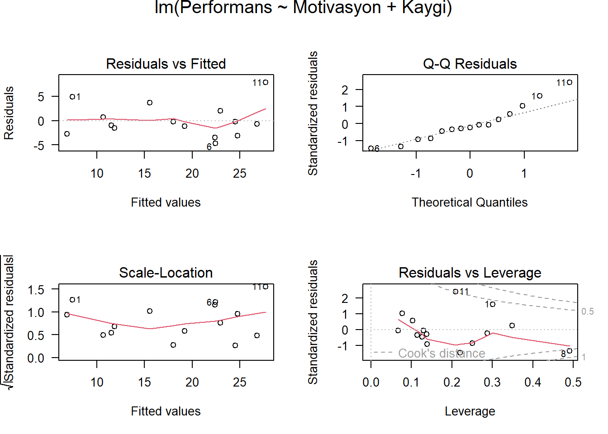
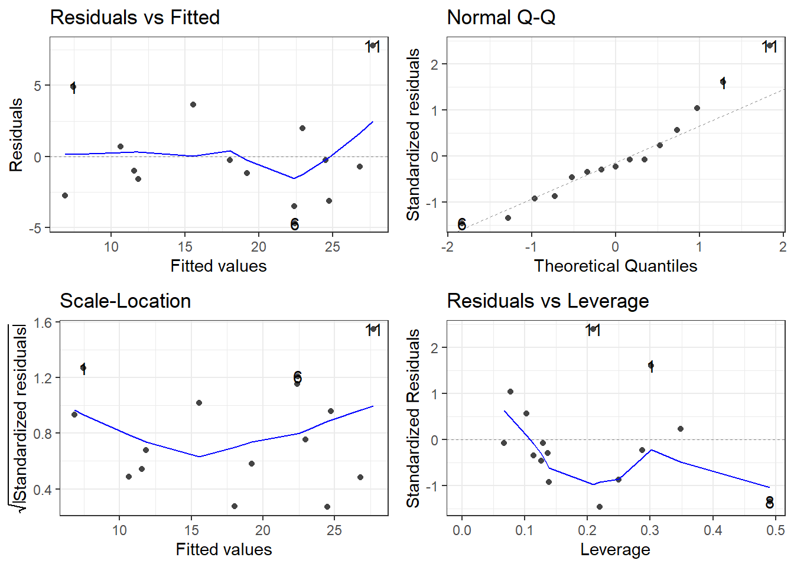
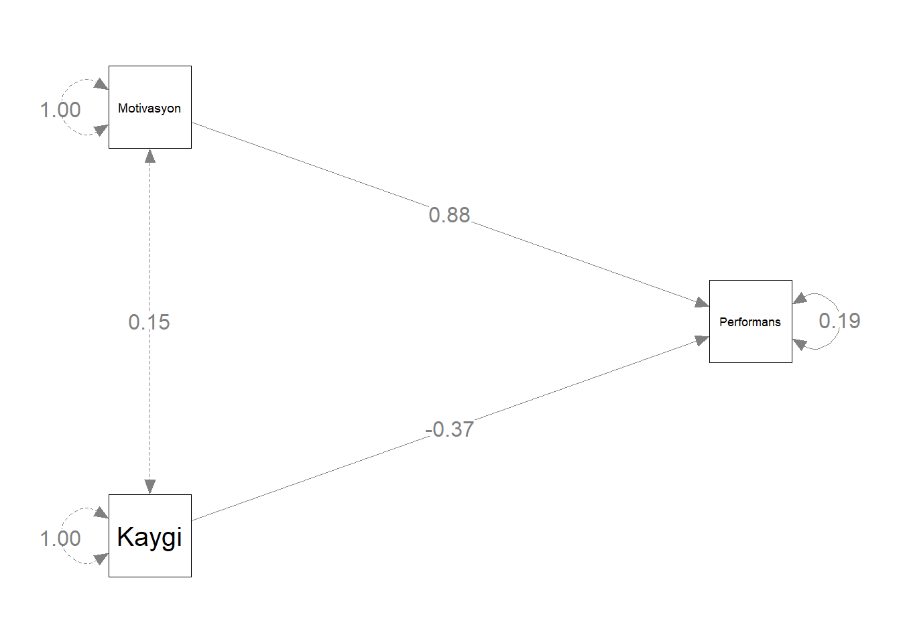
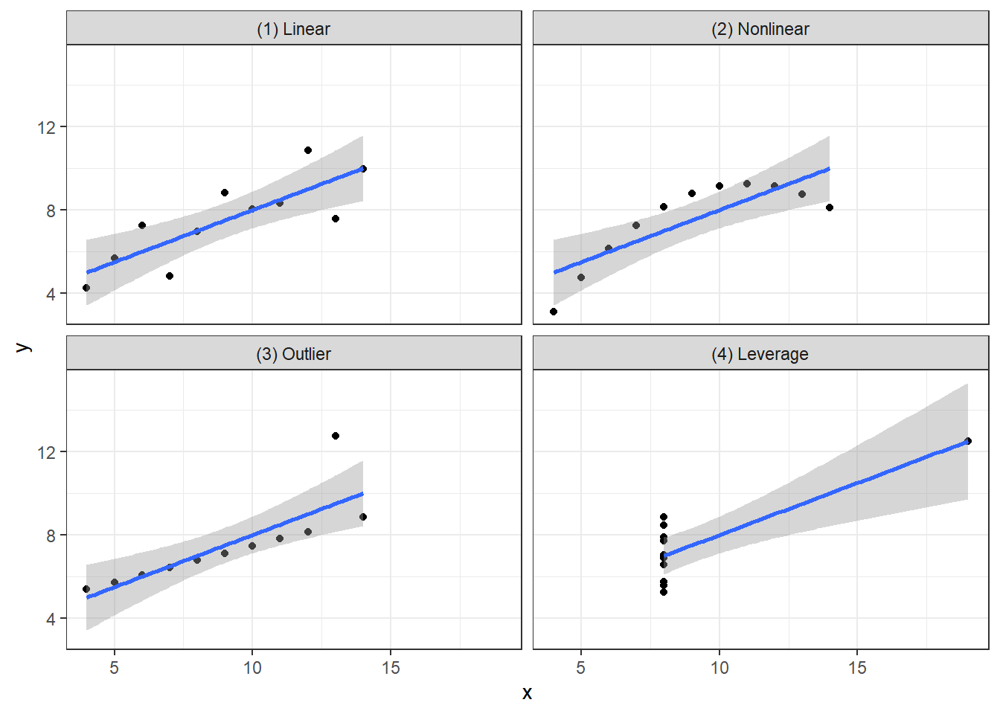
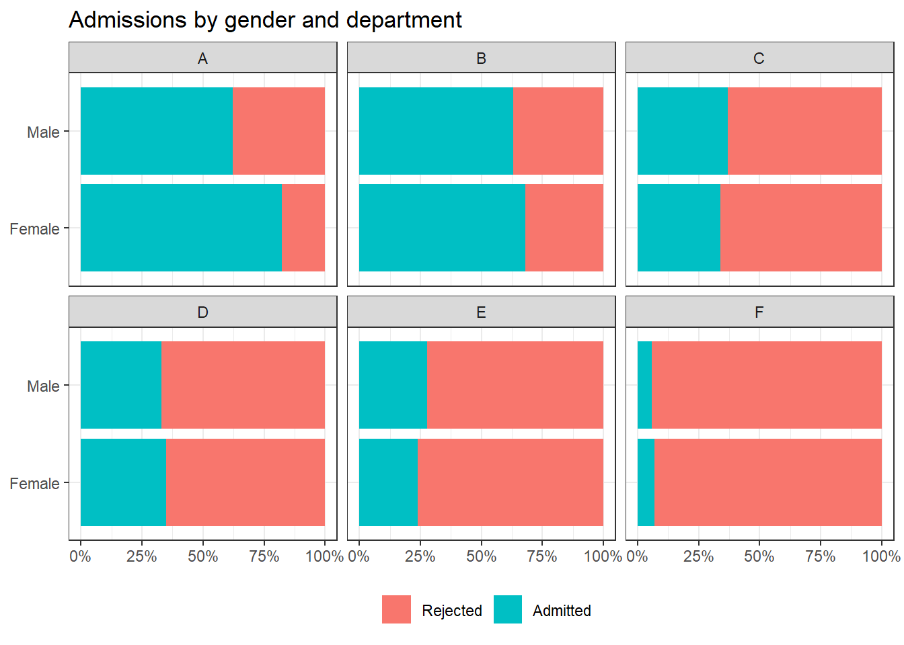
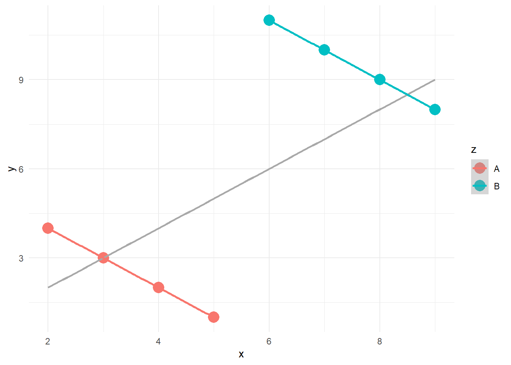
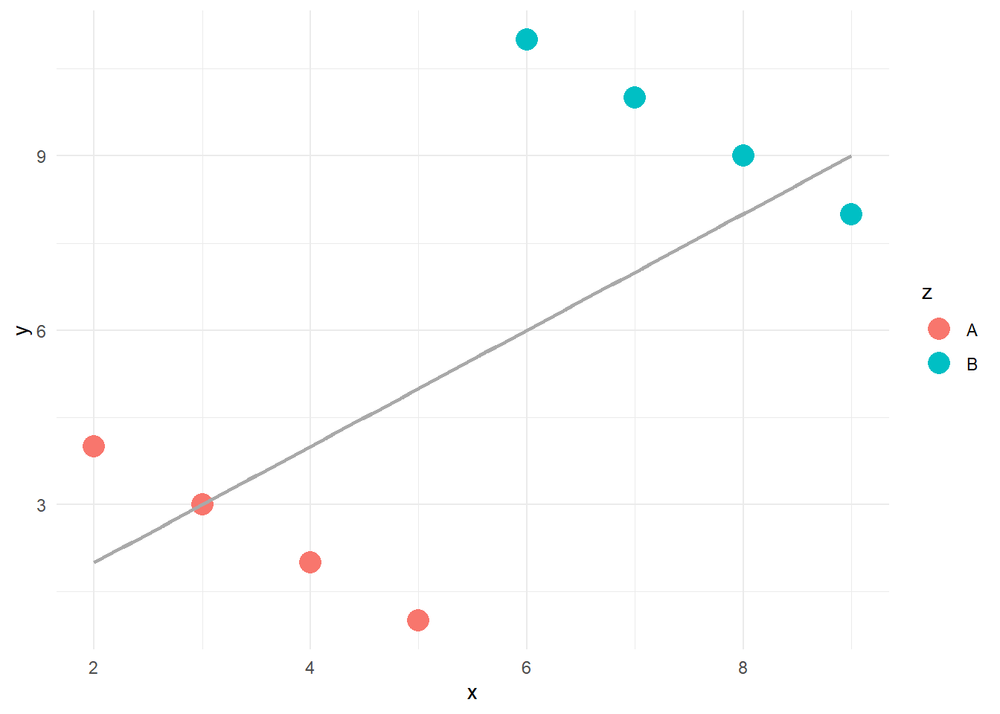

# Çoklu Regresyon

- Çok değişkenli analiz, bir çalışmadaki bireylerden veya 
nesnelerden elde edilen çoklu ölçümlerin aynı anda 
analizidir. Dolayısıyla **ikiden fazla değişkenin** aynı anda 
analizi çok değişkenli analiz olarak düşünülebilir.


- Çoklu regresyon, basit regresyonun tek bir bağımlı değişkenin 
**iki veya daha fazla yordayıcısına** izin veren uzantısıdır. Diğer bir 
ifadeyle, çoklu regresyon tek bir bağımlı değişken ile **iki veya daha 
fazla bağımsız (yordayıcı)** değişken arasındaki ilişkinin analiz 
edilmesi için kullanılan istatistiksel bir yöntemdir. 

- Çoklu regresyonun amacı değerleri bilinen **bağımsız değişkenleri 
kullanarak bağımlı değişkenin değerini** yordamaktır. 

- Regresyon yöntemiyle **bağımsız değişkenlerden en fazla yordamayı 
sağlamak üzere her bağımsız değişken**  ağırlıklandırılır. 


- Ağırlıklar bağımsız değişkenin **yordamaya bağıl katkısını** ifade eder 
ve her bir  değişkenin yordamadaki etkisine ilişkin yorumlamayı kolaylaştırır. 

- Çoklu regresyon, hem bağımlı değişken hem de bağımsız 
değişkenler **en az eşit aralıklı ölçek düzeyinde** ölçüldüğünde 
kullanılmalıdır. 

- Ancak bağımsız değişkenler **sınıflama veya sıralama ölçeğinde** ölçüldüğünde ilgili değişkenler **belli koşullar**
altında analize dahil edilebilir.

- Çoklu regresyon her bir bağımsız değişkendeki değişikliklerin 
**bağımlı değişkendeki değişikliklerle ne ölçüde** ilişkili olduğunu 
kestirir. 

- Ancak **bağımsız değişkenler arasındaki korelasyon**
yordama sürecini zorlaştırır.


## Bağımsız değişkenler arasındaki ilişki
ceteris paribus


Örneğin, $X_1$ ve $Y$ arasındaki  korelasyon katsayısı **0.40**, $X_2$ ve $Y$
arasındaki korelasyon katsayısı **0.60**, $X_1$ ve $X_2$ arasındaki korelasyon 
katsayısı sıfır ise, $Y$’nin  varyansının iki değişken tarafından 
açıklanan toplam oranı iki  değişkenin $Y$ ile korelasyonlarının 
kareleri toplamından elde edilebilir: 

$0.40^2 + 0.50^2 = 0.16 + 0.25 = 0.41$


- Ancak, uygulamada çoğunlukla $X_1$ ve $X_2$ birlikte değişim gösterirler 
ve iki değişkenin  $Y$ ile korelasyonlarının kareleri toplamı 
çok yüksek bir oran verir. 

- Bunun nedeni, iki bağımsız  değişkenin aralarındaki  korelasyondan dolayı
her bir  bağımsız değişken tarafından  açıklanan $Y$ varyansının bir  kısmının üst üste gelmesidir. 

- Çoklu regresyonun en önemli  özelliği modele eklenen bağımsız 
değişkenler arasındaki ilişkileri kontrol altına almasıdır. 


- Modeldeki bağımsız değişkenler arasındaki ilişkilerin kontrol altına alınması, modeldeki bir değişkenin bağımlı değişken üzerindeki etkisini incelerken, modeldeki diğer bütün değişkenlerin sabit tutulmasıdır.**ceteris paribus**

   - Örneğin, bir çalışmada kahve tüketiminin ölüm oranını nasıl etkilediği çalışılmıştır. Başta, sonuçlar daha yüksek kahve tüketiminin daha yüksek ölüm riskiyle ilişkili olduğunu göstermiştir. Ancak kahve içen çoğu kişi sigara da içmektedir. Araştırmacılar modellerine sigara içme alışkanlıkları için bir değişken eklediklerinde, sigara içmenin ölüm riskini artırırken, kahve tüketiminin ölüm riskini azalttığını bulmuşlardır.

- Bu durumda modele bütün önemli değişkenlerin eklenmesi gerekmektedir. Önemli değişkenlerin modelin dışında bırakılması, katsayılara ilişkin kestirimlerin **yanlı** olmasına neden olabilmektedir.


## Çoklu Regresyon Uygulama

- Öğrencilerin matematikteki **performans düzeylerini, motivasyon ve 
kaygı düzeylerinden yordamak** ile ilgilendiğimizi düşünelim.

- Bu araştırma sorusuna cevap vermek için çoklu regresyon uygun bir 
istatistiksel analiz yöntemdir.

$$Y_{\text{performans}_i} = b_0 + b_1 X_{\text{motivasyon}_i}  +  b_2 X_{\text{kaygi}_i}  + e_i$$

- Burada, $b_1$ ve $b_2$ motivasyon ve kaygı yordayıcıları için ağırlıklardır. Diğer bir ifadeyle regresyon katsayılarıdır veya eğimlerdir. $b_0$ ise kesişimdir.

- veri seti  🔗 [Performans.sav](import/Performans.sav)
- **Performans:** Öğrencilerin matematik  performans düzeyleri olup eşit aralık 
ölçeğinde ölçülen sürekli bir değişkendir.
- **Motivasyon:** Öğrencilerin motivasyon 
düzeyleri olup eşit aralık ölçeğinde 
ölçülen sürekli bir değişkendir.
- **Kaygı:** Öğrencilerin kaygı düzeyleri olup 
eşit aralık ölçeğinde ölçülen sürekli bir 
değişkendir.
- **Güven:** Öğrencilerin matematiğe karşı 
güven düzeyleri olup eşit aralık ölçeğinde 
ölçülen sürekli bir değişkendir.

- Analize başlamadan önce değişkenlerin betimsel istatistikleri ve değişkenler arası korelasyonlar incelenmelidir.

Betimsel İstatistikler

```r
library(haven)
library(dplyr)
library(knitr)
```

```
## Warning: package 'knitr' was built under R version 4.3.3
```

```r
performans <- read_sav("import/Performans.sav")
psych::describe(performans) %>% kable(digit=3)
```


|           | vars|  n|   mean|     sd| median| trimmed|    mad|    min|    max|  range|   skew| kurtosis|    se|
|:----------|----:|--:|------:|------:|------:|-------:|------:|------:|------:|------:|------:|--------:|-----:|
|Performans |    1| 15| 18.176|  7.828| 18.041|  17.925|  9.215|  4.112| 35.501| 31.390|  0.283|   -0.384| 2.021|
|Motivasyon |    2| 15| 39.933| 10.025| 40.000|  40.154| 10.378| 22.000| 55.000| 33.000| -0.178|   -1.173| 2.588|
|Kaygi      |    3| 15| 18.071|  4.769| 18.298|  17.860|  2.247| 10.720| 28.169| 17.449|  0.593|   -0.079| 1.231|
|Guven      |    4| 15| 21.630|  7.375| 22.000|  21.308|  5.708|  8.750| 38.700| 29.950|  0.300|   -0.101| 1.904|


- Korelasyon değerleri ve anlamlılığı


```r
library(broom)
cor_1 <- cor.test(~ Performans + Motivasyon , data = performans)
tidy(cor_1)  %>% kable(digit=3)
```


| estimate| statistic| p.value| parameter| conf.low| conf.high|method                               |alternative |
|--------:|---------:|-------:|---------:|--------:|---------:|:------------------------------------|:-----------|
|    0.824|     5.252|       0|        13|     0.54|      0.94|Pearson's product-moment correlation |two.sided   |


```r
cor_2 <- cor.test(~ Performans + Kaygi , data = performans)
tidy(cor_2)[,c(1,3)]  %>% kable(digit=3)
```


| estimate| p.value|
|--------:|-------:|
|   -0.241|   0.388|


```r
cor_3 <- cor.test(~ Motivasyon + Kaygi , data = performans)
tidy(cor_3)[,c(1,3)] %>% kable(digit=3)
```


| estimate| p.value|
|--------:|-------:|
|    0.147|   0.601|

- İlişki Grafiği 


```r
library(GGally)
ggpairs(performans[,1:3])
```


- 3D grafik


```r
library(scatterplot3d)
scatterplot3d(performans[,1:3],
              pch = 16,
              color="steelblue", 
              angle=75)
```


- 3D grafik


```r
scatterplot3d(performans[,1:3],
              pch = 16, color="steelblue",
              angle=75,
              box = FALSE,type = "h")
```

```
## Warning: Unknown or uninitialised column: `color`.
```


- 3D grafik


```r
library(rgl)
plot3d(performans$Performans, performans$Motivasyon, performans$Kaygi,
xlab = "Performans", ylab = "Motivasyon", 
zlab = "Kaygi", 
type = "s",size = 1.5,col = "red")
rglwidget() 
```

<div class="figure" style="text-align: center">

```{=html}
<div id="rgl43069" style="width:672px;height:480px;" class="rglWebGL html-widget" role="img" aria-labelledby="rgl43069-aria"></div>
<script type="application/json" data-for="rgl43069">{"x":{"material":{"color":"#000000","alpha":1,"lit":true,"ambient":"#000000","specular":"#FFFFFF","emission":"#000000","shininess":50,"smooth":true,"front":"filled","back":"filled","size":3,"lwd":1,"fog":true,"point_antialias":false,"line_antialias":false,"texture":null,"textype":"rgb","texmode":"modulate","texmipmap":false,"texminfilter":"linear","texmagfilter":"linear","texenvmap":false,"depth_mask":true,"depth_test":"less","isTransparent":false,"polygon_offset":[0,0],"margin":"","floating":false,"tag":"","blend":["src_alpha","one_minus_src_alpha"]},"rootSubscene":7,"objects":{"13":{"id":13,"type":"spheres","material":{},"vertices":"0","colors":"1","radii":[[0.7039732933044434]],"centers":"2","ignoreExtent":false,"fastTransparency":true,"flags":32771},"15":{"id":15,"type":"text","material":{"lit":false,"margin":0,"floating":true,"edge":[0,1,1]},"vertices":"3","colors":"4","texts":[["Performans"]],"cex":[[1]],"adj":[[0.5,0.5,0.5]],"centers":"5","family":[["sans"]],"font":[[1]],"ignoreExtent":true,"flags":33808},"16":{"id":16,"type":"text","material":{"lit":false,"margin":1,"floating":true,"edge":[1,1,1]},"vertices":"6","colors":"7","texts":[["Motivasyon"]],"cex":[[1]],"adj":[[0.5,0.5,0.5]],"centers":"8","family":[["sans"]],"font":[[1]],"ignoreExtent":true,"flags":33808},"17":{"id":17,"type":"text","material":{"lit":false,"margin":2,"floating":true,"edge":[1,1,1]},"vertices":"9","colors":"10","texts":[["Kaygi"]],"cex":[[1]],"adj":[[0.5,0.5,0.5]],"centers":"11","family":[["sans"]],"font":[[1]],"ignoreExtent":true,"flags":33808},"11":{"id":11,"type":"light","vertices":[[0,0,1]],"colors":[[1,1,1,1],[1,1,1,1],[1,1,1,1]],"viewpoint":true,"finite":false},"10":{"id":10,"type":"background","material":{},"colors":"12","centers":"13","sphere":false,"fogtype":"none","fogscale":1,"flags":32768},"12":{"id":12,"type":"background","material":{"lit":false,"back":"lines"},"colors":"14","centers":"15","sphere":false,"fogtype":"none","fogscale":1,"flags":32768},"14":{"id":14,"type":"bboxdeco","material":{"front":"lines","back":"lines"},"vertices":"16","colors":"17","axes":{"mode":["pretty","pretty","pretty"],"step":[5,5,5],"nticks":[5,5,5],"marklen":[15,15,15],"expand":[1.029999971389771,1.029999971389771,1.029999971389771]},"draw_front":true,"flags":32769},"7":{"id":7,"type":"subscene","par3d":{"antialias":8,"FOV":30,"ignoreExtent":false,"listeners":7,"mouseMode":{"none":"none","left":"trackball","right":"zoom","middle":"fov","wheel":"pull"},"observer":[0,0,125.3147583007812],"modelMatrix":[[0.8970806002616882,0,0,-17.76793670654297],[0,0.2918461263179779,1.51644504070282,-40.72311401367188],[0,-0.8018406629562378,0.5519408583641052,-105.1763000488281],[0,0,0,1]],"projMatrix":[[3.732050895690918,0,0,0],[0,3.732050895690918,0,0],[0,0,-3.863703727722168,-451.7452392578125],[0,0,-1,0]],"skipRedraw":false,"userMatrix":[[1,0,0,0],[0,0.3420201433256682,0.9396926207859085,0],[0,-0.9396926207859085,0.3420201433256682,0],[0,0,0,1]],"userProjection":[[1,0,0,0],[0,1,0,0],[0,0,1,0],[0,0,0,1]],"scale":[0.8970806002616882,0.8533009886741638,1.613767147064209],"viewport":{"x":0,"y":0,"width":1,"height":1},"zoom":1,"bbox":[3.32689905166626,36.2859001159668,21.17499923706055,55.82500076293945,10.28402137756348,28.60566902160645],"windowRect":[190,213,446,469],"family":"sans","font":1,"cex":1,"useFreeType":false,"fontname":"TT Arial","maxClipPlanes":8,"glVersion":4.6,"activeSubscene":0},"embeddings":{"viewport":"replace","projection":"replace","model":"replace","mouse":"replace"},"objects":[12,14,13,15,16,17,11],"subscenes":[],"flags":34067}},"crosstalk":{"key":[],"group":[],"id":[],"options":[]},"width":672,"height":480,"buffer":{"accessors":[{"bufferView":0,"componentType":5126,"count":15,"type":"VEC3"},{"bufferView":1,"componentType":5121,"count":1,"type":"VEC4"},{"bufferView":2,"componentType":5126,"count":15,"type":"VEC3"},{"bufferView":3,"componentType":5126,"count":1,"type":"VEC3"},{"bufferView":4,"componentType":5121,"count":1,"type":"VEC4"},{"bufferView":5,"componentType":5126,"count":1,"type":"VEC3"},{"bufferView":6,"componentType":5126,"count":1,"type":"VEC3"},{"bufferView":7,"componentType":5121,"count":1,"type":"VEC4"},{"bufferView":8,"componentType":5126,"count":1,"type":"VEC3"},{"bufferView":9,"componentType":5126,"count":1,"type":"VEC3"},{"bufferView":10,"componentType":5121,"count":1,"type":"VEC4"},{"bufferView":11,"componentType":5126,"count":1,"type":"VEC3"},{"bufferView":12,"componentType":5126,"count":1,"type":"VEC4"},{"bufferView":13,"componentType":5121,"count":1,"type":"VEC3"},{"bufferView":14,"componentType":5121,"count":1,"type":"VEC4"},{"bufferView":15,"componentType":5121,"count":1,"type":"VEC3"},{"bufferView":16,"componentType":5126,"count":17,"type":"VEC3"},{"bufferView":17,"componentType":5121,"count":1,"type":"VEC4"}],"bufferViews":[{"buffer":0,"byteLength":180,"byteOffset":0},{"buffer":0,"byteLength":4,"byteOffset":180},{"buffer":0,"byteLength":180,"byteOffset":184},{"buffer":0,"byteLength":12,"byteOffset":364},{"buffer":0,"byteLength":4,"byteOffset":376},{"buffer":0,"byteLength":12,"byteOffset":380},{"buffer":0,"byteLength":12,"byteOffset":392},{"buffer":0,"byteLength":4,"byteOffset":404},{"buffer":0,"byteLength":12,"byteOffset":408},{"buffer":0,"byteLength":12,"byteOffset":420},{"buffer":0,"byteLength":4,"byteOffset":432},{"buffer":0,"byteLength":12,"byteOffset":436},{"buffer":0,"byteLength":16,"byteOffset":448},{"buffer":0,"byteLength":3,"byteOffset":464},{"buffer":0,"byteLength":4,"byteOffset":467},{"buffer":0,"byteLength":3,"byteOffset":471},{"buffer":0,"byteLength":204,"byteOffset":476},{"buffer":0,"byteLength":4,"byteOffset":680}],"buffers":[{"byteLength":684,"bytes":"Ne5FQQAAsEG5LndBiJKDQAAAyEHygp5BXgOtQQAASEJj+pRB4F7HQQAAPEIUlZFB6rPQQQAA\nOEImhitBAJyNQQAAIEKqojJBgVkkQQAA+EEDT5NByy+XQQAAXEIDW+FBGpmZQQAAFEJdiZhB\nzgGOQQAAIEJTUpNBMQEOQgAAWEJuYpJB/lOQQQAAGEJKLGNBV7s1QQAAFEIVF9lBkAzCQQAA\nPEKHPHpBiq0oQQAA8EENGo5BAQAAATXuRUEAALBBuS53QYiSg0AAAMhB8oKeQV4DrUEAAEhC\nY/qUQeBex0EAADxCFJWRQeqz0EEAADhCJoYrQQCcjUEAACBCqqIyQYFZJEEAAPhBA0+TQcsv\nl0EAAFxCA1vhQRqZmUEAABRCXYmYQc4BjkEAACBCU1KTQTEBDkIAAFhCbmKSQf5TkEEAABhC\nSixjQVe7NUEAABRCFRfZQZAMwkEAADxChzx6QYqtKEEAAPBBDRqOQQAAwH8AAIBAAACAPwAA\nAAEAAMB/AACAQAAAgD8AAMB/AACAQAAAgD8AAAABAADAfwAAgEAAAIA/AADAfwAAgEAAAIA/\nAAAAAQAAwH8AAIBAAACAP5mYmD6ZmJg+mZiYPgAAgD8AAAABAQEBAAAAAAAAAKBAAADAfwAA\nwH8AACBBAADAfwAAwH8AAHBBAADAfwAAwH8AAKBBAADAfwAAwH8AAMhBAADAfwAAwH8AAPBB\nAADAfwAAwH8AAAxCAADAfwAAwH8AAMB/AADIQQAAwH8AAMB/AADwQQAAwH8AAMB/AAAMQgAA\nwH8AAMB/AAAgQgAAwH8AAMB/AAA0QgAAwH8AAMB/AABIQgAAwH8AAMB/AABcQgAAwH8AAMB/\nAADAfwAAcEEAAMB/AADAfwAAoEEAAMB/AADAfwAAyEEAAAAB"}]},"context":{"shiny":false,"rmarkdown":null},"vertexShader":"#line 2 1\n// File 1 is the vertex shader\n#ifdef GL_ES\n#ifdef GL_FRAGMENT_PRECISION_HIGH\nprecision highp float;\n#else\nprecision mediump float;\n#endif\n#endif\n\nattribute vec3 aPos;\nattribute vec4 aCol;\nuniform mat4 mvMatrix;\nuniform mat4 prMatrix;\nvarying vec4 vCol;\nvarying vec4 vPosition;\n\n#ifdef NEEDS_VNORMAL\nattribute vec3 aNorm;\nuniform mat4 normMatrix;\nvarying vec4 vNormal;\n#endif\n\n#if defined(HAS_TEXTURE) || defined (IS_TEXT)\nattribute vec2 aTexcoord;\nvarying vec2 vTexcoord;\n#endif\n\n#ifdef FIXED_SIZE\nuniform vec3 textScale;\n#endif\n\n#ifdef FIXED_QUADS\nattribute vec3 aOfs;\n#endif\n\n#ifdef IS_TWOSIDED\n#ifdef HAS_NORMALS\nvarying float normz;\nuniform mat4 invPrMatrix;\n#else\nattribute vec3 aPos1;\nattribute vec3 aPos2;\nvarying float normz;\n#endif\n#endif // IS_TWOSIDED\n\n#ifdef FAT_LINES\nattribute vec3 aNext;\nattribute vec2 aPoint;\nvarying vec2 vPoint;\nvarying float vLength;\nuniform float uAspect;\nuniform float uLwd;\n#endif\n\n#ifdef USE_ENVMAP\nvarying vec3 vReflection;\n#endif\n\nvoid main(void) {\n  \n#ifndef IS_BRUSH\n#if defined(NCLIPPLANES) || !defined(FIXED_QUADS) || defined(HAS_FOG) || defined(USE_ENVMAP)\n  vPosition = mvMatrix * vec4(aPos, 1.);\n#endif\n  \n#ifndef FIXED_QUADS\n  gl_Position = prMatrix * vPosition;\n#endif\n#endif // !IS_BRUSH\n  \n#ifdef IS_POINTS\n  gl_PointSize = POINTSIZE;\n#endif\n  \n  vCol = aCol;\n  \n// USE_ENVMAP implies NEEDS_VNORMAL\n\n#ifdef NEEDS_VNORMAL\n  vNormal = normMatrix * vec4(-aNorm, dot(aNorm, aPos));\n#endif\n\n#ifdef USE_ENVMAP\n  vReflection = normalize(reflect(vPosition.xyz/vPosition.w, \n                        normalize(vNormal.xyz/vNormal.w)));\n#endif\n  \n#ifdef IS_TWOSIDED\n#ifdef HAS_NORMALS\n  /* normz should be calculated *after* projection */\n  normz = (invPrMatrix*vNormal).z;\n#else\n  vec4 pos1 = prMatrix*(mvMatrix*vec4(aPos1, 1.));\n  pos1 = pos1/pos1.w - gl_Position/gl_Position.w;\n  vec4 pos2 = prMatrix*(mvMatrix*vec4(aPos2, 1.));\n  pos2 = pos2/pos2.w - gl_Position/gl_Position.w;\n  normz = pos1.x*pos2.y - pos1.y*pos2.x;\n#endif\n#endif // IS_TWOSIDED\n  \n#ifdef NEEDS_VNORMAL\n  vNormal = vec4(normalize(vNormal.xyz/vNormal.w), 1);\n#endif\n  \n#if defined(HAS_TEXTURE) || defined(IS_TEXT)\n  vTexcoord = aTexcoord;\n#endif\n  \n#if defined(FIXED_SIZE) && !defined(ROTATING)\n  vec4 pos = prMatrix * mvMatrix * vec4(aPos, 1.);\n  pos = pos/pos.w;\n  gl_Position = pos + vec4(aOfs*textScale, 0.);\n#endif\n  \n#if defined(IS_SPRITES) && !defined(FIXED_SIZE)\n  vec4 pos = mvMatrix * vec4(aPos, 1.);\n  pos = pos/pos.w + vec4(aOfs,  0.);\n  gl_Position = prMatrix*pos;\n#endif\n  \n#ifdef FAT_LINES\n  /* This code was inspired by Matt Deslauriers' code in \n   https://mattdesl.svbtle.com/drawing-lines-is-hard */\n  vec2 aspectVec = vec2(uAspect, 1.0);\n  mat4 projViewModel = prMatrix * mvMatrix;\n  vec4 currentProjected = projViewModel * vec4(aPos, 1.0);\n  currentProjected = currentProjected/currentProjected.w;\n  vec4 nextProjected = projViewModel * vec4(aNext, 1.0);\n  vec2 currentScreen = currentProjected.xy * aspectVec;\n  vec2 nextScreen = (nextProjected.xy / nextProjected.w) * aspectVec;\n  float len = uLwd;\n  vec2 dir = vec2(1.0, 0.0);\n  vPoint = aPoint;\n  vLength = length(nextScreen - currentScreen)/2.0;\n  vLength = vLength/(vLength + len);\n  if (vLength > 0.0) {\n    dir = normalize(nextScreen - currentScreen);\n  }\n  vec2 normal = vec2(-dir.y, dir.x);\n  dir.x /= uAspect;\n  normal.x /= uAspect;\n  vec4 offset = vec4(len*(normal*aPoint.x*aPoint.y - dir), 0.0, 0.0);\n  gl_Position = currentProjected + offset;\n#endif\n  \n#ifdef IS_BRUSH\n  gl_Position = vec4(aPos, 1.);\n#endif\n}","fragmentShader":"#line 2 2\n// File 2 is the fragment shader\n#ifdef GL_ES\n#ifdef GL_FRAGMENT_PRECISION_HIGH\nprecision highp float;\n#else\nprecision mediump float;\n#endif\n#endif\nvarying vec4 vCol; // carries alpha\nvarying vec4 vPosition;\n#if defined(HAS_TEXTURE) || defined (IS_TEXT)\nvarying vec2 vTexcoord;\nuniform sampler2D uSampler;\n#endif\n\n#ifdef HAS_FOG\nuniform int uFogMode;\nuniform vec3 uFogColor;\nuniform vec4 uFogParms;\n#endif\n\n#if defined(IS_LIT) && !defined(FIXED_QUADS)\nvarying vec4 vNormal;\n#endif\n\n#if NCLIPPLANES > 0\nuniform vec4 vClipplane[NCLIPPLANES];\n#endif\n\n#if NLIGHTS > 0\nuniform mat4 mvMatrix;\n#endif\n\n#ifdef IS_LIT\nuniform vec3 emission;\nuniform float shininess;\n#if NLIGHTS > 0\nuniform vec3 ambient[NLIGHTS];\nuniform vec3 specular[NLIGHTS]; // light*material\nuniform vec3 diffuse[NLIGHTS];\nuniform vec3 lightDir[NLIGHTS];\nuniform bool viewpoint[NLIGHTS];\nuniform bool finite[NLIGHTS];\n#endif\n#endif // IS_LIT\n\n#ifdef IS_TWOSIDED\nuniform bool front;\nvarying float normz;\n#endif\n\n#ifdef FAT_LINES\nvarying vec2 vPoint;\nvarying float vLength;\n#endif\n\n#ifdef USE_ENVMAP\nvarying vec3 vReflection;\n#endif\n\nvoid main(void) {\n  vec4 fragColor;\n#ifdef FAT_LINES\n  vec2 point = vPoint;\n  bool neg = point.y < 0.0;\n  point.y = neg ? (point.y + vLength)/(1.0 - vLength) :\n                 -(point.y - vLength)/(1.0 - vLength);\n#if defined(IS_TRANSPARENT) && defined(IS_LINESTRIP)\n  if (neg && length(point) <= 1.0) discard;\n#endif\n  point.y = min(point.y, 0.0);\n  if (length(point) > 1.0) discard;\n#endif // FAT_LINES\n  \n#ifdef ROUND_POINTS\n  vec2 coord = gl_PointCoord - vec2(0.5);\n  if (length(coord) > 0.5) discard;\n#endif\n  \n#if NCLIPPLANES > 0\n  for (int i = 0; i < NCLIPPLANES; i++)\n    if (dot(vPosition, vClipplane[i]) < 0.0) discard;\n#endif\n    \n#ifdef FIXED_QUADS\n    vec3 n = vec3(0., 0., 1.);\n#elif defined(IS_LIT)\n    vec3 n = normalize(vNormal.xyz);\n#endif\n    \n#ifdef IS_TWOSIDED\n    if ((normz <= 0.) != front) discard;\n#endif\n\n#ifdef IS_LIT\n    vec3 eye = normalize(-vPosition.xyz/vPosition.w);\n    vec3 lightdir;\n    vec4 colDiff;\n    vec3 halfVec;\n    vec4 lighteffect = vec4(emission, 0.);\n    vec3 col;\n    float nDotL;\n#ifdef FIXED_QUADS\n    n = -faceforward(n, n, eye);\n#endif\n    \n#if NLIGHTS > 0\n    for (int i=0;i<NLIGHTS;i++) {\n      colDiff = vec4(vCol.rgb * diffuse[i], vCol.a);\n      lightdir = lightDir[i];\n      if (!viewpoint[i])\n        lightdir = (mvMatrix * vec4(lightdir, 1.)).xyz;\n      if (!finite[i]) {\n        halfVec = normalize(lightdir + eye);\n      } else {\n        lightdir = normalize(lightdir - vPosition.xyz/vPosition.w);\n        halfVec = normalize(lightdir + eye);\n      }\n      col = ambient[i];\n      nDotL = dot(n, lightdir);\n      col = col + max(nDotL, 0.) * colDiff.rgb;\n      col = col + pow(max(dot(halfVec, n), 0.), shininess) * specular[i];\n      lighteffect = lighteffect + vec4(col, colDiff.a);\n    }\n#endif\n    \n#else // not IS_LIT\n    vec4 colDiff = vCol;\n    vec4 lighteffect = colDiff;\n#endif\n    \n#ifdef IS_TEXT\n    vec4 textureColor = lighteffect*texture2D(uSampler, vTexcoord);\n#endif\n    \n#ifdef HAS_TEXTURE\n\n// These calculations use the definitions from \n// https://docs.gl/gl3/glTexEnv\n\n#ifdef USE_ENVMAP\n    float m = 2.0 * sqrt(dot(vReflection, vReflection) + 2.0*vReflection.z + 1.0);\n    vec4 textureColor = texture2D(uSampler, vReflection.xy / m + vec2(0.5, 0.5));\n#else\n    vec4 textureColor = texture2D(uSampler, vTexcoord);\n#endif\n\n#ifdef TEXTURE_rgb\n\n#if defined(TEXMODE_replace) || defined(TEXMODE_decal)\n    textureColor = vec4(textureColor.rgb, lighteffect.a);\n#endif \n\n#ifdef TEXMODE_modulate\n    textureColor = lighteffect*vec4(textureColor.rgb, 1.);\n#endif\n\n#ifdef TEXMODE_blend\n    textureColor = vec4((1. - textureColor.rgb) * lighteffect.rgb, lighteffect.a);\n#endif\n\n#ifdef TEXMODE_add\n    textureColor = vec4(lighteffect.rgb + textureColor.rgb, lighteffect.a);\n#endif\n\n#endif //TEXTURE_rgb\n        \n#ifdef TEXTURE_rgba\n\n#ifdef TEXMODE_replace\n// already done\n#endif \n\n#ifdef TEXMODE_modulate\n    textureColor = lighteffect*textureColor;\n#endif\n\n#ifdef TEXMODE_decal\n    textureColor = vec4((1. - textureColor.a)*lighteffect.rgb) +\n                     textureColor.a*textureColor.rgb, \n                     lighteffect.a);\n#endif\n\n#ifdef TEXMODE_blend\n    textureColor = vec4((1. - textureColor.rgb) * lighteffect.rgb,\n                    lighteffect.a*textureColor.a);\n#endif\n\n#ifdef TEXMODE_add\n    textureColor = vec4(lighteffect.rgb + textureColor.rgb,\n                    lighteffect.a*textureColor.a);\n#endif\n    \n#endif //TEXTURE_rgba\n    \n#ifdef TEXTURE_alpha\n#if defined(TEXMODE_replace) || defined(TEXMODE_decal)\n    textureColor = vec4(lighteffect.rgb, textureColor.a);\n#endif \n\n#if defined(TEXMODE_modulate) || defined(TEXMODE_blend) || defined(TEXMODE_add)\n    textureColor = vec4(lighteffect.rgb, lighteffect.a*textureColor.a);\n#endif\n \n#endif\n    \n// The TEXTURE_luminance values are not from that reference    \n#ifdef TEXTURE_luminance\n    float luminance = dot(vec3(1.,1.,1.),textureColor.rgb)/3.;\n\n#if defined(TEXMODE_replace) || defined(TEXMODE_decal)\n    textureColor = vec4(luminance, luminance, luminance, lighteffect.a);\n#endif \n\n#ifdef TEXMODE_modulate\n    textureColor = vec4(luminance*lighteffect.rgb, lighteffect.a);\n#endif\n\n#ifdef TEXMODE_blend\n    textureColor = vec4((1. - luminance)*lighteffect.rgb,\n                        lighteffect.a);\n#endif\n\n#ifdef TEXMODE_add\n    textureColor = vec4(luminance + lighteffect.rgb, lighteffect.a);\n#endif\n\n#endif // TEXTURE_luminance\n \n    \n#ifdef TEXTURE_luminance_alpha\n    float luminance = dot(vec3(1.,1.,1.),textureColor.rgb)/3.;\n\n#if defined(TEXMODE_replace) || defined(TEXMODE_decal)\n    textureColor = vec4(luminance, luminance, luminance, textureColor.a);\n#endif \n\n#ifdef TEXMODE_modulate\n    textureColor = vec4(luminance*lighteffect.rgb, \n                        textureColor.a*lighteffect.a);\n#endif\n\n#ifdef TEXMODE_blend\n    textureColor = vec4((1. - luminance)*lighteffect.rgb,\n                        textureColor.a*lighteffect.a);\n#endif\n\n#ifdef TEXMODE_add\n    textureColor = vec4(luminance + lighteffect.rgb, \n                        textureColor.a*lighteffect.a);\n\n#endif\n\n#endif // TEXTURE_luminance_alpha\n    \n    fragColor = textureColor;\n\n#elif defined(IS_TEXT)\n    if (textureColor.a < 0.1)\n      discard;\n    else\n      fragColor = textureColor;\n#else\n    fragColor = lighteffect;\n#endif // HAS_TEXTURE\n    \n#ifdef HAS_FOG\n    // uFogParms elements: x = near, y = far, z = fogscale, w = (1-sin(FOV/2))/(1+sin(FOV/2))\n    // In Exp and Exp2: use density = density/far\n    // fogF will be the proportion of fog\n    // Initialize it to the linear value\n    float fogF;\n    if (uFogMode > 0) {\n      fogF = (uFogParms.y - vPosition.z/vPosition.w)/(uFogParms.y - uFogParms.x);\n      if (uFogMode > 1)\n        fogF = mix(uFogParms.w, 1.0, fogF);\n      fogF = fogF*uFogParms.z;\n      if (uFogMode == 2)\n        fogF = 1.0 - exp(-fogF);\n      // Docs are wrong: use (density*c)^2, not density*c^2\n      // https://gitlab.freedesktop.org/mesa/mesa/-/blob/master/src/mesa/swrast/s_fog.c#L58\n      else if (uFogMode == 3)\n        fogF = 1.0 - exp(-fogF*fogF);\n      fogF = clamp(fogF, 0.0, 1.0);\n      gl_FragColor = vec4(mix(fragColor.rgb, uFogColor, fogF), fragColor.a);\n    } else gl_FragColor = fragColor;\n#else\n    gl_FragColor = fragColor;\n#endif // HAS_FOG\n    \n}","players":[],"webGLoptions":{"preserveDrawingBuffer":true}},"evals":[],"jsHooks":[]}</script>
```

<p id="rgl43069-aria" hidden></p>
</div>


- Regresyonda amaç hata puanlarının (artıkların) kareleri toplamının küçüleceği, 
diğer bir ifade ile $Y$ ve yordanan $Y'$ arasındaki korelasyonun 
büyüyeceği, $b_0$, $b_1$ ve $b_2$ değerleri için tek bir çözüm kümesi 
bulmaktır.

- Grafiğin sadeleştirilmesi için bir bağımsız değişken kullanılmıştır. Tek bir çözüm bulmak için  kullanılan yöntem **Sıradan En 
Küçük Kareler Yöntemi**  (Ordinary Least Squares  Procedure) olarak adlandırılır. 


- $R^2$ değeri *çoklu korelasyon katsayısı* (multiple correlation 
coefficient) olup bağımlı değişkenin gözlenen değerleri ile bağımsız 
değişkenlerin *en iyi doğrusal kombinasyonu* arasındaki 
korelasyondur. 

- **En iyi doğrusal kombinasyon**, bağımlı değişkenin 
bağımsız değişkenlerden yordanmasında, daha iyi bir iş yapacak 
regresyon katsayıları kümesi olmadığı anlamına gelir.


Çoklu Korelasyon

```r
model <- lm(Performans ~ Motivasyon + Kaygi,data=performans)
sqrt(glance(model)[,1]) #r.squared değerinin karekoku alınır
```

<div class="kable-table">

| r.squared|
|---------:|
| 0.9019952|

</div>

-  R değeri bağımlı değişkenin **gözlenen** ve **yordanan** değerleri arasındaki **korelasyondur**.

- Bağımlı değişkenin **yordanan değerinin** bağımlı değişkenin 
**gözlenen değerine** mümkün olduğunca yakın olmasını 
gerektiren **en küçük kareler kriterinden** dolayı bağımlı 
değişkenin **gözlenen ve yordanan değerleri arasındaki korelasyon eksi 
değerler** alamaz. Dolayısıyla çoklu korelasyon katsayısı 0 ile 1 
arasında değişir


**Çoklu Korelasyon Formulu **
$$R_{Y_{12}}= \sqrt{\frac{r^2_{Y_1}+r^2_{Y_2}-2r^2_{Y_1}r^2_{Y_2}r_{12}}{1-r_{12}}}$$
$$R_{Y_{12}}=\sqrt{\frac{(0.824)^2+(-0.241)^2-2*(0.824)(-0.241)(0.147)}{1-(0.147)^2}}) = 0.902$$

```r
model_s <- augment(model,data=performans)
cor(model_s[,1], model_s[,5]) # Y ve Y' arası korelasyon
```

```
##              .fitted
## Performans 0.9019952
```

öğrencilerin **gözlenen performans puanları** ve **yoradan performans puanları** arasındaki korelasyon katsayısı nokta **0.902** eşittir


- Çoklu korelasyon katsayısının kestirimi hem örneklem büyüklüğüne 
$(n)$ hem de bağımsız değişkenlerin sayısına $(k)$ bağlıdır. 

- Bağımlı değişken ile bağımsız değişkenler arasında hiç ilişki yoksa, 
$R$ değerinin sıfıra yakın olması beklenir ancak $R$’nin beklenen değeri 
rastgele bir veri için $k/(n-1)$’dir. 

  - Örneğin, örneklem büyüklüğünün **50**, bağımsız değişken sayısının **2** olduğu bir  durumda, bağımlı değişken ile bağımsız değişkenler arasında hiç ilişki yoksa, R değeri **0.04** olacaktır, **0** değil.

- Bu nedenle büyük örnekleme sahip olmak önemlidir. Her bağımsız 
değişken için **en az 10** gözlem önerilmektedir. Bir başka öneri de 
örneklem büyüklüğünün **bağımsız değişken sayısından en az 50 
fazla olması** yönündedir.

- Bir çalışmada, tek bir bağımsız değişken bulunduğunda, **0.80** güce sahip olmak için **0.30** evren korelasyonunun **124** birey gerektireceği belirtilmiştir. **Beş bağımsız** değişken bulunduğundaysa, örneklem büyüklüğünün **187** olması gerekmektedir.


## Belirlilik Katsayısı 


```r
model <- lm(Performans ~ Motivasyon + Kaygi,data=performans)
glance(model)[,1]
```

<div class="kable-table">

| r.squared|
|---------:|
| 0.8135954|

</div>

$R^2$ değeri **belirlilik katsayısı** (coefficient of determination) olup 
bağımlı değişkenin gözlenen ve yordanan değerleri arasındaki 
korelasyonun karesi alınarak hesaplanır. Bu değer bağımlı 
değişkendeki varyansın model tarafından açıklanan oranını ifade 
eder. Diğer bir ifadeyle **bağımlı değişkenin varyansının bağımsız 
değişkenlerin en iyi doğrusal kombinasyonu** ile paylaşılan oranını 
ifade eder. 
 **Performans puanlarındaki varyansın yaklaşık %81’i öğrencilerin motivasyon ve kaygı puanları** tarafından açıklanabilir. 

- Modele yeni bir bağımsız değişken eklendiğinde, $R^2$ değeri artar, 
sadece **şans eseri olsa bile**. Böylece daha fazla bağımsız değişken 
içeren model sadece daha fazla bağımsız değişken içerdiği için 
veriye daha iyi uyum sağlıyor gibi gözükebilir. 

- Bu etkiyi gidermek için  $adj R^2$ değeri hesaplanabilir.

-  $\text{adj}{R^2}$ değeri, $R^2$ değerinin modeldeki bağımsız değişken sayısı için modifiye edilmiş  versiyonudur.  $\text{adj}{R^2}$  değeri, yeni eklenen bağımsız
değişken modeli şans eseri beklenenden daha fazla geliştirirse artar, 
daha az geliştirirse azalır. 

-  $\text{adj}{R^2}$  değeri, eksi değerler alabilir ancak genellikle artı değerler alır. Her zaman $R^2$ değerinden daha düşüktür.


- $R^2$ değeri, $n$ gözlemlerin sayısı, $k$ bağımsız değişkenlerin  sayısı olmak üzere, aşağıdaki eşitlikle hesaplanabilir.
$$R^2_{adj}= R^2 - \frac{k-(1-R^2)}{n-k-1}$$
$$R^2_{adj}= 0.814 - \frac{2-(1-0.814)}{15-2-1} =0.783$$


```r
glance(model)[,2]
```

<div class="kable-table">

| adj.r.squared|
|-------------:|
|     0.7825279|

</div>
$adj R^2$ evrende gerçek korelasyonun karesinin daha az yanlı kestirimi olsa da, çoğunlukla $R^2$ değeri rapor edilir.


## Kestirimin standart hatası

- **Kestirimin standart hatası**  (standard error of the estimation), modeldeki  artıkların karelerinin toplamının, $n-p$ ( $n$ örneklem büyüklüğü ve $p$ modeldeki parametrelerin sayısı) ile bölünmesiyle elde  edilen bölümün kareköküdür.


```r
res <- model$residuals


sqrt(sum((res - mean(res)) ^ 2 / (length(res)-3)))
```

```
## [1] 3.650458
```


```r
glance(model)[,3]
```

<div class="kable-table">

|    sigma|
|--------:|
| 3.650457|

</div>


## Model veri uyumu

- Modelin veriye iyi uyup uymadığının test edilmesinde kullanılacak **F** değeri varyans analizi sonucunda elde edilir.

- Regresyonun anlamlılığının test edildiği varyans analizinde, birlikte ele alınan bir grup bağımsız değişkenin (motivasyon ve kaygı gibi)  en iyi doğrusal kombinasyonu ile bağımlı değişken (performans gibi)  arasında **korelasyon yoktur sıfır hipotezi** test edilir. İstatistiksel olarak  **anlamlı etki**, **evrende çoklu korelasyon katsayısının sıfırdan farklı  olduğu anlamına **gelir.


```r
glance(model)[,4:6] %>% kable(digit=3)
```


| statistic| p.value| df|
|---------:|-------:|--:|
|    26.188|       0|  2|

- F istatistiği 26.2 değerine eşittir ve istatistiğe ilişkin p < 0.001. Bu olasılık 0.05’ten küçük olduğundan, sıfır hipotezi reddedilir. 

- Bu sonuç **motivasyon ve kaygı değişkenlerinin ikisi birlikte kullanıldığında, çoklu korelasyon katsayısının anlamlı olarak sıfırdan büyük olduğunu** ifade etmektedir. Diğer bir ifadeyle, motivasyon ve kaygı değişkenleri  performansı istatistiksel olarak anlamlı bir şekilde yordamaktadır. 
- **Regresyon modeli veriye iyi uyum sağlamaktadır.**

- Model sonuçları


```r
tidy(model) %>% kable(digit=3)
```


|term        | estimate| std.error| statistic| p.value|
|:-----------|--------:|---------:|---------:|-------:|
|(Intercept) |    1.744|     5.096|     0.342|   0.738|
|Motivasyon  |    0.686|     0.098|     6.975|   0.000|
|Kaygi       |   -0.607|     0.207|    -2.936|   0.012|

Performans puanlarındaki farklılıkların **bir kısmı motivasyon puanlarındaki farklılıklardan**, **bir kısmı ise kaygı puanlarındaki farklılıklardan** kaynaklanmaktadır


## Kaygının sabit tutulması

- **Performansın** sadece **kaygıdan yordandığı basit regresyon analizi**  gerçekleştirilirse, yordanan puanlar ve gözlenen puanlar arasındaki fark **(artıkPER1)**, **performansın kaygıdan yordanamayan kısmı** olacaktır. 


```r
artıkPER1 <- lm(Performans ~  Kaygi,data=performans)$residuals
```

- **Motivasyonun** sadece **kaygıdan yordandığı basit regresyon analizi**  gerçekleştirilirse, yordanan puanlar ve gözlenen puanlar arasındaki fark  **(artıkMOT)**, **motivasyonun kaygıdan yordanamayan kısmı** olacaktır.


```r
artıkMOT <- lm(Motivasyon  ~  Kaygi,data=performans)$residuals
```

- Böylece **artıkPER1** ve **artıkMOT** olarak adlandırılan artık puanlar kaygıdan bağımsız olacaktır. 


-  Diğer bir ifadeyle, **kaygı ilişkilerinde** herhangi bir rol oynamayacaktır. **artıkPER1** puanları **artıkMOT** puanlarından yordanırsa, **artıkMOT** puanlarına  ilişkin eğim katsayısı **0.686** olarak kestirilecektir. Bu değer, **öğrencilerin kaygı düzeyleri kontrol altına** alındıktan sonra, **motivasyon düzeylerindeki bir birimlik** artışın matematikteki **performans düzeylerini 0.686** birim artırmaya eğilimli  olduğunu önermektedir


```r
lm(artıkPER1  ~  artıkMOT,
   data=data.frame(artıkPER1,artıkMOT))$coefficients %>% kable(digit=3)
```


|            |     x|
|:-----------|-----:|
|(Intercept) | 0.000|
|artıkMOT    | 0.686|


- $$B_{Y_{12}} = \frac{r_{Y1}-r_{Y2}r_{12}}{1-r^2_{12}}\frac{sd_Y}{sd_1}$$

- $$B_{Y_{12}} = \frac{(0.824)-(-0.241)(0.147)}{1-(0.022)}\frac{7.827}{10.025} = 0.879 * 0.780 =0.686$$

- Bu değer, **kaygı puanı kontrol altına alındıktan sonra**, **motivasyon** puanlarındaki
**bir birimlik artışın** öğrencilerin **matematik performansından 0.686** birim artmaya eğilimi olduğunu önermektedir.


```r
((cor(performans)[2,1] - cor(performans)[3,1]*cor(performans)[2,3])/
   (1-cor(performans)[2,3]^2))*(sd(performans$Performans)/sd(performans$Motivasyon))
```

```
## [1] 0.6862988
```


## Motivasyonun sabit tutulması

- **Performansın** sadece **motivasyondan** yordandığı basit regresyon analizi 
gerçekleştirilirse, yordanan puanlar ve gözlenen puanlar arasındaki fark 
**(artıkPER2)**, **performansın motivasyondan** yordanamayan kısmı olacaktır. 


```r
artıkPER2 <- lm(Performans ~  Motivasyon ,data=performans)$residuals
```

- **Kaygının** sadece **motivasyondan** yordandığı basit regresyon analizi  
gerçekleştirilirse, yordanan puanlar ve gözlenen puanlar arasındaki 
fark **(artıkKAY)**, **kaygının motivasyondan** yordanamayan kısmı olacaktır. 


```r
artıkKAY <- lm(Kaygi ~  Motivasyon ,data=performans)$residuals
```


- Böylece **artıkPER2** ve **artıkKAY** olarak adlandırılan artık puanlar motivasyondan bağımsız olacaktır. Diğer bir ifadeyle, **motivasyon ilişkilerinde herhangi bir rol** oynamayacaktır. 

- **artıkPER2** puanları **artıkKAY** puanlarından yordanırsa, **artıkKAY** 
puanlarına ilişkin eğim katsayısı **-0.607** olarak kestirilecektir. Bu değer,
**öğrencilerin motivasyon düzeyleri kontrol altına alındıktan sonra**, kaygı 
düzeylerindeki **bir birimlik** artışın matematikteki performans düzeylerini **0.607** birim azaltmaya eğilimli olduğunu önermektedir


```r
lm(artıkPER2  ~  artıkKAY,
   data=data.frame(artıkPER2,artıkKAY))$coefficients %>% kable(digit=3)
```


|            |      x|
|:-----------|------:|
|(Intercept) |  0.000|
|artıkKAY    | -0.607|


$$B_{Y_{21}} = \frac{r_{Y2}-r_{Y1}r_{12}}{1-r^2_{12}}\frac{sd_Y}{sd_2}$$

$$B_{Y_{12}} = \frac{(-0.241)-(0.824)(0.147)}{1-(0.022)}\frac{7.827}{4.769}=(-0.370)*(1.641) =-0.607$$

Bu değer, **motivasyon puanı kontrol altına alındıktan sonra**,  kaygı puanlarındaki **bir birimlik** artışın öğrencilerin matematik performansından **0.607** birim azaltmaya eğilimli olduğunu önermektedir.


```r
((cor(performans)[3,1] - cor(performans)[2,1]*cor(performans)[2,3])/
   (1-cor(performans)[2,3]^2))*(sd(performans$Performans)/sd(performans$Kaygi))
```

```
## [1] -0.6072857
```

## Regresyon Sabiti

$$B_0 = M_Y - B_{Y12}*M_1 -B_{Y21}*M_2$$
$$B_0 = 18.176  - (0.686)*(39.933) -(-0.607)*(18.701) = 1.744$$


```r
mean(performans$Performans)-
  model$coefficients[2]*mean(performans$Motivasyon)-
  model$coefficients[3]*mean(performans$Kaygi)
```

```
## Motivasyon 
##   1.744129
```

Bu değer hem motivasyon puanı hem de kaygı puanı 0'a eşit olduğunda yordanan performans puanıdır.


- Böylece yordanan performans puanı 

$$Y_{\text{performans}_i} = 1.744 + 0.686 X_{\text{motivasyon}_i} -  0.607 X_{\text{kaygi}_i}$$


## Standart puanlar ile regresyon

- Çoklu regresyon eşitliğini elde etmeden önce değişkenlerin her biri 
**standartlaştırılırsa** (değişkenlerin her birinin ortalaması 0, standart sapması 1  olacak şekilde ayarlanırsa), sonuçlar **standart sapma** birimlerince ifade edilir.


```r
library(QuantPsyc)
lm.beta(model) %>% kable(digit=3)
```


|           |      x|
|:----------|------:|
|Motivasyon |  0.879|
|Kaygi      | -0.370|


- Böylece örnekte standartlaştırılmış değişkenler kullanıldığında, yordanan 
standartlaştırılmış performans düzeyleri aşağıdaki eşitlikle hesaplanabilir:

$$Y_\text{Zperformans_i} = 0.879 X_\text{Zmotivasyon_i} + -0.370 X_\text{Zkaygi_i}$$
- Değişkenler standartlaştırıldığında, **kesişim katsayısı 0** olacaktır ve eşitlikte gösterilmeyecektir.


- Motivasyon için **standartlaştırılmış eğim katsayısı** $\beta_\text{motivasyon}$ **0.879** değerine eşittir. Bu değer, **kaygı puanı kontrol altına alındıktan** sonra, **motivasyon** 
puanındaki **bir standart sapmalık artışın** öğrencilerin matematikteki 
performans puanlarını **0.879 standart sapma** artırmaya eğilimli olduğunu 
önermektedir.

- Benzer şekilde, **kaygı için standartlaştırılmamış eğim katsayısı** $\beta_{motivasyon}$ **-0.370** değerine eşittir. Bu değer, **motivasyon puanı kontrol altına** alındıktan sonra, kaygı puanındaki **bir standart sapmalık artışın** öğrencilerin matematikteki performans puanlarını **0.370 standart sapma** azaltmaya eğilimli olduğunu 
önermektedir.


- Motivasyonun standartlaştırılmış eğim katsayısının mutlak değeri, 
kaygının standartlaştırılmış eğim katsayının mutlak değerinden daha büyük olduğundan, 
motivasyonun öğrencilerin matematikteki performanslarını yordamada kaygıya 
göre daha önemli bir yordayıcı olduğu söylenebilir.


**|0.879| > |-0.307|**
    
    
- Standartlaştırılmış eğim katsayılarının bağıl büyüklükleri "önemin" en iyi 
göstergeleri olmasa da, yorumlanmaları kolaydır ve regresyon analizlerinin 
yürütülmesinde yararlanılan bilgisayar programlarının çoğu tarafından yazdırılır.

  - Ancak bağımsız değişkenlerin **standartlaştırılmamış eğim katsayılarını karşılaştırmak uygun değildir.** 

  - NOT: Bağımsız değişkenler arasında korelasyon olduğunda, **standartlaştırılmış eğim katsayısı** bağımlı değişken ile bağımsız değişken arasındaki **korelasyon katsayısı değildir.**


## Yordanan ve Artık Değerler


- Öğrencilerin **standratlaştırılmamış yordanan matematik performans düzeyleri** ve **standartlaştırılmamış artıkları** modelden çekilebilir. 


```r
data.frame(
  gercek = performans$Performans,
  yordanan = model$fitted.values,
  artik = model$residuals) %>% kable(digit=3)
```


| gercek| yordanan|  artik|
|------:|--------:|------:|
| 12.371|    7.461|  4.910|
|  4.112|    6.869| -2.757|
| 21.627|   24.750| -3.123|
| 24.921|   22.949|  1.972|
| 26.088|   26.804| -0.716|
| 17.701|   22.416| -4.715|
| 10.272|   11.837| -1.565|
| 18.898|   22.384| -3.485|
| 19.200|   15.558|  3.642|
| 17.751|   18.013| -0.262|
| 35.501|   27.692|  7.809|
| 18.041|   19.201| -1.160|
| 11.358|   10.658|  0.701|
| 24.256|   24.502| -0.246|
| 10.542|   11.546| -1.004|


- Örneğin, ilk öğrenci için standratlaştırılmamış yordanan değer yaklaşık **7.46**, artık ise yaklaşık **4.910**’tir.


### Yordanan ve Artık Değerlerin Standart Puanları


```r
library(outliers)
yordanan_s <- model$fitted.values %>% scores(type = "z")
artik_s <- model$residuals %>% scores(type = "z")
data.frame(yordanan_s,artik_s)  %>% kable(digit=3)
```


| yordanan_s| artik_s|
|----------:|-------:|
|     -1.518|   1.453|
|     -1.601|  -0.816|
|      0.931|  -0.924|
|      0.676|   0.584|
|      1.222|  -0.212|
|      0.601|  -1.395|
|     -0.898|  -0.463|
|      0.596|  -1.031|
|     -0.371|   1.078|
|     -0.023|  -0.077|
|      1.348|   2.311|
|      0.145|  -0.343|
|     -1.065|   0.207|
|      0.896|  -0.073|
|     -0.939|  -0.297|

- Öğrencilerin **standratlaştırılmış yordanan matematik performans düzeyleri** ve **standartlaştırılmış artıkları** modelden çekilebilir.

## Model Grafikleri

- Model grafikleri dört farklı şekilde göstermektedir:

**Artıklar ve Yordanan Değerler:** Doğrusal ilişki varsayımlarını kontrol etmek için kullanılır. Belirgin desenleri olmayan yatay bir çizgi, doğrusal bir ilişkinin göstergesidir.

**Normal Q-Q.** Artıkların normal dağılıp dağılmadığını incelemek için kullanılır. Artık noktalarının düz kesikli çizgiyi takip etmesi beklenir.

**Ölçek-Konum (veya Yayılma-Konum).** Artıkların varyansının homojenliğini (homoscedasticity) kontrol etmek için kullanılır. Eşit yayılmış noktalara sahip yatay çizgi, homoscedasticity'nin iyi bir göstergesidir. 

**Artıklar ve Kaldıraç/Leverage** Etkili gözlemleri, yani analize dahil edildiğinde veya analizden çıkarıldığında regresyon sonuçlarını etkileyebilecek uç değerleri belirlemek için kullanılır. 


```r
opar <- par(mfrow = c(2,2), oma = c(0, 0, 1.1, 0))
plot(model, las = 1)      # Residuals, Fitted, ...
```



```r
par(opar)
```


- Model grafiklerini daha düzgün elde etmek için ggfortify pakeini de kullanabilirsiniz.

```r
library(ggfortify)
```

```
## Warning: package 'ggfortify' was built under R version 4.3.3
```

```r
autoplot(model)
```



## Çoklu Regresyon

- Regresyon katsayılarından her birinin istatistiksel olarak sıfırdan 
farklı olup olmadığı test edilebilir. Bu durumda regresyon 
katsayılarına ilişkin test edilecek sıfır hipotezleri aşağıdaki gibidir:

$H_0: \beta_1 = 0$
 - Kaygı düzeyleri eşit olan öğrenciler için 
motivasyon düzeylerindeki farklılıklar 
performans düzeylerinde farklılığa yol açmaz.

$H_0: \beta_2 = 0$
- Motivasyon düzeyleri eşit olan öğrenciler için 
kaygı düzeylerindeki farklılıklar performans 
düzeylerinde farklılığa yol açmaz.


- Hipotez testlerine ilişkin **t istatistiği**, standartlaştırılmamış regresyon 
katsayılarının standart hatalarına bölünmesi ile hesaplanır. 

```r
tidy(model) %>% kable(digit=3)
```


|term        | estimate| std.error| statistic| p.value|
|:-----------|--------:|---------:|---------:|-------:|
|(Intercept) |    1.744|     5.096|     0.342|   0.738|
|Motivasyon  |    0.686|     0.098|     6.975|   0.000|
|Kaygi       |   -0.607|     0.207|    -2.936|   0.012|


```r
0.686 /0.0984
```

```
## [1] 6.971545
```


- Motivasyona ilişkin eğim için testin, olasılık değeri (p ˂ 0.001) 
0.05’ten daha küçük olduğundan, anlamlı olarak sıfırdan farklı 
olduğu görülmektedir.


- Hipotez testlerine ilişkin t istatistiği standartlaştırılmamış regresyon 
katsayılarının standart hatalarına bölünmesi ile hesaplanır. 

- Kaygıya ilişkin eğim de anlamlıdır  **(t = -2.936, p = 0.012)**, öğrencilerin 
motivasyon düzeylerindeki farklılıklar  kontrol altına alınsa bile, öğrencilerin 
kaygı düzeyleri performans  düzeylerinde fark yapmaktadır ve  kaygı düzeyi negatif bir etkiye 
sahiptir.


- Hipotez testlerine ilişkin t istatistiği **standartlaştırılmamış regresyon 
katsayılarının standart hatalarına** bölünmesi ile hesaplanır. 

- Regresyon katsayısının **standart hatası tekrarlanan örneklemlerde 
istatistiğin değişkenliğini** belirtir. 

- İki regresyon katsayısı ile ilgili **p** değerleri 0.05 alfa düzeyinden daha 
küçüktür, bu nedenle her iki bağımsız değişken de öğrencilerin matematikteki 
performanslarını yordamada **istatistiksel olarak anlamlıdır.**


## Yol Şeması

- Çoklu regresyon modelini bir **yol şeması** ile sunmak oldukça kullanışlıdır.


```r
# path model
library(lavaan)
```

```
## This is lavaan 0.6-17
## lavaan is FREE software! Please report any bugs.
```

```r
library(lavaanPlot)
model_1 <- 'Performans ~  Motivasyon + Kaygi'
fit1 <- sem(model_1, data = performans)
```


- Standart çözüm

```r
lavaanPlot(model = fit1, coefs = TRUE, stand = TRUE, sig = 0.05) 
```

```{=html}
<div class="grViz html-widget html-fill-item" id="htmlwidget-77e3f645448bc5d26bda" style="width:30%;height:480px;"></div>
<script type="application/json" data-for="htmlwidget-77e3f645448bc5d26bda">{"x":{"diagram":" digraph plot { \n graph [ overlap = true, fontsize = 10 ] \n node [ shape = box ] \n node [shape = box] \n Motivasyon; Kaygi; Performans \n node [shape = oval] \n  \n \n edge [ color = black ] \n Motivasyon->Performans [label = \"0.88\"] Kaygi->Performans [label = \"-0.37\"]  \n}","config":{"engine":"dot","options":null}},"evals":[],"jsHooks":[]}</script>
```


- Standart olmayan çözüm:

Not: Araştırmacılar özellikle ortalamaların yapısı ile ilgilenmedikleri sürece yol şemasında $b_0$ gösterilmez.


```r
lavaanPlot(model = fit1, coefs = TRUE, stand = FALSE, sig = 0.05) 
```

```{=html}
<div class="grViz html-widget html-fill-item" id="htmlwidget-0c4fb1c124846ed1798c" style="width:30%;height:480px;"></div>
<script type="application/json" data-for="htmlwidget-0c4fb1c124846ed1798c">{"x":{"diagram":" digraph plot { \n graph [ overlap = true, fontsize = 10 ] \n node [ shape = box ] \n node [shape = box] \n Motivasyon; Kaygi; Performans \n node [shape = oval] \n  \n \n edge [ color = black ] \n Motivasyon->Performans [label = \"0.69\"] Kaygi->Performans [label = \"-0.61\"]  \n}","config":{"engine":"dot","options":null}},"evals":[],"jsHooks":[]}</script>
```


- Yol şemeasını istediğiniz formata getirebilirsiniz. 


```r
library(semptools)
library(semPlot)
m <- matrix(c("Motivasyon", NA, "NA",  NA,   NA,
                NA, NA, NA,  NA, "Performans",
              "Kaygi",    NA, NA,  NA,   NA), byrow = TRUE, 3, 5)


yol<- semPaths( fit1,  whatLabels = "std",
           sizeMan = 10,
           edge.label.cex = 1.15,
           style = "ram",
           nCharNodes = 0, nCharEdges = 0,
           layout = m)
```



- Anlamlılık düzeylerini ekleyebilirsiniz.

```r
yol <- mark_sig(yol, fit1)

plot(yol)
```


- Öğrencilerin matematik performanslarının düzeyini motivasyon 
ve kaygı düzeylerinden yordamak için çoklu regresyon analizi 
gerçekleştirilmiştir. Genel regresyon istatistiksel olarak anlamlıdır 
$F_{[2, 12]} = 26.188, p < .001$ ve $R^2 = 0.814$ Öğrencilerin hem 
motivasyonlarının düzeyi ( $b_1 = 0.686$) hem kaygılarının düzeyi ( $b_2 = -0.607$) matematik performanslarının düzeyinin istatistiksel  olarak anlamlı yordayıcılarıdır, 
$t = 6.975; p < .001, t = -2.936; p = .012$


## Aşamalı (Stepwise) Regresyon

- Bir regresyon modeline dahil edilebilecek çok sayıda değişken 
bulunduğunda, bu değişkenlerden **en uygun** regresyon eşitliğinin 
oluşturulması için değişken seçiminde çeşitli yöntemler vardır. Bu 
yöntemlerden birisi aşamalı **stepwise** regresyondur.

- Aşamalı regresyon yöntemi **her bağımsız değişkenin regresyon 
modeline** katkısının incelenmesini sağlar. 

- Bu yönteme göre önce **bağımlı değişkenle en yüksek korelasyona** 
sahip bağımsız değişken seçilerek basit regresyon modeli kurulur. 


- Birinci regresyon eşitliğinden kalan **hata varyansının istatistiksel olarak anlamlı kısmını en çok açıklayan bağımsız değişkeni** bulmak 
için **kısmi korelasyon** katsayıları incelenir ve en yüksek **kısmi korelasyon katsayısına** sahip bağımsız değişken modele eklenir.

- İki bağımsız değişken ile regresyon eşitliği yeniden hesaplanır ve 
**eklenen değişkenin modele anlamlı katkısı olup olmadığı** test edilir. 
Bu işlem modele anlamlı katkı sağlayacak değişken kalmayana 
kadar devam eder. 


```r
tekdegisken <- lm(Performans ~ Motivasyon, data=performans)
glance(tekdegisken) %>%  kable(digit=3)
```


| r.squared| adj.r.squared| sigma| statistic| p.value| df|  logLik|    AIC|    BIC| deviance| df.residual| nobs|
|---------:|-------------:|-----:|---------:|-------:|--:|-------:|------:|------:|--------:|-----------:|----:|
|      0.68|         0.655| 4.598|    27.585|       0|  1| -43.094| 92.188| 94.312|  274.791|          13|   15|


```r
tum  <- lm(Performans ~  Motivasyon + Kaygi, data=performans)
glance(tum) %>%  kable(digit=3)
```


| r.squared| adj.r.squared| sigma| statistic| p.value| df|  logLik|    AIC|    BIC| deviance| df.residual| nobs|
|---------:|-------------:|-----:|---------:|-------:|--:|-------:|------:|------:|--------:|-----------:|----:|
|     0.814|         0.783|  3.65|    26.188|       0|  2| -39.033| 86.067| 88.899|   159.91|          12|   15|


- Birinci modelde **motivasyon tek yordayıcıdır** ve performans ile korelasyonu **0.824’tür**  $R = 0.824$ . Motivasyon tek başına performans puanlarındaki 
varyansın yaklaşık **%68’ini** $R^2 = 0.680$ açıklamaktadır. 

- Modele **kaygının yordayıcı olarak eklenmesiyle** korelasyon **0.902**’ye $R = 0.902$  yükselmiştir. Motivasyon ve kaygı birlikte performans puanlarındaki 
varyansın yaklaşık **%81**’ini $R^2 = 0.814$  açıklamaktadır. 

- Modele kaygının eklenmesiyle $R^2$ değişimi (R Square Change) 0.134’tür. $R^2$ değerindeki bu değişim kaygının eklenmesiyle açıklanan varyans oranında 
**%13**’lük bir artış olduğu anlamındadır. $R^2$ değişimi F testi (F Change) ile test edilmiştir ve F değerindeki değişim istatistiksel olarak anlamlıdır $p = 0.012$ Dolayısıyla modele eklenen kaygı değişkeni yordamayı anlamlı olarak 
geliştirmiştir. 


```r
tidy(anova(tum,tekdegisken))
```

<div class="kable-table">

|term                            | df.residual|      rss| df|     sumsq| statistic|   p.value|
|:-------------------------------|-----------:|--------:|--:|---------:|---------:|---------:|
|Performans ~ Motivasyon + Kaygi |          12| 159.9101| NA|        NA|        NA|        NA|
|Performans ~ Motivasyon         |          13| 274.7906| -1| -114.8805|  8.620882| 0.0124612|

</div>


- Modelde tek bir yordayıcı (motivasyon) varken, korelasyon **0.824**’tür ve sıfır  hipotezi doğruysa bu kadar yüksek bir korelasyon elde etme olasılığı p < 0.001. 
Bu olasılık 0.05’ten küçük olduğundan, korelasyonun anlamlı olarak sıfırdan 
büyük olduğu söylenebilir. 

- Modele motivasyon değişkeninin yanı sıra kaygı değişkeni de yordayıcı olarak 
eklendiğinde, çoklu korelasyon **0.902**’dir ve sıfır hipotezi doğruysa bu kadar  yüksek bir korelasyon elde etme olasılığı p < 0.001. Bu olasılık 0.05’ten küçük  olduğundan, çoklu korelasyonun anlamlı olarak sıfırdan büyük olduğu söylenebilir.


- Birinci modelde motivasyon tek yordayıcıdır. Bu modelde motivasyona ilişkin 
standartlaştırılmamış eğim katsayısı **0.644** olarak kestirilmiş olup kestirimin standart hatası **0.123**’tür. Bu katsayı p ˂ .05’te anlamlıdır. Standartlaştırılmış eğim  katsayısı 0.824 olarak kestirilmiştir ve bu değer motivasyon ile performansarasındaki korelasyondur. 

- İkinci modelde **motivasyon ve kaygı** yordayıcılardır. Bu modelde motivasyona ilişkin standartlaştırılmamış eğim katsayısı **0.686** olarak kestirilmiş olup kestirimin  standart hatası **0.098**’dir.


- Öğrencilerin kaygı düzeyi kontrol altına alındığında, 
artan motivasyon düzeyi daha yüksek performans puanları ile ilişkilidir. Bu katsayı p ˂ .05’te anlamlıdır. Standartlaştırılmış eğim katsayısı **0.879** olarak kestirilmiştir. Kaygıya ilişkin standartlaştırılmamış eğim katsayısı **-0.607** olarak kestirilmiş olup  kestirimin standart hatası **0.207**’dir. Öğrencilerin motivasyon düzeyi kontrol altına  alındığında, artan kaygı düzeyi daha düşük performans puanları ile ilişkilidir. 

- Kaygının modele eklenmesi korelasyonu çok fazla artırmasa da istatistiksel olarak anlamlı bir yordayıcıdır. Standartlaştırılmış eğim katsayısı -0.370 olarak kestirilmiştir. 


## Etkili Gözlemlerin Belirlenmesi

- Etkili gözlemler (influential observations) regresyon sonuçları 
üzerinde **orantısız etkisi** olan bütün gözlemleri içerir. 

- Bu **aşırı değerler regresyon doğrusunu kendilerine doğru çekerek** modelin 
katsayıları üzerinde anlamlı etkileri olan değerlerdir. 


- Regresyon analizinin sonuçları ve sonuçların genellenebilirliği 
**birkaç gözlemle değişebilir.** Dolayısıyla bu gözlemlerin etkilerinin 
değerlendirilmesi için belirlenmesi gerekir. 

- Etkili gözlem, gözlemlerdeki veya veri girişindeki bir hatadan 
kaynaklanabilir. Bu durumda birey analizden çıkarılabilir veya veri 
düzeltilebilir. 

- Sıradışı bir durumla açıklanabilen, ender karşılaşılan geçerli bir 
gözlem analizden çıkarılabilir. Halbuki olası bir açıklaması olmayan, 
ender karşılaşılan bir gözlemi bir neden olmadan çıkarmak 
problemlidir ancak gözlemin analize dahil edilmesi de 
savunulamayabilir. **Bu durumda analizlerin gözlem dahil edilerek ve 
dahil edilmeyerek tekrarlanması önerilir.**


- **Cook’s D**

  - Etkinin en yaygın ölçümü **Cook’s D** olarak bilinir. 
  
  - **Bağımlı değişkenlerdeki potansiyel uç değerlerin**  belirlenmesinde kullanışlı bir istatistiktir. **Uzaklık için en yaygın ölçüm artıktır**. 
  
  - Artık herhangi **bir nokta ve regresyon eğrisi arasındaki dikey uzaklığı** ölçer. Bu noktalar **rastgele hatayı temsil edebilir**, veri yanlış kodlanmış olabilir veya veri setine ait  olmayan olağan dışı durumları yansıtabilir. 
  - Cook’s D **i** gözlemi veriden çıkarılıp analiz yeniden gerçekleştirilirse, $b_j$ katsayısındaki  değişikliğin karesinin toplamının bir fonksiyonudur. 
  
  - Her gözlem için hesaplanabilir. Her gözlem için bu değer, **N** gözlemlerin sayısı olmak üzere **4/N** ile karşılaştırılabilir. **4/N** üzerindeki değerler problem olabilecek gözlemlere işaret eder.
  

- Cook's D için kesme noktası $4/15= 0.267$, 1., 8. ve 11. gözlemler bu sınırı asıyor

**Cook’s D**

```r
library(olsrr)
ols_plot_cooksd_bar(model)
```


 **DFBETA**
 
 
- **Cook’s D** etkinin genel bir ölçümü olarak düşünülebilir. Gözlemin 
eklenmesiyle her katsayının nasıl değiştiğini ölçen daha spesifik bir 
ölçüm ele alınabilir. Bu ölçüm **DFBETA** olarak adlandırılır ve her 
gözlem için hesaplanabilir. (kritik değer $2/\sqrt{n}$  
  
  

DFBETA için kesme noktası ise $2/\sqrt{15} = 0.516$
hat değerleri ise levarge a karşılık geliyor.

**DFBETA**


```r
ols_plot_dfbetas(model)
```


```r
influence.measures(model, infl = influence(model))
```

```
## Influence measures of
## 	 lm(formula = Performans ~ Motivasyon + Kaygi, data = performans) :
## 
##      dfb.1_  dfb.Mtvs dfb.Kayg   dffit cov.r   cook.d    hat inf
## 1   0.95795 -0.960377 -0.16108  1.1422 0.896 0.372039 0.3012    
## 2  -0.25252  0.415588 -0.15745 -0.4984 1.422 0.084595 0.2501    
## 3   0.14949 -0.263213  0.00861 -0.3676 1.209 0.045656 0.1388    
## 4  -0.04850  0.110703 -0.01220  0.1872 1.332 0.012398 0.1026    
## 5  -0.05212 -0.059328  0.11625 -0.1413 1.796 0.007232 0.2869   *
## 6  -0.50564 -0.103904  0.68481 -0.8203 0.924 0.201071 0.2200    
## 7  -0.09262  0.115511 -0.02600 -0.1686 1.409 0.010150 0.1264    
## 8   1.12071 -0.626060 -0.99660 -1.3623 1.570 0.574244 0.4905   *
## 9   0.07075 -0.094818  0.07387  0.3019 1.061 0.030173 0.0774    
## 10 -0.00254  0.000079 -0.00142 -0.0191 1.390 0.000132 0.0670    
## 11 -0.76153  1.357765 -0.15466  1.6459 0.228 0.510106 0.2092   *
## 12 -0.07535  0.006834  0.07308 -0.1166 1.424 0.004897 0.1142    
## 13 -0.06170 -0.043739  0.14852  0.1670 1.965 0.010089 0.3487   *
## 14 -0.00051 -0.015642  0.01231 -0.0267 1.490 0.000260 0.1297    
## 15 -0.07231  0.081208 -0.00672 -0.1135 1.472 0.004648 0.1373
```


- **Leverage (hi)**

   - **Bağımsız değişkenlerdeki potansiyel uç değerlerin belirlenmesinde **
  kullanışlı bir istatistiktir. 
  
  - Levarage bir gözlemin bir bağımsız değişkene, $X_j$, göre **olağan dışı olma derecesini** ölçer. 
  
  - Leverage için olası değerler, N gözlemlerin sayısı olmak üzere, **1/N** ile **1.0** arasında değişir. 
  
  - Ortalama leverage puanı, **p** bağımsız değişken sayısı ve **N** gözlem sayısı olmak üzere, **(p +1)/N** eşitliği ile hesaplanabilir.  **Yüksek leverage değerine** sahip gözlemler ortalama değerden 2  veya 3 kat daha yüksek leverage puanlarına sahip olacaktır. 


```r
library(olsrr)
ols_plot_resid_lev(model)
```


- **Influence (Etki)**


  - Etkili bir gözlem **uzaklık ve/veya leverage için yüksek değere** 
  sahip olan ve **modelin kesişim ve eğim katsayılarını anlamlı** olarak etkileyen bir 
  gözlemdir. 
  
  - Bu gözlemin varlığı veya yokluğu regresyon yüzeyinin yerini önemli 
  ölçüde değiştirecektir. 
  
  - Uzaklık ve/veya leverage için yüksek değere sahip gözlemlerin regresyon 
  üzerinde önemli bir etkisi olmayabilir. Bir gözlemin etkide yüksek olması için 
  **hem uzaklık hem de leverage için yüksek değerlere** sahip olması gerekir.


```r
ols_plot_dffits(model)
```


## Kategorik Bağımsız bir Değişken ile Çoklu Regresyon

- Regresyon modellerinde bağımsız bir değişken sürekli 
veya kategorik olabilir.

- Bir regresyon analizine kategorik bir değişkeni dahil 
ederken, regresyon modelinin değişkenin düzeylerindeki 
farklılıkları doğru olarak kestirmesini saglamak için,
değişkenin düzeylerinin **yeniden kodlanması**
gerekmektedir. 

- Kategorik değişkenleri kodlamanın en basit yöntemi **dummy 
(yapay)** kodlamadır. 

- Dummy kodlama ile kategorik değişkenin 
düzeylerine sayısal değerler atanarak dummy değişken(ler) 
oluşturulur.

**Dummy değişken kategorik bir değişkenin düzeylerinin sayısal 
gösterimidir.**


- Bir bireyin **k** tane düzeye sahip kategorik bağımsız bir değişkenin 
belli bir düzeyine ilişkin üyeliğini temsil eden **k-1** tane dummy 
değişken oluşturulur. 

- Eğer bir birey kategorik değişkenin birinci düzeyindeyse birinci dummy 
değişkene 1 değeri verilir, birey değişkenin başka bir düzeyindeyse 
birinci dummy değişkene 0 değeri verilir.

- Eğer aynı birey kategorik değişkenin ikinci düzeyindeyse ikinci dummy 
değişkene 1 değeri verilir, birey değişkenin başka bir düzeyindeyse ikinci 
dummy değişkene 0 değeri verilir.

- Eğer aynı birey kategorik değişkenin (k-1). düzeyindeyse (k-1). dummy 
değişkene 1 değeri verilir, birey değişkenin başka bir düzeyindeyse (k-1). dummy değişkene 0 değeri verilir.

- Böyle bir kodlama ile oluşturulan her bir dummy değişken iki düzeye 
sahiptir: 1 ve 0


- Bir kategorik değişken için oluşturulan dummy değişkenlerle 
gerçekleştirilen bir regresyon analizinde regresyon katsayılarının yorumlanması aşağıdaki gibidir:

- **Birinci dummy değişkene ilişkin katsayı**, diğer bütün değişkenler kontrol 
altına alındığında, **kategorik değişkenin birinci düzeyi ve kategorik değişkenin son düzeyi** arasındaki bağımlı değişkenin yordanan değerinin 
farkıdır.

- **İkinci dummy değişkene ilişkin katsayı**, diğer bütün değişkenler kontrol 
altına alındığında, **kategorik değişkenin ikinci düzeyi** ve **kategorik değişkenin son düzeyi** arasındaki bağımlı değişkenin yordanan değerinin 
farkıdır.

- **j. dummy değişkene ilişkin katsayı**, diğer bütün değişkenler kontrol altına alındığında, **kategorik değişkenin j. düzeyi** ve **kategorik değişkenin son düzeyi** arasındaki bağımlı değişkenin yordanan değerinin farkıdır.


### Dummy Değişkenlerin Oluşturulması Örnek: Performansın Yordanması

- Üç düzeyi (evil, bekar ve diger) bulunan medeni durum değişkeni 
için biri “Evli”, digeri “Bekar” olarak adlandırılan iki dummy değişken 
(ornegin, D1 ve D2) oluşturulabilir.

| Medeni Durum | D1 (Evli) | D2 (Bekar) | D3 (Diğer)|
|---|---|---|---|---|---|
|Evli |1 |0 |0|
|Bekar|0 |1 |0|
|Diger|0 |0 |1|
- Referans Grup: Diğer

- Kategorik değişkenin **üç düzeyini** göstermek için üç gösterge  değişkenine ihtiyaç yoktur. değişkenin düzeyleri sadece **iki  göstergeyle tanımlanmıştır.**

- D1 değişkeni için 0 değerine, D2 değişkeni için 0 değerine sahip bir birey diğer kategorisine aittir.


- D1 ve D2 bağımsız değişkenleri ile gerçekleştirilen bir regresyon 
analizinde kestirilen $b_1$ eğim katsayısı evliler ve diğerleri arasındaki 
yordanan matematik performansı farkını, $b_2$ eğim katsayısı ise 
bekarlar ve diğerleri arasındaki yordanan matematik performansı 
farkını belirtir.

- Evliler ve bekarlar arasındaki yordanan matematik performansi farkı, 
birinci ve ikinci medeni durum katsayıları arasındaki farktır: $b_1 - b_2$


- veri seti  🔗[Performansd1.sav](import/Performansd1.sav)


```r
library(haven)
Performansd1 <- read_sav("import/Performansd1.sav")
summary(Performansd1)
```

```
##    Performans       Motivasyon        Kaygi           Guven      
##  Min.   : 4.112   Min.   :22.00   Min.   :10.72   Min.   : 8.75  
##  1st Qu.:11.864   1st Qu.:34.00   1st Qu.:15.54   1st Qu.:17.12  
##  Median :18.041   Median :40.00   Median :18.30   Median :22.00  
##  Mean   :18.176   Mean   :39.93   Mean   :18.07   Mean   :21.63  
##  3rd Qu.:22.941   3rd Qu.:47.00   3rd Qu.:18.84   3rd Qu.:25.60  
##  Max.   :35.501   Max.   :55.00   Max.   :28.17   Max.   :38.70  
##     Medeni         
##  Length:15         
##  Class :character  
##  Mode  :character  
##                    
##                    
## 
```


```r
library(fastDummies)
```

```
## Thank you for using fastDummies!
```

```
## To acknowledge our work, please cite the package:
```

```
## Kaplan, J. & Schlegel, B. (2023). fastDummies: Fast Creation of Dummy (Binary) Columns and Rows from Categorical Variables. Version 1.7.1. URL: https://github.com/jacobkap/fastDummies, https://jacobkap.github.io/fastDummies/.
```

```r
# Performansd1$D1 <- ifelse(Performansd1$Medeni  == "Evli", 1, 0)
# Performansd1$D2<- ifelse(Performansd1$Medeni  == "Bekar", 1, 0)
dataf <- dummy_cols(Performansd1, select_columns = 'Medeni')
summary(dataf)
```

```
##    Performans       Motivasyon        Kaygi           Guven      
##  Min.   : 4.112   Min.   :22.00   Min.   :10.72   Min.   : 8.75  
##  1st Qu.:11.864   1st Qu.:34.00   1st Qu.:15.54   1st Qu.:17.12  
##  Median :18.041   Median :40.00   Median :18.30   Median :22.00  
##  Mean   :18.176   Mean   :39.93   Mean   :18.07   Mean   :21.63  
##  3rd Qu.:22.941   3rd Qu.:47.00   3rd Qu.:18.84   3rd Qu.:25.60  
##  Max.   :35.501   Max.   :55.00   Max.   :28.17   Max.   :38.70  
##     Medeni             Medeni_1         Medeni_2         Medeni_3     
##  Length:15          Min.   :0.0000   Min.   :0.0000   Min.   :0.0000  
##  Class :character   1st Qu.:0.0000   1st Qu.:0.0000   1st Qu.:0.0000  
##  Mode  :character   Median :0.0000   Median :0.0000   Median :0.0000  
##                     Mean   :0.2667   Mean   :0.4667   Mean   :0.2667  
##                     3rd Qu.:0.5000   3rd Qu.:1.0000   3rd Qu.:0.5000  
##                     Max.   :1.0000   Max.   :1.0000   Max.   :1.0000
```


```r
model_dummy <- lm(Performans ~ Medeni_1 + Medeni_2 , 
                  data=dataf)
model_dummy
```

```
## 
## Call:
## lm(formula = Performans ~ Medeni_1 + Medeni_2, data = dataf)
## 
## Coefficients:
## (Intercept)     Medeni_1     Medeni_2  
##     19.6442      -6.6234       0.6386
```


```r
tidy(model_dummy)
```

<div class="kable-table">

|term        |   estimate| std.error|  statistic|   p.value|
|:-----------|----------:|---------:|----------:|---------:|
|(Intercept) | 19.6441770|  3.851057|  5.1009827| 0.0002614|
|Medeni_1    | -6.6233738|  5.446218| -1.2161420| 0.2473125|
|Medeni_2    |  0.6385522|  4.827556|  0.1322724| 0.8969609|

</div>


- Kesişim katsayısı $b_0$  19.644 matematik değerine eşittir. Bu değer, medeni 
durumu diğer olan öğrencilerin yordanan performans puanıdır. 

- Evli için standartlaştırılmamış eğim katsayısı $b_1$ -6.623 değerine eşittir. Bu değer, **evliler ve diğerleri arasındaki** yordanan matematik performans 
puanları farkının -6.623 birim olduğunu önerir.

- $19.644 – 6.623 = 13.021$ medeni durumu evli  olan öğrencilerin yordanan matematik performans puanıdır.


- benzer şekilde, bekar için standartlaştırılmamış eğim katsayısı $b_21$ 0.639 
değerine eşittir. Bu değer, **bekarlar ve diğerleri arasındaki** yordanan 
matematik performans puanları farkının 0.639 birim olduğunu önerir.

- $19.644 + 0.639 = 20.283$ medeni durumu bekar olan öğrencilerin yordanan matematik 
performans puanıdır.

- `lm()` fonksiyonu ise aşağıdaki şekilde
Medeni değişkenini kategorik hale getirmeketdir.


```r
model_2 <- lm(Performans ~ Medeni , 
                  data=Performansd1)
library(broom)
tidy(model_2)
```

<div class="kable-table">

|term        |  estimate| std.error| statistic|   p.value|
|:-----------|---------:|---------:|---------:|---------:|
|(Intercept) | 13.020803|  3.851057|  3.381098| 0.0054571|
|Medeni2     |  7.261926|  4.827556|  1.504266| 0.1583698|
|Medeni3     |  6.623374|  5.446218|  1.216142| 0.2473125|

</div>


## Çoklu Regresyonda İki-Yönlü Etkileşim Etkisi

- Eğer bir çoklu regresyon modelinde bir bağımsız değişken ile
bağımlı değişken arasındaki ilişkinin büyüklüğü diğer bir bağımsız
değişkenin düzeyine göre değişirse, etkileşim gözlenir.

- Etkileşim etkisi, düzenleyici (moderator) etki olarak da bilinmektedir. 

<!--   - Örneğin, klinik çalışmalarla test edilen kolesterol düşürücü bir ilacın dozunun $X_1$ ve ilaci kullanan bireylerin cinsiyetinin $X_2$   -->
<!--   kolesterol düşürme miktarı $Y$ -->
<!-- üzerindeki etkisini gösteren grafikler aşağıdaki gibi olabilir. -->


- Etkileşim terimi $X_1$ değişkeninin değerlerinin aracı $X_2$ değişkeninin 
değerleriyle çarpılmasıyla oluşan bileşik bir değişkendir. Regresyon eşitliği aşağıdaki gibidir:

$$Y= a + b_1x_{1i} +  b_2x_{2i} + b_3x_{1i}x_{2i}$$

- Burada, $b_3$ katsayısı aracı etki olup $X_2$ değişkenin değeri değişirken $X_1$
değişkeninin etkisindeki birim değişimi belirtir.


$$Y= a + b_1x_{1i} +  b_2x_{2i} + b_3x_{1i}x_{2i}$$

- $b_1$ katsayısı  $X_2$ değişkenine ilişkin  değer sıfırken $X_1$ değişkeninin etkisini,

- $b_2$ katsayısı $X_1$ değişkenine ilişkin değer sıfırken $X_2$ değişkeninin etkisini belirtir (Etkileşim etkisinin bulunmadığı modelde, $b_1$ katsayısı $X_2$ değişkeninin bütün düzeylerinde $X_1$ değişkeninin etkisini, $b_2$ katsayısı $X_1$ değişkeninin bütün düzeylerinde $X_2$ değişkeninin etkisini temsil eder). 


- Bağımsız değişkenin toplam etkisini belirlemek için değişkenin ayrı ve aracı etkisi bir araya getirilmelidir.  $X_1$  değişkeninin $X_2$  değişkeninin herhangi bir değerindeki  toplam etkisi aşağıdaki eşitlikle hesaplanabilir:


$$ b_{toplam} = b_1+b_3X_2$$


- Sunumdaki örnek Wagner, Compas ve Howell’in (1988) çalışmasından 
gelmektedir. 

- Wagner ve diğerleri çalışmalarında **daha fazla strese maruz kalan bireylerin psikolojik belirtileri daha yüksek düzeyde göstereceğini**
önermiştir. Ancak bir birey stresiyle basa çıkmasına yardımcı olacak yüksek
düzeyde **sosyal desteğe sahipse**, belirtilerin stres arttıkça daha yavaş
artmasının bekleneceğini, daha az sosyal desteğe sahip bireyler için ise, semptomların stres arttıkça daha hızlı artmasının bekleneceğini belirttiler. veri seti  🔗 [Hassles.sav](import/Hassles.sav)

- “Hassles.sav” SPSS veri dosyası bir ID değişkeni ve ID değişkeni  dışında dört değişken ve 56 üniversite birinci sınıf öğrencisini içermektedir. 


```r
library(haven)
zorluklar <- read_sav("import/Hassles.sav")[,c(1,2,4,5)]
colnames(zorluklar)  <- c("id","sorun","destek","belirtiler")
```


- İlk olarak değişkenler arasındaki ilişkilere bakılır.


```r
ggpairs(zorluklar[,-1])
```


- Destek, sorun veya belirtiler ile ilişkili olmamasına rağmen, beklendiği
gibi, sorun ve belirtiler arasında istatistiksel olarak bir ilişki vardır (r = 0,
577).

- Ancak bu bulgular sorun ve belirtiler arasındaki ilişkinin destek
düzeyine bağlı olup olmadığı sorusuna cevap vermemektedir. Sorun ve destek etkileşimini test etmek için sorun değerleri ile
destek değerlerinin çarpımıyla yeni bir değişken olusturulur.

- Ancak bu iki değişkene ilişkin değerlerin çarpılmasıyla oluşan değişkenin
analize dahil edilmesinde iki problem ortaya çıkacaktır.

- Sorun veya Destek değişkenlerinden biri veya ikisi, çarpımlarıyla oluşan değişken ile yüksek düzeyde korelasyona sahip olacaktır ki bu da veride **çoklu bağlantı problemine** neden olacaktir. 

-  Regresyon analizinde sorun veya destek değişkeninin herhangi bir etkisi diğer değişkenin değerinin 0 olduğu durumda değerlendirilecektir. diğer bir ifadeyle, sorun üzerindeki test hiç sosyal desteği olmayan bir katılımcı için Sorunların belirtilerle ilişkili olup olmadığı testi olacaktır.  

- Benzer şekilde, destek üzerindeki test hiç sorunları olmayan katılımcılar için değerlendirilecektir. 

- Hem **çoklu bağlantı problemi**, hem de **ana etkilerden birinin diğer ana etkinin uç değerinde değerlendirilmesi** problemi istenmeyen durumlardır.


- Bahsedilen problemlerle başa çıkmak için **sorun değişkeni ve destek  değişkeni** merkezlenebilir. 

- Bunun için her bir değişkene ilişkin bireysel gözlemlerden ilgili 
değişkenin ortalaması çıkarılarak sapma puanları hesaplanacaktır.


```r
zorluklar$csorun <- zorluklar$sorun -mean(zorluklar$sorun)
zorluklar$cdestek <- zorluklar$destek -mean(zorluklar$destek)
zorluklar$cross  <- zorluklar$sorun*zorluklar$destek
zorluklar$cross_m  <- zorluklar$csorun*zorluklar$cdestek
```


- değişkenler merkezlendikten sonra merkezlenen sorun 
değişkeni için 0 değeri sorun değişkeninin ortalama düzeyindeki 
katılımcıları temsil ederken,  merkezlenen destek değişkeni için 0 değeri 
destek değişkeninin ortalama düzeyindeki katılımcıları 
temsil eder. 

- Böylece ana etkiler diğer değişkenin uygun düzeyinde değerlendirilir. 

- Değişkenlerin merkezlenmesiyle sorun ve destek değişkenleri 
arasındaki **çoklu bağlantı** da önemli ölçüde düşecektir. 

- Merkezlenen sorun, Merkezlenen destek, Merkezlenen sorun 
değişkeninin değerleri ile Merkezlenen Destek değişkeninin değerlerinin 
çarpılmasıyla elde edilen etkileşim terimi ve Belirtiler arasındaki
korelasyon matrisi incelenir.


```r
ggpairs(zorluklar[,c(2:4,7)])
```


```r
ggpairs(zorluklar[,c(5,6,4,8)])
```


- Belirtilerin bağımlı degişken, merkezlenen sorunların ve merkezlenen
desteğin bağımsız değişken olarak modellendiğ regresyonda, iki
bağımsız değişkenin etkileşimini incelemek üzere etkileşim terimi de 
regresyon modeline eklenir.


```r
n_model <- lm(belirtiler  ~ csorun  + cdestek  ,data=zorluklar)
cross_model <- lm(belirtiler  ~ csorun  + cdestek + cross_m ,data=zorluklar)
```

- etkileşim teriminin açıklanan varyansı ne kadar değiştirdiğine bakalım.


```r
glance(n_model)$r.squared
```

```
## [1] 0.3344622
```


```r
glance(cross_model)$r.squared
```

```
## [1] 0.3884955
```

- Etkileşimli modelin daha yüksek bir $R^2$ değerine sahip olduğu açıktır. Bununla birlikte birden fazla açıklayıcı değişkene sahip modellerde model seçimi için $R^2$ iyi bir fikir değildir, çünkü herhangi bir değişken moda eklendiğinde $R^2$ artar.

- model seçimi için (daha) objektif bir ölçü düzeltilmiş $R^2$ dir, modele dahil edilen değişken sayısı için bir düzeltme uyguladığından, yeni değişken herhangi bir yeni bilgi sağlamıyorsa veya tamamen ilgisizse düzeltilmiş $R^2$ artmaz. Bu da düzeltilmiş $R^2$ çoklu regresyon modellerinde model seçimi için tercih edilebilir bir metriktir.

- etkileşim teriminin düzeltilmiş $R^2$ yi ne kadar değiştirdiğine bakalım.


```r
glance(n_model)$adj.r.squared
```

```
## [1] 0.3093475
```


```r
glance(cross_model)$adj.r.squared
```

```
## [1] 0.3532164
```

- $R^2$ değeri yaklaşık 0.39 olup belirtilerdeki varyansın yaklaşık
%39’unun doğrusal regresyon modeli tarafından açıklandığı
anlamına gelmektedir. 


```r
tidy(cross_model)
```

<div class="kable-table">

|term        |   estimate| std.error|  statistic|   p.value|
|:-----------|----------:|---------:|----------:|---------:|
|(Intercept) | 89.5849395| 2.2915032| 39.0943989| 0.0000000|
|csorun      |  0.0859416| 0.0192129|  4.4731132| 0.0000422|
|cdestek     |  0.1463575| 0.3052438|  0.4794774| 0.6336095|
|cross_m     | -0.0050649| 0.0023629| -2.1435460| 0.0367670|

</div>

- Hem merkezlenen sorun hem de etkileşim terimi istatistiksel olarak 
anlamlıdır (sırasıyla p ˂ 0.001 ve p = 0.037). Ancak merkezlenen destek 
istatistiksel olarak anlamlı değildir (p = 0.634). Destek değişkeni 
etkileşim teriminin hesaplanmasında yer aldığından, regresyon 
modelinde kalabilir. 


- Etkileşim etkisinin anlamını yorumlamak için değişkenler arasındaki
ilişkilerin grafik ile gösterimi yardımcı olabilir. En basit çözüm sosyal 
desteğin sabit düzeyleri için zorluklar ve psikolojik belirtiler 
arasındaki ilişkiye bakmaktır. 


- Merkezlenen sosyal destek değişkeninin değerileri -21 ile +19 arasında 
değişmektedir. Bu değişken için düşük, orta ve yüksek değerleri temsil etmek 
üzere sırasıyla -15, 0 ve +15 değerleri seçilebilir.


```r
library(dplyr)
zorluklar <- zorluklar %>% mutate(
  cdestek_kat = case_when(
  cdestek <= -15 ~ "dusuk",
  cdestek >-15 &    cdestek <15~ "orta",
  cdestek >=15 ~ "yuksek",
  )
)
zorluklar <- zorluklar %>%  arrange(csorun)
```


```{=html}
<div class="plotly html-widget html-fill-item" id="htmlwidget-c2fc01c5bcb5ef1fe53d" style="width:100%;height:480px;"></div>
<script type="application/json" data-for="htmlwidget-c2fc01c5bcb5ef1fe53d">{"x":{"data":[{"x":[-200,-193.22033898305085,-186.4406779661017,-179.66101694915255,-172.88135593220341,-166.10169491525426,-159.32203389830508,-152.54237288135593,-145.76271186440678,-138.98305084745763,-132.20338983050848,-125.42372881355932,-118.64406779661017,-111.86440677966102,-105.08474576271186,-98.305084745762713,-91.525423728813564,-84.745762711864415,-77.966101694915267,-71.186440677966118,-64.406779661016969,-57.627118644067792,-50.847457627118644,-44.067796610169495,-37.288135593220346,-30.508474576271198,-23.728813559322049,-16.9491525423729,-10.169491525423723,-3.3898305084745743,3.3898305084745743,10.169491525423723,16.949152542372872,23.72881355932202,30.508474576271169,37.288135593220318,44.067796610169466,50.847457627118644,57.627118644067764,64.406779661016913,71.186440677966061,77.966101694915267,84.745762711864415,91.525423728813564,98.305084745762713,105.08474576271186,111.86440677966101,118.64406779661016,125.42372881355931,132.20338983050846,138.9830508474576,145.76271186440675,152.5423728813559,159.32203389830505,166.1016949152542,172.88135593220335,179.66101694915255,186.4406779661017,193.22033898305085,200],"y":[55.006551593285131,56.104281267401738,57.202010941518353,58.299740615634946,59.397470289751553,60.49519996386816,61.592929637984774,62.690659312101381,63.788388986217996,64.886118660334589,65.983848334451196,67.081578008567803,68.179307682684424,69.277037356801031,70.374767030917624,71.472496705034231,72.570226379150839,73.667956053267446,74.765685727384053,75.86341540150066,76.961145075617267,78.058874749733874,79.156604423850482,80.254334097967089,81.352063772083682,82.449793446200303,83.54752312031691,84.645252794433517,85.742982468550125,86.840712142666732,87.938441816783339,89.036171490899946,90.133901165016553,91.23163083913316,92.329360513249767,93.42709018736636,94.524819861482968,95.622549535599589,96.720279209716196,97.818008883832789,98.915738557949396,100.01346823206602,101.11119790618262,102.20892758029923,103.30665725441584,104.40438692853245,105.50211660264904,106.59984627676565,107.69757595088227,108.79530562499887,109.89303529911548,110.99076497323207,112.08849464734868,113.18622432146529,114.28395399558191,115.3816836696985,116.47941334381512,117.57714301793172,118.67487269204833,119.77260236616495],"text":["csorun: -200.000000<br />belirtiler:  55.00655<br />destek: dusuk","csorun: -193.220339<br />belirtiler:  56.10428<br />destek: dusuk","csorun: -186.440678<br />belirtiler:  57.20201<br />destek: dusuk","csorun: -179.661017<br />belirtiler:  58.29974<br />destek: dusuk","csorun: -172.881356<br />belirtiler:  59.39747<br />destek: dusuk","csorun: -166.101695<br />belirtiler:  60.49520<br />destek: dusuk","csorun: -159.322034<br />belirtiler:  61.59293<br />destek: dusuk","csorun: -152.542373<br />belirtiler:  62.69066<br />destek: dusuk","csorun: -145.762712<br />belirtiler:  63.78839<br />destek: dusuk","csorun: -138.983051<br />belirtiler:  64.88612<br />destek: dusuk","csorun: -132.203390<br />belirtiler:  65.98385<br />destek: dusuk","csorun: -125.423729<br />belirtiler:  67.08158<br />destek: dusuk","csorun: -118.644068<br />belirtiler:  68.17931<br />destek: dusuk","csorun: -111.864407<br />belirtiler:  69.27704<br />destek: dusuk","csorun: -105.084746<br />belirtiler:  70.37477<br />destek: dusuk","csorun:  -98.305085<br />belirtiler:  71.47250<br />destek: dusuk","csorun:  -91.525424<br />belirtiler:  72.57023<br />destek: dusuk","csorun:  -84.745763<br />belirtiler:  73.66796<br />destek: dusuk","csorun:  -77.966102<br />belirtiler:  74.76569<br />destek: dusuk","csorun:  -71.186441<br />belirtiler:  75.86342<br />destek: dusuk","csorun:  -64.406780<br />belirtiler:  76.96115<br />destek: dusuk","csorun:  -57.627119<br />belirtiler:  78.05887<br />destek: dusuk","csorun:  -50.847458<br />belirtiler:  79.15660<br />destek: dusuk","csorun:  -44.067797<br />belirtiler:  80.25433<br />destek: dusuk","csorun:  -37.288136<br />belirtiler:  81.35206<br />destek: dusuk","csorun:  -30.508475<br />belirtiler:  82.44979<br />destek: dusuk","csorun:  -23.728814<br />belirtiler:  83.54752<br />destek: dusuk","csorun:  -16.949153<br />belirtiler:  84.64525<br />destek: dusuk","csorun:  -10.169492<br />belirtiler:  85.74298<br />destek: dusuk","csorun:   -3.389831<br />belirtiler:  86.84071<br />destek: dusuk","csorun:    3.389831<br />belirtiler:  87.93844<br />destek: dusuk","csorun:   10.169492<br />belirtiler:  89.03617<br />destek: dusuk","csorun:   16.949153<br />belirtiler:  90.13390<br />destek: dusuk","csorun:   23.728814<br />belirtiler:  91.23163<br />destek: dusuk","csorun:   30.508475<br />belirtiler:  92.32936<br />destek: dusuk","csorun:   37.288136<br />belirtiler:  93.42709<br />destek: dusuk","csorun:   44.067797<br />belirtiler:  94.52482<br />destek: dusuk","csorun:   50.847458<br />belirtiler:  95.62255<br />destek: dusuk","csorun:   57.627119<br />belirtiler:  96.72028<br />destek: dusuk","csorun:   64.406780<br />belirtiler:  97.81801<br />destek: dusuk","csorun:   71.186441<br />belirtiler:  98.91574<br />destek: dusuk","csorun:   77.966102<br />belirtiler: 100.01347<br />destek: dusuk","csorun:   84.745763<br />belirtiler: 101.11120<br />destek: dusuk","csorun:   91.525424<br />belirtiler: 102.20893<br />destek: dusuk","csorun:   98.305085<br />belirtiler: 103.30666<br />destek: dusuk","csorun:  105.084746<br />belirtiler: 104.40439<br />destek: dusuk","csorun:  111.864407<br />belirtiler: 105.50212<br />destek: dusuk","csorun:  118.644068<br />belirtiler: 106.59985<br />destek: dusuk","csorun:  125.423729<br />belirtiler: 107.69758<br />destek: dusuk","csorun:  132.203390<br />belirtiler: 108.79531<br />destek: dusuk","csorun:  138.983051<br />belirtiler: 109.89304<br />destek: dusuk","csorun:  145.762712<br />belirtiler: 110.99076<br />destek: dusuk","csorun:  152.542373<br />belirtiler: 112.08849<br />destek: dusuk","csorun:  159.322034<br />belirtiler: 113.18622<br />destek: dusuk","csorun:  166.101695<br />belirtiler: 114.28395<br />destek: dusuk","csorun:  172.881356<br />belirtiler: 115.38168<br />destek: dusuk","csorun:  179.661017<br />belirtiler: 116.47941<br />destek: dusuk","csorun:  186.440678<br />belirtiler: 117.57714<br />destek: dusuk","csorun:  193.220339<br />belirtiler: 118.67487<br />destek: dusuk","csorun:  200.000000<br />belirtiler: 119.77260<br />destek: dusuk"],"type":"scatter","mode":"lines","line":{"width":1.8897637795275593,"color":"rgba(248,118,109,1)","dash":"solid"},"hoveron":"points","name":"dusuk","legendgroup":"dusuk","showlegend":true,"xaxis":"x","yaxis":"y","hoverinfo":"text","frame":null},{"x":[-200,-193.22033898305085,-186.4406779661017,-179.66101694915255,-172.88135593220341,-166.10169491525426,-159.32203389830508,-152.54237288135593,-145.76271186440678,-138.98305084745763,-132.20338983050848,-125.42372881355932,-118.64406779661017,-111.86440677966102,-105.08474576271186,-98.305084745762713,-91.525423728813564,-84.745762711864415,-77.966101694915267,-71.186440677966118,-64.406779661016969,-57.627118644067792,-50.847457627118644,-44.067796610169495,-37.288135593220346,-30.508474576271198,-23.728813559322049,-16.9491525423729,-10.169491525423723,-3.3898305084745743,3.3898305084745743,10.169491525423723,16.949152542372872,23.72881355932202,30.508474576271169,37.288135593220318,44.067796610169466,50.847457627118644,57.627118644067764,64.406779661016913,71.186440677966061,77.966101694915267,84.745762711864415,91.525423728813564,98.305084745762713,105.08474576271186,111.86440677966101,118.64406779661016,125.42372881355931,132.20338983050846,138.9830508474576,145.76271186440675,152.5423728813559,159.32203389830505,166.1016949152542,172.88135593220335,179.66101694915255,186.4406779661017,193.22033898305085,200],"y":[72.396610497096916,72.979265718704909,73.561920940312902,74.144576161920881,74.727231383528874,75.309886605136867,75.892541826744861,76.475197048352854,77.057852269960847,77.640507491568826,78.223162713176819,78.805817934784812,79.388473156392806,79.971128378000799,80.553783599608778,81.136438821216771,81.719094042824764,82.301749264432758,82.884404486040751,83.46705970764873,84.049714929256723,84.632370150864716,85.215025372472709,85.797680594080703,86.380335815688682,86.962991037296675,87.545646258904668,88.128301480512661,88.710956702120654,89.293611923728648,89.876267145336627,90.45892236694462,91.041577588552613,91.624232810160606,92.206888031768599,92.789543253376578,93.372198474984572,93.954853696592565,94.537508918200558,95.120164139808537,95.70281936141653,96.285474583024524,96.868129804632517,97.45078502624051,98.033440247848503,98.616095469456496,99.198750691064475,99.781405912672469,100.36406113428046,100.94671635588846,101.52937157749645,102.11202679910443,102.69468202071242,103.27733724232041,103.85999246392841,104.44264768553639,105.02530290714439,105.60795812875237,106.19061335036037,106.77326857196836],"text":["csorun: -200.000000<br />belirtiler:  72.39661<br />destek: orta","csorun: -193.220339<br />belirtiler:  72.97927<br />destek: orta","csorun: -186.440678<br />belirtiler:  73.56192<br />destek: orta","csorun: -179.661017<br />belirtiler:  74.14458<br />destek: orta","csorun: -172.881356<br />belirtiler:  74.72723<br />destek: orta","csorun: -166.101695<br />belirtiler:  75.30989<br />destek: orta","csorun: -159.322034<br />belirtiler:  75.89254<br />destek: orta","csorun: -152.542373<br />belirtiler:  76.47520<br />destek: orta","csorun: -145.762712<br />belirtiler:  77.05785<br />destek: orta","csorun: -138.983051<br />belirtiler:  77.64051<br />destek: orta","csorun: -132.203390<br />belirtiler:  78.22316<br />destek: orta","csorun: -125.423729<br />belirtiler:  78.80582<br />destek: orta","csorun: -118.644068<br />belirtiler:  79.38847<br />destek: orta","csorun: -111.864407<br />belirtiler:  79.97113<br />destek: orta","csorun: -105.084746<br />belirtiler:  80.55378<br />destek: orta","csorun:  -98.305085<br />belirtiler:  81.13644<br />destek: orta","csorun:  -91.525424<br />belirtiler:  81.71909<br />destek: orta","csorun:  -84.745763<br />belirtiler:  82.30175<br />destek: orta","csorun:  -77.966102<br />belirtiler:  82.88440<br />destek: orta","csorun:  -71.186441<br />belirtiler:  83.46706<br />destek: orta","csorun:  -64.406780<br />belirtiler:  84.04971<br />destek: orta","csorun:  -57.627119<br />belirtiler:  84.63237<br />destek: orta","csorun:  -50.847458<br />belirtiler:  85.21503<br />destek: orta","csorun:  -44.067797<br />belirtiler:  85.79768<br />destek: orta","csorun:  -37.288136<br />belirtiler:  86.38034<br />destek: orta","csorun:  -30.508475<br />belirtiler:  86.96299<br />destek: orta","csorun:  -23.728814<br />belirtiler:  87.54565<br />destek: orta","csorun:  -16.949153<br />belirtiler:  88.12830<br />destek: orta","csorun:  -10.169492<br />belirtiler:  88.71096<br />destek: orta","csorun:   -3.389831<br />belirtiler:  89.29361<br />destek: orta","csorun:    3.389831<br />belirtiler:  89.87627<br />destek: orta","csorun:   10.169492<br />belirtiler:  90.45892<br />destek: orta","csorun:   16.949153<br />belirtiler:  91.04158<br />destek: orta","csorun:   23.728814<br />belirtiler:  91.62423<br />destek: orta","csorun:   30.508475<br />belirtiler:  92.20689<br />destek: orta","csorun:   37.288136<br />belirtiler:  92.78954<br />destek: orta","csorun:   44.067797<br />belirtiler:  93.37220<br />destek: orta","csorun:   50.847458<br />belirtiler:  93.95485<br />destek: orta","csorun:   57.627119<br />belirtiler:  94.53751<br />destek: orta","csorun:   64.406780<br />belirtiler:  95.12016<br />destek: orta","csorun:   71.186441<br />belirtiler:  95.70282<br />destek: orta","csorun:   77.966102<br />belirtiler:  96.28547<br />destek: orta","csorun:   84.745763<br />belirtiler:  96.86813<br />destek: orta","csorun:   91.525424<br />belirtiler:  97.45079<br />destek: orta","csorun:   98.305085<br />belirtiler:  98.03344<br />destek: orta","csorun:  105.084746<br />belirtiler:  98.61610<br />destek: orta","csorun:  111.864407<br />belirtiler:  99.19875<br />destek: orta","csorun:  118.644068<br />belirtiler:  99.78141<br />destek: orta","csorun:  125.423729<br />belirtiler: 100.36406<br />destek: orta","csorun:  132.203390<br />belirtiler: 100.94672<br />destek: orta","csorun:  138.983051<br />belirtiler: 101.52937<br />destek: orta","csorun:  145.762712<br />belirtiler: 102.11203<br />destek: orta","csorun:  152.542373<br />belirtiler: 102.69468<br />destek: orta","csorun:  159.322034<br />belirtiler: 103.27734<br />destek: orta","csorun:  166.101695<br />belirtiler: 103.85999<br />destek: orta","csorun:  172.881356<br />belirtiler: 104.44265<br />destek: orta","csorun:  179.661017<br />belirtiler: 105.02530<br />destek: orta","csorun:  186.440678<br />belirtiler: 105.60796<br />destek: orta","csorun:  193.220339<br />belirtiler: 106.19061<br />destek: orta","csorun:  200.000000<br />belirtiler: 106.77327<br />destek: orta"],"type":"scatter","mode":"lines","line":{"width":1.8897637795275593,"color":"rgba(0,186,56,1)","dash":"solid"},"hoveron":"points","name":"orta","legendgroup":"orta","showlegend":true,"xaxis":"x","yaxis":"y","hoverinfo":"text","frame":null},{"x":[-200,-193.22033898305085,-186.4406779661017,-179.66101694915255,-172.88135593220341,-166.10169491525426,-159.32203389830508,-152.54237288135593,-145.76271186440678,-138.98305084745763,-132.20338983050848,-125.42372881355932,-118.64406779661017,-111.86440677966102,-105.08474576271186,-98.305084745762713,-91.525423728813564,-84.745762711864415,-77.966101694915267,-71.186440677966118,-64.406779661016969,-57.627118644067792,-50.847457627118644,-44.067796610169495,-37.288135593220346,-30.508474576271198,-23.728813559322049,-16.9491525423729,-10.169491525423723,-3.3898305084745743,3.3898305084745743,10.169491525423723,16.949152542372872,23.72881355932202,30.508474576271169,37.288135593220318,44.067796610169466,50.847457627118644,57.627118644067764,64.406779661016913,71.186440677966061,77.966101694915267,84.745762711864415,91.525423728813564,98.305084745762713,105.08474576271186,111.86440677966101,118.64406779661016,125.42372881355931,132.20338983050846,138.9830508474576,145.76271186440675,152.5423728813559,159.32203389830505,166.1016949152542,172.88135593220335,179.66101694915255,186.4406779661017,193.22033898305085,200],"y":[89.786669400908707,89.854250170008072,89.921830939107451,89.989411708206816,90.056992477306196,90.124573246405575,90.19215401550494,90.259734784604319,90.327315553703698,90.394896322803064,90.462477091902443,90.530057861001822,90.597638630101187,90.665219399200566,90.732800168299931,90.800380937399311,90.86796170649869,90.935542475598069,91.003123244697449,91.070704013796799,91.138284782896179,91.205865551995558,91.273446321094937,91.341027090194316,91.408607859293681,91.476188628393047,91.543769397492426,91.611350166591805,91.678930935691184,91.746511704790564,91.814092473889914,91.881673242989294,91.949254012088673,92.016834781188052,92.084415550287432,92.151996319386797,92.219577088486176,92.287157857585541,92.35473862668492,92.422319395784285,92.489900164883665,92.55748093398303,92.625061703082409,92.692642472181788,92.760223241281167,92.827804010380547,92.895384779479912,92.962965548579291,93.030546317678656,93.098127086778035,93.165707855877415,93.23328862497678,93.300869394076159,93.368450163175538,93.436030932274903,93.503611701374268,93.571192470473662,93.638773239573027,93.706354008672406,93.773934777771771],"text":["csorun: -200.000000<br />belirtiler:  89.78667<br />destek: yuksek","csorun: -193.220339<br />belirtiler:  89.85425<br />destek: yuksek","csorun: -186.440678<br />belirtiler:  89.92183<br />destek: yuksek","csorun: -179.661017<br />belirtiler:  89.98941<br />destek: yuksek","csorun: -172.881356<br />belirtiler:  90.05699<br />destek: yuksek","csorun: -166.101695<br />belirtiler:  90.12457<br />destek: yuksek","csorun: -159.322034<br />belirtiler:  90.19215<br />destek: yuksek","csorun: -152.542373<br />belirtiler:  90.25973<br />destek: yuksek","csorun: -145.762712<br />belirtiler:  90.32732<br />destek: yuksek","csorun: -138.983051<br />belirtiler:  90.39490<br />destek: yuksek","csorun: -132.203390<br />belirtiler:  90.46248<br />destek: yuksek","csorun: -125.423729<br />belirtiler:  90.53006<br />destek: yuksek","csorun: -118.644068<br />belirtiler:  90.59764<br />destek: yuksek","csorun: -111.864407<br />belirtiler:  90.66522<br />destek: yuksek","csorun: -105.084746<br />belirtiler:  90.73280<br />destek: yuksek","csorun:  -98.305085<br />belirtiler:  90.80038<br />destek: yuksek","csorun:  -91.525424<br />belirtiler:  90.86796<br />destek: yuksek","csorun:  -84.745763<br />belirtiler:  90.93554<br />destek: yuksek","csorun:  -77.966102<br />belirtiler:  91.00312<br />destek: yuksek","csorun:  -71.186441<br />belirtiler:  91.07070<br />destek: yuksek","csorun:  -64.406780<br />belirtiler:  91.13828<br />destek: yuksek","csorun:  -57.627119<br />belirtiler:  91.20587<br />destek: yuksek","csorun:  -50.847458<br />belirtiler:  91.27345<br />destek: yuksek","csorun:  -44.067797<br />belirtiler:  91.34103<br />destek: yuksek","csorun:  -37.288136<br />belirtiler:  91.40861<br />destek: yuksek","csorun:  -30.508475<br />belirtiler:  91.47619<br />destek: yuksek","csorun:  -23.728814<br />belirtiler:  91.54377<br />destek: yuksek","csorun:  -16.949153<br />belirtiler:  91.61135<br />destek: yuksek","csorun:  -10.169492<br />belirtiler:  91.67893<br />destek: yuksek","csorun:   -3.389831<br />belirtiler:  91.74651<br />destek: yuksek","csorun:    3.389831<br />belirtiler:  91.81409<br />destek: yuksek","csorun:   10.169492<br />belirtiler:  91.88167<br />destek: yuksek","csorun:   16.949153<br />belirtiler:  91.94925<br />destek: yuksek","csorun:   23.728814<br />belirtiler:  92.01683<br />destek: yuksek","csorun:   30.508475<br />belirtiler:  92.08442<br />destek: yuksek","csorun:   37.288136<br />belirtiler:  92.15200<br />destek: yuksek","csorun:   44.067797<br />belirtiler:  92.21958<br />destek: yuksek","csorun:   50.847458<br />belirtiler:  92.28716<br />destek: yuksek","csorun:   57.627119<br />belirtiler:  92.35474<br />destek: yuksek","csorun:   64.406780<br />belirtiler:  92.42232<br />destek: yuksek","csorun:   71.186441<br />belirtiler:  92.48990<br />destek: yuksek","csorun:   77.966102<br />belirtiler:  92.55748<br />destek: yuksek","csorun:   84.745763<br />belirtiler:  92.62506<br />destek: yuksek","csorun:   91.525424<br />belirtiler:  92.69264<br />destek: yuksek","csorun:   98.305085<br />belirtiler:  92.76022<br />destek: yuksek","csorun:  105.084746<br />belirtiler:  92.82780<br />destek: yuksek","csorun:  111.864407<br />belirtiler:  92.89538<br />destek: yuksek","csorun:  118.644068<br />belirtiler:  92.96297<br />destek: yuksek","csorun:  125.423729<br />belirtiler:  93.03055<br />destek: yuksek","csorun:  132.203390<br />belirtiler:  93.09813<br />destek: yuksek","csorun:  138.983051<br />belirtiler:  93.16571<br />destek: yuksek","csorun:  145.762712<br />belirtiler:  93.23329<br />destek: yuksek","csorun:  152.542373<br />belirtiler:  93.30087<br />destek: yuksek","csorun:  159.322034<br />belirtiler:  93.36845<br />destek: yuksek","csorun:  166.101695<br />belirtiler:  93.43603<br />destek: yuksek","csorun:  172.881356<br />belirtiler:  93.50361<br />destek: yuksek","csorun:  179.661017<br />belirtiler:  93.57119<br />destek: yuksek","csorun:  186.440678<br />belirtiler:  93.63877<br />destek: yuksek","csorun:  193.220339<br />belirtiler:  93.70635<br />destek: yuksek","csorun:  200.000000<br />belirtiler:  93.77393<br />destek: yuksek"],"type":"scatter","mode":"lines","line":{"width":1.8897637795275593,"color":"rgba(97,156,255,1)","dash":"solid"},"hoveron":"points","name":"yuksek","legendgroup":"yuksek","showlegend":true,"xaxis":"x","yaxis":"y","hoverinfo":"text","frame":null}],"layout":{"margin":{"t":26.228310502283104,"r":7.3059360730593621,"b":40.182648401826491,"l":43.105022831050235},"plot_bgcolor":"rgba(255,255,255,1)","paper_bgcolor":"rgba(255,255,255,1)","font":{"color":"rgba(0,0,0,1)","family":"","size":14.611872146118724},"xaxis":{"domain":[0,1],"automargin":true,"type":"linear","autorange":false,"range":[-220,220],"tickmode":"array","ticktext":["-200","-100","0","100","200"],"tickvals":[-200,-100.00000000000001,0,100,200],"categoryorder":"array","categoryarray":["-200","-100","0","100","200"],"nticks":null,"ticks":"outside","tickcolor":"rgba(51,51,51,1)","ticklen":3.6529680365296811,"tickwidth":0.66417600664176002,"showticklabels":true,"tickfont":{"color":"rgba(77,77,77,1)","family":"","size":11.68949771689498},"tickangle":-0,"showline":false,"linecolor":null,"linewidth":0,"showgrid":true,"gridcolor":"rgba(235,235,235,1)","gridwidth":0.66417600664176002,"zeroline":false,"anchor":"y","title":{"text":"csorun","font":{"color":"rgba(0,0,0,1)","family":"","size":14.611872146118724}},"hoverformat":".2f"},"yaxis":{"domain":[0,1],"automargin":true,"type":"linear","autorange":false,"range":[51.768249054641139,123.01090490480894],"tickmode":"array","ticktext":["60","80","100","120"],"tickvals":[60,80,100,120],"categoryorder":"array","categoryarray":["60","80","100","120"],"nticks":null,"ticks":"outside","tickcolor":"rgba(51,51,51,1)","ticklen":3.6529680365296811,"tickwidth":0.66417600664176002,"showticklabels":true,"tickfont":{"color":"rgba(77,77,77,1)","family":"","size":11.68949771689498},"tickangle":-0,"showline":false,"linecolor":null,"linewidth":0,"showgrid":true,"gridcolor":"rgba(235,235,235,1)","gridwidth":0.66417600664176002,"zeroline":false,"anchor":"x","title":{"text":"belirtiler","font":{"color":"rgba(0,0,0,1)","family":"","size":14.611872146118724}},"hoverformat":".2f"},"shapes":[{"type":"rect","fillcolor":"transparent","line":{"color":"rgba(51,51,51,1)","width":0.66417600664176002,"linetype":"solid"},"yref":"paper","xref":"paper","x0":0,"x1":1,"y0":0,"y1":1}],"showlegend":true,"legend":{"bgcolor":"rgba(255,255,255,1)","bordercolor":"transparent","borderwidth":1.8897637795275593,"font":{"color":"rgba(0,0,0,1)","family":"","size":11.68949771689498},"title":{"text":"destek","font":{"color":"rgba(0,0,0,1)","family":"","size":14.611872146118724}}},"hovermode":"closest","barmode":"relative"},"config":{"doubleClick":"reset","modeBarButtonsToAdd":["hoverclosest","hovercompare"],"showSendToCloud":false},"source":"A","attrs":{"2e8c7182278d":{"x":{},"y":{},"colour":{},"type":"scatter"}},"cur_data":"2e8c7182278d","visdat":{"2e8c7182278d":["function (y) ","x"]},"highlight":{"on":"plotly_click","persistent":false,"dynamic":false,"selectize":false,"opacityDim":0.20000000000000001,"selected":{"opacity":1},"debounce":0},"shinyEvents":["plotly_hover","plotly_click","plotly_selected","plotly_relayout","plotly_brushed","plotly_brushing","plotly_clickannotation","plotly_doubleclick","plotly_deselect","plotly_afterplot","plotly_sunburstclick"],"base_url":"https://plot.ly"},"evals":[],"jsHooks":[]}</script>
```


- yüksek düzeyde sosyal destek ile sorunlardaki artışlar psikolojik belirtilerde küçük artışlarla ilişkilendirilirler. Orta düzeyde sosyal destek ile sorunlardaki artışlar psikolojik belirtilerde
daha büyük artışlarla ilişkilendirilir. Düşük düzeyde sosyal destek ile sorunlardakı artışlar psikolojik belirtilerde
dramatik artışlarla ilişkilendirilir.


## Anscombe'un Dörtlüsü

`anscombe_quartet` veri setinin amacı, verilerinizi görselleştirmenin önemli olduğu noktasını vurgulamaya yardımcı olmaktır. Francis Anscombe bu dört veri setini, istatistiksel özet ölçümlerin tek başına iki değişken (burada x ve y) arasındaki tam ilişkiyi yakalayamayacağını göstermek için oluşturmuştur. Anscombe, özet istatistikleri hesaplamadan önce verileri görselleştirmenin önemini vurgulamıştır.

- Veri seti 1, x ve y arasında doğrusal bir ilişkiye sahiptir
- Veri Seti 2, x ve y arasında doğrusal olmayan bir ilişki olduğunu göstermektedir
- Veri seti 3, x ve y arasında tek bir aykırı değer ile doğrusal bir ilişkiye sahiptir
- Veri seti 4, etkili değer olarak işlev gören tek bir aykırı değer ile x ve y arasında hiçbir ilişki göstermemektedir.


```r
library(datasets)
datasets::anscombe
```

<div class="kable-table">

| x1| x2| x3| x4|    y1|   y2|    y3|    y4|
|--:|--:|--:|--:|-----:|----:|-----:|-----:|
| 10| 10| 10|  8|  8.04| 9.14|  7.46|  6.58|
|  8|  8|  8|  8|  6.95| 8.14|  6.77|  5.76|
| 13| 13| 13|  8|  7.58| 8.74| 12.74|  7.71|
|  9|  9|  9|  8|  8.81| 8.77|  7.11|  8.84|
| 11| 11| 11|  8|  8.33| 9.26|  7.81|  8.47|
| 14| 14| 14|  8|  9.96| 8.10|  8.84|  7.04|
|  6|  6|  6|  8|  7.24| 6.13|  6.08|  5.25|
|  4|  4|  4| 19|  4.26| 3.10|  5.39| 12.50|
| 12| 12| 12|  8| 10.84| 9.13|  8.15|  5.56|
|  7|  7|  7|  8|  4.82| 7.26|  6.42|  7.91|
|  5|  5|  5|  8|  5.68| 4.74|  5.73|  6.89|

</div>
- değişkenlerin ortalamaları

```r
library(dplyr)
colMeans(anscombe) %>% kable(digits=2)
```


|   |   x|
|:--|---:|
|x1 | 9.0|
|x2 | 9.0|
|x3 | 9.0|
|x4 | 9.0|
|y1 | 7.5|
|y2 | 7.5|
|y3 | 7.5|
|y4 | 7.5|


- değişkenlerin standart sapmaları

```r
apply(anscombe,2,sd) %>% kable(digits=2)
```


|   |    x|
|:--|----:|
|x1 | 3.32|
|x2 | 3.32|
|x3 | 3.32|
|x4 | 3.32|
|y1 | 2.03|
|y2 | 2.03|
|y3 | 2.03|
|y4 | 2.03|
- değişkenler arası korelasyonlar


```r
cor(anscombe[,1:4],anscombe[,5:8]) %>% kable(digits=2)
```


|   |    y1|    y2|    y3|    y4|
|:--|-----:|-----:|-----:|-----:|
|x1 |  0.82|  0.82|  0.82| -0.31|
|x2 |  0.82|  0.82|  0.82| -0.31|
|x3 |  0.82|  0.82|  0.82| -0.31|
|x4 | -0.53| -0.72| -0.34|  0.82|


- regresyon denklemleri

```r
ff <- y ~ x
mods <- setNames(as.list(1:4), paste0("lm", 1:4))
for(i in 1:4) {
  ff[2:3] <- lapply(paste0(c("y","x"), i), as.name)
  mods[[i]] <- lmi <- lm(ff, data = anscombe)
  print(anova(lmi))
}
```

```
## Analysis of Variance Table
## 
## Response: y1
##           Df Sum Sq Mean Sq F value  Pr(>F)   
## x1         1 27.510 27.5100   17.99 0.00217 **
## Residuals  9 13.763  1.5292                   
## ---
## Signif. codes:  0 '***' 0.001 '**' 0.01 '*' 0.05 '.' 0.1 ' ' 1
## Analysis of Variance Table
## 
## Response: y2
##           Df Sum Sq Mean Sq F value   Pr(>F)   
## x2         1 27.500 27.5000  17.966 0.002179 **
## Residuals  9 13.776  1.5307                    
## ---
## Signif. codes:  0 '***' 0.001 '**' 0.01 '*' 0.05 '.' 0.1 ' ' 1
## Analysis of Variance Table
## 
## Response: y3
##           Df Sum Sq Mean Sq F value   Pr(>F)   
## x3         1 27.470 27.4700  17.972 0.002176 **
## Residuals  9 13.756  1.5285                    
## ---
## Signif. codes:  0 '***' 0.001 '**' 0.01 '*' 0.05 '.' 0.1 ' ' 1
## Analysis of Variance Table
## 
## Response: y4
##           Df Sum Sq Mean Sq F value   Pr(>F)   
## x4         1 27.490 27.4900  18.003 0.002165 **
## Residuals  9 13.742  1.5269                    
## ---
## Signif. codes:  0 '***' 0.001 '**' 0.01 '*' 0.05 '.' 0.1 ' ' 1
```


```r
sapply(mods, coef)
```

```
##                   lm1      lm2       lm3       lm4
## (Intercept) 3.0000909 3.000909 3.0024545 3.0017273
## x1          0.5000909 0.500000 0.4997273 0.4999091
```
- Özetle 
- $\overline{X}$: 9
- $sd_{\overline{X}}$: 3.32
- $\overline{Y}$: 7.5
- $sd_{\overline{Y}}$: 4.125
- $cor_{XY}$: 0.816
- Regresyon denklemleri: $y = 3 + 0.5x$
- Açıklanan varyans $R^2$ : 0.67


```r
library(tidyverse)
library(quartets)

ggplot(anscombe_quartet, aes(x = x, y = y)) +
  geom_point() + 
  geom_smooth(method = "lm", formula = "y ~ x") +
  facet_wrap(~dataset)
```




```r
anscombe_quartet |>
  group_by(dataset) |>
  summarise(mean_x = mean(x),
            sd_x = sd(x),
            mean_y = mean(y),
            sd_y = sd(y),
            cor = cor(x, y)) |>
  knitr::kable(digits = 2)
```


|dataset       | mean_x| sd_x| mean_y| sd_y|  cor|
|:-------------|------:|----:|------:|----:|----:|
|(1) Linear    |      9| 3.32|    7.5| 2.03| 0.82|
|(2) Nonlinear |      9| 3.32|    7.5| 2.03| 0.82|
|(3) Outlier   |      9| 3.32|    7.5| 2.03| 0.82|
|(4) Leverage  |      9| 3.32|    7.5| 2.03| 0.82|

- bu sayfayı da 🔗[inceleyebilirsiniz.](https://public.tableau.com/app/profile/nir.smilga/viz/AnscombesQuartet_17079175167910/Anscombesquartet)

- Bunun gibi diğer örnekler için 🔗[bağlantıyı](https://r-causal.github.io/quartets/)
inceleyebilirsiniz.

 
## Simpson Paradoxu

- Simpson Paradoksu, bir gruptaki iki değişken arasındaki ilişkinin,  alt gruplara bölündüğünde ortaya çıktığı, kaybolduğu veya tersine döndüğü istatistiksel bir olgudur. 

- Örneğin, iki değişken bir grupta pozitif ilişkili olabilir, ancak tüm alt gruplarda bağımsız veya hatta negatif ilişkili olabilir. 

- Paradoksu sergileyen vakalar matematik ve olasılık teorisi açısından problemsizdir, ancak yine de birçok insanı şaşırtmaktadır. 


### Berkeley'deki cinsiyete dayalı kabul oranları:


- "Berkeley'deki California Üniversitesi'ne 1973 sonbaharında yapılan lisansüstü kabullere ilişkin toplu veriler incelendiğinde, kadın başvuru sahiplerine karşı açık ama yanıltıcı bir önyargı örüntüsü görülmektedir. 

- Veriler altı bölümden gelmektedir. Gizlilik için bunlara A-F olarak kodlanmıştır.

- Elimizde başvuru sahibinin kadın mı erkek mi olduğu ve kabul edilip edilmediğine dair bilgiler var. 

- İlk olarak, kabul edilen erkeklerin yüzdesinin genel olarak kadınlardan gerçekten daha yüksek olup olmadığını değerlendireceğiz. Daha sonra, her bölüm için aynı yüzdeyi hesaplayacağız.


```r
library(dsbox)
ucbadmit %>%
  count(gender)
```

<div class="kable-table">

|gender |    n|
|:------|----:|
|Female | 1835|
|Male   | 2691|

</div>


```r
ucbadmit %>%
  count(dept)
```

<div class="kable-table">

|dept |   n|
|:----|---:|
|A    | 933|
|B    | 585|
|C    | 918|
|D    | 792|
|E    | 584|
|F    | 714|

</div>


```r
ucbadmit %>%
  count(admit)
```

<div class="kable-table">

|admit    |    n|
|:--------|----:|
|Rejected | 2771|
|Admitted | 1755|

</div>

Genel cinsiyet dağılımı hakkında ne söyleyebilirsiniz? İpucu: Aşağıdaki olasılıkları hesaplayın: $P(Kabul | Erkek)$ ve $P(Kabul | Kadın)$.


```r
ucbadmit %>%
  count(gender, admit)
```

<div class="kable-table">

|gender |admit    |    n|
|:------|:--------|----:|
|Female |Rejected | 1278|
|Female |Admitted |  557|
|Male   |Rejected | 1493|
|Male   |Admitted | 1198|

</div>


```r
ucbadmit %>%
  count(gender, admit) %>%
  group_by(gender) %>%
  mutate(prop_admit = n / sum(n))
```

<div class="kable-table">

|gender |admit    |    n| prop_admit|
|:------|:--------|----:|----------:|
|Female |Rejected | 1278|  0.6964578|
|Female |Admitted |  557|  0.3035422|
|Male   |Rejected | 1493|  0.5548123|
|Male   |Admitted | 1198|  0.4451877|

</div>

- $P(Kabul | Kadın)$ = 0.304
- $P(Kabul | Erkek)$ = 0.445


```r
ggplot(ucbadmit, aes(y = gender, fill = admit)) +
  geom_bar(position = "fill") + 
  labs(title = "Admit by gender",
       y = NULL, x = NULL)
```



- Departmanlara göre cinsiyet dağılımı hakkında ne söyleyebilirsiniz?


```r
ucbadmit %>%
  count(dept, gender, admit)
```

<div class="kable-table">

|dept |gender |admit    |   n|
|:----|:------|:--------|---:|
|A    |Female |Rejected |  19|
|A    |Female |Admitted |  89|
|A    |Male   |Rejected | 313|
|A    |Male   |Admitted | 512|
|B    |Female |Rejected |   8|
|B    |Female |Admitted |  17|
|B    |Male   |Rejected | 207|
|B    |Male   |Admitted | 353|
|C    |Female |Rejected | 391|
|C    |Female |Admitted | 202|
|C    |Male   |Rejected | 205|
|C    |Male   |Admitted | 120|
|D    |Female |Rejected | 244|
|D    |Female |Admitted | 131|
|D    |Male   |Rejected | 279|
|D    |Male   |Admitted | 138|
|E    |Female |Rejected | 299|
|E    |Female |Admitted |  94|
|E    |Male   |Rejected | 138|
|E    |Male   |Admitted |  53|
|F    |Female |Rejected | 317|
|F    |Female |Admitted |  24|
|F    |Male   |Rejected | 351|
|F    |Male   |Admitted |  22|

</div>


```r
ucbadmit %>%
  count(dept, gender, admit) %>%
  pivot_wider(names_from = dept, values_from = n)
```

<div class="kable-table">

|gender |admit    |   A|   B|   C|   D|   E|   F|
|:------|:--------|---:|---:|---:|---:|---:|---:|
|Female |Rejected |  19|   8| 391| 244| 299| 317|
|Female |Admitted |  89|  17| 202| 131|  94|  24|
|Male   |Rejected | 313| 207| 205| 279| 138| 351|
|Male   |Admitted | 512| 353| 120| 138|  53|  22|

</div>


```r
ggplot(ucbadmit, aes(y = gender, fill = admit)) +
  geom_bar(position = "fill") +
  facet_wrap(. ~ dept) +
  scale_x_continuous(labels = scales::label_percent()) +
  labs(title = "Admissions by gender and department",
       x = NULL, y = NULL, fill = NULL) +
  theme(legend.position = "bottom")
```


```r
ucbadmit %>%
  count(dept, gender, admit) %>%
  group_by(dept, gender) %>%
  mutate(
    n_applied  = sum(n),
    prop_admit = n / n_applied
    ) %>%
  filter(admit == "Admitted") %>%
  rename(n_admitted = n) %>%
  dplyr::select(-admit) %>%
  print(n = 12)
```

```
## # A tibble: 12 × 5
## # Groups:   dept, gender [12]
##    dept  gender n_admitted n_applied prop_admit
##    <ord> <fct>       <int>     <int>      <dbl>
##  1 A     Female         89       108     0.824 
##  2 A     Male          512       825     0.621 
##  3 B     Female         17        25     0.68  
##  4 B     Male          353       560     0.630 
##  5 C     Female        202       593     0.341 
##  6 C     Male          120       325     0.369 
##  7 D     Female        131       375     0.349 
##  8 D     Male          138       417     0.331 
##  9 E     Female         94       393     0.239 
## 10 E     Male           53       191     0.277 
## 11 F     Female         24       341     0.0704
## 12 F     Male           22       373     0.0590
```
Tabloya bakıldığında kadın öğrenciler, üniversitenin en büyük 6 bölümünün 4’ünde erkek öğrencilere göre daha fazla kabul almıştır. Yani A, B, D ve F bölümlerine kabul gören erkek sayısı kadın sayısına göre daha azdır. Şöyle ki erkekler en fazla öğrenci kabul edilen bölüme başvuruyu daha fazla yaparken kız öğrenciler ise en az öğrenci kabul edilen bölüme daha fazla başvuru yapmıştır. Bu sebeple grup yüzdeleri ile toplam yüzdeleri birbirinden farklılık göstermektedir. Konuyu pekiştirmek için başka bir örnekle devam edelim.


### İki değişken arasındaki ilişki

<div class="kable-table">

|  x|  y|z  |
|--:|--:|:--|
|  2|  4|A  |
|  3|  3|A  |
|  4|  2|A  |
|  5|  1|A  |
|  6| 11|B  |
|  7| 10|B  |
|  8|  9|B  |
|  9|  8|B  |

</div>


```
## `geom_smooth()` using method = 'loess' and formula = 'y ~ x'
```




### Üç değişken arasındaki ilişki


```
## `geom_smooth()` using formula = 'y ~ x'
```




```
## `geom_smooth()` using formula = 'y ~ x'
## `geom_smooth()` using formula = 'y ~ x'
```


- Simpson's paradox

- Bir ilişkiyi incelerken önemli bir değişkeni dikkate almamak **Simpson paradoksu** ile sonuçlanabilir. 

- Simpson paradoksu, açıklayıcı bir değişkenin ihmal edilmesinin, başka bir açıklayıcı değişken ile yanıt değişkeni arasındaki ilişkinin ölçüsü üzerinde yaratabileceği etkiyi göstermektedir.

- Üçüncü bir değişkenin analize dahil edilmesi, diğer iki değişken arasındaki görünür ilişkiyi değiştirebilir

## Kaynaklar

- Wagner, B. M., Compas, B. E., & Howell, D. C. (1988). Daily and major life events: A test  of an integrative model of psychosocial stress. American Journal of Community Psychology, 16 (2), 189-205. 


