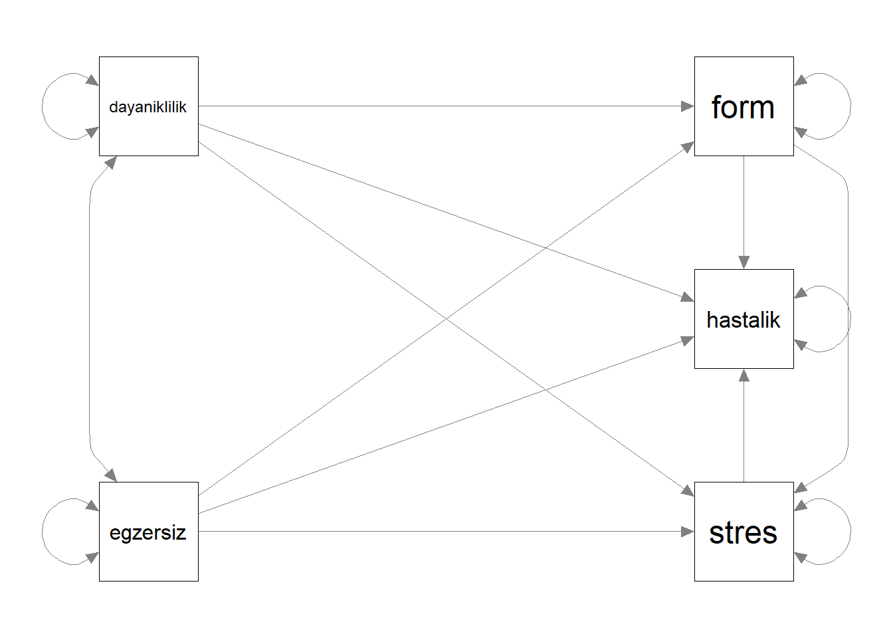
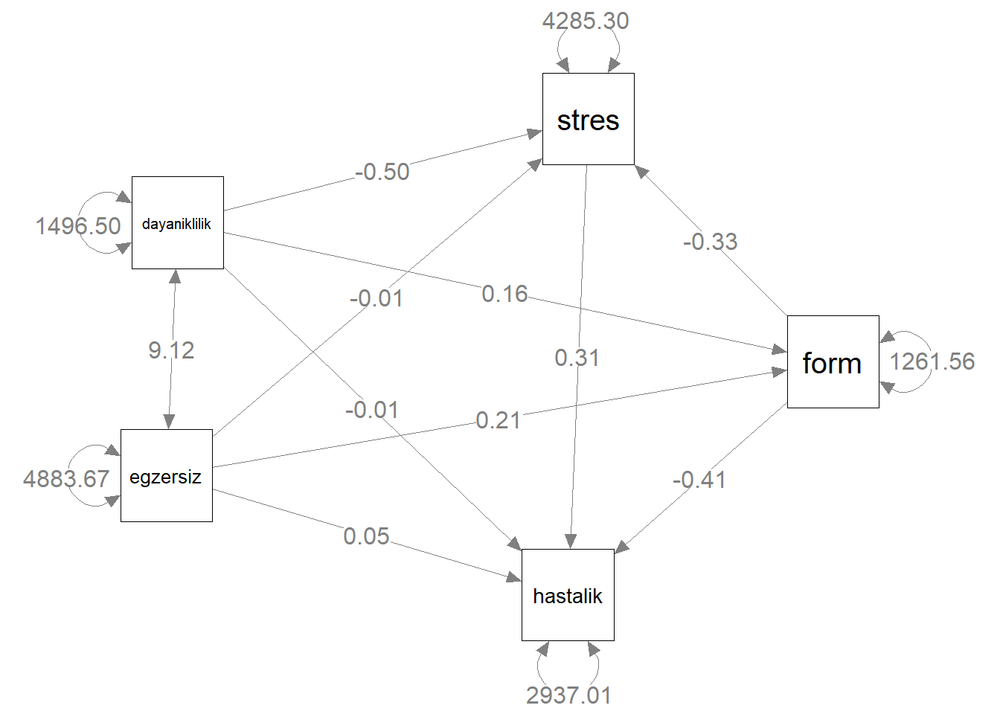
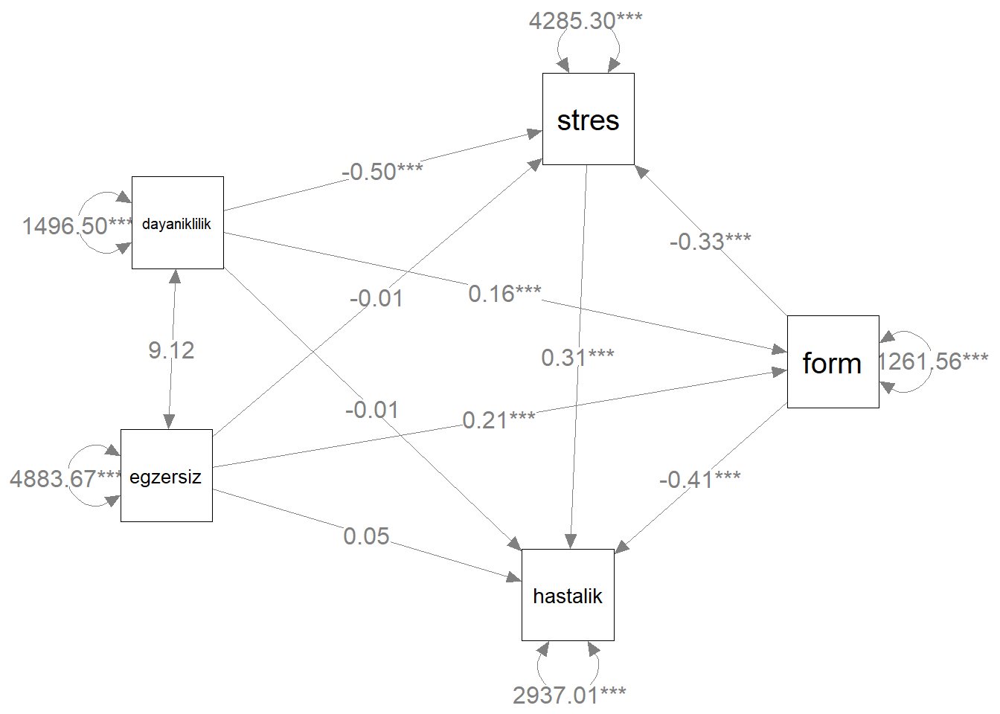
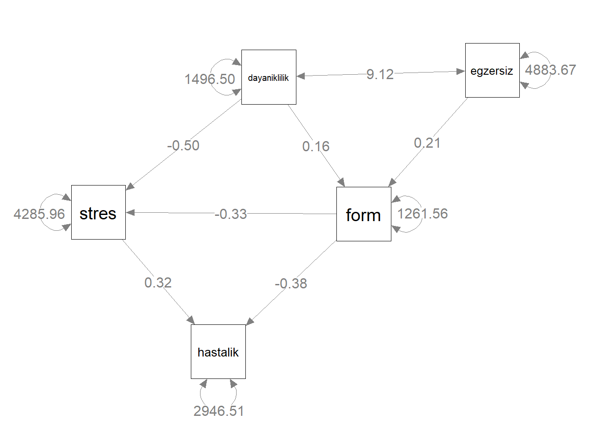
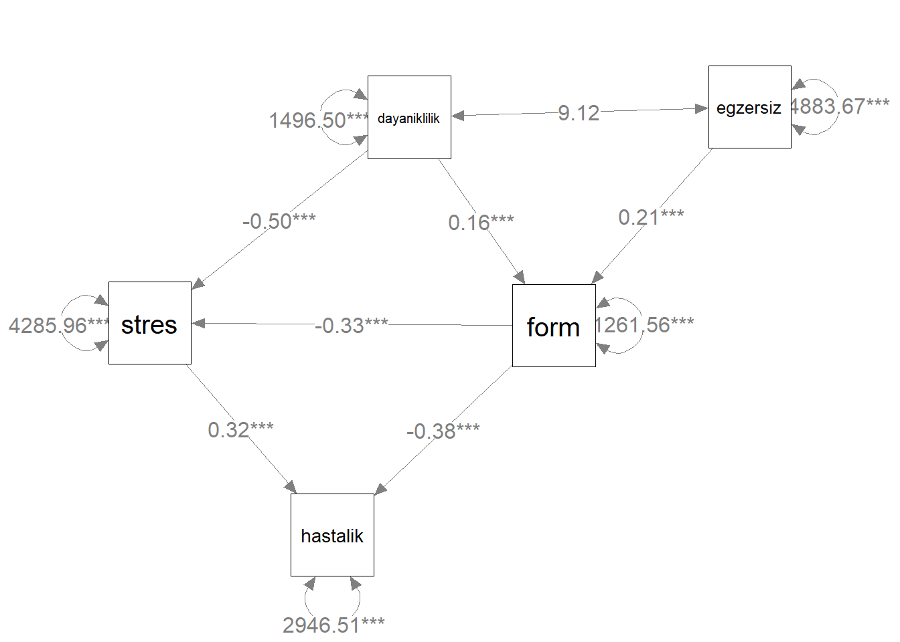

# Yol Analizi

- **Yol analizi modeli** **YEM** ailesinin en eski üyelerinden 
biridir ve halen yaygın olarak kullanılmaktadır. 


- **Herbir yapının sadece tek bir gözlenen ölçümün**
(gostergesinin) olduğu durumlar bulunabilir ve bu
durumlarda da **tek-gösterge tekniği olan yol analizi**
kullanılabilir. Bu analizde **ele alınan ölçülen değişkenlerin
mükemmel derecede güvenilir** olduğu varsayılır.


- Yol analizinde sadece **gözlenen değişkenler modellenir.**
Bu model **gözlenen değişkenler için bir yapısal eşitlik** 
modelidir. 


- YEM bir grup değişken arasındaki ilişkilerin modellenmesine ve öngörülen modellerin test edilmesine imkan verir. 

- Temelde gözlenenen değişkenlerin varyanslarına ve gözlenen değişkenler arasındaki kovaryanslara dayalı olan YEM analizlerinin amacı bir grup gözlenen değişken arasındaki kovaryans örüntüsünü anlamak ve araştırma modeli ile gözlenen değişkenlerin varyanslarını açıklamaktır. 


## Yol Analizi Modelleri

- Yol analizinde amaç **ölçülen değişkenler arasındaki ilişkileri ** açıklamaktır. 


- Yol analizi gözlenen değişkenler arasındakı **doğrudan ve
doğrudan olmayan etkileri gösteren yapısal modellerin
tanımlanmasına** ve test edilmesine izin verir


## Bir Araştırma Senaryosu: Hastalık Faktörleri

- Sunumdaki örnek Roth, Wiebe, Fillingim ve Shay’in (1989) çalışmasından gelmektedir. Çalışmalarında 
üniversite öğrencilerinde **egzersiz, dayanıklılık, form  ve stresin hastalık  üzerindeki etkilerini** incelemişlerdir. 

- 🔗[illness.dat](import/illness.dat) adlı  veri  setinde 5 değişken, 400 birey vardır. Değişkenler egzersiz, dayanıklılık, form, stres ve hastalık değişkenleri olup sürekli değişkenlerdir. 


Araştırma hipotezleri:

1. egzersiz ve dayanıklılık  **formu**  etkiler.

2. egzersiz ve dayanıklılık **stresi** etkiler.

3. egzersiz, dayanıklılık, form ve stres **hastalığı** (illness) etkiler.

Bu üç hipotezin her biri çoklu regresyon modelidir:

$\text{form}_i = \beta_0  + \beta_{\text{eegzersiz}_i} + \beta_{\text{dayanıklılık}_i} + e_{fi}$

$\text{stres}_i = \beta_0  + \beta_{\text{eegzersiz}_i} + \beta_{\text{dayanıklılık}_i} + e_{fi}$

$\text{hastalık}_i = \beta_0  + \beta_{\text{eegzersiz}_i} + \beta_{\text{dayanıklılık}_i} + \beta_{\text{form}_i} + \beta_{\text{stres}_i} + e_{fi}$


Bu modeller R'da **lavaan paketi** ile model denklemi oluşturularak kullanılmalıdır.


```r
yol_model <-  'stres     ~ egzersiz + dayaniklilik
               hastalik  ~ egzersiz + dayaniklilik + form + stres
               form      ~ egzersiz + dayaniklilik'
```


- Veri setini okuma

```r
library(readr)
veri <- read_table("import/illness.dat", col_names = FALSE)
colnames(veri) <- c("form", "stres", "hastalik", "egzersiz", "dayaniklilik")
```

- Yol modelini kurma

```r
library(lavaan)
yol_model <-  'stres     ~ egzersiz + dayaniklilik
               hastalik  ~ egzersiz + dayaniklilik + form + stres
               form      ~ egzersiz + dayaniklilik
egzersiz ~~ dayaniklilik'
yol_fit <- sem(yol_model, veri)
```

###  Hastalık Faktörleri Yol Modeli


## Yol Şemasının Öğeleri

**Gözlenen Değişken**
  


**Dışsal (Exogenous) Değişken:**  Nedenleri bilinmeyen ve 
modelde gösterilmeyen değişkendir. Dışsal değişken 
değişkenlik göstermekte **serbesttir.**

- Örneğin, egzersiz ve dayaniklilik


**İçsel (Endogenous) Değişken:** Varsayılan nedenleri modelde açıkça gösterilen değişkendir. İçsel değişken değişkenlik göstermekte **serbest değildir.** 

 - Örneğin, form, stres ve hastalık 


- Her içsel değişkenin bozukluğu (disturbance) vardır ve bozukluk 
(disturbance) modelde **D** sembolü ile gösterilir.

- Bozukluk model için **hata (artık) terimidir** ve **içsel değişkende 
gözlenen varyansın açıklanmayan kısmını** temsil eder. 

- Bozukluk ilgili içsel değişkenin ölçülemeyen bütün nedenlerini temsil eden 
bileşik bir değişkendir. 

- Model ele alındığında bu nedenlerin doğası 
ve sayısı bilinmediğinden **bozukluklar gizil değişkenler** olarak 
düşünülebilir ve çember sembolü ile temsil edilirler.

**Gizil Değişkenler**
  


- doğrudan **ölçülmezler.**

- bir değer **alamayabilirler.**

- daha doğrudan ölçülebilen değişkenleri etkilediklerine inanılır.

Yapısal eşitlik modelinde iki tür gizil değişken vardır:

  - **faktör veya yapı**
  - **artık veya bozukluk**


- Bir değişkenin diğer bir değişken üzerindeki **doğrudan etkisi** (direct effect) olup **okun kuyruğundaki değişkenin okun başındaki değişkeni etkilediği varsayılır.** Doğrudan etki yol olarak da 
adlandırılır.

  - Örneğin, egzersiz’ın form üzerindeki doğrudan etkisi

  - Örneğin, Dfi’nin form üzerindeki doğrudan etkisi (ölçülmeyen bütün
nedenlerin form üzerindeki doğrudan etkisi)

- **Doğrudan etkilerin** istatistiksel kestirimi **yol katsayıları** (path 
coefficients) olup **çoklu regresyondaki regresyon katsayıları** gibi 
yorumlanır.

- bozukluk ve $y_1$ yolunda gözüken **1** sayısı **ölçekleme sabitidir** (scaling constant), standartlaştırılmamış artık yol katsayısı (unstandardized
residual path coefficient) olarak da adlandırılır ve **bozukluğa bir ölçek atandığını gösterir.** 


- **Bozukluklar gizil olduğu** ve gizil değişkenler de 
program onlarla ilgili herhangi bir kestirimde bulunmadan önce ölçeğe ihtiyaç duyduklarından böyle bir **sabit atanır.**


- İki dışsal değişken arasındaki analiz edilmeyen ilişki
  - Örneğin, **egsersiz** degişkeni ve **dayanıklılık** değişkeni arasındaki 
kovaryans

- Bir dışsal değişkenin varyansı
  - Örneğin, **dayanıklılık** değişkeninin varyansı

- Bir bozuklugun varyansı
  - Örneğin, D’nin varyansı


## **Doğrudan Etki**


Bir dışsal veya içsel bir değişken diğer bir içsel değişkenin 
doğrudan nedeni olabilir. 
  
- egzersiz → form  
- dayaniklilik → form  
- egzersiz → stres  
- dayaniklilik → stres  
- form → hastalik  
- stres → hastalik  
- egzersiz → hastalik  
- dayaniklilik → hastalik  


## Yol Şemasının Öğeleri

**Dolaylı veya Arabulucu Etki**


- Bazı **içsel değişkenlerin yol modelinde hem bağımsız hem de 
bağımlı değişken olarak ikili rolü** vardır. Bu değişkenlere 
arabulucu değişkenler adı verilir.

- form
- stres


- Arabulucu değişkenler kendilerinden önceki değişkenlerin 
nedensel etkilerinin bir kısmını kendilerinden sonraki 
değişkenlere iletirler, böyle etkilere **dolaylı etkiler** adı verilir. 
  - egzersiz → form → hastalik
  - dayaniklilik→ form → hastalik
  - egzersiz → stres → hastalik
  - dayaniklilik → stres → hastalik


## Yol Analizi Modeli

- Veri modellemedeki düşünce **gözlenen kovaryans matrisinin bir 
grup değişken arasındaki varsayılan ilişki tarafından üretilip 
üretilemeyeceğini** test etmektir.

- Varsayılan model belli bir varyans ve kovaryans deseni gerektirir ki 
bu varyans ve kovaryans deseni **üretilmiş varyans ve kovaryans**
matrisi (reproduced variance and covariance matrix) olarak 
adlandırılır.

- Bu matris çoğunlukla **üretilmiş kovaryans matrisi** 
(reproduced covariance matrix) olarak kısaltılır. 


- Gözlenen kovaryans matrisi ve üretilmiş kovaryans matrisi 
arasındaki fark **artık kovaryans matrisini** (residual covariance 
matrix) oluşturur.

- Eğer **artık kovaryans matrisinin** bütün elemanları **sıfırsa**, varsayılan 
model veriyle **tamamen eşleşmiş** demektir (mükemmel model-veri 
uyumu)

- Eğer artık kovaryans matrisinin bütün elemanları **sıfır değilse,** 
varsayılan **model ve veri arasında bir takım uyuşmazlıklar vardır**.


-  Yol analizi modelinde **sıfır hipotezi,** model tarafından 
üretilen **kovaryans matrisinin gerçek veriyle (örneğin, 
gözlenen kovaryans matrisiyle)** tamamen eşleştiğidir.

$\sum = \hat{\sum}$

Burada

- $\sum$ (sigma): gözlenen değişkenlerin evren kovaryans matrisi

- $\hat{\sum}$: model tarafından üretilen kovaryans matrisi

- Yol analizi modelinde, sıfır hipotezinin reddedilmesi istenmez!
Bu nedenle, genel model uyumunu test etmek için kullanılan 
**olabilirlik oranı (ki-kare)** testinin **p-değerinin yüksek olması istenir.**


- **Artık kovaryans matrisi** model tarafından açıklanmayan 
varyans ve kovaryansları içeren matristir. Aşağıdaki 
eşitlikle hesaplanır:

$\sum - \hat{\sum}$

**S** örneklemden elde edilen gözlenen kovaryans matrisidir.

- Gözlenen değişkenler arasındaki bütün varyans ve 
kovaryanslar model tarafından açıklandığı zaman artık 
**kovaryans matrisinin bütün öğeleri sıfır olacaktır. **

- Aksi halde, artık kovaryans matrisinin sıfırdan farklı 
olacaktır. 

### Hastalık Faktörleri (Yol Şeması)

```r
semPaths(yol_fit,rotation=2,
           sizeMan = 10,
           edge.label.cex = 1.15,
           style = "ram")
```


## Evren Kovaryans Matrisi

- hastalik faktörleri örneği için gözlenen değişkenlerin evren 
kovaryans matrisi $\sum$ aşağıdaki gibidir:

$$\begin{bmatrix}{}
VAR_{y_1}\\
COV_{y_2,y_1} & VAR_{y_2}\\
COV_{y_3,y_1} & COV_{y_3,y_2} & VAR_{y_3}\\
COV_{x_1,y_1} & COV_{x_1,y_2} & COV_{x_1,y_3} & VAR_{x_1}\\
COV_{x_2,y_1} & COV_{x_2,y_2} & COV_{x_2,y_3} & COV_{x_2,x_1} & VAR_{x_2}\\
\end{bmatrix}{}$$

-  $\sum$ kare ve simetrik bir matristir ve matriste 
çoğunlukla alt üçgen ve köşegen öğeleri yazılır.


- bir yol modelindeki gözlenen değişkenler arasındaki varyans ve 
kovaryanslardır.

- Model gözlemlerinin sayısı $v$ gözlenen değişkenlerin sayısı olmak 
üzere $v(v + 1) / 2$’ye eşittir. 

- hastalık faktörleri örneğine göre, $v = 5$ ve $v(v + 1) / 2 = 15$

$$\begin{bmatrix}{}
VAR_{y_1}\\
COV_{y_2,y_1} & VAR_{y_2}\\
COV_{y_3,y_1} & COV_{y_3,y_2} & VAR_{y_3}\\
COV_{x_1,y_1} & COV_{x_1,y_2} & COV_{x_1,y_3} & VAR_{x_1}\\
COV_{x_2,y_1} & COV_{x_2,y_2} & COV_{x_2,y_3} & COV_{x_2,x_1} & VAR_{x_2}\\
\end{bmatrix}{}$$


Modelden kestirilen parametre sayısı

- ya gözlenen ya da gözlenmeyen **dışsal değişkenlerin varyanslarının ve 
kovaryanslarının sayısı**
ve

- **gözlenen değişkenlerden içsel değişkenlere olan doğrudan etkilerin 
sayısı** toplamıdır.

- Hastalık faktörleri örneğinde, kestirilecek model parametreleri:
- Dışsal değişkenlerin varyansları: 2
- Dışsal değişkenlerin kovaryansı: 1
- Bozuklukların varyansları: 3
- Doğrudan etkiler: 8

  
$2 + 1 + 3 + 8 = 14$

**İçsel değişkenlerin varyansları ve kovaryansları model parametreleri olarak ele alınmaz.**
 
 **Bozukluk, modelde nedeni bilinmediğinden, gözlenmeyen dışsal 
değişken olarak ele alınır.**

- Model parametresi araştırmacının tanımlamasına bağlı olarak 
**serbest** (free), **sabit** (fixed) veya **sınırlandırılmış** (constrained) 
olabilir.
- **Serbest parametre** (free parameter) örneklem verisinden bilgisayar 
yazılımı tarafından kestirilen parametredir.

- **Sabit** parametre (fixed parameter) bir sabite eşit olarak belirlenen 
parametredir; yazılım bu sabiti veriye bağlı olmaksızın parametrenin 
kestirimi olarak kabul eder. 

- **Sınırlandırılmış** parametre (constrained parameter) yazılım tarafından 
belli sınırlılıklar içerisinde kestirilir ancak bir sabite eşit olmak üzere 
sabitlenmez. 

### Serbestlik Derecesi:

- **Model serbestlik derecesi (sd)** model gözlemlerinin sayısı ve 
modelden kestirilecek parametre sayısı arasındaki farka eşittir:

- Hastalık faktörleri örneğinde,

$$sd = 15 – 14 = 1$$

- **sd<0** model tanımlanamaz. 
- **sd=0** model ancak tanımlanır (just identification) ve kuramsal olarak her parametrenin tek bir çözümü vardır. Model veriye mükemmel uyum gösterir. 
- **sd>0** model aşırı tanımlanmış (over identification) olur. Aşırı tanımlanan modellerde kuramsal olarak her bir parametrenin birden fazla çözümü vardır. 

## Model Tanımlanması
**(Model Identification) İlkeleri**

- Bir yol modelinin değerlendirilmesi sırasında karşılaşılacak olası 
problemlerden biri **modelin tanımlanmasıdır.**

- Modeldeki **her bir parametre için** kuramsal olarak **tek bir kestirim** üretilebiliyorsa, model tanımlanır denir. Aksi halde, model 
tanımlanamaz.

- **Kuramsal olarak ifadesi tanımlanmanın verinin değil, modelin bir 
özelliği** olduğunu vurgulamak için kullanılmıştır. 

- Örneğin, **eğer bir model tanımlanmazsa**, **örneklem büyüklüğüne (100, 1000, 
vb.) bağlı olmaksızın** tanımlanamaz olarak kalır. 

- Bu nedenle, **tanımlanmayan modellerin yeniden tanımlanması** gerekir. Aksi halde, **analizler çözüm** üretmez.

- Herhangi bir yapısal eşitlik modeli için tanımlanmanın gerektirdiği iki 
koşul vardır:

  - Her **gözlenmeyen (gizil) değişken bir ölçeğe atanmalıdır,** bozukluk yol 
analizindeki tek gizil değişkendir. 

  - **En az serbest model parametreleri kadar gözlem olmalıdır (sd ≥ 0)**

**Gizil Değişkenlere Ölçek Atanması**

- Gizil değişkenler **yapay bir ölçektedirler**. Yazılımın gizil 
değişkenleri içeren etkilerin kestirimlerini 
hesaplayabilmesi için **gizil değişkenlere bir ölçek atanması 
gerekir. **

- **Unit Loading Identification (ULI) constraint:** Artık yol katsayısı 
(bozukluğun doğrudan etkisini ifade eden yol katsayısı) 1.0’e 
sabitlenir, böylece bozukluk ilgili içsel değişkenin açıklanmayan 
varyansıyla ilişkili bir ölçeğe atanmış olur.

  - Regresyon ve yol analizi modellerinde, **ölçekler bozukluklara 
genellikle ULI** aracılığıyla atanırlar.

- **Unit Variance Identification (UVI) constraint:** Gizil içsel 
değişkenlerin (yol modelinde bozuklukların) varyansı 1.0’e 
eşitlenir böylece gizil değişkenin varyansı standartlaştırılmış 
ölçekte olur. 


**Yetersiz Tanımlanma (Underidentification)**

- Yetersiz tanımlanan bir modelde **serbest model parametrelerinin**
sayısı gözlem sayısından büyüktür, **diğer bir ifadeyle modelin 
serbestlik derecesi sıfırdan küçüktür (sd < 0).**

- Yetersiz tanımlanan bir model test edilemez ve yeniden 
tanımlanması gerekir. Bu durumda en az bir parametrenin çözümü yoktur. 
- Örnek:


### **Yetersiz Tanımlanma (Underidentification)**

- Gözlem eksikliğinin tanımlanmamaya nasıl yol açtığının 
bir örneği 
    - $a + b = 6$

- Verilen eşitlik bir model olarak ele alınırsa, **6 gözlem**, **a 
ve b de parametrelerdir. **

- Eşitlikte **parametre sayısı (2)**, **gözlem sayısından (1)** 
daha fazla olduğundan,her bir parametre için tek bir 
çözüm bulmak imkansızdır.

- **a ve b** parametreleri için eşitliği sağlayacak sonsuz sayıda çözüm 
vardır:
- Örneğin, (a = 4, b = 2), (a = 8, b = -2) vb.
- **Yetersiz tanımlanan bir yol modeli için** program **her bir 
parametreye ait tek bir kestirim üretmeye** çalışırken de 
benzer bir durum söz konusudur. 


### **Ancak Tanımlanma (Just Identification)**


- Ancak tanımlanan bir modelde **parametre sayısı ve gözlem sayısı** 
birbirine eşittir, diğer bir ifadeyle modelin serbestlik derecesi sıfıra 
eşittir (sd = 0) ve model tanımlanır; kuramsal olarak her 
parametrenin tek bir çözümü vardır. 
- Örnek:


Ancak tanımlanmanın bir örneği aşağıda verilmiştir:  
- $a + b = 6$  
- $2a + b =10$  
- Verilen eşitlikler bir model olarak ele alınırsa, **6** ve **10 
gözlemler**, **a** ve **b de parametrelerdir.**
- Eşitlikte **parametre sayısı (2)**, **gözlem sayısına (2)** eşit 
olduğundan,her bir parametre için tek bir çözümü 
bulunmaktadır.

  - (a = 4, b = 2)
  
  - Parametre kestirimleri verildiğinde gözlemler mükemmel bir şekilde 
üretilir.

- Ancak tanımlanan bir yol modeli için program her bir 
parametreye ait tek bir kestirim üretmekle kalmayıp 
**model veriye mükemmel uyum** sağlayacaktır. 

### **Aşırı Tanımlanma (Overidentification)**

- Aşırı tanımlanan bir modelde **parametre sayısı, gözlem sayısından 
küçüktür**, diğer bir ifadeyle modelin serbestlik derecesi sıfırdan 
büyüktür **sd > 0**, kuramsal olarak her parametrenin olası bir çok 
çözümü vardır. 

- Aşırı tanımlanan bir model için, üretilen kovaryans matrisi örneklem 
kovaryans matrisini **mükemmel bir şekilde üretmeyecektir.**

Aşırı tanımlanmanın bir örneği aşağıda verilmiştir:  
- $a + b = 6$  
- $2a + b =10$  
- $3a + b = 12$   
- Verilen eşitlikler bir model olarak ele alınırsa, **6, 10 ve 
12** gözlemler, **a ve b de parametrelerdir. **
- Üç eşitliği sağlayacak **a ve b değerleri bulunmayabilir.**

- Örneğin, (a = 4, b = 2) değerleri sadece ilk iki eşitliği sağlar.


- Aşırı tanımlama durumda, her bir parametre için tek bir çözüm 
aşağıdaki şekilde üretilir:

  - Gözlemler ve üretilen gözlemler arasındaki farkın karesinin 
toplamının mümkün olduğunca küçük olacağı pozitif parametre 
değerleri bulunur.

  - Örneğin, (a = 3, b = 3,3) sadece en küçük toplam kareler farkını 
sağlamakla kalmaz tek bir çözüm üretir.


## Model-Veri Uyumunun Değerlendirilmesi

- Kestirilen parametre sayısından daha fazla sayıda 
gözleme sahip olan **aşırı tanımlanan** (overidentified) 
modeller **genellikle veriye mükemmel uyum sağlamaz. **
Bu durumda böyle modellerin veriyle ne derece uyumlu 
olduğunu ölçmeye ihtiyaç vardır.

- YEM literatüründe tanımlanan **çok sayıda model uyum 
indeksi vardır** ve sürekli olarak yeni indeksler 
geliştirilmektedir. 


- Çok sayıda farklı uyum indeksinin olması bazı 
problemleri de beraberinde getirir:

  - Farklı makalelerde farklı uyum indeksleri rapor edilir. 
  
  - Aynı makale için farklı hakemler kendi bildikleri veya tercih 
ettikleri farklı indekslerin rapor edilmesini isteyebilirler. 
  
  - Uyum indekslerinin değerlerini rapor ederken seçici davranma 
olasılığı vardır (örneğin, sadece iyi uyum öneren uyum 
indekslerinin rapor edilmesi gibi).


- YEM uygulamalarına ve simülasyon çalışmalarına göre 
YEM analizinin sonuçlarını rapor ederken sunulacak ve 
yorumlanacak uyum indeksleri aşağıdaki gibidir: 

    - Model **Ki-Kare** Değeri

    - Steiger-Lind Root Mean Square Error of Approximation **RMSEA** 
(Steiger, 1990) (%90 güven aralığı ile birlikte)

    - Bentler Comparative Fit Index **CFI** (Bentler, 1990)

    - Standardized Root Mean Square Residual **SRMR**


- Uyum indekslerinin değerleri bir modelin sadece ortalama 
veya genel uyumunu belirtir. Bu nedenle **belli bir indeksin 
değeri uygun bile görünse, modelin belli kısımları veriye 
zayıf uyum sağlayabilir. **

- Uyum indeksleri sonuçların **kuramsal olarak anlamlı olup 
olmadığını belirtmezler.**

- Örneğin,bazı yol katsayılarının işaretleri beklenenin aksi yönde 
olabilir. Uyum indekslerinin değerleri uygun bile görünse 
**beklenmeyen sonuçlar açıklama gerektirir. **


- Yeterli uyumu öneren uyum indekslerinin değerleri 
**yordayıcıların yordama güçlerinin de yüksek olduğunu 
belirtmezler.**

- Örneğin, **veriye mükemmel uyum sağlayan modellerin 
bozukluklarının varyansı halen yüksek olabilir.**

- **Tek bir indeks** modelin sadece belli bir yönünü 
yansıttığından,modelin iyi uyum sağladığını belirtmek 
için **tek başına yeterli olmaz.** Bu nedenle, model uyumu 
birden fazla indeksin değerine dayanarak değerlendirilir.

- Uyum hem modelin belli kısımlarında bölgesel olarak 
hem de genel model ve veri uyuşmasının ne kadar iyi 
olduğu yönünde global olarak değerlendirilmelidir.

- Genel olarak YEM analizinde model uyumu 
değerlendirilirken, odak tek bir istatistiksel anlamlılık 
testinde değildir. **Çeşitli indeksleri incelerken bütüncül bir 
yaklaşım kullanılmalıdır. **

- **Çoklu indekslerin kullanılması** bir modelin uyumu ile ilgili 
**en doğru yaklaşımı verecektir. **

### Ki-Kare Testi (Chi-Square Test)

Ki-kare testi gözlenen kovaryans matrisinin tanımlanan modelle 
tutarlı olup olmadığını değerlendirir.

|   |  |  |
|---------|-----|-------|
| $H_0:\sum = \hat{\sum}$   |  |  $H_0:\sum_{RES}=0$ |
| $H_1:\sum\neq\hat{\sum}$  |  |  $H_1:\sum_{RES}\neq0$   |


- MLE yöntemi için sıfır hipotezini değerlendirmek üzere T-istatistiği 
(model chi-square, likelihood ratio chi-square veya generalized 
likelihood ratio olarak da adlandırılır) hesaplanır:
$T=(n-1)F_{ML}$
- Burada n örneklem büyüklüğüdür.

  - n büyük ise ve ölçülen değişkenler evrende çok değişkenli normal 
dağılımlara sahipse ve doğru model tanımlanmışsa; T-istatistiği yaklaşık 
olarak tanımlanan modelin serbestlik derecesi ile ki-kare dağılımı 
gösterir.


- **Ancak tanımlanan** (just identified) bir model için ki-kare değeri 
genellikle sıfıra eşittir ve serbestlik derecesi yoktur **sd = 0**. Eğer 
model ki-kare değeri sıfıra eşitse model **veriye mükemmel bir şekilde** 
uyar (kestirilen korelasyon ve kovaryans değerleri gözlenenlere 
eşittir). 

- Model ki-kare değeri arttıkça, **aşırı tanımlanan (overidentified) bir 
modelin uyumu giderek kötüleşir.** 

- Örneğin, sd = 1 ile 12.30’a eşit model ki-kare değeri. 


- Model **ki-kare değeri arttıkça**,modelin veriye uyumu kötüleştiği için 
model ki-kare aslında bir **kötülük uyum** indeksidir. 

- Geleneksel hipotez testinin aksine, ki-kare testinin sıfır hipotezinin 
**reddedilmemesi** tercih edilir. 

- **Sıfır hipotezinin reddedilmemesi modelin veriye uyduğunu önerir.** 

- Diğer yandan sıfır hipotezinin reddedilmesi **model-veri uyumunun iyi olmadığını önerir. **


```r
fitmeasures(yol_fit,fit.measures = c("chisq" ,"df" , "pvalue"))
```

```
##  chisq     df pvalue 
##   12.3    1.0    0.0
```


- sd = 1 için ki-karenin 0.05 alfa düzeyindeki kritik değeri 3.84’tür. 
12.3 değeri 3.84 değerinden büyük olduğundan gözlenen kikare değeri (12,302) 
- 0,05 alfa düzeyinde istatistiksel olarak 
anlamlıdır. 

-  12.3 değerini elde etme olasılığını da verir. 
Örnekte bu olasılık 0.0005’tir. Bu değer 0.05 alfa düzeyinden 
küçüktür.
]

- Ki-kare testi **örneklem büyüklüğünden doğrudan etkilenir.** 

- Eğer ***n** büyükse ki bu durum YEM için genellikle istenen 
bir durumdur, ki-kare testine dayanarak modeli zayıf 
uyumlu gerekçesiyle reddetmek daha olasıdır (gözlenen 
ve kestirilen kovaryans değerleri arasındaki fark çok 
minimal düzeyde olsa bile).

- Eğer ki-kare testine dayalı sıfır hipotezi reddedilirse, modelin 
yeterliğini incelemek için **diğer indeksler** düşünülmelidir.

- Eğer **n** küçükse ve güç eksikliğinden dolayı sıfır hipotezi 
reddedilmediyse, diğer uyum indeksleri modelin desteklenip 
desteklenmemesinde yardımcı olacaktır. 


- **Ki-kare testi örneklem büyüklüğüne** bağlılığından dolayı iyilik uyumunun değerlendirilmesi için **çok ideal değildir.** Ancak geleneksel olarak rapor edilir ve diğer uyum indeksleriyle desteklenir.  

- Model ki-kare değerinin örneklem büyüklüğüne hassasiyetini azaltmak için bazı araştırmacılar bu değeri ilgili serbestlik derecesine bölerler. Elde edilen değer normed chi-square (NC) değeri olarak adlandırılır. 

- Ancak bu değerin yorumlanması için minimum kabul edilebilirlik düzeyini temsil edecek net bir kesim değeri yoktur. 

  - **NC <= 2 ve ya 3 ve ya 5 (Kabul edilir.)**

- Ayrıca **NC örneklem büyüklüğünün etkisini tamamen düzeltmez. **


### RMSEA

- Root Mean Square Error of Approximation (RMSEA) 
**serbestlik derecesinin bir fonksiyonu olarak uyumu 
değerlendiren bir indekstir:**

$RMSEA = \sqrt{\frac{\hat{\delta}}{df(n-1)}}$

$\delta$   parametresi  araştırmacının modelinin 
hatalı tanımlanma  derecesini yansıtır.
Burada     $\hat{\delta} = max(\chi^2 - df,0)$    parantez içindeki iki ifadeden birinin maksimum değerini kapsar.

- RMSEA indeksi de **kötülük uyum** indeksidir. 
- RMSEA indeksinin **daha yüksek değerleri daha kötü uyumu belirtir. **

- RMSEA = 0 değeri **en iyi uyumu belirtir**. Ancak RMSEA = 0 değeri **mükemmel bir uyumu ifade etmez.**


- RMSEA uyumu doğrudan serbestlik derecesinin bir 
fonksiyonu olarak ele alır; modelin tutumunu hesaba katar 
(ölçülen değişkenlerin sayısına karşılık kestirilen model 
parametrelerinin sayısı).

- RMSEA için önerilen kesme noktaları (Hu & Bentler, 
1999):
  - RMSEA ≤ 0.05 iyi uyumu belirtir.
  
  - 0.05 < RMSEA < 0.08 kabul edilebilir uyumu belirtir.
  
  - RMSEA ≥ 0.08 zayıf uyumu belirtir.

<br>
<br>


-  RMSEA tarafından kestirilen evren parametresi $\epsilon$ için 
%90 güven aralığı genellikle YEM yazılımlarının 
çıktısında verilir.

- $\epsilon$ için güven aralığı kestirilen merkezi olmayan $\delta$ parametresine 
dayanır ve RMSEA örneklem değeri etrafında simetrik olmayabilir. 

- Bu güven aralığı nokta kestirimi olarak RMSEA değeri ile ilişkili 
belirsizlik derecesini yansıtır.

- Eğer $\epsilon$ için %90 güven aralığının alt sınırının değeri 0,05’ten 
küçükse, modelinin evrende tahmini yaklaşık uyuma sahip olduğu 
hipotezi $H_{0}:\epsilon_{0} ≤ 0.05$ reddedilmeyecektir. 


- Çıktıda kestirilen RMSEA değeri ve 
ilgili %90 güven aralığı (90% C. I.) verilir. 


```r
  # summary(yol_fit, fit.measures = TRUE)
fitMeasures(yol_fit, c("rmsea","rmsea.ci.lower",
                       "rmsea.ci.upper","rmsea.pvalue"))
```

```
##          rmsea rmsea.ci.lower rmsea.ci.upper   rmsea.pvalue 
##          0.168          0.093          0.258          0.006
```


- Kestirilen RMSEA değeri 0.168’dir. 0.168 değeri 0.08 değerinden 
büyük olduğundan RMSEA indeksi model için zayıf uyum belirtir.

- %90 güven aralığının alt sınırı 0.05 değerinden büyük olduğundan 
araştırmacının modelinin evrende tahmini yaklaşık uyuma sahip 
olduğu hipotezi reddedilir.


### RMR 

**Root Mean Square Residual (RMR)** Bu indeksi hesaplamak için her 
bir artık öğenin karesi alınır, karelerin toplanmasıyla elde edilen 
toplam artık sayısına bölünür ve bu ortalama kare artıkların kare kökü 
alınır. 

- Sıfır değeri mükemmel bir uyum belirtir ancak sıfırdan büyük değerlerin yorumlanması zordur. 


### SRMR 

**Standardized Root Mean Square Residual (SRMR)** Bu indeks RMR 
indeksinin hesaplandığı şekilde hesaplanır ancak standartlaştırılmış 
artıklar kullanılır. 

- 0.08’den küçük değerler uygun olarak düşünülür (Hu & Bentler, 1999).


```r
fitMeasures(yol_fit, "srmr")
```

```
##  srmr 
## 0.043
```


- Kestirilen SRMR değeri 0.043’dir. 0.043 değeri 0.08 değerinden küçük 
olduğundan SRMR indeksi model için kabul edilebilir uyum belirtir.


### Karşılaştırmalı Uyum İndeksleri
**(Comparative Fit Indices)**

- Bir çok indeks araştırmacının modelinin veriye nasıl 
uyduğunu, modelin uyumunu daha sınırlandırılmış bir 
modelle karşılaştırarak değerlendirir. 

  - Araştırmacının modeli ile karşılaştırılan model taban modeli 
(baseline model) olarak adlandırılır. Bu model tipik olarak bağımsız 
modeldir (independence model) ve **sıfır modeli** (null model) olarak 
da adlandırılır. 

- Sıfır yol modeli gözlenen değişkenler 
arasındaki evren kovaryanslarının (dışsal gözlenen 
değişkenler arasındaki kovaryanslar ve bütün gözlenen 
değişkenlerin varyansları hariç) sıfır olduğunu varsayar.


- Sıfır modeli değişkenlerin ilişkili olmadığını varsaydığından 
genellikle araştırmacının modelinden daha yüksek ki-kare 
değerine sahiptir. 

  - Bu nedenle karşılaştırmalı uyum indeksleri **artımlı uyum indeksleri** 
(incremental fit indices) olarak da bilinir: daha sınırlandırılmış 
model (örneğin, sıfır modeli) uyumundan daha esnek model 
(örneğin, araştırmacının modeli) uyumuna artırım. 

- Karşılaştırmalı uyum indekslerinden YEM analizlerinde sık 
kullanılan iki tanesi CFI ve NNFI (TLI) indeksleridir. Ancak 
iki indeks de örneklem dayanaklı indekslerdir.

- CFI indeksi Bentler (1990) tarafından geliştirilmiştir ve 
aşağıdaki şekilde hesaplanır:
$CFI = \frac{\hat{\delta_{null} - \delta_{researcher}}}{\delta_{null}}$
- Araştırmacının modeli sıfır modelinden daha iyi uyum 
sağlarsa, araştırmacının modelinin ki-kare değeri sıfır 
modelinin ki-kare değerinden daha küçük olacaktır.

- İki model arasındaki fark arttıkça, CFI değeri 1’e daha çok 
yaklaşacaktır. 
  - CFI = 0 değeri araştırmacının modelinin sıfır modeline göre 
gelişmediğini belirtir.
  - CFI değerinin 0.90 veya 0.95’ten daha büyük olması kabul edilebilir 
uyum için önerilir (Hu & Bentler, 1999). 
  - CFI = 1 değeri **mükemmel uyumu belirtmez.**

- Non-Normed Fit Index (NNFI veya Tucker-Lewis Index, 
TLI) sıfır modeli ve araştırmacının modelinin serbestlik 
derecesini hesaba katarak negatif yanlılığı düzeltmeye 
çalışır:

$$NNFI= \frac{\frac{T_{null}}{df_{null}} - \frac{T_{researcher}}{df_{researcher}}}{\frac{T_{null}}{df_{null}}-1}$$

- NNFI değerleri 0 ile 1 aralığında değer alır ancak bu 
aralığın dışında bir değer de alabilir. 
  - NNFI değerinin 0.90 veya 0,95’ten daha büyük olması kabul 
edilebilir uyum için önerilir (Hu & Bentler, 1999). 
- NNFI örneklemlerin aynı evrenden alındığı **küçük ve orta 
büyüklükteki verilerin kullanıldığı çalışmalarda kararlı 
değildir.**

- sıfır modeli için ki-kare testine ait değerleri ve CFI ve TLI değerlerini verir:


```r
fitmeasures(yol_fit,fit.measures = c("cfi","tli"))
```

```
##   cfi   tli 
## 0.948 0.485
```


- Kestirilen CFI değeri 0.949’dur. 0.949 değeri 0.90 değerinden 
büyük olduğundan CFI indeksi model için iyi uyum belirtir.

- Kestirilen TLI değeri 0.539’dur. 0.539 değeri 0.90 değerinden küçük 
olduğundan TLI indeksi model için zayıf uyum belirtir

## Uyum İndekslerini Raporlarken Öneriler

- Tek bir indeks model uyumunun sadece belli bir yönünü 
yansıtır. Araştırmacılar aşağıdakilerin rapor edilmesini 
önerir:
- Model ki-kare değeri: anlamlı olmayan sonuç

|Uyum indeksi|	İyi uyum|	Kabul Edilebilir Uyum|
|----|-----|------|
| $\chi^2$    |p| |
| $\chi^2/df$ |	0 ≤ $\chi^2/df$ ≤ 2|	2 < $\chi^2/df$ < 8 |	
| SRMR |	0 ≤SRMR ≤ .05|	.05 < SRMR < .10 |	
| RMSEA |	0 ≤RMSEA ≤ .05|	.05 < RMSEA < .08 |			
| CFI	   | .95 ≤GFI ≤ 1 | .90 < GFI < .95 |
		
Not: Bu kesme değerlerin kullanılmasıyla ilgili çok sayıda 
tartışma vardır. 


- Önerilen uyum indeksleri göz önüne alınınca model-veri 
uyumu ile ilgili ne söylenebilir?


```r
fitmeasures(yol_fit,fit.measures = c("chisq" ,"df" ,"pvalue",
                                     "cfi","tli","rmsea",    
                                     "rmsea.ci.lower","rmsea.ci.upper"
                                     ,"srmr"))
```

```
##          chisq             df         pvalue            cfi            tli 
##         12.307          1.000          0.000          0.948          0.485 
##          rmsea rmsea.ci.lower rmsea.ci.upper           srmr 
##          0.168          0.093          0.258          0.043
```


## Bireysel İstatistiksel testler: 
**t-değeri**

- Bireysel istatistiksel test belli parametre kestirimlerine 
dayalı hesaplanır. Hatalı tanımlamanın 
değerlendirilmesinde kullanışlıdır.

t-değeri = parametre kestirimi / standart hata

  - Normal olarak dağılır.
  - z-istatistiği gibi kullanılır.
  - Parametrelerin beklenen yönde olup olmadığını ve istatistiksel 
olarak sıfırdan farklı olup olmadığını değerlendirir.

- Anlamlı olmayan parametreler 0’a sabitlenebilir ancak test **n** ile 
ilişkilidir.

- Ancak bir parametrenin sabitlenmesi diğer bütün kestirimleri 
değiştirecektir. Bu da hatalı tanımlamadan dolayı hatalara sebep 
olabilir

## Bireysel Artık ve
**Standartlaştırılmış Artık**

- İdeal olarak **artık değerleri küçük ve tek biçimli olmalıdır.**
- Artık kovaryans matrisini yorumlamak standartlaştırılmış 
artık kovaryans matrisinden daha zordur. 
- Standartlaştırılmış artık:
  - z-puanları gibidir.
  - Hangi değerin büyük olduğunu belirlemek kolaydır (0.05 alfa 
düzeyinde 1.96 istatistiksel anlamlılık)
  - Köşegen dışındaki standartlaştırılmış artıkların mutlak değerlerinin 
ortalaması tipik bir artığı temsil eden bir indeks sağlar.


```r
# lavResiduals(yol_fit)
# resid(yol_fit)
resid(yol_fit, type='normalized')
```

```
## $type
## [1] "normalized"
## 
## $cov
##               stres hastlk   form egzrsz dynkll
## stres         0.002                            
## hastalik      0.718  0.392                     
## form         -2.950 -1.031  0.006              
## egzersiz     -0.021 -0.011  0.010  0.000       
## dayaniklilik -0.005 -0.005  0.025  0.067  0.000
```

- Standarlaştırılmış hata kovaryans matrisinde yer alan diyagonal dışındaki her bir değerin mutlak değerinin 1.96’dan küçük olması beklenir. 

## Modifikasyon İndeksleri

- **modindices** fonksiyonu ile  modifikasyon indeksleri istenebilir.

- **mi** sütunu yapılacak modifikasyon sonucunda ki-karedeki düşüsü göstermektedir.


```r
modindices(yol_fit, sort = TRUE)
## modindices(yol_fit, sort = TRUE, maximum.number = 5)
```

<div class="kable-table">

|   |lhs   |op |rhs      |   mi|    epc| sepc.lv| sepc.all| sepc.nox|
|:--|:-----|:--|:--------|----:|------:|-------:|--------:|--------:|
|24 |stres |~  |hastalik | 12.1|  0.799|   0.799|    0.693|    0.693|
|25 |stres |~  |form     | 12.1| -0.326|  -0.326|   -0.180|   -0.180|
|26 |form  |~  |stres    | 12.1| -0.093|  -0.093|   -0.168|   -0.168|
|27 |form  |~  |hastalik | 12.1| -0.296|  -0.296|   -0.464|   -0.464|

</div>

- Bu tablo dört parametreden herhangi birinin (aynı anda, eş zamanlı 
DEĞİL) model ki-kare değerini 12.1 değerinde düşüreceğini 
önermektedir. 

- Artık kovaryans matrisinden gelen kanıt da 
birleştirildiğinde, modele **form değişkeninin stres 
değişkenine** doğrudan etkisini gösteren bir parametre 
eklenebilir

- Bu model ancak tanımlanan modeldir (sd = 0), bu nedenle 
veriye mükemmel uyum sağlayacaktır

## Modelin Yeniden Tanımlanması
**Revised Model 1**

- stres     ~ form
 yolu eklenir.

```r
yol_model_v1 <- 
'stres     ~ egzersiz + dayaniklilik
hastalik  ~ egzersiz + dayaniklilik + form + stres
form      ~ egzersiz + dayaniklilik
stres     ~ form
egzersiz ~~ dayaniklilik' 
yol_fit_v1 <- sem(yol_model_v1, veri)
```


```r
semPaths(yol_fit_v1,rotation=2, curvePivot = TRUE,
sizeMan = 12, sizeInt = 1, 
sizeLat = 4,
edge.label.cex = 1.8,
pastel=TRUE,
nCharNodes = 0, nCharEdges = 0)
```





- Yeni tanımlanan model için verilen uyum indeksleri 
beklendiği gibidir.

- Kikare = 0 ve sd = 0 olduğunda,  p değerini 0,0000 olarak
yazdırır. Ancak bu değer ki kare testinin reddedildiği anlamına gelmez.


```r
fitmeasures(yol_fit_v1,fit.measures=c("chisq","p","df"))
```

```
## chisq    df 
##     0     0
```


```r
p_pa <- 
semPaths(yol_fit_v1, whatLabels = "est",
sizeMan = 10,
edge.label.cex = 1.15,
style = "ram",layout = "spring" ,
nCharNodes = 0, nCharEdges = 0)
p_pa_2 <- semptools::mark_sig(p_pa, yol_fit_v1)
plot(p_pa_2)
```
good fit vs parsinomy parsinomy principle




## Modelin Yeniden Tanımlanması
**Revised Model 2**

- anlamlı olmayan yol katsayıları kaldırıldır


```r
yol_model_v1 <- 
'stres     ~ egzersiz + dayaniklilik
hastalik  ~ egzersiz + dayaniklilik + form + stres
form      ~ egzersiz + dayaniklilik
stres     ~ form
egzersiz ~~ dayaniklilik' 


yol_model_v2 <- 
'stres     ~  dayaniklilik
hastalik  ~ form + stres
form      ~ egzersiz + dayaniklilik
stres     ~ form
egzersiz ~~ dayaniklilik' 
yol_fit_v2 <- sem(yol_model_v2, veri)
```


- anlamlı olmayan yol katsayıları kaldırıldır


```r
fitmeasures(yol_fit_v2,c("rmsea","cfi","srmr"))
```

```
## rmsea   cfi  srmr 
## 0.000 1.000 0.011
```




```r
fitmeasures(yol_fit_v2,fit.measures = c("chisq" ,"df" , "pvalue",
                                        "cfi","tli","rmsea",
                                        "rmsea.ci.lower",   "rmsea.ci.upper"
                                        ,"srmr"))
```

```
##          chisq             df         pvalue            cfi            tli 
##          1.354          3.000          0.716          1.000          1.025 
##          rmsea rmsea.ci.lower rmsea.ci.upper           srmr 
##          0.000          0.000          0.061          0.011
```

- sd = 3 için ki-karenin 0.05 alfa düzeyindeki kritik değeri 7.82’dir. 
1.354 değeri 7.82 değerinden küçük olduğundan gözlenen ki-kare 
değeri (1,354) 0.05 alfa düzeyinde istatistiksel olarak anlamlı 
değildir.

- RMSEA, CFI ve SRMR indekslerinin değerleri istenilen değerdedir


### Ki-Kare Fark Testi

- Hem revised model 1 hem de revised model 2 veriye iyi 
uyum sağlamaktadır.

  - Bu durumda hangi model seçilmelidir?

    - **Mükemmel uyum** sağlayan ancak daha karmaşık model mi?

    - **İyi uyum sağlayan** ancak daha basit model mi?

- Ki-kare fark testi hiyerarşik olarak kümelenmiş iki modelin 
karşılaştırılmasında oldukça kullanışlıdır.

  - Eğer modellerden birisi diğerinin alt kümesiyse iki model 
kümelenmiştir (daha basit model daha karmaşık modelin içinde 
kümelenmiştir). 

    - Bu durumda revised model 2 (daha basit model) revised model 1 
(daha karmaşık model) içinde kümelenmiştir. 

- Ki-kare fark testi modellerin bağıl uyumlarını 
değerlendirmek için kullanılabilir.


- İki model de veriye iyi uyum sağladığında, ki-kare 
değerleri arasındaki fark serbestlik derecesi iki model 
arasındaki parametre sayısındaki farka eşit olan ki-kare 
dağılımı gösterir:

  - $\chi^2_{dif} = \chi^2_{simple} -\chi^2_{complex}$

  - $df_{dif} = df_{simple} - df_{complex}$

- Anlamlı olmayan ki-kare farkı daha basit modelin daha 
karmaşık modelden istatistiksel olarak veriye daha kötü 
uymadığını önerir. 

- Bu nedenle, daha basit model daha tutumlu olduğundan dolayı 
seçilmelidir. Aksi halde karmaşık model seçilmelidir. 


- Örnekte revised model 2 (12 model parametresine sahip 
olup sd = 3) revised model 1’den (15 model parametresine 
sahip olup sd = 0) daha basittir.

  - $\chi^2_{dif} = \chi^2_{simple} -\chi^2_{complex}$

  - $df_{dif} = df_{simple} - df_{complex}$

- 1.354 ki-kare değeri sd = 3 olduğunda, 0,05 alfa 
düzeyinde (kritik ki-kare değeri = 7.82) istatistiksel olarak 
**anlamlı değildir. **

  - Bu nedenle revised model 2 (daha basit 
olan) revised model 1’e (daha karmaşık olan) tercih edilir 
şeklinde sonuca varılabilir


### AIC ve BIC

- Akaike Information Criterion (AIC) ve Bayesian 
Information Criterion (BIC) evren dayanaklı yordayıcı 
uyum indeksleri olarak bilinir. 

- Farklı YEM yazılımları AIC ve BIC değerlerini farklı şekilde 
hesaplayabilir. 

  - $AIC = - 2LogL + 2r$ , r modeldeki parametre sayısı
  - $BIC = - 2LogL + r ln n$, n  örneklem büyüklüğü
  - $adjusted BIC = - 2LogL + r ln n*$ , n* = (n+2) /24

- AIC ve BIC değerleri çoğunlukla aynı veriden kestirilen 
hiyerarşik olmayan modellerin arasından seçim yapmak 
için kullanılır. Bağıl olarak daha küçük değerler uygundur


model1

```r
fitmeasures(yol_fit_v1,fit.measures = c("AIC","BIC"))
```

```
##   aic   bic 
## 21423 21483
```

model2

```r
fitmeasures(yol_fit_v2,fit.measures = c("AIC","BIC"))
```

```
##   aic   bic 
## 21418 21466
```

- İki model kümelenmiş modeller olduğundan, iki 
model arasında AIC ve BIC değerlerinin 
**karşılaştırılmasına gerek 
yoktur**


- Eğer model-veri uyumu zayıfsa, ilk olarak varsayılan 
model veriye uymaz. 

- Eğer model-veri uyumu iyiyse, model veri tarafından 
desteklenir. Alternatif modelleri araştırmak veya **daha 
tutumlu (parsimonious) bir model aramak için ilave 
analizler yürütülebilir. **

- Mükemmel veya iyi bir model-veri uyumu mutlaka modelin iyi 
olduğunu önermez. İyi bir model en basit şekilde olan (tutumluluk 
ilkesi), ama hala veriye iyi uyan modeldir.

**İyi Uyuma karşı Model Tutumluluğu**


## sem fonksiyonu


| Argüman	| Açıklama	| Değerleri| 
| ---|---|---|
| Model	  |YEM modeli tanımlanır.| 	|
| Data	  |Gözlenen değişkenlerin yer aldığı veri setidir.| | 	
|sampling.weights	| Örneklem ağırlıklandırması yapılacağı durumlarda tanımlanır. | 	Veri çerçevesinde ağırlıklandırma bilgisinin yer aldığı değişkenin adıdır.| 
|group	|Çoklu grup analizlerde grup değişkeni tanımlanır. |	Veri matrisinde grubu tanımlayan değişkenin adıdır. |
|cluster	|Çok düzeyli analizlerde düzey değişkeni tanımlanır. 	|Veri matrisinde düzeyi tanımlayan değişkenin adıdır. |
|constraints|	Modele eklenecek diğer sınırlandırmalar tanımlanır. |	|
|estimator	|Kestirim yöntemidir. |	“ML”, “GLS”, “WLS”, ”ULS”, ”DWLS” gibi|

| formul	| tur	|  
| ---|---|
| gizil değişken tanımlama	| =~	| 
| regresyon	| ~	| 
| kovaryans	| ~~	|  
| kesisim	| ~1	|  


- MODEL bölümü modelin belirlenmesi 
- Yol analizinde, her bir içsel (endogenous) değişkenin bir 
veya daha fazla değişken tarafından yordanması $~$
ifadesi ile belirtilir.
- Örneğin,
  - **form~egzersiz + dayaniklilik**

ifadesinin anlamı form’ın egzersiz + dayaniklilik tan 
yordandığıdır.


- ham veri kullanıldığı zaman, default 
modeli değişkenler için ortalamaların/kesişimlerin 
kestirildiği ortalama yapıları içerecektir. 

- Yol analizi modeli için kovaryans yapısına odaklanılır. 
“Means” ve “Intercepts” bölümü altındaki değerler göz 
ardı edilir.

- Ortalamalar/kesişimler çıkarılınca, kestirilen 
**parametre sayısı 14** olmalıdır. 


```r
summary(yol_fit)
```

```
## lavaan 0.6.17 ended normally after 8 iterations
## 
##   Estimator                                         ML
##   Optimization method                           NLMINB
##   Number of model parameters                        14
## 
##   Number of observations                           400
## 
## Model Test User Model:
##                                                       
##   Test statistic                                12.307
##   Degrees of freedom                                 1
##   P-value (Chi-square)                           0.000
## 
## Parameter Estimates:
## 
##   Standard errors                             Standard
##   Information                                 Expected
##   Information saturated (h1) model          Structured
## 
## Regressions:
##                    Estimate  Std.Err  z-value  P(>|z|)
##   stres ~                                             
##     egzersiz         -0.080    0.048   -1.678    0.093
##     dayaniklilik     -0.556    0.086   -6.475    0.000
##   hastalik ~                                          
##     egzersiz          0.047    0.042    1.115    0.265
##     dayaniklilik     -0.010    0.075   -0.138    0.891
##     form             -0.408    0.076   -5.342    0.000
##     stres             0.314    0.041    7.704    0.000
##   form ~                                              
##     egzersiz          0.206    0.025    8.118    0.000
##     dayaniklilik      0.161    0.046    3.506    0.000
## 
## Covariances:
##                    Estimate  Std.Err  z-value  P(>|z|)
##   egzersiz ~~                                         
##     dayaniklilik      0.000  135.170    0.000    1.000
## 
## Variances:
##                    Estimate  Std.Err  z-value  P(>|z|)
##    .stres          4419.143  312.481   14.142    0.000
##    .hastalik       2937.014  207.678   14.142    0.000
##    .form           1261.565   89.206   14.142    0.000
##     egzersiz       4883.673  345.328   14.142    0.000
##     dayaniklilik   1496.499  105.818   14.142    0.000
```


- Her bir kestirimin yorumu çoklu regresyondaki yorumlara
benzerdir.

- Örneğin, **form ~ egzersiz**  kestirimi 0.206’dır. Bu değer,
egzersiz puanındaki bir birimlik
artışın yordanan form puanını 0.206 birimlik
artıracağını önerir.

- Bu kestirimin standart hatası 0.025’tir. Kestirimin standart hatasına
bölünmesiyle t istatistiği elde edilir:
0.206 / 0.025 = 8.12

- İki yönlü t testi 0.206 değerinin
**anlamlı olarak 0’dan farklı
olduğunu önerir.**


- Örneğin, **form ~ egzersiz** standartlaştırılmış kestirimi 
0.371’dir. Bu değer, egzersiz 
puanındaki bir standart sapmalık artışın yordanan 
form puanını 0.71 standart 
sapma artıracağını önerir.

- Bu kestirimin standart hatası  0.043’tür.
- Kestirimin standart hatasına  bölünmesiyle t-istatistiği elde 
edilir:
0.371 / 0.043 = 8.72

- İki-yönlü t-testi 0.371 değerinin 
anlamlı olarak 0’dan farklı 
olduğunu önerir.


- **egzersiz ~~ dayaniklilik** değeri  9.105’tir. Bu değer egzersiz ve 
dayaniklilik değişkenleri arasındaki **kovaryans**
tahminidir.

- Standartlaştırılmamış artık varyans (unstandardized 
residual variance), her bir içsel değişkendeki yordayıcılar 
tarafından açıklanmayan varyans miktarını söyler.

- Örneğin, form değişkenindeki açıklanmayan 
varyans yaklaşık 1261.54’tür. 

- Bu değer, form  değişkeninin varyansı(1508.75) ile karşılaştırılarak 
açıklanmayan varyans yüzdesi hesaplanabilir


## Standartlaştırılmış Artık

-  Standartlaştırılmış artık  varyans (standardized residual 
variance), **her bir içsel değişkendeki yordayıcılar 
tarafından açıklanmayan varyans oranını söyler.**

- Örneğin, form değişkenindeki açıklanmayan 
varyans oranı yaklaşık 0.836’dır. form değişkeni 
için toplam varyansın yaklaşık 
%83.6’sı açıklanmamıştır. 
- **1261.4 / 1508.75 = 0.836**


## Kestirim


```r
parameterEstimates(yol_fit, standardized=TRUE)
```

<div class="kable-table">

|lhs          |op |rhs          |      est|      se|      z| pvalue| ci.lower| ci.upper|   std.lv| std.all| std.nox|
|:------------|:--|:------------|--------:|-------:|------:|------:|--------:|--------:|--------:|-------:|-------:|
|stres        |~  |egzersiz     |   -0.080|   0.048| -1.678|  0.093|   -0.173|    0.013|   -0.080|  -0.080|  -0.080|
|stres        |~  |dayaniklilik |   -0.556|   0.086| -6.475|  0.000|   -0.725|   -0.388|   -0.556|  -0.307|  -0.307|
|hastalik     |~  |egzersiz     |    0.047|   0.042|  1.115|  0.265|   -0.035|    0.129|    0.047|   0.054|   0.054|
|hastalik     |~  |dayaniklilik |   -0.010|   0.075| -0.138|  0.891|   -0.157|    0.136|   -0.010|  -0.007|  -0.007|
|hastalik     |~  |form         |   -0.408|   0.076| -5.342|  0.000|   -0.557|   -0.258|   -0.408|  -0.260|  -0.260|
|hastalik     |~  |stres        |    0.314|   0.041|  7.704|  0.000|    0.234|    0.394|    0.314|   0.362|   0.362|
|form         |~  |egzersiz     |    0.206|   0.025|  8.118|  0.000|    0.156|    0.256|    0.206|   0.371|   0.371|
|form         |~  |dayaniklilik |    0.161|   0.046|  3.506|  0.000|    0.071|    0.251|    0.161|   0.160|   0.160|
|egzersiz     |~~ |dayaniklilik |    0.000| 135.170|  0.000|  1.000| -264.929|  264.929|    0.000|   0.000|   0.000|
|stres        |~~ |stres        | 4419.143| 312.481| 14.142|  0.000| 3806.692| 5031.593| 4419.143|   0.899|   0.899|
|hastalik     |~~ |hastalik     | 2937.014| 207.678| 14.142|  0.000| 2529.972| 3344.056| 2937.014|   0.795|   0.795|
|form         |~~ |form         | 1261.565|  89.206| 14.142|  0.000| 1086.724| 1436.406| 1261.565|   0.836|   0.836|
|egzersiz     |~~ |egzersiz     | 4883.673| 345.328| 14.142|  0.000| 4206.843| 5560.503| 4883.673|   1.000|   1.000|
|dayaniklilik |~~ |dayaniklilik | 1496.499| 105.818| 14.142|  0.000| 1289.098| 1703.899| 1496.499|   1.000|   1.000|

</div>


- Çıktı her bir içsel değişken için $R^2$ değerinin kestirimini 
verir. $R^2$ değerinin anlamı çoklu regresyondakinin 
anlamına benzerdir: bağımlı değişkendeki varyansın 
yordayıcılar tarafından açıklanan yüzdesi.

- Örneğin, form için  $R^2$ değeri 0.164 olarak tahmin edilmiştir. Bu 
değer, form değişkenindeki varyansın yaklaşık %16’sının 
yordayıcılar tarafından açıklandığını önerir. 

Not: Her bir içsel değişken için $R^2$ değeri ve standartlaştırılmış 
artık varyansının toplamı “1”e eşit olmalıdır:
0.164 + 0.836 = 1


```r
out <- summary(yol_fit, rsquare=TRUE)
out$PE[15:17,]
```

- R-Square:
-                    Estimate
-   stres             0.101
-   hastalik          0.205
-   form              0.164


## Model Sonuçlarının Rapor Edilmesi


```r
library(knitr)
parameterEstimates(yol_fit, standardized=TRUE) %>% 
  filter(op == "~") %>% 
  select('Bağımlı Değişkenler'=lhs, Gosterge=rhs,
         B=est, SE=se, Z=z, 'p-value'=pvalue, Beta=std.all) %>% 
  knitr::kable(digits = 3, booktabs=TRUE, format="markdown",
               caption="Factor Loadings")
```


Table: (\#tab:unnamed-chunk-40)Factor Loadings

|Bağımlı Değişkenler |Gosterge     |      B|    SE|      Z| p-value|   Beta|
|:-------------------|:------------|------:|-----:|------:|-------:|------:|
|stres               |egzersiz     | -0.080| 0.048| -1.678|   0.093| -0.080|
|stres               |dayaniklilik | -0.556| 0.086| -6.475|   0.000| -0.307|
|hastalik            |egzersiz     |  0.047| 0.042|  1.115|   0.265|  0.054|
|hastalik            |dayaniklilik | -0.010| 0.075| -0.138|   0.891| -0.007|
|hastalik            |form         | -0.408| 0.076| -5.342|   0.000| -0.260|
|hastalik            |stres        |  0.314| 0.041|  7.704|   0.000|  0.362|
|form                |egzersiz     |  0.206| 0.025|  8.118|   0.000|  0.371|
|form                |dayaniklilik |  0.161| 0.046|  3.506|   0.000|  0.160|


## Model Sonuçlarının Rapor Edilmesi


```r
library(semoutput)
sem_anova(yol_fit_v2,yol_fit_v1)
```

<table data-quarto-disable-processing="true" class="table" style="width: auto !important; ">
<caption>(\#tab:unnamed-chunk-41)Model Comparison</caption>
 <thead>
  <tr>
   <th style="text-align:right;"> term </th>
   <th style="text-align:right;"> df </th>
   <th style="text-align:right;"> AIC </th>
   <th style="text-align:right;"> BIC </th>
   <th style="text-align:right;"> statistic </th>
   <th style="text-align:right;"> Chisq.diff </th>
   <th style="text-align:right;"> RMSEA </th>
   <th style="text-align:right;"> Df.diff </th>
   <th style="text-align:right;"> p.value </th>
  </tr>
 </thead>
<tbody>
  <tr>
   <td style="text-align:right;"> 1 </td>
   <td style="text-align:right;"> 3 </td>
   <td style="text-align:right;"> 21418 </td>
   <td style="text-align:right;"> 21466 </td>
   <td style="text-align:right;"> 1.35 </td>
   <td style="text-align:right;"> 1.35 </td>
   <td style="text-align:right;"> 0 </td>
   <td style="text-align:right;"> 3 </td>
   <td style="text-align:right;"> 0.716 </td>
  </tr>
  <tr>
   <td style="text-align:right;"> 2 </td>
   <td style="text-align:right;"> 0 </td>
   <td style="text-align:right;"> 21423 </td>
   <td style="text-align:right;"> 21483 </td>
   <td style="text-align:right;"> 0.00 </td>
   <td style="text-align:right;"> NA </td>
   <td style="text-align:right;"> NA </td>
   <td style="text-align:right;"> NA </td>
   <td style="text-align:right;"> NA </td>
  </tr>
</tbody>
</table>

## Model Sonuçlarının Rapor Edilmesi


```r
sem_modelcomp(yol_fit_v2,yol_fit_v1)
```

```{=html}
<div id="fatdbrkjvk" style="padding-left:0px;padding-right:0px;padding-top:10px;padding-bottom:10px;overflow-x:auto;overflow-y:auto;width:auto;height:auto;">
<style>#fatdbrkjvk table {
  font-family: system-ui, 'Segoe UI', Roboto, Helvetica, Arial, sans-serif, 'Apple Color Emoji', 'Segoe UI Emoji', 'Segoe UI Symbol', 'Noto Color Emoji';
  -webkit-font-smoothing: antialiased;
  -moz-osx-font-smoothing: grayscale;
}

#fatdbrkjvk thead, #fatdbrkjvk tbody, #fatdbrkjvk tfoot, #fatdbrkjvk tr, #fatdbrkjvk td, #fatdbrkjvk th {
  border-style: none;
}

#fatdbrkjvk p {
  margin: 0;
  padding: 0;
}

#fatdbrkjvk .gt_table {
  display: table;
  border-collapse: collapse;
  line-height: normal;
  margin-left: 0;
  margin-right: auto;
  color: #333333;
  font-size: 16px;
  font-weight: normal;
  font-style: normal;
  background-color: #FFFFFF;
  width: auto;
  border-top-style: solid;
  border-top-width: 0px;
  border-top-color: #A8A8A8;
  border-right-style: none;
  border-right-width: 2px;
  border-right-color: #D3D3D3;
  border-bottom-style: solid;
  border-bottom-width: 0px;
  border-bottom-color: #A8A8A8;
  border-left-style: none;
  border-left-width: 2px;
  border-left-color: #D3D3D3;
}

#fatdbrkjvk .gt_caption {
  padding-top: 4px;
  padding-bottom: 4px;
}

#fatdbrkjvk .gt_title {
  color: #333333;
  font-size: 18px;
  font-weight: bolder;
  padding-top: 10px;
  padding-bottom: 10px;
  padding-left: 15px;
  padding-right: 15px;
  border-bottom-color: #FFFFFF;
  border-bottom-width: 0;
}

#fatdbrkjvk .gt_subtitle {
  color: #333333;
  font-size: 85%;
  font-weight: initial;
  padding-top: 9px;
  padding-bottom: 11px;
  padding-left: 15px;
  padding-right: 15px;
  border-top-color: #FFFFFF;
  border-top-width: 0;
}

#fatdbrkjvk .gt_heading {
  background-color: #FFFFFF;
  text-align: left;
  border-bottom-color: #FFFFFF;
  border-left-style: none;
  border-left-width: 1px;
  border-left-color: #D3D3D3;
  border-right-style: none;
  border-right-width: 1px;
  border-right-color: #D3D3D3;
}

#fatdbrkjvk .gt_bottom_border {
  border-bottom-style: solid;
  border-bottom-width: 0px;
  border-bottom-color: #D3D3D3;
}

#fatdbrkjvk .gt_col_headings {
  border-top-style: solid;
  border-top-width: 0px;
  border-top-color: #D3D3D3;
  border-bottom-style: solid;
  border-bottom-width: 2px;
  border-bottom-color: #D3D3D3;
  border-left-style: none;
  border-left-width: 1px;
  border-left-color: #D3D3D3;
  border-right-style: none;
  border-right-width: 1px;
  border-right-color: #D3D3D3;
}

#fatdbrkjvk .gt_col_heading {
  color: #333333;
  background-color: #FFFFFF;
  font-size: 100%;
  font-weight: bold;
  text-transform: inherit;
  border-left-style: none;
  border-left-width: 1px;
  border-left-color: #D3D3D3;
  border-right-style: none;
  border-right-width: 1px;
  border-right-color: #D3D3D3;
  vertical-align: bottom;
  padding-top: 6px;
  padding-bottom: 7px;
  padding-left: 15px;
  padding-right: 15px;
  overflow-x: hidden;
}

#fatdbrkjvk .gt_column_spanner_outer {
  color: #333333;
  background-color: #FFFFFF;
  font-size: 100%;
  font-weight: bold;
  text-transform: inherit;
  padding-top: 0;
  padding-bottom: 0;
  padding-left: 4px;
  padding-right: 4px;
}

#fatdbrkjvk .gt_column_spanner_outer:first-child {
  padding-left: 0;
}

#fatdbrkjvk .gt_column_spanner_outer:last-child {
  padding-right: 0;
}

#fatdbrkjvk .gt_column_spanner {
  border-bottom-style: solid;
  border-bottom-width: 2px;
  border-bottom-color: #D3D3D3;
  vertical-align: bottom;
  padding-top: 6px;
  padding-bottom: 6px;
  overflow-x: hidden;
  display: inline-block;
  width: 100%;
}

#fatdbrkjvk .gt_spanner_row {
  border-bottom-style: hidden;
}

#fatdbrkjvk .gt_group_heading {
  padding-top: 8px;
  padding-bottom: 8px;
  padding-left: 15px;
  padding-right: 15px;
  color: #333333;
  background-color: #FFFFFF;
  font-size: 100%;
  font-weight: initial;
  text-transform: inherit;
  border-top-style: solid;
  border-top-width: 2px;
  border-top-color: #D3D3D3;
  border-bottom-style: solid;
  border-bottom-width: 2px;
  border-bottom-color: #D3D3D3;
  border-left-style: none;
  border-left-width: 1px;
  border-left-color: #D3D3D3;
  border-right-style: none;
  border-right-width: 1px;
  border-right-color: #D3D3D3;
  vertical-align: middle;
  text-align: left;
}

#fatdbrkjvk .gt_empty_group_heading {
  padding: 0.5px;
  color: #333333;
  background-color: #FFFFFF;
  font-size: 100%;
  font-weight: initial;
  border-top-style: solid;
  border-top-width: 2px;
  border-top-color: #D3D3D3;
  border-bottom-style: solid;
  border-bottom-width: 2px;
  border-bottom-color: #D3D3D3;
  vertical-align: middle;
}

#fatdbrkjvk .gt_from_md > :first-child {
  margin-top: 0;
}

#fatdbrkjvk .gt_from_md > :last-child {
  margin-bottom: 0;
}

#fatdbrkjvk .gt_row {
  padding-top: 8px;
  padding-bottom: 8px;
  padding-left: 15px;
  padding-right: 15px;
  margin: 10px;
  border-top-style: solid;
  border-top-width: 1px;
  border-top-color: #D3D3D3;
  border-left-style: none;
  border-left-width: 1px;
  border-left-color: #D3D3D3;
  border-right-style: none;
  border-right-width: 1px;
  border-right-color: #D3D3D3;
  vertical-align: middle;
  overflow-x: hidden;
}

#fatdbrkjvk .gt_stub {
  color: #333333;
  background-color: #FFFFFF;
  font-size: 100%;
  font-weight: initial;
  text-transform: inherit;
  border-right-style: solid;
  border-right-width: 2px;
  border-right-color: #D3D3D3;
  padding-left: 15px;
  padding-right: 15px;
}

#fatdbrkjvk .gt_stub_row_group {
  color: #333333;
  background-color: #FFFFFF;
  font-size: 100%;
  font-weight: initial;
  text-transform: inherit;
  border-right-style: solid;
  border-right-width: 2px;
  border-right-color: #D3D3D3;
  padding-left: 15px;
  padding-right: 15px;
  vertical-align: top;
}

#fatdbrkjvk .gt_row_group_first td {
  border-top-width: 2px;
}

#fatdbrkjvk .gt_row_group_first th {
  border-top-width: 2px;
}

#fatdbrkjvk .gt_summary_row {
  color: #333333;
  background-color: #FFFFFF;
  text-transform: inherit;
  padding-top: 8px;
  padding-bottom: 8px;
  padding-left: 15px;
  padding-right: 15px;
}

#fatdbrkjvk .gt_first_summary_row {
  border-top-style: solid;
  border-top-color: #D3D3D3;
}

#fatdbrkjvk .gt_first_summary_row.thick {
  border-top-width: 2px;
}

#fatdbrkjvk .gt_last_summary_row {
  padding-top: 8px;
  padding-bottom: 8px;
  padding-left: 15px;
  padding-right: 15px;
  border-bottom-style: solid;
  border-bottom-width: 2px;
  border-bottom-color: #D3D3D3;
}

#fatdbrkjvk .gt_grand_summary_row {
  color: #333333;
  background-color: #FFFFFF;
  text-transform: inherit;
  padding-top: 8px;
  padding-bottom: 8px;
  padding-left: 15px;
  padding-right: 15px;
}

#fatdbrkjvk .gt_first_grand_summary_row {
  padding-top: 8px;
  padding-bottom: 8px;
  padding-left: 15px;
  padding-right: 15px;
  border-top-style: double;
  border-top-width: 6px;
  border-top-color: #D3D3D3;
}

#fatdbrkjvk .gt_last_grand_summary_row_top {
  padding-top: 8px;
  padding-bottom: 8px;
  padding-left: 15px;
  padding-right: 15px;
  border-bottom-style: double;
  border-bottom-width: 6px;
  border-bottom-color: #D3D3D3;
}

#fatdbrkjvk .gt_striped {
  background-color: rgba(128, 128, 128, 0.05);
}

#fatdbrkjvk .gt_table_body {
  border-top-style: solid;
  border-top-width: 2px;
  border-top-color: #D3D3D3;
  border-bottom-style: solid;
  border-bottom-width: 2px;
  border-bottom-color: #D3D3D3;
}

#fatdbrkjvk .gt_footnotes {
  color: #333333;
  background-color: #FFFFFF;
  border-bottom-style: none;
  border-bottom-width: 2px;
  border-bottom-color: #D3D3D3;
  border-left-style: none;
  border-left-width: 2px;
  border-left-color: #D3D3D3;
  border-right-style: none;
  border-right-width: 2px;
  border-right-color: #D3D3D3;
}

#fatdbrkjvk .gt_footnote {
  margin: 0px;
  font-size: 14px;
  padding-top: 4px;
  padding-bottom: 4px;
  padding-left: 15px;
  padding-right: 15px;
}

#fatdbrkjvk .gt_sourcenotes {
  color: #333333;
  background-color: #FFFFFF;
  border-bottom-style: none;
  border-bottom-width: 2px;
  border-bottom-color: #D3D3D3;
  border-left-style: none;
  border-left-width: 2px;
  border-left-color: #D3D3D3;
  border-right-style: none;
  border-right-width: 2px;
  border-right-color: #D3D3D3;
}

#fatdbrkjvk .gt_sourcenote {
  font-size: 90%;
  padding-top: 4px;
  padding-bottom: 4px;
  padding-left: 15px;
  padding-right: 15px;
}

#fatdbrkjvk .gt_left {
  text-align: left;
}

#fatdbrkjvk .gt_center {
  text-align: center;
}

#fatdbrkjvk .gt_right {
  text-align: right;
  font-variant-numeric: tabular-nums;
}

#fatdbrkjvk .gt_font_normal {
  font-weight: normal;
}

#fatdbrkjvk .gt_font_bold {
  font-weight: bold;
}

#fatdbrkjvk .gt_font_italic {
  font-style: italic;
}

#fatdbrkjvk .gt_super {
  font-size: 65%;
}

#fatdbrkjvk .gt_footnote_marks {
  font-size: 75%;
  vertical-align: 0.4em;
  position: initial;
}

#fatdbrkjvk .gt_asterisk {
  font-size: 100%;
  vertical-align: 0;
}

#fatdbrkjvk .gt_indent_1 {
  text-indent: 5px;
}

#fatdbrkjvk .gt_indent_2 {
  text-indent: 10px;
}

#fatdbrkjvk .gt_indent_3 {
  text-indent: 15px;
}

#fatdbrkjvk .gt_indent_4 {
  text-indent: 20px;
}

#fatdbrkjvk .gt_indent_5 {
  text-indent: 25px;
}
</style>
<table class="gt_table" data-quarto-disable-processing="true" data-quarto-bootstrap="false">
  <thead>
    <tr class="gt_heading">
      <td colspan="10" class="gt_heading gt_title gt_font_normal gt_bottom_border" style>Model Comparison</td>
    </tr>
    
    <tr class="gt_col_headings">
      <th class="gt_col_heading gt_columns_bottom_border gt_left" rowspan="1" colspan="1" style="text-align: center;" scope="col" id="Model">Model</th>
      <th class="gt_col_heading gt_columns_bottom_border gt_right" rowspan="1" colspan="1" style="text-align: center;" scope="col" id="df">df</th>
      <th class="gt_col_heading gt_columns_bottom_border gt_right" rowspan="1" colspan="1" style="text-align: center;" scope="col" id="AIC">AIC</th>
      <th class="gt_col_heading gt_columns_bottom_border gt_right" rowspan="1" colspan="1" style="text-align: center;" scope="col" id="BIC">BIC</th>
      <th class="gt_col_heading gt_columns_bottom_border gt_right" rowspan="1" colspan="1" style="text-align: center;" scope="col" id="BF">BF</th>
      <th class="gt_col_heading gt_columns_bottom_border gt_right" rowspan="1" colspan="1" style="text-align: center;" scope="col" id="P(Model|Data)">P(Model|Data)</th>
      <th class="gt_col_heading gt_columns_bottom_border gt_right" rowspan="1" colspan="1" style="text-align: center;" scope="col" id="&amp;chi;&lt;sup&gt;2&lt;/sup&gt;">&chi;<sup>2</sup></th>
      <th class="gt_col_heading gt_columns_bottom_border gt_right" rowspan="1" colspan="1" style="text-align: center;" scope="col" id="&amp;Delta;&amp;chi;&lt;sup&gt;2&lt;/sup&gt;">&Delta;&chi;<sup>2</sup></th>
      <th class="gt_col_heading gt_columns_bottom_border gt_right" rowspan="1" colspan="1" style="text-align: center;" scope="col" id="&amp;Delta;df">&Delta;df</th>
      <th class="gt_col_heading gt_columns_bottom_border gt_right" rowspan="1" colspan="1" style="text-align: center;" scope="col" id="p">p</th>
    </tr>
  </thead>
  <tbody class="gt_table_body">
    <tr><td headers="Model" class="gt_row gt_left">yol_fit_v2</td>
<td headers="df" class="gt_row gt_right">3 </td>
<td headers="AIC" class="gt_row gt_right">21418.199</td>
<td headers="BIC" class="gt_row gt_right">21466.096</td>
<td headers="BF" class="gt_row gt_right">4065.263</td>
<td headers="P(Model|Data)" class="gt_row gt_right">1.000</td>
<td headers="Chi_Square" class="gt_row gt_right">1.354</td>
<td headers="Chi_Square_diff" class="gt_row gt_right"><br /></td>
<td headers="df_diff" class="gt_row gt_right"><br /></td>
<td headers="p" class="gt_row gt_right"><br /></td></tr>
    <tr><td headers="Model" class="gt_row gt_left">yol_fit_v1</td>
<td headers="df" class="gt_row gt_right">0 </td>
<td headers="AIC" class="gt_row gt_right">21422.845</td>
<td headers="BIC" class="gt_row gt_right">21482.717</td>
<td headers="BF" class="gt_row gt_right">   0.000</td>
<td headers="P(Model|Data)" class="gt_row gt_right">0.000</td>
<td headers="Chi_Square" class="gt_row gt_right">0.000</td>
<td headers="Chi_Square_diff" class="gt_row gt_right">1.354</td>
<td headers="df_diff" class="gt_row gt_right">3.000</td>
<td headers="p" class="gt_row gt_right">0.716</td></tr>
  </tbody>
  
  
</table>
</div>
```


##  Doğrudan, Dolaylı ve Toplam Etkiler

- **Toplam etki**, bir değişken bir birim değiştiğinde diğer bir 
değişkenin ne kadar değişeceğini belirtir. 

- Toplam etkinin iki bileşeni olabilir: doğrudan etki ve bazı 
araya giren değişkenler üzerinden dolaylı etkiler

  - Bir değişkenin diğer bir değişken üzerindeki doğrudan etkisi yol 
modelindeki ağırlığıyla belirtilir.

  - Dolaylı etkiler doğrudan etkilerin çarpımları olarak istatistiksel 
olarak kestirilir.

  - Doğrudan ve dolaylı etkiler ya standartlaştırılmamış ya da 
standartlaştırılmış çözümlerin sonuçlarına dayanarak 
hesaplanabilir. 

      - Ancak, eğer değişkenlerin birbirlerine göre etkileri 
karşılaştırılacaksa **standartlaştırılmış çözümler kullanılmalıdır.**


- Egzersiz, hastalık üzerinde doğrudan etkiye sahiptir; bu doğrudan 
etkinin standartlaştırılmış değeri 0.054’tür. 

- Egzersiz, hastalık üzerinde iki tane de dolaylı etkiye sahiptir; biri 
form üzerinden, diğeri ise stress üzerindendir. Dolaylı etki, ilgili 
standartlaştırılmış yol katsayılarının çarpılması sonucu elde edilir:
  - Egzersiz → Form → Hastalık: (0.371)(-0.260) = -0.096
  - Egzersiz → Stres → Hastalık: (-0.080)(0.362) = -0.029

- Böylece egzersiz’in hastalık üzerindeki toplam etkisi:
  - toplam etki = doğrudan etki + toplam dolaylı etki
  - = 0.054 + (-0.096) + (-0.029)
  - = 0.054 + (-0.125)
  - = 0.071

egzersiz → form → hastalik

egzersiz → stres → hastalik

dayaniklilik → form → hastalik

dayaniklilik → stres → hastalik


```r
yol_model <-  'stres     ~ s_e*egzersiz + dayaniklilik
               hastalik  ~ h_e*egzersiz + dayaniklilik + h_f*form + h_s*stres
               form      ~ f_e*egzersiz + dayaniklilik
               egzersiz ~~ dayaniklilik
               # Direct Effect
               dir_fm:=h_f
               dir_sh:=h_s

               # InDirect Effect
               ind_h1:=f_e*h_f
               ind_h2:=s_e*h_s

               # total InDirect Effect
               tot_ind:=ind_h1 +  ind_h2

               # Total Effect
               tot:=tot_ind + h_e'

fsem1 <- sem(yol_model,veri)
```


```r
parameterEstimates(fsem1,standardized = TRUE)[c(1,3,5,7,17:20),c(1:4,12)]
```

<div class="kable-table">

|   |lhs      |op |rhs           |label   | std.all|
|:--|:--------|:--|:-------------|:-------|-------:|
|1  |stres    |~  |egzersiz      |s_e     |  -0.080|
|3  |hastalik |~  |egzersiz      |h_e     |   0.054|
|5  |hastalik |~  |form          |h_f     |  -0.260|
|7  |form     |~  |egzersiz      |f_e     |   0.371|
|17 |ind_h1   |:= |f_e*h_f       |ind_h1  |  -0.097|
|18 |ind_h2   |:= |s_e*h_s       |ind_h2  |  -0.029|
|19 |tot_ind  |:= |ind_h1+ind_h2 |tot_ind |  -0.125|
|20 |tot      |:= |tot_ind+h_e   |tot     |  -0.072|

</div>

- Exercise → Fitness → Illness: (0.371)(0.260) = 0.096
- Exercise → Stress → Illness: (0.080)(0.362) = 0.029

- Böylece Exercise’in Illness üzerindeki toplam etkisi:
toplam etki = doğrudan etki + toplam dolaylı etki
- = 0.054 + (0.096) + ( 0.029)
- = 0.054 + (0.125)
- = 0.071


## semPaths


| Argüman |	Açıklama |	Değerleri |
| ---|---|---|
|Object	|YEM modeli analiz çıktısını içeren nesnedir. |
|What	|Diyagramda hangi değerlerin gösterileceği tanımlanır. |	“path”, “diagram” ve “mod”: yalnızca diyagramı “est” ve “par” kestirilen; “stand” ve “std” standartlaştırılmış parametreler “eq” ve “cons” eşitlenen parametreler aynı renkle gösterilir. |
|whatLabels	|Yol çizgilerinde hangi değerlerin gösterileceği tanımlanır. |	what argümanıyla aynı değerleri alır. |
|Style	|Diyagramın biçimi tanımlanır.	“ram”, “mx”, “OpenMx”, “lisrel”|
|layout	|Diyagramın tasarımı tanımlanır. |	“tree”, “tree2”, “circle”, “circle2”, “spring”|
|title|	Çoklu grup analizlerde grup adlarının diyagram başlığı olarak tanımlanması sağlanır.|	|
|Reorder|	Faktör yüklerine göre sıralama yapılır.| 	TRUE, FALSE|
|edge.label.cex	|Yol çizgilerinde yer alan parametre kestirim değerlerinin font büyüklüğüdür.| 	Sayısal değer|
|color|	Diyagramdaki şekillerin renkleri tanımlanır. |	Liste: list(man=””, lat= “”, int=””) man: gözlenen, lat: gizil değişken, int: kesişim|
|rotation|	Diyagramın yönü belirlenir. |	1, 2, 3, 4|
|NCharNodes|	Değişken adlarının maksimum kaç karakter olacağı tanımlanır. |	Sayısal değer|
|SizeMan|	Gözlenen değişkene ilişkin dörtgen şeklinin büyüklüğü tanımlanır. |	Sayısal değer|
|sizeLat|	Gizil değişkene ilişkin daire şeklinin büyüklüğü tanımlanır. |	Sayısal değer |


<!-- https://shiny.rit.albany.edu/stat/cfa1test/lavaan.html -->


## Kaynaklar


Roth, D. L., Wiebe, D. J., Fillingim, R. B., & Shay, K. A. (1989). Life events, fitness, 
hardiness, and health: A simultaneous analysis of proposed stress-resistance effects. 
Journal of Personality and Social Psychology, 57 (1), 136-142.


- Bentler, P. M. (1990). Comparative fit indexes in structural models. 
Psychological Bulletin, 107, 238-246. 
- Steiger, J. H. (1990). Structural model evaluation and modification: An
interval estimation approach. Multivariate Behavioral Research, 25, 173-80.

Bentler, P. M. & Hu, L. (1999). Cutoff criteria fpr fit indexes in 
covariance structure analysis: Conventional criteri versus new 
alternatives. Structural Equation Modeling, 6(1), 1-55.


 Marsh, Hau, & Wen, 2004: The Special Issue in Personality and 
Individual Differences, 2007
