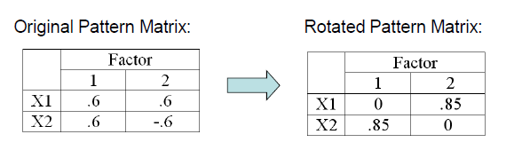
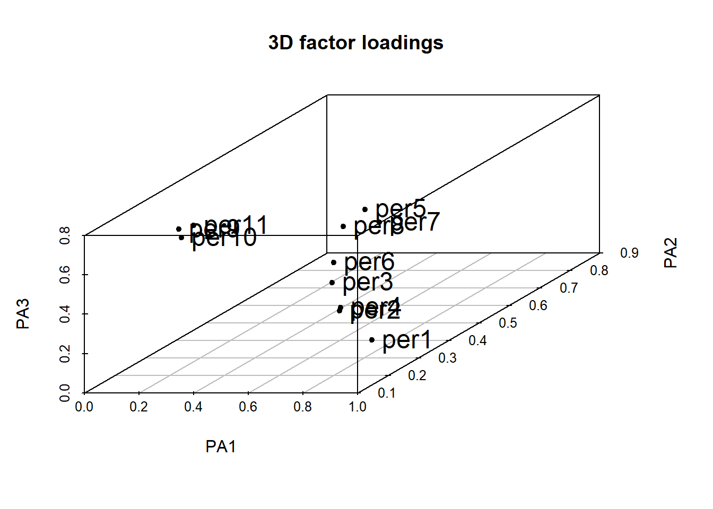
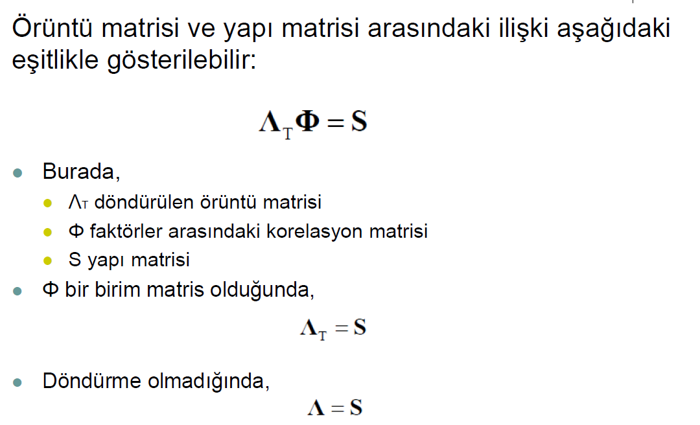

# AFA

-   Bazı durumlarda, özellikle de ölçme araçları yeni geliştirildiyse:

    -   Araştırmacıların bir grup gözlenen/ölçülen değişkenin altında
        yatan faktör sayısı hakkında **güçlü varsayımları yoktur.**

    -   Araştırmacıların hangi grup **değişkenlerin birbirleriyle
        diğerlerine göre daha çok korelasyona** sahip olduğu hakkında
        güçlü varsayımları yoktur.

    -   Bazen araştırmacılar belli **değişkenlerin kuramsal yapıların
        iyi göstergeleri** olup olmadığı hakkında fikir sahibi
        olmayabilir.

-   Bu koşullarda **AFA gözlenen/ölçülen değişkenler arasındaki altta
    yatan yapının incelenmesi** için önemli bir araçtır. AFA’nın başlıca
    amaçları aşağıdaki gibidir:

    -   Gözlenen/ölçülen değişkenler arasındaki **korelasyonların
        örüntüsünü özetlemek.**

    -   Çok sayıdaki gözlenen/ölçülen değişkeni **daha az sayıdaki
        faktöre indirgemek.**

    -   Gözlenen/ölçülen değişkenleri kullanarak altta yatan yapının
        **operasyonel tanımını sağlamak.**

-   Varsayımsal bir veri olan **Heuristic** adlı veride 6 ölçülen
    değişken bulunmaktadır. Ancak bu ölçülen değişkenlerin altında yatan
    **yapı hakkında bir fikir yoktur.** Veri Thompson’ın (2004)
    kitabında sayfa 10’da verilmiş olup **6 ölçülen değişkene ilişkin 7
    öğrenci** tarafından sağlanan derecelendirmeleri içermektedir

    -   Bir faktör analizi yapıldığında, **ölçülen değişkenler
        arasındaki ilişkiler araştırılır** ve bu ilişkilerin **daha az
        sayıda gizil yapıda özetlenip özetlenemeyeceği** belirlenmeye
        çalışılır. Değişkenler arasındaki **ilişkileri özetlemek için
        birkaç farklı istatistik kullanılabilir** (örneğin, Pearson
        momentler-çarpımı korelasyon katsayıları, Spearman'ın rho
        katsayıları, tetrakorik korelasyon katsayısı).


```r
df %>% kable(align = "c")
```


| id | handsome | beatiful | ugly | brillant | smart | dumb |
|:--:|:--------:|:--------:|:----:|:--------:|:-----:|:----:|
| 1  |    6     |    5     |  4   |    8     |   6   |  2   |
| 2  |    8     |    7     |  2   |    7     |   5   |  3   |
| 3  |    9     |    8     |  1   |    9     |   7   |  1   |
| 4  |    5     |    4     |  5   |    9     |   7   |  1   |
| 5  |    4     |    3     |  6   |    9     |   7   |  1   |
| 6  |    7     |    6     |  3   |    7     |   5   |  3   |
| 7  |    3     |    2     |  7   |    7     |   5   |  3   |

-   Verideki 6 değişken arasındaki Pearson korelasyon katsayıları
    matrisi aşağıdaki gibidir:


```r
cor(df[,-1])%>% kable(align = "c")
```


|         | handsome | beatiful | ugly | brillant | smart | dumb |
|:--------|:--------:|:--------:|:----:|:--------:|:-----:|:----:|
|handsome |    1     |    1     |  -1  |    0     |   0   |  0   |
|beatiful |    1     |    1     |  -1  |    0     |   0   |  0   |
|ugly     |    -1    |    -1    |  1   |    0     |   0   |  0   |
|brillant |    0     |    0     |  0   |    1     |   1   |  -1  |
|smart    |    0     |    0     |  0   |    1     |   1   |  -1  |
|dumb     |    0     |    0     |  0   |    -1    |  -1   |  1   |

-   Korelasyon matrisindeki örüntülere dayanarak aşağıdakiler
    söylenebilir:

    -   Bireyi tarif etmek için **Handsome**, **Beautiful** ve **Ugly**
        değişkenlerini kullanmak yerine bu üç ölçülen değişken **bir
        gizil değişken** (faktör analizinde gizil değişken faktör olarak
        adlandırılır) olarak özetlenebilir. Bu gizil değişken **physical
        attractiveness** olarak etiketlenebilir.

    -   Benzer şekilde, bireyi tarif etmek için **Brilliant**, **Smart**
        ve **Dumb** değişkenlerini kullanmak yerine bu üç ölçülen
        değişken **bir gizil** değişken kullanarak özetlenebilir. Bu
        gizil değişken **intellectual prowess** olarak etiketlenebilir.

-   **physical attractiveness** ve **intellectual prowess** arasında
    **korelasyon yoktur.**

-   6 değişken yerine bu **2 faktör** kullanılarak, 6 ölçülen değişken
    arasındaki **korelasyonun örüntüsü özetlenir.**

-   6 ölçülen değişken **2 gizil faktöre** indirgenir.

    -   Bu 3 değişkenlik **2 alt kümedeki korelasyonlar 1 veya -1**
        olduğundan, gözlenen/ölçülen korelasyon matrisindeki bilgiden
        **herhangi bir bilgi kaybedilmez.** Diğer bir ifadeyle, bu **iki
        faktör** kullanılarak **gözlenen/ölçülen korelasyon** matrisi
        mükemmel bir şekilde üretilebilir. **Ancak gerçek veride bu
        olmayacaktır.**

## Örüntü Katsayıları

-   Korelasyon matrisinin faktör analizi sonucunda elde edilen **karesi
    alınmamış faktör ağırlıkları** (**MR1** ve **MR2**), **karesi
    alınmış faktör ağırlıkları** aşağıdaki gibidir.


```r
library(psych)
fa1 <- round(fa(df[,-1],2)$loading[,1:2],2)
cbind(fa1,fa1^2)%>% kable(align = "c",
col.names = c("MR1","MR2", "MR1*MR1","MR2*MR2"))
```


|         | MR1 | MR2 | MR1*MR1 | MR2*MR2 |
|:--------|:---:|:---:|:-------:|:-------:|
|handsome |  1  |  0  |    1    |    0    |
|beatiful |  1  |  0  |    1    |    0    |
|ugly     | -1  |  0  |    1    |    0    |
|brillant |  0  |  1  |    0    |    1    |
|smart    |  0  |  1  |    0    |    1    |
|dumb     |  0  | -1  |    0    |    1    |

-   Faktör analizinde **örüntü katsayıları (pattern coefficients)**
    faktör analizindeki gizil değişkenler üzerinde puanlar (faktör
    puanları olarak adlandırılır) elde etmek için **ölçülen değişkenlere
    uygulanan ağırlıklardır.**

-   Bu ağırlıklar

    -   **çoklu regresyon** analizindeki $\beta$ ağırlıklarına,
    -   betimsel ayırma analizindeki standartlaştırılmış **ayırma
        fonksiyonu katsayılarına** benzerdir.

-   Faktör örüntü katsayıları ( $P_{VxF}$ ; V değişken sayısı, F faktör
    sayısı), kısmen, analiz edilen ve **faktörlerin çıkarıldığı
    korelasyon matrisinde temsil edilen varyansı yeniden ifade etmek
    için hesaplanır.**

-   Faktörler; **birinci faktör analiz edilen matristeki en fazla
    varyansı yeniden üretebilecek**, **ikinci faktör ikinci en fazla
    varyansı yeniden üretebilecek** ve bu şekilde devam edecek şekilde
    çıkarılır.

-   Bir veya daha fazla faktörün, analiz edilen matrisi yeniden üretme
    yeteneği, üretilen (reproduced) korelasyon matrisi ( $R_{VxV^+}$ )
    ile ölçülür. Üretilen korelasyon matrisi aşağıdaki şekilde
    hesaplanabilir:

    -   $P_{VxF}P_{VxF'}=R_{VxV^+}$

-   Faktörlerin analiz edilen korelasyon matrisini yeniden üretme
    yeteneği, belirli sayıda faktör çıkarıldıktan sonra kalan matrisin
    hesaplanmasıyla da ölçülebilir. Bu matris **artık korelasyon
    matrisi** $R_{VxV^-}$ olarak adlandırılır.

-   Faktör örüntü katsayıları, korelasyon matrisini mükemmel bir şekilde
    yeniden oluşturursa, $R_{VxV^-}$ matrisinin girdileri **tamamen
    sıfırlardan** oluşur ve bu **matriste hiçbir bilgi veya varyans**
    kalmadığını gösterir.

-   Faktör örüntü katsayıları korelasyon matrisini mükemmel şekilde
    yeniden oluşturursa, $R_{VxV^±}$ matrisindeki girdiler $R_{VxV}$
    matrisindeki girdilerle tam olarak eşleşir.

-   Regresyon analizinde, belirli bir analizde yalnızca tek bir eşitlik
    $\beta$ ağırlıkları seti vardır. Faktör analizinde ağırlık setlerine
    (örüntü katsayıları gibi) eşitlikler yerine **faktörler** denir.

-   Örnekteki değişkenler arası korelasyon matrisindeki her girdi **+1
    veya -1** olsaydı, her ölçülen değişken çifti arasındaki $r^2$
    değeri %100 olacaktı. Bu da derecelendirmelerin altında **tek bir
    faktörün yattığı** anlamına gelecekti.

-   Bu durumda sadece eksi veya artı örüntü katsayılarından $P_{6x1}$
    oluşan **bir faktör çıkarılacaktı.** Bu tek faktör, orijinal
    $P_{6x6}$ matrisini **mükemmel şekilde yeniden üretecekti.**

-   Teknik olarak, her biri sadece sıfır değerindeki örüntü
    katsayılarından oluşan, yani her birinin hiçbir bilgi içermediği ve
    **değişkenliğin yeniden üretilmediği beş ek faktör** olacaktı. Ancak
    bu tür faktörlerle ilgilenilmez.

-   Örnekteki değişkenler arasındaki korelasyon **sıfır** olsaydı,
    korelasyon matrisindeki **köşegen dışındaki her girdi 0 olacaktı,**
    her ölçülen değişken çifti arasındaki $r^2$ değeri **%0** olacaktı.
    Bu da bir faktör oluşturmak için **iki değişken
    birleştirilemeyeceği** (yani her ölçülen değişken kendi faktörünü
    tanımlayacağı) anlamına gelecekti. Dolayısıyla **6 faktör**
    olacaktı.

-   Her faktör bir **+1 değerinde örüntü katsayısına** sahip olacaktı ve
    geri kalan **beş girdi sıfır olacaktı**. Bu altı faktör, orijinal
    $P_{6x6}$ matrisini mükemmel şekilde yeniden üretecekti.

    -   Aslında, tüm olası faktörler çıkarıldığında (yani faktörlerin
        sayısı ölçülen değişkenlerin sayısına eşit olduğunda), örüntü
        katsayıları analiz edilen orijinal korelasyon matrisini mükemmel
        bir şekilde yeniden üretecekti.

## Yapı Katsayıları

-   Faktör analizinde, **örüntü katsayıları** faktör puanlarını elde
    etmek için ölçülen değişkenlere uygulanırlar. Bu katsayılar **kimi
    zaman korelasyon katsayılarıdır**, kimi zaman değildir.

-   Ölçülen değişkenler ve faktör puanları arasındaki iki değişkenli
    korelasyon katsayıları hesaplanabilir. Bu korelasyon katsayıları
    **yapı katsayıları** olarak adlandırılır. Faktör analizinde,
    **örüntü katsayılarının** yanı sıra **yapı katsayıları** (structure
    coefficients) da önemlidir.

-   Yapı katsayıları aşağıdaki şekilde hesaplanabilir.

    -   $P_{VxF}R_{FxF}=S_{VxF}$

-   Burada,

-   $R_{FxF}$ faktörler arasındaki korelasyon matrisidir.

-   **Faktörler arasındaki korelasyon sıfır** olduğunda (yani faktörler
    tamamen ilişkisiz olduğunda), faktörler arasındaki korelasyon
    matrisi birim matrise eşit olacağından ( $R_{FxF}=I_{FxF}$ ),
    **örüntü katsayıları matrisi** de **yapı katsayıları matrisine**
    eşit olacaktır ( $P_{VxF}=S_{VxF}$ ).

-   Faktörler ilk çıkarıldığında, faktörler her zaman tamamen
    ilişkisizdir.

## Ortak Varyans Katsayıları

-   Örnekte çıkarılan faktörler tamamen ilişkisiz olduğundan, **karesi
    alınmamış katsayılar örüntü/yapı katsayılarıdır.** Dolayısıyla bu
    katsayıların değeri **-1,0 ve +1,0** aralığındadır. Ancak bu
    değerler **oran ölçeğinde değildir.**

    -   Örneğin, $r=1$ değeri $r=0.5$ değerinin iki katı büyük değildir.
        Bu değerlerin karesi alınırsa, oransal olarak karşılaştırmalar
        yapılabilir. Örneğin, $r=1$ değeri, $r=0.5$ değerinin dört katı
        büyüktür. Çünkü 1,0 değerinin karesi olan $r^2=1$ değeri, 0.5
        değerinin karesi olan $r^2=0.25$ değerinin dört katıdır.

-   Örnekteki **örüntü/yapı katsayılar korelasyon katsayıları**
    olduğundan, bu katsayıları karşılaştırabilmek için **karelerinin**
    alınması gerekmektedir.

-   Aralarında ilişki **bulunmayan faktörler için örüntü/yapı
    katsayılarının kareleri alınarak,** katsayıların karesi satır
    boyunca toplanırsa, elde edilen katsayı **ortak varyans**
    (communality) olarak adlandırılır ve $h^2$ ile gösterilir.

-   Örneğin, "Handsome" değişkeni için ortak varyans değeri,
    $(1.0)^2 + (0)^2 = 1.0$


```r
fa(df[,-1],2,n.obs=7) %>% target.rot()
```

```
## 
## Call: NULL
## Standardized loadings (pattern matrix) based upon correlation matrix
##          MR1 MR2 h2     u2
## handsome   1   0  1 0.0017
## beatiful   1   0  1 0.0017
## ugly      -1   0  1 0.0017
## brillant   0   1  1 0.0017
## smart      0   1  1 0.0017
## dumb       0  -1  1 0.0017
## 
##                        MR1  MR2
## SS loadings           2.99 2.99
## Proportion Var        0.50 0.50
## Cumulative Var        0.50 1.00
## Proportion Explained  0.50 0.50
## Cumulative Proportion 0.50 1.00
##     MR1 MR2
## MR1   1   0
## MR2   0   1
```

-   Faktörler arasında **ilişki bulunmadığından**, her ölçülen
    değişkenin **bir faktör ile paylaştığı varyans kendine özgüdür.**

-   Dolayısıyla **ortak varyans** faktörlerin ölçülen bir değişkendeki
    **varyansın ne kadarını üretebileceğini** belirtir.

    -   Ölçülen bir değişken **%0'a** yakın bir ortak varyans
        katsayısına sahipse, bu, **bu değişkenin faktörler içinde temsil
        edilmediği** anlamına gelir. Araştırmacı, değişkenin faktörlerde
        temsil edilmesini istiyorsa, ek faktörlerin çıkarılması
        gerekebilir.

-   Ortak varyans **ölçülen bir değişken için**, belirli **bir ölçülen
    değişkenin varyansının ne kadarının faktörleri bir küme olarak**
    tanımlamada yararlı olduğunu yansıtır.

-   Bir değişken için **ortak varyans katsayısı**, değişken üzerindeki
    puanların güvenilirliğinin **alt sınır** tahminidir.

    -   Örneğin, bir değişkenin **% 50'lik** bir ortak varyansa sahip
        olması, değişken üzerindeki **puanların güvenilirliğinin 0.5'ten
        düşük olmadığına** işaret etmektedir.

## Özdeğerler

-   Aralarında ilişki bulunmayan faktörler için **örüntü/yapı
    katsayılarının kareleri alınarak**, **katsayıların karesi sütun
    boyunca toplanırsa**, elde edilen katsayı **özdeğer** (eigenvalue)
    olarak adlandırılır.

-   **Özdeğerler karakteristik kökler** olarak da bilinmektedir.

-   Örneğin, birinci faktör ve ikinci faktör için özdeğerler 3 ve 3’dır.


```r
 rbind(fa1*fa1, toplam= colSums(fa1*fa1)) %>% kable()
```


|         | MR1| MR2|
|:--------|---:|---:|
|handsome |   1|   0|
|beatiful |   1|   0|
|ugly     |   1|   0|
|brillant |   0|   1|
|smart    |   0|   1|
|dumb     |   0|   1|
|toplam   |   3|   3|

-   Aşağıdaki dört ifade, bir AFA'daki özdeğerler için geçerlidir:

    -   **Özdeğerlerin sayısı**, ölçülen değişkenlerin sayısına eşittir.

    -   **Özdeğerlerin toplamı**, ölçülen değişkenlerin sayısına
        eşittir.

    -   Ölçülen **değişkenlerin sayısına bölünen bir özdeğer**,
        **belirli bir faktörün analiz edilen korelasyon matrisindeki
        yeniden ürettiği bilgi oranını gösterir.**

    -   Çıkarılan faktörlerin özdeğerlerinin toplamının ölçülen
        değişkenlerin sayısına bölünmesi, **faktörlerin bir küme olarak
        analiz edilen korelasyon matrisindeki yeniden ürettiği
        bilgilerin oranını gösterir.**

-   Örnekte, **ölçülen değişkenlerin sayısı altıdır.** Bu nedenle,
    korelasyon matrisi ile **ilişkili altı özdeğer** vardır.

-   Örnekteki özdeğerlerin toplamı 6 olduğundan, **ilk iki özdeğerin 3
    ve 3 olduğu** göz önüne alındığında, kalan özdeğerlerin 0,0, 0.0,
    0.0 ve 0.0 olması gerekir.

-   $3/6= 0.5$'e eşit olduğu için, ilk özdeğer, Faktör I’in korelasyon
    matrisinde yer alan bilgilerin 0.5'ini (veya %50'sini) **yeniden
    ürettiğini gösterir.**

-   DFA’da olduğu gibi AFA’da da ortak faktör modeli (common factor
    model) temeldir: Her bir değişken faktör puanlarının ve bir hata
    puanının bir fonksiyonudur. $X=\Lambda\xi +\delta$

-   Örnekte AFA modeli aşağıdaki gibidir: $$\begin{bmatrix}{}
    X_{1 handsome}\\
    X_{2 betutiful}\\
    X_{3 ugly}\\
    X_{4 brillant}\\
    X_{5 smart}\\
    X_{6 dumb}\\
    \end{bmatrix} = \begin{bmatrix}{}
    \lambda_{11} & \lambda_{12} \\
    \lambda_{21} & \lambda_{22} \\
    \lambda_{31} & \lambda_{32} \\
    \lambda_{41} & \lambda_{42} \\
    \lambda_{51} & \lambda_{52} \\
    \lambda_{61} & \lambda_{62} \\
    \end{bmatrix}
    \begin{bmatrix}{}
    \xi_{1_{physical}}\\
    \xi_{1_{intellectual}}\\
    \end{bmatrix} + \begin{bmatrix}{}
    \delta_{1}\\
    \delta_{2}\\
    \delta_{3}\\
    \delta_{4}\\
    \delta_{5}\\
    \delta_{6}\\
    \end{bmatrix}$$

$X$ : gözlenen değişken matrisi ( $Vx1$ )\
$\Lambda$ : yapısal katsayı matrisi ( $VxF$ )\
$\xi$ : örtük değişken vektorü

$\delta$ : ölçme hatası

## AFA Modeli

-   AFA’da genellikle korelasyon matrisi analiz edildiğinden, AFA modeli
    matris formunda aşağıdaki gibi temsil edilebilir:

    -   $R= \Lambda\Phi\Lambda' + R_{res}$

    -   Faktörler ilk olarak dik olacak şekilde çıkarılacakları için,
        $\Phi$ bir birim matristir. Bu AFA modeli daha basit bir forma
        indirgenir: $R= \Lambda\Lambda' + R_{res}$

-   Asıl fikir **üretilen korelasyon matrisinin** $Ȓ$ **gözlenen
    korelasyon matrisine** $R$ mümkün olduğunca yakın olmasını
    sağlayacak faktör yükleri matrisini $\Lambda$ bulmaktır.

-   Sonuç olarak $R_{res}$ mümkün olduğunca küçük olacaktır.

$$\begin{bmatrix}{}
\lambda_{11} & \lambda_{12} \\
\lambda_{21} & \lambda_{22} \\
\lambda_{31} & \lambda_{32} \\
\lambda_{41} & \lambda_{42} \\
\lambda_{51} & \lambda_{52} \\
\lambda_{61} & \lambda_{52} \\
\end{bmatrix}\begin{bmatrix}{}
\lambda_{11} & \lambda_{12} & \lambda_{13} & \lambda_{14} & \lambda_{15} & \lambda_{16}\\
\lambda_{21} & \lambda_{22} & \lambda_{23} & \lambda_{24} & \lambda_{25} & \lambda_{26}\\
\end{bmatrix} + \begin{bmatrix}{}
\Psi_{11}\\
\Psi_{11} & \Psi_{21}\\
\Psi_{11} & \Psi_{21} & \Psi_{31}\\
\Psi_{11} & \Psi_{21} & \Psi_{31} & \Psi_{41}\\
\Psi_{11} & \Psi_{21} & \Psi_{31} & \Psi_{41} & \Psi_{51}\\
\Psi_{11} & \Psi_{21} & \Psi_{31} & \Psi_{41} & \Psi_{51} & \Psi_{61}\\
\end{bmatrix}$$

$$\begin{bmatrix}{}
\lambda^2_{11} + \lambda^2_{12} \\
\lambda_{21}\lambda_{11}  + \lambda_{22}\lambda_{12} & \lambda^2_{21}+ \lambda^2_{22}\\
\lambda_{31}\lambda_{11}  + \lambda_{32}\lambda_{12} &\lambda_{31}\lambda_{21}  + \lambda_{32}\lambda_{22}& \lambda^2_{31}+ \lambda^2_{32}\\
\lambda_{41}\lambda_{11}  + \lambda_{42}\lambda_{12} &\lambda_{41}\lambda_{21}  + \lambda_{42}\lambda_{22}  &  \lambda_{41}\lambda_{31}+\lambda_{42}\lambda_{32}  & \lambda^2_{41}+ \lambda^2_{42}\\
\lambda_{51}\lambda_{11}  + \lambda_{52}\lambda_{12} &\lambda_{51}\lambda_{21}  + \lambda_{52}\lambda_{22}  &  \lambda_{51}\lambda_{31}+\lambda_{52}\lambda_{32}  & \lambda_{51}\lambda_{41}+\lambda_{52}\lambda_{42}& \lambda^2_{51}+ \lambda^2_{52}\\
\lambda_{61}\lambda_{11}  + \lambda_{62}\lambda_{12} &\lambda_{61}\lambda_{21}  + \lambda_{62}\lambda_{22}  &  \lambda_{61}\lambda_{31}+\lambda_{62}\lambda_{32}  & \lambda_{61}\lambda_{41}+\lambda_{61}\lambda_{42} &
\lambda_{61}\lambda_{51}+\lambda_{62}\lambda_{52} & \lambda^2_{61}+ \lambda^2_{62}\\
\end{bmatrix} + \begin{bmatrix}{}
\Psi_{11}\\
\Psi_{11} & \Psi_{21}\\
\Psi_{11} & \Psi_{21} & \Psi_{31}\\
\Psi_{11} & \Psi_{21} & \Psi_{31} & \Psi_{41}\\
\Psi_{11} & \Psi_{21} & \Psi_{31} & \Psi_{41} & \Psi_{51}\\
\Psi_{11} & \Psi_{21} & \Psi_{31} & \Psi_{41} & \Psi_{51} & \Psi_{61}\\
\end{bmatrix}$$

## AFA’da Örneklem Büyüklüğü

-   Örneklem büyüklüğü, AFA'da yapılanlar da dahil olmak üzere tüm
    istatistiksel **tahminlerin kesinliğini** etkiler.

-   Çeşitli araştırmacılar, birey sayısının ölçülen değişkenlerin
    sayısına oranının bir fonksiyonu olan minimum örneklem büyüklüğü
    için kurallar önermiştir. Önerilen oranlar genellikle

    -   ölçülen değişken başına 10 ila 20 birey arasındadır.

    -   Gorsuch (1983), mutlak minimum oranın her değişken başına beş
        birey olmasını, ancak herhangi bir analiz için örneklem
        büyüklüğünün 100 bireyden az olmamasını önermiştir.

-   Bazı Monte Carlo simülasyon araştırmaları şunları önermektedir
    (Guadagnoli & Velicer, 1988):

    1.  Faktörlerin her biri, örneklem büyüklüğüne bakılmaksızın,
        **\|0.6\|’dan** büyük yapı katsayılarına **sahip dört veya daha
        fazla ölçülen değişken** tarafından tanımlanır.

    2.  Faktörlerin her biri, örneklem büyüklüğü 150'den büyükse,
        **\|0.4\|**’dan civarında yapı katsayılarına sahip **10 veya
        daha fazla ölçülen değişken** tanımlanır.

    3.  Örneklem büyüklüğü **en az 300** olmalıdır.

-   MacCallum, Widaman, Zhang ve Hong (1999), **ortak varyansların tümü,
    .60 veya daha büyükse**, örneklem büyüklüğü 60 kadar düşük olsa
    bile, **örüntü katsayılarının doğru şekilde yeniden** üretildiğini
    bulmuştur.

-   Ortak varyans değerleri **0.50** civarındaysa, 100 ila 200 arasında
    örneklem büyüklüğü gereklidir.

## Örnek Veri

-   Veri Amerika Birleşik Devletleri ve Kanada'daki üniversite
    kütüphanelerinde hizmet kalitesine ilişkin kullanıcı algıları
    çalışmasından (Cook & Thompson, 2001; Thompson, Cook, & Heath, 2001;
    Thompson, Cook, & Thompson, 2002) rastgele örneklenmiştir.

-   Veri Thompson’ın (2004) kitabında Appendix A’da verilmiş olup 12
    (gözlenen/ölçülen) değişkene ilişkin 100 lisansüstü öğrenci ve 100
    akademik personel tarafından sağlanan derecelendirmeleri
    içermektedir.

-   Örnek veri 🔗[EFA.sav](import/EFA.sav)için ilgili
    veriden ilk 11 değişkene ilişkin 100 lisansüstü öğrenci tarafından
    sağlanan derecelendirmeler alınmıştır. Örnek veride ele alınan 11
    gözlenen/ölçülen değişken aşağıdaki gibidir:


## İlişki Katsayıları Matrisi

-   Değişkenler için **toplanan puanlar**, değişkenler arasındaki iki
    değişkenli ilişkiler matrisini hesaplamak için kullanılır. AFA’da
    analiz edilen bu ilişkiler matrisidir.

-   Bir veri seti için ilişki matrisi verildiğinde (örneğin, $R_{11x11}$
    ), faktör analizinin tüm adımları (faktör puanlarının hesaplanması
    hariç), orijinal verilere (örneğin, $X_{100x11}$ erişim olmadan bile
    gerçekleştirilebilir.

-   Pearson momentler-çarpımı iki değişkenli korelasyon matrisi AFA’da
    en çok kullanılan ilişkiler matrisidir.

    -   Çoğu istatistiksel pakette, AFA'da varsayılan (kullanıcı
        varsayılan seçimi değiştirmedikçe) ilişkilendirme matrisi
        Pearson korelasyon matrisidir. Ancak başka seçenekler de vardır.

-   İlişkileri karakterize eden farklı istatistikler, verilerin farklı
    yönlerine duyarlıdır. Farklı ilişki istatistikleri, verilerin
    altında **farklı ölçek düzeylerinin yattığını** varsayar.

-   Örneğin, **Pearson r**, verilerin **eşit aralıklı** olarak
    ölçeklenmesini gerektirir. Diğer yandan **Spearman's rho**, yalnızca
    verilerin **en azından sıralı** olarak ölçeklendiğini varsayar.

-   **Spearman’s rho**, aralık verileri bağları olmayan sıralamalara
    dönüştürüldüğünde, iki değişken arasındaki **Pearson r**'dir.

-   Aslında ister sıralı ister aralık verileriyle hesaplanmış olsun,
    Spearman’s rho şu soruya yanıt verir: **İki değişken, bireyleri tam
    olarak aynı sırada mı sıralıyor?** Pearson r bu soruyu da
    değerlendirir ancak sıralı puanlar arasındaki mesafeleri de hesaba
    katar.

-   Spearman’s rho, verilerde böyle bir bilginin bulunmadığını varsayar
    (veya bu bilgiyi göz ardı eder), bu nedenle her iki değişken de
    sıralı olarak ölçeklendiğinde **rho** kullanılabilir.

-   ikili puanlana veriler için ise korelasyon matrisinin **tetrakorik
    korelasyonlardan** elde edilmesi gerekmektedir.

-   Bu iki ilişki matrisi, **kovaryans matrisi** de olabilir. Birçok
    bağlamda kovaryans, ilişkiyi veya ilişkiyi tanımlamak için değil,
    korelasyon katsayısının elde edilmesinde **bir ara hesaplama
    olarak** kullanılır.

-   Kovaryans nadiren kullanılır, çünkü korelasyondan farklı olarak
    **kovaryans, kesin bir olası değerler aralığına sahip değildir.**

-   Kovaryans, iki değişkenin üç yönünden ortaklaşa etkilenir:

    -   iki değişken arasındaki **korelasyon**,
    -   birinci değişkenin **değişkenliği** ve
    -   ikinci değişkenin **değişkenliği**.

-   Bu nedenle, açımlayıcı faktörler bir kovaryans matrisinden
    çıkarıldığında, bazı faktörler korelasyonların bir işlevi
    olabilirken, diğerleri daha çok puan yayılmasının bir işlevi
    olabilir.

-   Bazen faktörlerimizin puanların bir dizi yönüne duyarlı olmasını
    isteriz. Ancak diğer zamanlarda, tüm faktörlerin verilerimizin
    yalnızca tek bir yönüne duyarlı olmasını tercih edebiliriz.

-   AFA’da analiz edilen **ilişkiler matrisidir.** Örnek veri için
    $R_{11 x 11}$ korelasyon matrisi aşağıdaki gibidir


```r
library(haven)
EFA <- read_sav("import/EFA.sav")
matris <- round(cor(EFA[,-c(1,13)]),2)
matris[upper.tri(matris)] <- NA
matris
```

```
      per1 per2 per3 per4 per5 per6 per7 per8 per9 per10 per11
per1  1.00   NA   NA   NA   NA   NA   NA   NA   NA    NA    NA
per2  0.85 1.00   NA   NA   NA   NA   NA   NA   NA    NA    NA
per3  0.79 0.72 1.00   NA   NA   NA   NA   NA   NA    NA    NA
per4  0.78 0.70 0.69 1.00   NA   NA   NA   NA   NA    NA    NA
per5  0.40 0.45 0.51 0.48 1.00   NA   NA   NA   NA    NA    NA
per6  0.33 0.32 0.40 0.40 0.66 1.00   NA   NA   NA    NA    NA
per7  0.48 0.50 0.50 0.52 0.80 0.71 1.00   NA   NA    NA    NA
per8  0.42 0.45 0.49 0.43 0.78 0.63 0.71 1.00   NA    NA    NA
per9  0.44 0.46 0.54 0.50 0.39 0.23 0.40 0.39 1.00    NA    NA
per10 0.38 0.41 0.45 0.35 0.41 0.30 0.42 0.39 0.63  1.00    NA
per11 0.43 0.49 0.55 0.42 0.46 0.25 0.42 0.44 0.68  0.59     1
```

## KMO

-   AFA'da bir grup ölçülen değişkenden ortak faktör çıkarılması
    hedeflenmektedir. Bu nedenle değişkenler bazı ortak şeyler
    paylaşmalıdır. Eğer bu **11 değişkenin altında yatan hiçbir ortak
    faktör yoksa evren korelasyon matrisi 11x11 boyutunda bir birim**
    matris olacaktır

$$\begin{bmatrix}{}
1 & 0 & 0 & 0 & 0 & 0 & 0 & 0 & 0 & 0 & 0\\
0 & 1 & 0 & 0 & 0 & 0 & 0 & 0 & 0 & 0 & 0\\
0 & 0 & 1 & 0 & 0 & 0 & 0 & 0 & 0 & 0 & 0\\
0 & 0 & 0 & 1 & 0 & 0 & 0 & 0 & 0 & 0 & 0\\
0 & 0 & 0 & 0 & 1 & 0 & 0 & 0 & 0 & 0 & 0 \\
0 & 0 & 0 & 0 & 0 & 1 & 0 & 0 & 0 & 0 & 0\\
0 & 0 & 0 & 0 & 0 & 0 & 1 & 0 & 0 & 0 & 0\\
0 & 0 & 0 & 0 & 0 & 0 & 0 & 1 & 0 & 0 & 0\\
0 & 0 & 0 & 0 & 0 & 0 & 0 & 0 & 1 & 0 & 0\\
0 & 0 & 0 & 0 & 0 & 0 & 0 & 0 & 0 & 1 & 0\\
0 & 0 & 0 & 0 & 0 & 0 & 0 & 0 & 0 & 0 & 1\\
\end{bmatrix}$$

-   Bütün **değişkenler birbirinden bağımsız olduğunda**, veri indirgeme
    başarılamaz.

-   Kaiser-Meyer-Olkin measure of sampling adequacy (KMO) **değişkenler
    arasındaki örtüşmenin derecesini** inceler. Daha çok değişken ortak
    şeyler paylaşırsa, KMO değeri daha büyük olacaktır. Bu nedenle **KMO
    değerinin büyük olması** beklenir.


```r
library(psych)
veri <- EFA[ ,-c(1,13)]
KMO(veri)
```

```
## Kaiser-Meyer-Olkin factor adequacy
## Call: KMO(r = veri)
## Overall MSA =  0.88
## MSA for each item = 
##  per1  per2  per3  per4  per5  per6  per7  per8  per9 per10 per11 
##  0.79  0.89  0.91  0.91  0.85  0.89  0.88  0.91  0.86  0.91  0.89
```

-   KMO değeri istatistiksel bir testle birlikte gelmez. Yeterliliğin
    değerlendirilmesi biraz kişiseldir.

-   Araştırmacılar **KMO değerinin ideal olarak 0,6’dan büyük olması**
    gerektiğini önerirler. Örneğe **0,6 kuralı uygulanırsa, korelasyon
    matrisinin evrendeki bir birim matrisinden farklı olduğu**
    söylenebilir.

-   **KMO()** fonksiyonunun çıktısı incelendiğinde, **hem tüm veri**
    için (Overall MSA) **hem de her bir madde** için (MSA for each item)
    KMO değeri görülmektedir.

-   Çalışmalarda genellikle sadece tüm veri için elde edilen KMO değeri
    raporlanır. Madde bazında KMO değeri ise **belirli bir maddenin
    testin tamamından** farklı olup olmadığına ilişkin bilgi verebilir.


```r
KMO(veri)
```

```
## Kaiser-Meyer-Olkin factor adequacy
## Call: KMO(r = veri)
## Overall MSA =  0.88
## MSA for each item = 
##  per1  per2  per3  per4  per5  per6  per7  per8  per9 per10 per11 
##  0.79  0.89  0.91  0.91  0.85  0.89  0.88  0.91  0.86  0.91  0.89
```

Veri seti iki kategorik ise **KMO** aşağıdali şekilde hesaplanabilir.


```r
kor_mat <- tetrachoric(veri)$rho
KMO(kor_mat)
```

## Bartlett’in Testi

-   Korelasyon matrisinin **bir birim matrisi** (sıfır hipotezi) olup
    olmadığını test etmenin bir diğer yolu “Bartlett’s Test of
    Sphericity” olarak adlandırılır. Yaklaşık olarak bir ki-kare
    dağılımını izleyen istatistiksel bir testle birlikte gelir. Sıfır
    hipotezinin reddedilmesi beklenir.


```r
bartlett.test(EFA)
```

```
## 
## 	Bartlett test of homogeneity of variances
## 
## data:  EFA
## Bartlett's K-squared = 3497, df = 12, p-value <2e-16
```

Burada **sıfır hipotezi reddedilir.** AFA analizi devam edebilir.

## Çıkarılacak Faktörlerin Sayısı

-   AFA'da kritik kararlardan biri, kaç faktörün çıkarılacağını
    belirlemektir. Bu kararı vermek için çok sayıda yaklaşım vardır. Bu
    yaklaşımlardan bazıları şunlardır:

    -   İstatistiksel anlamlılık testleri
    -   Özdeğerin 1,0’dan büyük olması kuralı
    -   Yamaç birikinti grafiği (scree plot)
    -   Artık korelasyon matrisinin incelenmesi
    -   Paralel analiz

-   Genel olarak, bu kararı almak için farklı yaklaşımların birbirini
    destekleyeceği umuduyla birkaç yaklaşım kullanılmalıdır.

**İstatistiksel Anlamlılık Testleri**

-   Bartlett'e (1950) bağlı istatistiksel anlamlılık testleri,
    korelasyon matrisinin bir birim matrisi olup olmadığını test etmek
    için kullanılabilir.

-   Korelasyon matrisinin bir birim matrisi olduğuna ilişkin **sıfır
    hipotezi reddedilemezse, faktörler matristen makul bir şekilde
    çıkarılamaz.**

-   Bu uygulamadaki sorun, tüm istatistiksel anlamlılık testlerinde
    karşılaşılan genel sorundur. İstatistiksel anlamlılık, büyük ölçüde
    **örneklem büyüklüğüne bağlıdır**. Araştırmacılar genellikle AFA'yı
    yalnızca makul ölçüde büyük örneklemlerle kullandıklarından,
    **önemsiz korelasyonlar veya faktörler bile istatistiksel olarak**
    önemli olarak değerlendirilecektir. Bu nedenle, bu yaklaşım çok
    kullanışlı değildir.

**Özdeğerin 1,0’dan Büyük Olması Kuralı**

-   Guttman (1954), kayda değer faktörlerin **özdeğerlerinin 1,0'dan
    büyük olması** gerektiğini düşünmüştür.

-   Bazen bu mantık Kaiser'e atfedilir ve **K1** kuralı olarak
    adlandırılır.

-   Faktörler, tanım gereği, gözlenen değişkenlerin toplamları olarak
    oluşturulan gizli yapılardır ve bu nedenle birden fazla gözlenen
    değişkenden oluşmalıdır.

-   Bir faktör tek bir gözlenen değişkenden oluşuyorsa, gözlenen
    değişkenin örüntü/yapı katsayısı **1,0 (veya -1,0)** olsa ve bu
    faktördeki diğer tüm değişkenler **0** örüntü/yapı katsayılarına
    sahip olsa, faktörün özdeğeri **1,0** olacaktır.

-   Dolayısıyla kayda değer faktörlerin (gözlenen değişkenlerin
    toplamlarını temsil eden yapıların) **öz değerlerinin** 1,0'dan\*\*
    büyük olması beklenmektedir.\*\*

-   Özdeğerler, tüm örnek istatistikler gibi, bazı örnekleme hatalarına
    sahiptir. Bu nedenle bir araştırmacı kuram ve önceki ilgili AFA
    araştırmalarına dayanarak, **özdeğeri ,999 veya ,950 olan bir
    faktörü çıkarabilir** veya **özdeğeri 1,005 veya 1,100 olan bir
    faktörü tutmayabilir.**

-   Bu kural çoğu istatistiksel paketteki faktörlerin sayısını
    belirlemek için varsayılan karar verme stratejisidir.


```r
 fa(veri)$e.values
 sum(fa(veri)$e.values)
```

```
##  [1] 6.078 1.521 1.154 0.456 0.400 0.333 0.301 0.254 0.236 0.168 0.099
## [1] 11
```

-   korelasyon matrisi için özdeğerleri rapor eder. Büyükten küçüğe
    sıralanan 11 özdeğer vardır.

-   Bu özdeğerlerin toplamı 11’e (ölçülen değişkenlerin sayısına)
    eşittir.

$6.078 + 1.521 + 1.154 + … + 0.168 + 0.099 = 11$

-   İlk üç özdeğer 1’den büyüktür: 6,078, 1,521 ve 1,154.

-   **K1** kuralına göre **AFA’dan 3 faktör** çıkarılacaktır

-   3 faktör çıkarma işlemi


```r
out <- fa(veri, nfactors = 3,fm="pa",rotate="none")
out
```

```
## Factor Analysis using method =  pa
## Call: fa(r = veri, nfactors = 3, rotate = "none", fm = "pa")
## Standardized loadings (pattern matrix) based upon correlation matrix
##        PA1   PA2   PA3   h2    u2 com
## per1  0.80 -0.45 -0.38 0.99 0.012 2.0
## per2  0.78 -0.32 -0.21 0.75 0.252 1.5
## per3  0.80 -0.25 -0.09 0.71 0.292 1.2
## per4  0.75 -0.23 -0.21 0.67 0.335 1.4
## per5  0.77  0.47 -0.01 0.82 0.179 1.7
## per6  0.61  0.47 -0.14 0.61 0.388 2.0
## per7  0.78  0.42 -0.08 0.80 0.204 1.6
## per8  0.73  0.40 -0.01 0.68 0.315 1.5
## per9  0.67 -0.22  0.48 0.72 0.280 2.1
## per10 0.60 -0.07  0.41 0.53 0.465 1.8
## per11 0.67 -0.14  0.44 0.67 0.334 1.8
## 
##                        PA1  PA2  PA3
## SS loadings           5.81 1.27 0.86
## Proportion Var        0.53 0.12 0.08
## Cumulative Var        0.53 0.64 0.72
## Proportion Explained  0.73 0.16 0.11
## Cumulative Proportion 0.73 0.89 1.00
## 
## Mean item complexity =  1.7
## Test of the hypothesis that 3 factors are sufficient.
## 
## df null model =  55  with the objective function =  8.55 with Chi Square =  808
## df of  the model are 25  and the objective function was  0.23 
## 
## The root mean square of the residuals (RMSR) is  0.02 
## The df corrected root mean square of the residuals is  0.03 
## 
## The harmonic n.obs is  100 with the empirical chi square  3.49  with prob <  1 
## The total n.obs was  100  with Likelihood Chi Square =  21.6  with prob <  0.66 
## 
## Tucker Lewis Index of factoring reliability =  1.01
## RMSEA index =  0  and the 90 % confidence intervals are  0 0.067
## BIC =  -93.5
## Fit based upon off diagonal values = 1
## Measures of factor score adequacy             
##                                                    PA1  PA2  PA3
## Correlation of (regression) scores with factors   0.98 0.94 0.90
## Multiple R square of scores with factors          0.97 0.89 0.81
## Minimum correlation of possible factor scores     0.94 0.78 0.61
```

## psych fa()

+---------------+---------------+---------------------+
| ARGÜMAN       |  AÇIKLAMA     |   DEĞERLERİ         |
+---------------+---------------+---------------------+
| r             | Girdi veri    | Ham veri,           |
|               | matrisidir.   | korelasyon ya da    |
|               |               | kovaryans matrisi   |
|               |               | olabilir.           |
|               |               |                     |
+---------------+---------------+---------------------+
| nfactors      | Çıkarılacak   | Araştırmacı         |
|               | faktör        | tarafından          |
|               | sayısıdır.    | belirlenir.         |
+---------------+---------------+---------------------+
| n.obs         | Gözlem        |                     |
|               | sayısıdır. r  |                     |
|               | girdisi       |                     |
|               | korelasyon ya |                     |
|               | da kovaryans  |                     |
|               | matrisi       |                     |
|               | olduğu        |                     |
|               | durumlarda    |                     |
|               | verideki      |                     |
|               | gözlem sayısı |                     |
|               | bel           |                     |
|               | irtilmelidir. |                     |
+---------------+---------------+---------------------+
| rotate ,      | F             | "none" ,"varimax",  |
|               | aktörleştirme | "quartimax",      |
|               | yapılırken    | "bentlerT",         |
|               | kullanılacak  | "equamax",        |
|               | olan döndürme | "varimin",          |
|               | yöntemi       | geominT",         |
|               | tanımlanır    | "bifactor"          |
|               |               | "Promax",         |
|               |               | "promax",           |
|               |               | "oblimin",          |
|               |               | "simplimax",        |
|               |               | "bentlerQ,        |
|               |               | "geominQ" ,         |
|               |               | "biquartimin" ,   |
|               |               | "cluster"           |
+---------------+---------------+---------------------+
| scores        | Faktör        | "regression",       |
|               | puanlarının   | "Thurstone",        |
|               | hangi         | "tenBerge",         |
|               | yöntemle      | "Anderson" ,        |
|               | hesaplanacağı | "Bartlett"          |
|               | tanımlanır.   |                     |
+---------------+---------------+---------------------+

**Yamaç Birikinti Grafiği**

-   Cattell (1966), faktörlerin sayısını belirlemek için **grafiksel bir
    test önermiştir. C**attell yöntemini dağ döküntüsü (scree) kavramına
    dayandırmıştır. Dağ döküntüsü, dağların eteklerinde toplanan,
    dağlara sağlam bir şekilde bağlanmamış gevşek kaya ve kaya
    parçalarının döküntüsüdür.

-   Cattell büyük, sağlam, bozulmamış dağların; araştırmacıların
    tanıması ve tutması gereken sağlam, kayda değer faktörlere benzer
    olduğunu düşünmüştür. Bununla birlikte, önemsiz faktörler, dağ
    döküntüsü ile benzerdir ve önemsiz faktörlerin faktör çıkarma
    sürecinde geride bırakılması gerekir.

-   Bir **yamaç birikinti grafiğinde**, yatay eksende özdeğer veya
    faktör sayıları ile dikey eksende özdeğer büyüklüklerinin grafiği
    çizilir.

-   Özdeğerler grafikte işaretlenir ve ardışık değerler bir çizgiyle
    bağlanır. Faktör çıkarma, bir "dirsek" bulunan noktada veya grafiğin
    düzleştiği noktada durdurulmalıdır.

-   İstatistiksel anlam içermeyen bu görsel yaklaşıma bazen "kalem
    testi" denir, çünkü dirseğin veya düzleşmenin nerede oluştuğunu
    belirlemek için ilgili grafiğin en sağ kısmına bir kalem
    yerleştirilebilir.


-   Daha fazla faktör çıkarıldıkça, **artık korelasyon matrisindeki
    girdiler sıfıra yaklaşır.** Tüm olası faktörler çıkarılırsa, **artık
    matris her zaman yalnızca sıfırlardan oluşacaktır.**

-   Dolayısıyla, kayda değer faktörlerin sayısını belirlemeye yönelik
    diğer bir yaklaşım, ardışık faktörler çıkarılırken **artık matrisin
    incelenmesini** içerir.

-   Yazılımlar talep üzerine artık matrisi sağlar. Ve bazı paketler
    artık matrisin bir üçgeninde **\|0.05\|'den büyük olan girdilerin
    sayısını verir.**

**Artık Korelasyon Matrisinin İncelenmesi**


```r
(residuals <-round(out$residual,2))
```

```
##        per1  per2  per3  per4  per5  per6  per7  per8  per9 per10 per11
## per1   0.01  0.01  0.00  0.00 -0.01 -0.01  0.01  0.01 -0.01  0.02 -0.01
## per2   0.01  0.25  0.00 -0.01  0.01 -0.03  0.01  0.02 -0.03  0.00  0.02
## per3   0.00  0.00  0.29  0.01  0.01  0.02 -0.04  0.00 -0.01 -0.01  0.02
## per4   0.00 -0.01  0.01  0.33  0.00  0.02  0.01 -0.03  0.05 -0.03 -0.02
## per5  -0.01  0.01  0.01  0.00  0.18 -0.03  0.00  0.03 -0.01 -0.02  0.02
## per6  -0.01 -0.03  0.02  0.02 -0.03  0.39  0.03  0.00  0.00  0.02 -0.02
## per7   0.01  0.01 -0.04  0.01  0.00  0.03  0.20 -0.03  0.01  0.01 -0.01
## per8   0.01  0.02  0.00 -0.03  0.03  0.00 -0.03  0.32  0.00 -0.02  0.01
## per9  -0.01 -0.03 -0.01  0.05 -0.01  0.00  0.01  0.00  0.28  0.02 -0.01
## per10  0.02  0.00 -0.01 -0.03 -0.02  0.02  0.01 -0.02  0.02  0.47  0.00
## per11 -0.01  0.02  0.02 -0.02  0.02 -0.02 -0.01  0.01 -0.01  0.00  0.33
```


```r
sum(abs(residuals[lower.tri(residuals)])>0.05)
```

```
## [1] 0
```

-   İdeal olarak artıkların değeri mümkün olduğunca sıfıra yakın
    olmalıdır.

-   mutlak değeri ,05’ten büyük olan artıkların sayısını ve yüzdesini
    verir.

**Paralel Analiz**

-   Horn (1965), kaç faktörün çıkarılacağına karar vermek için **paralel
    analiz** adı verilen bir yaklaşım önermiştir.

-   Paralel analiz veriden çıkarılacak faktör sayısının belirlenmesinde
    kullanılan, Monte Carlo simülasyonuna dayalı bir yöntemdir.

-   Paralel analiz veride herhangi bir baskın faktör olmasa bile
    **örnekleme hatasının birden büyük öz değerlere neden olabileceği**
    bilgisini temel alır.

-   Veri ile aynı madde sayısı ve örneklem büyüklüğüne sahip rastgele
    matrislerden öz değerler elde edilir ve bu değerler veriden elde
    edilen değerlerle karşılaştırılır.

-   Faktör ya da bileşen sayısı, **rastgele örneklemlerden elde edilen
    öz değerlerden büyük olan öz değer sayısına** göre belirlenir
    (Franklin vd. 1995).


```r
library(nFactors) 
PA<-nScree( x=out$e.values, aparallel=NULL,cor=TRUE, model="factors", criteria=NULL) 
PA$Components
```

<div class="kable-table">

| noc| naf| nparallel| nkaiser|
|---:|---:|---------:|-------:|
|   3|   1|         3|       3|

</div>


```r
plotnScree(PA, legend=TRUE, ylab="Ozdegerler", main="Faktor Cozumu")
```


-   Paralel analizde, **gerçek verilerden ve rastgele sıralı verilerden
    ardışık çiftlerdeki özdeğerler karşılaştırılır.**

-   Belirli bir faktör için **gerçek verilerin özdeğeri, rastgele sıralı
    veriler için ilgili faktörün özdeğerini aştığında faktörler
    korunur.**

## Örüntü Katsayıları (Pattern Coefficients)

-   AFA modeli aşağıdaki gibidir.

$X=\Lambda\xi +\delta$

-   $\Lambda$ (lambda) matrisindeki katsayılara **örüntü
    katsayıları**adı verilir (DFA’daki faktör yüklerine ve çoklu
    regresyondaki eğim katsayılarına benzerler).

-   Örüntü katsayıları ölçülen değişkendeki puanları elde etmek için
    **faktöre uygulanan ağırlıklardır.**

-   Her bir faktörün **her bir ölçülen değişkendeki bireysel (unique)
    katkısını** temsil ederler.


```r
out <- fa(veri,3,fm="pa",rotate="none")
out$loadings[,1:3]
```

```
##         PA1     PA2      PA3
## per1  0.803 -0.4468 -0.37851
## per2  0.775 -0.3224 -0.20784
## per3  0.799 -0.2461 -0.09132
## per4  0.753 -0.2298 -0.21389
## per5  0.772  0.4739 -0.00517
## per6  0.607  0.4716 -0.14484
## per7  0.784  0.4178 -0.08044
## per8  0.727  0.3954 -0.00837
## per9  0.665 -0.2234  0.47732
## per10 0.601 -0.0727  0.40929
## per11 0.671 -0.1440  0.44205
```

-   Bu tablo çıkarılan 3 faktör için örüntü katsayılarını listeler.

-   Bu tabloya dayanarak her bir değişken için eşitlik yazılabilir:

$X=\Lambda\xi +\delta$

$per1= .80\xi_1 + (-0.45)\xi_2 + (-0.38)\xi_3 + \delta_1$
$per2= .78\xi_1 + (-0.32)\xi_2 + (-0.21)\xi_3 + \delta_2$ <br> ...\
.... .... <br> $per11= .67\xi_1 + (-0.14)\xi_2 + 0.44\xi_3 + \delta_3$

-   Faktörler birbirinden bağımsız olduğundan, örüntü katsayısının
    karesi, örneğin,

$\lambda^2_{11} = .80^2 = .64$ değeri PER1 değişkenindeki varyansın
yaklaşık **%64,6’**sının birinci faktör tarafından açıklandığını önerir.
Benzer şekilde,

$\lambda^2_{12} = -0.45^2 = .20$

$\lambda^2_{13} = -0.38^2 = .14$

değeri PER1 değişkenindeki varyansın yaklaşık **%20’inin**
ve**%14,4**’ünün ikinci ve üçüncü faktör tarafından açıklandığını
önerir. - Diğer örüntü katsayıları için de benzer açıklamalar yapılır.

## Ortak varyans Katsayıları (Communality Coefficients)

-   Örüntü katsayıları **ortak varyans katsayı** ile yakından ilgilidir.
    Ortak varyans katsayısı $h^2$ ile gösterilir.

-   Ortak varyans bir ölçülen değişkendeki varyansın ne kadarını **bir
    grup olarak faktörlerin üretebileceğini** belirtir.

-   Ortak varyans katsayısı DFA veya çoklu regresyondaki $R^2$ değerine
    benzer şekilde açıklanabilir.

-   Her bir gösterge için, ortak varyans katsayısı örüntü katsayılarının
    kareleri toplanarak hesaplanır.

-   Örneğin, PER1 değişkeni için:

$\lambda^2_{11} + \lambda^2_{12} +\lambda^2_{13} = .80^2 + (-0.45)^2 + (-0.38)^2 = .99$

-   Bu değer, toplamda PER1 değişkenindeki varyansın yaklaşık
    **%99**’unun çıkarılan **3 faktör tarafından açıklanacağını**
    önerir.

Her bir değişken için ortak varyans hesaplanabilir:Örneğin per 11 için

$\lambda^2_{11} + \lambda^2_{12} +\lambda^2_{13} = .67^2 + (-0.14)^2 + (-0.44)^2 = .67$


```r
  out
```

```
## Factor Analysis using method =  pa
## Call: fa(r = veri, nfactors = 3, rotate = "none", fm = "pa")
## Standardized loadings (pattern matrix) based upon correlation matrix
##        PA1   PA2   PA3   h2    u2 com
## per1  0.80 -0.45 -0.38 0.99 0.012 2.0
## per2  0.78 -0.32 -0.21 0.75 0.252 1.5
## per3  0.80 -0.25 -0.09 0.71 0.292 1.2
## per4  0.75 -0.23 -0.21 0.67 0.335 1.4
## per5  0.77  0.47 -0.01 0.82 0.179 1.7
## per6  0.61  0.47 -0.14 0.61 0.388 2.0
## per7  0.78  0.42 -0.08 0.80 0.204 1.6
## per8  0.73  0.40 -0.01 0.68 0.315 1.5
## per9  0.67 -0.22  0.48 0.72 0.280 2.1
## per10 0.60 -0.07  0.41 0.53 0.465 1.8
## per11 0.67 -0.14  0.44 0.67 0.334 1.8
## 
##                        PA1  PA2  PA3
## SS loadings           5.81 1.27 0.86
## Proportion Var        0.53 0.12 0.08
## Cumulative Var        0.53 0.64 0.72
## Proportion Explained  0.73 0.16 0.11
## Cumulative Proportion 0.73 0.89 1.00
## 
## Mean item complexity =  1.7
## Test of the hypothesis that 3 factors are sufficient.
## 
## df null model =  55  with the objective function =  8.55 with Chi Square =  808
## df of  the model are 25  and the objective function was  0.23 
## 
## The root mean square of the residuals (RMSR) is  0.02 
## The df corrected root mean square of the residuals is  0.03 
## 
## The harmonic n.obs is  100 with the empirical chi square  3.49  with prob <  1 
## The total n.obs was  100  with Likelihood Chi Square =  21.6  with prob <  0.66 
## 
## Tucker Lewis Index of factoring reliability =  1.01
## RMSEA index =  0  and the 90 % confidence intervals are  0 0.067
## BIC =  -93.5
## Fit based upon off diagonal values = 1
## Measures of factor score adequacy             
##                                                    PA1  PA2  PA3
## Correlation of (regression) scores with factors   0.98 0.94 0.90
## Multiple R square of scores with factors          0.97 0.89 0.81
## Minimum correlation of possible factor scores     0.94 0.78 0.61
```

-   Ortak varyans katsayısı **0 ile 1** arasında bir değer alır.

-   İyi bir AFA modelinde, **ortak varyans katsayılarının hepsinin
    oldukça yüksek** (1’e mümkün olduğunca yakın) olması beklenir.

-   Örneğin, PER1 için, varyansın yaklaşık **%99’u 3 faktör tarafından
    açıklanır.**

-   PER1 için, varyansın yaklaşık **%1’i 3 faktör tarafından
    açıklanmaz.**

-   %1 değeri PER1 maddesinin güvenilir olmayan kısmını belirtir.

-   Bazı alışılmadık durumlarda, **%100’den büyük ortak** varyans
    katsayıları ile karşılaşmak mümkündür. Bu durumlar **uygun olmayan
    çözümler** olarak adlandırılır.

## Yüklerin Kareleri Toplamı

-   Her bir faktör için, örüntü katsayılarının karesi toplanarak
    yüklerin kareleri toplamı hesaplanır.
-   Birinci faktör için:


```r
sum(out$loadings[,1]^2)
```

```
## [1] 5.81
```

-   Bu değer **11 değişkendeki toplam varyansın birinci faktör
    tarafından açıklanan miktarıdır.**

-   İkinci ve üçüncü faktörler için


```r
c(sum(out$loadings[,2]^2),sum(out$loadings[,3]^2))
```

```
## [1] 1.271 0.859
```

## Açıklanan Toplam Varyansın Yüzdesi

-   Her bir faktör için hesaplanan **yüklerin karelerinin toplamının
    ölçülen değişkenlerin sayısına bölünmesiyle elde edilen değer**, her
    bir faktör tarafından açıklanan varyans yüzdesini verir.

-   Örneğin, birinci faktör için elde edilen $5.814/11 = 52.85$ değeri
    11 değişkendeki toplam varyansın yaklaşık % $52.85$’inin birinci
    faktör tarafından açıklandığını önerir.

İkici ve üçüncü faktör tarafından açıklanan varyans yüzdeleri de benzer
şekilde hesaplanır. - Böylece 3 faktör varyansların sırasıyla yaklaşık
$52.86$, $11.57$ ve $7.81$’ini açıklar.


```r
out$Vaccounted
```

```
##                         PA1   PA2    PA3
## SS loadings           5.814 1.271 0.8589
## Proportion Var        0.529 0.116 0.0781
## Cumulative Var        0.529 0.644 0.7222
## Proportion Explained  0.732 0.160 0.1081
## Cumulative Proportion 0.732 0.892 1.0000
```

Eğer bu 3 faktör çıkarılmaya karar verilirse, 3 faktörün 11 değişkendeki
varyansın toplamda yaklaşık **%72,23'ünü** açıkladığı sonucuna
varılabilir

## Üretilen ve Artık Korelasyon Matrisleri

Üretilen korelasyon matrisinin köşegenindeki öğeler çıkarılan ortak
varyanslardır.


```r
factor.model(out$loadings)
```

```
##        per1  per2  per3  per4  per5  per6  per7  per8  per9 per10 per11
## per1  0.988 0.845 0.787 0.788 0.410 0.332 0.474 0.410 0.453 0.361 0.436
## per2  0.845 0.748 0.718 0.702 0.447 0.349 0.490 0.437 0.488 0.405 0.475
## per3  0.787 0.718 0.708 0.678 0.501 0.383 0.531 0.484 0.543 0.461 0.531
## per4  0.788 0.702 0.678 0.665 0.473 0.380 0.512 0.458 0.450 0.382 0.444
## per5  0.410 0.447 0.501 0.473 0.821 0.693 0.804 0.749 0.405 0.428 0.447
## per6  0.332 0.349 0.383 0.380 0.693 0.612 0.685 0.629 0.230 0.272 0.276
## per7  0.474 0.490 0.531 0.512 0.804 0.685 0.796 0.736 0.390 0.408 0.430
## per8  0.410 0.437 0.484 0.458 0.749 0.629 0.736 0.685 0.391 0.405 0.427
## per9  0.453 0.488 0.543 0.450 0.405 0.230 0.390 0.391 0.720 0.612 0.689
## per10 0.361 0.405 0.461 0.382 0.428 0.272 0.408 0.405 0.612 0.535 0.595
## per11 0.436 0.475 0.531 0.444 0.447 0.276 0.430 0.427 0.689 0.595 0.666
```

Üretilen korelasyon matrisinin köşegenindeki öğeler çıkarılan ortak
varyanslardır.


```r
rep_matrix <- factor.model(out$loadings)
diag(rep_matrix)==out$communality
```

```
##  per1  per2  per3  per4  per5  per6  per7  per8  per9 per10 per11 
##  TRUE  TRUE  TRUE  TRUE  TRUE  TRUE  TRUE  TRUE  TRUE  TRUE  TRUE
```

## Faktörleştirme yöntemi

-   **psych** paketinde kullanılan faktörleştirme yöntemlerinden
    bazıları:

-   verilerin çok değişkenli normallik varsayımını karşılayıp karşılası
    durumda **ml** yöntemi, sağlamaması durumunda ise en küçük kareler
    **uls** veya ağırlıklandırılmış en küçük kareler **wls** tercih
    edilebilir.

## Faktörlerin Yorumlanması


```r
out$loadings
```

```
## 
## Loadings:
##       PA1    PA2    PA3   
## per1   0.803 -0.447 -0.379
## per2   0.775 -0.322 -0.208
## per3   0.799 -0.246       
## per4   0.753 -0.230 -0.214
## per5   0.772  0.474       
## per6   0.607  0.472 -0.145
## per7   0.784  0.418       
## per8   0.727  0.395       
## per9   0.665 -0.223  0.477
## per10  0.601         0.409
## per11  0.671 -0.144  0.442
## 
##                  PA1   PA2   PA3
## SS loadings    5.814 1.271 0.859
## Proportion Var 0.529 0.116 0.078
## Cumulative Var 0.529 0.644 0.722
```

Örüntü katsayısı matrisi incelendiğinde aşağıdaki sonuçlar
çıkarılabilir: 

- 11 değişkenin hepsinin **birinci faktördeki yükleri
orta veya yüksektir.** 

- **İkinci ve üçüncü faktördeki yükler daha
küçüktür,** bazıları **negatif bazıları ise pozitif** değerlerdedir. 

- Ancak örüntü matrisi tablosu incelenerek bu 11 değişkenden 3 faktörü **ayırmak veyorumlamak** oldukça zordur.

-   Yandaki grafikte 3 küme birikinti görünmektedir:

-   PER1-4 birlikte

-   PER5-8 birlikte

-   PER9-11 birlikte

-   Eğer faktör eksenleri faktör uzayında hareket ederse, altta yatan
    faktörlerin doğası daha açık hale gelecektir.

-   Bu da **Faktör Döndürme** (Factor Rotation) adı verilen bir yöntemle
    gerçekleştirilir


## Maddelerin Analizden Çıkarılması

-   Çoğu durumda, maddelerin ileri analizlerden çıkarılması
    düşünülebilir. Bu durum aşağıdakiler ile karşılaşıldığında
    düşünülebilir:

    -   Maddeler **düşük ortak varyanslara** sahipse

    -   Maddelerin **diğer maddelerle aralarındaki korelasyon zayıfsa**

    -   Maddeler beklenmeyen **faktörlerde çapraz yüklere sahipse**

    -   Faktörler **yorumlanabilir değilse**

-   Genel olarak geride kalan maddelerle yeni bir AFA’nın
    gerçekleştirilmesi gerekmektedir.

## Faktör Döndürmenin Amacı

-   İlk çözümde PER1-PER11 ölçülen değişkenlerinden 3 faktör çıkarıldı.

-   Hem örüntü katsayısı matrisi hem de yük grafiği 3- faktörlü
    **çözümün yorumlanmasının zor olduğunu** gösterdi.

-   İdeal olarak her bir değişkenin sadece bir faktöre yüklenmesi(factor
    complexity = 1 u2) beklenir **basit yapı**

-   AFA’dan elde edilen çoğu ilk çözümler ile **basit bir yapı** elde
    edilemeyebilir.

-   Faktör döndürmenin amacı bu hedefe ulaşmaktır.

-   **Faktör döndürme**, faktör uzayında ölçülen değişkenlerin
    konumlarını ölçen **faktör eksenlerinin hareket ettirilmesini**
    içerir, böylece altta yatan yapıların doğası araştırmacı için daha
    açık hale gelir.

-   Yalnızca bir faktör çıkarıldığında, döndürme mümkün değildir. Ancak,
    iki veya daha fazla faktör içeren hemen hemen tüm durumlarda,
    yorumlama için döndürme genellikle gereklidir.

    -   **İki tip faktör döndürme vardır:**

        -   **Dik Döndürme** (Orthogonal Rotation):

        -   Çıkarılan faktörler döndürme işleminden sonra dik olarak
            kalırlar.

        -   Bu yöntem genellikle araştırmacıların altta yatan faktörler
            arasında korelasyon olmadığına inandığı zaman uygulanır.

    -   **Eğik Döndürme** (Oblique Rotation):

        -   Döndürme işleminden sonra çıkarılan faktörlerin arasında
            korelasyon olmasına izin verilir.

        -   Bu yöntem genellikle araştırmacıların altta yatan
            faktörlerin ilişkili olduğunu varsaydıkları zaman uygulanır.

## Döndürmeden Önceki Örüntü Matrisi

-   Aşağıdaki örüntü katsayılarına sahip **iki değişken** olduğunu
    varsayalım:

| |$\lambda_1$ | $\lambda_2$ |
|---|---|---| 
| $x_{1}$ |.6|.6|
| $x_{2}$ |.6|-.6|

-   Her bir değişken için eşitlik aşağıdaki gibidir:

$x_1= .6\xi_1 + .6\xi_2 + \delta_1$

$x_2= .6\xi_1 + (-6)\xi_2 + \delta_2$

-   Faktörlere karşılık gelen örüntü katsayıları sağdaki grafikte
    gösterilebilir.


-   İki değişkenin her iki faktörde de yükü olduğundan, faktörleri
    yorumlamak çok zordur.

-   Eğer her bir değişken sadece bir faktöre yüklenip diğerlerine
    yüklenmezse, yorum yapmak daha kolay olacaktır.

-   Faktör döndürmenin amacı, faktör uzayındaki faktör eksenlerini
    döndürmektir. Döndürme sonucunda altta yatan faktörler mümkün
    olduğunca basit bir yapıya sahip olacaktır.


## Dik Döndürmeden Sonra Örüntü Matrisi

-   Eğer her iki eksen de saat yönünde 45° döndürülürse:

-   X1 sadece yeni F2’de yüklenecek, X2 de sadece yeni F1’de
    yüklenecektir.

-   İki yeni faktör arasında da korelasyon yoktur.

-   X1 ve X2 arasındaki **ilişki döndürmeden önce ve sonra değişmez.**
    Yeni faktör uzayındaki her bir değişkenin faktörlerdeki yükleri
    değişir.


-   Yeni yükler gözle bakarak kestirilebilir:

-   X1’in yeni F1’deki yükü 0’dır; X1’in yeni F2’deki yükü 0,85
    civarındadır;

-   X2’nin yeni F1’deki yükü 0,85 civarındadır; X2’nin yeni F2’deki yükü
    0’dır.

-   Böylece, yeni örüntü matrisi


| |$\lambda_1$ | $\lambda_2$ |
|---|---|---| 
| $x_{1}$ |.6|.6|
| $x_{2}$ |.6|-.6|


\|\| $\lambda_1$\| $\lambda_2$ \| \|\|:-:\|:-:\| \| $x_{1}$ \| 0 \|.85\|
\| $x_{2}$ \|.85\| 0 \|

]


-   Asıl soru orijinal örüntü matrisinin döndürülen örüntü matrisine
    nasıl dönüştürüldüğüdür?



-   Geometrik işlemler sonucu, dönüştürülen yük tam olarak aşağıdaki
    gibi elde edilir: $0.6\sqrt{0.2}=.848$

## Dik Döndürme


\<! - AFA modeli aşağıdaki eşitlikle gösterilebilir: \>

\<! $x= \Delta\xi + \delta$ \>

\<! - Λ matrisinin bir birim matrisi ile çarpılması eşitliği \> \<!
değiştirmeyecektir: \> \<! $x= \Delta*I*\xi + \delta$ \>

\<! - B Bir T matrisi transpozu olan T’ ile çarpılırsa, çarpım bir \>
\<! birim matrisine eşit olacaktır: \>

\<! Bu yeni eşitliğe dayalı model, örüntü matrisindeki ve artık \> \<!
matrisindeki değerler de dahil olmak üzere parametre \> \<!
kestirimlerini değiştirmeyecektir, çünkü: \> \<! - Burada Φ bir birim
matristir. Böylece verilen eşitlik aşağıdaki \> \<! eşitliğe
indirgenebilir: \> \<! - Burada TT’TT’ iki tane birim matrise eşit
olduğundan, verilen \> \<! eşitlik aşağıdaki eşitliğe indirgenebilir: \>

\<! \> \<! \## Dik Döndürme \>

\<! eşitliğindeki T matrisi \> \<! transformasyon matrisi olarak
adlandırılır ve ΛT \> \<! matrislerinin çarpımıyla elde edilen matris
döndürülen \> \<! örüntü matrisi olarak adlandırılır. \> \<! - İki
faktör olduğunda, T matrisi aşağıdaki gibidir: \> \<! - Burada α saat
yönünde döndürme açısıdır. Verilen örnekte \>

## Dik Döndürme

**Varimax:** En yaygın olarak kullanılan dik döndürme yöntemidir.

-   Her bir faktörde yüksek yüke sahip değişkenlerin sayısını küçültür.

-   Sonuç olarak, bu yöntem faktörlerin yorumlanmasını sadeleştirir.

**Quartimax:** Her değişkeni açıklamak için gerekli faktör sayısını
küçültür.

-   Sonuç olarak bu yöntem gözlenen değişkenlerin yorumlanmasını
    kolaylaştırır.

**Equamax**: Varimax ve Quartimax’ın bileşimidir.

## Dik Döndürme


```r
out_dik <- fa(veri,3,fm="pa",rotate="varimax")
```


```r
print(out$loadings[,1:3], digits = 3, cutoff = 0.30)
```

```
##         PA1     PA2      PA3
## per1  0.803 -0.4468 -0.37851
## per2  0.775 -0.3224 -0.20784
## per3  0.799 -0.2461 -0.09132
## per4  0.753 -0.2298 -0.21389
## per5  0.772  0.4739 -0.00517
## per6  0.607  0.4716 -0.14484
## per7  0.784  0.4178 -0.08044
## per8  0.727  0.3954 -0.00837
## per9  0.665 -0.2234  0.47732
## per10 0.601 -0.0727  0.40929
## per11 0.671 -0.1440  0.44205
```


```r
print(out_dik$loadings[,1:3], digits = 3, cutoff = 0.30)
```

```
##         PA1   PA2    PA3
## per1  0.957 0.186 0.1924
## per2  0.777 0.242 0.2919
## per3  0.686 0.299 0.3838
## per4  0.713 0.302 0.2545
## per5  0.210 0.836 0.2777
## per6  0.184 0.756 0.0788
## per7  0.290 0.811 0.2340
## per8  0.229 0.748 0.2700
## per9  0.287 0.152 0.7842
## per10 0.197 0.243 0.6611
## per11 0.263 0.223 0.7397
```

## Dik Döndürme

-   İlk çözümle karşılaştırıldığında, aşağıdaki ilişkiler
    gözlenmektedir:

-   per1-4 **birinci faktörde daha yüksek** ancak **diğer iki faktörde
    daha düşük yüklere** sahiptir.

-   per5-8 **ikinci faktörde daha yüksek** ancak diğer **iki faktörde
    daha düşük yüklere** sahiptir.

-   per-11 **üçüncü faktörde daha yüksek** ancak diğer **iki faktörde
    daha düşük yüklere** sahiptir.

-   Sonuç olarak, **döndürülen 3 faktör ilkine göre daha basit yapıya
    sahiptir.**

## Döndürülen Yüklerin Kareleri Toplamı

-   Döndürmeden önce, her bir faktör için yüklerin kareleri toplamı
    örüntü katsayılarının kareleri toplanarak hesaplanır.

-   Döndürülen yüklerin kareleri toplamı da aynı şekilde hesaplanır
    ancak döndürülen örüntü matrisindeki yüklerin kareleri toplanır


```r
sum(out_dik$loadings[,1]^2)
```

```
## [1] 2.91
```

$0.958^2 + 0.777^2 +...+0.263^2$

## 

Toplam Açıklanan Varyans

-   3 faktör tarafından açıklanan toplam varyans döndürmeden önce ve
    sonra aynıdır (yaklaşık %72,23).

-   Ancak her bir faktör tarafından açıklanan varyans miktarı faktör
    eksenleri faktör uzayında döndürüldükten sonra yeniden dağıtılır.


```r
out$Vaccounted[2:3,]
out_dik$Vaccounted[2:3,]
```

```
##                  PA1   PA2    PA3
## Proportion Var 0.529 0.116 0.0781
## Cumulative Var 0.529 0.644 0.7222
##                  PA1   PA2   PA3
## Proportion Var 0.264 0.263 0.195
## Cumulative Var 0.264 0.527 0.722
```

## Dik Döndürmede Yük Grafiği

döndürmeden sonraki çözüm için yük grafiği verilir



Döndürmeden önceki yük grafiğiyle


karşılaştırınca değişkenler arasındaki **ilişkiler değişmez** ancak
**faktör uzayındaki faktör eksenleri değişir.**

## Eğik Döndürme (Oblique Rotation)

-   Döndürmeden önceki çözümle karşılaştırınca, **dik döndürmeye dayalı
    3-faktörlü yapı daha basittir.**

-   Ancak halen **yeterince basit değildir:** Bazı değişkenlerin sadece
    bir faktöre mümkün olduğunca yüklenip diğerlerine yüklenmemesi
    beklenir.

-   Örneğin, aşağıdaki 3 yük önemsiz değildir.


```r
print(out_dik$loadings[2:3,], digits = 3, cutoff = 0.30)
```

```
##        PA1   PA2   PA3
## per2 0.777 0.242 0.292
## per3 0.686 0.299 0.384
```

-   Eğik döndürme daha basit yapı bulmak için kullanılır. Eğik
    döndürmeden sonra faktörler arasındaki ilişki sıfır olarak kalmaz.

-   <div>

    ## 

    </div>

-   **Direct oblimin** eğik döndürme yöntemi döndürülen faktörler
    arasındaki korelasyonların derecesini kontrol etmek üzere Delta adı
    verilen bir değere başvurur. Delta -9999 ile 0,8 arasında bir değer
    alır.

    -   Default olarak delta değeri sıfıra eşittir. Bu değer daha yüksek
        korelasyona sahip faktörler sağlar.

    -   Eksi değerler aralarında korelasyon bulunmayan faktörler üretir.

Not: Eğik çözümün gerektiği durumlarda, **promax** genellikle dahaiyi
bir seçimdir.

-   **Promax** eğik döndürme yöntemi döndürülen faktörler arasındaki
    korelasyonların derecesini kontrol etmek üzere Kappa adı verilen bir
    değere başvurur. Kappa 1 ile 9999 arasında bir değer alır.

    -   Default olarak kappa değeri 4’e eşittir. 4’ten küçük değerler
        daha daha az korelasyona sahip faktörler, 4’ten büyük değerlerse
        daha yüksek korelasyona sahip faktörler üretir.

Not: **Promax** döndürme direct oblimin döndürmeden **daha hızlı**
hesaplanabildiğinden büyük veri setleri için **kullanışlıdır.**

## Eğik Döndürme

-   Faktörler arasında ilişki olduğundan, Φ korelasyon matrisi artık bir
    birim matris değildir.

-   Bu nedenle, döndürülen çözüm için model eşitliği aşağıdaki şekilde
    gösterilir:

\<! - Burada ΛT döndürülen örüntü matrisini simgeler. \>

\<! - Burada Λ döndürmeden önceki örüntü matrisidir. \>


-   Hangi egik döndürme seçeneği seçilirse seçilsin,

-   **Örüntü matrisi** (Pattern matrix): Döndürmeden önceki örüntü
    matristir.

-   Döndürülen örüntü matrisi: Eğik döndürmeden sonraki örüntü
    matrisidir.

-   Ancak dik döndürmede olduğu gibi “Rotated Factor Matrix” olarak
    değil, “Pattern Matrix” olarak adlandırılır.

-   Yapı matrisi (Structure matrix)

-   Faktörler arasındaki korelasyon matris

## Örüntü Katsayısı ve Yapı Katsayısı

-   **Yapı matrisi** gözlenen değişkenlerle faktörler arasındaki iki
    değişkenli korelasyon katsayısını içerir; her korelasyon katsayısı
    yapı katsayısı olarak adlandırılır.

-   **Örüntü katsayısı** her bir ölçülen değişkenin her bir faktör
    üzerindeki bireysel (unique) katkısını temsil eder.

    -   **Bireysel (unique) katkı** diğer faktörlerin etkisi kontrol
        altına alındıktan sonra, bir faktörün bir değişkene katkısı
        anlamına gelmektedir.

    -   **Faktörler dikse** (veya sadece bir faktör varsa),örüntü
        katsayısı belli bir değişken ve bir faktör arasındaki **iki
        değişkenli korelasyon** katsayısı ile aynıdır.

    -   Ancak **faktörler dik değilse**, **örüntü katsayısı** belli bir
        değişken ve bir faktör arasındaki\*\* iki değişkenli korelasyon
        katsayısı ile aynı değildir.\*\*

## Örüntü Katsayısı ve Yapı Katsayısı



\<! - Örüntü matrisi ve yapı matrisi arasındaki ilişki aşağıdaki \> \<!
eşitlikle gösterilebilir: \> \<! - Burada, \> \<! - ΛT döndürülen örüntü
matrisi \> \<! - Φ faktörler arasındaki korelasyon matrisi \> \<! - S
yapı matrisi \> \<! - Φ bir birim matris olduğunda, \> \<! - Döndürme
olmadığında \>


```r
out_egik <- fa(veri,3,fm="pa",rotate="oblimin")

print(out_egik$loadings, digits = 3, cutoff = 0.30)
```

```
## 
## Loadings:
##       PA2    PA1    PA3   
## per1          1.058       
## per2          0.792       
## per3          0.637       
## per4          0.712       
## per5   0.887              
## per6   0.842              
## per7   0.847              
## per8   0.779              
## per9                 0.847
## per10                0.698
## per11                0.781
## 
##                 PA2   PA1   PA3
## SS loadings    2.87 2.670 1.906
## Proportion Var 0.26 0.243 0.173
## Cumulative Var 0.26 0.503 0.676
```


```r
print(out_egik$Structure, digits = 3, cutoff = 0.30)
```

```
## 
## Loadings:
##       PA2   PA1   PA3  
## per1  0.467 0.991 0.505
## per2  0.497 0.860 0.557
## per3  0.550 0.812 0.628
## per4  0.528 0.805 0.517
## per5  0.904 0.467 0.512
## per6  0.773 0.372 0.302
## per7  0.890 0.525 0.490
## per8  0.824 0.461 0.490
## per9  0.409 0.504 0.847
## per10 0.440 0.411 0.727
## per11 0.459 0.488 0.815
## 
##                 PA2   PA1   PA3
## SS loadings    4.50 4.537 3.970
## Proportion Var 0.41 0.412 0.361
## Cumulative Var 0.41 0.822 1.183
```

## 


```r
out_egik$Phi
```

```
##       PA2   PA1   PA3
## PA2 1.000 0.525 0.520
## PA1 0.525 1.000 0.569
## PA3 0.520 0.569 1.000
```

## Eğik Döndürme

-   Eğik döndürme ile AFA gerçekleştirildiğinde, hangi grup katsayılar
    rapor edilmelidir: örüntü veya yapı? $\Lambda_T\Phi=S$

-   eşitliğinden dolayı, çoğu makale örüntü katsayılarını ve faktörler
    arasındaki korelasyon katsayılarını rapor eder.

-   Bazı makalelerde hem örüntü hem de yapı katsayıları faktör yükleri
    adı altında rapor edilir.

-   Karışıklığı önlemek amacıyla, hangi grup katsayıların rapor edildiği
    açıkça belirtilmelidir.

## Dik ve Eğik Döndürme

Dik döndürme ve eğik döndürme sonucu elde edilen faktör çözümleri
karşılaştırıldığında, **eğik döndürme** sonucu elde edilen faktör
yapısının **daha basit ve dahakolay yorumlanabilir** olduğu
görülmektedir

Dik


```
## 
## Loadings:
##       PA1   PA2   PA3  
## per1  0.957            
## per2  0.777            
## per3  0.686       0.384
## per4  0.713 0.302      
## per5        0.836      
## per6        0.756      
## per7        0.811      
## per8        0.748      
## per9              0.784
## per10             0.661
## per11             0.740
## 
##                  PA1   PA2   PA3
## SS loadings    2.906 2.894 2.144
## Proportion Var 0.264 0.263 0.195
## Cumulative Var 0.264 0.527 0.722
```

Eğik


```
## 
## Loadings:
##       PA2    PA1    PA3   
## per1          1.058       
## per2          0.792       
## per3          0.637       
## per4          0.712       
## per5   0.887              
## per6   0.842              
## per7   0.847              
## per8   0.779              
## per9                 0.847
## per10                0.698
## per11                0.781
## 
##                 PA2   PA1   PA3
## SS loadings    2.87 2.670 1.906
## Proportion Var 0.26 0.243 0.173
## Cumulative Var 0.26 0.503 0.676
```

## Dik ve Eğik Döndürme

Dik


Egik


İki yük grafiğinin karşılaştırılmasıyla aynı sonuçlara ulaşılır. Dik
Döndürme: Eğik Döndürme

## Yorum

AFA’dan uygun bir sonuç elde edildikten sonra, çıkarılan faktörlerin
yorumlanması gerekir.

-   Verilen örnekte aşağıdaki sonuçlar elde edilmiştir:
-   Faktör 1 temel olarak PER1-4 tarafından açıklanır.
-   Faktör 2 temel olarak PER5-8 tarafından açıklanır.
-   Faktör 3 temel olarak PER9-11 tarafından açıklanır.
-   Bu 3 faktör arasındaki korelasyon katsayıları orta-yüksek korelasyon
    katsayılarıdır.

## Yorum

-   Faktörler anlamları bakımından da yorumlanmalıdır.
-   Verilen örnekteki 11 değişkenin kütüphane servis kalitesi algısını
    ölçmesi hedeflenmiştir.


-   AFA veri yapısı ile ilgili olarak herhangi bir önsel kuram
    gerektirmediğinden ve sadece ölçülen değişkenler arasındaki
    korelasyon matrisine dayandığından, çıkarılan faktörler
    yorumlanabilir olmayabilir.
-   
-   Yorumlanabilir döndürülen çözüm bulunduğunda ve çıkarılan faktörlere
    anlam yüklendiğinde, her bir bireyin bu gözlenmeyen boyutlarda
    değerlendirilmesi özellikle istenebilir.
-   Bu faktör puanı kestirimi adı verilen yöntemin amacıdır ve bu
    yöntemle her bir birey için faktörlerin kestirimi elde edilir.
-   Kestirilen faktör puanı daha ileri analizlerde kullanılabilir
    (örneğin, faktörlere göre gruplardaki ortalama farklarının
    karşılaştırılması).
-   Her bir birey için faktör puanı kestirmek için , analizlerde
    bireysel verinin kullanılması gerekmektedir.
-   Faktör puanı kestirim yöntemleri
-   Regression method
-   Bartlett’s methods
-   Anderson-Rubin

## Faktör Puanı Kestirimi:

-   **Regresyon yöntemiyle** elde edilen faktör puanlarının ortalaması
    sıfırdır

-   **Bartlett yöntemiyle** elde edilen faktör puanlarının ortalaması
    sıfırdır.

-   **Anderson-Rubin** yöntemiyle elde edilen faktör puanlarının
    ortalaması 0 ve standart sapması 1’dir. Faktör puanları arasında
    ilişki yoktur. Bartlett yönteminin kestirilen faktörlerin dikliğini
    sağlaması için modifiye edilmiş halidir.

##Faktör Puanı Kestirimi Örneği


```r
fa_egik <- fa(veri, nfactors=3, rotate="oblimin", scores="regression")
head(fa_egik$scores)
```

```
##         MR2     MR1    MR3
## [1,] -1.686  0.3314 -0.556
## [2,] -0.567 -1.4117 -1.515
## [3,] -0.812 -0.7918 -1.355
## [4,] -1.038 -1.3164 -1.838
## [5,] -0.652 -1.2621 -1.044
## [6,]  0.683 -0.0205  0.278
```

## Kaynaklar

-   Thompson, B. (2004). *Exploratory and confirmatory factor analysis:
    Understanding concepts and applications.* Washington, DC: American
    Psychological Association.

.xsmall[Gorsuch, R. L. (1983). Factor analysis (2nd ed.). Hillsdale, NJ:
Erlbaum]

.xsmall[- Cook, C., &. Thompson, B. (2001). Psychometric properties of
scores from the Web-based LibQUAL+™ study of perceptions of library
service quality. Library Trends, 49, 585-604. - Thompson, B. (2004).
Exploratory and confirmatory factor analysis: Understanding concepts and
applications. Washington, DC: American Psychological Association. -
Thompson, B., Cook, C., & Heath, F. (2001). How many dimensions does it
take to measure users' perceptions of libraries?: A "LibQUAL+™" study,
portal: Libraries and the Academy, 1, 129-138. - Thompson, B., Cook, C.,
& Thompson, R. L. (2002). Reliability and structure of LibQUAL+™ scores:
Measuring perceived library service quality, portal: Libraries and the
Academy, 2, 3-12.]

.xsmall[- Guadagnoli, E., & Velicer, W. (1988). Relation of sample size
to the stability of component patterns. Psychological Bulletin, 103,
265—275.

-   MacCallum, R. C., Widaman, K. F., Zhang, S., & Hong, S. (1999).
    Sample size in factor analysis. Psychological Methods, 4, 84-99.
    ]<br>

.xsmall[- Guttman, L. (1954). Some necessary conditions for
common-factor analysis. Psychometrika,19, 149-161.]

.xsmall[Cattell, R. B. (1966). The scree test for the number of factors.
Multivariate Behavioral Research, 1, 245-276.]
