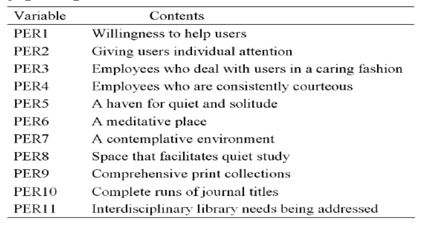
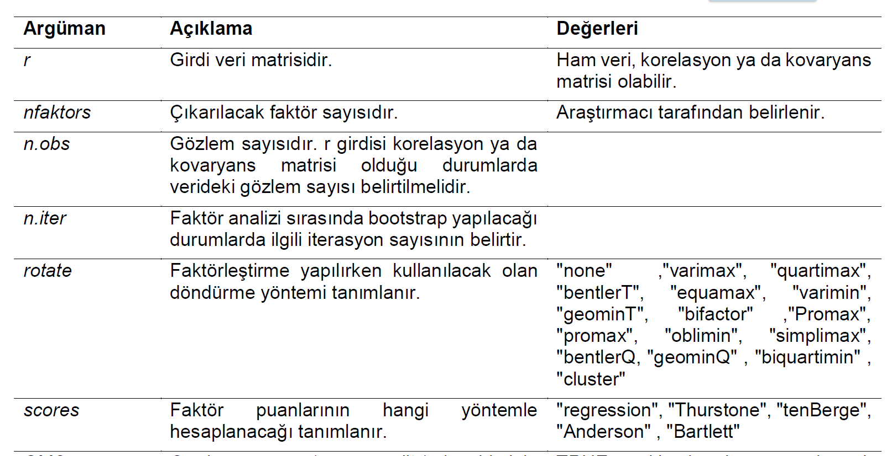
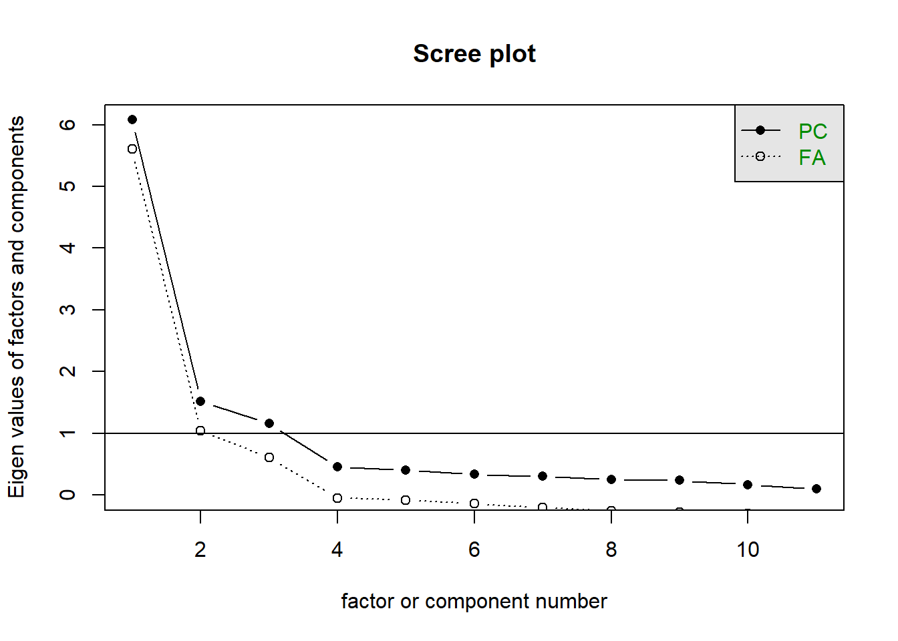
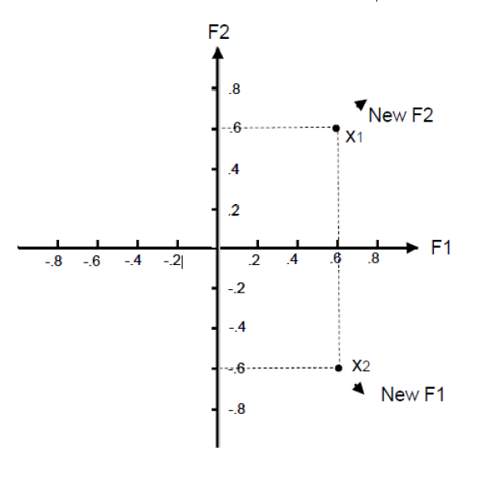

# AFA

- Bazı durumlarda, özellikle de ölçme araçları yeni 
geliştirildiyse:

  - Araştırmacıların bir grup gözlenen/ölçülen değişkenin altında 
yatan faktör sayısı hakkında **güçlü varsayımları yoktur.**


  - Araştırmacıların hangi grup **değişkenlerin birbirleriyle diğerlerine 
göre daha çok korelasyona** sahip olduğu hakkında güçlü 
varsayımları yoktur. 


  - Bazen araştırmacılar belli **değişkenlerin kuramsal yapıların iyi 
göstergeleri** olup olmadığı hakkında fikir sahibi olmayabilir.


  - Bu koşullarda **AFA gözlenen/ölçülen değişkenler 
arasındaki altta yatan yapının incelenmesi** için önemli bir araçtır.


## AFA'da Amaç

- AFA’nın başlıca amaçları aşağıdaki gibidir:

  - Gözlenen/ölçülen değişkenler arasındaki **korelasyonların örüntüsünü özetlemek.**
  

  - Çok sayıdaki gözlenen/ölçülen değişkeni **daha az sayıdaki faktöre indirgemek.**

    - Bazen AFA **veri indirgeme (data reduction)** yöntemi olarak da 
adlandırılır.

  - Gözlenen/ölçülen değişkenleri kullanarak altta yatan yapının **operasyonel tanımını sağlamak.**


## Bir Örnek 

- Varsayımsal bir veri olan **Heuristic** adlı veride 6 ölçülen değişken bulunmaktadır. Ancak bu ölçülen değişkenlerin altında 
yatan **yapı hakkında bir fikir yoktur.**


- Veri Thompson (2004)’ın kitabında sayfa 10’da verilmiş olup **6 ölçülen değişkene ilişkin 7 öğrenci** tarafından sağlanan derecelendirmeleri 
içermektedir
<br>
<br>
<br>
<br>
.xsmall[Thompson, B. (2004). *Exploratory and confirmatory factor analysis: Understanding concepts and applications.* Washington, DC: American Psychological Association.]


## Bir Örnek 

  - Bir faktör analizi yapıldığında, **ölçülen değişkenler  arasındaki ilişkiler araştırılır** ve bu ilişkilerin **daha az sayıda gizil yapıda özetlenip özetlenemeyeceği** belirlenmeye çalışılır. 


  - Değişkenler arasındaki **ilişkileri özetlemek için birkaç farklı istatistik kullanılabilir** (örneğin, Pearson momentler-çarpımı korelasyon katsayıları, Spearman'ın rho katsayıları, tetrakorik korelasyon katsayısı). 


## Bir Örnek 


```r
df %>% kable(align = "c")
```


| id | handsome | beatiful | ugly | brillant | smart | dumb |
|:--:|:--------:|:--------:|:----:|:--------:|:-----:|:----:|
| 1  |    6     |    5     |  4   |    8     |   6   |  2   |
| 2  |    8     |    7     |  2   |    7     |   5   |  3   |
| 3  |    9     |    8     |  1   |    9     |   7   |  1   |
| 4  |    5     |    4     |  5   |    9     |   7   |  1   |
| 5  |    4     |    3     |  6   |    9     |   7   |  1   |
| 6  |    7     |    6     |  3   |    7     |   5   |  3   |
| 7  |    3     |    2     |  7   |    7     |   5   |  3   |


## Bir Örnek 

 - Verideki 6 değişken arasındaki Pearson korelasyon katsayıları matrisi aşağıdaki gibidir:


```r
cor(df[,-1])%>% kable(align = "c")
```


|         | handsome | beatiful | ugly | brillant | smart | dumb |
|:--------|:--------:|:--------:|:----:|:--------:|:-----:|:----:|
|handsome |    1     |    1     |  -1  |    0     |   0   |  0   |
|beatiful |    1     |    1     |  -1  |    0     |   0   |  0   |
|ugly     |    -1    |    -1    |  1   |    0     |   0   |  0   |
|brillant |    0     |    0     |  0   |    1     |   1   |  -1  |
|smart    |    0     |    0     |  0   |    1     |   1   |  -1  |
|dumb     |    0     |    0     |  0   |    -1    |  -1   |  1   |


## Bir Örnek 

- Korelasyon matrisindeki örüntülere dayanarak aşağıdakiler  söylenebilir:

  - Bireyi tarif etmek için **Handsome**, **Beautiful** ve **Ugly** değişkenlerini 
kullanmak yerine bu üç ölçülen değişken **bir gizil değişken** (faktör analizinde gizil değişken faktör olarak adlandırılır) olarak 
özetlenebilir.

    - Bu gizil değişken **physical attractiveness** olarak etiketlenebilir.
  
-    Benzer şekilde, bireyi tarif etmek için **Brilliant**, **Smart** ve **Dumb** 
değişkenlerini kullanmak yerine bu üç ölçülen değişken **bir gizil** 
değişken kullanarak özetlenebilir.

    - Bu gizil değişken **intellectual prowess** olarak etiketlenebilir. 
    
- **physical attractiveness** ve **intellectual prowess** arasında 
**korelasyon yoktur.**


## Bir Örnek

- 6 değişken yerine bu **2 faktör** kullanılarak:

  - 6 ölçülen değişken arasındaki **korelasyonun örüntüsü özetlenir.**
  
- 6 ölçülen değişken **2 gizil faktöre** indirgenir.

  - Bu 3 değişkenlik **2 alt kümedeki korelasyonlar 1 veya -1** olduğundan, gözlenen/ölçülen korelasyon matrisindeki bilgiden **herhangi bir bilgi 
kaybedilmez.**  Diğer bir ifadeyle, bu **iki faktör** kullanılarak **gözlenen/ölçülen korelasyon** 
matrisi mükemmel bir şekilde üretilebilir. **Ancak gerçek veride bu olmayacaktır. **
- 2 gizil faktör için ölçülen değişkenler kullanılarak operasyonel bir tanım sağlanır. 
    - Örneğin, Handsome, Beautiful ve Ugly değişkenlerinin nasıl değişkenler olduğundan “physical attractiveness” gizil faktörü tanımlanabilir.


## Bir Örnek Örüntü Katsayıları
- Korelasyon matrisinin faktör analizi sonucunda elde edilen **karesi alınmamış faktör ağırlıkları** (**MR1** ve **MR2**), **karesi alınmış faktör ağırlıkları** aşağıdaki gibidir. 


```r
library(psych)
fa1 <- round(fa(df[,-1],2)$loading[,1:2],2)
cbind(fa1,fa1^2)%>% kable(align = "c",
col.names = c("MR1","MR2", "MR1*MR1","MR2*MR2"))
```


|         | MR1 | MR2 | MR1*MR1 | MR2*MR2 |
|:--------|:---:|:---:|:-------:|:-------:|
|handsome |  1  |  0  |    1    |    0    |
|beatiful |  1  |  0  |    1    |    0    |
|ugly     | -1  |  0  |    1    |    0    |
|brillant |  0  |  1  |    0    |    1    |
|smart    |  0  |  1  |    0    |    1    |
|dumb     |  0  | -1  |    0    |    1    |


## Bir Örnek Örüntü Katsayıları

- Faktör analizinde **örüntü katsayıları (pattern coefficients) **
faktör analizindeki gizil değişkenler üzerinde puanlar 
(faktör puanları olarak adlandırılır) elde etmek için 
**ölçülen değişkenlere uygulanan ağırlıklardır.** 

- Bu ağırlıklar 
  - **çoklu regresyon** analizindeki $\beta$ ağırlıklarına, 
  - betimsel 
ayırma analizindeki standartlaştırılmış **ayırma fonksiyonu katsayılarına** benzerdir. 


## Bir Örnek
Örüntü Katsayıları

- Faktör örüntü katsayıları ( $P_{VxF}$ ; V değişken sayısı, F faktör sayısı), kısmen, analiz edilen ve **faktörlerin çıkarıldığı korelasyon matrisinde temsil edilen varyansı yeniden ifade etmek için hesaplanır.**

- Faktörler; **birinci faktör analiz edilen matristeki en fazla varyansı yeniden üretebilecek**, **ikinci faktör ikinci en fazla varyansı yeniden üretebilecek** ve bu şekilde devam edecek şekilde çıkarılır. 

- Bir veya daha fazla faktörün, analiz edilen matrisi yeniden üretme yeteneği, üretilen (reproduced) korelasyon matrisi ( $R_{VxV^+}$ ) ile 
ölçülür. Üretilen korelasyon matrisi aşağıdaki şekilde
hesaplanabilir: 

 $P_{VxF}P_{VxF'}=R_{VxV^+}$

## Bir Örnek Örüntü Katsayıları

- Faktörlerin analiz edilen korelasyon matrisini yeniden üretme yeteneği, belirli sayıda faktör çıkarıldıktan sonra kalan matrisin 
hesaplanmasıyla da ölçülebilir. Bu matris **artık korelasyon matrisi** $R_{VxV^-}$ olarak adlandırılır.

- Faktör örüntü katsayıları, korelasyon matrisini mükemmel bir şekilde yeniden oluşturursa, $R_{VxV^-}$ matrisinin girdileri **tamamen 
sıfırlardan** oluşur ve bu **matriste hiçbir bilgi veya varyans** kalmadığını gösterir. 

- Faktör örüntü katsayıları korelasyon 
matrisini mükemmel şekilde yeniden oluşturursa, $R_{VxV^±}$ matrisindeki girdiler $R_{VxV}$ matrisindeki girdilerle tam olarak eşleşir.


## Bir Örnek Örüntü Katsayıları

- Regresyon analizinde, belirli bir analizde yalnızca tek bir eşitlik $\beta$ ağırlıkları seti vardır. Faktör analizinde ağırlık 
setlerine (örüntü katsayıları gibi) eşitlikler yerine **faktörler**
denir. 

- Örnekteki değişkenler arası korelasyon matrisindeki her girdi **+1 veya -1** olsaydı, her ölçülen değişken çifti arasındaki $r^2$ değeri 
%100 olacaktı. Bu da derecelendirmelerin altında **tek bir faktörün yattığı** anlamına gelecekti. 

- Bu durumda sadece eksi veya artı örüntü katsayılarından $P_{6x1}$ oluşan **bir faktör çıkarılacaktı.** Bu tek faktör, orijinal $P_{6x6}$ matrisini **mükemmel şekilde yeniden üretecekti.** 

- Teknik olarak, her biri sadece sıfır değerindeki örüntü katsayılarından oluşan, yani her birinin hiçbir bilgi içermediği ve **değişkenliğin yeniden üretilmediği beş ek faktör** olacaktı. Ancak bu tür faktörlerle ilgilenilmez.


## Bir ÖrnekÖrüntü Katsayıları

- Örnekteki değişkenler arasındaki korelasyon **sıfır** olsaydı, 
korelasyon matrisindeki **köşegen dışındaki her girdi 0 olacaktı,** 
her ölçülen değişken çifti arasındaki $r^2$ değeri **%0 ** olacaktı.

- Bu da bir faktör oluşturmak için **iki değişken birleştirilemeyeceği** (yani her ölçülen değişken kendi faktörünü tanımlayacağı) anlamına 
gelecekti. Dolayısıyla **6 faktör** olacaktı.

- Her faktör bir **+1 değerinde örüntü katsayısına** sahip olacaktı ve 
geri kalan **beş girdi sıfır olacaktı**. Bu altı faktör, orijinal  $P_{6x6}$
matrisini mükemmel şekilde yeniden üretecekti. 

  - Aslında, tüm olası faktörler çıkarıldığında (yani faktörlerin sayısı ölçülen değişkenlerin sayısına eşit olduğunda), örüntü katsayıları analiz edilen orijinal korelasyon matrisini mükemmel bir şekilde yeniden üretecekti.


## Yapı Katsayıları

- Faktör analizinde, **örüntü katsayıları** faktör puanlarını 
elde etmek için ölçülen değişkenlere uygulanırlar. Bu 
katsayılar **kimi zaman korelasyon katsayılarıdır**, kimi 
zaman değildir. 

- Ölçülen değişkenler ve faktör puanları arasındaki iki 
değişkenli korelasyon katsayıları hesaplanabilir. Bu 
korelasyon katsayıları **yapı katsayıları** olarak adlandırılır. 

- Faktör analizinde, **örüntü katsayılarının** yanı sıra **yapı 
katsayıları** (structure coefficients) da önemlidir.


## Bir Örnek Yapı Katsayıları

Yapı katsayıları aşağıdaki şekilde hesaplanabilir. 
 $P_{VxF}R_{FxF}=S_{VxF}$

- Burada,
- $R_{FxF}$ faktörler arasındaki korelasyon matrisidir. 

- **Faktörler arasındaki korelasyon sıfır** olduğunda (yani faktörler tamamen ilişkisiz olduğunda), faktörler arasındaki korelasyon matrisi 
birim matrise eşit olacağından ( $R_{FxF}=I_{FxF}$ ), **örüntü katsayıları matrisi ** de **yapı katsayıları matrisine** eşit olacaktır ( $P_{VxF}=S_{VxF}$ ).

- Faktörler ilk çıkarıldığında, faktörler her zaman tamamen ilişkisizdir.


## Bir Örnek Ortak Varyans Katsayıları


- Örnekte çıkarılan faktörler tamamen ilişkisiz olduğundan, **karesi alınmamış katsayılar örüntü/yapı katsayılarıdır.** Dolayısıyla bu 
katsayıların değeri **-1,0 ve +1,0** aralığındadır. Ancak bu değerler **eşit oran ölçeğinde değildir.** 

  - Örneğin, $r=1$ değeri $r=0.5$ değerinin iki katı büyük değildir.
  
  - Bu değerlerin karesi alınırsa, oransal olarak karşılaştırmalar yapılabilir. 

  - Örneğin, $r=1$ değeri, $r=0.5$ değerinin dört katı büyüktür. Çünkü 1,0 
değerinin karesi olan $r^2=1$ değeri, 0.5 değerinin karesi olan $r^2=0.25$ değerinin dört katıdır. 

- Örnekteki **örüntü/yapı katsayılar korelasyon katsayıları** olduğundan, bu katsayıları karşılaştırabilmek için **karelerinin** 
alınması gerekmektedir.


## Bir Örnek Ortak Varyans Katsayıları

- Aralarında ilişki **bulunmayan faktörler için örüntü/yapı katsayılarının kareleri alınarak,** katsayıların karesi satır boyunca toplanırsa, elde edilen katsayı **ortak varyans **
(communality) olarak adlandırılır ve $h^2$
ile gösterilir. 

- Örneğin, "Handsome" değişkeni için ortak varyans değeri,
$(1.0)^2 + (0)^2 = 1.0$

```r
fa(df[,-1],2,n.obs=7) %>% target.rot()
```

```
## 
## Call: NULL
## Standardized loadings (pattern matrix) based upon correlation matrix
##          MR1 MR2 h2     u2
## handsome   1   0  1 0.0017
## beatiful   1   0  1 0.0017
## ugly      -1   0  1 0.0017
## brillant   0   1  1 0.0017
## smart      0   1  1 0.0017
## dumb       0  -1  1 0.0017
## 
##                        MR1  MR2
## SS loadings           2.99 2.99
## Proportion Var        0.50 0.50
## Cumulative Var        0.50 1.00
## Proportion Explained  0.50 0.50
## Cumulative Proportion 0.50 1.00
##     MR1 MR2
## MR1   1   0
## MR2   0   1
```


## Bir Örnek Ortak Varyans Katsayıları

- Faktörler arasında **ilişki bulunmadığından**, her ölçülen değişkenin **bir faktör ile paylaştığı varyans kendine özgüdür.**

- Dolayısıyla **ortak varyans** faktörlerin ölçülen bir değişkendeki **varyansın ne 
kadarını üretebileceğini** belirtir. 

  - Ölçülen bir değişken **%0'a** yakın bir ortak varyans katsayısına sahipse, bu, **bu değişkenin faktörler içinde temsil edilmediği** anlamına gelir. 
Araştırmacı, değişkenin faktörlerde temsil edilmesini istiyorsa, ek faktörlerin çıkarılması gerekebilir.


## Bir Örnek Ortak Varyans Katsayıları

- Ortak varyans **ölçülen bir değişken için**, belirli **bir ölçülen değişkenin varyansının ne kadarının faktörleri bir küme olarak** tanımlamada yararlı olduğunu yansıtır.

- Bir değişken için **ortak varyans katsayısı**, değişken üzerindeki 
puanların güvenilirliğinin **alt sınır** tahminidir.

  - Örneğin, bir değişkenin **% 50'lik** bir ortak varyansa sahip olması, değişken üzerindeki **puanların güvenilirliğinin 0.5'ten düşük olmadığına** 
işaret etmektedir.


## Bir Örnek Özdeğerler


- Aralarında ilişki bulunmayan faktörler için **örüntü/yapı katsayılarının kareleri alınarak**, **katsayıların karesi sütun boyunca toplanırsa**, elde edilen katsayı **özdeğer** 
(eigenvalue) olarak adlandırılır. 
- **Özdeğerler karakteristik kökler** olarak da bilinmektedir.

- Örneğin, birinci faktör ve ikinci faktör için özdeğerler 3 ve 3’dır. 
]


```r
 rbind(fa1*fa1, toplam= colSums(fa1*fa1)) %>% kable()
```


|         | MR1| MR2|
|:--------|---:|---:|
|handsome |   1|   0|
|beatiful |   1|   0|
|ugly     |   1|   0|
|brillant |   0|   1|
|smart    |   0|   1|
|dumb     |   0|   1|
|toplam   |   3|   3|
]

## Bir Örnek Özdeğerler

Aşağıdaki dört ifade, bir AFA'daki özdeğerler için geçerlidir:

-  **Özdeğerlerin sayısı**, ölçülen değişkenlerin sayısına eşittir.

- **Özdeğerlerin toplamı**, ölçülen değişkenlerin sayısına eşittir.

- Ölçülen **değişkenlerin sayısına bölünen bir özdeğer**, **belirli bir faktörün analiz edilen korelasyon matrisindeki yeniden ürettiği bilgi 
oranını gösterir.**

- Çıkarılan faktörlerin özdeğerlerinin toplamının ölçülen 
değişkenlerin sayısına bölünmesi, **faktörlerin bir küme olarak analiz edilen korelasyon matrisindeki yeniden ürettiği bilgilerin oranını gösterir.**


## Bir Örnek Özdeğerler

- Örnekte, **ölçülen değişkenlerin sayısı altıdır.** Bu nedenle, korelasyon matrisi ile **ilişkili altı özdeğer** vardır. 

- Örnekteki özdeğerlerin toplamı 6 olduğundan,
**ilk iki özdeğerin 3 ve 3 olduğu** göz önüne alındığında, kalan özdeğerlerin 0,0, 0.0, 0.0 ve 0.0 olması gerekir. 

- $3/6= 0.5$'e eşit olduğu için, ilk özdeğer, Faktör I’in korelasyon matrisinde yer alan bilgilerin 0.5'ini (veya %50'sini) **yeniden ürettiğini gösterir.**


## Bir Örnek Özdeğerler

- DFA’da olduğu gibi AFA’da da ortak faktör modeli 
(common factor model) temeldir: Her bir değişken faktör puanlarının ve bir hata puanının bir fonksiyonudur. 
$X=\Lambda\xi +\delta$
- Örnekte AFA modeli aşağıdaki gibidir:
$$\begin{bmatrix}{}
X_{1 handsome}\\
X_{2 betutiful}\\
X_{3 ugly}\\
X_{4 brillant}\\
X_{5 smart}\\
X_{6 dumb}\\
\end{bmatrix} = \begin{bmatrix}{}
\lambda_{11} & \lambda_{12} \\
\lambda_{21} & \lambda_{22} \\
\lambda_{31} & \lambda_{32} \\
\lambda_{41} & \lambda_{42} \\
\lambda_{51} & \lambda_{52} \\
\lambda_{61} & \lambda_{62} \\
\end{bmatrix}
\begin{bmatrix}{}
\xi_{1_{physical}}\\
\xi_{1_{intellectual}}\\
\end{bmatrix} + \begin{bmatrix}{}
\delta_{1}\\
\delta_{2}\\
\delta_{3}\\
\delta_{4}\\
\delta_{5}\\
\delta_{6}\\
\end{bmatrix}$$

$X$ : gözlenen değişken matrisi ( $Vx1$ )
$\Lambda$ : yapısal katsayı matrisi ( $VxF$ )
$\xi$ : örtük değişken vektoru 
$\delta$ : ölçme hatası


## AFA Modeli

- AFA’da genellikle korelasyon matrisi analiz edildiğinden, AFA modeli matris formunda aşağıdaki gibi temsil edilebilir:

$R= \Lambda\Phi\Lambda' + R_{res}$

  - Faktörler ilk olarak dik olacak şekilde çıkarılacakları için, $\Phi$ bir birim matristir. 

- Bu AFA modeli daha basit bir forma indirgenir:
$R= \Lambda\Lambda' + R_{res}$

- Asıl fikir **üretilen korelasyon matrisinin $Ȓ$ ** **gözlenen  korelasyon matrisine $R$** mümkün olduğunca yakın olmasını sağlayacak faktör yükleri matrisini $\Lambda$ bulmaktır.

- Sonuç olarak $R_{res}$ mümkün olduğunca küçük olacaktır. 


## Bir Örnek

$$\begin{bmatrix}{}
\lambda_{11} & \lambda_{12} \\
\lambda_{21} & \lambda_{22} \\
\lambda_{31} & \lambda_{32} \\
\lambda_{41} & \lambda_{42} \\
\lambda_{51} & \lambda_{52} \\
\lambda_{61} & \lambda_{52} \\
\end{bmatrix}\begin{bmatrix}{}
\lambda_{11} & \lambda_{12} & \lambda_{13} & \lambda_{14} & \lambda_{15} & \lambda_{16}\\
\lambda_{21} & \lambda_{22} & \lambda_{23} & \lambda_{24} & \lambda_{25} & \lambda_{26}\\
\end{bmatrix} + \begin{bmatrix}{}
\Psi_{11}\\
\Psi_{11} & \Psi_{21}\\
\Psi_{11} & \Psi_{21} & \Psi_{31}\\
\Psi_{11} & \Psi_{21} & \Psi_{31} & \Psi_{41}\\
\Psi_{11} & \Psi_{21} & \Psi_{31} & \Psi_{41} & \Psi_{51}\\
\Psi_{11} & \Psi_{21} & \Psi_{31} & \Psi_{41} & \Psi_{51} & \Psi_{61}\\
\end{bmatrix}$$


## Bir Örnek

$$\begin{bmatrix}{}
\lambda^2_{11} + \lambda^2_{12} \\
\lambda_{21}\lambda_{11}  + \lambda_{22}\lambda_{12} & \lambda^2_{21}+ \lambda^2_{22}\\
\lambda_{31}\lambda_{11}  + \lambda_{32}\lambda_{12} &\lambda_{31}\lambda_{21}  + \lambda_{32}\lambda_{22}& \lambda^2_{31}+ \lambda^2_{32}\\
\lambda_{41}\lambda_{11}  + \lambda_{42}\lambda_{12} &\lambda_{41}\lambda_{21}  + \lambda_{42}\lambda_{22}  &  \lambda_{41}\lambda_{31}+\lambda_{42}\lambda_{32}  & \lambda^2_{41}+ \lambda^2_{42}\\
\lambda_{51}\lambda_{11}  + \lambda_{52}\lambda_{12} &\lambda_{51}\lambda_{21}  + \lambda_{52}\lambda_{22}  &  \lambda_{51}\lambda_{31}+\lambda_{52}\lambda_{32}  & \lambda_{51}\lambda_{41}+\lambda_{52}\lambda_{42}& \lambda^2_{51}+ \lambda^2_{52}\\
\lambda_{61}\lambda_{11}  + \lambda_{62}\lambda_{12} &\lambda_{61}\lambda_{21}  + \lambda_{62}\lambda_{22}  &  \lambda_{61}\lambda_{31}+\lambda_{62}\lambda_{32}  & \lambda_{61}\lambda_{41}+\lambda_{61}\lambda_{42} &
\lambda_{61}\lambda_{51}+\lambda_{62}\lambda_{52} & \lambda^2_{61}+ \lambda^2_{62}\\
\end{bmatrix} + \begin{bmatrix}{}
\Psi_{11}\\
\Psi_{11} & \Psi_{21}\\
\Psi_{11} & \Psi_{21} & \Psi_{31}\\
\Psi_{11} & \Psi_{21} & \Psi_{31} & \Psi_{41}\\
\Psi_{11} & \Psi_{21} & \Psi_{31} & \Psi_{41} & \Psi_{51}\\
\Psi_{11} & \Psi_{21} & \Psi_{31} & \Psi_{41} & \Psi_{51} & \Psi_{61}\\
\end{bmatrix}$$

## AFA’da Örneklem Büyüklüğü

- Örneklem büyüklüğü, AFA'da yapılanlar da dahil olmak üzere tüm istatistiksel **tahminlerin kesinliğini** etkiler. 

- Çeşitli araştırmacılar, birey sayısının ölçülen değişkenlerin sayısına oranının bir fonksiyonu olan minimum örneklem büyüklüğü için kurallar önermiştir. Önerilen oranlar genellikle 

- ölçülen değişken başına 10 ila 20 birey arasındadır. 

- Gorsuch (1983), mutlak minimum oranın her değişken başına beş birey olmasını, ancak herhangi bir analiz için örneklem büyüklüğünün 100 bireyden az olmamasını önermiştir. 
<br>

.xsmall[Gorsuch, R. L. (1983). Factor analysis (2nd ed.). Hillsdale, NJ: Erlbaum]


## AFA’da Örneklem Büyüklüğü

- Bazı Monte Carlo simülasyon araştırmaları (Guadagnoli & Velicer, 1988)  şunları önermektedir:

1. Faktörlerin her biri, örneklem büyüklüğüne bakılmaksızın, **|0.6|’dan** 
büyük yapı katsayılarına **sahip dört veya daha fazla ölçülen değişken **
tarafından tanımlanır.

2. Faktörlerin her biri, örneklem büyüklüğü 150'den büyükse, **|0.4|**’dan 
civarında yapı katsayılarına sahip **10 veya daha fazla ölçülen değişken** tanımlanır.

3. Örneklem büyüklüğü **en az 300** olmalıdır.


## AFA’da Örneklem Büyüklüğü


- MacCallum, Widaman, Zhang ve Hong (1999), **ortak varyansların tümü, .60 veya daha büyükse**, örneklem büyüklüğü 60 kadar düşük olsa bile, 
**örüntü katsayılarının doğru şekilde yeniden** üretildiğini bulmuştur. 

- Ortak varyans değerleri **0.50** civarındaysa, 100 ila 200 arasında örneklem  büyüklüğü gereklidir. 

<br>
<br>
<br>
<br>
.xsmall[- Guadagnoli, E., & Velicer, W. (1988). Relation of sample size to the stability of component 
patterns. Psychological Bulletin, 103, 265—275.

- MacCallum, R. C., Widaman, K. F., Zhang, S., & Hong, S. (1999). Sample size in factor
analysis. Psychological Methods, 4, 84-99.
]

## Örnek Veri

- Veri Amerika Birleşik Devletleri ve Kanada'daki üniversite kütüphanelerinde hizmet kalitesine ilişkin kullanıcı algıları 
çalışmasından (Cook & Thompson, 2001; Thompson, Cook, & 
Heath, 2001; Thompson, Cook, & Thompson, 2002) rastgele 
örneklenmiştir.

- Veri Thompson (2004)’ın kitabında Appendix A’da verilmiş olup 12 
(gözlenen/ölçülen) değişkene ilişkin 100 lisansüstü öğrenci ve 100 
akademik personel tarafından sağlanan derecelendirmeleri 
içermektedir. 

.xsmall[- Cook, C., &. Thompson, B. (2001). Psychometric properties of scores from the Web-based 
LibQUAL+™ study of perceptions of library service quality. Library Trends, 49, 585-604. 
- Thompson, B. (2004). Exploratory and confirmatory factor analysis: Understanding concepts 
and applications. Washington, DC: American Psychological Association.
- Thompson, B., Cook, C., & Heath, F. (2001). How many dimensions does it take to measure 
users' perceptions of libraries?: A "LibQUAL+™" study, portal: Libraries and the 
Academy, 1, 129-138.
- Thompson, B., Cook, C., & Thompson, R. L. (2002). Reliability and structure of LibQUAL+™ 
scores: Measuring perceived library service quality, portal: Libraries and the Academy, 2, 
3-12.]


## Örnek Veri

- Örnek veri (“EFA.sav”) için ilgili veriden ilk 11 değişkene ilişkin 100 
lisansüstü öğrenci tarafından sağlanan derecelendirmeler 
alınmıştır. Örnek veride ele alınan 11 gözlenen/ölçülen değişken 
aşağıdaki gibidir:




## İlişki Katsayıları Matrisi

- Değişkenler için **toplanan puanlar**, değişkenler 
arasındaki iki değişkenli ilişkiler matrisini hesaplamak için kullanılır. AFA’da analiz edilen bu ilişkiler matrisidir.

- Bir veri seti için ilişki matrisi verildiğinde (örneğin, $R_{11x11}$ ), faktör analizinin tüm adımları (faktör puanlarının hesaplanması hariç), orijinal verilere (örneğin, $X_{100x11}$  erişim olmadan bile 
gerçekleştirilebilir. 

- Pearson momentler-çarpımı iki değişkenli korelasyon matrisi AFA’da en çok kullanılan ilişkiler matrisidir. 
  -  Çoğu istatistiksel pakette, AFA'da varsayılan (kullanıcı varsayılan seçimi değiştirmedikçe) ilişkilendirme matrisi Pearson korelasyon matrisidir. 
Ancak başka seçenekler de vardır. 


## İlişki Katsayıları Matrisi

- İlişkileri karakterize eden farklı istatistikler, verilerin farklı yönlerine duyarlıdır. Farklı ilişki istatistikleri, verilerin altında **farklı ölçek 
düzeylerinin yattığını** varsayar. 

- Örneğin, **Pearson r**, verilerin **eşit aralıklı** olarak ölçeklenmesini gerektirir. 
Diğer yandan **Spearman's rho**, yalnızca verilerin **en azından sıralı** olarak 
ölçeklendiğini varsayar. 


## İlişki Katsayıları Matrisi

- **Spearman’s rho**, aralık verileri bağları olmayan 
sıralamalara dönüştürüldüğünde, iki değişken arasındaki **Pearson r**'dir.

- Aslında ister sıralı ister eşit aralık verileriyle hesaplanmış olsun, Spearman’s rho şu soruya yanıt verir: **İki değişken, bireyleri tam olarak aynı sırada mı sıralıyor?** Pearson r bu soruyu da değerlendirir ancak sıralı puanlar arasındaki mesafeleri de hesaba katar. 

- Spearman’s rho, verilerde böyle bir bilginin bulunmadığını varsayar (veya bu bilgiyi göz ardı eder), bu nedenle her iki değişken de sıralı olarak ölçeklendiğinde **rho** kullanılabilir. 

- ikili puanlana veriler için ise korelasyon matrisinin **tetrakorik korelasyonlardan** elde edilmesi  gerekmektedir.


## İlişki Katsayıları Matrisi

- Bu iki ilişki matrisi,  **kovaryans matrisi** de olabilir. Birçok bağlamda kovaryans, ilişkiyi veya ilişkiyi tanımlamak için değil, korelasyon katsayısının elde edilmesinde **bir ara 
hesaplama olarak** kullanılır. 

- Kovaryans nadiren kullanılır, çünkü korelasyondan farklı olarak **kovaryans, kesin bir olası değerler 
aralığına sahip değildir.** 


## İlişki Katsayıları Matrisi

- Kovaryans, iki değişkenin üç yönünden ortaklaşa etkilenir: 

  - iki değişken arasındaki **korelasyon**, 
  - birinci değişkenin **değişkenliği** ve 
  - ikinci değişkenin **değişkenliği**. 

- Bu nedenle, açımlayıcı faktörler bir 
kovaryans matrisinden çıkarıldığında, bazı faktörler korelasyonların 
bir işlevi olabilirken, diğerleri daha çok puan yayılmasının bir işlevi 
olabilir. 
- Bazen faktörlerimizin puanların bir dizi yönüne duyarlı 
olmasını isteriz. Ancak diğer zamanlarda, tüm faktörlerin verilerimizin 
yalnızca tek bir yönüne duyarlı olmasını tercih edebiliriz.


## Örnek Veri için Korelasyon Matrisi
- AFA’da analiz  edilen  **ilişkiler matrisidir. **
- Örnek veri için $R_{11 x 11}$ korelasyon matrisi aşağıdaki gibidir


```r
library(haven)
EFA <- read_sav("import/EFA.sav")
matris <- round(cor(EFA[,-c(1,13)]),2)
matris[upper.tri(matris)] <- NA
matris
```

```
      per1 per2 per3 per4 per5 per6 per7 per8 per9 per10 per11
per1  1.00   NA   NA   NA   NA   NA   NA   NA   NA    NA    NA
per2  0.85 1.00   NA   NA   NA   NA   NA   NA   NA    NA    NA
per3  0.79 0.72 1.00   NA   NA   NA   NA   NA   NA    NA    NA
per4  0.78 0.70 0.69 1.00   NA   NA   NA   NA   NA    NA    NA
per5  0.40 0.45 0.51 0.48 1.00   NA   NA   NA   NA    NA    NA
per6  0.33 0.32 0.40 0.40 0.66 1.00   NA   NA   NA    NA    NA
per7  0.48 0.50 0.50 0.52 0.80 0.71 1.00   NA   NA    NA    NA
per8  0.42 0.45 0.49 0.43 0.78 0.63 0.71 1.00   NA    NA    NA
per9  0.44 0.46 0.54 0.50 0.39 0.23 0.40 0.39 1.00    NA    NA
per10 0.38 0.41 0.45 0.35 0.41 0.30 0.42 0.39 0.63  1.00    NA
per11 0.43 0.49 0.55 0.42 0.46 0.25 0.42 0.44 0.68  0.59     1
```


<! Herhangi bir rotasyondan  >
<! önceki çözüm uygulanır >

<! Çıkarılan faktörlere  >
<! dayanarak üretilen  >
<! korelasyon matrisi istenir >

<! Gözlenen  >
<! korelasyon matrisi  >
<! istenir >

<! Gözlenen korelasyon  >
<! matrisinin köşegen matris  >
<! olup olmadığı incelenir >

<! SPSS’te default seçeneği  >
<! PCA’dir. AFA analizi yaparken  >
<! bu seçeneği geçersiz  >
<! kıldığınızdan emin olun. >

<! Korelasyon matrisi  >
<! analiz edilecek default  >
<! matrisidir >

<! 1’den büyük olan eigenvalue  >
<! sayısı çıkarılacak faktör sayısını  >
<! belirler. 1 değeri geçersiz  >
<! kılınabilir. >

<! Default olarak maksimum  >
<! iterasyon sayısı 25’tir. 25  >
<! iterasyondan sonra yakınsanma  >
<! olmazsa bu değeri değiştiriniz. >

<! Analizden çıkarılacak  >
<! faktör sayısına karar  >
<! vermede sıklıkla kullanılan  >
<! ikinci kuraldır. Bu seçeneği  >
<! grafik elde etmek için  >
<! işaretleyiniz.  >

<! İlk olarak  >
<! rotasyonsuz AFA  >
<! analizi gerçekleştirilir. >

<! Faktörlere karşılık gelen  >
<! yüklerin örüntüsünü  >
<! grafikte görmek için yük  >
<! grafiği istenir. >


## KMO
- AFA'da bir grup ölçülen değişkenden ortak faktör çıkarılması hedeflenmektedir. Bu nedenle değişkenler bazı ortak şeyler paylaşmalıdır. Eğer bu **11 değişkenin altında yatan hiçbir ortak faktör yoksa evren korelasyon matrisi 11x11 boyutunda bir birim** matris olacaktır

$$\begin{bmatrix}{}
1 & 0 & 0 & 0 & 0 & 0 & 0 & 0 & 0 & 0 & 0\\
0 & 1 & 0 & 0 & 0 & 0 & 0 & 0 & 0 & 0 & 0\\
0 & 0 & 1 & 0 & 0 & 0 & 0 & 0 & 0 & 0 & 0\\
0 & 0 & 0 & 1 & 0 & 0 & 0 & 0 & 0 & 0 & 0\\
0 & 0 & 0 & 0 & 1 & 0 & 0 & 0 & 0 & 0 & 0 \\
0 & 0 & 0 & 0 & 0 & 1 & 0 & 0 & 0 & 0 & 0\\
0 & 0 & 0 & 0 & 0 & 0 & 1 & 0 & 0 & 0 & 0\\
0 & 0 & 0 & 0 & 0 & 0 & 0 & 1 & 0 & 0 & 0\\
0 & 0 & 0 & 0 & 0 & 0 & 0 & 0 & 1 & 0 & 0\\
0 & 0 & 0 & 0 & 0 & 0 & 0 & 0 & 0 & 1 & 0\\
0 & 0 & 0 & 0 & 0 & 0 & 0 & 0 & 0 & 0 & 1\\
\end{bmatrix}$$


## KMO

- Bütün **değişkenler birbirinden bağımsız olduğunda**, veri 
indirgeme başarılamaz.

- Kaiser-Meyer-Olkin measure of sampling adequacy (KMO) **değişkenler arasındaki örtüşmenin derecesini** 
inceler.

- Daha çok değişken ortak şeyler paylaşırsa, KMO değeri daha büyük olacaktır. 

- Bu nedenle **KMO değerinin büyük olması** beklenir. 


## KMO

```r
library(psych)
veri <- EFA[ ,-c(1,13)]
KMO(veri)
```

```
## Kaiser-Meyer-Olkin factor adequacy
## Call: KMO(r = veri)
## Overall MSA =  0.88
## MSA for each item = 
##  per1  per2  per3  per4  per5  per6  per7  per8  per9 per10 per11 
##  0.79  0.89  0.91  0.91  0.85  0.89  0.88  0.91  0.86  0.91  0.89
```

KMO değeri istatistiksel bir testle birlikte gelmez.
- Yeterliliğin değerlendirilmesi biraz kişiseldir.
- Araştırmacılar **KMO değerinin ideal olarak 0,6’dan büyük olması** 
gerektiğini önerirler.
- Örneğe **0,6 kuralı uygulanırsa, korelasyon matrisinin evrendeki bir birim matrisinden farklı olduğu** söylenebilir.


## KMO

- **KMO()** fonksiyonunun çıktısı incelendiğinde, **hem tüm veri** için (Overall MSA) **hem de her bir madde** için (MSA for each item) KMO değeri görülmektedir. 

- Çalışmalarda genellikle sadece tüm veri için elde edilen KMO değeri raporlanır. Madde bazında KMO değeri ise **belirli bir maddenin testin tamamından** farklı olup olmadığına ilişkin bilgi verebilir.


```r
KMO(veri)
```

```
## Kaiser-Meyer-Olkin factor adequacy
## Call: KMO(r = veri)
## Overall MSA =  0.88
## MSA for each item = 
##  per1  per2  per3  per4  per5  per6  per7  per8  per9 per10 per11 
##  0.79  0.89  0.91  0.91  0.85  0.89  0.88  0.91  0.86  0.91  0.89
```


## KMO
Veri seti iki kategorik ise **KMO** aşağıdali şekilde hesaplanabilir. 


```r
kor_mat <- tetrachoric(veri)$rho
KMO(kor_mat)
```


## Bartlett’in Testi

- Korelasyon matrisinin **bir birim matrisi** (sıfır hipotezi) olup olmadığını test etmenin bir diğer yolu “Bartlett’s Test of Sphericity” olarak adlandırılır. 

- Yaklaşık olarak bir ki-kare dağılımını izleyen istatistiksel bir testle birlikte gelir.

- Sıfır hipotezinin reddedilmesi beklenir.

```r
bartlett.test(EFA)
```

```
## 
## 	Bartlett test of homogeneity of variances
## 
## data:  EFA
## Bartlett's K-squared = 3497, df = 12, p-value <2e-16
```

Burada **sıfır hipotezi  reddedilir.** AFA analizi  devam edebilir.


## Çıkarılacak Faktörlerin Sayısı

- AFA'da kritik kararlardan biri, kaç faktörün çıkarılacağını belirlemektir. Bu kararı vermek için çok sayıda yaklaşım vardır. Bu yaklaşımlardan bazıları şunlardır:

- İstatistiksel anlamlılık testleri 
- Özdeğerin 1,0’dan büyük olması kuralı 
- Yamaç birikinti grafiği (scree plot)
- Artık korelasyon matrisinin incelenmesi 
- Paralel analiz

- Genel olarak, bu kararı almak için farklı yaklaşımların 
birbirini destekleyeceği umuduyla birkaç yaklaşım 
kullanılmalıdır.


## Çıkarılacak Faktörlerin Sayısı 
**İstatistiksel Anlamlılık Testleri**

- Bartlett'e (1950) bağlı istatistiksel anlamlılık testleri, korelasyon matrisinin matrisin bir birim matrisi olup olmadığını test etmek için kullanılabilir. 

- Korelasyon matrisinin bir birim matrisi olduğuna ilişkin **sıfır hipotezi reddedilemezse, faktörler matristen makul bir şekilde çıkarılamaz. **

- Bu uygulamadaki sorun, tüm istatistiksel anlamlılık testlerinde karşılaşılan genel sorundur. İstatistiksel anlamlılık, büyük ölçüde **örneklem büyüklüğüne bağlıdır**. Araştırmacılar genellikle AFA'yı
yalnızca makul ölçüde büyük örneklemlerle kullandıklarından, 
**önemsiz korelasyonlar veya faktörler bile istatistiksel olarak** 
önemli olarak değerlendirilecektir. Bu nedenle, bu yaklaşım çok 
kullanışlı değildir.


## Çıkarılacak Faktörlerin Sayısı 
**Özdeğerin 1,0’dan Büyük Olması Kuralı**

- Guttman (1954), kayda değer faktörlerin **özdeğerlerinin
1,0'dan büyük olması** gerektiğini düşünmüştür. 

- Bazen bu  mantık Kaiser'e atfedilir ve **K1** kuralı olarak adlandırılır.

- Faktörler, tanım gereği, gözlenen değişkenlerin toplamları olarak oluşturulan gizli yapılardır ve bu nedenle birden fazla gözlenen değişkenden oluşmalıdır.


## Çıkarılacak Faktörlerin Sayısı 
**Özdeğerin 1,0’dan Büyük Olması Kuralı**

- Bir faktör tek bir gözlenen değişkenden 
oluşuyorsa, gözlenen değişkenin örüntü/yapı katsayısı **1,0 (veya -1,0)** olsa ve bu faktördeki diğer tüm değişkenler **0** örüntü/yapı 
katsayılarına sahip olsa, faktörün özdeğeri **1,0** olacaktır. 

- Dolayısıyla kayda değer faktörlerin (gözlenen değişkenlerin toplamlarını temsil eden yapıların) **öz değerlerinin **1,0'dan** büyük olması beklenmektedir.**

<br>

.xsmall[- Guttman, L. (1954). Some necessary conditions for common-factor analysis. 
Psychometrika,19, 149-161.]


## Çıkarılacak Faktörlerin Sayısı
**Özdeğerin 1,0’dan Büyük Olması Kuralı**

- Özdeğerler, tüm örnek istatistikler gibi, bazı örnekleme hatalarına sahiptir. Bu nedenle bir araştırmacı kuram ve önceki ilgili AFA araştırmalarına dayanarak, **özdeğeri ,999 veya ,950 olan bir faktörü çıkarabilir** veya **özdeğeri 1,005 veya 1,100 olan bir faktörü tutmayabilir.**

- Bu kural çoğu istatistiksel paketteki faktörlerin sayısını belirlemek için varsayılan karar verme stratejisidir. 


## Çıkarılacak Faktörlerin Sayısı
**Özdeğerin 1,0’dan Büyük Olması Kuralı**


```r
 fa(veri)$e.values
 sum(fa(veri)$e.values)
```

```
##  [1] 6.078 1.521 1.154 0.456 0.400 0.333 0.301 0.254 0.236 0.168 0.099
## [1] 11
```


-  korelasyon matrisi için  özdeğerleri rapor eder. Büyükten küçüğe sıralanan 11 özdeğer vardır. 

- Bu özdeğerlerin toplamı 11’e (ölçülen değişkenlerin sayısına) 
eşittir. 

$6.078 + 1.521 + 1.154 + … + 0.168 + 0.099 = 11$


### Çıkarılacak Faktörlerin Sayısı
**Özdeğerin 1,0’dan Büyük Olması Kuralı**


```r
 fa(veri)$e.values
```

```
##  [1] 6.078 1.521 1.154 0.456 0.400 0.333 0.301 0.254 0.236 0.168 0.099
```

- İlk üç özdeğer 1’den büyüktür: 6,078, 1,521 ve 1,154.

- **K1** kuralına göre **AFA’dan 3 faktör** çıkarılacaktır


### Çıkarılacak Faktörlerin Sayısı
**Özdeğerin 1,0’dan Büyük Olması Kuralı**

- 3 faktör çıkarma işlemi

```r
out <- fa(veri, nfactors = 3,fm="pa",rotate="none")
out
```

```
## Factor Analysis using method =  pa
## Call: fa(r = veri, nfactors = 3, rotate = "none", fm = "pa")
## Standardized loadings (pattern matrix) based upon correlation matrix
##        PA1   PA2   PA3   h2    u2 com
## per1  0.80 -0.45 -0.38 0.99 0.012 2.0
## per2  0.78 -0.32 -0.21 0.75 0.252 1.5
## per3  0.80 -0.25 -0.09 0.71 0.292 1.2
## per4  0.75 -0.23 -0.21 0.67 0.335 1.4
## per5  0.77  0.47 -0.01 0.82 0.179 1.7
## per6  0.61  0.47 -0.14 0.61 0.388 2.0
## per7  0.78  0.42 -0.08 0.80 0.204 1.6
## per8  0.73  0.40 -0.01 0.68 0.315 1.5
## per9  0.67 -0.22  0.48 0.72 0.280 2.1
## per10 0.60 -0.07  0.41 0.53 0.465 1.8
## per11 0.67 -0.14  0.44 0.67 0.334 1.8
## 
##                        PA1  PA2  PA3
## SS loadings           5.81 1.27 0.86
## Proportion Var        0.53 0.12 0.08
## Cumulative Var        0.53 0.64 0.72
## Proportion Explained  0.73 0.16 0.11
## Cumulative Proportion 0.73 0.89 1.00
## 
## Mean item complexity =  1.7
## Test of the hypothesis that 3 factors are sufficient.
## 
## df null model =  55  with the objective function =  8.55 with Chi Square =  808
## df of  the model are 25  and the objective function was  0.23 
## 
## The root mean square of the residuals (RMSR) is  0.02 
## The df corrected root mean square of the residuals is  0.03 
## 
## The harmonic n.obs is  100 with the empirical chi square  3.49  with prob <  1 
## The total n.obs was  100  with Likelihood Chi Square =  21.6  with prob <  0.66 
## 
## Tucker Lewis Index of factoring reliability =  1.01
## RMSEA index =  0  and the 90 % confidence intervals are  0 0.067
## BIC =  -93.5
## Fit based upon off diagonal values = 1
## Measures of factor score adequacy             
##                                                    PA1  PA2  PA3
## Correlation of (regression) scores with factors   0.98 0.94 0.90
## Multiple R square of scores with factors          0.97 0.89 0.81
## Minimum correlation of possible factor scores     0.94 0.78 0.61
```


## psych fa() 




### Çıkarılacak Faktörlerin Sayısı
**Yamaç Birikinti Grafiği**

- Cattell (1966), faktörlerin sayısını belirlemek için **grafiksel bir test önermiştir. **

- Cattell yöntemini dağ döküntüsü (scree) kavramına 
dayandırmıştır. Dağ döküntüsü, dağların eteklerinde 
toplanan, dağlara sağlam bir şekilde bağlanmamış 
gevşek kaya ve kaya parçalarının döküntüsüdür.
<br>
<br>
<br>

<br>
.xsmall[Cattell, R. B. (1966). The scree test for the number of factors. Multivariate Behavioral
Research, 1, 245-276.]


## Çıkarılacak Faktörlerin Sayısı

- Cattell büyük, sağlam, bozulmamış dağların; araştırmacıların tanıması ve tutması gereken sağlam, kayda değer faktörlere benzer olduğunu düşünmüştür. Bununla birlikte, önemsiz faktörler, dağ döküntüsü ile benzerdir ve önemsiz faktörlerin 
faktör çıkarma sürecinde geride bırakılması gerekir. 

- Bir **yamaç birikinti grafiğinde**, yatay eksende özdeğer veya faktör sayıları ile dikey eksende özdeğer büyüklüklerinin grafiği çizilir. 

- Özdeğerler grafikte işaretlenir ve ardışık değerler bir çizgiyle bağlanır. Faktör çıkarma, bir "dirsek" bulunan noktada veya grafiğin düzleştiği noktada durdurulmalıdır. 

- İstatistiksel anlam içermeyen bu görsel yaklaşıma bazen "kalem testi" denir, çünkü dirseğin veya düzleşmenin nerede oluştuğunu belirlemek için ilgili grafiğin en sağ kısmına bir kalem yerleştirilebilir.


## Çıkarılacak Faktörlerin Sayısı


```r
scree(veri)
```




## Çıkarılacak Faktörlerin Sayısı
**Artık Korelasyon Matrisinin İncelenmesi**

- Daha fazla faktör çıkarıldıkça, **artık korelasyon 
matrisindeki girdiler sıfıra yaklaşır.** Tüm olası faktörler
çıkarılırsa, **artık matris her zaman yalnızca sıfırlardan 
oluşacaktır.**

- Dolayısıyla, kayda değer faktörlerin sayısını belirlemeye 
yönelik diğer bir yaklaşım, ardışık faktörler çıkarılırken 
**artık matrisin incelenmesini** içerir. 

- BYazılımlar talep üzerine artık matrisi sağlar. Ve bazı paketler artık 
matrisin bir üçgeninde **|0.05|'den büyük olan girdilerin 
sayısını verir. **


## Çıkarılacak Faktörlerin Sayısı
Artık Korelasyon Matrisinin İncelenmesi


```r
(residuals <-round(out$residual,2))
```

```
       per1  per2  per3  per4  per5  per6  per7  per8  per9 per10 per11
per1   0.01  0.01  0.00  0.00 -0.01 -0.01  0.01  0.01 -0.01  0.02 -0.01
per2   0.01  0.25  0.00 -0.01  0.01 -0.03  0.01  0.02 -0.03  0.00  0.02
per3   0.00  0.00  0.29  0.01  0.01  0.02 -0.04  0.00 -0.01 -0.01  0.02
per4   0.00 -0.01  0.01  0.33  0.00  0.02  0.01 -0.03  0.05 -0.03 -0.02
per5  -0.01  0.01  0.01  0.00  0.18 -0.03  0.00  0.03 -0.01 -0.02  0.02
per6  -0.01 -0.03  0.02  0.02 -0.03  0.39  0.03  0.00  0.00  0.02 -0.02
per7   0.01  0.01 -0.04  0.01  0.00  0.03  0.20 -0.03  0.01  0.01 -0.01
per8   0.01  0.02  0.00 -0.03  0.03  0.00 -0.03  0.32  0.00 -0.02  0.01
per9  -0.01 -0.03 -0.01  0.05 -0.01  0.00  0.01  0.00  0.28  0.02 -0.01
per10  0.02  0.00 -0.01 -0.03 -0.02  0.02  0.01 -0.02  0.02  0.47  0.00
per11 -0.01  0.02  0.02 -0.02  0.02 -0.02 -0.01  0.01 -0.01  0.00  0.33
```


## Çıkarılacak Faktörlerin Sayısı

Artık Korelasyon Matrisinin İncelenmesi


```r
sum(abs(residuals[lower.tri(residuals)])>0.05)
```

```
## [1] 0
```

- İdeal olarak artıkların değeri mümkün olduğunca sıfıra yakın olmalıdır. 

- mutlak değeri ,05’ten büyük olan artıkların sayısını ve yüzdesini verir. 


## Çıkarılacak Faktörlerin Sayısı
**Paralel Analiz**

- Horn (1965), kaç faktörün çıkarılacağına karar vermek için **paralel analiz** adı verilen bir yaklaşım önermiştir. 

- Paralel analiz veriden çıkarılacak faktör sayısının belirlenmesinde kullanılan, Monte Carlo simülasyonuna dayalı bir yöntemdir.

- Paralel analiz veride herhangi bir baskın faktör olmasa bile **örnekleme hatasının birden büyük öz değerlere neden olabileceği ** bilgisini temel alır.


## Çıkarılacak Faktörlerin Sayısı
**Paralel Analiz**

- Veri ile aynı madde sayısı ve örneklem büyüklüğüne sahip rastgele matrislerden öz değerler elde edilir ve bu değerler veriden elde edilen değerlerle karşılaştırılır. 

- Faktör ya da bileşen sayısı, **rastgele örneklemlerden elde edilen öz değerlerden büyük olan öz değer sayısına** göre belirlenir (Franklin vd. 1995).


## Paralel Analiz

```r
library(nFactors) 
PA<-nScree( x=out$e.values, 
aparallel=NULL,
cor=TRUE, 
model="factors", 
criteria=NULL) 
PA$Components
```

<div class="kable-table">

| noc| naf| nparallel| nkaiser|
|---:|---:|---------:|-------:|
|   3|   1|         3|       3|

</div>


```r
plotnScree(PA, legend=TRUE, 
ylab="Ozdegerler", main="Faktor Cozumu")
```


## **Paralel Analiz**


- Paralel analizde, **gerçek verilerden ve rastgele sıralı verilerden ardışık çiftlerdeki özdeğerler karşılaştırılır.** 

- Belirli bir faktör için **gerçek verilerin özdeğeri, rastgele sıralı veriler için ilgili faktörün 
özdeğerini aştığında faktörler korunur. **


## Örüntü Katsayıları 
(Pattern Coefficients) 

- AFA modeli aşağıdaki gibidir.

$X=\Lambda\xi +\delta$

- $\Lambda$ (lambda) matrisindeki katsayılara **örüntü katsayıları**adı verilir (DFA’daki faktör yüklerine ve çoklu regresyondaki eğim katsayılarına benzerler).

- Örüntü katsayıları ölçülen değişkendeki puanları elde 
etmek için **faktöre uygulanan ağırlıklardır.** 

- Her bir faktörün **her bir ölçülen değişkendeki bireysel 
(unique) katkısını** temsil ederler.


## Örüntü Katsayıları 
(Pattern Coefficients)

```r
out <- fa(veri,3,fm="pa",
rotate="none")
out$loadings[,1:3]
```

```
##         PA1     PA2      PA3
## per1  0.803 -0.4468 -0.37851
## per2  0.775 -0.3224 -0.20784
## per3  0.799 -0.2461 -0.09132
## per4  0.753 -0.2298 -0.21389
## per5  0.772  0.4739 -0.00517
## per6  0.607  0.4716 -0.14484
## per7  0.784  0.4178 -0.08044
## per8  0.727  0.3954 -0.00837
## per9  0.665 -0.2234  0.47732
## per10 0.601 -0.0727  0.40929
## per11 0.671 -0.1440  0.44205
```

- Bu tablo çıkarılan 3 faktör için örüntü katsayılarını 
listeler. 

- Bu tabloya dayanarak her bir değişken için eşitlik 
yazılabilir:

$X=\Lambda\xi +\delta$

$per1= .80\xi_1 + (-0.45)\xi_2 + (-0.38)\xi_3  + \delta_1$
$per2= .78\xi_1 + (-0.32)\xi_2 + (-0.21)\xi_3 + \delta_2$
<br>
...  
.... 
.... 
<br>
$per11= .67\xi_1 + (-0.14)\xi_2 + 0.44\xi_3 + \delta_3$


## Örüntü Katsayıları 
(Pattern Coefficients)

- Faktörler birbirinden bağımsız 
olduğundan, örüntü katsayısının karesi,
örneğin,

$\lambda^2_{11} = .80^2 = .64$
değeri PER1 değişkenindeki varyansın yaklaşık **%64,6’**sının birinci faktör tarafından açıklandığını önerir. Benzer şekilde,

$\lambda^2_{12} = -0.45^2 = .20$

$\lambda^2_{13} = -0.38^2 = .14$

değeri PER1 değişkenindeki varyansın yaklaşık **%20’inin** ve**%14,4**’ünün ikinci ve üçüncü faktör tarafından açıklandığını önerir.
- Diğer örüntü katsayıları için de benzer açıklamalar yapılır.


## Ortak varyans Katsayıları 
(Communality Coefficients) 

- Örüntü katsayıları **ortak varyans katsayı** ile yakından ilgilidir. Ortak varyans katsayısı $h^2$ ile gösterilir.

- Ortak varyans bir ölçülen değişkendeki varyansın ne kadarını **bir grup olarak faktörlerin üretebileceğini** belirtir.

- Ortak varyans katsayısı DFA veya çoklu regresyondaki $R^2$ değerine benzer şekilde açıklanabilir.


## Ortak varyans Katsayıları 
(Communality Coefficients) 

- Her bir gösterge için, ortak varyans katsayısı örüntü katsayılarının kareleri toplanarak hesaplanır.
- Örneğin, PER1 değişkeni için:

$\lambda^2_{11} + \lambda^2_{12} +\lambda^2_{13} = .80^2 + (-0.45)^2 + (-0.38)^2 = .99$

- Bu değer, toplamda PER1 değişkenindeki varyansın yaklaşık  **%99**’unun çıkarılan **3 faktör tarafından açıklanacağını** önerir. 


## Örüntü Katsayıları ve Ortak Varyanslar 

Her bir değişken için ortak varyans 
hesaplanabilir:Örneğin per 11 için

$\lambda^2_{11} + \lambda^2_{12} +\lambda^2_{13} = .67^2 + (-0.14)^2 + (-0.44)^2 = .67$


```r
  out
```

```
## Factor Analysis using method =  pa
## Call: fa(r = veri, nfactors = 3, rotate = "none", fm = "pa")
## Standardized loadings (pattern matrix) based upon correlation matrix
##        PA1   PA2   PA3   h2    u2 com
## per1  0.80 -0.45 -0.38 0.99 0.012 2.0
## per2  0.78 -0.32 -0.21 0.75 0.252 1.5
## per3  0.80 -0.25 -0.09 0.71 0.292 1.2
## per4  0.75 -0.23 -0.21 0.67 0.335 1.4
## per5  0.77  0.47 -0.01 0.82 0.179 1.7
## per6  0.61  0.47 -0.14 0.61 0.388 2.0
## per7  0.78  0.42 -0.08 0.80 0.204 1.6
## per8  0.73  0.40 -0.01 0.68 0.315 1.5
## per9  0.67 -0.22  0.48 0.72 0.280 2.1
## per10 0.60 -0.07  0.41 0.53 0.465 1.8
## per11 0.67 -0.14  0.44 0.67 0.334 1.8
## 
##                        PA1  PA2  PA3
## SS loadings           5.81 1.27 0.86
## Proportion Var        0.53 0.12 0.08
## Cumulative Var        0.53 0.64 0.72
## Proportion Explained  0.73 0.16 0.11
## Cumulative Proportion 0.73 0.89 1.00
## 
## Mean item complexity =  1.7
## Test of the hypothesis that 3 factors are sufficient.
## 
## df null model =  55  with the objective function =  8.55 with Chi Square =  808
## df of  the model are 25  and the objective function was  0.23 
## 
## The root mean square of the residuals (RMSR) is  0.02 
## The df corrected root mean square of the residuals is  0.03 
## 
## The harmonic n.obs is  100 with the empirical chi square  3.49  with prob <  1 
## The total n.obs was  100  with Likelihood Chi Square =  21.6  with prob <  0.66 
## 
## Tucker Lewis Index of factoring reliability =  1.01
## RMSEA index =  0  and the 90 % confidence intervals are  0 0.067
## BIC =  -93.5
## Fit based upon off diagonal values = 1
## Measures of factor score adequacy             
##                                                    PA1  PA2  PA3
## Correlation of (regression) scores with factors   0.98 0.94 0.90
## Multiple R square of scores with factors          0.97 0.89 0.81
## Minimum correlation of possible factor scores     0.94 0.78 0.61
```


## Ortak varyans Katsayıları 
(Communality Coefficients) 
- Ortak varyans katsayısı **0 ile 1** arasında bir değer alır. 

- İyi bir AFA modelinde, **ortak varyans katsayılarının 
hepsinin oldukça yüksek** (1’e mümkün olduğunca yakın) 
olması beklenir.

- Örneğin, PER1 için, varyansın yaklaşık **%99’u 3 faktör tarafından açıklanır.** 

- PER1 için, varyansın yaklaşık **%1’i 3 faktör tarafından 
açıklanmaz.**

- %1 değeri PER1 maddesinin güvenilir olmayan kısmını belirtir. 

- Bazı alışılmadık durumlarda, **%100’den büyük ortak **
varyans katsayıları ile karşılaşmak mümkündür.  Bu durumlar **uygun olmayan çözümler** olarak adlandırılır.


## Yüklerin Kareleri Toplamı 

- Her bir faktör için, örüntü katsayılarının karesi toplanarak yüklerin kareleri toplamı hesaplanır. 
- Birinci faktör için:

```r
sum(out$loadings[,1]^2)
```

```
## [1] 5.81
```
- Bu değer **11 değişkendeki toplam 
varyansın birinci faktör tarafından 
açıklanan miktarıdır.**

- İkinci ve üçüncü faktörler için

```r
c(sum(out$loadings[,2]^2),sum(out$loadings[,3]^2))
```

```
## [1] 1.271 0.859
```


## Açıklanan Toplam Varyansın Yüzdesi

- Her bir faktör için hesaplanan **yüklerin karelerinin 
toplamının ölçülen değişkenlerin sayısına bölünmesiyle 
elde edilen değer**, her bir faktör tarafından açıklanan 
varyans yüzdesini verir. 

- Örneğin, birinci faktör için elde edilen $5.814/11 = 52.85$ değeri 11 değişkendeki toplam varyansın yaklaşık  % $52.85$’inin birinci faktör tarafından açıklandığını önerir.


## Açıklanan Toplam Varyansın Yüzdesi

 İkici ve üçüncü faktör tarafından açıklanan varyans 
yüzdeleri de benzer şekilde hesaplanır.
- Böylece 3 faktör varyansların sırasıyla yaklaşık
$52.86$, $11.57$ ve $7.81$’ini açıklar.


```r
out$Vaccounted
```

```
##                         PA1   PA2    PA3
## SS loadings           5.814 1.271 0.8589
## Proportion Var        0.529 0.116 0.0781
## Cumulative Var        0.529 0.644 0.7222
## Proportion Explained  0.732 0.160 0.1081
## Cumulative Proportion 0.732 0.892 1.0000
```

Eğer bu 3 faktör çıkarılmaya karar verilirse, 3 faktörün 11 değişkendeki varyansın toplamda yaklaşık **%72,23'ünü**
açıkladığı sonucuna varılabilir


## Üretilen ve Artık Korelasyon Matrisleri

Üretilen korelasyon matrisinin köşegenindeki 
öğeler çıkarılan ortak varyanslardır.


```r
factor.model(out$loadings)
```

```
##        per1  per2  per3  per4  per5  per6  per7  per8  per9 per10 per11
## per1  0.988 0.845 0.787 0.788 0.410 0.332 0.474 0.410 0.453 0.361 0.436
## per2  0.845 0.748 0.718 0.702 0.447 0.349 0.490 0.437 0.488 0.405 0.475
## per3  0.787 0.718 0.708 0.678 0.501 0.383 0.531 0.484 0.543 0.461 0.531
## per4  0.788 0.702 0.678 0.665 0.473 0.380 0.512 0.458 0.450 0.382 0.444
## per5  0.410 0.447 0.501 0.473 0.821 0.693 0.804 0.749 0.405 0.428 0.447
## per6  0.332 0.349 0.383 0.380 0.693 0.612 0.685 0.629 0.230 0.272 0.276
## per7  0.474 0.490 0.531 0.512 0.804 0.685 0.796 0.736 0.390 0.408 0.430
## per8  0.410 0.437 0.484 0.458 0.749 0.629 0.736 0.685 0.391 0.405 0.427
## per9  0.453 0.488 0.543 0.450 0.405 0.230 0.390 0.391 0.720 0.612 0.689
## per10 0.361 0.405 0.461 0.382 0.428 0.272 0.408 0.405 0.612 0.535 0.595
## per11 0.436 0.475 0.531 0.444 0.447 0.276 0.430 0.427 0.689 0.595 0.666
```


## Üretilen ve Artık Korelasyon Matrisleri

Üretilen korelasyon matrisinin köşegenindeki 
öğeler çıkarılan ortak varyanslardır.


```r
rep_matrix <- factor.model(out$loadings)
diag(rep_matrix)==out$communality
```

```
##  per1  per2  per3  per4  per5  per6  per7  per8  per9 per10 per11 
##  TRUE  TRUE  TRUE  TRUE  TRUE  TRUE  TRUE  TRUE  TRUE  TRUE  TRUE
```


## Faktörleştirme yöntemi

- **psych** paketinde kullanılan faktörleştirme yöntemlerinden bazıları:

- verilerin çok değişkenli normallik varsayımını karşılayıp karşılası durumda **ml** yöntemi, sağlamaması durumunda ise en küçük kareler **uls** veya ağırlıklandırılmış en küçük kareler **wls** tercih edilebilir.


## Faktörlerin Yorumlanması


```r
out$loadings
```

```
## 
## Loadings:
##       PA1    PA2    PA3   
## per1   0.803 -0.447 -0.379
## per2   0.775 -0.322 -0.208
## per3   0.799 -0.246       
## per4   0.753 -0.230 -0.214
## per5   0.772  0.474       
## per6   0.607  0.472 -0.145
## per7   0.784  0.418       
## per8   0.727  0.395       
## per9   0.665 -0.223  0.477
## per10  0.601         0.409
## per11  0.671 -0.144  0.442
## 
##                  PA1   PA2   PA3
## SS loadings    5.814 1.271 0.859
## Proportion Var 0.529 0.116 0.078
## Cumulative Var 0.529 0.644 0.722
```


Örüntü katsayısı matrisi incelendiğinde aşağıdaki 
sonuçlar çıkarılabilir:
- 11 değişkenin hepsinin **birinci faktördeki yükleri orta veya yüksektir.**
- **İkinci ve üçüncü faktördeki yükler daha küçüktür,** bazıları **negatif bazıları ise pozitif **
değerlerdedir.
- Ancak örüntü matrisi tablosu incelenerek bu 11 değişkenden 3 faktörü **ayırmak veyorumlamak** oldukça zordur.


## Faktörlerin Yorumlanması


- Yandaki grafikte 3 küme  birikinti görünmektedir:
- PER1-4 birlikte
- PER5-8 birlikte
- PER9-11 birlikte

- Eğer faktör eksenleri faktör  uzayında hareket ederse, altta yatan faktörlerin doğası daha açık hale gelecektir.

- Bu da **Faktör Döndürme** (Factor Rotation) adı verilen 
bir yöntemle gerçekleştirilir


## Maddelerin Analizden Çıkarılması
- Çoğu durumda, maddelerin ileri analizlerden çıkarılması
düşünülebilir. Bu durum aşağıdakiler ile karşılaşıldığında 
düşünülebilir:

  - Maddeler **düşük ortak varyanslara** sahipse
  
  - Maddelerin **diğer maddelerle aralarındaki korelasyon zayıfsa**
  
  - Maddeler beklenmeyen **faktörlerde çapraz yüklere sahipse**
  
  - Faktörler **yorumlanabilir değilse**
  
- Genel olarak geride kalan maddelerle yeni bir AFA’nın 
gerçekleştirilmesi gerekmektedir.


## Faktör Döndürmenin Amacı

- İlk çözümde PER1-PER11 ölçülen değişkenlerinden 3 
faktör çıkarıldı.

- Hem örüntü katsayısı matrisi hem de yük grafiği 3-
faktörlü **çözümün yorumlanmasının zor olduğunu** 
gösterdi.

- İdeal olarak her bir değişkenin sadece bir faktöre yüklenmesi(factor complexity = 1 u2) beklenir **basit yapı**

- AFA’dan elde edilen çoğu ilk çözümler ile **basit bir yapı** elde edilemeyebilir.

- Faktör döndürmenin amacı bu hedefe ulaşmaktır.


## Faktör Döndürmenin Amacı

- **Faktör döndürme**, faktör uzayında ölçülen değişkenlerin 
konumlarını ölçen **faktör eksenlerinin hareket ettirilmesini** içerir, böylece altta yatan yapıların doğası araştırmacı için daha açık hale gelir. 

- Yalnızca bir faktör çıkarıldığında, döndürme mümkün 
değildir. Ancak, iki veya daha fazla faktör içeren hemen 
hemen tüm durumlarda, yorumlama için döndürme 
genellikle gereklidir.


## Faktör Döndürmenin Amacı

  - **İki tip faktör döndürme vardır:**
    - **Dik Döndürme** (Orthogonal Rotation):
    - Çıkarılan faktörler döndürme işleminden sonra dik olarak kalırlar.
    
    - Bu yöntem genellikle araştırmacıların altta yatan faktörler arasında korelasyon olmadığına inandığı zaman uygulanır. 
  - **Eğik Döndürme** (Oblique Rotation):
  
    - Döndürme işleminden sonra çıkarılan faktörlerin arasında korelasyon olmasına izin verilir.
    
    - Bu yöntem genellikle araştırmacıların altta yatan faktörlerin ilişkili olduğunu varsaydıkları zaman uygulanır. 


## Döndürmeden Önceki Örüntü Matrisi


- Aşağıdaki örüntü katsayılarına sahip **iki değişken** olduğunu 
varsayalım:

|| $\lambda_1$| $\lambda_2$ |
||:-:|:-:|
| $x_{1}$ |.6|.6|
| $x_{2}$ |.6|-.6|

- Her bir değişken için eşitlik 
aşağıdaki gibidir:

$x_1= .6\xi_1 + .6\xi_2 + \delta_1$

$x_2= .6\xi_1 + (-6)\xi_2 + \delta_2$


- Faktörlere karşılık gelen örüntü 
katsayıları sağdaki grafikte 
gösterilebilir.


## Döndürmeden Önceki Örüntü Matrisi


- İki değişkenin her iki faktörde de yükü olduğundan, faktörleri yorumlamak çok zordur.

- Eğer her bir değişken sadece bir 
faktöre yüklenip diğerlerine  yüklenmezse, yorum yapmak daha kolay olacaktır. 

- Faktör döndürmenin amacı, faktör uzayındaki faktör eksenlerini döndürmektir. Döndürme sonucunda altta yatan faktörler mümkün olduğunca basit bir yapıya sahip olacaktır.


## Dik Döndürmeden Sonra Örüntü Matrisi

- Eğer her iki eksen de saat 
yönünde 45° döndürülürse:

- X1 sadece yeni F2’de 
yüklenecek, X2 de sadece 
yeni F1’de yüklenecektir. 
- İki yeni faktör arasında da 
korelasyon yoktur. 

- X1 ve X2 arasındaki **ilişki 
döndürmeden önce ve 
sonra değişmez.** Yeni faktör uzayındaki her 
bir değişkenin faktörlerdeki 
yükleri değişir.





## Dik Döndürmeden Sonra Örüntü Matrisi

- Yeni yükler gözle bakarak 
kestirilebilir:
- X1’in yeni F1’deki yükü 0’dır; X1’in yeni F2’deki yükü 0,85 
civarındadır;
- X2’nin yeni F1’deki yükü 0,85 
civarındadır;  X2’nin yeni F2’deki yükü 0’dır.

- Böylece, yeni örüntü matrisi 

|| $\lambda_1$| $\lambda_2$ |
||:-:|:-:|
| $x_{1}$ | 0 |.85|
| $x_{2}$ |.85| 0 |


]


## Dik Döndürmeden Önceki ve Sonraki 
Örüntü Matrisi

- Asıl soru orijinal örüntü matrisinin döndürülen 
örüntü matrisine nasıl dönüştürüldüğüdür?


- Geometrik işlemler sonucu, dönüştürülen yük 
tam olarak aşağıdaki gibi elde edilir:
$0.6\sqrt{0.2}=.848$


## Dik Döndürme


## Dik Döndürme


## Dik Döndürme


<! - AFA modeli aşağıdaki eşitlikle gösterilebilir: >

<! $x=  \Delta\xi + \delta$ >

<! - Λ matrisinin bir birim matrisi ile çarpılması eşitliği  >
<! değiştirmeyecektir: >
<! $x=  \Delta*I*\xi + \delta$ >

<! - B Bir T matrisi transpozu olan T’ ile çarpılırsa, çarpım bir  >
<! birim matrisine eşit olacaktır: >

<! Bu yeni eşitliğe dayalı model, örüntü matrisindeki ve artık  >
<! matrisindeki değerler de dahil olmak üzere parametre  >
<! kestirimlerini değiştirmeyecektir, çünkü: >
<! - Burada Φ bir birim matristir. Böylece verilen eşitlik aşağıdaki  >
<! eşitliğe indirgenebilir: >
<! - Burada TT’TT’ iki tane birim matrise eşit olduğundan, verilen  >
<! eşitlik aşağıdaki eşitliğe indirgenebilir: >

<!  >
<! ## Dik Döndürme >

<! eşitliğindeki T matrisi  >
<! transformasyon matrisi olarak adlandırılır ve ΛT  >
<! matrislerinin çarpımıyla elde edilen matris döndürülen  >
<! örüntü matrisi olarak adlandırılır. >
<! - İki faktör olduğunda, T matrisi aşağıdaki gibidir: >
<! - Burada α saat yönünde döndürme açısıdır. Verilen örnekte >


## Dik Döndürme

**Varimax:** En yaygın olarak kullanılan dik döndürme yöntemidir.

- Her bir faktörde yüksek yüke sahip değişkenlerin sayısını 
küçültür.

- Sonuç olarak, bu yöntem faktörlerin yorumlanmasını sadeleştirir.

**Quartimax:** Her değişkeni açıklamak için gerekli faktör sayısını küçültür.

- Sonuç olarak bu yöntem gözlenen değişkenlerin yorumlanmasını 
kolaylaştırır. 
 
**Equamax**:  Varimax ve Quartimax’ın bileşimidir. 


## Dik Döndürme

```r
out_dik <- fa(veri,3,fm="pa",rotate="varimax")
```


```r
print(out$loadings[,1:3], digits = 3, cutoff = 0.30)
```

```
##         PA1     PA2      PA3
## per1  0.803 -0.4468 -0.37851
## per2  0.775 -0.3224 -0.20784
## per3  0.799 -0.2461 -0.09132
## per4  0.753 -0.2298 -0.21389
## per5  0.772  0.4739 -0.00517
## per6  0.607  0.4716 -0.14484
## per7  0.784  0.4178 -0.08044
## per8  0.727  0.3954 -0.00837
## per9  0.665 -0.2234  0.47732
## per10 0.601 -0.0727  0.40929
## per11 0.671 -0.1440  0.44205
```


```r
print(out_dik$loadings[,1:3], digits = 3, cutoff = 0.30)
```

```
##         PA1   PA2    PA3
## per1  0.957 0.186 0.1924
## per2  0.777 0.242 0.2919
## per3  0.686 0.299 0.3838
## per4  0.713 0.302 0.2545
## per5  0.210 0.836 0.2777
## per6  0.184 0.756 0.0788
## per7  0.290 0.811 0.2340
## per8  0.229 0.748 0.2700
## per9  0.287 0.152 0.7842
## per10 0.197 0.243 0.6611
## per11 0.263 0.223 0.7397
```


## Dik Döndürme

- İlk çözümle karşılaştırıldığında, 
aşağıdaki ilişkiler 
gözlenmektedir:
- per1-4 **birinci faktörde daha yüksek** ancak **diğer iki faktörde daha düşük yüklere** sahiptir.

- per5-8 **ikinci faktörde daha yüksek** ancak diğer **iki faktörde daha düşük yüklere** sahiptir.

- per-11 **üçüncü faktörde daha yüksek** ancak diğer **iki 
faktörde daha düşük yüklere** sahiptir.

- Sonuç olarak, **döndürülen 3 faktör ilkine göre daha basit
yapıya sahiptir.**


## Döndürülen Yüklerin Kareleri Toplamı

- Döndürmeden önce, her bir faktör için yüklerin kareleri 
toplamı örüntü katsayılarının kareleri toplanarak 
hesaplanır. 

- Döndürülen yüklerin kareleri toplamı da aynı 
şekilde hesaplanır ancak döndürülen örüntü matrisindeki 
yüklerin kareleri toplanır


```r
sum(out_dik$loadings[,1]^2)
```

```
## [1] 2.91
```

$0.958^2 + 0.777^2 +...+0.263^2$

## Dik Döndürmede
Toplam Açıklanan Varyans 

- 3 faktör tarafından açıklanan toplam varyans 
döndürmeden önce ve sonra aynıdır (yaklaşık %72,23).

- Ancak her bir faktör tarafından açıklanan varyans miktarı 
faktör eksenleri faktör uzayında döndürüldükten sonra 
yeniden dağıtılır. 


```r
out$Vaccounted[2:3,]
out_dik$Vaccounted[2:3,]
```

```
##                  PA1   PA2    PA3
## Proportion Var 0.529 0.116 0.0781
## Cumulative Var 0.529 0.644 0.7222
##                  PA1   PA2   PA3
## Proportion Var 0.264 0.263 0.195
## Cumulative Var 0.264 0.527 0.722
```


## Dik Döndürmede Yük Grafiği 


döndürmeden sonraki çözüm için yük grafiği verilir (sol taraftaki)


Döndürmeden önceki yük grafiğiyle (sağ taraftaki) 


karşılaştırınca değişkenler arasındaki **ilişkiler değişmez **
ancak **faktör uzayındaki faktör eksenleri değişir.**


## Eğik Döndürme (Oblique Rotation)

- Döndürmeden önceki çözümle karşılaştırınca, **dik döndürmeye dayalı 3-faktörlü yapı daha basittir.** 
- Ancak halen **yeterince basit değildir:** Bazı değişkenlerin sadece bir faktöre mümkün olduğunca yüklenip  diğerlerine yüklenmemesi beklenir.

- Örneğin, aşağıdaki 3 yük önemsiz değildir.

```r
print(out_dik$loadings[2:3,], digits = 3, cutoff = 0.30)
```

```
##        PA1   PA2   PA3
## per2 0.777 0.242 0.292
## per3 0.686 0.299 0.384
```
- Eğik döndürme daha basit yapı bulmak için kullanılır. 
Eğik döndürmeden sonra faktörler arasındaki ilişki sıfır
olarak kalmaz.


## Eğik Döndürme (Oblique Rotation):

- **Direct oblimin** eğik döndürme yöntemi döndürülen 
faktörler arasındaki korelasyonların derecesini kontrol 
etmek üzere Delta adı verilen bir değere başvurur. Delta -9999 ile 0,8 arasında bir değer alır.

  - Default olarak delta değeri sıfıra eşittir. Bu değer daha yüksek korelasyona sahip faktörler sağlar. 

  - Eksi değerler aralarında korelasyon bulunmayan faktörler üretir.
  
Not: Eğik çözümün gerektiği durumlarda, **promax** genellikle dahaiyi bir seçimdir. 


## Eğik Döndürme (Oblique Rotation):

- **Promax** eğik döndürme yöntemi döndürülen faktörler 
arasındaki korelasyonların derecesini kontrol etmek 
üzere Kappa adı verilen bir değere başvurur. Kappa 1 ile  9999 arasında bir değer alır.

  - Default olarak kappa değeri 4’e eşittir. 4’ten küçük değerler daha daha az korelasyona sahip faktörler, 
4’ten büyük değerlerse daha yüksek korelasyona sahip faktörler üretir.

Not: **Promax** döndürme direct oblimin 
döndürmeden **daha hızlı** hesaplanabildiğinden büyük
veri setleri için **kullanışlıdır.**


## Eğik Döndürme

- Faktörler arasında ilişki olduğundan, Φ korelasyon matrisi artık bir birim matris değildir.

- Bu nedenle, döndürülen çözüm için model eşitliği 
aşağıdaki şekilde gösterilir:

<! - Burada ΛT döndürülen örüntü matrisini simgeler.  >

<! - Burada Λ döndürmeden önceki örüntü matrisidir. >


## Eğik Döndürme

- Hangi egik döndürme seçeneği seçilirse seçilsin, 

- **Örüntü matrisi** (Pattern matrix): Döndürmeden önceki örüntü matristir.

- Döndürülen örüntü matrisi: Eğik döndürmeden sonraki örüntü matrisidir.

- Ancak dik döndürmede olduğu gibi “Rotated Factor Matrix” olarak değil, “Pattern Matrix” olarak adlandırılır.

- Yapı matrisi (Structure matrix)
- Faktörler arasındaki korelasyon matris


## Örüntü Katsayısı ve Yapı Katsayısı

- **Yapı matrisi** gözlenen değişkenlerle faktörler arasındaki iki değişkenli korelasyon katsayısını içerir; her korelasyon katsayısı yapı katsayısı olarak adlandırılır. 

- **Örüntü katsayısı** her bir ölçülen değişkenin her bir faktör üzerindeki bireysel (unique) katkısını temsil eder.

  - **Bireysel (unique) katkı** diğer faktörlerin etkisi kontrol altına alındıktan sonra, bir faktörün bir değişkene katkısı anlamına 
gelmektedir. 

  - **Faktörler dikse** (veya sadece bir faktör varsa),örüntü katsayısı belli bir değişken ve bir faktör arasındaki **iki değişkenli korelasyon **
katsayısı ile aynıdır.

  - Ancak **faktörler dik değilse**, **örüntü katsayısı** belli bir değişken ve 
bir faktör arasındaki** iki değişkenli korelasyon katsayısı ile aynı değildir.**


## Örüntü Katsayısı ve Yapı Katsayısı

<! - Örüntü matrisi ve yapı matrisi arasındaki ilişki aşağıdaki  >
<! eşitlikle gösterilebilir: >
<! - Burada, >
<! - ΛT döndürülen örüntü matrisi >
<! - Φ faktörler arasındaki korelasyon matrisi >
<! - S yapı matrisi >
<! - Φ bir birim matris olduğunda, >
<! - Döndürme olmadığında >


## Eğik Döndürme

```r
out_egik <- fa(veri,3,fm="pa",rotate="oblimin")

print(out_egik$loadings, digits = 3, cutoff = 0.30)
```

```
## 
## Loadings:
##       PA2    PA1    PA3   
## per1          1.058       
## per2          0.792       
## per3          0.637       
## per4          0.712       
## per5   0.887              
## per6   0.842              
## per7   0.847              
## per8   0.779              
## per9                 0.847
## per10                0.698
## per11                0.781
## 
##                 PA2   PA1   PA3
## SS loadings    2.87 2.670 1.906
## Proportion Var 0.26 0.243 0.173
## Cumulative Var 0.26 0.503 0.676
```


## Eğik Döndürme

```r
print(out_egik$Structure, digits = 3, cutoff = 0.30)
```

```
## 
## Loadings:
##       PA2   PA1   PA3  
## per1  0.467 0.991 0.505
## per2  0.497 0.860 0.557
## per3  0.550 0.812 0.628
## per4  0.528 0.805 0.517
## per5  0.904 0.467 0.512
## per6  0.773 0.372 0.302
## per7  0.890 0.525 0.490
## per8  0.824 0.461 0.490
## per9  0.409 0.504 0.847
## per10 0.440 0.411 0.727
## per11 0.459 0.488 0.815
## 
##                 PA2   PA1   PA3
## SS loadings    4.50 4.537 3.970
## Proportion Var 0.41 0.412 0.361
## Cumulative Var 0.41 0.822 1.183
```


## Eğik Döndürme

```r
out_egik$Phi
```

```
##       PA2   PA1   PA3
## PA2 1.000 0.525 0.520
## PA1 0.525 1.000 0.569
## PA3 0.520 0.569 1.000
```


## Eğik Döndürme

- Eğik döndürme ile AFA gerçekleştirildiğinde, hangi grup katsayılar rapor edilmelidir: örüntü veya yapı? $\Lambda_T\Phi=S$
- eşitliğinden dolayı, çoğu makale örüntü 
katsayılarını ve faktörler arasındaki korelasyon 
katsayılarını rapor eder. 

- Bazı makalelerde hem örüntü hem de yapı katsayıları 
faktör yükleri adı altında rapor edilir.

- Karışıklığı önlemek amacıyla, hangi grup katsayıların 
rapor edildiği açıkça belirtilmelidir.

## Dik ve Eğik Döndürme

Dik döndürme ve eğik döndürme sonucu elde edilen 
faktör çözümleri karşılaştırıldığında, **eğik döndürme** 
sonucu elde edilen faktör yapısının **daha basit ve dahakolay yorumlanabilir** olduğu görülmektedir

Dik

```
## 
## Loadings:
##       PA1   PA2   PA3  
## per1  0.957            
## per2  0.777            
## per3  0.686       0.384
## per4  0.713 0.302      
## per5        0.836      
## per6        0.756      
## per7        0.811      
## per8        0.748      
## per9              0.784
## per10             0.661
## per11             0.740
## 
##                  PA1   PA2   PA3
## SS loadings    2.906 2.894 2.144
## Proportion Var 0.264 0.263 0.195
## Cumulative Var 0.264 0.527 0.722
```


Eğik

```
## 
## Loadings:
##       PA2    PA1    PA3   
## per1          1.058       
## per2          0.792       
## per3          0.637       
## per4          0.712       
## per5   0.887              
## per6   0.842              
## per7   0.847              
## per8   0.779              
## per9                 0.847
## per10                0.698
## per11                0.781
## 
##                 PA2   PA1   PA3
## SS loadings    2.87 2.670 1.906
## Proportion Var 0.26 0.243 0.173
## Cumulative Var 0.26 0.503 0.676
```


## Dik ve Eğik Döndürme


Dik


Egik


İki yük grafiğinin karşılaştırılmasıyla aynı sonuçlara ulaşılır.
Dik Döndürme: Eğik Döndürme


## Yorum

AFA’dan uygun bir sonuç elde edildikten sonra, çıkarılan 
faktörlerin yorumlanması gerekir.

- Verilen örnekte aşağıdaki sonuçlar elde edilmiştir:
- Faktör 1 temel olarak PER1-4 tarafından açıklanır.
- Faktör 2 temel olarak PER5-8 tarafından açıklanır.
- Faktör 3 temel olarak PER9-11 tarafından açıklanır.
- Bu 3 faktör arasındaki korelasyon katsayıları orta-yüksek korelasyon katsayılarıdır.


## Yorum

- Faktörler anlamları bakımından da yorumlanmalıdır.
- Verilen örnekteki 11 değişkenin kütüphane servis kalitesi  algısını ölçmesi hedeflenmiştir. 


- AFA veri yapısı ile ilgili olarak herhangi bir önsel kuram  gerektirmediğinden ve sadece ölçülen değişkenler arasındaki korelasyon  matrisine dayandığından, çıkarılan faktörler yorumlanabilir olmayabilir.


## Yorum

- Yorumlanabilir döndürülen çözüm bulunduğunda ve 
çıkarılan faktörlere anlam yüklendiğinde, her bir bireyin bu gözlenmeyen boyutlarda değerlendirilmesi özellikle 
istenebilir. 

- Bu faktör puanı kestirimi adı verilen yöntemin amacıdır ve bu yöntemle her bir birey için faktörlerin kestirimi elde edilir.

- Kestirilen faktör puanı daha ileri analizlerde kullanılabilir (örneğin, 
faktörlere göre gruplardaki ortalama farklarının karşılaştırılması). 

- Her bir birey için faktör puanı kestirmek için , analizlerde bireysel verinin kullanılması gerekmektedir.
- Faktör puanı kestirim yöntemleri
- Regression method
- Bartlett’s methods
- Anderson-Rubin


## Faktör Puanı Kestirimi:

- **Regresyon yöntemiyle** elde edilen faktör puanlarının ortalaması  sıfırdır

- **Bartlett yöntemiyle** elde edilen 
faktör puanlarının ortalaması sıfırdır. 

- **Anderson-Rubin** yöntemiyle elde 
edilen faktör puanlarının 
ortalaması 0 ve standart sapması 
1’dir. Faktör puanları arasında 
ilişki yoktur. Bartlett yönteminin 
kestirilen faktörlerin dikliğini 
sağlaması için modifiye edilmiş 
halidir. 


##Faktör Puanı Kestirimi Örneği


```r
fa_egik <- fa(veri, nfactors=3, rotate="oblimin", scores="regression")
head(fa_egik$scores)
```

```
##         MR2     MR1    MR3
## [1,] -1.686  0.3314 -0.556
## [2,] -0.567 -1.4117 -1.515
## [3,] -0.812 -0.7918 -1.355
## [4,] -1.038 -1.3164 -1.838
## [5,] -0.652 -1.2621 -1.044
## [6,]  0.683 -0.0205  0.278
```


