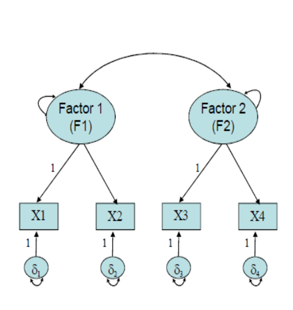
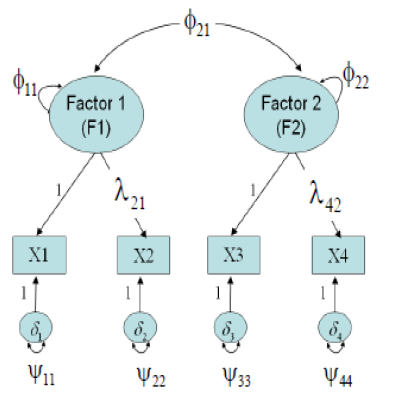

# **DFA**

-   Hipotez edilen **modelin veri ile uyumunun incelendiği YEM
    analizlerinde**, model ile veri uyumu sağlandığında, veri **hipotez
    edilen modeli destekler** ancak **alternatif hipotezleri/modelleri
    reddetmez.**

-   Diğer bir ifadeyle **farklı modeller de veriye uyum sağlayabilir.**
    Dolayısıyla araştırmacı birden fazla modelin veri ile uyumunu
    inceleyebilir ve

    -   **en iyi uyum gösteren modeli belirleyebilir.**

-   YEM analizlerinde Rosseel vd. (2018) tarafından geliştirilen
    **lavaan** paketi;

-   YEM analizleri çıktılarında Tsukahara (2022) tarafından geliştirilen
    **semoutput** paketi;

-   analizlere ilişkin diyagramların elde edilmesinde ise Epskamp vd. (2017) tarafından geliştirilen **semPlot** paketi kullanılacaktır.


```r
# install.packages(c("lavaan","semPlot"))
library(lavaan)
```

```
## This is lavaan 0.6-17
## lavaan is FREE software! Please report any bugs.
```

```r
library(semoutput)
library(semPlot)
```

-   Veri modellemenin amacı, **verinin yapısını daha anlaşılabilecek ve
    kolay yorumlanabilecek şekilde tanımlamaktır.**

-   Yapısal eşitlik modelleri (YEM) farklı modellerin test edilebilmesi
    için **esnek bir çerçeve sağlar.**

-   Temelde gözlenenen değişkenlerin **varyanslarına** ve gözlenen
    değişkenler arasındaki **kovaryanslara** dayalı olan YEM
    analizlerinin amacı bir grup gözlenen değişken arasındaki kovaryans
    örüntüsünü anlamak ve **araştırma modeli ile gözlenen değişkenlerin
    varyanslarını açıklamaktır.**


**Gözlenen Değişken**

-   **Gözlenen değişkenler** YEM dilinde göstergeler (indicators) olarak
    ifade edilir ve bunlar araştırmacının **doğrudan ölçtüğü ya da
    gözlediği değişkenleri ifade eder.**

    -   YEM terminolojisinde gözlenen değişkenler, gizil değişkenleri
        yordamaz; aksine **gizil değişkenler kendi gözlenen
        değişkenlerini yordar.**

**Gizil Değişken**

-   **Gizil değişkenler** YEM’in en önemli kavramlarından biridir ve
    araştırmacıların ilgilendikleri **zeka, güdü, duygu, tutum gibi
    soyut kavramlar ya da psikolojik yapılara** karşılık gelir.

    -   Bu yapıları ancak **dolaylı olarak, belirli davranışlar ya da
        göstergeler temelinde ölçülen değişkenler yardımıyla
        gözlenebilir .**

    -   Diğer bir ifade ile **gizil değişkenler doğrudan
        gözlenemedikleri** için bağlantılı oldukları **gözlenebilen
        başka değişkenler aracılığıyla** kestirilmeye çalışılır.

## DFA

-   **DFA**, daha önceden tanımlanmış ve sınırlandırılmış bir yapının,
    bir model olarak **doğrulanıp doğrulanmadığının** test edildiği bir
    analizdir.

-   **DFA**, psikoloji alan yazınında daha çok **ölçek geliştirmede ve
    geçerlik analizlerinde** kullanılmaktadır.

    -   Bu analizlerde, önceden belirlenmiş ya da kurgulanmış **bir
        yapının doğrulanması amaçlanmaktadır.**

-   Araştırmacı, DFA’da kuramsal bilgilere dayalı olarak belirlediği

    -   **gözlenen değişkenlerin gizil değişkenlerle** ve
    -   **gizil değişkenlerin de kendi aralarında birbiri ile ilişkili**
        olduğunu kanıtlamaya çalışır.

-   Araştırmacı, kurama dayalı olarak

    -   **geliştirdiği modelin doğrulanıp doğrulanmadığını** ya da
    -   **beklenen modelle gözlenen modelin ne ölçüde uyum
        gösterdiğini** belirlemeye çalışır.

-   DFA, **gizil değişkenler arasındaki ilişkileri betimleyen (önerilen)
    model ile elde edilen (gözlenen) verinin ne oranda uyuştuğuna**
    ilişkin ayrıntılı istatistikler sunar.

-   Geleneksel testlerin aksine, **tek bir anlamlılık değeri vermez.**
    Bu doğrultuda bulgular, verinin uygunluğuna göre ve ölçülen
    parametrelere ilişkin **çok sayıda istatistiksel ölçüt**
    kullanılarak değerlendirilir.

-   DFA’da süreç, **korelasyon ya da kovaryans matrisi** oluşturarak
    başlar.

-   Bir ölçme modelinin DFA sonuçlarında

    -   **faktörler arasındaki korelasyon** kestirimleri,

    -   göstergelerin bağlı bulunduğu **faktörler altındaki yükler** ve

    -   **her bir gösterge için ölçme hatalarının** miktarını verir.

-   Eğer araştırmacının başlangıçtaki ölçme modeli mantıklı bir biçimde
    doğrulanıyor ise dikkat edilmesi gereken durumlar şunlardır:

-   Ortak bir faktör altında ölçme yapmak için belirlenen göstergelerin
    tümünün, **o faktörde oldukça yüksek yüklere sahip olması** -
    **yakınsak geçerlik**

-   **Faktörler arasındaki korelasyon kestirimlerinin aşırı yüksek
    olmaması** (örneğin \>0,85) - **ayırt edici geçerlik**

## DFA vs AFA

-   **Açımlayıcı analizlerde temel amaç**, yapısal bir modele ulaşmak ya
    da kuram üretmek olmasına karşın, **kurama ilişkin ilk ya da temel
    bilgilere ulaşılabilir.**

-   Diğer taraftan **doğrulayıcı analizlerde**, daha önceki kapsamlı
    araştırmalardan elde edilen bilgi ya da tecrübeye dayanan
    durumlardan ve gözlemler çerçevesinde varsayımlar için model
    oluşturulur.

    -   Bu varsayımlar temelinde **önceden kurulan modelin, bazı
        parametreler açısından doğruluğu test edilir.**

**Tek Faktörlü DFA Modeli Örneği**

-   **X1, X2 ve X3** gizil faktörün göstergeleridir. Gizil faktör bu üç
    göstergenin altında yatan tek ortak yapıdır.

-   Diğer bir ifadeyle, **göstergeler arasındaki kovaryansı üretecek
    gizil faktörden başka kaynaklar yoktur.**

+-------------------------------------+-------------------------------------------------------------+
|                                     | -   Her bir gözlenen puan iki bileşene sahiptir: **faktörün |
| {width="300"}  |     neden olduğu puan ve faktörün neden olmadığı puan.**    |
|                                     |                                                             |
|                                     | -   Faktörün neden olmadığı kısım bir hata terimi ile       |
|                                     |     gösterilir. Bu hata terimleri şemada $\delta_1$,        |
|                                     |     $\delta_2$ ve $\delta_3$ ile temsil edilmektedir.       |
+-------------------------------------+-------------------------------------------------------------+

-   $\delta_1$ gibi bir hata terimi iki bileşenden oluşur:

    -   Her bir göstergeye özel olan güvenilir bir puan
    -   Ölçme hatasından dolayı güvenilir olmayan bir hata puanı

-   **Kuramsal olarak bu iki bileşen ayırt edilemez.**

-   DFA’da $\delta_1$ gibi bir hata terimi ölçme hatası olarak
    adlandırılır ancak bu terim **iki bileşenin kombinasyonudur.**

  -   tesadüfi hataları **güvenilir olmayan değerler**, ölçülen özellik
    dışında ölçmeye karışan diğer özellikler **güvenilir olan değerler**

| {width="300"}  |

<<<<<<< HEAD
-   Faktör ve göstergeyi bağlayan yola  faktör yükü adı verilir.  

-   Faktör yükü $\lambda$ simgesi ile gösterilir. $\lambda_2$ ,  X2 göstergesinin gizil faktördeki   yüküdür. $\lambda_3$ , X3 göstergesinin gizil faktördeki yüküdür.       

-   $\lambda_1$ , X1 göstergesinin gizil  faktördeki yüküdür ancak **1**   değerine sabitlenmiştir.              
=======
-   Faktör ve göstergeyi bağlayan yola  faktör yükü adı verilir.          
-   Faktör yükü $\lambda$ simgesi ile gösterilir. $\lambda_2$ , 
X2 göstergesinin gizil faktördeki   yüküdür.     
-   $\lambda_3$ , X3 göstergesinin gizilfaktördeki yüküdür.                   
-   $\lambda_1$ , X1 göstergesinin gizil  
    faktördeki yüküdür ancak **1**   değerine sabitlenmiştir.              
>>>>>>> 53c884e75bb49cdc5a643746d5327332034c94fe


-   Gizil değişken **F**, gizil olduğundan sabit bir ölçeğe sahip
    değildir. Bu nedenle, faktör yüklerinin ölçekleri belirlenemez. İki
    olası çözüm aşağıdaki gibidir:
    -   **Faktör yüklerin ölçeği sabitlenir ve gizil değişkenin ölçeği
        serbestçe kestirilir.**
    -   Gizil değişkenin ölçeği sabitlenir ve faktör yüklerinin
        ölçekleri serbestçe kestirilir.

+----------------------------------+----------------------------------+
| İki Faktörlü DFA Modeli Örneği   |                                  |
+==================================+==================================+
|             | -   X1 ve X2 F1’in               |
|                                  |     göstergeleridir.             |
|                                  |                                  |
|                                  | -   X3 ve X4 F2’nin              |
|                                  |     göstergeleridir.             |
|                                  |                                  |
|                                  | -   F1 ve F2 arasında bir        |
|                                  |     korelasyon vardır.           |
|                                  |                                  |
|                                  | -   X1, X2, X3 ve X4             |
|                                  |     göstergeleri etki            |
|                                  |     göstergeleri (effect         |
|                                  |     indicators) veya yansıtıcı   |
|                                  |     göstergeler (reflective      |
|                                  |     indicators) olarak           |
|                                  |     adlandırılırlar.             |
+----------------------------------+----------------------------------+

-   X1, X2, X3 ve X4 göstergeleri etki göstergeleri (effect indicators)
    veya yansıtıcı göstergeler (reflective indicators) olarak
    adlandırılırlar.

$$X=\Lambda\xi +\delta$$

$$\begin{bmatrix}{}
X_{1}\\
X_{2}\\
X_{3}\\
X_{4}\\
\end{bmatrix} = \begin{bmatrix}{}
1 & 0 \\
\lambda_{21} & 0 \\
0 & 1 \\
0 & \lambda_{42} \\
\end{bmatrix}
\begin{bmatrix}{}
\xi_{1}\\
\xi_{1}\\
\end{bmatrix} + \begin{bmatrix}{}
\delta_{1}\\
\delta_{2}\\
\delta_{3}\\
\delta_{4}\\
\end{bmatrix}$$

-   DFA modelinde 3 tip kovaryans matrisi tanımlanmalıdır:

-   $\sum$ (sigma): ölçülen gözlenen değişkenleri kovaryans matrisi

-   $\phi$ (phi): gizil faktörlerin kovaryans matrisi

-   $\Psi$ (psi): ölçme hatalarının kovaryans matrisi

## DFA Modeli: Kovaryans Matrisi

-   Model için kovaryans matrisi model parametrelerinin bir fonksiyonu
    $\sum(\theta) = \Lambda\phi\Lambda' + \Psi$  olarak temsil edilebilir:
<<<<<<< HEAD


=======


::: {style="font-family: Arial; font-size: 8px;"}
>>>>>>> 53c884e75bb49cdc5a643746d5327332034c94fe
$$\begin{bmatrix}{}
VAR_{X_1}\\
COV_{X_1,X_2} & VAR_{X_2}\\
COV_{X_1,X_3} & COV_{X_2,X_3} & VAR_{X_3}\\
COV_{X_1,X_4} & COV_{X_2,X_4} & COV_{X_3,X_4} & VAR_{X_4}\\ 
\end{bmatrix}$$

$$= \begin{bmatrix}{}1 & 0 \\
\lambda_{21} & 0 \\
0 & 1 \\
0 & \lambda_{42} \\
\end{bmatrix}
\begin{bmatrix}{}
\phi_{11}\\
\phi_{21} & \phi_{22}\\
\end{bmatrix}\begin{bmatrix}{}
1 & \lambda_{21} & 0 & 0\\
0 & 0 & 1 & \lambda_{42}\\
\end{bmatrix} + \begin{bmatrix}{}
\Psi_{11}\\
0 & \Psi_{22}\\
0 & 0 & \Psi_{33}\\
0 & 0 & 0 & \Psi_{44}\\
\end{bmatrix}$$

$\sum(\theta)$, $\phi$, $\psi$ matrisleri simetrik matrislerdir ancak
eşitlikte sadece alt üçgen sunulur.



Kovaryans matrislerinden model için serbestçe kestirilecek parametreler
sayılabilir:

|                      |                                           |
|----------------------|-------------------------------------------|
| Faktör varyansları   | $\phi_{11} \phi_{22}$                     |
| Faktör kovaryansları | $\phi_{21}$                               |
| Hata varyansları     | $\Psi_{11} \Psi_{22} \Psi_{33} \Psi_{44}$ |
| Faktör yükleri       | $\lambda_{21} \lambda_{42}$               |


Bu nedenle,

-   $\lambda_{21}$ X2’nin Faktör 1’deki yüküdür.

-   $\lambda_{42}$ X4’ün Faktör 2’deki yüküdür.

-   $\lambda_{11}$ ve $\lambda_{32}$ şemada değerleri 1’e sabitlenmiş
    olarak gösterilmektedir

## Standart DFA Modelleri


-   **Standart DFA** modelleri aşağıdaki özelliklere sahiptir:

-   Her bir gösterge sürekli bir değişkendir ve tek bir faktörün (factor
    complexity = 1) ve ölçme hatasının bir fonksiyonudur.

-   Ölçme hataları birbirlerinden ve faktörlerden bağımsızdır.

-   Faktörlerin arasında korelasyon vardır.

### DFA modellerinin parametreleri:


-   Standart DFA modellerinde, **faktörler dışsal değişkenlerdir.**

-   Dışsal değişkenlerin **varyansları ve kovaryanslarıdır.**

-   Faktörlerin göstergeler üzerindeki **doğrudan etkileridir.**
    (örneğin, faktör yükleri)


-   Faktörlerin varyansları: 2

-   Faktörlerin kovaryansları: 1

-   Hataların varyansları: 4

-   Faktör yükleri: 2 (diğer iki faktör yükü 1’e sabitlenmiştir)

-   Modelden **serbestçe kestirilecek 9 parametre** vardır.


-   DFA literatüründe bir gizil faktörü temsil etmek üzere genellikle F
    yerine $\xi$ kullanılır.

-   Faktor yukleri 1'e


-   Faktor varyansları 1'e


-   Her ikisinde de 9 tane serbestce kestirilecek parametre
    bulunmaktadır.

### Modelin Tanımlanması

-   DFA modelinde gözlemlerin sayısı yol analizi modelindeki gibi
    hesaplanır:

    -   $v (v + 1) / 2$

-   İki faktörlü DFA modeli örneğinde gözlemlerin sayısı:

-   $4 (4 + 1) / 2 = 10$ (v = 4, gözlenen değişken sayısı)

-   Yönlü ilişkili (recursive) yol modellerinde , eğer gözlemlerin
    sayısı model parametrelerinin sayısına eşit veya daha büyükse **sd ≥
    0** model tanımlanır. Ancak DFA’da, **sd ≥ 0** koşulunun sağlanması
    zorunlu fakat yeterli değildir.

-   dört gözlenen değişkenli DFA modeli örneğinde gözlemlerin sayısı:

$$\begin{bmatrix}{}
VAR_{X_1}\\
COV_{X_1,X_2} & VAR_{X_2}\\
COV_{X_1,X_3} & COV_{X_2,X_3} & VAR_{X_3}\\
COV_{X_1,X_4} & COV_{X_2,X_4} & COV_{X_3,X_4} & VAR_{X_4}\\ 
\end{bmatrix}{}$$

## Modifikasyon


-   DFA modelleri hatalar arasında korelasyonun tanımlanmasına izin
    verir.

-   Araştırmacılar bir ölçüm için hataların arasında korelasyon olmaması
    sayıltısının olağan olarak ihlal edildiğini tartışırlar (Schmidt &
    Hunter, 1996).

-   Ancak hatalar arasındaki korelasyonun modele eklenmesi **tanımlama
    problemlerine neden olabilir.**

## Yeterli Gereklilikler

-   Zorunlu gerekliliklerin karşılanması DFA modelinin tanımlanmasını
    garantilemez. Yeterli gereklilikler.

-   Eğer

    -   **standart bir tek faktörlü DFA modeli en az üç göstergeye**
        sahipse,

    -   **standart bir iki veya daha fazla faktörlü** DFA modelinde her
        bir faktör için **en az iki göstergeye** varsa,

model tanımlanır.

-   **Çapraz yüklü veya hatalar arasında korelasyona** sahip bir DFA
    modeli için ise kolayca uygulanan yeterli koşul yoktur.

-   Model parametresi araştırmacının tanımlamasına bağlı olarak
    **serbest** (free), **sabit** (fixed) veya **sınırlandırılmış**
    (constrained) olabilir.

    -   **Serbest parametre** (free parameter) örneklem verisinden
        bilgisayar yazılımı tarafından kestirilen parametredir.

    -   **Sabit** parametre (fixed parameter) bir sabite eşit olarak
        belirlenen parametredir; yazılım bu sabiti veriye bağlı
        olmaksızın parametrenin kestirimi olarak kabul eder.

    -   **Sınırlandırılmış** parametre (constrained parameter) yazılım
        tarafından belli sınırlılıklar içerisinde kestirilir ancak bir
        sabite eşit olmak üzere sabitlenmez.


-   Bir modelinin tanımlanabilmesi için **kestirilecek olan model
    parametre sayısının gözlenen parametre sayısına eşit** veya
    **gözlenen parametre sayısından küçük olması** gerekir.

    -   **sd\<0** olduğunda model tanımlanamaz.

    -   **sd=0**, model ancak tanımlanır (just identification) ve
        kuramsal olarak her parametrenin tek bir çözümü vardır. Ancak
        tanımlanan modellerde model veriye mükemmel uyum gösterir.

    -   **sd\>0**, model aşırı tanımlanmış (over identification) olur.
        Aşırı tanımlanan modellerde kuramsal olarak her bir parametrenin
        birden fazla çözümü vardır.


-   X1’in faktör yükü **1**’e sabitlendiğinde, F1’in ölçme birimi X1’in
    ölçme birimiyle aynı olur. Bu durumda X1 **işaret veya referans
    değişken** adını alır.

-   Benzer şekilde, X3 de F2 için **referans değişkendir.**

-   Referans değişken birinci gösterge olmak zorunda değildir. Örneğin,
    X2 de F1 için referans değişken olarak seçilebilir.

    -   Referans değişken belirlendiginde, **değişkenin örneklem
        varyansının bir kısmı gizil değişkene geçer**


-   hem F1 hem de F2 puanları **ortalaması 0 ve standart sapması 1**
    olan bir ölçeğe sahip olurlar.

-   bütün faktör yükleri serbestçe kestirilir.

-   Model parametreleri:

    -   Faktörlerin varyansları: 0
        -   *1’e sabitlenmişlerdir*\
    -   Faktörlerin kovaryansları: 1
    -   Hataların varyansları: 4
    -   Faktör yükleri: 4

## Çapraz Yüklü DFA Modelleri


-   Verilen örnekte X2 hem F1 hem de F2’nin göstergesidir.

-   Bazen bazı göstergeler birden fazla faktörü ölçmek için
    tasarlanmıştır (factor complexity > 1). Böyle bir DFA modeli **artık standart bir DFA modeli** değildir.

## Model-Veri Uyumunun Değerlendirilmesi

-   Kestirilen parametre sayısından daha fazla sayıda gözleme sahip olan
    **aşırı tanımlanan** (overidentified) modeller **genellikle veriye
    mükemmel uyum sağlamaz.**

-   Bu durumda böyle **modellerin veriyle ne derece uyumlu** olduğunu
    ölçmeye ihtiyaç vardır.

-   YEM literatüründe tanımlanan **çok sayıda model uyum indeksi
    vardır** ve sürekli olarak yeni indeksler geliştirilmektedir.

-   Çok sayıda farklı uyum indeksinin olması bazı problemleri de
    beraberinde getirir:

    -   Farklı makalelerde **farklı uyum indeksleri** rapor edilir.

    -   Aynı makale için farklı hakemler kendi bildikleri veya tercih
        ettikleri farklı indekslerin rapor edilmesini isteyebilirler.

    -   Uyum indekslerinin değerlerini rapor ederken seçici davranma
        olasılığı vardır (örneğin, sadece iyi uyum öneren uyum
        indekslerinin rapor edilmesi gibi).

-   YEM uygulamalarına ve simülasyon çalışmalarına göre YEM analizinin
    sonuçlarını rapor ederken sunulacak ve yorumlanacak uyum indeksleri
    aşağıdaki gibidir:

-   Model **Ki-Kare** Değeri

-   Steiger-Lind Root Mean Square Error of Approximation **RMSEA**
    (Steiger, 1990) (%90 güven aralığı ile birlikte)

-   Bentler Comparative Fit Index **CFI** (Bentler, 1990)

-   Standardized Root Mean Square Residual **SRMR**

-   **Çoklu indekslerin kullanılması** bir modelin uyumu ile ilgili **en
    doğru yaklaşımı verecektir.**

| Uyum indeksi |      İyi uyum       | Kabul Edilebilir Uyum |
|:------------:|:-------------------:|:---------------------:|
|   $\chi^2$   |          p          |                       |
| $\chi^2/df$  | 0 ≤ $\chi^2/df$ ≤ 2 | 2 \< $\chi^2/df$ \< 8 |
|     SRMR     |    0 ≤SRMR ≤ .05    |  .05 \< SRMR \< .10   |
|    RMSEA     |   0 ≤RMSEA ≤ .05    |  .05 \< RMSEA \< .08  |
|     CFI      |    .95 ≤GFI ≤ 1     |   .90 \< GFI \< .95   |

Not: Bu kesme değerlerin kullanılmasıyla ilgili çok sayıda tartışma
vardır. 


### Uyum İndekslerini Raporlarken Öneriler

-   örneğin, CFI, örneklem büyüklüğüne duyarlıdır.

-   Oldukça küçük bir örneklem (örneğin, N = 200) hemen hemen her zaman
    oldukça büyük bir örneklemden (örneğin, N = 1000) daha küçük
    **CFI**'ler üretecektir.

-   Bu nedenle, .95 gibi CFI için sabit eşikler, küçük örneklem
    boyutları için daha doğru modelleri uyumlu göstermeyecek ve daha
    büyük örneklem boyutları için ise muhtemelen daha az uyumlu
    modelleri kabul edecektir.

-   Esnek kesim noktaları belirli bir model ve örneklem özelliklerine
    uygun alternatif eşik değerleri sağlar. Bu amaçla *FCO* paketi
    kullanılabilir.


```r
library(FCO)
```

## Esnek Kesim Noktaları

-   Esnek kesim noktaları, gizli değişken sayısı (veya faktörler), gizil
    değişken başına gösterge sayısı, örneklem boyutları, faktör yükleri
    ve normal ve normal olmayan veriler için doğru şekilde belirlenmiş
    Doğrulayıcı Faktör Analizi (DFA) modellerinin simüle edilmiş
    dağılımlarından türetilir.

-   Esnek kesim noktaları, önceden tanımlanmış bir belirsizlik için
    belirli bir değerin ampirik niceliği olarak anlaşılabilir.

-   Öncelikli olarak yüzde 5'lik (veya .05) bir belirsizlik kabul
    edilirse, verilen model ve örneklem özellikleriyle doğru şekilde
    belirlenmiş DFA modelleri için simüle edilmiş dağılımın yüzde 5'lik
    niceliği esnek sınırı belirleyecektir.

<!-- - Temel uyum indeksinin doğasına bağlı olarak, ilgili güven aralığının uygun alt (GoF) veya üst (BoF) genişliği, nicelik tarafından tanımlandığı gibi, esnek sınırı türetmek için kullanılır.  -->

Niemand, T., Mai, R. Flexible cutoff values for fit indices in
the evaluation of structural equation models. J. of the Acad. Mark. Sci.
46, 1148–1172 (2018)

## Model Seçimi

-   analizlerinde **birden fazla model veriye uyum sağlayabilir.**

-   Bu durumda veriye daha iyi uyum sağlayan modelin belirlenmesi için
    **model uyumları karşılaştırılır.**

-   **Modellerden biri diğerinin alt kümesi** olduğunda modeller
    yuvalanmıştır. Örneğin, araştırmacılar farklı amaçlarla model içinde
    bazı parametreleri sınırlandırabilir. Bu durumda sınırlandırılmış
    olan model sınırlandırılmamış olan serbest model içinde yuvalanmış
    olur.

-   Yuvalanmış modeller karşılaştırılırken, **modellerin ki-kare
    değerleri arasındaki farkın anlamlılığı incelenir.**

-   Eğer iki model hiyerarşikse ve her ikisi de veriye kabul edilebilir
    ölçüde uyum sağlıyorsa, iki modelin veriye uyumunu karşılaştırmak
    için ki-kare fark test uygulanabilir.

-   Yuvalanmamış modellerin karşılaştırılmasında kullanılacak en uygun
    yaklaşım bilgi kriter değerleridir. Yaygın olarak kullanılan bilgi
    kriterleri **Akaike bilgi kriteri (AIC) ve Bayes bilgi kriteridir
    (BIC).**

-   Model seçimi yapılırken **bilgi kriteri değeri daha küçük olan model
    tercih edilir.** Bilgi kriterleri hem yuvalanmış hem de yuvalanmamış
    modellerin karşılaştırılmasında kullanılabilir.

## Varsayımlar

-   YEM analizleri genellikle **büyük örneklemler gerektirir.**

-   Örneklem büyüklüğü model karmaşıklığı ile oldukça ilişkidir ve daha
    karmaşık modeller daha büyük örneklemler gerektirir.

-   YEM analizlerine ilişkin varsayımlar ise kestirim yöntemine bağlı
    olarak değişmektedir.

-   Kullanılan kestirim yönteminin varsayımlarının sağlanmaması model
    veri uyumu, parametre ve parametrelere ilişkin hata kestirimlerinde
    yanlılığa neden olabilir. Dolayısıyla, test edilen kuram hakkında
    hatalı sonuçlar alınmasına yol açabilir.

-   Bu nedenle veri yapısına ve çalışma desenine uygun bir kestirim
    yöntemi seçilmesi oldukça önemlidir.

-   YEM analizlerinde yaygın olarak maksimum olabilirlik **ML** kestirim
    yöntemi kullanılmaktadır.

-   Benzer şekilde en küçük kareler **GLS** kestirim yöntemi de
    normallik varsayımı gerektirir.

-   Bu yöntemler normal teori yöntemleri olarak da adlandırılır.

-   Normal teori yöntemleri altında yatan beş varsayımdan
    bahsedilebilir. Bunlar

    -   gözlemlerin bağımsızlığı,
    -   büyük örneklem, doğru tanımlanmış model,
    -   çok değişkenli normallik ve verilerin sürekliliğidir.

**Normal teori yöntemleri varsayımları sağlandığında yansız, yeterli ve
tutarlı kestirimler üretir.** - doğrulayıcı faktör analizi için
**cfa()**, yapısal modeller için **sem()** fonksiyonu tanımlanmıştır.

-   **ML** yöntemi paketin varsayılan kestirim yöntemidir. Parametre
    kestirimleri açısından normallik varsayımının ihlaline dayanıklıdır.

-   Normal olmayan veriler için alan yazında yaygın olarak kullanılan
    kestirim yöntemi

    -   ağırlıklandırılmış en küçük kareler yöntemidir **WLS**
    -   Ayrıca ağırlıklandırılmamış en küçük kareler **ULS**,
    -   diyagonal olarak ağırlıklandırılmış en küçük kareler **DWLS**,
    -   kestirim yöntemleri de normal dağılmayan verilerde
        kullanılabilir.

-   Kestirim yöntemlerinin kısaltmaları programlar arasında farklılık
    gösterebilir.

## cfa fonksiyonu

+----------------+------------------------+-----------------------+
| Argüman        | Açıklama               | Değerleri             |
+================+========================+=======================+
| Model          | YEM modeli tanımlanır. |                       |
+----------------+------------------------+-----------------------+
| Data           | Gözlenen değişkenlerin |                       |
|                | yer aldığı veri        |                       |
|                | setidir.               |                       |
+----------------+------------------------+-----------------------+
|sampling.weights| Örneklem               | Veri çerçevesinde     |
|                | ağırlıklandırması      | ağırlıklandırma       |
|                | yapılacağı durumlarda  | bilgisinin yer aldığı |
|                | tanımlanır.            | değişkenin adıdır.    |
+----------------+------------------------+-----------------------+
| group          | Çoklu grup analizlerde | Veri matrisinde grubu |
|                | grup değişkeni         | tanımlayan değişkenin |
|                | tanımlanır.            | adıdır.               |
+----------------+------------------------+-----------------------+
| cluster        | Çok düzeyli            | Veri matrisinde       |
|                | analizlerde düzey      | düzeyi tanımlayan     |
|                | değişkeni tanımlanır.  | değişkenin adıdır.    |
+----------------+------------------------+-----------------------+
| constraints    | Modele eklenecek diğer |                       |
|                | sınırlandırmalar       |                       |
|                | tanımlanır.            |                       |
+----------------+------------------------+-----------------------+
| estimator      | Kestirim yöntemidir.   | “ML”, “GLS”, “WLS”,   |
|                |                        | ”ULS”, ”DWLS” gibi    |
+----------------+------------------------+-----------------------+

-   **cfa()** fonksiyonunun kullanımı aşağıdaki gibidir:


```r
cfa(model = NULL,
    data = NULL, 
    ordered = NULL, sampling.weights = NULL, 
    sample.cov = NULL, sample.mean = NULL, sample.th = NULL, 
    sample.nobs = NULL, group = NULL, cluster = NULL, 
    constraints = "", WLS.V = NULL, NACOV = NULL, ...)
```

-   **cfa()** fonksiyonu hem ham veriyle hem de gözlenen değişkenlere
    ilişkin varyans-kovaryans matrisiyle çalışabilir.

-   Girdi olarak **varyans-kovaryans matrisi kullanıldığında,** matriste
    madde adlarına karşılık gelecek şekilde satır ve sütun adları
    mutlaka bulunmalıdır. Ayrıca **örneklem ortalamasının (sample.mean)
    ve gözlem sayısının tanımlanması** (sample.nobs) gerekir.

-   Girdi olarak doğrudan **verinin kendisi girildiğindeyse**, örneklem
    ortalaması ve gözlem sayısının tanımlanmasına gerek yoktur.

-   Tüm YEM fonksiyonlarında olduğu gibi **cfa()** fonksiyonu için de
    **ilk olarak DFA modelinin tanımlanması gerekir.**

-   DFA modeli tırnak işareti içinde tanımlanır ve faktörler maddeler
    ile **'=\~'** işaretiyle ilişkilendirilir.

-   İşaretin sol tarafında faktörler sağ tarafında maddeler yer alır.
    Her bir faktörde yer alan maddelerin adları sırasıyla **+**
    operatörüyle eklenir.


```r
' F1  =~ m1 + m2 +m3'
```

## Uygulama

-   Yaşam doyumu verileri, yaşam doyumunun farklı yönlerine/alanlarına
    ilişkin 10 maddeden oluşmaktadır. Ne kadar mennunsun:

|     |                                     |
|-----|-------------------------------------|
| m1  | okul notun                          |
| m2  | dış görünüşünüz                     |
| m3  | öğretmeninizle ilişkiniz            |
| m4  | okul hayatın                        |
| m5  | sosyal hayatınız                    |
| m6  | senin kişiliğin                     |
| m7  | arkadaşlarınızla olan ilişkileriniz |
| m8  | anne babanla ilişkiniz              |
| m9  | senin aile hayatın                  |
| m10 | sosyo-ekonomik durumunuz            |

1 = “hiç memnun değilim” ile 7 = “çok memnunum” arasında 7 puanlık bir
ölçekle alınmış sonuçlar.

-   Verinin okunması


```r
library(openxlsx)
yasamdoyum <- read.xlsx("import/yasamdoyum.xlsx")
head(yasamdoyum)
```

<div class="kable-table">

| ID|cinsiyet | yas| okul1| okul2| okul3| kisi1| kisi2| arkadas1| arkadas2| aile1| aile2| aile3|
|--:|:--------|---:|-----:|-----:|-----:|-----:|-----:|--------:|--------:|-----:|-----:|-----:|
|  1|kadin    |  13|     5|     6|     2|     4|     7|        6|        7|     7|     7|     7|
|  2|erkek    |  14|     5|     5|     4|     4|     5|        5|        5|     5|     5|     4|
| 10|kadin    |  14|     7|     2|     1|     7|     6|        5|        5|     7|     6|     6|
| 11|kadin    |  14|     1|     6|     5|     6|     6|        6|        7|     7|     7|     7|
| 12|kadin    |  14|     5|     6|     5|     6|     6|        6|        7|     6|     5|     6|
| 14|erkek    |  14|     4|     6|     5|     5|     5|        6|        6|     6|     5|     5|

</div>

-   Modelin tanımlanması


```r
model_1 <- 
"
okul =~ okul1 + okul2 + okul3
kisi =~ kisi1 + kisi2
arkadas =~ arkadas1 + arkadas2
aile =~ aile1 + aile2 + aile3
"
```

-   DFA modelinin testi


```r
model_1_fit <- cfa(model_1, data = yasamdoyum)
summary(model_1_fit, fit.measures = TRUE, standardized = TRUE)
```

```
## lavaan 0.6.17 ended normally after 40 iterations
## 
##   Estimator                                         ML
##   Optimization method                           NLMINB
##   Number of model parameters                        26
## 
##   Number of observations                           255
## 
## Model Test User Model:
##                                                       
##   Test statistic                                51.433
##   Degrees of freedom                                29
##   P-value (Chi-square)                           0.006
## 
## Model Test Baseline Model:
## 
##   Test statistic                               583.039
##   Degrees of freedom                                45
##   P-value                                        0.000
## 
## User Model versus Baseline Model:
## 
##   Comparative Fit Index (CFI)                    0.958
##   Tucker-Lewis Index (TLI)                       0.935
## 
## Loglikelihood and Information Criteria:
## 
##   Loglikelihood user model (H0)              -3427.760
##   Loglikelihood unrestricted model (H1)      -3402.044
##                                                       
##   Akaike (AIC)                                6907.520
##   Bayesian (BIC)                              6999.593
##   Sample-size adjusted Bayesian (SABIC)       6917.166
## 
## Root Mean Square Error of Approximation:
## 
##   RMSEA                                          0.055
##   90 Percent confidence interval - lower         0.029
##   90 Percent confidence interval - upper         0.079
##   P-value H_0: RMSEA <= 0.050                    0.341
##   P-value H_0: RMSEA >= 0.080                    0.045
## 
## Standardized Root Mean Square Residual:
## 
##   SRMR                                           0.053
## 
## Parameter Estimates:
## 
##   Standard errors                             Standard
##   Information                                 Expected
##   Information saturated (h1) model          Structured
## 
## Latent Variables:
##                    Estimate  Std.Err  z-value  P(>|z|)   Std.lv  Std.all
##   okul =~                                                               
##     okul1             1.000                               0.572    0.420
##     okul2             1.431    0.257    5.572    0.000    0.819    0.638
##     okul3             1.995    0.403    4.947    0.000    1.141    0.858
##   kisi =~                                                               
##     kisi1             1.000                               0.730    0.669
##     kisi2             0.940    0.156    6.028    0.000    0.685    0.784
##   arkadas =~                                                            
##     arkadas1          1.000                               0.661    0.791
##     arkadas2          0.614    0.117    5.235    0.000    0.406    0.531
##   aile =~                                                               
##     aile1             1.000                               0.782    0.742
##     aile2             1.061    0.129    8.233    0.000    0.830    0.846
##     aile3             0.598    0.084    7.136    0.000    0.467    0.510
## 
## Covariances:
##                    Estimate  Std.Err  z-value  P(>|z|)   Std.lv  Std.all
##   okul ~~                                                               
##     kisi              0.075    0.039    1.947    0.052    0.180    0.180
##     arkadas           0.111    0.039    2.862    0.004    0.293    0.293
##     aile              0.098    0.040    2.427    0.015    0.219    0.219
##   kisi ~~                                                               
##     arkadas           0.296    0.059    5.049    0.000    0.614    0.614
##     aile              0.142    0.052    2.735    0.006    0.249    0.249
##   arkadas ~~                                                            
##     aile              0.178    0.048    3.700    0.000    0.344    0.344
## 
## Variances:
##                    Estimate  Std.Err  z-value  P(>|z|)   Std.lv  Std.all
##    .okul1             1.528    0.147   10.414    0.000    1.528    0.824
##    .okul2             0.978    0.137    7.130    0.000    0.978    0.593
##    .okul3             0.469    0.209    2.245    0.025    0.469    0.265
##    .kisi1             0.656    0.100    6.575    0.000    0.656    0.552
##    .kisi2             0.295    0.076    3.865    0.000    0.295    0.386
##    .arkadas1          0.262    0.079    3.301    0.001    0.262    0.375
##    .arkadas2          0.419    0.047    8.948    0.000    0.419    0.718
##    .aile1             0.498    0.079    6.336    0.000    0.498    0.449
##    .aile2             0.274    0.077    3.574    0.000    0.274    0.285
##    .aile3             0.622    0.061   10.240    0.000    0.622    0.740
##     okul              0.327    0.109    3.001    0.003    1.000    1.000
##     kisi              0.532    0.120    4.452    0.000    1.000    1.000
##     arkadas           0.437    0.095    4.594    0.000    1.000    1.000
##     aile              0.611    0.109    5.593    0.000    1.000    1.000
```

-   Analizin çıktıları incelendiğinde, ilk olarak iterasyon sayısı,
    modelde kestirilen parametre sayısı, gözlem sayısı ve kullanılan
    kestirim yöntemi bilgileri yer almaktadır.

-   Sonrasında ki-kare istatistikleri ve model uyum indeksleri
    raporlanmıştır.

-   Bu çıktıları daha düzgün elde etmek içi **semoutput** paketi
    kullanılabilir.


```r
# devtools::install_github("dr-JT/semoutput")
library(semoutput)
sem_sig(model_1_fit)
```

```{=html}
<<<<<<< HEAD
<div id="lnshomecyj" style="padding-left:0px;padding-right:0px;padding-top:10px;padding-bottom:10px;overflow-x:auto;overflow-y:auto;width:auto;height:auto;">
<style>#lnshomecyj table {
=======
<div id="uwctsjigjh" style="padding-left:0px;padding-right:0px;padding-top:10px;padding-bottom:10px;overflow-x:auto;overflow-y:auto;width:auto;height:auto;">
<style>#uwctsjigjh table {
>>>>>>> 53c884e75bb49cdc5a643746d5327332034c94fe
  font-family: system-ui, 'Segoe UI', Roboto, Helvetica, Arial, sans-serif, 'Apple Color Emoji', 'Segoe UI Emoji', 'Segoe UI Symbol', 'Noto Color Emoji';
  -webkit-font-smoothing: antialiased;
  -moz-osx-font-smoothing: grayscale;
}

<<<<<<< HEAD
#lnshomecyj thead, #lnshomecyj tbody, #lnshomecyj tfoot, #lnshomecyj tr, #lnshomecyj td, #lnshomecyj th {
  border-style: none;
}

#lnshomecyj p {
=======
#uwctsjigjh thead, #uwctsjigjh tbody, #uwctsjigjh tfoot, #uwctsjigjh tr, #uwctsjigjh td, #uwctsjigjh th {
  border-style: none;
}

#uwctsjigjh p {
>>>>>>> 53c884e75bb49cdc5a643746d5327332034c94fe
  margin: 0;
  padding: 0;
}

<<<<<<< HEAD
#lnshomecyj .gt_table {
=======
#uwctsjigjh .gt_table {
>>>>>>> 53c884e75bb49cdc5a643746d5327332034c94fe
  display: table;
  border-collapse: collapse;
  line-height: normal;
  margin-left: 0;
  margin-right: auto;
  color: #333333;
  font-size: 16px;
  font-weight: normal;
  font-style: normal;
  background-color: #FFFFFF;
  width: auto;
  border-top-style: solid;
  border-top-width: 0px;
  border-top-color: #A8A8A8;
  border-right-style: none;
  border-right-width: 2px;
  border-right-color: #D3D3D3;
  border-bottom-style: solid;
  border-bottom-width: 0px;
  border-bottom-color: #A8A8A8;
  border-left-style: none;
  border-left-width: 2px;
  border-left-color: #D3D3D3;
}

<<<<<<< HEAD
#lnshomecyj .gt_caption {
=======
#uwctsjigjh .gt_caption {
>>>>>>> 53c884e75bb49cdc5a643746d5327332034c94fe
  padding-top: 4px;
  padding-bottom: 4px;
}

<<<<<<< HEAD
#lnshomecyj .gt_title {
=======
#uwctsjigjh .gt_title {
>>>>>>> 53c884e75bb49cdc5a643746d5327332034c94fe
  color: #333333;
  font-size: 18px;
  font-weight: bolder;
  padding-top: 10px;
  padding-bottom: 10px;
  padding-left: 15px;
  padding-right: 15px;
  border-bottom-color: #FFFFFF;
  border-bottom-width: 0;
}

<<<<<<< HEAD
#lnshomecyj .gt_subtitle {
=======
#uwctsjigjh .gt_subtitle {
>>>>>>> 53c884e75bb49cdc5a643746d5327332034c94fe
  color: #333333;
  font-size: 85%;
  font-weight: initial;
  padding-top: 9px;
  padding-bottom: 11px;
  padding-left: 15px;
  padding-right: 15px;
  border-top-color: #FFFFFF;
  border-top-width: 0;
}

<<<<<<< HEAD
#lnshomecyj .gt_heading {
=======
#uwctsjigjh .gt_heading {
>>>>>>> 53c884e75bb49cdc5a643746d5327332034c94fe
  background-color: #FFFFFF;
  text-align: left;
  border-bottom-color: #FFFFFF;
  border-left-style: none;
  border-left-width: 1px;
  border-left-color: #D3D3D3;
  border-right-style: none;
  border-right-width: 1px;
  border-right-color: #D3D3D3;
}

<<<<<<< HEAD
#lnshomecyj .gt_bottom_border {
=======
#uwctsjigjh .gt_bottom_border {
>>>>>>> 53c884e75bb49cdc5a643746d5327332034c94fe
  border-bottom-style: solid;
  border-bottom-width: 0px;
  border-bottom-color: #D3D3D3;
}

<<<<<<< HEAD
#lnshomecyj .gt_col_headings {
=======
#uwctsjigjh .gt_col_headings {
>>>>>>> 53c884e75bb49cdc5a643746d5327332034c94fe
  border-top-style: solid;
  border-top-width: 0px;
  border-top-color: #D3D3D3;
  border-bottom-style: solid;
  border-bottom-width: 2px;
  border-bottom-color: #D3D3D3;
  border-left-style: none;
  border-left-width: 1px;
  border-left-color: #D3D3D3;
  border-right-style: none;
  border-right-width: 1px;
  border-right-color: #D3D3D3;
}

<<<<<<< HEAD
#lnshomecyj .gt_col_heading {
=======
#uwctsjigjh .gt_col_heading {
>>>>>>> 53c884e75bb49cdc5a643746d5327332034c94fe
  color: #333333;
  background-color: #FFFFFF;
  font-size: 100%;
  font-weight: bold;
  text-transform: inherit;
  border-left-style: none;
  border-left-width: 1px;
  border-left-color: #D3D3D3;
  border-right-style: none;
  border-right-width: 1px;
  border-right-color: #D3D3D3;
  vertical-align: bottom;
  padding-top: 6px;
  padding-bottom: 7px;
  padding-left: 15px;
  padding-right: 15px;
  overflow-x: hidden;
}

<<<<<<< HEAD
#lnshomecyj .gt_column_spanner_outer {
=======
#uwctsjigjh .gt_column_spanner_outer {
>>>>>>> 53c884e75bb49cdc5a643746d5327332034c94fe
  color: #333333;
  background-color: #FFFFFF;
  font-size: 100%;
  font-weight: bold;
  text-transform: inherit;
  padding-top: 0;
  padding-bottom: 0;
  padding-left: 4px;
  padding-right: 4px;
}

<<<<<<< HEAD
#lnshomecyj .gt_column_spanner_outer:first-child {
  padding-left: 0;
}

#lnshomecyj .gt_column_spanner_outer:last-child {
  padding-right: 0;
}

#lnshomecyj .gt_column_spanner {
=======
#uwctsjigjh .gt_column_spanner_outer:first-child {
  padding-left: 0;
}

#uwctsjigjh .gt_column_spanner_outer:last-child {
  padding-right: 0;
}

#uwctsjigjh .gt_column_spanner {
>>>>>>> 53c884e75bb49cdc5a643746d5327332034c94fe
  border-bottom-style: solid;
  border-bottom-width: 2px;
  border-bottom-color: #D3D3D3;
  vertical-align: bottom;
  padding-top: 6px;
  padding-bottom: 6px;
  overflow-x: hidden;
  display: inline-block;
  width: 100%;
}

<<<<<<< HEAD
#lnshomecyj .gt_spanner_row {
  border-bottom-style: hidden;
}

#lnshomecyj .gt_group_heading {
=======
#uwctsjigjh .gt_spanner_row {
  border-bottom-style: hidden;
}

#uwctsjigjh .gt_group_heading {
>>>>>>> 53c884e75bb49cdc5a643746d5327332034c94fe
  padding-top: 8px;
  padding-bottom: 8px;
  padding-left: 15px;
  padding-right: 15px;
  color: #333333;
  background-color: #FFFFFF;
  font-size: 100%;
  font-weight: initial;
  text-transform: inherit;
  border-top-style: solid;
  border-top-width: 2px;
  border-top-color: #D3D3D3;
  border-bottom-style: solid;
  border-bottom-width: 2px;
  border-bottom-color: #D3D3D3;
  border-left-style: none;
  border-left-width: 1px;
  border-left-color: #D3D3D3;
  border-right-style: none;
  border-right-width: 1px;
  border-right-color: #D3D3D3;
  vertical-align: middle;
  text-align: left;
}

<<<<<<< HEAD
#lnshomecyj .gt_empty_group_heading {
=======
#uwctsjigjh .gt_empty_group_heading {
>>>>>>> 53c884e75bb49cdc5a643746d5327332034c94fe
  padding: 0.5px;
  color: #333333;
  background-color: #FFFFFF;
  font-size: 100%;
  font-weight: initial;
  border-top-style: solid;
  border-top-width: 2px;
  border-top-color: #D3D3D3;
  border-bottom-style: solid;
  border-bottom-width: 2px;
  border-bottom-color: #D3D3D3;
  vertical-align: middle;
}

<<<<<<< HEAD
#lnshomecyj .gt_from_md > :first-child {
  margin-top: 0;
}

#lnshomecyj .gt_from_md > :last-child {
  margin-bottom: 0;
}

#lnshomecyj .gt_row {
=======
#uwctsjigjh .gt_from_md > :first-child {
  margin-top: 0;
}

#uwctsjigjh .gt_from_md > :last-child {
  margin-bottom: 0;
}

#uwctsjigjh .gt_row {
>>>>>>> 53c884e75bb49cdc5a643746d5327332034c94fe
  padding-top: 8px;
  padding-bottom: 8px;
  padding-left: 15px;
  padding-right: 15px;
  margin: 10px;
  border-top-style: solid;
  border-top-width: 1px;
  border-top-color: #D3D3D3;
  border-left-style: none;
  border-left-width: 1px;
  border-left-color: #D3D3D3;
  border-right-style: none;
  border-right-width: 1px;
  border-right-color: #D3D3D3;
  vertical-align: middle;
  overflow-x: hidden;
}

<<<<<<< HEAD
#lnshomecyj .gt_stub {
=======
#uwctsjigjh .gt_stub {
>>>>>>> 53c884e75bb49cdc5a643746d5327332034c94fe
  color: #333333;
  background-color: #FFFFFF;
  font-size: 100%;
  font-weight: initial;
  text-transform: inherit;
  border-right-style: solid;
  border-right-width: 2px;
  border-right-color: #D3D3D3;
  padding-left: 15px;
  padding-right: 15px;
}

<<<<<<< HEAD
#lnshomecyj .gt_stub_row_group {
=======
#uwctsjigjh .gt_stub_row_group {
>>>>>>> 53c884e75bb49cdc5a643746d5327332034c94fe
  color: #333333;
  background-color: #FFFFFF;
  font-size: 100%;
  font-weight: initial;
  text-transform: inherit;
  border-right-style: solid;
  border-right-width: 2px;
  border-right-color: #D3D3D3;
  padding-left: 15px;
  padding-right: 15px;
  vertical-align: top;
}

<<<<<<< HEAD
#lnshomecyj .gt_row_group_first td {
  border-top-width: 2px;
}

#lnshomecyj .gt_row_group_first th {
  border-top-width: 2px;
}

#lnshomecyj .gt_summary_row {
=======
#uwctsjigjh .gt_row_group_first td {
  border-top-width: 2px;
}

#uwctsjigjh .gt_row_group_first th {
  border-top-width: 2px;
}

#uwctsjigjh .gt_summary_row {
>>>>>>> 53c884e75bb49cdc5a643746d5327332034c94fe
  color: #333333;
  background-color: #FFFFFF;
  text-transform: inherit;
  padding-top: 8px;
  padding-bottom: 8px;
  padding-left: 15px;
  padding-right: 15px;
}

<<<<<<< HEAD
#lnshomecyj .gt_first_summary_row {
=======
#uwctsjigjh .gt_first_summary_row {
>>>>>>> 53c884e75bb49cdc5a643746d5327332034c94fe
  border-top-style: solid;
  border-top-color: #D3D3D3;
}

<<<<<<< HEAD
#lnshomecyj .gt_first_summary_row.thick {
  border-top-width: 2px;
}

#lnshomecyj .gt_last_summary_row {
=======
#uwctsjigjh .gt_first_summary_row.thick {
  border-top-width: 2px;
}

#uwctsjigjh .gt_last_summary_row {
>>>>>>> 53c884e75bb49cdc5a643746d5327332034c94fe
  padding-top: 8px;
  padding-bottom: 8px;
  padding-left: 15px;
  padding-right: 15px;
  border-bottom-style: solid;
  border-bottom-width: 2px;
  border-bottom-color: #D3D3D3;
}

<<<<<<< HEAD
#lnshomecyj .gt_grand_summary_row {
=======
#uwctsjigjh .gt_grand_summary_row {
>>>>>>> 53c884e75bb49cdc5a643746d5327332034c94fe
  color: #333333;
  background-color: #FFFFFF;
  text-transform: inherit;
  padding-top: 8px;
  padding-bottom: 8px;
  padding-left: 15px;
  padding-right: 15px;
}

<<<<<<< HEAD
#lnshomecyj .gt_first_grand_summary_row {
=======
#uwctsjigjh .gt_first_grand_summary_row {
>>>>>>> 53c884e75bb49cdc5a643746d5327332034c94fe
  padding-top: 8px;
  padding-bottom: 8px;
  padding-left: 15px;
  padding-right: 15px;
  border-top-style: double;
  border-top-width: 6px;
  border-top-color: #D3D3D3;
}

<<<<<<< HEAD
#lnshomecyj .gt_last_grand_summary_row_top {
=======
#uwctsjigjh .gt_last_grand_summary_row_top {
>>>>>>> 53c884e75bb49cdc5a643746d5327332034c94fe
  padding-top: 8px;
  padding-bottom: 8px;
  padding-left: 15px;
  padding-right: 15px;
  border-bottom-style: double;
  border-bottom-width: 6px;
  border-bottom-color: #D3D3D3;
}

<<<<<<< HEAD
#lnshomecyj .gt_striped {
  background-color: rgba(128, 128, 128, 0.05);
}

#lnshomecyj .gt_table_body {
=======
#uwctsjigjh .gt_striped {
  background-color: rgba(128, 128, 128, 0.05);
}

#uwctsjigjh .gt_table_body {
>>>>>>> 53c884e75bb49cdc5a643746d5327332034c94fe
  border-top-style: solid;
  border-top-width: 2px;
  border-top-color: #D3D3D3;
  border-bottom-style: solid;
  border-bottom-width: 2px;
  border-bottom-color: #D3D3D3;
}

<<<<<<< HEAD
#lnshomecyj .gt_footnotes {
=======
#uwctsjigjh .gt_footnotes {
>>>>>>> 53c884e75bb49cdc5a643746d5327332034c94fe
  color: #333333;
  background-color: #FFFFFF;
  border-bottom-style: none;
  border-bottom-width: 2px;
  border-bottom-color: #D3D3D3;
  border-left-style: none;
  border-left-width: 2px;
  border-left-color: #D3D3D3;
  border-right-style: none;
  border-right-width: 2px;
  border-right-color: #D3D3D3;
}

<<<<<<< HEAD
#lnshomecyj .gt_footnote {
=======
#uwctsjigjh .gt_footnote {
>>>>>>> 53c884e75bb49cdc5a643746d5327332034c94fe
  margin: 0px;
  font-size: 14px;
  padding-top: 4px;
  padding-bottom: 4px;
  padding-left: 15px;
  padding-right: 15px;
}

<<<<<<< HEAD
#lnshomecyj .gt_sourcenotes {
=======
#uwctsjigjh .gt_sourcenotes {
>>>>>>> 53c884e75bb49cdc5a643746d5327332034c94fe
  color: #333333;
  background-color: #FFFFFF;
  border-bottom-style: none;
  border-bottom-width: 2px;
  border-bottom-color: #D3D3D3;
  border-left-style: none;
  border-left-width: 2px;
  border-left-color: #D3D3D3;
  border-right-style: none;
  border-right-width: 2px;
  border-right-color: #D3D3D3;
}

<<<<<<< HEAD
#lnshomecyj .gt_sourcenote {
=======
#uwctsjigjh .gt_sourcenote {
>>>>>>> 53c884e75bb49cdc5a643746d5327332034c94fe
  font-size: 90%;
  padding-top: 4px;
  padding-bottom: 4px;
  padding-left: 15px;
  padding-right: 15px;
}

<<<<<<< HEAD
#lnshomecyj .gt_left {
  text-align: left;
}

#lnshomecyj .gt_center {
  text-align: center;
}

#lnshomecyj .gt_right {
=======
#uwctsjigjh .gt_left {
  text-align: left;
}

#uwctsjigjh .gt_center {
  text-align: center;
}

#uwctsjigjh .gt_right {
>>>>>>> 53c884e75bb49cdc5a643746d5327332034c94fe
  text-align: right;
  font-variant-numeric: tabular-nums;
}

<<<<<<< HEAD
#lnshomecyj .gt_font_normal {
  font-weight: normal;
}

#lnshomecyj .gt_font_bold {
  font-weight: bold;
}

#lnshomecyj .gt_font_italic {
  font-style: italic;
}

#lnshomecyj .gt_super {
  font-size: 65%;
}

#lnshomecyj .gt_footnote_marks {
=======
#uwctsjigjh .gt_font_normal {
  font-weight: normal;
}

#uwctsjigjh .gt_font_bold {
  font-weight: bold;
}

#uwctsjigjh .gt_font_italic {
  font-style: italic;
}

#uwctsjigjh .gt_super {
  font-size: 65%;
}

#uwctsjigjh .gt_footnote_marks {
>>>>>>> 53c884e75bb49cdc5a643746d5327332034c94fe
  font-size: 75%;
  vertical-align: 0.4em;
  position: initial;
}

<<<<<<< HEAD
#lnshomecyj .gt_asterisk {
=======
#uwctsjigjh .gt_asterisk {
>>>>>>> 53c884e75bb49cdc5a643746d5327332034c94fe
  font-size: 100%;
  vertical-align: 0;
}

<<<<<<< HEAD
#lnshomecyj .gt_indent_1 {
  text-indent: 5px;
}

#lnshomecyj .gt_indent_2 {
  text-indent: 10px;
}

#lnshomecyj .gt_indent_3 {
  text-indent: 15px;
}

#lnshomecyj .gt_indent_4 {
  text-indent: 20px;
}

#lnshomecyj .gt_indent_5 {
=======
#uwctsjigjh .gt_indent_1 {
  text-indent: 5px;
}

#uwctsjigjh .gt_indent_2 {
  text-indent: 10px;
}

#uwctsjigjh .gt_indent_3 {
  text-indent: 15px;
}

#uwctsjigjh .gt_indent_4 {
  text-indent: 20px;
}

#uwctsjigjh .gt_indent_5 {
>>>>>>> 53c884e75bb49cdc5a643746d5327332034c94fe
  text-indent: 25px;
}
</style>
<table class="gt_table" data-quarto-disable-processing="true" data-quarto-bootstrap="false">
  <thead>
    <tr class="gt_heading">
      <td colspan="4" class="gt_heading gt_title gt_font_normal gt_bottom_border" style>Model Significance</td>
    </tr>
    
    <tr class="gt_col_headings">
      <th class="gt_col_heading gt_columns_bottom_border gt_right" rowspan="1" colspan="1" style="text-align: center;" scope="col" id="N">N</th>
      <th class="gt_col_heading gt_columns_bottom_border gt_right" rowspan="1" colspan="1" style="text-align: center;" scope="col" id="&amp;chi;&lt;sup&gt;2&lt;/sup&gt;">&chi;<sup>2</sup></th>
      <th class="gt_col_heading gt_columns_bottom_border gt_right" rowspan="1" colspan="1" style="text-align: center;" scope="col" id="df">df</th>
      <th class="gt_col_heading gt_columns_bottom_border gt_right" rowspan="1" colspan="1" style="text-align: center;" scope="col" id="p">p</th>
    </tr>
  </thead>
  <tbody class="gt_table_body">
    <tr><td headers="N" class="gt_row gt_right">255 </td>
<td headers="Chi_Square" class="gt_row gt_right">51.433</td>
<td headers="df" class="gt_row gt_right">29 </td>
<td headers="p" class="gt_row gt_right">0.006</td></tr>
  </tbody>
  
  
</table>
</div>
```

-   Model uyum istatistikleri semoutputtan aşağıdaki şekilde elde
    edilebilir.


```r
library(semoutput)
 # sem_fitmeasures(model_1_fit)
```

-   Model uyum istatistikleri fitmeasures fonkisyonu ile aşağıdaki
    şekilde elde edilebilir.


```r
fitmeasures(model_1_fit,fit.measures = c("chisq" ,"df" , "pvalue","cfi","tli","rmsea","rmsea.ci.lower",   
"rmsea.ci.upper","srmr"))
```

```
##          chisq             df         pvalue            cfi            tli 
##         51.433         29.000          0.006          0.958          0.935 
##          rmsea rmsea.ci.lower rmsea.ci.upper           srmr 
##          0.055          0.029          0.079          0.053
```

-   Esnek kesim noktaları


```r
library(FCO)
fits.esnek <- gen_fit(mod1 = model_1, x = yasamdoyum[,4:13], rep = 100)
flex_co(fits = fits.esnek, index = c("CFI", "SRMR"))$cutoff
```

```
##        CFI       SRMR 
## 0.94664848 0.04558631
```


```r
recommend(fits.esnek)$cutoffs
```

```
## Warning in recommend(fits.esnek): The number of replications is lower than the
## recommended minimum of 500. Consider with care.
```

<div class="kable-table">

|             |  SRMR|
|:------------|-----:|
|cutoff 0.001 | 0.052|
|cutoff 0.01  | 0.051|
|cutoff 0.05  | 0.046|
|cutoff 0.1   | 0.044|

</div>

-   Model uyum indekslerini takiben **faktör yükleri**, **standart hataları,z değerleri ve p değerleri** gelmektedir.

-   **p** değerleri maddelere ilişkin **faktör yüklerinin sıfırdan
    anlamlı düzeyde farklı olup olmadığına** ilişkin bilgi verir.

-   Faktör yükleri incelendiğinde, **her bir faktörün ilk maddesinin  referans madde olarak tanımlandığı** ve **faktör yüklerinin bire eşitlendiği** görülmektedir.

-   Bu maddelere ilişkin standart hatalar, z ve p değerleri
    hesaplanmamıştır. Faktör yükler tablosunun ardından ise faktörler
    arası kovaryans, madde ve faktör varyans kestirimleri, standart
    hataları, z ve p değerleri yer almaktadır.


```r
sem_factorloadings(model_1_fit,standardized = FALSE)
```

```{=html}
<<<<<<< HEAD
<div id="kjesodvvyt" style="padding-left:0px;padding-right:0px;padding-top:10px;padding-bottom:10px;overflow-x:auto;overflow-y:auto;width:auto;height:auto;">
<style>#kjesodvvyt table {
=======
<div id="jaljdipkhl" style="padding-left:0px;padding-right:0px;padding-top:10px;padding-bottom:10px;overflow-x:auto;overflow-y:auto;width:auto;height:auto;">
<style>#jaljdipkhl table {
>>>>>>> 53c884e75bb49cdc5a643746d5327332034c94fe
  font-family: system-ui, 'Segoe UI', Roboto, Helvetica, Arial, sans-serif, 'Apple Color Emoji', 'Segoe UI Emoji', 'Segoe UI Symbol', 'Noto Color Emoji';
  -webkit-font-smoothing: antialiased;
  -moz-osx-font-smoothing: grayscale;
}

<<<<<<< HEAD
#kjesodvvyt thead, #kjesodvvyt tbody, #kjesodvvyt tfoot, #kjesodvvyt tr, #kjesodvvyt td, #kjesodvvyt th {
  border-style: none;
}

#kjesodvvyt p {
=======
#jaljdipkhl thead, #jaljdipkhl tbody, #jaljdipkhl tfoot, #jaljdipkhl tr, #jaljdipkhl td, #jaljdipkhl th {
  border-style: none;
}

#jaljdipkhl p {
>>>>>>> 53c884e75bb49cdc5a643746d5327332034c94fe
  margin: 0;
  padding: 0;
}

<<<<<<< HEAD
#kjesodvvyt .gt_table {
=======
#jaljdipkhl .gt_table {
>>>>>>> 53c884e75bb49cdc5a643746d5327332034c94fe
  display: table;
  border-collapse: collapse;
  line-height: normal;
  margin-left: 0;
  margin-right: auto;
  color: #333333;
  font-size: 16px;
  font-weight: normal;
  font-style: normal;
  background-color: #FFFFFF;
  width: auto;
  border-top-style: solid;
  border-top-width: 0px;
  border-top-color: #A8A8A8;
  border-right-style: none;
  border-right-width: 2px;
  border-right-color: #D3D3D3;
  border-bottom-style: solid;
  border-bottom-width: 0px;
  border-bottom-color: #A8A8A8;
  border-left-style: none;
  border-left-width: 2px;
  border-left-color: #D3D3D3;
}

<<<<<<< HEAD
#kjesodvvyt .gt_caption {
=======
#jaljdipkhl .gt_caption {
>>>>>>> 53c884e75bb49cdc5a643746d5327332034c94fe
  padding-top: 4px;
  padding-bottom: 4px;
}

<<<<<<< HEAD
#kjesodvvyt .gt_title {
=======
#jaljdipkhl .gt_title {
>>>>>>> 53c884e75bb49cdc5a643746d5327332034c94fe
  color: #333333;
  font-size: 18px;
  font-weight: bolder;
  padding-top: 10px;
  padding-bottom: 10px;
  padding-left: 15px;
  padding-right: 15px;
  border-bottom-color: #FFFFFF;
  border-bottom-width: 0;
}

<<<<<<< HEAD
#kjesodvvyt .gt_subtitle {
=======
#jaljdipkhl .gt_subtitle {
>>>>>>> 53c884e75bb49cdc5a643746d5327332034c94fe
  color: #333333;
  font-size: 85%;
  font-weight: initial;
  padding-top: 9px;
  padding-bottom: 11px;
  padding-left: 15px;
  padding-right: 15px;
  border-top-color: #FFFFFF;
  border-top-width: 0;
}

<<<<<<< HEAD
#kjesodvvyt .gt_heading {
=======
#jaljdipkhl .gt_heading {
>>>>>>> 53c884e75bb49cdc5a643746d5327332034c94fe
  background-color: #FFFFFF;
  text-align: left;
  border-bottom-color: #FFFFFF;
  border-left-style: none;
  border-left-width: 1px;
  border-left-color: #D3D3D3;
  border-right-style: none;
  border-right-width: 1px;
  border-right-color: #D3D3D3;
}

<<<<<<< HEAD
#kjesodvvyt .gt_bottom_border {
=======
#jaljdipkhl .gt_bottom_border {
>>>>>>> 53c884e75bb49cdc5a643746d5327332034c94fe
  border-bottom-style: solid;
  border-bottom-width: 0px;
  border-bottom-color: #D3D3D3;
}

<<<<<<< HEAD
#kjesodvvyt .gt_col_headings {
=======
#jaljdipkhl .gt_col_headings {
>>>>>>> 53c884e75bb49cdc5a643746d5327332034c94fe
  border-top-style: solid;
  border-top-width: 0px;
  border-top-color: #D3D3D3;
  border-bottom-style: solid;
  border-bottom-width: 2px;
  border-bottom-color: #D3D3D3;
  border-left-style: none;
  border-left-width: 1px;
  border-left-color: #D3D3D3;
  border-right-style: none;
  border-right-width: 1px;
  border-right-color: #D3D3D3;
}

<<<<<<< HEAD
#kjesodvvyt .gt_col_heading {
=======
#jaljdipkhl .gt_col_heading {
>>>>>>> 53c884e75bb49cdc5a643746d5327332034c94fe
  color: #333333;
  background-color: #FFFFFF;
  font-size: 100%;
  font-weight: bold;
  text-transform: inherit;
  border-left-style: none;
  border-left-width: 1px;
  border-left-color: #D3D3D3;
  border-right-style: none;
  border-right-width: 1px;
  border-right-color: #D3D3D3;
  vertical-align: bottom;
  padding-top: 6px;
  padding-bottom: 7px;
  padding-left: 15px;
  padding-right: 15px;
  overflow-x: hidden;
}

<<<<<<< HEAD
#kjesodvvyt .gt_column_spanner_outer {
=======
#jaljdipkhl .gt_column_spanner_outer {
>>>>>>> 53c884e75bb49cdc5a643746d5327332034c94fe
  color: #333333;
  background-color: #FFFFFF;
  font-size: 100%;
  font-weight: bold;
  text-transform: inherit;
  padding-top: 0;
  padding-bottom: 0;
  padding-left: 4px;
  padding-right: 4px;
}

<<<<<<< HEAD
#kjesodvvyt .gt_column_spanner_outer:first-child {
  padding-left: 0;
}

#kjesodvvyt .gt_column_spanner_outer:last-child {
  padding-right: 0;
}

#kjesodvvyt .gt_column_spanner {
=======
#jaljdipkhl .gt_column_spanner_outer:first-child {
  padding-left: 0;
}

#jaljdipkhl .gt_column_spanner_outer:last-child {
  padding-right: 0;
}

#jaljdipkhl .gt_column_spanner {
>>>>>>> 53c884e75bb49cdc5a643746d5327332034c94fe
  border-bottom-style: solid;
  border-bottom-width: 2px;
  border-bottom-color: #D3D3D3;
  vertical-align: bottom;
  padding-top: 6px;
  padding-bottom: 6px;
  overflow-x: hidden;
  display: inline-block;
  width: 100%;
}

<<<<<<< HEAD
#kjesodvvyt .gt_spanner_row {
  border-bottom-style: hidden;
}

#kjesodvvyt .gt_group_heading {
=======
#jaljdipkhl .gt_spanner_row {
  border-bottom-style: hidden;
}

#jaljdipkhl .gt_group_heading {
>>>>>>> 53c884e75bb49cdc5a643746d5327332034c94fe
  padding-top: 8px;
  padding-bottom: 8px;
  padding-left: 15px;
  padding-right: 15px;
  color: #333333;
  background-color: #FFFFFF;
  font-size: 100%;
  font-weight: initial;
  text-transform: inherit;
  border-top-style: solid;
  border-top-width: 2px;
  border-top-color: #D3D3D3;
  border-bottom-style: solid;
  border-bottom-width: 2px;
  border-bottom-color: #D3D3D3;
  border-left-style: none;
  border-left-width: 1px;
  border-left-color: #D3D3D3;
  border-right-style: none;
  border-right-width: 1px;
  border-right-color: #D3D3D3;
  vertical-align: middle;
  text-align: left;
}

<<<<<<< HEAD
#kjesodvvyt .gt_empty_group_heading {
=======
#jaljdipkhl .gt_empty_group_heading {
>>>>>>> 53c884e75bb49cdc5a643746d5327332034c94fe
  padding: 0.5px;
  color: #333333;
  background-color: #FFFFFF;
  font-size: 100%;
  font-weight: initial;
  border-top-style: solid;
  border-top-width: 2px;
  border-top-color: #D3D3D3;
  border-bottom-style: solid;
  border-bottom-width: 2px;
  border-bottom-color: #D3D3D3;
  vertical-align: middle;
}

<<<<<<< HEAD
#kjesodvvyt .gt_from_md > :first-child {
  margin-top: 0;
}

#kjesodvvyt .gt_from_md > :last-child {
  margin-bottom: 0;
}

#kjesodvvyt .gt_row {
=======
#jaljdipkhl .gt_from_md > :first-child {
  margin-top: 0;
}

#jaljdipkhl .gt_from_md > :last-child {
  margin-bottom: 0;
}

#jaljdipkhl .gt_row {
>>>>>>> 53c884e75bb49cdc5a643746d5327332034c94fe
  padding-top: 8px;
  padding-bottom: 8px;
  padding-left: 15px;
  padding-right: 15px;
  margin: 10px;
  border-top-style: solid;
  border-top-width: 1px;
  border-top-color: #D3D3D3;
  border-left-style: none;
  border-left-width: 1px;
  border-left-color: #D3D3D3;
  border-right-style: none;
  border-right-width: 1px;
  border-right-color: #D3D3D3;
  vertical-align: middle;
  overflow-x: hidden;
}

<<<<<<< HEAD
#kjesodvvyt .gt_stub {
=======
#jaljdipkhl .gt_stub {
>>>>>>> 53c884e75bb49cdc5a643746d5327332034c94fe
  color: #333333;
  background-color: #FFFFFF;
  font-size: 100%;
  font-weight: initial;
  text-transform: inherit;
  border-right-style: solid;
  border-right-width: 2px;
  border-right-color: #D3D3D3;
  padding-left: 15px;
  padding-right: 15px;
}

<<<<<<< HEAD
#kjesodvvyt .gt_stub_row_group {
=======
#jaljdipkhl .gt_stub_row_group {
>>>>>>> 53c884e75bb49cdc5a643746d5327332034c94fe
  color: #333333;
  background-color: #FFFFFF;
  font-size: 100%;
  font-weight: initial;
  text-transform: inherit;
  border-right-style: solid;
  border-right-width: 2px;
  border-right-color: #D3D3D3;
  padding-left: 15px;
  padding-right: 15px;
  vertical-align: top;
}

<<<<<<< HEAD
#kjesodvvyt .gt_row_group_first td {
  border-top-width: 2px;
}

#kjesodvvyt .gt_row_group_first th {
  border-top-width: 2px;
}

#kjesodvvyt .gt_summary_row {
=======
#jaljdipkhl .gt_row_group_first td {
  border-top-width: 2px;
}

#jaljdipkhl .gt_row_group_first th {
  border-top-width: 2px;
}

#jaljdipkhl .gt_summary_row {
>>>>>>> 53c884e75bb49cdc5a643746d5327332034c94fe
  color: #333333;
  background-color: #FFFFFF;
  text-transform: inherit;
  padding-top: 8px;
  padding-bottom: 8px;
  padding-left: 15px;
  padding-right: 15px;
}

<<<<<<< HEAD
#kjesodvvyt .gt_first_summary_row {
=======
#jaljdipkhl .gt_first_summary_row {
>>>>>>> 53c884e75bb49cdc5a643746d5327332034c94fe
  border-top-style: solid;
  border-top-color: #D3D3D3;
}

<<<<<<< HEAD
#kjesodvvyt .gt_first_summary_row.thick {
  border-top-width: 2px;
}

#kjesodvvyt .gt_last_summary_row {
=======
#jaljdipkhl .gt_first_summary_row.thick {
  border-top-width: 2px;
}

#jaljdipkhl .gt_last_summary_row {
>>>>>>> 53c884e75bb49cdc5a643746d5327332034c94fe
  padding-top: 8px;
  padding-bottom: 8px;
  padding-left: 15px;
  padding-right: 15px;
  border-bottom-style: solid;
  border-bottom-width: 2px;
  border-bottom-color: #D3D3D3;
}

<<<<<<< HEAD
#kjesodvvyt .gt_grand_summary_row {
=======
#jaljdipkhl .gt_grand_summary_row {
>>>>>>> 53c884e75bb49cdc5a643746d5327332034c94fe
  color: #333333;
  background-color: #FFFFFF;
  text-transform: inherit;
  padding-top: 8px;
  padding-bottom: 8px;
  padding-left: 15px;
  padding-right: 15px;
}

<<<<<<< HEAD
#kjesodvvyt .gt_first_grand_summary_row {
=======
#jaljdipkhl .gt_first_grand_summary_row {
>>>>>>> 53c884e75bb49cdc5a643746d5327332034c94fe
  padding-top: 8px;
  padding-bottom: 8px;
  padding-left: 15px;
  padding-right: 15px;
  border-top-style: double;
  border-top-width: 6px;
  border-top-color: #D3D3D3;
}

<<<<<<< HEAD
#kjesodvvyt .gt_last_grand_summary_row_top {
=======
#jaljdipkhl .gt_last_grand_summary_row_top {
>>>>>>> 53c884e75bb49cdc5a643746d5327332034c94fe
  padding-top: 8px;
  padding-bottom: 8px;
  padding-left: 15px;
  padding-right: 15px;
  border-bottom-style: double;
  border-bottom-width: 6px;
  border-bottom-color: #D3D3D3;
}

<<<<<<< HEAD
#kjesodvvyt .gt_striped {
  background-color: rgba(128, 128, 128, 0.05);
}

#kjesodvvyt .gt_table_body {
=======
#jaljdipkhl .gt_striped {
  background-color: rgba(128, 128, 128, 0.05);
}

#jaljdipkhl .gt_table_body {
>>>>>>> 53c884e75bb49cdc5a643746d5327332034c94fe
  border-top-style: solid;
  border-top-width: 2px;
  border-top-color: #D3D3D3;
  border-bottom-style: solid;
  border-bottom-width: 2px;
  border-bottom-color: #D3D3D3;
}

<<<<<<< HEAD
#kjesodvvyt .gt_footnotes {
=======
#jaljdipkhl .gt_footnotes {
>>>>>>> 53c884e75bb49cdc5a643746d5327332034c94fe
  color: #333333;
  background-color: #FFFFFF;
  border-bottom-style: none;
  border-bottom-width: 2px;
  border-bottom-color: #D3D3D3;
  border-left-style: none;
  border-left-width: 2px;
  border-left-color: #D3D3D3;
  border-right-style: none;
  border-right-width: 2px;
  border-right-color: #D3D3D3;
}

<<<<<<< HEAD
#kjesodvvyt .gt_footnote {
=======
#jaljdipkhl .gt_footnote {
>>>>>>> 53c884e75bb49cdc5a643746d5327332034c94fe
  margin: 0px;
  font-size: 14px;
  padding-top: 4px;
  padding-bottom: 4px;
  padding-left: 15px;
  padding-right: 15px;
}

<<<<<<< HEAD
#kjesodvvyt .gt_sourcenotes {
=======
#jaljdipkhl .gt_sourcenotes {
>>>>>>> 53c884e75bb49cdc5a643746d5327332034c94fe
  color: #333333;
  background-color: #FFFFFF;
  border-bottom-style: none;
  border-bottom-width: 2px;
  border-bottom-color: #D3D3D3;
  border-left-style: none;
  border-left-width: 2px;
  border-left-color: #D3D3D3;
  border-right-style: none;
  border-right-width: 2px;
  border-right-color: #D3D3D3;
}

<<<<<<< HEAD
#kjesodvvyt .gt_sourcenote {
=======
#jaljdipkhl .gt_sourcenote {
>>>>>>> 53c884e75bb49cdc5a643746d5327332034c94fe
  font-size: 90%;
  padding-top: 4px;
  padding-bottom: 4px;
  padding-left: 15px;
  padding-right: 15px;
}

<<<<<<< HEAD
#kjesodvvyt .gt_left {
  text-align: left;
}

#kjesodvvyt .gt_center {
  text-align: center;
}

#kjesodvvyt .gt_right {
=======
#jaljdipkhl .gt_left {
  text-align: left;
}

#jaljdipkhl .gt_center {
  text-align: center;
}

#jaljdipkhl .gt_right {
>>>>>>> 53c884e75bb49cdc5a643746d5327332034c94fe
  text-align: right;
  font-variant-numeric: tabular-nums;
}

<<<<<<< HEAD
#kjesodvvyt .gt_font_normal {
  font-weight: normal;
}

#kjesodvvyt .gt_font_bold {
  font-weight: bold;
}

#kjesodvvyt .gt_font_italic {
  font-style: italic;
}

#kjesodvvyt .gt_super {
  font-size: 65%;
}

#kjesodvvyt .gt_footnote_marks {
=======
#jaljdipkhl .gt_font_normal {
  font-weight: normal;
}

#jaljdipkhl .gt_font_bold {
  font-weight: bold;
}

#jaljdipkhl .gt_font_italic {
  font-style: italic;
}

#jaljdipkhl .gt_super {
  font-size: 65%;
}

#jaljdipkhl .gt_footnote_marks {
>>>>>>> 53c884e75bb49cdc5a643746d5327332034c94fe
  font-size: 75%;
  vertical-align: 0.4em;
  position: initial;
}

<<<<<<< HEAD
#kjesodvvyt .gt_asterisk {
=======
#jaljdipkhl .gt_asterisk {
>>>>>>> 53c884e75bb49cdc5a643746d5327332034c94fe
  font-size: 100%;
  vertical-align: 0;
}

<<<<<<< HEAD
#kjesodvvyt .gt_indent_1 {
  text-indent: 5px;
}

#kjesodvvyt .gt_indent_2 {
  text-indent: 10px;
}

#kjesodvvyt .gt_indent_3 {
  text-indent: 15px;
}

#kjesodvvyt .gt_indent_4 {
  text-indent: 20px;
}

#kjesodvvyt .gt_indent_5 {
=======
#jaljdipkhl .gt_indent_1 {
  text-indent: 5px;
}

#jaljdipkhl .gt_indent_2 {
  text-indent: 10px;
}

#jaljdipkhl .gt_indent_3 {
  text-indent: 15px;
}

#jaljdipkhl .gt_indent_4 {
  text-indent: 20px;
}

#jaljdipkhl .gt_indent_5 {
>>>>>>> 53c884e75bb49cdc5a643746d5327332034c94fe
  text-indent: 25px;
}
</style>
<table class="gt_table" data-quarto-disable-processing="true" data-quarto-bootstrap="false">
  <thead>
    <tr class="gt_heading">
      <td colspan="16" class="gt_heading gt_title gt_font_normal gt_bottom_border" style>Factor Loadings</td>
    </tr>
    
    <tr class="gt_col_headings">
      <th class="gt_col_heading gt_columns_bottom_border gt_left" rowspan="1" colspan="1" style="text-align: center;" scope="col" id="Latent Factor">Latent Factor</th>
      <th class="gt_col_heading gt_columns_bottom_border gt_left" rowspan="1" colspan="1" style="text-align: center;" scope="col" id="Indicator">Indicator</th>
      <th class="gt_col_heading gt_columns_bottom_border gt_right" rowspan="1" colspan="1" style="text-align: center;" scope="col" id="Loading">Loading</th>
      <th class="gt_col_heading gt_columns_bottom_border gt_right" rowspan="1" colspan="1" style="text-align: center;" scope="col" id="95% CI">95% CI</th>
      <th class="gt_col_heading gt_columns_bottom_border gt_right" rowspan="1" colspan="1" style="text-align: center;" scope="col" id="ci.upper_unstd">ci.upper_unstd</th>
      <th class="gt_col_heading gt_columns_bottom_border gt_right" rowspan="1" colspan="1" style="text-align: center;" scope="col" id="sig">sig</th>
      <th class="gt_col_heading gt_columns_bottom_border gt_right" rowspan="1" colspan="1" style="text-align: center;" scope="col" id="SE">SE</th>
      <th class="gt_col_heading gt_columns_bottom_border gt_right" rowspan="1" colspan="1" style="text-align: center;" scope="col" id="z">z</th>
      <th class="gt_col_heading gt_columns_bottom_border gt_right" rowspan="1" colspan="1" style="text-align: center;" scope="col" id="p">p</th>
      <th class="gt_col_heading gt_columns_bottom_border gt_right" rowspan="1" colspan="1" style="text-align: center;" scope="col" id="Loading">Loading</th>
      <th class="gt_col_heading gt_columns_bottom_border gt_right" rowspan="1" colspan="1" style="text-align: center;" scope="col" id="95% CI">95% CI</th>
      <th class="gt_col_heading gt_columns_bottom_border gt_right" rowspan="1" colspan="1" style="text-align: center;" scope="col" id="ci.upper_std">ci.upper_std</th>
      <th class="gt_col_heading gt_columns_bottom_border gt_right" rowspan="1" colspan="1" style="text-align: center;" scope="col" id="sig">sig</th>
      <th class="gt_col_heading gt_columns_bottom_border gt_right" rowspan="1" colspan="1" style="text-align: center;" scope="col" id="SE">SE</th>
      <th class="gt_col_heading gt_columns_bottom_border gt_right" rowspan="1" colspan="1" style="text-align: center;" scope="col" id="z">z</th>
      <th class="gt_col_heading gt_columns_bottom_border gt_right" rowspan="1" colspan="1" style="text-align: center;" scope="col" id="p">p</th>
    </tr>
  </thead>
  <tbody class="gt_table_body">
    <tr><td headers="lhs" class="gt_row gt_left">aile</td>
<td headers="rhs" class="gt_row gt_left">aile1</td>
<td headers="est" class="gt_row gt_right">1.000</td>
<td headers="ci.lower_unstd" class="gt_row gt_right">1.000</td>
<td headers="ci.upper_unstd" class="gt_row gt_right">1.000</td>
<td headers="stars_unstd" class="gt_row gt_right"><br /></td>
<td headers="se_unstd" class="gt_row gt_right">0.000</td>
<td headers="z_unstd" class="gt_row gt_right"><br /></td>
<td headers="pvalue_unstd" class="gt_row gt_right"><br /></td>
<td headers="est.std" class="gt_row gt_right">0.742</td>
<td headers="ci.lower_std" class="gt_row gt_right">0.647</td>
<td headers="ci.upper_std" class="gt_row gt_right">0.837</td>
<td headers="stars" class="gt_row gt_right">***</td>
<td headers="se" class="gt_row gt_right">0.048</td>
<td headers="z" class="gt_row gt_right">15.304</td>
<td headers="pvalue" class="gt_row gt_right">    0.000</td></tr>
    <tr><td headers="lhs" class="gt_row gt_left">aile</td>
<td headers="rhs" class="gt_row gt_left">aile2</td>
<td headers="est" class="gt_row gt_right">1.061</td>
<td headers="ci.lower_unstd" class="gt_row gt_right">0.808</td>
<td headers="ci.upper_unstd" class="gt_row gt_right">1.314</td>
<td headers="stars_unstd" class="gt_row gt_right">***</td>
<td headers="se_unstd" class="gt_row gt_right">0.129</td>
<td headers="z_unstd" class="gt_row gt_right">8.233</td>
<td headers="pvalue_unstd" class="gt_row gt_right">0.000</td>
<td headers="est.std" class="gt_row gt_right">0.846</td>
<td headers="ci.lower_std" class="gt_row gt_right">0.751</td>
<td headers="ci.upper_std" class="gt_row gt_right">0.940</td>
<td headers="stars" class="gt_row gt_right">***</td>
<td headers="se" class="gt_row gt_right">0.048</td>
<td headers="z" class="gt_row gt_right">17.574</td>
<td headers="pvalue" class="gt_row gt_right">    0.000</td></tr>
    <tr><td headers="lhs" class="gt_row gt_left">aile</td>
<td headers="rhs" class="gt_row gt_left">aile3</td>
<td headers="est" class="gt_row gt_right">0.598</td>
<td headers="ci.lower_unstd" class="gt_row gt_right">0.433</td>
<td headers="ci.upper_unstd" class="gt_row gt_right">0.762</td>
<td headers="stars_unstd" class="gt_row gt_right">***</td>
<td headers="se_unstd" class="gt_row gt_right">0.084</td>
<td headers="z_unstd" class="gt_row gt_right">7.136</td>
<td headers="pvalue_unstd" class="gt_row gt_right">0.000</td>
<td headers="est.std" class="gt_row gt_right">0.510</td>
<td headers="ci.lower_std" class="gt_row gt_right">0.402</td>
<td headers="ci.upper_std" class="gt_row gt_right">0.618</td>
<td headers="stars" class="gt_row gt_right">***</td>
<td headers="se" class="gt_row gt_right">0.055</td>
<td headers="z" class="gt_row gt_right"> 9.239</td>
<td headers="pvalue" class="gt_row gt_right">    0.000</td></tr>
    <tr><td headers="lhs" class="gt_row gt_left">arkadas</td>
<td headers="rhs" class="gt_row gt_left">arkadas1</td>
<td headers="est" class="gt_row gt_right">1.000</td>
<td headers="ci.lower_unstd" class="gt_row gt_right">1.000</td>
<td headers="ci.upper_unstd" class="gt_row gt_right">1.000</td>
<td headers="stars_unstd" class="gt_row gt_right"><br /></td>
<td headers="se_unstd" class="gt_row gt_right">0.000</td>
<td headers="z_unstd" class="gt_row gt_right"><br /></td>
<td headers="pvalue_unstd" class="gt_row gt_right"><br /></td>
<td headers="est.std" class="gt_row gt_right">0.791</td>
<td headers="ci.lower_std" class="gt_row gt_right">0.649</td>
<td headers="ci.upper_std" class="gt_row gt_right">0.933</td>
<td headers="stars" class="gt_row gt_right">***</td>
<td headers="se" class="gt_row gt_right">0.073</td>
<td headers="z" class="gt_row gt_right">10.901</td>
<td headers="pvalue" class="gt_row gt_right">    0.000</td></tr>
    <tr><td headers="lhs" class="gt_row gt_left">arkadas</td>
<td headers="rhs" class="gt_row gt_left">arkadas2</td>
<td headers="est" class="gt_row gt_right">0.614</td>
<td headers="ci.lower_unstd" class="gt_row gt_right">0.384</td>
<td headers="ci.upper_unstd" class="gt_row gt_right">0.843</td>
<td headers="stars_unstd" class="gt_row gt_right">***</td>
<td headers="se_unstd" class="gt_row gt_right">0.117</td>
<td headers="z_unstd" class="gt_row gt_right">5.235</td>
<td headers="pvalue_unstd" class="gt_row gt_right">0.000</td>
<td headers="est.std" class="gt_row gt_right">0.531</td>
<td headers="ci.lower_std" class="gt_row gt_right">0.405</td>
<td headers="ci.upper_std" class="gt_row gt_right">0.657</td>
<td headers="stars" class="gt_row gt_right">***</td>
<td headers="se" class="gt_row gt_right">0.064</td>
<td headers="z" class="gt_row gt_right"> 8.246</td>
<td headers="pvalue" class="gt_row gt_right">&lt;0.001</td></tr>
    <tr><td headers="lhs" class="gt_row gt_left">kisi</td>
<td headers="rhs" class="gt_row gt_left">kisi1</td>
<td headers="est" class="gt_row gt_right">1.000</td>
<td headers="ci.lower_unstd" class="gt_row gt_right">1.000</td>
<td headers="ci.upper_unstd" class="gt_row gt_right">1.000</td>
<td headers="stars_unstd" class="gt_row gt_right"><br /></td>
<td headers="se_unstd" class="gt_row gt_right">0.000</td>
<td headers="z_unstd" class="gt_row gt_right"><br /></td>
<td headers="pvalue_unstd" class="gt_row gt_right"><br /></td>
<td headers="est.std" class="gt_row gt_right">0.669</td>
<td headers="ci.lower_std" class="gt_row gt_right">0.548</td>
<td headers="ci.upper_std" class="gt_row gt_right">0.790</td>
<td headers="stars" class="gt_row gt_right">***</td>
<td headers="se" class="gt_row gt_right">0.062</td>
<td headers="z" class="gt_row gt_right">10.856</td>
<td headers="pvalue" class="gt_row gt_right">    0.000</td></tr>
    <tr><td headers="lhs" class="gt_row gt_left">kisi</td>
<td headers="rhs" class="gt_row gt_left">kisi2</td>
<td headers="est" class="gt_row gt_right">0.940</td>
<td headers="ci.lower_unstd" class="gt_row gt_right">0.634</td>
<td headers="ci.upper_unstd" class="gt_row gt_right">1.245</td>
<td headers="stars_unstd" class="gt_row gt_right">***</td>
<td headers="se_unstd" class="gt_row gt_right">0.156</td>
<td headers="z_unstd" class="gt_row gt_right">6.028</td>
<td headers="pvalue_unstd" class="gt_row gt_right">0.000</td>
<td headers="est.std" class="gt_row gt_right">0.784</td>
<td headers="ci.lower_std" class="gt_row gt_right">0.658</td>
<td headers="ci.upper_std" class="gt_row gt_right">0.910</td>
<td headers="stars" class="gt_row gt_right">***</td>
<td headers="se" class="gt_row gt_right">0.064</td>
<td headers="z" class="gt_row gt_right">12.160</td>
<td headers="pvalue" class="gt_row gt_right">    0.000</td></tr>
    <tr><td headers="lhs" class="gt_row gt_left">okul</td>
<td headers="rhs" class="gt_row gt_left">okul1</td>
<td headers="est" class="gt_row gt_right">1.000</td>
<td headers="ci.lower_unstd" class="gt_row gt_right">1.000</td>
<td headers="ci.upper_unstd" class="gt_row gt_right">1.000</td>
<td headers="stars_unstd" class="gt_row gt_right"><br /></td>
<td headers="se_unstd" class="gt_row gt_right">0.000</td>
<td headers="z_unstd" class="gt_row gt_right"><br /></td>
<td headers="pvalue_unstd" class="gt_row gt_right"><br /></td>
<td headers="est.std" class="gt_row gt_right">0.420</td>
<td headers="ci.lower_std" class="gt_row gt_right">0.296</td>
<td headers="ci.upper_std" class="gt_row gt_right">0.544</td>
<td headers="stars" class="gt_row gt_right">***</td>
<td headers="se" class="gt_row gt_right">0.063</td>
<td headers="z" class="gt_row gt_right"> 6.657</td>
<td headers="pvalue" class="gt_row gt_right">&lt;0.001</td></tr>
    <tr><td headers="lhs" class="gt_row gt_left">okul</td>
<td headers="rhs" class="gt_row gt_left">okul2</td>
<td headers="est" class="gt_row gt_right">1.431</td>
<td headers="ci.lower_unstd" class="gt_row gt_right">0.928</td>
<td headers="ci.upper_unstd" class="gt_row gt_right">1.934</td>
<td headers="stars_unstd" class="gt_row gt_right">***</td>
<td headers="se_unstd" class="gt_row gt_right">0.257</td>
<td headers="z_unstd" class="gt_row gt_right">5.572</td>
<td headers="pvalue_unstd" class="gt_row gt_right">0.000</td>
<td headers="est.std" class="gt_row gt_right">0.638</td>
<td headers="ci.lower_std" class="gt_row gt_right">0.515</td>
<td headers="ci.upper_std" class="gt_row gt_right">0.761</td>
<td headers="stars" class="gt_row gt_right">***</td>
<td headers="se" class="gt_row gt_right">0.063</td>
<td headers="z" class="gt_row gt_right">10.159</td>
<td headers="pvalue" class="gt_row gt_right">    0.000</td></tr>
    <tr><td headers="lhs" class="gt_row gt_left">okul</td>
<td headers="rhs" class="gt_row gt_left">okul3</td>
<td headers="est" class="gt_row gt_right">1.995</td>
<td headers="ci.lower_unstd" class="gt_row gt_right">1.204</td>
<td headers="ci.upper_unstd" class="gt_row gt_right">2.785</td>
<td headers="stars_unstd" class="gt_row gt_right">***</td>
<td headers="se_unstd" class="gt_row gt_right">0.403</td>
<td headers="z_unstd" class="gt_row gt_right">4.947</td>
<td headers="pvalue_unstd" class="gt_row gt_right">0.000</td>
<td headers="est.std" class="gt_row gt_right">0.858</td>
<td headers="ci.lower_std" class="gt_row gt_right">0.722</td>
<td headers="ci.upper_std" class="gt_row gt_right">0.993</td>
<td headers="stars" class="gt_row gt_right">***</td>
<td headers="se" class="gt_row gt_right">0.069</td>
<td headers="z" class="gt_row gt_right">12.360</td>
<td headers="pvalue" class="gt_row gt_right">    0.000</td></tr>
  </tbody>
  
  <tfoot class="gt_footnotes">
    <tr>
      <td class="gt_footnote" colspan="16"> * p &lt; .05; ** p &lt; .01; *** p &lt; .001</td>
    </tr>
  </tfoot>
</table>
</div>
```

-   DFA modelinin testi

-   okul2 göstergesinin yükü **1.431** olarak kestirilmiştir. Bu değer faktör puanındaki birbirimlik değişikliğin okul2 puanında
    1.431 birimlik değişikliğe yol açacağı şeklinde yorumlanır. Ancak bu değerler kendi başlarına **çok anlamlı olmadığından     standartlaştırılmamış yüklerin yorumlanmasında** dikkatli olmak
    gerekir.

-   Ölçülen göstergelerde **faktörün yordayıcı gücünü karşılaştırmak için daha anlamlı bir yaklaşım standartlaştırılmış yüklerin**
    yorumlanmasıdır.

## DFA modelinin testi


```r
sem_factorloadings(model_1_fit,standardized = TRUE)
```

```{=html}
<<<<<<< HEAD
<div id="jzzyzsrcti" style="padding-left:0px;padding-right:0px;padding-top:10px;padding-bottom:10px;overflow-x:auto;overflow-y:auto;width:auto;height:auto;">
<style>#jzzyzsrcti table {
=======
<div id="hifelirfkn" style="padding-left:0px;padding-right:0px;padding-top:10px;padding-bottom:10px;overflow-x:auto;overflow-y:auto;width:auto;height:auto;">
<style>#hifelirfkn table {
>>>>>>> 53c884e75bb49cdc5a643746d5327332034c94fe
  font-family: system-ui, 'Segoe UI', Roboto, Helvetica, Arial, sans-serif, 'Apple Color Emoji', 'Segoe UI Emoji', 'Segoe UI Symbol', 'Noto Color Emoji';
  -webkit-font-smoothing: antialiased;
  -moz-osx-font-smoothing: grayscale;
}

<<<<<<< HEAD
#jzzyzsrcti thead, #jzzyzsrcti tbody, #jzzyzsrcti tfoot, #jzzyzsrcti tr, #jzzyzsrcti td, #jzzyzsrcti th {
  border-style: none;
}

#jzzyzsrcti p {
=======
#hifelirfkn thead, #hifelirfkn tbody, #hifelirfkn tfoot, #hifelirfkn tr, #hifelirfkn td, #hifelirfkn th {
  border-style: none;
}

#hifelirfkn p {
>>>>>>> 53c884e75bb49cdc5a643746d5327332034c94fe
  margin: 0;
  padding: 0;
}

<<<<<<< HEAD
#jzzyzsrcti .gt_table {
=======
#hifelirfkn .gt_table {
>>>>>>> 53c884e75bb49cdc5a643746d5327332034c94fe
  display: table;
  border-collapse: collapse;
  line-height: normal;
  margin-left: 0;
  margin-right: auto;
  color: #333333;
  font-size: 16px;
  font-weight: normal;
  font-style: normal;
  background-color: #FFFFFF;
  width: auto;
  border-top-style: solid;
  border-top-width: 0px;
  border-top-color: #A8A8A8;
  border-right-style: none;
  border-right-width: 2px;
  border-right-color: #D3D3D3;
  border-bottom-style: solid;
  border-bottom-width: 0px;
  border-bottom-color: #A8A8A8;
  border-left-style: none;
  border-left-width: 2px;
  border-left-color: #D3D3D3;
}

<<<<<<< HEAD
#jzzyzsrcti .gt_caption {
=======
#hifelirfkn .gt_caption {
>>>>>>> 53c884e75bb49cdc5a643746d5327332034c94fe
  padding-top: 4px;
  padding-bottom: 4px;
}

<<<<<<< HEAD
#jzzyzsrcti .gt_title {
=======
#hifelirfkn .gt_title {
>>>>>>> 53c884e75bb49cdc5a643746d5327332034c94fe
  color: #333333;
  font-size: 18px;
  font-weight: bolder;
  padding-top: 10px;
  padding-bottom: 10px;
  padding-left: 15px;
  padding-right: 15px;
  border-bottom-color: #FFFFFF;
  border-bottom-width: 0;
}

<<<<<<< HEAD
#jzzyzsrcti .gt_subtitle {
=======
#hifelirfkn .gt_subtitle {
>>>>>>> 53c884e75bb49cdc5a643746d5327332034c94fe
  color: #333333;
  font-size: 85%;
  font-weight: initial;
  padding-top: 9px;
  padding-bottom: 11px;
  padding-left: 15px;
  padding-right: 15px;
  border-top-color: #FFFFFF;
  border-top-width: 0;
}

<<<<<<< HEAD
#jzzyzsrcti .gt_heading {
=======
#hifelirfkn .gt_heading {
>>>>>>> 53c884e75bb49cdc5a643746d5327332034c94fe
  background-color: #FFFFFF;
  text-align: left;
  border-bottom-color: #FFFFFF;
  border-left-style: none;
  border-left-width: 1px;
  border-left-color: #D3D3D3;
  border-right-style: none;
  border-right-width: 1px;
  border-right-color: #D3D3D3;
}

<<<<<<< HEAD
#jzzyzsrcti .gt_bottom_border {
=======
#hifelirfkn .gt_bottom_border {
>>>>>>> 53c884e75bb49cdc5a643746d5327332034c94fe
  border-bottom-style: solid;
  border-bottom-width: 0px;
  border-bottom-color: #D3D3D3;
}

<<<<<<< HEAD
#jzzyzsrcti .gt_col_headings {
=======
#hifelirfkn .gt_col_headings {
>>>>>>> 53c884e75bb49cdc5a643746d5327332034c94fe
  border-top-style: solid;
  border-top-width: 0px;
  border-top-color: #D3D3D3;
  border-bottom-style: solid;
  border-bottom-width: 2px;
  border-bottom-color: #D3D3D3;
  border-left-style: none;
  border-left-width: 1px;
  border-left-color: #D3D3D3;
  border-right-style: none;
  border-right-width: 1px;
  border-right-color: #D3D3D3;
}

<<<<<<< HEAD
#jzzyzsrcti .gt_col_heading {
=======
#hifelirfkn .gt_col_heading {
>>>>>>> 53c884e75bb49cdc5a643746d5327332034c94fe
  color: #333333;
  background-color: #FFFFFF;
  font-size: 100%;
  font-weight: bold;
  text-transform: inherit;
  border-left-style: none;
  border-left-width: 1px;
  border-left-color: #D3D3D3;
  border-right-style: none;
  border-right-width: 1px;
  border-right-color: #D3D3D3;
  vertical-align: bottom;
  padding-top: 6px;
  padding-bottom: 7px;
  padding-left: 15px;
  padding-right: 15px;
  overflow-x: hidden;
}

<<<<<<< HEAD
#jzzyzsrcti .gt_column_spanner_outer {
=======
#hifelirfkn .gt_column_spanner_outer {
>>>>>>> 53c884e75bb49cdc5a643746d5327332034c94fe
  color: #333333;
  background-color: #FFFFFF;
  font-size: 100%;
  font-weight: bold;
  text-transform: inherit;
  padding-top: 0;
  padding-bottom: 0;
  padding-left: 4px;
  padding-right: 4px;
}

<<<<<<< HEAD
#jzzyzsrcti .gt_column_spanner_outer:first-child {
  padding-left: 0;
}

#jzzyzsrcti .gt_column_spanner_outer:last-child {
  padding-right: 0;
}

#jzzyzsrcti .gt_column_spanner {
=======
#hifelirfkn .gt_column_spanner_outer:first-child {
  padding-left: 0;
}

#hifelirfkn .gt_column_spanner_outer:last-child {
  padding-right: 0;
}

#hifelirfkn .gt_column_spanner {
>>>>>>> 53c884e75bb49cdc5a643746d5327332034c94fe
  border-bottom-style: solid;
  border-bottom-width: 2px;
  border-bottom-color: #D3D3D3;
  vertical-align: bottom;
  padding-top: 6px;
  padding-bottom: 6px;
  overflow-x: hidden;
  display: inline-block;
  width: 100%;
}

<<<<<<< HEAD
#jzzyzsrcti .gt_spanner_row {
  border-bottom-style: hidden;
}

#jzzyzsrcti .gt_group_heading {
=======
#hifelirfkn .gt_spanner_row {
  border-bottom-style: hidden;
}

#hifelirfkn .gt_group_heading {
>>>>>>> 53c884e75bb49cdc5a643746d5327332034c94fe
  padding-top: 8px;
  padding-bottom: 8px;
  padding-left: 15px;
  padding-right: 15px;
  color: #333333;
  background-color: #FFFFFF;
  font-size: 100%;
  font-weight: initial;
  text-transform: inherit;
  border-top-style: solid;
  border-top-width: 2px;
  border-top-color: #D3D3D3;
  border-bottom-style: solid;
  border-bottom-width: 2px;
  border-bottom-color: #D3D3D3;
  border-left-style: none;
  border-left-width: 1px;
  border-left-color: #D3D3D3;
  border-right-style: none;
  border-right-width: 1px;
  border-right-color: #D3D3D3;
  vertical-align: middle;
  text-align: left;
}

<<<<<<< HEAD
#jzzyzsrcti .gt_empty_group_heading {
=======
#hifelirfkn .gt_empty_group_heading {
>>>>>>> 53c884e75bb49cdc5a643746d5327332034c94fe
  padding: 0.5px;
  color: #333333;
  background-color: #FFFFFF;
  font-size: 100%;
  font-weight: initial;
  border-top-style: solid;
  border-top-width: 2px;
  border-top-color: #D3D3D3;
  border-bottom-style: solid;
  border-bottom-width: 2px;
  border-bottom-color: #D3D3D3;
  vertical-align: middle;
}

<<<<<<< HEAD
#jzzyzsrcti .gt_from_md > :first-child {
  margin-top: 0;
}

#jzzyzsrcti .gt_from_md > :last-child {
  margin-bottom: 0;
}

#jzzyzsrcti .gt_row {
=======
#hifelirfkn .gt_from_md > :first-child {
  margin-top: 0;
}

#hifelirfkn .gt_from_md > :last-child {
  margin-bottom: 0;
}

#hifelirfkn .gt_row {
>>>>>>> 53c884e75bb49cdc5a643746d5327332034c94fe
  padding-top: 8px;
  padding-bottom: 8px;
  padding-left: 15px;
  padding-right: 15px;
  margin: 10px;
  border-top-style: solid;
  border-top-width: 1px;
  border-top-color: #D3D3D3;
  border-left-style: none;
  border-left-width: 1px;
  border-left-color: #D3D3D3;
  border-right-style: none;
  border-right-width: 1px;
  border-right-color: #D3D3D3;
  vertical-align: middle;
  overflow-x: hidden;
}

<<<<<<< HEAD
#jzzyzsrcti .gt_stub {
=======
#hifelirfkn .gt_stub {
>>>>>>> 53c884e75bb49cdc5a643746d5327332034c94fe
  color: #333333;
  background-color: #FFFFFF;
  font-size: 100%;
  font-weight: initial;
  text-transform: inherit;
  border-right-style: solid;
  border-right-width: 2px;
  border-right-color: #D3D3D3;
  padding-left: 15px;
  padding-right: 15px;
}

<<<<<<< HEAD
#jzzyzsrcti .gt_stub_row_group {
=======
#hifelirfkn .gt_stub_row_group {
>>>>>>> 53c884e75bb49cdc5a643746d5327332034c94fe
  color: #333333;
  background-color: #FFFFFF;
  font-size: 100%;
  font-weight: initial;
  text-transform: inherit;
  border-right-style: solid;
  border-right-width: 2px;
  border-right-color: #D3D3D3;
  padding-left: 15px;
  padding-right: 15px;
  vertical-align: top;
}

<<<<<<< HEAD
#jzzyzsrcti .gt_row_group_first td {
  border-top-width: 2px;
}

#jzzyzsrcti .gt_row_group_first th {
  border-top-width: 2px;
}

#jzzyzsrcti .gt_summary_row {
=======
#hifelirfkn .gt_row_group_first td {
  border-top-width: 2px;
}

#hifelirfkn .gt_row_group_first th {
  border-top-width: 2px;
}

#hifelirfkn .gt_summary_row {
>>>>>>> 53c884e75bb49cdc5a643746d5327332034c94fe
  color: #333333;
  background-color: #FFFFFF;
  text-transform: inherit;
  padding-top: 8px;
  padding-bottom: 8px;
  padding-left: 15px;
  padding-right: 15px;
}

<<<<<<< HEAD
#jzzyzsrcti .gt_first_summary_row {
=======
#hifelirfkn .gt_first_summary_row {
>>>>>>> 53c884e75bb49cdc5a643746d5327332034c94fe
  border-top-style: solid;
  border-top-color: #D3D3D3;
}

<<<<<<< HEAD
#jzzyzsrcti .gt_first_summary_row.thick {
  border-top-width: 2px;
}

#jzzyzsrcti .gt_last_summary_row {
=======
#hifelirfkn .gt_first_summary_row.thick {
  border-top-width: 2px;
}

#hifelirfkn .gt_last_summary_row {
>>>>>>> 53c884e75bb49cdc5a643746d5327332034c94fe
  padding-top: 8px;
  padding-bottom: 8px;
  padding-left: 15px;
  padding-right: 15px;
  border-bottom-style: solid;
  border-bottom-width: 2px;
  border-bottom-color: #D3D3D3;
}

<<<<<<< HEAD
#jzzyzsrcti .gt_grand_summary_row {
=======
#hifelirfkn .gt_grand_summary_row {
>>>>>>> 53c884e75bb49cdc5a643746d5327332034c94fe
  color: #333333;
  background-color: #FFFFFF;
  text-transform: inherit;
  padding-top: 8px;
  padding-bottom: 8px;
  padding-left: 15px;
  padding-right: 15px;
}

<<<<<<< HEAD
#jzzyzsrcti .gt_first_grand_summary_row {
=======
#hifelirfkn .gt_first_grand_summary_row {
>>>>>>> 53c884e75bb49cdc5a643746d5327332034c94fe
  padding-top: 8px;
  padding-bottom: 8px;
  padding-left: 15px;
  padding-right: 15px;
  border-top-style: double;
  border-top-width: 6px;
  border-top-color: #D3D3D3;
}

<<<<<<< HEAD
#jzzyzsrcti .gt_last_grand_summary_row_top {
=======
#hifelirfkn .gt_last_grand_summary_row_top {
>>>>>>> 53c884e75bb49cdc5a643746d5327332034c94fe
  padding-top: 8px;
  padding-bottom: 8px;
  padding-left: 15px;
  padding-right: 15px;
  border-bottom-style: double;
  border-bottom-width: 6px;
  border-bottom-color: #D3D3D3;
}

<<<<<<< HEAD
#jzzyzsrcti .gt_striped {
  background-color: rgba(128, 128, 128, 0.05);
}

#jzzyzsrcti .gt_table_body {
=======
#hifelirfkn .gt_striped {
  background-color: rgba(128, 128, 128, 0.05);
}

#hifelirfkn .gt_table_body {
>>>>>>> 53c884e75bb49cdc5a643746d5327332034c94fe
  border-top-style: solid;
  border-top-width: 2px;
  border-top-color: #D3D3D3;
  border-bottom-style: solid;
  border-bottom-width: 2px;
  border-bottom-color: #D3D3D3;
}

<<<<<<< HEAD
#jzzyzsrcti .gt_footnotes {
=======
#hifelirfkn .gt_footnotes {
>>>>>>> 53c884e75bb49cdc5a643746d5327332034c94fe
  color: #333333;
  background-color: #FFFFFF;
  border-bottom-style: none;
  border-bottom-width: 2px;
  border-bottom-color: #D3D3D3;
  border-left-style: none;
  border-left-width: 2px;
  border-left-color: #D3D3D3;
  border-right-style: none;
  border-right-width: 2px;
  border-right-color: #D3D3D3;
}

<<<<<<< HEAD
#jzzyzsrcti .gt_footnote {
=======
#hifelirfkn .gt_footnote {
>>>>>>> 53c884e75bb49cdc5a643746d5327332034c94fe
  margin: 0px;
  font-size: 14px;
  padding-top: 4px;
  padding-bottom: 4px;
  padding-left: 15px;
  padding-right: 15px;
}

<<<<<<< HEAD
#jzzyzsrcti .gt_sourcenotes {
=======
#hifelirfkn .gt_sourcenotes {
>>>>>>> 53c884e75bb49cdc5a643746d5327332034c94fe
  color: #333333;
  background-color: #FFFFFF;
  border-bottom-style: none;
  border-bottom-width: 2px;
  border-bottom-color: #D3D3D3;
  border-left-style: none;
  border-left-width: 2px;
  border-left-color: #D3D3D3;
  border-right-style: none;
  border-right-width: 2px;
  border-right-color: #D3D3D3;
}

<<<<<<< HEAD
#jzzyzsrcti .gt_sourcenote {
=======
#hifelirfkn .gt_sourcenote {
>>>>>>> 53c884e75bb49cdc5a643746d5327332034c94fe
  font-size: 90%;
  padding-top: 4px;
  padding-bottom: 4px;
  padding-left: 15px;
  padding-right: 15px;
}

<<<<<<< HEAD
#jzzyzsrcti .gt_left {
  text-align: left;
}

#jzzyzsrcti .gt_center {
  text-align: center;
}

#jzzyzsrcti .gt_right {
=======
#hifelirfkn .gt_left {
  text-align: left;
}

#hifelirfkn .gt_center {
  text-align: center;
}

#hifelirfkn .gt_right {
>>>>>>> 53c884e75bb49cdc5a643746d5327332034c94fe
  text-align: right;
  font-variant-numeric: tabular-nums;
}

<<<<<<< HEAD
#jzzyzsrcti .gt_font_normal {
  font-weight: normal;
}

#jzzyzsrcti .gt_font_bold {
  font-weight: bold;
}

#jzzyzsrcti .gt_font_italic {
  font-style: italic;
}

#jzzyzsrcti .gt_super {
  font-size: 65%;
}

#jzzyzsrcti .gt_footnote_marks {
=======
#hifelirfkn .gt_font_normal {
  font-weight: normal;
}

#hifelirfkn .gt_font_bold {
  font-weight: bold;
}

#hifelirfkn .gt_font_italic {
  font-style: italic;
}

#hifelirfkn .gt_super {
  font-size: 65%;
}

#hifelirfkn .gt_footnote_marks {
>>>>>>> 53c884e75bb49cdc5a643746d5327332034c94fe
  font-size: 75%;
  vertical-align: 0.4em;
  position: initial;
}

<<<<<<< HEAD
#jzzyzsrcti .gt_asterisk {
=======
#hifelirfkn .gt_asterisk {
>>>>>>> 53c884e75bb49cdc5a643746d5327332034c94fe
  font-size: 100%;
  vertical-align: 0;
}

<<<<<<< HEAD
#jzzyzsrcti .gt_indent_1 {
  text-indent: 5px;
}

#jzzyzsrcti .gt_indent_2 {
  text-indent: 10px;
}

#jzzyzsrcti .gt_indent_3 {
  text-indent: 15px;
}

#jzzyzsrcti .gt_indent_4 {
  text-indent: 20px;
}

#jzzyzsrcti .gt_indent_5 {
=======
#hifelirfkn .gt_indent_1 {
  text-indent: 5px;
}

#hifelirfkn .gt_indent_2 {
  text-indent: 10px;
}

#hifelirfkn .gt_indent_3 {
  text-indent: 15px;
}

#hifelirfkn .gt_indent_4 {
  text-indent: 20px;
}

#hifelirfkn .gt_indent_5 {
>>>>>>> 53c884e75bb49cdc5a643746d5327332034c94fe
  text-indent: 25px;
}
</style>
<table class="gt_table" data-quarto-disable-processing="true" data-quarto-bootstrap="false">
  <thead>
    <tr class="gt_heading">
      <td colspan="8" class="gt_heading gt_title gt_font_normal gt_bottom_border" style>Factor Loadings</td>
    </tr>
    
    <tr class="gt_col_headings gt_spanner_row">
      <th class="gt_col_heading gt_columns_bottom_border gt_left" rowspan="2" colspan="1" style="text-align: center;" scope="col" id="Latent Factor">Latent Factor</th>
      <th class="gt_col_heading gt_columns_bottom_border gt_left" rowspan="2" colspan="1" style="text-align: center;" scope="col" id="Indicator">Indicator</th>
      <th class="gt_center gt_columns_top_border gt_column_spanner_outer" rowspan="1" colspan="6" scope="colgroup" id="Standardized">
        <span class="gt_column_spanner">Standardized</span>
      </th>
    </tr>
    <tr class="gt_col_headings">
      <th class="gt_col_heading gt_columns_bottom_border gt_right" rowspan="1" colspan="1" style="text-align: center;" scope="col" id="Loading">Loading</th>
      <th class="gt_col_heading gt_columns_bottom_border gt_right" rowspan="1" colspan="1" style="text-align: center;" scope="col" id="95% CI">95% CI</th>
      <th class="gt_col_heading gt_columns_bottom_border gt_right" rowspan="1" colspan="1" style="text-align: center;" scope="col" id="sig">sig</th>
      <th class="gt_col_heading gt_columns_bottom_border gt_right" rowspan="1" colspan="1" style="text-align: center;" scope="col" id="SE">SE</th>
      <th class="gt_col_heading gt_columns_bottom_border gt_right" rowspan="1" colspan="1" style="text-align: center;" scope="col" id="z">z</th>
      <th class="gt_col_heading gt_columns_bottom_border gt_right" rowspan="1" colspan="1" style="text-align: center;" scope="col" id="p">p</th>
    </tr>
  </thead>
  <tbody class="gt_table_body">
    <tr><td headers="lhs" class="gt_row gt_left">aile</td>
<td headers="rhs" class="gt_row gt_left">aile1</td>
<td headers="est.std" class="gt_row gt_right">0.742</td>
<td headers="ci.lower_std" class="gt_row gt_right">0.647&nbsp;&mdash;&nbsp;0.837</td>
<td headers="stars" class="gt_row gt_right">***</td>
<td headers="se" class="gt_row gt_right">0.048</td>
<td headers="z" class="gt_row gt_right">15.304</td>
<td headers="pvalue" class="gt_row gt_right">    0.000</td></tr>
    <tr><td headers="lhs" class="gt_row gt_left">aile</td>
<td headers="rhs" class="gt_row gt_left">aile2</td>
<td headers="est.std" class="gt_row gt_right">0.846</td>
<td headers="ci.lower_std" class="gt_row gt_right">0.751&nbsp;&mdash;&nbsp;0.940</td>
<td headers="stars" class="gt_row gt_right">***</td>
<td headers="se" class="gt_row gt_right">0.048</td>
<td headers="z" class="gt_row gt_right">17.574</td>
<td headers="pvalue" class="gt_row gt_right">    0.000</td></tr>
    <tr><td headers="lhs" class="gt_row gt_left">aile</td>
<td headers="rhs" class="gt_row gt_left">aile3</td>
<td headers="est.std" class="gt_row gt_right">0.510</td>
<td headers="ci.lower_std" class="gt_row gt_right">0.402&nbsp;&mdash;&nbsp;0.618</td>
<td headers="stars" class="gt_row gt_right">***</td>
<td headers="se" class="gt_row gt_right">0.055</td>
<td headers="z" class="gt_row gt_right"> 9.239</td>
<td headers="pvalue" class="gt_row gt_right">    0.000</td></tr>
    <tr><td headers="lhs" class="gt_row gt_left">arkadas</td>
<td headers="rhs" class="gt_row gt_left">arkadas1</td>
<td headers="est.std" class="gt_row gt_right">0.791</td>
<td headers="ci.lower_std" class="gt_row gt_right">0.649&nbsp;&mdash;&nbsp;0.933</td>
<td headers="stars" class="gt_row gt_right">***</td>
<td headers="se" class="gt_row gt_right">0.073</td>
<td headers="z" class="gt_row gt_right">10.901</td>
<td headers="pvalue" class="gt_row gt_right">    0.000</td></tr>
    <tr><td headers="lhs" class="gt_row gt_left">arkadas</td>
<td headers="rhs" class="gt_row gt_left">arkadas2</td>
<td headers="est.std" class="gt_row gt_right">0.531</td>
<td headers="ci.lower_std" class="gt_row gt_right">0.405&nbsp;&mdash;&nbsp;0.657</td>
<td headers="stars" class="gt_row gt_right">***</td>
<td headers="se" class="gt_row gt_right">0.064</td>
<td headers="z" class="gt_row gt_right"> 8.246</td>
<td headers="pvalue" class="gt_row gt_right">&lt;0.001</td></tr>
    <tr><td headers="lhs" class="gt_row gt_left">kisi</td>
<td headers="rhs" class="gt_row gt_left">kisi1</td>
<td headers="est.std" class="gt_row gt_right">0.669</td>
<td headers="ci.lower_std" class="gt_row gt_right">0.548&nbsp;&mdash;&nbsp;0.790</td>
<td headers="stars" class="gt_row gt_right">***</td>
<td headers="se" class="gt_row gt_right">0.062</td>
<td headers="z" class="gt_row gt_right">10.856</td>
<td headers="pvalue" class="gt_row gt_right">    0.000</td></tr>
    <tr><td headers="lhs" class="gt_row gt_left">kisi</td>
<td headers="rhs" class="gt_row gt_left">kisi2</td>
<td headers="est.std" class="gt_row gt_right">0.784</td>
<td headers="ci.lower_std" class="gt_row gt_right">0.658&nbsp;&mdash;&nbsp;0.910</td>
<td headers="stars" class="gt_row gt_right">***</td>
<td headers="se" class="gt_row gt_right">0.064</td>
<td headers="z" class="gt_row gt_right">12.160</td>
<td headers="pvalue" class="gt_row gt_right">    0.000</td></tr>
    <tr><td headers="lhs" class="gt_row gt_left">okul</td>
<td headers="rhs" class="gt_row gt_left">okul1</td>
<td headers="est.std" class="gt_row gt_right">0.420</td>
<td headers="ci.lower_std" class="gt_row gt_right">0.296&nbsp;&mdash;&nbsp;0.544</td>
<td headers="stars" class="gt_row gt_right">***</td>
<td headers="se" class="gt_row gt_right">0.063</td>
<td headers="z" class="gt_row gt_right"> 6.657</td>
<td headers="pvalue" class="gt_row gt_right">&lt;0.001</td></tr>
    <tr><td headers="lhs" class="gt_row gt_left">okul</td>
<td headers="rhs" class="gt_row gt_left">okul2</td>
<td headers="est.std" class="gt_row gt_right">0.638</td>
<td headers="ci.lower_std" class="gt_row gt_right">0.515&nbsp;&mdash;&nbsp;0.761</td>
<td headers="stars" class="gt_row gt_right">***</td>
<td headers="se" class="gt_row gt_right">0.063</td>
<td headers="z" class="gt_row gt_right">10.159</td>
<td headers="pvalue" class="gt_row gt_right">    0.000</td></tr>
    <tr><td headers="lhs" class="gt_row gt_left">okul</td>
<td headers="rhs" class="gt_row gt_left">okul3</td>
<td headers="est.std" class="gt_row gt_right">0.858</td>
<td headers="ci.lower_std" class="gt_row gt_right">0.722&nbsp;&mdash;&nbsp;0.993</td>
<td headers="stars" class="gt_row gt_right">***</td>
<td headers="se" class="gt_row gt_right">0.069</td>
<td headers="z" class="gt_row gt_right">12.360</td>
<td headers="pvalue" class="gt_row gt_right">    0.000</td></tr>
  </tbody>
  
  <tfoot class="gt_footnotes">
    <tr>
      <td class="gt_footnote" colspan="8"> * p &lt; .05; ** p &lt; .01; *** p &lt; .001</td>
    </tr>
  </tfoot>
</table>
</div>
```

### Kestitimler

-   parametre kestirimleri ise **coef()**, **parameterEstimates()**
    fonksiyonlarıyla elde edilebilir.

-   **coef()** fonksiyonu faktör yükleri, madde varyansları, faktör
    varyansları ve kovaryanslarının sadece parametre kestirimlerini
    verirken,

-   **parameterEstimates()** fonksiyonu parametre kestirimlerinin yanı
    sıra kestirimlerin standart hatalarını, güven aralıklarını,
    istenmesi durumunda standartlaştırılmış değerlerini ve $R^2$
    değerlerini verir.

-   Açıklanan varyans


```r
 # summary(model_1_fit, rsquare=TRUE)
# R-Square:
#                    Estimate
#     okul1             0.176
#     okul2             0.407
#     okul3             0.735
#     kisi1             0.448
#     kisi2             0.614
#     arkadas1          0.625
#     arkadas2          0.282
#     aile1             0.551
#     aile2             0.715
#     aile3             0.260
```


```r
sem_factorvar(model_1_fit)
```

```{=html}
<<<<<<< HEAD
<div id="fwifzdccqq" style="padding-left:0px;padding-right:0px;padding-top:10px;padding-bottom:10px;overflow-x:auto;overflow-y:auto;width:auto;height:auto;">
<style>#fwifzdccqq table {
=======
<div id="grganycklo" style="padding-left:0px;padding-right:0px;padding-top:10px;padding-bottom:10px;overflow-x:auto;overflow-y:auto;width:auto;height:auto;">
<style>#grganycklo table {
>>>>>>> 53c884e75bb49cdc5a643746d5327332034c94fe
  font-family: system-ui, 'Segoe UI', Roboto, Helvetica, Arial, sans-serif, 'Apple Color Emoji', 'Segoe UI Emoji', 'Segoe UI Symbol', 'Noto Color Emoji';
  -webkit-font-smoothing: antialiased;
  -moz-osx-font-smoothing: grayscale;
}

<<<<<<< HEAD
#fwifzdccqq thead, #fwifzdccqq tbody, #fwifzdccqq tfoot, #fwifzdccqq tr, #fwifzdccqq td, #fwifzdccqq th {
  border-style: none;
}

#fwifzdccqq p {
=======
#grganycklo thead, #grganycklo tbody, #grganycklo tfoot, #grganycklo tr, #grganycklo td, #grganycklo th {
  border-style: none;
}

#grganycklo p {
>>>>>>> 53c884e75bb49cdc5a643746d5327332034c94fe
  margin: 0;
  padding: 0;
}

<<<<<<< HEAD
#fwifzdccqq .gt_table {
=======
#grganycklo .gt_table {
>>>>>>> 53c884e75bb49cdc5a643746d5327332034c94fe
  display: table;
  border-collapse: collapse;
  line-height: normal;
  margin-left: 0;
  margin-right: auto;
  color: #333333;
  font-size: 16px;
  font-weight: normal;
  font-style: normal;
  background-color: #FFFFFF;
  width: auto;
  border-top-style: solid;
  border-top-width: 0px;
  border-top-color: #A8A8A8;
  border-right-style: none;
  border-right-width: 2px;
  border-right-color: #D3D3D3;
  border-bottom-style: solid;
  border-bottom-width: 0px;
  border-bottom-color: #A8A8A8;
  border-left-style: none;
  border-left-width: 2px;
  border-left-color: #D3D3D3;
}

<<<<<<< HEAD
#fwifzdccqq .gt_caption {
=======
#grganycklo .gt_caption {
>>>>>>> 53c884e75bb49cdc5a643746d5327332034c94fe
  padding-top: 4px;
  padding-bottom: 4px;
}

<<<<<<< HEAD
#fwifzdccqq .gt_title {
=======
#grganycklo .gt_title {
>>>>>>> 53c884e75bb49cdc5a643746d5327332034c94fe
  color: #333333;
  font-size: 18px;
  font-weight: bolder;
  padding-top: 10px;
  padding-bottom: 10px;
  padding-left: 15px;
  padding-right: 15px;
  border-bottom-color: #FFFFFF;
  border-bottom-width: 0;
}

<<<<<<< HEAD
#fwifzdccqq .gt_subtitle {
=======
#grganycklo .gt_subtitle {
>>>>>>> 53c884e75bb49cdc5a643746d5327332034c94fe
  color: #333333;
  font-size: 85%;
  font-weight: initial;
  padding-top: 9px;
  padding-bottom: 11px;
  padding-left: 15px;
  padding-right: 15px;
  border-top-color: #FFFFFF;
  border-top-width: 0;
}

<<<<<<< HEAD
#fwifzdccqq .gt_heading {
=======
#grganycklo .gt_heading {
>>>>>>> 53c884e75bb49cdc5a643746d5327332034c94fe
  background-color: #FFFFFF;
  text-align: left;
  border-bottom-color: #FFFFFF;
  border-left-style: none;
  border-left-width: 1px;
  border-left-color: #D3D3D3;
  border-right-style: none;
  border-right-width: 1px;
  border-right-color: #D3D3D3;
}

<<<<<<< HEAD
#fwifzdccqq .gt_bottom_border {
=======
#grganycklo .gt_bottom_border {
>>>>>>> 53c884e75bb49cdc5a643746d5327332034c94fe
  border-bottom-style: solid;
  border-bottom-width: 0px;
  border-bottom-color: #D3D3D3;
}

<<<<<<< HEAD
#fwifzdccqq .gt_col_headings {
=======
#grganycklo .gt_col_headings {
>>>>>>> 53c884e75bb49cdc5a643746d5327332034c94fe
  border-top-style: solid;
  border-top-width: 0px;
  border-top-color: #D3D3D3;
  border-bottom-style: solid;
  border-bottom-width: 2px;
  border-bottom-color: #D3D3D3;
  border-left-style: none;
  border-left-width: 1px;
  border-left-color: #D3D3D3;
  border-right-style: none;
  border-right-width: 1px;
  border-right-color: #D3D3D3;
}

<<<<<<< HEAD
#fwifzdccqq .gt_col_heading {
=======
#grganycklo .gt_col_heading {
>>>>>>> 53c884e75bb49cdc5a643746d5327332034c94fe
  color: #333333;
  background-color: #FFFFFF;
  font-size: 100%;
  font-weight: bold;
  text-transform: inherit;
  border-left-style: none;
  border-left-width: 1px;
  border-left-color: #D3D3D3;
  border-right-style: none;
  border-right-width: 1px;
  border-right-color: #D3D3D3;
  vertical-align: bottom;
  padding-top: 6px;
  padding-bottom: 7px;
  padding-left: 15px;
  padding-right: 15px;
  overflow-x: hidden;
}

<<<<<<< HEAD
#fwifzdccqq .gt_column_spanner_outer {
=======
#grganycklo .gt_column_spanner_outer {
>>>>>>> 53c884e75bb49cdc5a643746d5327332034c94fe
  color: #333333;
  background-color: #FFFFFF;
  font-size: 100%;
  font-weight: bold;
  text-transform: inherit;
  padding-top: 0;
  padding-bottom: 0;
  padding-left: 4px;
  padding-right: 4px;
}

<<<<<<< HEAD
#fwifzdccqq .gt_column_spanner_outer:first-child {
  padding-left: 0;
}

#fwifzdccqq .gt_column_spanner_outer:last-child {
  padding-right: 0;
}

#fwifzdccqq .gt_column_spanner {
=======
#grganycklo .gt_column_spanner_outer:first-child {
  padding-left: 0;
}

#grganycklo .gt_column_spanner_outer:last-child {
  padding-right: 0;
}

#grganycklo .gt_column_spanner {
>>>>>>> 53c884e75bb49cdc5a643746d5327332034c94fe
  border-bottom-style: solid;
  border-bottom-width: 2px;
  border-bottom-color: #D3D3D3;
  vertical-align: bottom;
  padding-top: 6px;
  padding-bottom: 6px;
  overflow-x: hidden;
  display: inline-block;
  width: 100%;
}

<<<<<<< HEAD
#fwifzdccqq .gt_spanner_row {
  border-bottom-style: hidden;
}

#fwifzdccqq .gt_group_heading {
=======
#grganycklo .gt_spanner_row {
  border-bottom-style: hidden;
}

#grganycklo .gt_group_heading {
>>>>>>> 53c884e75bb49cdc5a643746d5327332034c94fe
  padding-top: 8px;
  padding-bottom: 8px;
  padding-left: 15px;
  padding-right: 15px;
  color: #333333;
  background-color: #FFFFFF;
  font-size: 100%;
  font-weight: initial;
  text-transform: inherit;
  border-top-style: solid;
  border-top-width: 2px;
  border-top-color: #D3D3D3;
  border-bottom-style: solid;
  border-bottom-width: 2px;
  border-bottom-color: #D3D3D3;
  border-left-style: none;
  border-left-width: 1px;
  border-left-color: #D3D3D3;
  border-right-style: none;
  border-right-width: 1px;
  border-right-color: #D3D3D3;
  vertical-align: middle;
  text-align: left;
}

<<<<<<< HEAD
#fwifzdccqq .gt_empty_group_heading {
=======
#grganycklo .gt_empty_group_heading {
>>>>>>> 53c884e75bb49cdc5a643746d5327332034c94fe
  padding: 0.5px;
  color: #333333;
  background-color: #FFFFFF;
  font-size: 100%;
  font-weight: initial;
  border-top-style: solid;
  border-top-width: 2px;
  border-top-color: #D3D3D3;
  border-bottom-style: solid;
  border-bottom-width: 2px;
  border-bottom-color: #D3D3D3;
  vertical-align: middle;
}

<<<<<<< HEAD
#fwifzdccqq .gt_from_md > :first-child {
  margin-top: 0;
}

#fwifzdccqq .gt_from_md > :last-child {
  margin-bottom: 0;
}

#fwifzdccqq .gt_row {
=======
#grganycklo .gt_from_md > :first-child {
  margin-top: 0;
}

#grganycklo .gt_from_md > :last-child {
  margin-bottom: 0;
}

#grganycklo .gt_row {
>>>>>>> 53c884e75bb49cdc5a643746d5327332034c94fe
  padding-top: 8px;
  padding-bottom: 8px;
  padding-left: 15px;
  padding-right: 15px;
  margin: 10px;
  border-top-style: solid;
  border-top-width: 1px;
  border-top-color: #D3D3D3;
  border-left-style: none;
  border-left-width: 1px;
  border-left-color: #D3D3D3;
  border-right-style: none;
  border-right-width: 1px;
  border-right-color: #D3D3D3;
  vertical-align: middle;
  overflow-x: hidden;
}

<<<<<<< HEAD
#fwifzdccqq .gt_stub {
=======
#grganycklo .gt_stub {
>>>>>>> 53c884e75bb49cdc5a643746d5327332034c94fe
  color: #333333;
  background-color: #FFFFFF;
  font-size: 100%;
  font-weight: initial;
  text-transform: inherit;
  border-right-style: solid;
  border-right-width: 2px;
  border-right-color: #D3D3D3;
  padding-left: 15px;
  padding-right: 15px;
}

<<<<<<< HEAD
#fwifzdccqq .gt_stub_row_group {
=======
#grganycklo .gt_stub_row_group {
>>>>>>> 53c884e75bb49cdc5a643746d5327332034c94fe
  color: #333333;
  background-color: #FFFFFF;
  font-size: 100%;
  font-weight: initial;
  text-transform: inherit;
  border-right-style: solid;
  border-right-width: 2px;
  border-right-color: #D3D3D3;
  padding-left: 15px;
  padding-right: 15px;
  vertical-align: top;
}

<<<<<<< HEAD
#fwifzdccqq .gt_row_group_first td {
  border-top-width: 2px;
}

#fwifzdccqq .gt_row_group_first th {
  border-top-width: 2px;
}

#fwifzdccqq .gt_summary_row {
=======
#grganycklo .gt_row_group_first td {
  border-top-width: 2px;
}

#grganycklo .gt_row_group_first th {
  border-top-width: 2px;
}

#grganycklo .gt_summary_row {
>>>>>>> 53c884e75bb49cdc5a643746d5327332034c94fe
  color: #333333;
  background-color: #FFFFFF;
  text-transform: inherit;
  padding-top: 8px;
  padding-bottom: 8px;
  padding-left: 15px;
  padding-right: 15px;
}

<<<<<<< HEAD
#fwifzdccqq .gt_first_summary_row {
=======
#grganycklo .gt_first_summary_row {
>>>>>>> 53c884e75bb49cdc5a643746d5327332034c94fe
  border-top-style: solid;
  border-top-color: #D3D3D3;
}

<<<<<<< HEAD
#fwifzdccqq .gt_first_summary_row.thick {
  border-top-width: 2px;
}

#fwifzdccqq .gt_last_summary_row {
=======
#grganycklo .gt_first_summary_row.thick {
  border-top-width: 2px;
}

#grganycklo .gt_last_summary_row {
>>>>>>> 53c884e75bb49cdc5a643746d5327332034c94fe
  padding-top: 8px;
  padding-bottom: 8px;
  padding-left: 15px;
  padding-right: 15px;
  border-bottom-style: solid;
  border-bottom-width: 2px;
  border-bottom-color: #D3D3D3;
}

<<<<<<< HEAD
#fwifzdccqq .gt_grand_summary_row {
=======
#grganycklo .gt_grand_summary_row {
>>>>>>> 53c884e75bb49cdc5a643746d5327332034c94fe
  color: #333333;
  background-color: #FFFFFF;
  text-transform: inherit;
  padding-top: 8px;
  padding-bottom: 8px;
  padding-left: 15px;
  padding-right: 15px;
}

<<<<<<< HEAD
#fwifzdccqq .gt_first_grand_summary_row {
=======
#grganycklo .gt_first_grand_summary_row {
>>>>>>> 53c884e75bb49cdc5a643746d5327332034c94fe
  padding-top: 8px;
  padding-bottom: 8px;
  padding-left: 15px;
  padding-right: 15px;
  border-top-style: double;
  border-top-width: 6px;
  border-top-color: #D3D3D3;
}

<<<<<<< HEAD
#fwifzdccqq .gt_last_grand_summary_row_top {
=======
#grganycklo .gt_last_grand_summary_row_top {
>>>>>>> 53c884e75bb49cdc5a643746d5327332034c94fe
  padding-top: 8px;
  padding-bottom: 8px;
  padding-left: 15px;
  padding-right: 15px;
  border-bottom-style: double;
  border-bottom-width: 6px;
  border-bottom-color: #D3D3D3;
}

<<<<<<< HEAD
#fwifzdccqq .gt_striped {
  background-color: rgba(128, 128, 128, 0.05);
}

#fwifzdccqq .gt_table_body {
=======
#grganycklo .gt_striped {
  background-color: rgba(128, 128, 128, 0.05);
}

#grganycklo .gt_table_body {
>>>>>>> 53c884e75bb49cdc5a643746d5327332034c94fe
  border-top-style: solid;
  border-top-width: 2px;
  border-top-color: #D3D3D3;
  border-bottom-style: solid;
  border-bottom-width: 2px;
  border-bottom-color: #D3D3D3;
}

<<<<<<< HEAD
#fwifzdccqq .gt_footnotes {
=======
#grganycklo .gt_footnotes {
>>>>>>> 53c884e75bb49cdc5a643746d5327332034c94fe
  color: #333333;
  background-color: #FFFFFF;
  border-bottom-style: none;
  border-bottom-width: 2px;
  border-bottom-color: #D3D3D3;
  border-left-style: none;
  border-left-width: 2px;
  border-left-color: #D3D3D3;
  border-right-style: none;
  border-right-width: 2px;
  border-right-color: #D3D3D3;
}

<<<<<<< HEAD
#fwifzdccqq .gt_footnote {
=======
#grganycklo .gt_footnote {
>>>>>>> 53c884e75bb49cdc5a643746d5327332034c94fe
  margin: 0px;
  font-size: 14px;
  padding-top: 4px;
  padding-bottom: 4px;
  padding-left: 15px;
  padding-right: 15px;
}

<<<<<<< HEAD
#fwifzdccqq .gt_sourcenotes {
=======
#grganycklo .gt_sourcenotes {
>>>>>>> 53c884e75bb49cdc5a643746d5327332034c94fe
  color: #333333;
  background-color: #FFFFFF;
  border-bottom-style: none;
  border-bottom-width: 2px;
  border-bottom-color: #D3D3D3;
  border-left-style: none;
  border-left-width: 2px;
  border-left-color: #D3D3D3;
  border-right-style: none;
  border-right-width: 2px;
  border-right-color: #D3D3D3;
}

<<<<<<< HEAD
#fwifzdccqq .gt_sourcenote {
=======
#grganycklo .gt_sourcenote {
>>>>>>> 53c884e75bb49cdc5a643746d5327332034c94fe
  font-size: 90%;
  padding-top: 4px;
  padding-bottom: 4px;
  padding-left: 15px;
  padding-right: 15px;
}

<<<<<<< HEAD
#fwifzdccqq .gt_left {
  text-align: left;
}

#fwifzdccqq .gt_center {
  text-align: center;
}

#fwifzdccqq .gt_right {
=======
#grganycklo .gt_left {
  text-align: left;
}

#grganycklo .gt_center {
  text-align: center;
}

#grganycklo .gt_right {
>>>>>>> 53c884e75bb49cdc5a643746d5327332034c94fe
  text-align: right;
  font-variant-numeric: tabular-nums;
}

<<<<<<< HEAD
#fwifzdccqq .gt_font_normal {
  font-weight: normal;
}

#fwifzdccqq .gt_font_bold {
  font-weight: bold;
}

#fwifzdccqq .gt_font_italic {
  font-style: italic;
}

#fwifzdccqq .gt_super {
  font-size: 65%;
}

#fwifzdccqq .gt_footnote_marks {
=======
#grganycklo .gt_font_normal {
  font-weight: normal;
}

#grganycklo .gt_font_bold {
  font-weight: bold;
}

#grganycklo .gt_font_italic {
  font-style: italic;
}

#grganycklo .gt_super {
  font-size: 65%;
}

#grganycklo .gt_footnote_marks {
>>>>>>> 53c884e75bb49cdc5a643746d5327332034c94fe
  font-size: 75%;
  vertical-align: 0.4em;
  position: initial;
}

<<<<<<< HEAD
#fwifzdccqq .gt_asterisk {
=======
#grganycklo .gt_asterisk {
>>>>>>> 53c884e75bb49cdc5a643746d5327332034c94fe
  font-size: 100%;
  vertical-align: 0;
}

<<<<<<< HEAD
#fwifzdccqq .gt_indent_1 {
  text-indent: 5px;
}

#fwifzdccqq .gt_indent_2 {
  text-indent: 10px;
}

#fwifzdccqq .gt_indent_3 {
  text-indent: 15px;
}

#fwifzdccqq .gt_indent_4 {
  text-indent: 20px;
}

#fwifzdccqq .gt_indent_5 {
=======
#grganycklo .gt_indent_1 {
  text-indent: 5px;
}

#grganycklo .gt_indent_2 {
  text-indent: 10px;
}

#grganycklo .gt_indent_3 {
  text-indent: 15px;
}

#grganycklo .gt_indent_4 {
  text-indent: 20px;
}

#grganycklo .gt_indent_5 {
>>>>>>> 53c884e75bb49cdc5a643746d5327332034c94fe
  text-indent: 25px;
}
</style>
<table class="gt_table" data-quarto-disable-processing="true" data-quarto-bootstrap="false">
  <thead>
    <tr class="gt_heading">
      <td colspan="5" class="gt_heading gt_title gt_font_normal gt_bottom_border" style>Latent Factor Variance/Residual Variance</td>
    </tr>
    
    <tr class="gt_col_headings">
      <th class="gt_col_heading gt_columns_bottom_border gt_left" rowspan="1" colspan="1" style="text-align: center;" scope="col" id="Factor">Factor</th>
      <th class="gt_col_heading gt_columns_bottom_border gt_right" rowspan="1" colspan="1" style="text-align: center;" scope="col" id="Variance">Variance</th>
      <th class="gt_col_heading gt_columns_bottom_border gt_right" rowspan="1" colspan="1" style="text-align: center;" scope="col" id="Std. Variance">Std. Variance</th>
      <th class="gt_col_heading gt_columns_bottom_border gt_right" rowspan="1" colspan="1" style="text-align: center;" scope="col" id="sig">sig</th>
      <th class="gt_col_heading gt_columns_bottom_border gt_right" rowspan="1" colspan="1" style="text-align: center;" scope="col" id="p">p</th>
    </tr>
  </thead>
  <tbody class="gt_table_body">
    <tr><td headers="lhs" class="gt_row gt_left">okul</td>
<td headers="est" class="gt_row gt_right">0.327</td>
<td headers="std.all" class="gt_row gt_right">1.000</td>
<td headers="stars" class="gt_row gt_right">**</td>
<td headers="pvalue" class="gt_row gt_right">    0.003</td></tr>
    <tr><td headers="lhs" class="gt_row gt_left">kisi</td>
<td headers="est" class="gt_row gt_right">0.532</td>
<td headers="std.all" class="gt_row gt_right">1.000</td>
<td headers="stars" class="gt_row gt_right">***</td>
<td headers="pvalue" class="gt_row gt_right">&lt;0.001</td></tr>
    <tr><td headers="lhs" class="gt_row gt_left">arkadas</td>
<td headers="est" class="gt_row gt_right">0.437</td>
<td headers="std.all" class="gt_row gt_right">1.000</td>
<td headers="stars" class="gt_row gt_right">***</td>
<td headers="pvalue" class="gt_row gt_right">&lt;0.001</td></tr>
    <tr><td headers="lhs" class="gt_row gt_left">aile</td>
<td headers="est" class="gt_row gt_right">0.611</td>
<td headers="std.all" class="gt_row gt_right">1.000</td>
<td headers="stars" class="gt_row gt_right">***</td>
<td headers="pvalue" class="gt_row gt_right">&lt;0.001</td></tr>
  </tbody>
  
  
</table>
</div>
```

-   Açıklanan varyans

Genel olarak $R^2$ değeri aşağıdaki formülle elde edilir:

$R^2_{X_i}=\frac{\lambda^2_{i}\sigma^2_{\xi}}{\sigma^2_{X_i}}$

-   Örneğin okul2 değişkenin açıkladığı varyans 0.407 olarak
    kestirilmiştir.

-   Bu kestirim okul2 değişkenin **faktör yükünün karesinin**, okul
    **gizil değişkeninin açıkladığı varyans** ile çarpımının, **okul2
    değişkeninin varyansına bölümü** ile hesaplanır.


```r
(1.431^2 * 0.327) / var(yasamdoyum$okul2)
```

```
## [1] 0.4046344
```

-   Bu değer okul2’deki varyansın yaklaşık **%41**inin faktör tarafından
    açıklandığı şeklinde yorumlanır.

-   $R^2$ değerinin kare kökü, faktör ve ilgili gösterge arasındaki
    korelasyon katsayısıdır.

-   okul2 göstergesi için $R^2$ değeri **0.407**’tür. Bu değerin
    karekökü **0.638** değerine eşit olup okul2 göstergesinin
    standartlaştırılmış faktör yüküdür.

-   okul3 göstergesi için $R^2$ değeri **0.735**’dur. Bu değerin
    karekökü **0.857** değerine eşit olup okul3 göstergesinin
    **standartlaştırılmış** faktör yüküdür.

Ayrıca maddelere ilişkin kovaryans matrisi **fitted()** fonksiyonuyla;
atıklar **resid()** fonksiyonuyla elde edilebilir.


```r
resid(model_1_fit, type = "normalized")
```

```
## $type
## [1] "normalized"
## 
## $cov
##           okul1  okul2  okul3  kisi1  kisi2 arkds1 arkds2  aile1  aile2  aile3
## okul1     0.000                                                               
## okul2    -0.214  0.000                                                        
## okul3    -0.105  0.077  0.000                                                 
## kisi1     0.304  0.551  0.920  0.000                                          
## kisi2     1.276 -1.224 -0.488  0.000  0.000                                   
## arkadas1  1.134 -1.044  0.391  0.270 -0.139  0.000                            
## arkadas2 -0.385 -0.036 -0.593 -0.587  0.285  0.000  0.000                     
## aile1     2.922 -0.077 -0.420 -0.088  0.941 -0.138  1.139  0.000              
## aile2     1.807  0.160 -0.862 -1.256 -0.429 -0.464  0.012  0.091  0.000       
## aile3     0.984  1.192  1.605  0.935  2.290  1.091  0.757 -0.621  0.096  0.000
```

-   2.58'i gecen değerler p\<0.01 için,

-   1.96'yı gecen değerler ise p\<0.05 için anlamlıdır.

    -   **aile1 \~\~ okul1**
    -   **aile3 \~\~ kisi2**

### Artık Varyanslar ve R²

-   **Artık varyans** her bir ölçülen değişkenin faktör tarafından
    **açıklanmayan varyans** miktarıdır.

-   Örneğin, okul2 değişkenin varyansı 1.65 olarak kestirilmiştir.


```r
var(yasamdoyum$okul2)
```

```
## [1] 1.654871
```

-   okul2 değişkenin okul faktörü tarafından açıklanmayan varyans
    miktarı 0.978 olarak kestirilmiştir.
    

```r
pars <- parameterEstimates(model_1_fit,standardized = TRUE)
pars[12,]
```

<div class="kable-table">

|   |lhs   |op |rhs   |       est|        se|       z| pvalue| ci.lower| ci.upper|    std.lv|   std.all|   std.nox|
|:--|:-----|:--|:-----|---------:|---------:|-------:|------:|--------:|--------:|---------:|---------:|---------:|
|12 |okul2 |~~ |okul2 | 0.9780032| 0.1371725| 7.12973|      0|  0.70915| 1.246857| 0.9780032| 0.5933117| 0.5933117|

</div>

-   Bu nedenle, okul2 değişkenin okul faktörü tarafından açıklanan
    varyans miktarı $1.65 -0.978 = 0.672$

-   $R^2$ okul faktörü tarafından açıklanan açıklanan varyans oranıdır:
    $R^2 = 0.672/1.65 = 0.407$

-   okul faktörü faktörü tarafından açıklanmayan varyans oranı ise:
    $1 - 0.407= 0.593$

-   okul faktörü tarafından açıklanmayan varyans oranı ise:
    $1 - 0.407 = 0.593$

-   Artık varyans ve $R^2$ arasındaki genel ilişki:

-   Standartlaştırılmamış çözüm için:

    -   $\sigma^2_{X_i}(1-R^2)$

-   Standartlaştırılmış çözüm için:

    -   $(1-R^2)$
    -   $(1-\lambda_i^2)$

-   Bu iki formül standartlaştırılmış artık ve $R^2$ arasındaki ilişki
    ve standartlaştırılmış artık ve standartlaştırılmış yük arasındaki
    ilişki hakkında bilgi verir.

## semPlot Paketi

-   **semPlot** paketi YEM analizlerine ilişkin diyagramların
    çizilmesine olanak sağlayan fonksiyonları içerir.

-   Paket içinde yer alan **semPaths()** fonksiyonu **lavaan**
    fonksiyonlarının çıktılarıyla doğrudan çalıştırılabildiğinden, YEM
    analizlerine ilişkin diyagramların çizilmesinde oldukça
    kullanışlıdır.

-   **semPaths()** fonksiyonunun diyagramların özelleştirilmesine
    ilişkin çok sayıda argümanı bulunmaktadır.

## semPaths

+----------------+------------------------+------------------------+
| Argüman        | Açıklama               | Değerleri              |
+================+========================+========================+
| Object         | YEM modeli analiz      |                        |
|                | çıktısını içeren       |                        |
|                | nesnedir.              |                        |
+----------------+------------------------+------------------------+
| What           | Diyagramda hangi       | “path”, “diagram” ve   |
|                | değerlerin             | “mod”: yalnızca        |
|                | gösterileceği          | diyagramı “est” ve     |
|                | tanımlanır.            | “par” kestirilen;      |
|                |                        | “stand” ve “std”       |
|                |                        | standartlaştırılmış    |
|                |                        | parametreler “eq” ve   |
|                |                        | “cons” eşitlenen       |
|                |                        | parametreler aynı      |
|                |                        | renkle gösterilir.     |
+----------------+------------------------+------------------------+
| whatLabels     | Yol çizgilerinde hangi | what argümanıyla aynı  |
|                | değerlerin             | değerleri alır.        |
|                | gösterileceği          |                        |
|                | tanımlanır.            |                        |
+----------------+------------------------+------------------------+


+-------------------+-----------------------+-----------------------+
| Argüman           | Açıklama              | Değerleri             |
+===================+=======================+=======================+
| Style             | Diyagramın biçimi     |                       |
|                   | tanımlanır. “ram”,    |                       |
|                   | “mx”, “OpenMx”,       |                       |
|                   | “lisrel”              |                       |
+-------------------+-----------------------+-----------------------+
| layout            | Diyagramın tasarımı   | “tree”, “tree2”,      |
|                   | tanımlanır.           | “circle”, “circle2”,  |
|                   |                       | “spring”              |
+-------------------+-----------------------+-----------------------+
| title             | Çoklu grup            |                       |
|                   | analizlerde grup      |                       |
|                   | adlarının diyagram    |                       |
|                   | başlığı olarak        |                       |
|                   | tanımlanması          |                       |
|                   | sağlanır.             |                       |
+-------------------+-----------------------+-----------------------+
| Reorder           | Faktör yüklerine göre | TRUE, FALSE           |
|                   | sıralama yapılır.     |                       |
+-------------------+-----------------------+-----------------------+
| edge.label.cex    | Yol çizgilerinde yer  | Sayısal değer         |
|                   | alan parametre        |                       |
|                   | kestirim değerlerinin |                       |
|                   | font büyüklüğüdür.    |                       |
+-------------------+-----------------------+-----------------------+


+-------------------+-----------------------+-----------------------+
| Argüman           | Açıklama              | Değerleri             |
+===================+=======================+=======================+
| color             | Diyagramdaki          | Liste: list(man=””,   |
|                   | şekillerin renkleri   | lat= “”, int=””) man: |
|                   | tanımlanır.           | gözlenen, lat: gizil  |
|                   |                       | değişken, int:        |
|                   |                       | kesişim               |
+-------------------+-----------------------+-----------------------+
| rotation          | Diyagramın yönü       | 1, 2, 3, 4            |
|                   | belirlenir.           |                       |
+-------------------+-----------------------+-----------------------+
| NCharNodes        | Değişken adlarının    | Sayısal değer         |
|                   | maksimum kaç karakter |                       |
|                   | olacağı tanımlanır.   |                       |
+-------------------+-----------------------+-----------------------+
| SizeMan           | Gözlenen değişkene    | Sayısal değer         |
|                   | ilişkin dörtgen       |                       |
|                   | şeklinin büyüklüğü    |                       |
|                   | tanımlanır.           |                       |
+-------------------+-----------------------+-----------------------+
| sizeLat           | Gizil değişkene       | Sayısal değer         |
|                   | ilişkin daire         |                       |
|                   | şeklinin büyüklüğü    |                       |
|                   | tanımlanır.           |                       |
+-------------------+-----------------------+-----------------------+

-   Standartlaştırılmamış Çözümler


```r
library(semPlot)
semPaths(model_1_fit, what="par",
rotation = 2 )
```


-   Standartlaştırılmış Çözümler


```r
semPaths(model_1_fit, what="std",
rotation = 2 )
```


### Faktorler arası korelasyon


```r
sem_factorcor(model_1_fit)
```

```{=html}
<<<<<<< HEAD
<div id="nitvpipfeo" style="padding-left:0px;padding-right:0px;padding-top:10px;padding-bottom:10px;overflow-x:auto;overflow-y:auto;width:auto;height:auto;">
<style>#nitvpipfeo table {
=======
<div id="tqwddzkrkx" style="padding-left:0px;padding-right:0px;padding-top:10px;padding-bottom:10px;overflow-x:auto;overflow-y:auto;width:auto;height:auto;">
<style>#tqwddzkrkx table {
>>>>>>> 53c884e75bb49cdc5a643746d5327332034c94fe
  font-family: system-ui, 'Segoe UI', Roboto, Helvetica, Arial, sans-serif, 'Apple Color Emoji', 'Segoe UI Emoji', 'Segoe UI Symbol', 'Noto Color Emoji';
  -webkit-font-smoothing: antialiased;
  -moz-osx-font-smoothing: grayscale;
}

<<<<<<< HEAD
#nitvpipfeo thead, #nitvpipfeo tbody, #nitvpipfeo tfoot, #nitvpipfeo tr, #nitvpipfeo td, #nitvpipfeo th {
  border-style: none;
}

#nitvpipfeo p {
=======
#tqwddzkrkx thead, #tqwddzkrkx tbody, #tqwddzkrkx tfoot, #tqwddzkrkx tr, #tqwddzkrkx td, #tqwddzkrkx th {
  border-style: none;
}

#tqwddzkrkx p {
>>>>>>> 53c884e75bb49cdc5a643746d5327332034c94fe
  margin: 0;
  padding: 0;
}

<<<<<<< HEAD
#nitvpipfeo .gt_table {
=======
#tqwddzkrkx .gt_table {
>>>>>>> 53c884e75bb49cdc5a643746d5327332034c94fe
  display: table;
  border-collapse: collapse;
  line-height: normal;
  margin-left: 0;
  margin-right: auto;
  color: #333333;
  font-size: 16px;
  font-weight: normal;
  font-style: normal;
  background-color: #FFFFFF;
  width: auto;
  border-top-style: solid;
  border-top-width: 0px;
  border-top-color: #A8A8A8;
  border-right-style: none;
  border-right-width: 2px;
  border-right-color: #D3D3D3;
  border-bottom-style: solid;
  border-bottom-width: 0px;
  border-bottom-color: #A8A8A8;
  border-left-style: none;
  border-left-width: 2px;
  border-left-color: #D3D3D3;
}

<<<<<<< HEAD
#nitvpipfeo .gt_caption {
=======
#tqwddzkrkx .gt_caption {
>>>>>>> 53c884e75bb49cdc5a643746d5327332034c94fe
  padding-top: 4px;
  padding-bottom: 4px;
}

<<<<<<< HEAD
#nitvpipfeo .gt_title {
=======
#tqwddzkrkx .gt_title {
>>>>>>> 53c884e75bb49cdc5a643746d5327332034c94fe
  color: #333333;
  font-size: 18px;
  font-weight: bolder;
  padding-top: 10px;
  padding-bottom: 10px;
  padding-left: 15px;
  padding-right: 15px;
  border-bottom-color: #FFFFFF;
  border-bottom-width: 0;
}

<<<<<<< HEAD
#nitvpipfeo .gt_subtitle {
=======
#tqwddzkrkx .gt_subtitle {
>>>>>>> 53c884e75bb49cdc5a643746d5327332034c94fe
  color: #333333;
  font-size: 85%;
  font-weight: initial;
  padding-top: 9px;
  padding-bottom: 11px;
  padding-left: 15px;
  padding-right: 15px;
  border-top-color: #FFFFFF;
  border-top-width: 0;
}

<<<<<<< HEAD
#nitvpipfeo .gt_heading {
=======
#tqwddzkrkx .gt_heading {
>>>>>>> 53c884e75bb49cdc5a643746d5327332034c94fe
  background-color: #FFFFFF;
  text-align: left;
  border-bottom-color: #FFFFFF;
  border-left-style: none;
  border-left-width: 1px;
  border-left-color: #D3D3D3;
  border-right-style: none;
  border-right-width: 1px;
  border-right-color: #D3D3D3;
}

<<<<<<< HEAD
#nitvpipfeo .gt_bottom_border {
=======
#tqwddzkrkx .gt_bottom_border {
>>>>>>> 53c884e75bb49cdc5a643746d5327332034c94fe
  border-bottom-style: solid;
  border-bottom-width: 0px;
  border-bottom-color: #D3D3D3;
}

<<<<<<< HEAD
#nitvpipfeo .gt_col_headings {
=======
#tqwddzkrkx .gt_col_headings {
>>>>>>> 53c884e75bb49cdc5a643746d5327332034c94fe
  border-top-style: solid;
  border-top-width: 0px;
  border-top-color: #D3D3D3;
  border-bottom-style: solid;
  border-bottom-width: 2px;
  border-bottom-color: #D3D3D3;
  border-left-style: none;
  border-left-width: 1px;
  border-left-color: #D3D3D3;
  border-right-style: none;
  border-right-width: 1px;
  border-right-color: #D3D3D3;
}

<<<<<<< HEAD
#nitvpipfeo .gt_col_heading {
=======
#tqwddzkrkx .gt_col_heading {
>>>>>>> 53c884e75bb49cdc5a643746d5327332034c94fe
  color: #333333;
  background-color: #FFFFFF;
  font-size: 100%;
  font-weight: bold;
  text-transform: inherit;
  border-left-style: none;
  border-left-width: 1px;
  border-left-color: #D3D3D3;
  border-right-style: none;
  border-right-width: 1px;
  border-right-color: #D3D3D3;
  vertical-align: bottom;
  padding-top: 6px;
  padding-bottom: 7px;
  padding-left: 15px;
  padding-right: 15px;
  overflow-x: hidden;
}

<<<<<<< HEAD
#nitvpipfeo .gt_column_spanner_outer {
=======
#tqwddzkrkx .gt_column_spanner_outer {
>>>>>>> 53c884e75bb49cdc5a643746d5327332034c94fe
  color: #333333;
  background-color: #FFFFFF;
  font-size: 100%;
  font-weight: bold;
  text-transform: inherit;
  padding-top: 0;
  padding-bottom: 0;
  padding-left: 4px;
  padding-right: 4px;
}

<<<<<<< HEAD
#nitvpipfeo .gt_column_spanner_outer:first-child {
  padding-left: 0;
}

#nitvpipfeo .gt_column_spanner_outer:last-child {
  padding-right: 0;
}

#nitvpipfeo .gt_column_spanner {
=======
#tqwddzkrkx .gt_column_spanner_outer:first-child {
  padding-left: 0;
}

#tqwddzkrkx .gt_column_spanner_outer:last-child {
  padding-right: 0;
}

#tqwddzkrkx .gt_column_spanner {
>>>>>>> 53c884e75bb49cdc5a643746d5327332034c94fe
  border-bottom-style: solid;
  border-bottom-width: 2px;
  border-bottom-color: #D3D3D3;
  vertical-align: bottom;
  padding-top: 6px;
  padding-bottom: 6px;
  overflow-x: hidden;
  display: inline-block;
  width: 100%;
}

<<<<<<< HEAD
#nitvpipfeo .gt_spanner_row {
  border-bottom-style: hidden;
}

#nitvpipfeo .gt_group_heading {
=======
#tqwddzkrkx .gt_spanner_row {
  border-bottom-style: hidden;
}

#tqwddzkrkx .gt_group_heading {
>>>>>>> 53c884e75bb49cdc5a643746d5327332034c94fe
  padding-top: 8px;
  padding-bottom: 8px;
  padding-left: 15px;
  padding-right: 15px;
  color: #333333;
  background-color: #FFFFFF;
  font-size: 100%;
  font-weight: initial;
  text-transform: inherit;
  border-top-style: solid;
  border-top-width: 2px;
  border-top-color: #D3D3D3;
  border-bottom-style: solid;
  border-bottom-width: 2px;
  border-bottom-color: #D3D3D3;
  border-left-style: none;
  border-left-width: 1px;
  border-left-color: #D3D3D3;
  border-right-style: none;
  border-right-width: 1px;
  border-right-color: #D3D3D3;
  vertical-align: middle;
  text-align: left;
}

<<<<<<< HEAD
#nitvpipfeo .gt_empty_group_heading {
=======
#tqwddzkrkx .gt_empty_group_heading {
>>>>>>> 53c884e75bb49cdc5a643746d5327332034c94fe
  padding: 0.5px;
  color: #333333;
  background-color: #FFFFFF;
  font-size: 100%;
  font-weight: initial;
  border-top-style: solid;
  border-top-width: 2px;
  border-top-color: #D3D3D3;
  border-bottom-style: solid;
  border-bottom-width: 2px;
  border-bottom-color: #D3D3D3;
  vertical-align: middle;
}

<<<<<<< HEAD
#nitvpipfeo .gt_from_md > :first-child {
  margin-top: 0;
}

#nitvpipfeo .gt_from_md > :last-child {
  margin-bottom: 0;
}

#nitvpipfeo .gt_row {
=======
#tqwddzkrkx .gt_from_md > :first-child {
  margin-top: 0;
}

#tqwddzkrkx .gt_from_md > :last-child {
  margin-bottom: 0;
}

#tqwddzkrkx .gt_row {
>>>>>>> 53c884e75bb49cdc5a643746d5327332034c94fe
  padding-top: 8px;
  padding-bottom: 8px;
  padding-left: 15px;
  padding-right: 15px;
  margin: 10px;
  border-top-style: solid;
  border-top-width: 1px;
  border-top-color: #D3D3D3;
  border-left-style: none;
  border-left-width: 1px;
  border-left-color: #D3D3D3;
  border-right-style: none;
  border-right-width: 1px;
  border-right-color: #D3D3D3;
  vertical-align: middle;
  overflow-x: hidden;
}

<<<<<<< HEAD
#nitvpipfeo .gt_stub {
=======
#tqwddzkrkx .gt_stub {
>>>>>>> 53c884e75bb49cdc5a643746d5327332034c94fe
  color: #333333;
  background-color: #FFFFFF;
  font-size: 100%;
  font-weight: initial;
  text-transform: inherit;
  border-right-style: solid;
  border-right-width: 2px;
  border-right-color: #D3D3D3;
  padding-left: 15px;
  padding-right: 15px;
}

<<<<<<< HEAD
#nitvpipfeo .gt_stub_row_group {
=======
#tqwddzkrkx .gt_stub_row_group {
>>>>>>> 53c884e75bb49cdc5a643746d5327332034c94fe
  color: #333333;
  background-color: #FFFFFF;
  font-size: 100%;
  font-weight: initial;
  text-transform: inherit;
  border-right-style: solid;
  border-right-width: 2px;
  border-right-color: #D3D3D3;
  padding-left: 15px;
  padding-right: 15px;
  vertical-align: top;
}

<<<<<<< HEAD
#nitvpipfeo .gt_row_group_first td {
  border-top-width: 2px;
}

#nitvpipfeo .gt_row_group_first th {
  border-top-width: 2px;
}

#nitvpipfeo .gt_summary_row {
=======
#tqwddzkrkx .gt_row_group_first td {
  border-top-width: 2px;
}

#tqwddzkrkx .gt_row_group_first th {
  border-top-width: 2px;
}

#tqwddzkrkx .gt_summary_row {
>>>>>>> 53c884e75bb49cdc5a643746d5327332034c94fe
  color: #333333;
  background-color: #FFFFFF;
  text-transform: inherit;
  padding-top: 8px;
  padding-bottom: 8px;
  padding-left: 15px;
  padding-right: 15px;
}

<<<<<<< HEAD
#nitvpipfeo .gt_first_summary_row {
=======
#tqwddzkrkx .gt_first_summary_row {
>>>>>>> 53c884e75bb49cdc5a643746d5327332034c94fe
  border-top-style: solid;
  border-top-color: #D3D3D3;
}

<<<<<<< HEAD
#nitvpipfeo .gt_first_summary_row.thick {
  border-top-width: 2px;
}

#nitvpipfeo .gt_last_summary_row {
=======
#tqwddzkrkx .gt_first_summary_row.thick {
  border-top-width: 2px;
}

#tqwddzkrkx .gt_last_summary_row {
>>>>>>> 53c884e75bb49cdc5a643746d5327332034c94fe
  padding-top: 8px;
  padding-bottom: 8px;
  padding-left: 15px;
  padding-right: 15px;
  border-bottom-style: solid;
  border-bottom-width: 2px;
  border-bottom-color: #D3D3D3;
}

<<<<<<< HEAD
#nitvpipfeo .gt_grand_summary_row {
=======
#tqwddzkrkx .gt_grand_summary_row {
>>>>>>> 53c884e75bb49cdc5a643746d5327332034c94fe
  color: #333333;
  background-color: #FFFFFF;
  text-transform: inherit;
  padding-top: 8px;
  padding-bottom: 8px;
  padding-left: 15px;
  padding-right: 15px;
}

<<<<<<< HEAD
#nitvpipfeo .gt_first_grand_summary_row {
=======
#tqwddzkrkx .gt_first_grand_summary_row {
>>>>>>> 53c884e75bb49cdc5a643746d5327332034c94fe
  padding-top: 8px;
  padding-bottom: 8px;
  padding-left: 15px;
  padding-right: 15px;
  border-top-style: double;
  border-top-width: 6px;
  border-top-color: #D3D3D3;
}

<<<<<<< HEAD
#nitvpipfeo .gt_last_grand_summary_row_top {
=======
#tqwddzkrkx .gt_last_grand_summary_row_top {
>>>>>>> 53c884e75bb49cdc5a643746d5327332034c94fe
  padding-top: 8px;
  padding-bottom: 8px;
  padding-left: 15px;
  padding-right: 15px;
  border-bottom-style: double;
  border-bottom-width: 6px;
  border-bottom-color: #D3D3D3;
}

<<<<<<< HEAD
#nitvpipfeo .gt_striped {
  background-color: rgba(128, 128, 128, 0.05);
}

#nitvpipfeo .gt_table_body {
=======
#tqwddzkrkx .gt_striped {
  background-color: rgba(128, 128, 128, 0.05);
}

#tqwddzkrkx .gt_table_body {
>>>>>>> 53c884e75bb49cdc5a643746d5327332034c94fe
  border-top-style: solid;
  border-top-width: 2px;
  border-top-color: #D3D3D3;
  border-bottom-style: solid;
  border-bottom-width: 2px;
  border-bottom-color: #D3D3D3;
}

<<<<<<< HEAD
#nitvpipfeo .gt_footnotes {
=======
#tqwddzkrkx .gt_footnotes {
>>>>>>> 53c884e75bb49cdc5a643746d5327332034c94fe
  color: #333333;
  background-color: #FFFFFF;
  border-bottom-style: none;
  border-bottom-width: 2px;
  border-bottom-color: #D3D3D3;
  border-left-style: none;
  border-left-width: 2px;
  border-left-color: #D3D3D3;
  border-right-style: none;
  border-right-width: 2px;
  border-right-color: #D3D3D3;
}

<<<<<<< HEAD
#nitvpipfeo .gt_footnote {
=======
#tqwddzkrkx .gt_footnote {
>>>>>>> 53c884e75bb49cdc5a643746d5327332034c94fe
  margin: 0px;
  font-size: 14px;
  padding-top: 4px;
  padding-bottom: 4px;
  padding-left: 15px;
  padding-right: 15px;
}

<<<<<<< HEAD
#nitvpipfeo .gt_sourcenotes {
=======
#tqwddzkrkx .gt_sourcenotes {
>>>>>>> 53c884e75bb49cdc5a643746d5327332034c94fe
  color: #333333;
  background-color: #FFFFFF;
  border-bottom-style: none;
  border-bottom-width: 2px;
  border-bottom-color: #D3D3D3;
  border-left-style: none;
  border-left-width: 2px;
  border-left-color: #D3D3D3;
  border-right-style: none;
  border-right-width: 2px;
  border-right-color: #D3D3D3;
}

<<<<<<< HEAD
#nitvpipfeo .gt_sourcenote {
=======
#tqwddzkrkx .gt_sourcenote {
>>>>>>> 53c884e75bb49cdc5a643746d5327332034c94fe
  font-size: 90%;
  padding-top: 4px;
  padding-bottom: 4px;
  padding-left: 15px;
  padding-right: 15px;
}

<<<<<<< HEAD
#nitvpipfeo .gt_left {
  text-align: left;
}

#nitvpipfeo .gt_center {
  text-align: center;
}

#nitvpipfeo .gt_right {
=======
#tqwddzkrkx .gt_left {
  text-align: left;
}

#tqwddzkrkx .gt_center {
  text-align: center;
}

#tqwddzkrkx .gt_right {
>>>>>>> 53c884e75bb49cdc5a643746d5327332034c94fe
  text-align: right;
  font-variant-numeric: tabular-nums;
}

<<<<<<< HEAD
#nitvpipfeo .gt_font_normal {
  font-weight: normal;
}

#nitvpipfeo .gt_font_bold {
  font-weight: bold;
}

#nitvpipfeo .gt_font_italic {
  font-style: italic;
}

#nitvpipfeo .gt_super {
  font-size: 65%;
}

#nitvpipfeo .gt_footnote_marks {
=======
#tqwddzkrkx .gt_font_normal {
  font-weight: normal;
}

#tqwddzkrkx .gt_font_bold {
  font-weight: bold;
}

#tqwddzkrkx .gt_font_italic {
  font-style: italic;
}

#tqwddzkrkx .gt_super {
  font-size: 65%;
}

#tqwddzkrkx .gt_footnote_marks {
>>>>>>> 53c884e75bb49cdc5a643746d5327332034c94fe
  font-size: 75%;
  vertical-align: 0.4em;
  position: initial;
}

<<<<<<< HEAD
#nitvpipfeo .gt_asterisk {
=======
#tqwddzkrkx .gt_asterisk {
>>>>>>> 53c884e75bb49cdc5a643746d5327332034c94fe
  font-size: 100%;
  vertical-align: 0;
}

<<<<<<< HEAD
#nitvpipfeo .gt_indent_1 {
  text-indent: 5px;
}

#nitvpipfeo .gt_indent_2 {
  text-indent: 10px;
}

#nitvpipfeo .gt_indent_3 {
  text-indent: 15px;
}

#nitvpipfeo .gt_indent_4 {
  text-indent: 20px;
}

#nitvpipfeo .gt_indent_5 {
=======
#tqwddzkrkx .gt_indent_1 {
  text-indent: 5px;
}

#tqwddzkrkx .gt_indent_2 {
  text-indent: 10px;
}

#tqwddzkrkx .gt_indent_3 {
  text-indent: 15px;
}

#tqwddzkrkx .gt_indent_4 {
  text-indent: 20px;
}

#tqwddzkrkx .gt_indent_5 {
>>>>>>> 53c884e75bb49cdc5a643746d5327332034c94fe
  text-indent: 25px;
}
</style>
<table class="gt_table" data-quarto-disable-processing="true" data-quarto-bootstrap="false">
  <thead>
    <tr class="gt_heading">
      <td colspan="7" class="gt_heading gt_title gt_font_normal gt_bottom_border" style>Latent Factor Correlations</td>
    </tr>
    
    <tr class="gt_col_headings">
      <th class="gt_col_heading gt_columns_bottom_border gt_left" rowspan="1" colspan="1" style="text-align: center;" scope="col" id="Factor">Factor</th>
      <th class="gt_col_heading gt_columns_bottom_border gt_left" rowspan="1" colspan="1" style="text-align: center;" scope="col" id="Factor">Factor</th>
      <th class="gt_col_heading gt_columns_bottom_border gt_right" rowspan="1" colspan="1" style="text-align: center;" scope="col" id="r">r</th>
      <th class="gt_col_heading gt_columns_bottom_border gt_right" rowspan="1" colspan="1" style="text-align: center;" scope="col" id="95% CI">95% CI</th>
      <th class="gt_col_heading gt_columns_bottom_border gt_right" rowspan="1" colspan="1" style="text-align: center;" scope="col" id="sig">sig</th>
      <th class="gt_col_heading gt_columns_bottom_border gt_right" rowspan="1" colspan="1" style="text-align: center;" scope="col" id="SE">SE</th>
      <th class="gt_col_heading gt_columns_bottom_border gt_right" rowspan="1" colspan="1" style="text-align: center;" scope="col" id="p">p</th>
    </tr>
  </thead>
  <tbody class="gt_table_body">
    <tr><td headers="lhs" class="gt_row gt_left">okul</td>
<td headers="rhs" class="gt_row gt_left">kisi</td>
<td headers="est.std" class="gt_row gt_right">0.180</td>
<td headers="ci.lower" class="gt_row gt_right">0.018&nbsp;&mdash;&nbsp;0.342</td>
<td headers="stars" class="gt_row gt_right">*</td>
<td headers="se" class="gt_row gt_right">0.083</td>
<td headers="pvalue" class="gt_row gt_right">    0.029</td></tr>
    <tr><td headers="lhs" class="gt_row gt_left">okul</td>
<td headers="rhs" class="gt_row gt_left">arkadas</td>
<td headers="est.std" class="gt_row gt_right">0.293</td>
<td headers="ci.lower" class="gt_row gt_right">0.129&nbsp;&mdash;&nbsp;0.457</td>
<td headers="stars" class="gt_row gt_right">***</td>
<td headers="se" class="gt_row gt_right">0.084</td>
<td headers="pvalue" class="gt_row gt_right">&lt;0.001</td></tr>
    <tr><td headers="lhs" class="gt_row gt_left">okul</td>
<td headers="rhs" class="gt_row gt_left">aile</td>
<td headers="est.std" class="gt_row gt_right">0.219</td>
<td headers="ci.lower" class="gt_row gt_right">0.069&nbsp;&mdash;&nbsp;0.369</td>
<td headers="stars" class="gt_row gt_right">**</td>
<td headers="se" class="gt_row gt_right">0.077</td>
<td headers="pvalue" class="gt_row gt_right">    0.004</td></tr>
    <tr><td headers="lhs" class="gt_row gt_left">kisi</td>
<td headers="rhs" class="gt_row gt_left">arkadas</td>
<td headers="est.std" class="gt_row gt_right">0.614</td>
<td headers="ci.lower" class="gt_row gt_right">0.456&nbsp;&mdash;&nbsp;0.771</td>
<td headers="stars" class="gt_row gt_right">***</td>
<td headers="se" class="gt_row gt_right">0.080</td>
<td headers="pvalue" class="gt_row gt_right">&lt;0.001</td></tr>
    <tr><td headers="lhs" class="gt_row gt_left">kisi</td>
<td headers="rhs" class="gt_row gt_left">aile</td>
<td headers="est.std" class="gt_row gt_right">0.249</td>
<td headers="ci.lower" class="gt_row gt_right">0.093&nbsp;&mdash;&nbsp;0.406</td>
<td headers="stars" class="gt_row gt_right">**</td>
<td headers="se" class="gt_row gt_right">0.080</td>
<td headers="pvalue" class="gt_row gt_right">    0.002</td></tr>
    <tr><td headers="lhs" class="gt_row gt_left">arkadas</td>
<td headers="rhs" class="gt_row gt_left">aile</td>
<td headers="est.std" class="gt_row gt_right">0.344</td>
<td headers="ci.lower" class="gt_row gt_right">0.185&nbsp;&mdash;&nbsp;0.502</td>
<td headers="stars" class="gt_row gt_right">***</td>
<td headers="se" class="gt_row gt_right">0.081</td>
<td headers="pvalue" class="gt_row gt_right">&lt;0.001</td></tr>
  </tbody>
  
  <tfoot class="gt_footnotes">
    <tr>
      <td class="gt_footnote" colspan="7"> * p &lt; .05; ** p &lt; .01; *** p &lt; .001</td>
    </tr>
  </tfoot>
</table>
</div>
```

-   Standartlaştırılmamış Çözümler


```r
 library(lavaan)

model_1_v1 <- 
"
okul =~ NA*okul1 + okul2 + okul3
kisi =~ NA*kisi1 + kisi2
arkadas =~ NA*arkadas1 + arkadas2
aile =~ NA*aile1 + aile2 + aile3
 okul ~~ 1*okul
 kisi ~~ 1*kisi
 arkadas ~~ 1*arkadas
 aile ~~ 1*aile
"
model_1_v1_fit <- cfa(model_1_v1,yasamdoyum)
library(DT)
<<<<<<< HEAD
datatable(parameterestimates(model_1_v1_fit,standardized = TRUE)) %>%
    formatRound(columns=c('est', 'se',"z","pvalue","ci.lower","ci.upper",
                          "std.lv","std.all","std.nox"), digits=2)
```

```{=html}
<div class="datatables html-widget html-fill-item" id="htmlwidget-a536b850960279ad9b97" style="width:100%;height:auto;"></div>
<script type="application/json" data-for="htmlwidget-a536b850960279ad9b97">{"x":{"filter":"none","vertical":false,"data":[["1","2","3","4","5","6","7","8","9","10","11","12","13","14","15","16","17","18","19","20","21","22","23","24","25","26","27","28","29","30"],["okul","okul","okul","kisi","kisi","arkadas","arkadas","aile","aile","aile","okul","kisi","arkadas","aile","okul1","okul2","okul3","kisi1","kisi2","arkadas1","arkadas2","aile1","aile2","aile3","okul","okul","okul","kisi","kisi","arkadas"],["=~","=~","=~","=~","=~","=~","=~","=~","=~","=~","~~","~~","~~","~~","~~","~~","~~","~~","~~","~~","~~","~~","~~","~~","~~","~~","~~","~~","~~","~~"],["okul1","okul2","okul3","kisi1","kisi2","arkadas1","arkadas2","aile1","aile2","aile3","okul","kisi","arkadas","aile","okul1","okul2","okul3","kisi1","kisi2","arkadas1","arkadas2","aile1","aile2","aile3","kisi","arkadas","aile","arkadas","aile","aile"],[0.5721916808044585,0.818765454137141,1.141259547504314,0.7295113733964275,0.6854222044783186,0.6612875558869381,0.4057654395929074,0.7819387518733704,0.8295965609738768,0.4672291678071807,1,1,1,1,1.527729634717573,0.978004837298817,0.468784058319177,0.6563715980717255,0.2947639136275181,0.2620298402087886,0.4193759810183457,0.4983604512218607,0.2741072029331774,0.6222352310916676,0.1802613213514636,0.2928737214267734,0.2194536263926016,0.6136389935104547,0.2492341987942009,0.3436256481742746],[0.09532638732788422,0.09679463950091463,0.1114940995301336,0.08192681383617136,0.0693460536495419,0.07197014395433951,0.05663837862543462,0.06990032416032131,0.06592851393181307,0.06016110659626348,0,0,0,0,0.1466949769891691,0.13717262255778,0.2088165359333629,0.09983187339180177,0.07625621127154139,0.07938247815344944,0.04686540515928586,0.07865068742183502,0.07668682036724415,0.06076689426218117,0.08265376950626695,0.08372381075339752,0.07655351114307003,0.08025292891308784,0.07990769765679392,0.0808755589827075],[6.002447977351229,8.458789230052396,10.236053318641,8.904427491287867,9.884083785679801,9.188359499551412,7.164142926412977,11.18648248440077,12.5832740873227,7.766299429010165,null,null,null,null,10.41432819359841,7.129737837350606,2.244956589399484,6.574769918377862,3.865441368151518,3.300852358152319,8.94851926688723,6.336377564622604,3.574371731941816,10.23970763434131,2.180920754470804,3.498093538639945,2.866669642133946,7.646312749220807,3.11902615270771,4.248819451717759],[1.943645466795374e-09,0,0,0,0,0,7.827072323607354e-13,0,0,7.993605777301127e-15,null,null,null,null,0,1.005640015705467e-12,0.02477091951616428,4.87283546846129e-11,0.0001108884862559556,0.0009639159197516456,0,2.352298356100846e-10,0.0003510698637092524,0,0.02918927833408991,0.0004685967539221902,0.004148157730689439,2.065014825802791e-14,0.001814498550043009,2.149000295270653e-05],[0.3853553948654901,0.6290514468188102,0.9227351279365279,0.5689377689094138,0.5495064368552341,0.5202286657742696,0.2947562573443124,0.6449366340114656,0.700379048113276,0.3493155656084292,1,1,1,1,1.240212763105869,0.7091514374206618,0.05951116851337179,0.4607047217146316,0.1453044859378197,0.10644304202449,0.3275214747852678,0.3442079365157467,0.1238037969244862,0.5031343068854388,0.01826290993270546,0.128778067701667,0.0694115016620987,0.4563461431869494,0.09261798929936915,0.1851124653386231],[0.7590279667434269,1.008479461455472,1.3597839670721,0.8900849778834411,0.821337972101403,0.8023464459996066,0.5167746218415025,0.9189408697352751,0.9588140738344776,0.5851427700059322,1,1,1,1,1.815246506329276,1.246858237176972,0.8780569481249821,0.8520384744288194,0.4442233413172165,0.417616638393087,0.5112304872514236,0.6525129659279747,0.4244106089418686,0.7413361552978963,0.3422597327702218,0.4569693751518799,0.3694957511231046,0.7709318438339601,0.4058504082890326,0.5021388310099262],[0.5721916808044585,0.818765454137141,1.141259547504314,0.7295113733964275,0.6854222044783186,0.6612875558869381,0.4057654395929074,0.7819387518733704,0.8295965609738768,0.4672291678071807,1,1,1,1,1.527729634717573,0.978004837298817,0.468784058319177,0.6563715980717255,0.2947639136275181,0.2620298402087886,0.4193759810183457,0.4983604512218607,0.2741072029331774,0.6222352310916676,0.1802613213514636,0.2928737214267734,0.2194536263926016,0.6136389935104547,0.2492341987942009,0.3436256481742746],[0.4201012938623169,0.6377208515252132,0.8575186680148457,0.6691474027128134,0.7838812011231312,0.7907677295658515,0.5309585383825275,0.7422540821735442,0.8456744368290723,0.5096255419249748,1,1,1,1,0.8235149028952072,0.5933121155299571,0.2646617340060448,0.5522417534426959,0.3855302625257571,0.3746863978772685,0.71808303051869,0.4490588774967098,0.2848347468938314,0.7402818070176758,0.1802613213514636,0.2928737214267734,0.2194536263926016,0.6136389935104547,0.2492341987942009,0.3436256481742746],[0.4201012938623169,0.6377208515252132,0.8575186680148457,0.6691474027128134,0.7838812011231312,0.7907677295658515,0.5309585383825275,0.7422540821735442,0.8456744368290723,0.5096255419249748,1,1,1,1,0.8235149028952072,0.5933121155299571,0.2646617340060448,0.5522417534426959,0.3855302625257571,0.3746863978772685,0.71808303051869,0.4490588774967098,0.2848347468938314,0.7402818070176758,0.1802613213514636,0.2928737214267734,0.2194536263926016,0.6136389935104547,0.2492341987942009,0.3436256481742746]],"container":"<table class=\"display\">\n  <thead>\n    <tr>\n      <th> <\/th>\n      <th>lhs<\/th>\n      <th>op<\/th>\n      <th>rhs<\/th>\n      <th>est<\/th>\n      <th>se<\/th>\n      <th>z<\/th>\n      <th>pvalue<\/th>\n      <th>ci.lower<\/th>\n      <th>ci.upper<\/th>\n      <th>std.lv<\/th>\n      <th>std.all<\/th>\n      <th>std.nox<\/th>\n    <\/tr>\n  <\/thead>\n<\/table>","options":{"columnDefs":[{"targets":4,"render":"function(data, type, row, meta) {\n    return type !== 'display' ? data : DTWidget.formatRound(data, 2, 3, \",\", \".\", null);\n  }"},{"targets":5,"render":"function(data, type, row, meta) {\n    return type !== 'display' ? data : DTWidget.formatRound(data, 2, 3, \",\", \".\", null);\n  }"},{"targets":6,"render":"function(data, type, row, meta) {\n    return type !== 'display' ? data : DTWidget.formatRound(data, 2, 3, \",\", \".\", null);\n  }"},{"targets":7,"render":"function(data, type, row, meta) {\n    return type !== 'display' ? data : DTWidget.formatRound(data, 2, 3, \",\", \".\", null);\n  }"},{"targets":8,"render":"function(data, type, row, meta) {\n    return type !== 'display' ? data : DTWidget.formatRound(data, 2, 3, \",\", \".\", null);\n  }"},{"targets":9,"render":"function(data, type, row, meta) {\n    return type !== 'display' ? data : DTWidget.formatRound(data, 2, 3, \",\", \".\", null);\n  }"},{"targets":10,"render":"function(data, type, row, meta) {\n    return type !== 'display' ? data : DTWidget.formatRound(data, 2, 3, \",\", \".\", null);\n  }"},{"targets":11,"render":"function(data, type, row, meta) {\n    return type !== 'display' ? data : DTWidget.formatRound(data, 2, 3, \",\", \".\", null);\n  }"},{"targets":12,"render":"function(data, type, row, meta) {\n    return type !== 'display' ? data : DTWidget.formatRound(data, 2, 3, \",\", \".\", null);\n  }"},{"className":"dt-right","targets":[4,5,6,7,8,9,10,11,12]},{"orderable":false,"targets":0},{"name":" ","targets":0},{"name":"lhs","targets":1},{"name":"op","targets":2},{"name":"rhs","targets":3},{"name":"est","targets":4},{"name":"se","targets":5},{"name":"z","targets":6},{"name":"pvalue","targets":7},{"name":"ci.lower","targets":8},{"name":"ci.upper","targets":9},{"name":"std.lv","targets":10},{"name":"std.all","targets":11},{"name":"std.nox","targets":12}],"order":[],"autoWidth":false,"orderClasses":false}},"evals":["options.columnDefs.0.render","options.columnDefs.1.render","options.columnDefs.2.render","options.columnDefs.3.render","options.columnDefs.4.render","options.columnDefs.5.render","options.columnDefs.6.render","options.columnDefs.7.render","options.columnDefs.8.render"],"jsHooks":[]}</script>
=======
datatable(parameterestimates(model_1_v1_fit,standardized = TRUE)) 
```

```{=html}
<div class="datatables html-widget html-fill-item" id="htmlwidget-98f8c3aa184706162d50" style="width:100%;height:auto;"></div>
<script type="application/json" data-for="htmlwidget-98f8c3aa184706162d50">{"x":{"filter":"none","vertical":false,"data":[["1","2","3","4","5","6","7","8","9","10","11","12","13","14","15","16","17","18","19","20","21","22","23","24","25","26","27","28","29","30"],["okul","okul","okul","kisi","kisi","arkadas","arkadas","aile","aile","aile","okul","kisi","arkadas","aile","okul1","okul2","okul3","kisi1","kisi2","arkadas1","arkadas2","aile1","aile2","aile3","okul","okul","okul","kisi","kisi","arkadas"],["=~","=~","=~","=~","=~","=~","=~","=~","=~","=~","~~","~~","~~","~~","~~","~~","~~","~~","~~","~~","~~","~~","~~","~~","~~","~~","~~","~~","~~","~~"],["okul1","okul2","okul3","kisi1","kisi2","arkadas1","arkadas2","aile1","aile2","aile3","okul","kisi","arkadas","aile","okul1","okul2","okul3","kisi1","kisi2","arkadas1","arkadas2","aile1","aile2","aile3","kisi","arkadas","aile","arkadas","aile","aile"],[0.5721916808044585,0.818765454137141,1.141259547504314,0.7295113733964275,0.6854222044783186,0.6612875558869381,0.4057654395929074,0.7819387518733704,0.8295965609738768,0.4672291678071807,1,1,1,1,1.527729634717573,0.978004837298817,0.468784058319177,0.6563715980717255,0.2947639136275181,0.2620298402087886,0.4193759810183457,0.4983604512218607,0.2741072029331774,0.6222352310916676,0.1802613213514636,0.2928737214267734,0.2194536263926016,0.6136389935104547,0.2492341987942009,0.3436256481742746],[0.09532638732788422,0.09679463950091463,0.1114940995301336,0.08192681383617136,0.0693460536495419,0.07197014395433951,0.05663837862543462,0.06990032416032131,0.06592851393181307,0.06016110659626348,0,0,0,0,0.1466949769891691,0.13717262255778,0.2088165359333629,0.09983187339180177,0.07625621127154139,0.07938247815344944,0.04686540515928586,0.07865068742183502,0.07668682036724415,0.06076689426218117,0.08265376950626695,0.08372381075339752,0.07655351114307003,0.08025292891308784,0.07990769765679392,0.0808755589827075],[6.002447977351229,8.458789230052396,10.236053318641,8.904427491287867,9.884083785679801,9.188359499551412,7.164142926412977,11.18648248440077,12.5832740873227,7.766299429010165,null,null,null,null,10.41432819359841,7.129737837350606,2.244956589399484,6.574769918377862,3.865441368151518,3.300852358152319,8.94851926688723,6.336377564622604,3.574371731941816,10.23970763434131,2.180920754470804,3.498093538639945,2.866669642133946,7.646312749220807,3.11902615270771,4.248819451717759],[1.943645466795374e-09,0,0,0,0,0,7.827072323607354e-13,0,0,7.993605777301127e-15,null,null,null,null,0,1.005640015705467e-12,0.02477091951616428,4.87283546846129e-11,0.0001108884862559556,0.0009639159197516456,0,2.352298356100846e-10,0.0003510698637092524,0,0.02918927833408991,0.0004685967539221902,0.004148157730689439,2.065014825802791e-14,0.001814498550043009,2.149000295270653e-05],[0.3853553948654901,0.6290514468188102,0.9227351279365279,0.5689377689094138,0.5495064368552341,0.5202286657742696,0.2947562573443124,0.6449366340114656,0.700379048113276,0.3493155656084292,1,1,1,1,1.240212763105869,0.7091514374206618,0.05951116851337179,0.4607047217146316,0.1453044859378197,0.10644304202449,0.3275214747852678,0.3442079365157467,0.1238037969244862,0.5031343068854388,0.01826290993270546,0.128778067701667,0.0694115016620987,0.4563461431869494,0.09261798929936915,0.1851124653386231],[0.7590279667434269,1.008479461455472,1.3597839670721,0.8900849778834411,0.821337972101403,0.8023464459996066,0.5167746218415025,0.9189408697352751,0.9588140738344776,0.5851427700059322,1,1,1,1,1.815246506329276,1.246858237176972,0.8780569481249821,0.8520384744288194,0.4442233413172165,0.417616638393087,0.5112304872514236,0.6525129659279747,0.4244106089418686,0.7413361552978963,0.3422597327702218,0.4569693751518799,0.3694957511231046,0.7709318438339601,0.4058504082890326,0.5021388310099262],[0.5721916808044585,0.818765454137141,1.141259547504314,0.7295113733964275,0.6854222044783186,0.6612875558869381,0.4057654395929074,0.7819387518733704,0.8295965609738768,0.4672291678071807,1,1,1,1,1.527729634717573,0.978004837298817,0.468784058319177,0.6563715980717255,0.2947639136275181,0.2620298402087886,0.4193759810183457,0.4983604512218607,0.2741072029331774,0.6222352310916676,0.1802613213514636,0.2928737214267734,0.2194536263926016,0.6136389935104547,0.2492341987942009,0.3436256481742746],[0.4201012938623169,0.6377208515252132,0.8575186680148457,0.6691474027128134,0.7838812011231312,0.7907677295658515,0.5309585383825275,0.7422540821735442,0.8456744368290723,0.5096255419249748,1,1,1,1,0.8235149028952072,0.5933121155299571,0.2646617340060448,0.5522417534426959,0.3855302625257571,0.3746863978772685,0.71808303051869,0.4490588774967098,0.2848347468938314,0.7402818070176758,0.1802613213514636,0.2928737214267734,0.2194536263926016,0.6136389935104547,0.2492341987942009,0.3436256481742746],[0.4201012938623169,0.6377208515252132,0.8575186680148457,0.6691474027128134,0.7838812011231312,0.7907677295658515,0.5309585383825275,0.7422540821735442,0.8456744368290723,0.5096255419249748,1,1,1,1,0.8235149028952072,0.5933121155299571,0.2646617340060448,0.5522417534426959,0.3855302625257571,0.3746863978772685,0.71808303051869,0.4490588774967098,0.2848347468938314,0.7402818070176758,0.1802613213514636,0.2928737214267734,0.2194536263926016,0.6136389935104547,0.2492341987942009,0.3436256481742746]],"container":"<table class=\"display\">\n  <thead>\n    <tr>\n      <th> <\/th>\n      <th>lhs<\/th>\n      <th>op<\/th>\n      <th>rhs<\/th>\n      <th>est<\/th>\n      <th>se<\/th>\n      <th>z<\/th>\n      <th>pvalue<\/th>\n      <th>ci.lower<\/th>\n      <th>ci.upper<\/th>\n      <th>std.lv<\/th>\n      <th>std.all<\/th>\n      <th>std.nox<\/th>\n    <\/tr>\n  <\/thead>\n<\/table>","options":{"columnDefs":[{"className":"dt-right","targets":[4,5,6,7,8,9,10,11,12]},{"orderable":false,"targets":0},{"name":" ","targets":0},{"name":"lhs","targets":1},{"name":"op","targets":2},{"name":"rhs","targets":3},{"name":"est","targets":4},{"name":"se","targets":5},{"name":"z","targets":6},{"name":"pvalue","targets":7},{"name":"ci.lower","targets":8},{"name":"ci.upper","targets":9},{"name":"std.lv","targets":10},{"name":"std.all","targets":11},{"name":"std.nox","targets":12}],"order":[],"autoWidth":false,"orderClasses":false}},"evals":[],"jsHooks":[]}</script>
>>>>>>> 53c884e75bb49cdc5a643746d5327332034c94fe
```

aynı standartlaştırılmış çözümleri sağlar.

### Modifikasyon indeksleri

-   **modindices()** fonksiyonu doğrudan **cfa()** fonksiyonun
    çıktılarının atandığı ile çalıştırıldığında tüm modifikasyonları,

-   modifikasyon yapıldığında ki-karedeki değişimi (mi değeri),

-   parametrelerdeki beklenen değişimi (epc) ve

-   istenmesi durumunda epc değerinin standartlaştırılmış değerlerini
    verir.


```r
modindices(model_1_fit, sort=TRUE, standardized=FALSE) %>%  head(6)
```

<div class="kable-table">

|    |lhs   |op |rhs   |       mi|        epc|
|:---|:-----|:--|:-----|--------:|----------:|
|54  |aile  |=~ |okul1 | 8.466441|  0.3465472|
|44  |kisi  |=~ |aile2 | 7.932053| -0.2679600|
|103 |aile1 |~~ |aile2 | 7.737122|  0.5914338|
|45  |kisi  |=~ |aile3 | 7.283105|  0.2363170|
|67  |okul1 |~~ |aile1 | 7.014800|  0.1696009|
|104 |aile1 |~~ |aile3 | 6.464004| -0.1982293|

</div>

### Üç  faktörlü model


```r
model_2f <- "
okul =~ okul1 + okul2 + okul3
kisi_arkadas =~ kisi1 + kisi2 + arkadas1 + arkadas2
aile =~ aile1 + aile2 + aile3
"
model_2_fit <- cfa(model_2f, data = yasamdoyum)
sem_sig(model_2_fit)
```

```{=html}
<<<<<<< HEAD
<div id="fwyqwcznxy" style="padding-left:0px;padding-right:0px;padding-top:10px;padding-bottom:10px;overflow-x:auto;overflow-y:auto;width:auto;height:auto;">
<style>#fwyqwcznxy table {
=======
<div id="yydkyhgwnq" style="padding-left:0px;padding-right:0px;padding-top:10px;padding-bottom:10px;overflow-x:auto;overflow-y:auto;width:auto;height:auto;">
<style>#yydkyhgwnq table {
>>>>>>> 53c884e75bb49cdc5a643746d5327332034c94fe
  font-family: system-ui, 'Segoe UI', Roboto, Helvetica, Arial, sans-serif, 'Apple Color Emoji', 'Segoe UI Emoji', 'Segoe UI Symbol', 'Noto Color Emoji';
  -webkit-font-smoothing: antialiased;
  -moz-osx-font-smoothing: grayscale;
}

<<<<<<< HEAD
#fwyqwcznxy thead, #fwyqwcznxy tbody, #fwyqwcznxy tfoot, #fwyqwcznxy tr, #fwyqwcznxy td, #fwyqwcznxy th {
  border-style: none;
}

#fwyqwcznxy p {
=======
#yydkyhgwnq thead, #yydkyhgwnq tbody, #yydkyhgwnq tfoot, #yydkyhgwnq tr, #yydkyhgwnq td, #yydkyhgwnq th {
  border-style: none;
}

#yydkyhgwnq p {
>>>>>>> 53c884e75bb49cdc5a643746d5327332034c94fe
  margin: 0;
  padding: 0;
}

<<<<<<< HEAD
#fwyqwcznxy .gt_table {
=======
#yydkyhgwnq .gt_table {
>>>>>>> 53c884e75bb49cdc5a643746d5327332034c94fe
  display: table;
  border-collapse: collapse;
  line-height: normal;
  margin-left: 0;
  margin-right: auto;
  color: #333333;
  font-size: 16px;
  font-weight: normal;
  font-style: normal;
  background-color: #FFFFFF;
  width: auto;
  border-top-style: solid;
  border-top-width: 0px;
  border-top-color: #A8A8A8;
  border-right-style: none;
  border-right-width: 2px;
  border-right-color: #D3D3D3;
  border-bottom-style: solid;
  border-bottom-width: 0px;
  border-bottom-color: #A8A8A8;
  border-left-style: none;
  border-left-width: 2px;
  border-left-color: #D3D3D3;
}

<<<<<<< HEAD
#fwyqwcznxy .gt_caption {
=======
#yydkyhgwnq .gt_caption {
>>>>>>> 53c884e75bb49cdc5a643746d5327332034c94fe
  padding-top: 4px;
  padding-bottom: 4px;
}

<<<<<<< HEAD
#fwyqwcznxy .gt_title {
=======
#yydkyhgwnq .gt_title {
>>>>>>> 53c884e75bb49cdc5a643746d5327332034c94fe
  color: #333333;
  font-size: 18px;
  font-weight: bolder;
  padding-top: 10px;
  padding-bottom: 10px;
  padding-left: 15px;
  padding-right: 15px;
  border-bottom-color: #FFFFFF;
  border-bottom-width: 0;
}

<<<<<<< HEAD
#fwyqwcznxy .gt_subtitle {
=======
#yydkyhgwnq .gt_subtitle {
>>>>>>> 53c884e75bb49cdc5a643746d5327332034c94fe
  color: #333333;
  font-size: 85%;
  font-weight: initial;
  padding-top: 9px;
  padding-bottom: 11px;
  padding-left: 15px;
  padding-right: 15px;
  border-top-color: #FFFFFF;
  border-top-width: 0;
}

<<<<<<< HEAD
#fwyqwcznxy .gt_heading {
=======
#yydkyhgwnq .gt_heading {
>>>>>>> 53c884e75bb49cdc5a643746d5327332034c94fe
  background-color: #FFFFFF;
  text-align: left;
  border-bottom-color: #FFFFFF;
  border-left-style: none;
  border-left-width: 1px;
  border-left-color: #D3D3D3;
  border-right-style: none;
  border-right-width: 1px;
  border-right-color: #D3D3D3;
}

<<<<<<< HEAD
#fwyqwcznxy .gt_bottom_border {
=======
#yydkyhgwnq .gt_bottom_border {
>>>>>>> 53c884e75bb49cdc5a643746d5327332034c94fe
  border-bottom-style: solid;
  border-bottom-width: 0px;
  border-bottom-color: #D3D3D3;
}

<<<<<<< HEAD
#fwyqwcznxy .gt_col_headings {
=======
#yydkyhgwnq .gt_col_headings {
>>>>>>> 53c884e75bb49cdc5a643746d5327332034c94fe
  border-top-style: solid;
  border-top-width: 0px;
  border-top-color: #D3D3D3;
  border-bottom-style: solid;
  border-bottom-width: 2px;
  border-bottom-color: #D3D3D3;
  border-left-style: none;
  border-left-width: 1px;
  border-left-color: #D3D3D3;
  border-right-style: none;
  border-right-width: 1px;
  border-right-color: #D3D3D3;
}

<<<<<<< HEAD
#fwyqwcznxy .gt_col_heading {
=======
#yydkyhgwnq .gt_col_heading {
>>>>>>> 53c884e75bb49cdc5a643746d5327332034c94fe
  color: #333333;
  background-color: #FFFFFF;
  font-size: 100%;
  font-weight: bold;
  text-transform: inherit;
  border-left-style: none;
  border-left-width: 1px;
  border-left-color: #D3D3D3;
  border-right-style: none;
  border-right-width: 1px;
  border-right-color: #D3D3D3;
  vertical-align: bottom;
  padding-top: 6px;
  padding-bottom: 7px;
  padding-left: 15px;
  padding-right: 15px;
  overflow-x: hidden;
}

<<<<<<< HEAD
#fwyqwcznxy .gt_column_spanner_outer {
=======
#yydkyhgwnq .gt_column_spanner_outer {
>>>>>>> 53c884e75bb49cdc5a643746d5327332034c94fe
  color: #333333;
  background-color: #FFFFFF;
  font-size: 100%;
  font-weight: bold;
  text-transform: inherit;
  padding-top: 0;
  padding-bottom: 0;
  padding-left: 4px;
  padding-right: 4px;
}

<<<<<<< HEAD
#fwyqwcznxy .gt_column_spanner_outer:first-child {
  padding-left: 0;
}

#fwyqwcznxy .gt_column_spanner_outer:last-child {
  padding-right: 0;
}

#fwyqwcznxy .gt_column_spanner {
=======
#yydkyhgwnq .gt_column_spanner_outer:first-child {
  padding-left: 0;
}

#yydkyhgwnq .gt_column_spanner_outer:last-child {
  padding-right: 0;
}

#yydkyhgwnq .gt_column_spanner {
>>>>>>> 53c884e75bb49cdc5a643746d5327332034c94fe
  border-bottom-style: solid;
  border-bottom-width: 2px;
  border-bottom-color: #D3D3D3;
  vertical-align: bottom;
  padding-top: 6px;
  padding-bottom: 6px;
  overflow-x: hidden;
  display: inline-block;
  width: 100%;
}

<<<<<<< HEAD
#fwyqwcznxy .gt_spanner_row {
  border-bottom-style: hidden;
}

#fwyqwcznxy .gt_group_heading {
=======
#yydkyhgwnq .gt_spanner_row {
  border-bottom-style: hidden;
}

#yydkyhgwnq .gt_group_heading {
>>>>>>> 53c884e75bb49cdc5a643746d5327332034c94fe
  padding-top: 8px;
  padding-bottom: 8px;
  padding-left: 15px;
  padding-right: 15px;
  color: #333333;
  background-color: #FFFFFF;
  font-size: 100%;
  font-weight: initial;
  text-transform: inherit;
  border-top-style: solid;
  border-top-width: 2px;
  border-top-color: #D3D3D3;
  border-bottom-style: solid;
  border-bottom-width: 2px;
  border-bottom-color: #D3D3D3;
  border-left-style: none;
  border-left-width: 1px;
  border-left-color: #D3D3D3;
  border-right-style: none;
  border-right-width: 1px;
  border-right-color: #D3D3D3;
  vertical-align: middle;
  text-align: left;
}

<<<<<<< HEAD
#fwyqwcznxy .gt_empty_group_heading {
=======
#yydkyhgwnq .gt_empty_group_heading {
>>>>>>> 53c884e75bb49cdc5a643746d5327332034c94fe
  padding: 0.5px;
  color: #333333;
  background-color: #FFFFFF;
  font-size: 100%;
  font-weight: initial;
  border-top-style: solid;
  border-top-width: 2px;
  border-top-color: #D3D3D3;
  border-bottom-style: solid;
  border-bottom-width: 2px;
  border-bottom-color: #D3D3D3;
  vertical-align: middle;
}

<<<<<<< HEAD
#fwyqwcznxy .gt_from_md > :first-child {
  margin-top: 0;
}

#fwyqwcznxy .gt_from_md > :last-child {
  margin-bottom: 0;
}

#fwyqwcznxy .gt_row {
=======
#yydkyhgwnq .gt_from_md > :first-child {
  margin-top: 0;
}

#yydkyhgwnq .gt_from_md > :last-child {
  margin-bottom: 0;
}

#yydkyhgwnq .gt_row {
>>>>>>> 53c884e75bb49cdc5a643746d5327332034c94fe
  padding-top: 8px;
  padding-bottom: 8px;
  padding-left: 15px;
  padding-right: 15px;
  margin: 10px;
  border-top-style: solid;
  border-top-width: 1px;
  border-top-color: #D3D3D3;
  border-left-style: none;
  border-left-width: 1px;
  border-left-color: #D3D3D3;
  border-right-style: none;
  border-right-width: 1px;
  border-right-color: #D3D3D3;
  vertical-align: middle;
  overflow-x: hidden;
}

<<<<<<< HEAD
#fwyqwcznxy .gt_stub {
=======
#yydkyhgwnq .gt_stub {
>>>>>>> 53c884e75bb49cdc5a643746d5327332034c94fe
  color: #333333;
  background-color: #FFFFFF;
  font-size: 100%;
  font-weight: initial;
  text-transform: inherit;
  border-right-style: solid;
  border-right-width: 2px;
  border-right-color: #D3D3D3;
  padding-left: 15px;
  padding-right: 15px;
}

<<<<<<< HEAD
#fwyqwcznxy .gt_stub_row_group {
=======
#yydkyhgwnq .gt_stub_row_group {
>>>>>>> 53c884e75bb49cdc5a643746d5327332034c94fe
  color: #333333;
  background-color: #FFFFFF;
  font-size: 100%;
  font-weight: initial;
  text-transform: inherit;
  border-right-style: solid;
  border-right-width: 2px;
  border-right-color: #D3D3D3;
  padding-left: 15px;
  padding-right: 15px;
  vertical-align: top;
}

<<<<<<< HEAD
#fwyqwcznxy .gt_row_group_first td {
  border-top-width: 2px;
}

#fwyqwcznxy .gt_row_group_first th {
  border-top-width: 2px;
}

#fwyqwcznxy .gt_summary_row {
=======
#yydkyhgwnq .gt_row_group_first td {
  border-top-width: 2px;
}

#yydkyhgwnq .gt_row_group_first th {
  border-top-width: 2px;
}

#yydkyhgwnq .gt_summary_row {
>>>>>>> 53c884e75bb49cdc5a643746d5327332034c94fe
  color: #333333;
  background-color: #FFFFFF;
  text-transform: inherit;
  padding-top: 8px;
  padding-bottom: 8px;
  padding-left: 15px;
  padding-right: 15px;
}

<<<<<<< HEAD
#fwyqwcznxy .gt_first_summary_row {
=======
#yydkyhgwnq .gt_first_summary_row {
>>>>>>> 53c884e75bb49cdc5a643746d5327332034c94fe
  border-top-style: solid;
  border-top-color: #D3D3D3;
}

<<<<<<< HEAD
#fwyqwcznxy .gt_first_summary_row.thick {
  border-top-width: 2px;
}

#fwyqwcznxy .gt_last_summary_row {
=======
#yydkyhgwnq .gt_first_summary_row.thick {
  border-top-width: 2px;
}

#yydkyhgwnq .gt_last_summary_row {
>>>>>>> 53c884e75bb49cdc5a643746d5327332034c94fe
  padding-top: 8px;
  padding-bottom: 8px;
  padding-left: 15px;
  padding-right: 15px;
  border-bottom-style: solid;
  border-bottom-width: 2px;
  border-bottom-color: #D3D3D3;
}

<<<<<<< HEAD
#fwyqwcznxy .gt_grand_summary_row {
=======
#yydkyhgwnq .gt_grand_summary_row {
>>>>>>> 53c884e75bb49cdc5a643746d5327332034c94fe
  color: #333333;
  background-color: #FFFFFF;
  text-transform: inherit;
  padding-top: 8px;
  padding-bottom: 8px;
  padding-left: 15px;
  padding-right: 15px;
}

<<<<<<< HEAD
#fwyqwcznxy .gt_first_grand_summary_row {
=======
#yydkyhgwnq .gt_first_grand_summary_row {
>>>>>>> 53c884e75bb49cdc5a643746d5327332034c94fe
  padding-top: 8px;
  padding-bottom: 8px;
  padding-left: 15px;
  padding-right: 15px;
  border-top-style: double;
  border-top-width: 6px;
  border-top-color: #D3D3D3;
}

<<<<<<< HEAD
#fwyqwcznxy .gt_last_grand_summary_row_top {
=======
#yydkyhgwnq .gt_last_grand_summary_row_top {
>>>>>>> 53c884e75bb49cdc5a643746d5327332034c94fe
  padding-top: 8px;
  padding-bottom: 8px;
  padding-left: 15px;
  padding-right: 15px;
  border-bottom-style: double;
  border-bottom-width: 6px;
  border-bottom-color: #D3D3D3;
}

<<<<<<< HEAD
#fwyqwcznxy .gt_striped {
  background-color: rgba(128, 128, 128, 0.05);
}

#fwyqwcznxy .gt_table_body {
=======
#yydkyhgwnq .gt_striped {
  background-color: rgba(128, 128, 128, 0.05);
}

#yydkyhgwnq .gt_table_body {
>>>>>>> 53c884e75bb49cdc5a643746d5327332034c94fe
  border-top-style: solid;
  border-top-width: 2px;
  border-top-color: #D3D3D3;
  border-bottom-style: solid;
  border-bottom-width: 2px;
  border-bottom-color: #D3D3D3;
}

<<<<<<< HEAD
#fwyqwcznxy .gt_footnotes {
=======
#yydkyhgwnq .gt_footnotes {
>>>>>>> 53c884e75bb49cdc5a643746d5327332034c94fe
  color: #333333;
  background-color: #FFFFFF;
  border-bottom-style: none;
  border-bottom-width: 2px;
  border-bottom-color: #D3D3D3;
  border-left-style: none;
  border-left-width: 2px;
  border-left-color: #D3D3D3;
  border-right-style: none;
  border-right-width: 2px;
  border-right-color: #D3D3D3;
}

<<<<<<< HEAD
#fwyqwcznxy .gt_footnote {
=======
#yydkyhgwnq .gt_footnote {
>>>>>>> 53c884e75bb49cdc5a643746d5327332034c94fe
  margin: 0px;
  font-size: 14px;
  padding-top: 4px;
  padding-bottom: 4px;
  padding-left: 15px;
  padding-right: 15px;
}

<<<<<<< HEAD
#fwyqwcznxy .gt_sourcenotes {
=======
#yydkyhgwnq .gt_sourcenotes {
>>>>>>> 53c884e75bb49cdc5a643746d5327332034c94fe
  color: #333333;
  background-color: #FFFFFF;
  border-bottom-style: none;
  border-bottom-width: 2px;
  border-bottom-color: #D3D3D3;
  border-left-style: none;
  border-left-width: 2px;
  border-left-color: #D3D3D3;
  border-right-style: none;
  border-right-width: 2px;
  border-right-color: #D3D3D3;
}

<<<<<<< HEAD
#fwyqwcznxy .gt_sourcenote {
=======
#yydkyhgwnq .gt_sourcenote {
>>>>>>> 53c884e75bb49cdc5a643746d5327332034c94fe
  font-size: 90%;
  padding-top: 4px;
  padding-bottom: 4px;
  padding-left: 15px;
  padding-right: 15px;
}

<<<<<<< HEAD
#fwyqwcznxy .gt_left {
  text-align: left;
}

#fwyqwcznxy .gt_center {
  text-align: center;
}

#fwyqwcznxy .gt_right {
=======
#yydkyhgwnq .gt_left {
  text-align: left;
}

#yydkyhgwnq .gt_center {
  text-align: center;
}

#yydkyhgwnq .gt_right {
>>>>>>> 53c884e75bb49cdc5a643746d5327332034c94fe
  text-align: right;
  font-variant-numeric: tabular-nums;
}

<<<<<<< HEAD
#fwyqwcznxy .gt_font_normal {
  font-weight: normal;
}

#fwyqwcznxy .gt_font_bold {
  font-weight: bold;
}

#fwyqwcznxy .gt_font_italic {
  font-style: italic;
}

#fwyqwcznxy .gt_super {
  font-size: 65%;
}

#fwyqwcznxy .gt_footnote_marks {
=======
#yydkyhgwnq .gt_font_normal {
  font-weight: normal;
}

#yydkyhgwnq .gt_font_bold {
  font-weight: bold;
}

#yydkyhgwnq .gt_font_italic {
  font-style: italic;
}

#yydkyhgwnq .gt_super {
  font-size: 65%;
}

#yydkyhgwnq .gt_footnote_marks {
>>>>>>> 53c884e75bb49cdc5a643746d5327332034c94fe
  font-size: 75%;
  vertical-align: 0.4em;
  position: initial;
}

<<<<<<< HEAD
#fwyqwcznxy .gt_asterisk {
=======
#yydkyhgwnq .gt_asterisk {
>>>>>>> 53c884e75bb49cdc5a643746d5327332034c94fe
  font-size: 100%;
  vertical-align: 0;
}

<<<<<<< HEAD
#fwyqwcznxy .gt_indent_1 {
  text-indent: 5px;
}

#fwyqwcznxy .gt_indent_2 {
  text-indent: 10px;
}

#fwyqwcznxy .gt_indent_3 {
  text-indent: 15px;
}

#fwyqwcznxy .gt_indent_4 {
  text-indent: 20px;
}

#fwyqwcznxy .gt_indent_5 {
=======
#yydkyhgwnq .gt_indent_1 {
  text-indent: 5px;
}

#yydkyhgwnq .gt_indent_2 {
  text-indent: 10px;
}

#yydkyhgwnq .gt_indent_3 {
  text-indent: 15px;
}

#yydkyhgwnq .gt_indent_4 {
  text-indent: 20px;
}

#yydkyhgwnq .gt_indent_5 {
>>>>>>> 53c884e75bb49cdc5a643746d5327332034c94fe
  text-indent: 25px;
}
</style>
<table class="gt_table" data-quarto-disable-processing="true" data-quarto-bootstrap="false">
  <thead>
    <tr class="gt_heading">
      <td colspan="4" class="gt_heading gt_title gt_font_normal gt_bottom_border" style>Model Significance</td>
    </tr>
    
    <tr class="gt_col_headings">
      <th class="gt_col_heading gt_columns_bottom_border gt_right" rowspan="1" colspan="1" style="text-align: center;" scope="col" id="N">N</th>
      <th class="gt_col_heading gt_columns_bottom_border gt_right" rowspan="1" colspan="1" style="text-align: center;" scope="col" id="&amp;chi;&lt;sup&gt;2&lt;/sup&gt;">&chi;<sup>2</sup></th>
      <th class="gt_col_heading gt_columns_bottom_border gt_right" rowspan="1" colspan="1" style="text-align: center;" scope="col" id="df">df</th>
      <th class="gt_col_heading gt_columns_bottom_border gt_right" rowspan="1" colspan="1" style="text-align: center;" scope="col" id="p">p</th>
    </tr>
  </thead>
  <tbody class="gt_table_body">
    <tr><td headers="N" class="gt_row gt_right">255 </td>
<td headers="Chi_Square" class="gt_row gt_right">79.522</td>
<td headers="df" class="gt_row gt_right">32 </td>
<td headers="p" class="gt_row gt_right">&lt;0.001</td></tr>
  </tbody>
  
  
</table>
</div>
```


```r
# sem_fitmeasures(model_2_fit)
```


```r
fits.esnek2 <- gen_fit(mod1 = model_2f , x = yasamdoyum[,4:13], rep = 100)
```

```
## Warning in pop_mod(mod = mod1, x = x, type = type, standardized =
## standardized): At least one loading is > 1. Consider revision of standardized.
```

```r
flex_co(fits = fits.esnek2, index = c("CFI", "SRMR"))$cutoff
```

```
## Warning in flex_co(fits = fits.esnek2, index = c("CFI", "SRMR")): The number of
## replications is lower than the recommended minimum of 500. Consider with care.
```

```
##        CFI       SRMR 
## 0.94518618 0.05021492
```


```r
sem_factorloadings(model_2_fit)
```

```{=html}
<<<<<<< HEAD
<div id="otfomtetfb" style="padding-left:0px;padding-right:0px;padding-top:10px;padding-bottom:10px;overflow-x:auto;overflow-y:auto;width:auto;height:auto;">
<style>#otfomtetfb table {
=======
<div id="abrhrtgswt" style="padding-left:0px;padding-right:0px;padding-top:10px;padding-bottom:10px;overflow-x:auto;overflow-y:auto;width:auto;height:auto;">
<style>#abrhrtgswt table {
>>>>>>> 53c884e75bb49cdc5a643746d5327332034c94fe
  font-family: system-ui, 'Segoe UI', Roboto, Helvetica, Arial, sans-serif, 'Apple Color Emoji', 'Segoe UI Emoji', 'Segoe UI Symbol', 'Noto Color Emoji';
  -webkit-font-smoothing: antialiased;
  -moz-osx-font-smoothing: grayscale;
}

<<<<<<< HEAD
#otfomtetfb thead, #otfomtetfb tbody, #otfomtetfb tfoot, #otfomtetfb tr, #otfomtetfb td, #otfomtetfb th {
  border-style: none;
}

#otfomtetfb p {
=======
#abrhrtgswt thead, #abrhrtgswt tbody, #abrhrtgswt tfoot, #abrhrtgswt tr, #abrhrtgswt td, #abrhrtgswt th {
  border-style: none;
}

#abrhrtgswt p {
>>>>>>> 53c884e75bb49cdc5a643746d5327332034c94fe
  margin: 0;
  padding: 0;
}

<<<<<<< HEAD
#otfomtetfb .gt_table {
=======
#abrhrtgswt .gt_table {
>>>>>>> 53c884e75bb49cdc5a643746d5327332034c94fe
  display: table;
  border-collapse: collapse;
  line-height: normal;
  margin-left: 0;
  margin-right: auto;
  color: #333333;
  font-size: 16px;
  font-weight: normal;
  font-style: normal;
  background-color: #FFFFFF;
  width: auto;
  border-top-style: solid;
  border-top-width: 0px;
  border-top-color: #A8A8A8;
  border-right-style: none;
  border-right-width: 2px;
  border-right-color: #D3D3D3;
  border-bottom-style: solid;
  border-bottom-width: 0px;
  border-bottom-color: #A8A8A8;
  border-left-style: none;
  border-left-width: 2px;
  border-left-color: #D3D3D3;
}

<<<<<<< HEAD
#otfomtetfb .gt_caption {
=======
#abrhrtgswt .gt_caption {
>>>>>>> 53c884e75bb49cdc5a643746d5327332034c94fe
  padding-top: 4px;
  padding-bottom: 4px;
}

<<<<<<< HEAD
#otfomtetfb .gt_title {
=======
#abrhrtgswt .gt_title {
>>>>>>> 53c884e75bb49cdc5a643746d5327332034c94fe
  color: #333333;
  font-size: 18px;
  font-weight: bolder;
  padding-top: 10px;
  padding-bottom: 10px;
  padding-left: 15px;
  padding-right: 15px;
  border-bottom-color: #FFFFFF;
  border-bottom-width: 0;
}

<<<<<<< HEAD
#otfomtetfb .gt_subtitle {
=======
#abrhrtgswt .gt_subtitle {
>>>>>>> 53c884e75bb49cdc5a643746d5327332034c94fe
  color: #333333;
  font-size: 85%;
  font-weight: initial;
  padding-top: 9px;
  padding-bottom: 11px;
  padding-left: 15px;
  padding-right: 15px;
  border-top-color: #FFFFFF;
  border-top-width: 0;
}

<<<<<<< HEAD
#otfomtetfb .gt_heading {
=======
#abrhrtgswt .gt_heading {
>>>>>>> 53c884e75bb49cdc5a643746d5327332034c94fe
  background-color: #FFFFFF;
  text-align: left;
  border-bottom-color: #FFFFFF;
  border-left-style: none;
  border-left-width: 1px;
  border-left-color: #D3D3D3;
  border-right-style: none;
  border-right-width: 1px;
  border-right-color: #D3D3D3;
}

<<<<<<< HEAD
#otfomtetfb .gt_bottom_border {
=======
#abrhrtgswt .gt_bottom_border {
>>>>>>> 53c884e75bb49cdc5a643746d5327332034c94fe
  border-bottom-style: solid;
  border-bottom-width: 0px;
  border-bottom-color: #D3D3D3;
}

<<<<<<< HEAD
#otfomtetfb .gt_col_headings {
=======
#abrhrtgswt .gt_col_headings {
>>>>>>> 53c884e75bb49cdc5a643746d5327332034c94fe
  border-top-style: solid;
  border-top-width: 0px;
  border-top-color: #D3D3D3;
  border-bottom-style: solid;
  border-bottom-width: 2px;
  border-bottom-color: #D3D3D3;
  border-left-style: none;
  border-left-width: 1px;
  border-left-color: #D3D3D3;
  border-right-style: none;
  border-right-width: 1px;
  border-right-color: #D3D3D3;
}

<<<<<<< HEAD
#otfomtetfb .gt_col_heading {
=======
#abrhrtgswt .gt_col_heading {
>>>>>>> 53c884e75bb49cdc5a643746d5327332034c94fe
  color: #333333;
  background-color: #FFFFFF;
  font-size: 100%;
  font-weight: bold;
  text-transform: inherit;
  border-left-style: none;
  border-left-width: 1px;
  border-left-color: #D3D3D3;
  border-right-style: none;
  border-right-width: 1px;
  border-right-color: #D3D3D3;
  vertical-align: bottom;
  padding-top: 6px;
  padding-bottom: 7px;
  padding-left: 15px;
  padding-right: 15px;
  overflow-x: hidden;
}

<<<<<<< HEAD
#otfomtetfb .gt_column_spanner_outer {
=======
#abrhrtgswt .gt_column_spanner_outer {
>>>>>>> 53c884e75bb49cdc5a643746d5327332034c94fe
  color: #333333;
  background-color: #FFFFFF;
  font-size: 100%;
  font-weight: bold;
  text-transform: inherit;
  padding-top: 0;
  padding-bottom: 0;
  padding-left: 4px;
  padding-right: 4px;
}

<<<<<<< HEAD
#otfomtetfb .gt_column_spanner_outer:first-child {
  padding-left: 0;
}

#otfomtetfb .gt_column_spanner_outer:last-child {
  padding-right: 0;
}

#otfomtetfb .gt_column_spanner {
=======
#abrhrtgswt .gt_column_spanner_outer:first-child {
  padding-left: 0;
}

#abrhrtgswt .gt_column_spanner_outer:last-child {
  padding-right: 0;
}

#abrhrtgswt .gt_column_spanner {
>>>>>>> 53c884e75bb49cdc5a643746d5327332034c94fe
  border-bottom-style: solid;
  border-bottom-width: 2px;
  border-bottom-color: #D3D3D3;
  vertical-align: bottom;
  padding-top: 6px;
  padding-bottom: 6px;
  overflow-x: hidden;
  display: inline-block;
  width: 100%;
}

<<<<<<< HEAD
#otfomtetfb .gt_spanner_row {
  border-bottom-style: hidden;
}

#otfomtetfb .gt_group_heading {
=======
#abrhrtgswt .gt_spanner_row {
  border-bottom-style: hidden;
}

#abrhrtgswt .gt_group_heading {
>>>>>>> 53c884e75bb49cdc5a643746d5327332034c94fe
  padding-top: 8px;
  padding-bottom: 8px;
  padding-left: 15px;
  padding-right: 15px;
  color: #333333;
  background-color: #FFFFFF;
  font-size: 100%;
  font-weight: initial;
  text-transform: inherit;
  border-top-style: solid;
  border-top-width: 2px;
  border-top-color: #D3D3D3;
  border-bottom-style: solid;
  border-bottom-width: 2px;
  border-bottom-color: #D3D3D3;
  border-left-style: none;
  border-left-width: 1px;
  border-left-color: #D3D3D3;
  border-right-style: none;
  border-right-width: 1px;
  border-right-color: #D3D3D3;
  vertical-align: middle;
  text-align: left;
}

<<<<<<< HEAD
#otfomtetfb .gt_empty_group_heading {
=======
#abrhrtgswt .gt_empty_group_heading {
>>>>>>> 53c884e75bb49cdc5a643746d5327332034c94fe
  padding: 0.5px;
  color: #333333;
  background-color: #FFFFFF;
  font-size: 100%;
  font-weight: initial;
  border-top-style: solid;
  border-top-width: 2px;
  border-top-color: #D3D3D3;
  border-bottom-style: solid;
  border-bottom-width: 2px;
  border-bottom-color: #D3D3D3;
  vertical-align: middle;
}

<<<<<<< HEAD
#otfomtetfb .gt_from_md > :first-child {
  margin-top: 0;
}

#otfomtetfb .gt_from_md > :last-child {
  margin-bottom: 0;
}

#otfomtetfb .gt_row {
=======
#abrhrtgswt .gt_from_md > :first-child {
  margin-top: 0;
}

#abrhrtgswt .gt_from_md > :last-child {
  margin-bottom: 0;
}

#abrhrtgswt .gt_row {
>>>>>>> 53c884e75bb49cdc5a643746d5327332034c94fe
  padding-top: 8px;
  padding-bottom: 8px;
  padding-left: 15px;
  padding-right: 15px;
  margin: 10px;
  border-top-style: solid;
  border-top-width: 1px;
  border-top-color: #D3D3D3;
  border-left-style: none;
  border-left-width: 1px;
  border-left-color: #D3D3D3;
  border-right-style: none;
  border-right-width: 1px;
  border-right-color: #D3D3D3;
  vertical-align: middle;
  overflow-x: hidden;
}

<<<<<<< HEAD
#otfomtetfb .gt_stub {
=======
#abrhrtgswt .gt_stub {
>>>>>>> 53c884e75bb49cdc5a643746d5327332034c94fe
  color: #333333;
  background-color: #FFFFFF;
  font-size: 100%;
  font-weight: initial;
  text-transform: inherit;
  border-right-style: solid;
  border-right-width: 2px;
  border-right-color: #D3D3D3;
  padding-left: 15px;
  padding-right: 15px;
}

<<<<<<< HEAD
#otfomtetfb .gt_stub_row_group {
=======
#abrhrtgswt .gt_stub_row_group {
>>>>>>> 53c884e75bb49cdc5a643746d5327332034c94fe
  color: #333333;
  background-color: #FFFFFF;
  font-size: 100%;
  font-weight: initial;
  text-transform: inherit;
  border-right-style: solid;
  border-right-width: 2px;
  border-right-color: #D3D3D3;
  padding-left: 15px;
  padding-right: 15px;
  vertical-align: top;
}

<<<<<<< HEAD
#otfomtetfb .gt_row_group_first td {
  border-top-width: 2px;
}

#otfomtetfb .gt_row_group_first th {
  border-top-width: 2px;
}

#otfomtetfb .gt_summary_row {
=======
#abrhrtgswt .gt_row_group_first td {
  border-top-width: 2px;
}

#abrhrtgswt .gt_row_group_first th {
  border-top-width: 2px;
}

#abrhrtgswt .gt_summary_row {
>>>>>>> 53c884e75bb49cdc5a643746d5327332034c94fe
  color: #333333;
  background-color: #FFFFFF;
  text-transform: inherit;
  padding-top: 8px;
  padding-bottom: 8px;
  padding-left: 15px;
  padding-right: 15px;
}

<<<<<<< HEAD
#otfomtetfb .gt_first_summary_row {
=======
#abrhrtgswt .gt_first_summary_row {
>>>>>>> 53c884e75bb49cdc5a643746d5327332034c94fe
  border-top-style: solid;
  border-top-color: #D3D3D3;
}

<<<<<<< HEAD
#otfomtetfb .gt_first_summary_row.thick {
  border-top-width: 2px;
}

#otfomtetfb .gt_last_summary_row {
=======
#abrhrtgswt .gt_first_summary_row.thick {
  border-top-width: 2px;
}

#abrhrtgswt .gt_last_summary_row {
>>>>>>> 53c884e75bb49cdc5a643746d5327332034c94fe
  padding-top: 8px;
  padding-bottom: 8px;
  padding-left: 15px;
  padding-right: 15px;
  border-bottom-style: solid;
  border-bottom-width: 2px;
  border-bottom-color: #D3D3D3;
}

<<<<<<< HEAD
#otfomtetfb .gt_grand_summary_row {
=======
#abrhrtgswt .gt_grand_summary_row {
>>>>>>> 53c884e75bb49cdc5a643746d5327332034c94fe
  color: #333333;
  background-color: #FFFFFF;
  text-transform: inherit;
  padding-top: 8px;
  padding-bottom: 8px;
  padding-left: 15px;
  padding-right: 15px;
}

<<<<<<< HEAD
#otfomtetfb .gt_first_grand_summary_row {
=======
#abrhrtgswt .gt_first_grand_summary_row {
>>>>>>> 53c884e75bb49cdc5a643746d5327332034c94fe
  padding-top: 8px;
  padding-bottom: 8px;
  padding-left: 15px;
  padding-right: 15px;
  border-top-style: double;
  border-top-width: 6px;
  border-top-color: #D3D3D3;
}

<<<<<<< HEAD
#otfomtetfb .gt_last_grand_summary_row_top {
=======
#abrhrtgswt .gt_last_grand_summary_row_top {
>>>>>>> 53c884e75bb49cdc5a643746d5327332034c94fe
  padding-top: 8px;
  padding-bottom: 8px;
  padding-left: 15px;
  padding-right: 15px;
  border-bottom-style: double;
  border-bottom-width: 6px;
  border-bottom-color: #D3D3D3;
}

<<<<<<< HEAD
#otfomtetfb .gt_striped {
  background-color: rgba(128, 128, 128, 0.05);
}

#otfomtetfb .gt_table_body {
=======
#abrhrtgswt .gt_striped {
  background-color: rgba(128, 128, 128, 0.05);
}

#abrhrtgswt .gt_table_body {
>>>>>>> 53c884e75bb49cdc5a643746d5327332034c94fe
  border-top-style: solid;
  border-top-width: 2px;
  border-top-color: #D3D3D3;
  border-bottom-style: solid;
  border-bottom-width: 2px;
  border-bottom-color: #D3D3D3;
}

<<<<<<< HEAD
#otfomtetfb .gt_footnotes {
=======
#abrhrtgswt .gt_footnotes {
>>>>>>> 53c884e75bb49cdc5a643746d5327332034c94fe
  color: #333333;
  background-color: #FFFFFF;
  border-bottom-style: none;
  border-bottom-width: 2px;
  border-bottom-color: #D3D3D3;
  border-left-style: none;
  border-left-width: 2px;
  border-left-color: #D3D3D3;
  border-right-style: none;
  border-right-width: 2px;
  border-right-color: #D3D3D3;
}

<<<<<<< HEAD
#otfomtetfb .gt_footnote {
=======
#abrhrtgswt .gt_footnote {
>>>>>>> 53c884e75bb49cdc5a643746d5327332034c94fe
  margin: 0px;
  font-size: 14px;
  padding-top: 4px;
  padding-bottom: 4px;
  padding-left: 15px;
  padding-right: 15px;
}

<<<<<<< HEAD
#otfomtetfb .gt_sourcenotes {
=======
#abrhrtgswt .gt_sourcenotes {
>>>>>>> 53c884e75bb49cdc5a643746d5327332034c94fe
  color: #333333;
  background-color: #FFFFFF;
  border-bottom-style: none;
  border-bottom-width: 2px;
  border-bottom-color: #D3D3D3;
  border-left-style: none;
  border-left-width: 2px;
  border-left-color: #D3D3D3;
  border-right-style: none;
  border-right-width: 2px;
  border-right-color: #D3D3D3;
}

<<<<<<< HEAD
#otfomtetfb .gt_sourcenote {
=======
#abrhrtgswt .gt_sourcenote {
>>>>>>> 53c884e75bb49cdc5a643746d5327332034c94fe
  font-size: 90%;
  padding-top: 4px;
  padding-bottom: 4px;
  padding-left: 15px;
  padding-right: 15px;
}

<<<<<<< HEAD
#otfomtetfb .gt_left {
  text-align: left;
}

#otfomtetfb .gt_center {
  text-align: center;
}

#otfomtetfb .gt_right {
=======
#abrhrtgswt .gt_left {
  text-align: left;
}

#abrhrtgswt .gt_center {
  text-align: center;
}

#abrhrtgswt .gt_right {
>>>>>>> 53c884e75bb49cdc5a643746d5327332034c94fe
  text-align: right;
  font-variant-numeric: tabular-nums;
}

<<<<<<< HEAD
#otfomtetfb .gt_font_normal {
  font-weight: normal;
}

#otfomtetfb .gt_font_bold {
  font-weight: bold;
}

#otfomtetfb .gt_font_italic {
  font-style: italic;
}

#otfomtetfb .gt_super {
  font-size: 65%;
}

#otfomtetfb .gt_footnote_marks {
=======
#abrhrtgswt .gt_font_normal {
  font-weight: normal;
}

#abrhrtgswt .gt_font_bold {
  font-weight: bold;
}

#abrhrtgswt .gt_font_italic {
  font-style: italic;
}

#abrhrtgswt .gt_super {
  font-size: 65%;
}

#abrhrtgswt .gt_footnote_marks {
>>>>>>> 53c884e75bb49cdc5a643746d5327332034c94fe
  font-size: 75%;
  vertical-align: 0.4em;
  position: initial;
}

<<<<<<< HEAD
#otfomtetfb .gt_asterisk {
=======
#abrhrtgswt .gt_asterisk {
>>>>>>> 53c884e75bb49cdc5a643746d5327332034c94fe
  font-size: 100%;
  vertical-align: 0;
}

<<<<<<< HEAD
#otfomtetfb .gt_indent_1 {
  text-indent: 5px;
}

#otfomtetfb .gt_indent_2 {
  text-indent: 10px;
}

#otfomtetfb .gt_indent_3 {
  text-indent: 15px;
}

#otfomtetfb .gt_indent_4 {
  text-indent: 20px;
}

#otfomtetfb .gt_indent_5 {
=======
#abrhrtgswt .gt_indent_1 {
  text-indent: 5px;
}

#abrhrtgswt .gt_indent_2 {
  text-indent: 10px;
}

#abrhrtgswt .gt_indent_3 {
  text-indent: 15px;
}

#abrhrtgswt .gt_indent_4 {
  text-indent: 20px;
}

#abrhrtgswt .gt_indent_5 {
>>>>>>> 53c884e75bb49cdc5a643746d5327332034c94fe
  text-indent: 25px;
}
</style>
<table class="gt_table" data-quarto-disable-processing="true" data-quarto-bootstrap="false">
  <thead>
    <tr class="gt_heading">
      <td colspan="8" class="gt_heading gt_title gt_font_normal gt_bottom_border" style>Factor Loadings</td>
    </tr>
    
    <tr class="gt_col_headings gt_spanner_row">
      <th class="gt_col_heading gt_columns_bottom_border gt_left" rowspan="2" colspan="1" style="text-align: center;" scope="col" id="Latent Factor">Latent Factor</th>
      <th class="gt_col_heading gt_columns_bottom_border gt_left" rowspan="2" colspan="1" style="text-align: center;" scope="col" id="Indicator">Indicator</th>
      <th class="gt_center gt_columns_top_border gt_column_spanner_outer" rowspan="1" colspan="6" scope="colgroup" id="Standardized">
        <span class="gt_column_spanner">Standardized</span>
      </th>
    </tr>
    <tr class="gt_col_headings">
      <th class="gt_col_heading gt_columns_bottom_border gt_right" rowspan="1" colspan="1" style="text-align: center;" scope="col" id="Loading">Loading</th>
      <th class="gt_col_heading gt_columns_bottom_border gt_right" rowspan="1" colspan="1" style="text-align: center;" scope="col" id="95% CI">95% CI</th>
      <th class="gt_col_heading gt_columns_bottom_border gt_right" rowspan="1" colspan="1" style="text-align: center;" scope="col" id="sig">sig</th>
      <th class="gt_col_heading gt_columns_bottom_border gt_right" rowspan="1" colspan="1" style="text-align: center;" scope="col" id="SE">SE</th>
      <th class="gt_col_heading gt_columns_bottom_border gt_right" rowspan="1" colspan="1" style="text-align: center;" scope="col" id="z">z</th>
      <th class="gt_col_heading gt_columns_bottom_border gt_right" rowspan="1" colspan="1" style="text-align: center;" scope="col" id="p">p</th>
    </tr>
  </thead>
  <tbody class="gt_table_body">
    <tr><td headers="lhs" class="gt_row gt_left">aile</td>
<td headers="rhs" class="gt_row gt_left">aile1</td>
<td headers="est.std" class="gt_row gt_right">0.747</td>
<td headers="ci.lower_std" class="gt_row gt_right">0.651&nbsp;&mdash;&nbsp;0.842</td>
<td headers="stars" class="gt_row gt_right">***</td>
<td headers="se" class="gt_row gt_right">0.049</td>
<td headers="z" class="gt_row gt_right">15.330</td>
<td headers="pvalue" class="gt_row gt_right">    0.000</td></tr>
    <tr><td headers="lhs" class="gt_row gt_left">aile</td>
<td headers="rhs" class="gt_row gt_left">aile2</td>
<td headers="est.std" class="gt_row gt_right">0.840</td>
<td headers="ci.lower_std" class="gt_row gt_right">0.745&nbsp;&mdash;&nbsp;0.935</td>
<td headers="stars" class="gt_row gt_right">***</td>
<td headers="se" class="gt_row gt_right">0.048</td>
<td headers="z" class="gt_row gt_right">17.344</td>
<td headers="pvalue" class="gt_row gt_right">    0.000</td></tr>
    <tr><td headers="lhs" class="gt_row gt_left">aile</td>
<td headers="rhs" class="gt_row gt_left">aile3</td>
<td headers="est.std" class="gt_row gt_right">0.511</td>
<td headers="ci.lower_std" class="gt_row gt_right">0.403&nbsp;&mdash;&nbsp;0.619</td>
<td headers="stars" class="gt_row gt_right">***</td>
<td headers="se" class="gt_row gt_right">0.055</td>
<td headers="z" class="gt_row gt_right"> 9.265</td>
<td headers="pvalue" class="gt_row gt_right">    0.000</td></tr>
    <tr><td headers="lhs" class="gt_row gt_left">kisi_arkadas</td>
<td headers="rhs" class="gt_row gt_left">arkadas1</td>
<td headers="est.std" class="gt_row gt_right">0.608</td>
<td headers="ci.lower_std" class="gt_row gt_right">0.499&nbsp;&mdash;&nbsp;0.717</td>
<td headers="stars" class="gt_row gt_right">***</td>
<td headers="se" class="gt_row gt_right">0.056</td>
<td headers="z" class="gt_row gt_right">10.913</td>
<td headers="pvalue" class="gt_row gt_right">    0.000</td></tr>
    <tr><td headers="lhs" class="gt_row gt_left">kisi_arkadas</td>
<td headers="rhs" class="gt_row gt_left">arkadas2</td>
<td headers="est.std" class="gt_row gt_right">0.450</td>
<td headers="ci.lower_std" class="gt_row gt_right">0.327&nbsp;&mdash;&nbsp;0.573</td>
<td headers="stars" class="gt_row gt_right">***</td>
<td headers="se" class="gt_row gt_right">0.063</td>
<td headers="z" class="gt_row gt_right"> 7.162</td>
<td headers="pvalue" class="gt_row gt_right">&lt;0.001</td></tr>
    <tr><td headers="lhs" class="gt_row gt_left">kisi_arkadas</td>
<td headers="rhs" class="gt_row gt_left">kisi1</td>
<td headers="est.std" class="gt_row gt_right">0.629</td>
<td headers="ci.lower_std" class="gt_row gt_right">0.521&nbsp;&mdash;&nbsp;0.737</td>
<td headers="stars" class="gt_row gt_right">***</td>
<td headers="se" class="gt_row gt_right">0.055</td>
<td headers="z" class="gt_row gt_right">11.443</td>
<td headers="pvalue" class="gt_row gt_right">    0.000</td></tr>
    <tr><td headers="lhs" class="gt_row gt_left">kisi_arkadas</td>
<td headers="rhs" class="gt_row gt_left">kisi2</td>
<td headers="est.std" class="gt_row gt_right">0.698</td>
<td headers="ci.lower_std" class="gt_row gt_right">0.594&nbsp;&mdash;&nbsp;0.801</td>
<td headers="stars" class="gt_row gt_right">***</td>
<td headers="se" class="gt_row gt_right">0.053</td>
<td headers="z" class="gt_row gt_right">13.156</td>
<td headers="pvalue" class="gt_row gt_right">    0.000</td></tr>
    <tr><td headers="lhs" class="gt_row gt_left">okul</td>
<td headers="rhs" class="gt_row gt_left">okul1</td>
<td headers="est.std" class="gt_row gt_right">0.424</td>
<td headers="ci.lower_std" class="gt_row gt_right">0.300&nbsp;&mdash;&nbsp;0.547</td>
<td headers="stars" class="gt_row gt_right">***</td>
<td headers="se" class="gt_row gt_right">0.063</td>
<td headers="z" class="gt_row gt_right"> 6.703</td>
<td headers="pvalue" class="gt_row gt_right">&lt;0.001</td></tr>
    <tr><td headers="lhs" class="gt_row gt_left">okul</td>
<td headers="rhs" class="gt_row gt_left">okul2</td>
<td headers="est.std" class="gt_row gt_right">0.645</td>
<td headers="ci.lower_std" class="gt_row gt_right">0.521&nbsp;&mdash;&nbsp;0.769</td>
<td headers="stars" class="gt_row gt_right">***</td>
<td headers="se" class="gt_row gt_right">0.063</td>
<td headers="z" class="gt_row gt_right">10.209</td>
<td headers="pvalue" class="gt_row gt_right">    0.000</td></tr>
    <tr><td headers="lhs" class="gt_row gt_left">okul</td>
<td headers="rhs" class="gt_row gt_left">okul3</td>
<td headers="est.std" class="gt_row gt_right">0.847</td>
<td headers="ci.lower_std" class="gt_row gt_right">0.711&nbsp;&mdash;&nbsp;0.983</td>
<td headers="stars" class="gt_row gt_right">***</td>
<td headers="se" class="gt_row gt_right">0.069</td>
<td headers="z" class="gt_row gt_right">12.203</td>
<td headers="pvalue" class="gt_row gt_right">    0.000</td></tr>
  </tbody>
  
  <tfoot class="gt_footnotes">
    <tr>
      <td class="gt_footnote" colspan="8"> * p &lt; .05; ** p &lt; .01; *** p &lt; .001</td>
    </tr>
  </tfoot>
</table>
</div>
```

### Model karşılaştırma

-   Eğer iki model hiyerarşikse ve her ikisi de veriye kabul edilebilir
    ölçüde uyum sağlıyorsa, iki modelin veriye uyumunu karşılaştırmak
    için ki-kare fark test uygulanabilir.

- üç faktörlü model iyi uyum göstermediği için sadece örnek amaçlı:


```r
anova(model_1_fit,model_2_fit )
```

<div class="kable-table">

|            | Df|      AIC|      BIC|    Chisq| Chisq diff|     RMSEA| Df diff| Pr(>Chisq)|
|:-----------|--:|--------:|--------:|--------:|----------:|---------:|-------:|----------:|
|model_1_fit | 29| 6907.520| 6999.593| 51.43258|         NA|        NA|      NA|         NA|
|model_2_fit | 32| 6929.609| 7011.058| 79.52151|   28.08893| 0.1810966|       3|    3.5e-06|

</div>

-   Verilen örneklerde, üç faktörlü model dört faktörlü modelin içinde
    kümelenmiştir.

-   Üç faktörlü model veriye iyi uyum **sağlamamıştır,** dört faktörlü model
    çeşitli uyum indekslerinin de gösterdiği üzere çok daha iyi uyum
    sağlamıştır. Bu nedenle, dört faktörlü modelin seçimini desteklemek
    için ki-kare fark testi uygulamaya gerek yoktur

-   Ki-kare fark testi dört faktörlü modelin üç faktörlü modelden
    anlamlı olarak daha iyi uyum sağladığını önerir. Bu nedenle dört
    faktörlü model tercih edilir.

## Daha Yüksek Dereceli Faktör Modelleri

-   Bazı durumlarda sadece ölçümler arasındaki kovaryansları değil,
    **faktörler arasındaki kovaryansları açılayacak faktörlerin**
    hipotez edildiği daha yüksek dereceli faktör modelleri
    geliştirilebilir.

    -   Birinci dereceli faktörler (First-order factors): Bir grup
        göstergenin altında yatan faktörler.

    -   İkinci dereceli faktörler (Second-order factors): Birinci
        dereceli faktörlerin altında yatan faktörler.

    -   Daha yüksek dereceli faktörler (Higher-order factors):
        Potensiyel olarak eğer aralarında korelasyon bulunan bir grup
        ikinci dereceli faktör varsa, bu faktörlerin altında yatan daha
        yüksek dereceli faktörler önerilebilir.

Bir Örnek: Zeka

-   Bazı zeka araştırmacıları zeka ölçümlerinin hiyerarşik faktör
    yapılarıyla daha doğru bir şekilde modellenebileceğini
    belirtmişlerdir:

    -   Birinci dereceli faktörler (First-order factors): sözel,
        sayısal, mekanik bilgi, uzamsal ve psikomotor beceriler
    -   İkinci dereceli faktörler (Second-order factors):
        -   Sözel/eğitimsel faktör: Birinci-dereceli faktörlerden sözel
            ve sayısal faktörleri kontrol edebilir.
        -   Beceri/pratik faktör: Birinci-dereceli faktörlerden mekanik
            bilgi, uzamsal ve psikomotor beceriler faktörlerini kontrol
            edebilir.
        -   Üçüncü dereceli faktör (Third-order factor): genel zeka


F1, F2 ve F3 faktörleri arasındaki kovaryanslar daha yüksek dereceli bir
faktör tarafından açıklanır: F4

Standart bir DFA modelinde faktörler - dışsaldır ve - içsel olan ölçülen
değişkenleri etkilerler. Bu nedenle, hem ULI hem de UVI faktörlere ölçek
atanmasında uygundur.

-   Daha yüksek dereceli faktör modellerinde, daha yüksek dereceli
    faktörler

    -   dışsaldır ve
    -   içsel olan ölçülen değişkenleri daha düşük faktörler
        aracılığıyla dolaylı olarak etkilerler.

-   Bu nedenle, hem ULI hem de UVI daha yüksek dereceli faktörlere ölçek
    atanmasında uygundur.

-   Ancak yüksek dereceli bir faktör modelinde, bütün daha düşük
    dereceli faktörler artık dışsal değildir (örneğin, F1, F2 ve F3
    faktörleri F4 faktöründen etkilenir. Bu nedenle F1, F2 ve F3
    faktörleri içseldir).

$F_2= \beta_2*F_4 + \zeta_2$ - Sonuç olarak, her bir daha düşük dereceli
faktörün bir artığı vardır (örneğin, F2 faktörü için ζ2)

-   $\zeta_2$’nin varyansı F4 faktörü tarafından açıklanmayan F2
    faktörünün varyansının bir parçası olarak açıklanabilir.

-   Bu nedenle daha düşük dereceli faktörlerin varyansları 1’e
    eşitlenemez, diğer bir ifadeyle UVI uygun olmayacaktır.

-   Bunun yerine her bir daha düşük dereceli faktör için ölçekleme
    yüklerinden birinin 1’e sabitlenmesiyle tanımlanabilir, diğer bir
    ifadeyle ULI uygun olacaktır.

Rindskopf ve Rose (1988) daha yüksek dereceli bir modelin
değerlendirilmesinin diğer üç modelle karşılaştırılmasını içermesi
gerektiğini önermişlerdir. Adımsal modelleme yöntemi önermişlerdir: 

- Adım 1: Genel, tek faktörlü modelin uyumu 
- Adım 2: İkinci dereceli faktör modeliyle karşılaştırma 
- Adım 3: Korelasyonlu grup faktör modeliyle karşılaştırma 
- Adım 4: İkili faktörlü (bi-factor) modelle karşılaştırma


-- Şemalar Rindskopf ve Rose (1988)’dan alınmıştır.


```r
model_2order <-  "
okul =~ okul1 + okul2 + okul3
kisi =~ kisi1 + kisi2
arkadas =~ arkadas1 + arkadas2
aile =~ aile1 + aile2 + aile3

# ikinci düzey model
doyum =~ okul + kisi + arkadas + aile
"
```


```r
fit_model_2order <- cfa(model_2order, yasamdoyum)
summary(fit_model_2order, fit.measures = TRUE, standardized = TRUE)
```

```
## lavaan 0.6.17 ended normally after 67 iterations
## 
##   Estimator                                         ML
##   Optimization method                           NLMINB
##   Number of model parameters                        24
## 
##   Number of observations                           255
## 
## Model Test User Model:
##                                                       
##   Test statistic                                53.372
##   Degrees of freedom                                31
##   P-value (Chi-square)                           0.008
## 
## Model Test Baseline Model:
## 
##   Test statistic                               583.039
##   Degrees of freedom                                45
##   P-value                                        0.000
## 
## User Model versus Baseline Model:
## 
##   Comparative Fit Index (CFI)                    0.958
##   Tucker-Lewis Index (TLI)                       0.940
## 
## Loglikelihood and Information Criteria:
## 
##   Loglikelihood user model (H0)              -3428.730
##   Loglikelihood unrestricted model (H1)      -3402.044
##                                                       
##   Akaike (AIC)                                6905.459
##   Bayesian (BIC)                              6990.450
##   Sample-size adjusted Bayesian (SABIC)       6914.364
## 
## Root Mean Square Error of Approximation:
## 
##   RMSEA                                          0.053
##   90 Percent confidence interval - lower         0.027
##   90 Percent confidence interval - upper         0.077
##   P-value H_0: RMSEA <= 0.050                    0.387
##   P-value H_0: RMSEA >= 0.080                    0.030
## 
## Standardized Root Mean Square Residual:
## 
##   SRMR                                           0.060
## 
## Parameter Estimates:
## 
##   Standard errors                             Standard
##   Information                                 Expected
##   Information saturated (h1) model          Structured
## 
## Latent Variables:
##                    Estimate  Std.Err  z-value  P(>|z|)   Std.lv  Std.all
##   okul =~                                                               
##     okul1             1.000                               0.555    0.407
##     okul2             1.439    0.261    5.508    0.000    0.799    0.622
##     okul3             2.118    0.449    4.713    0.000    1.175    0.883
##   kisi =~                                                               
##     kisi1             1.000                               0.736    0.675
##     kisi2             0.924    0.153    6.040    0.000    0.680    0.777
##   arkadas =~                                                            
##     arkadas1          1.000                               0.662    0.792
##     arkadas2          0.612    0.117    5.229    0.000    0.405    0.530
##   aile =~                                                               
##     aile1             1.000                               0.780    0.741
##     aile2             1.068    0.131    8.136    0.000    0.833    0.849
##     aile3             0.595    0.084    7.106    0.000    0.465    0.507
##   doyum =~                                                              
##     okul              1.000                               0.322    0.322
##     kisi              2.720    0.985    2.763    0.006    0.661    0.661
##     arkadas           3.397    1.250    2.717    0.007    0.917    0.917
##     aile              1.686    0.661    2.550    0.011    0.386    0.386
## 
## Variances:
##                    Estimate  Std.Err  z-value  P(>|z|)   Std.lv  Std.all
##    .okul1             1.547    0.148   10.481    0.000    1.547    0.834
##    .okul2             1.011    0.139    7.278    0.000    1.011    0.613
##    .okul3             0.390    0.231    1.689    0.091    0.390    0.220
##    .kisi1             0.647    0.100    6.442    0.000    0.647    0.544
##    .kisi2             0.303    0.075    4.020    0.000    0.303    0.396
##    .arkadas1          0.261    0.080    3.277    0.001    0.261    0.373
##    .arkadas2          0.420    0.047    8.958    0.000    0.420    0.719
##    .aile1             0.501    0.079    6.317    0.000    0.501    0.452
##    .aile2             0.268    0.078    3.429    0.001    0.268    0.279
##    .aile3             0.625    0.061   10.256    0.000    0.625    0.743
##    .okul              0.276    0.095    2.915    0.004    0.896    0.896
##    .kisi              0.305    0.091    3.369    0.001    0.563    0.563
##    .arkadas           0.070    0.106    0.661    0.509    0.159    0.159
##    .aile              0.518    0.097    5.360    0.000    0.851    0.851
##     doyum             0.032    0.021    1.536    0.125    1.000    1.000
```


```r
# sem_fitmeasures(fit_model_2order)
```


```r
sem_factorloadings(fit_model_2order,standardized = TRUE)
```

```{=html}
<<<<<<< HEAD
<div id="gjombugate" style="padding-left:0px;padding-right:0px;padding-top:10px;padding-bottom:10px;overflow-x:auto;overflow-y:auto;width:auto;height:auto;">
<style>#gjombugate table {
=======
<div id="wnnqagaact" style="padding-left:0px;padding-right:0px;padding-top:10px;padding-bottom:10px;overflow-x:auto;overflow-y:auto;width:auto;height:auto;">
<style>#wnnqagaact table {
>>>>>>> 53c884e75bb49cdc5a643746d5327332034c94fe
  font-family: system-ui, 'Segoe UI', Roboto, Helvetica, Arial, sans-serif, 'Apple Color Emoji', 'Segoe UI Emoji', 'Segoe UI Symbol', 'Noto Color Emoji';
  -webkit-font-smoothing: antialiased;
  -moz-osx-font-smoothing: grayscale;
}

<<<<<<< HEAD
#gjombugate thead, #gjombugate tbody, #gjombugate tfoot, #gjombugate tr, #gjombugate td, #gjombugate th {
  border-style: none;
}

#gjombugate p {
=======
#wnnqagaact thead, #wnnqagaact tbody, #wnnqagaact tfoot, #wnnqagaact tr, #wnnqagaact td, #wnnqagaact th {
  border-style: none;
}

#wnnqagaact p {
>>>>>>> 53c884e75bb49cdc5a643746d5327332034c94fe
  margin: 0;
  padding: 0;
}

<<<<<<< HEAD
#gjombugate .gt_table {
=======
#wnnqagaact .gt_table {
>>>>>>> 53c884e75bb49cdc5a643746d5327332034c94fe
  display: table;
  border-collapse: collapse;
  line-height: normal;
  margin-left: 0;
  margin-right: auto;
  color: #333333;
  font-size: 16px;
  font-weight: normal;
  font-style: normal;
  background-color: #FFFFFF;
  width: auto;
  border-top-style: solid;
  border-top-width: 0px;
  border-top-color: #A8A8A8;
  border-right-style: none;
  border-right-width: 2px;
  border-right-color: #D3D3D3;
  border-bottom-style: solid;
  border-bottom-width: 0px;
  border-bottom-color: #A8A8A8;
  border-left-style: none;
  border-left-width: 2px;
  border-left-color: #D3D3D3;
}

<<<<<<< HEAD
#gjombugate .gt_caption {
=======
#wnnqagaact .gt_caption {
>>>>>>> 53c884e75bb49cdc5a643746d5327332034c94fe
  padding-top: 4px;
  padding-bottom: 4px;
}

<<<<<<< HEAD
#gjombugate .gt_title {
=======
#wnnqagaact .gt_title {
>>>>>>> 53c884e75bb49cdc5a643746d5327332034c94fe
  color: #333333;
  font-size: 18px;
  font-weight: bolder;
  padding-top: 10px;
  padding-bottom: 10px;
  padding-left: 15px;
  padding-right: 15px;
  border-bottom-color: #FFFFFF;
  border-bottom-width: 0;
}

<<<<<<< HEAD
#gjombugate .gt_subtitle {
=======
#wnnqagaact .gt_subtitle {
>>>>>>> 53c884e75bb49cdc5a643746d5327332034c94fe
  color: #333333;
  font-size: 85%;
  font-weight: initial;
  padding-top: 9px;
  padding-bottom: 11px;
  padding-left: 15px;
  padding-right: 15px;
  border-top-color: #FFFFFF;
  border-top-width: 0;
}

<<<<<<< HEAD
#gjombugate .gt_heading {
=======
#wnnqagaact .gt_heading {
>>>>>>> 53c884e75bb49cdc5a643746d5327332034c94fe
  background-color: #FFFFFF;
  text-align: left;
  border-bottom-color: #FFFFFF;
  border-left-style: none;
  border-left-width: 1px;
  border-left-color: #D3D3D3;
  border-right-style: none;
  border-right-width: 1px;
  border-right-color: #D3D3D3;
}

<<<<<<< HEAD
#gjombugate .gt_bottom_border {
=======
#wnnqagaact .gt_bottom_border {
>>>>>>> 53c884e75bb49cdc5a643746d5327332034c94fe
  border-bottom-style: solid;
  border-bottom-width: 0px;
  border-bottom-color: #D3D3D3;
}

<<<<<<< HEAD
#gjombugate .gt_col_headings {
=======
#wnnqagaact .gt_col_headings {
>>>>>>> 53c884e75bb49cdc5a643746d5327332034c94fe
  border-top-style: solid;
  border-top-width: 0px;
  border-top-color: #D3D3D3;
  border-bottom-style: solid;
  border-bottom-width: 2px;
  border-bottom-color: #D3D3D3;
  border-left-style: none;
  border-left-width: 1px;
  border-left-color: #D3D3D3;
  border-right-style: none;
  border-right-width: 1px;
  border-right-color: #D3D3D3;
}

<<<<<<< HEAD
#gjombugate .gt_col_heading {
=======
#wnnqagaact .gt_col_heading {
>>>>>>> 53c884e75bb49cdc5a643746d5327332034c94fe
  color: #333333;
  background-color: #FFFFFF;
  font-size: 100%;
  font-weight: bold;
  text-transform: inherit;
  border-left-style: none;
  border-left-width: 1px;
  border-left-color: #D3D3D3;
  border-right-style: none;
  border-right-width: 1px;
  border-right-color: #D3D3D3;
  vertical-align: bottom;
  padding-top: 6px;
  padding-bottom: 7px;
  padding-left: 15px;
  padding-right: 15px;
  overflow-x: hidden;
}

<<<<<<< HEAD
#gjombugate .gt_column_spanner_outer {
=======
#wnnqagaact .gt_column_spanner_outer {
>>>>>>> 53c884e75bb49cdc5a643746d5327332034c94fe
  color: #333333;
  background-color: #FFFFFF;
  font-size: 100%;
  font-weight: bold;
  text-transform: inherit;
  padding-top: 0;
  padding-bottom: 0;
  padding-left: 4px;
  padding-right: 4px;
}

<<<<<<< HEAD
#gjombugate .gt_column_spanner_outer:first-child {
  padding-left: 0;
}

#gjombugate .gt_column_spanner_outer:last-child {
  padding-right: 0;
}

#gjombugate .gt_column_spanner {
=======
#wnnqagaact .gt_column_spanner_outer:first-child {
  padding-left: 0;
}

#wnnqagaact .gt_column_spanner_outer:last-child {
  padding-right: 0;
}

#wnnqagaact .gt_column_spanner {
>>>>>>> 53c884e75bb49cdc5a643746d5327332034c94fe
  border-bottom-style: solid;
  border-bottom-width: 2px;
  border-bottom-color: #D3D3D3;
  vertical-align: bottom;
  padding-top: 6px;
  padding-bottom: 6px;
  overflow-x: hidden;
  display: inline-block;
  width: 100%;
}

<<<<<<< HEAD
#gjombugate .gt_spanner_row {
  border-bottom-style: hidden;
}

#gjombugate .gt_group_heading {
=======
#wnnqagaact .gt_spanner_row {
  border-bottom-style: hidden;
}

#wnnqagaact .gt_group_heading {
>>>>>>> 53c884e75bb49cdc5a643746d5327332034c94fe
  padding-top: 8px;
  padding-bottom: 8px;
  padding-left: 15px;
  padding-right: 15px;
  color: #333333;
  background-color: #FFFFFF;
  font-size: 100%;
  font-weight: initial;
  text-transform: inherit;
  border-top-style: solid;
  border-top-width: 2px;
  border-top-color: #D3D3D3;
  border-bottom-style: solid;
  border-bottom-width: 2px;
  border-bottom-color: #D3D3D3;
  border-left-style: none;
  border-left-width: 1px;
  border-left-color: #D3D3D3;
  border-right-style: none;
  border-right-width: 1px;
  border-right-color: #D3D3D3;
  vertical-align: middle;
  text-align: left;
}

<<<<<<< HEAD
#gjombugate .gt_empty_group_heading {
=======
#wnnqagaact .gt_empty_group_heading {
>>>>>>> 53c884e75bb49cdc5a643746d5327332034c94fe
  padding: 0.5px;
  color: #333333;
  background-color: #FFFFFF;
  font-size: 100%;
  font-weight: initial;
  border-top-style: solid;
  border-top-width: 2px;
  border-top-color: #D3D3D3;
  border-bottom-style: solid;
  border-bottom-width: 2px;
  border-bottom-color: #D3D3D3;
  vertical-align: middle;
}

<<<<<<< HEAD
#gjombugate .gt_from_md > :first-child {
  margin-top: 0;
}

#gjombugate .gt_from_md > :last-child {
  margin-bottom: 0;
}

#gjombugate .gt_row {
=======
#wnnqagaact .gt_from_md > :first-child {
  margin-top: 0;
}

#wnnqagaact .gt_from_md > :last-child {
  margin-bottom: 0;
}

#wnnqagaact .gt_row {
>>>>>>> 53c884e75bb49cdc5a643746d5327332034c94fe
  padding-top: 8px;
  padding-bottom: 8px;
  padding-left: 15px;
  padding-right: 15px;
  margin: 10px;
  border-top-style: solid;
  border-top-width: 1px;
  border-top-color: #D3D3D3;
  border-left-style: none;
  border-left-width: 1px;
  border-left-color: #D3D3D3;
  border-right-style: none;
  border-right-width: 1px;
  border-right-color: #D3D3D3;
  vertical-align: middle;
  overflow-x: hidden;
}

<<<<<<< HEAD
#gjombugate .gt_stub {
=======
#wnnqagaact .gt_stub {
>>>>>>> 53c884e75bb49cdc5a643746d5327332034c94fe
  color: #333333;
  background-color: #FFFFFF;
  font-size: 100%;
  font-weight: initial;
  text-transform: inherit;
  border-right-style: solid;
  border-right-width: 2px;
  border-right-color: #D3D3D3;
  padding-left: 15px;
  padding-right: 15px;
}

<<<<<<< HEAD
#gjombugate .gt_stub_row_group {
=======
#wnnqagaact .gt_stub_row_group {
>>>>>>> 53c884e75bb49cdc5a643746d5327332034c94fe
  color: #333333;
  background-color: #FFFFFF;
  font-size: 100%;
  font-weight: initial;
  text-transform: inherit;
  border-right-style: solid;
  border-right-width: 2px;
  border-right-color: #D3D3D3;
  padding-left: 15px;
  padding-right: 15px;
  vertical-align: top;
}

<<<<<<< HEAD
#gjombugate .gt_row_group_first td {
  border-top-width: 2px;
}

#gjombugate .gt_row_group_first th {
  border-top-width: 2px;
}

#gjombugate .gt_summary_row {
=======
#wnnqagaact .gt_row_group_first td {
  border-top-width: 2px;
}

#wnnqagaact .gt_row_group_first th {
  border-top-width: 2px;
}

#wnnqagaact .gt_summary_row {
>>>>>>> 53c884e75bb49cdc5a643746d5327332034c94fe
  color: #333333;
  background-color: #FFFFFF;
  text-transform: inherit;
  padding-top: 8px;
  padding-bottom: 8px;
  padding-left: 15px;
  padding-right: 15px;
}

<<<<<<< HEAD
#gjombugate .gt_first_summary_row {
=======
#wnnqagaact .gt_first_summary_row {
>>>>>>> 53c884e75bb49cdc5a643746d5327332034c94fe
  border-top-style: solid;
  border-top-color: #D3D3D3;
}

<<<<<<< HEAD
#gjombugate .gt_first_summary_row.thick {
  border-top-width: 2px;
}

#gjombugate .gt_last_summary_row {
=======
#wnnqagaact .gt_first_summary_row.thick {
  border-top-width: 2px;
}

#wnnqagaact .gt_last_summary_row {
>>>>>>> 53c884e75bb49cdc5a643746d5327332034c94fe
  padding-top: 8px;
  padding-bottom: 8px;
  padding-left: 15px;
  padding-right: 15px;
  border-bottom-style: solid;
  border-bottom-width: 2px;
  border-bottom-color: #D3D3D3;
}

<<<<<<< HEAD
#gjombugate .gt_grand_summary_row {
=======
#wnnqagaact .gt_grand_summary_row {
>>>>>>> 53c884e75bb49cdc5a643746d5327332034c94fe
  color: #333333;
  background-color: #FFFFFF;
  text-transform: inherit;
  padding-top: 8px;
  padding-bottom: 8px;
  padding-left: 15px;
  padding-right: 15px;
}

<<<<<<< HEAD
#gjombugate .gt_first_grand_summary_row {
=======
#wnnqagaact .gt_first_grand_summary_row {
>>>>>>> 53c884e75bb49cdc5a643746d5327332034c94fe
  padding-top: 8px;
  padding-bottom: 8px;
  padding-left: 15px;
  padding-right: 15px;
  border-top-style: double;
  border-top-width: 6px;
  border-top-color: #D3D3D3;
}

<<<<<<< HEAD
#gjombugate .gt_last_grand_summary_row_top {
=======
#wnnqagaact .gt_last_grand_summary_row_top {
>>>>>>> 53c884e75bb49cdc5a643746d5327332034c94fe
  padding-top: 8px;
  padding-bottom: 8px;
  padding-left: 15px;
  padding-right: 15px;
  border-bottom-style: double;
  border-bottom-width: 6px;
  border-bottom-color: #D3D3D3;
}

<<<<<<< HEAD
#gjombugate .gt_striped {
  background-color: rgba(128, 128, 128, 0.05);
}

#gjombugate .gt_table_body {
=======
#wnnqagaact .gt_striped {
  background-color: rgba(128, 128, 128, 0.05);
}

#wnnqagaact .gt_table_body {
>>>>>>> 53c884e75bb49cdc5a643746d5327332034c94fe
  border-top-style: solid;
  border-top-width: 2px;
  border-top-color: #D3D3D3;
  border-bottom-style: solid;
  border-bottom-width: 2px;
  border-bottom-color: #D3D3D3;
}

<<<<<<< HEAD
#gjombugate .gt_footnotes {
=======
#wnnqagaact .gt_footnotes {
>>>>>>> 53c884e75bb49cdc5a643746d5327332034c94fe
  color: #333333;
  background-color: #FFFFFF;
  border-bottom-style: none;
  border-bottom-width: 2px;
  border-bottom-color: #D3D3D3;
  border-left-style: none;
  border-left-width: 2px;
  border-left-color: #D3D3D3;
  border-right-style: none;
  border-right-width: 2px;
  border-right-color: #D3D3D3;
}

<<<<<<< HEAD
#gjombugate .gt_footnote {
=======
#wnnqagaact .gt_footnote {
>>>>>>> 53c884e75bb49cdc5a643746d5327332034c94fe
  margin: 0px;
  font-size: 14px;
  padding-top: 4px;
  padding-bottom: 4px;
  padding-left: 15px;
  padding-right: 15px;
}

<<<<<<< HEAD
#gjombugate .gt_sourcenotes {
=======
#wnnqagaact .gt_sourcenotes {
>>>>>>> 53c884e75bb49cdc5a643746d5327332034c94fe
  color: #333333;
  background-color: #FFFFFF;
  border-bottom-style: none;
  border-bottom-width: 2px;
  border-bottom-color: #D3D3D3;
  border-left-style: none;
  border-left-width: 2px;
  border-left-color: #D3D3D3;
  border-right-style: none;
  border-right-width: 2px;
  border-right-color: #D3D3D3;
}

<<<<<<< HEAD
#gjombugate .gt_sourcenote {
=======
#wnnqagaact .gt_sourcenote {
>>>>>>> 53c884e75bb49cdc5a643746d5327332034c94fe
  font-size: 90%;
  padding-top: 4px;
  padding-bottom: 4px;
  padding-left: 15px;
  padding-right: 15px;
}

<<<<<<< HEAD
#gjombugate .gt_left {
  text-align: left;
}

#gjombugate .gt_center {
  text-align: center;
}

#gjombugate .gt_right {
=======
#wnnqagaact .gt_left {
  text-align: left;
}

#wnnqagaact .gt_center {
  text-align: center;
}

#wnnqagaact .gt_right {
>>>>>>> 53c884e75bb49cdc5a643746d5327332034c94fe
  text-align: right;
  font-variant-numeric: tabular-nums;
}

<<<<<<< HEAD
#gjombugate .gt_font_normal {
  font-weight: normal;
}

#gjombugate .gt_font_bold {
  font-weight: bold;
}

#gjombugate .gt_font_italic {
  font-style: italic;
}

#gjombugate .gt_super {
  font-size: 65%;
}

#gjombugate .gt_footnote_marks {
=======
#wnnqagaact .gt_font_normal {
  font-weight: normal;
}

#wnnqagaact .gt_font_bold {
  font-weight: bold;
}

#wnnqagaact .gt_font_italic {
  font-style: italic;
}

#wnnqagaact .gt_super {
  font-size: 65%;
}

#wnnqagaact .gt_footnote_marks {
>>>>>>> 53c884e75bb49cdc5a643746d5327332034c94fe
  font-size: 75%;
  vertical-align: 0.4em;
  position: initial;
}

<<<<<<< HEAD
#gjombugate .gt_asterisk {
=======
#wnnqagaact .gt_asterisk {
>>>>>>> 53c884e75bb49cdc5a643746d5327332034c94fe
  font-size: 100%;
  vertical-align: 0;
}

<<<<<<< HEAD
#gjombugate .gt_indent_1 {
  text-indent: 5px;
}

#gjombugate .gt_indent_2 {
  text-indent: 10px;
}

#gjombugate .gt_indent_3 {
  text-indent: 15px;
}

#gjombugate .gt_indent_4 {
  text-indent: 20px;
}

#gjombugate .gt_indent_5 {
=======
#wnnqagaact .gt_indent_1 {
  text-indent: 5px;
}

#wnnqagaact .gt_indent_2 {
  text-indent: 10px;
}

#wnnqagaact .gt_indent_3 {
  text-indent: 15px;
}

#wnnqagaact .gt_indent_4 {
  text-indent: 20px;
}

#wnnqagaact .gt_indent_5 {
>>>>>>> 53c884e75bb49cdc5a643746d5327332034c94fe
  text-indent: 25px;
}
</style>
<table class="gt_table" data-quarto-disable-processing="true" data-quarto-bootstrap="false">
  <thead>
    <tr class="gt_heading">
      <td colspan="8" class="gt_heading gt_title gt_font_normal gt_bottom_border" style>Factor Loadings</td>
    </tr>
    
    <tr class="gt_col_headings gt_spanner_row">
      <th class="gt_col_heading gt_columns_bottom_border gt_left" rowspan="2" colspan="1" style="text-align: center;" scope="col" id="Latent Factor">Latent Factor</th>
      <th class="gt_col_heading gt_columns_bottom_border gt_left" rowspan="2" colspan="1" style="text-align: center;" scope="col" id="Indicator">Indicator</th>
      <th class="gt_center gt_columns_top_border gt_column_spanner_outer" rowspan="1" colspan="6" scope="colgroup" id="Standardized">
        <span class="gt_column_spanner">Standardized</span>
      </th>
    </tr>
    <tr class="gt_col_headings">
      <th class="gt_col_heading gt_columns_bottom_border gt_right" rowspan="1" colspan="1" style="text-align: center;" scope="col" id="Loading">Loading</th>
      <th class="gt_col_heading gt_columns_bottom_border gt_right" rowspan="1" colspan="1" style="text-align: center;" scope="col" id="95% CI">95% CI</th>
      <th class="gt_col_heading gt_columns_bottom_border gt_right" rowspan="1" colspan="1" style="text-align: center;" scope="col" id="sig">sig</th>
      <th class="gt_col_heading gt_columns_bottom_border gt_right" rowspan="1" colspan="1" style="text-align: center;" scope="col" id="SE">SE</th>
      <th class="gt_col_heading gt_columns_bottom_border gt_right" rowspan="1" colspan="1" style="text-align: center;" scope="col" id="z">z</th>
      <th class="gt_col_heading gt_columns_bottom_border gt_right" rowspan="1" colspan="1" style="text-align: center;" scope="col" id="p">p</th>
    </tr>
  </thead>
  <tbody class="gt_table_body">
    <tr><td headers="lhs" class="gt_row gt_left">aile</td>
<td headers="rhs" class="gt_row gt_left">aile1</td>
<td headers="est.std" class="gt_row gt_right">0.741</td>
<td headers="ci.lower_std" class="gt_row gt_right">0.645&nbsp;&mdash;&nbsp;0.837</td>
<td headers="stars" class="gt_row gt_right">***</td>
<td headers="se" class="gt_row gt_right">0.049</td>
<td headers="z" class="gt_row gt_right">15.115</td>
<td headers="pvalue" class="gt_row gt_right">    0.000</td></tr>
    <tr><td headers="lhs" class="gt_row gt_left">aile</td>
<td headers="rhs" class="gt_row gt_left">aile2</td>
<td headers="est.std" class="gt_row gt_right">0.849</td>
<td headers="ci.lower_std" class="gt_row gt_right">0.754&nbsp;&mdash;&nbsp;0.945</td>
<td headers="stars" class="gt_row gt_right">***</td>
<td headers="se" class="gt_row gt_right">0.049</td>
<td headers="z" class="gt_row gt_right">17.404</td>
<td headers="pvalue" class="gt_row gt_right">    0.000</td></tr>
    <tr><td headers="lhs" class="gt_row gt_left">aile</td>
<td headers="rhs" class="gt_row gt_left">aile3</td>
<td headers="est.std" class="gt_row gt_right">0.507</td>
<td headers="ci.lower_std" class="gt_row gt_right">0.398&nbsp;&mdash;&nbsp;0.615</td>
<td headers="stars" class="gt_row gt_right">***</td>
<td headers="se" class="gt_row gt_right">0.055</td>
<td headers="z" class="gt_row gt_right"> 9.158</td>
<td headers="pvalue" class="gt_row gt_right">    0.000</td></tr>
    <tr><td headers="lhs" class="gt_row gt_left">arkadas</td>
<td headers="rhs" class="gt_row gt_left">arkadas1</td>
<td headers="est.std" class="gt_row gt_right">0.792</td>
<td headers="ci.lower_std" class="gt_row gt_right">0.649&nbsp;&mdash;&nbsp;0.934</td>
<td headers="stars" class="gt_row gt_right">***</td>
<td headers="se" class="gt_row gt_right">0.073</td>
<td headers="z" class="gt_row gt_right">10.900</td>
<td headers="pvalue" class="gt_row gt_right">    0.000</td></tr>
    <tr><td headers="lhs" class="gt_row gt_left">arkadas</td>
<td headers="rhs" class="gt_row gt_left">arkadas2</td>
<td headers="est.std" class="gt_row gt_right">0.530</td>
<td headers="ci.lower_std" class="gt_row gt_right">0.404&nbsp;&mdash;&nbsp;0.656</td>
<td headers="stars" class="gt_row gt_right">***</td>
<td headers="se" class="gt_row gt_right">0.064</td>
<td headers="z" class="gt_row gt_right"> 8.233</td>
<td headers="pvalue" class="gt_row gt_right">&lt;0.001</td></tr>
    <tr><td headers="lhs" class="gt_row gt_left">doyum</td>
<td headers="rhs" class="gt_row gt_left">aile</td>
<td headers="est.std" class="gt_row gt_right">0.386</td>
<td headers="ci.lower_std" class="gt_row gt_right">0.227&nbsp;&mdash;&nbsp;0.546</td>
<td headers="stars" class="gt_row gt_right">***</td>
<td headers="se" class="gt_row gt_right">0.081</td>
<td headers="z" class="gt_row gt_right"> 4.755</td>
<td headers="pvalue" class="gt_row gt_right">&lt;0.001</td></tr>
    <tr><td headers="lhs" class="gt_row gt_left">doyum</td>
<td headers="rhs" class="gt_row gt_left">arkadas</td>
<td headers="est.std" class="gt_row gt_right">0.917</td>
<td headers="ci.lower_std" class="gt_row gt_right">0.674&nbsp;&mdash;&nbsp;1.160</td>
<td headers="stars" class="gt_row gt_right">***</td>
<td headers="se" class="gt_row gt_right">0.124</td>
<td headers="z" class="gt_row gt_right"> 7.406</td>
<td headers="pvalue" class="gt_row gt_right">&lt;0.001</td></tr>
    <tr><td headers="lhs" class="gt_row gt_left">doyum</td>
<td headers="rhs" class="gt_row gt_left">kisi</td>
<td headers="est.std" class="gt_row gt_right">0.661</td>
<td headers="ci.lower_std" class="gt_row gt_right">0.475&nbsp;&mdash;&nbsp;0.847</td>
<td headers="stars" class="gt_row gt_right">***</td>
<td headers="se" class="gt_row gt_right">0.095</td>
<td headers="z" class="gt_row gt_right"> 6.972</td>
<td headers="pvalue" class="gt_row gt_right">&lt;0.001</td></tr>
    <tr><td headers="lhs" class="gt_row gt_left">doyum</td>
<td headers="rhs" class="gt_row gt_left">okul</td>
<td headers="est.std" class="gt_row gt_right">0.322</td>
<td headers="ci.lower_std" class="gt_row gt_right">0.159&nbsp;&mdash;&nbsp;0.486</td>
<td headers="stars" class="gt_row gt_right">***</td>
<td headers="se" class="gt_row gt_right">0.083</td>
<td headers="z" class="gt_row gt_right"> 3.862</td>
<td headers="pvalue" class="gt_row gt_right">&lt;0.001</td></tr>
    <tr><td headers="lhs" class="gt_row gt_left">kisi</td>
<td headers="rhs" class="gt_row gt_left">kisi1</td>
<td headers="est.std" class="gt_row gt_right">0.675</td>
<td headers="ci.lower_std" class="gt_row gt_right">0.554&nbsp;&mdash;&nbsp;0.796</td>
<td headers="stars" class="gt_row gt_right">***</td>
<td headers="se" class="gt_row gt_right">0.062</td>
<td headers="z" class="gt_row gt_right">10.938</td>
<td headers="pvalue" class="gt_row gt_right">    0.000</td></tr>
    <tr><td headers="lhs" class="gt_row gt_left">kisi</td>
<td headers="rhs" class="gt_row gt_left">kisi2</td>
<td headers="est.std" class="gt_row gt_right">0.777</td>
<td headers="ci.lower_std" class="gt_row gt_right">0.651&nbsp;&mdash;&nbsp;0.903</td>
<td headers="stars" class="gt_row gt_right">***</td>
<td headers="se" class="gt_row gt_right">0.064</td>
<td headers="z" class="gt_row gt_right">12.105</td>
<td headers="pvalue" class="gt_row gt_right">    0.000</td></tr>
    <tr><td headers="lhs" class="gt_row gt_left">okul</td>
<td headers="rhs" class="gt_row gt_left">okul1</td>
<td headers="est.std" class="gt_row gt_right">0.407</td>
<td headers="ci.lower_std" class="gt_row gt_right">0.283&nbsp;&mdash;&nbsp;0.532</td>
<td headers="stars" class="gt_row gt_right">***</td>
<td headers="se" class="gt_row gt_right">0.064</td>
<td headers="z" class="gt_row gt_right"> 6.405</td>
<td headers="pvalue" class="gt_row gt_right">&lt;0.001</td></tr>
    <tr><td headers="lhs" class="gt_row gt_left">okul</td>
<td headers="rhs" class="gt_row gt_left">okul2</td>
<td headers="est.std" class="gt_row gt_right">0.622</td>
<td headers="ci.lower_std" class="gt_row gt_right">0.496&nbsp;&mdash;&nbsp;0.748</td>
<td headers="stars" class="gt_row gt_right">***</td>
<td headers="se" class="gt_row gt_right">0.064</td>
<td headers="z" class="gt_row gt_right"> 9.647</td>
<td headers="pvalue" class="gt_row gt_right">    0.000</td></tr>
    <tr><td headers="lhs" class="gt_row gt_left">okul</td>
<td headers="rhs" class="gt_row gt_left">okul3</td>
<td headers="est.std" class="gt_row gt_right">0.883</td>
<td headers="ci.lower_std" class="gt_row gt_right">0.738&nbsp;&mdash;&nbsp;1.029</td>
<td headers="stars" class="gt_row gt_right">***</td>
<td headers="se" class="gt_row gt_right">0.074</td>
<td headers="z" class="gt_row gt_right">11.895</td>
<td headers="pvalue" class="gt_row gt_right">    0.000</td></tr>
  </tbody>
  
  <tfoot class="gt_footnotes">
    <tr>
      <td class="gt_footnote" colspan="8"> * p &lt; .05; ** p &lt; .01; *** p &lt; .001</td>
    </tr>
  </tfoot>
</table>
</div>
```


```r
anova(fit_model_2order, model_2_fit, model_1_fit )
```

<div class="kable-table">

|                 | Df|      AIC|      BIC|    Chisq| Chisq diff|     RMSEA| Df diff| Pr(>Chisq)|
|:----------------|--:|--------:|--------:|--------:|----------:|---------:|-------:|----------:|
|model_1_fit      | 29| 6907.520| 6999.593| 51.43258|         NA|        NA|      NA|         NA|
|fit_model_2order | 31| 6905.459| 6990.450| 53.37207|   1.939491| 0.0000000|       2|  0.3791795|
|model_2_fit      | 32| 6929.609| 7011.058| 79.52151|  26.149441| 0.3140466|       1|  0.0000003|

</div>


```r
semPaths(fit_model_2order, "std", weighted = FALSE, nCharNodes = 7, 
         shapeMan = "rectangle", sizeMan = 8, sizeMan2 = 5)
```


<<<<<<< HEAD
## Ölçme Değişmezliği 
=======
##Ölçme Değişmezliği 
>>>>>>> 53c884e75bb49cdc5a643746d5327332034c94fe


-   Belirli bir özelliğin **gruplar arasında karşılaştırılması
    yapılırken**, söz konusu özelliği ölçmek üzere geliştirilen ölçme
    araçlarından alınan puanların **karşılaştırılabilir olması** için
    öncelikle **ölçme aracının gruplar arasında ölçme değişmezliğini**
    (measurement invariance) sağlanması gerekir.

-   Ölçme değişmezliği, **gizil değişkenler ve gözlenen değişkenler
    arasındaki ilişkinin gruplar arasında aynı olmasıdır.**

-   Ölçme değişmezliği, **çoklu grup doğrulayıcı faktör analizi
    (ÇG-DFA)** ile incelenebilir. Çoklu grup doğrulayıcı faktör
    analizinin temel amacı bir grup göstergenin farklı gruplarda aynı
    yapıyı ölçüp ölçmediğinin değerlendirilmesidir.

-   Bir ölçme aracı bir grupta diğer gruba göre faklı bir özelliği
    ölçüyorsa, **ölçme aracının yapı yanlılığına (construct bias) sahip
    olduğu söylenebilir.**

-   Yapı yanlılığı söz konusuysa, **grup üyeliği DFA modelindeki
    göstergeler ve faktörler arasındaki ilişkilere etki eder.**

1.  Şekil değişmezliği (configural invariance) modeli

2.  Zayıf değişmezlik (weak invariance) modeli

3.  Güçlü değişmezlik (strong invariance) modeli

4.  Katı değişmezlik (strict invariance) modeli

-   **Şekil değişmezliği (configural /pattern invariance)**

    -   Gruplar aynı genel faktör yapısına sahip mi?
        -   en az kısıtlayıcı model
        -   model veri ile uyumlu değilse, hiç bir temel düzeyde geçerli
            olmaz.

- Şekil Değişmezlik

| Grup 1                  |               | Grup 2                |
|---|---|---|
|  $y_{11s} = \mu_{11} + \lambda_{11}F_{1s} + e_{11s}$ | | $y_{12s} = \mu_{12} + \lambda_{12}F_{1s} + e_{12s}$|
|  $y_{21s} = \mu_{21} + \lambda_{21}F_{1s} + e_{21s}$ |  | $y_{22s} = \mu_{22} + \lambda_{22}F_{1s} + e_{22s}$|
|  $y_{31s} = \mu_{31} + \lambda_{31}F_{1s} + e_{31s}$ | |  $y_{32s} = \mu_{32} + \lambda_{32}F_{1s} + e_{32s}$|
|  $y_{41s} = \mu_{41} + \lambda_{41}F_{2s} + e_{41s}$ | |  $y_{42s} = \mu_{42} + \lambda_{42}F_{2s} + e_{42s}$|
|  $y_{51s} = \mu_{51} + \lambda_{51}F_{2s} + e_{51s}$ | |  $y_{52s} = \mu_{52} + \lambda_{52}F_{2s} + e_{52s}$|
|  $y_{61s} = \mu_{61} + \lambda_{61}F_{2s} + e_{61s}$ | |  $y_{62s} = \mu_{62} + \lambda_{62}F_{2s} + e_{62s}$|


-   Alt indislerin ilki madde, ikincisi grup için kullanılmıştır.

    $$sd = 54 - (12\mu - 12\sigma^2_{e} - 12\lambda + 0\sigma^2_{F} + 2\sigma_{F_{12}} + 0K_{F}) = 16$$

```{=tex}
{factor kovaryansı hesaplanıyor ancak faktor ortalaması 0, 
factor varyansı 1 olarak sabitlenmiştir.
}
```
-   **Zayıf Değişmezlik (Metric/Weak factorial invariance)**

    -   Gruplar aynı faktör yüklerine sahip mi?

        -   her bir göstergenin yükü (standartlaştırılmış katsayısı
            üzerinde gruplarda eşitlik kısıtı getirilir.


| Grup 1                  |               | Grup 2                |
|---|---|---|
|  $y_{11s} = \mu_{11} + \lambda_{1}F_{1s} + e_{11s}$ | | $y_{12s} = \mu_{12} + \lambda_{1}F_{1s} + e_{12s}$|
|  $y_{21s} = \mu_{21} + \lambda_{2}F_{1s} + e_{21s}$ |  | $y_{22s} = \mu_{22} + \lambda_{2}F_{1s} + e_{22s}$|
|  $y_{31s} = \mu_{31} + \lambda_{3}F_{1s} + e_{31s}$ | |  $y_{32s} = \mu_{32} + \lambda_{3}F_{1s} + e_{32s}$|
|  $y_{41s} = \mu_{41} + \lambda_{4}F_{2s} + e_{41s}$ | |  $y_{42s} = \mu_{42} + \lambda_{4}F_{2s} + e_{42s}$|
|  $y_{51s} = \mu_{51} + \lambda_{5}F_{2s} + e_{51s}$ | |  $y_{52s} = \mu_{52} + \lambda_{5}F_{2s} + e_{52s}$|
|  $y_{61s} = \mu_{61} + \lambda_{6}F_{2s} + e_{61s}$ | |  $y_{62s} = \mu_{62} + \lambda_{6}F_{2s} + e_{62s}$|


-   **Güçlü Değişmezlik (Strong/Scalar invariance)**

    -   Gruplar aynı gösterge sabitlerine sahip mi?
        -   eşit standartlaştırılmış kesen değere sahip mi?

| Grup 1                  |               | Grup 2                |
|---|---|---|
|  $y_{1s} = \mu_{11} + \lambda_{1}F_{1s} + e_{11s}$ | | $y_{1s} = \mu_{12} + \lambda_{1}F_{1s} + e_{12s}$|
|  $y_{2s} = \mu_{21} + \lambda_{2}F_{1s} + e_{21s}$ |  | $y_{2s} = \mu_{22} + \lambda_{2}F_{1s} + e_{22s}$|
|  $y_{3s} = \mu_{31} + \lambda_{3}F_{1s} + e_{31s}$ | |  $y_{3s} = \mu_{32} + \lambda_{3}F_{1s} + e_{32s}$|
|  $y_{4s} = \mu_{41} + \lambda_{4}F_{2s} + e_{41s}$ | |  $y_{4s} = \mu_{42} + \lambda_{4}F_{2s} + e_{42s}$|
|  $y_{5s} = \mu_{51} + \lambda_{5}F_{2s} + e_{51s}$ | |  $y_{5s} = \mu_{52} + \lambda_{5}F_{2s} + e_{52s}$|
|  $y_{6s} = \mu_{61} + \lambda_{6}F_{2s} + e_{61s}$ | |  $y_{6s} = \mu_{62} + \lambda_{6}F_{2s} + e_{62s}$|

-   **Katı Değişmezlik**

    -   Gruplar aynı artık varyanslara sahip mi?


| Grup 1                  |               | Grup 2                |
|---|---|---|
|  $y_{1s} = \mu_{11} + \lambda_{1}F_{1s} + e_{1s}$ | | $y_{1s} = \mu_{12} + \lambda_{1}F_{1s} + e_{1s}$|
|  $y_{2s} = \mu_{21} + \lambda_{2}F_{1s} + e_{2s}$ |  | $y_{2s} = \mu_{22} + \lambda_{2}F_{1s} + e_{2s}$|
|  $y_{3s} = \mu_{31} + \lambda_{3}F_{1s} + e_{3s}$ | |  $y_{3s} = \mu_{32} + \lambda_{3}F_{1s} + e_{3s}$|
|  $y_{4s} = \mu_{41} + \lambda_{4}F_{2s} + e_{4s}$ | |  $y_{4s} = \mu_{42} + \lambda_{4}F_{2s} + e_{4s}$|
|  $y_{5s} = \mu_{51} + \lambda_{5}F_{2s} + e_{5s}$ | |  $y_{5s} = \mu_{52} + \lambda_{5}F_{2s} + e_{5s}$|
|  $y_{6s} = \mu_{61} + \lambda_{6}F_{2s} + e_{6s}$ | |  $y_{6s} = \mu_{62} + \lambda_{6}F_{2s} + e_{6s}$|

## Özet

Ölçme Değişmezliği Hiyerarşik Modellerinde Serbest Tahminlenen ve
Sabitlenen Parametreler [Gregorich, 2006]

+----------------+-----------------+--------------------------------+
| Model          | Değişmzelik     | Kısıtlanan Parametre           |
|                | Testi           |                                |
+================+=================+================================+
| Sekil          | Madde/Faktor    |                                |
|                | grupları        |                                |
+----------------+-----------------+--------------------------------+
| Zayıf          | +Faktor yukleri | Faktör varyans ve              |
|                |                 | kovaryansları                  |
+----------------+-----------------+--------------------------------+
| Guclu          | +Madde          | Faktör ve gözlenen degisken    |
|                | Sabitleri       | ortalamaları                   |
+----------------+-----------------+--------------------------------+
| Katı           | +Madde artık    | Gozlenen varyans ve            |
|                | varyansları     | kovaryanslar                   |
+----------------+-----------------+--------------------------------+

## Uygulama

Özdeş faktör yapısını eş zamanlı test ediniz.


```r
configural <- cfa(model_1_v1, data=yasamdoyum, group = "cinsiyet")

fit <- c("chisq", "df", "pvalue","rmsea", "srmr","cfi")

# bicimsel degimezlik
fitmeasures(configural, fit.measures = fit)
```

```
 chisq     df pvalue  rmsea   srmr    cfi 
94.063 58.000  0.002  0.070  0.061  0.934 
```

Faktör yüklerinin eşitliğini test ediniz.


```r
weak <- cfa(model_1_v1, data=yasamdoyum, group = "cinsiyet",
group.equal=c("loadings"))

# bicimsel degimezlik
fitmeasures(configural, fit.measures = fit)

# zayıf degimezlik
fitmeasures(weak, fit.measures = fit)
```

```
##  chisq     df pvalue  rmsea   srmr    cfi 
## 94.063 58.000  0.002  0.070  0.061  0.934 
##   chisq      df  pvalue   rmsea    srmr     cfi 
## 111.214  68.000   0.001   0.071   0.086   0.921
```

**Modeller arası uyumu degerlendirme**


```r
sem_modelcomp(weak, configural)
```

```{=html}
<<<<<<< HEAD
<div id="rakurlsgpc" style="padding-left:0px;padding-right:0px;padding-top:10px;padding-bottom:10px;overflow-x:auto;overflow-y:auto;width:auto;height:auto;">
<style>#rakurlsgpc table {
=======
<div id="dtdfvenpdj" style="padding-left:0px;padding-right:0px;padding-top:10px;padding-bottom:10px;overflow-x:auto;overflow-y:auto;width:auto;height:auto;">
<style>#dtdfvenpdj table {
>>>>>>> 53c884e75bb49cdc5a643746d5327332034c94fe
  font-family: system-ui, 'Segoe UI', Roboto, Helvetica, Arial, sans-serif, 'Apple Color Emoji', 'Segoe UI Emoji', 'Segoe UI Symbol', 'Noto Color Emoji';
  -webkit-font-smoothing: antialiased;
  -moz-osx-font-smoothing: grayscale;
}

<<<<<<< HEAD
#rakurlsgpc thead, #rakurlsgpc tbody, #rakurlsgpc tfoot, #rakurlsgpc tr, #rakurlsgpc td, #rakurlsgpc th {
  border-style: none;
}

#rakurlsgpc p {
=======
#dtdfvenpdj thead, #dtdfvenpdj tbody, #dtdfvenpdj tfoot, #dtdfvenpdj tr, #dtdfvenpdj td, #dtdfvenpdj th {
  border-style: none;
}

#dtdfvenpdj p {
>>>>>>> 53c884e75bb49cdc5a643746d5327332034c94fe
  margin: 0;
  padding: 0;
}

<<<<<<< HEAD
#rakurlsgpc .gt_table {
=======
#dtdfvenpdj .gt_table {
>>>>>>> 53c884e75bb49cdc5a643746d5327332034c94fe
  display: table;
  border-collapse: collapse;
  line-height: normal;
  margin-left: 0;
  margin-right: auto;
  color: #333333;
  font-size: 16px;
  font-weight: normal;
  font-style: normal;
  background-color: #FFFFFF;
  width: auto;
  border-top-style: solid;
  border-top-width: 0px;
  border-top-color: #A8A8A8;
  border-right-style: none;
  border-right-width: 2px;
  border-right-color: #D3D3D3;
  border-bottom-style: solid;
  border-bottom-width: 0px;
  border-bottom-color: #A8A8A8;
  border-left-style: none;
  border-left-width: 2px;
  border-left-color: #D3D3D3;
}

<<<<<<< HEAD
#rakurlsgpc .gt_caption {
=======
#dtdfvenpdj .gt_caption {
>>>>>>> 53c884e75bb49cdc5a643746d5327332034c94fe
  padding-top: 4px;
  padding-bottom: 4px;
}

<<<<<<< HEAD
#rakurlsgpc .gt_title {
=======
#dtdfvenpdj .gt_title {
>>>>>>> 53c884e75bb49cdc5a643746d5327332034c94fe
  color: #333333;
  font-size: 18px;
  font-weight: bolder;
  padding-top: 10px;
  padding-bottom: 10px;
  padding-left: 15px;
  padding-right: 15px;
  border-bottom-color: #FFFFFF;
  border-bottom-width: 0;
}

<<<<<<< HEAD
#rakurlsgpc .gt_subtitle {
=======
#dtdfvenpdj .gt_subtitle {
>>>>>>> 53c884e75bb49cdc5a643746d5327332034c94fe
  color: #333333;
  font-size: 85%;
  font-weight: initial;
  padding-top: 9px;
  padding-bottom: 11px;
  padding-left: 15px;
  padding-right: 15px;
  border-top-color: #FFFFFF;
  border-top-width: 0;
}

<<<<<<< HEAD
#rakurlsgpc .gt_heading {
=======
#dtdfvenpdj .gt_heading {
>>>>>>> 53c884e75bb49cdc5a643746d5327332034c94fe
  background-color: #FFFFFF;
  text-align: left;
  border-bottom-color: #FFFFFF;
  border-left-style: none;
  border-left-width: 1px;
  border-left-color: #D3D3D3;
  border-right-style: none;
  border-right-width: 1px;
  border-right-color: #D3D3D3;
}

<<<<<<< HEAD
#rakurlsgpc .gt_bottom_border {
=======
#dtdfvenpdj .gt_bottom_border {
>>>>>>> 53c884e75bb49cdc5a643746d5327332034c94fe
  border-bottom-style: solid;
  border-bottom-width: 0px;
  border-bottom-color: #D3D3D3;
}

<<<<<<< HEAD
#rakurlsgpc .gt_col_headings {
=======
#dtdfvenpdj .gt_col_headings {
>>>>>>> 53c884e75bb49cdc5a643746d5327332034c94fe
  border-top-style: solid;
  border-top-width: 0px;
  border-top-color: #D3D3D3;
  border-bottom-style: solid;
  border-bottom-width: 2px;
  border-bottom-color: #D3D3D3;
  border-left-style: none;
  border-left-width: 1px;
  border-left-color: #D3D3D3;
  border-right-style: none;
  border-right-width: 1px;
  border-right-color: #D3D3D3;
}

<<<<<<< HEAD
#rakurlsgpc .gt_col_heading {
=======
#dtdfvenpdj .gt_col_heading {
>>>>>>> 53c884e75bb49cdc5a643746d5327332034c94fe
  color: #333333;
  background-color: #FFFFFF;
  font-size: 100%;
  font-weight: bold;
  text-transform: inherit;
  border-left-style: none;
  border-left-width: 1px;
  border-left-color: #D3D3D3;
  border-right-style: none;
  border-right-width: 1px;
  border-right-color: #D3D3D3;
  vertical-align: bottom;
  padding-top: 6px;
  padding-bottom: 7px;
  padding-left: 15px;
  padding-right: 15px;
  overflow-x: hidden;
}

<<<<<<< HEAD
#rakurlsgpc .gt_column_spanner_outer {
=======
#dtdfvenpdj .gt_column_spanner_outer {
>>>>>>> 53c884e75bb49cdc5a643746d5327332034c94fe
  color: #333333;
  background-color: #FFFFFF;
  font-size: 100%;
  font-weight: bold;
  text-transform: inherit;
  padding-top: 0;
  padding-bottom: 0;
  padding-left: 4px;
  padding-right: 4px;
}

<<<<<<< HEAD
#rakurlsgpc .gt_column_spanner_outer:first-child {
  padding-left: 0;
}

#rakurlsgpc .gt_column_spanner_outer:last-child {
  padding-right: 0;
}

#rakurlsgpc .gt_column_spanner {
=======
#dtdfvenpdj .gt_column_spanner_outer:first-child {
  padding-left: 0;
}

#dtdfvenpdj .gt_column_spanner_outer:last-child {
  padding-right: 0;
}

#dtdfvenpdj .gt_column_spanner {
>>>>>>> 53c884e75bb49cdc5a643746d5327332034c94fe
  border-bottom-style: solid;
  border-bottom-width: 2px;
  border-bottom-color: #D3D3D3;
  vertical-align: bottom;
  padding-top: 6px;
  padding-bottom: 6px;
  overflow-x: hidden;
  display: inline-block;
  width: 100%;
}

<<<<<<< HEAD
#rakurlsgpc .gt_spanner_row {
  border-bottom-style: hidden;
}

#rakurlsgpc .gt_group_heading {
=======
#dtdfvenpdj .gt_spanner_row {
  border-bottom-style: hidden;
}

#dtdfvenpdj .gt_group_heading {
>>>>>>> 53c884e75bb49cdc5a643746d5327332034c94fe
  padding-top: 8px;
  padding-bottom: 8px;
  padding-left: 15px;
  padding-right: 15px;
  color: #333333;
  background-color: #FFFFFF;
  font-size: 100%;
  font-weight: initial;
  text-transform: inherit;
  border-top-style: solid;
  border-top-width: 2px;
  border-top-color: #D3D3D3;
  border-bottom-style: solid;
  border-bottom-width: 2px;
  border-bottom-color: #D3D3D3;
  border-left-style: none;
  border-left-width: 1px;
  border-left-color: #D3D3D3;
  border-right-style: none;
  border-right-width: 1px;
  border-right-color: #D3D3D3;
  vertical-align: middle;
  text-align: left;
}

<<<<<<< HEAD
#rakurlsgpc .gt_empty_group_heading {
=======
#dtdfvenpdj .gt_empty_group_heading {
>>>>>>> 53c884e75bb49cdc5a643746d5327332034c94fe
  padding: 0.5px;
  color: #333333;
  background-color: #FFFFFF;
  font-size: 100%;
  font-weight: initial;
  border-top-style: solid;
  border-top-width: 2px;
  border-top-color: #D3D3D3;
  border-bottom-style: solid;
  border-bottom-width: 2px;
  border-bottom-color: #D3D3D3;
  vertical-align: middle;
}

<<<<<<< HEAD
#rakurlsgpc .gt_from_md > :first-child {
  margin-top: 0;
}

#rakurlsgpc .gt_from_md > :last-child {
  margin-bottom: 0;
}

#rakurlsgpc .gt_row {
=======
#dtdfvenpdj .gt_from_md > :first-child {
  margin-top: 0;
}

#dtdfvenpdj .gt_from_md > :last-child {
  margin-bottom: 0;
}

#dtdfvenpdj .gt_row {
>>>>>>> 53c884e75bb49cdc5a643746d5327332034c94fe
  padding-top: 8px;
  padding-bottom: 8px;
  padding-left: 15px;
  padding-right: 15px;
  margin: 10px;
  border-top-style: solid;
  border-top-width: 1px;
  border-top-color: #D3D3D3;
  border-left-style: none;
  border-left-width: 1px;
  border-left-color: #D3D3D3;
  border-right-style: none;
  border-right-width: 1px;
  border-right-color: #D3D3D3;
  vertical-align: middle;
  overflow-x: hidden;
}

<<<<<<< HEAD
#rakurlsgpc .gt_stub {
=======
#dtdfvenpdj .gt_stub {
>>>>>>> 53c884e75bb49cdc5a643746d5327332034c94fe
  color: #333333;
  background-color: #FFFFFF;
  font-size: 100%;
  font-weight: initial;
  text-transform: inherit;
  border-right-style: solid;
  border-right-width: 2px;
  border-right-color: #D3D3D3;
  padding-left: 15px;
  padding-right: 15px;
}

<<<<<<< HEAD
#rakurlsgpc .gt_stub_row_group {
=======
#dtdfvenpdj .gt_stub_row_group {
>>>>>>> 53c884e75bb49cdc5a643746d5327332034c94fe
  color: #333333;
  background-color: #FFFFFF;
  font-size: 100%;
  font-weight: initial;
  text-transform: inherit;
  border-right-style: solid;
  border-right-width: 2px;
  border-right-color: #D3D3D3;
  padding-left: 15px;
  padding-right: 15px;
  vertical-align: top;
}

<<<<<<< HEAD
#rakurlsgpc .gt_row_group_first td {
  border-top-width: 2px;
}

#rakurlsgpc .gt_row_group_first th {
  border-top-width: 2px;
}

#rakurlsgpc .gt_summary_row {
=======
#dtdfvenpdj .gt_row_group_first td {
  border-top-width: 2px;
}

#dtdfvenpdj .gt_row_group_first th {
  border-top-width: 2px;
}

#dtdfvenpdj .gt_summary_row {
>>>>>>> 53c884e75bb49cdc5a643746d5327332034c94fe
  color: #333333;
  background-color: #FFFFFF;
  text-transform: inherit;
  padding-top: 8px;
  padding-bottom: 8px;
  padding-left: 15px;
  padding-right: 15px;
}

<<<<<<< HEAD
#rakurlsgpc .gt_first_summary_row {
=======
#dtdfvenpdj .gt_first_summary_row {
>>>>>>> 53c884e75bb49cdc5a643746d5327332034c94fe
  border-top-style: solid;
  border-top-color: #D3D3D3;
}

<<<<<<< HEAD
#rakurlsgpc .gt_first_summary_row.thick {
  border-top-width: 2px;
}

#rakurlsgpc .gt_last_summary_row {
=======
#dtdfvenpdj .gt_first_summary_row.thick {
  border-top-width: 2px;
}

#dtdfvenpdj .gt_last_summary_row {
>>>>>>> 53c884e75bb49cdc5a643746d5327332034c94fe
  padding-top: 8px;
  padding-bottom: 8px;
  padding-left: 15px;
  padding-right: 15px;
  border-bottom-style: solid;
  border-bottom-width: 2px;
  border-bottom-color: #D3D3D3;
}

<<<<<<< HEAD
#rakurlsgpc .gt_grand_summary_row {
=======
#dtdfvenpdj .gt_grand_summary_row {
>>>>>>> 53c884e75bb49cdc5a643746d5327332034c94fe
  color: #333333;
  background-color: #FFFFFF;
  text-transform: inherit;
  padding-top: 8px;
  padding-bottom: 8px;
  padding-left: 15px;
  padding-right: 15px;
}

<<<<<<< HEAD
#rakurlsgpc .gt_first_grand_summary_row {
=======
#dtdfvenpdj .gt_first_grand_summary_row {
>>>>>>> 53c884e75bb49cdc5a643746d5327332034c94fe
  padding-top: 8px;
  padding-bottom: 8px;
  padding-left: 15px;
  padding-right: 15px;
  border-top-style: double;
  border-top-width: 6px;
  border-top-color: #D3D3D3;
}

<<<<<<< HEAD
#rakurlsgpc .gt_last_grand_summary_row_top {
=======
#dtdfvenpdj .gt_last_grand_summary_row_top {
>>>>>>> 53c884e75bb49cdc5a643746d5327332034c94fe
  padding-top: 8px;
  padding-bottom: 8px;
  padding-left: 15px;
  padding-right: 15px;
  border-bottom-style: double;
  border-bottom-width: 6px;
  border-bottom-color: #D3D3D3;
}

<<<<<<< HEAD
#rakurlsgpc .gt_striped {
  background-color: rgba(128, 128, 128, 0.05);
}

#rakurlsgpc .gt_table_body {
=======
#dtdfvenpdj .gt_striped {
  background-color: rgba(128, 128, 128, 0.05);
}

#dtdfvenpdj .gt_table_body {
>>>>>>> 53c884e75bb49cdc5a643746d5327332034c94fe
  border-top-style: solid;
  border-top-width: 2px;
  border-top-color: #D3D3D3;
  border-bottom-style: solid;
  border-bottom-width: 2px;
  border-bottom-color: #D3D3D3;
}

<<<<<<< HEAD
#rakurlsgpc .gt_footnotes {
=======
#dtdfvenpdj .gt_footnotes {
>>>>>>> 53c884e75bb49cdc5a643746d5327332034c94fe
  color: #333333;
  background-color: #FFFFFF;
  border-bottom-style: none;
  border-bottom-width: 2px;
  border-bottom-color: #D3D3D3;
  border-left-style: none;
  border-left-width: 2px;
  border-left-color: #D3D3D3;
  border-right-style: none;
  border-right-width: 2px;
  border-right-color: #D3D3D3;
}

<<<<<<< HEAD
#rakurlsgpc .gt_footnote {
=======
#dtdfvenpdj .gt_footnote {
>>>>>>> 53c884e75bb49cdc5a643746d5327332034c94fe
  margin: 0px;
  font-size: 14px;
  padding-top: 4px;
  padding-bottom: 4px;
  padding-left: 15px;
  padding-right: 15px;
}

<<<<<<< HEAD
#rakurlsgpc .gt_sourcenotes {
=======
#dtdfvenpdj .gt_sourcenotes {
>>>>>>> 53c884e75bb49cdc5a643746d5327332034c94fe
  color: #333333;
  background-color: #FFFFFF;
  border-bottom-style: none;
  border-bottom-width: 2px;
  border-bottom-color: #D3D3D3;
  border-left-style: none;
  border-left-width: 2px;
  border-left-color: #D3D3D3;
  border-right-style: none;
  border-right-width: 2px;
  border-right-color: #D3D3D3;
}

<<<<<<< HEAD
#rakurlsgpc .gt_sourcenote {
=======
#dtdfvenpdj .gt_sourcenote {
>>>>>>> 53c884e75bb49cdc5a643746d5327332034c94fe
  font-size: 90%;
  padding-top: 4px;
  padding-bottom: 4px;
  padding-left: 15px;
  padding-right: 15px;
}

<<<<<<< HEAD
#rakurlsgpc .gt_left {
  text-align: left;
}

#rakurlsgpc .gt_center {
  text-align: center;
}

#rakurlsgpc .gt_right {
=======
#dtdfvenpdj .gt_left {
  text-align: left;
}

#dtdfvenpdj .gt_center {
  text-align: center;
}

#dtdfvenpdj .gt_right {
>>>>>>> 53c884e75bb49cdc5a643746d5327332034c94fe
  text-align: right;
  font-variant-numeric: tabular-nums;
}

<<<<<<< HEAD
#rakurlsgpc .gt_font_normal {
  font-weight: normal;
}

#rakurlsgpc .gt_font_bold {
  font-weight: bold;
}

#rakurlsgpc .gt_font_italic {
  font-style: italic;
}

#rakurlsgpc .gt_super {
  font-size: 65%;
}

#rakurlsgpc .gt_footnote_marks {
=======
#dtdfvenpdj .gt_font_normal {
  font-weight: normal;
}

#dtdfvenpdj .gt_font_bold {
  font-weight: bold;
}

#dtdfvenpdj .gt_font_italic {
  font-style: italic;
}

#dtdfvenpdj .gt_super {
  font-size: 65%;
}

#dtdfvenpdj .gt_footnote_marks {
>>>>>>> 53c884e75bb49cdc5a643746d5327332034c94fe
  font-size: 75%;
  vertical-align: 0.4em;
  position: initial;
}

<<<<<<< HEAD
#rakurlsgpc .gt_asterisk {
=======
#dtdfvenpdj .gt_asterisk {
>>>>>>> 53c884e75bb49cdc5a643746d5327332034c94fe
  font-size: 100%;
  vertical-align: 0;
}

<<<<<<< HEAD
#rakurlsgpc .gt_indent_1 {
  text-indent: 5px;
}

#rakurlsgpc .gt_indent_2 {
  text-indent: 10px;
}

#rakurlsgpc .gt_indent_3 {
  text-indent: 15px;
}

#rakurlsgpc .gt_indent_4 {
  text-indent: 20px;
}

#rakurlsgpc .gt_indent_5 {
=======
#dtdfvenpdj .gt_indent_1 {
  text-indent: 5px;
}

#dtdfvenpdj .gt_indent_2 {
  text-indent: 10px;
}

#dtdfvenpdj .gt_indent_3 {
  text-indent: 15px;
}

#dtdfvenpdj .gt_indent_4 {
  text-indent: 20px;
}

#dtdfvenpdj .gt_indent_5 {
>>>>>>> 53c884e75bb49cdc5a643746d5327332034c94fe
  text-indent: 25px;
}
</style>
<table class="gt_table" data-quarto-disable-processing="true" data-quarto-bootstrap="false">
  <thead>
    <tr class="gt_heading">
      <td colspan="10" class="gt_heading gt_title gt_font_normal gt_bottom_border" style>Model Comparison</td>
    </tr>
    
    <tr class="gt_col_headings">
      <th class="gt_col_heading gt_columns_bottom_border gt_left" rowspan="1" colspan="1" style="text-align: center;" scope="col" id="Model">Model</th>
      <th class="gt_col_heading gt_columns_bottom_border gt_right" rowspan="1" colspan="1" style="text-align: center;" scope="col" id="df">df</th>
      <th class="gt_col_heading gt_columns_bottom_border gt_right" rowspan="1" colspan="1" style="text-align: center;" scope="col" id="AIC">AIC</th>
      <th class="gt_col_heading gt_columns_bottom_border gt_right" rowspan="1" colspan="1" style="text-align: center;" scope="col" id="BIC">BIC</th>
      <th class="gt_col_heading gt_columns_bottom_border gt_right" rowspan="1" colspan="1" style="text-align: center;" scope="col" id="BF">BF</th>
      <th class="gt_col_heading gt_columns_bottom_border gt_right" rowspan="1" colspan="1" style="text-align: center;" scope="col" id="P(Model|Data)">P(Model|Data)</th>
      <th class="gt_col_heading gt_columns_bottom_border gt_right" rowspan="1" colspan="1" style="text-align: center;" scope="col" id="&amp;chi;&lt;sup&gt;2&lt;/sup&gt;">&chi;<sup>2</sup></th>
      <th class="gt_col_heading gt_columns_bottom_border gt_right" rowspan="1" colspan="1" style="text-align: center;" scope="col" id="&amp;Delta;&amp;chi;&lt;sup&gt;2&lt;/sup&gt;">&Delta;&chi;<sup>2</sup></th>
      <th class="gt_col_heading gt_columns_bottom_border gt_right" rowspan="1" colspan="1" style="text-align: center;" scope="col" id="&amp;Delta;df">&Delta;df</th>
      <th class="gt_col_heading gt_columns_bottom_border gt_right" rowspan="1" colspan="1" style="text-align: center;" scope="col" id="p">p</th>
    </tr>
  </thead>
  <tbody class="gt_table_body">
    <tr><td headers="Model" class="gt_row gt_left">weak</td>
<td headers="df" class="gt_row gt_right">68 </td>
<td headers="AIC" class="gt_row gt_right">6930.928</td>
<td headers="BIC" class="gt_row gt_right">7150.486</td>
<td headers="BF" class="gt_row gt_right">203429496.728</td>
<td headers="P(Model|Data)" class="gt_row gt_right">1.000</td>
<td headers="Chi_Square" class="gt_row gt_right">111.214</td>
<td headers="Chi_Square_diff" class="gt_row gt_right"><br /></td>
<td headers="df_diff" class="gt_row gt_right"><br /></td>
<td headers="p" class="gt_row gt_right"><br /></td></tr>
    <tr><td headers="Model" class="gt_row gt_left">configural</td>
<td headers="df" class="gt_row gt_right">58 </td>
<td headers="AIC" class="gt_row gt_right">6933.777</td>
<td headers="BIC" class="gt_row gt_right">7188.748</td>
<td headers="BF" class="gt_row gt_right">        0.000</td>
<td headers="P(Model|Data)" class="gt_row gt_right">0.000</td>
<td headers="Chi_Square" class="gt_row gt_right"> 94.063</td>
<td headers="Chi_Square_diff" class="gt_row gt_right">17.151</td>
<td headers="df_diff" class="gt_row gt_right">10.000</td>
<td headers="p" class="gt_row gt_right">0.071</td></tr>
  </tbody>
  
  
</table>
</div>
```

**Gösterge sabitlerinin eşitliğini test ediniz.**


```r
strong <-  cfa(model_1_v1, data=yasamdoyum,
               group = "cinsiyet", 
               group.equal=c("loadings","intercepts"))

# zayıf degimezlik
fitmeasures(weak,fit.measures = fit)

# guclu degimezlik
fitmeasures(strong,fit.measures = fit)
```

```
  chisq      df  pvalue   rmsea    srmr     cfi 
111.214  68.000   0.001   0.071   0.086   0.921 
  chisq      df  pvalue   rmsea    srmr     cfi 
117.072  74.000   0.001   0.068   0.087   0.922 
```

**Modeller arası uyumu degerlendirme**


```r
sem_modelcomp(strong, weak)
```

```{=html}
<<<<<<< HEAD
<div id="gpfhzalajl" style="padding-left:0px;padding-right:0px;padding-top:10px;padding-bottom:10px;overflow-x:auto;overflow-y:auto;width:auto;height:auto;">
<style>#gpfhzalajl table {
=======
<div id="waysnnbswn" style="padding-left:0px;padding-right:0px;padding-top:10px;padding-bottom:10px;overflow-x:auto;overflow-y:auto;width:auto;height:auto;">
<style>#waysnnbswn table {
>>>>>>> 53c884e75bb49cdc5a643746d5327332034c94fe
  font-family: system-ui, 'Segoe UI', Roboto, Helvetica, Arial, sans-serif, 'Apple Color Emoji', 'Segoe UI Emoji', 'Segoe UI Symbol', 'Noto Color Emoji';
  -webkit-font-smoothing: antialiased;
  -moz-osx-font-smoothing: grayscale;
}

<<<<<<< HEAD
#gpfhzalajl thead, #gpfhzalajl tbody, #gpfhzalajl tfoot, #gpfhzalajl tr, #gpfhzalajl td, #gpfhzalajl th {
  border-style: none;
}

#gpfhzalajl p {
=======
#waysnnbswn thead, #waysnnbswn tbody, #waysnnbswn tfoot, #waysnnbswn tr, #waysnnbswn td, #waysnnbswn th {
  border-style: none;
}

#waysnnbswn p {
>>>>>>> 53c884e75bb49cdc5a643746d5327332034c94fe
  margin: 0;
  padding: 0;
}

<<<<<<< HEAD
#gpfhzalajl .gt_table {
=======
#waysnnbswn .gt_table {
>>>>>>> 53c884e75bb49cdc5a643746d5327332034c94fe
  display: table;
  border-collapse: collapse;
  line-height: normal;
  margin-left: 0;
  margin-right: auto;
  color: #333333;
  font-size: 16px;
  font-weight: normal;
  font-style: normal;
  background-color: #FFFFFF;
  width: auto;
  border-top-style: solid;
  border-top-width: 0px;
  border-top-color: #A8A8A8;
  border-right-style: none;
  border-right-width: 2px;
  border-right-color: #D3D3D3;
  border-bottom-style: solid;
  border-bottom-width: 0px;
  border-bottom-color: #A8A8A8;
  border-left-style: none;
  border-left-width: 2px;
  border-left-color: #D3D3D3;
}

<<<<<<< HEAD
#gpfhzalajl .gt_caption {
=======
#waysnnbswn .gt_caption {
>>>>>>> 53c884e75bb49cdc5a643746d5327332034c94fe
  padding-top: 4px;
  padding-bottom: 4px;
}

<<<<<<< HEAD
#gpfhzalajl .gt_title {
=======
#waysnnbswn .gt_title {
>>>>>>> 53c884e75bb49cdc5a643746d5327332034c94fe
  color: #333333;
  font-size: 18px;
  font-weight: bolder;
  padding-top: 10px;
  padding-bottom: 10px;
  padding-left: 15px;
  padding-right: 15px;
  border-bottom-color: #FFFFFF;
  border-bottom-width: 0;
}

<<<<<<< HEAD
#gpfhzalajl .gt_subtitle {
=======
#waysnnbswn .gt_subtitle {
>>>>>>> 53c884e75bb49cdc5a643746d5327332034c94fe
  color: #333333;
  font-size: 85%;
  font-weight: initial;
  padding-top: 9px;
  padding-bottom: 11px;
  padding-left: 15px;
  padding-right: 15px;
  border-top-color: #FFFFFF;
  border-top-width: 0;
}

<<<<<<< HEAD
#gpfhzalajl .gt_heading {
=======
#waysnnbswn .gt_heading {
>>>>>>> 53c884e75bb49cdc5a643746d5327332034c94fe
  background-color: #FFFFFF;
  text-align: left;
  border-bottom-color: #FFFFFF;
  border-left-style: none;
  border-left-width: 1px;
  border-left-color: #D3D3D3;
  border-right-style: none;
  border-right-width: 1px;
  border-right-color: #D3D3D3;
}

<<<<<<< HEAD
#gpfhzalajl .gt_bottom_border {
=======
#waysnnbswn .gt_bottom_border {
>>>>>>> 53c884e75bb49cdc5a643746d5327332034c94fe
  border-bottom-style: solid;
  border-bottom-width: 0px;
  border-bottom-color: #D3D3D3;
}

<<<<<<< HEAD
#gpfhzalajl .gt_col_headings {
=======
#waysnnbswn .gt_col_headings {
>>>>>>> 53c884e75bb49cdc5a643746d5327332034c94fe
  border-top-style: solid;
  border-top-width: 0px;
  border-top-color: #D3D3D3;
  border-bottom-style: solid;
  border-bottom-width: 2px;
  border-bottom-color: #D3D3D3;
  border-left-style: none;
  border-left-width: 1px;
  border-left-color: #D3D3D3;
  border-right-style: none;
  border-right-width: 1px;
  border-right-color: #D3D3D3;
}

<<<<<<< HEAD
#gpfhzalajl .gt_col_heading {
=======
#waysnnbswn .gt_col_heading {
>>>>>>> 53c884e75bb49cdc5a643746d5327332034c94fe
  color: #333333;
  background-color: #FFFFFF;
  font-size: 100%;
  font-weight: bold;
  text-transform: inherit;
  border-left-style: none;
  border-left-width: 1px;
  border-left-color: #D3D3D3;
  border-right-style: none;
  border-right-width: 1px;
  border-right-color: #D3D3D3;
  vertical-align: bottom;
  padding-top: 6px;
  padding-bottom: 7px;
  padding-left: 15px;
  padding-right: 15px;
  overflow-x: hidden;
}

<<<<<<< HEAD
#gpfhzalajl .gt_column_spanner_outer {
=======
#waysnnbswn .gt_column_spanner_outer {
>>>>>>> 53c884e75bb49cdc5a643746d5327332034c94fe
  color: #333333;
  background-color: #FFFFFF;
  font-size: 100%;
  font-weight: bold;
  text-transform: inherit;
  padding-top: 0;
  padding-bottom: 0;
  padding-left: 4px;
  padding-right: 4px;
}

<<<<<<< HEAD
#gpfhzalajl .gt_column_spanner_outer:first-child {
  padding-left: 0;
}

#gpfhzalajl .gt_column_spanner_outer:last-child {
  padding-right: 0;
}

#gpfhzalajl .gt_column_spanner {
=======
#waysnnbswn .gt_column_spanner_outer:first-child {
  padding-left: 0;
}

#waysnnbswn .gt_column_spanner_outer:last-child {
  padding-right: 0;
}

#waysnnbswn .gt_column_spanner {
>>>>>>> 53c884e75bb49cdc5a643746d5327332034c94fe
  border-bottom-style: solid;
  border-bottom-width: 2px;
  border-bottom-color: #D3D3D3;
  vertical-align: bottom;
  padding-top: 6px;
  padding-bottom: 6px;
  overflow-x: hidden;
  display: inline-block;
  width: 100%;
}

<<<<<<< HEAD
#gpfhzalajl .gt_spanner_row {
  border-bottom-style: hidden;
}

#gpfhzalajl .gt_group_heading {
=======
#waysnnbswn .gt_spanner_row {
  border-bottom-style: hidden;
}

#waysnnbswn .gt_group_heading {
>>>>>>> 53c884e75bb49cdc5a643746d5327332034c94fe
  padding-top: 8px;
  padding-bottom: 8px;
  padding-left: 15px;
  padding-right: 15px;
  color: #333333;
  background-color: #FFFFFF;
  font-size: 100%;
  font-weight: initial;
  text-transform: inherit;
  border-top-style: solid;
  border-top-width: 2px;
  border-top-color: #D3D3D3;
  border-bottom-style: solid;
  border-bottom-width: 2px;
  border-bottom-color: #D3D3D3;
  border-left-style: none;
  border-left-width: 1px;
  border-left-color: #D3D3D3;
  border-right-style: none;
  border-right-width: 1px;
  border-right-color: #D3D3D3;
  vertical-align: middle;
  text-align: left;
}

<<<<<<< HEAD
#gpfhzalajl .gt_empty_group_heading {
=======
#waysnnbswn .gt_empty_group_heading {
>>>>>>> 53c884e75bb49cdc5a643746d5327332034c94fe
  padding: 0.5px;
  color: #333333;
  background-color: #FFFFFF;
  font-size: 100%;
  font-weight: initial;
  border-top-style: solid;
  border-top-width: 2px;
  border-top-color: #D3D3D3;
  border-bottom-style: solid;
  border-bottom-width: 2px;
  border-bottom-color: #D3D3D3;
  vertical-align: middle;
}

<<<<<<< HEAD
#gpfhzalajl .gt_from_md > :first-child {
  margin-top: 0;
}

#gpfhzalajl .gt_from_md > :last-child {
  margin-bottom: 0;
}

#gpfhzalajl .gt_row {
=======
#waysnnbswn .gt_from_md > :first-child {
  margin-top: 0;
}

#waysnnbswn .gt_from_md > :last-child {
  margin-bottom: 0;
}

#waysnnbswn .gt_row {
>>>>>>> 53c884e75bb49cdc5a643746d5327332034c94fe
  padding-top: 8px;
  padding-bottom: 8px;
  padding-left: 15px;
  padding-right: 15px;
  margin: 10px;
  border-top-style: solid;
  border-top-width: 1px;
  border-top-color: #D3D3D3;
  border-left-style: none;
  border-left-width: 1px;
  border-left-color: #D3D3D3;
  border-right-style: none;
  border-right-width: 1px;
  border-right-color: #D3D3D3;
  vertical-align: middle;
  overflow-x: hidden;
}

<<<<<<< HEAD
#gpfhzalajl .gt_stub {
=======
#waysnnbswn .gt_stub {
>>>>>>> 53c884e75bb49cdc5a643746d5327332034c94fe
  color: #333333;
  background-color: #FFFFFF;
  font-size: 100%;
  font-weight: initial;
  text-transform: inherit;
  border-right-style: solid;
  border-right-width: 2px;
  border-right-color: #D3D3D3;
  padding-left: 15px;
  padding-right: 15px;
}

<<<<<<< HEAD
#gpfhzalajl .gt_stub_row_group {
=======
#waysnnbswn .gt_stub_row_group {
>>>>>>> 53c884e75bb49cdc5a643746d5327332034c94fe
  color: #333333;
  background-color: #FFFFFF;
  font-size: 100%;
  font-weight: initial;
  text-transform: inherit;
  border-right-style: solid;
  border-right-width: 2px;
  border-right-color: #D3D3D3;
  padding-left: 15px;
  padding-right: 15px;
  vertical-align: top;
}

<<<<<<< HEAD
#gpfhzalajl .gt_row_group_first td {
  border-top-width: 2px;
}

#gpfhzalajl .gt_row_group_first th {
  border-top-width: 2px;
}

#gpfhzalajl .gt_summary_row {
=======
#waysnnbswn .gt_row_group_first td {
  border-top-width: 2px;
}

#waysnnbswn .gt_row_group_first th {
  border-top-width: 2px;
}

#waysnnbswn .gt_summary_row {
>>>>>>> 53c884e75bb49cdc5a643746d5327332034c94fe
  color: #333333;
  background-color: #FFFFFF;
  text-transform: inherit;
  padding-top: 8px;
  padding-bottom: 8px;
  padding-left: 15px;
  padding-right: 15px;
}

<<<<<<< HEAD
#gpfhzalajl .gt_first_summary_row {
=======
#waysnnbswn .gt_first_summary_row {
>>>>>>> 53c884e75bb49cdc5a643746d5327332034c94fe
  border-top-style: solid;
  border-top-color: #D3D3D3;
}

<<<<<<< HEAD
#gpfhzalajl .gt_first_summary_row.thick {
  border-top-width: 2px;
}

#gpfhzalajl .gt_last_summary_row {
=======
#waysnnbswn .gt_first_summary_row.thick {
  border-top-width: 2px;
}

#waysnnbswn .gt_last_summary_row {
>>>>>>> 53c884e75bb49cdc5a643746d5327332034c94fe
  padding-top: 8px;
  padding-bottom: 8px;
  padding-left: 15px;
  padding-right: 15px;
  border-bottom-style: solid;
  border-bottom-width: 2px;
  border-bottom-color: #D3D3D3;
}

<<<<<<< HEAD
#gpfhzalajl .gt_grand_summary_row {
=======
#waysnnbswn .gt_grand_summary_row {
>>>>>>> 53c884e75bb49cdc5a643746d5327332034c94fe
  color: #333333;
  background-color: #FFFFFF;
  text-transform: inherit;
  padding-top: 8px;
  padding-bottom: 8px;
  padding-left: 15px;
  padding-right: 15px;
}

<<<<<<< HEAD
#gpfhzalajl .gt_first_grand_summary_row {
=======
#waysnnbswn .gt_first_grand_summary_row {
>>>>>>> 53c884e75bb49cdc5a643746d5327332034c94fe
  padding-top: 8px;
  padding-bottom: 8px;
  padding-left: 15px;
  padding-right: 15px;
  border-top-style: double;
  border-top-width: 6px;
  border-top-color: #D3D3D3;
}

<<<<<<< HEAD
#gpfhzalajl .gt_last_grand_summary_row_top {
=======
#waysnnbswn .gt_last_grand_summary_row_top {
>>>>>>> 53c884e75bb49cdc5a643746d5327332034c94fe
  padding-top: 8px;
  padding-bottom: 8px;
  padding-left: 15px;
  padding-right: 15px;
  border-bottom-style: double;
  border-bottom-width: 6px;
  border-bottom-color: #D3D3D3;
}

<<<<<<< HEAD
#gpfhzalajl .gt_striped {
  background-color: rgba(128, 128, 128, 0.05);
}

#gpfhzalajl .gt_table_body {
=======
#waysnnbswn .gt_striped {
  background-color: rgba(128, 128, 128, 0.05);
}

#waysnnbswn .gt_table_body {
>>>>>>> 53c884e75bb49cdc5a643746d5327332034c94fe
  border-top-style: solid;
  border-top-width: 2px;
  border-top-color: #D3D3D3;
  border-bottom-style: solid;
  border-bottom-width: 2px;
  border-bottom-color: #D3D3D3;
}

<<<<<<< HEAD
#gpfhzalajl .gt_footnotes {
=======
#waysnnbswn .gt_footnotes {
>>>>>>> 53c884e75bb49cdc5a643746d5327332034c94fe
  color: #333333;
  background-color: #FFFFFF;
  border-bottom-style: none;
  border-bottom-width: 2px;
  border-bottom-color: #D3D3D3;
  border-left-style: none;
  border-left-width: 2px;
  border-left-color: #D3D3D3;
  border-right-style: none;
  border-right-width: 2px;
  border-right-color: #D3D3D3;
}

<<<<<<< HEAD
#gpfhzalajl .gt_footnote {
=======
#waysnnbswn .gt_footnote {
>>>>>>> 53c884e75bb49cdc5a643746d5327332034c94fe
  margin: 0px;
  font-size: 14px;
  padding-top: 4px;
  padding-bottom: 4px;
  padding-left: 15px;
  padding-right: 15px;
}

<<<<<<< HEAD
#gpfhzalajl .gt_sourcenotes {
=======
#waysnnbswn .gt_sourcenotes {
>>>>>>> 53c884e75bb49cdc5a643746d5327332034c94fe
  color: #333333;
  background-color: #FFFFFF;
  border-bottom-style: none;
  border-bottom-width: 2px;
  border-bottom-color: #D3D3D3;
  border-left-style: none;
  border-left-width: 2px;
  border-left-color: #D3D3D3;
  border-right-style: none;
  border-right-width: 2px;
  border-right-color: #D3D3D3;
}

<<<<<<< HEAD
#gpfhzalajl .gt_sourcenote {
=======
#waysnnbswn .gt_sourcenote {
>>>>>>> 53c884e75bb49cdc5a643746d5327332034c94fe
  font-size: 90%;
  padding-top: 4px;
  padding-bottom: 4px;
  padding-left: 15px;
  padding-right: 15px;
}

<<<<<<< HEAD
#gpfhzalajl .gt_left {
  text-align: left;
}

#gpfhzalajl .gt_center {
  text-align: center;
}

#gpfhzalajl .gt_right {
=======
#waysnnbswn .gt_left {
  text-align: left;
}

#waysnnbswn .gt_center {
  text-align: center;
}

#waysnnbswn .gt_right {
>>>>>>> 53c884e75bb49cdc5a643746d5327332034c94fe
  text-align: right;
  font-variant-numeric: tabular-nums;
}

<<<<<<< HEAD
#gpfhzalajl .gt_font_normal {
  font-weight: normal;
}

#gpfhzalajl .gt_font_bold {
  font-weight: bold;
}

#gpfhzalajl .gt_font_italic {
  font-style: italic;
}

#gpfhzalajl .gt_super {
  font-size: 65%;
}

#gpfhzalajl .gt_footnote_marks {
=======
#waysnnbswn .gt_font_normal {
  font-weight: normal;
}

#waysnnbswn .gt_font_bold {
  font-weight: bold;
}

#waysnnbswn .gt_font_italic {
  font-style: italic;
}

#waysnnbswn .gt_super {
  font-size: 65%;
}

#waysnnbswn .gt_footnote_marks {
>>>>>>> 53c884e75bb49cdc5a643746d5327332034c94fe
  font-size: 75%;
  vertical-align: 0.4em;
  position: initial;
}

<<<<<<< HEAD
#gpfhzalajl .gt_asterisk {
=======
#waysnnbswn .gt_asterisk {
>>>>>>> 53c884e75bb49cdc5a643746d5327332034c94fe
  font-size: 100%;
  vertical-align: 0;
}

<<<<<<< HEAD
#gpfhzalajl .gt_indent_1 {
  text-indent: 5px;
}

#gpfhzalajl .gt_indent_2 {
  text-indent: 10px;
}

#gpfhzalajl .gt_indent_3 {
  text-indent: 15px;
}

#gpfhzalajl .gt_indent_4 {
  text-indent: 20px;
}

#gpfhzalajl .gt_indent_5 {
=======
#waysnnbswn .gt_indent_1 {
  text-indent: 5px;
}

#waysnnbswn .gt_indent_2 {
  text-indent: 10px;
}

#waysnnbswn .gt_indent_3 {
  text-indent: 15px;
}

#waysnnbswn .gt_indent_4 {
  text-indent: 20px;
}

#waysnnbswn .gt_indent_5 {
>>>>>>> 53c884e75bb49cdc5a643746d5327332034c94fe
  text-indent: 25px;
}
</style>
<table class="gt_table" data-quarto-disable-processing="true" data-quarto-bootstrap="false">
  <thead>
    <tr class="gt_heading">
      <td colspan="10" class="gt_heading gt_title gt_font_normal gt_bottom_border" style>Model Comparison</td>
    </tr>
    
    <tr class="gt_col_headings">
      <th class="gt_col_heading gt_columns_bottom_border gt_left" rowspan="1" colspan="1" style="text-align: center;" scope="col" id="Model">Model</th>
      <th class="gt_col_heading gt_columns_bottom_border gt_right" rowspan="1" colspan="1" style="text-align: center;" scope="col" id="df">df</th>
      <th class="gt_col_heading gt_columns_bottom_border gt_right" rowspan="1" colspan="1" style="text-align: center;" scope="col" id="AIC">AIC</th>
      <th class="gt_col_heading gt_columns_bottom_border gt_right" rowspan="1" colspan="1" style="text-align: center;" scope="col" id="BIC">BIC</th>
      <th class="gt_col_heading gt_columns_bottom_border gt_right" rowspan="1" colspan="1" style="text-align: center;" scope="col" id="BF">BF</th>
      <th class="gt_col_heading gt_columns_bottom_border gt_right" rowspan="1" colspan="1" style="text-align: center;" scope="col" id="P(Model|Data)">P(Model|Data)</th>
      <th class="gt_col_heading gt_columns_bottom_border gt_right" rowspan="1" colspan="1" style="text-align: center;" scope="col" id="&amp;chi;&lt;sup&gt;2&lt;/sup&gt;">&chi;<sup>2</sup></th>
      <th class="gt_col_heading gt_columns_bottom_border gt_right" rowspan="1" colspan="1" style="text-align: center;" scope="col" id="&amp;Delta;&amp;chi;&lt;sup&gt;2&lt;/sup&gt;">&Delta;&chi;<sup>2</sup></th>
      <th class="gt_col_heading gt_columns_bottom_border gt_right" rowspan="1" colspan="1" style="text-align: center;" scope="col" id="&amp;Delta;df">&Delta;df</th>
      <th class="gt_col_heading gt_columns_bottom_border gt_right" rowspan="1" colspan="1" style="text-align: center;" scope="col" id="p">p</th>
    </tr>
  </thead>
  <tbody class="gt_table_body">
    <tr><td headers="Model" class="gt_row gt_left">strong</td>
<td headers="df" class="gt_row gt_right">74 </td>
<td headers="AIC" class="gt_row gt_right">6924.786</td>
<td headers="BIC" class="gt_row gt_right">7123.097</td>
<td headers="BF" class="gt_row gt_right">886331.558</td>
<td headers="P(Model|Data)" class="gt_row gt_right">1.000</td>
<td headers="Chi_Square" class="gt_row gt_right">117.072</td>
<td headers="Chi_Square_diff" class="gt_row gt_right"><br /></td>
<td headers="df_diff" class="gt_row gt_right"><br /></td>
<td headers="p" class="gt_row gt_right"><br /></td></tr>
    <tr><td headers="Model" class="gt_row gt_left">weak</td>
<td headers="df" class="gt_row gt_right">68 </td>
<td headers="AIC" class="gt_row gt_right">6930.928</td>
<td headers="BIC" class="gt_row gt_right">7150.486</td>
<td headers="BF" class="gt_row gt_right">     0.000</td>
<td headers="P(Model|Data)" class="gt_row gt_right">0.000</td>
<td headers="Chi_Square" class="gt_row gt_right">111.214</td>
<td headers="Chi_Square_diff" class="gt_row gt_right">5.858</td>
<td headers="df_diff" class="gt_row gt_right">6.000</td>
<td headers="p" class="gt_row gt_right">0.439</td></tr>
  </tbody>
  
  
</table>
</div>
```


**hata eşitliğini test ediniz.**


```r
strict <-  cfa(model_1_v1, data=yasamdoyum,
               group = "cinsiyet", 
               group.equal=c("loadings","intercepts","residuals"))


# guclu degimezlik
fitmeasures(strong,fit.measures = fit)
# katı degimezlik
fitmeasures(strict,fit.measures = fit)
```

```
  chisq      df  pvalue   rmsea    srmr     cfi 
117.072  74.000   0.001   0.068   0.087   0.922 
  chisq      df  pvalue   rmsea    srmr     cfi 
130.757  84.000   0.001   0.066   0.099   0.915 
```

```r
sem_modelcomp(strict,strong)
```

```{=html}
<div id="axdrihslkh" style="padding-left:0px;padding-right:0px;padding-top:10px;padding-bottom:10px;overflow-x:auto;overflow-y:auto;width:auto;height:auto;">
<style>#axdrihslkh table {
  font-family: system-ui, 'Segoe UI', Roboto, Helvetica, Arial, sans-serif, 'Apple Color Emoji', 'Segoe UI Emoji', 'Segoe UI Symbol', 'Noto Color Emoji';
  -webkit-font-smoothing: antialiased;
  -moz-osx-font-smoothing: grayscale;
}

#axdrihslkh thead, #axdrihslkh tbody, #axdrihslkh tfoot, #axdrihslkh tr, #axdrihslkh td, #axdrihslkh th {
  border-style: none;
}

#axdrihslkh p {
  margin: 0;
  padding: 0;
}

#axdrihslkh .gt_table {
  display: table;
  border-collapse: collapse;
  line-height: normal;
  margin-left: 0;
  margin-right: auto;
  color: #333333;
  font-size: 16px;
  font-weight: normal;
  font-style: normal;
  background-color: #FFFFFF;
  width: auto;
  border-top-style: solid;
  border-top-width: 0px;
  border-top-color: #A8A8A8;
  border-right-style: none;
  border-right-width: 2px;
  border-right-color: #D3D3D3;
  border-bottom-style: solid;
  border-bottom-width: 0px;
  border-bottom-color: #A8A8A8;
  border-left-style: none;
  border-left-width: 2px;
  border-left-color: #D3D3D3;
}

#axdrihslkh .gt_caption {
  padding-top: 4px;
  padding-bottom: 4px;
}

#axdrihslkh .gt_title {
  color: #333333;
  font-size: 18px;
  font-weight: bolder;
  padding-top: 10px;
  padding-bottom: 10px;
  padding-left: 15px;
  padding-right: 15px;
  border-bottom-color: #FFFFFF;
  border-bottom-width: 0;
}

#axdrihslkh .gt_subtitle {
  color: #333333;
  font-size: 85%;
  font-weight: initial;
  padding-top: 9px;
  padding-bottom: 11px;
  padding-left: 15px;
  padding-right: 15px;
  border-top-color: #FFFFFF;
  border-top-width: 0;
}

#axdrihslkh .gt_heading {
  background-color: #FFFFFF;
  text-align: left;
  border-bottom-color: #FFFFFF;
  border-left-style: none;
  border-left-width: 1px;
  border-left-color: #D3D3D3;
  border-right-style: none;
  border-right-width: 1px;
  border-right-color: #D3D3D3;
}

#axdrihslkh .gt_bottom_border {
  border-bottom-style: solid;
  border-bottom-width: 0px;
  border-bottom-color: #D3D3D3;
}

#axdrihslkh .gt_col_headings {
  border-top-style: solid;
  border-top-width: 0px;
  border-top-color: #D3D3D3;
  border-bottom-style: solid;
  border-bottom-width: 2px;
  border-bottom-color: #D3D3D3;
  border-left-style: none;
  border-left-width: 1px;
  border-left-color: #D3D3D3;
  border-right-style: none;
  border-right-width: 1px;
  border-right-color: #D3D3D3;
}

#axdrihslkh .gt_col_heading {
  color: #333333;
  background-color: #FFFFFF;
  font-size: 100%;
  font-weight: bold;
  text-transform: inherit;
  border-left-style: none;
  border-left-width: 1px;
  border-left-color: #D3D3D3;
  border-right-style: none;
  border-right-width: 1px;
  border-right-color: #D3D3D3;
  vertical-align: bottom;
  padding-top: 6px;
  padding-bottom: 7px;
  padding-left: 15px;
  padding-right: 15px;
  overflow-x: hidden;
}

#axdrihslkh .gt_column_spanner_outer {
  color: #333333;
  background-color: #FFFFFF;
  font-size: 100%;
  font-weight: bold;
  text-transform: inherit;
  padding-top: 0;
  padding-bottom: 0;
  padding-left: 4px;
  padding-right: 4px;
}

#axdrihslkh .gt_column_spanner_outer:first-child {
  padding-left: 0;
}

#axdrihslkh .gt_column_spanner_outer:last-child {
  padding-right: 0;
}

#axdrihslkh .gt_column_spanner {
  border-bottom-style: solid;
  border-bottom-width: 2px;
  border-bottom-color: #D3D3D3;
  vertical-align: bottom;
  padding-top: 6px;
  padding-bottom: 6px;
  overflow-x: hidden;
  display: inline-block;
  width: 100%;
}

#axdrihslkh .gt_spanner_row {
  border-bottom-style: hidden;
}

#axdrihslkh .gt_group_heading {
  padding-top: 8px;
  padding-bottom: 8px;
  padding-left: 15px;
  padding-right: 15px;
  color: #333333;
  background-color: #FFFFFF;
  font-size: 100%;
  font-weight: initial;
  text-transform: inherit;
  border-top-style: solid;
  border-top-width: 2px;
  border-top-color: #D3D3D3;
  border-bottom-style: solid;
  border-bottom-width: 2px;
  border-bottom-color: #D3D3D3;
  border-left-style: none;
  border-left-width: 1px;
  border-left-color: #D3D3D3;
  border-right-style: none;
  border-right-width: 1px;
  border-right-color: #D3D3D3;
  vertical-align: middle;
  text-align: left;
}

#axdrihslkh .gt_empty_group_heading {
  padding: 0.5px;
  color: #333333;
  background-color: #FFFFFF;
  font-size: 100%;
  font-weight: initial;
  border-top-style: solid;
  border-top-width: 2px;
  border-top-color: #D3D3D3;
  border-bottom-style: solid;
  border-bottom-width: 2px;
  border-bottom-color: #D3D3D3;
  vertical-align: middle;
}

#axdrihslkh .gt_from_md > :first-child {
  margin-top: 0;
}

#axdrihslkh .gt_from_md > :last-child {
  margin-bottom: 0;
}

#axdrihslkh .gt_row {
  padding-top: 8px;
  padding-bottom: 8px;
  padding-left: 15px;
  padding-right: 15px;
  margin: 10px;
  border-top-style: solid;
  border-top-width: 1px;
  border-top-color: #D3D3D3;
  border-left-style: none;
  border-left-width: 1px;
  border-left-color: #D3D3D3;
  border-right-style: none;
  border-right-width: 1px;
  border-right-color: #D3D3D3;
  vertical-align: middle;
  overflow-x: hidden;
}

#axdrihslkh .gt_stub {
  color: #333333;
  background-color: #FFFFFF;
  font-size: 100%;
  font-weight: initial;
  text-transform: inherit;
  border-right-style: solid;
  border-right-width: 2px;
  border-right-color: #D3D3D3;
  padding-left: 15px;
  padding-right: 15px;
}

#axdrihslkh .gt_stub_row_group {
  color: #333333;
  background-color: #FFFFFF;
  font-size: 100%;
  font-weight: initial;
  text-transform: inherit;
  border-right-style: solid;
  border-right-width: 2px;
  border-right-color: #D3D3D3;
  padding-left: 15px;
  padding-right: 15px;
  vertical-align: top;
}

#axdrihslkh .gt_row_group_first td {
  border-top-width: 2px;
}

#axdrihslkh .gt_row_group_first th {
  border-top-width: 2px;
}

#axdrihslkh .gt_summary_row {
  color: #333333;
  background-color: #FFFFFF;
  text-transform: inherit;
  padding-top: 8px;
  padding-bottom: 8px;
  padding-left: 15px;
  padding-right: 15px;
}

#axdrihslkh .gt_first_summary_row {
  border-top-style: solid;
  border-top-color: #D3D3D3;
}

#axdrihslkh .gt_first_summary_row.thick {
  border-top-width: 2px;
}

#axdrihslkh .gt_last_summary_row {
  padding-top: 8px;
  padding-bottom: 8px;
  padding-left: 15px;
  padding-right: 15px;
  border-bottom-style: solid;
  border-bottom-width: 2px;
  border-bottom-color: #D3D3D3;
}

#axdrihslkh .gt_grand_summary_row {
  color: #333333;
  background-color: #FFFFFF;
  text-transform: inherit;
  padding-top: 8px;
  padding-bottom: 8px;
  padding-left: 15px;
  padding-right: 15px;
}

#axdrihslkh .gt_first_grand_summary_row {
  padding-top: 8px;
  padding-bottom: 8px;
  padding-left: 15px;
  padding-right: 15px;
  border-top-style: double;
  border-top-width: 6px;
  border-top-color: #D3D3D3;
}

#axdrihslkh .gt_last_grand_summary_row_top {
  padding-top: 8px;
  padding-bottom: 8px;
  padding-left: 15px;
  padding-right: 15px;
  border-bottom-style: double;
  border-bottom-width: 6px;
  border-bottom-color: #D3D3D3;
}

#axdrihslkh .gt_striped {
  background-color: rgba(128, 128, 128, 0.05);
}

#axdrihslkh .gt_table_body {
  border-top-style: solid;
  border-top-width: 2px;
  border-top-color: #D3D3D3;
  border-bottom-style: solid;
  border-bottom-width: 2px;
  border-bottom-color: #D3D3D3;
}

#axdrihslkh .gt_footnotes {
  color: #333333;
  background-color: #FFFFFF;
  border-bottom-style: none;
  border-bottom-width: 2px;
  border-bottom-color: #D3D3D3;
  border-left-style: none;
  border-left-width: 2px;
  border-left-color: #D3D3D3;
  border-right-style: none;
  border-right-width: 2px;
  border-right-color: #D3D3D3;
}

#axdrihslkh .gt_footnote {
  margin: 0px;
  font-size: 14px;
  padding-top: 4px;
  padding-bottom: 4px;
  padding-left: 15px;
  padding-right: 15px;
}

#axdrihslkh .gt_sourcenotes {
  color: #333333;
  background-color: #FFFFFF;
  border-bottom-style: none;
  border-bottom-width: 2px;
  border-bottom-color: #D3D3D3;
  border-left-style: none;
  border-left-width: 2px;
  border-left-color: #D3D3D3;
  border-right-style: none;
  border-right-width: 2px;
  border-right-color: #D3D3D3;
}

#axdrihslkh .gt_sourcenote {
  font-size: 90%;
  padding-top: 4px;
  padding-bottom: 4px;
  padding-left: 15px;
  padding-right: 15px;
}

#axdrihslkh .gt_left {
  text-align: left;
}

#axdrihslkh .gt_center {
  text-align: center;
}

#axdrihslkh .gt_right {
  text-align: right;
  font-variant-numeric: tabular-nums;
}

#axdrihslkh .gt_font_normal {
  font-weight: normal;
}

#axdrihslkh .gt_font_bold {
  font-weight: bold;
}

#axdrihslkh .gt_font_italic {
  font-style: italic;
}

#axdrihslkh .gt_super {
  font-size: 65%;
}

#axdrihslkh .gt_footnote_marks {
  font-size: 75%;
  vertical-align: 0.4em;
  position: initial;
}

#axdrihslkh .gt_asterisk {
  font-size: 100%;
  vertical-align: 0;
}

#axdrihslkh .gt_indent_1 {
  text-indent: 5px;
}

#axdrihslkh .gt_indent_2 {
  text-indent: 10px;
}

#axdrihslkh .gt_indent_3 {
  text-indent: 15px;
}

#axdrihslkh .gt_indent_4 {
  text-indent: 20px;
}

#axdrihslkh .gt_indent_5 {
  text-indent: 25px;
}
</style>
<table class="gt_table" data-quarto-disable-processing="true" data-quarto-bootstrap="false">
  <thead>
    <tr class="gt_heading">
      <td colspan="10" class="gt_heading gt_title gt_font_normal gt_bottom_border" style>Model Comparison</td>
    </tr>
    
    <tr class="gt_col_headings">
      <th class="gt_col_heading gt_columns_bottom_border gt_left" rowspan="1" colspan="1" style="text-align: center;" scope="col" id="Model">Model</th>
      <th class="gt_col_heading gt_columns_bottom_border gt_right" rowspan="1" colspan="1" style="text-align: center;" scope="col" id="df">df</th>
      <th class="gt_col_heading gt_columns_bottom_border gt_right" rowspan="1" colspan="1" style="text-align: center;" scope="col" id="AIC">AIC</th>
      <th class="gt_col_heading gt_columns_bottom_border gt_right" rowspan="1" colspan="1" style="text-align: center;" scope="col" id="BIC">BIC</th>
      <th class="gt_col_heading gt_columns_bottom_border gt_right" rowspan="1" colspan="1" style="text-align: center;" scope="col" id="BF">BF</th>
      <th class="gt_col_heading gt_columns_bottom_border gt_right" rowspan="1" colspan="1" style="text-align: center;" scope="col" id="P(Model|Data)">P(Model|Data)</th>
      <th class="gt_col_heading gt_columns_bottom_border gt_right" rowspan="1" colspan="1" style="text-align: center;" scope="col" id="&amp;chi;&lt;sup&gt;2&lt;/sup&gt;">&chi;<sup>2</sup></th>
      <th class="gt_col_heading gt_columns_bottom_border gt_right" rowspan="1" colspan="1" style="text-align: center;" scope="col" id="&amp;Delta;&amp;chi;&lt;sup&gt;2&lt;/sup&gt;">&Delta;&chi;<sup>2</sup></th>
      <th class="gt_col_heading gt_columns_bottom_border gt_right" rowspan="1" colspan="1" style="text-align: center;" scope="col" id="&amp;Delta;df">&Delta;df</th>
      <th class="gt_col_heading gt_columns_bottom_border gt_right" rowspan="1" colspan="1" style="text-align: center;" scope="col" id="p">p</th>
    </tr>
  </thead>
  <tbody class="gt_table_body">
    <tr><td headers="Model" class="gt_row gt_left">strict</td>
<td headers="df" class="gt_row gt_right">84 </td>
<td headers="AIC" class="gt_row gt_right">6918.470</td>
<td headers="BIC" class="gt_row gt_right">7081.368</td>
<td headers="BF" class="gt_row gt_right">1151155744.972</td>
<td headers="P(Model|Data)" class="gt_row gt_right">1.000</td>
<td headers="Chi_Square" class="gt_row gt_right">130.757</td>
<td headers="Chi_Square_diff" class="gt_row gt_right"><br /></td>
<td headers="df_diff" class="gt_row gt_right"><br /></td>
<td headers="p" class="gt_row gt_right"><br /></td></tr>
    <tr><td headers="Model" class="gt_row gt_left">strong</td>
<td headers="df" class="gt_row gt_right">74 </td>
<td headers="AIC" class="gt_row gt_right">6924.786</td>
<td headers="BIC" class="gt_row gt_right">7123.097</td>
<td headers="BF" class="gt_row gt_right">         0.000</td>
<td headers="P(Model|Data)" class="gt_row gt_right">0.000</td>
<td headers="Chi_Square" class="gt_row gt_right">117.072</td>
<td headers="Chi_Square_diff" class="gt_row gt_right">13.685</td>
<td headers="df_diff" class="gt_row gt_right">10.000</td>
<td headers="p" class="gt_row gt_right">0.188</td></tr>
  </tbody>
  
  
</table>
</div>
```


```r
library(semTools)
```

```
## 
```

```
## ###############################################################################
```

```
## This is semTools 0.5-6
```

```
## All users of R (or SEM) are invited to submit functions or ideas for functions.
```

```
## ###############################################################################
```

```
## 
## Attaching package: 'semTools'
```

```
## The following object is masked from 'package:readr':
## 
##     clipboard
```

```r
measurementInvariance(model = model_1_v1, 
                      data = yasamdoyum, 
                      group = "cinsiyet",strict = TRUE)
```

```
## Warning: The measurementInvariance function is deprecated, and it will cease to
## be included in future versions of semTools. See help('semTools-deprecated) for
## details.
```

```
## Warning in lavaan::lavTestLRT(...): lavaan WARNING: method = "satorra.bentler.2001"
## 	 but no robust test statistics were used;
## 	 switching to the standard chi-square difference test
```

```r
# measurementInvariance(..., std.lv = FALSE, strict = FALSE, quiet = FALSE,
# fit.measures = "default", method = "satorra.bentler.2001")
```

```
## 
## Measurement invariance models:
## 
## Model 1 : fit.configural
## Model 2 : fit.loadings
## Model 3 : fit.intercepts
## Model 4 : fit.residuals
## Model 5 : fit.means
## 
## 
## Chi-Squared Difference Test
## 
##                Df    AIC    BIC   Chisq Chisq diff    RMSEA Df diff Pr(>Chisq)
## fit.configural 58 6933.8 7188.7  94.063                                       
## fit.loadings   68 6930.9 7150.5 111.214    17.1510 0.074891      10  0.0710893
## fit.intercepts 74 6924.8 7123.1 117.072     5.8579 0.000000       6  0.4392965
## fit.residuals  84 6918.5 7081.4 130.757    13.6846 0.053757      10  0.1878715
## fit.means      88 6930.3 7079.1 150.624    19.8670 0.176385       4  0.0005305
##                   
## fit.configural    
## fit.loadings   .  
## fit.intercepts    
## fit.residuals     
## fit.means      ***
## ---
## Signif. codes:  0 '***' 0.001 '**' 0.01 '*' 0.05 '.' 0.1 ' ' 1
## 
## 
## Fit measures:
## 
##                  cfi rmsea cfi.delta rmsea.delta
## fit.configural 0.934 0.070        NA          NA
## fit.loadings   0.921 0.071     0.013       0.001
## fit.intercepts 0.922 0.068     0.000       0.003
## fit.residuals  0.915 0.066     0.007       0.001
## fit.means      0.886 0.075     0.029       0.009
```

<!-- ```{r} -->

<!-- library(readr) -->

<!--  ian <- read_table2("ian.txt", col_names = FALSE)[,-7] -->

<!--  summary(ian) -->

<!--  colnames(ian) <- paste("Madde",1:6,sep="") -->

<!--  library(lavaan) -->

<!--  model_1 <- 'ian =~ Madde1 + Madde2 + Madde3 + Madde4 + Madde5 + Madde6' -->

<!--  cfa_1 <- cfa(model_1,data= ian) -->

<!--  library(semoutput) -->

<!--  sem_descriptives(ian) -->

<!-- sem_sig(cfa_1) -->

<!-- sem_fitmeasures(cfa_1) -->

<!-- summary(cfa_1) -->

<!-- fitmeasures(cfa_1,c("srmr","tli")) -->

<!-- fitmeasures(cfa_1) -->

<!-- sem_factorloadings(cfa_1) -->

<!-- sem_factorloadings(cfa_1, -->

<!--   standardized = TRUE, -->

<!--   ci = "standardized", -->

<!--   ci.level = 0.95, -->

<!--   digits = 3, -->

<!--   print = TRUE -->

<!-- ) -->

<!-- library(semPlot) -->

<!-- semPaths(cfa_1,what="std",style="ram",layout="tree",rotation =2) -->

<!-- modindices(cfa_1, sort = TRUE) -->

<!-- resid(cfa_1, type='normalized') -->

<!-- summary(cfa_1, rsquare=TRUE) -->

<!-- ``` -->

<!-- ```{r} -->

<!-- library(readr) -->

<!--  ian <- read_table2("ian.txt", col_names = FALSE)[,-7] -->

<!--  summary(ian) -->

<!--  colnames(ian) <- paste("Madde",1:6,sep="") -->

<!--  library(lavaan) -->

<!--  model_2 <- 'ian =~ NA*Madde1 + Madde2 + Madde3 + Madde4 + Madde5 + Madde6 -->

<!--  ian ~~ 1*ian' -->

<!--  cfa_2 <- cfa(model_2,data= ian) -->

<!-- sem_sig(cfa_2) -->

<!-- sem_fitmeasures(cfa_2) -->

<!-- semPaths(cfa_2,what="std",style="ram",layout="tree",rotation =2) -->

<!-- ``` -->

<!-- ```{r} -->

<!-- library(readr) -->

<!-- hafiza <- read_table2("hafiza.dat", col_names = FALSE) -->

<!-- colnames(hafiza) <- paste("Madde",1:6,sep="") -->

<!--  library(lavaan) -->

<!--  model_3 <- 'gorsel =~ Madde1 + Madde2 + Madde3  -->

<!--              metinsel =~         Madde4 + Madde5 + Madde6' -->

<!--  cor(hafiza) -->

<!-- cfa_3 <- cfa(model_3,data= hafiza) -->

<!-- sem_sig(cfa_3) -->

<!-- sem_fitmeasures(cfa_3) -->

<!-- semPaths(cfa_3,what="std",style="ram",layout="tree",rotation =2) -->

<!-- sem_factorloadings(cfa_3,standardized = FALSE) -->

<!-- sem_factorloadings(cfa_3,standardized = TRUE) -->

<!-- modindices(cfa_3, sort = TRUE) -->

<!-- resid(cfa_3, type='normalized') -->

<!-- summary(cfa_3, rsquare=TRUE) -->

<!-- ``` -->

<!-- ```{r} -->

<!-- library(readr) -->

<!-- hafiza <- read_table2("hafiza.dat", col_names = FALSE) -->

<!-- colnames(hafiza) <- paste("Madde",1:6,sep="") -->

<!--  library(lavaan) -->

<!--  model_4 <- 'gorsel =~ Madde1 + Madde2 + Madde3  -->

<!--              metinsel =~ Madde4 + Madde5 + Madde6    -->

<!--              Madde2 ~~ Madde3' -->

<!-- cfa_4 <- cfa(model_4,data= hafiza) -->

<!-- sem_sig(cfa_4) -->

<!-- sem_fitmeasures(cfa_4) -->

<!-- semPaths(cfa_4,what="std",style="lisrel",layout="tree",rotation =2) -->

<!-- sem_factorloadings(cfa_4,standardized = FALSE) -->

<!-- sem_factorloadings(cfa_4,standardized = TRUE) -->

<!-- modindices(cfa_4, sort = TRUE) -->

<!-- resid(cfa_4, type='normalized') -->

<!-- summary(cfa_3, rsquare=TRUE) -->

<!-- ``` -->

<!-- ```{r} -->

<!-- library(readr) -->

<!-- hafiza <- read_table2("hafiza.dat", col_names = FALSE) -->

<!-- colnames(hafiza) <- paste("Madde",1:6,sep="") -->

<!--  library(lavaan) -->

<!--  model_5 <- 'gorsel =~ Madde1 + Madde2 + Madde3  -->

<!--              metinsel =~ Madde4 + Madde5 + Madde6    -->

<!--              Madde2 ~~ Madde3 -->

<!--              gorsel ~~ Madde5' -->

<!--  cfa_5 <- cfa(model_5,data= hafiza) -->

<!-- semPaths(cfa_5,what="std",style="lisrel",layout="tree",rotation =2) -->

<!-- ``` -->

<!-- ```{r} -->

<!-- # max_col <- max( count.fields("dissosiyatif.dat", sep = " ") )  -->

<!-- # # Insert \t if tab-separated  -->

<!-- #  -->

<!-- # library(MCMCpack) -->

<!-- # A <- read.table("dissosiyatif.dat", sep=" ", fill=TRUE, col.names=1:max_col) -->

<!-- # corr <- xpnd( A[lower.tri(A, diag=T)] , max_col) -->

<!-- # corr <- data.frame(corr) -->

<!-- # colnames(corr) <- paste("D",1:28,sep="") -->

<!-- # library(sem) -->

<!-- #  -->

<!-- #  library(lavaan) -->

<!-- #  model_6 <- 'absorb =~ D1 + D2 + D10 + D15 + D16 + D17 + D18 + D19 + D20 + D21 + D22 + D23 + D24 + D25 + D26 -->

<!-- #              amnezya =~ D3 + D4 + D5 + D6 + D8 + D9 -->

<!-- #              depresyon =~ D7 + D11 + D12 + D13 + D27 + D28' -->

<!-- #  cfa_6 <- cfa(model_6,sample.nobs = 971) -->

<!-- #  sem_fitmeasures(cfa_6) -->

<!-- # sem_sig(cfa_6) -->

<!-- #  -->

<!-- # semPaths(cfa_6,what="std",style="lisrel",layout="tree",rotation =2) -->

<!-- ``` -->


<!-- https://methodenlehre.github.io/SGSCLM-R-course/cfa-and-sem-with-lavaan.html#confirmatory-factor-analysis-cfa -->

<!-- https://stats.oarc.ucla.edu/r/seminars/rcfa/ -->

## Kaynaklar 
- Rindskopf, D. & Rose, T. (1988. Some theory and applications of
confirmatory second-order factor analysis. Multivariate Behavioral
Research, 23(1), 51-67


- Bentler, P. M. & Hu, L. (1999). Cutoff criteria fpr fit indexes
in covariance structure analysis: Conventional criteri versus new
alternatives. Structural Equation Modeling, 6(1), 1-55.

- Bentler, P. M. (1990). Comparative fit indexes in structural
models. Psychological Bulletin, 107, 238-246. - Steiger, J. H. (1990).
Structural model evaluation and modification: An interval estimation
approach. Multivariate Behavioral Research, 25, 173-80.
