# **DFA**

-   Hipotez edilen **modelin veri ile uyumunun incelendiği YEM analizlerinde**, model ile veri uyumu sağlandığında, veri **hipotez edilen modeli destekler** ancak **alternatif hipotezleri/modelleri reddetmez.**

-   Diğer bir ifadeyle **farklı modeller de veriye uyum sağlayabilir.** Dolayısıyla araştırmacı birden fazla modelin veri ile uyumunu inceleyebilir ve

    -   **en iyi uyum gösteren modeli belirleyebilir.**

-   YEM analizlerinde Rosseel vd. (2018) tarafından geliştirilen **lavaan** paketi;

-   YEM analizleri çıktılarında Tsukahara (2022) tarafından geliştirilen **semoutput** paketi;

-   analizlere ilişkin diyagramların elde edilmesinde ise Epskamp vd. (2017) tarafından geliştirilen **semPlot** paketi kullanılacaktır.


```r
# install.packages(c("lavaan","semPlot"))
library(lavaan)
```

```
## This is lavaan 0.6-17
## lavaan is FREE software! Please report any bugs.
```

```r
library(semoutput)
library(semPlot)
```

-   Veri modellemenin amacı, **verinin yapısını daha anlaşılabilecek ve kolay yorumlanabilecek şekilde tanımlamaktır.**

-   Yapısal eşitlik modelleri (YEM) farklı modellerin test edilebilmesi için **esnek bir çerçeve sağlar.**

-   Temelde gözlenenen değişkenlerin **varyanslarına** ve gözlenen değişkenler arasındaki **kovaryanslara** dayalı olan YEM analizlerinin amacı bir grup gözlenen değişken arasındaki kovaryans örüntüsünü anlamak ve **araştırma modeli ile gözlenen değişkenlerin varyanslarını açıklamaktır.**


**Gözlenen Değişken**

-   **Gözlenen değişkenler** YEM dilinde göstergeler (indicators) olarak ifade edilir ve bunlar araştırmacının **doğrudan ölçtüğü ya da gözlediği değişkenleri ifade eder.**

    -   YEM terminolojisinde gözlenen değişkenler, gizil değişkenleri yordamaz; aksine **gizil değişkenler kendi gözlenen değişkenlerini yordar.**

**Gizil Değişken**

-   **Gizil değişkenler** YEM’in en önemli kavramlarından biridir ve araştırmacıların ilgilendikleri **zeka, güdü, duygu, tutum gibi soyut kavramlar ya da psikolojik yapılara** karşılık gelir.

    -   Bu yapıları ancak **dolaylı olarak, belirli davranışlar ya da göstergeler temelinde ölçülen değişkenler yardımıyla gözlenebilir .**

    -   Diğer bir ifade ile **gizil değişkenler doğrudan gözlenemedikleri** için bağlantılı oldukları **gözlenebilen başka değişkenler aracılığıyla** kestirilmeye çalışılır.

-   **DFA**, daha önceden tanımlanmış ve sınırlandırılmış bir yapının, bir model olarak **doğrulanıp doğrulanmadığının** test edildiği bir analizdir.

-   **DFA**, psikoloji alan yazınında daha çok **ölçek geliştirmede ve geçerlik analizlerinde** kullanılmaktadır.

    -   Bu analizlerde, önceden belirlenmiş ya da kurgulanmış **bir yapının doğrulanması amaçlanmaktadır.**

-   Araştırmacı, DFA’da kuramsal bilgilere dayalı olarak belirlediği

    -   **gözlenen değişkenlerin gizil değişkenlerle** ve
    -   **gizil değişkenlerin de kendi aralarında birbiri ile ilişkili** olduğunu kanıtlamaya çalışır.

-   Araştırmacı, kurama dayalı olarak

    -   **geliştirdiği modelin doğrulanıp doğrulanmadığını** ya da
    -   **beklenen modelle gözlenen modelin ne ölçüde uyum gösterdiğini** belirlemeye çalışır.

-   DFA, **gizil değişkenler arasındaki ilişkileri betimleyen (önerilen) model ile elde edilen (gözlenen) verinin ne oranda uyuştuğuna** ilişkin ayrıntılı istatistikler sunar.

-   Geleneksel testlerin aksine, **tek bir anlamlılık değeri vermez.** Bu doğrultuda bulgular, verinin uygunluğuna göre ve ölçülen parametrelere ilişkin **çok sayıda istatistiksel ölçüt** kullanılarak değerlendirilir.

-   DFA’da süreç, **korelasyon ya da kovaryans matrisi** oluşturarak başlar.

-   Bir ölçme modelinin DFA sonuçlarında

    -   **faktörler arasındaki korelasyon** kestirimleri,

    -   göstergelerin bağlı bulunduğu **faktörler altındaki yükler** ve

    -   **her bir gösterge için ölçme hatalarının** miktarını verir.

-   Eğer araştırmacının başlangıçtaki ölçme modeli mantıklı bir biçimde doğrulanıyor ise dikkat edilmesi gereken durumlar şunlardır:

-   Ortak bir faktör altında ölçme yapmak için belirlenen göstergelerin tümünün, **o faktörde oldukça yüksek yüklere sahip olması** - **yakınsak (convergent) geçerlik**

-   **Faktörler arasındaki korelasyon kestirimlerinin aşırı yüksek olmaması** (örneğin \>0,85) - **ayırt edici geçerlik**

## DFA vs AFA

-   **Açımlayıcı analizlerde temel amaç**, yapısal bir modele ulaşmak ya da kuram üretmek olmasına karşın, **kurama ilişkin ilk ya da temel bilgilere ulaşılabilir.**

-   Diğer taraftan **doğrulayıcı analizlerde**, daha önceki kapsamlı araştırmalardan elde edilen bilgi ya da tecrübeye dayanan durumlardan ve gözlemler çerçevesinde varsayımlar için model oluşturulur.

    -   Bu varsayımlar temelinde **önceden kurulan modelin, bazı parametreler açısından doğruluğu test edilir.**

**Tek Faktörlü DFA Modeli Örneği**

-   **X1, X2 ve X3** gizil faktörün göstergeleridir. Gizil faktör bu üç göstergenin altında yatan tek ortak yapıdır.

-   Diğer bir ifadeyle, **göstergeler arasındaki kovaryansı üretecek gizil faktörden başka kaynaklar yoktur.**

+------------------------------------+----------------------------------------------------------------------------------------------------------------------------------------------------------+
| {width="300"} | -   Her bir gözlenen puan iki bileşene sahiptir: **faktörün neden olduğu puan ve faktörün neden olmadığı puan.**                                         |
|                                    |                                                                                                                                                          |
|                                    | -   Faktörün neden olmadığı kısım bir hata terimi ile gösterilir. Bu hata terimleri şemada $\delta_1$, $\delta_2$ ve $\delta_3$ ile temsil edilmektedir. |
+------------------------------------+----------------------------------------------------------------------------------------------------------------------------------------------------------+

-   $\delta_1$ gibi bir hata terimi iki bileşenden oluşur:

    -   Her bir göstergeye özel olan güvenilir bir puan
    -   Ölçme hatasından dolayı güvenilir olmayan bir hata puanı

-   **Kuramsal olarak bu iki bileşen ayırt edilemez.**

-   DFA’da $\delta_1$ gibi bir hata terimi ölçme hatası olarak adlandırılır ancak bu terim **iki bileşenin kombinasyonudur.**

-   tesadüfi hataları **güvenilir olmayan değerler**, ölçülen özellik dışında ölçmeye karışan diğer özellikler **güvenilir olan değerler**

| 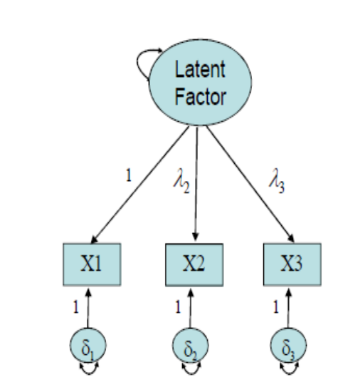{width="300"} \|

-   Faktör ve göstergeyi bağlayan yola faktör yükü adı verilir.

-   Faktör yükü $\lambda$ simgesi ile gösterilir. $\lambda_2$ , X2 göstergesinin gizil faktördeki yüküdür. $\lambda_3$ , X3 göstergesinin gizil faktördeki yüküdür.

-   $\lambda_1$ , X1 göstergesinin gizil faktördeki yüküdür ancak **1** değerine sabitlenmiştir.

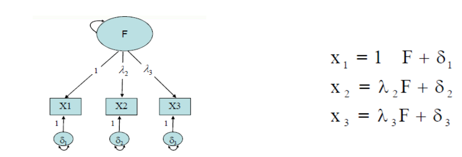

-   Gizil değişken **F**, gizil olduğundan sabit bir ölçeğe sahip değildir. Bu nedenle, faktör yüklerinin ölçekleri belirlenemez. İki olası çözüm aşağıdaki gibidir:
    -   **Faktör yüklerin ölçeği sabitlenir ve gizil değişkenin ölçeği serbestçe kestirilir.**
    -   Gizil değişkenin ölçeği sabitlenir ve faktör yüklerinin ölçekleri serbestçe kestirilir.

+--------------------------------+----------------------------------------------------------------------------------------------------------------------------------------------------+
| İki Faktörlü DFA Modeli Örneği |                                                                                                                                                    |
+================================+====================================================================================================================================================+
| 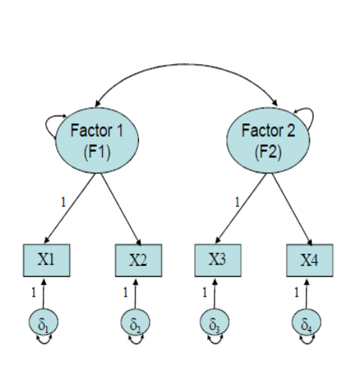          | -   X1 ve X2 F1’in göstergeleridir.                                                                                                                |
|                                |                                                                                                                                                    |
|                                | -   X3 ve X4 F2’nin göstergeleridir.                                                                                                               |
|                                |                                                                                                                                                    |
|                                | -   F1 ve F2 arasında bir korelasyon vardır.                                                                                                       |
|                                |                                                                                                                                                    |
|                                | -   X1, X2, X3 ve X4 göstergeleri etki göstergeleri (effect indicators) veya yansıtıcı göstergeler (reflective indicators) olarak adlandırılırlar. |
+--------------------------------+----------------------------------------------------------------------------------------------------------------------------------------------------+

-   X1, X2, X3 ve X4 göstergeleri etki göstergeleri (effect indicators) veya yansıtıcı göstergeler (reflective indicators) olarak adlandırılırlar.

$$X=\Lambda\xi +\delta$$

$$\begin{bmatrix}{}
X_{1}\\
X_{2}\\
X_{3}\\
X_{4}\\
\end{bmatrix} = \begin{bmatrix}{}
1 & 0 \\
\lambda_{21} & 0 \\
0 & 1 \\
0 & \lambda_{42} \\
\end{bmatrix}
\begin{bmatrix}{}
\xi_{1}\\
\xi_{1}\\
\end{bmatrix} + \begin{bmatrix}{}
\delta_{1}\\
\delta_{2}\\
\delta_{3}\\
\delta_{4}\\
\end{bmatrix}$$

-   DFA modelinde 3 tip kovaryans matrisi tanımlanmalıdır:

-   $\sum$ (sigma): ölçülen gözlenen değişkenleri kovaryans matrisi

-   $\phi$ (phi): gizil faktörlerin kovaryans matrisi

-   $\Psi$ (psi): ölçme hatalarının kovaryans matrisi

## DFA Modeli: Kovaryans Matrisi

-   Model için kovaryans matrisi model parametrelerinin bir fonksiyonu $\sum(\theta) = \Lambda\phi\Lambda' + \Psi$ olarak temsil edilebilir:

$$\begin{bmatrix}{}
VAR_{X_1}\\
COV_{X_1,X_2} & VAR_{X_2}\\
COV_{X_1,X_3} & COV_{X_2,X_3} & VAR_{X_3}\\
COV_{X_1,X_4} & COV_{X_2,X_4} & COV_{X_3,X_4} & VAR_{X_4}\\ 
\end{bmatrix}$$

$$= \begin{bmatrix}{}1 & 0 \\
\lambda_{21} & 0 \\
0 & 1 \\
0 & \lambda_{42} \\
\end{bmatrix}
\begin{bmatrix}{}
\phi_{11}\\
\phi_{21} & \phi_{22}\\
\end{bmatrix}\begin{bmatrix}{}
1 & \lambda_{21} & 0 & 0\\
0 & 0 & 1 & \lambda_{42}\\
\end{bmatrix} + \begin{bmatrix}{}
\Psi_{11}\\
0 & \Psi_{22}\\
0 & 0 & \Psi_{33}\\
0 & 0 & 0 & \Psi_{44}\\
\end{bmatrix}$$

$\sum(\theta)$, $\phi$, $\psi$ matrisleri simetrik matrislerdir ancak eşitlikte sadece alt üçgen sunulur.

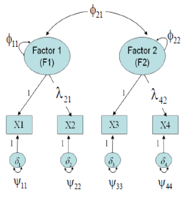

Kovaryans matrislerinden model için serbestçe kestirilecek parametreler sayılabilir:

|                      |                                           |
|----------------------|-------------------------------------------|
| Faktör varyansları   | $\phi_{11} \phi_{22}$                     |
| Faktör kovaryansları | $\phi_{21}$                               |
| Hata varyansları     | $\Psi_{11} \Psi_{22} \Psi_{33} \Psi_{44}$ |
| Faktör yükleri       | $\lambda_{21} \lambda_{42}$               |


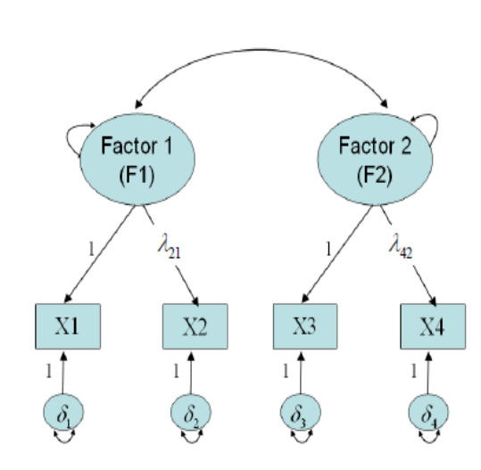

Bu nedenle,

-   $\lambda_{21}$ X2’nin Faktör 1’deki yüküdür.

-   $\lambda_{42}$ X4’ün Faktör 2’deki yüküdür.

-   $\lambda_{11}$ ve $\lambda_{32}$ şemada değerleri 1’e sabitlenmiş olarak gösterilmektedir

```{=html}
<!-- -->
```
-   **Standart DFA** modelleri aşağıdaki özelliklere sahiptir:

-   Her bir gösterge sürekli bir değişkendir ve tek bir faktörün (factor complexity = 1) ve ölçme hatasının bir fonksiyonudur.

-   Ölçme hataları birbirlerinden ve faktörlerden bağımsızdır.

-   Faktörlerin arasında korelasyon vardır.

-   Standart DFA modellerinde, **faktörler dışsal değişkenlerdir.** Dışsal değişkenlerin **varyansları ve kovaryanslarıdır.**

-   Faktörlerin göstergeler üzerindeki **doğrudan etkileridir.** (örneğin, faktör yükleri)

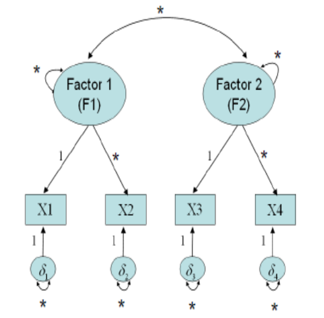

-   Faktörlerin varyansları: 2

-   Faktörlerin kovaryansları: 1

-   Hataların varyansları: 4

-   Faktör yükleri: 2 (diğer iki faktör yükü 1’e sabitlenmiştir)

-   Modelden **serbestçe kestirilecek 9 parametre** vardır.

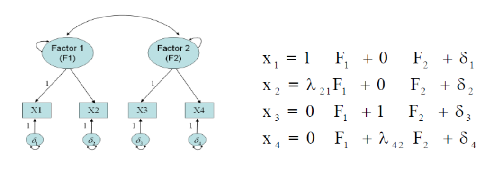

-   DFA literatüründe bir gizil faktörü temsil etmek üzere genellikle F yerine $\xi$ kullanılır.

-   Faktor yukleri 1'e

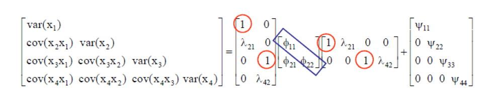

-   Faktor varyansları 1'e

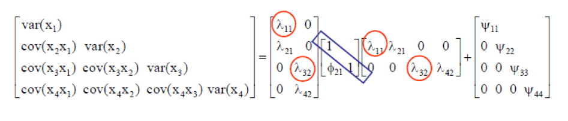

-   Her ikisinde de 9 tane serbestce kestirilecek parametre bulunmaktadır.

### Modelin Tanımlanması

-   DFA modelinde gözlemlerin sayısı yol analizi modelindeki gibi hesaplanır:

    -   $v (v + 1) / 2$

-   İki faktörlü DFA modeli örneğinde gözlemlerin sayısı:

-   $4 (4 + 1) / 2 = 10$ (v = 4, gözlenen değişken sayısı)

-   Yönlü ilişkili (recursive) yol modellerinde , eğer gözlemlerin sayısı model parametrelerinin sayısına eşit veya daha büyükse **sd ≥ 0** model tanımlanır. Ancak DFA’da, **sd ≥ 0** koşulunun sağlanması zorunlu fakat yeterli değildir.

-   dört gözlenen değişkenli DFA modeli örneğinde gözlemlerin sayısı:

$$\begin{bmatrix}{}
VAR_{X_1}\\
COV_{X_1,X_2} & VAR_{X_2}\\
COV_{X_1,X_3} & COV_{X_2,X_3} & VAR_{X_3}\\
COV_{X_1,X_4} & COV_{X_2,X_4} & COV_{X_3,X_4} & VAR_{X_4}\\ 
\end{bmatrix}{}$$

## Modifikasyon

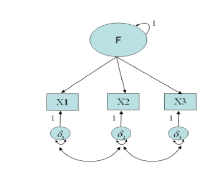

-   DFA modelleri hatalar arasında korelasyonun tanımlanmasına izin verir.

-   Araştırmacılar bir ölçüm için hataların arasında korelasyon olmaması sayıltısının olağan olarak ihlal edildiğini tartışırlar (Schmidt & Hunter, 1996).

-   Ancak hatalar arasındaki korelasyonun modele eklenmesi **tanımlama problemlerine neden olabilir.**

## Yeterli Gereklilikler

-   Zorunlu gerekliliklerin karşılanması DFA modelinin tanımlanmasını garantilemez. Yeterli gereklilikler.

-   Eğer

    -   **standart bir tek faktörlü DFA modeli en az üç göstergeye** sahipse,

    -   **standart bir iki veya daha fazla faktörlü** DFA modelinde her bir faktör için **en az iki göstergeye** varsa,

model tanımlanır.

-   **Çapraz yüklü veya hatalar arasında korelasyona** sahip bir DFA modeli için ise kolayca uygulanan yeterli koşul yoktur.

-   Model parametresi araştırmacının tanımlamasına bağlı olarak **serbest** (free), **sabit** (fixed) veya **sınırlandırılmış** (constrained) olabilir.

    -   **Serbest parametre** (free parameter) örneklem verisinden bilgisayar yazılımı tarafından kestirilen parametredir.

    -   **Sabit** parametre (fixed parameter) bir sabite eşit olarak belirlenen parametredir; yazılım bu sabiti veriye bağlı olmaksızın parametrenin kestirimi olarak kabul eder.

    -   **Sınırlandırılmış** parametre (constrained parameter) yazılım tarafından belli sınırlılıklar içerisinde kestirilir ancak bir sabite eşit olmak üzere sabitlenmez.

-   Bir modelinin tanımlanabilmesi için **kestirilecek olan model parametre sayısının gözlenen parametre sayısına eşit** veya **gözlenen parametre sayısından küçük olması** gerekir.

    -   **sd\<0** olduğunda model tanımlanamaz.

    -   **sd=0**, model ancak tanımlanır (just identification) ve kuramsal olarak her parametrenin tek bir çözümü vardır. Ancak tanımlanan modellerde model veriye mükemmel uyum gösterir.

    -   **sd\>0**, model aşırı tanımlanmış (over identification) olur. Aşırı tanımlanan modellerde kuramsal olarak her bir parametrenin birden fazla çözümü vardır.

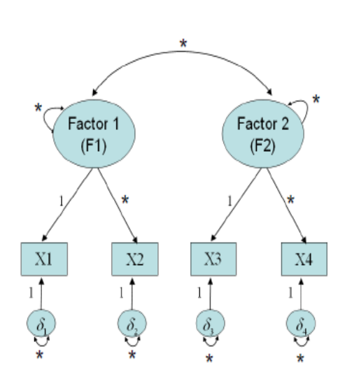

-   X1’in faktör yükü **1**’e sabitlendiğinde, F1’in ölçme birimi X1’in ölçme birimiyle aynı olur. Bu durumda X1 **işaret veya referans değişken** adını alır.

-   Benzer şekilde, X3 de F2 için **referans değişkendir.**

-   Referans değişken birinci gösterge olmak zorunda değildir. Örneğin, X2 de F1 için referans değişken olarak seçilebilir.

    -   Referans değişken belirlendiginde, **değişkenin örneklem varyansının bir kısmı gizil değişkene geçer**

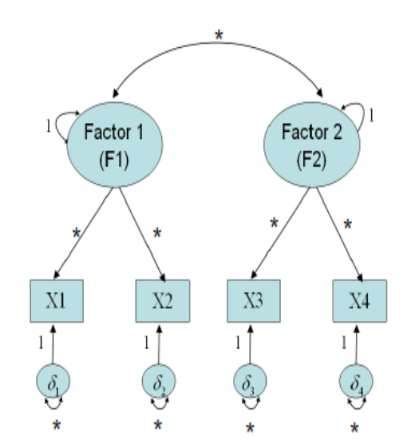

-   hem F1 hem de F2 puanları **ortalaması 0 ve standart sapması 1** olan bir ölçeğe sahip olurlar.

-   bütün faktör yükleri serbestçe kestirilir.

-   Model parametreleri:

    -   Faktörlerin varyansları: 0
        -   *1’e sabitlenmişlerdir*\
    -   Faktörlerin kovaryansları: 1
    -   Hataların varyansları: 4
    -   Faktör yükleri: 4

## Çapraz Yüklü DFA Modelleri

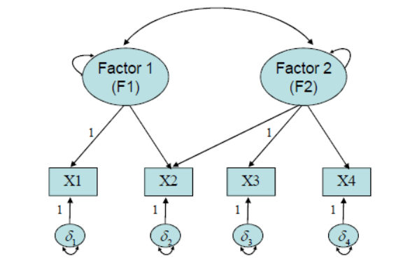

-   Verilen örnekte X2 hem F1 hem de F2’nin göstergesidir.

-   Bazen bazı göstergeler birden fazla faktörü ölçmek için tasarlanmıştır (factor complexity \> 1). Böyle bir DFA modeli **artık standart bir DFA modeli** değildir.

## Model-Veri Uyumunun Değerlendirilmesi

-   Kestirilen parametre sayısından daha fazla sayıda gözleme sahip olan **aşırı tanımlanan** (overidentified) modeller **genellikle veriye mükemmel uyum sağlamaz.**

-   Bu durumda böyle **modellerin veriyle ne derece uyumlu** olduğunu ölçmeye ihtiyaç vardır.

-   YEM literatüründe tanımlanan **çok sayıda model uyum indeksi vardır** ve sürekli olarak yeni indeksler geliştirilmektedir.

-   Çok sayıda farklı uyum indeksinin olması bazı problemleri de beraberinde getirir:

    -   Farklı makalelerde **farklı uyum indeksleri** rapor edilir.

    -   Aynı makale için farklı hakemler kendi bildikleri veya tercih ettikleri farklı indekslerin rapor edilmesini isteyebilirler.

    -   Uyum indekslerinin değerlerini rapor ederken seçici davranma olasılığı vardır (örneğin, sadece iyi uyum öneren uyum indekslerinin rapor edilmesi gibi).

-   YEM uygulamalarına ve simülasyon çalışmalarına göre YEM analizinin sonuçlarını rapor ederken sunulacak ve yorumlanacak uyum indeksleri aşağıdaki gibidir:

-   Model **Ki-Kare** Değeri

-   Steiger-Lind Root Mean Square Error of Approximation **RMSEA** (Steiger, 1990) (%90 güven aralığı ile birlikte)

-   Bentler Comparative Fit Index **CFI** (Bentler, 1990)

-   Standardized Root Mean Square Residual **SRMR**

-   **Çoklu indekslerin kullanılması** bir modelin uyumu ile ilgili **en doğru yaklaşımı verecektir.**

| Uyum indeksi |      İyi uyum       | Kabul Edilebilir Uyum |
|:------------:|:-------------------:|:---------------------:|
|   $\chi^2$   |          p          |                       |
| $\chi^2/df$  | 0 ≤ $\chi^2/df$ ≤ 2 | 2 \< $\chi^2/df$ \< 8 |
|     SRMR     |    0 ≤SRMR ≤ .05    |  .05 \< SRMR \< .10   |
|    RMSEA     |   0 ≤RMSEA ≤ .05    |  .05 \< RMSEA \< .08  |
|     CFI      |    .95 ≤GFI ≤ 1     |   .90 \< GFI \< .95   |

Not: Bu kesme değerlerin kullanılmasıyla ilgili çok sayıda tartışma vardır.

### Uyum İndekslerini Raporlarken Öneriler

-   örneğin, CFI, örneklem büyüklüğüne duyarlıdır.

-   Oldukça küçük bir örneklem (örneğin, N = 200) hemen hemen her zaman oldukça büyük bir örneklemden (örneğin, N = 1000) daha küçük **CFI**'ler üretecektir.

-   Bu nedenle, .95 gibi CFI için sabit eşikler, küçük örneklem boyutları için daha doğru modelleri uyumlu göstermeyecek ve daha büyük örneklem boyutları için ise muhtemelen daha az uyumlu modelleri kabul edecektir.

-   Esnek kesim noktaları belirli bir model ve örneklem özelliklerine uygun alternatif eşik değerleri sağlar. Bu amaçla *FCO* paketi kullanılabilir.


```r
library(FCO)
```

## Esnek Kesim Noktaları

-   Esnek kesim noktaları, gizli değişken sayısı (veya faktörler), gizil değişken başına gösterge sayısı, örneklem boyutları, faktör yükleri ve normal ve normal olmayan veriler için doğru şekilde belirlenmiş Doğrulayıcı Faktör Analizi (DFA) modellerinin simüle edilmiş dağılımlarından türetilir.

-   Esnek kesim noktaları, önceden tanımlanmış bir belirsizlik için belirli bir değerin ampirik niceliği olarak anlaşılabilir.

-   Öncelikli olarak yüzde 5'lik (veya .05) bir belirsizlik kabul edilirse, verilen model ve örneklem özellikleriyle doğru şekilde belirlenmiş DFA modelleri için simüle edilmiş dağılımın yüzde 5'lik niceliği esnek sınırı belirleyecektir.

<!-- - Temel uyum indeksinin doğasına bağlı olarak, ilgili güven aralığının uygun alt (GoF) veya üst (BoF) genişliği, nicelik tarafından tanımlandığı gibi, esnek sınırı türetmek için kullanılır.  -->

Niemand, T., Mai, R. Flexible cutoff values for fit indices in the evaluation of structural equation models. J. of the Acad. Mark. Sci. 46, 1148–1172 (2018)

## Model Seçimi

-   analizlerinde **birden fazla model veriye uyum sağlayabilir.**

-   Bu durumda veriye daha iyi uyum sağlayan modelin belirlenmesi için **model uyumları karşılaştırılır.**

-   **Modellerden biri diğerinin alt kümesi** olduğunda modeller yuvalanmıştır. Örneğin, araştırmacılar farklı amaçlarla model içinde bazı parametreleri sınırlandırabilir. Bu durumda sınırlandırılmış olan model sınırlandırılmamış olan serbest model içinde yuvalanmış olur.

-   Yuvalanmış modeller karşılaştırılırken, **modellerin ki-kare değerleri arasındaki farkın anlamlılığı incelenir.**

-   Eğer iki model hiyerarşikse ve her ikisi de veriye kabul edilebilir ölçüde uyum sağlıyorsa, iki modelin veriye uyumunu karşılaştırmak için ki-kare fark test uygulanabilir.

-   Yuvalanmamış modellerin karşılaştırılmasında kullanılacak en uygun yaklaşım bilgi kriter değerleridir. Yaygın olarak kullanılan bilgi kriterleri **Akaike bilgi kriteri (AIC) ve Bayes bilgi kriteridir (BIC).**

-   Model seçimi yapılırken **bilgi kriteri değeri daha küçük olan model tercih edilir.** Bilgi kriterleri hem yuvalanmış hem de yuvalanmamış modellerin karşılaştırılmasında kullanılabilir.

## Varsayımlar

-   YEM analizleri genellikle **büyük örneklemler gerektirir.**

-   Örneklem büyüklüğü model karmaşıklığı ile oldukça ilişkidir ve daha karmaşık modeller daha büyük örneklemler gerektirir.

-   YEM analizlerine ilişkin varsayımlar ise kestirim yöntemine bağlı olarak değişmektedir.

-   Kullanılan kestirim yönteminin varsayımlarının sağlanmaması model veri uyumu, parametre ve parametrelere ilişkin hata kestirimlerinde yanlılığa neden olabilir. Dolayısıyla, test edilen kuram hakkında hatalı sonuçlar alınmasına yol açabilir.

-   Bu nedenle veri yapısına ve çalışma desenine uygun bir kestirim yöntemi seçilmesi oldukça önemlidir.

-   YEM analizlerinde yaygın olarak maksimum olabilirlik **ML** kestirim yöntemi kullanılmaktadır.

-   Benzer şekilde en küçük kareler **GLS** kestirim yöntemi de normallik varsayımı gerektirir.

-   Bu yöntemler normal teori yöntemleri olarak da adlandırılır.

-   Normal teori yöntemleri altında yatan beş varsayımdan bahsedilebilir. Bunlar

    -   gözlemlerin bağımsızlığı,
    -   büyük örneklem, doğru tanımlanmış model,
    -   çok değişkenli normallik ve verilerin sürekliliğidir.

**Normal teori yöntemleri varsayımları sağlandığında yansız, yeterli ve tutarlı kestirimler üretir.** - doğrulayıcı faktör analizi için **cfa()**, yapısal modeller için **sem()** fonksiyonu tanımlanmıştır.

-   **ML** yöntemi paketin varsayılan kestirim yöntemidir. Parametre kestirimleri açısından normallik varsayımının ihlaline dayanıklıdır.

-   Normal olmayan veriler için alan yazında yaygın olarak kullanılan kestirim yöntemi

    -   ağırlıklandırılmış en küçük kareler yöntemidir **WLS**
    -   Ayrıca ağırlıklandırılmamış en küçük kareler **ULS**,
    -   diyagonal olarak ağırlıklandırılmış en küçük kareler **DWLS**,
    -   kestirim yöntemleri de normal dağılmayan verilerde kullanılabilir.

-   Kestirim yöntemlerinin kısaltmaları programlar arasında farklılık gösterebilir.


-   **cfa()** fonksiyonu hem ham veriyle hem de gözlenen değişkenlere ilişkin varyans-kovaryans matrisiyle çalışabilir.

-   Girdi olarak **varyans-kovaryans matrisi kullanıldığında,** matriste madde adlarına karşılık gelecek şekilde satır ve sütun adları mutlaka bulunmalıdır. Ayrıca **örneklem ortalamasının (sample.mean) ve gözlem sayısının tanımlanması** (sample.nobs) gerekir.

-   Girdi olarak doğrudan **verinin kendisi girildiğindeyse**, örneklem ortalaması ve gözlem sayısının tanımlanmasına gerek yoktur.

-   Tüm YEM fonksiyonlarında olduğu gibi **cfa()** fonksiyonu için de **ilk olarak DFA modelinin tanımlanması gerekir.**

-   DFA modeli tırnak işareti içinde tanımlanır ve faktörler maddeler ile **'=\~'** işaretiyle ilişkilendirilir.

-   İşaretin sol tarafında faktörler sağ tarafında maddeler yer alır. Her bir faktörde yer alan maddelerin adları sırasıyla **+** operatörüyle eklenir.


```r
' F1  =~ m1 + m2 +m3'
```

## Uygulama

-   Yaşam doyumu verileri, yaşam doyumunun farklı yönlerine/alanlarına ilişkin 10 maddeden oluşmaktadır. Ne kadar mennunsun:

|     |                                     |
|-----|-------------------------------------|
| m1  | okul notun                          |
| m2  | dış görünüşünüz                     |
| m3  | öğretmeninizle ilişkiniz            |
| m4  | okul hayatın                        |
| m5  | sosyal hayatınız                    |
| m6  | senin kişiliğin                     |
| m7  | arkadaşlarınızla olan ilişkileriniz |
| m8  | anne babanla ilişkiniz              |
| m9  | senin aile hayatın                  |
| m10 | sosyo-ekonomik durumunuz            |

1 = “hiç memnun değilim” ile 7 = “çok memnunum” arasında 7 puanlık bir ölçekle alınmış sonuçlar.

-   Verinin okunması (veriseti)[import/yasamdoyum.xlsx]


```r
library(openxlsx)
yasamdoyum <- read.xlsx("import/yasamdoyum.xlsx")
head(yasamdoyum)
```

<div class="kable-table">

| ID|cinsiyet | yas| okul1| okul2| okul3| kisi1| kisi2| arkadas1| arkadas2| aile1| aile2| aile3|
|--:|:--------|---:|-----:|-----:|-----:|-----:|-----:|--------:|--------:|-----:|-----:|-----:|
|  1|kadin    |  13|     5|     6|     2|     4|     7|        6|        7|     7|     7|     7|
|  2|erkek    |  14|     5|     5|     4|     4|     5|        5|        5|     5|     5|     4|
| 10|kadin    |  14|     7|     2|     1|     7|     6|        5|        5|     7|     6|     6|
| 11|kadin    |  14|     1|     6|     5|     6|     6|        6|        7|     7|     7|     7|
| 12|kadin    |  14|     5|     6|     5|     6|     6|        6|        7|     6|     5|     6|
| 14|erkek    |  14|     4|     6|     5|     5|     5|        6|        6|     6|     5|     5|

</div>

-   Modelin tanımlanması


```r
model_1 <- 
"
okul =~ okul1 + okul2 + okul3
kisi =~ kisi1 + kisi2
arkadas =~ arkadas1 + arkadas2
aile =~ aile1 + aile2 + aile3
"
```

-   DFA modelinin testi


```r
model_1_fit <- cfa(model_1, data = yasamdoyum)
summary(model_1_fit, fit.measures = TRUE, standardized = TRUE)
```

```
## lavaan 0.6.17 ended normally after 40 iterations
## 
##   Estimator                                         ML
##   Optimization method                           NLMINB
##   Number of model parameters                        26
## 
##   Number of observations                           255
## 
## Model Test User Model:
##                                                       
##   Test statistic                                51.433
##   Degrees of freedom                                29
##   P-value (Chi-square)                           0.006
## 
## Model Test Baseline Model:
## 
##   Test statistic                               583.039
##   Degrees of freedom                                45
##   P-value                                        0.000
## 
## User Model versus Baseline Model:
## 
##   Comparative Fit Index (CFI)                    0.958
##   Tucker-Lewis Index (TLI)                       0.935
## 
## Loglikelihood and Information Criteria:
## 
##   Loglikelihood user model (H0)              -3427.760
##   Loglikelihood unrestricted model (H1)      -3402.044
##                                                       
##   Akaike (AIC)                                6907.520
##   Bayesian (BIC)                              6999.593
##   Sample-size adjusted Bayesian (SABIC)       6917.166
## 
## Root Mean Square Error of Approximation:
## 
##   RMSEA                                          0.055
##   90 Percent confidence interval - lower         0.029
##   90 Percent confidence interval - upper         0.079
##   P-value H_0: RMSEA <= 0.050                    0.341
##   P-value H_0: RMSEA >= 0.080                    0.045
## 
## Standardized Root Mean Square Residual:
## 
##   SRMR                                           0.053
## 
## Parameter Estimates:
## 
##   Standard errors                             Standard
##   Information                                 Expected
##   Information saturated (h1) model          Structured
## 
## Latent Variables:
##                    Estimate  Std.Err  z-value  P(>|z|)   Std.lv  Std.all
##   okul =~                                                               
##     okul1             1.000                               0.572    0.420
##     okul2             1.431    0.257    5.572    0.000    0.819    0.638
##     okul3             1.995    0.403    4.947    0.000    1.141    0.858
##   kisi =~                                                               
##     kisi1             1.000                               0.730    0.669
##     kisi2             0.940    0.156    6.028    0.000    0.685    0.784
##   arkadas =~                                                            
##     arkadas1          1.000                               0.661    0.791
##     arkadas2          0.614    0.117    5.235    0.000    0.406    0.531
##   aile =~                                                               
##     aile1             1.000                               0.782    0.742
##     aile2             1.061    0.129    8.233    0.000    0.830    0.846
##     aile3             0.598    0.084    7.136    0.000    0.467    0.510
## 
## Covariances:
##                    Estimate  Std.Err  z-value  P(>|z|)   Std.lv  Std.all
##   okul ~~                                                               
##     kisi              0.075    0.039    1.947    0.052    0.180    0.180
##     arkadas           0.111    0.039    2.862    0.004    0.293    0.293
##     aile              0.098    0.040    2.427    0.015    0.219    0.219
##   kisi ~~                                                               
##     arkadas           0.296    0.059    5.049    0.000    0.614    0.614
##     aile              0.142    0.052    2.735    0.006    0.249    0.249
##   arkadas ~~                                                            
##     aile              0.178    0.048    3.700    0.000    0.344    0.344
## 
## Variances:
##                    Estimate  Std.Err  z-value  P(>|z|)   Std.lv  Std.all
##    .okul1             1.528    0.147   10.414    0.000    1.528    0.824
##    .okul2             0.978    0.137    7.130    0.000    0.978    0.593
##    .okul3             0.469    0.209    2.245    0.025    0.469    0.265
##    .kisi1             0.656    0.100    6.575    0.000    0.656    0.552
##    .kisi2             0.295    0.076    3.865    0.000    0.295    0.386
##    .arkadas1          0.262    0.079    3.301    0.001    0.262    0.375
##    .arkadas2          0.419    0.047    8.948    0.000    0.419    0.718
##    .aile1             0.498    0.079    6.336    0.000    0.498    0.449
##    .aile2             0.274    0.077    3.574    0.000    0.274    0.285
##    .aile3             0.622    0.061   10.240    0.000    0.622    0.740
##     okul              0.327    0.109    3.001    0.003    1.000    1.000
##     kisi              0.532    0.120    4.452    0.000    1.000    1.000
##     arkadas           0.437    0.095    4.594    0.000    1.000    1.000
##     aile              0.611    0.109    5.593    0.000    1.000    1.000
```

-   Analizin çıktıları incelendiğinde, ilk olarak iterasyon sayısı, modelde kestirilen parametre sayısı, gözlem sayısı ve kullanılan kestirim yöntemi bilgileri yer almaktadır.

-   Sonrasında ki-kare istatistikleri ve model uyum indeksleri raporlanmıştır.

-   Bu çıktıları daha düzgün elde etmek içi **semoutput** paketi kullanılabilir.


```r
# devtools::install_github("dr-JT/semoutput")
library(semoutput)
sem_sig(model_1_fit)
```

```{=html}
<div id="rfikxjvbpc" style="padding-left:0px;padding-right:0px;padding-top:10px;padding-bottom:10px;overflow-x:auto;overflow-y:auto;width:auto;height:auto;">
<style>#rfikxjvbpc table {
  font-family: system-ui, 'Segoe UI', Roboto, Helvetica, Arial, sans-serif, 'Apple Color Emoji', 'Segoe UI Emoji', 'Segoe UI Symbol', 'Noto Color Emoji';
  -webkit-font-smoothing: antialiased;
  -moz-osx-font-smoothing: grayscale;
}

#rfikxjvbpc thead, #rfikxjvbpc tbody, #rfikxjvbpc tfoot, #rfikxjvbpc tr, #rfikxjvbpc td, #rfikxjvbpc th {
  border-style: none;
}

#rfikxjvbpc p {
  margin: 0;
  padding: 0;
}

#rfikxjvbpc .gt_table {
  display: table;
  border-collapse: collapse;
  line-height: normal;
  margin-left: 0;
  margin-right: auto;
  color: #333333;
  font-size: 16px;
  font-weight: normal;
  font-style: normal;
  background-color: #FFFFFF;
  width: auto;
  border-top-style: solid;
  border-top-width: 0px;
  border-top-color: #A8A8A8;
  border-right-style: none;
  border-right-width: 2px;
  border-right-color: #D3D3D3;
  border-bottom-style: solid;
  border-bottom-width: 0px;
  border-bottom-color: #A8A8A8;
  border-left-style: none;
  border-left-width: 2px;
  border-left-color: #D3D3D3;
}

#rfikxjvbpc .gt_caption {
  padding-top: 4px;
  padding-bottom: 4px;
}

#rfikxjvbpc .gt_title {
  color: #333333;
  font-size: 18px;
  font-weight: bolder;
  padding-top: 10px;
  padding-bottom: 10px;
  padding-left: 15px;
  padding-right: 15px;
  border-bottom-color: #FFFFFF;
  border-bottom-width: 0;
}

#rfikxjvbpc .gt_subtitle {
  color: #333333;
  font-size: 85%;
  font-weight: initial;
  padding-top: 9px;
  padding-bottom: 11px;
  padding-left: 15px;
  padding-right: 15px;
  border-top-color: #FFFFFF;
  border-top-width: 0;
}

#rfikxjvbpc .gt_heading {
  background-color: #FFFFFF;
  text-align: left;
  border-bottom-color: #FFFFFF;
  border-left-style: none;
  border-left-width: 1px;
  border-left-color: #D3D3D3;
  border-right-style: none;
  border-right-width: 1px;
  border-right-color: #D3D3D3;
}

#rfikxjvbpc .gt_bottom_border {
  border-bottom-style: solid;
  border-bottom-width: 0px;
  border-bottom-color: #D3D3D3;
}

#rfikxjvbpc .gt_col_headings {
  border-top-style: solid;
  border-top-width: 0px;
  border-top-color: #D3D3D3;
  border-bottom-style: solid;
  border-bottom-width: 2px;
  border-bottom-color: #D3D3D3;
  border-left-style: none;
  border-left-width: 1px;
  border-left-color: #D3D3D3;
  border-right-style: none;
  border-right-width: 1px;
  border-right-color: #D3D3D3;
}

#rfikxjvbpc .gt_col_heading {
  color: #333333;
  background-color: #FFFFFF;
  font-size: 100%;
  font-weight: bold;
  text-transform: inherit;
  border-left-style: none;
  border-left-width: 1px;
  border-left-color: #D3D3D3;
  border-right-style: none;
  border-right-width: 1px;
  border-right-color: #D3D3D3;
  vertical-align: bottom;
  padding-top: 6px;
  padding-bottom: 7px;
  padding-left: 15px;
  padding-right: 15px;
  overflow-x: hidden;
}

#rfikxjvbpc .gt_column_spanner_outer {
  color: #333333;
  background-color: #FFFFFF;
  font-size: 100%;
  font-weight: bold;
  text-transform: inherit;
  padding-top: 0;
  padding-bottom: 0;
  padding-left: 4px;
  padding-right: 4px;
}

#rfikxjvbpc .gt_column_spanner_outer:first-child {
  padding-left: 0;
}

#rfikxjvbpc .gt_column_spanner_outer:last-child {
  padding-right: 0;
}

#rfikxjvbpc .gt_column_spanner {
  border-bottom-style: solid;
  border-bottom-width: 2px;
  border-bottom-color: #D3D3D3;
  vertical-align: bottom;
  padding-top: 6px;
  padding-bottom: 6px;
  overflow-x: hidden;
  display: inline-block;
  width: 100%;
}

#rfikxjvbpc .gt_spanner_row {
  border-bottom-style: hidden;
}

#rfikxjvbpc .gt_group_heading {
  padding-top: 8px;
  padding-bottom: 8px;
  padding-left: 15px;
  padding-right: 15px;
  color: #333333;
  background-color: #FFFFFF;
  font-size: 100%;
  font-weight: initial;
  text-transform: inherit;
  border-top-style: solid;
  border-top-width: 2px;
  border-top-color: #D3D3D3;
  border-bottom-style: solid;
  border-bottom-width: 2px;
  border-bottom-color: #D3D3D3;
  border-left-style: none;
  border-left-width: 1px;
  border-left-color: #D3D3D3;
  border-right-style: none;
  border-right-width: 1px;
  border-right-color: #D3D3D3;
  vertical-align: middle;
  text-align: left;
}

#rfikxjvbpc .gt_empty_group_heading {
  padding: 0.5px;
  color: #333333;
  background-color: #FFFFFF;
  font-size: 100%;
  font-weight: initial;
  border-top-style: solid;
  border-top-width: 2px;
  border-top-color: #D3D3D3;
  border-bottom-style: solid;
  border-bottom-width: 2px;
  border-bottom-color: #D3D3D3;
  vertical-align: middle;
}

#rfikxjvbpc .gt_from_md > :first-child {
  margin-top: 0;
}

#rfikxjvbpc .gt_from_md > :last-child {
  margin-bottom: 0;
}

#rfikxjvbpc .gt_row {
  padding-top: 8px;
  padding-bottom: 8px;
  padding-left: 15px;
  padding-right: 15px;
  margin: 10px;
  border-top-style: solid;
  border-top-width: 1px;
  border-top-color: #D3D3D3;
  border-left-style: none;
  border-left-width: 1px;
  border-left-color: #D3D3D3;
  border-right-style: none;
  border-right-width: 1px;
  border-right-color: #D3D3D3;
  vertical-align: middle;
  overflow-x: hidden;
}

#rfikxjvbpc .gt_stub {
  color: #333333;
  background-color: #FFFFFF;
  font-size: 100%;
  font-weight: initial;
  text-transform: inherit;
  border-right-style: solid;
  border-right-width: 2px;
  border-right-color: #D3D3D3;
  padding-left: 15px;
  padding-right: 15px;
}

#rfikxjvbpc .gt_stub_row_group {
  color: #333333;
  background-color: #FFFFFF;
  font-size: 100%;
  font-weight: initial;
  text-transform: inherit;
  border-right-style: solid;
  border-right-width: 2px;
  border-right-color: #D3D3D3;
  padding-left: 15px;
  padding-right: 15px;
  vertical-align: top;
}

#rfikxjvbpc .gt_row_group_first td {
  border-top-width: 2px;
}

#rfikxjvbpc .gt_row_group_first th {
  border-top-width: 2px;
}

#rfikxjvbpc .gt_summary_row {
  color: #333333;
  background-color: #FFFFFF;
  text-transform: inherit;
  padding-top: 8px;
  padding-bottom: 8px;
  padding-left: 15px;
  padding-right: 15px;
}

#rfikxjvbpc .gt_first_summary_row {
  border-top-style: solid;
  border-top-color: #D3D3D3;
}

#rfikxjvbpc .gt_first_summary_row.thick {
  border-top-width: 2px;
}

#rfikxjvbpc .gt_last_summary_row {
  padding-top: 8px;
  padding-bottom: 8px;
  padding-left: 15px;
  padding-right: 15px;
  border-bottom-style: solid;
  border-bottom-width: 2px;
  border-bottom-color: #D3D3D3;
}

#rfikxjvbpc .gt_grand_summary_row {
  color: #333333;
  background-color: #FFFFFF;
  text-transform: inherit;
  padding-top: 8px;
  padding-bottom: 8px;
  padding-left: 15px;
  padding-right: 15px;
}

#rfikxjvbpc .gt_first_grand_summary_row {
  padding-top: 8px;
  padding-bottom: 8px;
  padding-left: 15px;
  padding-right: 15px;
  border-top-style: double;
  border-top-width: 6px;
  border-top-color: #D3D3D3;
}

#rfikxjvbpc .gt_last_grand_summary_row_top {
  padding-top: 8px;
  padding-bottom: 8px;
  padding-left: 15px;
  padding-right: 15px;
  border-bottom-style: double;
  border-bottom-width: 6px;
  border-bottom-color: #D3D3D3;
}

#rfikxjvbpc .gt_striped {
  background-color: rgba(128, 128, 128, 0.05);
}

#rfikxjvbpc .gt_table_body {
  border-top-style: solid;
  border-top-width: 2px;
  border-top-color: #D3D3D3;
  border-bottom-style: solid;
  border-bottom-width: 2px;
  border-bottom-color: #D3D3D3;
}

#rfikxjvbpc .gt_footnotes {
  color: #333333;
  background-color: #FFFFFF;
  border-bottom-style: none;
  border-bottom-width: 2px;
  border-bottom-color: #D3D3D3;
  border-left-style: none;
  border-left-width: 2px;
  border-left-color: #D3D3D3;
  border-right-style: none;
  border-right-width: 2px;
  border-right-color: #D3D3D3;
}

#rfikxjvbpc .gt_footnote {
  margin: 0px;
  font-size: 14px;
  padding-top: 4px;
  padding-bottom: 4px;
  padding-left: 15px;
  padding-right: 15px;
}

#rfikxjvbpc .gt_sourcenotes {
  color: #333333;
  background-color: #FFFFFF;
  border-bottom-style: none;
  border-bottom-width: 2px;
  border-bottom-color: #D3D3D3;
  border-left-style: none;
  border-left-width: 2px;
  border-left-color: #D3D3D3;
  border-right-style: none;
  border-right-width: 2px;
  border-right-color: #D3D3D3;
}

#rfikxjvbpc .gt_sourcenote {
  font-size: 90%;
  padding-top: 4px;
  padding-bottom: 4px;
  padding-left: 15px;
  padding-right: 15px;
}

#rfikxjvbpc .gt_left {
  text-align: left;
}

#rfikxjvbpc .gt_center {
  text-align: center;
}

#rfikxjvbpc .gt_right {
  text-align: right;
  font-variant-numeric: tabular-nums;
}

#rfikxjvbpc .gt_font_normal {
  font-weight: normal;
}

#rfikxjvbpc .gt_font_bold {
  font-weight: bold;
}

#rfikxjvbpc .gt_font_italic {
  font-style: italic;
}

#rfikxjvbpc .gt_super {
  font-size: 65%;
}

#rfikxjvbpc .gt_footnote_marks {
  font-size: 75%;
  vertical-align: 0.4em;
  position: initial;
}

#rfikxjvbpc .gt_asterisk {
  font-size: 100%;
  vertical-align: 0;
}

#rfikxjvbpc .gt_indent_1 {
  text-indent: 5px;
}

#rfikxjvbpc .gt_indent_2 {
  text-indent: 10px;
}

#rfikxjvbpc .gt_indent_3 {
  text-indent: 15px;
}

#rfikxjvbpc .gt_indent_4 {
  text-indent: 20px;
}

#rfikxjvbpc .gt_indent_5 {
  text-indent: 25px;
}
</style>
<table class="gt_table" data-quarto-disable-processing="true" data-quarto-bootstrap="false">
  <thead>
    <tr class="gt_heading">
      <td colspan="4" class="gt_heading gt_title gt_font_normal gt_bottom_border" style>Model Significance</td>
    </tr>
    
    <tr class="gt_col_headings">
      <th class="gt_col_heading gt_columns_bottom_border gt_right" rowspan="1" colspan="1" style="text-align: center;" scope="col" id="N">N</th>
      <th class="gt_col_heading gt_columns_bottom_border gt_right" rowspan="1" colspan="1" style="text-align: center;" scope="col" id="&amp;chi;&lt;sup&gt;2&lt;/sup&gt;">&chi;<sup>2</sup></th>
      <th class="gt_col_heading gt_columns_bottom_border gt_right" rowspan="1" colspan="1" style="text-align: center;" scope="col" id="df">df</th>
      <th class="gt_col_heading gt_columns_bottom_border gt_right" rowspan="1" colspan="1" style="text-align: center;" scope="col" id="p">p</th>
    </tr>
  </thead>
  <tbody class="gt_table_body">
    <tr><td headers="N" class="gt_row gt_right">255 </td>
<td headers="Chi_Square" class="gt_row gt_right">51.433</td>
<td headers="df" class="gt_row gt_right">29 </td>
<td headers="p" class="gt_row gt_right">0.006</td></tr>
  </tbody>
  
  
</table>
</div>
```

-   Model uyum istatistikleri semoutputtan aşağıdaki şekilde elde edilebilir.


```r
library(semoutput)
 # sem_fitmeasures(model_1_fit)
```

-   Model uyum istatistikleri fitmeasures fonkisyonu ile aşağıdaki şekilde elde edilebilir.


```r
fitmeasures(model_1_fit,fit.measures = c("chisq" ,"df" , "pvalue","cfi","tli","rmsea","rmsea.ci.lower",   
"rmsea.ci.upper","srmr"))
```

```
##          chisq             df         pvalue            cfi            tli 
##         51.433         29.000          0.006          0.958          0.935 
##          rmsea rmsea.ci.lower rmsea.ci.upper           srmr 
##          0.055          0.029          0.079          0.053
```

-   Esnek kesim noktaları


```r
library(FCO)
fits.esnek <- gen_fit(mod1 = model_1, x = yasamdoyum[,4:13], rep = 100)
flex_co(fits = fits.esnek, index = c("CFI", "SRMR"))$cutoff
```

```
##        CFI       SRMR 
## 0.94664848 0.04558631
```


```r
recommend(fits.esnek)$cutoffs
```

```
## Warning in recommend(fits.esnek): The number of replications is lower than the
## recommended minimum of 500. Consider with care.
```

<div class="kable-table">

|             |  SRMR|
|:------------|-----:|
|cutoff 0.001 | 0.052|
|cutoff 0.01  | 0.051|
|cutoff 0.05  | 0.046|
|cutoff 0.1   | 0.044|

</div>

-   Model uyum indekslerini takiben **faktör yükleri**, **standart hataları,z değerleri ve p değerleri** gelmektedir.

-   **p** değerleri maddelere ilişkin **faktör yüklerinin sıfırdan anlamlı düzeyde farklı olup olmadığına** ilişkin bilgi verir.

-   Faktör yükleri incelendiğinde, **her bir faktörün ilk maddesinin referans madde olarak tanımlandığı** ve **faktör yüklerinin bire eşitlendiği** görülmektedir.

-   Bu maddelere ilişkin standart hatalar, z ve p değerleri hesaplanmamıştır. Faktör yükler tablosunun ardından ise faktörler arası kovaryans, madde ve faktör varyans kestirimleri, standart hataları, z ve p değerleri yer almaktadır.


```r
sem_factorloadings(model_1_fit,standardized = FALSE)
```

```{=html}
<div id="zenhkuxftk" style="padding-left:0px;padding-right:0px;padding-top:10px;padding-bottom:10px;overflow-x:auto;overflow-y:auto;width:auto;height:auto;">
<style>#zenhkuxftk table {
  font-family: system-ui, 'Segoe UI', Roboto, Helvetica, Arial, sans-serif, 'Apple Color Emoji', 'Segoe UI Emoji', 'Segoe UI Symbol', 'Noto Color Emoji';
  -webkit-font-smoothing: antialiased;
  -moz-osx-font-smoothing: grayscale;
}

#zenhkuxftk thead, #zenhkuxftk tbody, #zenhkuxftk tfoot, #zenhkuxftk tr, #zenhkuxftk td, #zenhkuxftk th {
  border-style: none;
}

#zenhkuxftk p {
  margin: 0;
  padding: 0;
}

#zenhkuxftk .gt_table {
  display: table;
  border-collapse: collapse;
  line-height: normal;
  margin-left: 0;
  margin-right: auto;
  color: #333333;
  font-size: 16px;
  font-weight: normal;
  font-style: normal;
  background-color: #FFFFFF;
  width: auto;
  border-top-style: solid;
  border-top-width: 0px;
  border-top-color: #A8A8A8;
  border-right-style: none;
  border-right-width: 2px;
  border-right-color: #D3D3D3;
  border-bottom-style: solid;
  border-bottom-width: 0px;
  border-bottom-color: #A8A8A8;
  border-left-style: none;
  border-left-width: 2px;
  border-left-color: #D3D3D3;
}

#zenhkuxftk .gt_caption {
  padding-top: 4px;
  padding-bottom: 4px;
}

#zenhkuxftk .gt_title {
  color: #333333;
  font-size: 18px;
  font-weight: bolder;
  padding-top: 10px;
  padding-bottom: 10px;
  padding-left: 15px;
  padding-right: 15px;
  border-bottom-color: #FFFFFF;
  border-bottom-width: 0;
}

#zenhkuxftk .gt_subtitle {
  color: #333333;
  font-size: 85%;
  font-weight: initial;
  padding-top: 9px;
  padding-bottom: 11px;
  padding-left: 15px;
  padding-right: 15px;
  border-top-color: #FFFFFF;
  border-top-width: 0;
}

#zenhkuxftk .gt_heading {
  background-color: #FFFFFF;
  text-align: left;
  border-bottom-color: #FFFFFF;
  border-left-style: none;
  border-left-width: 1px;
  border-left-color: #D3D3D3;
  border-right-style: none;
  border-right-width: 1px;
  border-right-color: #D3D3D3;
}

#zenhkuxftk .gt_bottom_border {
  border-bottom-style: solid;
  border-bottom-width: 0px;
  border-bottom-color: #D3D3D3;
}

#zenhkuxftk .gt_col_headings {
  border-top-style: solid;
  border-top-width: 0px;
  border-top-color: #D3D3D3;
  border-bottom-style: solid;
  border-bottom-width: 2px;
  border-bottom-color: #D3D3D3;
  border-left-style: none;
  border-left-width: 1px;
  border-left-color: #D3D3D3;
  border-right-style: none;
  border-right-width: 1px;
  border-right-color: #D3D3D3;
}

#zenhkuxftk .gt_col_heading {
  color: #333333;
  background-color: #FFFFFF;
  font-size: 100%;
  font-weight: bold;
  text-transform: inherit;
  border-left-style: none;
  border-left-width: 1px;
  border-left-color: #D3D3D3;
  border-right-style: none;
  border-right-width: 1px;
  border-right-color: #D3D3D3;
  vertical-align: bottom;
  padding-top: 6px;
  padding-bottom: 7px;
  padding-left: 15px;
  padding-right: 15px;
  overflow-x: hidden;
}

#zenhkuxftk .gt_column_spanner_outer {
  color: #333333;
  background-color: #FFFFFF;
  font-size: 100%;
  font-weight: bold;
  text-transform: inherit;
  padding-top: 0;
  padding-bottom: 0;
  padding-left: 4px;
  padding-right: 4px;
}

#zenhkuxftk .gt_column_spanner_outer:first-child {
  padding-left: 0;
}

#zenhkuxftk .gt_column_spanner_outer:last-child {
  padding-right: 0;
}

#zenhkuxftk .gt_column_spanner {
  border-bottom-style: solid;
  border-bottom-width: 2px;
  border-bottom-color: #D3D3D3;
  vertical-align: bottom;
  padding-top: 6px;
  padding-bottom: 6px;
  overflow-x: hidden;
  display: inline-block;
  width: 100%;
}

#zenhkuxftk .gt_spanner_row {
  border-bottom-style: hidden;
}

#zenhkuxftk .gt_group_heading {
  padding-top: 8px;
  padding-bottom: 8px;
  padding-left: 15px;
  padding-right: 15px;
  color: #333333;
  background-color: #FFFFFF;
  font-size: 100%;
  font-weight: initial;
  text-transform: inherit;
  border-top-style: solid;
  border-top-width: 2px;
  border-top-color: #D3D3D3;
  border-bottom-style: solid;
  border-bottom-width: 2px;
  border-bottom-color: #D3D3D3;
  border-left-style: none;
  border-left-width: 1px;
  border-left-color: #D3D3D3;
  border-right-style: none;
  border-right-width: 1px;
  border-right-color: #D3D3D3;
  vertical-align: middle;
  text-align: left;
}

#zenhkuxftk .gt_empty_group_heading {
  padding: 0.5px;
  color: #333333;
  background-color: #FFFFFF;
  font-size: 100%;
  font-weight: initial;
  border-top-style: solid;
  border-top-width: 2px;
  border-top-color: #D3D3D3;
  border-bottom-style: solid;
  border-bottom-width: 2px;
  border-bottom-color: #D3D3D3;
  vertical-align: middle;
}

#zenhkuxftk .gt_from_md > :first-child {
  margin-top: 0;
}

#zenhkuxftk .gt_from_md > :last-child {
  margin-bottom: 0;
}

#zenhkuxftk .gt_row {
  padding-top: 8px;
  padding-bottom: 8px;
  padding-left: 15px;
  padding-right: 15px;
  margin: 10px;
  border-top-style: solid;
  border-top-width: 1px;
  border-top-color: #D3D3D3;
  border-left-style: none;
  border-left-width: 1px;
  border-left-color: #D3D3D3;
  border-right-style: none;
  border-right-width: 1px;
  border-right-color: #D3D3D3;
  vertical-align: middle;
  overflow-x: hidden;
}

#zenhkuxftk .gt_stub {
  color: #333333;
  background-color: #FFFFFF;
  font-size: 100%;
  font-weight: initial;
  text-transform: inherit;
  border-right-style: solid;
  border-right-width: 2px;
  border-right-color: #D3D3D3;
  padding-left: 15px;
  padding-right: 15px;
}

#zenhkuxftk .gt_stub_row_group {
  color: #333333;
  background-color: #FFFFFF;
  font-size: 100%;
  font-weight: initial;
  text-transform: inherit;
  border-right-style: solid;
  border-right-width: 2px;
  border-right-color: #D3D3D3;
  padding-left: 15px;
  padding-right: 15px;
  vertical-align: top;
}

#zenhkuxftk .gt_row_group_first td {
  border-top-width: 2px;
}

#zenhkuxftk .gt_row_group_first th {
  border-top-width: 2px;
}

#zenhkuxftk .gt_summary_row {
  color: #333333;
  background-color: #FFFFFF;
  text-transform: inherit;
  padding-top: 8px;
  padding-bottom: 8px;
  padding-left: 15px;
  padding-right: 15px;
}

#zenhkuxftk .gt_first_summary_row {
  border-top-style: solid;
  border-top-color: #D3D3D3;
}

#zenhkuxftk .gt_first_summary_row.thick {
  border-top-width: 2px;
}

#zenhkuxftk .gt_last_summary_row {
  padding-top: 8px;
  padding-bottom: 8px;
  padding-left: 15px;
  padding-right: 15px;
  border-bottom-style: solid;
  border-bottom-width: 2px;
  border-bottom-color: #D3D3D3;
}

#zenhkuxftk .gt_grand_summary_row {
  color: #333333;
  background-color: #FFFFFF;
  text-transform: inherit;
  padding-top: 8px;
  padding-bottom: 8px;
  padding-left: 15px;
  padding-right: 15px;
}

#zenhkuxftk .gt_first_grand_summary_row {
  padding-top: 8px;
  padding-bottom: 8px;
  padding-left: 15px;
  padding-right: 15px;
  border-top-style: double;
  border-top-width: 6px;
  border-top-color: #D3D3D3;
}

#zenhkuxftk .gt_last_grand_summary_row_top {
  padding-top: 8px;
  padding-bottom: 8px;
  padding-left: 15px;
  padding-right: 15px;
  border-bottom-style: double;
  border-bottom-width: 6px;
  border-bottom-color: #D3D3D3;
}

#zenhkuxftk .gt_striped {
  background-color: rgba(128, 128, 128, 0.05);
}

#zenhkuxftk .gt_table_body {
  border-top-style: solid;
  border-top-width: 2px;
  border-top-color: #D3D3D3;
  border-bottom-style: solid;
  border-bottom-width: 2px;
  border-bottom-color: #D3D3D3;
}

#zenhkuxftk .gt_footnotes {
  color: #333333;
  background-color: #FFFFFF;
  border-bottom-style: none;
  border-bottom-width: 2px;
  border-bottom-color: #D3D3D3;
  border-left-style: none;
  border-left-width: 2px;
  border-left-color: #D3D3D3;
  border-right-style: none;
  border-right-width: 2px;
  border-right-color: #D3D3D3;
}

#zenhkuxftk .gt_footnote {
  margin: 0px;
  font-size: 14px;
  padding-top: 4px;
  padding-bottom: 4px;
  padding-left: 15px;
  padding-right: 15px;
}

#zenhkuxftk .gt_sourcenotes {
  color: #333333;
  background-color: #FFFFFF;
  border-bottom-style: none;
  border-bottom-width: 2px;
  border-bottom-color: #D3D3D3;
  border-left-style: none;
  border-left-width: 2px;
  border-left-color: #D3D3D3;
  border-right-style: none;
  border-right-width: 2px;
  border-right-color: #D3D3D3;
}

#zenhkuxftk .gt_sourcenote {
  font-size: 90%;
  padding-top: 4px;
  padding-bottom: 4px;
  padding-left: 15px;
  padding-right: 15px;
}

#zenhkuxftk .gt_left {
  text-align: left;
}

#zenhkuxftk .gt_center {
  text-align: center;
}

#zenhkuxftk .gt_right {
  text-align: right;
  font-variant-numeric: tabular-nums;
}

#zenhkuxftk .gt_font_normal {
  font-weight: normal;
}

#zenhkuxftk .gt_font_bold {
  font-weight: bold;
}

#zenhkuxftk .gt_font_italic {
  font-style: italic;
}

#zenhkuxftk .gt_super {
  font-size: 65%;
}

#zenhkuxftk .gt_footnote_marks {
  font-size: 75%;
  vertical-align: 0.4em;
  position: initial;
}

#zenhkuxftk .gt_asterisk {
  font-size: 100%;
  vertical-align: 0;
}

#zenhkuxftk .gt_indent_1 {
  text-indent: 5px;
}

#zenhkuxftk .gt_indent_2 {
  text-indent: 10px;
}

#zenhkuxftk .gt_indent_3 {
  text-indent: 15px;
}

#zenhkuxftk .gt_indent_4 {
  text-indent: 20px;
}

#zenhkuxftk .gt_indent_5 {
  text-indent: 25px;
}
</style>
<table class="gt_table" data-quarto-disable-processing="true" data-quarto-bootstrap="false">
  <thead>
    <tr class="gt_heading">
      <td colspan="16" class="gt_heading gt_title gt_font_normal gt_bottom_border" style>Factor Loadings</td>
    </tr>
    
    <tr class="gt_col_headings">
      <th class="gt_col_heading gt_columns_bottom_border gt_left" rowspan="1" colspan="1" style="text-align: center;" scope="col" id="Latent Factor">Latent Factor</th>
      <th class="gt_col_heading gt_columns_bottom_border gt_left" rowspan="1" colspan="1" style="text-align: center;" scope="col" id="Indicator">Indicator</th>
      <th class="gt_col_heading gt_columns_bottom_border gt_right" rowspan="1" colspan="1" style="text-align: center;" scope="col" id="Loading">Loading</th>
      <th class="gt_col_heading gt_columns_bottom_border gt_right" rowspan="1" colspan="1" style="text-align: center;" scope="col" id="95% CI">95% CI</th>
      <th class="gt_col_heading gt_columns_bottom_border gt_right" rowspan="1" colspan="1" style="text-align: center;" scope="col" id="ci.upper_unstd">ci.upper_unstd</th>
      <th class="gt_col_heading gt_columns_bottom_border gt_right" rowspan="1" colspan="1" style="text-align: center;" scope="col" id="sig">sig</th>
      <th class="gt_col_heading gt_columns_bottom_border gt_right" rowspan="1" colspan="1" style="text-align: center;" scope="col" id="SE">SE</th>
      <th class="gt_col_heading gt_columns_bottom_border gt_right" rowspan="1" colspan="1" style="text-align: center;" scope="col" id="z">z</th>
      <th class="gt_col_heading gt_columns_bottom_border gt_right" rowspan="1" colspan="1" style="text-align: center;" scope="col" id="p">p</th>
      <th class="gt_col_heading gt_columns_bottom_border gt_right" rowspan="1" colspan="1" style="text-align: center;" scope="col" id="Loading">Loading</th>
      <th class="gt_col_heading gt_columns_bottom_border gt_right" rowspan="1" colspan="1" style="text-align: center;" scope="col" id="95% CI">95% CI</th>
      <th class="gt_col_heading gt_columns_bottom_border gt_right" rowspan="1" colspan="1" style="text-align: center;" scope="col" id="ci.upper_std">ci.upper_std</th>
      <th class="gt_col_heading gt_columns_bottom_border gt_right" rowspan="1" colspan="1" style="text-align: center;" scope="col" id="sig">sig</th>
      <th class="gt_col_heading gt_columns_bottom_border gt_right" rowspan="1" colspan="1" style="text-align: center;" scope="col" id="SE">SE</th>
      <th class="gt_col_heading gt_columns_bottom_border gt_right" rowspan="1" colspan="1" style="text-align: center;" scope="col" id="z">z</th>
      <th class="gt_col_heading gt_columns_bottom_border gt_right" rowspan="1" colspan="1" style="text-align: center;" scope="col" id="p">p</th>
    </tr>
  </thead>
  <tbody class="gt_table_body">
    <tr><td headers="lhs" class="gt_row gt_left">aile</td>
<td headers="rhs" class="gt_row gt_left">aile1</td>
<td headers="est" class="gt_row gt_right">1.000</td>
<td headers="ci.lower_unstd" class="gt_row gt_right">1.000</td>
<td headers="ci.upper_unstd" class="gt_row gt_right">1.000</td>
<td headers="stars_unstd" class="gt_row gt_right"><br /></td>
<td headers="se_unstd" class="gt_row gt_right">0.000</td>
<td headers="z_unstd" class="gt_row gt_right"><br /></td>
<td headers="pvalue_unstd" class="gt_row gt_right"><br /></td>
<td headers="est.std" class="gt_row gt_right">0.742</td>
<td headers="ci.lower_std" class="gt_row gt_right">0.647</td>
<td headers="ci.upper_std" class="gt_row gt_right">0.837</td>
<td headers="stars" class="gt_row gt_right">***</td>
<td headers="se" class="gt_row gt_right">0.048</td>
<td headers="z" class="gt_row gt_right">15.304</td>
<td headers="pvalue" class="gt_row gt_right">    0.000</td></tr>
    <tr><td headers="lhs" class="gt_row gt_left">aile</td>
<td headers="rhs" class="gt_row gt_left">aile2</td>
<td headers="est" class="gt_row gt_right">1.061</td>
<td headers="ci.lower_unstd" class="gt_row gt_right">0.808</td>
<td headers="ci.upper_unstd" class="gt_row gt_right">1.314</td>
<td headers="stars_unstd" class="gt_row gt_right">***</td>
<td headers="se_unstd" class="gt_row gt_right">0.129</td>
<td headers="z_unstd" class="gt_row gt_right">8.233</td>
<td headers="pvalue_unstd" class="gt_row gt_right">0.000</td>
<td headers="est.std" class="gt_row gt_right">0.846</td>
<td headers="ci.lower_std" class="gt_row gt_right">0.751</td>
<td headers="ci.upper_std" class="gt_row gt_right">0.940</td>
<td headers="stars" class="gt_row gt_right">***</td>
<td headers="se" class="gt_row gt_right">0.048</td>
<td headers="z" class="gt_row gt_right">17.574</td>
<td headers="pvalue" class="gt_row gt_right">    0.000</td></tr>
    <tr><td headers="lhs" class="gt_row gt_left">aile</td>
<td headers="rhs" class="gt_row gt_left">aile3</td>
<td headers="est" class="gt_row gt_right">0.598</td>
<td headers="ci.lower_unstd" class="gt_row gt_right">0.433</td>
<td headers="ci.upper_unstd" class="gt_row gt_right">0.762</td>
<td headers="stars_unstd" class="gt_row gt_right">***</td>
<td headers="se_unstd" class="gt_row gt_right">0.084</td>
<td headers="z_unstd" class="gt_row gt_right">7.136</td>
<td headers="pvalue_unstd" class="gt_row gt_right">0.000</td>
<td headers="est.std" class="gt_row gt_right">0.510</td>
<td headers="ci.lower_std" class="gt_row gt_right">0.402</td>
<td headers="ci.upper_std" class="gt_row gt_right">0.618</td>
<td headers="stars" class="gt_row gt_right">***</td>
<td headers="se" class="gt_row gt_right">0.055</td>
<td headers="z" class="gt_row gt_right"> 9.239</td>
<td headers="pvalue" class="gt_row gt_right">    0.000</td></tr>
    <tr><td headers="lhs" class="gt_row gt_left">arkadas</td>
<td headers="rhs" class="gt_row gt_left">arkadas1</td>
<td headers="est" class="gt_row gt_right">1.000</td>
<td headers="ci.lower_unstd" class="gt_row gt_right">1.000</td>
<td headers="ci.upper_unstd" class="gt_row gt_right">1.000</td>
<td headers="stars_unstd" class="gt_row gt_right"><br /></td>
<td headers="se_unstd" class="gt_row gt_right">0.000</td>
<td headers="z_unstd" class="gt_row gt_right"><br /></td>
<td headers="pvalue_unstd" class="gt_row gt_right"><br /></td>
<td headers="est.std" class="gt_row gt_right">0.791</td>
<td headers="ci.lower_std" class="gt_row gt_right">0.649</td>
<td headers="ci.upper_std" class="gt_row gt_right">0.933</td>
<td headers="stars" class="gt_row gt_right">***</td>
<td headers="se" class="gt_row gt_right">0.073</td>
<td headers="z" class="gt_row gt_right">10.901</td>
<td headers="pvalue" class="gt_row gt_right">    0.000</td></tr>
    <tr><td headers="lhs" class="gt_row gt_left">arkadas</td>
<td headers="rhs" class="gt_row gt_left">arkadas2</td>
<td headers="est" class="gt_row gt_right">0.614</td>
<td headers="ci.lower_unstd" class="gt_row gt_right">0.384</td>
<td headers="ci.upper_unstd" class="gt_row gt_right">0.843</td>
<td headers="stars_unstd" class="gt_row gt_right">***</td>
<td headers="se_unstd" class="gt_row gt_right">0.117</td>
<td headers="z_unstd" class="gt_row gt_right">5.235</td>
<td headers="pvalue_unstd" class="gt_row gt_right">0.000</td>
<td headers="est.std" class="gt_row gt_right">0.531</td>
<td headers="ci.lower_std" class="gt_row gt_right">0.405</td>
<td headers="ci.upper_std" class="gt_row gt_right">0.657</td>
<td headers="stars" class="gt_row gt_right">***</td>
<td headers="se" class="gt_row gt_right">0.064</td>
<td headers="z" class="gt_row gt_right"> 8.246</td>
<td headers="pvalue" class="gt_row gt_right">&lt;0.001</td></tr>
    <tr><td headers="lhs" class="gt_row gt_left">kisi</td>
<td headers="rhs" class="gt_row gt_left">kisi1</td>
<td headers="est" class="gt_row gt_right">1.000</td>
<td headers="ci.lower_unstd" class="gt_row gt_right">1.000</td>
<td headers="ci.upper_unstd" class="gt_row gt_right">1.000</td>
<td headers="stars_unstd" class="gt_row gt_right"><br /></td>
<td headers="se_unstd" class="gt_row gt_right">0.000</td>
<td headers="z_unstd" class="gt_row gt_right"><br /></td>
<td headers="pvalue_unstd" class="gt_row gt_right"><br /></td>
<td headers="est.std" class="gt_row gt_right">0.669</td>
<td headers="ci.lower_std" class="gt_row gt_right">0.548</td>
<td headers="ci.upper_std" class="gt_row gt_right">0.790</td>
<td headers="stars" class="gt_row gt_right">***</td>
<td headers="se" class="gt_row gt_right">0.062</td>
<td headers="z" class="gt_row gt_right">10.856</td>
<td headers="pvalue" class="gt_row gt_right">    0.000</td></tr>
    <tr><td headers="lhs" class="gt_row gt_left">kisi</td>
<td headers="rhs" class="gt_row gt_left">kisi2</td>
<td headers="est" class="gt_row gt_right">0.940</td>
<td headers="ci.lower_unstd" class="gt_row gt_right">0.634</td>
<td headers="ci.upper_unstd" class="gt_row gt_right">1.245</td>
<td headers="stars_unstd" class="gt_row gt_right">***</td>
<td headers="se_unstd" class="gt_row gt_right">0.156</td>
<td headers="z_unstd" class="gt_row gt_right">6.028</td>
<td headers="pvalue_unstd" class="gt_row gt_right">0.000</td>
<td headers="est.std" class="gt_row gt_right">0.784</td>
<td headers="ci.lower_std" class="gt_row gt_right">0.658</td>
<td headers="ci.upper_std" class="gt_row gt_right">0.910</td>
<td headers="stars" class="gt_row gt_right">***</td>
<td headers="se" class="gt_row gt_right">0.064</td>
<td headers="z" class="gt_row gt_right">12.160</td>
<td headers="pvalue" class="gt_row gt_right">    0.000</td></tr>
    <tr><td headers="lhs" class="gt_row gt_left">okul</td>
<td headers="rhs" class="gt_row gt_left">okul1</td>
<td headers="est" class="gt_row gt_right">1.000</td>
<td headers="ci.lower_unstd" class="gt_row gt_right">1.000</td>
<td headers="ci.upper_unstd" class="gt_row gt_right">1.000</td>
<td headers="stars_unstd" class="gt_row gt_right"><br /></td>
<td headers="se_unstd" class="gt_row gt_right">0.000</td>
<td headers="z_unstd" class="gt_row gt_right"><br /></td>
<td headers="pvalue_unstd" class="gt_row gt_right"><br /></td>
<td headers="est.std" class="gt_row gt_right">0.420</td>
<td headers="ci.lower_std" class="gt_row gt_right">0.296</td>
<td headers="ci.upper_std" class="gt_row gt_right">0.544</td>
<td headers="stars" class="gt_row gt_right">***</td>
<td headers="se" class="gt_row gt_right">0.063</td>
<td headers="z" class="gt_row gt_right"> 6.657</td>
<td headers="pvalue" class="gt_row gt_right">&lt;0.001</td></tr>
    <tr><td headers="lhs" class="gt_row gt_left">okul</td>
<td headers="rhs" class="gt_row gt_left">okul2</td>
<td headers="est" class="gt_row gt_right">1.431</td>
<td headers="ci.lower_unstd" class="gt_row gt_right">0.928</td>
<td headers="ci.upper_unstd" class="gt_row gt_right">1.934</td>
<td headers="stars_unstd" class="gt_row gt_right">***</td>
<td headers="se_unstd" class="gt_row gt_right">0.257</td>
<td headers="z_unstd" class="gt_row gt_right">5.572</td>
<td headers="pvalue_unstd" class="gt_row gt_right">0.000</td>
<td headers="est.std" class="gt_row gt_right">0.638</td>
<td headers="ci.lower_std" class="gt_row gt_right">0.515</td>
<td headers="ci.upper_std" class="gt_row gt_right">0.761</td>
<td headers="stars" class="gt_row gt_right">***</td>
<td headers="se" class="gt_row gt_right">0.063</td>
<td headers="z" class="gt_row gt_right">10.159</td>
<td headers="pvalue" class="gt_row gt_right">    0.000</td></tr>
    <tr><td headers="lhs" class="gt_row gt_left">okul</td>
<td headers="rhs" class="gt_row gt_left">okul3</td>
<td headers="est" class="gt_row gt_right">1.995</td>
<td headers="ci.lower_unstd" class="gt_row gt_right">1.204</td>
<td headers="ci.upper_unstd" class="gt_row gt_right">2.785</td>
<td headers="stars_unstd" class="gt_row gt_right">***</td>
<td headers="se_unstd" class="gt_row gt_right">0.403</td>
<td headers="z_unstd" class="gt_row gt_right">4.947</td>
<td headers="pvalue_unstd" class="gt_row gt_right">0.000</td>
<td headers="est.std" class="gt_row gt_right">0.858</td>
<td headers="ci.lower_std" class="gt_row gt_right">0.722</td>
<td headers="ci.upper_std" class="gt_row gt_right">0.993</td>
<td headers="stars" class="gt_row gt_right">***</td>
<td headers="se" class="gt_row gt_right">0.069</td>
<td headers="z" class="gt_row gt_right">12.360</td>
<td headers="pvalue" class="gt_row gt_right">    0.000</td></tr>
  </tbody>
  
  <tfoot class="gt_footnotes">
    <tr>
      <td class="gt_footnote" colspan="16"> * p &lt; .05; ** p &lt; .01; *** p &lt; .001</td>
    </tr>
  </tfoot>
</table>
</div>
```

-   DFA modelinin testi

-   okul2 göstergesinin yükü **1.431** olarak kestirilmiştir. Bu değer faktör puanındaki birbirimlik değişikliğin okul2 puanında 1.431 birimlik değişikliğe yol açacağı şeklinde yorumlanır. Ancak bu değerler kendi başlarına **çok anlamlı olmadığından standartlaştırılmamış yüklerin yorumlanmasında** dikkatli olmak gerekir.

-   Ölçülen göstergelerde **faktörün yordayıcı gücünü karşılaştırmak için daha anlamlı bir yaklaşım standartlaştırılmış yüklerin** yorumlanmasıdır.

## DFA modelinin testi


```r
sem_factorloadings(model_1_fit,standardized = TRUE)
```

```{=html}
<div id="erfswgnxao" style="padding-left:0px;padding-right:0px;padding-top:10px;padding-bottom:10px;overflow-x:auto;overflow-y:auto;width:auto;height:auto;">
<style>#erfswgnxao table {
  font-family: system-ui, 'Segoe UI', Roboto, Helvetica, Arial, sans-serif, 'Apple Color Emoji', 'Segoe UI Emoji', 'Segoe UI Symbol', 'Noto Color Emoji';
  -webkit-font-smoothing: antialiased;
  -moz-osx-font-smoothing: grayscale;
}

#erfswgnxao thead, #erfswgnxao tbody, #erfswgnxao tfoot, #erfswgnxao tr, #erfswgnxao td, #erfswgnxao th {
  border-style: none;
}

#erfswgnxao p {
  margin: 0;
  padding: 0;
}

#erfswgnxao .gt_table {
  display: table;
  border-collapse: collapse;
  line-height: normal;
  margin-left: 0;
  margin-right: auto;
  color: #333333;
  font-size: 16px;
  font-weight: normal;
  font-style: normal;
  background-color: #FFFFFF;
  width: auto;
  border-top-style: solid;
  border-top-width: 0px;
  border-top-color: #A8A8A8;
  border-right-style: none;
  border-right-width: 2px;
  border-right-color: #D3D3D3;
  border-bottom-style: solid;
  border-bottom-width: 0px;
  border-bottom-color: #A8A8A8;
  border-left-style: none;
  border-left-width: 2px;
  border-left-color: #D3D3D3;
}

#erfswgnxao .gt_caption {
  padding-top: 4px;
  padding-bottom: 4px;
}

#erfswgnxao .gt_title {
  color: #333333;
  font-size: 18px;
  font-weight: bolder;
  padding-top: 10px;
  padding-bottom: 10px;
  padding-left: 15px;
  padding-right: 15px;
  border-bottom-color: #FFFFFF;
  border-bottom-width: 0;
}

#erfswgnxao .gt_subtitle {
  color: #333333;
  font-size: 85%;
  font-weight: initial;
  padding-top: 9px;
  padding-bottom: 11px;
  padding-left: 15px;
  padding-right: 15px;
  border-top-color: #FFFFFF;
  border-top-width: 0;
}

#erfswgnxao .gt_heading {
  background-color: #FFFFFF;
  text-align: left;
  border-bottom-color: #FFFFFF;
  border-left-style: none;
  border-left-width: 1px;
  border-left-color: #D3D3D3;
  border-right-style: none;
  border-right-width: 1px;
  border-right-color: #D3D3D3;
}

#erfswgnxao .gt_bottom_border {
  border-bottom-style: solid;
  border-bottom-width: 0px;
  border-bottom-color: #D3D3D3;
}

#erfswgnxao .gt_col_headings {
  border-top-style: solid;
  border-top-width: 0px;
  border-top-color: #D3D3D3;
  border-bottom-style: solid;
  border-bottom-width: 2px;
  border-bottom-color: #D3D3D3;
  border-left-style: none;
  border-left-width: 1px;
  border-left-color: #D3D3D3;
  border-right-style: none;
  border-right-width: 1px;
  border-right-color: #D3D3D3;
}

#erfswgnxao .gt_col_heading {
  color: #333333;
  background-color: #FFFFFF;
  font-size: 100%;
  font-weight: bold;
  text-transform: inherit;
  border-left-style: none;
  border-left-width: 1px;
  border-left-color: #D3D3D3;
  border-right-style: none;
  border-right-width: 1px;
  border-right-color: #D3D3D3;
  vertical-align: bottom;
  padding-top: 6px;
  padding-bottom: 7px;
  padding-left: 15px;
  padding-right: 15px;
  overflow-x: hidden;
}

#erfswgnxao .gt_column_spanner_outer {
  color: #333333;
  background-color: #FFFFFF;
  font-size: 100%;
  font-weight: bold;
  text-transform: inherit;
  padding-top: 0;
  padding-bottom: 0;
  padding-left: 4px;
  padding-right: 4px;
}

#erfswgnxao .gt_column_spanner_outer:first-child {
  padding-left: 0;
}

#erfswgnxao .gt_column_spanner_outer:last-child {
  padding-right: 0;
}

#erfswgnxao .gt_column_spanner {
  border-bottom-style: solid;
  border-bottom-width: 2px;
  border-bottom-color: #D3D3D3;
  vertical-align: bottom;
  padding-top: 6px;
  padding-bottom: 6px;
  overflow-x: hidden;
  display: inline-block;
  width: 100%;
}

#erfswgnxao .gt_spanner_row {
  border-bottom-style: hidden;
}

#erfswgnxao .gt_group_heading {
  padding-top: 8px;
  padding-bottom: 8px;
  padding-left: 15px;
  padding-right: 15px;
  color: #333333;
  background-color: #FFFFFF;
  font-size: 100%;
  font-weight: initial;
  text-transform: inherit;
  border-top-style: solid;
  border-top-width: 2px;
  border-top-color: #D3D3D3;
  border-bottom-style: solid;
  border-bottom-width: 2px;
  border-bottom-color: #D3D3D3;
  border-left-style: none;
  border-left-width: 1px;
  border-left-color: #D3D3D3;
  border-right-style: none;
  border-right-width: 1px;
  border-right-color: #D3D3D3;
  vertical-align: middle;
  text-align: left;
}

#erfswgnxao .gt_empty_group_heading {
  padding: 0.5px;
  color: #333333;
  background-color: #FFFFFF;
  font-size: 100%;
  font-weight: initial;
  border-top-style: solid;
  border-top-width: 2px;
  border-top-color: #D3D3D3;
  border-bottom-style: solid;
  border-bottom-width: 2px;
  border-bottom-color: #D3D3D3;
  vertical-align: middle;
}

#erfswgnxao .gt_from_md > :first-child {
  margin-top: 0;
}

#erfswgnxao .gt_from_md > :last-child {
  margin-bottom: 0;
}

#erfswgnxao .gt_row {
  padding-top: 8px;
  padding-bottom: 8px;
  padding-left: 15px;
  padding-right: 15px;
  margin: 10px;
  border-top-style: solid;
  border-top-width: 1px;
  border-top-color: #D3D3D3;
  border-left-style: none;
  border-left-width: 1px;
  border-left-color: #D3D3D3;
  border-right-style: none;
  border-right-width: 1px;
  border-right-color: #D3D3D3;
  vertical-align: middle;
  overflow-x: hidden;
}

#erfswgnxao .gt_stub {
  color: #333333;
  background-color: #FFFFFF;
  font-size: 100%;
  font-weight: initial;
  text-transform: inherit;
  border-right-style: solid;
  border-right-width: 2px;
  border-right-color: #D3D3D3;
  padding-left: 15px;
  padding-right: 15px;
}

#erfswgnxao .gt_stub_row_group {
  color: #333333;
  background-color: #FFFFFF;
  font-size: 100%;
  font-weight: initial;
  text-transform: inherit;
  border-right-style: solid;
  border-right-width: 2px;
  border-right-color: #D3D3D3;
  padding-left: 15px;
  padding-right: 15px;
  vertical-align: top;
}

#erfswgnxao .gt_row_group_first td {
  border-top-width: 2px;
}

#erfswgnxao .gt_row_group_first th {
  border-top-width: 2px;
}

#erfswgnxao .gt_summary_row {
  color: #333333;
  background-color: #FFFFFF;
  text-transform: inherit;
  padding-top: 8px;
  padding-bottom: 8px;
  padding-left: 15px;
  padding-right: 15px;
}

#erfswgnxao .gt_first_summary_row {
  border-top-style: solid;
  border-top-color: #D3D3D3;
}

#erfswgnxao .gt_first_summary_row.thick {
  border-top-width: 2px;
}

#erfswgnxao .gt_last_summary_row {
  padding-top: 8px;
  padding-bottom: 8px;
  padding-left: 15px;
  padding-right: 15px;
  border-bottom-style: solid;
  border-bottom-width: 2px;
  border-bottom-color: #D3D3D3;
}

#erfswgnxao .gt_grand_summary_row {
  color: #333333;
  background-color: #FFFFFF;
  text-transform: inherit;
  padding-top: 8px;
  padding-bottom: 8px;
  padding-left: 15px;
  padding-right: 15px;
}

#erfswgnxao .gt_first_grand_summary_row {
  padding-top: 8px;
  padding-bottom: 8px;
  padding-left: 15px;
  padding-right: 15px;
  border-top-style: double;
  border-top-width: 6px;
  border-top-color: #D3D3D3;
}

#erfswgnxao .gt_last_grand_summary_row_top {
  padding-top: 8px;
  padding-bottom: 8px;
  padding-left: 15px;
  padding-right: 15px;
  border-bottom-style: double;
  border-bottom-width: 6px;
  border-bottom-color: #D3D3D3;
}

#erfswgnxao .gt_striped {
  background-color: rgba(128, 128, 128, 0.05);
}

#erfswgnxao .gt_table_body {
  border-top-style: solid;
  border-top-width: 2px;
  border-top-color: #D3D3D3;
  border-bottom-style: solid;
  border-bottom-width: 2px;
  border-bottom-color: #D3D3D3;
}

#erfswgnxao .gt_footnotes {
  color: #333333;
  background-color: #FFFFFF;
  border-bottom-style: none;
  border-bottom-width: 2px;
  border-bottom-color: #D3D3D3;
  border-left-style: none;
  border-left-width: 2px;
  border-left-color: #D3D3D3;
  border-right-style: none;
  border-right-width: 2px;
  border-right-color: #D3D3D3;
}

#erfswgnxao .gt_footnote {
  margin: 0px;
  font-size: 14px;
  padding-top: 4px;
  padding-bottom: 4px;
  padding-left: 15px;
  padding-right: 15px;
}

#erfswgnxao .gt_sourcenotes {
  color: #333333;
  background-color: #FFFFFF;
  border-bottom-style: none;
  border-bottom-width: 2px;
  border-bottom-color: #D3D3D3;
  border-left-style: none;
  border-left-width: 2px;
  border-left-color: #D3D3D3;
  border-right-style: none;
  border-right-width: 2px;
  border-right-color: #D3D3D3;
}

#erfswgnxao .gt_sourcenote {
  font-size: 90%;
  padding-top: 4px;
  padding-bottom: 4px;
  padding-left: 15px;
  padding-right: 15px;
}

#erfswgnxao .gt_left {
  text-align: left;
}

#erfswgnxao .gt_center {
  text-align: center;
}

#erfswgnxao .gt_right {
  text-align: right;
  font-variant-numeric: tabular-nums;
}

#erfswgnxao .gt_font_normal {
  font-weight: normal;
}

#erfswgnxao .gt_font_bold {
  font-weight: bold;
}

#erfswgnxao .gt_font_italic {
  font-style: italic;
}

#erfswgnxao .gt_super {
  font-size: 65%;
}

#erfswgnxao .gt_footnote_marks {
  font-size: 75%;
  vertical-align: 0.4em;
  position: initial;
}

#erfswgnxao .gt_asterisk {
  font-size: 100%;
  vertical-align: 0;
}

#erfswgnxao .gt_indent_1 {
  text-indent: 5px;
}

#erfswgnxao .gt_indent_2 {
  text-indent: 10px;
}

#erfswgnxao .gt_indent_3 {
  text-indent: 15px;
}

#erfswgnxao .gt_indent_4 {
  text-indent: 20px;
}

#erfswgnxao .gt_indent_5 {
  text-indent: 25px;
}
</style>
<table class="gt_table" data-quarto-disable-processing="true" data-quarto-bootstrap="false">
  <thead>
    <tr class="gt_heading">
      <td colspan="8" class="gt_heading gt_title gt_font_normal gt_bottom_border" style>Factor Loadings</td>
    </tr>
    
    <tr class="gt_col_headings gt_spanner_row">
      <th class="gt_col_heading gt_columns_bottom_border gt_left" rowspan="2" colspan="1" style="text-align: center;" scope="col" id="Latent Factor">Latent Factor</th>
      <th class="gt_col_heading gt_columns_bottom_border gt_left" rowspan="2" colspan="1" style="text-align: center;" scope="col" id="Indicator">Indicator</th>
      <th class="gt_center gt_columns_top_border gt_column_spanner_outer" rowspan="1" colspan="6" scope="colgroup" id="Standardized">
        <span class="gt_column_spanner">Standardized</span>
      </th>
    </tr>
    <tr class="gt_col_headings">
      <th class="gt_col_heading gt_columns_bottom_border gt_right" rowspan="1" colspan="1" style="text-align: center;" scope="col" id="Loading">Loading</th>
      <th class="gt_col_heading gt_columns_bottom_border gt_right" rowspan="1" colspan="1" style="text-align: center;" scope="col" id="95% CI">95% CI</th>
      <th class="gt_col_heading gt_columns_bottom_border gt_right" rowspan="1" colspan="1" style="text-align: center;" scope="col" id="sig">sig</th>
      <th class="gt_col_heading gt_columns_bottom_border gt_right" rowspan="1" colspan="1" style="text-align: center;" scope="col" id="SE">SE</th>
      <th class="gt_col_heading gt_columns_bottom_border gt_right" rowspan="1" colspan="1" style="text-align: center;" scope="col" id="z">z</th>
      <th class="gt_col_heading gt_columns_bottom_border gt_right" rowspan="1" colspan="1" style="text-align: center;" scope="col" id="p">p</th>
    </tr>
  </thead>
  <tbody class="gt_table_body">
    <tr><td headers="lhs" class="gt_row gt_left">aile</td>
<td headers="rhs" class="gt_row gt_left">aile1</td>
<td headers="est.std" class="gt_row gt_right">0.742</td>
<td headers="ci.lower_std" class="gt_row gt_right">0.647&nbsp;&mdash;&nbsp;0.837</td>
<td headers="stars" class="gt_row gt_right">***</td>
<td headers="se" class="gt_row gt_right">0.048</td>
<td headers="z" class="gt_row gt_right">15.304</td>
<td headers="pvalue" class="gt_row gt_right">    0.000</td></tr>
    <tr><td headers="lhs" class="gt_row gt_left">aile</td>
<td headers="rhs" class="gt_row gt_left">aile2</td>
<td headers="est.std" class="gt_row gt_right">0.846</td>
<td headers="ci.lower_std" class="gt_row gt_right">0.751&nbsp;&mdash;&nbsp;0.940</td>
<td headers="stars" class="gt_row gt_right">***</td>
<td headers="se" class="gt_row gt_right">0.048</td>
<td headers="z" class="gt_row gt_right">17.574</td>
<td headers="pvalue" class="gt_row gt_right">    0.000</td></tr>
    <tr><td headers="lhs" class="gt_row gt_left">aile</td>
<td headers="rhs" class="gt_row gt_left">aile3</td>
<td headers="est.std" class="gt_row gt_right">0.510</td>
<td headers="ci.lower_std" class="gt_row gt_right">0.402&nbsp;&mdash;&nbsp;0.618</td>
<td headers="stars" class="gt_row gt_right">***</td>
<td headers="se" class="gt_row gt_right">0.055</td>
<td headers="z" class="gt_row gt_right"> 9.239</td>
<td headers="pvalue" class="gt_row gt_right">    0.000</td></tr>
    <tr><td headers="lhs" class="gt_row gt_left">arkadas</td>
<td headers="rhs" class="gt_row gt_left">arkadas1</td>
<td headers="est.std" class="gt_row gt_right">0.791</td>
<td headers="ci.lower_std" class="gt_row gt_right">0.649&nbsp;&mdash;&nbsp;0.933</td>
<td headers="stars" class="gt_row gt_right">***</td>
<td headers="se" class="gt_row gt_right">0.073</td>
<td headers="z" class="gt_row gt_right">10.901</td>
<td headers="pvalue" class="gt_row gt_right">    0.000</td></tr>
    <tr><td headers="lhs" class="gt_row gt_left">arkadas</td>
<td headers="rhs" class="gt_row gt_left">arkadas2</td>
<td headers="est.std" class="gt_row gt_right">0.531</td>
<td headers="ci.lower_std" class="gt_row gt_right">0.405&nbsp;&mdash;&nbsp;0.657</td>
<td headers="stars" class="gt_row gt_right">***</td>
<td headers="se" class="gt_row gt_right">0.064</td>
<td headers="z" class="gt_row gt_right"> 8.246</td>
<td headers="pvalue" class="gt_row gt_right">&lt;0.001</td></tr>
    <tr><td headers="lhs" class="gt_row gt_left">kisi</td>
<td headers="rhs" class="gt_row gt_left">kisi1</td>
<td headers="est.std" class="gt_row gt_right">0.669</td>
<td headers="ci.lower_std" class="gt_row gt_right">0.548&nbsp;&mdash;&nbsp;0.790</td>
<td headers="stars" class="gt_row gt_right">***</td>
<td headers="se" class="gt_row gt_right">0.062</td>
<td headers="z" class="gt_row gt_right">10.856</td>
<td headers="pvalue" class="gt_row gt_right">    0.000</td></tr>
    <tr><td headers="lhs" class="gt_row gt_left">kisi</td>
<td headers="rhs" class="gt_row gt_left">kisi2</td>
<td headers="est.std" class="gt_row gt_right">0.784</td>
<td headers="ci.lower_std" class="gt_row gt_right">0.658&nbsp;&mdash;&nbsp;0.910</td>
<td headers="stars" class="gt_row gt_right">***</td>
<td headers="se" class="gt_row gt_right">0.064</td>
<td headers="z" class="gt_row gt_right">12.160</td>
<td headers="pvalue" class="gt_row gt_right">    0.000</td></tr>
    <tr><td headers="lhs" class="gt_row gt_left">okul</td>
<td headers="rhs" class="gt_row gt_left">okul1</td>
<td headers="est.std" class="gt_row gt_right">0.420</td>
<td headers="ci.lower_std" class="gt_row gt_right">0.296&nbsp;&mdash;&nbsp;0.544</td>
<td headers="stars" class="gt_row gt_right">***</td>
<td headers="se" class="gt_row gt_right">0.063</td>
<td headers="z" class="gt_row gt_right"> 6.657</td>
<td headers="pvalue" class="gt_row gt_right">&lt;0.001</td></tr>
    <tr><td headers="lhs" class="gt_row gt_left">okul</td>
<td headers="rhs" class="gt_row gt_left">okul2</td>
<td headers="est.std" class="gt_row gt_right">0.638</td>
<td headers="ci.lower_std" class="gt_row gt_right">0.515&nbsp;&mdash;&nbsp;0.761</td>
<td headers="stars" class="gt_row gt_right">***</td>
<td headers="se" class="gt_row gt_right">0.063</td>
<td headers="z" class="gt_row gt_right">10.159</td>
<td headers="pvalue" class="gt_row gt_right">    0.000</td></tr>
    <tr><td headers="lhs" class="gt_row gt_left">okul</td>
<td headers="rhs" class="gt_row gt_left">okul3</td>
<td headers="est.std" class="gt_row gt_right">0.858</td>
<td headers="ci.lower_std" class="gt_row gt_right">0.722&nbsp;&mdash;&nbsp;0.993</td>
<td headers="stars" class="gt_row gt_right">***</td>
<td headers="se" class="gt_row gt_right">0.069</td>
<td headers="z" class="gt_row gt_right">12.360</td>
<td headers="pvalue" class="gt_row gt_right">    0.000</td></tr>
  </tbody>
  
  <tfoot class="gt_footnotes">
    <tr>
      <td class="gt_footnote" colspan="8"> * p &lt; .05; ** p &lt; .01; *** p &lt; .001</td>
    </tr>
  </tfoot>
</table>
</div>
```

### Kestitimler

-   parametre kestirimleri ise **coef()**, **parameterEstimates()** fonksiyonlarıyla elde edilebilir.

-   **coef()** fonksiyonu faktör yükleri, madde varyansları, faktör varyansları ve kovaryanslarının sadece parametre kestirimlerini verirken,

-   **parameterEstimates()** fonksiyonu parametre kestirimlerinin yanı sıra kestirimlerin standart hatalarını, güven aralıklarını, istenmesi durumunda standartlaştırılmış değerlerini ve $R^2$ değerlerini verir.

-   Açıklanan varyans


```r
 # summary(model_1_fit, rsquare=TRUE)
# R-Square:
#                    Estimate
#     okul1             0.176
#     okul2             0.407
#     okul3             0.735
#     kisi1             0.448
#     kisi2             0.614
#     arkadas1          0.625
#     arkadas2          0.282
#     aile1             0.551
#     aile2             0.715
#     aile3             0.260
```


```r
sem_factorvar(model_1_fit)
```

```{=html}
<div id="qyfwywlsaj" style="padding-left:0px;padding-right:0px;padding-top:10px;padding-bottom:10px;overflow-x:auto;overflow-y:auto;width:auto;height:auto;">
<style>#qyfwywlsaj table {
  font-family: system-ui, 'Segoe UI', Roboto, Helvetica, Arial, sans-serif, 'Apple Color Emoji', 'Segoe UI Emoji', 'Segoe UI Symbol', 'Noto Color Emoji';
  -webkit-font-smoothing: antialiased;
  -moz-osx-font-smoothing: grayscale;
}

#qyfwywlsaj thead, #qyfwywlsaj tbody, #qyfwywlsaj tfoot, #qyfwywlsaj tr, #qyfwywlsaj td, #qyfwywlsaj th {
  border-style: none;
}

#qyfwywlsaj p {
  margin: 0;
  padding: 0;
}

#qyfwywlsaj .gt_table {
  display: table;
  border-collapse: collapse;
  line-height: normal;
  margin-left: 0;
  margin-right: auto;
  color: #333333;
  font-size: 16px;
  font-weight: normal;
  font-style: normal;
  background-color: #FFFFFF;
  width: auto;
  border-top-style: solid;
  border-top-width: 0px;
  border-top-color: #A8A8A8;
  border-right-style: none;
  border-right-width: 2px;
  border-right-color: #D3D3D3;
  border-bottom-style: solid;
  border-bottom-width: 0px;
  border-bottom-color: #A8A8A8;
  border-left-style: none;
  border-left-width: 2px;
  border-left-color: #D3D3D3;
}

#qyfwywlsaj .gt_caption {
  padding-top: 4px;
  padding-bottom: 4px;
}

#qyfwywlsaj .gt_title {
  color: #333333;
  font-size: 18px;
  font-weight: bolder;
  padding-top: 10px;
  padding-bottom: 10px;
  padding-left: 15px;
  padding-right: 15px;
  border-bottom-color: #FFFFFF;
  border-bottom-width: 0;
}

#qyfwywlsaj .gt_subtitle {
  color: #333333;
  font-size: 85%;
  font-weight: initial;
  padding-top: 9px;
  padding-bottom: 11px;
  padding-left: 15px;
  padding-right: 15px;
  border-top-color: #FFFFFF;
  border-top-width: 0;
}

#qyfwywlsaj .gt_heading {
  background-color: #FFFFFF;
  text-align: left;
  border-bottom-color: #FFFFFF;
  border-left-style: none;
  border-left-width: 1px;
  border-left-color: #D3D3D3;
  border-right-style: none;
  border-right-width: 1px;
  border-right-color: #D3D3D3;
}

#qyfwywlsaj .gt_bottom_border {
  border-bottom-style: solid;
  border-bottom-width: 0px;
  border-bottom-color: #D3D3D3;
}

#qyfwywlsaj .gt_col_headings {
  border-top-style: solid;
  border-top-width: 0px;
  border-top-color: #D3D3D3;
  border-bottom-style: solid;
  border-bottom-width: 2px;
  border-bottom-color: #D3D3D3;
  border-left-style: none;
  border-left-width: 1px;
  border-left-color: #D3D3D3;
  border-right-style: none;
  border-right-width: 1px;
  border-right-color: #D3D3D3;
}

#qyfwywlsaj .gt_col_heading {
  color: #333333;
  background-color: #FFFFFF;
  font-size: 100%;
  font-weight: bold;
  text-transform: inherit;
  border-left-style: none;
  border-left-width: 1px;
  border-left-color: #D3D3D3;
  border-right-style: none;
  border-right-width: 1px;
  border-right-color: #D3D3D3;
  vertical-align: bottom;
  padding-top: 6px;
  padding-bottom: 7px;
  padding-left: 15px;
  padding-right: 15px;
  overflow-x: hidden;
}

#qyfwywlsaj .gt_column_spanner_outer {
  color: #333333;
  background-color: #FFFFFF;
  font-size: 100%;
  font-weight: bold;
  text-transform: inherit;
  padding-top: 0;
  padding-bottom: 0;
  padding-left: 4px;
  padding-right: 4px;
}

#qyfwywlsaj .gt_column_spanner_outer:first-child {
  padding-left: 0;
}

#qyfwywlsaj .gt_column_spanner_outer:last-child {
  padding-right: 0;
}

#qyfwywlsaj .gt_column_spanner {
  border-bottom-style: solid;
  border-bottom-width: 2px;
  border-bottom-color: #D3D3D3;
  vertical-align: bottom;
  padding-top: 6px;
  padding-bottom: 6px;
  overflow-x: hidden;
  display: inline-block;
  width: 100%;
}

#qyfwywlsaj .gt_spanner_row {
  border-bottom-style: hidden;
}

#qyfwywlsaj .gt_group_heading {
  padding-top: 8px;
  padding-bottom: 8px;
  padding-left: 15px;
  padding-right: 15px;
  color: #333333;
  background-color: #FFFFFF;
  font-size: 100%;
  font-weight: initial;
  text-transform: inherit;
  border-top-style: solid;
  border-top-width: 2px;
  border-top-color: #D3D3D3;
  border-bottom-style: solid;
  border-bottom-width: 2px;
  border-bottom-color: #D3D3D3;
  border-left-style: none;
  border-left-width: 1px;
  border-left-color: #D3D3D3;
  border-right-style: none;
  border-right-width: 1px;
  border-right-color: #D3D3D3;
  vertical-align: middle;
  text-align: left;
}

#qyfwywlsaj .gt_empty_group_heading {
  padding: 0.5px;
  color: #333333;
  background-color: #FFFFFF;
  font-size: 100%;
  font-weight: initial;
  border-top-style: solid;
  border-top-width: 2px;
  border-top-color: #D3D3D3;
  border-bottom-style: solid;
  border-bottom-width: 2px;
  border-bottom-color: #D3D3D3;
  vertical-align: middle;
}

#qyfwywlsaj .gt_from_md > :first-child {
  margin-top: 0;
}

#qyfwywlsaj .gt_from_md > :last-child {
  margin-bottom: 0;
}

#qyfwywlsaj .gt_row {
  padding-top: 8px;
  padding-bottom: 8px;
  padding-left: 15px;
  padding-right: 15px;
  margin: 10px;
  border-top-style: solid;
  border-top-width: 1px;
  border-top-color: #D3D3D3;
  border-left-style: none;
  border-left-width: 1px;
  border-left-color: #D3D3D3;
  border-right-style: none;
  border-right-width: 1px;
  border-right-color: #D3D3D3;
  vertical-align: middle;
  overflow-x: hidden;
}

#qyfwywlsaj .gt_stub {
  color: #333333;
  background-color: #FFFFFF;
  font-size: 100%;
  font-weight: initial;
  text-transform: inherit;
  border-right-style: solid;
  border-right-width: 2px;
  border-right-color: #D3D3D3;
  padding-left: 15px;
  padding-right: 15px;
}

#qyfwywlsaj .gt_stub_row_group {
  color: #333333;
  background-color: #FFFFFF;
  font-size: 100%;
  font-weight: initial;
  text-transform: inherit;
  border-right-style: solid;
  border-right-width: 2px;
  border-right-color: #D3D3D3;
  padding-left: 15px;
  padding-right: 15px;
  vertical-align: top;
}

#qyfwywlsaj .gt_row_group_first td {
  border-top-width: 2px;
}

#qyfwywlsaj .gt_row_group_first th {
  border-top-width: 2px;
}

#qyfwywlsaj .gt_summary_row {
  color: #333333;
  background-color: #FFFFFF;
  text-transform: inherit;
  padding-top: 8px;
  padding-bottom: 8px;
  padding-left: 15px;
  padding-right: 15px;
}

#qyfwywlsaj .gt_first_summary_row {
  border-top-style: solid;
  border-top-color: #D3D3D3;
}

#qyfwywlsaj .gt_first_summary_row.thick {
  border-top-width: 2px;
}

#qyfwywlsaj .gt_last_summary_row {
  padding-top: 8px;
  padding-bottom: 8px;
  padding-left: 15px;
  padding-right: 15px;
  border-bottom-style: solid;
  border-bottom-width: 2px;
  border-bottom-color: #D3D3D3;
}

#qyfwywlsaj .gt_grand_summary_row {
  color: #333333;
  background-color: #FFFFFF;
  text-transform: inherit;
  padding-top: 8px;
  padding-bottom: 8px;
  padding-left: 15px;
  padding-right: 15px;
}

#qyfwywlsaj .gt_first_grand_summary_row {
  padding-top: 8px;
  padding-bottom: 8px;
  padding-left: 15px;
  padding-right: 15px;
  border-top-style: double;
  border-top-width: 6px;
  border-top-color: #D3D3D3;
}

#qyfwywlsaj .gt_last_grand_summary_row_top {
  padding-top: 8px;
  padding-bottom: 8px;
  padding-left: 15px;
  padding-right: 15px;
  border-bottom-style: double;
  border-bottom-width: 6px;
  border-bottom-color: #D3D3D3;
}

#qyfwywlsaj .gt_striped {
  background-color: rgba(128, 128, 128, 0.05);
}

#qyfwywlsaj .gt_table_body {
  border-top-style: solid;
  border-top-width: 2px;
  border-top-color: #D3D3D3;
  border-bottom-style: solid;
  border-bottom-width: 2px;
  border-bottom-color: #D3D3D3;
}

#qyfwywlsaj .gt_footnotes {
  color: #333333;
  background-color: #FFFFFF;
  border-bottom-style: none;
  border-bottom-width: 2px;
  border-bottom-color: #D3D3D3;
  border-left-style: none;
  border-left-width: 2px;
  border-left-color: #D3D3D3;
  border-right-style: none;
  border-right-width: 2px;
  border-right-color: #D3D3D3;
}

#qyfwywlsaj .gt_footnote {
  margin: 0px;
  font-size: 14px;
  padding-top: 4px;
  padding-bottom: 4px;
  padding-left: 15px;
  padding-right: 15px;
}

#qyfwywlsaj .gt_sourcenotes {
  color: #333333;
  background-color: #FFFFFF;
  border-bottom-style: none;
  border-bottom-width: 2px;
  border-bottom-color: #D3D3D3;
  border-left-style: none;
  border-left-width: 2px;
  border-left-color: #D3D3D3;
  border-right-style: none;
  border-right-width: 2px;
  border-right-color: #D3D3D3;
}

#qyfwywlsaj .gt_sourcenote {
  font-size: 90%;
  padding-top: 4px;
  padding-bottom: 4px;
  padding-left: 15px;
  padding-right: 15px;
}

#qyfwywlsaj .gt_left {
  text-align: left;
}

#qyfwywlsaj .gt_center {
  text-align: center;
}

#qyfwywlsaj .gt_right {
  text-align: right;
  font-variant-numeric: tabular-nums;
}

#qyfwywlsaj .gt_font_normal {
  font-weight: normal;
}

#qyfwywlsaj .gt_font_bold {
  font-weight: bold;
}

#qyfwywlsaj .gt_font_italic {
  font-style: italic;
}

#qyfwywlsaj .gt_super {
  font-size: 65%;
}

#qyfwywlsaj .gt_footnote_marks {
  font-size: 75%;
  vertical-align: 0.4em;
  position: initial;
}

#qyfwywlsaj .gt_asterisk {
  font-size: 100%;
  vertical-align: 0;
}

#qyfwywlsaj .gt_indent_1 {
  text-indent: 5px;
}

#qyfwywlsaj .gt_indent_2 {
  text-indent: 10px;
}

#qyfwywlsaj .gt_indent_3 {
  text-indent: 15px;
}

#qyfwywlsaj .gt_indent_4 {
  text-indent: 20px;
}

#qyfwywlsaj .gt_indent_5 {
  text-indent: 25px;
}
</style>
<table class="gt_table" data-quarto-disable-processing="true" data-quarto-bootstrap="false">
  <thead>
    <tr class="gt_heading">
      <td colspan="5" class="gt_heading gt_title gt_font_normal gt_bottom_border" style>Latent Factor Variance/Residual Variance</td>
    </tr>
    
    <tr class="gt_col_headings">
      <th class="gt_col_heading gt_columns_bottom_border gt_left" rowspan="1" colspan="1" style="text-align: center;" scope="col" id="Factor">Factor</th>
      <th class="gt_col_heading gt_columns_bottom_border gt_right" rowspan="1" colspan="1" style="text-align: center;" scope="col" id="Variance">Variance</th>
      <th class="gt_col_heading gt_columns_bottom_border gt_right" rowspan="1" colspan="1" style="text-align: center;" scope="col" id="Std. Variance">Std. Variance</th>
      <th class="gt_col_heading gt_columns_bottom_border gt_right" rowspan="1" colspan="1" style="text-align: center;" scope="col" id="sig">sig</th>
      <th class="gt_col_heading gt_columns_bottom_border gt_right" rowspan="1" colspan="1" style="text-align: center;" scope="col" id="p">p</th>
    </tr>
  </thead>
  <tbody class="gt_table_body">
    <tr><td headers="lhs" class="gt_row gt_left">okul</td>
<td headers="est" class="gt_row gt_right">0.327</td>
<td headers="std.all" class="gt_row gt_right">1.000</td>
<td headers="stars" class="gt_row gt_right">**</td>
<td headers="pvalue" class="gt_row gt_right">    0.003</td></tr>
    <tr><td headers="lhs" class="gt_row gt_left">kisi</td>
<td headers="est" class="gt_row gt_right">0.532</td>
<td headers="std.all" class="gt_row gt_right">1.000</td>
<td headers="stars" class="gt_row gt_right">***</td>
<td headers="pvalue" class="gt_row gt_right">&lt;0.001</td></tr>
    <tr><td headers="lhs" class="gt_row gt_left">arkadas</td>
<td headers="est" class="gt_row gt_right">0.437</td>
<td headers="std.all" class="gt_row gt_right">1.000</td>
<td headers="stars" class="gt_row gt_right">***</td>
<td headers="pvalue" class="gt_row gt_right">&lt;0.001</td></tr>
    <tr><td headers="lhs" class="gt_row gt_left">aile</td>
<td headers="est" class="gt_row gt_right">0.611</td>
<td headers="std.all" class="gt_row gt_right">1.000</td>
<td headers="stars" class="gt_row gt_right">***</td>
<td headers="pvalue" class="gt_row gt_right">&lt;0.001</td></tr>
  </tbody>
  
  
</table>
</div>
```

-   Açıklanan varyans

Genel olarak $R^2$ değeri aşağıdaki formülle elde edilir:

$R^2_{X_i}=\frac{\lambda^2_{i}\sigma^2_{\xi}}{\sigma^2_{X_i}}$

-   Örneğin okul2 değişkenin açıkladığı varyans 0.407 olarak kestirilmiştir.

-   Bu kestirim okul2 değişkenin **faktör yükünün karesinin**, okul **gizil değişkeninin açıkladığı varyans** ile çarpımının, **okul2 değişkeninin varyansına bölümü** ile hesaplanır.


```r
(1.431^2 * 0.327) / var(yasamdoyum$okul2)
```

```
## [1] 0.4046344
```

-   Bu değer okul2’deki varyansın yaklaşık **%41**inin faktör tarafından açıklandığı şeklinde yorumlanır.

-   $R^2$ değerinin kare kökü, faktör ve ilgili gösterge arasındaki korelasyon katsayısıdır.

-   okul2 göstergesi için $R^2$ değeri **0.407**’tür. Bu değerin karekökü **0.638** değerine eşit olup okul2 göstergesinin standartlaştırılmış faktör yüküdür.

-   okul2 göstergesi standartlaştırılmış faktör yükü **0.638**; okul2 göstergesin standartlaştırılmış hata varyansı **1 -0.638\^2=0.593**

-   okul3 göstergesi için $R^2$ değeri **0.735**’dur. Bu değerin karekökü **0.857** değerine eşit olup okul3 göstergesinin **standartlaştırılmış** faktör yüküdür.

-   okul3 göstergesi standartlaştırılmış faktör yükü **0.857**; okul2 göstergesin standartlaştırılmış hata varyansı **1 -0.857\^2=0.265**

Ayrıca maddelere ilişkin kovaryans matrisi **fitted()** fonksiyonuyla; atıklar **resid()** fonksiyonuyla elde edilebilir.


```r
resid(model_1_fit, type = "normalized")
```

```
## $type
## [1] "normalized"
## 
## $cov
##           okul1  okul2  okul3  kisi1  kisi2 arkds1 arkds2  aile1  aile2  aile3
## okul1     0.000                                                               
## okul2    -0.214  0.000                                                        
## okul3    -0.105  0.077  0.000                                                 
## kisi1     0.304  0.551  0.920  0.000                                          
## kisi2     1.276 -1.224 -0.488  0.000  0.000                                   
## arkadas1  1.134 -1.044  0.391  0.270 -0.139  0.000                            
## arkadas2 -0.385 -0.036 -0.593 -0.587  0.285  0.000  0.000                     
## aile1     2.922 -0.077 -0.420 -0.088  0.941 -0.138  1.139  0.000              
## aile2     1.807  0.160 -0.862 -1.256 -0.429 -0.464  0.012  0.091  0.000       
## aile3     0.984  1.192  1.605  0.935  2.290  1.091  0.757 -0.621  0.096  0.000
```

-   2.58'i gecen değerler p\<0.01 için,

-   1.96'yı gecen değerler ise p\<0.05 için anlamlıdır.

    -   **aile1 \~\~ okul1**
    -   **aile3 \~\~ kisi2**

### Artık Varyanslar ve R²

-   **Artık varyans** her bir ölçülen değişkenin faktör tarafından **açıklanmayan varyans** miktarıdır.

-   Örneğin, okul2 değişkenin varyansı 1.65 olarak kestirilmiştir.


```r
var(yasamdoyum$okul2)
```

```
## [1] 1.654871
```

-   okul2 değişkenin okul faktörü tarafından açıklanmayan varyans miktarı 0.978 olarak kestirilmiştir.


```r
pars <- parameterEstimates(model_1_fit,standardized = TRUE)
pars[12,]
```

<div class="kable-table">

|   |lhs   |op |rhs   |       est|        se|       z| pvalue| ci.lower| ci.upper|    std.lv|   std.all|   std.nox|
|:--|:-----|:--|:-----|---------:|---------:|-------:|------:|--------:|--------:|---------:|---------:|---------:|
|12 |okul2 |~~ |okul2 | 0.9780032| 0.1371725| 7.12973|      0|  0.70915| 1.246857| 0.9780032| 0.5933117| 0.5933117|

</div>

-   Bu nedenle, okul2 değişkenin okul faktörü tarafından açıklanan varyans miktarı $1.65 -0.978 = 0.672$

-   $R^2$ okul faktörü tarafından açıklanan açıklanan varyans oranıdır: $R^2 = 0.672/1.65 = 0.407$

-   okul faktörü faktörü tarafından açıklanmayan varyans oranı ise: $1 - 0.407= 0.593$

-   okul faktörü tarafından açıklanmayan varyans oranı ise: $1 - 0.407 = 0.593$

-   Artık varyans ve $R^2$ arasındaki genel ilişki:

-   Standartlaştırılmamış çözüm için:

    -   $\sigma^2_{X_i}(1-R^2)$

-   Standartlaştırılmış çözüm için:

    -   $(1-R^2)$
    -   $(1-\lambda_i^2)$

-   Bu iki formül standartlaştırılmış artık ve $R^2$ arasındaki ilişki ve standartlaştırılmış artık ve standartlaştırılmış yük arasındaki ilişki hakkında bilgi verir.

## Faktör Yüklerinden Geçerlik ve Güvenirlik

-   Yakınsak geçerlik için ortalama varyans (Average variance Extracted-AVE) değeri incelenebilir. Bu katsayının 0.50'den büyük olması istenir. Faktörler ile maddelerin arasındaki varyansın en az %50'si açıklanması anlamına gelir.

-   Bunun yanı sırasına iç tutarlılık bakılabilir.


```r
semTools::reliability(model_1_fit)
```

```
##             okul      kisi   arkadas      aile
## alpha  0.6521208 0.6772692 0.5897284 0.7284332
## omega  0.6831115 0.6779276 0.6256012 0.7559986
## omega2 0.6831115 0.6779276 0.6256012 0.7559986
## omega3 0.6871330 0.6779277 0.6256008 0.7631365
## avevar 0.4360858 0.5130189 0.4690402 0.5211590
```

-   semTools paketinin reliability fonkisyonu AVE, alpha ve omega değerlerini vermektedir. omega1 ve omega2 model kovaryans modelini dikkate alır. Modifikasyon yapılmadığı durumda aynı çıkar. omega2 ilişkilendirilmiş hataları hesaba katar. omega3 ise hiyerarşik omega olarak bilinir ve gözlenenkovarynas matrisini kullanır.


-   Standartlaştırılmamış Çözümler


```r
library(semPlot)
semPaths(model_1_fit, what="par",
style="lisrel",layout="tree",residuals = TRUE,rotation = 2 )
```

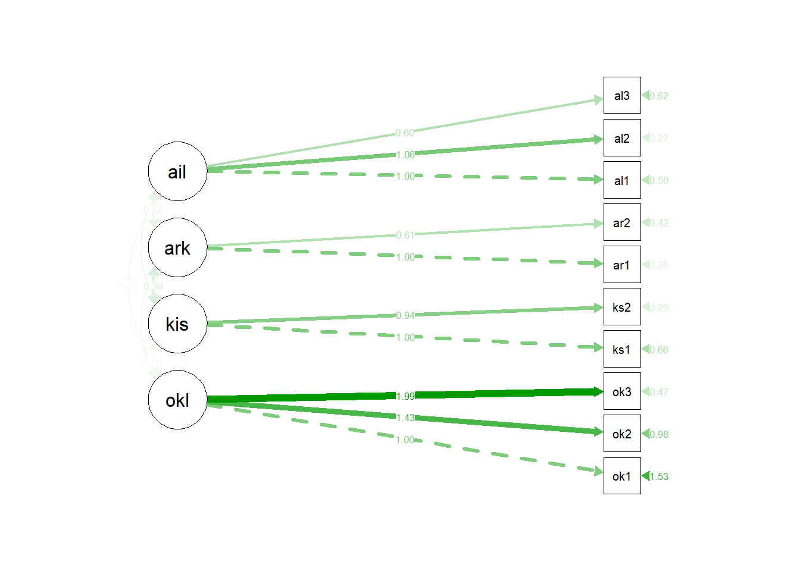

-   Standartlaştırılmış Çözümler


```r
semPaths(model_1_fit, what="std",
style="lisrel",layout="tree",residuals = TRUE,rotation = 2)
```

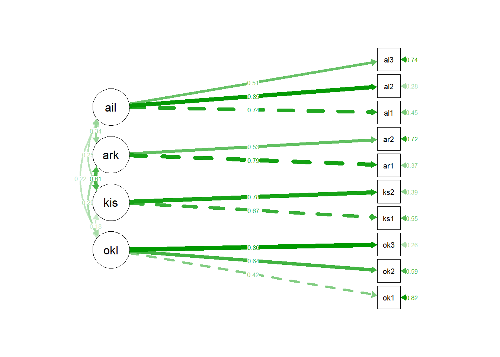

### Faktorler arası korelasyon


```r
sem_factorcor(model_1_fit)
```

```{=html}
<div id="sydmxalhxl" style="padding-left:0px;padding-right:0px;padding-top:10px;padding-bottom:10px;overflow-x:auto;overflow-y:auto;width:auto;height:auto;">
<style>#sydmxalhxl table {
  font-family: system-ui, 'Segoe UI', Roboto, Helvetica, Arial, sans-serif, 'Apple Color Emoji', 'Segoe UI Emoji', 'Segoe UI Symbol', 'Noto Color Emoji';
  -webkit-font-smoothing: antialiased;
  -moz-osx-font-smoothing: grayscale;
}

#sydmxalhxl thead, #sydmxalhxl tbody, #sydmxalhxl tfoot, #sydmxalhxl tr, #sydmxalhxl td, #sydmxalhxl th {
  border-style: none;
}

#sydmxalhxl p {
  margin: 0;
  padding: 0;
}

#sydmxalhxl .gt_table {
  display: table;
  border-collapse: collapse;
  line-height: normal;
  margin-left: 0;
  margin-right: auto;
  color: #333333;
  font-size: 16px;
  font-weight: normal;
  font-style: normal;
  background-color: #FFFFFF;
  width: auto;
  border-top-style: solid;
  border-top-width: 0px;
  border-top-color: #A8A8A8;
  border-right-style: none;
  border-right-width: 2px;
  border-right-color: #D3D3D3;
  border-bottom-style: solid;
  border-bottom-width: 0px;
  border-bottom-color: #A8A8A8;
  border-left-style: none;
  border-left-width: 2px;
  border-left-color: #D3D3D3;
}

#sydmxalhxl .gt_caption {
  padding-top: 4px;
  padding-bottom: 4px;
}

#sydmxalhxl .gt_title {
  color: #333333;
  font-size: 18px;
  font-weight: bolder;
  padding-top: 10px;
  padding-bottom: 10px;
  padding-left: 15px;
  padding-right: 15px;
  border-bottom-color: #FFFFFF;
  border-bottom-width: 0;
}

#sydmxalhxl .gt_subtitle {
  color: #333333;
  font-size: 85%;
  font-weight: initial;
  padding-top: 9px;
  padding-bottom: 11px;
  padding-left: 15px;
  padding-right: 15px;
  border-top-color: #FFFFFF;
  border-top-width: 0;
}

#sydmxalhxl .gt_heading {
  background-color: #FFFFFF;
  text-align: left;
  border-bottom-color: #FFFFFF;
  border-left-style: none;
  border-left-width: 1px;
  border-left-color: #D3D3D3;
  border-right-style: none;
  border-right-width: 1px;
  border-right-color: #D3D3D3;
}

#sydmxalhxl .gt_bottom_border {
  border-bottom-style: solid;
  border-bottom-width: 0px;
  border-bottom-color: #D3D3D3;
}

#sydmxalhxl .gt_col_headings {
  border-top-style: solid;
  border-top-width: 0px;
  border-top-color: #D3D3D3;
  border-bottom-style: solid;
  border-bottom-width: 2px;
  border-bottom-color: #D3D3D3;
  border-left-style: none;
  border-left-width: 1px;
  border-left-color: #D3D3D3;
  border-right-style: none;
  border-right-width: 1px;
  border-right-color: #D3D3D3;
}

#sydmxalhxl .gt_col_heading {
  color: #333333;
  background-color: #FFFFFF;
  font-size: 100%;
  font-weight: bold;
  text-transform: inherit;
  border-left-style: none;
  border-left-width: 1px;
  border-left-color: #D3D3D3;
  border-right-style: none;
  border-right-width: 1px;
  border-right-color: #D3D3D3;
  vertical-align: bottom;
  padding-top: 6px;
  padding-bottom: 7px;
  padding-left: 15px;
  padding-right: 15px;
  overflow-x: hidden;
}

#sydmxalhxl .gt_column_spanner_outer {
  color: #333333;
  background-color: #FFFFFF;
  font-size: 100%;
  font-weight: bold;
  text-transform: inherit;
  padding-top: 0;
  padding-bottom: 0;
  padding-left: 4px;
  padding-right: 4px;
}

#sydmxalhxl .gt_column_spanner_outer:first-child {
  padding-left: 0;
}

#sydmxalhxl .gt_column_spanner_outer:last-child {
  padding-right: 0;
}

#sydmxalhxl .gt_column_spanner {
  border-bottom-style: solid;
  border-bottom-width: 2px;
  border-bottom-color: #D3D3D3;
  vertical-align: bottom;
  padding-top: 6px;
  padding-bottom: 6px;
  overflow-x: hidden;
  display: inline-block;
  width: 100%;
}

#sydmxalhxl .gt_spanner_row {
  border-bottom-style: hidden;
}

#sydmxalhxl .gt_group_heading {
  padding-top: 8px;
  padding-bottom: 8px;
  padding-left: 15px;
  padding-right: 15px;
  color: #333333;
  background-color: #FFFFFF;
  font-size: 100%;
  font-weight: initial;
  text-transform: inherit;
  border-top-style: solid;
  border-top-width: 2px;
  border-top-color: #D3D3D3;
  border-bottom-style: solid;
  border-bottom-width: 2px;
  border-bottom-color: #D3D3D3;
  border-left-style: none;
  border-left-width: 1px;
  border-left-color: #D3D3D3;
  border-right-style: none;
  border-right-width: 1px;
  border-right-color: #D3D3D3;
  vertical-align: middle;
  text-align: left;
}

#sydmxalhxl .gt_empty_group_heading {
  padding: 0.5px;
  color: #333333;
  background-color: #FFFFFF;
  font-size: 100%;
  font-weight: initial;
  border-top-style: solid;
  border-top-width: 2px;
  border-top-color: #D3D3D3;
  border-bottom-style: solid;
  border-bottom-width: 2px;
  border-bottom-color: #D3D3D3;
  vertical-align: middle;
}

#sydmxalhxl .gt_from_md > :first-child {
  margin-top: 0;
}

#sydmxalhxl .gt_from_md > :last-child {
  margin-bottom: 0;
}

#sydmxalhxl .gt_row {
  padding-top: 8px;
  padding-bottom: 8px;
  padding-left: 15px;
  padding-right: 15px;
  margin: 10px;
  border-top-style: solid;
  border-top-width: 1px;
  border-top-color: #D3D3D3;
  border-left-style: none;
  border-left-width: 1px;
  border-left-color: #D3D3D3;
  border-right-style: none;
  border-right-width: 1px;
  border-right-color: #D3D3D3;
  vertical-align: middle;
  overflow-x: hidden;
}

#sydmxalhxl .gt_stub {
  color: #333333;
  background-color: #FFFFFF;
  font-size: 100%;
  font-weight: initial;
  text-transform: inherit;
  border-right-style: solid;
  border-right-width: 2px;
  border-right-color: #D3D3D3;
  padding-left: 15px;
  padding-right: 15px;
}

#sydmxalhxl .gt_stub_row_group {
  color: #333333;
  background-color: #FFFFFF;
  font-size: 100%;
  font-weight: initial;
  text-transform: inherit;
  border-right-style: solid;
  border-right-width: 2px;
  border-right-color: #D3D3D3;
  padding-left: 15px;
  padding-right: 15px;
  vertical-align: top;
}

#sydmxalhxl .gt_row_group_first td {
  border-top-width: 2px;
}

#sydmxalhxl .gt_row_group_first th {
  border-top-width: 2px;
}

#sydmxalhxl .gt_summary_row {
  color: #333333;
  background-color: #FFFFFF;
  text-transform: inherit;
  padding-top: 8px;
  padding-bottom: 8px;
  padding-left: 15px;
  padding-right: 15px;
}

#sydmxalhxl .gt_first_summary_row {
  border-top-style: solid;
  border-top-color: #D3D3D3;
}

#sydmxalhxl .gt_first_summary_row.thick {
  border-top-width: 2px;
}

#sydmxalhxl .gt_last_summary_row {
  padding-top: 8px;
  padding-bottom: 8px;
  padding-left: 15px;
  padding-right: 15px;
  border-bottom-style: solid;
  border-bottom-width: 2px;
  border-bottom-color: #D3D3D3;
}

#sydmxalhxl .gt_grand_summary_row {
  color: #333333;
  background-color: #FFFFFF;
  text-transform: inherit;
  padding-top: 8px;
  padding-bottom: 8px;
  padding-left: 15px;
  padding-right: 15px;
}

#sydmxalhxl .gt_first_grand_summary_row {
  padding-top: 8px;
  padding-bottom: 8px;
  padding-left: 15px;
  padding-right: 15px;
  border-top-style: double;
  border-top-width: 6px;
  border-top-color: #D3D3D3;
}

#sydmxalhxl .gt_last_grand_summary_row_top {
  padding-top: 8px;
  padding-bottom: 8px;
  padding-left: 15px;
  padding-right: 15px;
  border-bottom-style: double;
  border-bottom-width: 6px;
  border-bottom-color: #D3D3D3;
}

#sydmxalhxl .gt_striped {
  background-color: rgba(128, 128, 128, 0.05);
}

#sydmxalhxl .gt_table_body {
  border-top-style: solid;
  border-top-width: 2px;
  border-top-color: #D3D3D3;
  border-bottom-style: solid;
  border-bottom-width: 2px;
  border-bottom-color: #D3D3D3;
}

#sydmxalhxl .gt_footnotes {
  color: #333333;
  background-color: #FFFFFF;
  border-bottom-style: none;
  border-bottom-width: 2px;
  border-bottom-color: #D3D3D3;
  border-left-style: none;
  border-left-width: 2px;
  border-left-color: #D3D3D3;
  border-right-style: none;
  border-right-width: 2px;
  border-right-color: #D3D3D3;
}

#sydmxalhxl .gt_footnote {
  margin: 0px;
  font-size: 14px;
  padding-top: 4px;
  padding-bottom: 4px;
  padding-left: 15px;
  padding-right: 15px;
}

#sydmxalhxl .gt_sourcenotes {
  color: #333333;
  background-color: #FFFFFF;
  border-bottom-style: none;
  border-bottom-width: 2px;
  border-bottom-color: #D3D3D3;
  border-left-style: none;
  border-left-width: 2px;
  border-left-color: #D3D3D3;
  border-right-style: none;
  border-right-width: 2px;
  border-right-color: #D3D3D3;
}

#sydmxalhxl .gt_sourcenote {
  font-size: 90%;
  padding-top: 4px;
  padding-bottom: 4px;
  padding-left: 15px;
  padding-right: 15px;
}

#sydmxalhxl .gt_left {
  text-align: left;
}

#sydmxalhxl .gt_center {
  text-align: center;
}

#sydmxalhxl .gt_right {
  text-align: right;
  font-variant-numeric: tabular-nums;
}

#sydmxalhxl .gt_font_normal {
  font-weight: normal;
}

#sydmxalhxl .gt_font_bold {
  font-weight: bold;
}

#sydmxalhxl .gt_font_italic {
  font-style: italic;
}

#sydmxalhxl .gt_super {
  font-size: 65%;
}

#sydmxalhxl .gt_footnote_marks {
  font-size: 75%;
  vertical-align: 0.4em;
  position: initial;
}

#sydmxalhxl .gt_asterisk {
  font-size: 100%;
  vertical-align: 0;
}

#sydmxalhxl .gt_indent_1 {
  text-indent: 5px;
}

#sydmxalhxl .gt_indent_2 {
  text-indent: 10px;
}

#sydmxalhxl .gt_indent_3 {
  text-indent: 15px;
}

#sydmxalhxl .gt_indent_4 {
  text-indent: 20px;
}

#sydmxalhxl .gt_indent_5 {
  text-indent: 25px;
}
</style>
<table class="gt_table" data-quarto-disable-processing="true" data-quarto-bootstrap="false">
  <thead>
    <tr class="gt_heading">
      <td colspan="7" class="gt_heading gt_title gt_font_normal gt_bottom_border" style>Latent Factor Correlations</td>
    </tr>
    
    <tr class="gt_col_headings">
      <th class="gt_col_heading gt_columns_bottom_border gt_left" rowspan="1" colspan="1" style="text-align: center;" scope="col" id="Factor">Factor</th>
      <th class="gt_col_heading gt_columns_bottom_border gt_left" rowspan="1" colspan="1" style="text-align: center;" scope="col" id="Factor">Factor</th>
      <th class="gt_col_heading gt_columns_bottom_border gt_right" rowspan="1" colspan="1" style="text-align: center;" scope="col" id="r">r</th>
      <th class="gt_col_heading gt_columns_bottom_border gt_right" rowspan="1" colspan="1" style="text-align: center;" scope="col" id="95% CI">95% CI</th>
      <th class="gt_col_heading gt_columns_bottom_border gt_right" rowspan="1" colspan="1" style="text-align: center;" scope="col" id="sig">sig</th>
      <th class="gt_col_heading gt_columns_bottom_border gt_right" rowspan="1" colspan="1" style="text-align: center;" scope="col" id="SE">SE</th>
      <th class="gt_col_heading gt_columns_bottom_border gt_right" rowspan="1" colspan="1" style="text-align: center;" scope="col" id="p">p</th>
    </tr>
  </thead>
  <tbody class="gt_table_body">
    <tr><td headers="lhs" class="gt_row gt_left">okul</td>
<td headers="rhs" class="gt_row gt_left">kisi</td>
<td headers="est.std" class="gt_row gt_right">0.180</td>
<td headers="ci.lower" class="gt_row gt_right">0.018&nbsp;&mdash;&nbsp;0.342</td>
<td headers="stars" class="gt_row gt_right">*</td>
<td headers="se" class="gt_row gt_right">0.083</td>
<td headers="pvalue" class="gt_row gt_right">    0.029</td></tr>
    <tr><td headers="lhs" class="gt_row gt_left">okul</td>
<td headers="rhs" class="gt_row gt_left">arkadas</td>
<td headers="est.std" class="gt_row gt_right">0.293</td>
<td headers="ci.lower" class="gt_row gt_right">0.129&nbsp;&mdash;&nbsp;0.457</td>
<td headers="stars" class="gt_row gt_right">***</td>
<td headers="se" class="gt_row gt_right">0.084</td>
<td headers="pvalue" class="gt_row gt_right">&lt;0.001</td></tr>
    <tr><td headers="lhs" class="gt_row gt_left">okul</td>
<td headers="rhs" class="gt_row gt_left">aile</td>
<td headers="est.std" class="gt_row gt_right">0.219</td>
<td headers="ci.lower" class="gt_row gt_right">0.069&nbsp;&mdash;&nbsp;0.369</td>
<td headers="stars" class="gt_row gt_right">**</td>
<td headers="se" class="gt_row gt_right">0.077</td>
<td headers="pvalue" class="gt_row gt_right">    0.004</td></tr>
    <tr><td headers="lhs" class="gt_row gt_left">kisi</td>
<td headers="rhs" class="gt_row gt_left">arkadas</td>
<td headers="est.std" class="gt_row gt_right">0.614</td>
<td headers="ci.lower" class="gt_row gt_right">0.456&nbsp;&mdash;&nbsp;0.771</td>
<td headers="stars" class="gt_row gt_right">***</td>
<td headers="se" class="gt_row gt_right">0.080</td>
<td headers="pvalue" class="gt_row gt_right">&lt;0.001</td></tr>
    <tr><td headers="lhs" class="gt_row gt_left">kisi</td>
<td headers="rhs" class="gt_row gt_left">aile</td>
<td headers="est.std" class="gt_row gt_right">0.249</td>
<td headers="ci.lower" class="gt_row gt_right">0.093&nbsp;&mdash;&nbsp;0.406</td>
<td headers="stars" class="gt_row gt_right">**</td>
<td headers="se" class="gt_row gt_right">0.080</td>
<td headers="pvalue" class="gt_row gt_right">    0.002</td></tr>
    <tr><td headers="lhs" class="gt_row gt_left">arkadas</td>
<td headers="rhs" class="gt_row gt_left">aile</td>
<td headers="est.std" class="gt_row gt_right">0.344</td>
<td headers="ci.lower" class="gt_row gt_right">0.185&nbsp;&mdash;&nbsp;0.502</td>
<td headers="stars" class="gt_row gt_right">***</td>
<td headers="se" class="gt_row gt_right">0.081</td>
<td headers="pvalue" class="gt_row gt_right">&lt;0.001</td></tr>
  </tbody>
  
  <tfoot class="gt_footnotes">
    <tr>
      <td class="gt_footnote" colspan="7"> * p &lt; .05; ** p &lt; .01; *** p &lt; .001</td>
    </tr>
  </tfoot>
</table>
</div>
```

-   Standartlaştırılmamış Çözümler


```r
 library(lavaan)

model_1_v1 <- 
"
okul =~ NA*okul1 + okul2 + okul3
kisi =~ NA*kisi1 + kisi2
arkadas =~ NA*arkadas1 + arkadas2
aile =~ NA*aile1 + aile2 + aile3
 okul ~~ 1*okul
 kisi ~~ 1*kisi
 arkadas ~~ 1*arkadas
 aile ~~ 1*aile
"
model_1_v1_fit <- cfa(model_1_v1,yasamdoyum)
library(DT)
datatable(parameterestimates(model_1_v1_fit,standardized = TRUE)) %>%
    formatRound(columns=c('est', 'se',"z","pvalue","ci.lower","ci.upper",
                          "std.lv","std.all","std.nox"), digits=2)
```

```{=html}
<div class="datatables html-widget html-fill-item" id="htmlwidget-2e322d0c1a5288bcdc54" style="width:100%;height:auto;"></div>
<script type="application/json" data-for="htmlwidget-2e322d0c1a5288bcdc54">{"x":{"filter":"none","vertical":false,"data":[["1","2","3","4","5","6","7","8","9","10","11","12","13","14","15","16","17","18","19","20","21","22","23","24","25","26","27","28","29","30"],["okul","okul","okul","kisi","kisi","arkadas","arkadas","aile","aile","aile","okul","kisi","arkadas","aile","okul1","okul2","okul3","kisi1","kisi2","arkadas1","arkadas2","aile1","aile2","aile3","okul","okul","okul","kisi","kisi","arkadas"],["=~","=~","=~","=~","=~","=~","=~","=~","=~","=~","~~","~~","~~","~~","~~","~~","~~","~~","~~","~~","~~","~~","~~","~~","~~","~~","~~","~~","~~","~~"],["okul1","okul2","okul3","kisi1","kisi2","arkadas1","arkadas2","aile1","aile2","aile3","okul","kisi","arkadas","aile","okul1","okul2","okul3","kisi1","kisi2","arkadas1","arkadas2","aile1","aile2","aile3","kisi","arkadas","aile","arkadas","aile","aile"],[0.5721916808044585,0.818765454137141,1.141259547504314,0.7295113733964275,0.6854222044783186,0.6612875558869381,0.4057654395929074,0.7819387518733704,0.8295965609738768,0.4672291678071807,1,1,1,1,1.527729634717573,0.978004837298817,0.468784058319177,0.6563715980717255,0.2947639136275181,0.2620298402087886,0.4193759810183457,0.4983604512218607,0.2741072029331774,0.6222352310916676,0.1802613213514636,0.2928737214267734,0.2194536263926016,0.6136389935104547,0.2492341987942009,0.3436256481742746],[0.09532638732788422,0.09679463950091463,0.1114940995301336,0.08192681383617136,0.0693460536495419,0.07197014395433951,0.05663837862543462,0.06990032416032131,0.06592851393181307,0.06016110659626348,0,0,0,0,0.1466949769891691,0.13717262255778,0.2088165359333629,0.09983187339180177,0.07625621127154139,0.07938247815344944,0.04686540515928586,0.07865068742183502,0.07668682036724415,0.06076689426218117,0.08265376950626695,0.08372381075339752,0.07655351114307003,0.08025292891308784,0.07990769765679392,0.0808755589827075],[6.002447977351229,8.458789230052396,10.236053318641,8.904427491287867,9.884083785679801,9.188359499551412,7.164142926412977,11.18648248440077,12.5832740873227,7.766299429010165,null,null,null,null,10.41432819359841,7.129737837350606,2.244956589399484,6.574769918377862,3.865441368151518,3.300852358152319,8.94851926688723,6.336377564622604,3.574371731941816,10.23970763434131,2.180920754470804,3.498093538639945,2.866669642133946,7.646312749220807,3.11902615270771,4.248819451717759],[1.943645466795374e-09,0,0,0,0,0,7.827072323607354e-13,0,0,7.993605777301127e-15,null,null,null,null,0,1.005640015705467e-12,0.02477091951616428,4.87283546846129e-11,0.0001108884862559556,0.0009639159197516456,0,2.352298356100846e-10,0.0003510698637092524,0,0.02918927833408991,0.0004685967539221902,0.004148157730689439,2.065014825802791e-14,0.001814498550043009,2.149000295270653e-05],[0.3853553948654901,0.6290514468188102,0.9227351279365279,0.5689377689094138,0.5495064368552341,0.5202286657742696,0.2947562573443124,0.6449366340114656,0.700379048113276,0.3493155656084292,1,1,1,1,1.240212763105869,0.7091514374206618,0.05951116851337179,0.4607047217146316,0.1453044859378197,0.10644304202449,0.3275214747852678,0.3442079365157467,0.1238037969244862,0.5031343068854388,0.01826290993270546,0.128778067701667,0.0694115016620987,0.4563461431869494,0.09261798929936915,0.1851124653386231],[0.7590279667434269,1.008479461455472,1.3597839670721,0.8900849778834411,0.821337972101403,0.8023464459996066,0.5167746218415025,0.9189408697352751,0.9588140738344776,0.5851427700059322,1,1,1,1,1.815246506329276,1.246858237176972,0.8780569481249821,0.8520384744288194,0.4442233413172165,0.417616638393087,0.5112304872514236,0.6525129659279747,0.4244106089418686,0.7413361552978963,0.3422597327702218,0.4569693751518799,0.3694957511231046,0.7709318438339601,0.4058504082890326,0.5021388310099262],[0.5721916808044585,0.818765454137141,1.141259547504314,0.7295113733964275,0.6854222044783186,0.6612875558869381,0.4057654395929074,0.7819387518733704,0.8295965609738768,0.4672291678071807,1,1,1,1,1.527729634717573,0.978004837298817,0.468784058319177,0.6563715980717255,0.2947639136275181,0.2620298402087886,0.4193759810183457,0.4983604512218607,0.2741072029331774,0.6222352310916676,0.1802613213514636,0.2928737214267734,0.2194536263926016,0.6136389935104547,0.2492341987942009,0.3436256481742746],[0.4201012938623169,0.6377208515252132,0.8575186680148457,0.6691474027128134,0.7838812011231312,0.7907677295658515,0.5309585383825275,0.7422540821735442,0.8456744368290723,0.5096255419249748,1,1,1,1,0.8235149028952072,0.5933121155299571,0.2646617340060448,0.5522417534426959,0.3855302625257571,0.3746863978772685,0.71808303051869,0.4490588774967098,0.2848347468938314,0.7402818070176758,0.1802613213514636,0.2928737214267734,0.2194536263926016,0.6136389935104547,0.2492341987942009,0.3436256481742746],[0.4201012938623169,0.6377208515252132,0.8575186680148457,0.6691474027128134,0.7838812011231312,0.7907677295658515,0.5309585383825275,0.7422540821735442,0.8456744368290723,0.5096255419249748,1,1,1,1,0.8235149028952072,0.5933121155299571,0.2646617340060448,0.5522417534426959,0.3855302625257571,0.3746863978772685,0.71808303051869,0.4490588774967098,0.2848347468938314,0.7402818070176758,0.1802613213514636,0.2928737214267734,0.2194536263926016,0.6136389935104547,0.2492341987942009,0.3436256481742746]],"container":"<table class=\"display\">\n  <thead>\n    <tr>\n      <th> <\/th>\n      <th>lhs<\/th>\n      <th>op<\/th>\n      <th>rhs<\/th>\n      <th>est<\/th>\n      <th>se<\/th>\n      <th>z<\/th>\n      <th>pvalue<\/th>\n      <th>ci.lower<\/th>\n      <th>ci.upper<\/th>\n      <th>std.lv<\/th>\n      <th>std.all<\/th>\n      <th>std.nox<\/th>\n    <\/tr>\n  <\/thead>\n<\/table>","options":{"columnDefs":[{"targets":4,"render":"function(data, type, row, meta) {\n    return type !== 'display' ? data : DTWidget.formatRound(data, 2, 3, \",\", \".\", null);\n  }"},{"targets":5,"render":"function(data, type, row, meta) {\n    return type !== 'display' ? data : DTWidget.formatRound(data, 2, 3, \",\", \".\", null);\n  }"},{"targets":6,"render":"function(data, type, row, meta) {\n    return type !== 'display' ? data : DTWidget.formatRound(data, 2, 3, \",\", \".\", null);\n  }"},{"targets":7,"render":"function(data, type, row, meta) {\n    return type !== 'display' ? data : DTWidget.formatRound(data, 2, 3, \",\", \".\", null);\n  }"},{"targets":8,"render":"function(data, type, row, meta) {\n    return type !== 'display' ? data : DTWidget.formatRound(data, 2, 3, \",\", \".\", null);\n  }"},{"targets":9,"render":"function(data, type, row, meta) {\n    return type !== 'display' ? data : DTWidget.formatRound(data, 2, 3, \",\", \".\", null);\n  }"},{"targets":10,"render":"function(data, type, row, meta) {\n    return type !== 'display' ? data : DTWidget.formatRound(data, 2, 3, \",\", \".\", null);\n  }"},{"targets":11,"render":"function(data, type, row, meta) {\n    return type !== 'display' ? data : DTWidget.formatRound(data, 2, 3, \",\", \".\", null);\n  }"},{"targets":12,"render":"function(data, type, row, meta) {\n    return type !== 'display' ? data : DTWidget.formatRound(data, 2, 3, \",\", \".\", null);\n  }"},{"className":"dt-right","targets":[4,5,6,7,8,9,10,11,12]},{"orderable":false,"targets":0},{"name":" ","targets":0},{"name":"lhs","targets":1},{"name":"op","targets":2},{"name":"rhs","targets":3},{"name":"est","targets":4},{"name":"se","targets":5},{"name":"z","targets":6},{"name":"pvalue","targets":7},{"name":"ci.lower","targets":8},{"name":"ci.upper","targets":9},{"name":"std.lv","targets":10},{"name":"std.all","targets":11},{"name":"std.nox","targets":12}],"order":[],"autoWidth":false,"orderClasses":false}},"evals":["options.columnDefs.0.render","options.columnDefs.1.render","options.columnDefs.2.render","options.columnDefs.3.render","options.columnDefs.4.render","options.columnDefs.5.render","options.columnDefs.6.render","options.columnDefs.7.render","options.columnDefs.8.render"],"jsHooks":[]}</script>
```

aynı standartlaştırılmış çözümleri sağlar.

### Modifikasyon indeksleri

-   **modindices()** fonksiyonu doğrudan **cfa()** fonksiyonun çıktılarının atandığı ile çalıştırıldığında tüm modifikasyonları, modifikasyon yapıldığında ki-karedeki değişimi (mi değeri), parametrelerdeki beklenen değişimi (epc) ve istenmesi durumunda epc değerinin standartlaştırılmış değerlerini verir.


```r
modindices(model_1_fit, sort=TRUE, standardized=FALSE) %>%  head(6)
```

<div class="kable-table">

|    |lhs   |op |rhs   |       mi|        epc|
|:---|:-----|:--|:-----|--------:|----------:|
|54  |aile  |=~ |okul1 | 8.466441|  0.3465472|
|44  |kisi  |=~ |aile2 | 7.932053| -0.2679600|
|103 |aile1 |~~ |aile2 | 7.737122|  0.5914338|
|45  |kisi  |=~ |aile3 | 7.283105|  0.2363170|
|67  |okul1 |~~ |aile1 | 7.014800|  0.1696009|
|104 |aile1 |~~ |aile3 | 6.464004| -0.1982293|

</div>

-   Aynı faktör altında ve benzer ifadelere sahip olan iki madddeye ait hata varyanslarının ilişkilendirilmesi, kabul edilebilir bir gerekçe olarak değerlendirilebilir.

### Üç faktörlü model


```r
model_2f <- "
okul =~ okul1 + okul2 + okul3
kisi_arkadas =~ kisi1 + kisi2 + arkadas1 + arkadas2
aile =~ aile1 + aile2 + aile3
"
model_2_fit <- cfa(model_2f, data = yasamdoyum)
sem_sig(model_2_fit)
```

```{=html}
<div id="osnmsiucrt" style="padding-left:0px;padding-right:0px;padding-top:10px;padding-bottom:10px;overflow-x:auto;overflow-y:auto;width:auto;height:auto;">
<style>#osnmsiucrt table {
  font-family: system-ui, 'Segoe UI', Roboto, Helvetica, Arial, sans-serif, 'Apple Color Emoji', 'Segoe UI Emoji', 'Segoe UI Symbol', 'Noto Color Emoji';
  -webkit-font-smoothing: antialiased;
  -moz-osx-font-smoothing: grayscale;
}

#osnmsiucrt thead, #osnmsiucrt tbody, #osnmsiucrt tfoot, #osnmsiucrt tr, #osnmsiucrt td, #osnmsiucrt th {
  border-style: none;
}

#osnmsiucrt p {
  margin: 0;
  padding: 0;
}

#osnmsiucrt .gt_table {
  display: table;
  border-collapse: collapse;
  line-height: normal;
  margin-left: 0;
  margin-right: auto;
  color: #333333;
  font-size: 16px;
  font-weight: normal;
  font-style: normal;
  background-color: #FFFFFF;
  width: auto;
  border-top-style: solid;
  border-top-width: 0px;
  border-top-color: #A8A8A8;
  border-right-style: none;
  border-right-width: 2px;
  border-right-color: #D3D3D3;
  border-bottom-style: solid;
  border-bottom-width: 0px;
  border-bottom-color: #A8A8A8;
  border-left-style: none;
  border-left-width: 2px;
  border-left-color: #D3D3D3;
}

#osnmsiucrt .gt_caption {
  padding-top: 4px;
  padding-bottom: 4px;
}

#osnmsiucrt .gt_title {
  color: #333333;
  font-size: 18px;
  font-weight: bolder;
  padding-top: 10px;
  padding-bottom: 10px;
  padding-left: 15px;
  padding-right: 15px;
  border-bottom-color: #FFFFFF;
  border-bottom-width: 0;
}

#osnmsiucrt .gt_subtitle {
  color: #333333;
  font-size: 85%;
  font-weight: initial;
  padding-top: 9px;
  padding-bottom: 11px;
  padding-left: 15px;
  padding-right: 15px;
  border-top-color: #FFFFFF;
  border-top-width: 0;
}

#osnmsiucrt .gt_heading {
  background-color: #FFFFFF;
  text-align: left;
  border-bottom-color: #FFFFFF;
  border-left-style: none;
  border-left-width: 1px;
  border-left-color: #D3D3D3;
  border-right-style: none;
  border-right-width: 1px;
  border-right-color: #D3D3D3;
}

#osnmsiucrt .gt_bottom_border {
  border-bottom-style: solid;
  border-bottom-width: 0px;
  border-bottom-color: #D3D3D3;
}

#osnmsiucrt .gt_col_headings {
  border-top-style: solid;
  border-top-width: 0px;
  border-top-color: #D3D3D3;
  border-bottom-style: solid;
  border-bottom-width: 2px;
  border-bottom-color: #D3D3D3;
  border-left-style: none;
  border-left-width: 1px;
  border-left-color: #D3D3D3;
  border-right-style: none;
  border-right-width: 1px;
  border-right-color: #D3D3D3;
}

#osnmsiucrt .gt_col_heading {
  color: #333333;
  background-color: #FFFFFF;
  font-size: 100%;
  font-weight: bold;
  text-transform: inherit;
  border-left-style: none;
  border-left-width: 1px;
  border-left-color: #D3D3D3;
  border-right-style: none;
  border-right-width: 1px;
  border-right-color: #D3D3D3;
  vertical-align: bottom;
  padding-top: 6px;
  padding-bottom: 7px;
  padding-left: 15px;
  padding-right: 15px;
  overflow-x: hidden;
}

#osnmsiucrt .gt_column_spanner_outer {
  color: #333333;
  background-color: #FFFFFF;
  font-size: 100%;
  font-weight: bold;
  text-transform: inherit;
  padding-top: 0;
  padding-bottom: 0;
  padding-left: 4px;
  padding-right: 4px;
}

#osnmsiucrt .gt_column_spanner_outer:first-child {
  padding-left: 0;
}

#osnmsiucrt .gt_column_spanner_outer:last-child {
  padding-right: 0;
}

#osnmsiucrt .gt_column_spanner {
  border-bottom-style: solid;
  border-bottom-width: 2px;
  border-bottom-color: #D3D3D3;
  vertical-align: bottom;
  padding-top: 6px;
  padding-bottom: 6px;
  overflow-x: hidden;
  display: inline-block;
  width: 100%;
}

#osnmsiucrt .gt_spanner_row {
  border-bottom-style: hidden;
}

#osnmsiucrt .gt_group_heading {
  padding-top: 8px;
  padding-bottom: 8px;
  padding-left: 15px;
  padding-right: 15px;
  color: #333333;
  background-color: #FFFFFF;
  font-size: 100%;
  font-weight: initial;
  text-transform: inherit;
  border-top-style: solid;
  border-top-width: 2px;
  border-top-color: #D3D3D3;
  border-bottom-style: solid;
  border-bottom-width: 2px;
  border-bottom-color: #D3D3D3;
  border-left-style: none;
  border-left-width: 1px;
  border-left-color: #D3D3D3;
  border-right-style: none;
  border-right-width: 1px;
  border-right-color: #D3D3D3;
  vertical-align: middle;
  text-align: left;
}

#osnmsiucrt .gt_empty_group_heading {
  padding: 0.5px;
  color: #333333;
  background-color: #FFFFFF;
  font-size: 100%;
  font-weight: initial;
  border-top-style: solid;
  border-top-width: 2px;
  border-top-color: #D3D3D3;
  border-bottom-style: solid;
  border-bottom-width: 2px;
  border-bottom-color: #D3D3D3;
  vertical-align: middle;
}

#osnmsiucrt .gt_from_md > :first-child {
  margin-top: 0;
}

#osnmsiucrt .gt_from_md > :last-child {
  margin-bottom: 0;
}

#osnmsiucrt .gt_row {
  padding-top: 8px;
  padding-bottom: 8px;
  padding-left: 15px;
  padding-right: 15px;
  margin: 10px;
  border-top-style: solid;
  border-top-width: 1px;
  border-top-color: #D3D3D3;
  border-left-style: none;
  border-left-width: 1px;
  border-left-color: #D3D3D3;
  border-right-style: none;
  border-right-width: 1px;
  border-right-color: #D3D3D3;
  vertical-align: middle;
  overflow-x: hidden;
}

#osnmsiucrt .gt_stub {
  color: #333333;
  background-color: #FFFFFF;
  font-size: 100%;
  font-weight: initial;
  text-transform: inherit;
  border-right-style: solid;
  border-right-width: 2px;
  border-right-color: #D3D3D3;
  padding-left: 15px;
  padding-right: 15px;
}

#osnmsiucrt .gt_stub_row_group {
  color: #333333;
  background-color: #FFFFFF;
  font-size: 100%;
  font-weight: initial;
  text-transform: inherit;
  border-right-style: solid;
  border-right-width: 2px;
  border-right-color: #D3D3D3;
  padding-left: 15px;
  padding-right: 15px;
  vertical-align: top;
}

#osnmsiucrt .gt_row_group_first td {
  border-top-width: 2px;
}

#osnmsiucrt .gt_row_group_first th {
  border-top-width: 2px;
}

#osnmsiucrt .gt_summary_row {
  color: #333333;
  background-color: #FFFFFF;
  text-transform: inherit;
  padding-top: 8px;
  padding-bottom: 8px;
  padding-left: 15px;
  padding-right: 15px;
}

#osnmsiucrt .gt_first_summary_row {
  border-top-style: solid;
  border-top-color: #D3D3D3;
}

#osnmsiucrt .gt_first_summary_row.thick {
  border-top-width: 2px;
}

#osnmsiucrt .gt_last_summary_row {
  padding-top: 8px;
  padding-bottom: 8px;
  padding-left: 15px;
  padding-right: 15px;
  border-bottom-style: solid;
  border-bottom-width: 2px;
  border-bottom-color: #D3D3D3;
}

#osnmsiucrt .gt_grand_summary_row {
  color: #333333;
  background-color: #FFFFFF;
  text-transform: inherit;
  padding-top: 8px;
  padding-bottom: 8px;
  padding-left: 15px;
  padding-right: 15px;
}

#osnmsiucrt .gt_first_grand_summary_row {
  padding-top: 8px;
  padding-bottom: 8px;
  padding-left: 15px;
  padding-right: 15px;
  border-top-style: double;
  border-top-width: 6px;
  border-top-color: #D3D3D3;
}

#osnmsiucrt .gt_last_grand_summary_row_top {
  padding-top: 8px;
  padding-bottom: 8px;
  padding-left: 15px;
  padding-right: 15px;
  border-bottom-style: double;
  border-bottom-width: 6px;
  border-bottom-color: #D3D3D3;
}

#osnmsiucrt .gt_striped {
  background-color: rgba(128, 128, 128, 0.05);
}

#osnmsiucrt .gt_table_body {
  border-top-style: solid;
  border-top-width: 2px;
  border-top-color: #D3D3D3;
  border-bottom-style: solid;
  border-bottom-width: 2px;
  border-bottom-color: #D3D3D3;
}

#osnmsiucrt .gt_footnotes {
  color: #333333;
  background-color: #FFFFFF;
  border-bottom-style: none;
  border-bottom-width: 2px;
  border-bottom-color: #D3D3D3;
  border-left-style: none;
  border-left-width: 2px;
  border-left-color: #D3D3D3;
  border-right-style: none;
  border-right-width: 2px;
  border-right-color: #D3D3D3;
}

#osnmsiucrt .gt_footnote {
  margin: 0px;
  font-size: 14px;
  padding-top: 4px;
  padding-bottom: 4px;
  padding-left: 15px;
  padding-right: 15px;
}

#osnmsiucrt .gt_sourcenotes {
  color: #333333;
  background-color: #FFFFFF;
  border-bottom-style: none;
  border-bottom-width: 2px;
  border-bottom-color: #D3D3D3;
  border-left-style: none;
  border-left-width: 2px;
  border-left-color: #D3D3D3;
  border-right-style: none;
  border-right-width: 2px;
  border-right-color: #D3D3D3;
}

#osnmsiucrt .gt_sourcenote {
  font-size: 90%;
  padding-top: 4px;
  padding-bottom: 4px;
  padding-left: 15px;
  padding-right: 15px;
}

#osnmsiucrt .gt_left {
  text-align: left;
}

#osnmsiucrt .gt_center {
  text-align: center;
}

#osnmsiucrt .gt_right {
  text-align: right;
  font-variant-numeric: tabular-nums;
}

#osnmsiucrt .gt_font_normal {
  font-weight: normal;
}

#osnmsiucrt .gt_font_bold {
  font-weight: bold;
}

#osnmsiucrt .gt_font_italic {
  font-style: italic;
}

#osnmsiucrt .gt_super {
  font-size: 65%;
}

#osnmsiucrt .gt_footnote_marks {
  font-size: 75%;
  vertical-align: 0.4em;
  position: initial;
}

#osnmsiucrt .gt_asterisk {
  font-size: 100%;
  vertical-align: 0;
}

#osnmsiucrt .gt_indent_1 {
  text-indent: 5px;
}

#osnmsiucrt .gt_indent_2 {
  text-indent: 10px;
}

#osnmsiucrt .gt_indent_3 {
  text-indent: 15px;
}

#osnmsiucrt .gt_indent_4 {
  text-indent: 20px;
}

#osnmsiucrt .gt_indent_5 {
  text-indent: 25px;
}
</style>
<table class="gt_table" data-quarto-disable-processing="true" data-quarto-bootstrap="false">
  <thead>
    <tr class="gt_heading">
      <td colspan="4" class="gt_heading gt_title gt_font_normal gt_bottom_border" style>Model Significance</td>
    </tr>
    
    <tr class="gt_col_headings">
      <th class="gt_col_heading gt_columns_bottom_border gt_right" rowspan="1" colspan="1" style="text-align: center;" scope="col" id="N">N</th>
      <th class="gt_col_heading gt_columns_bottom_border gt_right" rowspan="1" colspan="1" style="text-align: center;" scope="col" id="&amp;chi;&lt;sup&gt;2&lt;/sup&gt;">&chi;<sup>2</sup></th>
      <th class="gt_col_heading gt_columns_bottom_border gt_right" rowspan="1" colspan="1" style="text-align: center;" scope="col" id="df">df</th>
      <th class="gt_col_heading gt_columns_bottom_border gt_right" rowspan="1" colspan="1" style="text-align: center;" scope="col" id="p">p</th>
    </tr>
  </thead>
  <tbody class="gt_table_body">
    <tr><td headers="N" class="gt_row gt_right">255 </td>
<td headers="Chi_Square" class="gt_row gt_right">79.522</td>
<td headers="df" class="gt_row gt_right">32 </td>
<td headers="p" class="gt_row gt_right">&lt;0.001</td></tr>
  </tbody>
  
  
</table>
</div>
```


```r
# sem_fitmeasures(model_2_fit)
```


```r
fits.esnek2 <- gen_fit(mod1 = model_2f , x = yasamdoyum[,4:13], rep = 100)
```

```
## Warning in pop_mod(mod = mod1, x = x, type = type, standardized =
## standardized): At least one loading is > 1. Consider revision of standardized.
```

```r
flex_co(fits = fits.esnek2, index = c("CFI", "SRMR"))$cutoff
```

```
## Warning in flex_co(fits = fits.esnek2, index = c("CFI", "SRMR")): The number of
## replications is lower than the recommended minimum of 500. Consider with care.
```

```
##        CFI       SRMR 
## 0.94518618 0.05021492
```


```r
sem_factorloadings(model_2_fit)
```

```{=html}
<div id="etkupowkuo" style="padding-left:0px;padding-right:0px;padding-top:10px;padding-bottom:10px;overflow-x:auto;overflow-y:auto;width:auto;height:auto;">
<style>#etkupowkuo table {
  font-family: system-ui, 'Segoe UI', Roboto, Helvetica, Arial, sans-serif, 'Apple Color Emoji', 'Segoe UI Emoji', 'Segoe UI Symbol', 'Noto Color Emoji';
  -webkit-font-smoothing: antialiased;
  -moz-osx-font-smoothing: grayscale;
}

#etkupowkuo thead, #etkupowkuo tbody, #etkupowkuo tfoot, #etkupowkuo tr, #etkupowkuo td, #etkupowkuo th {
  border-style: none;
}

#etkupowkuo p {
  margin: 0;
  padding: 0;
}

#etkupowkuo .gt_table {
  display: table;
  border-collapse: collapse;
  line-height: normal;
  margin-left: 0;
  margin-right: auto;
  color: #333333;
  font-size: 16px;
  font-weight: normal;
  font-style: normal;
  background-color: #FFFFFF;
  width: auto;
  border-top-style: solid;
  border-top-width: 0px;
  border-top-color: #A8A8A8;
  border-right-style: none;
  border-right-width: 2px;
  border-right-color: #D3D3D3;
  border-bottom-style: solid;
  border-bottom-width: 0px;
  border-bottom-color: #A8A8A8;
  border-left-style: none;
  border-left-width: 2px;
  border-left-color: #D3D3D3;
}

#etkupowkuo .gt_caption {
  padding-top: 4px;
  padding-bottom: 4px;
}

#etkupowkuo .gt_title {
  color: #333333;
  font-size: 18px;
  font-weight: bolder;
  padding-top: 10px;
  padding-bottom: 10px;
  padding-left: 15px;
  padding-right: 15px;
  border-bottom-color: #FFFFFF;
  border-bottom-width: 0;
}

#etkupowkuo .gt_subtitle {
  color: #333333;
  font-size: 85%;
  font-weight: initial;
  padding-top: 9px;
  padding-bottom: 11px;
  padding-left: 15px;
  padding-right: 15px;
  border-top-color: #FFFFFF;
  border-top-width: 0;
}

#etkupowkuo .gt_heading {
  background-color: #FFFFFF;
  text-align: left;
  border-bottom-color: #FFFFFF;
  border-left-style: none;
  border-left-width: 1px;
  border-left-color: #D3D3D3;
  border-right-style: none;
  border-right-width: 1px;
  border-right-color: #D3D3D3;
}

#etkupowkuo .gt_bottom_border {
  border-bottom-style: solid;
  border-bottom-width: 0px;
  border-bottom-color: #D3D3D3;
}

#etkupowkuo .gt_col_headings {
  border-top-style: solid;
  border-top-width: 0px;
  border-top-color: #D3D3D3;
  border-bottom-style: solid;
  border-bottom-width: 2px;
  border-bottom-color: #D3D3D3;
  border-left-style: none;
  border-left-width: 1px;
  border-left-color: #D3D3D3;
  border-right-style: none;
  border-right-width: 1px;
  border-right-color: #D3D3D3;
}

#etkupowkuo .gt_col_heading {
  color: #333333;
  background-color: #FFFFFF;
  font-size: 100%;
  font-weight: bold;
  text-transform: inherit;
  border-left-style: none;
  border-left-width: 1px;
  border-left-color: #D3D3D3;
  border-right-style: none;
  border-right-width: 1px;
  border-right-color: #D3D3D3;
  vertical-align: bottom;
  padding-top: 6px;
  padding-bottom: 7px;
  padding-left: 15px;
  padding-right: 15px;
  overflow-x: hidden;
}

#etkupowkuo .gt_column_spanner_outer {
  color: #333333;
  background-color: #FFFFFF;
  font-size: 100%;
  font-weight: bold;
  text-transform: inherit;
  padding-top: 0;
  padding-bottom: 0;
  padding-left: 4px;
  padding-right: 4px;
}

#etkupowkuo .gt_column_spanner_outer:first-child {
  padding-left: 0;
}

#etkupowkuo .gt_column_spanner_outer:last-child {
  padding-right: 0;
}

#etkupowkuo .gt_column_spanner {
  border-bottom-style: solid;
  border-bottom-width: 2px;
  border-bottom-color: #D3D3D3;
  vertical-align: bottom;
  padding-top: 6px;
  padding-bottom: 6px;
  overflow-x: hidden;
  display: inline-block;
  width: 100%;
}

#etkupowkuo .gt_spanner_row {
  border-bottom-style: hidden;
}

#etkupowkuo .gt_group_heading {
  padding-top: 8px;
  padding-bottom: 8px;
  padding-left: 15px;
  padding-right: 15px;
  color: #333333;
  background-color: #FFFFFF;
  font-size: 100%;
  font-weight: initial;
  text-transform: inherit;
  border-top-style: solid;
  border-top-width: 2px;
  border-top-color: #D3D3D3;
  border-bottom-style: solid;
  border-bottom-width: 2px;
  border-bottom-color: #D3D3D3;
  border-left-style: none;
  border-left-width: 1px;
  border-left-color: #D3D3D3;
  border-right-style: none;
  border-right-width: 1px;
  border-right-color: #D3D3D3;
  vertical-align: middle;
  text-align: left;
}

#etkupowkuo .gt_empty_group_heading {
  padding: 0.5px;
  color: #333333;
  background-color: #FFFFFF;
  font-size: 100%;
  font-weight: initial;
  border-top-style: solid;
  border-top-width: 2px;
  border-top-color: #D3D3D3;
  border-bottom-style: solid;
  border-bottom-width: 2px;
  border-bottom-color: #D3D3D3;
  vertical-align: middle;
}

#etkupowkuo .gt_from_md > :first-child {
  margin-top: 0;
}

#etkupowkuo .gt_from_md > :last-child {
  margin-bottom: 0;
}

#etkupowkuo .gt_row {
  padding-top: 8px;
  padding-bottom: 8px;
  padding-left: 15px;
  padding-right: 15px;
  margin: 10px;
  border-top-style: solid;
  border-top-width: 1px;
  border-top-color: #D3D3D3;
  border-left-style: none;
  border-left-width: 1px;
  border-left-color: #D3D3D3;
  border-right-style: none;
  border-right-width: 1px;
  border-right-color: #D3D3D3;
  vertical-align: middle;
  overflow-x: hidden;
}

#etkupowkuo .gt_stub {
  color: #333333;
  background-color: #FFFFFF;
  font-size: 100%;
  font-weight: initial;
  text-transform: inherit;
  border-right-style: solid;
  border-right-width: 2px;
  border-right-color: #D3D3D3;
  padding-left: 15px;
  padding-right: 15px;
}

#etkupowkuo .gt_stub_row_group {
  color: #333333;
  background-color: #FFFFFF;
  font-size: 100%;
  font-weight: initial;
  text-transform: inherit;
  border-right-style: solid;
  border-right-width: 2px;
  border-right-color: #D3D3D3;
  padding-left: 15px;
  padding-right: 15px;
  vertical-align: top;
}

#etkupowkuo .gt_row_group_first td {
  border-top-width: 2px;
}

#etkupowkuo .gt_row_group_first th {
  border-top-width: 2px;
}

#etkupowkuo .gt_summary_row {
  color: #333333;
  background-color: #FFFFFF;
  text-transform: inherit;
  padding-top: 8px;
  padding-bottom: 8px;
  padding-left: 15px;
  padding-right: 15px;
}

#etkupowkuo .gt_first_summary_row {
  border-top-style: solid;
  border-top-color: #D3D3D3;
}

#etkupowkuo .gt_first_summary_row.thick {
  border-top-width: 2px;
}

#etkupowkuo .gt_last_summary_row {
  padding-top: 8px;
  padding-bottom: 8px;
  padding-left: 15px;
  padding-right: 15px;
  border-bottom-style: solid;
  border-bottom-width: 2px;
  border-bottom-color: #D3D3D3;
}

#etkupowkuo .gt_grand_summary_row {
  color: #333333;
  background-color: #FFFFFF;
  text-transform: inherit;
  padding-top: 8px;
  padding-bottom: 8px;
  padding-left: 15px;
  padding-right: 15px;
}

#etkupowkuo .gt_first_grand_summary_row {
  padding-top: 8px;
  padding-bottom: 8px;
  padding-left: 15px;
  padding-right: 15px;
  border-top-style: double;
  border-top-width: 6px;
  border-top-color: #D3D3D3;
}

#etkupowkuo .gt_last_grand_summary_row_top {
  padding-top: 8px;
  padding-bottom: 8px;
  padding-left: 15px;
  padding-right: 15px;
  border-bottom-style: double;
  border-bottom-width: 6px;
  border-bottom-color: #D3D3D3;
}

#etkupowkuo .gt_striped {
  background-color: rgba(128, 128, 128, 0.05);
}

#etkupowkuo .gt_table_body {
  border-top-style: solid;
  border-top-width: 2px;
  border-top-color: #D3D3D3;
  border-bottom-style: solid;
  border-bottom-width: 2px;
  border-bottom-color: #D3D3D3;
}

#etkupowkuo .gt_footnotes {
  color: #333333;
  background-color: #FFFFFF;
  border-bottom-style: none;
  border-bottom-width: 2px;
  border-bottom-color: #D3D3D3;
  border-left-style: none;
  border-left-width: 2px;
  border-left-color: #D3D3D3;
  border-right-style: none;
  border-right-width: 2px;
  border-right-color: #D3D3D3;
}

#etkupowkuo .gt_footnote {
  margin: 0px;
  font-size: 14px;
  padding-top: 4px;
  padding-bottom: 4px;
  padding-left: 15px;
  padding-right: 15px;
}

#etkupowkuo .gt_sourcenotes {
  color: #333333;
  background-color: #FFFFFF;
  border-bottom-style: none;
  border-bottom-width: 2px;
  border-bottom-color: #D3D3D3;
  border-left-style: none;
  border-left-width: 2px;
  border-left-color: #D3D3D3;
  border-right-style: none;
  border-right-width: 2px;
  border-right-color: #D3D3D3;
}

#etkupowkuo .gt_sourcenote {
  font-size: 90%;
  padding-top: 4px;
  padding-bottom: 4px;
  padding-left: 15px;
  padding-right: 15px;
}

#etkupowkuo .gt_left {
  text-align: left;
}

#etkupowkuo .gt_center {
  text-align: center;
}

#etkupowkuo .gt_right {
  text-align: right;
  font-variant-numeric: tabular-nums;
}

#etkupowkuo .gt_font_normal {
  font-weight: normal;
}

#etkupowkuo .gt_font_bold {
  font-weight: bold;
}

#etkupowkuo .gt_font_italic {
  font-style: italic;
}

#etkupowkuo .gt_super {
  font-size: 65%;
}

#etkupowkuo .gt_footnote_marks {
  font-size: 75%;
  vertical-align: 0.4em;
  position: initial;
}

#etkupowkuo .gt_asterisk {
  font-size: 100%;
  vertical-align: 0;
}

#etkupowkuo .gt_indent_1 {
  text-indent: 5px;
}

#etkupowkuo .gt_indent_2 {
  text-indent: 10px;
}

#etkupowkuo .gt_indent_3 {
  text-indent: 15px;
}

#etkupowkuo .gt_indent_4 {
  text-indent: 20px;
}

#etkupowkuo .gt_indent_5 {
  text-indent: 25px;
}
</style>
<table class="gt_table" data-quarto-disable-processing="true" data-quarto-bootstrap="false">
  <thead>
    <tr class="gt_heading">
      <td colspan="8" class="gt_heading gt_title gt_font_normal gt_bottom_border" style>Factor Loadings</td>
    </tr>
    
    <tr class="gt_col_headings gt_spanner_row">
      <th class="gt_col_heading gt_columns_bottom_border gt_left" rowspan="2" colspan="1" style="text-align: center;" scope="col" id="Latent Factor">Latent Factor</th>
      <th class="gt_col_heading gt_columns_bottom_border gt_left" rowspan="2" colspan="1" style="text-align: center;" scope="col" id="Indicator">Indicator</th>
      <th class="gt_center gt_columns_top_border gt_column_spanner_outer" rowspan="1" colspan="6" scope="colgroup" id="Standardized">
        <span class="gt_column_spanner">Standardized</span>
      </th>
    </tr>
    <tr class="gt_col_headings">
      <th class="gt_col_heading gt_columns_bottom_border gt_right" rowspan="1" colspan="1" style="text-align: center;" scope="col" id="Loading">Loading</th>
      <th class="gt_col_heading gt_columns_bottom_border gt_right" rowspan="1" colspan="1" style="text-align: center;" scope="col" id="95% CI">95% CI</th>
      <th class="gt_col_heading gt_columns_bottom_border gt_right" rowspan="1" colspan="1" style="text-align: center;" scope="col" id="sig">sig</th>
      <th class="gt_col_heading gt_columns_bottom_border gt_right" rowspan="1" colspan="1" style="text-align: center;" scope="col" id="SE">SE</th>
      <th class="gt_col_heading gt_columns_bottom_border gt_right" rowspan="1" colspan="1" style="text-align: center;" scope="col" id="z">z</th>
      <th class="gt_col_heading gt_columns_bottom_border gt_right" rowspan="1" colspan="1" style="text-align: center;" scope="col" id="p">p</th>
    </tr>
  </thead>
  <tbody class="gt_table_body">
    <tr><td headers="lhs" class="gt_row gt_left">aile</td>
<td headers="rhs" class="gt_row gt_left">aile1</td>
<td headers="est.std" class="gt_row gt_right">0.747</td>
<td headers="ci.lower_std" class="gt_row gt_right">0.651&nbsp;&mdash;&nbsp;0.842</td>
<td headers="stars" class="gt_row gt_right">***</td>
<td headers="se" class="gt_row gt_right">0.049</td>
<td headers="z" class="gt_row gt_right">15.330</td>
<td headers="pvalue" class="gt_row gt_right">    0.000</td></tr>
    <tr><td headers="lhs" class="gt_row gt_left">aile</td>
<td headers="rhs" class="gt_row gt_left">aile2</td>
<td headers="est.std" class="gt_row gt_right">0.840</td>
<td headers="ci.lower_std" class="gt_row gt_right">0.745&nbsp;&mdash;&nbsp;0.935</td>
<td headers="stars" class="gt_row gt_right">***</td>
<td headers="se" class="gt_row gt_right">0.048</td>
<td headers="z" class="gt_row gt_right">17.344</td>
<td headers="pvalue" class="gt_row gt_right">    0.000</td></tr>
    <tr><td headers="lhs" class="gt_row gt_left">aile</td>
<td headers="rhs" class="gt_row gt_left">aile3</td>
<td headers="est.std" class="gt_row gt_right">0.511</td>
<td headers="ci.lower_std" class="gt_row gt_right">0.403&nbsp;&mdash;&nbsp;0.619</td>
<td headers="stars" class="gt_row gt_right">***</td>
<td headers="se" class="gt_row gt_right">0.055</td>
<td headers="z" class="gt_row gt_right"> 9.265</td>
<td headers="pvalue" class="gt_row gt_right">    0.000</td></tr>
    <tr><td headers="lhs" class="gt_row gt_left">kisi_arkadas</td>
<td headers="rhs" class="gt_row gt_left">arkadas1</td>
<td headers="est.std" class="gt_row gt_right">0.608</td>
<td headers="ci.lower_std" class="gt_row gt_right">0.499&nbsp;&mdash;&nbsp;0.717</td>
<td headers="stars" class="gt_row gt_right">***</td>
<td headers="se" class="gt_row gt_right">0.056</td>
<td headers="z" class="gt_row gt_right">10.913</td>
<td headers="pvalue" class="gt_row gt_right">    0.000</td></tr>
    <tr><td headers="lhs" class="gt_row gt_left">kisi_arkadas</td>
<td headers="rhs" class="gt_row gt_left">arkadas2</td>
<td headers="est.std" class="gt_row gt_right">0.450</td>
<td headers="ci.lower_std" class="gt_row gt_right">0.327&nbsp;&mdash;&nbsp;0.573</td>
<td headers="stars" class="gt_row gt_right">***</td>
<td headers="se" class="gt_row gt_right">0.063</td>
<td headers="z" class="gt_row gt_right"> 7.162</td>
<td headers="pvalue" class="gt_row gt_right">&lt;0.001</td></tr>
    <tr><td headers="lhs" class="gt_row gt_left">kisi_arkadas</td>
<td headers="rhs" class="gt_row gt_left">kisi1</td>
<td headers="est.std" class="gt_row gt_right">0.629</td>
<td headers="ci.lower_std" class="gt_row gt_right">0.521&nbsp;&mdash;&nbsp;0.737</td>
<td headers="stars" class="gt_row gt_right">***</td>
<td headers="se" class="gt_row gt_right">0.055</td>
<td headers="z" class="gt_row gt_right">11.443</td>
<td headers="pvalue" class="gt_row gt_right">    0.000</td></tr>
    <tr><td headers="lhs" class="gt_row gt_left">kisi_arkadas</td>
<td headers="rhs" class="gt_row gt_left">kisi2</td>
<td headers="est.std" class="gt_row gt_right">0.698</td>
<td headers="ci.lower_std" class="gt_row gt_right">0.594&nbsp;&mdash;&nbsp;0.801</td>
<td headers="stars" class="gt_row gt_right">***</td>
<td headers="se" class="gt_row gt_right">0.053</td>
<td headers="z" class="gt_row gt_right">13.156</td>
<td headers="pvalue" class="gt_row gt_right">    0.000</td></tr>
    <tr><td headers="lhs" class="gt_row gt_left">okul</td>
<td headers="rhs" class="gt_row gt_left">okul1</td>
<td headers="est.std" class="gt_row gt_right">0.424</td>
<td headers="ci.lower_std" class="gt_row gt_right">0.300&nbsp;&mdash;&nbsp;0.547</td>
<td headers="stars" class="gt_row gt_right">***</td>
<td headers="se" class="gt_row gt_right">0.063</td>
<td headers="z" class="gt_row gt_right"> 6.703</td>
<td headers="pvalue" class="gt_row gt_right">&lt;0.001</td></tr>
    <tr><td headers="lhs" class="gt_row gt_left">okul</td>
<td headers="rhs" class="gt_row gt_left">okul2</td>
<td headers="est.std" class="gt_row gt_right">0.645</td>
<td headers="ci.lower_std" class="gt_row gt_right">0.521&nbsp;&mdash;&nbsp;0.769</td>
<td headers="stars" class="gt_row gt_right">***</td>
<td headers="se" class="gt_row gt_right">0.063</td>
<td headers="z" class="gt_row gt_right">10.209</td>
<td headers="pvalue" class="gt_row gt_right">    0.000</td></tr>
    <tr><td headers="lhs" class="gt_row gt_left">okul</td>
<td headers="rhs" class="gt_row gt_left">okul3</td>
<td headers="est.std" class="gt_row gt_right">0.847</td>
<td headers="ci.lower_std" class="gt_row gt_right">0.711&nbsp;&mdash;&nbsp;0.983</td>
<td headers="stars" class="gt_row gt_right">***</td>
<td headers="se" class="gt_row gt_right">0.069</td>
<td headers="z" class="gt_row gt_right">12.203</td>
<td headers="pvalue" class="gt_row gt_right">    0.000</td></tr>
  </tbody>
  
  <tfoot class="gt_footnotes">
    <tr>
      <td class="gt_footnote" colspan="8"> * p &lt; .05; ** p &lt; .01; *** p &lt; .001</td>
    </tr>
  </tfoot>
</table>
</div>
```

### Model karşılaştırma

-   Eğer iki model hiyerarşikse ve her ikisi de veriye kabul edilebilir ölçüde uyum sağlıyorsa, iki modelin veriye uyumunu karşılaştırmak için ki-kare fark test uygulanabilir.

-   üç faktörlü model iyi uyum göstermediği için sadece örnek amaçlı:


```r
anova(model_1_fit,model_2_fit )
```

<div class="kable-table">

|            | Df|      AIC|      BIC|    Chisq| Chisq diff|     RMSEA| Df diff| Pr(>Chisq)|
|:-----------|--:|--------:|--------:|--------:|----------:|---------:|-------:|----------:|
|model_1_fit | 29| 6907.520| 6999.593| 51.43258|         NA|        NA|      NA|         NA|
|model_2_fit | 32| 6929.609| 7011.058| 79.52151|   28.08893| 0.1810966|       3|    3.5e-06|

</div>

-   Verilen örneklerde, üç faktörlü model dört faktörlü modelin içinde kümelenmiştir.

-   Üç faktörlü model veriye iyi uyum **sağlamamıştır,** dört faktörlü model çeşitli uyum indekslerinin de gösterdiği üzere çok daha iyi uyum sağlamıştır. Bu nedenle, dört faktörlü modelin seçimini desteklemek için ki-kare fark testi uygulamaya gerek yoktur

-   Ki-kare fark testi dört faktörlü modelin üç faktörlü modelden anlamlı olarak daha iyi uyum sağladığını önerir. Bu nedenle dört faktörlü model tercih edilir.

## Daha Yüksek Dereceli Faktör Modelleri

-   Bazı durumlarda sadece ölçümler arasındaki kovaryansları değil, **faktörler arasındaki kovaryansları açılayacak faktörlerin** hipotez edildiği daha yüksek dereceli faktör modelleri geliştirilebilir.

    -   Birinci dereceli faktörler (First-order factors): Bir grup göstergenin altında yatan faktörler.

    -   İkinci dereceli faktörler (Second-order factors): Birinci dereceli faktörlerin altında yatan faktörler.

    -   Daha yüksek dereceli faktörler (Higher-order factors): Potensiyel olarak eğer aralarında korelasyon bulunan bir grup ikinci dereceli faktör varsa, bu faktörlerin altında yatan daha yüksek dereceli faktörler önerilebilir.

Bir Örnek: Zeka

-   Bazı zeka araştırmacıları zeka ölçümlerinin hiyerarşik faktör yapılarıyla daha doğru bir şekilde modellenebileceğini belirtmişlerdir:

    -   Birinci dereceli faktörler (First-order factors): sözel, sayısal, mekanik bilgi, uzamsal ve psikomotor beceriler
    -   İkinci dereceli faktörler (Second-order factors):
        -   Sözel/eğitimsel faktör: Birinci-dereceli faktörlerden sözel ve sayısal faktörleri kontrol edebilir.
        -   Beceri/pratik faktör: Birinci-dereceli faktörlerden mekanik bilgi, uzamsal ve psikomotor beceriler faktörlerini kontrol edebilir.
        -   Üçüncü dereceli faktör (Third-order factor): genel zeka

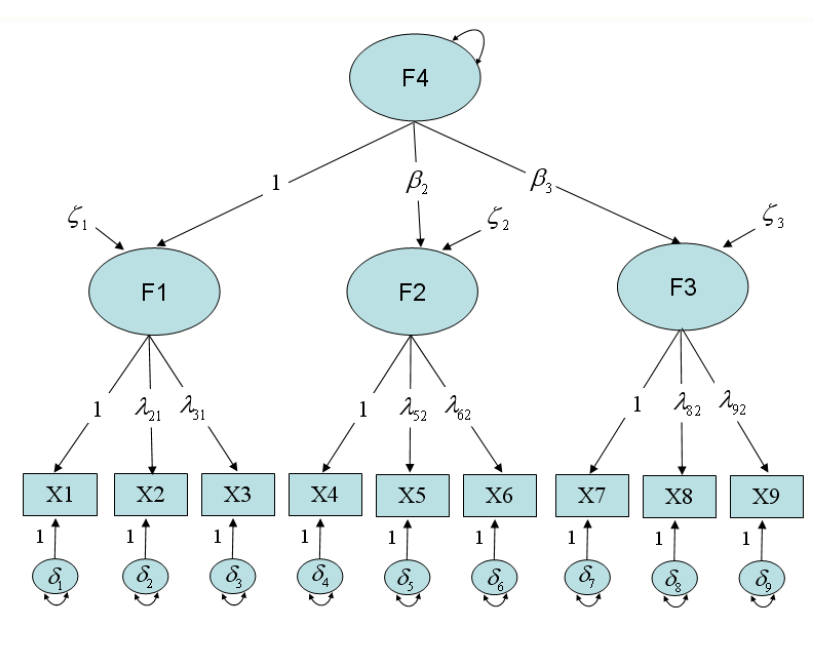

F1, F2 ve F3 faktörleri arasındaki kovaryanslar daha yüksek dereceli bir faktör tarafından açıklanır: F4

Standart bir DFA modelinde faktörler - dışsaldır ve - içsel olan ölçülen değişkenleri etkilerler. Bu nedenle, hem ULI hem de UVI faktörlere ölçek atanmasında uygundur.

-   Daha yüksek dereceli faktör modellerinde, daha yüksek dereceli faktörler dışsaldır ve

    -   içsel olan ölçülen değişkenleri daha düşük faktörler aracılığıyla dolaylı olarak etkilerler.

-   Bu nedenle, hem ULI hem de UVI daha yüksek dereceli faktörlere ölçek atanmasında uygundur.

-   Ancak yüksek dereceli bir faktör modelinde, bütün daha düşük dereceli faktörler artık dışsal değildir (örneğin, F1, F2 ve F3 faktörleri F4 faktöründen etkilenir. Bu nedenle F1, F2 ve F3 faktörleri içseldir).

$F_2= \beta_2*F_4 + \zeta_2$ - Sonuç olarak, her bir daha düşük dereceli faktörün bir artığı vardır (örneğin, F2 faktörü için ζ2)

-   $\zeta_2$’nin varyansı F4 faktörü tarafından açıklanmayan F2 faktörünün varyansının bir parçası olarak açıklanabilir.

-   Bu nedenle daha düşük dereceli faktörlerin varyansları 1’e eşitlenemez, diğer bir ifadeyle UVI uygun olmayacaktır.

-   Bunun yerine her bir daha düşük dereceli faktör için ölçekleme yüklerinden birinin 1’e sabitlenmesiyle tanımlanabilir, diğer bir ifadeyle ULI uygun olacaktır.

Rindskopf ve Rose (1988) daha yüksek dereceli bir modelin değerlendirilmesinin diğer üç modelle karşılaştırılmasını içermesi gerektiğini önermişlerdir. Adımsal modelleme yöntemi önermişlerdir:

-   Adım 1: Genel, tek faktörlü modelin uyumu
-   Adım 2: İkinci dereceli faktör modeliyle karşılaştırma
-   Adım 3: Korelasyonlu grup faktör modeliyle karşılaştırma
-   Adım 4: İkili faktörlü (bi-factor) modelle karşılaştırma

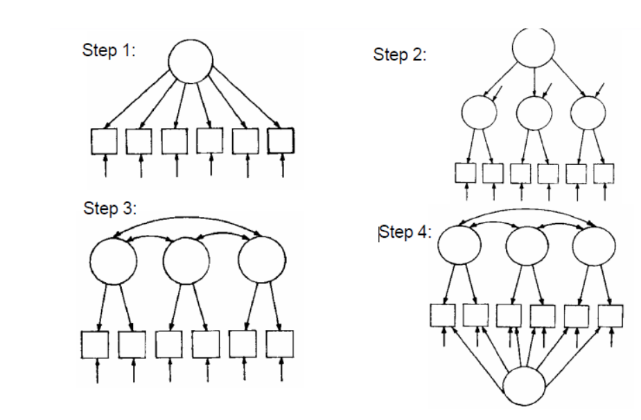

-- Şemalar Rindskopf ve Rose (1988)’dan alınmıştır.


```r
model_2order <-  "
okul =~ okul1 + okul2 + okul3
kisi =~ kisi1 + kisi2
arkadas =~ arkadas1 + arkadas2
aile =~ aile1 + aile2 + aile3

# ikinci düzey model
doyum =~ okul + kisi + arkadas + aile
"
```


```r
fit_model_2order <- cfa(model_2order, yasamdoyum)
summary(fit_model_2order, fit.measures = TRUE, standardized = TRUE)
```

```
## lavaan 0.6.17 ended normally after 67 iterations
## 
##   Estimator                                         ML
##   Optimization method                           NLMINB
##   Number of model parameters                        24
## 
##   Number of observations                           255
## 
## Model Test User Model:
##                                                       
##   Test statistic                                53.372
##   Degrees of freedom                                31
##   P-value (Chi-square)                           0.008
## 
## Model Test Baseline Model:
## 
##   Test statistic                               583.039
##   Degrees of freedom                                45
##   P-value                                        0.000
## 
## User Model versus Baseline Model:
## 
##   Comparative Fit Index (CFI)                    0.958
##   Tucker-Lewis Index (TLI)                       0.940
## 
## Loglikelihood and Information Criteria:
## 
##   Loglikelihood user model (H0)              -3428.730
##   Loglikelihood unrestricted model (H1)      -3402.044
##                                                       
##   Akaike (AIC)                                6905.459
##   Bayesian (BIC)                              6990.450
##   Sample-size adjusted Bayesian (SABIC)       6914.364
## 
## Root Mean Square Error of Approximation:
## 
##   RMSEA                                          0.053
##   90 Percent confidence interval - lower         0.027
##   90 Percent confidence interval - upper         0.077
##   P-value H_0: RMSEA <= 0.050                    0.387
##   P-value H_0: RMSEA >= 0.080                    0.030
## 
## Standardized Root Mean Square Residual:
## 
##   SRMR                                           0.060
## 
## Parameter Estimates:
## 
##   Standard errors                             Standard
##   Information                                 Expected
##   Information saturated (h1) model          Structured
## 
## Latent Variables:
##                    Estimate  Std.Err  z-value  P(>|z|)   Std.lv  Std.all
##   okul =~                                                               
##     okul1             1.000                               0.555    0.407
##     okul2             1.439    0.261    5.508    0.000    0.799    0.622
##     okul3             2.118    0.449    4.713    0.000    1.175    0.883
##   kisi =~                                                               
##     kisi1             1.000                               0.736    0.675
##     kisi2             0.924    0.153    6.040    0.000    0.680    0.777
##   arkadas =~                                                            
##     arkadas1          1.000                               0.662    0.792
##     arkadas2          0.612    0.117    5.229    0.000    0.405    0.530
##   aile =~                                                               
##     aile1             1.000                               0.780    0.741
##     aile2             1.068    0.131    8.136    0.000    0.833    0.849
##     aile3             0.595    0.084    7.106    0.000    0.465    0.507
##   doyum =~                                                              
##     okul              1.000                               0.322    0.322
##     kisi              2.720    0.985    2.763    0.006    0.661    0.661
##     arkadas           3.397    1.250    2.717    0.007    0.917    0.917
##     aile              1.686    0.661    2.550    0.011    0.386    0.386
## 
## Variances:
##                    Estimate  Std.Err  z-value  P(>|z|)   Std.lv  Std.all
##    .okul1             1.547    0.148   10.481    0.000    1.547    0.834
##    .okul2             1.011    0.139    7.278    0.000    1.011    0.613
##    .okul3             0.390    0.231    1.689    0.091    0.390    0.220
##    .kisi1             0.647    0.100    6.442    0.000    0.647    0.544
##    .kisi2             0.303    0.075    4.020    0.000    0.303    0.396
##    .arkadas1          0.261    0.080    3.277    0.001    0.261    0.373
##    .arkadas2          0.420    0.047    8.958    0.000    0.420    0.719
##    .aile1             0.501    0.079    6.317    0.000    0.501    0.452
##    .aile2             0.268    0.078    3.429    0.001    0.268    0.279
##    .aile3             0.625    0.061   10.256    0.000    0.625    0.743
##    .okul              0.276    0.095    2.915    0.004    0.896    0.896
##    .kisi              0.305    0.091    3.369    0.001    0.563    0.563
##    .arkadas           0.070    0.106    0.661    0.509    0.159    0.159
##    .aile              0.518    0.097    5.360    0.000    0.851    0.851
##     doyum             0.032    0.021    1.536    0.125    1.000    1.000
```


```r
# sem_fitmeasures(fit_model_2order)
```


```r
sem_factorloadings(fit_model_2order,standardized = TRUE)
```

```{=html}
<div id="bnglzvydbl" style="padding-left:0px;padding-right:0px;padding-top:10px;padding-bottom:10px;overflow-x:auto;overflow-y:auto;width:auto;height:auto;">
<style>#bnglzvydbl table {
  font-family: system-ui, 'Segoe UI', Roboto, Helvetica, Arial, sans-serif, 'Apple Color Emoji', 'Segoe UI Emoji', 'Segoe UI Symbol', 'Noto Color Emoji';
  -webkit-font-smoothing: antialiased;
  -moz-osx-font-smoothing: grayscale;
}

#bnglzvydbl thead, #bnglzvydbl tbody, #bnglzvydbl tfoot, #bnglzvydbl tr, #bnglzvydbl td, #bnglzvydbl th {
  border-style: none;
}

#bnglzvydbl p {
  margin: 0;
  padding: 0;
}

#bnglzvydbl .gt_table {
  display: table;
  border-collapse: collapse;
  line-height: normal;
  margin-left: 0;
  margin-right: auto;
  color: #333333;
  font-size: 16px;
  font-weight: normal;
  font-style: normal;
  background-color: #FFFFFF;
  width: auto;
  border-top-style: solid;
  border-top-width: 0px;
  border-top-color: #A8A8A8;
  border-right-style: none;
  border-right-width: 2px;
  border-right-color: #D3D3D3;
  border-bottom-style: solid;
  border-bottom-width: 0px;
  border-bottom-color: #A8A8A8;
  border-left-style: none;
  border-left-width: 2px;
  border-left-color: #D3D3D3;
}

#bnglzvydbl .gt_caption {
  padding-top: 4px;
  padding-bottom: 4px;
}

#bnglzvydbl .gt_title {
  color: #333333;
  font-size: 18px;
  font-weight: bolder;
  padding-top: 10px;
  padding-bottom: 10px;
  padding-left: 15px;
  padding-right: 15px;
  border-bottom-color: #FFFFFF;
  border-bottom-width: 0;
}

#bnglzvydbl .gt_subtitle {
  color: #333333;
  font-size: 85%;
  font-weight: initial;
  padding-top: 9px;
  padding-bottom: 11px;
  padding-left: 15px;
  padding-right: 15px;
  border-top-color: #FFFFFF;
  border-top-width: 0;
}

#bnglzvydbl .gt_heading {
  background-color: #FFFFFF;
  text-align: left;
  border-bottom-color: #FFFFFF;
  border-left-style: none;
  border-left-width: 1px;
  border-left-color: #D3D3D3;
  border-right-style: none;
  border-right-width: 1px;
  border-right-color: #D3D3D3;
}

#bnglzvydbl .gt_bottom_border {
  border-bottom-style: solid;
  border-bottom-width: 0px;
  border-bottom-color: #D3D3D3;
}

#bnglzvydbl .gt_col_headings {
  border-top-style: solid;
  border-top-width: 0px;
  border-top-color: #D3D3D3;
  border-bottom-style: solid;
  border-bottom-width: 2px;
  border-bottom-color: #D3D3D3;
  border-left-style: none;
  border-left-width: 1px;
  border-left-color: #D3D3D3;
  border-right-style: none;
  border-right-width: 1px;
  border-right-color: #D3D3D3;
}

#bnglzvydbl .gt_col_heading {
  color: #333333;
  background-color: #FFFFFF;
  font-size: 100%;
  font-weight: bold;
  text-transform: inherit;
  border-left-style: none;
  border-left-width: 1px;
  border-left-color: #D3D3D3;
  border-right-style: none;
  border-right-width: 1px;
  border-right-color: #D3D3D3;
  vertical-align: bottom;
  padding-top: 6px;
  padding-bottom: 7px;
  padding-left: 15px;
  padding-right: 15px;
  overflow-x: hidden;
}

#bnglzvydbl .gt_column_spanner_outer {
  color: #333333;
  background-color: #FFFFFF;
  font-size: 100%;
  font-weight: bold;
  text-transform: inherit;
  padding-top: 0;
  padding-bottom: 0;
  padding-left: 4px;
  padding-right: 4px;
}

#bnglzvydbl .gt_column_spanner_outer:first-child {
  padding-left: 0;
}

#bnglzvydbl .gt_column_spanner_outer:last-child {
  padding-right: 0;
}

#bnglzvydbl .gt_column_spanner {
  border-bottom-style: solid;
  border-bottom-width: 2px;
  border-bottom-color: #D3D3D3;
  vertical-align: bottom;
  padding-top: 6px;
  padding-bottom: 6px;
  overflow-x: hidden;
  display: inline-block;
  width: 100%;
}

#bnglzvydbl .gt_spanner_row {
  border-bottom-style: hidden;
}

#bnglzvydbl .gt_group_heading {
  padding-top: 8px;
  padding-bottom: 8px;
  padding-left: 15px;
  padding-right: 15px;
  color: #333333;
  background-color: #FFFFFF;
  font-size: 100%;
  font-weight: initial;
  text-transform: inherit;
  border-top-style: solid;
  border-top-width: 2px;
  border-top-color: #D3D3D3;
  border-bottom-style: solid;
  border-bottom-width: 2px;
  border-bottom-color: #D3D3D3;
  border-left-style: none;
  border-left-width: 1px;
  border-left-color: #D3D3D3;
  border-right-style: none;
  border-right-width: 1px;
  border-right-color: #D3D3D3;
  vertical-align: middle;
  text-align: left;
}

#bnglzvydbl .gt_empty_group_heading {
  padding: 0.5px;
  color: #333333;
  background-color: #FFFFFF;
  font-size: 100%;
  font-weight: initial;
  border-top-style: solid;
  border-top-width: 2px;
  border-top-color: #D3D3D3;
  border-bottom-style: solid;
  border-bottom-width: 2px;
  border-bottom-color: #D3D3D3;
  vertical-align: middle;
}

#bnglzvydbl .gt_from_md > :first-child {
  margin-top: 0;
}

#bnglzvydbl .gt_from_md > :last-child {
  margin-bottom: 0;
}

#bnglzvydbl .gt_row {
  padding-top: 8px;
  padding-bottom: 8px;
  padding-left: 15px;
  padding-right: 15px;
  margin: 10px;
  border-top-style: solid;
  border-top-width: 1px;
  border-top-color: #D3D3D3;
  border-left-style: none;
  border-left-width: 1px;
  border-left-color: #D3D3D3;
  border-right-style: none;
  border-right-width: 1px;
  border-right-color: #D3D3D3;
  vertical-align: middle;
  overflow-x: hidden;
}

#bnglzvydbl .gt_stub {
  color: #333333;
  background-color: #FFFFFF;
  font-size: 100%;
  font-weight: initial;
  text-transform: inherit;
  border-right-style: solid;
  border-right-width: 2px;
  border-right-color: #D3D3D3;
  padding-left: 15px;
  padding-right: 15px;
}

#bnglzvydbl .gt_stub_row_group {
  color: #333333;
  background-color: #FFFFFF;
  font-size: 100%;
  font-weight: initial;
  text-transform: inherit;
  border-right-style: solid;
  border-right-width: 2px;
  border-right-color: #D3D3D3;
  padding-left: 15px;
  padding-right: 15px;
  vertical-align: top;
}

#bnglzvydbl .gt_row_group_first td {
  border-top-width: 2px;
}

#bnglzvydbl .gt_row_group_first th {
  border-top-width: 2px;
}

#bnglzvydbl .gt_summary_row {
  color: #333333;
  background-color: #FFFFFF;
  text-transform: inherit;
  padding-top: 8px;
  padding-bottom: 8px;
  padding-left: 15px;
  padding-right: 15px;
}

#bnglzvydbl .gt_first_summary_row {
  border-top-style: solid;
  border-top-color: #D3D3D3;
}

#bnglzvydbl .gt_first_summary_row.thick {
  border-top-width: 2px;
}

#bnglzvydbl .gt_last_summary_row {
  padding-top: 8px;
  padding-bottom: 8px;
  padding-left: 15px;
  padding-right: 15px;
  border-bottom-style: solid;
  border-bottom-width: 2px;
  border-bottom-color: #D3D3D3;
}

#bnglzvydbl .gt_grand_summary_row {
  color: #333333;
  background-color: #FFFFFF;
  text-transform: inherit;
  padding-top: 8px;
  padding-bottom: 8px;
  padding-left: 15px;
  padding-right: 15px;
}

#bnglzvydbl .gt_first_grand_summary_row {
  padding-top: 8px;
  padding-bottom: 8px;
  padding-left: 15px;
  padding-right: 15px;
  border-top-style: double;
  border-top-width: 6px;
  border-top-color: #D3D3D3;
}

#bnglzvydbl .gt_last_grand_summary_row_top {
  padding-top: 8px;
  padding-bottom: 8px;
  padding-left: 15px;
  padding-right: 15px;
  border-bottom-style: double;
  border-bottom-width: 6px;
  border-bottom-color: #D3D3D3;
}

#bnglzvydbl .gt_striped {
  background-color: rgba(128, 128, 128, 0.05);
}

#bnglzvydbl .gt_table_body {
  border-top-style: solid;
  border-top-width: 2px;
  border-top-color: #D3D3D3;
  border-bottom-style: solid;
  border-bottom-width: 2px;
  border-bottom-color: #D3D3D3;
}

#bnglzvydbl .gt_footnotes {
  color: #333333;
  background-color: #FFFFFF;
  border-bottom-style: none;
  border-bottom-width: 2px;
  border-bottom-color: #D3D3D3;
  border-left-style: none;
  border-left-width: 2px;
  border-left-color: #D3D3D3;
  border-right-style: none;
  border-right-width: 2px;
  border-right-color: #D3D3D3;
}

#bnglzvydbl .gt_footnote {
  margin: 0px;
  font-size: 14px;
  padding-top: 4px;
  padding-bottom: 4px;
  padding-left: 15px;
  padding-right: 15px;
}

#bnglzvydbl .gt_sourcenotes {
  color: #333333;
  background-color: #FFFFFF;
  border-bottom-style: none;
  border-bottom-width: 2px;
  border-bottom-color: #D3D3D3;
  border-left-style: none;
  border-left-width: 2px;
  border-left-color: #D3D3D3;
  border-right-style: none;
  border-right-width: 2px;
  border-right-color: #D3D3D3;
}

#bnglzvydbl .gt_sourcenote {
  font-size: 90%;
  padding-top: 4px;
  padding-bottom: 4px;
  padding-left: 15px;
  padding-right: 15px;
}

#bnglzvydbl .gt_left {
  text-align: left;
}

#bnglzvydbl .gt_center {
  text-align: center;
}

#bnglzvydbl .gt_right {
  text-align: right;
  font-variant-numeric: tabular-nums;
}

#bnglzvydbl .gt_font_normal {
  font-weight: normal;
}

#bnglzvydbl .gt_font_bold {
  font-weight: bold;
}

#bnglzvydbl .gt_font_italic {
  font-style: italic;
}

#bnglzvydbl .gt_super {
  font-size: 65%;
}

#bnglzvydbl .gt_footnote_marks {
  font-size: 75%;
  vertical-align: 0.4em;
  position: initial;
}

#bnglzvydbl .gt_asterisk {
  font-size: 100%;
  vertical-align: 0;
}

#bnglzvydbl .gt_indent_1 {
  text-indent: 5px;
}

#bnglzvydbl .gt_indent_2 {
  text-indent: 10px;
}

#bnglzvydbl .gt_indent_3 {
  text-indent: 15px;
}

#bnglzvydbl .gt_indent_4 {
  text-indent: 20px;
}

#bnglzvydbl .gt_indent_5 {
  text-indent: 25px;
}
</style>
<table class="gt_table" data-quarto-disable-processing="true" data-quarto-bootstrap="false">
  <thead>
    <tr class="gt_heading">
      <td colspan="8" class="gt_heading gt_title gt_font_normal gt_bottom_border" style>Factor Loadings</td>
    </tr>
    
    <tr class="gt_col_headings gt_spanner_row">
      <th class="gt_col_heading gt_columns_bottom_border gt_left" rowspan="2" colspan="1" style="text-align: center;" scope="col" id="Latent Factor">Latent Factor</th>
      <th class="gt_col_heading gt_columns_bottom_border gt_left" rowspan="2" colspan="1" style="text-align: center;" scope="col" id="Indicator">Indicator</th>
      <th class="gt_center gt_columns_top_border gt_column_spanner_outer" rowspan="1" colspan="6" scope="colgroup" id="Standardized">
        <span class="gt_column_spanner">Standardized</span>
      </th>
    </tr>
    <tr class="gt_col_headings">
      <th class="gt_col_heading gt_columns_bottom_border gt_right" rowspan="1" colspan="1" style="text-align: center;" scope="col" id="Loading">Loading</th>
      <th class="gt_col_heading gt_columns_bottom_border gt_right" rowspan="1" colspan="1" style="text-align: center;" scope="col" id="95% CI">95% CI</th>
      <th class="gt_col_heading gt_columns_bottom_border gt_right" rowspan="1" colspan="1" style="text-align: center;" scope="col" id="sig">sig</th>
      <th class="gt_col_heading gt_columns_bottom_border gt_right" rowspan="1" colspan="1" style="text-align: center;" scope="col" id="SE">SE</th>
      <th class="gt_col_heading gt_columns_bottom_border gt_right" rowspan="1" colspan="1" style="text-align: center;" scope="col" id="z">z</th>
      <th class="gt_col_heading gt_columns_bottom_border gt_right" rowspan="1" colspan="1" style="text-align: center;" scope="col" id="p">p</th>
    </tr>
  </thead>
  <tbody class="gt_table_body">
    <tr><td headers="lhs" class="gt_row gt_left">aile</td>
<td headers="rhs" class="gt_row gt_left">aile1</td>
<td headers="est.std" class="gt_row gt_right">0.741</td>
<td headers="ci.lower_std" class="gt_row gt_right">0.645&nbsp;&mdash;&nbsp;0.837</td>
<td headers="stars" class="gt_row gt_right">***</td>
<td headers="se" class="gt_row gt_right">0.049</td>
<td headers="z" class="gt_row gt_right">15.115</td>
<td headers="pvalue" class="gt_row gt_right">    0.000</td></tr>
    <tr><td headers="lhs" class="gt_row gt_left">aile</td>
<td headers="rhs" class="gt_row gt_left">aile2</td>
<td headers="est.std" class="gt_row gt_right">0.849</td>
<td headers="ci.lower_std" class="gt_row gt_right">0.754&nbsp;&mdash;&nbsp;0.945</td>
<td headers="stars" class="gt_row gt_right">***</td>
<td headers="se" class="gt_row gt_right">0.049</td>
<td headers="z" class="gt_row gt_right">17.404</td>
<td headers="pvalue" class="gt_row gt_right">    0.000</td></tr>
    <tr><td headers="lhs" class="gt_row gt_left">aile</td>
<td headers="rhs" class="gt_row gt_left">aile3</td>
<td headers="est.std" class="gt_row gt_right">0.507</td>
<td headers="ci.lower_std" class="gt_row gt_right">0.398&nbsp;&mdash;&nbsp;0.615</td>
<td headers="stars" class="gt_row gt_right">***</td>
<td headers="se" class="gt_row gt_right">0.055</td>
<td headers="z" class="gt_row gt_right"> 9.158</td>
<td headers="pvalue" class="gt_row gt_right">    0.000</td></tr>
    <tr><td headers="lhs" class="gt_row gt_left">arkadas</td>
<td headers="rhs" class="gt_row gt_left">arkadas1</td>
<td headers="est.std" class="gt_row gt_right">0.792</td>
<td headers="ci.lower_std" class="gt_row gt_right">0.649&nbsp;&mdash;&nbsp;0.934</td>
<td headers="stars" class="gt_row gt_right">***</td>
<td headers="se" class="gt_row gt_right">0.073</td>
<td headers="z" class="gt_row gt_right">10.900</td>
<td headers="pvalue" class="gt_row gt_right">    0.000</td></tr>
    <tr><td headers="lhs" class="gt_row gt_left">arkadas</td>
<td headers="rhs" class="gt_row gt_left">arkadas2</td>
<td headers="est.std" class="gt_row gt_right">0.530</td>
<td headers="ci.lower_std" class="gt_row gt_right">0.404&nbsp;&mdash;&nbsp;0.656</td>
<td headers="stars" class="gt_row gt_right">***</td>
<td headers="se" class="gt_row gt_right">0.064</td>
<td headers="z" class="gt_row gt_right"> 8.233</td>
<td headers="pvalue" class="gt_row gt_right">&lt;0.001</td></tr>
    <tr><td headers="lhs" class="gt_row gt_left">doyum</td>
<td headers="rhs" class="gt_row gt_left">aile</td>
<td headers="est.std" class="gt_row gt_right">0.386</td>
<td headers="ci.lower_std" class="gt_row gt_right">0.227&nbsp;&mdash;&nbsp;0.546</td>
<td headers="stars" class="gt_row gt_right">***</td>
<td headers="se" class="gt_row gt_right">0.081</td>
<td headers="z" class="gt_row gt_right"> 4.755</td>
<td headers="pvalue" class="gt_row gt_right">&lt;0.001</td></tr>
    <tr><td headers="lhs" class="gt_row gt_left">doyum</td>
<td headers="rhs" class="gt_row gt_left">arkadas</td>
<td headers="est.std" class="gt_row gt_right">0.917</td>
<td headers="ci.lower_std" class="gt_row gt_right">0.674&nbsp;&mdash;&nbsp;1.160</td>
<td headers="stars" class="gt_row gt_right">***</td>
<td headers="se" class="gt_row gt_right">0.124</td>
<td headers="z" class="gt_row gt_right"> 7.406</td>
<td headers="pvalue" class="gt_row gt_right">&lt;0.001</td></tr>
    <tr><td headers="lhs" class="gt_row gt_left">doyum</td>
<td headers="rhs" class="gt_row gt_left">kisi</td>
<td headers="est.std" class="gt_row gt_right">0.661</td>
<td headers="ci.lower_std" class="gt_row gt_right">0.475&nbsp;&mdash;&nbsp;0.847</td>
<td headers="stars" class="gt_row gt_right">***</td>
<td headers="se" class="gt_row gt_right">0.095</td>
<td headers="z" class="gt_row gt_right"> 6.972</td>
<td headers="pvalue" class="gt_row gt_right">&lt;0.001</td></tr>
    <tr><td headers="lhs" class="gt_row gt_left">doyum</td>
<td headers="rhs" class="gt_row gt_left">okul</td>
<td headers="est.std" class="gt_row gt_right">0.322</td>
<td headers="ci.lower_std" class="gt_row gt_right">0.159&nbsp;&mdash;&nbsp;0.486</td>
<td headers="stars" class="gt_row gt_right">***</td>
<td headers="se" class="gt_row gt_right">0.083</td>
<td headers="z" class="gt_row gt_right"> 3.862</td>
<td headers="pvalue" class="gt_row gt_right">&lt;0.001</td></tr>
    <tr><td headers="lhs" class="gt_row gt_left">kisi</td>
<td headers="rhs" class="gt_row gt_left">kisi1</td>
<td headers="est.std" class="gt_row gt_right">0.675</td>
<td headers="ci.lower_std" class="gt_row gt_right">0.554&nbsp;&mdash;&nbsp;0.796</td>
<td headers="stars" class="gt_row gt_right">***</td>
<td headers="se" class="gt_row gt_right">0.062</td>
<td headers="z" class="gt_row gt_right">10.938</td>
<td headers="pvalue" class="gt_row gt_right">    0.000</td></tr>
    <tr><td headers="lhs" class="gt_row gt_left">kisi</td>
<td headers="rhs" class="gt_row gt_left">kisi2</td>
<td headers="est.std" class="gt_row gt_right">0.777</td>
<td headers="ci.lower_std" class="gt_row gt_right">0.651&nbsp;&mdash;&nbsp;0.903</td>
<td headers="stars" class="gt_row gt_right">***</td>
<td headers="se" class="gt_row gt_right">0.064</td>
<td headers="z" class="gt_row gt_right">12.105</td>
<td headers="pvalue" class="gt_row gt_right">    0.000</td></tr>
    <tr><td headers="lhs" class="gt_row gt_left">okul</td>
<td headers="rhs" class="gt_row gt_left">okul1</td>
<td headers="est.std" class="gt_row gt_right">0.407</td>
<td headers="ci.lower_std" class="gt_row gt_right">0.283&nbsp;&mdash;&nbsp;0.532</td>
<td headers="stars" class="gt_row gt_right">***</td>
<td headers="se" class="gt_row gt_right">0.064</td>
<td headers="z" class="gt_row gt_right"> 6.405</td>
<td headers="pvalue" class="gt_row gt_right">&lt;0.001</td></tr>
    <tr><td headers="lhs" class="gt_row gt_left">okul</td>
<td headers="rhs" class="gt_row gt_left">okul2</td>
<td headers="est.std" class="gt_row gt_right">0.622</td>
<td headers="ci.lower_std" class="gt_row gt_right">0.496&nbsp;&mdash;&nbsp;0.748</td>
<td headers="stars" class="gt_row gt_right">***</td>
<td headers="se" class="gt_row gt_right">0.064</td>
<td headers="z" class="gt_row gt_right"> 9.647</td>
<td headers="pvalue" class="gt_row gt_right">    0.000</td></tr>
    <tr><td headers="lhs" class="gt_row gt_left">okul</td>
<td headers="rhs" class="gt_row gt_left">okul3</td>
<td headers="est.std" class="gt_row gt_right">0.883</td>
<td headers="ci.lower_std" class="gt_row gt_right">0.738&nbsp;&mdash;&nbsp;1.029</td>
<td headers="stars" class="gt_row gt_right">***</td>
<td headers="se" class="gt_row gt_right">0.074</td>
<td headers="z" class="gt_row gt_right">11.895</td>
<td headers="pvalue" class="gt_row gt_right">    0.000</td></tr>
  </tbody>
  
  <tfoot class="gt_footnotes">
    <tr>
      <td class="gt_footnote" colspan="8"> * p &lt; .05; ** p &lt; .01; *** p &lt; .001</td>
    </tr>
  </tfoot>
</table>
</div>
```


```r
anova(fit_model_2order, model_2_fit, model_1_fit )
```

<div class="kable-table">

|                 | Df|      AIC|      BIC|    Chisq| Chisq diff|     RMSEA| Df diff| Pr(>Chisq)|
|:----------------|--:|--------:|--------:|--------:|----------:|---------:|-------:|----------:|
|model_1_fit      | 29| 6907.520| 6999.593| 51.43258|         NA|        NA|      NA|         NA|
|fit_model_2order | 31| 6905.459| 6990.450| 53.37207|   1.939491| 0.0000000|       2|  0.3791795|
|model_2_fit      | 32| 6929.609| 7011.058| 79.52151|  26.149441| 0.3140466|       1|  0.0000003|

</div>


```r
semPaths(fit_model_2order, "std", weighted = FALSE, nCharNodes = 7, 
         shapeMan = "rectangle", sizeMan = 8, sizeMan2 = 5)
```


```r
semTools::reliability(fit_model_2order)
```

```
##             okul      kisi   arkadas      aile
## alpha  0.6521208 0.6772692 0.5897284 0.7284332
## omega  0.6844920 0.6783398 0.6260070 0.7559295
## omega2 0.6844920 0.6783398 0.6260070 0.7559295
## omega3 0.6853071 0.6783398 0.6260070 0.7624866
## avevar 0.4411637 0.5136422 0.4696157 0.5213877
```


```r
semTools::reliability(model_2_fit)
```

```
##             okul kisi_arkadas      aile
## alpha  0.6521208    0.6802465 0.7284332
## omega  0.6823834    0.6958670 0.7559432
## omega2 0.6823834    0.6958670 0.7559432
## omega3 0.6872796    0.6984813 0.7633658
## avevar 0.4340664    0.3767532 0.5208713
```

## Kaynaklar

-   Rindskopf, D. & Rose, T. (1988. Some theory and applications of confirmatory second-order factor analysis. Multivariate Behavioral Research, 23(1), 51-67

-   Bentler, P. M. & Hu, L. (1999). Cutoff criteria fpr fit indexes in covariance structure analysis: Conventional criteri versus new alternatives. Structural Equation Modeling, 6(1), 1-55.

-   Bentler, P. M. (1990). Comparative fit indexes in structural models. Psychological Bulletin, 107, 238-246. - Steiger, J. H. (1990). Structural model evaluation and modification: An interval estimation approach. Multivariate Behavioral Research, 25, 173-80.
