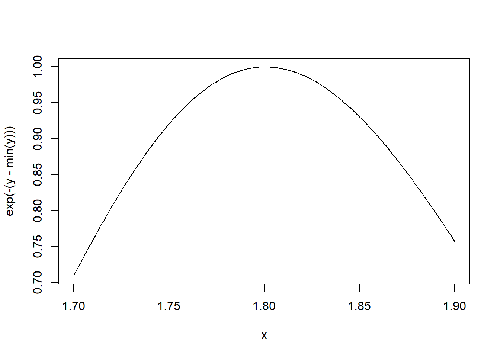
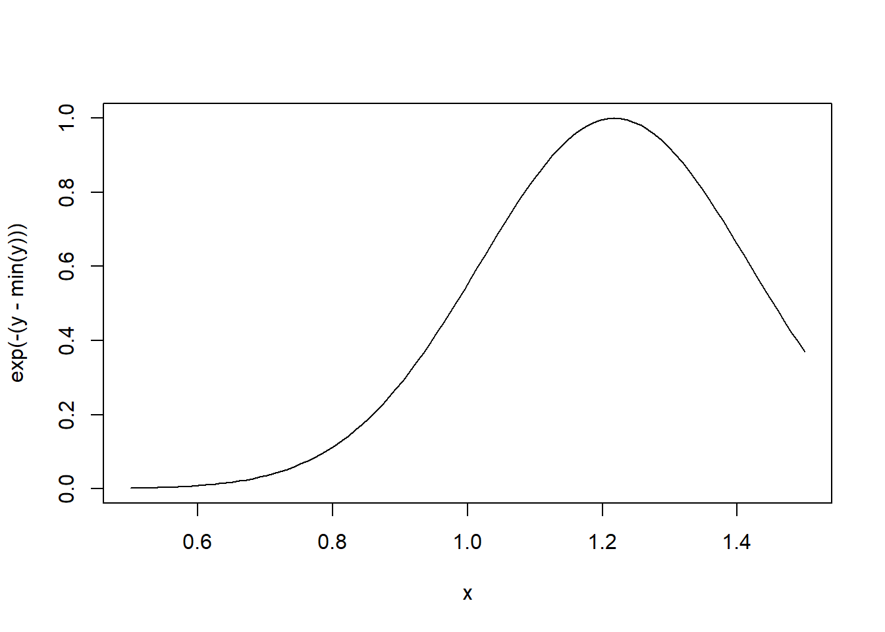

# R'nin Kapsam Belirleme Kuralları


## Değerleri Sembollere Bağlama Üzerine Bir Saptırma


R hangi sembole hangi değeri atayacağını nasıl biliyor? Kodladığm zaman


```r
> lm <- function(x) { x * x }
> lm
function(x) { x * x }
```


R, `lm` sembolüne hangi değeri atayacağını nasıl biliyor? Neden `stats` paketinde bulunan `lm` değerini vermiyor?

R bir sembolü bir değere bağlamaya çalıştığında, uygun değeri bulmak için bir dizi `environments`da arama yapar. Komut satırında çalışırken ve bir R nesnesinin değerini almanız gerektiğinde, işlerin gerçekleşme sırası kabaca şöyledir

1. global environment (yani çalışma alanınızda) istenen sembolle eşleşen bir sembol adı arayın.
2. Arama listesindeki paketlerin her birinin ad alanlarını arayın

Arama listesi `search()` fonksiyonu kullanılarak bulunabilir.


```r
> search()
 [1] ".GlobalEnv"           "package:glossary"     "package:lubridate"   
 [4] "package:forcats"      "package:stringr"      "package:dplyr"       
 [7] "package:purrr"        "package:readr"        "package:tidyr"       
[10] "package:tibble"       "package:ggplot2"      "package:tidyverse"   
[13] "package:webexercises" "package:stats"        "package:graphics"    
[16] "package:grDevices"    "package:utils"        "package:datasets"    
[19] "package:methods"      "Autoloads"            "package:base"        
```

 global environment veya kullanıcının çalışma alanı her zaman arama listesinin ilk öğesidir ve `base` paketi her zaman sonuncudur. İyi ya da kötü, arama listesindeki paketlerin sırası önemlidir, özellikle de farklı paketlerde aynı ada sahip birden fazla nesne varsa. 

Kullanıcılar başlangıçta hangi paketlerin yükleneceğini yapılandırabilir, bu nedenle bir fonksiyon (veya bir paket) yazıyorsanız, belirli bir sırada mevcut olan paketlerin belirli bir listesinin olacağını varsayamazsınız. Bir kullanıcı `library()` ile bir paket yüklediğinde, bu paketin ad alanı arama listesinin 2. konumuna yerleştirilir (varsayılan olarak) ve diğer her şey listede aşağı kaydırılır.

R'nin fonksiyonlar ve fonksiyon olmayanlar için ayrı isim alanlarına sahip olduğunu unutmayın, bu nedenle `c` adında bir nesneye ve `c()` adında bir fonksiyona sahip olmak mümkündür.


## Kapsam Belirleme Kuralları

The scoping rules for R are the main feature that make it different from the original S language (in case you care about that). This may seem like an esoteric aspect of R, but it's one of its more interesting and useful features.

Bir dilin kapsam kuralları, bir değerin bir fonksiyondaki *serbest değişken* ile nasıl ilişkilendirileceğini belirler.  R  [_lexical scoping_](http://en.wikipedia.org/wiki/Scope_(computer_science)#Lexical_scope_vs._dynamic_scope) or _static scoping_ kullanır. Sözcüksel kapsamlamaya bir alternatif de bazı diller tarafından uygulanan _dinamik kapsamlamadır_. Sözcüksel kapsamlama, istatistiksel hesaplamaları basitleştirmek için özellikle yararlı olmaktadır

Kapsam belirleme kurallarıyla ilgili olarak, R'nin bir değeri bir sembole bağlamak için *arama listesini* nasıl kullandığıdır

Aşağıdaki fonksiyonu göz önünde bulundurun.


```r
> f <- function(x, y) {
+         x^2 + y / z
+ }
```

Bu fonksiyonun `x` ve `y` olmak üzere 2 resmi argümanı vardır. Fonksiyonun gövdesinde bir başka sembol `z` vardır. Bu durumda `z` bir _serbest değişken_ olarak adlandırılır.

Bir dilin kapsam kuralları, değerlerin serbest değişkenlere nasıl atanacağını belirler. Serbest değişkenler resmi argümanlar değildir ve yerel değişkenler değildir (fonksiyon gövdesi içinde atanır).

R'de sözcüksel/lexical kapsamlama şu anlama gelir

> _serbest değişkenlerin değerleri fonksiyonun tanımlandığı ortamda aranır_.

Peki o zaman, ortam nedir?

Bir _environment_ (sembol, değer) çiftlerinin bir koleksiyonudur, yani `x` bir semboldür ve `3.14` onun değeri olabilir. Her ortamın bir üst ortamı vardır ve bir ortamın birden fazla "çocuğu" olması mümkündür. Ebeveyni olmayan tek ortam *boş ortamdır*.

Bir fonksiyon, bir ortamla birlikte _closure_ veya _function closure_ olarak adlandırılan şeyi oluşturur. Çoğu zaman bir fonksiyon ve onunla ilişkili ortam (kapanışı oluşturan) hakkında çok fazla düşünmemiz gerekmez, ancak bazen bu kurulum çok yararlı olabilir. Fonksiyon kapatma modeli, kendileriyle birlikte veri "taşıyan" fonksiyonlar oluşturmak için kullanılabilir.

Bir değeri serbest bir değişkenle nasıl ilişkilendiririz? Aşağıdaki gibi gerçekleşen bir arama süreci vardır:

- Eğer bir sembolün değeri fonksiyonun tanımlandığı ortamda bulunamazsa, arama _parent environment_'da devam eder.
- Arama, _üst düzey ortama_ ulaşana kadar üst düzey ortamlar dizisinde devam eder; bu genellikle global environment (çalışma alanı) veya bir paketin ad alanıdır.
- En üst düzey ortamdan sonra arama, _boş ortam_'a ulaşana kadar arama listesinde aşağı doğru devam eder.


Boş ortama ulaşıldığında belirli bir sembol için bir değer bulunamazsa, bir hata atılır.

Bu arama işleminin bir sonucu, arama listesine eklediğiniz paket sayısından etkilenebilmesidir. Ne kadar çok paket eklerseniz, R'nin bir değer atamak için o kadar çok sembolü sıralaması gerekir. Bununla birlikte, performansta gerçek bir fark görebilmek için oldukça fazla sayıda paket eklemiş olmanız gerekir.

## Sözcüksel Kapsam Belirleme: Neden Önemlidir?


Tipik olarak, bir fonksiyon global ortamda tanımlanır, böylece serbest değişkenlerin değerleri sadece kullanıcının çalışma alanında bulunur. Bu davranış çoğu insan için mantıklıdır ve genellikle yapılması gereken "doğru şeydir". Ancak, R'de _diğer fonksiyonların içinde_ tanımlanmış fonksiyonlara sahip olabilirsiniz (C gibi diller bunu yapmanıza izin vermez). Şimdi işler ilginçleşiyor---bu durumda bir fonksiyonun tanımlandığı ortam başka bir fonksiyonun gövdesidir!

İşte dönüş değeri olarak başka bir fonksiyon döndüren bir fonksiyon örneği. Unutmayın, R'de fonksiyonlar diğer nesneler gibi ele alınır ve dolayısıyla bu tamamen geçerlidir.


```r
> make.power <- function(n) {
+         pow <- function(x) {
+                 x^n 
+         }
+         pow 
+ }
```

 `make.power()` fonksiyonu, diğer fonksiyonları oluşturmak için kullanılabilen bir tür "kurucu fonksiyon "dur.


```r
> cube <- make.power(3)
> square <- make.power(2)
> cube(3)
> square(3)
[1] 27
[1] 9
```

Şimdi `cube()` işlevinin koduna bir göz atalım.


```r
> cube
function(x) {
                x^n 
        }
<environment: 0x000001ef321e2fc0>
```

cube()`un `n` serbest değişkenine sahip olduğuna dikkat edin. Burada `n` nin değeri nedir? Değeri, fonksiyonun tanımlandığı ortamdan alınır. Ben `cube()` fonksiyonunu tanımladığımda `make.power(3)` çağrısını yapmıştım, dolayısıyla `n`nin o zamanki değeri 3 idi.

Orada hangi nesnelerin olduğunu ve değerlerini görmek için bir fonksiyonun ortamını keşfedebiliriz.


```r
> ls(environment(cube))
> get("n", environment(cube))
[1] "n"   "pow"
[1] 3
```

Ayrıca `square()` fonksiyonuna da bir göz atabiliriz.


```r
> ls(environment(square))
> get("n", environment(square))
[1] "n"   "pow"
[1] 2
```


## Sözcüksel ve Dinamik Kapsam Belirleme

Sözcüksel ve dinamik kapsam belirleme kuralları arasındaki farkı göstermek için aşağıdaki örneği kullanabiliriz.


```r
> y <- 10
> 
> f <- function(x) {
+         y <- 2
+         y^2 + g(x)
+ }
> 
> g <- function(x) { 
+         x*y
+ }
```

Aşağıdaki ifadenin değeri nedir?

```r
f(3)
```


Lexical scoping ile `g` fonksiyonundaki `y` değeri, fonksiyonun tanımlandığı ortamda, bu durumda global ortamda aranır, bu nedenle `y` değeri 10'dur. Dinamik scoping ile, `y` değeri fonksiyonun _call_ edildiği ortamda aranır (bazen _calling environment_ olarak da adlandırılır). R'de çağıran ortam _parent frame_ olarak bilinir. Bu durumda, `y` değeri 2 olacaktır.

Bir fonksiyon global ortamda _tanımlandığında_ ve daha sonra global ortamdan _çağrıldığında_, tanımlayan ortam ve çağıran ortam aynıdır. Bu bazen dinamik kapsam belirleme görüntüsü verebilir.

Bu örneği düşünün.


```r
> g <- function(x) { 
+         a <- 3
+         x+a+y   
+         ## 'y' serbest bir değişkendir
+ }
> g(2)
Error in g(2): object 'y' not found
> y <- 3
> g(2)
[1] 8
```

Burada, `y` global ortamda tanımlanmıştır ve bu aynı zamanda `g()` fonksiyonunun tanımlandığı yerdir.

Sözcüksel kapsamlamayı destekleyen çok sayıda başka dil vardır, örneğin

- Scheme
- Perl
- Python
- Common Lisp (all languages converge to Lisp, right?)

R'de sözcüksel kapsam belirleme, serbest değişkenlerin nasıl arandığının ötesinde sonuçlara sahiptir. Özellikle, R'de tüm nesnelerin bellekte saklanması gerekmesinin nedeni budur. Bunun nedeni, tüm işlevlerin *her yerde* olabilen ilgili tanımlama ortamlarına bir işaretçi taşıması gerektiğidir.
S dilinde (R'nin yakın kuzeni), serbest değişkenler her zaman global çalışma alanında aranır, böylece her şey diskte saklanabilir çünkü tüm fonksiyonların "tanımlama ortamı" aynıdır

Translated with www.DeepL.com/Translator (free version)

## Uygulama: Optimizasyon


**NOT**: Bu bölüm biraz istatistiksel çıkarım ve modelleme bilgisi gerektirmektedir. Böyle bir bilginiz yoksa, bu bölümü atlamaktan çekinmeyin.

Sözcüksel kapsam belirleme hakkındaki bu bilgiler neden yararlıdır?

R'deki `optim()`, `nlm()` ve `optimize()` gibi optimizasyon rutinleri, argümanı bir parametre vektörü (örneğin bir log-likelihood veya bir maliyet fonksiyonu) olan bir fonksiyon geçirmenizi gerektirir. Ancak, minimize edilmesi gereken bir amaç fonksiyonu, parametrelerinin yanı sıra (veriler gibi) bir dizi başka şeye de bağlı olabilir. Optimizasyon yapan bir yazılım yazarken, kullanıcının belirli parametreleri sabit tutmasına izin vermek de istenebilir. R'nin kapsam belirleme kuralları, bu tür problemlerdeki karmaşıklığın çoğunu soyutlamanıza olanak tanır.

Burada, istatistiksel bir modelde maksimum olabilirlik tahminlerini bulmak için minimize edilebilecek bir negatif log-olabilirlik fonksiyonu oluşturan bir "kurucu" fonksiyon örneği verilmiştir.


```r
> make.NegLogLik <- function(data, fixed = c(FALSE, FALSE)) {
+         params <- fixed
+         function(p) {
+                 params[!fixed] <- p
+                 mu <- params[1]
+                 sigma <- params[2]
+                 
+                 ## Normal yoğunluğu hesaplama
+                 a <- -0.5*length(data)*log(2*pi*sigma^2)
+                 b <- -0.5*sum((data-mu)^2) / (sigma^2)
+                 -(a + b)
+         } 
+ }
```

**Not**: R'deki optimizasyon fonksiyonları fonksiyonları _minimize_ eder, bu nedenle negatif log-likelihood kullanmanız gerekir.

Şimdi bazı veriler oluşturabilir ve ardından negatif log-olabilirliğimizi oluşturabiliriz.


```r
> set.seed(1)
> normals <- rnorm(100, 1, 2)
> nLL <- make.NegLogLik(normals)
> nLL
> 
> ## İşlev ortamında ne var?
> ls(environment(nLL))   
function(p) {
                params[!fixed] <- p
                mu <- params[1]
                sigma <- params[2]
                
                ## Normal yoğunluğu hesaplama
                a <- -0.5*length(data)*log(2*pi*sigma^2)
                b <- -0.5*sum((data-mu)^2) / (sigma^2)
                -(a + b)
        }
<bytecode: 0x000001ef314c65b0>
<environment: 0x000001ef3222aa18>
[1] "data"   "fixed"  "params"
```

Artık `nLL()` fonksiyonumuz olduğuna göre parametreleri tahmin etmek için `optim()` ile minimize etmeye çalışabiliriz.


```r
> optim(c(mu = 0, sigma = 1), nLL)$par
      mu    sigma 
1.218239 1.787343 
```

Algoritmanın yakınsadığını ve bir `mu` ve `sigma` tahmini elde ettiğini görebilirsiniz.

Başka bir parametreyi sabit tutarken bir parametreyi tahmin etmeyi de deneyebiliriz. Burada `sigma` değerini 2'ye eşit olarak sabitliyoruz. 


```r
> nLL <- make.NegLogLik(normals, c(FALSE, 2))
> optimize(nLL, c(-1, 3))$minimum
[1] 1.217775
```

Artık tek boyutlu bir problemimiz olduğu için `optim()` yerine daha basit olan `optimize()` fonksiyonunu kullanabiliriz.

Ayrıca `mu` değerini 1'de sabit tutarken `sigma` değerini tahmin etmeye çalışabiliriz.


```r
> nLL <- make.NegLogLik(normals, c(1, FALSE))
> optimize(nLL, c(1e-6, 10))$minimum
[1] 1.800596
```

## Olasılık Çizimi

Yararlanabileceğiniz bir başka güzel özellik de negatif log-olasılığını çizerek ne kadar tepeli veya düz olduğunu görmektir.

İşte `mu` sabit olduğunda fonksiyon.


```r
> ## 'mu'yu 1'e eşit olacak şekilde sabitleyin
> nLL <- make.NegLogLik(normals, c(1, FALSE))  
> x <- seq(1.7, 1.9, len = 100)
> 
> ## 'x'in her noktasında 'nLL()'yi değerlendirin
> y <- sapply(x, nLL)    
> plot(x, exp(-(y - min(y))), type = "l")
```



İşte `sigma` sabit olduğunda fonksiyon.


```r
> ## Fix 'sigma' to be equal to 2
> nLL <- make.NegLogLik(normals, c(FALSE, 2))
> x <- seq(0.5, 1.5, len = 100)
> 
> ## Evaluate 'nLL()' at every point in 'x'
> y <- sapply(x, nLL)     
> plot(x, exp(-(y - min(y))), type = "l")
```




## Summary

- Amaç fonksiyonları, fonksiyonu değerlendirmek için gerekli tüm verileri içeren "oluşturulabilir"
- Uzun argüman listeleri taşımaya gerek yoktur - etkileşimli ve keşifsel çalışmalar için kullanışlıdır.
- Kod basitleştirilebilir ve temizlenebilir
- Referans: Robert Gentleman ve Ross Ihaka (2000). "Lexical Scope and Statistical Computing," _JCGS_, 9, 491-508.
