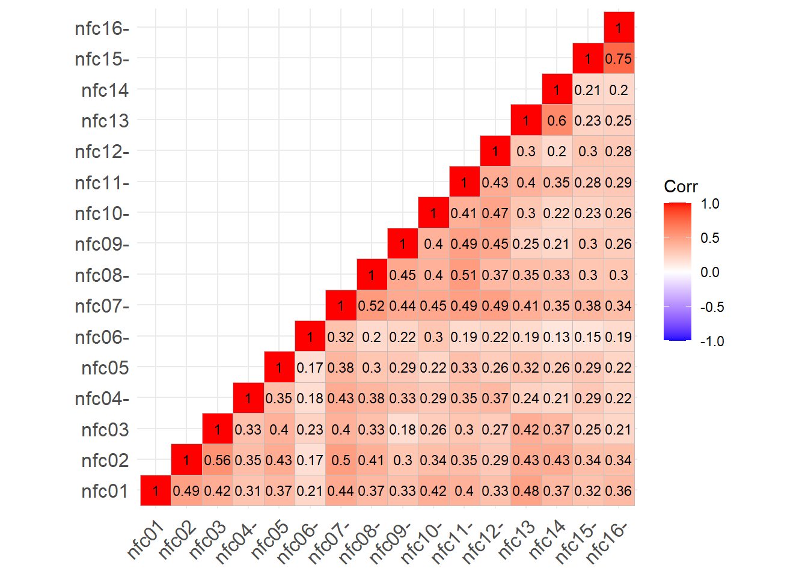

# Klasik Test Teorisi

Düşünme İhtiyacı Ölçeğine (NFC Ölçeğine) ait verileri Klasik Test Teorisine (CTT) dayalı çeşitli psikometrik analizler yapmak ve bu aracın güvenilirlik ve geçerliliğinin nasıl değerlendirileceğini göstermek için kullanacağız. Örnek verilerin yer aldığı çalışma: (Thinking in action: Need for Cognition predicts Self-Control together with Action Orientation, Grass et al. 2019), NFC ile diğer gizli özellikler (örneğin, özkontrol) arasındaki ilişkiye odaklanmıştır.

NFC’nin gizil özelliğini ölçmek için Cacioppo ve Petty geliştirmiştir.

NFC (need for Cognition) bilişsel olarak zorlayıcı görevlere ve çaba gerektiren düşünmeye katılma arzusu olarak tanımlanan psikolojik bir gizli özelliktir.

Yüksek düzeyde NFC’ye sahip bireyler bilgiyi arama, edinme, üzerinde düşünme ve yansıtma eğilimindeyken, düşük düzeyde NFC’ye sahip bireyler dünya hakkında ayrıntılı bilgiden kaçınma ve bilişsel olarak karmaşık görevleri stresli bulma eğilimindedir.


<table class="table table-striped table-hover" style="font-size: 16px; margin-left: auto; margin-right: auto;border-bottom: 0;">
 <thead>
  <tr>
   <th style="text-align:right;"> Items </th>
   <th style="text-align:left;"> Description </th>
  </tr>
 </thead>
<tbody>
  <tr>
   <td style="text-align:right;"> 1 </td>
   <td style="text-align:left;"> Enjoyment of tasks that involve problem-solving </td>
  </tr>
  <tr>
   <td style="text-align:right;"> 2 </td>
   <td style="text-align:left;"> Preference for cognitive, difficult and important tasks </td>
  </tr>
  <tr>
   <td style="text-align:right;"> 3 </td>
   <td style="text-align:left;"> Tendency to strive for goals that require mental effort </td>
  </tr>
  <tr>
   <td style="text-align:right;"> 4 </td>
   <td style="text-align:left;"> Appeal of relying on one’s thought to be successful (R) </td>
  </tr>
  <tr>
   <td style="text-align:right;"> 5 </td>
   <td style="text-align:left;"> Satisfaction of completing important tasks that required thinking and mental effort </td>
  </tr>
  <tr>
   <td style="text-align:right;"> 6 </td>
   <td style="text-align:left;"> Preference for thinking about long-term projects (R) </td>
  </tr>
  <tr>
   <td style="text-align:right;"> 7 </td>
   <td style="text-align:left;"> Preference for cognitive challenges (R) </td>
  </tr>
  <tr>
   <td style="text-align:right;"> 8 </td>
   <td style="text-align:left;"> Satisfaction on hard and long deliberation (R) </td>
  </tr>
  <tr>
   <td style="text-align:right;"> 9 </td>
   <td style="text-align:left;"> Attitude towards thinking as something one does primarily because one has to (R) </td>
  </tr>
  <tr>
   <td style="text-align:right;"> 10 </td>
   <td style="text-align:left;"> Appeal of being responsible for handling situations that require thinking (R) </td>
  </tr>
  <tr>
   <td style="text-align:right;"> 11 </td>
   <td style="text-align:left;"> Attitude towards thinking as something that is fun (R) </td>
  </tr>
  <tr>
   <td style="text-align:right;"> 12 </td>
   <td style="text-align:left;"> Anticipation and avoiding of situations that may require in-depth thinking (R) </td>
  </tr>
  <tr>
   <td style="text-align:right;"> 13 </td>
   <td style="text-align:left;"> Preference for puzzles to be solved </td>
  </tr>
  <tr>
   <td style="text-align:right;"> 14 </td>
   <td style="text-align:left;"> Preference for complex over simple problems </td>
  </tr>
  <tr>
   <td style="text-align:right;"> 15 </td>
   <td style="text-align:left;"> Preference for understanding the reason for an answer over simply knowing the answer without any background (R) </td>
  </tr>
  <tr>
   <td style="text-align:right;"> 16 </td>
   <td style="text-align:left;"> Preference to know how something works over simply knowing that it works (R) </td>
  </tr>
</tbody>
<tfoot><tr><td style="padding: 0; " colspan="100%">
<span style="font-style: italic;">Note: </span> <sup></sup> Items marked with (R) were presented in an inverted form.</td></tr></tfoot>
</table>

Maddelere verilen yanıtlar 1 (hiç katılmıyorum) ile 7 (tamamen katılıyorum) arasında değişen 7 puanlık bir derecelendirme ölçeğine göre kaydedilmiştir.

Ancak, NFC Ölçeğindeki toplam puanları hesaplamak için, madde yanıtları -3 (tamamen katılmıyorum) ile +3 (tamamen katılıyorum) olarak yeniden kodlanmalıdır.

Grass et al. (2019 ) veri dosyalarını ve diğer materyalleri paylaşmıştır.

Aşağıdaki analiz için, NFC Ölçeğine verilen yanıtlar, demografik değişkenler ve Öz Denetim Ölçeği gibi ölçüt ölçümlerinden elde edilen ek puanları içeren orijinal verilerin bir alt kümesini kullanacağız. Bu veri seti 🔗 [import/nfc_data.csv](import/nfc_data.csv) indirilebilir.


## Veri İnceleme

Verileri özetlemek için genellikle hem istatistiksel hem de veri görselleştirme araçlarını kullanırız. Daha ayrıntılı bilgi için 🔗[sayfayı](https://okanbulut.github.io/bigdata/eda.html) inceleyebilirsiniz.


```r
nfc <- read.csv("import/nfc_data.csv", header = TRUE)
head(nfc)
```

<div class="kable-table">

| id| age|sex    |education | nfc01| nfc02| nfc03| nfc04| nfc05| nfc06| nfc07| nfc08| nfc09| nfc10| nfc11| nfc12| nfc13| nfc14| nfc15| nfc16| action_orientation| effortful_control| self_control|
|--:|---:|:------|:---------|-----:|-----:|-----:|-----:|-----:|-----:|-----:|-----:|-----:|-----:|-----:|-----:|-----:|-----:|-----:|-----:|------------------:|-----------------:|------------:|
|  1|  26|Male   |Abitur    |     5|     7|     5|     1|     6|     2|     2|     5|     2|     1|     2|     2|     6|     5|     2|     1|                 10|                11|            5|
|  4|  19|Female |Abitur    |     5|     5|     3|     2|     5|     3|     3|     3|     2|     4|     3|     2|     3|     2|     4|     4|                 11|                32|           16|
|  7|  23|Female |Abitur    |     5|     6|     5|     1|     7|     3|     2|     3|     1|     3|     3|     1|     6|     5|     1|     1|                 13|                10|           -2|
|  8|  24|Female |Abitur    |     5|     5|     4|     2|     5|     5|     2|     2|     2|     2|     4|     3|     2|     3|     1|     1|                  5|                 0|           -4|
| 11|  24|Female |Abitur    |     2|     3|     3|     5|     3|     5|     6|     1|     6|     6|     6|     6|     2|     1|     5|     5|                 18|                10|           11|
| 12|  20|Female |Abitur    |     6|     6|     6|     1|     6|     3|     1|     1|     1|     1|     1|     1|     6|     6|     2|     2|                 20|                24|           11|

</div>

Ayrıca fonksiyonunu ile veri setinin yapısını incelyebilirsiniz.


```r
str(nfc)
```

```
## 'data.frame':	1209 obs. of  23 variables:
##  $ id                : int  1 4 7 8 11 12 15 16 21 23 ...
##  $ age               : int  26 19 23 24 24 20 25 27 21 25 ...
##  $ sex               : chr  "Male" "Female" "Female" "Female" ...
##  $ education         : chr  "Abitur" "Abitur" "Abitur" "Abitur" ...
##  $ nfc01             : int  5 5 5 5 2 6 3 7 7 6 ...
##  $ nfc02             : int  7 5 6 5 3 6 4 4 5 7 ...
##  $ nfc03             : int  5 3 5 4 3 6 4 5 3 7 ...
##  $ nfc04             : int  1 2 1 2 5 1 1 6 1 1 ...
##  $ nfc05             : int  6 5 7 5 3 6 6 6 6 7 ...
##  $ nfc06             : int  2 3 3 5 5 3 5 3 6 2 ...
##  $ nfc07             : int  2 3 2 2 6 1 3 1 1 1 ...
##  $ nfc08             : int  5 3 3 2 1 1 2 2 2 2 ...
##  $ nfc09             : int  2 2 1 2 6 1 3 2 1 1 ...
##  $ nfc10             : int  1 4 3 2 6 1 3 2 2 2 ...
##  $ nfc11             : int  2 3 3 4 6 1 1 1 1 1 ...
##  $ nfc12             : int  2 2 1 3 6 1 1 1 1 1 ...
##  $ nfc13             : int  6 3 6 2 2 6 3 4 6 5 ...
##  $ nfc14             : int  5 2 5 3 1 6 3 4 4 5 ...
##  $ nfc15             : int  2 4 1 1 5 2 1 2 2 1 ...
##  $ nfc16             : int  1 4 1 1 5 2 2 2 2 2 ...
##  $ action_orientation: int  10 11 13 5 18 20 6 16 12 8 ...
##  $ effortful_control : int  11 32 10 0 10 24 -3 2 -6 21 ...
##  $ self_control      : int  5 16 -2 -4 11 11 -4 3 -10 5 ...
```

Veri kümesi 1209 satırdan (yani katılımcılar) ve 23 değişkenden (id, yaş, cinsiyet, eğitim, NFC Ölçeği maddelerine verilen yanıtları temsil eden nfc01 ila nfc16 ve ölçüt ölçümleri için üç puan) oluşmaktadır. DataExplorer paketindeki [@DataExplorer] `introduce()` ve `plot_intro()` fonksiyonlarını kullanarak veri seti hakkında biraz daha bilgi edinebiliriz:


```r
DataExplorer::introduce(nfc)
```

<div class="kable-table">

| rows| columns| discrete_columns| continuous_columns| all_missing_columns| total_missing_values| complete_rows| total_observations| memory_usage|
|----:|-------:|----------------:|------------------:|-------------------:|--------------------:|-------------:|------------------:|------------:|
| 1209|      23|                2|                 21|                   0|                    8|          1201|              27807|       126664|

</div>


```r
kbl(t(introduce(nfc)), 
    row.names = TRUE, col.names = "", 
    format.args = list(big.mark = ",")) %>%
  kable_styling()
```

<table class="table" style="margin-left: auto; margin-right: auto;">
 <thead>
  <tr>
   <th style="text-align:left;">   </th>
   <th style="text-align:right;">  </th>
  </tr>
 </thead>
<tbody>
  <tr>
   <td style="text-align:left;"> rows </td>
   <td style="text-align:right;"> 1,209 </td>
  </tr>
  <tr>
   <td style="text-align:left;"> columns </td>
   <td style="text-align:right;"> 23 </td>
  </tr>
  <tr>
   <td style="text-align:left;"> discrete_columns </td>
   <td style="text-align:right;"> 2 </td>
  </tr>
  <tr>
   <td style="text-align:left;"> continuous_columns </td>
   <td style="text-align:right;"> 21 </td>
  </tr>
  <tr>
   <td style="text-align:left;"> all_missing_columns </td>
   <td style="text-align:right;"> 0 </td>
  </tr>
  <tr>
   <td style="text-align:left;"> total_missing_values </td>
   <td style="text-align:right;"> 8 </td>
  </tr>
  <tr>
   <td style="text-align:left;"> complete_rows </td>
   <td style="text-align:right;"> 1,201 </td>
  </tr>
  <tr>
   <td style="text-align:left;"> total_observations </td>
   <td style="text-align:right;"> 27,807 </td>
  </tr>
  <tr>
   <td style="text-align:left;"> memory_usage </td>
   <td style="text-align:right;"> 126,664 </td>
  </tr>
</tbody>
</table>


```r
DataExplorer::plot_intro(nfc)
```


değişkenlerin çoğunun sürekli olduğunu (R Likert maddeleri de aslında sıralı olmalarına rağmen sürekli değişkenler olarak tanımlanır), kesikli (yani kategorik) değişkenler (yani cinsiyet ve eğitim) olduğunu göstermektedir. Ayrıca veri setindeki bazı değişkenlerin kayıp değerlere sahip olduğunu ancak kayıp veri oranının çok küçük olduğunu görüyoruz (sadece %0,029).


```r
DataExplorer::plot_missing(nfc)
```


Eksik değerlere daha yakından bakmak için, her bir değişken için eksiklik oranını görselleştirebiliriz. grafik, yaş ve cinsiyetin bazı kayıp değerlere sahip olduğunu ancak kayıp oranının çok küçük olduğunu (%1’den az) göstermektedir.


```r
DataExplorer::plot_bar(data = nfc[, c("education", "sex")])
```


```r
DataExplorer::plot_histogram(data = 
            nfc[, c("age", "self_control", 
                    "action_orientation", 
                    "effortful_control")])
```


```r
DataExplorer::plot_boxplot(data = nfc[!is.na(nfc$sex), # cinsiyet değişkeninde eksik verisi olmayanlar
c("sex", "self_control", 
  "action_orientation", 
  "effortful_control")],  
by = "sex") # Kategorik değişken düzeyleri için
```


```r
## # id değişkeni analizlere dahil edilmediği için çıkarıldı
nfc <- DataExplorer::drop_columns(nfc, "id")
#
# DataExplorer::create_report(data = nfc,
#                              report_title = "Veri On Inceleme",
#                              output_file = "oninceleme.html")
```

Tüm özet istatistikleri tek bir rapor halinde düzenlemek için create_report() fonksiyonunu kullanabiliriz. Bu fonksiyon DataExplorer içindeki çoğu fonksiyonu çalıştırır ve bir HTML rapor dosyası çıktısı verir.🔗 [oninceleme](oninceleme.html)

Tek bir analizde nfc veri setinin ayrıntılı bir özetini elde etmek için skimr paketindeki [@skimr] `skim()` fonksiyonunu kullanabiliriz. Çıktıdan da görebileceğiniz gibi, nfc veri setindeki değişkenler için benzer tanımlayıcı istatistikler elde edilir


```r
skimr::skim(nfc)
```


Table: (\#tab:unnamed-chunk-15)Data summary

|                         |     |
|:------------------------|:----|
|Name                     |nfc  |
|Number of rows           |1209 |
|Number of columns        |22   |
|_______________________  |     |
|Column type frequency:   |     |
|character                |2    |
|numeric                  |20   |
|________________________ |     |
|Group variables          |None |


**Variable type: character**

|skim_variable | n_missing| complete_rate| min| max| empty| n_unique| whitespace|
|:-------------|---------:|-------------:|---:|---:|-----:|--------:|----------:|
|sex           |         3|             1|   4|   6|     0|        2|          0|
|education     |         0|             1|   5|  15|     0|        4|          0|


**Variable type: numeric**

|skim_variable      | n_missing| complete_rate|  mean|    sd|  p0| p25| p50| p75| p100|hist  |
|:------------------|---------:|-------------:|-----:|-----:|---:|---:|---:|---:|----:|:-----|
|age                |         5|             1| 24.43|  3.93|  18|  22|  24|  26|   50|▇▅▁▁▁ |
|nfc01              |         0|             1|  5.54|  1.19|   1|   5|   6|   6|    7|▁▁▁▃▇ |
|nfc02              |         0|             1|  4.94|  1.39|   1|   4|   5|   6|    7|▁▂▃▆▇ |
|nfc03              |         0|             1|  4.44|  1.40|   1|   3|   5|   5|    7|▃▅▆▇▆ |
|nfc04              |         0|             1|  2.47|  1.47|   1|   1|   2|   3|    7|▇▂▁▁▁ |
|nfc05              |         0|             1|  5.82|  1.23|   1|   5|   6|   7|    7|▁▁▁▂▇ |
|nfc06              |         0|             1|  3.75|  1.50|   1|   3|   4|   5|    7|▇▆▇▅▅ |
|nfc07              |         0|             1|  2.70|  1.32|   1|   2|   2|   3|    7|▇▃▂▁▁ |
|nfc08              |         0|             1|  3.34|  1.55|   1|   2|   3|   4|    7|▇▆▅▃▂ |
|nfc09              |         0|             1|  2.45|  1.52|   1|   1|   2|   3|    7|▇▂▂▁▁ |
|nfc10              |         0|             1|  3.16|  1.52|   1|   2|   3|   4|    7|▇▅▃▂▂ |
|nfc11              |         0|             1|  2.75|  1.45|   1|   2|   2|   4|    7|▇▃▂▂▁ |
|nfc12              |         0|             1|  2.45|  1.40|   1|   1|   2|   3|    7|▇▂▁▁▁ |
|nfc13              |         0|             1|  4.10|  1.42|   1|   3|   4|   5|    7|▅▆▇▇▅ |
|nfc14              |         0|             1|  3.57|  1.47|   1|   2|   4|   4|    7|▇▆▇▅▃ |
|nfc15              |         0|             1|  2.25|  1.34|   1|   1|   2|   3|    7|▇▂▁▁▁ |
|nfc16              |         0|             1|  2.48|  1.40|   1|   1|   2|   3|    7|▇▃▁▁▁ |
|action_orientation |         0|             1|  9.84|  4.96|   0|   6|   9|  13|   24|▃▇▇▃▁ |
|effortful_control  |         0|             1|  6.84| 13.97| -45|  -2|   7|  16|   57|▁▂▇▃▁ |
|self_control       |         0|             1|  0.12|  8.36| -22|  -5|   0|   5|   24|▁▅▇▃▁ |

veriler için temel tanımlayıcı istatistikleri elde etmek için psych paketindeki [@psych] `describe()` fonksiyonu kullanılabilir.


```r
psych::describe(x = nfc) %>% 
  kable(digit=2)
```


|                   | vars|    n|  mean|    sd| median| trimmed|   mad| min| max| range|  skew| kurtosis|   se|
|:------------------|----:|----:|-----:|-----:|------:|-------:|-----:|---:|---:|-----:|-----:|--------:|----:|
|age                |    1| 1204| 24.43|  3.93|     24|   24.00|  2.97|  18|  50|    32|  1.54|     4.79| 0.11|
|sex*               |    2| 1206|  1.41|  0.49|      1|    1.39|  0.00|   1|   2|     1|  0.36|    -1.87| 0.01|
|education*         |    3| 1209|  1.04|  0.31|      1|    1.00|  0.00|   1|   4|     3|  7.59|    58.45| 0.01|
|nfc01              |    4| 1209|  5.54|  1.19|      6|    5.68|  1.48|   1|   7|     6| -1.18|     1.56| 0.03|
|nfc02              |    5| 1209|  4.94|  1.39|      5|    5.01|  1.48|   1|   7|     6| -0.49|    -0.31| 0.04|
|nfc03              |    6| 1209|  4.44|  1.40|      5|    4.51|  1.48|   1|   7|     6| -0.32|    -0.48| 0.04|
|nfc04              |    7| 1209|  2.47|  1.47|      2|    2.25|  1.48|   1|   7|     6|  1.16|     0.68| 0.04|
|nfc05              |    8| 1209|  5.82|  1.23|      6|    6.01|  1.48|   1|   7|     6| -1.33|     2.09| 0.04|
|nfc06              |    9| 1209|  3.75|  1.50|      4|    3.69|  1.48|   1|   7|     6|  0.24|    -0.60| 0.04|
|nfc07              |   10| 1209|  2.70|  1.32|      2|    2.57|  1.48|   1|   7|     6|  0.79|     0.20| 0.04|
|nfc08              |   11| 1209|  3.34|  1.55|      3|    3.27|  1.48|   1|   7|     6|  0.40|    -0.65| 0.04|
|nfc09              |   12| 1209|  2.45|  1.52|      2|    2.23|  1.48|   1|   7|     6|  1.03|     0.32| 0.04|
|nfc10              |   13| 1209|  3.16|  1.52|      3|    3.06|  1.48|   1|   7|     6|  0.61|    -0.30| 0.04|
|nfc11              |   14| 1209|  2.75|  1.45|      2|    2.61|  1.48|   1|   7|     6|  0.72|    -0.15| 0.04|
|nfc12              |   15| 1209|  2.45|  1.40|      2|    2.26|  1.48|   1|   7|     6|  0.93|     0.18| 0.04|
|nfc13              |   16| 1209|  4.10|  1.42|      4|    4.13|  1.48|   1|   7|     6| -0.13|    -0.54| 0.04|
|nfc14              |   17| 1209|  3.57|  1.47|      4|    3.54|  1.48|   1|   7|     6|  0.11|    -0.50| 0.04|
|nfc15              |   18| 1209|  2.25|  1.34|      2|    2.03|  1.48|   1|   7|     6|  1.25|     1.23| 0.04|
|nfc16              |   19| 1209|  2.48|  1.40|      2|    2.28|  1.48|   1|   7|     6|  1.06|     0.77| 0.04|
|action_orientation |   20| 1209|  9.84|  4.96|      9|    9.65|  4.45|   0|  24|    24|  0.33|    -0.40| 0.14|
|effortful_control  |   21| 1209|  6.84| 13.97|      7|    6.93| 13.34| -45|  57|   102| -0.08|     0.27| 0.40|
|self_control       |   22| 1209|  0.12|  8.36|      0|    0.08|  7.41| -22|  24|    46|  0.06|    -0.26| 0.24|

## Korelasyon

Madde analizine geçmeden önce, maddelerin birbirleriyle ne kadar güçlü bir şekilde ilişkili olduğunu incelemek için maddeler arasındaki korelasyonları da kontrol etmeliyiz. Maddelerin birbirleriyle belirli bir dereceye kadar ilişkili olmasını bekleriz çünkü maddelerin aynı örtük özelliği (bu örnekte NFC yapısı) ölçtüğünü varsayarız.

Buna ek olarak, NFC Ölçeğindeki bazı maddelerin olumsuz ifadeler içerdiğini ve dolayısıyla bu maddelere verilen yanıtların diğer maddelerle ters yönde olabileceğini biliyoruz. Örneğin, yüksek NFC’ye sahip bireylerin “Problem çözmeyi içeren görevlerden keyif alma” gibi olumlu ifadeler içeren bir madde için “7 = tamamen katılıyorum” seçeneğini işaretlemeleri beklenirken, “Derinlemesine düşünmeyi gerektirebilecek durumları öngörme ve bunlardan kaçınma” gibi olumsuz ifadeler içeren bir madde için “1 = tamamen katılmıyorum” seçeneğini işaretlemeleri beklenmektedir.


```r
matris <- dplyr::select(nfc, starts_with("nfc"))

head(matris)
```

<div class="kable-table">

| nfc01| nfc02| nfc03| nfc04| nfc05| nfc06| nfc07| nfc08| nfc09| nfc10| nfc11| nfc12| nfc13| nfc14| nfc15| nfc16|
|-----:|-----:|-----:|-----:|-----:|-----:|-----:|-----:|-----:|-----:|-----:|-----:|-----:|-----:|-----:|-----:|
|     5|     7|     5|     1|     6|     2|     2|     5|     2|     1|     2|     2|     6|     5|     2|     1|
|     5|     5|     3|     2|     5|     3|     3|     3|     2|     4|     3|     2|     3|     2|     4|     4|
|     5|     6|     5|     1|     7|     3|     2|     3|     1|     3|     3|     1|     6|     5|     1|     1|
|     5|     5|     4|     2|     5|     5|     2|     2|     2|     2|     4|     3|     2|     3|     1|     1|
|     2|     3|     3|     5|     3|     5|     6|     1|     6|     6|     6|     6|     2|     1|     5|     5|
|     6|     6|     6|     1|     6|     3|     1|     1|     1|     1|     1|     1|     6|     6|     2|     2|

</div>


```r
cormat <- psych::polychoric(x = matris)$rho

cormat %>% kbl(digits = 2) %>%
kable_styling(bootstrap_options = c("striped", "condensed"), font_size =
11)
```

<table class="table table-striped table-condensed" style="font-size: 11px; margin-left: auto; margin-right: auto;">
 <thead>
  <tr>
   <th style="text-align:left;">   </th>
   <th style="text-align:right;"> nfc01 </th>
   <th style="text-align:right;"> nfc02 </th>
   <th style="text-align:right;"> nfc03 </th>
   <th style="text-align:right;"> nfc04 </th>
   <th style="text-align:right;"> nfc05 </th>
   <th style="text-align:right;"> nfc06 </th>
   <th style="text-align:right;"> nfc07 </th>
   <th style="text-align:right;"> nfc08 </th>
   <th style="text-align:right;"> nfc09 </th>
   <th style="text-align:right;"> nfc10 </th>
   <th style="text-align:right;"> nfc11 </th>
   <th style="text-align:right;"> nfc12 </th>
   <th style="text-align:right;"> nfc13 </th>
   <th style="text-align:right;"> nfc14 </th>
   <th style="text-align:right;"> nfc15 </th>
   <th style="text-align:right;"> nfc16 </th>
  </tr>
 </thead>
<tbody>
  <tr>
   <td style="text-align:left;"> nfc01 </td>
   <td style="text-align:right;"> 1.00 </td>
   <td style="text-align:right;"> 0.49 </td>
   <td style="text-align:right;"> 0.42 </td>
   <td style="text-align:right;"> -0.31 </td>
   <td style="text-align:right;"> 0.37 </td>
   <td style="text-align:right;"> -0.21 </td>
   <td style="text-align:right;"> -0.44 </td>
   <td style="text-align:right;"> -0.37 </td>
   <td style="text-align:right;"> -0.33 </td>
   <td style="text-align:right;"> -0.42 </td>
   <td style="text-align:right;"> -0.40 </td>
   <td style="text-align:right;"> -0.33 </td>
   <td style="text-align:right;"> 0.48 </td>
   <td style="text-align:right;"> 0.37 </td>
   <td style="text-align:right;"> -0.32 </td>
   <td style="text-align:right;"> -0.36 </td>
  </tr>
  <tr>
   <td style="text-align:left;"> nfc02 </td>
   <td style="text-align:right;"> 0.49 </td>
   <td style="text-align:right;"> 1.00 </td>
   <td style="text-align:right;"> 0.56 </td>
   <td style="text-align:right;"> -0.35 </td>
   <td style="text-align:right;"> 0.43 </td>
   <td style="text-align:right;"> -0.17 </td>
   <td style="text-align:right;"> -0.50 </td>
   <td style="text-align:right;"> -0.41 </td>
   <td style="text-align:right;"> -0.30 </td>
   <td style="text-align:right;"> -0.34 </td>
   <td style="text-align:right;"> -0.35 </td>
   <td style="text-align:right;"> -0.29 </td>
   <td style="text-align:right;"> 0.43 </td>
   <td style="text-align:right;"> 0.43 </td>
   <td style="text-align:right;"> -0.34 </td>
   <td style="text-align:right;"> -0.34 </td>
  </tr>
  <tr>
   <td style="text-align:left;"> nfc03 </td>
   <td style="text-align:right;"> 0.42 </td>
   <td style="text-align:right;"> 0.56 </td>
   <td style="text-align:right;"> 1.00 </td>
   <td style="text-align:right;"> -0.33 </td>
   <td style="text-align:right;"> 0.40 </td>
   <td style="text-align:right;"> -0.23 </td>
   <td style="text-align:right;"> -0.40 </td>
   <td style="text-align:right;"> -0.33 </td>
   <td style="text-align:right;"> -0.18 </td>
   <td style="text-align:right;"> -0.26 </td>
   <td style="text-align:right;"> -0.30 </td>
   <td style="text-align:right;"> -0.27 </td>
   <td style="text-align:right;"> 0.42 </td>
   <td style="text-align:right;"> 0.37 </td>
   <td style="text-align:right;"> -0.25 </td>
   <td style="text-align:right;"> -0.21 </td>
  </tr>
  <tr>
   <td style="text-align:left;"> nfc04 </td>
   <td style="text-align:right;"> -0.31 </td>
   <td style="text-align:right;"> -0.35 </td>
   <td style="text-align:right;"> -0.33 </td>
   <td style="text-align:right;"> 1.00 </td>
   <td style="text-align:right;"> -0.35 </td>
   <td style="text-align:right;"> 0.18 </td>
   <td style="text-align:right;"> 0.43 </td>
   <td style="text-align:right;"> 0.38 </td>
   <td style="text-align:right;"> 0.33 </td>
   <td style="text-align:right;"> 0.29 </td>
   <td style="text-align:right;"> 0.35 </td>
   <td style="text-align:right;"> 0.37 </td>
   <td style="text-align:right;"> -0.24 </td>
   <td style="text-align:right;"> -0.21 </td>
   <td style="text-align:right;"> 0.29 </td>
   <td style="text-align:right;"> 0.22 </td>
  </tr>
  <tr>
   <td style="text-align:left;"> nfc05 </td>
   <td style="text-align:right;"> 0.37 </td>
   <td style="text-align:right;"> 0.43 </td>
   <td style="text-align:right;"> 0.40 </td>
   <td style="text-align:right;"> -0.35 </td>
   <td style="text-align:right;"> 1.00 </td>
   <td style="text-align:right;"> -0.17 </td>
   <td style="text-align:right;"> -0.38 </td>
   <td style="text-align:right;"> -0.30 </td>
   <td style="text-align:right;"> -0.29 </td>
   <td style="text-align:right;"> -0.22 </td>
   <td style="text-align:right;"> -0.33 </td>
   <td style="text-align:right;"> -0.26 </td>
   <td style="text-align:right;"> 0.32 </td>
   <td style="text-align:right;"> 0.26 </td>
   <td style="text-align:right;"> -0.29 </td>
   <td style="text-align:right;"> -0.22 </td>
  </tr>
  <tr>
   <td style="text-align:left;"> nfc06 </td>
   <td style="text-align:right;"> -0.21 </td>
   <td style="text-align:right;"> -0.17 </td>
   <td style="text-align:right;"> -0.23 </td>
   <td style="text-align:right;"> 0.18 </td>
   <td style="text-align:right;"> -0.17 </td>
   <td style="text-align:right;"> 1.00 </td>
   <td style="text-align:right;"> 0.32 </td>
   <td style="text-align:right;"> 0.20 </td>
   <td style="text-align:right;"> 0.22 </td>
   <td style="text-align:right;"> 0.30 </td>
   <td style="text-align:right;"> 0.19 </td>
   <td style="text-align:right;"> 0.22 </td>
   <td style="text-align:right;"> -0.19 </td>
   <td style="text-align:right;"> -0.13 </td>
   <td style="text-align:right;"> 0.15 </td>
   <td style="text-align:right;"> 0.19 </td>
  </tr>
  <tr>
   <td style="text-align:left;"> nfc07 </td>
   <td style="text-align:right;"> -0.44 </td>
   <td style="text-align:right;"> -0.50 </td>
   <td style="text-align:right;"> -0.40 </td>
   <td style="text-align:right;"> 0.43 </td>
   <td style="text-align:right;"> -0.38 </td>
   <td style="text-align:right;"> 0.32 </td>
   <td style="text-align:right;"> 1.00 </td>
   <td style="text-align:right;"> 0.52 </td>
   <td style="text-align:right;"> 0.44 </td>
   <td style="text-align:right;"> 0.45 </td>
   <td style="text-align:right;"> 0.49 </td>
   <td style="text-align:right;"> 0.49 </td>
   <td style="text-align:right;"> -0.41 </td>
   <td style="text-align:right;"> -0.35 </td>
   <td style="text-align:right;"> 0.38 </td>
   <td style="text-align:right;"> 0.34 </td>
  </tr>
  <tr>
   <td style="text-align:left;"> nfc08 </td>
   <td style="text-align:right;"> -0.37 </td>
   <td style="text-align:right;"> -0.41 </td>
   <td style="text-align:right;"> -0.33 </td>
   <td style="text-align:right;"> 0.38 </td>
   <td style="text-align:right;"> -0.30 </td>
   <td style="text-align:right;"> 0.20 </td>
   <td style="text-align:right;"> 0.52 </td>
   <td style="text-align:right;"> 1.00 </td>
   <td style="text-align:right;"> 0.45 </td>
   <td style="text-align:right;"> 0.40 </td>
   <td style="text-align:right;"> 0.51 </td>
   <td style="text-align:right;"> 0.37 </td>
   <td style="text-align:right;"> -0.35 </td>
   <td style="text-align:right;"> -0.33 </td>
   <td style="text-align:right;"> 0.30 </td>
   <td style="text-align:right;"> 0.30 </td>
  </tr>
  <tr>
   <td style="text-align:left;"> nfc09 </td>
   <td style="text-align:right;"> -0.33 </td>
   <td style="text-align:right;"> -0.30 </td>
   <td style="text-align:right;"> -0.18 </td>
   <td style="text-align:right;"> 0.33 </td>
   <td style="text-align:right;"> -0.29 </td>
   <td style="text-align:right;"> 0.22 </td>
   <td style="text-align:right;"> 0.44 </td>
   <td style="text-align:right;"> 0.45 </td>
   <td style="text-align:right;"> 1.00 </td>
   <td style="text-align:right;"> 0.40 </td>
   <td style="text-align:right;"> 0.49 </td>
   <td style="text-align:right;"> 0.45 </td>
   <td style="text-align:right;"> -0.25 </td>
   <td style="text-align:right;"> -0.21 </td>
   <td style="text-align:right;"> 0.30 </td>
   <td style="text-align:right;"> 0.26 </td>
  </tr>
  <tr>
   <td style="text-align:left;"> nfc10 </td>
   <td style="text-align:right;"> -0.42 </td>
   <td style="text-align:right;"> -0.34 </td>
   <td style="text-align:right;"> -0.26 </td>
   <td style="text-align:right;"> 0.29 </td>
   <td style="text-align:right;"> -0.22 </td>
   <td style="text-align:right;"> 0.30 </td>
   <td style="text-align:right;"> 0.45 </td>
   <td style="text-align:right;"> 0.40 </td>
   <td style="text-align:right;"> 0.40 </td>
   <td style="text-align:right;"> 1.00 </td>
   <td style="text-align:right;"> 0.41 </td>
   <td style="text-align:right;"> 0.47 </td>
   <td style="text-align:right;"> -0.30 </td>
   <td style="text-align:right;"> -0.22 </td>
   <td style="text-align:right;"> 0.23 </td>
   <td style="text-align:right;"> 0.26 </td>
  </tr>
  <tr>
   <td style="text-align:left;"> nfc11 </td>
   <td style="text-align:right;"> -0.40 </td>
   <td style="text-align:right;"> -0.35 </td>
   <td style="text-align:right;"> -0.30 </td>
   <td style="text-align:right;"> 0.35 </td>
   <td style="text-align:right;"> -0.33 </td>
   <td style="text-align:right;"> 0.19 </td>
   <td style="text-align:right;"> 0.49 </td>
   <td style="text-align:right;"> 0.51 </td>
   <td style="text-align:right;"> 0.49 </td>
   <td style="text-align:right;"> 0.41 </td>
   <td style="text-align:right;"> 1.00 </td>
   <td style="text-align:right;"> 0.43 </td>
   <td style="text-align:right;"> -0.40 </td>
   <td style="text-align:right;"> -0.35 </td>
   <td style="text-align:right;"> 0.28 </td>
   <td style="text-align:right;"> 0.29 </td>
  </tr>
  <tr>
   <td style="text-align:left;"> nfc12 </td>
   <td style="text-align:right;"> -0.33 </td>
   <td style="text-align:right;"> -0.29 </td>
   <td style="text-align:right;"> -0.27 </td>
   <td style="text-align:right;"> 0.37 </td>
   <td style="text-align:right;"> -0.26 </td>
   <td style="text-align:right;"> 0.22 </td>
   <td style="text-align:right;"> 0.49 </td>
   <td style="text-align:right;"> 0.37 </td>
   <td style="text-align:right;"> 0.45 </td>
   <td style="text-align:right;"> 0.47 </td>
   <td style="text-align:right;"> 0.43 </td>
   <td style="text-align:right;"> 1.00 </td>
   <td style="text-align:right;"> -0.30 </td>
   <td style="text-align:right;"> -0.20 </td>
   <td style="text-align:right;"> 0.30 </td>
   <td style="text-align:right;"> 0.28 </td>
  </tr>
  <tr>
   <td style="text-align:left;"> nfc13 </td>
   <td style="text-align:right;"> 0.48 </td>
   <td style="text-align:right;"> 0.43 </td>
   <td style="text-align:right;"> 0.42 </td>
   <td style="text-align:right;"> -0.24 </td>
   <td style="text-align:right;"> 0.32 </td>
   <td style="text-align:right;"> -0.19 </td>
   <td style="text-align:right;"> -0.41 </td>
   <td style="text-align:right;"> -0.35 </td>
   <td style="text-align:right;"> -0.25 </td>
   <td style="text-align:right;"> -0.30 </td>
   <td style="text-align:right;"> -0.40 </td>
   <td style="text-align:right;"> -0.30 </td>
   <td style="text-align:right;"> 1.00 </td>
   <td style="text-align:right;"> 0.60 </td>
   <td style="text-align:right;"> -0.23 </td>
   <td style="text-align:right;"> -0.25 </td>
  </tr>
  <tr>
   <td style="text-align:left;"> nfc14 </td>
   <td style="text-align:right;"> 0.37 </td>
   <td style="text-align:right;"> 0.43 </td>
   <td style="text-align:right;"> 0.37 </td>
   <td style="text-align:right;"> -0.21 </td>
   <td style="text-align:right;"> 0.26 </td>
   <td style="text-align:right;"> -0.13 </td>
   <td style="text-align:right;"> -0.35 </td>
   <td style="text-align:right;"> -0.33 </td>
   <td style="text-align:right;"> -0.21 </td>
   <td style="text-align:right;"> -0.22 </td>
   <td style="text-align:right;"> -0.35 </td>
   <td style="text-align:right;"> -0.20 </td>
   <td style="text-align:right;"> 0.60 </td>
   <td style="text-align:right;"> 1.00 </td>
   <td style="text-align:right;"> -0.21 </td>
   <td style="text-align:right;"> -0.20 </td>
  </tr>
  <tr>
   <td style="text-align:left;"> nfc15 </td>
   <td style="text-align:right;"> -0.32 </td>
   <td style="text-align:right;"> -0.34 </td>
   <td style="text-align:right;"> -0.25 </td>
   <td style="text-align:right;"> 0.29 </td>
   <td style="text-align:right;"> -0.29 </td>
   <td style="text-align:right;"> 0.15 </td>
   <td style="text-align:right;"> 0.38 </td>
   <td style="text-align:right;"> 0.30 </td>
   <td style="text-align:right;"> 0.30 </td>
   <td style="text-align:right;"> 0.23 </td>
   <td style="text-align:right;"> 0.28 </td>
   <td style="text-align:right;"> 0.30 </td>
   <td style="text-align:right;"> -0.23 </td>
   <td style="text-align:right;"> -0.21 </td>
   <td style="text-align:right;"> 1.00 </td>
   <td style="text-align:right;"> 0.75 </td>
  </tr>
  <tr>
   <td style="text-align:left;"> nfc16 </td>
   <td style="text-align:right;"> -0.36 </td>
   <td style="text-align:right;"> -0.34 </td>
   <td style="text-align:right;"> -0.21 </td>
   <td style="text-align:right;"> 0.22 </td>
   <td style="text-align:right;"> -0.22 </td>
   <td style="text-align:right;"> 0.19 </td>
   <td style="text-align:right;"> 0.34 </td>
   <td style="text-align:right;"> 0.30 </td>
   <td style="text-align:right;"> 0.26 </td>
   <td style="text-align:right;"> 0.26 </td>
   <td style="text-align:right;"> 0.29 </td>
   <td style="text-align:right;"> 0.28 </td>
   <td style="text-align:right;"> -0.25 </td>
   <td style="text-align:right;"> -0.20 </td>
   <td style="text-align:right;"> 0.75 </td>
   <td style="text-align:right;"> 1.00 </td>
  </tr>
</tbody>
</table>

Maddeler arasındaki ilişkileri değerlendirmek için ggcorrplot paketini [@ggcorrplot] kullanarak bir korelasyon matrisi grafiği oluşturacağız. psych’den `corPlot()` kullanılarak da grafik oluşturualbilir.


```r
ggcorrplot::ggcorrplot(
  corr = cormat, # korelasyon matirisi
 type = "lower", # alt kösegen
 show.diag = TRUE, # kosegen
 lab = TRUE, # degerleri ekleme
 lab_size = 3) #
```


Ölçekteki birkaç maddenin (mavi/mor renkli kutulara bakınız) diğer maddelerle negatif korelasyona sahip olduğunu görüyoruz. Bunlar NFC Ölçeğindeki (R) işaretli maddelerdir (yani, negatif olarak ifade edilmiş maddeler). Tüm maddeleri aynı yöne koymak için bu maddelere verilen yanıtları ters kodlayacağız (yani, 1=tamamen katılıyorum ile 7=tamamen katılmıyorum). Bu işlem için psych’in `reverse.code()` fonksiyonunu kullanacağız.


```r
# ters kodlacak maddeler -1 ile belirtilmiştir.

nfc_key <- c(1,1,1,-1,1,-1,-1,-1,-1,-1,-1,-1,1,1,-1,-1)

ters_matris <- psych::reverse.code(
 keys = nfc_key, # ters kodlanacak maddeler
 items = matris, # veri
 mini = 1, # minumum deger
 maxi = 7) # maksimum deger
```


```r
cor_ters_matris <-
 psych::polychoric(ters_matris)$rho
 ggcorrplot::ggcorrplot(
 corr = cor_ters_matris,
 type = "lower",
 show.diag = TRUE,
 lab = TRUE,
 lab_size = 3) 
```




```r
# yeniden adlandırma
 colnames(ters_matris) <- colnames(matris)
 ters_matris <- as.data.frame(ters_matris)
 head(ters_matris)
```

<div class="kable-table">

| nfc01| nfc02| nfc03| nfc04| nfc05| nfc06| nfc07| nfc08| nfc09| nfc10| nfc11| nfc12| nfc13| nfc14| nfc15| nfc16|
|-----:|-----:|-----:|-----:|-----:|-----:|-----:|-----:|-----:|-----:|-----:|-----:|-----:|-----:|-----:|-----:|
|     5|     7|     5|     7|     6|     6|     6|     3|     6|     7|     6|     6|     6|     5|     6|     7|
|     5|     5|     3|     6|     5|     5|     5|     5|     6|     4|     5|     6|     3|     2|     4|     4|
|     5|     6|     5|     7|     7|     5|     6|     5|     7|     5|     5|     7|     6|     5|     7|     7|
|     5|     5|     4|     6|     5|     3|     6|     6|     6|     6|     4|     5|     2|     3|     7|     7|
|     2|     3|     3|     3|     3|     3|     2|     7|     2|     2|     2|     2|     2|     1|     3|     3|
|     6|     6|     6|     7|     6|     5|     7|     7|     7|     7|     7|     7|     6|     6|     6|     6|

</div>


```r
library("OpenMx")
 means_cor <-
 mean(vechs(cor_ters_matris))
 library(qgraph)
 qgraph(cor_ters_matris,
 cut=0, layout="spring",
 title=paste("Korelasyon matrisi,
 ortalama korelasyon = ",
 round(means_cor, digits=2),
 sep=" "))
```


```r
library(EGAnet); library(psychTools)

# Perform Unique Variable Analysis
EGA(matris)
```


```
## Model: GLASSO (EBIC with gamma = 0.5)
## Correlations: auto
## Lambda: 0.0753057457698569 (n = 100, ratio = 0.1)
## 
## Number of nodes: 16
## Number of edges: 75
## Edge density: 0.625
## 
## Non-zero edge weights: 
##      M    SD    Min   Max
##  0.049 0.119 -0.153 0.626
## 
## ----
## 
## Algorithm:  Walktrap
## 
## Number of communities:  3
## 
## nfc01 nfc02 nfc03 nfc04 nfc05 nfc06 nfc07 nfc08 nfc09 nfc10 nfc11 nfc12 nfc13 
##     1     1     1     2     1     2     2     2     2     2     2     2     1 
## nfc14 nfc15 nfc16 
##     1     3     3 
## 
## ----
## 
## Unidimensional Method: Louvain
## Unidimensional: No
## 
## ----
## 
## TEFI: -10.355
```

## Madde analizi

her bir madde için betimleyici istatistikler (örn. ortalama, standart sapma, minimum ve maksimum), madde düzeyinde istatistikler (örn. güçlük ve ayırt edicilik) ve bunların ölçek düzeyinde istatistiklerle (örn. güvenilirlik) ilişkileri R’de, ikili (yani, 0 veya 1) ve sıralı (örneğin, Likert ölçeği maddeleri) maddeler üzerinde madde analizi yapmak için çeşitli paketler bulunmaktadır.


```r
itemanalysis_ctt <- CTT::itemAnalysis(items = ters_matris, pBisFlag = .2,
 bisFlag = .2)
 itemanalysis_ctt$itemReport %>% kbl(digits = 2) 
```

<table>
 <thead>
  <tr>
   <th style="text-align:left;"> itemName </th>
   <th style="text-align:right;"> itemMean </th>
   <th style="text-align:right;"> pBis </th>
   <th style="text-align:right;"> bis </th>
   <th style="text-align:right;"> alphaIfDeleted </th>
   <th style="text-align:left;"> lowPBis </th>
   <th style="text-align:left;"> lowBis </th>
  </tr>
 </thead>
<tbody>
  <tr>
   <td style="text-align:left;"> nfc01 </td>
   <td style="text-align:right;"> 5.54 </td>
   <td style="text-align:right;"> 0.58 </td>
   <td style="text-align:right;"> 0.63 </td>
   <td style="text-align:right;"> 0.86 </td>
   <td style="text-align:left;">  </td>
   <td style="text-align:left;">  </td>
  </tr>
  <tr>
   <td style="text-align:left;"> nfc02 </td>
   <td style="text-align:right;"> 4.94 </td>
   <td style="text-align:right;"> 0.60 </td>
   <td style="text-align:right;"> 0.62 </td>
   <td style="text-align:right;"> 0.86 </td>
   <td style="text-align:left;">  </td>
   <td style="text-align:left;">  </td>
  </tr>
  <tr>
   <td style="text-align:left;"> nfc03 </td>
   <td style="text-align:right;"> 4.44 </td>
   <td style="text-align:right;"> 0.51 </td>
   <td style="text-align:right;"> 0.53 </td>
   <td style="text-align:right;"> 0.86 </td>
   <td style="text-align:left;">  </td>
   <td style="text-align:left;">  </td>
  </tr>
  <tr>
   <td style="text-align:left;"> nfc04 </td>
   <td style="text-align:right;"> 5.53 </td>
   <td style="text-align:right;"> 0.43 </td>
   <td style="text-align:right;"> 0.47 </td>
   <td style="text-align:right;"> 0.87 </td>
   <td style="text-align:left;">  </td>
   <td style="text-align:left;">  </td>
  </tr>
  <tr>
   <td style="text-align:left;"> nfc05 </td>
   <td style="text-align:right;"> 5.82 </td>
   <td style="text-align:right;"> 0.47 </td>
   <td style="text-align:right;"> 0.51 </td>
   <td style="text-align:right;"> 0.86 </td>
   <td style="text-align:left;">  </td>
   <td style="text-align:left;">  </td>
  </tr>
  <tr>
   <td style="text-align:left;"> nfc06 </td>
   <td style="text-align:right;"> 4.25 </td>
   <td style="text-align:right;"> 0.32 </td>
   <td style="text-align:right;"> 0.33 </td>
   <td style="text-align:right;"> 0.87 </td>
   <td style="text-align:left;">  </td>
   <td style="text-align:left;">  </td>
  </tr>
  <tr>
   <td style="text-align:left;"> nfc07 </td>
   <td style="text-align:right;"> 5.30 </td>
   <td style="text-align:right;"> 0.66 </td>
   <td style="text-align:right;"> 0.70 </td>
   <td style="text-align:right;"> 0.86 </td>
   <td style="text-align:left;">  </td>
   <td style="text-align:left;">  </td>
  </tr>
  <tr>
   <td style="text-align:left;"> nfc08 </td>
   <td style="text-align:right;"> 4.66 </td>
   <td style="text-align:right;"> 0.57 </td>
   <td style="text-align:right;"> 0.59 </td>
   <td style="text-align:right;"> 0.86 </td>
   <td style="text-align:left;">  </td>
   <td style="text-align:left;">  </td>
  </tr>
  <tr>
   <td style="text-align:left;"> nfc09 </td>
   <td style="text-align:right;"> 5.55 </td>
   <td style="text-align:right;"> 0.49 </td>
   <td style="text-align:right;"> 0.53 </td>
   <td style="text-align:right;"> 0.86 </td>
   <td style="text-align:left;">  </td>
   <td style="text-align:left;">  </td>
  </tr>
  <tr>
   <td style="text-align:left;"> nfc10 </td>
   <td style="text-align:right;"> 4.84 </td>
   <td style="text-align:right;"> 0.50 </td>
   <td style="text-align:right;"> 0.53 </td>
   <td style="text-align:right;"> 0.86 </td>
   <td style="text-align:left;">  </td>
   <td style="text-align:left;">  </td>
  </tr>
  <tr>
   <td style="text-align:left;"> nfc11 </td>
   <td style="text-align:right;"> 5.25 </td>
   <td style="text-align:right;"> 0.58 </td>
   <td style="text-align:right;"> 0.61 </td>
   <td style="text-align:right;"> 0.86 </td>
   <td style="text-align:left;">  </td>
   <td style="text-align:left;">  </td>
  </tr>
  <tr>
   <td style="text-align:left;"> nfc12 </td>
   <td style="text-align:right;"> 5.55 </td>
   <td style="text-align:right;"> 0.51 </td>
   <td style="text-align:right;"> 0.55 </td>
   <td style="text-align:right;"> 0.86 </td>
   <td style="text-align:left;">  </td>
   <td style="text-align:left;">  </td>
  </tr>
  <tr>
   <td style="text-align:left;"> nfc13 </td>
   <td style="text-align:right;"> 4.10 </td>
   <td style="text-align:right;"> 0.54 </td>
   <td style="text-align:right;"> 0.55 </td>
   <td style="text-align:right;"> 0.86 </td>
   <td style="text-align:left;">  </td>
   <td style="text-align:left;">  </td>
  </tr>
  <tr>
   <td style="text-align:left;"> nfc14 </td>
   <td style="text-align:right;"> 3.57 </td>
   <td style="text-align:right;"> 0.46 </td>
   <td style="text-align:right;"> 0.47 </td>
   <td style="text-align:right;"> 0.87 </td>
   <td style="text-align:left;">  </td>
   <td style="text-align:left;">  </td>
  </tr>
  <tr>
   <td style="text-align:left;"> nfc15 </td>
   <td style="text-align:right;"> 5.75 </td>
   <td style="text-align:right;"> 0.47 </td>
   <td style="text-align:right;"> 0.52 </td>
   <td style="text-align:right;"> 0.86 </td>
   <td style="text-align:left;">  </td>
   <td style="text-align:left;">  </td>
  </tr>
  <tr>
   <td style="text-align:left;"> nfc16 </td>
   <td style="text-align:right;"> 5.52 </td>
   <td style="text-align:right;"> 0.46 </td>
   <td style="text-align:right;"> 0.49 </td>
   <td style="text-align:right;"> 0.87 </td>
   <td style="text-align:left;">  </td>
   <td style="text-align:left;">  </td>
  </tr>
</tbody>
</table>

### psych (Revelle 2021): alpha()


```r
itemanalysis_psych <- psych::alpha(x = ters_matris)
 itemanalysis_psych
```

```
## 
## Reliability analysis   
## Call: psych::alpha(x = ters_matris)
## 
##   raw_alpha std.alpha G6(smc) average_r S/N    ase mean   sd median_r
##       0.87      0.87    0.88       0.3 6.8 0.0054    5 0.82     0.29
## 
##     95% confidence boundaries 
##          lower alpha upper
## Feldt     0.86  0.87  0.88
## Duhachek  0.86  0.87  0.88
## 
##  Reliability if an item is dropped:
##       raw_alpha std.alpha G6(smc) average_r S/N alpha se  var.r med.r
## nfc01      0.86      0.86    0.87      0.29 6.2   0.0059 0.0098  0.27
## nfc02      0.86      0.86    0.87      0.29 6.2   0.0059 0.0091  0.28
## nfc03      0.86      0.86    0.88      0.30 6.4   0.0058 0.0094  0.29
## nfc04      0.87      0.87    0.88      0.31 6.6   0.0056 0.0098  0.30
## nfc05      0.86      0.87    0.88      0.30 6.5   0.0057 0.0100  0.30
## nfc06      0.87      0.87    0.89      0.31 6.9   0.0054 0.0084  0.31
## nfc07      0.86      0.86    0.87      0.29 6.0   0.0060 0.0092  0.27
## nfc08      0.86      0.86    0.88      0.29 6.3   0.0059 0.0098  0.28
## nfc09      0.86      0.87    0.88      0.30 6.4   0.0057 0.0097  0.30
## nfc10      0.86      0.87    0.88      0.30 6.4   0.0058 0.0099  0.29
## nfc11      0.86      0.86    0.87      0.29 6.2   0.0059 0.0096  0.28
## nfc12      0.86      0.87    0.88      0.30 6.4   0.0058 0.0098  0.29
## nfc13      0.86      0.86    0.87      0.30 6.3   0.0058 0.0091  0.29
## nfc14      0.87      0.87    0.88      0.30 6.5   0.0057 0.0088  0.29
## nfc15      0.86      0.87    0.87      0.30 6.5   0.0057 0.0084  0.30
## nfc16      0.87      0.87    0.87      0.30 6.5   0.0057 0.0083  0.30
## 
##  Item statistics 
##          n raw.r std.r r.cor r.drop mean  sd
## nfc01 1209  0.64  0.65  0.62   0.58  5.5 1.2
## nfc02 1209  0.66  0.67  0.65   0.60  4.9 1.4
## nfc03 1209  0.59  0.59  0.56   0.51  4.4 1.4
## nfc04 1209  0.52  0.51  0.46   0.43  5.5 1.5
## nfc05 1209  0.54  0.55  0.50   0.47  5.8 1.2
## nfc06 1209  0.42  0.41  0.34   0.32  4.3 1.5
## nfc07 1209  0.72  0.72  0.70   0.66  5.3 1.3
## nfc08 1209  0.65  0.64  0.61   0.57  4.7 1.6
## nfc09 1209  0.58  0.57  0.53   0.49  5.5 1.5
## nfc10 1209  0.59  0.58  0.54   0.50  4.8 1.5
## nfc11 1209  0.65  0.64  0.62   0.58  5.3 1.4
## nfc12 1209  0.58  0.58  0.54   0.51  5.6 1.4
## nfc13 1209  0.61  0.61  0.59   0.54  4.1 1.4
## nfc14 1209  0.54  0.54  0.51   0.46  3.6 1.5
## nfc15 1209  0.55  0.55  0.53   0.47  5.8 1.3
## nfc16 1209  0.54  0.54  0.53   0.46  5.5 1.4
## 
## Non missing response frequency for each item
##          1    2    3    4    5    6    7 miss
## nfc01 0.01 0.02 0.05 0.07 0.25 0.43 0.18    0
## nfc02 0.01 0.05 0.10 0.18 0.27 0.26 0.12    0
## nfc03 0.02 0.08 0.15 0.22 0.29 0.19 0.05    0
## nfc04 0.01 0.05 0.06 0.08 0.15 0.37 0.28    0
## nfc05 0.01 0.02 0.03 0.06 0.21 0.33 0.34    0
## nfc06 0.04 0.11 0.14 0.27 0.21 0.19 0.05    0
## nfc07 0.01 0.03 0.07 0.14 0.24 0.35 0.17    0
## nfc08 0.02 0.08 0.13 0.18 0.24 0.23 0.11    0
## nfc09 0.02 0.03 0.07 0.11 0.15 0.28 0.34    0
## nfc10 0.03 0.06 0.12 0.15 0.25 0.28 0.12    0
## nfc11 0.01 0.04 0.09 0.13 0.22 0.30 0.21    0
## nfc12 0.01 0.02 0.09 0.09 0.18 0.32 0.30    0
## nfc13 0.04 0.11 0.19 0.25 0.25 0.13 0.04    0
## nfc14 0.09 0.16 0.21 0.29 0.15 0.07 0.03    0
## nfc15 0.01 0.02 0.05 0.07 0.17 0.32 0.36    0
## nfc16 0.01 0.03 0.06 0.08 0.22 0.31 0.28    0
```

### ShinyItemAnalysis ( ):


```r
itemanalysis_shiny <- ShinyItemAnalysis::ItemAnalysis(Data = ters_matris)

 itemanalysis_shiny %>% kbl(digits = 2)
```

<table>
 <thead>
  <tr>
   <th style="text-align:left;">   </th>
   <th style="text-align:right;"> Difficulty </th>
   <th style="text-align:right;"> Mean </th>
   <th style="text-align:right;"> SD </th>
   <th style="text-align:left;"> Cut.score </th>
   <th style="text-align:right;"> obs.min </th>
   <th style="text-align:right;"> Min.score </th>
   <th style="text-align:right;"> obs.max </th>
   <th style="text-align:right;"> Max.score </th>
   <th style="text-align:right;"> Prop.max.score </th>
   <th style="text-align:right;"> RIR </th>
   <th style="text-align:right;"> RIT </th>
   <th style="text-align:left;"> Corr.criterion </th>
   <th style="text-align:right;"> ULI </th>
   <th style="text-align:left;"> gULI </th>
   <th style="text-align:right;"> Alpha.drop </th>
   <th style="text-align:right;"> Index.rel </th>
   <th style="text-align:left;"> Index.val </th>
   <th style="text-align:right;"> Perc.miss </th>
   <th style="text-align:right;"> Perc.nr </th>
  </tr>
 </thead>
<tbody>
  <tr>
   <td style="text-align:left;"> nfc01 </td>
   <td style="text-align:right;"> 0.76 </td>
   <td style="text-align:right;"> 5.54 </td>
   <td style="text-align:right;"> 1.19 </td>
   <td style="text-align:left;"> NA </td>
   <td style="text-align:right;"> 1 </td>
   <td style="text-align:right;"> 1 </td>
   <td style="text-align:right;"> 7 </td>
   <td style="text-align:right;"> 7 </td>
   <td style="text-align:right;"> 0.18 </td>
   <td style="text-align:right;"> 0.58 </td>
   <td style="text-align:right;"> 0.64 </td>
   <td style="text-align:left;"> NA </td>
   <td style="text-align:right;"> 0.27 </td>
   <td style="text-align:left;"> NA </td>
   <td style="text-align:right;"> 0.86 </td>
   <td style="text-align:right;"> 0.76 </td>
   <td style="text-align:left;"> NA </td>
   <td style="text-align:right;"> 0 </td>
   <td style="text-align:right;"> 0 </td>
  </tr>
  <tr>
   <td style="text-align:left;"> nfc02 </td>
   <td style="text-align:right;"> 0.66 </td>
   <td style="text-align:right;"> 4.94 </td>
   <td style="text-align:right;"> 1.39 </td>
   <td style="text-align:left;"> NA </td>
   <td style="text-align:right;"> 1 </td>
   <td style="text-align:right;"> 1 </td>
   <td style="text-align:right;"> 7 </td>
   <td style="text-align:right;"> 7 </td>
   <td style="text-align:right;"> 0.12 </td>
   <td style="text-align:right;"> 0.60 </td>
   <td style="text-align:right;"> 0.66 </td>
   <td style="text-align:left;"> NA </td>
   <td style="text-align:right;"> 0.34 </td>
   <td style="text-align:left;"> NA </td>
   <td style="text-align:right;"> 0.86 </td>
   <td style="text-align:right;"> 0.92 </td>
   <td style="text-align:left;"> NA </td>
   <td style="text-align:right;"> 0 </td>
   <td style="text-align:right;"> 0 </td>
  </tr>
  <tr>
   <td style="text-align:left;"> nfc03 </td>
   <td style="text-align:right;"> 0.57 </td>
   <td style="text-align:right;"> 4.44 </td>
   <td style="text-align:right;"> 1.40 </td>
   <td style="text-align:left;"> NA </td>
   <td style="text-align:right;"> 1 </td>
   <td style="text-align:right;"> 1 </td>
   <td style="text-align:right;"> 7 </td>
   <td style="text-align:right;"> 7 </td>
   <td style="text-align:right;"> 0.05 </td>
   <td style="text-align:right;"> 0.51 </td>
   <td style="text-align:right;"> 0.59 </td>
   <td style="text-align:left;"> NA </td>
   <td style="text-align:right;"> 0.30 </td>
   <td style="text-align:left;"> NA </td>
   <td style="text-align:right;"> 0.86 </td>
   <td style="text-align:right;"> 0.82 </td>
   <td style="text-align:left;"> NA </td>
   <td style="text-align:right;"> 0 </td>
   <td style="text-align:right;"> 0 </td>
  </tr>
  <tr>
   <td style="text-align:left;"> nfc04 </td>
   <td style="text-align:right;"> 0.75 </td>
   <td style="text-align:right;"> 5.53 </td>
   <td style="text-align:right;"> 1.47 </td>
   <td style="text-align:left;"> NA </td>
   <td style="text-align:right;"> 1 </td>
   <td style="text-align:right;"> 1 </td>
   <td style="text-align:right;"> 7 </td>
   <td style="text-align:right;"> 7 </td>
   <td style="text-align:right;"> 0.28 </td>
   <td style="text-align:right;"> 0.43 </td>
   <td style="text-align:right;"> 0.52 </td>
   <td style="text-align:left;"> NA </td>
   <td style="text-align:right;"> 0.29 </td>
   <td style="text-align:left;"> NA </td>
   <td style="text-align:right;"> 0.87 </td>
   <td style="text-align:right;"> 0.76 </td>
   <td style="text-align:left;"> NA </td>
   <td style="text-align:right;"> 0 </td>
   <td style="text-align:right;"> 0 </td>
  </tr>
  <tr>
   <td style="text-align:left;"> nfc05 </td>
   <td style="text-align:right;"> 0.80 </td>
   <td style="text-align:right;"> 5.82 </td>
   <td style="text-align:right;"> 1.23 </td>
   <td style="text-align:left;"> NA </td>
   <td style="text-align:right;"> 1 </td>
   <td style="text-align:right;"> 1 </td>
   <td style="text-align:right;"> 7 </td>
   <td style="text-align:right;"> 7 </td>
   <td style="text-align:right;"> 0.34 </td>
   <td style="text-align:right;"> 0.47 </td>
   <td style="text-align:right;"> 0.54 </td>
   <td style="text-align:left;"> NA </td>
   <td style="text-align:right;"> 0.23 </td>
   <td style="text-align:left;"> NA </td>
   <td style="text-align:right;"> 0.86 </td>
   <td style="text-align:right;"> 0.66 </td>
   <td style="text-align:left;"> NA </td>
   <td style="text-align:right;"> 0 </td>
   <td style="text-align:right;"> 0 </td>
  </tr>
  <tr>
   <td style="text-align:left;"> nfc06 </td>
   <td style="text-align:right;"> 0.54 </td>
   <td style="text-align:right;"> 4.25 </td>
   <td style="text-align:right;"> 1.50 </td>
   <td style="text-align:left;"> NA </td>
   <td style="text-align:right;"> 1 </td>
   <td style="text-align:right;"> 1 </td>
   <td style="text-align:right;"> 7 </td>
   <td style="text-align:right;"> 7 </td>
   <td style="text-align:right;"> 0.05 </td>
   <td style="text-align:right;"> 0.32 </td>
   <td style="text-align:right;"> 0.42 </td>
   <td style="text-align:left;"> NA </td>
   <td style="text-align:right;"> 0.22 </td>
   <td style="text-align:left;"> NA </td>
   <td style="text-align:right;"> 0.87 </td>
   <td style="text-align:right;"> 0.63 </td>
   <td style="text-align:left;"> NA </td>
   <td style="text-align:right;"> 0 </td>
   <td style="text-align:right;"> 0 </td>
  </tr>
  <tr>
   <td style="text-align:left;"> nfc07 </td>
   <td style="text-align:right;"> 0.72 </td>
   <td style="text-align:right;"> 5.30 </td>
   <td style="text-align:right;"> 1.32 </td>
   <td style="text-align:left;"> NA </td>
   <td style="text-align:right;"> 1 </td>
   <td style="text-align:right;"> 1 </td>
   <td style="text-align:right;"> 7 </td>
   <td style="text-align:right;"> 7 </td>
   <td style="text-align:right;"> 0.17 </td>
   <td style="text-align:right;"> 0.66 </td>
   <td style="text-align:right;"> 0.72 </td>
   <td style="text-align:left;"> NA </td>
   <td style="text-align:right;"> 0.34 </td>
   <td style="text-align:left;"> NA </td>
   <td style="text-align:right;"> 0.86 </td>
   <td style="text-align:right;"> 0.95 </td>
   <td style="text-align:left;"> NA </td>
   <td style="text-align:right;"> 0 </td>
   <td style="text-align:right;"> 0 </td>
  </tr>
  <tr>
   <td style="text-align:left;"> nfc08 </td>
   <td style="text-align:right;"> 0.61 </td>
   <td style="text-align:right;"> 4.66 </td>
   <td style="text-align:right;"> 1.55 </td>
   <td style="text-align:left;"> NA </td>
   <td style="text-align:right;"> 1 </td>
   <td style="text-align:right;"> 1 </td>
   <td style="text-align:right;"> 7 </td>
   <td style="text-align:right;"> 7 </td>
   <td style="text-align:right;"> 0.11 </td>
   <td style="text-align:right;"> 0.57 </td>
   <td style="text-align:right;"> 0.65 </td>
   <td style="text-align:left;"> NA </td>
   <td style="text-align:right;"> 0.39 </td>
   <td style="text-align:left;"> NA </td>
   <td style="text-align:right;"> 0.86 </td>
   <td style="text-align:right;"> 1.01 </td>
   <td style="text-align:left;"> NA </td>
   <td style="text-align:right;"> 0 </td>
   <td style="text-align:right;"> 0 </td>
  </tr>
  <tr>
   <td style="text-align:left;"> nfc09 </td>
   <td style="text-align:right;"> 0.76 </td>
   <td style="text-align:right;"> 5.55 </td>
   <td style="text-align:right;"> 1.52 </td>
   <td style="text-align:left;"> NA </td>
   <td style="text-align:right;"> 1 </td>
   <td style="text-align:right;"> 1 </td>
   <td style="text-align:right;"> 7 </td>
   <td style="text-align:right;"> 7 </td>
   <td style="text-align:right;"> 0.34 </td>
   <td style="text-align:right;"> 0.49 </td>
   <td style="text-align:right;"> 0.58 </td>
   <td style="text-align:left;"> NA </td>
   <td style="text-align:right;"> 0.32 </td>
   <td style="text-align:left;"> NA </td>
   <td style="text-align:right;"> 0.86 </td>
   <td style="text-align:right;"> 0.87 </td>
   <td style="text-align:left;"> NA </td>
   <td style="text-align:right;"> 0 </td>
   <td style="text-align:right;"> 0 </td>
  </tr>
  <tr>
   <td style="text-align:left;"> nfc10 </td>
   <td style="text-align:right;"> 0.64 </td>
   <td style="text-align:right;"> 4.84 </td>
   <td style="text-align:right;"> 1.52 </td>
   <td style="text-align:left;"> NA </td>
   <td style="text-align:right;"> 1 </td>
   <td style="text-align:right;"> 1 </td>
   <td style="text-align:right;"> 7 </td>
   <td style="text-align:right;"> 7 </td>
   <td style="text-align:right;"> 0.12 </td>
   <td style="text-align:right;"> 0.50 </td>
   <td style="text-align:right;"> 0.59 </td>
   <td style="text-align:left;"> NA </td>
   <td style="text-align:right;"> 0.33 </td>
   <td style="text-align:left;"> NA </td>
   <td style="text-align:right;"> 0.86 </td>
   <td style="text-align:right;"> 0.90 </td>
   <td style="text-align:left;"> NA </td>
   <td style="text-align:right;"> 0 </td>
   <td style="text-align:right;"> 0 </td>
  </tr>
  <tr>
   <td style="text-align:left;"> nfc11 </td>
   <td style="text-align:right;"> 0.71 </td>
   <td style="text-align:right;"> 5.25 </td>
   <td style="text-align:right;"> 1.45 </td>
   <td style="text-align:left;"> NA </td>
   <td style="text-align:right;"> 1 </td>
   <td style="text-align:right;"> 1 </td>
   <td style="text-align:right;"> 7 </td>
   <td style="text-align:right;"> 7 </td>
   <td style="text-align:right;"> 0.21 </td>
   <td style="text-align:right;"> 0.58 </td>
   <td style="text-align:right;"> 0.65 </td>
   <td style="text-align:left;"> NA </td>
   <td style="text-align:right;"> 0.35 </td>
   <td style="text-align:left;"> NA </td>
   <td style="text-align:right;"> 0.86 </td>
   <td style="text-align:right;"> 0.94 </td>
   <td style="text-align:left;"> NA </td>
   <td style="text-align:right;"> 0 </td>
   <td style="text-align:right;"> 0 </td>
  </tr>
  <tr>
   <td style="text-align:left;"> nfc12 </td>
   <td style="text-align:right;"> 0.76 </td>
   <td style="text-align:right;"> 5.55 </td>
   <td style="text-align:right;"> 1.40 </td>
   <td style="text-align:left;"> NA </td>
   <td style="text-align:right;"> 1 </td>
   <td style="text-align:right;"> 1 </td>
   <td style="text-align:right;"> 7 </td>
   <td style="text-align:right;"> 7 </td>
   <td style="text-align:right;"> 0.30 </td>
   <td style="text-align:right;"> 0.51 </td>
   <td style="text-align:right;"> 0.58 </td>
   <td style="text-align:left;"> NA </td>
   <td style="text-align:right;"> 0.30 </td>
   <td style="text-align:left;"> NA </td>
   <td style="text-align:right;"> 0.86 </td>
   <td style="text-align:right;"> 0.82 </td>
   <td style="text-align:left;"> NA </td>
   <td style="text-align:right;"> 0 </td>
   <td style="text-align:right;"> 0 </td>
  </tr>
  <tr>
   <td style="text-align:left;"> nfc13 </td>
   <td style="text-align:right;"> 0.52 </td>
   <td style="text-align:right;"> 4.10 </td>
   <td style="text-align:right;"> 1.42 </td>
   <td style="text-align:left;"> NA </td>
   <td style="text-align:right;"> 1 </td>
   <td style="text-align:right;"> 1 </td>
   <td style="text-align:right;"> 7 </td>
   <td style="text-align:right;"> 7 </td>
   <td style="text-align:right;"> 0.04 </td>
   <td style="text-align:right;"> 0.54 </td>
   <td style="text-align:right;"> 0.61 </td>
   <td style="text-align:left;"> NA </td>
   <td style="text-align:right;"> 0.33 </td>
   <td style="text-align:left;"> NA </td>
   <td style="text-align:right;"> 0.86 </td>
   <td style="text-align:right;"> 0.87 </td>
   <td style="text-align:left;"> NA </td>
   <td style="text-align:right;"> 0 </td>
   <td style="text-align:right;"> 0 </td>
  </tr>
  <tr>
   <td style="text-align:left;"> nfc14 </td>
   <td style="text-align:right;"> 0.43 </td>
   <td style="text-align:right;"> 3.57 </td>
   <td style="text-align:right;"> 1.47 </td>
   <td style="text-align:left;"> NA </td>
   <td style="text-align:right;"> 1 </td>
   <td style="text-align:right;"> 1 </td>
   <td style="text-align:right;"> 7 </td>
   <td style="text-align:right;"> 7 </td>
   <td style="text-align:right;"> 0.03 </td>
   <td style="text-align:right;"> 0.46 </td>
   <td style="text-align:right;"> 0.54 </td>
   <td style="text-align:left;"> NA </td>
   <td style="text-align:right;"> 0.31 </td>
   <td style="text-align:left;"> NA </td>
   <td style="text-align:right;"> 0.87 </td>
   <td style="text-align:right;"> 0.80 </td>
   <td style="text-align:left;"> NA </td>
   <td style="text-align:right;"> 0 </td>
   <td style="text-align:right;"> 0 </td>
  </tr>
  <tr>
   <td style="text-align:left;"> nfc15 </td>
   <td style="text-align:right;"> 0.79 </td>
   <td style="text-align:right;"> 5.75 </td>
   <td style="text-align:right;"> 1.34 </td>
   <td style="text-align:left;"> NA </td>
   <td style="text-align:right;"> 1 </td>
   <td style="text-align:right;"> 1 </td>
   <td style="text-align:right;"> 7 </td>
   <td style="text-align:right;"> 7 </td>
   <td style="text-align:right;"> 0.36 </td>
   <td style="text-align:right;"> 0.47 </td>
   <td style="text-align:right;"> 0.55 </td>
   <td style="text-align:left;"> NA </td>
   <td style="text-align:right;"> 0.26 </td>
   <td style="text-align:left;"> NA </td>
   <td style="text-align:right;"> 0.86 </td>
   <td style="text-align:right;"> 0.73 </td>
   <td style="text-align:left;"> NA </td>
   <td style="text-align:right;"> 0 </td>
   <td style="text-align:right;"> 0 </td>
  </tr>
  <tr>
   <td style="text-align:left;"> nfc16 </td>
   <td style="text-align:right;"> 0.75 </td>
   <td style="text-align:right;"> 5.52 </td>
   <td style="text-align:right;"> 1.40 </td>
   <td style="text-align:left;"> NA </td>
   <td style="text-align:right;"> 1 </td>
   <td style="text-align:right;"> 1 </td>
   <td style="text-align:right;"> 7 </td>
   <td style="text-align:right;"> 7 </td>
   <td style="text-align:right;"> 0.28 </td>
   <td style="text-align:right;"> 0.46 </td>
   <td style="text-align:right;"> 0.54 </td>
   <td style="text-align:left;"> NA </td>
   <td style="text-align:right;"> 0.27 </td>
   <td style="text-align:left;"> NA </td>
   <td style="text-align:right;"> 0.87 </td>
   <td style="text-align:right;"> 0.76 </td>
   <td style="text-align:left;"> NA </td>
   <td style="text-align:right;"> 0 </td>
   <td style="text-align:right;"> 0 </td>
  </tr>
</tbody>
</table>


```r
ShinyItemAnalysis::DDplot(Data = ters_matris, discrim = "RIR")
```


## Güvenirlik

psych paketindeki `splitHalf()` fonksiyonu ile bu işlem çok daha kolaydır. Bu fonksiyon, belirli bir veri kümesi için tüm (ya da en azından çok sayıda) olası split-half güvenilirlik değerlerini hesaplar. Bu fonksiyonu kullanmak için sadece analiz edilecek veri setini belirtmek yeterlidir.


```r
psych::splitHalf(r = ters_matris)
```

```
## Split half reliabilities  
## Call: psych::splitHalf(r = ters_matris)
## 
## Maximum split half reliability (lambda 4) =  0.92
## Guttman lambda 6                          =  0.88
## Average split half reliability            =  0.87
## Guttman lambda 3 (alpha)                  =  0.87
## Guttman lambda 2                          =  0.88
## Minimum split half reliability  (beta)    =  0.78
## Average interitem r =  0.3  with median =  0.29
```


```r
 sp_rel <- psych::splitHalf(r = ters_matris, raw = TRUE)
 hist(x = sp_rel$raw,
 breaks = 101,
 xlab = "İki yarı güvenirliği",
 main = "Tum iki yarı guvenirlikleri")
 abline(v = mean(sp_rel$raw), col = "red", lwd = 2, lty = 2)
```


### İç tuttarlık

İç tutarlılık, bir ölçüm aracındaki maddeler arasındaki homojenlik derecesidir.


```r
itemanalysis_ctt
```

```
## 
##  Number of Items 
##  16 
## 
##  Number of Examinees 
##  1209 
## 
##  Coefficient Alpha 
##  0.87
```

Benzer şekilde, psych içinde `alpha()` fonksiyonunu kullanarak madde analizi yaptığımızda, iç tutarlılık sonuçlarını da elde ettik. Tekrar itemanalysis_psych yazdırdığımızda aşağıdaki sonuçları görebiliriz:


```r
itemanalysis_psych
## Reliability analysis   
## Call: psych::alpha(x = ters_matris)
## 
##   raw_alpha std.alpha G6(smc) average_r S/N    ase mean   sd median_r
##       0.87      0.87    0.88       0.3 6.8 0.0054    5 0.82     0.29
```

İç tuttarlık

-   raw_alpha: Maddeler arasındaki kovaryanslara dayalı alfa katsayısı (≥ 0,7 değerleri “kabul edilebilir” güvenilirliği gösterir)

-   std.alpha: Maddeler arasındaki korelasyonlara dayalı standartlaştırılmış alfa katsayısı

-   G6: Guttman’ın Lambda 6 güvenilirliği

-   average_r: Ortalama maddeler arası korelasyonlar

-   S/N: Sinyal/Gürültü oranı, burada s/n = nr/(1 − r)

-   ase: Alfa katsayısının standart hatası

-   Ortalama: Maddelerin ortalaması alınarak veya toplanarak oluşturulan ölçek ortalaması

-   sd: Toplam puanın standart sapması

-   median_r: Medyan öğeler arası korelasyonlar

Bu değerler arasında, iç tutarlılığı yorumlamak için raw_alpha değerini kullanırız. NFC Ölçeği için yüksek iç tutarlılığa işaret etmektedir. Çıktının “Bir madde çıkarılırsa güvenilirlik” başlığı altındaki ikinci kısmı, her bir madde araçtan çıkarıldıktan sonra iç tutarlılığın nasıl değiştiğini göstermektedir. Örneğimizde, ham_alfa sütunu iç tutarlılığın ya aynı kaldığını ya da 0,86’ya düştüğünü göstermektedir, bu da maddelerin hiçbirini çıkarmanın güvenilirliği artırmamıza yardımcı olmayacağını ve bu nedenle orijinal ölçeği kullanmamız gerektiğini göstermektedir.

İç tuttarlık NFC Ölçeği için iç tutarlılığı hesaplamak üzere QME paketini [@QME] kullanacağız. Alfa katsayısı ve Guttman’ın lambda güvenilirlik istatistiklerine ek olarak, QME paketi Feldt-Gilmer ve Feldt-Brennan güvenilirlik istatistiklerini de hesaplar.


```r
reliability_qme <- QME::analyze(test = ters_matris, id = FALSE, na_to_0 = FALSE)
```

```
## Adding id column.
```

```r
 reliability_qme$test_level
```

```
## $descriptives
##                          Value
## Minimum Score       21.0000000
## Maximum Score      112.0000000
## Mean Score          80.6228288
## Median Score        82.0000000
## Standard Deviation  13.1904670
## IQR                 17.0000000
## Skewness (G1)       -0.6471103
## Kurtosis (G2)        0.7557418
## 
## $reliability
##                    Estimate    95% LL    95% UL      SEM
## Guttman's L2      0.8731550 0.8624677 0.8833207 4.697826
## Guttman's L4      0.8932339 0.8842384 0.9017905 4.309996
## Feldt-Gilmer      0.8717610 0.8609563 0.8820384 4.723569
## Feldt-Brennan     0.8712988 0.8604551 0.8816133 4.732074
## Coefficient Alpha 0.8704009 0.8594817 0.8807874 4.748551
```

Spearman-Brown formülü İlk olarak, NFC ölçeğinin uzunluğunu 0,5 kat kısaltmanın güvenirliği nasıl değiştirileceğini inceleyeceğiz (yani, uzunluğu 16 maddeden 8 maddeye düşürmek)


```r
CTT::spearman.brown(r.xx = 0.87, input = 0.5, n.or.r = "n")
```

```
## $r.new
## [1] 0.7699115
```

Çıktı, NFC Ölçeğinin uzunluğunu 16 maddeden 8 maddeye düşürmek zorunda kalsaydık, iç tutarlılığın kabaca 0,77 olacağını göstermektedir.

iç tutarlılığı 0.87’den (mevcut değer) 0.90’a (hedef değer) çıkarmak için kaç maddeye daha ihtiyacımız olacağını göreceğiz.


```r
n <- CTT::spearman.brown(r.xx = 0.87, input = 0.90, n.or.r = "r")
round(n$n.new * 16, digits = 0)
```

```
## [1] 22
```

Yukarıdaki sonuç, 0,90’lık iç tutarlılık düzeyine ulaşmak için 22 maddeye (yani orijinal NFC maddeleriyle benzer özelliklere sahip 6 ek maddeye) ihtiyacımız olduğunu göstermektedir.

### Ölçüt bağlantılı geçerlik

Ölçüt bağıntılı geçerlik, bir ölçme aracının aynı yapıyı (veya benzer yapıyı) ölçen başka bir aracın sonucunu ne kadar iyi tahmin ettiğini gösterir.

-   Eşzamanlı geçerlik

-   Yordama geçerlik

Öz-Kontrol Ölçeği’nin kısa formundan alınan öz-kontrol puanları [@bertrams2009], Yetişkin Mizaç Anketi, Çabalı Kontrol Ölçeğinden alınan çabalı kontrol puanları ve Eylem Kontrol Ölçeğinden alınan eylem yönelimi puanları.

Önceki araştırmaların bulgularına dayanarak, NFC ile diğer üç yapı (öz kontrol, çaba gerektiren kontrol ve eylem kontrolü) arasında pozitif, küçük ila orta düzeyde ilişkiler bulmayı bekliyoruz

İlk olarak, NFC Ölçeği için 1 ila 7 arasındaki madde puanlarını -3 ila +3 olarak yeniden kodlama car paketindeki [@car] `recode()` fonkisyonu ile yapılabilir.


```r
recode_nfc <- function(x) {
car::recode(x, "1=-3; 2=-2; 3=-1; 4=0; 5=1; 6=2; 7=3")
 }
 ters_matris <- apply(ters_matris,
 2, # her bir sutuna uygulanir
 recode_nfc)
 nfc_score <- rowSums(ters_matris)
 summary(nfc_score)
```

```
##    Min. 1st Qu.  Median    Mean 3rd Qu.    Max. 
##  -43.00    9.00   18.00   16.62   26.00   48.00
```

Ölçüt bağlantılı geçerlik


```r
hist(nfc_score,
 xlab = "NFC Toplam Puan",
 main = "NFC Puan Dağılımı")
```


NFC Ölçeği puanlarını diğer ölçeklerden gelen puanlarla tek bir veri kümesinde birleştirebiliriz.


```r
 scores <- cbind(nfc_score, nfc[, c("action_orientation",
"self_control", "effortful_control")])
```


```r
cormat_scores <- 
cor(scores, use = "pairwise.complete.obs")

ggcorrplot::ggcorrplot(corr = cormat_scores,
type = "lower", 
show.diag = TRUE,
lab = TRUE, 
lab_size = 3) 
```


korelasyon matrisi grafiği, NFC Ölçeği puanları ile diğer ölçeklerden alınan puanlar arasında gerçekten de pozitif, küçük ila orta düzeyde bir korelasyon olduğunu göstermektedir. Bunların sadece ölçek puanları arasındaki ham korelasyonlar olduğunu unutmayın. Yani, her bir ölçekte yer alan ölçüm hatasından kaynaklanan zayıflama için düzeltilmemiştir.

Zayıflatılmış korelasyonları elde etmek için psych paketinden `correct.cor()` fonksiyonunu kullanacağız. Bu fonksiyonu kullanmak için, ölçek puanlarının ham korelasyon matrisini ve güvenilirlik (yani iç tutarlılık) tahminlerinin bir vektörünü listelememiz gerekir. NFC Ölçeği için güvenilirlik tahmini 0.87’dir ve üç kriter ölçümü için güvenilirlik tahminleri ( ) şeklindedir: Eylem Kontrol Ölçeği: 0.791 Özdenetim Ölçeği: 0.817 Çabalı Kontrol Ölçeği: 0.783

Bu bilgiyi kullanarak, zayıflatılmış korelasyonları aşağıdaki gibi hesaplayabiliriz:


```r
psych::correct.cor(x = cormat_scores, 
                   y = c(0.87, 0.791, 0.817, 0.783)) %>%
  round(., 2) %>%
  kbl() %>%
  kable_styling(bootstrap_options = c("striped", "condensed"), font_size = 13)
```

<table class="table table-striped table-condensed" style="font-size: 13px; margin-left: auto; margin-right: auto;">
 <thead>
  <tr>
   <th style="text-align:left;">   </th>
   <th style="text-align:right;"> nfc_score </th>
   <th style="text-align:right;"> action_orientation </th>
   <th style="text-align:right;"> self_control </th>
   <th style="text-align:right;"> effortful_control </th>
  </tr>
 </thead>
<tbody>
  <tr>
   <td style="text-align:left;"> nfc_score </td>
   <td style="text-align:right;"> 0.87 </td>
   <td style="text-align:right;"> 0.34 </td>
   <td style="text-align:right;"> 0.31 </td>
   <td style="text-align:right;"> 0.35 </td>
  </tr>
  <tr>
   <td style="text-align:left;"> action_orientation </td>
   <td style="text-align:right;"> 0.28 </td>
   <td style="text-align:right;"> 0.79 </td>
   <td style="text-align:right;"> 0.54 </td>
   <td style="text-align:right;"> 0.69 </td>
  </tr>
  <tr>
   <td style="text-align:left;"> self_control </td>
   <td style="text-align:right;"> 0.26 </td>
   <td style="text-align:right;"> 0.44 </td>
   <td style="text-align:right;"> 0.82 </td>
   <td style="text-align:right;"> 0.87 </td>
  </tr>
  <tr>
   <td style="text-align:left;"> effortful_control </td>
   <td style="text-align:right;"> 0.29 </td>
   <td style="text-align:right;"> 0.54 </td>
   <td style="text-align:right;"> 0.69 </td>
   <td style="text-align:right;"> 0.78 </td>
  </tr>
</tbody>
</table>

yeni korelasyon matrisinde, üst köşegen kısmı zayıflama için düzeltilmiş dört ölçek puanı arasındaki korelasyonları, köşegen kısmı dört ölçek için güvenilirlik tahminlerini ve alt köşegen kısmı dört ölçek puanı arasındaki orijinal (yani ham) korelasyonları göstermektedir. Zayıflama için düzeltme uygulandıktan sonra, yeni korelasyon değerleri ham değerlerinden daha yüksek hale gelmiştir. Örneğin, NFC ölçeğinden alınan puanlar Çabalı Kontrol Ölçeğinden alınan puanlarla korelasyona sahipken, iki ölçek arasındaki düzeltilmiş korelasyon ’tir.

### Madde Geçerlik İndeksi

NFC Ölçeğinden alınan toplam puanlar ile ölçüt ölçümleri arasındaki ilişkiye ek olarak, NFC Ölçeğindeki her bir madde ile ölçüt ölçümlerinden alınan puanlar arasındaki ilişkiyi kontrol etmek için madde geçerlilik indeksini (IVI) de hesaplayabiliriz. IVI -0,5 ile 0,5 arasında değişebilir ve büyük değerler (mutlak büyüklük olarak) daha yüksek geçerliliğe işaret eder. `ivi()` fonksiyonu orijinal olarak paketinden gelmektedir


```r
ivi <- function(item, criterion) {
s_i <- sd(item, na.rm = TRUE)
r <- cor(item, criterion, use = "complete.obs")
index <- s_i * r
return(index)
}

nfc_ivi <- apply(ters_matris,  2, 
                 function(x) ivi(item = x,
                                 criterion = nfc$action_orientation))

nfc_ivi <- as.data.frame(nfc_ivi)
print(nfc_ivi)
```

```
##          nfc_ivi
## nfc01 0.37297915
## nfc02 0.21153487
## nfc03 0.19981987
## nfc04 0.14540417
## nfc05 0.06209198
## nfc06 0.20228579
## nfc07 0.26048244
## nfc08 0.25950684
## nfc09 0.25584111
## nfc10 0.44981819
## nfc11 0.27994998
## nfc12 0.24413937
## nfc13 0.29590845
## nfc14 0.29309729
## nfc15 0.03979380
## nfc16 0.10474004
```

## Madde Analizi

Kullanılacak veri seti, 651 üniversite öğrencisinin Homeostasis Concept Inventory (HCI) çoktan seçmeli testine verdiği yanıtlardan oluşmaktadır. Bu veri kümesi orijinal olarak ShinyItemAnalysis paketinden yer almaktadır (bkz. ?ShinyItemAnalysis??HCItest ). Veri

-   item1 to item20: Answers to multiple-choice items (A, B, C, D, or E)

-   gender: “F” for female and “M” for male

-   eng_first_lang: “yes” if English is the student’s first language, otherwise “no”

-   study_year: The student’s year of study at the university

-   major: öğrenci yaşam bilimlerinde ana dal yapmayı planlıyorsa 1, aksi takdirde 0


```r
hci <- read.csv("import/hci.csv", header = TRUE)
head(hci)
str(hci)
```

<div class="kable-table">

|item1 |item2 |item3 |item4 |item5 |item6 |item7 |item8 |item9 |item10 |item11 |item12 |item13 |item14 |item15 |item16 |item17 |item18 |item19 |item20 |gender |eng_first_lang | study_year| major|
|:-----|:-----|:-----|:-----|:-----|:-----|:-----|:-----|:-----|:------|:------|:------|:------|:------|:------|:------|:------|:------|:------|:------|:------|:--------------|----------:|-----:|
|D     |B     |A     |D     |B     |B     |B     |C     |D     |A      |A      |D      |A      |A      |D      |A      |D      |C      |C      |D      |F      |yes            |          4|     1|
|D     |B     |A     |D     |B     |C     |B     |C     |D     |A      |A      |D      |A      |A      |C      |A      |C      |C      |C      |D      |F      |yes            |          4|     1|
|D     |B     |A     |D     |C     |C     |B     |C     |D     |A      |A      |D      |A      |A      |A      |A      |C      |C      |C      |D      |M      |yes            |          4|     1|
|D     |B     |A     |D     |B     |C     |C     |C     |D     |A      |A      |D      |A      |A      |C      |A      |C      |C      |C      |D      |M      |yes            |          4|     1|
|D     |B     |A     |D     |B     |C     |C     |C     |D     |A      |A      |D      |A      |A      |D      |A      |C      |C      |C      |D      |M      |yes            |          4|     1|
|D     |B     |A     |D     |B     |C     |C     |C     |D     |A      |A      |D      |A      |A      |C      |A      |C      |C      |C      |D      |F      |yes            |          4|     1|

</div>

```
## 'data.frame':	651 obs. of  24 variables:
##  $ item1         : chr  "D" "D" "D" "D" ...
##  $ item2         : chr  "B" "B" "B" "B" ...
##  $ item3         : chr  "A" "A" "A" "A" ...
##  $ item4         : chr  "D" "D" "D" "D" ...
##  $ item5         : chr  "B" "B" "C" "B" ...
##  $ item6         : chr  "B" "C" "C" "C" ...
##  $ item7         : chr  "B" "B" "B" "C" ...
##  $ item8         : chr  "C" "C" "C" "C" ...
##  $ item9         : chr  "D" "D" "D" "D" ...
##  $ item10        : chr  "A" "A" "A" "A" ...
##  $ item11        : chr  "A" "A" "A" "A" ...
##  $ item12        : chr  "D" "D" "D" "D" ...
##  $ item13        : chr  "A" "A" "A" "A" ...
##  $ item14        : chr  "A" "A" "A" "A" ...
##  $ item15        : chr  "D" "C" "A" "C" ...
##  $ item16        : chr  "A" "A" "A" "A" ...
##  $ item17        : chr  "D" "C" "C" "C" ...
##  $ item18        : chr  "C" "C" "C" "C" ...
##  $ item19        : chr  "C" "C" "C" "C" ...
##  $ item20        : chr  "D" "D" "D" "D" ...
##  $ gender        : chr  "F" "F" "M" "M" ...
##  $ eng_first_lang: chr  "yes" "yes" "yes" "yes" ...
##  $ study_year    : int  4 4 4 4 4 4 4 4 4 3 ...
##  $ major         : int  1 1 1 1 1 1 1 1 1 1 ...
```


```r
DataExplorer::plot_bar(data = hci, nrow = 6, ncol = 4)
```


```r
DataExplorer::plot_histogram(data = hci[, c("study_year")])
```


```r
key <- read.csv("import/hci_key.csv", header = TRUE)
```

## Çeldirici Analiz

Bir çeldirici aşağıdaki gibi çeşitli nedenlerden dolayı iyi çalışmayabilir: çoğunlukla yeterli içerik bilgisine sahip öğrencilerin çeldiriciyi seçmesi neredeyse hiçbir öğrenci çeldiriciyi seçmemesi çoğu öğrenci (yeterli içerik bilgisine sahip olanlar da dahil) doğru seçenek yerine çeldiriciyi seçmesi


```r
hci_items <- dplyr::select(hci, 
                           starts_with("item")) 
head(hci_items)
```

<div class="kable-table">

|item1 |item2 |item3 |item4 |item5 |item6 |item7 |item8 |item9 |item10 |item11 |item12 |item13 |item14 |item15 |item16 |item17 |item18 |item19 |item20 |
|:-----|:-----|:-----|:-----|:-----|:-----|:-----|:-----|:-----|:------|:------|:------|:------|:------|:------|:------|:------|:------|:------|:------|
|D     |B     |A     |D     |B     |B     |B     |C     |D     |A      |A      |D      |A      |A      |D      |A      |D      |C      |C      |D      |
|D     |B     |A     |D     |B     |C     |B     |C     |D     |A      |A      |D      |A      |A      |C      |A      |C      |C      |C      |D      |
|D     |B     |A     |D     |C     |C     |B     |C     |D     |A      |A      |D      |A      |A      |A      |A      |C      |C      |C      |D      |
|D     |B     |A     |D     |B     |C     |C     |C     |D     |A      |A      |D      |A      |A      |C      |A      |C      |C      |C      |D      |
|D     |B     |A     |D     |B     |C     |C     |C     |D     |A      |A      |D      |A      |A      |D      |A      |C      |C      |C      |D      |
|D     |B     |A     |D     |B     |C     |C     |C     |D     |A      |A      |D      |A      |A      |C      |A      |C      |C      |C      |D      |

</div>


```r
celdirici <- CTT::distractorAnalysis(items = hci_items, key = key)
celdirici$item1 %>% kbl(digits = 2)
```

<table>
 <thead>
  <tr>
   <th style="text-align:left;">   </th>
   <th style="text-align:left;"> correct </th>
   <th style="text-align:left;"> key </th>
   <th style="text-align:right;"> n </th>
   <th style="text-align:right;"> rspP </th>
   <th style="text-align:right;"> pBis </th>
   <th style="text-align:right;"> discrim </th>
   <th style="text-align:right;"> lower </th>
   <th style="text-align:right;"> mid50 </th>
   <th style="text-align:right;"> mid75 </th>
   <th style="text-align:right;"> upper </th>
  </tr>
 </thead>
<tbody>
  <tr>
   <td style="text-align:left;"> A </td>
   <td style="text-align:left;">  </td>
   <td style="text-align:left;"> A </td>
   <td style="text-align:right;"> 27 </td>
   <td style="text-align:right;"> 0.04 </td>
   <td style="text-align:right;"> -0.25 </td>
   <td style="text-align:right;"> -0.09 </td>
   <td style="text-align:right;"> 0.09 </td>
   <td style="text-align:right;"> 0.05 </td>
   <td style="text-align:right;"> 0.01 </td>
   <td style="text-align:right;"> 0.00 </td>
  </tr>
  <tr>
   <td style="text-align:left;"> B </td>
   <td style="text-align:left;">  </td>
   <td style="text-align:left;"> B </td>
   <td style="text-align:right;"> 59 </td>
   <td style="text-align:right;"> 0.09 </td>
   <td style="text-align:right;"> -0.17 </td>
   <td style="text-align:right;"> -0.06 </td>
   <td style="text-align:right;"> 0.12 </td>
   <td style="text-align:right;"> 0.07 </td>
   <td style="text-align:right;"> 0.09 </td>
   <td style="text-align:right;"> 0.06 </td>
  </tr>
  <tr>
   <td style="text-align:left;"> C </td>
   <td style="text-align:left;">  </td>
   <td style="text-align:left;"> C </td>
   <td style="text-align:right;"> 110 </td>
   <td style="text-align:right;"> 0.17 </td>
   <td style="text-align:right;"> -0.41 </td>
   <td style="text-align:right;"> -0.28 </td>
   <td style="text-align:right;"> 0.32 </td>
   <td style="text-align:right;"> 0.17 </td>
   <td style="text-align:right;"> 0.08 </td>
   <td style="text-align:right;"> 0.04 </td>
  </tr>
  <tr>
   <td style="text-align:left;"> D </td>
   <td style="text-align:left;"> * </td>
   <td style="text-align:left;"> D </td>
   <td style="text-align:right;"> 455 </td>
   <td style="text-align:right;"> 0.70 </td>
   <td style="text-align:right;"> 0.29 </td>
   <td style="text-align:right;"> 0.43 </td>
   <td style="text-align:right;"> 0.47 </td>
   <td style="text-align:right;"> 0.71 </td>
   <td style="text-align:right;"> 0.82 </td>
   <td style="text-align:right;"> 0.90 </td>
  </tr>
  <tr>
   <td style="text-align:left;"> E </td>
   <td style="text-align:left;">  </td>
   <td style="text-align:left;"> E </td>
   <td style="text-align:right;"> 0 </td>
   <td style="text-align:right;"> 0.00 </td>
   <td style="text-align:right;"> NA </td>
   <td style="text-align:right;"> 0.00 </td>
   <td style="text-align:right;"> 0.00 </td>
   <td style="text-align:right;"> 0.00 </td>
   <td style="text-align:right;"> 0.00 </td>
   <td style="text-align:right;"> 0.00 </td>
  </tr>
</tbody>
</table>


```r
key3 <- as.vector(key$key)
ShinyItemAnalysis::plotDistractorAnalysis(Data = hci_items,       key = key3,
      num.groups = 3, 
      item = 1)
```


```
## $item1
```


```r
hci_scored <- CTT::score(items = hci_items,
     key = key3, 
     output.scored = TRUE, 
    rel = TRUE) 
```

```
## You will find additional options and better formatting using itemAnalysis().
```

```r
str(hci_scored)
```

```
## List of 3
##  $ score      : Named num [1:651] 16 19 17 20 19 20 20 14 18 17 ...
##   ..- attr(*, "names")= chr [1:651] "P1" "P2" "P3" "P4" ...
##  $ reliability:List of 9
##   ..$ nItem         : int 20
##   ..$ nPerson       : int 651
##   ..$ alpha         : num 0.715
##   ..$ scaleMean     : num 12.2
##   ..$ scaleSD       : num 3.64
##   ..$ alphaIfDeleted: num [1:20(1d)] 0.704 0.71 0.701 0.715 0.705 ...
##   ..$ pBis          : num [1:20(1d)] 0.288 0.221 0.35 0.173 0.277 ...
##   ..$ bis           : num [1:20(1d)] 0.37 0.295 0.525 0.218 0.344 ...
##   ..$ itemMean      : Named num [1:20] 0.699 0.753 0.848 0.404 0.442 ...
##   .. ..- attr(*, "names")= chr [1:20] "item1" "item2" "item3" "item4" ...
##   ..- attr(*, "class")= chr "reliability"
##  $ scored     : num [1:651, 1:20] 1 1 1 1 1 1 1 0 1 1 ...
##   ..- attr(*, "dimnames")=List of 2
##   .. ..$ : NULL
##   .. ..$ : chr [1:20] "item1" "item2" "item3" "item4" ...
```

Puanlama


```r
scores <- hci_scored$score
summary(scores)
hist(x = scores, 
     xlab = "Toplam Puan", 
     main = "Toplam Puan Dağılımı", 
     col = "lightblue", 
     breaks = 15, 
     xlim = c(0, 20)) 
abline(v = mean(scores), col = "red", lwd = 2, lty = 2)
```


```
##    Min. 1st Qu.  Median    Mean 3rd Qu.    Max. 
##    3.00   10.00   12.00   12.21   15.00   20.00
```


```r
hci_scored$reliability
```

```
## 
##  Number of Items 
##  20 
## 
##  Number of Examinees 
##  651 
## 
##  Coefficient Alpha 
##  0.715
```

## Puanlama -Dönüşüm

Toplam puanları (20 üzerinden) 50 ortalama ve 10 standart sapmaya sahip olacak şekilde yeniden ölçeklendirmek istediğimizi varsayalım (tıpkı T puanları gibi). Bu tür bir dönüşümü gerçekleştirmek için CTT paketindeki `score.transform()` kullanabiliriz


```r
scores_scaled <- CTT::score.transform(scores = scores, 
                  mu.new = 50, 
                  sd.new = 15) 
```


```r
hist(x = scores_scaled$new.scores,
     xlab = "Toplam Puan", 
     main = "Toplam Puan Dağılımı",  
     col = "lightblue", 
     xlim = c(0, 100))

abline(v = mean(scores_scaled$new.scores), col = "red", lwd = 2, lty = 2)
```


Madde analizleri İlk olarak, psych paketinden `tetrachoric()` fonksiyonunu kullanarak maddeler arasındaki korelasyonları kontrol edilir ve ardından `ggcorrplot()` kullanarak korelasyonları görselleştireceğiz.


```r
cormat_hci <- psych::tetrachoric(x = hci_scored$scored)$rho
ggcorrplot::ggcorrplot(corr = cormat_hci,
                       type = "lower", 
                       show.diag = TRUE,
                       lab = TRUE, 
                       lab_size = 3) 
```


Korelasyon matrisi grafiği, veri kümesinde 7. ve 17. maddeler gibi birkaç sorunlu madde olduğunu göstermektedir


```r
hci_items_scored <- hci_scored$scored 
hci_itemanalysis <- CTT::itemAnalysis(items = hci_items_scored,
                                      pBisFlag = .2, bisFlag = .2)

hci_itemanalysis
```

```
## 
##  Number of Items 
##  20 
## 
##  Number of Examinees 
##  651 
## 
##  Coefficient Alpha 
##  0.715
```


```r
hci_itemanalysis$itemReport %>% 
  kbl(digits = 2)
```

<table>
 <thead>
  <tr>
   <th style="text-align:left;"> itemName </th>
   <th style="text-align:right;"> itemMean </th>
   <th style="text-align:right;"> pBis </th>
   <th style="text-align:right;"> bis </th>
   <th style="text-align:right;"> alphaIfDeleted </th>
   <th style="text-align:left;"> lowPBis </th>
   <th style="text-align:left;"> lowBis </th>
  </tr>
 </thead>
<tbody>
  <tr>
   <td style="text-align:left;"> item1 </td>
   <td style="text-align:right;"> 0.70 </td>
   <td style="text-align:right;"> 0.29 </td>
   <td style="text-align:right;"> 0.38 </td>
   <td style="text-align:right;"> 0.70 </td>
   <td style="text-align:left;">  </td>
   <td style="text-align:left;">  </td>
  </tr>
  <tr>
   <td style="text-align:left;"> item2 </td>
   <td style="text-align:right;"> 0.75 </td>
   <td style="text-align:right;"> 0.22 </td>
   <td style="text-align:right;"> 0.30 </td>
   <td style="text-align:right;"> 0.71 </td>
   <td style="text-align:left;">  </td>
   <td style="text-align:left;">  </td>
  </tr>
  <tr>
   <td style="text-align:left;"> item3 </td>
   <td style="text-align:right;"> 0.85 </td>
   <td style="text-align:right;"> 0.35 </td>
   <td style="text-align:right;"> 0.53 </td>
   <td style="text-align:right;"> 0.70 </td>
   <td style="text-align:left;">  </td>
   <td style="text-align:left;">  </td>
  </tr>
  <tr>
   <td style="text-align:left;"> item4 </td>
   <td style="text-align:right;"> 0.40 </td>
   <td style="text-align:right;"> 0.17 </td>
   <td style="text-align:right;"> 0.22 </td>
   <td style="text-align:right;"> 0.72 </td>
   <td style="text-align:left;"> X </td>
   <td style="text-align:left;">  </td>
  </tr>
  <tr>
   <td style="text-align:left;"> item5 </td>
   <td style="text-align:right;"> 0.44 </td>
   <td style="text-align:right;"> 0.28 </td>
   <td style="text-align:right;"> 0.35 </td>
   <td style="text-align:right;"> 0.71 </td>
   <td style="text-align:left;">  </td>
   <td style="text-align:left;">  </td>
  </tr>
  <tr>
   <td style="text-align:left;"> item6 </td>
   <td style="text-align:right;"> 0.36 </td>
   <td style="text-align:right;"> 0.34 </td>
   <td style="text-align:right;"> 0.44 </td>
   <td style="text-align:right;"> 0.70 </td>
   <td style="text-align:left;">  </td>
   <td style="text-align:left;">  </td>
  </tr>
  <tr>
   <td style="text-align:left;"> item7 </td>
   <td style="text-align:right;"> 0.55 </td>
   <td style="text-align:right;"> 0.10 </td>
   <td style="text-align:right;"> 0.13 </td>
   <td style="text-align:right;"> 0.72 </td>
   <td style="text-align:left;"> X </td>
   <td style="text-align:left;"> X </td>
  </tr>
  <tr>
   <td style="text-align:left;"> item8 </td>
   <td style="text-align:right;"> 0.71 </td>
   <td style="text-align:right;"> 0.33 </td>
   <td style="text-align:right;"> 0.43 </td>
   <td style="text-align:right;"> 0.70 </td>
   <td style="text-align:left;">  </td>
   <td style="text-align:left;">  </td>
  </tr>
  <tr>
   <td style="text-align:left;"> item9 </td>
   <td style="text-align:right;"> 0.43 </td>
   <td style="text-align:right;"> 0.21 </td>
   <td style="text-align:right;"> 0.27 </td>
   <td style="text-align:right;"> 0.71 </td>
   <td style="text-align:left;">  </td>
   <td style="text-align:left;">  </td>
  </tr>
  <tr>
   <td style="text-align:left;"> item10 </td>
   <td style="text-align:right;"> 0.65 </td>
   <td style="text-align:right;"> 0.26 </td>
   <td style="text-align:right;"> 0.34 </td>
   <td style="text-align:right;"> 0.71 </td>
   <td style="text-align:left;">  </td>
   <td style="text-align:left;">  </td>
  </tr>
  <tr>
   <td style="text-align:left;"> item11 </td>
   <td style="text-align:right;"> 0.78 </td>
   <td style="text-align:right;"> 0.29 </td>
   <td style="text-align:right;"> 0.40 </td>
   <td style="text-align:right;"> 0.70 </td>
   <td style="text-align:left;">  </td>
   <td style="text-align:left;">  </td>
  </tr>
  <tr>
   <td style="text-align:left;"> item12 </td>
   <td style="text-align:right;"> 0.57 </td>
   <td style="text-align:right;"> 0.32 </td>
   <td style="text-align:right;"> 0.40 </td>
   <td style="text-align:right;"> 0.70 </td>
   <td style="text-align:left;">  </td>
   <td style="text-align:left;">  </td>
  </tr>
  <tr>
   <td style="text-align:left;"> item13 </td>
   <td style="text-align:right;"> 0.61 </td>
   <td style="text-align:right;"> 0.36 </td>
   <td style="text-align:right;"> 0.46 </td>
   <td style="text-align:right;"> 0.70 </td>
   <td style="text-align:left;">  </td>
   <td style="text-align:left;">  </td>
  </tr>
  <tr>
   <td style="text-align:left;"> item14 </td>
   <td style="text-align:right;"> 0.76 </td>
   <td style="text-align:right;"> 0.34 </td>
   <td style="text-align:right;"> 0.46 </td>
   <td style="text-align:right;"> 0.70 </td>
   <td style="text-align:left;">  </td>
   <td style="text-align:left;">  </td>
  </tr>
  <tr>
   <td style="text-align:left;"> item15 </td>
   <td style="text-align:right;"> 0.44 </td>
   <td style="text-align:right;"> 0.30 </td>
   <td style="text-align:right;"> 0.38 </td>
   <td style="text-align:right;"> 0.70 </td>
   <td style="text-align:left;">  </td>
   <td style="text-align:left;">  </td>
  </tr>
  <tr>
   <td style="text-align:left;"> item16 </td>
   <td style="text-align:right;"> 0.61 </td>
   <td style="text-align:right;"> 0.38 </td>
   <td style="text-align:right;"> 0.49 </td>
   <td style="text-align:right;"> 0.70 </td>
   <td style="text-align:left;">  </td>
   <td style="text-align:left;">  </td>
  </tr>
  <tr>
   <td style="text-align:left;"> item17 </td>
   <td style="text-align:right;"> 0.30 </td>
   <td style="text-align:right;"> 0.04 </td>
   <td style="text-align:right;"> 0.06 </td>
   <td style="text-align:right;"> 0.73 </td>
   <td style="text-align:left;"> X </td>
   <td style="text-align:left;"> X </td>
  </tr>
  <tr>
   <td style="text-align:left;"> item18 </td>
   <td style="text-align:right;"> 0.80 </td>
   <td style="text-align:right;"> 0.42 </td>
   <td style="text-align:right;"> 0.59 </td>
   <td style="text-align:right;"> 0.69 </td>
   <td style="text-align:left;">  </td>
   <td style="text-align:left;">  </td>
  </tr>
  <tr>
   <td style="text-align:left;"> item19 </td>
   <td style="text-align:right;"> 0.78 </td>
   <td style="text-align:right;"> 0.37 </td>
   <td style="text-align:right;"> 0.52 </td>
   <td style="text-align:right;"> 0.70 </td>
   <td style="text-align:left;">  </td>
   <td style="text-align:left;">  </td>
  </tr>
  <tr>
   <td style="text-align:left;"> item20 </td>
   <td style="text-align:right;"> 0.72 </td>
   <td style="text-align:right;"> 0.34 </td>
   <td style="text-align:right;"> 0.45 </td>
   <td style="text-align:right;"> 0.70 </td>
   <td style="text-align:left;">  </td>
   <td style="text-align:left;">  </td>
  </tr>
</tbody>
</table>


```r
hci_itemanalysis2 <- CTT::itemAnalysis(items =
    hci_items_scored[, -c(7, 17)], 
      pBisFlag = .2, 
      bisFlag = .2)
hci_itemanalysis2
```

```
## 
##  Number of Items 
##  18 
## 
##  Number of Examinees 
##  651 
## 
##  Coefficient Alpha 
##  0.733
```

Güncellenen madde analizi sonuçları, 
hci testinin iç tutarlılığının 0.73’e yükseldiğini göstermektedir


```r
hci_itemanalysis2$itemReport %>% 
  kbl(digits = 2)
```

<table>
 <thead>
  <tr>
   <th style="text-align:left;"> itemName </th>
   <th style="text-align:right;"> itemMean </th>
   <th style="text-align:right;"> pBis </th>
   <th style="text-align:right;"> bis </th>
   <th style="text-align:right;"> alphaIfDeleted </th>
   <th style="text-align:left;"> lowPBis </th>
   <th style="text-align:left;"> lowBis </th>
  </tr>
 </thead>
<tbody>
  <tr>
   <td style="text-align:left;"> item1 </td>
   <td style="text-align:right;"> 0.70 </td>
   <td style="text-align:right;"> 0.29 </td>
   <td style="text-align:right;"> 0.39 </td>
   <td style="text-align:right;"> 0.72 </td>
   <td style="text-align:left;">  </td>
   <td style="text-align:left;">  </td>
  </tr>
  <tr>
   <td style="text-align:left;"> item2 </td>
   <td style="text-align:right;"> 0.75 </td>
   <td style="text-align:right;"> 0.24 </td>
   <td style="text-align:right;"> 0.32 </td>
   <td style="text-align:right;"> 0.73 </td>
   <td style="text-align:left;">  </td>
   <td style="text-align:left;">  </td>
  </tr>
  <tr>
   <td style="text-align:left;"> item3 </td>
   <td style="text-align:right;"> 0.85 </td>
   <td style="text-align:right;"> 0.36 </td>
   <td style="text-align:right;"> 0.55 </td>
   <td style="text-align:right;"> 0.72 </td>
   <td style="text-align:left;">  </td>
   <td style="text-align:left;">  </td>
  </tr>
  <tr>
   <td style="text-align:left;"> item4 </td>
   <td style="text-align:right;"> 0.40 </td>
   <td style="text-align:right;"> 0.17 </td>
   <td style="text-align:right;"> 0.22 </td>
   <td style="text-align:right;"> 0.73 </td>
   <td style="text-align:left;"> X </td>
   <td style="text-align:left;">  </td>
  </tr>
  <tr>
   <td style="text-align:left;"> item5 </td>
   <td style="text-align:right;"> 0.44 </td>
   <td style="text-align:right;"> 0.27 </td>
   <td style="text-align:right;"> 0.34 </td>
   <td style="text-align:right;"> 0.73 </td>
   <td style="text-align:left;">  </td>
   <td style="text-align:left;">  </td>
  </tr>
  <tr>
   <td style="text-align:left;"> item6 </td>
   <td style="text-align:right;"> 0.36 </td>
   <td style="text-align:right;"> 0.34 </td>
   <td style="text-align:right;"> 0.44 </td>
   <td style="text-align:right;"> 0.72 </td>
   <td style="text-align:left;">  </td>
   <td style="text-align:left;">  </td>
  </tr>
  <tr>
   <td style="text-align:left;"> item8 </td>
   <td style="text-align:right;"> 0.71 </td>
   <td style="text-align:right;"> 0.33 </td>
   <td style="text-align:right;"> 0.43 </td>
   <td style="text-align:right;"> 0.72 </td>
   <td style="text-align:left;">  </td>
   <td style="text-align:left;">  </td>
  </tr>
  <tr>
   <td style="text-align:left;"> item9 </td>
   <td style="text-align:right;"> 0.43 </td>
   <td style="text-align:right;"> 0.20 </td>
   <td style="text-align:right;"> 0.25 </td>
   <td style="text-align:right;"> 0.73 </td>
   <td style="text-align:left;"> X </td>
   <td style="text-align:left;">  </td>
  </tr>
  <tr>
   <td style="text-align:left;"> item10 </td>
   <td style="text-align:right;"> 0.65 </td>
   <td style="text-align:right;"> 0.28 </td>
   <td style="text-align:right;"> 0.35 </td>
   <td style="text-align:right;"> 0.72 </td>
   <td style="text-align:left;">  </td>
   <td style="text-align:left;">  </td>
  </tr>
  <tr>
   <td style="text-align:left;"> item11 </td>
   <td style="text-align:right;"> 0.78 </td>
   <td style="text-align:right;"> 0.29 </td>
   <td style="text-align:right;"> 0.40 </td>
   <td style="text-align:right;"> 0.72 </td>
   <td style="text-align:left;">  </td>
   <td style="text-align:left;">  </td>
  </tr>
  <tr>
   <td style="text-align:left;"> item12 </td>
   <td style="text-align:right;"> 0.57 </td>
   <td style="text-align:right;"> 0.32 </td>
   <td style="text-align:right;"> 0.40 </td>
   <td style="text-align:right;"> 0.72 </td>
   <td style="text-align:left;">  </td>
   <td style="text-align:left;">  </td>
  </tr>
  <tr>
   <td style="text-align:left;"> item13 </td>
   <td style="text-align:right;"> 0.61 </td>
   <td style="text-align:right;"> 0.37 </td>
   <td style="text-align:right;"> 0.47 </td>
   <td style="text-align:right;"> 0.72 </td>
   <td style="text-align:left;">  </td>
   <td style="text-align:left;">  </td>
  </tr>
  <tr>
   <td style="text-align:left;"> item14 </td>
   <td style="text-align:right;"> 0.76 </td>
   <td style="text-align:right;"> 0.35 </td>
   <td style="text-align:right;"> 0.48 </td>
   <td style="text-align:right;"> 0.72 </td>
   <td style="text-align:left;">  </td>
   <td style="text-align:left;">  </td>
  </tr>
  <tr>
   <td style="text-align:left;"> item15 </td>
   <td style="text-align:right;"> 0.44 </td>
   <td style="text-align:right;"> 0.31 </td>
   <td style="text-align:right;"> 0.39 </td>
   <td style="text-align:right;"> 0.72 </td>
   <td style="text-align:left;">  </td>
   <td style="text-align:left;">  </td>
  </tr>
  <tr>
   <td style="text-align:left;"> item16 </td>
   <td style="text-align:right;"> 0.61 </td>
   <td style="text-align:right;"> 0.39 </td>
   <td style="text-align:right;"> 0.50 </td>
   <td style="text-align:right;"> 0.71 </td>
   <td style="text-align:left;">  </td>
   <td style="text-align:left;">  </td>
  </tr>
  <tr>
   <td style="text-align:left;"> item18 </td>
   <td style="text-align:right;"> 0.80 </td>
   <td style="text-align:right;"> 0.42 </td>
   <td style="text-align:right;"> 0.60 </td>
   <td style="text-align:right;"> 0.71 </td>
   <td style="text-align:left;">  </td>
   <td style="text-align:left;">  </td>
  </tr>
  <tr>
   <td style="text-align:left;"> item19 </td>
   <td style="text-align:right;"> 0.78 </td>
   <td style="text-align:right;"> 0.35 </td>
   <td style="text-align:right;"> 0.50 </td>
   <td style="text-align:right;"> 0.72 </td>
   <td style="text-align:left;">  </td>
   <td style="text-align:left;">  </td>
  </tr>
  <tr>
   <td style="text-align:left;"> item20 </td>
   <td style="text-align:right;"> 0.72 </td>
   <td style="text-align:right;"> 0.34 </td>
   <td style="text-align:right;"> 0.46 </td>
   <td style="text-align:right;"> 0.72 </td>
   <td style="text-align:left;">  </td>
   <td style="text-align:left;">  </td>
  </tr>
</tbody>
</table>

Her ne kadar 4. ve 9. maddeler düşük nokta-çiftserili korelasyon gösterdikleri için işaretlenmiş olsalar da, çiftserili korelasyon değerleri çok düşük değildir.

## Ölçmenin Standart hatası

Test düzeyinde önemli bir istatistik, aşağıdaki şekilde hesaplanabilen ölçmenin standart ölçüm hatasıdır (SEM):

$$SEM = σ (1 − r_{xx})$$

Burada test puanlarının standart sapması ve testin güvenilirliğidir. SEM ve güven aralıklarını hesaplamak için, madde verilerini girdi olarak alan ve toplam puan için SEM ve güven aralıklarını hesaplayan özel bir fonksiyon oluşturma


```r
sem.ctt <- function(x, ci.level = 0.95) {
  require("CTT")
  rxx <- CTT::itemAnalysis(items = x)$alpha
  scores <- rowSums(x, na.rm = TRUE)
  sigma <- sd(scores, na.rm = TRUE)
  sem <- sigma*sqrt((1-rxx))
  z <- qnorm(1-(1-ci.level)/2)
  output <- data.frame(lower_CI = scores - (sem*z),
                       observed = scores,
                       upper_CI = scores + (sem*z))
  return(output)
}

sem_hci <- sem.ctt(x = hci_items_scored, ci.level = 0.95)
head(sem_hci)
```

<div class="kable-table">

| lower_CI| observed| upper_CI|
|--------:|--------:|--------:|
|  12.1947|       16|  19.8053|
|  15.1947|       19|  22.8053|
|  13.1947|       17|  20.8053|
|  16.1947|       20|  23.8053|
|  15.1947|       19|  22.8053|
|  16.1947|       20|  23.8053|

</div>

## DIF

DIF madde düzeyindeki yanlılığı tespit etmek için kullanılır. difR paketi [@difR] , DIF gösteren iki kategorili maddeleri tespit etmek için çeşitli yöntemler sağlar. 

Aşağıdaki örnekte, puanlanan hci maddelerini DIF açısından analiz etmek için Mantel-Haenszel (MH) ve lojistik regresyon yöntemlerini kullanacağız.

Cinsiyet veya ana dil olarak İngilizce konuşulmasına bağlı olarak DIF sergileyen hci maddelerini belirlemek için grup değişkenleri olarak “sex” ve “eng_first_lang” kullanacağız.


```r
hci_scored <- read.csv("import/hci_scored.csv", header = TRUE)
head(hci_scored)
```

<div class="kable-table">

| item1| item2| item3| item4| item5| item6| item7| item8| item9| item10| item11| item12| item13| item14| item15| item16| item17| item18| item19| item20|gender |eng_first_lang |
|-----:|-----:|-----:|-----:|-----:|-----:|-----:|-----:|-----:|------:|------:|------:|------:|------:|------:|------:|------:|------:|------:|------:|:------|:--------------|
|     1|     1|     1|     1|     1|     0|     0|     1|     1|      1|      1|      1|      1|      1|      0|      1|      0|      1|      1|      1|F      |yes            |
|     1|     1|     1|     1|     1|     1|     0|     1|     1|      1|      1|      1|      1|      1|      1|      1|      1|      1|      1|      1|F      |yes            |
|     1|     1|     1|     1|     0|     1|     0|     1|     1|      1|      1|      1|      1|      1|      0|      1|      1|      1|      1|      1|M      |yes            |
|     1|     1|     1|     1|     1|     1|     1|     1|     1|      1|      1|      1|      1|      1|      1|      1|      1|      1|      1|      1|M      |yes            |
|     1|     1|     1|     1|     1|     1|     1|     1|     1|      1|      1|      1|      1|      1|      0|      1|      1|      1|      1|      1|M      |yes            |
|     1|     1|     1|     1|     1|     1|     1|     1|     1|      1|      1|      1|      1|      1|      1|      1|      1|      1|      1|      1|F      |yes            |

</div>


```r
table(hci_scored$gender)
table(hci_scored$eng_first_lang)
```

```
## 
##   F   M 
## 405 246 
## 
##  no yes 
## 143 508
```


```r
hci_items <- dplyr::select(hci_scored, starts_with("item"))
gender <- hci_scored$gender
language <- hci_scored$eng_first_lang
```


```r
gender_MH <- difR::difMH(Data = hci_items,
                         group = gender,
                         focal.name = "F",
                         match = "score",
                         purify = TRUE)
print(gender_MH)
```

```
## 
## Detection of Differential Item Functioning using Mantel-Haenszel method 
## with continuity correction and with item purification
## 
## Results based on asymptotic inference 
##  
## Convergence reached after 2 iterations
## 
## Matching variable: test score 
##  
## No set of anchor items was provided 
##  
## No p-value adjustment for multiple comparisons 
##  
## Mantel-Haenszel Chi-square statistic: 
##  
##        Stat.  P-value  
## item1  5.1837 0.0228  *
## item2  0.1790 0.6722   
## item3  0.0524 0.8189   
## item4  3.0679 0.0799  .
## item5  0.4067 0.5237   
## item6  1.3774 0.2405   
## item7  0.2183 0.6403   
## item8  0.2457 0.6201   
## item9  1.6002 0.2059   
## item10 0.3804 0.5374   
## item11 0.0826 0.7738   
## item12 3.4527 0.0631  .
## item13 0.0000 0.9948   
## item14 0.0000 0.9986   
## item15 0.2856 0.5931   
## item16 0.6194 0.4313   
## item17 0.0035 0.9529   
## item18 0.0081 0.9283   
## item19 5.1109 0.0238  *
## item20 0.0161 0.8990   
## 
## Signif. codes: 0 '***' 0.001 '**' 0.01 '*' 0.05 '.' 0.1 ' ' 1  
## 
## Detection threshold: 3.8415 (significance level: 0.05)
## 
## Items detected as DIF items: 
##        
##  item1 
##  item19
## 
##  
## Effect size (ETS Delta scale): 
##  
## Effect size code: 
##  'A': negligible effect 
##  'B': moderate effect 
##  'C': large effect 
##  
##        alphaMH deltaMH  
## item1   0.6308  1.0827 B
## item2   1.1173 -0.2606 A
## item3   0.9044  0.2361 A
## item4   0.7122  0.7975 A
## item5   1.1387 -0.3053 A
## item6   1.2749 -0.5708 A
## item7   1.1015 -0.2272 A
## item8   1.1325 -0.2924 A
## item9   1.2767 -0.5741 A
## item10  1.1484 -0.3252 A
## item11  0.9152  0.2082 A
## item12  0.6904  0.8706 A
## item13  1.0213 -0.0496 A
## item14  0.9757  0.0578 A
## item15  0.8905  0.2725 A
## item16  0.8404  0.4087 A
## item17  1.0064 -0.0149 A
## item18  0.9906  0.0223 A
## item19  0.5729  1.3091 B
## item20  1.0515 -0.1181 A
## 
## Effect size codes: 0 'A' 1.0 'B' 1.5 'C' 
##  (for absolute values of 'deltaMH') 
##  
## Output was not captured!
```

Çıktı iki bölümden oluşmaktadır. 

İlk bölümde maddeler için MH ki-kare istatistikleri ve bunlara karşılık gelen p değerleri gösterilmektedir. 

İki maddenin (madde 1 ve 19) p değerleri .05’ten küçük olduğu için kız ve erkek öğrenciler arasında DIF gösterdiği gerekçesiyle *  ile işaretlendiğini görüyoruz. Bu maddeler ayrıca “DIF maddesi olarak tespit edilen maddeler” altında listelenmiştir. 

Çıktının ikinci kısmı, ETS delta sınıflandırması kullanılarak etki büyüklüğünü göstermektedir. İki madde (madde 1 ve 19) “B: Orta Derecede DIF” olarak sınıflandırılırken, geri kalan maddeler “A: İhmal Edilebilir DIF” olarak sınıflandırılmıştır. “C: Büyük DIF” işaretine sahip hiçbir madde yoktur.

Grafik ayrıca MH ki-kare testine göre işaretlenmiş iki maddeyi de göstermektedir. Bu maddeler eşik ki-kare değeri için yatay çizginin üzerinde görünmektedir ( anlamlılık düzeyi için ).


```r
plot(gender_MH)
```


```
## The plot was not captured!
```


```r
lang_MH <- difR::difMH(Data = hci_items,
                       group = language,
                       focal.name = "no",
                       match = "score",
                       purify = TRUE)
print(lang_MH)
plot(lang_MH)
```


```
## 
## Detection of Differential Item Functioning using Mantel-Haenszel method 
## with continuity correction and with item purification
## 
## Results based on asymptotic inference 
##  
## Convergence reached after 2 iterations
## 
## Matching variable: test score 
##  
## No set of anchor items was provided 
##  
## No p-value adjustment for multiple comparisons 
##  
## Mantel-Haenszel Chi-square statistic: 
##  
##        Stat.  P-value   
## item1  1.5933 0.2069    
## item2  1.6164 0.2036    
## item3  4.3557 0.0369  * 
## item4  0.0003 0.9870    
## item5  0.3458 0.5565    
## item6  2.8791 0.0897  . 
## item7  0.0841 0.7718    
## item8  0.0191 0.8900    
## item9  0.0410 0.8396    
## item10 2.0092 0.1563    
## item11 0.0039 0.9499    
## item12 0.0091 0.9241    
## item13 0.2976 0.5854    
## item14 0.4777 0.4895    
## item15 0.0000 0.9980    
## item16 7.9690 0.0048  **
## item17 0.2822 0.5953    
## item18 8.4877 0.0036  **
## item19 1.1926 0.2748    
## item20 3.2762 0.0703  . 
## 
## Signif. codes: 0 '***' 0.001 '**' 0.01 '*' 0.05 '.' 0.1 ' ' 1  
## 
## Detection threshold: 3.8415 (significance level: 0.05)
## 
## Items detected as DIF items: 
##        
##  item3 
##  item16
##  item18
## 
##  
## Effect size (ETS Delta scale): 
##  
## Effect size code: 
##  'A': negligible effect 
##  'B': moderate effect 
##  'C': large effect 
##  
##        alphaMH deltaMH  
## item1   0.7214  0.7676 A
## item2   1.3642 -0.7298 A
## item3   1.8628 -1.4619 B
## item4   1.0290 -0.0671 A
## item5   1.1615 -0.3518 A
## item6   0.6357  1.0647 B
## item7   1.0840 -0.1895 A
## item8   0.9476  0.1264 A
## item9   1.0698 -0.1585 A
## item10  0.7198  0.7728 A
## item11  1.0441 -0.1014 A
## item12  1.0030 -0.0070 A
## item13  1.1516 -0.3317 A
## item14  1.2147 -0.4570 A
## item15  1.0260 -0.0603 A
## item16  0.5058  1.6018 C
## item17  0.8636  0.3447 A
## item18  0.4185  2.0468 C
## item19  0.7499  0.6764 A
## item20  1.5553 -1.0380 B
## 
## Effect size codes: 0 'A' 1.0 'B' 1.5 'C' 
##  (for absolute values of 'deltaMH') 
##  
## Output was not captured! 
## The plot was not captured!
```

Sonuçlar, üç maddenin (madde 3, 16 ve 18) dile dayalı DIF içerdiği için işaretlendiğini göstermektedir. ETS delta sınıflandırması kullanılarak elde edilen etki büyüklüğü, madde 3’ün “B: Orta DIF” olarak sınıflandırıldığını, madde 16 ve 18’in ise “C: Büyük DIF” olarak sınıflandırıldığını göstermektedir. Bu maddelere ek olarak, 6. ve 20. maddeler “B: Orta DIF” olarak sınıflandırılmıştır. 

Dolayısıyla, bu maddelerin içeriğinin diğer işaretli maddelerle birlikte incelenmesi ve dile dayalı DIF’in neden ortaya çıktığının belirlenmesi faydalı olacaktır.


```r
gender_LR <- difR::difLogistic(Data = hci_items,
                               group = gender,
                               focal.name = "F",
                               match = "score",
                               type = "both",
                               purify = TRUE)
print(gender_LR)
```

```
## 
## Detection of both types of Differential Item Functioning
## using Logistic regression method, with item purification
## and with LRT DIF statistic
## 
## Convergence reached after 1 iteration
## 
## Matching variable: test score 
##  
## No set of anchor items was provided 
##  
## No p-value adjustment for multiple comparisons 
##  
## Logistic regression DIF statistic: 
##  
##        Stat.   P-value   
## item1   7.9458  0.0188 * 
## item2   0.0069  0.9966   
## item3   0.7535  0.6861   
## item4   5.5434  0.0626 . 
## item5   0.2458  0.8844   
## item6   1.8683  0.3929   
## item7   0.2159  0.8977   
## item8   1.2364  0.5389   
## item9   4.0294  0.1334   
## item10  2.2201  0.3295   
## item11  4.7836  0.0915 . 
## item12  6.7575  0.0341 * 
## item13  1.9140  0.3840   
## item14  0.0040  0.9980   
## item15  0.8848  0.6425   
## item16  1.2484  0.5357   
## item17  0.3616  0.8346   
## item18  0.6338  0.7284   
## item19 11.3500  0.0034 **
## item20  6.2415  0.0441 * 
## 
## Signif. codes: 0 '***' 0.001 '**' 0.01 '*' 0.05 '.' 0.1 ' ' 1  
## 
## Detection threshold: 5.9915 (significance level: 0.05)
## 
## Items detected as DIF items:
##        
##  item1 
##  item12
##  item19
##  item20
## 
##  
## Effect size (Nagelkerke's R^2): 
##  
## Effect size code: 
##  'A': negligible effect 
##  'B': moderate effect 
##  'C': large effect 
##  
##        R^2    ZT JG
## item1  0.0144 A  A 
## item2  0.0000 A  A 
## item3  0.0016 A  A 
## item4  0.0102 A  A 
## item5  0.0004 A  A 
## item6  0.0031 A  A 
## item7  0.0004 A  A 
## item8  0.0022 A  A 
## item9  0.0073 A  A 
## item10 0.0040 A  A 
## item11 0.0095 A  A 
## item12 0.0112 A  A 
## item13 0.0030 A  A 
## item14 0.0000 A  A 
## item15 0.0015 A  A 
## item16 0.0020 A  A 
## item17 0.0008 A  A 
## item18 0.0011 A  A 
## item19 0.0209 A  A 
## item20 0.0109 A  A 
## 
## Effect size codes: 
##  Zumbo & Thomas (ZT): 0 'A' 0.13 'B' 0.26 'C' 1 
##  Jodoin & Gierl (JG): 0 'A' 0.035 'B' 0.07 'C' 1 
## 
##  Output was not captured!
```

`difMH()` fonksiyonundan elde edilen çıktıya benzer şekilde`,difLogistic()` fonksiyonundan elde edilen çıktı da iki bölümden oluşur. Çıktının üst kısmı, öğeler için olabilirlik oranı test istatistiklerini ve karşılık gelen p değerlerini gösterir. 

LR yöntemi, 1. ve 19. maddelere ek olarak, anlamlılık düzeyinde 12. ve 20. maddeler olmak üzere iki DIF’li madde daha tespit etmiştir. Çıktının ikinci kısmı, sözde R-kare farkları kullanılarak hesaplanan etki büyüklüklerini göstermektedir. Sonuçlar, her iki etki büyüklüğü ölçütüne (ZT ve JG) dayalı olarak tüm maddeler için etki büyüklüğünün “A: İhmal Edilebilir DIF” olduğunu göstermektedir. Grafikte, dört DIF maddesinin (madde 1, 12, 19 ve 20) eşik olabilirlik oranı istatistiği ( anlamlılık düzeyi için 5.9915) için yatay çizginin üzerinde olduğunu görüyoruz.

Aynı fonksiyonu, olabilirlik oranı istatistiğine dayalı olarak işaretlenmiş maddeler için ayrı grafikler oluşturmak için de kullanılabilir. Çizim, x ekseninin toplam test puanları olduğu ve y ekseninin doğru cevap olasılığını (yani 0 üzerinden 1 plot(gender_LR) The plot was not captured! α = .05 α = .05 plot() 1 alma) gösterdiği ayrı madde karakteristik eğrileri oluşturur. Bu grafik, DIF türünün tek tip mi yoksa tek tip olmayan mı olduğunu ve iki gruptan hangisinin (yani referans ve odak) diğer gruba göre avantajlı olduğunu gösterebilir. Aşağıdaki örnekte, 1. ve 19. maddeler için madde karakteristik eğrileri oluşturacağız. Öğeyi item bağımsız değişkenini kullanarak ve çizim türünü plot = "itemCurve" kullanarak belirtiriz.


```r
plot(gender_LR)
```


```
## The plot was not captured!
```


```r
plot(gender_LR, item = 1, plot = "itemCurve")
```


```
## The plot was not captured!
```


```r
plot(gender_LR, item = 19, plot = "itemCurve")
```


```
## The plot was not captured!
```


```r
lang_LR <- difR::difLogistic(Data = hci_items,
                             group = language,
                             focal.name = "no",
                             match = "score",
                             type = "both",
                             purify = TRUE)

print(lang_LR)

plot(lang_LR)
```


```
## 
## Detection of both types of Differential Item Functioning
## using Logistic regression method, with item purification
## and with LRT DIF statistic
## 
## Convergence reached after 4 iterations
## 
## Matching variable: test score 
##  
## No set of anchor items was provided 
##  
## No p-value adjustment for multiple comparisons 
##  
## Logistic regression DIF statistic: 
##  
##        Stat.   P-value    
## item1   6.8336  0.0328 *  
## item2   1.3503  0.5091    
## item3   3.0770  0.2147    
## item4   0.9306  0.6279    
## item5   2.2886  0.3184    
## item6   4.7808  0.0916 .  
## item7   3.5067  0.1732    
## item8   0.7884  0.6742    
## item9   5.3922  0.0675 .  
## item10  7.5287  0.0232 *  
## item11  0.0262  0.9870    
## item12  0.8611  0.6501    
## item13  7.1926  0.0274 *  
## item14  0.6589  0.7193    
## item15  0.0142  0.9929    
## item16 14.0757  0.0009 ***
## item17  2.3535  0.3083    
## item18 13.1093  0.0014 ** 
## item19  8.1858  0.0167 *  
## item20  2.1369  0.3435    
## 
## Signif. codes: 0 '***' 0.001 '**' 0.01 '*' 0.05 '.' 0.1 ' ' 1  
## 
## Detection threshold: 5.9915 (significance level: 0.05)
## 
## Items detected as DIF items:
##        
##  item1 
##  item10
##  item13
##  item16
##  item18
##  item19
## 
##  
## Effect size (Nagelkerke's R^2): 
##  
## Effect size code: 
##  'A': negligible effect 
##  'B': moderate effect 
##  'C': large effect 
##  
##        R^2    ZT JG
## item1  0.0121 A  A 
## item2  0.0027 A  A 
## item3  0.0067 A  A 
## item4  0.0016 A  A 
## item5  0.0039 A  A 
## item6  0.0079 A  A 
## item7  0.0065 A  A 
## item8  0.0014 A  A 
## item9  0.0094 A  A 
## item10 0.0134 A  A 
## item11 0.0001 A  A 
## item12 0.0014 A  A 
## item13 0.0115 A  A 
## item14 0.0012 A  A 
## item15 0.0000 A  A 
## item16 0.0219 A  A 
## item17 0.0049 A  A 
## item18 0.0243 A  A 
## item19 0.0152 A  A 
## item20 0.0037 A  A 
## 
## Effect size codes: 
##  Zumbo & Thomas (ZT): 0 'A' 0.13 'B' 0.26 'C' 1 
##  Jodoin & Gierl (JG): 0 'A' 0.035 'B' 0.07 'C' 1 
## 
##  Output was not captured! 
## The plot was not captured!
```

LR yöntemi, dil temelli DIF içeren altı madde tespit etmiştir: 1, 10, 13, 16, 18 ve 19. maddeler. Ancak bu maddelerin tümü, her iki etki büyüklüğü ölçütüne (ZT ve JG) göre “A: İhmal Edilebilir DIF” etki büyüklüğüne sahiptir. Son olarak, DIF içerdiği için işaretlenen maddelerden ikisine bir göz atalım. Şekillerde, 16. maddenin odak grup lehine tekdüze bir DIF’e sahip olduğunu, 10. maddenin ise tekdüze olmayan bir DIF’e sahip olduğunu görebiliriz (yani hangi grubun tercih edildiği testteki toplam puana bağlıdır)


```r
plot(lang_LR, item = 10, plot = "itemCurve")
```


```r
plot(lang_LR, item = 16, plot = "itemCurve")
```


```
## The plot was not captured!
## The plot was not captured!
```

## Kaynaklar

Cacioppo, John T, and Richard E Petty. 1982. “The Need for Cognition.” Journal of Personality and Social Psychology 42 (1): 116.

Chiesi, Francesca, Kinga Morsanyi, Maria Anna Donati, and Caterina Primi. 2018. “Applying Item Response Theory to Develop a Shortened Version of the Need for Cognition Scale.” Advances in Cognitive Psychology 14 (3): 75.

Grass, Julia, Florian Krieger, Philipp Paulus, Samuel Greiff, Anja Strobel, and Alexander Strobel. 2019. “Thinking in Action: Need for Cognition Predicts SelfControl Together with Action Orientation.” PLOS ONE 14 (8): 1–20. .
