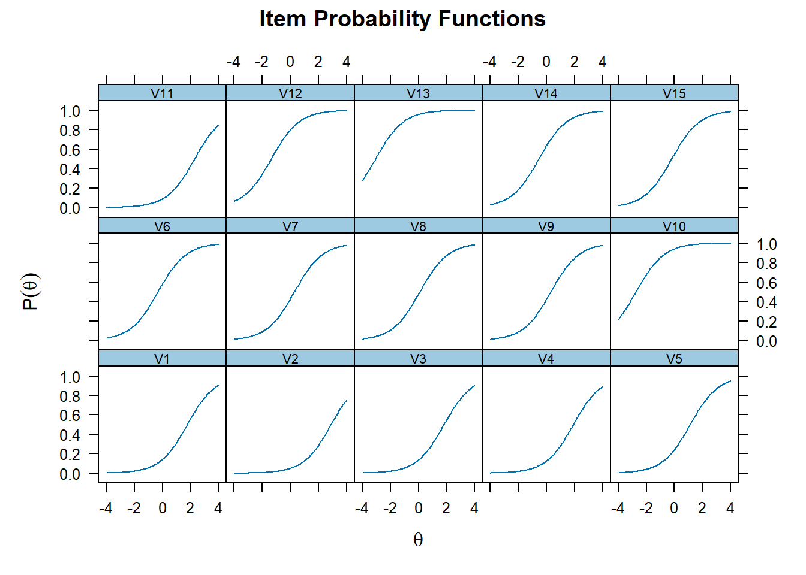
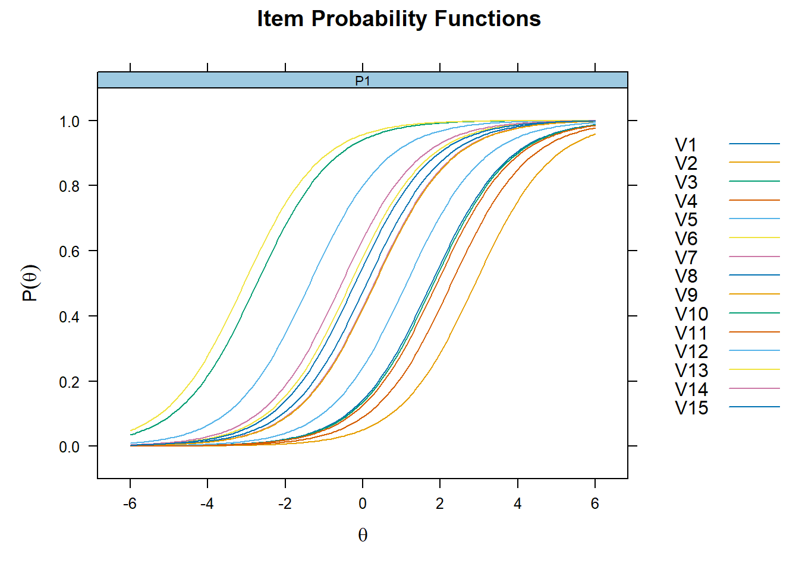
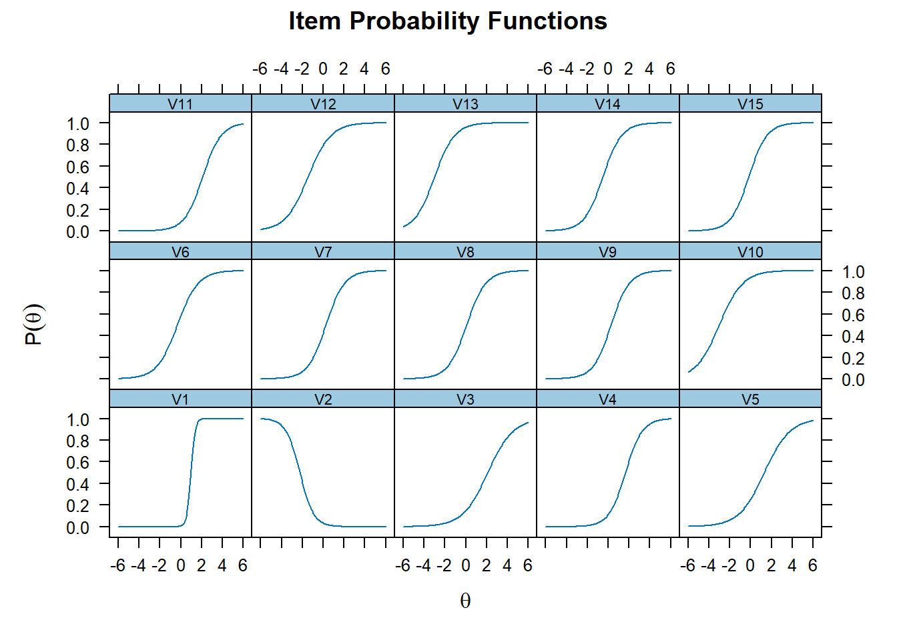
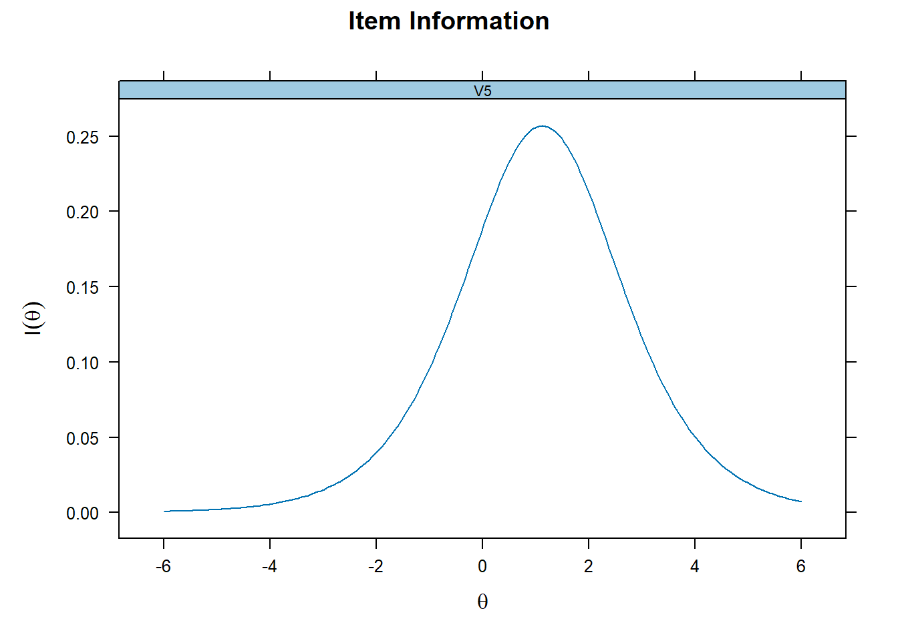
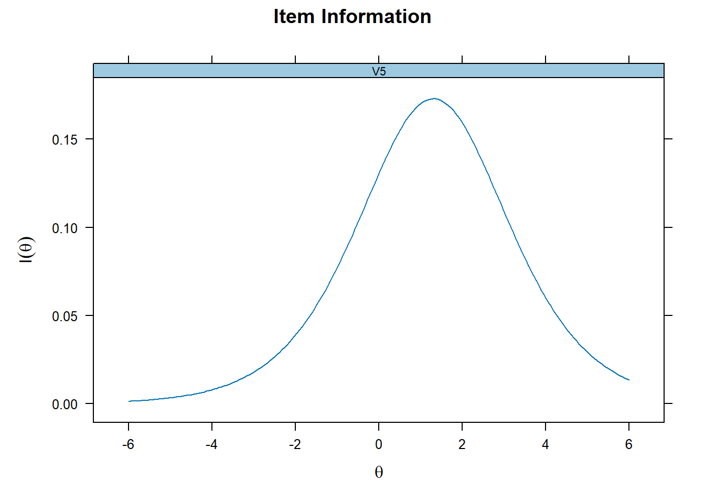
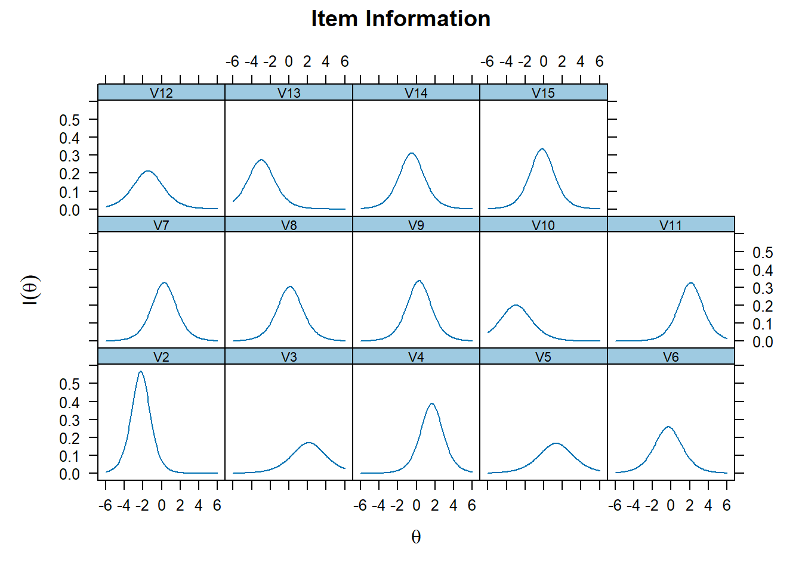
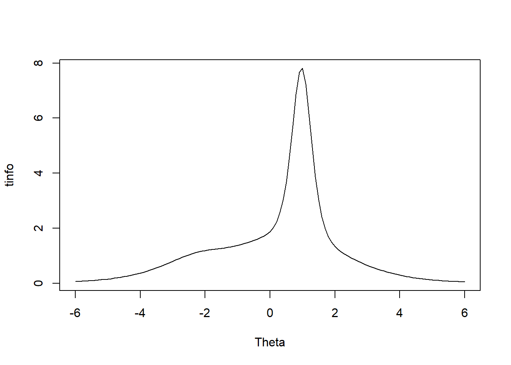
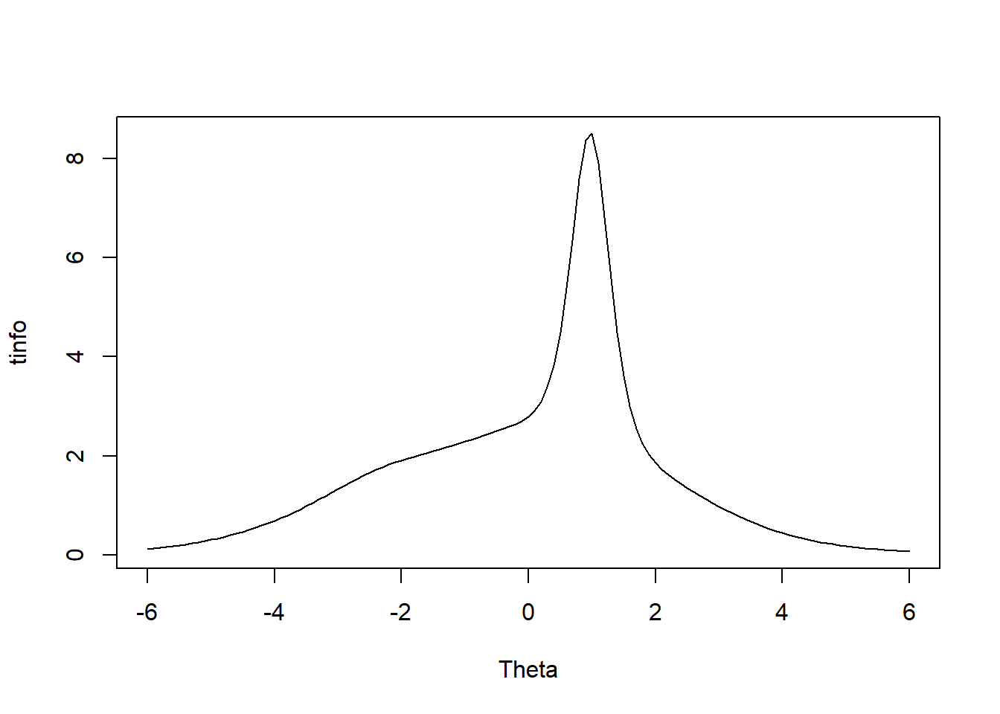
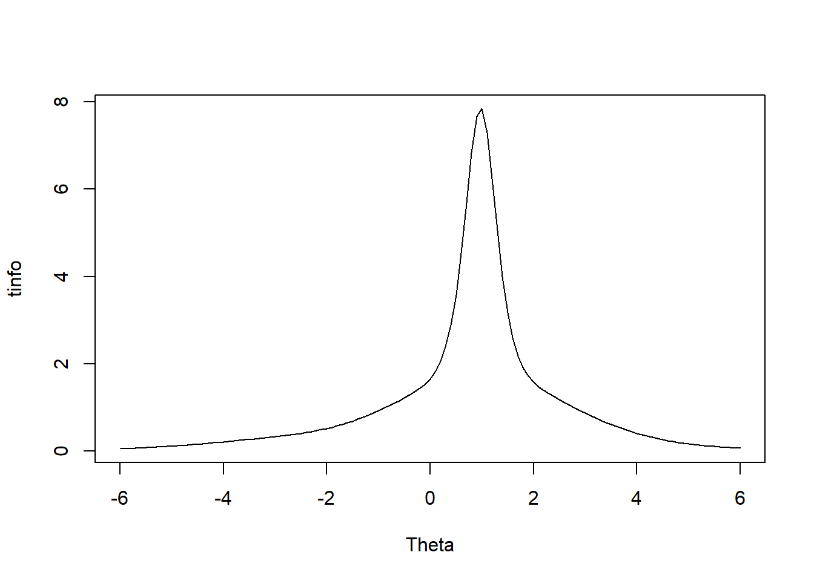
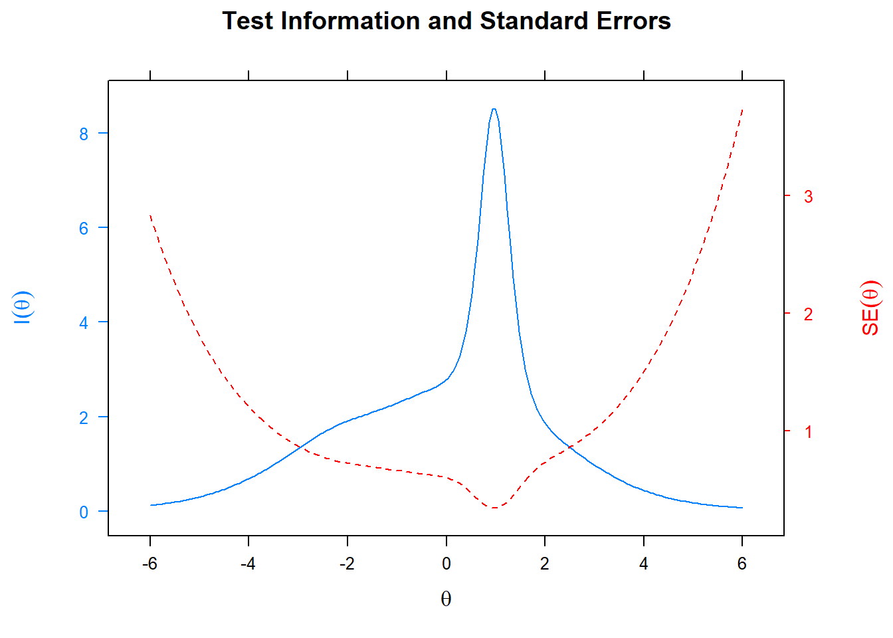

#  MTK ile Madde Analizi Uygulaması

- iki kategorili (doğru-yanlış) MTK modelleri

- madde ve yetenek parametresi kestirimi

- madde karakteristik eğrisi çizimi ve yorumlanması

- model-veri uyumunun incelenmesi

- madde ve test bilgi fonksiyonu 


- kullanılacak veriler
  - `<svg aria-hidden="true" role="img" viewBox="0 0 640 512" style="height:1em;width:1.25em;vertical-align:-0.125em;margin-left:auto;margin-right:auto;font-size:inherit;fill:currentColor;overflow:visible;position:relative;"><path d="M579.8 267.7c56.5-56.5 56.5-148 0-204.5c-50-50-128.8-56.5-186.3-15.4l-1.6 1.1c-14.4 10.3-17.7 30.3-7.4 44.6s30.3 17.7 44.6 7.4l1.6-1.1c32.1-22.9 76-19.3 103.8 8.6c31.5 31.5 31.5 82.5 0 114L422.3 334.8c-31.5 31.5-82.5 31.5-114 0c-27.9-27.9-31.5-71.8-8.6-103.8l1.1-1.6c10.3-14.4 6.9-34.4-7.4-44.6s-34.4-6.9-44.6 7.4l-1.1 1.6C206.5 251.2 213 330 263 380c56.5 56.5 148 56.5 204.5 0L579.8 267.7zM60.2 244.3c-56.5 56.5-56.5 148 0 204.5c50 50 128.8 56.5 186.3 15.4l1.6-1.1c14.4-10.3 17.7-30.3 7.4-44.6s-30.3-17.7-44.6-7.4l-1.6 1.1c-32.1 22.9-76 19.3-103.8-8.6C74 372 74 321 105.5 289.5L217.7 177.2c31.5-31.5 82.5-31.5 114 0c27.9 27.9 31.5 71.8 8.6 103.9l-1.1 1.6c-10.3 14.4-6.9 34.4 7.4 44.6s34.4 6.9 44.6-7.4l1.1-1.6C433.5 260.8 427 182 377 132c-56.5-56.5-148-56.5-204.5 0L60.2 244.3z"/></svg>`{=html}: [Sunu veri](https://raw.githubusercontent.com/atalay-k/mirt_k/main/dichotomous.csv)
  
  - `<svg aria-hidden="true" role="img" viewBox="0 0 640 512" style="height:1em;width:1.25em;vertical-align:-0.125em;margin-left:auto;margin-right:auto;font-size:inherit;fill:currentColor;overflow:visible;position:relative;"><path d="M579.8 267.7c56.5-56.5 56.5-148 0-204.5c-50-50-128.8-56.5-186.3-15.4l-1.6 1.1c-14.4 10.3-17.7 30.3-7.4 44.6s30.3 17.7 44.6 7.4l1.6-1.1c32.1-22.9 76-19.3 103.8 8.6c31.5 31.5 31.5 82.5 0 114L422.3 334.8c-31.5 31.5-82.5 31.5-114 0c-27.9-27.9-31.5-71.8-8.6-103.8l1.1-1.6c10.3-14.4 6.9-34.4-7.4-44.6s-34.4-6.9-44.6 7.4l-1.1 1.6C206.5 251.2 213 330 263 380c56.5 56.5 148 56.5 204.5 0L579.8 267.7zM60.2 244.3c-56.5 56.5-56.5 148 0 204.5c50 50 128.8 56.5 186.3 15.4l1.6-1.1c14.4-10.3 17.7-30.3 7.4-44.6s-30.3-17.7-44.6-7.4l-1.6 1.1c-32.1 22.9-76 19.3-103.8-8.6C74 372 74 321 105.5 289.5L217.7 177.2c31.5-31.5 82.5-31.5 114 0c27.9 27.9 31.5 71.8 8.6 103.9l-1.1 1.6c-10.3 14.4-6.9 34.4 7.4 44.6s34.4 6.9 44.6-7.4l1.1-1.6C433.5 260.8 427 182 377 132c-56.5-56.5-148-56.5-204.5 0L60.2 244.3z"/></svg>`{=html}: [Ödev Veri](https://github.com/atalay-k/mirt_k/blob/main/veri.csv) 

- kodlar
  - `<svg aria-hidden="true" role="img" viewBox="0 0 640 512" style="height:1em;width:1.25em;vertical-align:-0.125em;margin-left:auto;margin-right:auto;font-size:inherit;fill:currentColor;overflow:visible;position:relative;"><path d="M579.8 267.7c56.5-56.5 56.5-148 0-204.5c-50-50-128.8-56.5-186.3-15.4l-1.6 1.1c-14.4 10.3-17.7 30.3-7.4 44.6s30.3 17.7 44.6 7.4l1.6-1.1c32.1-22.9 76-19.3 103.8 8.6c31.5 31.5 31.5 82.5 0 114L422.3 334.8c-31.5 31.5-82.5 31.5-114 0c-27.9-27.9-31.5-71.8-8.6-103.8l1.1-1.6c10.3-14.4 6.9-34.4-7.4-44.6s-34.4-6.9-44.6 7.4l-1.1 1.6C206.5 251.2 213 330 263 380c56.5 56.5 148 56.5 204.5 0L579.8 267.7zM60.2 244.3c-56.5 56.5-56.5 148 0 204.5c50 50 128.8 56.5 186.3 15.4l1.6-1.1c14.4-10.3 17.7-30.3 7.4-44.6s-30.3-17.7-44.6-7.4l-1.6 1.1c-32.1 22.9-76 19.3-103.8-8.6C74 372 74 321 105.5 289.5L217.7 177.2c31.5-31.5 82.5-31.5 114 0c27.9 27.9 31.5 71.8 8.6 103.9l-1.1 1.6c-10.3 14.4-6.9 34.4 7.4 44.6s34.4 6.9 44.6-7.4l1.1-1.6C433.5 260.8 427 182 377 132c-56.5-56.5-148-56.5-204.5 0L60.2 244.3z"/></svg>`{=html}: [Kodlar](https://raw.githubusercontent.com/atalay-k/mirt_k/main/kodlar.R) 
  


## İki kategorili (doğru-yanlış) MTK modelleri


En popüler üç tek boyutlu *iki kategorili madde yanıt verisi* MTK modelleri

bir-parametreli lojistik  (1-PL)
  
  $$P_i(\theta) = \frac{exp(\theta-b_i)}{1+exp(\theta-b_i)} = \frac{1}{1+exp[-(\theta-b_i)]}$$


iki-parametreli lojistik  (2-PL)
  
  
$$P_i(\theta) = \frac{exp[a_i(\theta-b_i)]}{1+exp[a_i(\theta-b_i)]}=\frac{1}{1+exp(-[a_i(\theta-b_i)])}$$

üç-parametreli lojistik   (3-PL) 
  
  $$P_i(\theta) = c_i + (1- ci)* \frac{exp[a_i(\theta-b_i)]}{1+exp[a_i(\theta-b_i)]}=c_i +\frac{1-c_i}{1+exp(-[a_i(\theta-b_i)])}$$
  


## mirt paketi yüklenmesi

Analizler **mirt** paketinde yapılacaktır. Paketin yüklenmesi ve aktivite edilmesi aşağıdaki kodlarla sağlanır.


```r
# install.packages("mirt")
library("mirt")
```


MTK analizlerinin yapılacağı paketlere **ltm** Rizopoulos (2006) ve  **irtoys** Partchev vd. (2017) örnek verilebilir. Choi ve Asilkalkan (2019) `<svg aria-hidden="true" role="img" viewBox="0 0 640 512" style="height:1em;width:1.25em;vertical-align:-0.125em;margin-left:auto;margin-right:auto;font-size:inherit;fill:currentColor;overflow:visible;position:relative;"><path d="M579.8 267.7c56.5-56.5 56.5-148 0-204.5c-50-50-128.8-56.5-186.3-15.4l-1.6 1.1c-14.4 10.3-17.7 30.3-7.4 44.6s30.3 17.7 44.6 7.4l1.6-1.1c32.1-22.9 76-19.3 103.8 8.6c31.5 31.5 31.5 82.5 0 114L422.3 334.8c-31.5 31.5-82.5 31.5-114 0c-27.9-27.9-31.5-71.8-8.6-103.8l1.1-1.6c10.3-14.4 6.9-34.4-7.4-44.6s-34.4-6.9-44.6 7.4l-1.1 1.6C206.5 251.2 213 330 263 380c56.5 56.5 148 56.5 204.5 0L579.8 267.7zM60.2 244.3c-56.5 56.5-56.5 148 0 204.5c50 50 128.8 56.5 186.3 15.4l1.6-1.1c14.4-10.3 17.7-30.3 7.4-44.6s-30.3-17.7-44.6-7.4l-1.6 1.1c-32.1 22.9-76 19.3-103.8-8.6C74 372 74 321 105.5 289.5L217.7 177.2c31.5-31.5 82.5-31.5 114 0c27.9 27.9 31.5 71.8 8.6 103.9l-1.1 1.6c-10.3 14.4-6.9 34.4 7.4 44.6s34.4 6.9 44.6-7.4l1.1-1.6C433.5 260.8 427 182 377 132c-56.5-56.5-148-56.5-204.5 0L60.2 244.3z"/></svg>`{=html} [makalesinde](https://doi.org/10.1080/15366367.2019.1586404) 45 farklı MTK paketine ilişkin açıklamalar bulunmaktadır.


- 1PL modelin hazırlanması

İlk olarak test edilecek model hazırlanmalıdır.


```r
birpl_model <- "F = 1-15
                CONSTRAIN = (1-15, a1)"
```

Kodun ilk satırı,  tek bir gizil özelliğin (F'nin) veri setindeki 1 ile 15 arasındaki sütunlardaki maddeler tarafından ölçüldüğünü göstermektedir

CONSTRAIN ile başlayan ikinci satır ise 1'den 15'e kadar olan sütunlardaki maddeleri aynı madde ayırt ediciliğine (a1) sahip olacak şekilde sınırlar.

- Sadece ilk 10 maddede madde ayırt ediciliğini aynı olacak şekilde sınırlamak isterseniz modeli aşağıdaki gibi düzenleyebilirsiniz.


```r
birpl_model_v1 <- "F = 1-15
                CONSTRAIN = (1-10, a1)"
```


- Veri aktarımı `<svg aria-hidden="true" role="img" viewBox="0 0 640 512" style="height:1em;width:1.25em;vertical-align:-0.125em;margin-left:auto;margin-right:auto;font-size:inherit;fill:currentColor;overflow:visible;position:relative;"><path d="M579.8 267.7c56.5-56.5 56.5-148 0-204.5c-50-50-128.8-56.5-186.3-15.4l-1.6 1.1c-14.4 10.3-17.7 30.3-7.4 44.6s30.3 17.7 44.6 7.4l1.6-1.1c32.1-22.9 76-19.3 103.8 8.6c31.5 31.5 31.5 82.5 0 114L422.3 334.8c-31.5 31.5-82.5 31.5-114 0c-27.9-27.9-31.5-71.8-8.6-103.8l1.1-1.6c10.3-14.4 6.9-34.4-7.4-44.6s-34.4-6.9-44.6 7.4l-1.1 1.6C206.5 251.2 213 330 263 380c56.5 56.5 148 56.5 204.5 0L579.8 267.7zM60.2 244.3c-56.5 56.5-56.5 148 0 204.5c50 50 128.8 56.5 186.3 15.4l1.6-1.1c14.4-10.3 17.7-30.3 7.4-44.6s-30.3-17.7-44.6-7.4l-1.6 1.1c-32.1 22.9-76 19.3-103.8-8.6C74 372 74 321 105.5 289.5L217.7 177.2c31.5-31.5 82.5-31.5 114 0c27.9 27.9 31.5 71.8 8.6 103.9l-1.1 1.6c-10.3 14.4-6.9 34.4 7.4 44.6s34.4 6.9 44.6-7.4l1.1-1.6C433.5 260.8 427 182 377 132c-56.5-56.5-148-56.5-204.5 0L60.2 244.3z"/></svg>`{=html}: [Veriyi açılan linkten farklı kaydet ile alabilirsiniz.](https://raw.githubusercontent.com/atalay-k/mirt_k/main/dichotomous.csv)


```r
library(readr)
ikikategorili <- read_csv("import/dichotomous.csv")[,-1]
head(ikikategorili[,1:5])
```

<div class="kable-table">

| V1| V2| V3| V4| V5|
|--:|--:|--:|--:|--:|
|  0|  0|  0|  0|  0|
|  0|  0|  0|  0|  0|
|  0|  0|  0|  1|  0|
|  0|  0|  0|  0|  0|
|  1|  0|  0|  1|  1|
|  0|  0|  0|  0|  0|

</div>


```r
DataExplorer::plot_bar(ikikategorili)
```


- Veriyi 1-0 olarak puanlamak için **key2binary()**
fonksiyonunu kullanabilirsiniz.


```r
veri <- read_csv("import/veri.csv")[,-1]
```

```
## Rows: 262 Columns: 13
## ── Column specification ────────────────────────────────────────────────────────
## Delimiter: ","
## dbl (13): Subject, Rot1_2, Rot1_3, Rot1_4, Rot1_5, Rot2_2, Rot2_3, Rot2_4, R...
## 
## ℹ Use `spec()` to retrieve the full column specification for this data.
## ℹ Specify the column types or set `show_col_types = FALSE` to quiet this message.
```

```r
veri <- sapply(veri,as.character)
library(mirt)
dat1 <- key2binary(veri,
    key = c("2","3","4","5","2","3","4","5","2","3","4","5"))
```


```r
head(veri[,1:5])
```

```
##      Rot1_2 Rot1_3 Rot1_4 Rot1_5 Rot2_2
## [1,] "2"    "1"    "0"    "0"    "0"   
## [2,] "2"    "2"    "1"    "1"    "2"   
## [3,] "2"    "1"    "4"    "1"    "2"   
## [4,] "2"    "2"    "3"    "1"    "2"   
## [5,] "2"    "3"    "4"    "5"    "2"   
## [6,] "2"    "3"    "0"    "2"    "2"
```


```r
head(dat1)
```

```
##      Rot1_2 Rot1_3 Rot1_4 Rot1_5 Rot2_2 Rot2_3 Rot2_4 Rot2_5 Rot3_2 Rot3_3
## [1,]      1      0      0      0      0      1      0      0      0      0
## [2,]      1      0      0      0      1      1      0      0      1      0
## [3,]      1      0      1      0      1      1      1      0      0      0
## [4,]      1      0      0      0      1      0      0      0      1      0
## [5,]      1      1      1      1      1      1      1      0      1      1
## [6,]      1      1      0      0      1      1      1      0      1      0
##      Rot3_4 Rot3_5
## [1,]      0      0
## [2,]      0      0
## [3,]      0      0
## [4,]      0      0
## [5,]      1      0
## [6,]      0      0
```


### Madde Istatistikleri


```r
itemstats(ikikategorili)
```

```
## $overall
##     N mean_total.score sd_total.score ave.r sd.r alpha
##  1000            6.682          2.698 0.114 0.11 0.688
## 
## $itemstats
##        N  mean    sd total.r total.r_if_rm alpha_if_rm
## V1  1000 0.182 0.386   0.626         0.526       0.645
## V2  1000 0.074 0.262  -0.169        -0.261       0.717
## V3  1000 0.175 0.380   0.382         0.253       0.678
## V4  1000 0.164 0.370   0.438         0.317       0.671
## V5  1000 0.280 0.449   0.427         0.277       0.676
## V6  1000 0.566 0.496   0.501         0.344       0.666
## V7  1000 0.440 0.497   0.536         0.384       0.660
## V8  1000 0.479 0.500   0.532         0.379       0.661
## V9  1000 0.435 0.496   0.525         0.372       0.662
## V10 1000 0.915 0.279   0.291         0.193       0.684
## V11 1000 0.123 0.329   0.375         0.263       0.677
## V12 1000 0.760 0.427   0.414         0.270       0.676
## V13 1000 0.936 0.245   0.277         0.190       0.684
## V14 1000 0.612 0.488   0.517         0.366       0.663
## V15 1000 0.541 0.499   0.522         0.368       0.663
## 
## $proportions
##         0     1
## V1  0.818 0.182
## V2  0.926 0.074
## V3  0.825 0.175
## V4  0.836 0.164
## V5  0.720 0.280
## V6  0.434 0.566
## V7  0.560 0.440
## V8  0.521 0.479
## V9  0.565 0.435
## V10 0.085 0.915
## V11 0.877 0.123
## V12 0.240 0.760
## V13 0.064 0.936
## V14 0.388 0.612
## V15 0.459 0.541
```

 

### Parametre Kestirimleri

- mirt paketinin **mirt()** fonksiyonu temel olarak data ve model olarak iki argümanla çalışır.

- **ikikategorili** veri setinin **birpl_model** modeli için testi aşağıdaki gibi yapılabilir.


```r
birpl_model <- "F = 1-15
                CONSTRAIN = (1-15, a1)"
birpl_uyum <- mirt(data = ikikategorili, model = birpl_model,SE=TRUE,
                   verbose=FALSE)
```

- birpl_uyum nesnesi
 - parametre kestirimlerini
 - gizil özelliğin ortalamasını
 - gizil özelliğin varyans-kovaryans matrisini
 - kestirim sürecine ilişkin ek bilgileri içerir.


### Varsayımlar
- Tek boyutluluk tek boyutlu MTK modelleri, tüm maddelerin tek bir sürekli gizli değişkeni ölçtüğünü varsayar. 
- Tek boyutluluk varsayımını test etmenin farklı yolları vardır. Örneğin, kavramsal olarak genel bir faktör tarafından hesaplanan ölçek puanlarındaki varyans yüzdesini yansıtan McDonald's hiyerarşik Omega'sını  değerlendirebiliriz.


```r
library(psych)
summary(omega(ikikategorili, plot = F))
```

```
## Omega 
## omega(m = ikikategorili, plot = F)
## Alpha:                 0.72 
## G.6:                   0.71 
## Omega Hierarchical:    0.58 
## Omega H asymptotic:    0.78 
## Omega Total            0.74 
## 
## With eigenvalues of:
##    g  F1*  F2*  F3* 
## 1.86 0.69 0.20 0.28 
## The degrees of freedom for the model is 63  and the fit was  0.05 
## The number of observations was  1000  with Chi Square =  52.23  with prob <  0.83 
## 
## The root mean square of the residuals is  0.02 
## The df corrected root mean square of the residuals is  0.03 
## 
## RMSEA and the  0.9 confidence intervals are  0 0 0.012
## BIC =  -382.96Explained Common Variance of the general factor =  0.61 
## 
##  Total, General and Subset omega for each subset
##                                                  g  F1*  F2*  F3*
## Omega total for total scores and subscales    0.74 0.60 0.53 0.39
## Omega general for total scores and subscales  0.58 0.36 0.43 0.26
## Omega group for total scores and subscales    0.09 0.25 0.09 0.14
```


```r
birpl_uyum <- mirt(data = ikikategorili, model = birpl_model,SE=TRUE,
                    verbose=FALSE)
```

- Madde çiftlerinin yerel bağımsızlığını kontrol etmek için ise Yen'in Q3 istatistiği kullanılabilir.

- i. ve j. maddelerinden elde edilen artıklar arasındaki korelasyon matrisi 


```r
 Q3 <- residuals(birpl_uyum, type = 'Q3', method = 'ML')
```

```
## Q3 summary statistics:
##    Min. 1st Qu.  Median    Mean 3rd Qu.    Max. 
##  -0.183  -0.099  -0.064  -0.069  -0.040   0.027 
## 
##         V1     V2     V3     V4     V5     V6     V7     V8     V9    V10
## V1   1.000 -0.183 -0.127  0.016 -0.142 -0.089 -0.049 -0.054  0.026 -0.053
## V2  -0.183  1.000  0.027 -0.040 -0.034 -0.083 -0.062 -0.056 -0.057 -0.014
## V3  -0.127  0.027  1.000 -0.134 -0.049 -0.031 -0.100 -0.068 -0.091 -0.009
## V4   0.016 -0.040 -0.134  1.000 -0.099 -0.056 -0.019 -0.102 -0.098 -0.016
## V5  -0.142 -0.034 -0.049 -0.099  1.000 -0.117 -0.064 -0.062 -0.082  0.003
## V6  -0.089 -0.083 -0.031 -0.056 -0.117  1.000 -0.106 -0.143 -0.114 -0.109
## V7  -0.049 -0.062 -0.100 -0.019 -0.064 -0.106  1.000 -0.155 -0.128  0.007
## V8  -0.054 -0.056 -0.068 -0.102 -0.062 -0.143 -0.155  1.000 -0.089 -0.046
## V9   0.026 -0.057 -0.091 -0.098 -0.082 -0.114 -0.128 -0.089  1.000 -0.094
## V10 -0.053 -0.014 -0.009 -0.016  0.003 -0.109  0.007 -0.046 -0.094  1.000
## V11 -0.005 -0.020 -0.167 -0.120 -0.076 -0.036 -0.056 -0.072 -0.009 -0.050
## V12 -0.081 -0.096 -0.041 -0.061 -0.068 -0.090 -0.111 -0.055 -0.104 -0.117
## V13  0.006 -0.016 -0.039 -0.019 -0.040 -0.062 -0.052 -0.036 -0.053  0.001
## V14 -0.048 -0.059 -0.067 -0.042 -0.095 -0.083 -0.078 -0.082 -0.130 -0.106
## V15 -0.018 -0.086 -0.074 -0.070 -0.169 -0.060 -0.127 -0.114 -0.102 -0.063
##        V11    V12    V13    V14    V15
## V1  -0.005 -0.081  0.006 -0.048 -0.018
## V2  -0.020 -0.096 -0.016 -0.059 -0.086
## V3  -0.167 -0.041 -0.039 -0.067 -0.074
## V4  -0.120 -0.061 -0.019 -0.042 -0.070
## V5  -0.076 -0.068 -0.040 -0.095 -0.169
## V6  -0.036 -0.090 -0.062 -0.083 -0.060
## V7  -0.056 -0.111 -0.052 -0.078 -0.127
## V8  -0.072 -0.055 -0.036 -0.082 -0.114
## V9  -0.009 -0.104 -0.053 -0.130 -0.102
## V10 -0.050 -0.117  0.001 -0.106 -0.063
## V11  1.000 -0.017 -0.035 -0.054 -0.093
## V12 -0.017  1.000 -0.076 -0.116 -0.032
## V13 -0.035 -0.076  1.000 -0.106 -0.055
## V14 -0.054 -0.116 -0.106  1.000 -0.087
## V15 -0.093 -0.032 -0.055 -0.087  1.000
```


- Yen .20'den yüksek korelasyonlara problemli olarak yaklaşmayı tavsiye etmiştir.


```r
Q3[lower.tri(Q3,diag = TRUE)] <- NA
sum(abs(Q3) >0.2,na.rm=TRUE)
```

```
## [1] 0
```


### Model Uyumu


```r
 M2(birpl_uyum)
```

<div class="kable-table">

|      |       M2|  df|  p|     RMSEA|   RMSEA_5|  RMSEA_95|    SRMSR|       TLI|       CFI|
|:-----|--------:|---:|--:|---------:|---------:|---------:|--------:|---------:|---------:|
|stats | 539.9122| 104|  0| 0.0647739| 0.0594022| 0.0701905| 0.092858| 0.8254511| 0.8271135|

</div>

- Elde edilen 

- **RMSEA** değeri = 0.0648 (%95 CI[0.0594, 0.0702]) ve 
- **SRMSR** değeri = 0.0929, önerilen eşik değerleri olan **RMSEA <= .06** 

- **SRMSR <= .08** kullanılarak verilerin modelin iyi uyum **sağlamadığını** göstermektedir.


Madde uyumlarına baktığımızda özellikle V1, V2 maddelerinde yüksek ki-kare ve ve RMSEA değerleri gözlenmektedir.


```r
library(dplyr)
itemfit(birpl_uyum) %>% kable(digits=2)
```


|item |   S_X2| df.S_X2| RMSEA.S_X2| p.S_X2|
|:----|------:|-------:|----------:|------:|
|V1   |  85.28|       9|       0.09|   0.00|
|V2   | 548.10|       8|       0.26|   0.00|
|V3   |  15.16|       9|       0.03|   0.09|
|V4   |  13.07|       9|       0.02|   0.16|
|V5   |  17.62|       9|       0.03|   0.04|
|V6   |  16.94|       9|       0.03|   0.05|
|V7   |  10.08|       9|       0.01|   0.34|
|V8   |   9.69|       9|       0.01|   0.38|
|V9   |   1.95|       9|       0.00|   0.99|
|V10  |   1.78|       8|       0.00|   0.99|
|V11  |  10.54|       9|       0.01|   0.31|
|V12  |   5.51|       8|       0.00|   0.70|
|V13  |  10.47|       8|       0.02|   0.23|
|V14  |  12.53|       9|       0.02|   0.18|
|V15  |   5.35|       9|       0.00|   0.80|

### Parametre Kestirimleri

- Kestirim süreci **birpl_uyum** nesnesine atandıktan sonra, parametreleri inceleme için **coef()**  fonksiyonunun kullanabilir.

- Çok boyutlu MTK'da yer alan, eğim ve kesişim parametrelerini geleneksel MTK parametrelerine dönüştürmek için **IRTpars**  argümanı **TRUE** değeri ile kullanılır. 

- **simplify** argümanı **TRUE** değeri ile kullanıldığında parametreler liste yapısı yerine veri seti olarak elde edilir.


```r
birpl_model <- "F = 1-15
                CONSTRAIN = (1-15, a1)"
birpl_uyum <- mirt(data = ikikategorili, model = birpl_model,
                    verbose=FALSE)
```


- parametre kestirimlerini olusturulan **birpl_par** nesnesinin **items** bileşeninden alabiliriz.

```r
birpl_par <- coef(birpl_uyum, 
                  IRTpars = TRUE, 
                  simplify = TRUE)
birpl_par$items
```

```
##            a           b g u
## V1  1.013626  1.76949298 0 1
## V2  1.013626  2.89739255 0 1
## V3  1.013626  1.82367304 0 1
## V4  1.013626  1.91203231 0 1
## V5  1.013626  1.12434465 0 1
## V6  1.013626 -0.32009940 0 1
## V7  1.013626  0.28823807 0 1
## V8  1.013626  0.09959949 0 1
## V9  1.013626  0.31260843 0 1
## V10 1.013626 -2.73110850 0 1
## V11 1.013626  2.28648733 0 1
## V12 1.013626 -1.36726150 0 1
## V13 1.013626 -3.05783719 0 1
## V14 1.013626 -0.54748073 0 1
## V15 1.013626 -0.19875398 0 1
```


- Her satır, madde adıyla başlar.

- Sütunlar ise sırasıyla 

  - ilk sütun **a** madde ayırtedicliği
  
  - ikinci sütun **b** madde güçlüğü
  - üçüncü sütun **g** alt asimptot (yani tahmin)
  - son sütun **u** üst asimptottur. 
  
  - 1PL modeli alt ve üst asimptot parametrelerini içermediğinden, sırasıyla her zaman 0 ve 1 dir.


```r
birpl_par <- coef(birpl_uyum, 
                  IRTpars = TRUE, 
                  simplify = TRUE)
birpl_par$items
```

```
##            a           b g u
## V1  1.013626  1.76949298 0 1
## V2  1.013626  2.89739255 0 1
## V3  1.013626  1.82367304 0 1
## V4  1.013626  1.91203231 0 1
## V5  1.013626  1.12434465 0 1
## V6  1.013626 -0.32009940 0 1
## V7  1.013626  0.28823807 0 1
## V8  1.013626  0.09959949 0 1
## V9  1.013626  0.31260843 0 1
## V10 1.013626 -2.73110850 0 1
## V11 1.013626  2.28648733 0 1
## V12 1.013626 -1.36726150 0 1
## V13 1.013626 -3.05783719 0 1
## V14 1.013626 -0.54748073 0 1
## V15 1.013626 -0.19875398 0 1
```


- İlk sütun, 1.01 tahmini ile madde ayırt ayırtedicliği parametresini göstermektedir. 

- ikinci sütun, madde güçlük parametrelerini göstermektedir.

- Peki en kolay madde hangisidir?

- En zor madde hangisidir?

### Madde Karakteristik Eğrisi (MKE)


- **plot()** fonksiyonu ile oluşturulan nesne içindeki maddeler için tek tek ya da istenilen maddeler için MKE çizdirilebilir.


```r
plot(birpl_uyum,type = "trace", which.items = 1:15)
```


- mirt paketi grafik çiziminde **lattice** paketini kullanmaktadır. lattice paketi özellikleri ile grafiklerinizi özelleştirebilirsiniz.

- Panelin oluşum şekli **layout** argümanı ile x ekseni limitlerini ise **theta_lim** argümanı ile değiştirilebilir.


```r
plot(birpl_uyum, type = "trace", which.items = 1:15,
     layout=c(5, 3),theta_lim = c(-4, 4))
```




```r
plot(birpl_uyum,
     type = "trace", 
which.items = 1:15, 
layout=c(5, 3),
panel=function(x, y){
panel.grid(h=-1, v=-1)
panel.xyplot(x, y)
panel.abline(h=0.5, lwd=1,
        lty=1)})
```


- Böylece çoktan seçmeli maddelerde **düşük yetenek düzeyine** sahip bireylerin **tahmin olasılığına izin verilmez.** Tahmin olmaması sayıltısı çoktan-seçmeli maddeleri içeren bir testin çok kolay olduğu durumlarda karşılanabilir.


- **facet_items** argümanının FALSE değeri ile tüm maddelerin MKE tek bir grafikte elde edilebilir.


```r
plot(birpl_uyum, type = "trace", which.items = 1:15,
facet_items = FALSE)
```




##  2-PL Model


- Modelin hazırlanması


```r
ikipl_model <- "F = 1 - 15"
```

- Modelin testi

```r
ikipl_uyum <- mirt(data = ikikategorili, model = ikipl_model,
itemtype = "2PL", SE=TRUE,  verbose=FALSE)
```


-  2-PL Model için Model Uyum


```r
M2(ikipl_uyum)
```

<div class="kable-table">

|      |       M2| df|         p| RMSEA| RMSEA_5|  RMSEA_95|     SRMSR|      TLI| CFI|
|:-----|--------:|--:|---------:|-----:|-------:|---------:|---------:|--------:|---:|
|stats | 88.06917| 90| 0.5379028|     0|       0| 0.0163286| 0.0247101| 1.000893|   1|

</div>

- 2-PL Model için Madde Uyum

```r
itemfit(ikipl_uyum)
```

<div class="kable-table">

|item |      S_X2| df.S_X2| RMSEA.S_X2|    p.S_X2|
|:----|---------:|-------:|----------:|---------:|
|V1   |  5.558331|       5|  0.0105725| 0.3515920|
|V2   | 12.228079|       9|  0.0189482| 0.2007546|
|V3   | 16.665603|       9|  0.0291991| 0.0542175|
|V4   |  9.711259|       8|  0.0146329| 0.2858794|
|V5   |  9.355188|       9|  0.0062853| 0.4051540|
|V6   | 15.265547|       9|  0.0263983| 0.0838954|
|V7   |  8.631798|       9|  0.0000000| 0.4719325|
|V8   |  8.496113|       9|  0.0000000| 0.4850231|
|V9   |  2.623542|       9|  0.0000000| 0.9773743|
|V10  |  1.694781|       8|  0.0000000| 0.9889827|
|V11  |  7.630437|       8|  0.0000000| 0.4703763|
|V12  |  4.066071|       8|  0.0000000| 0.8511136|
|V13  | 11.145184|       8|  0.0198379| 0.1936078|
|V14  | 12.264854|       9|  0.0190558| 0.1987866|
|V15  |  5.324926|       9|  0.0000000| 0.8051138|

</div>


- 2-PL Model Parametrelerin incelenmesi

```r
ikipl_par <- coef(ikipl_uyum, IRTpars = TRUE, simplify = TRUE)
```


- Madde parametreleri oluşturulan nesnenin **items** bileşeninde yer almaktadır.


```r
ikipl_par$items
```

```
##              a           b g u
## V1   4.9770527  0.97389708 0 1
## V2  -1.5064231 -2.23536051 0 1
## V3   0.8270586  2.12124033 0 1
## V4   1.2474614  1.66057442 0 1
## V5   0.8174703  1.31802216 0 1
## V6   1.0167249 -0.31516639 0 1
## V7   1.1407667  0.27023173 0 1
## V8   1.1035449  0.09815291 0 1
## V9   1.1595573  0.28974905 0 1
## V10  0.8961434 -3.00368157 0 1
## V11  1.1407616  2.10056256 0 1
## V12  0.9224835 -1.46118722 0 1
## V13  1.0481447 -2.98989657 0 1
## V14  1.1180121 -0.50818301 0 1
## V15  1.1598398 -0.17723738 0 1
```

-  2-PL Model MKE


```r
plot(ikipl_uyum, type = "trace", which.items = 1:15)
```




```r
plot(ikipl_uyum, type = "trace", which.items = 1:15,facet_items = FALSE,
     abline=c(h=0.5))
```


##  3-PL Model

- Modelin hazırlanması

```r
ucpl_model <- "F = 1 - 15"
```

- Modelin testi

```r
ucpl_uyum <- mirt(data = ikikategorili, model = ucpl_model,
itemtype = "3PL", verbose=FALSE)
```

- Parametrelerin incelenmesi

```r
ucpl_par <- coef(ucpl_uyum, IRTpars = TRUE, simplify = TRUE)
```


-  3-PL Model için Model Uyum

```r
M2(ucpl_uyum)
```

<div class="kable-table">

|      |       M2| df|         p| RMSEA| RMSEA_5|  RMSEA_95|     SRMSR|      TLI| CFI|
|:-----|--------:|--:|---------:|-----:|-------:|---------:|---------:|--------:|---:|
|stats | 67.45153| 75| 0.7201797|     0|       0| 0.0140931| 0.0249955| 1.004191|   1|

</div>

-  3-PL Model için Madde Uyum

```r
itemfit(ucpl_uyum)
```

<div class="kable-table">

|item |      S_X2| df.S_X2| RMSEA.S_X2|    p.S_X2|
|:----|---------:|-------:|----------:|---------:|
|V1   |  5.574383|       4|  0.0198492| 0.2332681|
|V2   | 12.209384|       7|  0.0272936| 0.0938800|
|V3   | 15.866270|       8|  0.0313730| 0.0443347|
|V4   | 11.465847|       8|  0.0208246| 0.1766743|
|V5   |  9.376835|       8|  0.0131254| 0.3115103|
|V6   | 15.049834|       8|  0.0297004| 0.0581837|
|V7   |  8.681332|       8|  0.0092332| 0.3698873|
|V8   |  8.468874|       8|  0.0076595| 0.3890583|
|V9   |  2.179202|       8|  0.0000000| 0.9750192|
|V10  |  1.757346|       7|  0.0000000| 0.9720433|
|V11  |  7.722126|       7|  0.0101619| 0.3577331|
|V12  |  3.946197|       7|  0.0000000| 0.7859532|
|V13  |  5.316350|       5|  0.0079582| 0.3785040|
|V14  | 12.279853|       8|  0.0231412| 0.1391475|
|V15  |  5.041238|       8|  0.0000000| 0.7531597|

</div>

-  3-PL Model Madde Parametreleri

- Madde parametreleri oluşturulan nesnenin **items** bileşeninde yer almaktadır.


```r
ucpl_par$items
```

```
##              a          b            g u
## V1   5.0095769  0.9730634 6.856953e-05 1
## V2  -1.7864777 -2.1254780 7.449526e-03 1
## V3   0.8261103  2.1244227 2.190968e-04 1
## V4   1.5065681  1.6127171 2.276560e-02 1
## V5   0.8321204  1.3033160 4.390669e-04 1
## V6   1.0127359 -0.3120958 9.971312e-04 1
## V7   1.1433362  0.2749052 1.172248e-03 1
## V8   1.1136806  0.1036166 1.632577e-03 1
## V9   1.3997565  0.4684585 8.285908e-02 1
## V10  0.8859144 -2.9635666 5.056955e-02 1
## V11  1.2099583  2.0555836 4.698548e-03 1
## V12  0.9253188 -1.4495526 4.689105e-03 1
## V13  5.9251510 -0.1267528 8.569785e-01 1
## V14  1.1340456 -0.4838188 9.595944e-03 1
## V15  1.1625190 -0.1728392 8.848252e-04 1
```

- 3-PL Model MKE


```r
plot(ucpl_uyum, type = "trace", which.items = 1:15)
```


```r
plot(ucpl_uyum, type = "trace", which.items = 1:15,facet_items = FALSE,
     abline=c(h=0.5))
```


##  Yetenek Parametresi Kestirimi

MTK modellerinde başlıca üç yolla puanlama yapılır:

- Maksimum Likelihood (ML)
- Maksimum a Posteriori (MAP)
- Expected/estimated a Posteriori (EAP)

- Bireylerin faktör puanları veya gizil özellik düzeyi kestirimleri **fscores()** fonksiyonuyla hesaplanabilir. 

- **fscores()** fonksiyonunun birinci argümanı object olup bu argümanın değeri **mirt()** fonksiyonunun çıktısı olarak kaydedilen nesnelerdir. Kestirim yönteminin türü method argümanıyla maksimum olabilirlik (ML) olarak belirlenmiştir. 

- full.scores.SE argümanı için de TRUE değeri seçilerek kestirimlerin standart hataları istenebilir.


```r
ML   <- fscores(ikipl_uyum, method="ML",full.scores.SE=TRUE)
```

```
## Warning: The following factor score estimates failed to converge successfully:
##     112,568,796,959
```

```r
MAP  <- fscores(ikipl_uyum, method="MAP", full.scores.SE=TRUE)
EAP  <- fscores(ikipl_uyum, method="EAP",full.scores.SE=TRUE)
```


:::: {style="display: flex; justify-content: space-between;"}

::: {style="flex: 1; margin-right: 1cm;"}

```r
head(ML)
```

```
##                F      SE_F
## [1,]  0.73603270 0.3806593
## [2,]  0.53590413 0.4571045
## [3,]  0.89771900 0.3458166
## [4,] -0.50361328 0.6321820
## [5,]  2.33978577 0.8193420
## [6,] -0.03367516 0.6027560
```
:::

::: {style="flex: 1; margin-right: 1cm;"}

```r
head(MAP)
```

```
##               F      SE_F
## [1,]  0.6355854 0.3844652
## [2,]  0.4365773 0.4451435
## [3,]  0.7980747 0.3415016
## [4,] -0.3610353 0.5297980
## [5,]  1.5724578 0.4910050
## [6,] -0.0247113 0.5156826
```
:::

::: {style="flex: 1; margin-right: 1cm;"}

```r
head(EAP)
```

```
##                F      SE_F
## [1,]  0.55522250 0.4072993
## [2,]  0.34833436 0.4382801
## [3,]  0.74927202 0.3834750
## [4,] -0.38920524 0.5196820
## [5,]  1.70157621 0.4909653
## [6,] -0.07368355 0.4928855
```
:::

::::


```r
yetenek <- data.frame(ML= ML[,1],MAP=MAP[,1],EAP=EAP[,1])

apply(yetenek,2,summary)
```

```
##                  ML         MAP           EAP
## Min.           -Inf -2.52282408 -2.566836e+00
## 1st Qu. -0.91649165 -0.64567907 -6.672408e-01
## Median  -0.06447746 -0.04720803 -9.426944e-02
## Mean           -Inf  0.02283950 -5.416872e-05
## 3rd Qu.  0.70642942  0.60541014  5.217741e-01
## Max.    19.99988027  2.20150199  2.295843e+00
```


```r
yetenek_v1 <- yetenek[!is.infinite(yetenek$ML),]

apply(yetenek_v1,2,summary)
```

```
##                  ML         MAP          EAP
## Min.    -3.88806981 -2.19596246 -2.228596152
## 1st Qu. -0.91529147 -0.64486819 -0.666439513
## Median  -0.06368468 -0.04662918 -0.093739792
## Mean     0.01367254  0.02538771  0.002515182
## 3rd Qu.  0.70642987  0.60541034  0.521774267
## Max.    19.99988027  2.20150199  2.295843371
```


```r
cor(yetenek_v1)
```

```
##            ML       MAP       EAP
## ML  1.0000000 0.8166070 0.8172591
## MAP 0.8166070 1.0000000 0.9982609
## EAP 0.8172591 0.9982609 1.0000000
```


```r
pairs(yetenek_v1)
```


```r
anova(birpl_uyum,ikipl_uyum)
anova(ikipl_uyum,ucpl_uyum)
```

<div class="kable-table">

|           |      AIC|    SABIC|       HQ|      BIC|    logLik|       X2| df|  p|
|:----------|--------:|--------:|--------:|--------:|---------:|--------:|--:|--:|
|birpl_uyum | 14719.12| 14746.83| 14748.97| 14797.65| -7343.562|       NA| NA| NA|
|ikipl_uyum | 14373.32| 14425.27| 14429.28| 14520.55| -7156.659| 373.8069| 14|  0|

</div><div class="kable-table">

|           |      AIC|    SABIC|       HQ|      BIC|    logLik|       X2| df|         p|
|:----------|--------:|--------:|--------:|--------:|---------:|--------:|--:|---------:|
|ikipl_uyum | 14373.32| 14425.27| 14429.28| 14520.55| -7156.659|       NA| NA|        NA|
|ucpl_uyum  | 14392.16| 14470.08| 14476.09| 14613.00| -7151.078| 11.16245| 15| 0.7409955|

</div>


##  Madde Bilgi Fonksiyonu


- Teknik olarak, **bilgi** bir parametre **kestiriminin standart hatasının tersiyle** ilişkili bir değerdir.


  - Yüksek bilgi değeri parametre kestirimi hakkında daha fazla bilgiye sahip olunduğunu belirtir. 


- MTK'da  **bilgi** birey yeteneğini kestirmek için kullanılan maddelerin toplamından elde edilen bilgiyi ifade eder.


:::: {style="display: flex; justify-content: space-between;"}

::: {style="flex: 1; margin-right: 1cm;"}


```r
plot(birpl_uyum, 
type = "infotrace", 
which.items = 5)
```



:::

::: {style="flex: 1; margin-right: 1cm;"}

```r
plot(ikipl_uyum, 
type = "infotrace", 
which.items = 5)
```


:::

::: {style="flex: 1; margin-right: 1cm;"}

```r
plot(ucpl_uyum, 
type = "infotrace", 
which.items = 5)
```


:::

::::


:::: {style="display: flex; justify-content: space-between;"}

::: {style="flex: 1; margin-right: 1cm;"}


```r
plot(ikipl_uyum, 
type = "infotrace", 
which.items = 1:15, layout=c(5, 3))
```


:::

::: {style="flex: 1; margin-right: 1cm;"}

```r
plot(ikipl_uyum, 
type = "infotrace", 
which.items = 2:15, layout=c(5, 3))
```


:::


::::


```r
madde1 <- extract.item(ikipl_uyum, 1)
Theta <- matrix(seq(-6,6, by = .1))
info.1 <- iteminfo(madde1, Theta)
plot(Theta, info.1, type = 'l', main = 'Item information')
```


:::: {style="display: flex; justify-content: space-between;"}

::: {style="flex: 1; margin-right: 1cm;"}


```r
tinfo <- testinfo(ikipl_uyum, 
Theta,which.items = 1:5)
plot(Theta, tinfo, type = 'l')
```


:::

::: {style="flex: 1; margin-right: 1cm;"}

```r
tinfo <- testinfo(ikipl_uyum, 
Theta,which.items = 1:10)
plot(Theta, tinfo, type = 'l')
```


:::

::: {style="flex: 1; margin-right: 1cm;"}

```r
tinfo <- testinfo(ikipl_uyum, 
Theta,which.items = 1:15)
plot(Theta, tinfo, type = 'l')
```


:::

::::


```r
tinfo <- testinfo(ikipl_uyum, Theta,which.items = c(1,3:5,7:10,11))
plot(Theta, tinfo, type = 'l')
```




```r
plot(ikipl_uyum, type='infoSE')
```




## Sıra Sizde

1.`<svg aria-hidden="true" role="img" viewBox="0 0 640 512" style="height:1em;width:1.25em;vertical-align:-0.125em;margin-left:auto;margin-right:auto;font-size:inherit;fill:currentColor;overflow:visible;position:relative;"><path d="M579.8 267.7c56.5-56.5 56.5-148 0-204.5c-50-50-128.8-56.5-186.3-15.4l-1.6 1.1c-14.4 10.3-17.7 30.3-7.4 44.6s30.3 17.7 44.6 7.4l1.6-1.1c32.1-22.9 76-19.3 103.8 8.6c31.5 31.5 31.5 82.5 0 114L422.3 334.8c-31.5 31.5-82.5 31.5-114 0c-27.9-27.9-31.5-71.8-8.6-103.8l1.1-1.6c10.3-14.4 6.9-34.4-7.4-44.6s-34.4-6.9-44.6 7.4l-1.1 1.6C206.5 251.2 213 330 263 380c56.5 56.5 148 56.5 204.5 0L579.8 267.7zM60.2 244.3c-56.5 56.5-56.5 148 0 204.5c50 50 128.8 56.5 186.3 15.4l1.6-1.1c14.4-10.3 17.7-30.3 7.4-44.6s-30.3-17.7-44.6-7.4l-1.6 1.1c-32.1 22.9-76 19.3-103.8-8.6C74 372 74 321 105.5 289.5L217.7 177.2c31.5-31.5 82.5-31.5 114 0c27.9 27.9 31.5 71.8 8.6 103.9l-1.1 1.6c-10.3 14.4-6.9 34.4 7.4 44.6s34.4 6.9 44.6-7.4l1.1-1.6C433.5 260.8 427 182 377 132c-56.5-56.5-148-56.5-204.5 0L60.2 244.3z"/></svg>`{=html}: [Veriyi açılan linkten farklı kaydet ile alabilirsiniz.](https://raw.githubusercontent.com/atalay-k/mirt_k/main/dat1.csv)

2. MTK varsayamlarını test ediniz.

3. Verinin hangi MTK modeline daha iyi uyum sağladığını inceleyiniz.

4. Madde parametrelerini ve madde karakteristik eğrileri ile birlikte raporlayınız.

5. Yetenek paramterelerini kestiriniz

6. Test bilgi fonskiyonun grafiğini çiziniz.


## Kaynaklar

-  Atar, B., Atalay Kabasakal, K, Unsal Ozberk, E. B., Ozberk, E. H. & Kibrislioglu Uysal, N. (2020). R ile Veri Analizi ve Psikometri Uygulamaları, Pegem Akademi, Ankara.

- Chalmers, R. P. (2012). mirt: A multidimensional item response theory package for the R environment. Journal of Statistical Software, 48(6), 1-29.

- Desjardins, C.D., & Bulut, O. (2017). Handbook of Educational Measurement and Psychometrics Using R (1st ed.). Chapman and Hall/CRC. https://doi.org/10.1201/b20498


