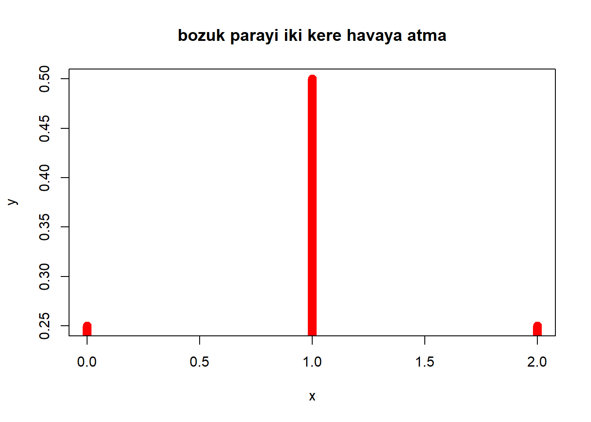
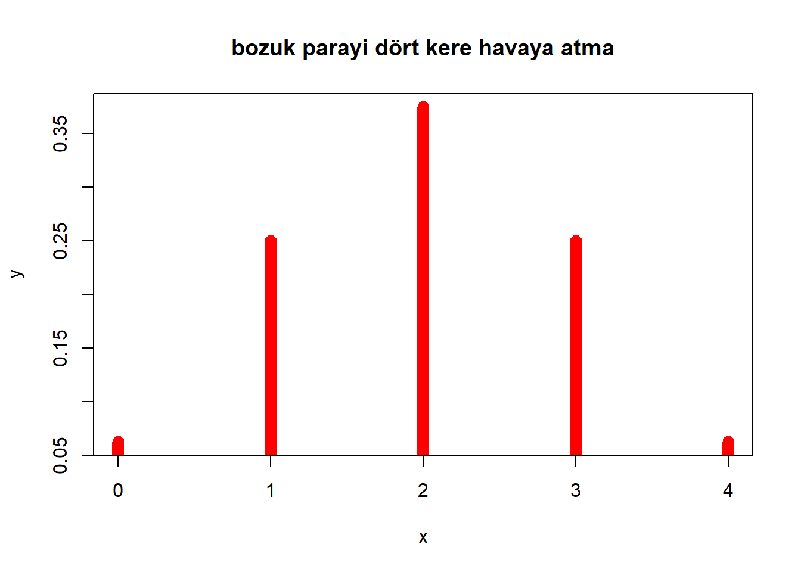

# Veri Üretimi


İstatistiğin en önemli konularından birisi **olasılık dağılımlarıdır.**

R’da veri üretimi yaparken çıktıların ne olduklarını bilmek yerine **çıktıların olma olasılıkları üzerinden veri üretmek** gerekebilir.

Örneğin, bir sınıftaki öğrencilerin madeni para atışında, paranın yazı ya da tura gelme olasılığı üzerine veri üretimi yapılırken,

-   yazı gelme olasılığının 0.5; tura gelme olasılığının 0.5 olduğu bu durumda **Bernoulli dağılımı** yardımıyla yüzlerce ya da binlerce para atışı için veri üretmek mümkündür.

-----

:::: {style="display: flex; justify-content: space-between; align-items: flex-start;"}

::: {style="flex: 1; margin-right: 2cm;"}

**Paranın iki kere hava atılması**

- YY (1/4)


- TT (1/4)

- TY (2/4)

```r
x <- 0:2
y <- dbinom(x,size=2,p=0.5)
y
```

```
## [1] 0.25 0.50 0.25
```

:::

::: {}
   


```r
plot(x, y ,type="h",col="red", lwd=10,
main="bozuk parayi iki kere havaya atma")
```


:::

::::


-----

:::: {style="display: flex; justify-content: space-between; align-items: flex-start;"}

::: {style="flex: 1; margin-right: 2cm;"}

**Paranın dört kere hava atılması**

  - YYYY (1/16) 
  
  - TTTT  (1/16) 
  
  - YTTT (4/16) 
  
  - TYYY (4/16)
  
  - YYTT (6/16)
  

```r
x <- 0:4
y <- dbinom(x,size=4,p=0.5)
y
```

```
## [1] 0.0625 0.2500 0.3750 0.2500 0.0625
```

:::
::: {}
   

```r
plot(x, y ,type="h",col="red", lwd=10,
main="bozuk parayi dört kere havaya atma")
```


:::

::::


-----


**Paranın otuz kere hava atılması**

:::: {style="display: flex; justify-content: space-between; align-items: flex-start;"}

::: {style="flex: 1 auto; margin-right: 1cm;"}

```r
x <- 0:30
y <- dbinom(x,size=30,p=0.5)
y
```

```
##  [1] 9.31e-10 2.79e-08 4.05e-07 3.78e-06 2.55e-05 1.33e-04 5.53e-04 1.90e-03
##  [9] 5.45e-03 1.33e-02 2.80e-02 5.09e-02 8.06e-02 1.12e-01 1.35e-01 1.44e-01
## [17] 1.35e-01 1.12e-01 8.06e-02 5.09e-02 2.80e-02 1.33e-02 5.45e-03 1.90e-03
## [25] 5.53e-04 1.33e-04 2.55e-05 3.78e-06 4.05e-07 2.79e-08 9.31e-10
```

:::

::: {style="flex: 1 auto;"}
   

```r
plot(x, y ,type="h",col="red", lwd=10,
main="bozuk parayi otuz kere havaya atma")
```


::::

::::


## Dağılımlar

Normal, log-normal, ki-kare, binom, poisson, uniform, gamma, beta vb. gibi farklı dağılımlar mevcuttur. 


  -	**p**, olasılık (probability) kümülatif dağılım fonksiyonuna ilişkin bilgileri 


  -	**q**, çeyreklik (quantile) kümülatif dağılım fonksiyonunun tersine ilişkin bilgileri 


  -	**d**, yoğunluk (density) yoğunluk fonksiyonuna ilişkin bilgileri 


  -	**r**, rastgele (random) belirlenen dağılımdaki rastgele veriyi 


Normal dağılama uygun veri üretmek için **rnorm()**


-----

:::: {style="display: flex; justify-content: space-between;"}

::: {style="flex: 1; margin-right: 2cm;"}

```r
n=50
nd1 <- rnorm(n=n, mean=50, sd=10)
mean(nd1)
sd(nd1)
```

```
## [1] 48.5
## [1] 10.8
```
:::

::: {style="flex: 1;"}

```r
hist(nd1)
```


:::

::::


-------------------


- Tek biçimli (uniform) dağılıma ilişkin bir veri üretmek için **runif()**


:::: {style="display: flex; justify-content: space-between;"}

::: {style="flex: 0.5; margin-right: 1cm;"}

```r
nd2 <- runif(n=n, min=50, max=150)
min(nd2)
sd(nd2)
```

```
## [1] 58
## [1] 27.8
```
:::

::: {style="flex: 2;"}

```r
hist(nd2)
```


:::

::::

## İterasyon

Veri üretimlerinde tek bir örneklemin elde edilmesi **güvenilir olmayabilir.**

Örneğin, **ortalaması 100**, **standart sapması 20** olan normal dağılıma ilişkin veri üretildiğinde, elde edilen ortalama değer bir örneklem için **örnekleme hatasından** dolayı**100 değerinden göreceli olarak farklı** çıkabilir. 


```r
set.seed(41)
x <- rnorm(2, mean=100, sd=20)
mean(x)
```

```
## [1] 94
```

veri üretme çalışmalarında **tekrarlamaların yapılması önemlidir.**

İterasyon, veri üretiminin fonksiyonlar ve döngüler kullanılarak genişletilmesi ve **genellenebilir sonuçlar** elde edilmesi olarak tanımlanabilir. 


```r
n_k <- 10                 # Küçük örneklem
n_b <- 50                 # Büyük örneklem

tekrar <- 10000              # Tekrar sayısı
kucuk_orn <- numeric(tekrar) # Küçük örneklem ort.
buyuk_orn <- numeric(tekrar) # Büyük örneklem ort.

orneklem.normal <- rnorm(n = 1000, mean = 35, sd = 15)#Sekil

for (i in 1:tekrar) {
  kucuk_orn[i] <- mean(rnorm(n = n_k,mean =  35, sd = 15)  ) 
  buyuk_orn[i] <- mean(rnorm(n = n_b,mean =  35, sd = 15)  ) 
}
```


```r
par(mfrow = c(3,1))
hist(orneklem.normal, breaks = 50, 
main = "Dağılımı", xlab = "",col = "steelblue")
hist(kucuk_orn, breaks = 50,
main = "Küçük Örneklemlerin \n Ortalama Dağılımı", 
xlab = "Ortalama",col = "steelblue")
hist(buyuk_orn, breaks = 50,
main = "Büyük Örneklemlerin \n Ortalama Dağılımı", 
xlab = "Ortalama",col = "steelblue")
```


## İterasyonların Kaydedilmesi

Özellikle büyük verilerle çalışırken, **iterasyonlar uzun zamanlar alabilir. **

Her seferinde **iterasyonların tekrarlanması** yerine iterasyon sonuçlarının **kaydedilip** yeniden okutularak analizlere devam edilmesi gerekebilir.

**kucuk_orn** ve **buyuk_orn** veri setlerini **iki ayrı klasöre yazdırnız.**


```r
dir.create("Simulasyon_k")
dir.create("Simulasyon_b")

for (i in 1:5) {
  write.table(rnorm(n = n_k,mean =  35, sd = 15),
file=paste("Simulasyon_k/simulasyon_",i,".txt", sep=""))
   
  write.table(rnorm(n = n_b,mean =  35, sd = 15),
file=paste("Simulasyon_b/simulasyon_",i,".txt", sep=""))
}
```


Daha önce oluşturduğunuz **kucuk_orn** ve **buyuk_orn** veri setlerini iki ayrı klasörden okutup R nesnesi olarak yazdırınız.


```r
kucuk_orn <- list()
buyuk_orn <- list()
for(i in 1:5){
kucuk_orn[[i]] <-  
read.table(file=paste("Simulasyon_k/simulasyon_",i,".txt",
sep=""))
buyuk_orn[[i]] <-
read.table(file=paste("Simulasyon_b/simulasyon_",i,".txt",
sep=""))
}
```

## Psikometri Alanında Veri Üretimi

Ölçme ve değerlendirme alanında gerçekleştirilen bazı çalışmalarda, çalışmanın amacı doğrultusunda, veri setlerinin üretilmesi gerekebilir. 

Bu çalışmalarda veri setleri çoğunlukla **Monte Carlo (MC) teknikleri** kullanılarak üretilir. 

**MC** yaklaşımında **matematiksel bir model** kullanılarak bilgisayar yazılımı aracılığıyla **rastgele örneklemler elde edilebilir. **


**MC** çalışmaları ile parametre değerlerini belirlemek, çalışmada **bazı faktörleri (madde sayısı gibi) sabit tutup** **bazı faktörleri (örneklem büyüklüğü gibi) manipüle ederek** değişkenlerin etkilerini incelemek mümkündür. 

Böylece belli özellikleri önceden bilinen veri setleri, ele alınan koşullar altında, **yöntemlerin veya modellerin değerlendirilmesine** ve karşılatırılmasına olanak sağlar. 

Ancak sonuçların kullanışlılığı için MC çalışmalarında modellenen koşulların **gerçek uygulamalara** ne kadar yakın olduğuna, replikasyon sayısına, vb. dikkat edilmesi gerekir (Harwell & Others, 1996). 


  - Revelle (2019) tarafından üretilen **psych** ile YEM, MTK, ve KTK ya uygun veriler üretilebilir.

  - Partchev (2017) tarafından yazılan **irtoys** paketinde bulunan  1, 2 ve 3 parametreli lojistik modele uygun veriler üretilebilir. 
  
  - Chalmers (2019) tarafından hazırlanan **mirt** paketiyle  hem tamamlayıcı hem de tamamlayıcı olmayan ÇBMTK verisi üretilebilir.

- ** ...**


## R Paketleri ile Veri Üretimi 

- hangi model?
  
- kaç madde?
  
- madde ve yetenek parametreleri ne olacak?

**Aşama 1** **3PL** modele dayali **8 maddelik** veri veri üretilmesi
İlk aşama madde parametrelerinin belirlenmesi


:::: {style="display: flex; justify-content: space-between;"}

::: {style="flex: 1; margin-right: 1cm;"}

```r
set.seed(41)
madde <- 8
maddepar <- cbind(
rnorm(madde, mean = 0, sd = 0.75)*1.702,    #a
rnorm(madde, mean = 0.30, sd = 0.51)*1.702, #b
rnorm(madde, mean = 0.16, sd = 0.05))       #c 
```
:::

::: {style="flex: 1;"}

```r
maddepar
```

```
##        [,1]      [,2]  [,3]
## [1,] -1.014  1.379159 0.193
## [2,]  0.252  2.409834 0.204
## [3,]  1.279 -0.539118 0.170
## [4,]  1.645  0.000801 0.274
## [5,]  1.156  1.427334 0.115
## [6,]  0.630  0.235798 0.267
## [7,]  0.765  0.463257 0.102
## [8,] -2.016  0.796831 0.158
```
:::

::::

**Aşama 2**
İkinci aşama yetenek parametrelerinin belirlenmesi

1000 kişilik normal dağılıma dayalı veri üretimi


```r
set.seed(41)
birey <- 1000
yetenek <- rnorm(birey, mean = 0, sd = 1)
yetenek[1:10]
```

```
##  [1] -0.794  0.197  1.002  1.289  0.906  0.494  0.599 -1.580  1.001  2.188
```
**Aşama 3** **irtoys** paketi **sim** fonksiyonu ile veri üretilmesi


```r
veri <- irtoys::sim(ip = maddepar, x = yetenek)
  colnames(veri) <- paste0("madde", 1:madde)
  head(veri)
```

```
##      madde1 madde2 madde3 madde4 madde5 madde6 madde7 madde8
## [1,]      0      1      1      0      0      0      1      1
## [2,]      1      0      1      1      0      1      0      0
## [3,]      1      1      1      1      0      1      0      1
## [4,]      1      1      0      1      0      1      1      0
## [5,]      1      1      0      1      0      1      1      1
## [6,]      1      0      1      1      0      1      0      0
```


**irtoys** paketi **sim** fonksiyonu ile veri üretilmesi


```r
library(irtoys)
ip = maddepar
x = yetenek
sim
```

```
## function (ip, x = NULL) 
## {
##     if (is.list(ip)) 
##         ip = ip$est
##     i = irf(ip = ip, x = x)
##     d = dim(i$f)
##     u = runif(d[1] * d[2])
##     dim(u) = d
##     return(ifelse(i$f > u, 1, 0))
## }
## <bytecode: 0x000002e15ea55f50>
## <environment: namespace:irtoys>
```


**Aşama 4**

Üretilen verinin parametrelerinin kestirimi


```r
library(mirt)
model3PL <- mirt(veri, # cevap matrisi
                 1,  # tek boyutlu model
                 itemtype = "3PL", # 3PL
                 verbose = FALSE, 
                 technical = list(NCYCLES = 1000,
                 message = FALSE))

mirt::coef(model3PL, IRTpars = TRUE, simplify = TRUE)$items
```

```
##             a      b       g u
## madde1 -1.096  1.541 0.00484 1
## madde2  0.308  2.155 0.21580 1
## madde3  1.093 -0.932 0.02929 1
## madde4  1.353  0.071 0.24129 1
## madde5  0.975  1.547 0.08119 1
## madde6  1.007  1.079 0.47165 1
## madde7  0.697  0.711 0.08023 1
## madde8 -1.890  0.970 0.00211 1
```

-------------------

- Veri üretimini tekrarlamak  için fonksiyon yazmamız lazım.

- **Fonksiyon1**

  - madde sayısı ve birey sayısına bağlı olarak 
  
    - madde parametresi üretsin
    
    - yetenek parametresi üretsin
    
    - madde cevapları üretsin
    
    - çıktıda madde
    parametrelerini, yetenek parametrelerini
       ve cevap matrisini tutsun


```r
veri_uretimi <- function(madde, birey ){
  .....
}
```


```r
veri_uretimi <- function(maddesay, bireysay, seed) {
  # seed ayaralanır
  set.seed(seed)
  # madde parametreleri üretilir.
  maddepar <- cbind(
    rnorm(maddesay, mean = 1.13, sd = 0.25)*1.702, #a
    rnorm(maddesay, mean = 0.21, sd = 0.51)*1.702, #b
    rnorm(maddesay, mean = 0.16, sd = 0.05)) #c
  # yetenek parametreleri üretilir
  yetenek <- rnorm(bireysay, mean = 0, sd = 1)
  # 3PL modele göre veri uretimi
  cevaplar <- irtoys::sim(ip = maddepar, x = yetenek)
  colnames(cevaplar) <- paste0("madde", 1:maddesay)
  # Parametrelerin ve ciktinin nesnede toplanması
  veri <- list(maddepar = maddepar,
               yetenek = yetenek,
               seed = seed,
               cevaplar = cevaplar)
  # Cikti
  return(veri)
}
```


```r
veri_1 <- veri_uretimi(madde = 8, birey = 1000, seed = 666)
head(veri_1$yetenek)
```

```
## [1]  0.0306 -1.4823 -1.1266 -1.7638 -1.0626 -1.3430
```


```r
head(veri_1$maddepar,3)
```

```
##      [,1]   [,2]  [,3]
## [1,] 2.24 -1.198 0.203
## [2,] 2.78  0.321 0.177
## [3,] 1.77  2.224 0.131
```


```r
head(veri_1$cevaplar,3)
```

```
##      madde1 madde2 madde3 madde4 madde5 madde6 madde7 madde8
## [1,]      1      1      0      1      1      1      0      0
## [2,]      0      0      0      0      1      0      1      0
## [3,]      1      0      0      1      0      1      0      1
```

## Paramtere kestirimi

**Fonksiyon2**

**veri_uretimi** fonksiyonu ile üretilen veri girdi olsun

hangi modele göre kestirim yapacağı argüman olsun. (2PL ya da 3PL )

çıktı olarak kestirilen parametre matrisi verilsin


```r
kestirilen_par <- function(veri, par=3){
  
  ....
}
```


```r
kestirilen_par <- function(veri, par=3){

  if(par==3){
    model <- mirt::mirt(veri, # cevap matrisi
                         1,  # tek boyutlu model
                         itemtype = "3PL", # 3PL
                         verbose = FALSE, 
                         technical = list(NCYCLES = 1000,
                                          message = FALSE))
  }else {
        model <- mirt::mirt(veri, # cevap matrisi
                         1,  # tek boyutlu model
                         itemtype = "2PL", # 2pl
                         verbose = FALSE, 
                         technical = list(NCYCLES = 1000,
                                          message = FALSE))
  }
# Madde parametreleri
kestirim <- as.data.frame(mirt::coef(model, IRTpars = TRUE, 
simplify = TRUE)$item[,1:3])
kestirim
}

kestirim <- kestirilen_par(veri_1$cevaplar)
```


```r
head(kestirim)
```

<div class="kable-table">

|       |    a|      b|     g|
|:------|----:|------:|-----:|
|madde1 | 2.21| -1.379| 0.001|
|madde2 | 5.47|  0.408| 0.203|
|madde3 | 1.05|  2.800| 0.086|
|madde4 | 7.20| -0.735| 0.439|
|madde5 | 1.47|  1.147| 0.224|
|madde6 | 2.18| -1.272| 0.001|

</div>

## Kestirilen Değerler ve Gerçek Değerler

**RMSE** her bir madde için her bir replikasyonda kestirilen parametre değeri ile gerçek parametre değeri arasındaki farkın karesinin ortalamasının kareköküdür 


$$RMSE(\tau) = \sqrt\frac{\sum_{r}^{R} (\hat{\tau}- \tau)^2}{R})$$


**BIAS**  kestirime ilişkin sistematik hatayı ifade eden yanlılık her bir madde için her bir replikasyonda kestirilen parametre değerinin ortalaması ile gerçek parametre değeri arasındaki farktır ve aşağıdaki formül ile hesaplanır: 

$$BIAS(\tau) = \frac{\sum_{r}^{R}\hat{\tau}}{R} - \tau$$


**SE**  kestirime ilişkin rastgele hatayı ifade eden standart hata her bir madde için her bir replikasyonda kestirilen parametre değeri ile ortalama parametre kestirimi arasındaki farkın karesinin ortalamasının kareköküdür. Diğer bir ifadeyle replikasyonlarda kestirilen parametre değerlerinin standart sapmasıdır ve aşağıdaki formül ile hesaplanır: 

$$SE(\tau) = \sqrt\frac{\sum_{r}^{R} (\hat{\tau}- \overline{\hat{\tau}})^2}{R})$$

Yanlılığın karesi ile standart hatanın karesinin toplamı RMSE’nin karesinin toplamına eşittir. RMSE, yanlılık ve standart hata arasındaki ilişki aşağıdaki eşitlik ile gösterilebilir: 

$$RMSE^2= Bias^2 +SE^2$$


```r
hata <- function(kestirim, gercek) {
  
}
```


```r
kestirim =  kestirim
gercek = veri_1$maddepa
hata <- function(kestirim, gercek) {
result <- data.frame(parametreler = c("a", "b", "c"),

bias = sapply(1L:3L, function(i) mean((kestirim[, i] - gercek[,i]))),

rmse = sapply(1L:3L, function(i) sqrt(mean((kestirim[, i] - gercek[,i])^2))),

korelasyon = sapply(1L:3L, function(i) cor(kestirim[, i], gercek[,i])))

return(result)
}
```

```r
hata(kestirim,veri_1$maddepar)
```

<div class="kable-table">

|parametreler |   bias|  rmse| korelasyon|
|:------------|------:|-----:|----------:|
|a            |  0.795| 1.861|      0.814|
|b            |  0.086| 0.309|      0.978|
|c            | -0.015| 0.133|      0.451|

</div>


## R Paketleri ile Veri Üretimi 

Fonksiyon yazarken nelere dikkat etmeliyiz?


```r
temp2 <- veri_uretimi(maddesay = 10, bireysay = 1000)
```

```
## Error in veri_uretimi(maddesay = 10, bireysay = 1000): argument "seed" is missing, with no default
```


```r
veri_uretimi <- function(maddesay, bireysay, seed = NULL){
  if(!is.null(seed)) {
    set.seed(seed)}
  else {
    seed <- sample.int(10000, 1)
    set.seed(seed)
    cat("atanan seed = ", seed, "\n")
  }
# madde parametreleri üretilir.
  print("Madde parametresi uretme")
  
maddepar <- cbind(
  rnorm(maddesay, mean = 1.13, sd = 0.25)*1.702, #a
  rnorm(maddesay, mean = 0.21, sd = 0.51)*1.702, #b
  rnorm(maddesay, mean = 0.16, sd = 0.05)) #c

# yetenek parametreleri üretilir
yetenek <- rnorm(bireysay, mean = 0, sd = 1)
# 3PL modele göre veri uretimi
print("Üretilen veri")
cevaplar <- irtoys::sim(ip = maddepar, x = yetenek)
colnames(cevaplar) <- paste0("madde", 1:maddesay)
# Parametrelerin ve ciktinin nesnede toplanması
print("Cıktıların birleştirilmesi")
veri <- list(maddepar = maddepar,
             yetenek = yetenek,
             seed = seed,
             cevaplar = cevaplar)
# Cikti
return(veri)
}

 temp2 <- veri_uretimi(maddesay = 10, bireysay = 1000)
```

```
## atanan seed =  5593 
## [1] "Madde parametresi uretme"
## [1] "Üretilen veri"
## [1] "Cıktıların birleştirilmesi"
```


## Veri Üretiminde Tekrar

Tekrar etmek amacıyla **döngülerden** ya da **apply** fonksiyonlarından yararlanalılabilir.


```r
replicate(tekrar sayisi, fonksiyon)
```

`replicate` fonksiyonu kullanıldığında oluşan çıktı liste biçiminde olacaktır.

```r
tekrarsayisi=5L
x <- replicate(tekrarsayisi, veri_uretimi(maddesay = 10, bireysay = 1000))
```

```
## atanan seed =  7116 
## [1] "Madde parametresi uretme"
## [1] "Üretilen veri"
## [1] "Cıktıların birleştirilmesi"
## atanan seed =  727 
## [1] "Madde parametresi uretme"
## [1] "Üretilen veri"
## [1] "Cıktıların birleştirilmesi"
## atanan seed =  6970 
## [1] "Madde parametresi uretme"
## [1] "Üretilen veri"
## [1] "Cıktıların birleştirilmesi"
## atanan seed =  4875 
## [1] "Madde parametresi uretme"
## [1] "Üretilen veri"
## [1] "Cıktıların birleştirilmesi"
## atanan seed =  789 
## [1] "Madde parametresi uretme"
## [1] "Üretilen veri"
## [1] "Cıktıların birleştirilmesi"
```


Oluşan nesnenin sadece maddepar bileşenin almak için
çıktıların liste biçimindedir


```r
lapply(1L:tekrarsayisi, function(i) x[,i][1])
```

```
## [[1]]
## [[1]]$maddepar
##       [,1]   [,2]   [,3]
##  [1,] 2.63 -0.570 0.0752
##  [2,] 1.53  0.065 0.1859
##  [3,] 1.27  1.798 0.0994
##  [4,] 1.93  2.325 0.1950
##  [5,] 2.36  0.461 0.1757
##  [6,] 1.81  0.827 0.1840
##  [7,] 2.26  1.668 0.1773
##  [8,] 2.21  0.170 0.1471
##  [9,] 2.46  0.392 0.1278
## [10,] 2.23  0.370 0.1622
## 
## 
## [[2]]
## [[2]]$maddepar
##       [,1]   [,2]   [,3]
##  [1,] 2.45  0.946 0.2168
##  [2,] 1.92 -0.918 0.1914
##  [3,] 1.81  1.793 0.1693
##  [4,] 2.44 -0.037 0.1583
##  [5,] 2.21  0.938 0.1930
##  [6,] 1.77  0.582 0.1354
##  [7,] 2.70  0.729 0.1620
##  [8,] 2.20  0.657 0.1847
##  [9,] 1.37 -0.646 0.0643
## [10,] 2.32  0.275 0.2355
## 
## 
## [[3]]
## [[3]]$maddepar
##        [,1]    [,2]   [,3]
##  [1,] 0.953 -0.9018 0.1527
##  [2,] 1.629  1.1330 0.1238
##  [3,] 1.983  0.6882 0.2082
##  [4,] 2.341 -0.0603 0.1029
##  [5,] 1.816 -0.1821 0.0628
##  [6,] 0.877  0.2849 0.1136
##  [7,] 2.068  0.6827 0.1639
##  [8,] 2.132  1.7466 0.1687
##  [9,] 1.958  0.5841 0.1750
## [10,] 1.622 -0.8964 0.0769
## 
## 
## [[4]]
## [[4]]$maddepar
##       [,1]     [,2]   [,3]
##  [1,] 1.66  0.53978 0.2016
##  [2,] 2.06 -0.10367 0.1652
##  [3,] 1.91 -0.00871 0.1806
##  [4,] 1.73  1.60843 0.1435
##  [5,] 2.06 -0.50558 0.0348
##  [6,] 1.18 -0.59864 0.1434
##  [7,] 2.25  2.52695 0.0724
##  [8,] 2.12  2.02581 0.1501
##  [9,] 2.16  0.15750 0.1643
## [10,] 1.90  0.06026 0.2402
## 
## 
## [[5]]
## [[5]]$maddepar
##        [,1]     [,2]   [,3]
##  [1,] 2.146  0.00822 0.1249
##  [2,] 0.961 -0.51301 0.1942
##  [3,] 1.915  0.20316 0.1171
##  [4,] 2.001 -0.06609 0.1784
##  [5,] 1.770  1.16286 0.0885
##  [6,] 1.717 -0.31480 0.1344
##  [7,] 1.640  0.72448 0.1466
##  [8,] 1.849 -0.16944 0.1500
##  [9,] 1.493  0.53916 0.2028
## [10,] 2.238 -0.31732 0.1517
```


Çıktıların liste olmaması için `sapply` de kullanılabilir.


```r
sapply(1L:tekrarsayisi, function(i) x[,i][1])
```

```
## $maddepar
##       [,1]   [,2]   [,3]
##  [1,] 2.63 -0.570 0.0752
##  [2,] 1.53  0.065 0.1859
##  [3,] 1.27  1.798 0.0994
##  [4,] 1.93  2.325 0.1950
##  [5,] 2.36  0.461 0.1757
##  [6,] 1.81  0.827 0.1840
##  [7,] 2.26  1.668 0.1773
##  [8,] 2.21  0.170 0.1471
##  [9,] 2.46  0.392 0.1278
## [10,] 2.23  0.370 0.1622
## 
## $maddepar
##       [,1]   [,2]   [,3]
##  [1,] 2.45  0.946 0.2168
##  [2,] 1.92 -0.918 0.1914
##  [3,] 1.81  1.793 0.1693
##  [4,] 2.44 -0.037 0.1583
##  [5,] 2.21  0.938 0.1930
##  [6,] 1.77  0.582 0.1354
##  [7,] 2.70  0.729 0.1620
##  [8,] 2.20  0.657 0.1847
##  [9,] 1.37 -0.646 0.0643
## [10,] 2.32  0.275 0.2355
## 
## $maddepar
##        [,1]    [,2]   [,3]
##  [1,] 0.953 -0.9018 0.1527
##  [2,] 1.629  1.1330 0.1238
##  [3,] 1.983  0.6882 0.2082
##  [4,] 2.341 -0.0603 0.1029
##  [5,] 1.816 -0.1821 0.0628
##  [6,] 0.877  0.2849 0.1136
##  [7,] 2.068  0.6827 0.1639
##  [8,] 2.132  1.7466 0.1687
##  [9,] 1.958  0.5841 0.1750
## [10,] 1.622 -0.8964 0.0769
## 
## $maddepar
##       [,1]     [,2]   [,3]
##  [1,] 1.66  0.53978 0.2016
##  [2,] 2.06 -0.10367 0.1652
##  [3,] 1.91 -0.00871 0.1806
##  [4,] 1.73  1.60843 0.1435
##  [5,] 2.06 -0.50558 0.0348
##  [6,] 1.18 -0.59864 0.1434
##  [7,] 2.25  2.52695 0.0724
##  [8,] 2.12  2.02581 0.1501
##  [9,] 2.16  0.15750 0.1643
## [10,] 1.90  0.06026 0.2402
## 
## $maddepar
##        [,1]     [,2]   [,3]
##  [1,] 2.146  0.00822 0.1249
##  [2,] 0.961 -0.51301 0.1942
##  [3,] 1.915  0.20316 0.1171
##  [4,] 2.001 -0.06609 0.1784
##  [5,] 1.770  1.16286 0.0885
##  [6,] 1.717 -0.31480 0.1344
##  [7,] 1.640  0.72448 0.1466
##  [8,] 1.849 -0.16944 0.1500
##  [9,] 1.493  0.53916 0.2028
## [10,] 2.238 -0.31732 0.1517
```


## doParallel


```r
tekrar = 4 
seed = sample.int(10000, 100)
maddesay = 10 # 10, 15, 20, or 25
bireysay = 1000 # 250, 500, 750, or 1000
```


```r
library(doParallel)
detectCores()
cl <- makeCluster(4) # en fazla n-2 
registerDoParallel(cl)
# burada kod
stopCluster(cl)
```


### foreach

Döngüler yavas olabilir, apply ailesi çıktıları kullanışlı olmayabilir.


```r
library(doParallel)
```

```
## Loading required package: foreach
```

```
## 
## Attaching package: 'foreach'
```

```
## The following objects are masked from 'package:purrr':
## 
##     accumulate, when
```

```
## Loading required package: iterators
```

```
## Loading required package: parallel
```

```r
foreach(i=1:4) %do% sqrt(i)
```

```
## [[1]]
## [1] 1
## 
## [[2]]
## [1] 1.41
## 
## [[3]]
## [1] 1.73
## 
## [[4]]
## [1] 2
```


```r
#coklu arguman
foreach(i=1:4, j=1:4) %do%
	sqrt(i+j)
```

```
## [[1]]
## [1] 1.41
## 
## [[2]]
## [1] 2
## 
## [[3]]
## [1] 2.45
## 
## [[4]]
## [1] 2.83
```


:::: {style="display: flex; justify-content: space-between;"}

::: {style="flex: 1; margin-right: 2cm;"}

```r
for(i in 1:5) {
    sum(rnorm(1e6))
} 
```
:::

::: {style="flex: 1;"}

```r
library(doParallel)
cl <- makeCluster(4) # en fazla n-2 
registerDoParallel(cl)
 foreach(i=1:5) %dopar% {
    sum(rnorm(1e6))
 }   
stopCluster(cl) # cekirdek atama işini bitirir.
```

```
## [[1]]
## [1] 2527
## 
## [[2]]
## [1] -1073
## 
## [[3]]
## [1] 850
## 
## [[4]]
## [1] -366
## 
## [[5]]
## [1] 684
```
:::

::::


```r
cl <- makeCluster(4) 
registerDoParallel(cl)

tekrar = 4 
seed = sample.int(10000, 100)
maddesay = 10 # 10, 15, 20, or 25
bireysay = 1000 # 250, 500, 750, or 1000

simulasyon <- foreach(i=1:4,
             .packages = c("mirt", "doParallel"),
             .combine = rbind) %dopar% {
             # Adım 1 madde parametrelerini ve veri setini üretme
             adim1 <- veri_uretimi(maddesay =maddesay, 
                      bireysay =bireysay, seed=seed[i])
             # Adım 2 üretilen veri seti üzerinden ketsirim yapma
             adim2 <- kestirilen_par(adim1$cevaplar)
             # adim 3 raporlama
             hata(adim2, adim1$maddepar)
            }
```


Cikti düzenleme

```r
simulasyon
```

<div class="kable-table">

|parametreler |   bias|  rmse| korelasyon|
|:------------|------:|-----:|----------:|
|a            |  0.199| 0.590|      0.629|
|b            | -0.132| 0.217|      0.988|
|c            | -0.041| 0.087|      0.195|
|a            | -0.127| 0.523|      0.555|
|b            |  0.012| 0.174|      0.979|
|c            | -0.019| 0.068|      0.819|
|a            |  0.228| 0.590|      0.901|
|b            | -0.018| 0.191|      0.985|
|c            |  0.000| 0.110|      0.253|
|a            |  0.471| 1.424|      0.091|
|b            |  0.037| 0.260|      0.960|
|c            |  0.018| 0.114|      0.769|

</div>


--------------------------------


```r
library(tidyverse)
simulasyon_v1 <- simulasyon %>%
  group_by(parametreler) %>%
  summarise(bias = round(mean(bias),3),
            rmse = round(mean(rmse),3),
            korelasyon = round(mean(korelasyon),3)) %>%
  mutate(maddesay = maddesay,
         bireysay = bireysay) %>%
  as.data.frame()
```


```r
simulasyon_v1
```

<div class="kable-table">

|parametreler |   bias|  rmse| korelasyon| maddesay| bireysay|
|:------------|------:|-----:|----------:|--------:|--------:|
|a            |  0.192| 0.782|      0.544|       10|     1000|
|b            | -0.025| 0.210|      0.978|       10|     1000|
|c            | -0.011| 0.095|      0.509|       10|     1000|

</div>


```r
tekrar = 1;seed = sample.int(10000, 100)
maddesay = c(10, 20 ,40)
bireysay = c(250, 500, 1000)

# kumeler 
cl <- makeCluster(6);registerDoParallel(cl)

# İc ice foreachler
sonuc <- foreach(i=1:tekrar, 
                      .packages = c("mirt", "doParallel", "dplyr"),
                      .combine = rbind) %:%
  foreach(j=maddesay, 
          .packages = c("mirt", "doParallel", "dplyr"),
          .combine = rbind)  %:%
  foreach(k=bireysay, 
          .packages = c("mirt", "doParallel", "dplyr"),
          .combine = rbind)    %dopar% {
            adim1 <- veri_uretimi(maddesay=j, bireysay=k, seed=seed[i])
            adim2 <- kestirilen_par(adim1$cevaplar)
            adim3 <- hata(adim2, adim1$maddepar)
            adim3 %>%
              group_by(parametreler) %>%
              summarise(bias = round(mean(bias),3),
                        rmse = round(mean(rmse),3),
                        korelasyon = round(mean(korelasyon),3)) %>%
              mutate(maddesay = j, bireysay = k,
              ) %>%              as.data.frame()
          }

stopCluster(cl)
```

-----------------------------------------------


```r
 write.table(adim3, "results.csv", 
                        sep = ",", 
                        col.names = FALSE, 
                        row.names = FALSE, 
                        append = TRUE) # sonuçların eklenmesi için dosyayı 
                                         # açık tutacaktır
```

-----------------------------------------


```r
iterations = 4; seed = sample.int(10000, 100)
maddesay = 10 ;bireysay = 1000 #250, 500, 750, or 1000
library("doSNOW")
cl <- makeCluster(4);registerDoSNOW(cl)

pb <- txtProgressBar(max = iterations, style = 3) # Progres bar
progress <- function(n) {setTxtProgressBar(pb, n)}
opts <- list(progress = progress)
sonuc <- foreach(i=1:iterations,
                      .packages = c("mirt", "doSNOW"),
                      .options.snow = opts, #
                      .combine = rbind) %dopar% {
                        # Generate item parameters and data
                        adim1 <- veri_uretimi(maddesay  , bireysay, seed=seed[i])
                        # Estimate item parameters
                        adim2 <- kestirilen_par(adim1$cevaplar)
                        # Summarize results
                        hata(adim2, adim1$maddepar)
                      }
close(pb) # kapat progress bar
stopCluster(cl)
```

```
## 
  |                                                                            
  |                                                                      |   0%
  |                                                                            
  |==================                                                    |  25%
  |                                                                            
  |===================================                                   |  50%
  |                                                                            
  |====================================================                  |  75%
  |                                                                            
  |======================================================================| 100%
```
