```r
  library("rmarkdown")
```

```
## Warning: package 'rmarkdown' was built under R version 4.3.3
```

```r
  library("fontawesome")
  library("kableExtra")
```

```
## 
## Attaching package: 'kableExtra'
```

```
## The following object is masked from 'package:dplyr':
## 
##     group_rows
```

```r
  library("emo")
  
  # Required packages
  library("dplyr")
  library("car")
```

```
## Loading required package: carData
```

```
## 
## Attaching package: 'car'
```

```
## The following object is masked from 'package:dplyr':
## 
##     recode
```

```
## The following object is masked from 'package:purrr':
## 
##     some
```

```r
  library("skimr")
```

```
## Warning: package 'skimr' was built under R version 4.3.3
```

```r
  library("DataExplorer")
```

```
## Warning: package 'DataExplorer' was built under R version 4.3.3
```

```r
  library("ggcorrplot")
  library("psych")
```

```
## Warning: package 'psych' was built under R version 4.3.3
```

```
## 
## Attaching package: 'psych'
```

```
## The following object is masked from 'package:car':
## 
##     logit
```

```
## The following object is masked from 'package:fontawesome':
## 
##     fa
```

```
## The following objects are masked from 'package:ggplot2':
## 
##     %+%, alpha
```

```r
  library("CTT")
```

```
## 
## Attaching package: 'CTT'
```

```
## The following objects are masked from 'package:psych':
## 
##     polyserial, reliability
```

```r
  library("ShinyItemAnalysis")
```

```
## Warning: package 'ShinyItemAnalysis' was built under R version 4.3.3
```

```
## This is ShinyItemAnalysis version 1.5.0
## - to run the interactive {shiny} app, call `run_app()`
## - to learn more, visit `ShinyItemAnalysis.org`
```

```r
  library("QME")
  library("difR")
```

```
## Warning: package 'difR' was built under R version 4.3.3
```

```r
  library("rmarkdown")
```

# Klasik Test Teorisi

NFC Ölçeğine ait verileri Klasik Test Teorisine (CTT) dayalı çeşitli
psikometrik analizler yapmak ve bu aracın güvenilirlik ve geçerliliğinin
nasıl değerlendirileceğini göstermek için kullanacağız. Örnek verilerin
yer aldığı çalışma: “ ” ( ), NFC ile diğer gizli özellikler (örneğin,
özkontrol) arasındaki ilişkiye odaklanmıştır.

## Düşünme İhtiyacı Ölçeği

NFC’nin gizil özelliğini ölçmek için Cacioppo ve Petty geliştirmiştir. (
). NFC (need for Cognition) bilişsel olarak zorlayıcı görevlere ve çaba
gerektiren düşünmeye katılma arzusu olarak tanımlanan psikolojik bir
gizli özelliktir ( ). Yüksek düzeyde NFC’ye sahip bireyler bilgiyi
arama, edinme, üzerinde düşünme ve yansıtma eğilimindeyken, düşük
düzeyde NFC’ye sahip bireyler dünya hakkında ayrıntılı bilgiden kaçınma
ve bilişsel olarak karmaşık görevleri stresli bulma eğilimindedir ( ; ).


```r
nfc_items %>%
  kbl() %>%
  kable_styling(bootstrap_options = c("striped", "hover"), font_size = 16) %>%
  footnote(general = "Items marked with (R) were presented in an inverted form.",
           general_title = "Note: ",
           title_format = c("italic"),
           footnote_as_chunk = T)
```

<table class="table table-striped table-hover" style="font-size: 16px; margin-left: auto; margin-right: auto;border-bottom: 0;">
 <thead>
  <tr>
   <th style="text-align:right;"> Items </th>
   <th style="text-align:left;"> Description </th>
  </tr>
 </thead>
<tbody>
  <tr>
   <td style="text-align:right;"> 1 </td>
   <td style="text-align:left;"> Enjoyment of tasks that involve problem-solving </td>
  </tr>
  <tr>
   <td style="text-align:right;"> 2 </td>
   <td style="text-align:left;"> Preference for cognitive, difficult and important tasks </td>
  </tr>
  <tr>
   <td style="text-align:right;"> 3 </td>
   <td style="text-align:left;"> Tendency to strive for goals that require mental effort </td>
  </tr>
  <tr>
   <td style="text-align:right;"> 4 </td>
   <td style="text-align:left;"> Appeal of relying on one’s thought to be successful (R) </td>
  </tr>
  <tr>
   <td style="text-align:right;"> 5 </td>
   <td style="text-align:left;"> Satisfaction of completing important tasks that required thinking and mental effort </td>
  </tr>
  <tr>
   <td style="text-align:right;"> 6 </td>
   <td style="text-align:left;"> Preference for thinking about long-term projects (R) </td>
  </tr>
  <tr>
   <td style="text-align:right;"> 7 </td>
   <td style="text-align:left;"> Preference for cognitive challenges (R) </td>
  </tr>
  <tr>
   <td style="text-align:right;"> 8 </td>
   <td style="text-align:left;"> Satisfaction on hard and long deliberation (R) </td>
  </tr>
  <tr>
   <td style="text-align:right;"> 9 </td>
   <td style="text-align:left;"> Attitude towards thinking as something one does primarily because one has to (R) </td>
  </tr>
  <tr>
   <td style="text-align:right;"> 10 </td>
   <td style="text-align:left;"> Appeal of being responsible for handling situations that require thinking (R) </td>
  </tr>
  <tr>
   <td style="text-align:right;"> 11 </td>
   <td style="text-align:left;"> Attitude towards thinking as something that is fun (R) </td>
  </tr>
  <tr>
   <td style="text-align:right;"> 12 </td>
   <td style="text-align:left;"> Anticipation and avoiding of situations that may require in-depth thinking (R) </td>
  </tr>
  <tr>
   <td style="text-align:right;"> 13 </td>
   <td style="text-align:left;"> Preference for puzzles to be solved </td>
  </tr>
  <tr>
   <td style="text-align:right;"> 14 </td>
   <td style="text-align:left;"> Preference for complex over simple problems </td>
  </tr>
  <tr>
   <td style="text-align:right;"> 15 </td>
   <td style="text-align:left;"> Preference for understanding the reason for an answer over simply knowing the answer without any background (R) </td>
  </tr>
  <tr>
   <td style="text-align:right;"> 16 </td>
   <td style="text-align:left;"> Preference to know how something works over simply knowing that it works (R) </td>
  </tr>
</tbody>
<tfoot><tr><td style="padding: 0; " colspan="100%">
<span style="font-style: italic;">Note: </span> <sup></sup> Items marked with (R) were presented in an inverted form.</td></tr></tfoot>
</table>

Maddelere verilen yanıtlar 1 (hiç katılmıyorum) ile 7 (tamamen
katılıyorum) arasında değişen 7 puanlık bir derecelendirme ölçeğine göre
kaydedilmiştir. Ancak, NFC Ölçeğindeki toplam puanları hesaplamak için,
madde yanıtları -3 (tamamen katılmıyorum) ile +3 (tamamen katılıyorum)
olarak yeniden kodlanmalıdır. Grass et al. ( ) veri dosyalarını ve diğer
materyalleri paylaşmıştır: . Aşağıdaki analiz için, NFC Ölçeğine verilen
yanıtlar, demografik değişkenler ve Öz Denetim Ölçeği gibi ölçüt
ölçümlerinden elde edilen ek puanları içeren orijinal verilerin bir alt
kümesini kullanacağız. Bu veri seti 🔗 adresinden indirilebilir.


```r
library("dplyr") # veri düzenleme
library("car")   # veri düzenleme
library("skimr")  # veri inceleme
library("DataExplorer") # veri inceleme
library("ggcorrplot")   # veri inceleme
library("psych")  #KTK analizler
library("CTT")   #KTK analizler
library("ShinyItemAnalysis") #KTK analizler
# devtools::install_github("zief0002/QME")
library("QME") #KTK analizler
library("difR") #KTK analizler
```

## Veri İnceleme

Verileri özetlemek için genellikle hem istatistiksel hem de veri
görselleştirme araçlarını kullanırız. Daha ayrıntılı bilgi için
🔗sayfayı inceleyebilirsiniz.

## Veriyi Okuma


```r
nfc <- read.csv("import/nfc_data.csv", header = TRUE)
DT::datatable(nfc)
```

```{=html}
<div class="datatables html-widget html-fill-item" id="htmlwidget-e3850c0e14c84a9281e8" style="width:100%;height:auto;"></div>
<script type="application/json" data-for="htmlwidget-e3850c0e14c84a9281e8">{"x":{"filter":"none","vertical":false,"data":[["1","2","3","4","5","6","7","8","9","10","11","12","13","14","15","16","17","18","19","20","21","22","23","24","25","26","27","28","29","30","31","32","33","34","35","36","37","38","39","40","41","42","43","44","45","46","47","48","49","50","51","52","53","54","55","56","57","58","59","60","61","62","63","64","65","66","67","68","69","70","71","72","73","74","75","76","77","78","79","80","81","82","83","84","85","86","87","88","89","90","91","92","93","94","95","96","97","98","99","100","101","102","103","104","105","106","107","108","109","110","111","112","113","114","115","116","117","118","119","120","121","122","123","124","125","126","127","128","129","130","131","132","133","134","135","136","137","138","139","140","141","142","143","144","145","146","147","148","149","150","151","152","153","154","155","156","157","158","159","160","161","162","163","164","165","166","167","168","169","170","171","172","173","174","175","176","177","178","179","180","181","182","183","184","185","186","187","188","189","190","191","192","193","194","195","196","197","198","199","200","201","202","203","204","205","206","207","208","209","210","211","212","213","214","215","216","217","218","219","220","221","222","223","224","225","226","227","228","229","230","231","232","233","234","235","236","237","238","239","240","241","242","243","244","245","246","247","248","249","250","251","252","253","254","255","256","257","258","259","260","261","262","263","264","265","266","267","268","269","270","271","272","273","274","275","276","277","278","279","280","281","282","283","284","285","286","287","288","289","290","291","292","293","294","295","296","297","298","299","300","301","302","303","304","305","306","307","308","309","310","311","312","313","314","315","316","317","318","319","320","321","322","323","324","325","326","327","328","329","330","331","332","333","334","335","336","337","338","339","340","341","342","343","344","345","346","347","348","349","350","351","352","353","354","355","356","357","358","359","360","361","362","363","364","365","366","367","368","369","370","371","372","373","374","375","376","377","378","379","380","381","382","383","384","385","386","387","388","389","390","391","392","393","394","395","396","397","398","399","400","401","402","403","404","405","406","407","408","409","410","411","412","413","414","415","416","417","418","419","420","421","422","423","424","425","426","427","428","429","430","431","432","433","434","435","436","437","438","439","440","441","442","443","444","445","446","447","448","449","450","451","452","453","454","455","456","457","458","459","460","461","462","463","464","465","466","467","468","469","470","471","472","473","474","475","476","477","478","479","480","481","482","483","484","485","486","487","488","489","490","491","492","493","494","495","496","497","498","499","500","501","502","503","504","505","506","507","508","509","510","511","512","513","514","515","516","517","518","519","520","521","522","523","524","525","526","527","528","529","530","531","532","533","534","535","536","537","538","539","540","541","542","543","544","545","546","547","548","549","550","551","552","553","554","555","556","557","558","559","560","561","562","563","564","565","566","567","568","569","570","571","572","573","574","575","576","577","578","579","580","581","582","583","584","585","586","587","588","589","590","591","592","593","594","595","596","597","598","599","600","601","602","603","604","605","606","607","608","609","610","611","612","613","614","615","616","617","618","619","620","621","622","623","624","625","626","627","628","629","630","631","632","633","634","635","636","637","638","639","640","641","642","643","644","645","646","647","648","649","650","651","652","653","654","655","656","657","658","659","660","661","662","663","664","665","666","667","668","669","670","671","672","673","674","675","676","677","678","679","680","681","682","683","684","685","686","687","688","689","690","691","692","693","694","695","696","697","698","699","700","701","702","703","704","705","706","707","708","709","710","711","712","713","714","715","716","717","718","719","720","721","722","723","724","725","726","727","728","729","730","731","732","733","734","735","736","737","738","739","740","741","742","743","744","745","746","747","748","749","750","751","752","753","754","755","756","757","758","759","760","761","762","763","764","765","766","767","768","769","770","771","772","773","774","775","776","777","778","779","780","781","782","783","784","785","786","787","788","789","790","791","792","793","794","795","796","797","798","799","800","801","802","803","804","805","806","807","808","809","810","811","812","813","814","815","816","817","818","819","820","821","822","823","824","825","826","827","828","829","830","831","832","833","834","835","836","837","838","839","840","841","842","843","844","845","846","847","848","849","850","851","852","853","854","855","856","857","858","859","860","861","862","863","864","865","866","867","868","869","870","871","872","873","874","875","876","877","878","879","880","881","882","883","884","885","886","887","888","889","890","891","892","893","894","895","896","897","898","899","900","901","902","903","904","905","906","907","908","909","910","911","912","913","914","915","916","917","918","919","920","921","922","923","924","925","926","927","928","929","930","931","932","933","934","935","936","937","938","939","940","941","942","943","944","945","946","947","948","949","950","951","952","953","954","955","956","957","958","959","960","961","962","963","964","965","966","967","968","969","970","971","972","973","974","975","976","977","978","979","980","981","982","983","984","985","986","987","988","989","990","991","992","993","994","995","996","997","998","999","1000","1001","1002","1003","1004","1005","1006","1007","1008","1009","1010","1011","1012","1013","1014","1015","1016","1017","1018","1019","1020","1021","1022","1023","1024","1025","1026","1027","1028","1029","1030","1031","1032","1033","1034","1035","1036","1037","1038","1039","1040","1041","1042","1043","1044","1045","1046","1047","1048","1049","1050","1051","1052","1053","1054","1055","1056","1057","1058","1059","1060","1061","1062","1063","1064","1065","1066","1067","1068","1069","1070","1071","1072","1073","1074","1075","1076","1077","1078","1079","1080","1081","1082","1083","1084","1085","1086","1087","1088","1089","1090","1091","1092","1093","1094","1095","1096","1097","1098","1099","1100","1101","1102","1103","1104","1105","1106","1107","1108","1109","1110","1111","1112","1113","1114","1115","1116","1117","1118","1119","1120","1121","1122","1123","1124","1125","1126","1127","1128","1129","1130","1131","1132","1133","1134","1135","1136","1137","1138","1139","1140","1141","1142","1143","1144","1145","1146","1147","1148","1149","1150","1151","1152","1153","1154","1155","1156","1157","1158","1159","1160","1161","1162","1163","1164","1165","1166","1167","1168","1169","1170","1171","1172","1173","1174","1175","1176","1177","1178","1179","1180","1181","1182","1183","1184","1185","1186","1187","1188","1189","1190","1191","1192","1193","1194","1195","1196","1197","1198","1199","1200","1201","1202","1203","1204","1205","1206","1207","1208","1209"],[1,4,7,8,11,12,15,16,21,23,24,25,27,28,29,32,33,35,36,38,40,43,44,46,49,50,51,53,55,56,58,59,60,61,64,65,67,68,69,70,71,74,76,77,78,79,80,81,85,86,88,89,90,95,96,97,99,100,101,104,105,106,107,108,109,111,112,114,115,116,118,119,120,124,125,126,128,130,131,132,133,136,137,138,139,140,142,148,150,154,155,156,157,158,159,160,161,164,165,167,170,172,174,175,176,177,178,180,182,183,184,185,186,187,188,189,191,192,193,194,195,196,198,199,200,201,202,203,204,210,211,212,213,215,218,220,221,223,224,225,226,228,229,230,231,233,234,235,236,237,239,241,244,245,247,248,251,252,254,255,256,257,258,259,262,263,264,265,266,267,268,270,271,272,273,277,278,279,280,281,282,283,284,285,286,287,289,290,291,292,293,294,296,298,300,303,305,306,308,309,310,312,313,314,316,320,322,323,324,326,327,331,332,333,337,338,342,344,345,346,347,348,349,350,352,353,354,355,360,361,362,364,365,366,368,369,371,372,375,376,377,380,382,384,385,386,387,390,391,392,393,396,397,398,399,400,401,403,404,405,407,408,409,410,411,412,413,415,416,417,418,419,421,422,424,426,427,428,429,430,432,433,435,436,437,439,440,441,444,446,447,449,450,451,452,453,454,455,458,459,461,463,464,466,467,468,470,472,473,474,475,478,481,482,484,485,486,487,488,489,490,492,493,494,495,499,500,501,502,504,505,506,507,508,509,510,511,512,513,514,515,516,517,520,521,524,525,527,528,529,531,534,535,537,538,540,541,542,543,544,545,546,547,548,549,552,553,554,555,558,560,561,563,566,567,569,570,571,572,573,574,575,576,577,578,581,582,583,584,586,587,588,589,590,591,592,593,595,596,597,598,599,600,601,602,603,606,607,608,609,610,611,612,613,616,617,618,621,622,623,624,625,626,627,628,629,630,631,634,635,639,641,642,643,644,645,646,648,649,650,651,653,654,655,656,659,661,662,663,664,665,666,667,668,671,672,673,675,677,678,679,681,683,684,685,688,691,692,693,694,696,697,698,699,700,701,702,703,704,706,707,710,711,712,714,715,716,718,719,721,724,727,728,729,730,731,734,736,737,739,740,741,742,743,744,745,746,748,750,751,752,753,754,756,757,759,760,761,762,763,767,771,772,773,775,777,779,781,782,783,785,786,787,788,792,793,795,796,801,802,803,804,805,807,808,809,811,812,813,814,818,819,821,822,824,825,826,827,828,829,832,833,834,835,836,837,839,841,842,843,844,845,847,850,851,852,853,854,855,856,857,858,859,860,861,862,863,864,865,867,869,870,872,873,875,877,878,879,880,881,882,883,885,886,888,890,891,892,895,896,897,898,899,900,901,902,903,904,905,906,908,909,911,913,914,915,916,917,918,919,921,922,925,926,927,928,929,930,931,932,933,935,936,939,942,943,944,946,948,949,950,951,952,954,956,957,958,960,961,963,965,966,967,968,970,971,973,974,977,978,979,981,982,983,984,985,989,993,994,995,996,997,998,999,1000,1002,1004,1006,1007,1009,1010,1011,1012,1013,1014,1015,1016,1018,1019,1022,1023,1025,1026,1027,1028,1029,1030,1031,1032,1035,1036,1037,1038,1039,1040,1041,1043,1044,1045,1048,1049,1050,1051,1055,1056,1057,1058,1060,1061,1062,1063,1064,1066,1067,1068,1069,1071,1072,1073,1074,1076,1079,1080,1081,1082,1083,1085,1086,1087,1091,1092,1094,1097,1098,1099,1100,1101,1103,1108,1110,1111,1113,1114,1115,1116,1119,1120,1122,1123,1124,1125,1127,1129,1131,1132,1133,1134,1135,1136,1138,1139,1141,1142,1144,1145,1146,1147,1148,1149,1152,1153,1154,1156,1157,1158,1159,1160,1161,1162,1163,1166,1167,1168,1169,1170,1171,1172,1173,1174,1176,1177,1179,1180,1183,1184,1185,1186,1188,1189,1190,1193,1194,1195,1196,1197,1198,1199,1200,1203,1204,1205,1207,1208,1210,1211,1212,1213,1214,1216,1217,1218,1219,1220,1221,1224,1225,1226,1227,1228,1230,1232,1234,1236,1237,1238,1239,1240,1241,1242,1243,1245,1246,1249,1250,1251,1252,1256,1257,1258,1260,1261,1264,1265,1266,1267,1268,1269,1270,1273,1274,1275,1276,1277,1279,1280,1281,1284,1285,1286,1287,1288,1289,1290,1292,1293,1294,1295,1296,1297,1298,1299,1300,1301,1302,1303,1304,1305,1307,1308,1309,1310,1312,1314,1315,1316,1317,1318,1319,1320,1321,1322,1324,1325,1326,1327,1328,1329,1330,1331,1334,1335,1336,1337,1339,1340,1341,1342,1343,1344,1345,1346,1348,1349,1350,1352,1354,1355,1356,1358,1359,1361,1362,1365,1368,1369,1371,1372,1375,1376,1377,1379,1380,1381,1382,1383,1384,1386,1387,1389,1390,1392,1393,1395,1396,1397,1398,1399,1400,1401,1402,1403,1404,1405,1407,1408,1409,1410,1411,1412,1413,1415,1416,1417,1418,1423,1424,1425,1426,1427,1429,1430,1431,1432,1433,1434,1435,1436,1438,1439,1440,1441,1442,1447,1448,1449,1450,1452,1453,1455,1457,1458,1459,1461,1462,1463,1465,1466,1467,1469,1470,1471,1472,1473,1474,1475,1479,1481,1482,1483,1484,1485,1487,1488,1491,1492,1493,1494,1495,1496,1497,1499,1500,1501,1502,1504,1505,1507,1508,1509,1510,1511,1512,1513,1515,1516,1518,1519,1521,1522,1523,1524,1525,1527,1528,1529,1532,1534,1535,1536,1539,1541,1542,1544,1545,1546,1548,1549,1551,1552,1553,1554,1555,1558,1559,1560,1561,1562,1563,1564,1565,1567,1568,1571,1572,1574,1575,1576,1577,1580,1582,1583,1584,1585,1586,1589,1590,1592,1593,1594,1596,1598,1599,1600,1601,1605,1606,1611,1612,1613,1614,1616,1617,1618,1620,1621,1623,1624,1626,1627,1628,1630,1631,1633,1634,1635,1636,1638,1639,1640,1641,1644,1647,1648,1649,1650,1651,1654,1656,1657,1658,1660,1661,1662,1665,1667,1668,1671,1672,1673,1674,1677,1678,1679,1680,1681,1682,1684,1686,1687,1689,1690,1691,1692,1696,1699,1702,1703,1704,1705,1706,1707,1708,1710,1711,1712,1714,1715,1719,1720,1721,1722,1723,1724,1726,1727,1729,1730,1733,1735],[26,19,23,24,24,20,25,27,21,25,25,22,19,29,23,26,30,21,21,29,23,21,28,24,28,21,30,26,23,24,20,29,25,22,20,27,32,30,20,23,24,27,28,24,29,19,26,29,24,22,22,25,25,24,25,28,21,30,26,23,20,22,28,25,25,21,28,24,21,20,22,31,20,26,21,30,27,23,24,44,28,32,20,24,30,24,28,22,20,20,28,22,22,26,22,25,29,24,31,28,23,21,32,23,20,21,null,28,22,24,24,27,30,23,33,27,25,23,35,24,20,20,19,21,20,25,21,29,24,23,24,24,25,25,19,21,37,19,28,30,20,27,32,23,20,20,24,24,33,28,22,29,34,24,25,24,28,22,28,23,25,25,27,25,23,19,19,24,28,25,20,22,21,26,26,28,26,26,22,23,25,22,26,29,30,31,24,24,21,20,25,26,24,20,21,38,21,22,22,23,22,21,32,24,28,20,26,20,24,22,27,19,24,24,24,22,26,23,20,21,21,28,22,25,24,26,22,25,28,20,22,26,22,24,22,25,20,23,29,26,37,21,24,27,21,32,21,31,28,22,20,24,20,26,30,19,22,24,24,26,20,27,25,24,34,27,25,27,28,23,24,30,21,24,43,25,24,24,25,25,32,26,26,33,21,23,22,25,20,25,19,26,26,24,30,22,20,19,19,28,39,20,24,22,23,22,28,21,26,23,20,33,20,21,24,23,21,22,22,24,26,24,20,25,21,22,21,25,20,27,21,26,29,24,23,24,27,19,22,22,20,25,21,23,21,26,22,28,20,26,28,20,25,27,26,20,29,20,null,24,20,20,22,20,21,26,19,25,23,23,29,29,25,22,21,20,22,25,21,23,28,24,22,26,24,25,20,21,27,25,25,28,22,25,24,20,25,21,25,23,21,21,28,32,23,23,22,24,26,21,23,22,25,25,26,19,29,23,20,23,20,27,25,29,25,24,25,22,27,25,20,24,27,25,24,22,22,23,24,23,20,28,33,21,31,28,28,23,50,22,24,22,30,20,26,32,21,24,23,25,22,19,20,21,26,23,24,24,20,28,23,20,31,20,23,19,20,33,23,21,27,23,20,20,22,28,28,25,19,24,23,29,24,24,21,21,29,23,28,25,25,20,22,29,26,20,34,41,24,25,23,37,21,23,23,22,26,25,20,28,23,22,24,20,22,23,24,20,20,20,24,26,24,22,25,24,23,32,23,21,26,22,20,24,25,23,22,22,32,24,19,43,24,22,20,19,22,25,22,20,24,21,21,19,22,29,27,25,24,26,24,22,24,25,33,20,23,21,24,23,23,35,25,31,21,19,25,21,26,23,35,20,26,25,26,20,20,34,20,23,22,29,26,24,20,34,24,20,26,22,30,24,22,21,25,24,21,22,23,25,24,20,23,19,31,29,20,27,19,23,24,21,24,20,23,19,22,21,25,21,24,26,24,27,20,25,20,22,30,24,23,22,27,19,23,24,23,19,22,22,27,27,19,19,23,27,27,27,23,25,26,21,22,19,25,20,20,25,26,22,23,21,24,24,27,27,23,23,19,37,26,20,19,25,20,27,28,23,20,27,23,21,22,27,34,22,24,29,21,22,21,25,24,23,21,29,23,31,32,23,22,27,25,23,29,19,21,20,21,25,24,25,21,28,22,34,26,19,21,20,23,21,25,21,21,21,22,33,19,23,25,24,26,29,24,27,27,23,26,25,30,25,25,24,25,23,20,20,25,20,20,23,null,22,25,26,31,19,29,27,24,20,22,22,25,25,25,28,29,23,22,21,20,22,28,21,22,21,19,31,26,24,25,28,21,26,27,23,20,26,23,27,20,31,20,28,24,25,22,21,40,23,20,19,23,29,23,23,36,25,27,23,26,21,27,27,25,25,19,23,28,22,26,20,24,31,22,21,23,19,26,27,22,24,21,19,23,27,24,24,28,20,25,20,25,20,24,23,29,25,25,28,33,32,23,22,19,27,22,20,29,27,25,29,21,32,26,23,24,20,31,25,22,30,24,25,24,28,23,25,26,23,25,30,36,25,27,23,20,24,24,25,24,27,25,37,22,21,29,22,25,22,23,19,32,25,23,29,31,26,21,21,24,24,20,27,26,26,26,25,21,27,22,25,21,25,27,50,36,21,21,21,23,26,27,20,20,28,22,23,29,22,24,26,23,39,26,27,30,25,21,24,21,22,27,25,28,23,23,28,20,19,23,23,22,24,28,23,20,24,25,20,21,28,20,26,25,20,26,22,27,27,21,24,29,27,22,21,21,24,24,23,25,21,24,26,26,24,21,30,23,23,29,26,19,26,29,27,20,25,31,25,23,24,29,26,29,25,25,29,23,24,31,24,23,26,24,null,25,21,24,23,37,26,18,24,23,22,23,24,32,22,22,20,25,24,22,24,28,31,25,23,23,32,26,null,28,22,26,24,25,24,22,22,22,23,26,21,19,20,29,21,23,26,28,24,19,24,24,20,25,24,24,26,27,22,28,27,28,26,20,39,27,24,22,35,30,28,26,25,23,24,33,22,23,24,23,27,25,25,22,21,23,24,24,31,26,22,22,19,27,29,20,25,23,28,23,25,25,24,25,24,22,36,26,25,21,19,18,26,30,25,22,24,28,24,27,22,25,27,21,21,26,24,32,26,38,23,22,23,20,23,28,25,18,25,27,27,22,30,21,35,25,19,28,24,25,23,24,23,27,24,24,20,24,28,22,25,25],["Male","Female","Female","Female","Female","Female","Female","Female","Male","Male","Male","Female","Female","Male","Male","Male","Female","Female","Female","Male","Female","Female","Female","Male","Male","Female","Female","Female","Female","Female","Female","Male","Female","Female","Female","Female","Female","Female","Female","Male","Male","Female","Female","Male","Female","Male","Female","Male","Male","Female","Male","Male","Male","Male","Male","Male","Female","Female","Female","Male","Female","Male","Female","Male","Female","Male","Female","Male","Male","Female","Female","Male","Male","Male","Female","Female","Male","Female","Male","Female","Male","Female","Female","Female","Female","Male","Male","Female","Male","Male","Female","Male","Female","Male","Male","Male","Male","Male","Female","Male","Female","Male","Female","Female","Female","Female","Male","Female","Female","Female","Female","Male","Female","Male","Male","Female","Female","Female","Male","Female","Male","Male","Female","Male","Female","Female","Male","Female","Female","Male","Male","Female","Female","Female","Male","Female","Female","Female","Female","Male","Male","Male","Female","Female","Male","Female","Male","Male","Male","Female","Female","Female","Female","Male","Female","Female","Male","Female","Female","Female","Female","Male","Male","Male","Female","Female","Male","Male","Female","Female","Male","Male","Male","Male","Male","Female","Female","Male","Female","Female","Female","Male","Male","Female","Female","Female","Male","Female","Male","Male","Male","Female","Male","Female","Male","Male","Female","Male","Male","Female","Female","Female","Female","Female","Female","Male","Female","Male","Male","Female","Female","Male","Male","Female","Female","Female","Female","Male","Male","Female","Male","Male","Male","Female","Female","Female","Male","Male","Male","Female","Female","Male","Male","Female","Female","Male","Male","Male","Male","Female","Male","Female","Female","Female","Female","Female","Male","Female","Male","Female","Female","Female","Female","Male","Male","Female","Female","Female","Female","Female",null,"Male","Female","Female","Female","Male","Male","Male","Male","Female","Female","Male","Female","Female","Female","Male","Female","Female","Female","Male","Female","Female","Female","Female","Male","Female","Male","Female","Female","Female","Male","Female","Female","Female","Female","Female","Male","Male","Female","Male","Male","Male","Female","Male","Female","Female","Male","Female","Female","Male","Female","Female","Female","Male","Female","Female","Female","Male","Female","Male","Male","Male","Male","Female","Female","Male","Female","Male","Female","Male","Male","Female","Male","Male","Female","Male","Female","Male","Female","Female","Male","Male","Male","Female","Female","Female","Female","Female","Male","Female","Female","Female","Male","Male","Male","Female","Female","Female","Female","Female","Female","Female","Female","Female","Female","Male","Female","Female","Male","Male","Female","Female","Male","Female","Male","Male","Female","Male","Female","Male","Male","Male","Female","Male","Male","Female","Male","Female","Female","Male","Male","Female","Female","Female","Female","Female","Female","Female","Female","Female","Male","Female","Female","Male","Male","Female","Female","Male","Male","Female","Male","Female","Male","Female","Male","Male","Male","Male","Female","Female","Male","Female","Male","Male","Male","Female","Male","Female","Male","Male","Female","Female","Male","Female","Male","Male","Female","Male","Female","Male","Male","Male","Female","Female","Male","Female","Female","Female","Male","Female","Male","Female","Female","Female","Female","Male","Female","Male","Female","Female","Female","Female","Female","Female","Male","Male","Male","Female","Female","Female","Male","Female","Male","Female","Female","Female","Male","Male","Male","Female","Male","Female","Female","Female","Female","Female","Male","Male","Male","Male","Female","Female","Male","Female","Female","Male","Male","Male","Male","Female","Male","Female","Female","Female","Female","Male","Female","Male","Male","Female","Female","Female","Female","Male","Female","Female","Male","Female","Male","Male","Male","Female","Female","Male","Male","Female","Male","Female","Male","Female","Female","Male","Male","Male","Female","Male","Male","Male","Female","Male","Female","Female","Female","Female","Female","Male","Female","Male","Male","Male","Male","Male","Female","Female","Female","Female","Female","Male","Female","Female","Female","Female","Female","Female","Female","Male","Male","Male","Female","Male","Female","Female","Female","Female","Male","Female","Male","Female","Female","Female","Male","Female","Female","Female","Female","Male","Female","Female","Male","Male","Female","Male","Male","Female","Female","Male","Male","Male","Male","Male","Female","Male","Male","Female","Female","Female","Female","Male","Female","Male","Female","Male","Female","Female","Female","Female","Female","Male","Female","Male","Female","Female","Male","Female","Male","Female","Male","Female","Male",null,"Male",null,"Female","Male","Male","Female","Female","Male","Female","Male","Male","Female","Female","Male","Female","Female","Female","Male","Female","Female","Female","Male","Male","Female","Male","Male","Female","Female","Male","Female","Male","Male","Male","Female","Male","Male","Male","Female","Male","Male","Female","Male","Male","Male","Female","Female","Male","Female","Female","Female","Female","Female","Female","Female","Female","Female","Female","Male","Female","Female","Male","Female","Female","Male","Female","Female","Female","Male","Female","Male","Female","Female","Female","Male","Male","Male","Female","Female","Female","Male","Female","Female","Male","Female","Female","Female","Male","Female","Male","Male","Female","Male","Male","Male","Female","Female","Female","Female","Female","Male","Female","Female","Female","Female","Male","Male","Male","Male","Male","Female","Male","Male","Female","Female","Female","Female","Male","Female","Female","Female","Female","Male","Female","Female","Female","Female","Female","Male","Female","Female","Female","Male","Female","Male","Male","Female","Female","Male","Female","Female","Female","Male","Female","Female","Female","Female","Female","Male","Female","Male","Male","Male","Female","Female","Female","Female","Female","Male","Female","Female","Female","Female","Female","Male","Female","Female","Female","Male","Male","Male","Male","Female","Female","Male","Female","Female","Male","Female","Female","Male","Female","Male","Female","Female","Female","Male","Male","Female","Male","Female","Male","Female","Female","Female","Female","Male","Male","Female","Female","Male","Female","Male","Female","Female","Female","Male","Female","Male","Male","Female","Female","Male","Female","Female","Female","Female","Male","Female","Female","Female","Female","Female","Female","Female","Female","Male","Male","Male","Male","Male","Female","Male","Male","Female","Male","Female","Male","Female","Female","Female","Female","Female","Male","Male","Female","Female","Female","Female","Female","Male","Female","Female","Male","Female","Female","Male","Male","Male","Male","Female","Female","Female","Female","Female","Female","Female","Female","Female","Male","Female","Female","Female","Female","Female","Female","Female","Female","Female","Female","Male","Female","Female","Female","Female","Male","Female","Male","Female","Female","Female","Female","Female","Female","Female","Male","Male","Female","Male","Male","Male","Male","Female","Male","Male","Female","Female","Female","Male","Male","Male","Female","Male","Male","Female","Male","Female","Male","Female","Male","Male","Female","Female","Female","Female","Female","Female","Female","Male","Female","Female","Female","Female","Male","Female","Male","Female","Male","Female","Female","Female","Female","Male","Male","Female","Male","Female","Male","Female","Male","Female","Male","Male","Male","Female","Male","Female","Male","Male","Male","Female","Female","Male","Male","Female","Female","Male","Male","Male","Male","Female","Male","Male","Female","Female","Female","Female","Male","Female","Male","Female","Male","Female","Female","Female","Female","Female","Male","Male","Male","Female","Male","Male","Female","Male","Male","Male","Female","Male","Male","Male","Male","Female","Male","Female","Male","Male","Male","Male","Female","Female","Female","Male","Male","Female","Female","Female","Female","Female","Male","Female","Female","Female","Female","Female","Female","Male","Female","Female","Female","Male","Female","Female","Female","Female","Female","Male","Female","Male","Male","Male","Male","Male","Female","Male","Female","Male","Female","Male","Male","Male","Male","Female","Female","Male","Male","Female","Female","Female","Female","Male","Female","Male","Female","Female","Male","Male","Female","Male","Female","Female","Male","Female","Female","Female","Female","Female","Male","Male","Male","Female","Female","Male","Male","Male","Female","Female","Male","Female","Female","Female","Female","Male","Female","Female","Female","Female","Female","Male","Female","Female","Female","Female","Male","Female","Female","Female","Female","Female","Female","Female","Female","Female","Female","Male","Female","Female","Male","Female","Female","Male","Female","Male","Male","Female","Female","Female","Female","Male","Male","Female","Female","Female","Female","Female","Female","Female","Male","Female","Female","Female","Female","Female","Female","Female","Male","Male","Male","Female","Male","Female","Female","Female","Male","Male","Female","Male","Female","Female","Female","Male","Female","Female","Male","Female","Female","Male","Male","Female","Male","Female","Male","Female","Female","Female","Male","Male","Female","Male","Female"],["Abitur","Abitur","Abitur","Abitur","Abitur","Abitur","Abitur","Abitur","Abitur","Abitur","Abitur","Abitur","Abitur","Abitur","Abitur","Abitur","Abitur","Abitur","Abitur","Abitur","Abitur","Abitur","Abitur","Abitur","Abitur","Abitur","Abitur","Abitur","Abitur","Abitur","Abitur","Abitur","Abitur","Abitur","Abitur","Abitur","Abitur","Abitur","Abitur","Abitur","Abitur","Abitur","Abitur","Abitur","Abitur","Abitur","Abitur","Abitur","Abitur","Abitur","Abitur","Abitur","Abitur","Abitur","Abitur","Abitur","Abitur","Abitur","Abitur","Abitur","Abitur","Abitur","Abitur","Abitur","Abitur","Abitur","Abitur","Abitur","Abitur","Abitur","Abitur","Abitur","Abitur","Abitur","Abitur","Abitur","Abitur","Abitur","Abitur","Abitur","Abitur","Abitur","Abitur","Abitur","Abitur","Abitur","Abitur","Abitur","Abitur","Abitur","Abitur","Abitur","Abitur","Abitur","Abitur","Abitur","Abitur","Abitur","Abitur","Abitur","Abitur","Abitur","Abitur","Abitur","Abitur","Abitur","Abitur","Abitur","Abitur","Other","Abitur","Abitur","Abitur","Abitur","Other","Abitur","Abitur","Abitur","Abitur","Abitur","Abitur","Abitur","Abitur","Abitur","Abitur","Abitur","Abitur","Abitur","Abitur","Abitur","Abitur","Abitur","Abitur","Abitur","Abitur","Abitur","Abitur","Abitur","Abitur","Abitur","Abitur","Abitur","Abitur","Abitur","Abitur","Abitur","Abitur","Abitur","Abitur","Abitur","Abitur","Other","Abitur","Abitur","Abitur","Abitur","Abitur","Abitur","Abitur","Abitur","Abitur","Abitur","Abitur","Abitur","Abitur","Abitur","Abitur","Abitur","Abitur","Abitur","Abitur","Abitur","Abitur","Abitur","Abitur","Abitur","Abitur","Abitur","Abitur","Abitur","Abitur","Abitur","Abitur","Abitur","Abitur","Abitur","Abitur","Abitur","Abitur","Abitur","Abitur","Abitur","Abitur","Abitur","Abitur","Abitur","Abitur","Abitur","Abitur","Abitur","Abitur","Abitur","Abitur","Abitur","Abitur","Abitur","Abitur","Abitur","Abitur","Abitur","Abitur","Abitur","Abitur","Abitur","Abitur","Abitur","Abitur","Abitur","Abitur","Abitur","Abitur","Abitur","Abitur","Abitur","Abitur","Abitur","Abitur","Abitur","Abitur","Abitur","Abitur","Abitur","Abitur","Abitur","Abitur","Abitur","Abitur","Abitur","Abitur","Abitur","Abitur","Abitur","Abitur","Other","Abitur","Abitur","Abitur","Abitur","Abitur","Abitur","Abitur","Abitur","Abitur","Abitur","Abitur","Abitur","Abitur","Abitur","Abitur","Abitur","Abitur","Abitur","Abitur","Abitur","Abitur","Abitur","Abitur","Abitur","Abitur","Abitur","Abitur","Abitur","Abitur","Abitur","Abitur","Abitur","Abitur","Abitur","Abitur","Abitur","Abitur","Abitur","Abitur","Abitur","Abitur","Abitur","Abitur","Abitur","Abitur","Abitur","Abitur","Abitur","Abitur","Abitur","Abitur","Abitur","Abitur","Abitur","Abitur","Abitur","Abitur","Abitur","Abitur","Abitur","Abitur","Abitur","Abitur","Abitur","Abitur","Abitur","Abitur","Abitur","Abitur","Abitur","Abitur","Abitur","Abitur","Abitur","Abitur","Abitur","Abitur","Abitur","Abitur","Abitur","Abitur","Abitur","Abitur","Abitur","Abitur","Abitur","Abitur","Abitur","Abitur","Abitur","Abitur","Abitur","Abitur","Abitur","Abitur","Abitur","Abitur","Abitur","Abitur","Abitur","Abitur","Abitur","Abitur","Abitur","Abitur","Abitur","Abitur","Abitur","Abitur","Abitur","Abitur","Abitur","Other","Abitur","Abitur","Abitur","Abitur","Abitur","Abitur","Secondary","Abitur","Abitur","Abitur","Abitur","Abitur","Abitur","Abitur","Abitur","Abitur","Abitur","Abitur","Abitur","Abitur","Abitur","Abitur","Abitur","Abitur","Abitur","Abitur","Abitur","Abitur","Abitur","Abitur","Abitur","Abitur","Abitur","Abitur","Abitur","Abitur","Other","Abitur","Abitur","Abitur","Abitur","Abitur","Abitur","Abitur","Abitur","Abitur","Abitur","Abitur","Abitur","Abitur","Abitur","Abitur","Abitur","Abitur","Abitur","Abitur","Abitur","Abitur","Abitur","Abitur","Abitur","Abitur","Abitur","Abitur","Abitur","Abitur","Abitur","Abitur","Abitur","Abitur","Abitur","Abitur","Abitur","Abitur","Abitur","Abitur","Abitur","Abitur","Abitur","Abitur","Abitur","Abitur","Abitur","Abitur","Abitur","Abitur","Abitur","Abitur","Abitur","Abitur","Abitur","Abitur","Abitur","Abitur","Abitur","Abitur","Abitur","Abitur","Abitur","Abitur","Abitur","Abitur","Abitur","Abitur","Abitur","Abitur","Abitur","Abitur","Abitur","Abitur","Abitur","Abitur","Abitur","Abitur","Abitur","Abitur","Abitur","Abitur","Abitur","Abitur","Abitur","Abitur","Abitur","Abitur","Abitur","Abitur","Abitur","Abitur","Abitur","Abitur","Abitur","Abitur","Abitur","Abitur","Abitur","Abitur","Abitur","Abitur","Abitur","Abitur","Abitur","Abitur","Abitur","Abitur","Abitur","Abitur","Abitur","Abitur","Abitur","Abitur","Abitur","Abitur","Abitur","Abitur","Abitur","Abitur","Abitur","Abitur","Abitur","Abitur","Abitur","Abitur","Abitur","Abitur","Abitur","Other","Abitur","Abitur","Abitur","Abitur","Abitur","Abitur","Abitur","Abitur","Abitur","Abitur","Abitur","Abitur","Abitur","Abitur","Abitur","Abitur","Abitur","Abitur","Abitur","Abitur","Abitur","Abitur","Abitur","Abitur","Abitur","Abitur","Abitur","Abitur","Abitur","Abitur","Abitur","Abitur","Abitur","Abitur","Abitur","Abitur","Abitur","Abitur","Abitur","Abitur","Abitur","Abitur","Abitur","Other","Abitur","Abitur","Abitur","Abitur","Abitur","Abitur","Abitur","Abitur","Abitur","Abitur","Abitur","Abitur","Abitur","Abitur","Abitur","Abitur","Abitur","Abitur","Abitur","Abitur","Abitur","Abitur","Abitur","Abitur","Abitur","Abitur","Abitur","Abitur","Abitur","Abitur","Abitur","Abitur","Abitur","Abitur","Abitur","Abitur","Abitur","Abitur","Abitur","Abitur","Abitur","Abitur","Abitur","Abitur","Abitur","Abitur","Abitur","Abitur","Abitur","Abitur","Abitur","Abitur","Abitur","Abitur","Abitur","Abitur","Abitur","Abitur","Abitur","Abitur","Abitur","Abitur","Abitur","Abitur","Abitur","Abitur","Abitur","Abitur","Abitur","Abitur","Abitur","Abitur","Abitur","Abitur","Abitur","Abitur","Abitur","Abitur","Abitur","Abitur","Abitur","Abitur","Abitur","Abitur","Abitur","Abitur","Abitur","Abitur","Abitur","Abitur","Abitur","Abitur","Abitur","Abitur","Abitur","Abitur","Abitur","Abitur","Abitur","Abitur","Abitur","Abitur","Abitur","Abitur","Abitur","Abitur","Abitur","Abitur","Abitur","Abitur","Abitur","Abitur","Abitur","Abitur","Abitur","Abitur","Abitur","Abitur","Abitur","Abitur","Abitur","Abitur","Abitur","Abitur","Abitur","Abitur","Abitur","Abitur","Abitur","Abitur","Abitur","Abitur","Abitur","Abitur","Abitur","Abitur","Abitur","Abitur","Abitur","Abitur","Abitur","Abitur","Abitur","Abitur","Abitur","Abitur","Abitur","Abitur","Abitur","Abitur","Abitur","Abitur","Abitur","Abitur","Abitur","Abitur","Abitur","Abitur","Abitur","Abitur","Abitur","Abitur","Abitur","Abitur","Abitur","Abitur","Abitur","Abitur","Abitur","Abitur","Abitur","Abitur","Abitur","Abitur","Abitur","Abitur","Abitur","Abitur","Abitur","Abitur","Abitur","Abitur","Abitur","Abitur","Abitur","Abitur","Abitur","Abitur","Abitur","Abitur","Abitur","Abitur","Abitur","Abitur","Lower secondary","Abitur","Abitur","Abitur","Abitur","Abitur","Abitur","Abitur","Abitur","Abitur","Abitur","Abitur","Other","Abitur","Abitur","Abitur","Abitur","Abitur","Abitur","Abitur","Abitur","Abitur","Abitur","Abitur","Abitur","Abitur","Abitur","Abitur","Abitur","Abitur","Abitur","Abitur","Abitur","Abitur","Abitur","Abitur","Abitur","Abitur","Abitur","Abitur","Abitur","Abitur","Abitur","Abitur","Abitur","Abitur","Abitur","Abitur","Abitur","Abitur","Other","Abitur","Abitur","Abitur","Abitur","Abitur","Abitur","Secondary","Abitur","Abitur","Abitur","Abitur","Abitur","Abitur","Abitur","Abitur","Abitur","Abitur","Abitur","Abitur","Abitur","Abitur","Abitur","Abitur","Abitur","Abitur","Abitur","Abitur","Abitur","Abitur","Abitur","Abitur","Abitur","Abitur","Abitur","Abitur","Abitur","Abitur","Abitur","Secondary","Abitur","Secondary","Abitur","Other","Abitur","Abitur","Abitur","Abitur","Abitur","Abitur","Abitur","Abitur","Abitur","Abitur","Abitur","Abitur","Abitur","Abitur","Abitur","Abitur","Abitur","Abitur","Abitur","Abitur","Abitur","Abitur","Abitur","Abitur","Abitur","Abitur","Abitur","Abitur","Other","Abitur","Abitur","Abitur","Abitur","Abitur","Abitur","Abitur","Abitur","Abitur","Abitur","Abitur","Abitur","Abitur","Abitur","Abitur","Abitur","Abitur","Abitur","Abitur","Abitur","Abitur","Abitur","Abitur","Abitur","Abitur","Abitur","Abitur","Abitur","Abitur","Abitur","Abitur","Abitur","Abitur","Abitur","Abitur","Abitur","Abitur","Abitur","Abitur","Abitur","Abitur","Abitur","Abitur","Abitur","Abitur","Abitur","Abitur","Abitur","Abitur","Abitur","Abitur","Abitur","Abitur","Abitur","Abitur","Abitur","Abitur","Abitur","Abitur","Abitur","Abitur","Abitur","Abitur","Abitur","Abitur","Abitur","Abitur","Abitur","Abitur","Abitur","Abitur","Abitur","Abitur","Abitur","Abitur","Abitur","Abitur","Abitur","Abitur","Abitur","Secondary","Abitur","Abitur","Abitur","Abitur","Abitur","Abitur","Abitur","Abitur","Abitur","Abitur","Abitur","Abitur","Abitur","Abitur","Abitur","Abitur","Abitur","Abitur","Abitur","Abitur","Abitur","Abitur","Abitur","Abitur","Abitur","Abitur","Abitur","Abitur","Abitur","Other","Abitur","Abitur","Abitur","Abitur","Abitur","Abitur","Abitur","Abitur","Abitur","Abitur","Abitur","Abitur","Abitur","Abitur","Abitur","Abitur","Abitur","Abitur","Abitur","Abitur","Abitur","Abitur","Abitur","Abitur","Abitur","Abitur","Abitur","Abitur","Abitur","Abitur","Abitur","Abitur","Abitur","Abitur","Abitur","Abitur","Abitur","Abitur","Abitur","Abitur","Abitur","Abitur","Abitur","Abitur","Abitur","Abitur","Abitur","Abitur","Abitur","Abitur","Abitur","Abitur","Abitur","Abitur","Abitur","Abitur","Abitur","Abitur","Abitur","Abitur","Abitur","Abitur","Abitur","Abitur","Abitur","Abitur","Abitur","Other","Abitur","Abitur","Abitur","Abitur","Abitur","Abitur","Abitur","Abitur","Abitur","Abitur","Abitur","Abitur","Abitur","Abitur","Abitur","Abitur","Abitur","Abitur","Abitur","Abitur","Abitur","Abitur","Abitur","Abitur","Abitur","Other","Abitur","Abitur","Abitur","Abitur","Abitur","Abitur","Abitur","Abitur","Abitur","Abitur","Abitur","Abitur","Abitur","Abitur","Abitur","Abitur","Abitur","Abitur","Abitur","Abitur","Abitur","Abitur","Abitur","Abitur","Abitur","Abitur","Abitur","Abitur","Abitur","Abitur","Abitur","Abitur","Abitur","Abitur","Abitur","Abitur","Abitur","Abitur","Abitur","Abitur","Abitur","Abitur","Abitur","Abitur","Abitur","Abitur","Abitur","Abitur","Abitur","Abitur","Abitur","Abitur","Abitur","Abitur","Abitur","Abitur","Abitur","Abitur","Abitur","Abitur","Abitur","Abitur","Abitur","Abitur","Abitur","Abitur","Abitur","Abitur","Abitur","Abitur","Abitur","Abitur","Abitur","Abitur","Abitur","Abitur","Abitur","Abitur","Abitur","Abitur","Abitur","Abitur","Abitur","Abitur","Abitur","Secondary","Abitur","Other","Abitur","Abitur","Abitur","Abitur","Abitur","Abitur","Abitur","Abitur","Abitur","Abitur","Abitur","Abitur","Abitur","Abitur","Abitur","Abitur","Abitur","Abitur","Abitur","Abitur","Abitur","Abitur","Abitur","Abitur","Abitur","Abitur","Abitur","Abitur","Abitur","Abitur","Abitur","Abitur"],[5,5,5,5,2,6,3,7,7,6,3,4,4,5,6,4,5,6,6,5,5,7,6,7,6,7,5,6,7,6,6,5,6,5,5,2,5,6,6,6,6,5,7,5,5,5,7,6,6,6,6,6,6,7,5,7,6,7,6,7,6,6,5,6,6,6,6,6,6,5,6,5,5,6,5,7,6,6,6,7,5,7,5,6,5,6,5,6,6,5,4,6,6,3,5,6,5,6,6,2,7,5,6,6,5,6,5,7,5,7,6,6,7,5,6,6,5,7,7,3,6,7,4,7,6,6,6,6,6,6,7,4,5,7,7,5,7,3,5,5,6,3,6,6,7,7,6,6,7,6,5,7,7,4,6,7,5,5,5,6,3,6,7,6,3,5,7,3,6,6,6,6,6,3,4,5,6,6,4,5,5,2,7,6,3,7,6,6,6,7,7,6,7,5,6,7,5,7,7,5,6,4,5,6,4,6,5,4,7,5,6,6,4,5,6,6,5,6,7,6,6,6,5,2,5,6,6,5,6,6,4,5,7,4,6,7,6,5,7,6,7,3,1,5,5,6,6,6,6,6,6,6,3,6,7,6,2,4,4,5,7,6,7,6,5,6,6,7,6,5,7,6,5,6,6,7,7,5,6,7,4,6,7,5,6,6,4,6,4,4,7,5,2,5,5,6,7,7,5,6,7,4,5,5,3,5,6,5,6,6,6,6,6,5,5,3,5,6,7,5,7,6,7,5,3,4,6,7,6,6,7,7,7,6,5,6,5,6,6,5,6,5,6,6,7,6,6,3,6,6,5,6,6,7,6,6,6,6,7,5,6,7,5,1,6,7,6,7,5,7,7,6,6,5,6,6,3,7,6,5,6,5,7,6,4,7,5,5,7,2,5,6,6,5,5,5,6,5,6,5,7,4,4,6,6,5,7,6,6,6,6,7,7,5,6,5,6,7,2,5,6,6,6,5,6,6,7,5,6,5,4,6,2,3,6,7,2,1,2,6,6,6,6,6,5,5,6,3,6,5,5,6,7,7,5,6,7,3,6,6,7,3,6,5,4,4,6,7,3,6,6,6,7,5,6,5,6,7,5,4,5,6,6,4,6,5,4,5,6,7,6,7,6,4,6,7,3,7,7,3,6,6,6,5,5,7,4,6,5,6,6,7,5,7,6,6,7,5,6,7,6,5,6,6,6,5,6,5,4,3,5,6,6,5,6,5,4,7,7,6,6,6,6,6,5,7,2,7,7,6,6,7,4,7,5,3,6,7,5,6,3,5,2,3,6,5,7,6,3,6,6,6,6,5,5,6,6,6,5,6,2,5,6,6,6,6,5,5,7,6,5,6,6,6,7,6,4,4,5,5,6,5,5,5,6,6,4,7,6,6,5,4,6,7,6,6,6,5,5,6,3,6,5,5,7,7,3,3,6,6,7,5,7,6,6,6,5,6,5,6,5,6,6,7,6,6,5,6,5,2,5,6,6,6,4,4,6,7,6,5,6,5,3,6,7,5,5,5,7,5,6,6,6,4,7,6,6,6,7,5,5,6,5,5,5,6,3,6,6,6,6,6,5,6,5,6,6,6,6,6,4,7,2,5,6,5,6,5,6,5,4,5,7,5,6,5,7,6,7,6,6,5,6,6,7,4,6,5,7,5,6,7,6,5,6,6,5,7,5,5,1,3,7,5,6,6,6,3,6,4,5,6,6,6,6,6,5,6,6,4,7,6,7,6,7,4,2,5,6,6,6,5,3,5,6,6,5,6,5,6,6,6,5,4,6,7,6,6,6,6,7,5,6,7,5,6,6,7,6,6,7,5,4,6,7,7,6,6,5,7,6,6,7,7,7,7,7,7,6,6,6,5,7,6,5,6,6,7,5,6,1,6,7,4,6,4,5,6,6,6,6,6,6,3,6,7,3,6,6,5,5,4,7,5,7,4,6,7,3,4,6,5,5,6,7,5,5,6,5,5,6,6,7,5,6,6,6,5,5,6,6,5,5,3,4,5,6,7,6,5,5,5,7,6,7,6,6,6,6,6,3,6,5,6,6,7,7,6,6,6,5,7,6,6,5,7,5,6,6,6,3,6,4,6,3,5,5,6,7,6,5,6,5,6,4,7,5,6,6,3,6,6,6,5,6,6,6,7,6,5,6,6,6,6,5,6,5,2,6,5,5,7,5,7,2,6,6,6,4,5,5,7,4,6,7,6,2,5,6,5,6,2,6,6,6,7,7,5,6,7,5,6,3,7,7,7,6,6,6,4,2,3,4,6,6,3,7,4,1,3,6,6,5,3,5,3,5,6,5,6,7,7,7,6,4,4,3,7,7,6,6,5,5,6,5,6,6,7,6,5,6,5,6,2,4,6,5,6,4,2,4,7,6,5,6,6,6,4,6,6,6,4,3,7,6,1,4,6,7,6,6,6,7,5,5,5,6,6,6,6,6,6,6,6,6,6,6,5,7,6,6,7,6,6,7,6,6,4,5,5,5,7,5,5,3,6,6,7,7,5,5,6,6,5,7,3,6,7,5,5,6,6,7,6,3,6,6,6,7,6,6,5,6,3,6,5,3,6,4,5,6,6,5,6,4,6,5,5,6,7,6,5,6,6,5,6,3,7,6,5,5,6,4,5,6,7,6,6,2,6,6,5,6,5,7,7,7,6,5,5,6,7,7,7,5,5,5,5,5,5,5,6,5,5,4,6,7,4,5,6,5,4,6,7,6,7,5,5,4],[7,5,6,5,3,6,4,4,5,7,4,4,4,5,5,6,5,6,5,4,4,5,4,5,4,4,6,6,7,7,3,5,7,5,5,1,5,6,6,6,6,5,6,5,6,6,7,3,5,5,6,7,4,7,6,6,4,5,5,4,5,6,5,7,5,7,5,4,7,5,6,5,5,6,4,4,7,4,6,7,5,6,5,3,4,5,5,6,4,2,4,6,2,5,6,6,6,6,3,7,6,3,7,5,2,6,3,7,5,7,5,4,6,6,5,3,4,4,6,5,4,6,4,7,5,4,6,5,4,5,7,3,4,7,3,5,5,4,3,4,3,3,6,4,7,7,6,6,7,7,4,6,4,6,7,7,4,4,6,6,6,4,6,5,4,4,7,2,3,4,7,5,6,3,4,6,6,7,7,4,5,4,5,4,3,7,7,3,5,4,7,5,5,5,5,7,4,7,5,5,7,7,6,5,5,6,5,3,7,4,4,7,7,1,6,6,3,5,6,5,6,6,2,4,5,4,7,5,5,7,3,4,7,5,5,7,3,6,7,5,5,6,1,3,6,3,5,5,3,6,5,6,3,2,6,6,2,6,4,4,7,5,7,3,4,7,6,7,4,3,6,6,4,6,6,6,2,6,5,6,5,5,6,4,7,6,3,6,5,3,7,5,4,4,7,4,7,7,7,5,6,6,5,6,7,5,6,5,5,5,4,7,4,3,1,2,5,5,2,5,3,3,6,3,5,5,3,7,7,5,5,4,6,4,4,6,6,5,6,5,5,4,7,5,6,6,5,4,7,5,4,4,6,7,7,3,5,4,7,6,5,6,4,2,5,2,3,6,5,5,5,5,6,4,5,6,3,6,5,4,5,3,6,6,1,5,7,4,7,5,4,5,5,5,2,6,6,6,5,4,7,3,5,6,6,5,7,6,5,6,6,5,5,6,4,6,3,7,3,7,5,5,6,4,5,3,5,3,5,5,3,5,6,4,6,7,6,3,2,6,5,7,6,6,4,4,4,4,6,3,5,5,7,6,5,6,4,3,6,4,2,3,4,5,5,5,7,5,3,6,5,5,4,5,6,4,6,6,4,4,6,4,6,5,3,5,3,3,6,6,4,6,5,5,4,6,4,6,6,3,4,6,5,6,4,7,4,5,5,6,4,7,4,4,4,5,5,6,7,7,4,4,3,7,4,5,4,5,6,3,5,6,5,5,5,2,4,5,7,5,4,5,5,7,4,7,2,7,7,6,6,5,3,6,3,2,5,6,4,5,3,4,4,2,4,6,6,5,2,6,4,6,7,4,3,5,5,5,3,4,5,4,3,6,7,6,4,4,6,5,5,4,6,5,7,6,6,5,2,6,3,5,5,6,4,6,6,6,7,4,5,5,5,4,6,4,5,3,3,6,3,7,5,5,7,7,6,3,6,6,6,3,6,6,5,3,3,1,4,7,5,5,6,6,5,5,4,5,4,2,5,6,5,7,3,5,5,7,3,6,6,6,3,4,5,2,6,4,7,5,6,6,5,6,7,5,4,2,6,5,4,3,5,6,6,7,5,5,3,4,4,4,3,6,6,6,6,6,6,4,2,6,3,6,2,6,4,2,6,5,6,5,7,5,7,5,7,6,7,7,6,5,4,6,6,4,6,4,1,6,5,3,4,4,5,5,6,4,7,6,3,6,7,4,4,4,4,1,5,1,6,4,6,4,6,7,6,6,6,4,4,5,6,6,7,4,2,3,5,4,5,5,5,4,3,6,5,5,3,5,5,5,3,5,6,7,5,6,5,7,7,5,7,5,5,4,4,7,7,5,6,5,7,6,4,4,6,5,6,6,5,7,4,5,6,5,5,6,4,6,4,4,7,6,4,2,6,6,4,5,2,3,6,5,5,5,5,6,6,4,5,5,5,2,6,6,5,4,5,6,4,4,4,5,7,4,5,7,3,5,5,6,7,6,3,2,6,5,7,3,4,7,7,4,4,4,6,5,5,6,4,4,3,2,3,5,5,6,5,5,5,5,6,5,6,5,5,5,6,4,3,5,3,6,4,7,6,6,5,5,6,7,4,3,4,4,1,5,3,6,2,6,5,5,2,6,5,4,7,5,5,5,3,7,3,7,6,6,5,3,7,6,4,3,3,6,7,7,5,6,7,6,5,6,6,5,4,5,6,4,6,5,4,6,3,6,4,6,2,2,5,7,2,6,6,6,2,4,7,3,7,2,5,5,5,6,7,4,6,2,3,3,3,6,5,6,4,4,4,5,2,6,5,6,6,5,7,6,2,3,6,6,3,3,3,5,4,4,6,4,6,3,7,4,5,5,2,6,4,6,6,4,2,6,5,5,7,6,6,2,5,5,4,2,5,4,6,7,5,2,5,6,4,5,6,6,4,3,6,5,6,3,6,6,6,1,5,6,5,5,6,7,4,4,4,5,5,5,7,6,6,5,4,2,3,5,5,5,4,6,3,7,4,5,5,6,5,2,5,6,5,4,4,3,3,7,6,6,6,4,2,6,3,5,5,3,5,6,5,4,6,5,6,6,4,6,6,4,6,6,5,6,3,3,6,3,4,5,3,3,7,5,6,6,3,6,4,6,4,6,4,3,7,5,4,5,5,7,2,5,7,5,3,6,2,7,6,5,1,6,6,5,5,5,7,5,7,6,2,4,5,6,5,6,6,6,7,5,6,3,6,2,4,6,5,6,5,4,6,5,5,3,5,5,3,6,5,6,2],[5,3,5,4,3,6,4,5,3,7,4,3,5,4,7,4,5,4,4,5,3,3,4,5,2,5,7,6,2,5,4,6,6,2,3,2,3,4,7,5,5,2,4,3,7,5,7,4,5,4,6,5,5,7,5,6,3,6,3,5,5,5,5,6,5,6,5,3,5,6,5,4,3,2,3,4,6,4,5,5,4,7,6,4,4,4,4,4,5,4,2,6,2,5,5,5,3,5,4,6,6,6,5,5,4,5,3,6,2,5,6,5,6,1,6,3,5,5,5,3,3,6,4,6,5,3,5,6,7,3,5,5,4,6,5,4,4,4,4,3,2,3,4,2,5,5,5,4,6,6,3,6,3,5,7,6,3,5,5,5,5,4,6,4,4,4,5,2,2,3,5,4,3,4,1,7,6,4,4,6,6,5,4,3,2,5,4,5,3,5,6,4,4,4,5,4,5,4,4,3,6,6,6,3,4,5,4,2,6,3,5,6,5,2,4,3,5,4,6,3,5,4,1,5,2,3,6,4,4,6,2,5,6,4,6,6,5,6,5,2,7,4,1,1,4,2,6,6,2,7,4,5,3,2,6,5,2,5,4,3,7,5,7,2,5,4,4,6,4,3,4,6,6,4,6,7,4,5,3,5,6,4,5,3,4,4,5,4,5,3,7,5,6,4,5,6,6,4,4,5,6,3,4,5,6,5,5,3,5,5,5,6,5,2,1,1,5,5,4,7,6,2,6,5,3,3,4,5,5,4,7,4,6,6,7,6,3,5,6,5,4,1,5,2,1,6,4,3,7,6,6,5,4,6,5,6,6,4,6,6,5,6,3,3,5,4,5,5,5,5,5,5,6,3,4,4,4,4,3,3,3,4,6,4,5,4,6,4,7,2,4,6,5,6,3,5,4,5,6,3,6,2,3,2,4,4,5,5,5,5,5,5,4,3,4,3,4,6,4,6,4,6,5,5,4,1,7,3,4,3,3,6,1,4,6,7,3,3,2,5,5,6,5,6,2,5,5,5,5,2,4,1,7,5,4,6,5,5,5,6,3,3,4,3,3,3,7,5,3,5,6,5,4,2,6,5,4,6,4,3,3,6,4,5,5,5,2,7,6,6,1,4,5,3,6,7,4,6,6,3,3,5,3,7,7,5,4,5,5,4,5,7,4,6,1,5,4,5,6,6,5,3,2,5,4,2,4,5,3,3,4,6,6,5,4,2,4,6,6,4,3,4,4,6,5,5,2,7,6,6,4,6,4,6,1,3,5,7,3,4,2,4,3,2,3,4,5,6,2,5,5,5,7,4,2,5,5,6,2,2,3,2,3,5,6,4,4,3,4,5,5,3,5,4,7,7,6,4,2,5,6,4,4,5,5,4,5,5,6,5,5,5,3,4,6,3,5,3,3,4,6,6,3,3,6,6,5,2,5,5,5,5,5,6,4,3,3,1,4,5,5,5,5,6,5,5,5,6,4,2,5,5,4,7,2,6,2,6,4,6,5,5,2,3,3,1,5,4,6,3,5,6,4,6,6,5,3,2,5,4,3,3,3,5,5,5,3,5,4,5,2,7,3,6,5,5,5,6,5,5,2,5,4,5,3,3,3,4,6,3,5,3,7,3,5,5,7,4,6,5,7,5,5,5,4,3,5,4,7,5,3,2,5,2,3,4,5,4,4,4,3,5,5,5,4,3,4,5,3,3,4,4,5,6,3,6,6,5,5,4,6,4,6,5,6,5,4,2,4,3,5,5,4,4,4,4,5,4,3,5,6,6,3,4,6,6,6,2,5,6,6,4,5,4,6,4,5,6,6,6,6,5,5,4,3,5,7,2,5,4,5,5,5,5,6,4,4,5,5,5,5,6,6,6,5,7,4,5,2,3,2,4,5,5,5,5,5,4,5,3,3,4,5,3,5,6,6,4,4,6,4,5,6,2,6,3,5,7,2,2,5,3,7,7,4,2,2,5,7,2,3,6,6,3,2,1,5,2,4,4,3,3,3,3,5,2,5,4,4,3,6,4,6,3,5,6,6,5,7,4,3,7,3,3,2,7,4,4,5,4,4,4,4,3,3,2,1,4,6,4,3,5,6,3,3,3,6,5,3,4,5,2,4,7,5,6,5,5,5,5,6,5,4,3,3,5,5,6,3,5,5,4,5,5,6,3,3,6,6,6,3,5,5,5,5,6,4,6,2,2,3,6,2,4,6,5,2,4,5,2,4,2,3,6,5,5,6,3,6,5,4,7,2,7,7,4,5,4,4,5,1,2,5,6,4,2,6,5,4,3,6,6,4,3,3,4,3,3,5,2,6,4,5,4,5,5,2,5,5,2,5,5,2,6,3,3,6,4,5,5,4,5,3,3,3,3,5,7,2,1,3,5,5,5,5,7,4,4,5,6,4,3,6,7,4,2,5,5,6,5,5,5,5,4,2,4,4,1,4,4,5,5,5,6,5,6,5,4,5,5,3,7,3,6,5,3,4,4,3,4,4,3,5,4,2,4,5,6,6,3,2,5,2,5,6,3,6,6,5,4,5,4,5,6,6,6,6,2,6,5,4,5,4,2,4,5,3,5,3,6,6,4,6,6,3,5,5,4,3,4,2,4,5,5,3,4,4,6,2,4,5,4,3,6,5,6,5,4,4,5,5,6,4,4,5,5,6,6,4,4,5,5,1,6,5,4,6,3,4,5,6,4,2,5,5,5,4,5,3,7,4,2,3,6,4,6,5,5,1],[1,2,1,2,5,1,1,6,1,1,2,5,5,3,2,6,2,2,2,6,4,1,2,1,1,6,1,2,1,1,2,2,1,2,4,2,4,2,1,1,1,6,1,2,1,1,1,4,2,2,1,2,3,1,2,1,3,5,3,1,2,1,2,2,2,1,1,1,2,4,1,3,3,2,4,1,1,2,2,2,3,2,2,5,3,2,3,3,2,5,2,2,2,6,1,1,3,2,3,2,1,3,1,1,1,2,2,1,2,3,1,6,2,1,3,2,2,3,5,4,5,1,2,1,1,2,6,1,1,2,2,1,6,1,3,4,3,2,3,3,5,5,5,2,2,2,3,5,1,1,4,2,4,1,1,1,1,2,5,1,3,3,1,3,5,6,1,4,1,3,2,3,2,5,7,2,1,1,3,1,2,4,3,2,4,1,4,1,3,1,1,2,6,2,1,2,4,1,2,2,6,3,1,2,6,2,3,2,2,2,2,2,1,2,6,2,2,2,3,5,4,2,3,2,5,6,2,2,2,1,3,3,1,2,1,1,5,1,2,2,1,1,1,3,1,5,1,2,5,7,1,3,5,2,3,1,5,6,1,2,1,2,1,2,2,4,3,6,2,4,2,2,2,1,7,1,2,2,1,2,3,1,1,5,1,1,2,1,2,2,1,5,5,6,2,2,2,1,1,4,1,2,2,2,1,2,2,2,2,3,2,1,1,1,5,4,2,2,3,3,3,3,1,1,3,5,2,7,2,1,1,2,2,1,1,1,5,3,2,2,2,1,6,2,1,2,1,6,1,2,2,3,2,3,1,2,5,3,6,1,2,3,5,6,2,2,2,1,3,3,1,2,2,1,6,3,2,7,1,2,2,2,2,2,2,2,1,2,1,4,4,6,2,4,3,2,2,2,1,4,1,2,1,2,1,2,2,3,6,1,2,1,2,1,2,1,2,1,2,1,2,2,2,4,2,5,1,2,3,3,3,2,2,3,1,4,1,3,2,2,2,2,2,2,1,3,2,3,2,3,2,4,1,2,3,1,1,3,1,2,4,4,5,2,3,3,1,2,5,1,2,3,1,1,7,2,1,2,4,2,3,3,5,2,4,2,4,2,1,1,1,2,2,3,2,1,1,3,2,1,3,1,1,4,1,3,4,6,5,2,2,2,4,1,2,2,2,3,1,1,2,2,3,1,1,1,3,7,2,4,2,2,1,5,3,6,4,7,2,3,2,3,2,2,2,1,5,1,1,1,1,1,5,1,2,3,3,2,5,2,6,2,2,6,1,2,2,2,3,2,2,2,1,3,3,2,1,1,3,6,3,3,4,2,2,1,2,4,2,1,2,3,1,2,1,2,1,2,4,2,1,5,3,1,1,1,6,2,1,1,3,2,2,1,2,2,1,4,2,2,3,1,3,2,1,1,2,3,1,2,2,4,1,2,2,3,4,1,2,4,3,2,4,4,2,3,2,1,2,5,2,2,1,2,3,6,1,2,2,1,2,2,4,4,7,5,2,5,1,2,2,2,2,2,1,1,1,3,1,2,2,5,2,1,1,3,3,2,7,2,2,1,2,2,3,2,1,6,2,2,2,2,7,2,1,2,3,2,1,1,1,2,4,2,2,2,1,4,1,2,1,4,4,2,1,2,2,2,2,2,2,5,3,4,3,2,2,2,2,1,2,2,1,2,3,3,2,3,2,5,2,1,1,3,1,1,2,2,2,3,2,2,2,1,1,2,4,4,3,1,2,2,2,4,1,1,2,2,3,2,2,3,5,3,3,1,2,5,2,1,7,2,2,2,1,3,2,1,2,2,1,2,1,3,4,1,1,2,3,2,2,4,2,2,1,1,1,2,2,6,2,2,2,2,2,1,4,1,6,5,4,2,1,3,2,3,3,1,1,1,2,6,1,2,1,2,3,1,2,1,4,3,6,3,6,3,2,1,2,6,1,2,1,1,1,4,5,2,1,4,2,2,2,5,3,4,1,1,1,6,2,5,3,5,4,2,2,1,2,2,2,1,1,3,1,3,1,2,2,1,4,2,2,5,3,1,2,1,2,1,2,2,5,2,5,6,3,5,1,1,6,1,1,4,3,3,3,2,1,4,1,4,3,1,2,1,1,2,4,3,1,3,1,1,3,2,1,4,4,2,2,5,5,1,1,2,3,7,2,5,2,2,2,2,3,1,1,1,1,2,3,1,6,3,2,2,3,5,2,2,3,3,6,1,2,1,1,2,2,2,2,1,2,2,2,2,4,1,7,3,6,1,4,2,4,2,4,2,6,5,2,1,3,5,4,2,2,1,6,5,1,2,1,1,4,4,6,1,2,1,2,3,1,2,2,2,2,2,2,3,2,2,1,6,4,6,2,1,1,6,4,1,4,2,2,1,3,2,1,1,1,4,1,2,1,7,3,2,1,2,2,1,2,2,5,1,2,1,3,2,2,2,2,1,1,7,1,2,3,2,4,1,6,3,2,3,5,3,3,4,3,1,1,3,5,2,2,5,2,4,2,5,1,2,2,4,4,2,2,5,3,3,1,2,1,3,2,4,1,2,3,1,3,1,2,6,4,3,4,2,1,1,1,3,4,2,1,3,1,2,2,2,2,2,2,3,3,1,3,5,2,4,4,1,1,6,1,4,3,2,2,2,3,2,6,3,1,2,1,4,4,3,4,1,1,1,1,3,1,3,6,2,3,2,3,2,3,3,1,3,5,2,2,1,5,2,4,2,7],[6,5,7,5,3,6,6,6,6,7,4,5,6,5,7,5,5,7,7,5,5,7,5,6,7,7,7,6,7,7,7,7,7,6,6,1,6,5,7,7,7,4,7,6,7,7,7,5,5,5,7,7,5,7,6,6,6,7,6,7,7,6,5,7,7,7,7,5,4,5,7,6,6,7,6,7,6,6,7,7,6,4,7,5,4,7,6,5,6,2,6,6,4,5,6,7,6,6,6,6,7,7,6,7,7,6,7,7,4,7,7,5,6,5,5,6,6,6,6,5,6,7,6,5,7,7,6,7,7,3,6,7,7,7,6,6,5,7,5,5,6,5,5,6,7,7,5,7,7,6,6,7,4,5,6,7,5,6,6,7,6,5,7,5,5,4,7,5,7,5,6,6,5,5,2,7,7,6,7,6,6,4,5,3,5,5,6,5,4,7,7,5,4,6,7,7,5,5,5,7,6,7,6,7,5,7,6,7,6,4,5,7,7,7,7,7,7,5,6,7,7,6,7,6,4,5,5,6,6,7,6,5,7,6,6,7,7,7,7,5,6,7,1,3,6,5,7,6,5,7,5,4,3,6,5,7,7,6,7,5,7,6,6,1,5,7,7,7,4,5,7,6,6,5,7,7,4,4,6,5,5,7,6,6,7,6,6,6,5,6,7,6,7,5,5,6,7,7,6,5,7,6,5,6,7,5,6,7,5,4,6,6,7,7,6,2,6,6,5,6,6,6,7,7,4,7,7,7,7,6,7,7,6,6,7,6,7,6,6,7,7,7,6,7,7,6,5,6,7,7,7,6,6,6,7,7,4,5,7,7,2,6,5,3,6,7,6,6,6,7,7,7,6,5,6,7,6,7,6,5,5,6,7,5,4,4,7,5,6,2,3,7,7,7,4,6,7,7,7,6,7,7,4,6,5,5,7,5,6,7,7,7,6,6,6,7,4,7,7,7,6,5,6,7,6,5,7,6,6,7,4,7,7,5,6,7,5,4,5,7,6,7,6,6,7,5,6,3,6,4,6,6,7,7,7,7,6,5,7,7,1,5,6,6,4,5,7,4,6,7,6,6,6,6,7,6,7,6,7,3,6,7,7,4,5,5,3,7,7,7,7,4,7,5,5,7,6,7,4,6,7,7,7,5,7,6,4,6,5,4,7,7,7,6,3,6,4,5,7,7,5,5,5,7,5,5,2,7,5,3,6,7,6,5,6,5,4,7,7,5,6,7,6,7,7,7,2,7,4,5,7,7,6,6,6,4,6,7,6,5,3,5,5,4,7,5,7,6,5,6,6,7,7,6,5,7,6,6,5,2,5,5,3,6,5,7,6,5,6,7,6,7,5,6,7,6,7,6,3,7,6,7,6,6,6,5,6,7,7,6,5,5,6,6,7,6,6,6,6,6,6,7,7,5,7,7,7,6,7,7,7,7,6,7,5,6,6,4,6,6,6,6,6,6,7,6,6,6,5,5,6,7,5,6,6,7,3,6,6,6,7,7,4,6,7,5,6,4,7,6,7,7,7,7,5,7,7,2,7,5,4,5,6,6,6,5,5,6,6,5,6,6,5,6,7,5,6,6,6,6,6,5,2,4,7,7,5,7,7,5,6,6,5,4,7,6,7,4,7,7,7,5,7,7,6,6,6,7,6,5,6,6,5,2,6,5,7,5,6,7,6,5,5,7,6,5,6,6,6,1,6,5,7,6,7,6,5,6,5,3,5,3,2,7,7,5,5,5,7,5,7,7,4,6,6,6,5,6,5,5,6,7,5,6,7,1,7,6,7,7,7,6,6,5,5,5,5,7,6,7,7,6,5,7,6,5,7,5,6,6,7,6,6,7,7,3,6,7,5,5,6,7,7,7,7,6,6,5,2,6,5,6,7,6,7,5,5,6,7,7,5,7,5,5,7,5,6,7,5,6,3,5,7,5,7,6,7,7,5,6,7,7,7,7,6,2,6,7,7,4,5,6,7,2,7,6,7,5,7,7,5,6,6,6,6,5,6,6,6,5,6,7,1,5,7,7,6,7,6,5,3,6,5,6,6,6,7,6,7,5,5,6,6,3,6,2,1,5,6,5,2,7,7,5,4,5,6,7,6,5,7,6,6,7,7,7,6,6,5,4,6,7,6,7,4,6,7,6,5,6,7,7,6,7,6,7,5,5,7,6,6,5,5,7,2,6,7,6,7,4,3,7,2,7,6,6,4,6,5,6,6,3,7,7,6,7,7,6,7,6,5,6,3,6,7,6,3,7,5,5,4,6,3,7,6,7,5,5,4,5,7,7,5,5,7,6,5,4,6,5,7,7,7,7,6,3,3,7,4,7,3,6,4,7,6,7,7,6,6,4,6,5,7,5,5,5,6,1,6,7,5,7,7,4,5,7,6,7,6,7,6,4,7,5,7,1,5,7,7,6,6,5,6,5,6,1,6,7,5,7,6,7,6,7,7,7,6,5,7,6,3,7,7,6,7,4,5,3,5,4,6,5,5,3,3,7,6,5,6,6,5,6,7,6,7,6,6,6,6,3,6,5,7,6,4,7,7,6,6,6,6,7,6,6,6,3,6,7,6,5,7,6,7,5,5,5,6,6,7,7,5,6,7,6,6,6,5,7,5,6,7,5,5,6,5,7,5,7,5,6,7,5,4,6,7,7,6,6,4,4,7,7,7,7,7,6,5,5,7,5,7,5,4,6,6,6,6,6,6,7,5,7,7,7,6,7,5,5,4],[2,3,3,5,5,3,5,3,6,2,4,3,4,3,4,2,4,2,4,6,3,4,3,2,7,1,6,2,1,2,2,3,2,4,5,3,2,3,3,4,6,2,3,4,2,7,1,5,3,3,4,2,2,4,7,3,6,1,2,5,4,3,5,4,6,5,6,3,6,3,4,3,6,4,2,2,5,3,5,3,4,5,3,2,4,2,2,4,6,4,6,3,3,2,4,2,5,7,3,3,2,3,5,5,4,3,3,3,6,3,3,3,2,1,6,4,3,4,7,1,4,2,4,3,4,2,3,2,3,3,5,2,5,4,1,1,3,3,3,7,3,6,4,2,2,4,4,5,5,4,3,3,5,6,4,2,4,5,3,5,4,7,3,3,4,3,2,4,5,3,2,4,4,2,6,2,4,6,4,2,2,5,3,3,6,2,2,3,6,3,3,4,6,2,3,6,4,3,3,1,3,6,2,6,1,6,6,4,2,3,4,6,4,6,3,3,2,5,2,4,2,1,6,6,2,2,3,2,4,4,5,4,2,4,3,4,2,3,2,4,1,6,7,5,4,6,4,7,7,3,7,3,3,3,6,3,6,2,3,3,1,4,1,6,3,5,1,3,2,2,2,4,3,5,4,2,5,4,4,3,3,1,3,5,6,4,3,3,4,5,4,6,4,4,1,3,4,3,4,5,2,4,4,7,2,4,2,5,5,2,4,2,2,6,7,6,3,3,5,3,2,2,5,6,5,2,3,3,4,3,4,4,3,3,1,6,2,2,5,5,4,1,3,4,4,1,6,3,4,4,5,4,3,6,4,1,6,4,3,2,4,4,3,6,4,2,4,4,3,2,4,6,4,1,5,7,4,1,5,3,4,4,1,2,4,3,1,4,3,7,6,4,3,5,3,5,2,4,3,5,3,5,1,3,5,2,2,2,4,4,5,2,5,4,5,2,4,5,4,1,3,3,3,2,3,7,2,6,1,5,4,5,2,5,4,1,7,5,6,3,3,5,2,4,6,5,2,6,4,2,4,2,1,1,2,1,4,5,1,5,4,6,4,3,5,4,4,5,4,2,6,7,3,4,4,4,4,5,3,6,4,1,3,4,4,3,6,2,3,2,5,5,3,3,2,3,7,5,3,2,4,3,4,2,3,6,4,2,6,2,4,3,4,2,2,4,3,6,4,5,1,3,2,2,3,2,4,6,7,5,3,5,3,3,2,6,4,3,4,4,6,4,6,4,4,3,4,4,1,4,3,3,4,2,6,5,5,3,6,4,3,3,5,6,5,7,4,4,6,4,5,3,4,2,5,4,4,4,4,5,6,4,6,4,5,3,4,3,4,2,4,6,4,5,2,2,4,5,5,3,2,5,3,4,3,4,2,5,1,4,2,7,6,2,2,2,3,3,3,4,4,6,6,6,5,2,1,2,6,3,2,4,2,4,4,1,3,1,5,3,3,4,4,2,4,4,4,3,4,3,4,2,5,3,3,4,2,4,5,4,6,5,5,3,5,4,4,3,4,4,3,4,2,5,2,2,1,7,3,5,4,3,6,3,5,2,3,3,5,2,5,4,6,4,5,2,5,4,4,4,2,4,6,3,2,7,3,3,2,4,5,5,3,3,4,4,1,2,5,1,2,4,4,4,4,4,5,2,2,4,6,6,3,1,5,4,4,2,5,3,7,4,2,6,2,5,5,6,7,4,4,2,4,3,3,3,2,4,2,4,3,6,2,3,2,2,4,6,4,5,3,2,2,5,5,4,4,3,6,3,5,4,6,2,3,4,1,4,4,3,4,5,3,3,2,4,2,2,2,1,4,4,7,5,2,2,4,1,1,3,4,3,2,2,2,6,2,4,4,5,2,2,4,4,6,7,7,4,7,6,7,5,4,4,4,3,4,4,4,2,6,2,4,5,5,2,2,3,3,2,2,4,3,4,3,3,2,7,5,4,2,4,1,7,4,6,7,2,2,4,5,4,2,6,3,5,3,3,4,3,4,4,5,4,6,4,3,5,6,3,4,4,1,4,6,5,2,2,3,5,5,4,6,4,3,4,4,3,3,2,7,4,2,5,5,2,7,4,4,4,4,4,4,3,3,3,3,2,4,7,5,4,6,1,3,1,4,4,6,4,3,3,4,3,2,2,2,7,5,3,3,3,5,4,1,3,6,7,3,7,2,4,3,6,2,1,2,5,6,3,2,2,4,2,3,4,6,5,4,4,4,6,4,4,5,4,3,5,5,2,4,4,6,6,4,4,5,5,5,4,6,5,6,4,4,5,5,5,3,3,4,3,6,5,3,3,5,4,5,6,2,5,4,2,2,6,7,5,2,4,5,2,3,3,4,5,2,3,4,2,4,4,2,6,3,7,5,2,2,6,4,5,6,4,7,2,7,2,2,2,3,3,7,3,5,6,4,3,4,4,4,1,3,4,4,4,4,4,4,5,5,3,2,2,5,4,7,6,6,3,6,2,2,5,3,6,4,2,3,7,3,2,4,5,5,5,2,3,3,5,2,3,4,4,3,3,2,4,3,3,3,5,1,4,3,3,4,4,3,5,5,5,4,2,2,2,3,3,4,4,2,5,5,4,3,2,4,3,4,4,4,6,4,4,3,4,3,6,7,4,2,6,3,1,2,5,2,5,2,2,4,2,3,4,2,6,2,4,5,4,5,2,6,4,3,6,2,5,5,1,5,2,3,2,6,2,3,5,2,5,6,6,3,2,4,6,4,7,3],[2,3,2,2,6,1,3,1,1,1,4,3,3,3,1,4,2,1,3,3,3,1,3,2,5,5,6,2,1,1,2,3,1,4,2,6,2,3,2,2,6,3,1,4,1,4,1,4,2,2,2,2,2,2,1,2,4,1,5,4,3,2,3,1,2,1,4,1,2,2,1,3,4,2,4,1,1,3,6,6,3,2,2,2,4,1,2,4,3,5,5,1,5,3,3,2,3,2,3,3,2,6,6,1,3,1,2,1,3,2,1,5,6,2,3,1,2,3,5,3,4,2,3,1,2,2,3,2,3,2,2,2,4,1,3,3,3,2,3,4,6,6,1,4,1,2,3,3,1,2,3,1,5,5,2,1,3,3,2,1,2,2,2,2,4,2,3,4,1,3,2,2,3,4,5,3,2,2,1,3,2,4,4,3,4,1,1,5,3,3,1,1,2,4,3,1,4,2,4,2,2,4,2,3,4,2,4,4,1,3,3,3,1,4,2,2,2,2,2,5,2,1,5,3,5,1,1,3,3,2,4,3,1,4,3,1,2,1,2,2,2,6,7,2,2,2,1,1,3,2,3,2,5,6,3,2,4,1,4,2,1,6,2,3,1,3,2,2,1,3,2,2,3,1,2,2,4,3,1,3,3,2,2,2,1,1,4,2,3,2,2,4,3,3,3,3,1,2,1,2,2,3,5,3,1,2,2,2,2,3,3,2,4,3,4,3,2,3,2,3,1,5,2,3,3,1,3,2,2,2,2,4,5,3,1,2,4,5,2,2,2,1,2,5,2,2,4,4,1,1,3,4,2,1,2,1,4,2,2,1,3,2,5,6,3,1,3,2,3,2,2,3,3,3,1,2,4,1,3,4,2,3,2,3,1,2,1,4,2,5,5,2,4,2,3,2,5,2,2,4,1,5,1,2,2,3,3,2,3,5,2,2,1,4,4,2,2,1,2,1,2,2,1,4,2,4,4,4,2,3,4,2,2,4,3,1,1,4,2,2,2,1,2,2,4,4,3,3,1,4,3,1,1,1,3,3,1,4,1,5,6,3,4,2,4,4,1,2,2,1,2,2,4,5,3,3,2,2,4,4,2,2,4,3,3,2,6,2,3,1,1,2,2,2,2,1,6,4,3,2,5,3,3,3,2,3,4,3,3,5,2,1,4,4,4,2,3,3,2,1,2,3,3,1,2,1,4,1,4,5,4,2,2,4,2,5,4,1,2,5,5,4,2,2,3,2,4,1,1,1,2,1,4,1,4,4,3,1,4,2,5,2,4,4,4,2,1,2,6,1,3,2,1,3,4,2,2,2,5,5,3,4,3,1,1,1,2,4,2,2,2,4,2,4,1,2,3,2,4,2,2,3,3,1,2,2,3,2,2,3,2,1,2,1,3,3,2,3,4,3,5,2,2,4,1,2,2,3,2,3,1,4,1,2,2,3,3,1,2,2,5,1,1,3,2,4,2,1,2,5,3,3,2,1,4,2,2,2,3,2,6,2,4,2,1,6,3,2,2,3,2,2,2,2,1,2,1,4,1,3,4,4,3,3,3,1,5,3,2,2,3,3,3,2,3,1,1,2,3,3,2,1,6,4,2,5,2,3,1,3,2,4,3,3,3,3,1,4,1,2,2,4,3,2,3,4,2,2,1,2,2,4,3,1,4,2,3,3,1,1,4,3,1,3,2,4,2,5,3,7,3,2,2,4,2,2,2,2,1,3,2,4,1,3,2,3,5,4,2,3,2,3,3,3,6,3,2,2,5,2,3,3,5,3,2,4,1,4,2,2,1,3,2,2,1,3,2,1,4,1,2,2,2,2,3,2,2,2,2,2,1,2,5,2,2,5,2,2,2,2,2,3,1,2,4,3,3,1,6,6,5,4,2,3,3,4,6,1,1,2,3,4,2,4,2,2,3,1,2,2,3,3,2,3,1,4,2,2,2,3,3,2,1,2,5,4,3,1,6,5,4,3,2,6,2,4,1,3,2,2,3,4,3,5,5,2,3,2,2,2,5,2,1,3,2,3,2,3,2,3,3,3,5,6,3,2,1,2,3,1,2,3,4,1,2,5,7,3,2,2,5,2,4,4,3,2,3,3,1,2,3,2,3,1,3,7,3,2,4,5,1,2,2,2,2,2,1,1,3,3,2,1,5,1,2,3,5,6,3,2,2,1,2,3,5,1,2,1,2,6,2,1,7,2,2,2,6,5,2,4,2,6,5,1,3,2,1,5,2,1,2,3,6,3,2,2,4,2,3,5,7,2,4,3,4,1,2,2,5,5,2,1,4,6,2,3,4,4,3,3,1,2,1,2,3,5,6,2,2,2,2,3,3,2,4,3,3,2,2,2,3,2,2,7,4,5,2,1,2,6,3,2,2,2,4,4,5,2,2,3,2,3,1,3,2,6,2,1,1,2,3,2,2,3,4,1,3,1,2,2,2,2,3,2,2,2,4,4,4,2,3,1,3,2,2,4,4,4,4,4,3,1,2,5,4,1,2,2,2,4,1,2,3,2,2,3,2,2,2,5,3,3,2,5,2,2,2,4,2,5,3,3,2,5,2,4,5,3,3,3,1,1,4,2,3,3,3,3,1,2,2,3,1,3,4,5,3,2,5,3,3,4,5,1,2,6,2,4,3,2,2,3,3,1,2,3,1,3,2,3,3,2,1,2,1,2,1,3,1,3,2,3,4,2,3,2,3,3,2,6,2,5,3,1,2,1,3,2,4],[5,3,3,2,1,1,2,2,2,2,6,4,4,4,2,4,5,3,5,2,4,2,4,2,2,3,2,2,2,1,2,5,1,3,1,6,3,4,4,1,4,6,2,4,2,6,1,6,2,4,3,3,5,2,3,2,5,7,4,4,4,2,4,1,3,2,5,2,3,4,4,5,3,3,2,1,2,4,5,2,5,2,2,2,5,2,6,3,4,6,5,2,3,3,2,2,4,5,2,3,3,2,2,1,6,5,3,1,5,2,2,3,1,3,2,1,3,3,5,2,5,1,3,3,5,2,2,2,3,5,2,4,3,1,3,6,3,3,3,2,7,2,4,4,3,1,5,4,1,2,4,2,6,6,3,2,3,5,5,3,3,4,7,4,5,5,2,3,1,3,2,3,6,6,6,3,1,4,1,6,4,3,3,3,6,1,3,4,5,2,1,1,5,3,2,1,5,4,6,3,2,2,1,5,7,4,6,5,2,5,3,2,1,7,3,5,5,4,2,6,3,1,4,2,7,1,3,5,4,1,5,2,2,4,3,2,3,1,4,4,2,3,1,3,3,3,5,5,5,2,1,2,5,5,4,3,5,4,4,4,1,3,1,3,1,5,2,4,1,6,2,1,3,3,6,7,4,5,3,4,3,2,2,6,1,2,4,5,4,5,1,3,2,4,3,5,2,1,2,2,2,4,6,3,2,3,5,3,3,5,5,2,4,4,6,1,3,4,5,3,1,6,3,2,6,2,3,2,2,3,6,2,6,3,5,5,5,7,6,3,4,4,1,7,2,2,4,5,2,5,4,3,2,1,4,2,7,3,2,2,3,3,6,5,4,2,4,2,3,2,2,4,3,4,2,3,6,2,2,3,4,6,1,4,3,2,2,4,4,4,4,2,2,2,6,4,1,2,4,6,1,4,2,3,3,5,6,2,4,4,2,4,4,3,4,5,5,1,4,5,5,4,2,5,4,3,3,5,3,3,5,3,1,4,2,1,3,6,3,2,2,1,2,4,3,3,3,2,2,6,5,4,1,3,4,2,2,3,2,7,5,4,4,3,6,5,1,4,3,2,2,5,2,3,3,4,6,2,2,6,7,3,2,3,6,3,7,3,3,2,1,6,3,5,3,3,3,5,3,3,2,3,3,3,4,4,4,2,4,4,3,1,6,4,3,3,1,6,2,4,4,4,3,2,1,1,6,5,3,5,5,4,6,3,1,6,4,2,3,6,2,3,3,2,3,2,6,2,4,1,3,1,5,1,5,6,3,2,3,4,7,3,5,3,3,1,2,2,6,3,2,2,1,4,6,2,1,2,5,6,3,3,5,2,2,2,4,3,2,3,4,3,4,4,1,4,6,5,4,2,2,4,4,1,4,1,4,2,1,2,4,1,2,2,5,2,3,3,5,2,3,3,5,3,1,2,2,3,3,3,3,6,1,1,3,2,3,1,4,5,3,3,2,4,3,3,4,1,4,5,5,5,2,1,4,3,1,2,5,2,4,3,5,3,5,6,4,4,2,3,3,2,4,3,1,2,3,1,2,3,3,6,4,3,4,3,3,3,3,2,5,1,5,4,4,2,3,4,4,2,2,5,6,4,3,4,3,3,3,3,5,6,3,2,3,5,1,3,1,2,6,4,3,2,1,4,3,3,3,3,2,3,6,4,2,2,2,3,1,5,7,2,1,3,5,5,4,4,4,7,2,3,2,5,4,3,2,2,2,3,2,3,2,2,2,3,6,3,2,1,5,4,3,4,5,3,2,1,3,2,3,4,6,5,2,2,2,7,3,3,3,2,3,2,3,2,2,1,6,6,1,2,2,3,4,2,1,4,3,5,3,2,3,2,1,7,3,3,1,4,2,4,2,2,5,4,3,3,5,3,7,4,6,3,2,3,4,1,2,1,4,4,2,5,2,2,4,2,6,2,2,3,2,6,2,3,3,3,5,4,5,2,1,2,2,6,5,2,2,4,3,3,2,2,6,4,2,2,4,2,4,5,4,5,2,4,2,2,3,2,2,3,1,2,5,4,3,4,6,4,5,3,2,2,3,3,6,1,4,3,3,3,5,3,5,5,7,5,2,2,6,1,6,2,4,6,3,3,1,5,6,6,4,1,4,2,3,3,5,3,1,4,4,3,2,2,2,1,4,4,2,3,6,1,2,4,5,7,5,3,2,1,1,3,4,1,4,2,1,2,3,2,7,2,2,3,6,6,4,3,5,6,4,1,3,1,1,7,4,1,5,3,6,3,6,3,5,2,3,4,2,5,3,3,4,3,2,2,5,5,2,1,5,5,5,1,5,7,4,4,2,2,1,2,5,6,7,4,2,3,2,5,5,3,3,4,1,2,3,4,5,4,3,6,5,6,5,2,4,7,4,1,2,4,4,5,5,6,5,2,4,4,4,4,2,7,3,2,2,2,2,2,3,4,7,1,3,1,4,4,4,1,3,2,4,3,3,5,3,2,5,1,4,4,3,6,3,7,6,3,2,3,3,6,5,1,3,1,2,5,5,4,2,2,1,5,6,3,3,6,3,5,2,4,4,2,3,5,5,5,4,4,2,4,3,4,3,3,7,6,1,2,3,4,3,3,4,3,3,3,6,6,2,3,5,4,6,1,6,4,2,5,4,5,6,2,6,4,3,3,3,5,4,1,2,5,1,2,2,2,3,2,1,2,2,4,2,4,1,3,1,6,5,5,3,4,4,3,4,3,5,5,5,1,6,1,3,6,5],[2,2,1,2,6,1,3,2,1,1,2,2,2,3,1,2,4,3,2,3,2,1,4,1,1,1,1,2,1,1,1,6,1,3,4,7,1,1,3,4,1,2,1,3,1,6,1,4,2,2,1,1,1,1,6,2,4,3,3,1,2,2,2,2,4,2,2,1,7,4,1,4,2,2,5,1,1,2,4,1,3,1,4,1,4,1,5,2,5,2,1,1,2,6,2,1,3,1,1,4,3,2,1,1,2,1,1,1,2,1,2,3,1,1,4,1,1,1,6,1,3,1,4,1,2,3,2,2,2,3,2,2,4,1,3,2,3,1,4,4,2,6,1,2,1,1,2,2,2,2,2,2,3,6,2,1,2,2,2,1,2,3,3,4,4,3,1,4,1,1,2,3,2,5,5,3,1,3,1,6,1,6,1,1,5,1,1,2,2,2,1,1,2,3,3,1,3,2,4,1,2,1,1,3,5,2,5,3,2,3,3,1,1,5,1,1,1,2,2,2,1,2,3,1,2,1,1,4,3,2,2,4,2,1,1,1,2,1,1,2,2,2,7,1,4,6,1,2,3,1,2,1,3,3,1,1,2,5,1,1,1,5,2,5,1,2,2,3,1,3,2,1,2,1,2,1,3,5,1,2,2,4,2,4,1,4,5,3,3,1,1,4,2,3,1,3,1,1,1,2,2,3,4,1,1,4,2,2,2,4,3,1,1,2,5,2,1,3,2,3,1,3,1,1,2,1,1,2,2,3,7,5,4,1,1,2,1,5,4,3,2,2,4,2,1,2,3,3,3,2,2,2,3,1,4,1,7,3,1,1,2,1,2,4,5,1,1,2,4,2,1,2,3,1,1,3,1,1,1,2,4,3,1,1,7,1,1,5,1,3,3,1,1,4,4,2,1,2,2,2,2,2,1,2,1,3,6,1,1,2,1,6,1,1,2,1,1,1,4,2,2,2,2,1,1,3,6,5,1,5,4,1,5,2,4,1,1,3,2,1,1,2,1,3,1,3,2,1,4,2,7,7,1,1,1,2,1,3,1,5,7,2,1,3,5,4,1,7,2,1,2,4,1,2,2,2,2,2,2,5,2,5,2,4,4,1,4,5,1,4,1,1,5,5,3,2,4,3,2,2,5,2,3,2,3,5,4,2,2,1,2,1,1,4,1,1,2,6,6,2,3,1,3,2,1,1,5,2,2,4,3,2,5,2,1,4,4,4,2,5,1,2,1,1,2,1,6,1,2,5,5,1,5,1,2,2,2,2,1,2,3,2,2,3,1,2,2,1,6,1,2,1,1,3,1,2,1,1,2,3,6,3,4,2,1,2,3,2,2,2,3,2,4,6,1,2,1,4,2,1,2,2,3,1,2,1,3,1,1,1,5,1,7,1,3,1,3,1,2,1,3,1,3,4,1,1,1,6,4,4,2,4,1,2,4,1,3,1,1,2,4,1,1,5,1,2,5,1,2,4,2,2,1,3,5,4,1,2,2,2,5,3,5,4,1,7,5,3,1,1,2,1,1,4,1,1,1,1,1,6,2,4,3,1,2,1,5,1,1,2,1,2,3,4,3,5,1,2,6,2,1,1,6,2,1,3,1,1,2,3,4,1,4,6,1,2,2,2,1,2,3,6,4,2,3,3,2,2,1,2,4,4,4,1,2,1,3,2,2,1,6,4,1,2,4,3,3,1,5,5,2,1,1,4,1,2,1,2,1,3,4,1,3,1,2,2,6,2,2,2,4,2,3,3,1,2,2,3,5,2,2,5,5,4,5,1,1,4,3,1,2,3,1,1,1,3,1,1,1,4,4,2,2,1,2,1,6,3,2,3,4,5,2,2,4,2,2,1,1,3,2,5,1,6,2,2,3,1,3,5,5,3,2,2,2,3,5,1,1,1,4,2,1,1,3,3,3,2,4,2,1,2,1,5,2,2,1,1,2,1,1,1,2,1,1,2,3,1,2,4,2,2,2,6,5,2,1,1,1,1,1,2,3,2,3,1,2,3,5,1,3,2,1,1,3,3,2,2,7,3,3,4,1,2,2,2,1,1,3,3,1,1,2,1,1,1,7,4,3,1,4,2,5,1,4,1,3,3,3,1,4,5,2,2,1,1,1,3,1,2,1,1,3,3,2,1,1,1,3,1,1,2,3,4,2,3,4,6,2,2,2,1,3,2,4,1,3,1,1,6,2,2,6,2,1,3,4,3,3,1,2,5,2,1,4,1,1,2,3,1,4,6,5,1,1,1,3,1,2,3,4,4,1,2,2,1,7,2,6,3,1,1,4,3,3,1,2,4,2,3,1,1,1,1,5,6,7,2,7,1,2,1,3,2,5,2,1,1,1,1,4,3,2,5,5,4,2,1,7,6,3,1,2,4,2,2,3,2,1,2,2,4,5,2,1,7,3,2,5,2,2,1,1,5,5,1,3,1,2,5,2,2,2,1,1,2,2,5,4,2,6,2,3,1,2,1,1,1,3,5,3,1,1,3,1,4,4,1,3,3,3,4,1,2,4,3,3,3,3,6,1,3,1,4,2,1,2,5,2,6,4,2,4,5,1,3,4,5,5,2,1,1,3,4,2,1,2,3,1,1,4,4,1,1,7,1,3,2,2,1,2,2,4,4,1,2,5,2,2,3,2,2,4,2,1,2,1,2,1,2,4,2,1,1,1,1,1,2,1,4,1,5,5,2,2,1,4,4,3,4,2,4,1,1,2,1,1,1,4],[1,4,3,2,6,1,3,2,2,2,4,7,3,3,3,2,5,3,2,2,2,1,4,5,7,1,1,2,1,2,3,6,1,3,3,6,3,4,3,2,3,5,1,4,1,3,1,6,2,3,2,2,3,6,6,2,5,4,3,2,3,5,4,2,6,1,3,3,1,2,3,3,4,7,7,1,2,2,2,2,3,4,3,4,4,2,5,4,6,4,5,2,2,5,4,1,5,3,1,5,5,2,2,3,4,2,3,1,3,1,2,3,1,5,3,1,5,5,5,4,4,2,3,1,2,3,2,2,2,2,1,2,1,3,3,6,3,7,3,7,1,7,6,2,2,2,3,3,2,3,3,1,4,6,3,3,5,5,5,5,3,4,1,3,5,2,1,4,3,3,4,3,2,4,4,4,2,2,1,5,2,6,5,2,7,1,2,3,2,4,2,2,2,2,2,2,4,2,4,2,1,3,1,5,3,2,7,6,2,3,4,5,4,4,1,2,2,3,2,5,3,2,5,2,3,5,2,2,2,3,6,4,7,4,4,2,2,2,3,3,2,2,7,2,2,7,4,2,6,2,4,4,5,2,2,3,5,2,3,2,1,6,1,1,3,5,3,2,1,3,1,3,3,1,1,6,4,4,2,2,3,2,4,3,6,2,5,3,3,4,1,3,4,4,3,3,2,3,3,2,2,3,5,3,1,3,2,5,4,2,4,1,2,6,4,2,2,2,4,3,1,2,5,5,5,5,4,2,3,2,2,2,2,2,2,2,2,6,2,3,3,2,2,3,2,2,4,3,2,1,4,2,2,3,2,2,7,4,2,2,2,3,2,6,3,1,3,1,3,4,1,5,3,1,3,4,2,1,2,3,4,3,2,4,7,1,2,6,1,4,5,5,3,5,3,3,1,4,2,3,2,2,2,3,2,4,6,2,2,5,2,2,2,4,1,2,2,2,6,1,5,2,3,2,2,6,6,4,2,4,5,2,4,6,5,1,4,3,3,3,1,6,3,5,3,5,3,4,2,7,5,2,1,1,3,2,2,3,3,4,3,4,2,3,7,4,1,1,2,1,2,4,1,4,3,4,2,3,3,7,2,1,2,3,4,2,6,5,1,3,1,4,5,5,4,2,3,5,3,3,7,3,3,6,5,3,4,2,4,3,5,2,6,2,2,5,2,3,2,2,3,3,6,2,2,1,3,1,4,6,2,4,3,2,1,5,4,5,2,5,2,5,2,4,2,2,5,1,2,1,3,1,4,1,3,3,3,3,3,4,7,2,5,3,3,2,3,2,7,3,3,4,2,2,3,3,2,2,5,4,3,3,5,1,3,4,4,5,2,2,4,2,3,5,1,3,7,3,4,3,2,3,3,1,1,4,3,5,2,4,3,1,1,1,1,2,3,3,5,2,5,1,3,5,1,2,2,7,4,3,2,4,1,4,4,1,5,1,5,4,6,1,1,1,4,3,2,3,3,3,4,2,3,2,4,2,1,2,5,2,2,2,4,3,2,7,3,4,3,4,5,2,2,6,1,2,2,3,5,4,3,3,3,2,3,3,6,3,4,2,6,6,4,2,5,2,3,4,4,4,1,1,6,3,3,4,4,4,2,6,4,3,3,3,3,3,2,3,1,5,2,5,5,3,1,3,5,5,2,3,2,4,3,1,5,1,4,2,4,3,7,2,2,2,2,3,2,5,3,7,5,2,2,5,3,2,2,2,1,3,1,2,2,4,3,4,6,2,2,3,3,3,4,5,2,1,3,4,5,2,3,6,5,6,3,2,2,2,3,3,1,4,2,3,3,2,3,1,2,1,2,4,1,3,2,2,1,2,3,5,1,2,2,5,1,5,2,3,2,4,2,4,3,3,2,4,3,2,5,6,2,5,2,5,4,6,6,1,3,2,5,6,2,5,5,2,4,4,2,1,3,3,1,2,3,4,4,1,2,3,4,2,2,3,3,2,5,1,2,4,5,1,2,4,3,4,4,3,5,1,2,3,3,3,4,5,3,4,3,2,3,4,4,2,6,6,2,3,2,3,6,2,5,3,3,3,2,2,1,1,4,5,4,5,3,2,7,5,7,1,4,2,5,3,5,4,5,4,4,2,3,5,3,1,3,1,3,3,2,5,1,4,3,3,2,3,2,1,3,5,2,2,4,1,3,3,4,7,2,3,2,3,7,4,5,1,4,2,2,2,3,2,6,3,2,3,6,4,2,3,2,7,3,4,5,4,1,7,3,1,3,4,3,5,3,2,5,2,3,3,2,3,2,3,1,4,2,2,5,5,2,1,5,5,2,5,4,4,6,3,1,3,1,2,4,5,5,3,2,2,2,4,2,3,3,3,2,2,2,6,3,3,2,6,5,2,3,1,2,7,3,3,3,4,4,2,5,4,2,4,2,3,5,2,3,7,4,4,1,2,2,4,1,3,6,1,3,6,3,3,3,5,4,2,3,7,5,3,2,2,3,1,4,2,2,3,2,2,5,4,4,3,3,3,5,1,2,4,2,4,2,6,2,2,1,5,2,3,3,6,3,5,1,4,2,1,2,3,6,6,3,2,2,5,5,5,3,5,5,2,7,2,5,3,3,1,4,3,1,3,4,5,1,2,3,3,3,5,5,2,6,6,4,5,5,2,6,2,6,3,3,2,5,2,1,3,4,3,2,3,3,3,2,2,2,4,2,3,2,3,5,4,4,4,7,6,3,3,4,6,3,5,2,2,2,3,4,6,3],[2,3,3,4,6,1,1,1,1,1,4,4,4,4,1,7,4,2,1,4,2,1,3,2,2,3,2,2,1,1,3,2,1,4,4,6,3,3,3,2,4,5,2,4,2,4,1,5,2,3,4,3,6,1,3,2,2,4,4,1,5,2,1,1,5,4,4,2,2,4,4,3,3,1,2,1,2,3,3,2,3,1,5,5,4,2,5,2,2,4,2,2,2,5,2,1,3,2,1,6,5,2,3,1,2,2,2,1,2,1,1,4,1,2,2,1,1,2,5,3,3,2,2,1,2,2,4,1,4,3,2,3,1,1,2,5,2,2,3,2,2,7,5,5,3,2,1,1,1,1,4,1,3,2,2,1,2,2,2,1,4,3,1,3,4,6,1,4,1,2,2,4,2,4,4,4,4,2,1,4,3,6,5,1,5,1,2,3,4,1,1,4,4,3,2,1,5,4,3,1,1,1,1,2,5,2,5,5,2,3,3,3,2,5,1,6,3,2,1,2,1,2,4,2,6,3,2,4,2,2,3,3,5,4,2,2,2,1,3,3,2,2,7,3,4,6,1,3,3,1,2,3,5,2,3,6,5,5,4,4,1,4,2,6,1,4,1,1,2,3,3,5,3,2,1,1,3,4,2,1,3,1,2,3,1,1,5,1,3,1,4,4,1,3,1,4,3,1,2,2,1,2,6,1,2,1,4,2,3,4,3,2,2,3,2,6,3,3,2,2,1,5,2,2,5,2,1,2,2,2,1,1,3,2,3,3,2,6,1,2,2,6,3,2,2,2,3,4,7,3,3,2,5,2,1,1,1,5,3,1,4,1,3,7,4,1,2,2,5,3,1,2,3,1,1,2,2,1,2,5,3,6,1,4,2,2,1,4,2,4,4,1,1,2,3,3,3,3,2,5,2,4,1,2,4,4,5,2,2,4,1,3,3,2,1,2,2,2,4,1,3,3,2,4,3,5,6,4,2,3,5,1,5,3,2,1,2,4,5,6,1,3,2,4,2,4,2,5,2,3,5,4,1,4,2,2,1,3,1,5,6,5,2,3,5,3,1,1,4,1,3,5,3,1,2,4,3,2,4,3,5,4,2,2,4,1,4,2,3,2,2,4,2,3,3,2,5,4,3,5,2,3,4,2,2,7,4,4,3,3,1,2,2,4,1,3,2,4,1,2,2,1,1,2,2,1,4,2,3,5,4,3,4,3,1,5,4,1,2,6,1,3,1,2,3,2,5,1,2,1,5,1,5,1,4,3,2,2,3,2,4,2,5,1,2,1,1,2,5,2,2,2,1,2,1,2,1,2,2,5,6,3,2,2,2,2,3,2,1,3,3,3,4,2,1,1,1,4,5,2,2,3,3,1,2,1,3,2,2,2,4,3,2,3,4,2,3,2,2,4,2,2,5,2,1,2,1,2,2,1,2,5,1,1,2,4,3,3,2,5,3,2,2,3,1,4,2,1,2,4,3,2,5,1,3,4,1,3,2,1,4,2,5,2,3,6,3,3,1,2,3,2,3,2,1,1,2,2,2,3,3,3,4,2,2,1,5,3,3,2,3,2,3,4,4,4,1,4,1,2,1,2,6,4,1,4,2,4,2,2,3,3,5,5,6,3,1,3,3,3,5,3,4,3,2,3,3,3,2,5,1,6,6,1,3,1,2,2,1,4,5,2,1,2,3,3,4,3,6,5,2,3,1,5,3,2,3,2,1,3,1,2,1,1,1,3,6,4,2,2,3,3,3,4,2,2,2,3,6,3,2,2,5,6,5,2,1,5,2,2,2,3,2,3,2,4,4,1,5,1,2,1,2,2,4,1,1,3,1,4,1,1,3,3,1,6,3,5,1,3,3,3,1,2,4,2,2,3,5,5,3,3,2,3,2,3,3,1,1,1,2,3,1,1,1,3,5,2,3,1,4,5,1,4,1,5,1,1,3,2,1,1,1,2,3,3,3,2,2,3,5,2,3,6,2,2,2,2,5,2,1,2,2,3,2,3,1,3,4,2,2,3,2,3,3,4,4,4,7,3,4,3,1,1,2,1,2,1,2,1,2,3,4,1,3,5,7,4,3,4,3,2,1,2,3,2,3,2,1,1,4,4,3,1,5,1,2,2,2,2,1,2,4,3,2,2,3,1,3,2,3,5,3,1,1,4,5,6,2,2,2,1,5,2,6,1,2,7,4,4,3,2,7,1,2,2,4,5,4,3,5,6,4,1,6,1,2,5,3,1,2,2,6,6,2,1,4,1,2,3,3,3,1,3,3,2,1,2,4,5,1,2,4,5,4,1,3,1,3,3,1,3,1,2,5,5,5,3,2,2,3,2,6,3,3,3,1,3,2,2,2,1,2,7,4,4,5,1,3,6,5,1,2,4,2,4,4,5,2,6,3,4,4,2,1,7,5,2,2,2,2,2,1,4,3,1,3,1,2,5,4,1,3,1,1,2,4,4,2,2,4,4,5,3,3,3,3,5,3,3,2,1,1,3,4,2,2,1,2,3,4,2,3,3,1,4,2,3,4,6,1,3,1,3,2,2,2,3,6,5,3,2,3,5,4,2,6,2,6,7,1,1,2,2,3,1,3,3,1,2,1,5,2,2,2,3,3,2,2,2,2,2,4,2,6,2,3,3,4,1,2,3,3,1,1,3,1,2,3,2,3,1,1,1,1,2,1,2,2,3,2,5,3,5,2,3,2,3,3,5,2,5,2,1,2,1,1,2,5],[2,2,1,3,6,1,1,1,1,1,3,5,4,3,2,4,5,1,2,2,2,1,2,3,4,5,1,5,1,1,2,2,1,5,2,6,1,1,1,1,5,2,1,3,3,2,2,4,2,2,1,2,1,1,2,4,2,1,2,1,3,1,7,3,1,1,4,2,4,3,1,2,4,2,6,1,2,1,3,2,2,1,4,4,3,1,5,5,4,2,5,1,2,3,4,1,5,5,1,6,1,3,2,1,1,2,2,1,2,2,2,5,1,2,3,1,2,3,5,4,3,2,2,2,1,3,2,1,1,2,2,1,1,1,3,2,2,4,3,2,1,5,2,2,2,2,3,4,2,4,3,1,4,3,1,1,3,3,3,1,4,3,3,2,3,3,1,2,2,1,2,3,1,5,5,2,4,1,1,2,2,5,3,1,2,1,2,3,3,5,1,2,3,2,4,1,3,1,4,3,1,1,1,5,2,2,4,2,2,3,3,1,4,3,1,2,2,2,1,3,4,2,5,1,3,2,1,3,2,2,2,3,2,3,2,1,1,1,1,2,2,2,5,1,2,5,1,1,5,2,2,2,5,2,3,2,4,7,1,1,1,6,1,1,1,4,2,2,2,1,3,2,2,1,2,1,2,5,1,2,2,1,2,2,1,1,6,2,3,1,2,2,1,2,1,2,2,3,2,2,2,1,3,3,1,2,2,4,2,1,2,3,2,1,2,3,1,2,3,3,1,4,5,3,3,1,1,1,2,2,1,1,4,1,1,1,1,5,2,2,3,2,3,3,1,1,5,2,5,1,3,5,2,4,1,1,3,3,2,2,1,1,2,5,4,2,2,1,3,4,1,1,2,1,2,3,3,1,1,3,2,5,1,3,1,1,1,3,1,3,4,1,3,2,5,3,1,1,2,2,1,2,1,1,2,3,5,2,1,1,2,4,1,1,5,2,2,1,2,3,3,2,2,7,1,5,2,2,3,2,5,1,4,3,3,1,1,3,1,3,1,2,1,2,2,3,2,1,2,5,4,2,1,2,2,2,1,3,1,3,1,3,6,3,5,4,1,1,2,1,2,3,4,4,3,2,1,1,2,5,3,5,2,2,2,1,4,3,1,2,1,2,5,2,2,2,6,3,2,4,3,3,5,5,1,6,4,3,2,1,2,1,2,4,1,1,2,6,1,1,1,2,3,2,2,1,3,1,2,5,3,5,1,3,1,5,4,2,2,5,1,3,1,1,3,3,2,1,4,1,2,1,5,1,2,2,3,2,2,1,5,1,3,3,1,1,1,1,3,2,2,2,1,3,5,2,2,3,4,3,3,2,3,2,1,1,2,4,4,1,3,4,4,6,1,3,1,2,2,2,2,3,2,1,1,2,4,2,1,3,1,1,7,2,1,2,2,2,3,2,5,2,3,3,1,2,3,5,3,1,2,3,1,2,5,3,2,1,2,3,3,1,2,2,2,4,2,1,2,3,3,1,2,2,1,2,7,2,3,3,2,5,5,1,1,5,2,3,2,2,5,2,1,4,1,1,2,3,1,4,3,4,2,3,3,1,2,1,1,2,6,2,3,2,5,2,2,6,2,2,1,1,6,2,2,3,1,2,1,1,2,2,2,2,1,1,1,2,1,2,1,3,4,2,1,4,1,2,1,2,1,5,2,1,4,1,4,4,2,5,5,4,1,2,3,3,5,2,5,7,2,3,1,5,2,2,1,2,1,3,1,3,1,4,2,2,5,1,2,1,2,5,2,3,2,2,2,2,3,2,1,5,3,2,2,1,1,5,4,1,1,3,2,1,1,3,4,1,4,1,1,1,1,2,2,1,3,1,1,2,1,3,2,2,2,6,1,2,3,2,3,2,1,3,5,2,2,1,1,5,1,3,1,3,1,3,4,1,2,1,3,2,1,2,2,1,4,1,3,1,4,2,1,2,6,2,2,1,2,3,1,3,1,1,2,1,7,2,1,4,3,3,2,5,4,1,1,2,1,1,5,2,3,5,1,4,2,1,2,4,1,2,2,1,1,3,2,1,2,3,5,3,4,2,2,2,2,1,2,2,1,2,2,2,5,2,7,3,1,2,4,1,5,4,3,3,4,3,4,3,3,2,4,1,2,2,2,3,2,4,1,3,3,3,2,2,2,1,4,2,2,1,4,3,5,2,5,6,2,2,2,1,6,2,5,2,4,1,3,6,2,1,1,2,1,2,6,2,1,2,2,5,6,1,3,1,1,5,1,1,2,2,5,3,5,1,4,2,6,3,2,3,1,2,5,2,1,2,5,5,1,1,4,4,3,5,2,4,5,3,1,2,1,1,5,4,6,2,5,1,2,4,1,4,3,2,2,3,1,1,2,4,2,1,5,5,1,1,1,5,3,2,6,3,2,2,2,2,1,2,1,3,4,2,2,7,3,1,1,2,1,2,1,3,5,1,2,4,2,1,3,1,5,2,5,2,1,4,2,1,2,1,3,2,1,5,1,3,3,3,4,1,3,3,3,1,3,5,2,2,2,5,1,2,1,4,1,3,3,4,4,2,1,4,1,1,1,5,5,6,2,2,3,3,1,3,4,3,4,1,1,1,3,2,5,1,3,1,1,2,1,3,1,2,1,4,3,5,3,1,2,2,3,2,1,1,1,2,3,2,2,1,3,2,2,5,1,2,1,2,3,3,3,5,1,2,1,2,1,3,1,3,5,4,3,4,2,1,2,3,4,5,1,1,3,3,4,2,5],[6,3,6,2,2,6,3,4,6,5,1,2,4,4,3,1,4,5,4,5,3,6,3,5,1,6,6,5,6,7,4,3,6,2,3,2,4,5,5,5,2,2,6,4,2,6,5,4,3,4,6,5,3,7,5,6,5,6,4,6,2,5,5,6,5,7,3,3,4,5,2,3,3,5,5,4,5,3,5,6,4,5,4,4,4,3,3,6,5,5,1,6,3,5,5,5,2,3,4,3,5,4,6,5,5,5,5,7,5,3,3,3,5,4,4,6,3,3,5,3,2,6,5,4,3,4,4,4,3,5,5,4,4,7,4,4,5,4,5,1,5,2,5,3,6,5,5,5,5,5,4,5,3,2,5,7,3,6,6,4,2,4,7,4,2,6,6,2,5,5,5,5,5,2,3,3,4,4,7,3,4,5,3,3,2,7,6,4,3,7,6,4,6,3,4,5,3,5,6,5,6,5,3,2,1,6,3,3,5,5,6,5,1,3,4,4,3,4,7,4,5,4,3,5,2,4,6,3,2,6,2,4,4,4,4,5,5,2,5,5,5,6,1,2,5,5,6,3,3,6,4,4,3,5,5,5,1,1,1,4,7,4,3,6,6,4,6,5,4,4,4,3,5,3,6,7,2,3,4,3,4,2,6,4,5,6,4,4,4,3,6,4,5,4,4,4,7,5,4,4,5,2,4,5,6,5,5,4,4,3,4,4,4,4,1,1,4,5,5,3,7,4,3,1,3,5,4,4,6,5,6,4,5,5,3,2,3,2,6,3,6,1,6,2,5,4,4,3,6,5,4,3,4,5,4,6,3,3,4,4,4,5,3,2,3,1,3,2,4,5,5,4,5,4,5,4,1,6,6,3,3,4,6,4,1,5,4,2,7,2,5,4,4,6,3,4,4,5,6,2,5,3,2,5,3,3,5,5,2,4,4,5,5,3,5,4,3,3,2,5,4,5,6,4,6,2,3,3,4,3,2,6,3,3,3,4,2,4,1,6,5,6,5,3,1,5,5,2,6,2,3,4,7,7,4,5,5,5,6,3,3,3,5,5,3,4,1,5,3,6,3,3,2,3,4,4,2,5,4,4,3,3,4,3,5,5,2,5,5,6,5,6,3,4,5,7,4,5,5,3,4,4,4,5,6,1,4,4,4,4,4,6,4,2,4,5,5,3,3,4,2,4,3,4,5,1,4,4,6,4,3,4,5,5,5,4,4,6,5,3,5,4,4,5,5,3,2,6,4,5,3,4,3,6,3,3,5,6,5,4,2,3,3,1,3,5,6,5,4,5,5,4,5,4,4,4,5,5,4,3,2,4,5,6,6,3,5,3,5,5,4,4,5,5,7,6,5,4,4,4,5,5,6,6,5,5,4,6,7,4,4,5,5,3,3,5,4,5,3,4,4,5,3,5,6,5,6,2,3,6,5,6,3,5,3,2,4,2,4,6,4,5,4,4,5,5,4,6,5,2,4,3,4,7,4,5,5,4,5,5,4,4,3,5,2,1,4,2,6,6,5,3,5,6,6,5,5,3,6,3,2,3,4,5,4,2,2,5,3,2,4,5,4,6,3,5,4,6,4,5,4,5,2,3,4,2,5,2,3,3,4,3,6,3,6,3,7,5,2,6,6,4,4,5,2,3,4,4,7,5,5,6,3,3,5,5,4,4,5,3,3,5,6,5,5,4,4,1,5,1,1,3,6,3,5,4,4,5,4,4,6,6,7,5,5,4,2,3,4,2,3,3,5,3,4,5,5,6,3,5,5,3,3,2,6,4,3,3,5,3,5,4,5,3,2,3,5,7,7,5,6,4,3,5,5,4,5,2,6,4,3,4,4,5,7,2,2,4,3,4,5,5,7,4,5,4,4,2,2,5,1,4,7,5,4,4,4,5,5,6,4,1,3,3,5,6,3,5,5,5,3,2,6,3,6,3,3,1,3,4,4,6,6,5,3,3,2,6,5,3,2,5,3,4,1,3,7,3,1,3,4,4,3,2,4,4,5,3,4,3,3,5,6,3,4,6,5,4,3,4,5,6,2,6,5,6,6,5,3,4,4,5,5,2,3,2,1,4,5,2,6,7,1,5,2,3,5,4,5,4,5,4,2,6,4,5,3,5,6,3,4,1,3,3,5,3,3,7,4,6,4,4,4,6,4,5,4,1,4,5,5,3,4,6,5,6,2,5,2,3,3,7,2,5,5,4,2,3,4,5,6,2,3,5,3,4,6,3,6,7,4,3,2,5,6,6,4,5,5,2,1,2,1,5,2,4,6,4,2,2,6,5,3,4,5,3,4,4,5,2,6,2,7,6,4,2,2,5,6,4,6,2,2,5,3,4,6,4,6,4,4,4,5,2,3,3,3,3,4,3,3,6,6,3,4,3,2,4,5,5,4,3,1,4,5,2,5,7,6,5,4,5,7,2,4,2,4,4,5,2,4,6,2,4,3,1,5,4,7,5,5,3,3,3,5,3,4,1,3,2,4,3,4,2,2,4,4,3,6,3,3,6,5,3,7,2,6,5,4,3,4,6,5,4,4,5,4,3,3,5,4,4,2,2,3,6,3,4,1,3,7,5,3,5,2,5,4,4,4,3,5,2,5,4,2,3,4,7,4,3,6,4,3,5,7,5,5,2,2,5,3,3,4,5,4,5,6,5,5,4,2,2,6,4,5,4,5,4,5,2,2,3,4,5,2,5,4,4,5,2,5,3,4,6,5,7,4,3,2],[5,2,5,3,1,6,3,4,4,5,1,2,4,4,4,4,3,5,3,6,2,4,3,2,3,5,5,4,5,6,2,4,5,2,5,4,4,4,4,5,1,1,4,3,4,6,5,3,2,4,5,4,1,7,4,4,1,5,3,4,3,6,5,6,4,4,3,3,4,3,4,4,3,3,4,6,6,2,4,5,3,7,5,3,3,5,2,5,4,6,3,4,2,5,4,3,2,2,4,3,6,4,6,5,3,4,5,7,2,4,4,4,3,5,2,2,3,5,5,3,4,2,4,2,1,4,5,4,1,3,4,1,1,7,1,3,4,2,3,1,5,2,3,3,6,4,4,3,5,6,3,4,3,3,4,5,3,4,6,3,2,3,6,4,2,4,7,2,5,4,6,4,2,1,3,1,4,4,7,2,4,5,4,2,2,1,6,2,3,5,6,4,5,1,5,6,1,5,5,4,7,2,4,3,1,5,3,1,4,4,5,6,1,3,4,5,2,5,5,3,3,5,1,6,7,3,6,3,5,4,2,4,3,4,5,4,3,3,3,4,6,2,1,2,3,2,5,4,3,5,2,3,3,2,4,5,1,1,1,4,5,5,6,1,1,5,4,5,4,2,2,3,4,4,6,7,2,3,3,4,3,1,5,2,7,6,4,4,3,2,3,2,2,4,2,3,6,4,5,2,5,5,3,4,6,4,4,6,2,2,2,4,4,3,1,1,4,4,4,5,4,2,5,2,2,5,4,2,5,4,7,1,4,4,6,2,2,1,6,2,5,1,5,1,1,2,3,2,6,4,1,3,5,5,4,4,2,2,5,3,3,4,2,1,5,4,3,3,4,4,5,3,5,3,2,2,2,7,4,2,3,4,5,4,1,4,4,2,4,2,4,4,5,4,3,5,3,5,5,2,4,2,2,5,3,4,3,4,4,3,4,5,4,3,5,5,4,4,4,1,3,3,5,5,4,2,2,1,4,3,2,4,5,3,4,1,3,5,2,5,2,6,3,3,2,3,3,4,6,1,4,2,7,6,4,4,5,5,6,3,4,4,4,3,3,5,1,4,2,5,4,2,4,4,4,2,1,6,2,2,4,1,1,3,4,6,1,5,4,2,4,4,4,2,4,5,3,4,4,1,5,3,4,2,4,1,4,4,4,4,5,4,1,1,4,5,7,4,6,5,3,2,5,4,4,1,3,3,3,3,4,3,5,2,4,4,4,7,4,2,4,3,4,4,4,4,2,6,6,6,2,4,1,4,1,2,4,5,2,4,1,2,2,1,3,5,5,4,4,3,5,5,5,3,3,4,4,4,3,2,2,4,3,3,5,6,4,2,5,4,3,3,3,4,5,3,4,4,4,4,6,4,4,5,5,4,4,4,6,3,2,2,4,3,4,3,3,5,2,4,3,5,3,3,6,6,4,3,6,4,4,1,3,5,4,5,3,1,4,4,4,4,4,2,4,4,3,4,4,1,3,3,6,6,3,3,3,4,3,4,5,2,1,4,2,1,4,3,1,3,5,1,4,1,6,4,4,4,6,4,1,4,4,5,3,4,2,5,3,2,2,4,3,6,4,2,4,4,5,5,3,5,4,4,4,2,5,2,5,3,3,2,1,4,4,1,6,5,4,5,5,4,4,5,3,3,3,1,3,1,2,3,3,2,4,4,4,3,7,1,2,4,3,4,3,3,2,1,2,1,4,2,6,3,4,3,3,5,1,3,5,4,7,5,7,4,1,2,4,1,3,3,4,3,3,4,4,5,3,4,5,5,2,2,6,4,3,4,4,3,4,3,5,5,2,2,4,7,7,5,6,3,4,5,4,3,5,3,4,2,2,6,5,5,7,2,3,3,4,4,4,4,6,2,2,3,4,2,2,2,1,2,4,5,4,3,3,3,5,5,4,1,6,4,5,6,4,5,3,3,3,2,6,4,3,2,3,7,2,6,4,6,6,5,4,1,4,4,4,4,3,5,2,3,1,3,6,3,2,4,4,3,3,2,3,4,2,5,5,4,2,4,5,2,4,5,5,2,4,5,3,3,2,5,4,6,4,5,2,5,4,4,3,1,4,2,1,3,4,2,6,5,1,4,1,4,5,3,4,3,4,6,2,7,3,3,1,4,3,2,3,3,3,3,3,5,5,7,3,4,4,4,2,5,4,4,2,7,4,4,4,5,5,5,5,6,1,5,2,3,3,5,1,2,6,4,2,3,1,2,4,2,3,3,5,4,4,5,2,7,4,2,2,4,4,6,3,4,3,2,1,4,1,6,2,3,6,3,3,2,5,2,3,3,2,3,2,2,2,2,4,1,4,3,4,6,2,4,5,4,6,4,1,5,4,3,6,4,4,1,3,3,4,1,3,2,3,2,3,1,2,6,5,4,5,4,1,2,4,4,2,3,1,1,4,2,5,6,1,4,3,4,6,3,2,2,5,2,5,1,3,4,2,4,4,3,4,5,6,3,2,1,3,3,6,2,4,1,5,2,4,4,4,2,3,6,3,1,7,3,3,5,4,3,7,2,4,3,3,3,6,3,5,4,3,4,4,4,1,4,1,3,4,2,2,6,5,2,1,3,7,6,2,3,3,2,3,5,4,3,5,3,4,4,1,4,4,6,2,2,4,3,3,5,2,4,3,4,1,4,2,3,3,5,4,3,4,2,4,4,2,3,4,5,6,2,5,3,3,2,3,3,3,3,1,6,3,4,2,2,4,2,2,7,3,7,4,6,1],[2,4,1,1,5,2,1,2,2,1,6,2,3,4,1,2,2,2,1,3,3,3,3,1,3,4,3,2,1,1,3,2,2,5,1,7,1,2,1,2,3,2,1,4,1,1,1,2,2,3,1,1,2,1,2,2,3,1,1,2,2,1,1,1,2,2,1,1,4,1,3,4,3,2,4,1,1,1,3,2,4,1,2,1,4,1,2,3,2,3,6,2,1,1,3,1,2,2,1,1,1,2,2,2,3,4,1,1,3,2,1,2,2,1,2,1,3,2,2,1,3,1,4,1,1,3,2,2,1,1,3,1,1,1,2,2,2,5,4,3,3,4,1,1,2,1,5,2,1,1,4,1,3,3,1,1,1,1,2,1,4,1,3,2,3,2,1,1,2,2,2,3,3,3,1,2,1,1,2,1,1,6,5,2,3,1,2,4,5,3,1,2,2,3,5,2,2,1,2,1,1,2,1,1,3,4,5,6,1,2,5,1,2,1,5,1,3,4,2,5,2,1,3,3,2,1,2,4,1,1,2,3,1,2,2,1,2,5,2,2,1,4,6,4,1,1,1,5,3,1,1,1,3,3,5,1,6,2,4,2,2,6,1,1,1,2,5,1,3,5,2,2,3,2,2,2,2,2,1,2,2,2,1,3,4,2,5,2,4,1,1,4,3,2,3,5,1,2,1,1,1,1,3,1,1,1,1,1,1,1,1,1,2,1,1,6,2,2,1,1,1,6,5,2,2,1,1,1,2,2,2,1,1,3,2,1,1,4,2,2,3,6,3,2,1,1,3,3,1,2,2,4,6,1,2,2,2,3,2,1,2,2,5,2,2,1,3,1,3,2,1,2,3,4,3,2,2,2,2,2,1,3,2,3,2,1,1,4,1,1,4,2,1,2,5,2,1,2,2,3,1,1,1,2,1,3,6,2,2,1,3,4,1,2,4,1,4,1,1,1,3,1,2,2,2,3,1,2,2,1,1,1,5,3,2,1,1,3,1,1,3,2,2,1,1,2,3,1,1,5,1,1,1,1,2,2,2,5,1,1,6,4,3,1,5,1,1,1,1,1,3,2,1,3,3,1,3,1,4,6,3,5,2,1,2,1,3,3,3,1,2,1,1,5,1,1,2,2,3,1,2,2,2,1,3,2,4,1,2,3,2,1,3,4,2,2,3,3,3,1,3,1,1,2,2,2,4,4,2,3,2,1,2,2,1,3,4,1,5,1,1,2,2,2,2,1,3,1,1,1,4,1,4,1,2,4,3,1,1,4,2,2,3,2,1,2,2,2,6,3,2,3,1,3,5,2,2,2,2,3,1,2,6,4,2,2,2,4,3,3,1,1,3,4,1,1,1,1,3,2,2,3,3,1,3,2,2,1,1,1,4,2,1,2,1,5,3,2,1,1,3,1,3,1,2,2,2,1,4,2,2,2,1,3,1,3,3,7,1,2,2,3,1,1,2,2,5,1,4,2,2,3,1,1,4,4,2,1,3,3,2,2,4,1,3,3,2,1,2,1,4,3,2,3,1,2,1,1,2,2,5,4,3,1,4,2,3,1,2,2,1,3,3,2,4,1,1,2,2,1,2,2,7,2,1,5,2,3,1,2,2,1,1,3,2,3,1,2,1,1,2,3,3,1,2,2,2,1,1,6,1,6,1,2,3,1,2,2,1,1,3,2,1,1,2,3,5,1,3,1,2,1,3,2,1,2,3,1,2,2,2,1,2,1,3,3,3,2,4,2,4,1,2,5,2,1,1,1,6,2,1,1,4,2,2,1,2,1,2,1,1,2,2,1,1,4,2,1,1,2,2,3,1,1,1,1,2,2,1,5,2,2,2,2,1,2,1,2,2,3,2,3,3,2,1,1,2,1,4,2,2,2,2,2,1,2,3,2,1,3,4,1,1,3,4,1,2,3,3,2,2,2,7,2,3,3,1,7,2,2,1,1,4,1,4,7,1,3,1,3,3,3,1,6,2,1,1,4,1,1,3,2,3,4,5,2,2,3,1,4,2,2,2,2,1,4,1,1,5,1,5,5,1,1,2,1,3,1,2,2,3,1,2,7,1,2,7,2,1,1,5,1,4,3,6,2,4,4,1,2,5,3,4,1,1,5,3,1,1,3,1,6,2,3,4,1,1,1,2,2,2,3,5,4,1,3,3,2,2,1,2,5,5,2,6,2,1,1,2,2,1,1,5,4,1,3,4,6,2,2,1,5,3,1,3,1,1,3,2,1,1,2,2,1,2,1,5,2,1,3,5,1,7,2,1,1,2,2,4,5,1,3,7,3,1,1,3,2,1,1,1,1,1,1,1,3,6,1,1,2,2,2,4,2,3,4,6,2,1,3,2,2,2,2,2,3,2,5,1,4,1,1,2,3,3,1,4,1,2,1,3,3,5,2,1,7,5,1,2,2,2,2,1,2,2,1,1,2,3,1,1,3,1,2,2,1,2,2,2,2,3,1,1,3,1,5,4,5,1,2,2,2,3,3,4,1,4,1,3,3,1,2,2,2,1,2,3,3,3,2,1,3,1,1,3,2,2,2,1,2,3,2,1,2,2,7,4,3,3,4,2,1,2,4,2,2,2,2,1,1,1,5,3,1,1,1,5,1,2,1,1,2,3,3,5,1,1,5,4,1,2,1,2,2,1,1,1,1,2,2,3,1,1,1,2,1,1,2,1,3,2,2,5,2,1,2,2,2,1,1,3,1,1,1,2,1,3,1,3],[1,4,1,1,5,2,2,2,2,2,6,3,2,3,3,3,2,2,1,3,1,3,2,1,2,7,2,2,2,1,3,3,2,2,1,7,1,2,1,2,2,3,1,4,1,3,1,1,2,3,1,2,2,1,3,2,4,2,2,1,1,2,2,1,3,2,1,1,4,1,3,3,4,2,5,1,2,4,3,3,4,1,3,1,5,1,1,4,1,2,6,2,1,1,2,1,2,1,1,2,1,2,2,3,3,4,2,1,3,1,1,2,2,1,2,1,3,2,2,1,2,1,4,1,2,3,3,2,1,1,1,2,1,1,3,1,1,5,5,5,2,4,2,1,2,1,3,1,1,3,4,1,3,2,2,1,1,1,2,2,3,2,3,2,3,1,1,1,2,2,1,3,5,4,1,2,2,1,1,1,2,6,5,2,4,1,2,4,5,1,2,2,2,4,4,1,3,1,1,1,1,3,3,3,3,3,5,3,1,2,5,2,2,1,4,2,6,3,1,5,1,1,1,4,2,3,2,2,2,1,4,2,1,2,2,1,3,3,1,3,1,5,6,4,3,1,1,6,3,2,1,1,5,5,3,1,6,3,4,2,2,5,1,1,1,2,2,1,3,2,4,2,5,3,3,2,3,3,1,3,2,2,1,3,2,2,7,3,5,2,1,2,1,2,3,5,1,3,2,1,1,1,3,1,2,3,2,2,1,2,2,1,3,1,1,6,4,3,2,1,1,5,5,2,3,2,4,1,2,1,2,1,3,5,5,1,2,3,2,3,1,6,1,2,2,1,4,3,2,2,3,2,3,1,2,1,2,1,2,1,1,2,6,3,4,2,3,1,3,2,1,4,4,3,4,2,4,1,4,2,3,4,2,3,5,1,2,5,2,1,4,2,2,2,3,3,1,2,1,4,1,3,1,3,1,4,6,1,2,4,2,2,1,4,2,1,3,1,1,1,3,2,2,2,2,4,1,3,2,1,2,2,4,3,3,1,2,2,2,2,2,2,2,3,1,2,3,2,1,4,1,1,1,1,3,2,2,5,1,2,5,3,5,2,6,5,1,1,2,1,3,2,1,3,3,2,2,1,2,5,2,5,2,2,2,3,2,3,4,1,2,1,3,5,1,1,2,2,3,1,3,2,2,3,1,2,4,1,3,2,5,1,3,1,2,2,3,3,3,1,5,1,1,2,2,1,3,7,4,3,3,2,1,3,1,2,4,2,3,1,1,3,2,2,3,1,3,1,1,1,2,1,5,1,2,4,4,2,1,3,2,3,3,3,1,1,2,2,6,3,2,2,1,4,5,3,2,2,2,4,1,2,6,4,2,3,3,5,2,3,2,1,1,4,1,1,2,5,3,3,3,3,3,1,3,2,3,1,1,1,4,4,2,3,1,4,3,4,1,1,3,5,2,2,2,2,4,1,7,1,1,2,1,3,1,5,2,7,2,2,2,3,1,1,3,2,6,1,4,1,3,3,1,1,3,5,3,1,4,4,4,4,5,1,3,3,1,3,1,1,3,2,2,3,1,3,1,1,3,5,4,3,3,5,5,3,4,1,3,2,1,4,4,2,4,1,1,2,3,2,1,3,6,3,1,3,3,1,1,3,3,1,1,2,2,3,1,2,1,1,5,3,3,2,1,2,2,2,3,5,1,7,2,3,2,1,2,2,1,1,3,4,1,2,4,3,3,6,3,2,3,2,3,2,2,2,3,1,3,2,2,2,1,3,3,3,3,2,5,1,3,2,3,7,2,2,1,1,4,2,3,1,5,3,2,1,1,1,2,1,1,2,3,2,2,4,4,1,1,4,2,2,2,2,2,4,2,1,1,5,3,1,4,2,1,5,2,3,1,3,3,2,2,2,5,1,2,1,6,2,3,2,2,2,2,2,2,2,1,2,3,1,2,3,3,2,2,2,3,2,2,3,1,2,1,5,1,7,2,3,1,2,7,3,3,7,3,3,1,3,3,1,1,6,3,2,2,5,2,2,3,2,3,4,6,2,3,3,1,1,2,3,2,2,1,3,2,1,2,1,5,3,1,1,3,4,4,1,3,1,3,1,1,7,1,2,7,2,1,1,4,2,2,3,5,1,4,3,1,3,3,3,5,2,1,3,3,1,1,5,2,3,2,3,2,1,1,1,2,2,2,2,3,5,1,4,3,3,2,2,1,2,6,1,6,2,1,2,4,2,1,1,2,3,1,2,3,5,2,2,1,5,5,3,2,3,1,6,1,1,2,3,1,1,2,1,5,1,1,2,7,3,7,2,1,3,2,1,4,6,1,3,7,2,6,3,3,4,1,2,1,1,1,3,2,2,5,3,2,2,2,3,3,2,2,3,6,2,1,4,2,3,1,2,4,2,2,5,2,4,1,2,3,3,3,1,5,2,1,1,1,3,5,3,2,7,5,1,2,2,2,2,1,4,2,1,1,3,2,5,1,4,3,2,2,1,3,2,3,2,5,2,4,4,2,5,2,5,1,2,3,2,4,3,3,2,3,1,3,3,1,1,2,2,3,2,2,3,5,3,3,3,1,3,2,2,2,2,3,4,4,3,2,2,2,4,3,3,6,6,2,1,2,5,2,2,2,5,4,1,1,6,2,1,1,2,6,4,1,2,2,2,4,4,7,3,1,5,4,2,3,1,2,1,1,2,1,1,1,2,4,1,1,1,3,2,2,2,2,2,2,2,6,4,2,2,3,2,3,2,4,5,1,1,2,3,2,1,3],[10,11,13,5,18,20,6,16,12,8,9,11,10,7,6,11,15,18,13,13,7,10,6,11,12,14,13,8,8,7,9,10,14,9,8,12,13,5,8,8,11,7,9,4,5,9,7,9,12,12,17,11,11,15,6,9,7,12,2,12,7,8,7,13,6,9,8,8,10,13,9,18,6,11,5,7,13,14,10,16,4,7,13,14,14,17,5,15,5,9,11,9,17,0,11,10,3,12,7,1,5,8,14,1,11,15,7,23,11,13,15,12,20,3,21,12,6,6,5,11,13,15,9,16,6,11,10,9,8,7,19,5,14,1,9,8,18,5,6,8,10,4,15,14,9,12,7,8,6,13,3,15,13,2,17,5,10,6,9,7,1,16,18,16,4,12,17,13,13,4,21,10,15,2,8,5,6,15,7,13,3,9,15,20,6,15,22,5,21,20,15,14,15,12,13,8,6,15,11,7,8,7,12,13,14,17,9,13,20,13,15,11,4,17,19,10,14,12,19,14,8,9,6,9,13,14,17,15,9,7,5,7,7,3,11,13,15,19,11,4,6,3,2,4,9,5,10,19,1,17,11,4,3,16,16,15,7,11,12,4,13,9,3,8,8,5,12,18,20,5,12,15,4,9,22,5,22,7,17,13,1,11,21,9,7,16,8,13,13,5,11,10,9,5,6,11,12,14,6,3,15,3,2,5,9,11,11,7,6,13,12,17,7,5,9,13,17,12,17,20,12,23,16,6,7,5,5,14,11,18,15,14,12,6,16,15,6,8,8,14,14,10,8,8,10,4,11,6,2,5,8,8,17,15,18,6,10,18,10,14,6,17,11,12,9,20,13,6,2,13,16,14,5,11,7,15,5,16,7,4,10,11,11,13,11,21,12,6,21,16,18,3,21,4,8,22,2,8,5,10,20,3,10,16,17,9,8,18,15,7,14,9,16,12,12,15,12,13,4,2,8,19,7,8,8,5,13,4,16,6,2,6,11,2,12,13,9,12,2,10,22,9,10,7,5,0,10,4,11,2,2,9,12,13,7,17,9,18,14,6,13,5,10,1,4,12,7,7,16,19,8,5,16,6,12,6,14,6,8,3,16,9,9,2,5,6,11,5,20,16,13,19,6,7,6,18,3,6,10,2,10,12,13,11,3,5,15,20,2,4,6,10,9,14,13,13,12,9,12,2,12,8,11,8,15,14,10,8,5,8,6,5,8,15,13,8,18,12,9,9,12,3,10,11,7,8,8,23,23,16,12,6,12,17,8,8,14,11,12,3,0,12,5,8,12,4,13,1,3,10,11,5,11,9,1,0,8,10,8,12,8,6,5,12,12,18,13,5,11,6,9,9,14,10,15,17,6,12,11,13,8,11,11,21,18,13,7,8,24,9,13,6,9,13,10,20,13,8,12,9,9,21,7,6,18,6,11,1,14,7,18,3,18,4,9,6,12,15,10,3,3,7,12,6,1,7,8,6,12,11,9,8,14,24,11,9,7,8,7,7,9,6,3,9,7,2,3,0,12,7,2,10,6,1,21,16,15,9,9,12,4,9,1,9,4,10,4,6,10,20,3,14,6,13,4,4,15,21,8,19,9,11,12,6,7,10,12,2,3,17,4,1,13,8,11,4,19,4,20,17,13,8,8,10,10,11,6,7,14,8,7,11,15,6,13,13,11,14,8,17,2,12,12,14,4,10,8,6,1,7,1,17,14,10,5,9,5,8,10,3,18,12,8,6,13,8,6,3,9,13,6,13,15,12,4,10,4,5,4,13,3,14,1,8,1,3,5,6,19,12,8,8,10,9,7,14,16,22,13,5,13,10,13,11,8,20,4,11,7,18,13,18,14,11,10,12,9,10,19,12,11,8,13,13,7,4,20,9,20,5,7,9,22,3,10,6,8,19,14,9,9,6,18,4,6,7,6,11,14,9,6,4,12,21,10,5,15,3,4,11,7,13,10,7,16,5,3,6,3,6,11,15,9,7,14,13,12,0,5,4,23,6,17,14,5,2,8,10,9,15,2,8,9,11,3,5,12,10,4,1,3,8,11,6,5,10,3,11,15,11,17,6,16,12,4,16,18,3,19,6,2,9,9,11,3,12,11,14,9,12,7,1,6,15,5,12,8,20,9,9,14,16,5,3,12,10,9,20,12,7,9,3,5,19,0,6,3,0,9,15,21,13,10,5,12,17,1,12,6,7,10,9,17,11,16,8,8,11,8,10,14,2,8,19,13,8,14,8,3,16,9,10,7,8,9,14,7,7,5,12,5,14,5,6,8,3,12,4,8,8,4,11,12,10,3,0,9,12,3,3,11,12,17,9,6,8,7,15,12,10,7,10,17,5,2,18,11,12,13,8,2,18,10,2,2,2,5,12,6,8,5,11,10,4,6,11,5,8,6,13,14,2,2,12,11,15,9,7,12,5,16,14,14,17,10,11,9,4,13,4,12,7,4,10,10,6,14,4,16,1,10,19,9,14,13,8,7,6,5,8,11,15,4,9,3,13,0,5,20,11,4,18,17,9,21,3,20,13,13,6,3,6,17,4,12,8,16,17,5,4,8,6,4,1,16,15,12,8,7,8,19,9,5,12,5,14,11,8,9,15,15,11,12,2,3,10,9,9,11,4,3,9,7,11,15,9,2,12,9,4,9,11,7,3,7,7,6,19,6,10,14,2,12,15,8,12,11,3,17,4,14,11,7,4,6,9,15,10,9,5,14,10,15,14,10,12,10,15,11],[11,32,10,0,10,24,-3,2,-6,21,12,17,12,-24,-11,-18,0,17,0,14,19,-3,9,-9,8,13,11,9,24,25,11,22,21,-15,1,15,-4,18,14,5,13,-12,15,13,3,2,21,7,14,-3,23,15,-5,17,5,10,12,12,-19,12,16,28,8,10,-2,-2,2,-1,10,18,4,20,3,-26,-2,-1,7,4,2,9,14,-17,16,27,18,-2,-4,6,-2,-17,18,29,8,-44,18,5,-10,17,12,-14,8,2,16,-22,1,3,9,48,17,11,10,-1,28,-27,17,12,-9,15,9,-1,4,44,7,20,14,-10,8,-9,16,2,14,21,30,2,15,18,9,-45,8,31,2,-12,19,-6,13,24,29,-7,31,19,-9,-3,8,-7,27,28,8,12,11,7,6,2,37,15,6,-1,20,18,20,4,19,-5,0,-3,0,28,16,16,-1,14,2,-4,24,32,-2,33,15,27,17,18,23,25,21,21,20,6,2,12,-15,0,-2,16,14,12,-3,22,9,11,14,24,23,-7,-11,-4,32,0,1,15,16,-7,4,1,11,-7,5,4,-1,22,0,17,-4,10,-10,7,26,29,-10,28,-3,1,-21,-8,-35,24,22,-2,4,18,-8,36,12,0,-7,30,13,5,22,13,11,16,-1,-6,-7,-3,8,-1,9,38,24,-20,7,16,4,1,15,-12,7,4,6,8,-31,22,38,19,-21,31,4,16,17,-11,22,0,6,5,-5,20,-5,23,3,-16,15,-6,-3,2,30,20,15,1,9,21,17,-4,12,-1,1,21,18,25,23,19,-1,29,16,20,26,8,-21,30,23,15,21,25,3,1,23,15,-5,-5,18,11,0,-15,7,-5,13,-12,-4,-2,9,6,-7,9,9,14,12,-7,-17,7,6,33,14,15,7,1,13,37,10,16,-3,3,28,15,3,18,16,0,5,-19,-6,-8,-2,-1,-2,12,0,8,3,2,32,-4,3,-15,26,-4,0,8,25,3,3,13,6,15,10,0,21,16,13,12,4,10,-5,-1,10,8,6,30,1,26,1,-10,14,31,3,-2,19,-3,-15,-15,28,-9,-8,7,19,16,-17,5,19,19,-18,-2,28,28,-8,20,-19,-14,11,0,12,-11,-1,21,-25,17,16,29,26,13,54,4,5,3,-3,-2,-3,6,-6,9,1,46,12,6,7,16,22,9,24,-13,1,-15,12,0,10,-4,-11,11,-17,-3,41,28,21,31,3,-3,9,30,1,2,22,-8,-12,17,11,-1,-28,-4,0,24,-5,-2,6,33,-2,10,2,0,4,13,21,-9,3,7,0,23,15,16,6,-2,-6,-9,3,-11,-11,1,25,12,3,6,8,3,2,-1,6,-4,13,-12,8,35,27,20,27,0,13,14,-3,0,-5,0,8,-9,-15,27,15,1,28,-5,1,-11,-17,7,14,-32,11,4,-20,-2,-15,4,13,-5,-31,0,-30,21,11,5,11,2,29,5,10,-2,24,4,0,19,8,23,-3,5,14,14,9,31,18,16,-1,-1,32,13,-16,-15,22,13,17,12,20,-8,24,14,6,41,-6,0,22,3,-2,6,21,-13,17,-26,47,11,12,-8,10,22,18,-6,-19,5,15,-4,-26,10,13,9,16,13,-13,4,2,57,0,4,25,-5,-9,22,-15,5,-15,19,2,4,3,12,14,14,6,32,20,5,35,25,13,1,-11,9,-5,-7,-27,17,-10,12,22,19,20,32,-18,35,-1,14,-9,-11,-4,16,-9,8,19,15,0,8,-14,2,12,19,11,16,-9,-16,-14,5,11,22,23,-11,11,3,20,2,3,12,21,4,10,-5,5,7,5,-8,26,-1,-6,18,15,5,-19,15,2,16,43,7,-13,-7,13,17,5,14,-14,20,32,-12,7,24,11,1,20,5,24,-14,-6,4,27,9,-2,-15,21,22,14,11,4,8,2,9,0,-7,-5,11,-17,2,-5,17,-1,-3,4,11,12,25,5,2,14,8,-2,24,19,20,-19,-15,22,2,-6,16,-5,29,-13,15,-6,15,40,13,12,17,29,2,0,17,42,12,0,15,29,-5,15,-26,14,20,31,-7,-13,12,28,5,11,-6,-7,19,19,28,0,-9,43,13,18,-4,12,2,7,7,-15,8,10,22,16,5,24,-17,-18,5,21,19,-8,-5,14,-4,-13,9,-7,6,4,5,11,18,23,16,29,-6,-1,0,38,4,17,17,-18,-16,-17,2,-13,19,1,-6,15,9,-2,-2,20,3,-8,-6,-1,16,-10,-17,6,-2,9,17,16,4,1,6,3,33,5,29,21,17,22,0,-17,5,-11,15,7,18,6,26,15,7,-4,-6,-1,11,-6,29,12,7,-10,6,22,17,-2,-11,5,6,12,36,-3,2,28,-2,2,14,-31,10,0,-9,17,22,13,6,6,-7,-2,22,0,-10,9,1,14,20,-8,28,20,16,-5,23,10,14,16,-19,9,21,14,18,21,-4,-2,-2,14,14,-6,26,6,-4,7,5,-12,2,-23,-6,-40,19,11,7,4,-18,-13,13,-3,20,4,-5,-18,-24,4,0,-7,-4,3,12,8,6,-2,0,6,4,11,-2,4,-12,27,9,0,12,12,-9,22,14,-30,18,27,-21,-20,1,-4,10,16,0,-2,13,1,14,5,18,-3,11,-7,16,33,-3,5,22,-6,17,26,11,7,5,18,3,3,10,5,33,8,-11,8,10,13,-8,28,26,8,-16,15,-28,7,13,7,14,18,4,13,-7,2,-6,3,0,-8,32,7,-15,-9,21,-3,-12,36,-7,-1,24,25,-6,25,10,12,14,13,-6,-4,5,35,-6,4,33,5,6,13,-8,11,0,0,-12,24,21,7,-9,15,-4,21,1,-13,15,4,13,13,-11,35,16,21,3,28,-4,-11,3,8,-1,-3,-15,-3,12,-12,15,9,5,-10,10,1,-14,25,14,-2,13,6,7,-22,34,9,6,18,-1,-18,5,-19,-1,16,-7,29,-13,6,-13,-1,-1,-21,-2,28,11,-3,-1,16,-16,28,13,13,-6,1,-3,-2],[5,16,-2,-4,11,11,-4,3,-10,5,5,0,3,-10,-9,-13,-2,-8,-5,-5,4,3,5,-9,-7,2,0,5,9,4,11,1,15,-16,-2,6,-17,-2,-2,4,-3,-6,8,-7,0,-15,11,-2,9,-5,16,8,-11,8,-6,5,4,4,-18,3,-2,-3,-5,7,-3,5,-2,12,-8,9,-4,-2,-2,-12,-5,1,-11,5,0,10,4,-10,7,8,3,-10,-7,-3,-3,-14,2,3,13,-15,10,2,-8,1,5,-14,-3,5,4,-15,7,7,-6,19,-3,-1,-4,-3,1,-19,-2,12,-9,2,12,-4,-3,16,-4,5,12,1,-5,-1,1,-4,5,3,13,0,10,8,4,-16,-6,-16,0,-9,9,-9,-2,-3,3,-7,13,9,-6,-8,7,-3,11,2,2,-13,2,-8,-7,-10,13,4,5,-3,3,2,1,0,-6,-4,9,-8,-6,11,3,5,0,14,-9,-2,13,4,6,4,11,10,12,7,3,19,3,-2,8,0,-1,4,-10,-7,-1,-9,-8,-1,8,4,2,0,18,4,2,-16,-14,-10,-1,1,-1,-7,0,-6,4,1,-6,-9,4,-6,4,8,-2,4,-10,0,-14,-2,12,13,3,0,-2,-8,-18,2,-20,9,10,-12,2,-2,-17,22,-1,-4,-3,-6,-2,4,-4,11,1,1,5,-1,1,-1,0,-8,-9,18,-2,-13,6,5,-5,5,-1,-5,1,-10,9,-5,-3,-3,8,2,-17,2,7,4,9,-13,3,1,5,-1,1,10,-3,-1,6,-10,0,-18,-7,-10,10,8,0,-1,-7,6,-9,12,4,-15,0,12,10,10,17,12,-7,16,10,11,15,3,-7,-9,10,9,-6,16,-2,-4,12,4,-9,0,4,-2,-10,-13,-1,7,-7,-1,-4,-7,3,-1,0,11,-5,2,0,-2,-12,0,-5,12,7,5,6,-6,-4,18,-7,11,2,0,12,6,-4,14,-3,0,-6,-10,-12,-20,-9,-2,0,1,-11,0,10,-1,11,-13,0,-11,16,-12,-6,2,5,-8,8,3,8,-2,10,-6,6,-1,5,4,-3,-2,-4,-2,1,-11,-3,14,-11,4,-2,-2,1,-1,-5,3,12,-5,-21,-9,14,-5,4,-2,7,-2,-12,-11,16,0,-9,1,19,6,1,1,-11,-18,13,-3,-7,-2,-11,9,-7,5,6,19,-1,10,22,0,-3,1,-6,7,-3,-7,-16,1,0,18,0,-11,3,1,6,1,12,2,-9,-15,4,12,-3,-2,-10,6,-12,-4,11,15,13,11,-3,-8,11,23,-8,-1,-6,-7,-9,1,13,4,-3,-10,0,9,-1,-4,0,13,-5,1,3,3,-8,4,-2,-15,7,4,-4,9,3,12,-3,0,-2,-7,-3,-15,6,0,17,0,0,-10,-1,-10,-1,-2,4,2,-9,-10,-1,10,14,2,14,-6,8,4,-8,2,-1,-5,5,-6,-17,15,-1,-3,12,-4,-2,-6,-10,0,-1,-15,15,3,-8,-2,-9,-4,6,-1,-15,-7,-11,12,5,-3,-2,10,-4,10,-1,-5,0,4,-2,2,-15,9,1,-3,12,-5,5,11,0,3,0,-8,16,13,-11,-4,6,17,21,-2,4,-2,10,-6,-11,11,0,-1,3,5,-9,0,3,-6,0,-5,21,-6,0,-3,-1,5,2,-7,-21,1,16,-4,-10,7,8,6,2,-3,-2,-5,-2,24,-2,9,5,4,-11,8,-7,-3,-13,-1,3,-16,-3,1,4,4,1,3,-5,1,16,17,17,12,-13,-3,-3,-6,-9,0,-6,-1,20,-6,3,15,-22,16,-8,2,-8,-6,-6,9,-9,11,6,16,-1,-6,-17,-12,5,9,-2,1,-5,-17,-14,3,1,8,7,-10,0,-2,11,-9,-10,-1,3,-2,1,-4,8,12,-1,1,3,-1,-3,6,4,18,4,9,-3,2,13,-9,-13,-7,-6,14,-4,11,-19,14,11,2,6,9,2,11,8,8,6,-6,-1,-4,6,1,0,-6,9,5,-2,13,-3,1,-6,3,-11,-7,-15,11,-18,-18,-11,8,-10,7,3,-2,7,17,4,-3,-8,2,-6,5,9,0,-5,-6,-1,1,0,-4,8,15,-14,4,0,1,18,1,4,13,12,1,-6,10,21,-1,-3,12,8,6,-3,-20,4,9,10,-14,0,-1,17,-6,-2,-13,-5,4,0,11,2,-20,17,-15,1,-1,-6,-5,0,3,-12,-1,-4,14,7,5,0,-21,-17,3,2,-5,4,0,-7,-7,-11,7,-2,5,0,1,8,-3,7,1,16,-17,6,7,9,6,-1,-9,-1,-7,-9,-5,-19,5,6,-11,1,12,-2,2,15,4,-1,-3,-8,1,-3,-5,1,-1,-7,-6,5,12,-5,-3,4,8,-4,11,-6,11,6,10,-8,-1,9,-8,-2,-5,5,10,0,-15,-2,-10,-6,13,-7,0,9,-4,-8,-3,10,5,-2,-6,-2,-5,1,11,-3,-14,9,4,2,14,-14,5,-4,-18,-4,1,3,-10,-9,-7,-10,13,-9,-16,4,-2,2,15,-12,19,6,7,-10,2,1,2,0,-15,2,9,3,4,9,-14,-11,-4,-5,4,-8,0,-9,-13,-1,3,-10,0,-10,-5,-16,9,5,-6,11,-6,-3,5,-5,16,-6,-1,-16,-11,-12,-10,-4,-5,-4,-5,4,-3,-3,-1,-7,-4,-1,-10,-6,3,5,3,-9,4,5,-8,7,10,-10,7,8,-2,-15,1,-1,10,0,19,-3,-5,1,11,-12,-2,-4,9,-11,9,14,-10,-1,20,3,13,10,-3,-14,-9,0,-1,-4,0,-9,5,7,-9,0,6,-3,-4,13,14,-8,-15,7,-16,-2,11,-1,7,1,16,-3,-10,10,5,-6,0,-14,15,2,-13,-3,5,-2,-5,10,-4,-4,12,-2,-8,17,11,2,-3,6,-18,-3,-2,14,-3,6,18,3,7,11,-12,3,0,4,-13,6,2,-2,-9,6,-5,16,-4,-5,7,-3,7,3,-11,5,3,8,0,9,1,3,-5,2,-5,-9,-11,-5,-1,-7,6,3,2,-6,1,2,-7,9,-3,3,-4,-5,3,2,16,1,0,10,-3,-11,-6,-17,-1,2,-4,9,-11,-1,-5,-3,-2,-17,-6,17,6,1,0,0,-17,10,4,6,-8,4,-14,-9]],"container":"<table class=\"display\">\n  <thead>\n    <tr>\n      <th> <\/th>\n      <th>id<\/th>\n      <th>age<\/th>\n      <th>sex<\/th>\n      <th>education<\/th>\n      <th>nfc01<\/th>\n      <th>nfc02<\/th>\n      <th>nfc03<\/th>\n      <th>nfc04<\/th>\n      <th>nfc05<\/th>\n      <th>nfc06<\/th>\n      <th>nfc07<\/th>\n      <th>nfc08<\/th>\n      <th>nfc09<\/th>\n      <th>nfc10<\/th>\n      <th>nfc11<\/th>\n      <th>nfc12<\/th>\n      <th>nfc13<\/th>\n      <th>nfc14<\/th>\n      <th>nfc15<\/th>\n      <th>nfc16<\/th>\n      <th>action_orientation<\/th>\n      <th>effortful_control<\/th>\n      <th>self_control<\/th>\n    <\/tr>\n  <\/thead>\n<\/table>","options":{"columnDefs":[{"className":"dt-right","targets":[1,2,5,6,7,8,9,10,11,12,13,14,15,16,17,18,19,20,21,22,23]},{"orderable":false,"targets":0},{"name":" ","targets":0},{"name":"id","targets":1},{"name":"age","targets":2},{"name":"sex","targets":3},{"name":"education","targets":4},{"name":"nfc01","targets":5},{"name":"nfc02","targets":6},{"name":"nfc03","targets":7},{"name":"nfc04","targets":8},{"name":"nfc05","targets":9},{"name":"nfc06","targets":10},{"name":"nfc07","targets":11},{"name":"nfc08","targets":12},{"name":"nfc09","targets":13},{"name":"nfc10","targets":14},{"name":"nfc11","targets":15},{"name":"nfc12","targets":16},{"name":"nfc13","targets":17},{"name":"nfc14","targets":18},{"name":"nfc15","targets":19},{"name":"nfc16","targets":20},{"name":"action_orientation","targets":21},{"name":"effortful_control","targets":22},{"name":"self_control","targets":23}],"order":[],"autoWidth":false,"orderClasses":false},"selection":{"mode":"multiple","selected":null,"target":"row","selectable":null}},"evals":[],"jsHooks":[]}</script>
```

Ayrıca fonksiyonunu ile veri setinin yapısını incelyebilirsiniz.


```r
str(nfc)
```

```
## 'data.frame':	1209 obs. of  23 variables:
##  $ id                : int  1 4 7 8 11 12 15 16 21 23 ...
##  $ age               : int  26 19 23 24 24 20 25 27 21 25 ...
##  $ sex               : chr  "Male" "Female" "Female" "Female" ...
##  $ education         : chr  "Abitur" "Abitur" "Abitur" "Abitur" ...
##  $ nfc01             : int  5 5 5 5 2 6 3 7 7 6 ...
##  $ nfc02             : int  7 5 6 5 3 6 4 4 5 7 ...
##  $ nfc03             : int  5 3 5 4 3 6 4 5 3 7 ...
##  $ nfc04             : int  1 2 1 2 5 1 1 6 1 1 ...
##  $ nfc05             : int  6 5 7 5 3 6 6 6 6 7 ...
##  $ nfc06             : int  2 3 3 5 5 3 5 3 6 2 ...
##  $ nfc07             : int  2 3 2 2 6 1 3 1 1 1 ...
##  $ nfc08             : int  5 3 3 2 1 1 2 2 2 2 ...
##  $ nfc09             : int  2 2 1 2 6 1 3 2 1 1 ...
##  $ nfc10             : int  1 4 3 2 6 1 3 2 2 2 ...
##  $ nfc11             : int  2 3 3 4 6 1 1 1 1 1 ...
##  $ nfc12             : int  2 2 1 3 6 1 1 1 1 1 ...
##  $ nfc13             : int  6 3 6 2 2 6 3 4 6 5 ...
##  $ nfc14             : int  5 2 5 3 1 6 3 4 4 5 ...
##  $ nfc15             : int  2 4 1 1 5 2 1 2 2 1 ...
##  $ nfc16             : int  1 4 1 1 5 2 2 2 2 2 ...
##  $ action_orientation: int  10 11 13 5 18 20 6 16 12 8 ...
##  $ effortful_control : int  11 32 10 0 10 24 -3 2 -6 21 ...
##  $ self_control      : int  5 16 -2 -4 11 11 -4 3 -10 5 ...
```

Veri kümesi 1209 satırdan (yani katılımcılar) ve 23 değişkenden (id,
yaş, cinsiyet, eğitim, NFC Ölçeği maddelerine verilen yanıtları temsil
eden nfc01 ila nfc16 ve ölçüt ölçümleri için üç puan) oluşmaktadır.
DataExplorer paketindeki ( ) introduce() ve plot_intro() fonksiyonlarını
kullanarak veri seti hakkında biraz daha bilgi edinebiliriz:


```r
DataExplorer::introduce(nfc)
```

<div class="kable-table">

| rows| columns| discrete_columns| continuous_columns| all_missing_columns| total_missing_values| complete_rows| total_observations| memory_usage|
|----:|-------:|----------------:|------------------:|-------------------:|--------------------:|-------------:|------------------:|------------:|
| 1209|      23|                2|                 21|                   0|                    8|          1201|              27807|       126664|

</div>


```r
kbl(t(introduce(nfc)), 
    row.names = TRUE, col.names = "", 
    format.args = list(big.mark = ",")) %>%
  kable_styling()
```

<table class="table" style="margin-left: auto; margin-right: auto;">
 <thead>
  <tr>
   <th style="text-align:left;">   </th>
   <th style="text-align:right;">  </th>
  </tr>
 </thead>
<tbody>
  <tr>
   <td style="text-align:left;"> rows </td>
   <td style="text-align:right;"> 1,209 </td>
  </tr>
  <tr>
   <td style="text-align:left;"> columns </td>
   <td style="text-align:right;"> 23 </td>
  </tr>
  <tr>
   <td style="text-align:left;"> discrete_columns </td>
   <td style="text-align:right;"> 2 </td>
  </tr>
  <tr>
   <td style="text-align:left;"> continuous_columns </td>
   <td style="text-align:right;"> 21 </td>
  </tr>
  <tr>
   <td style="text-align:left;"> all_missing_columns </td>
   <td style="text-align:right;"> 0 </td>
  </tr>
  <tr>
   <td style="text-align:left;"> total_missing_values </td>
   <td style="text-align:right;"> 8 </td>
  </tr>
  <tr>
   <td style="text-align:left;"> complete_rows </td>
   <td style="text-align:right;"> 1,201 </td>
  </tr>
  <tr>
   <td style="text-align:left;"> total_observations </td>
   <td style="text-align:right;"> 27,807 </td>
  </tr>
  <tr>
   <td style="text-align:left;"> memory_usage </td>
   <td style="text-align:right;"> 126,664 </td>
  </tr>
</tbody>
</table>


```r
DataExplorer::plot_intro(nfc)
```

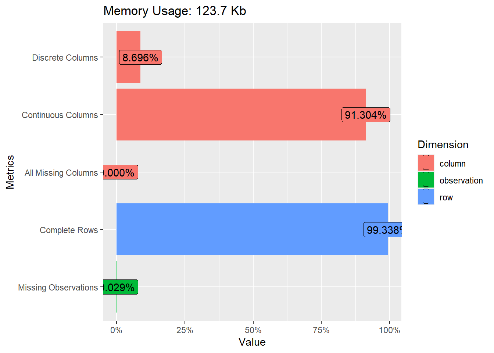

değişkenlerin çoğunun sürekli olduğunu (R Likert maddeleri de aslında
sıralı olmalarına rağmen sürekli değişkenler olarak tanımlanır), kesikli
(yani kategorik) değişkenler (yani cinsiyet ve eğitim) olduğunu
göstermektedir. Ayrıca veri setindeki bazı değişkenlerin kayıp değerlere
sahip olduğunu ancak kayıp veri oranının çok küçük olduğunu görüyoruz
(sadece %0,029).


```r
DataExplorer::plot_missing(nfc)
```

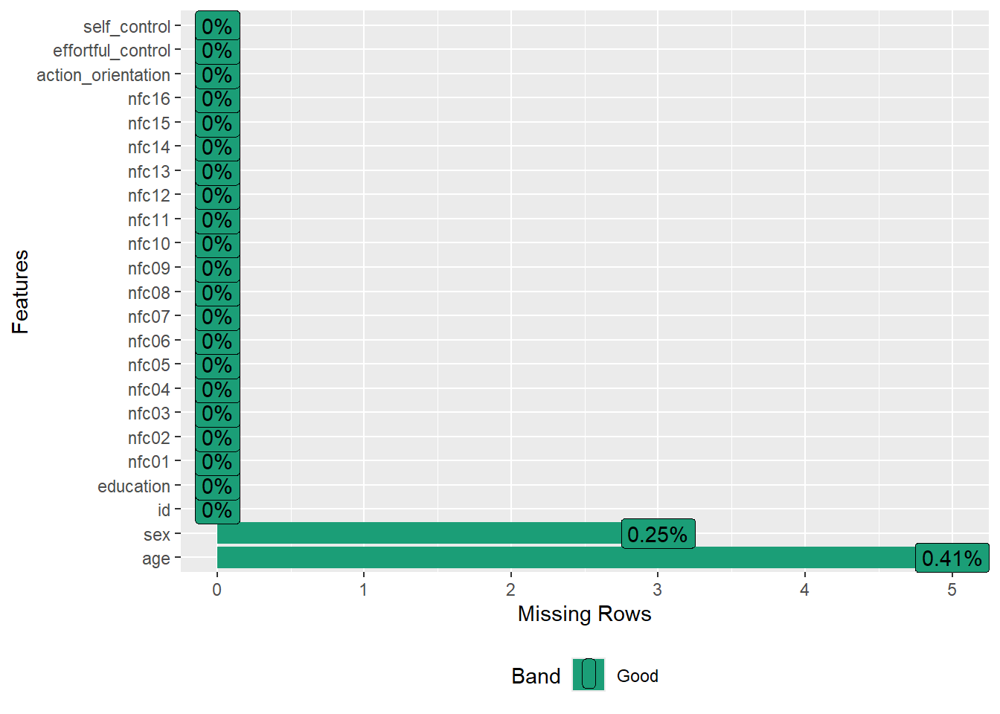

Eksik değerlere daha yakından bakmak için, her bir değişken için
eksiklik oranını görselleştirebiliriz. grafik, yaş ve cinsiyetin bazı
kayıp değerlere sahip olduğunu ancak kayıp oranının çok küçük olduğunu
(%1’den az) göstermektedir.


```r
DataExplorer::plot_bar(data = nfc[, c("education", "sex")])
```

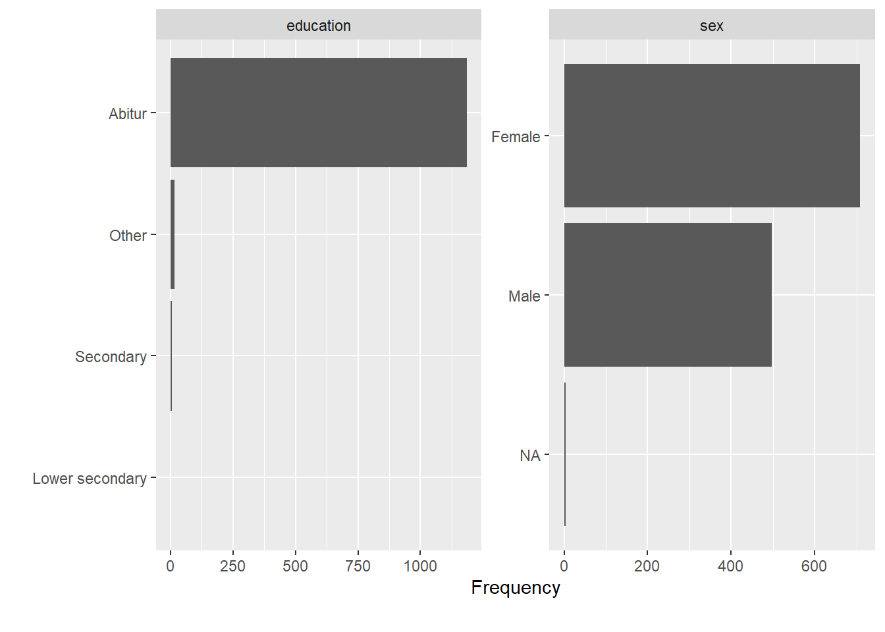


```r
DataExplorer::plot_histogram(data = nfc[, c("age", "self_control", "action_orientation", "effortful_control")])
```

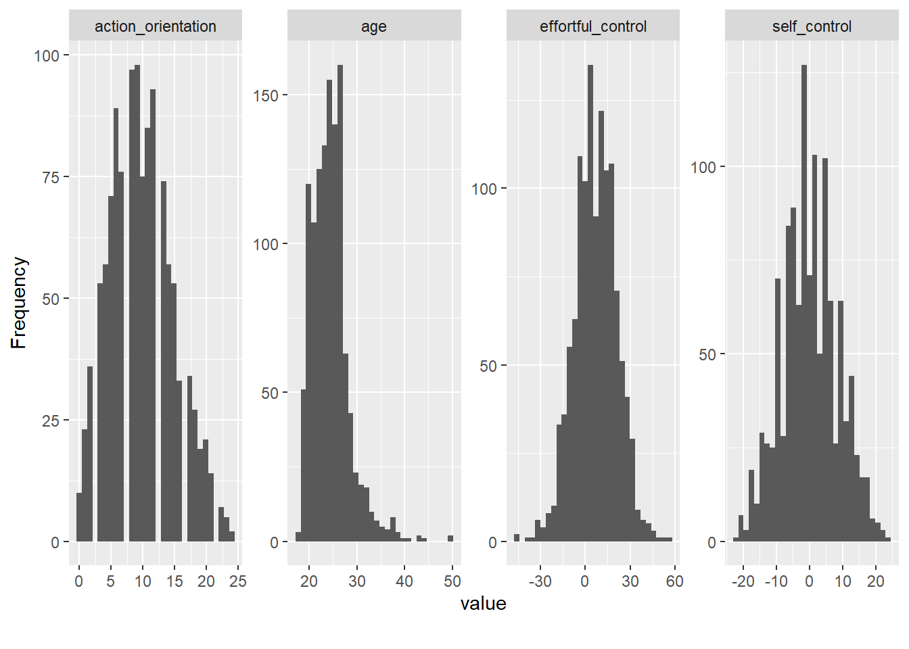


```r
DataExplorer::plot_boxplot(data = nfc[!is.na(nfc$sex), # cinsiyet değişkeninde eksik verisi olmayanlar
c("sex", "self_control", "action_orientation", "effortful_control")],  by = "sex") # Kategorik değişken düzeyleri için
```

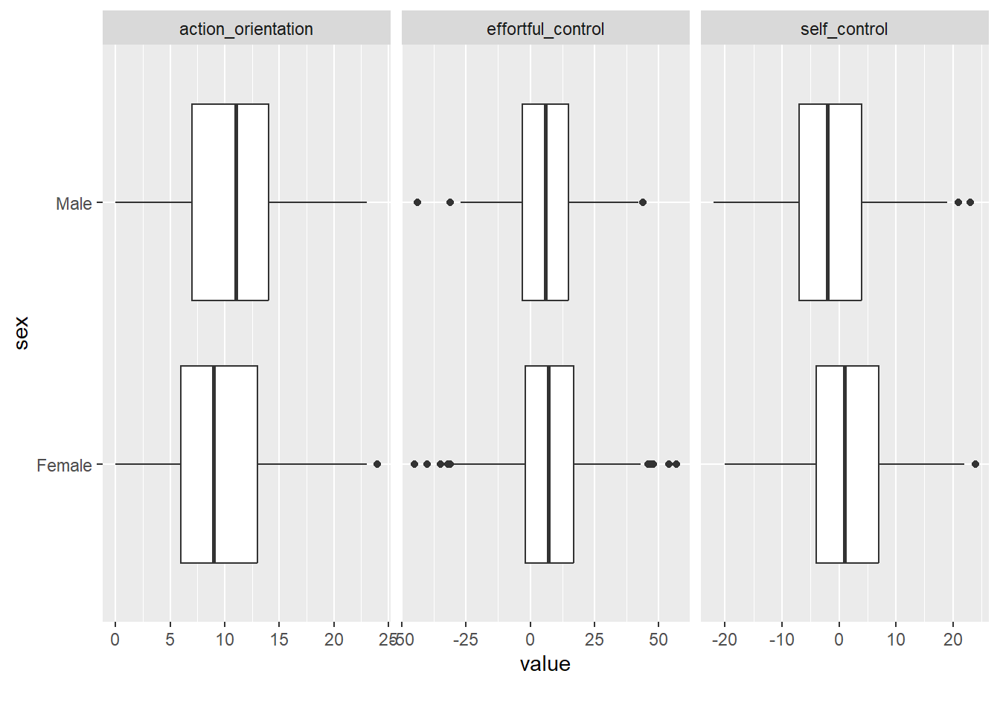


```r
## # id değişkeni analizlere dahil edilmediği için çıkarıldı
nfc <- DataExplorer::drop_columns(nfc, "id")
#
# DataExplorer::create_report(data = nfc,
#                              report_title = "Veri On Inceleme",
#                              output_file = "oninceleme.html")
```

Tüm özet istatistikleri tek bir rapor halinde düzenlemek için
create_report() fonksiyonunu kullanabiliriz. Bu fonksiyon DataExplorer
içindeki çoğu fonksiyonu çalıştırır ve bir HTML rapor dosyası çıktısı
verir.🔗 [oninceleme](oninceleme.html)

Tek bir analizde nfc veri setinin ayrıntılı bir özetini elde etmek için
skimr paketindeki ( ) skim() fonksiyonunu kullanabiliriz.Çıktıdan da
görebileceğiniz gibi, nfc veri setindeki değişkenler için benzer
tanımlayıcı istatistikler elde edilir


```r
skimr::skim(nfc)
```


Table: (\#tab:unnamed-chunk-15)Data summary

|                         |     |
|:------------------------|:----|
|Name                     |nfc  |
|Number of rows           |1209 |
|Number of columns        |22   |
|_______________________  |     |
|Column type frequency:   |     |
|character                |2    |
|numeric                  |20   |
|________________________ |     |
|Group variables          |None |


**Variable type: character**

|skim_variable | n_missing| complete_rate| min| max| empty| n_unique| whitespace|
|:-------------|---------:|-------------:|---:|---:|-----:|--------:|----------:|
|sex           |         3|             1|   4|   6|     0|        2|          0|
|education     |         0|             1|   5|  15|     0|        4|          0|


**Variable type: numeric**

|skim_variable      | n_missing| complete_rate|  mean|    sd|  p0| p25| p50| p75| p100|hist  |
|:------------------|---------:|-------------:|-----:|-----:|---:|---:|---:|---:|----:|:-----|
|age                |         5|             1| 24.43|  3.93|  18|  22|  24|  26|   50|▇▅▁▁▁ |
|nfc01              |         0|             1|  5.54|  1.19|   1|   5|   6|   6|    7|▁▁▁▃▇ |
|nfc02              |         0|             1|  4.94|  1.39|   1|   4|   5|   6|    7|▁▂▃▆▇ |
|nfc03              |         0|             1|  4.44|  1.40|   1|   3|   5|   5|    7|▃▅▆▇▆ |
|nfc04              |         0|             1|  2.47|  1.47|   1|   1|   2|   3|    7|▇▂▁▁▁ |
|nfc05              |         0|             1|  5.82|  1.23|   1|   5|   6|   7|    7|▁▁▁▂▇ |
|nfc06              |         0|             1|  3.75|  1.50|   1|   3|   4|   5|    7|▇▆▇▅▅ |
|nfc07              |         0|             1|  2.70|  1.32|   1|   2|   2|   3|    7|▇▃▂▁▁ |
|nfc08              |         0|             1|  3.34|  1.55|   1|   2|   3|   4|    7|▇▆▅▃▂ |
|nfc09              |         0|             1|  2.45|  1.52|   1|   1|   2|   3|    7|▇▂▂▁▁ |
|nfc10              |         0|             1|  3.16|  1.52|   1|   2|   3|   4|    7|▇▅▃▂▂ |
|nfc11              |         0|             1|  2.75|  1.45|   1|   2|   2|   4|    7|▇▃▂▂▁ |
|nfc12              |         0|             1|  2.45|  1.40|   1|   1|   2|   3|    7|▇▂▁▁▁ |
|nfc13              |         0|             1|  4.10|  1.42|   1|   3|   4|   5|    7|▅▆▇▇▅ |
|nfc14              |         0|             1|  3.57|  1.47|   1|   2|   4|   4|    7|▇▆▇▅▃ |
|nfc15              |         0|             1|  2.25|  1.34|   1|   1|   2|   3|    7|▇▂▁▁▁ |
|nfc16              |         0|             1|  2.48|  1.40|   1|   1|   2|   3|    7|▇▃▁▁▁ |
|action_orientation |         0|             1|  9.84|  4.96|   0|   6|   9|  13|   24|▃▇▇▃▁ |
|effortful_control  |         0|             1|  6.84| 13.97| -45|  -2|   7|  16|   57|▁▂▇▃▁ |
|self_control       |         0|             1|  0.12|  8.36| -22|  -5|   0|   5|   24|▁▅▇▃▁ |

veriler için temel tanımlayıcı istatistikleri elde etmek için psych
paketindeki (Revelle 2021) describe() fonksiyonu kullanılabilir.


```r
psych::describe(x = nfc)
```

<div class="kable-table">

|                   | vars|    n|       mean|         sd| median|    trimmed|     mad| min| max| range|       skew|   kurtosis|        se|
|:------------------|----:|----:|----------:|----------:|------:|----------:|-------:|---:|---:|-----:|----------:|----------:|---------:|
|age                |    1| 1204| 24.4252492|  3.9316979|     24| 23.9968880|  2.9652|  18|  50|    32|  1.5421412|  4.7857750| 0.1133096|
|sex*               |    2| 1206|  1.4121061|  0.4924182|      1|  1.3902692|  0.0000|   1|   2|     1|  0.3566926| -1.8743225| 0.0141795|
|education*         |    3| 1209|  1.0421836|  0.3110129|      1|  1.0000000|  0.0000|   1|   4|     3|  7.5917093| 58.4530403| 0.0089447|
|nfc01              |    4| 1209|  5.5351530|  1.1886452|      6|  5.6811146|  1.4826|   1|   7|     6| -1.1753410|  1.5551147| 0.0341853|
|nfc02              |    5| 1209|  4.9445823|  1.3903901|      5|  5.0134159|  1.4826|   1|   7|     6| -0.4919135| -0.3074685| 0.0399874|
|nfc03              |    6| 1209|  4.4358974|  1.3969225|      5|  4.5067079|  1.4826|   1|   7|     6| -0.3160918| -0.4811379| 0.0401753|
|nfc04              |    7| 1209|  2.4731183|  1.4730966|      2|  2.2497420|  1.4826|   1|   7|     6|  1.1564305|  0.6775486| 0.0423661|
|nfc05              |    8| 1209|  5.8188586|  1.2272196|      6|  6.0082559|  1.4826|   1|   7|     6| -1.3305252|  2.0867034| 0.0352947|
|nfc06              |    9| 1209|  3.7452440|  1.4998717|      4|  3.6914345|  1.4826|   1|   7|     6|  0.2429112| -0.6042283| 0.0431361|
|nfc07              |   10| 1209|  2.7005790|  1.3183654|      2|  2.5706914|  1.4826|   1|   7|     6|  0.7892363|  0.2011242| 0.0379160|
|nfc08              |   11| 1209|  3.3399504|  1.5545491|      3|  3.2693498|  1.4826|   1|   7|     6|  0.3954870| -0.6472303| 0.0447086|
|nfc09              |   12| 1209|  2.4507858|  1.5151885|      2|  2.2311662|  1.4826|   1|   7|     6|  1.0261904|  0.3203071| 0.0435766|
|nfc10              |   13| 1209|  3.1629446|  1.5248765|      3|  3.0588235|  1.4826|   1|   7|     6|  0.6146081| -0.3045751| 0.0438552|
|nfc11              |   14| 1209|  2.7452440|  1.4482049|      2|  2.6078431|  1.4826|   1|   7|     6|  0.7184658| -0.1521455| 0.0416502|
|nfc12              |   15| 1209|  2.4458230|  1.3991191|      2|  2.2641899|  1.4826|   1|   7|     6|  0.9347425|  0.1785533| 0.0402385|
|nfc13              |   16| 1209|  4.1042184|  1.4208909|      4|  4.1289990|  1.4826|   1|   7|     6| -0.1302949| -0.5362533| 0.0408646|
|nfc14              |   17| 1209|  3.5707196|  1.4716424|      4|  3.5448916|  1.4826|   1|   7|     6|  0.1136419| -0.5013325| 0.0423242|
|nfc15              |   18| 1209|  2.2473118|  1.3449235|      2|  2.0309598|  1.4826|   1|   7|     6|  1.2456104|  1.2320487| 0.0386798|
|nfc16              |   19| 1209|  2.4755997|  1.4023190|      2|  2.2765738|  1.4826|   1|   7|     6|  1.0604453|  0.7740859| 0.0403305|
|action_orientation |   20| 1209|  9.8436725|  4.9563871|      9|  9.6491228|  4.4478|   0|  24|    24|  0.3294926| -0.4025273| 0.1425450|
|effortful_control  |   21| 1209|  6.8403639| 13.9691651|      7|  6.9349845| 13.3434| -45|  57|   102| -0.0751545|  0.2692053| 0.4017513|
|self_control       |   22| 1209|  0.1174524|  8.3631030|      0|  0.0815273|  7.4130| -22|  24|    46|  0.0579028| -0.2601582| 0.2405217|

</div>

## Korelasyon

Madde analizine geçmeden önce, maddelerin birbirleriyle ne
kadar güçlü bir şekilde ilişkili olduğunu ölçmek için maddeler
arasındaki korelasyonları da kontrol etmeliyiz. Maddelerin birbirleriyle
belirli bir dereceye kadar ilişkili olmasını bekleriz çünkü maddelerin
aynı örtük özelliği (bu örnekte NFC yapısı) ölçtüğünü varsayarız. 

Buna ek olarak, NFC Ölçeğindeki bazı maddelerin olumsuz ifadeler içerdiğini
ve dolayısıyla bu maddelere verilen yanıtların diğer maddelerle ters
yönde olabileceğini biliyoruz. Örneğin, yüksek NFC’ye sahip bireylerin
“Problem çözmeyi içeren görevlerden keyif alma” gibi olumlu ifadeler
içeren bir madde için “7 = tamamen katılıyorum” seçeneğini
işaretlemeleri beklenirken, “Derinlemesine düşünmeyi gerektirebilecek
durumları öngörme ve bunlardan kaçınma” gibi olumsuz ifadeler içeren bir
madde için “1 = tamamen katılmıyorum” seçeneğini işaretlemeleri
beklenmektedir.


```r
matris <- dplyr::select(nfc, starts_with("nfc"))

head(matris)
```

<div class="kable-table">

| nfc01| nfc02| nfc03| nfc04| nfc05| nfc06| nfc07| nfc08| nfc09| nfc10| nfc11| nfc12| nfc13| nfc14| nfc15| nfc16|
|-----:|-----:|-----:|-----:|-----:|-----:|-----:|-----:|-----:|-----:|-----:|-----:|-----:|-----:|-----:|-----:|
|     5|     7|     5|     1|     6|     2|     2|     5|     2|     1|     2|     2|     6|     5|     2|     1|
|     5|     5|     3|     2|     5|     3|     3|     3|     2|     4|     3|     2|     3|     2|     4|     4|
|     5|     6|     5|     1|     7|     3|     2|     3|     1|     3|     3|     1|     6|     5|     1|     1|
|     5|     5|     4|     2|     5|     5|     2|     2|     2|     2|     4|     3|     2|     3|     1|     1|
|     2|     3|     3|     5|     3|     5|     6|     1|     6|     6|     6|     6|     2|     1|     5|     5|
|     6|     6|     6|     1|     6|     3|     1|     1|     1|     1|     1|     1|     6|     6|     2|     2|

</div>


```r
cormat <- psych::polychoric(x = matris)$rho

cormat %>% kbl(digits = 2) %>%
kable_styling(bootstrap_options = c("striped", "condensed"), font_size =
11)
```

<table class="table table-striped table-condensed" style="font-size: 11px; margin-left: auto; margin-right: auto;">
 <thead>
  <tr>
   <th style="text-align:left;">   </th>
   <th style="text-align:right;"> nfc01 </th>
   <th style="text-align:right;"> nfc02 </th>
   <th style="text-align:right;"> nfc03 </th>
   <th style="text-align:right;"> nfc04 </th>
   <th style="text-align:right;"> nfc05 </th>
   <th style="text-align:right;"> nfc06 </th>
   <th style="text-align:right;"> nfc07 </th>
   <th style="text-align:right;"> nfc08 </th>
   <th style="text-align:right;"> nfc09 </th>
   <th style="text-align:right;"> nfc10 </th>
   <th style="text-align:right;"> nfc11 </th>
   <th style="text-align:right;"> nfc12 </th>
   <th style="text-align:right;"> nfc13 </th>
   <th style="text-align:right;"> nfc14 </th>
   <th style="text-align:right;"> nfc15 </th>
   <th style="text-align:right;"> nfc16 </th>
  </tr>
 </thead>
<tbody>
  <tr>
   <td style="text-align:left;"> nfc01 </td>
   <td style="text-align:right;"> 1.00 </td>
   <td style="text-align:right;"> 0.49 </td>
   <td style="text-align:right;"> 0.42 </td>
   <td style="text-align:right;"> -0.31 </td>
   <td style="text-align:right;"> 0.37 </td>
   <td style="text-align:right;"> -0.21 </td>
   <td style="text-align:right;"> -0.44 </td>
   <td style="text-align:right;"> -0.37 </td>
   <td style="text-align:right;"> -0.33 </td>
   <td style="text-align:right;"> -0.42 </td>
   <td style="text-align:right;"> -0.40 </td>
   <td style="text-align:right;"> -0.33 </td>
   <td style="text-align:right;"> 0.48 </td>
   <td style="text-align:right;"> 0.37 </td>
   <td style="text-align:right;"> -0.32 </td>
   <td style="text-align:right;"> -0.36 </td>
  </tr>
  <tr>
   <td style="text-align:left;"> nfc02 </td>
   <td style="text-align:right;"> 0.49 </td>
   <td style="text-align:right;"> 1.00 </td>
   <td style="text-align:right;"> 0.56 </td>
   <td style="text-align:right;"> -0.35 </td>
   <td style="text-align:right;"> 0.43 </td>
   <td style="text-align:right;"> -0.17 </td>
   <td style="text-align:right;"> -0.50 </td>
   <td style="text-align:right;"> -0.41 </td>
   <td style="text-align:right;"> -0.30 </td>
   <td style="text-align:right;"> -0.34 </td>
   <td style="text-align:right;"> -0.35 </td>
   <td style="text-align:right;"> -0.29 </td>
   <td style="text-align:right;"> 0.43 </td>
   <td style="text-align:right;"> 0.43 </td>
   <td style="text-align:right;"> -0.34 </td>
   <td style="text-align:right;"> -0.34 </td>
  </tr>
  <tr>
   <td style="text-align:left;"> nfc03 </td>
   <td style="text-align:right;"> 0.42 </td>
   <td style="text-align:right;"> 0.56 </td>
   <td style="text-align:right;"> 1.00 </td>
   <td style="text-align:right;"> -0.33 </td>
   <td style="text-align:right;"> 0.40 </td>
   <td style="text-align:right;"> -0.23 </td>
   <td style="text-align:right;"> -0.40 </td>
   <td style="text-align:right;"> -0.33 </td>
   <td style="text-align:right;"> -0.18 </td>
   <td style="text-align:right;"> -0.26 </td>
   <td style="text-align:right;"> -0.30 </td>
   <td style="text-align:right;"> -0.27 </td>
   <td style="text-align:right;"> 0.42 </td>
   <td style="text-align:right;"> 0.37 </td>
   <td style="text-align:right;"> -0.25 </td>
   <td style="text-align:right;"> -0.21 </td>
  </tr>
  <tr>
   <td style="text-align:left;"> nfc04 </td>
   <td style="text-align:right;"> -0.31 </td>
   <td style="text-align:right;"> -0.35 </td>
   <td style="text-align:right;"> -0.33 </td>
   <td style="text-align:right;"> 1.00 </td>
   <td style="text-align:right;"> -0.35 </td>
   <td style="text-align:right;"> 0.18 </td>
   <td style="text-align:right;"> 0.43 </td>
   <td style="text-align:right;"> 0.38 </td>
   <td style="text-align:right;"> 0.33 </td>
   <td style="text-align:right;"> 0.29 </td>
   <td style="text-align:right;"> 0.35 </td>
   <td style="text-align:right;"> 0.37 </td>
   <td style="text-align:right;"> -0.24 </td>
   <td style="text-align:right;"> -0.21 </td>
   <td style="text-align:right;"> 0.29 </td>
   <td style="text-align:right;"> 0.22 </td>
  </tr>
  <tr>
   <td style="text-align:left;"> nfc05 </td>
   <td style="text-align:right;"> 0.37 </td>
   <td style="text-align:right;"> 0.43 </td>
   <td style="text-align:right;"> 0.40 </td>
   <td style="text-align:right;"> -0.35 </td>
   <td style="text-align:right;"> 1.00 </td>
   <td style="text-align:right;"> -0.17 </td>
   <td style="text-align:right;"> -0.38 </td>
   <td style="text-align:right;"> -0.30 </td>
   <td style="text-align:right;"> -0.29 </td>
   <td style="text-align:right;"> -0.22 </td>
   <td style="text-align:right;"> -0.33 </td>
   <td style="text-align:right;"> -0.26 </td>
   <td style="text-align:right;"> 0.32 </td>
   <td style="text-align:right;"> 0.26 </td>
   <td style="text-align:right;"> -0.29 </td>
   <td style="text-align:right;"> -0.22 </td>
  </tr>
  <tr>
   <td style="text-align:left;"> nfc06 </td>
   <td style="text-align:right;"> -0.21 </td>
   <td style="text-align:right;"> -0.17 </td>
   <td style="text-align:right;"> -0.23 </td>
   <td style="text-align:right;"> 0.18 </td>
   <td style="text-align:right;"> -0.17 </td>
   <td style="text-align:right;"> 1.00 </td>
   <td style="text-align:right;"> 0.32 </td>
   <td style="text-align:right;"> 0.20 </td>
   <td style="text-align:right;"> 0.22 </td>
   <td style="text-align:right;"> 0.30 </td>
   <td style="text-align:right;"> 0.19 </td>
   <td style="text-align:right;"> 0.22 </td>
   <td style="text-align:right;"> -0.19 </td>
   <td style="text-align:right;"> -0.13 </td>
   <td style="text-align:right;"> 0.15 </td>
   <td style="text-align:right;"> 0.19 </td>
  </tr>
  <tr>
   <td style="text-align:left;"> nfc07 </td>
   <td style="text-align:right;"> -0.44 </td>
   <td style="text-align:right;"> -0.50 </td>
   <td style="text-align:right;"> -0.40 </td>
   <td style="text-align:right;"> 0.43 </td>
   <td style="text-align:right;"> -0.38 </td>
   <td style="text-align:right;"> 0.32 </td>
   <td style="text-align:right;"> 1.00 </td>
   <td style="text-align:right;"> 0.52 </td>
   <td style="text-align:right;"> 0.44 </td>
   <td style="text-align:right;"> 0.45 </td>
   <td style="text-align:right;"> 0.49 </td>
   <td style="text-align:right;"> 0.49 </td>
   <td style="text-align:right;"> -0.41 </td>
   <td style="text-align:right;"> -0.35 </td>
   <td style="text-align:right;"> 0.38 </td>
   <td style="text-align:right;"> 0.34 </td>
  </tr>
  <tr>
   <td style="text-align:left;"> nfc08 </td>
   <td style="text-align:right;"> -0.37 </td>
   <td style="text-align:right;"> -0.41 </td>
   <td style="text-align:right;"> -0.33 </td>
   <td style="text-align:right;"> 0.38 </td>
   <td style="text-align:right;"> -0.30 </td>
   <td style="text-align:right;"> 0.20 </td>
   <td style="text-align:right;"> 0.52 </td>
   <td style="text-align:right;"> 1.00 </td>
   <td style="text-align:right;"> 0.45 </td>
   <td style="text-align:right;"> 0.40 </td>
   <td style="text-align:right;"> 0.51 </td>
   <td style="text-align:right;"> 0.37 </td>
   <td style="text-align:right;"> -0.35 </td>
   <td style="text-align:right;"> -0.33 </td>
   <td style="text-align:right;"> 0.30 </td>
   <td style="text-align:right;"> 0.30 </td>
  </tr>
  <tr>
   <td style="text-align:left;"> nfc09 </td>
   <td style="text-align:right;"> -0.33 </td>
   <td style="text-align:right;"> -0.30 </td>
   <td style="text-align:right;"> -0.18 </td>
   <td style="text-align:right;"> 0.33 </td>
   <td style="text-align:right;"> -0.29 </td>
   <td style="text-align:right;"> 0.22 </td>
   <td style="text-align:right;"> 0.44 </td>
   <td style="text-align:right;"> 0.45 </td>
   <td style="text-align:right;"> 1.00 </td>
   <td style="text-align:right;"> 0.40 </td>
   <td style="text-align:right;"> 0.49 </td>
   <td style="text-align:right;"> 0.45 </td>
   <td style="text-align:right;"> -0.25 </td>
   <td style="text-align:right;"> -0.21 </td>
   <td style="text-align:right;"> 0.30 </td>
   <td style="text-align:right;"> 0.26 </td>
  </tr>
  <tr>
   <td style="text-align:left;"> nfc10 </td>
   <td style="text-align:right;"> -0.42 </td>
   <td style="text-align:right;"> -0.34 </td>
   <td style="text-align:right;"> -0.26 </td>
   <td style="text-align:right;"> 0.29 </td>
   <td style="text-align:right;"> -0.22 </td>
   <td style="text-align:right;"> 0.30 </td>
   <td style="text-align:right;"> 0.45 </td>
   <td style="text-align:right;"> 0.40 </td>
   <td style="text-align:right;"> 0.40 </td>
   <td style="text-align:right;"> 1.00 </td>
   <td style="text-align:right;"> 0.41 </td>
   <td style="text-align:right;"> 0.47 </td>
   <td style="text-align:right;"> -0.30 </td>
   <td style="text-align:right;"> -0.22 </td>
   <td style="text-align:right;"> 0.23 </td>
   <td style="text-align:right;"> 0.26 </td>
  </tr>
  <tr>
   <td style="text-align:left;"> nfc11 </td>
   <td style="text-align:right;"> -0.40 </td>
   <td style="text-align:right;"> -0.35 </td>
   <td style="text-align:right;"> -0.30 </td>
   <td style="text-align:right;"> 0.35 </td>
   <td style="text-align:right;"> -0.33 </td>
   <td style="text-align:right;"> 0.19 </td>
   <td style="text-align:right;"> 0.49 </td>
   <td style="text-align:right;"> 0.51 </td>
   <td style="text-align:right;"> 0.49 </td>
   <td style="text-align:right;"> 0.41 </td>
   <td style="text-align:right;"> 1.00 </td>
   <td style="text-align:right;"> 0.43 </td>
   <td style="text-align:right;"> -0.40 </td>
   <td style="text-align:right;"> -0.35 </td>
   <td style="text-align:right;"> 0.28 </td>
   <td style="text-align:right;"> 0.29 </td>
  </tr>
  <tr>
   <td style="text-align:left;"> nfc12 </td>
   <td style="text-align:right;"> -0.33 </td>
   <td style="text-align:right;"> -0.29 </td>
   <td style="text-align:right;"> -0.27 </td>
   <td style="text-align:right;"> 0.37 </td>
   <td style="text-align:right;"> -0.26 </td>
   <td style="text-align:right;"> 0.22 </td>
   <td style="text-align:right;"> 0.49 </td>
   <td style="text-align:right;"> 0.37 </td>
   <td style="text-align:right;"> 0.45 </td>
   <td style="text-align:right;"> 0.47 </td>
   <td style="text-align:right;"> 0.43 </td>
   <td style="text-align:right;"> 1.00 </td>
   <td style="text-align:right;"> -0.30 </td>
   <td style="text-align:right;"> -0.20 </td>
   <td style="text-align:right;"> 0.30 </td>
   <td style="text-align:right;"> 0.28 </td>
  </tr>
  <tr>
   <td style="text-align:left;"> nfc13 </td>
   <td style="text-align:right;"> 0.48 </td>
   <td style="text-align:right;"> 0.43 </td>
   <td style="text-align:right;"> 0.42 </td>
   <td style="text-align:right;"> -0.24 </td>
   <td style="text-align:right;"> 0.32 </td>
   <td style="text-align:right;"> -0.19 </td>
   <td style="text-align:right;"> -0.41 </td>
   <td style="text-align:right;"> -0.35 </td>
   <td style="text-align:right;"> -0.25 </td>
   <td style="text-align:right;"> -0.30 </td>
   <td style="text-align:right;"> -0.40 </td>
   <td style="text-align:right;"> -0.30 </td>
   <td style="text-align:right;"> 1.00 </td>
   <td style="text-align:right;"> 0.60 </td>
   <td style="text-align:right;"> -0.23 </td>
   <td style="text-align:right;"> -0.25 </td>
  </tr>
  <tr>
   <td style="text-align:left;"> nfc14 </td>
   <td style="text-align:right;"> 0.37 </td>
   <td style="text-align:right;"> 0.43 </td>
   <td style="text-align:right;"> 0.37 </td>
   <td style="text-align:right;"> -0.21 </td>
   <td style="text-align:right;"> 0.26 </td>
   <td style="text-align:right;"> -0.13 </td>
   <td style="text-align:right;"> -0.35 </td>
   <td style="text-align:right;"> -0.33 </td>
   <td style="text-align:right;"> -0.21 </td>
   <td style="text-align:right;"> -0.22 </td>
   <td style="text-align:right;"> -0.35 </td>
   <td style="text-align:right;"> -0.20 </td>
   <td style="text-align:right;"> 0.60 </td>
   <td style="text-align:right;"> 1.00 </td>
   <td style="text-align:right;"> -0.21 </td>
   <td style="text-align:right;"> -0.20 </td>
  </tr>
  <tr>
   <td style="text-align:left;"> nfc15 </td>
   <td style="text-align:right;"> -0.32 </td>
   <td style="text-align:right;"> -0.34 </td>
   <td style="text-align:right;"> -0.25 </td>
   <td style="text-align:right;"> 0.29 </td>
   <td style="text-align:right;"> -0.29 </td>
   <td style="text-align:right;"> 0.15 </td>
   <td style="text-align:right;"> 0.38 </td>
   <td style="text-align:right;"> 0.30 </td>
   <td style="text-align:right;"> 0.30 </td>
   <td style="text-align:right;"> 0.23 </td>
   <td style="text-align:right;"> 0.28 </td>
   <td style="text-align:right;"> 0.30 </td>
   <td style="text-align:right;"> -0.23 </td>
   <td style="text-align:right;"> -0.21 </td>
   <td style="text-align:right;"> 1.00 </td>
   <td style="text-align:right;"> 0.75 </td>
  </tr>
  <tr>
   <td style="text-align:left;"> nfc16 </td>
   <td style="text-align:right;"> -0.36 </td>
   <td style="text-align:right;"> -0.34 </td>
   <td style="text-align:right;"> -0.21 </td>
   <td style="text-align:right;"> 0.22 </td>
   <td style="text-align:right;"> -0.22 </td>
   <td style="text-align:right;"> 0.19 </td>
   <td style="text-align:right;"> 0.34 </td>
   <td style="text-align:right;"> 0.30 </td>
   <td style="text-align:right;"> 0.26 </td>
   <td style="text-align:right;"> 0.26 </td>
   <td style="text-align:right;"> 0.29 </td>
   <td style="text-align:right;"> 0.28 </td>
   <td style="text-align:right;"> -0.25 </td>
   <td style="text-align:right;"> -0.20 </td>
   <td style="text-align:right;"> 0.75 </td>
   <td style="text-align:right;"> 1.00 </td>
  </tr>
</tbody>
</table>


Maddeler arasındaki ilişkileri değerlendirmek için ggcorrplot paketini
( ) kullanarak bir korelasyon matrisi grafiği oluşturacağız.
psych’den corPlot() kullanılarak da grafik oluşturualbilir.


```r
ggcorrplot::ggcorrplot(
  corr = cormat, # korelasyon matirisi
 type = "lower", # alt kösegen
 show.diag = TRUE, # kosegen
 lab = TRUE, # degerleri ekleme
 lab_size = 3) #
```


Ölçekteki birkaç maddenin (mavi/mor renkli kutulara bakınız) diğer maddelerle
negatif korelasyona sahip olduğunu görüyoruz.
Bunlar NFC Ölçeğindeki (R) işaretli maddelerdir (yani, negatif olarak ifade
edilmiş maddeler). Tüm maddeleri aynı yöne koymak için bu maddelere verilen
yanıtları ters kodlayacağız (yani, 1=tamamen katılıyorum ile 7=tamamen
katılmıyorum).
Bu işlem için psych’in reverse.code() fonksiyonunu kullanacağız.


```r
# ters kodlacak maddeler -1 ile belirtilmiştir.

nfc_key <- c(1,1,1,-1,1,-1,-1,-1,-1,-1,-1,-1,1,1,-1,-1)

ters_matris <- psych::reverse.code(
 keys = nfc_key, # ters kodlanacak maddeler
 items = matris, # veri
 mini = 1, # minumum deger
 maxi = 7) # maksimum deger
```


```r
cor_ters_matris <-
 psych::polychoric(ters_matris)$rho
 ggcorrplot::ggcorrplot(
 corr = cor_ters_matris,
 type = "lower",
 show.diag = TRUE,
 lab = TRUE,
 lab_size = 3) 
```

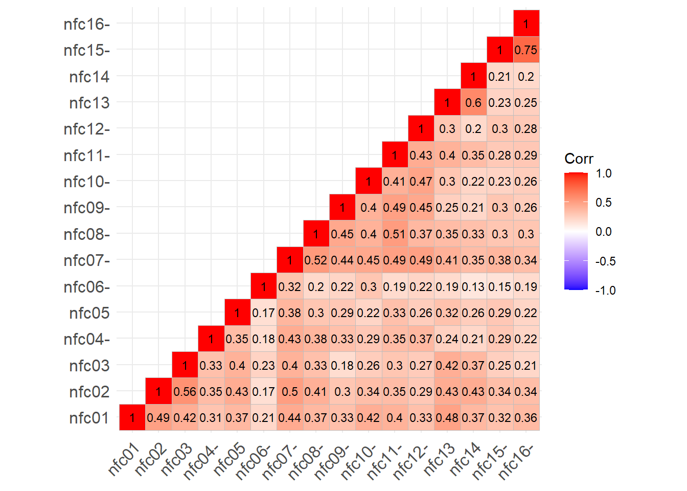


```r
# yeniden adlandırma
 colnames(ters_matris) <- colnames(matris)
 ters_matris <- as.data.frame(ters_matris)
 head(ters_matris)
```

<div class="kable-table">

| nfc01| nfc02| nfc03| nfc04| nfc05| nfc06| nfc07| nfc08| nfc09| nfc10| nfc11| nfc12| nfc13| nfc14| nfc15| nfc16|
|-----:|-----:|-----:|-----:|-----:|-----:|-----:|-----:|-----:|-----:|-----:|-----:|-----:|-----:|-----:|-----:|
|     5|     7|     5|     7|     6|     6|     6|     3|     6|     7|     6|     6|     6|     5|     6|     7|
|     5|     5|     3|     6|     5|     5|     5|     5|     6|     4|     5|     6|     3|     2|     4|     4|
|     5|     6|     5|     7|     7|     5|     6|     5|     7|     5|     5|     7|     6|     5|     7|     7|
|     5|     5|     4|     6|     5|     3|     6|     6|     6|     6|     4|     5|     2|     3|     7|     7|
|     2|     3|     3|     3|     3|     3|     2|     7|     2|     2|     2|     2|     2|     1|     3|     3|
|     6|     6|     6|     7|     6|     5|     7|     7|     7|     7|     7|     7|     6|     6|     6|     6|

</div>


```r
library("OpenMx")
```

```
## 
## Attaching package: 'OpenMx'
```

```
## The following object is masked from 'package:psych':
## 
##     tr
```

```r
 means_cor <-
 mean(vechs(cor_ters_matris))
 library(qgraph)
 qgraph(cor_ters_matris,
 cut=0, layout="spring",
 title=paste("Korelasyon matrisi,
 ortalama korelasyon = ",
 round(means_cor, digits=2),
 sep=" "))
```

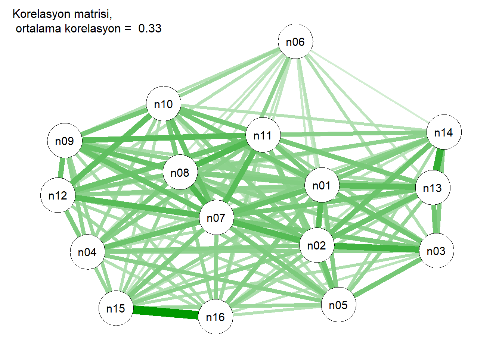


```r
library(EGAnet); library(psychTools)
```

```
## 
## EGAnet (version 2.0.6) 
## 
## For help getting started, see <https://r-ega.net> 
## 
## For bugs and errors, submit an issue to <https://github.com/hfgolino/EGAnet/issues>
```

```
## Warning: package 'psychTools' was built under R version 4.3.3
```

```
## 
## Attaching package: 'psychTools'
```

```
## The following object is masked from 'package:car':
## 
##     recode
```

```
## The following object is masked from 'package:dplyr':
## 
##     recode
```

```r
# Perform Unique Variable Analysis
bfi_uva <- UVA(
  data = matris)
EGA(matris)
```

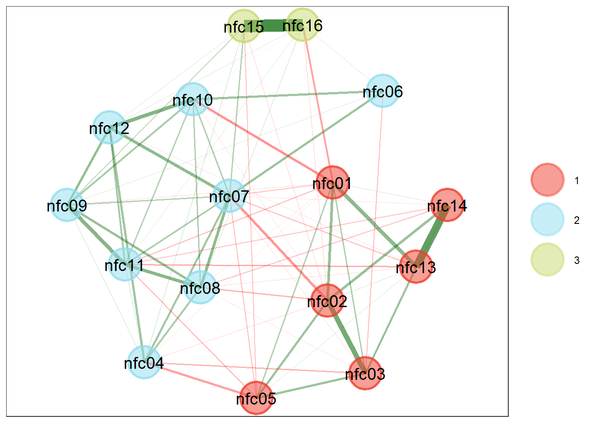

```
## Model: GLASSO (EBIC with gamma = 0.5)
## Correlations: auto
## Lambda: 0.0753057457698569 (n = 100, ratio = 0.1)
## 
## Number of nodes: 16
## Number of edges: 75
## Edge density: 0.625
## 
## Non-zero edge weights: 
##      M    SD    Min   Max
##  0.049 0.119 -0.153 0.626
## 
## ----
## 
## Algorithm:  Walktrap
## 
## Number of communities:  3
## 
## nfc01 nfc02 nfc03 nfc04 nfc05 nfc06 nfc07 nfc08 nfc09 nfc10 nfc11 nfc12 nfc13 
##     1     1     1     2     1     2     2     2     2     2     2     2     1 
## nfc14 nfc15 nfc16 
##     1     3     3 
## 
## ----
## 
## Unidimensional Method: Louvain
## Unidimensional: No
## 
## ----
## 
## TEFI: -10.355
```

##  Madde analizi

her bir madde için betimleyici istatistikler (örn.
ortalama, standart sapma, minimum ve maksimum),
madde düzeyinde istatistikler (örn. güçlük ve ayırt
edicilik) ve bunların ölçek düzeyinde istatistiklerle
(örn. güvenilirlik) ilişkileri
R’de, ikili (yani, 0 veya 1) ve sıralı (örneğin, Likert ölçeği
maddeleri) maddeler üzerinde madde analizi yapmak
için çeşitli paketler bulunmaktadır.


```r
itemanalysis_ctt <- CTT::itemAnalysis(items = ters_matris, pBisFlag = .2,
 bisFlag = .2)
 itemanalysis_ctt$itemReport
```

<div class="kable-table">

|itemName | itemMean|      pBis|       bis| alphaIfDeleted|lowPBis |lowBis |
|:--------|--------:|---------:|---------:|--------------:|:-------|:------|
|nfc01    | 5.535153| 0.5830007| 0.6324858|      0.8603155|        |       |
|nfc02    | 4.944582| 0.5983857| 0.6212552|      0.8587924|        |       |
|nfc03    | 4.435897| 0.5120628| 0.5278773|      0.8626385|        |       |
|nfc04    | 5.526882| 0.4275829| 0.4678823|      0.8665634|        |       |
|nfc05    | 5.818859| 0.4657545| 0.5132235|      0.8646917|        |       |
|nfc06    | 4.254756| 0.3164060| 0.3254804|      0.8717944|        |       |
|nfc07    | 5.299421| 0.6637826| 0.7012827|      0.8562648|        |       |
|nfc08    | 4.660050| 0.5697411| 0.5895616|      0.8598588|        |       |
|nfc09    | 5.549214| 0.4916520| 0.5349076|      0.8636576|        |       |
|nfc10    | 4.837055| 0.5032326| 0.5251349|      0.8631153|        |       |
|nfc11    | 5.254756| 0.5772984| 0.6088347|      0.8596070|        |       |
|nfc12    | 5.554177| 0.5069643| 0.5468089|      0.8628642|        |       |
|nfc13    | 4.104218| 0.5384126| 0.5524339|      0.8614377|        |       |
|nfc14    | 3.570720| 0.4585722| 0.4710690|      0.8651300|        |       |
|nfc15    | 5.752688| 0.4678062| 0.5152649|      0.8645620|        |       |
|nfc16    | 5.524400| 0.4585389| 0.4943813|      0.8650091|        |       |

</div>
psych (Revelle 2021): alpha()


```r
itemanalysis_psych <- psych::alpha(x = ters_matris)
 itemanalysis_psych
```

```
## 
## Reliability analysis   
## Call: psych::alpha(x = ters_matris)
## 
##   raw_alpha std.alpha G6(smc) average_r S/N    ase mean   sd median_r
##       0.87      0.87    0.88       0.3 6.8 0.0054    5 0.82     0.29
## 
##     95% confidence boundaries 
##          lower alpha upper
## Feldt     0.86  0.87  0.88
## Duhachek  0.86  0.87  0.88
## 
##  Reliability if an item is dropped:
##       raw_alpha std.alpha G6(smc) average_r S/N alpha se  var.r med.r
## nfc01      0.86      0.86    0.87      0.29 6.2   0.0059 0.0098  0.27
## nfc02      0.86      0.86    0.87      0.29 6.2   0.0059 0.0091  0.28
## nfc03      0.86      0.86    0.88      0.30 6.4   0.0058 0.0094  0.29
## nfc04      0.87      0.87    0.88      0.31 6.6   0.0056 0.0098  0.30
## nfc05      0.86      0.87    0.88      0.30 6.5   0.0057 0.0100  0.30
## nfc06      0.87      0.87    0.89      0.31 6.9   0.0054 0.0084  0.31
## nfc07      0.86      0.86    0.87      0.29 6.0   0.0060 0.0092  0.27
## nfc08      0.86      0.86    0.88      0.29 6.3   0.0059 0.0098  0.28
## nfc09      0.86      0.87    0.88      0.30 6.4   0.0057 0.0097  0.30
## nfc10      0.86      0.87    0.88      0.30 6.4   0.0058 0.0099  0.29
## nfc11      0.86      0.86    0.87      0.29 6.2   0.0059 0.0096  0.28
## nfc12      0.86      0.87    0.88      0.30 6.4   0.0058 0.0098  0.29
## nfc13      0.86      0.86    0.87      0.30 6.3   0.0058 0.0091  0.29
## nfc14      0.87      0.87    0.88      0.30 6.5   0.0057 0.0088  0.29
## nfc15      0.86      0.87    0.87      0.30 6.5   0.0057 0.0084  0.30
## nfc16      0.87      0.87    0.87      0.30 6.5   0.0057 0.0083  0.30
## 
##  Item statistics 
##          n raw.r std.r r.cor r.drop mean  sd
## nfc01 1209  0.64  0.65  0.62   0.58  5.5 1.2
## nfc02 1209  0.66  0.67  0.65   0.60  4.9 1.4
## nfc03 1209  0.59  0.59  0.56   0.51  4.4 1.4
## nfc04 1209  0.52  0.51  0.46   0.43  5.5 1.5
## nfc05 1209  0.54  0.55  0.50   0.47  5.8 1.2
## nfc06 1209  0.42  0.41  0.34   0.32  4.3 1.5
## nfc07 1209  0.72  0.72  0.70   0.66  5.3 1.3
## nfc08 1209  0.65  0.64  0.61   0.57  4.7 1.6
## nfc09 1209  0.58  0.57  0.53   0.49  5.5 1.5
## nfc10 1209  0.59  0.58  0.54   0.50  4.8 1.5
## nfc11 1209  0.65  0.64  0.62   0.58  5.3 1.4
## nfc12 1209  0.58  0.58  0.54   0.51  5.6 1.4
## nfc13 1209  0.61  0.61  0.59   0.54  4.1 1.4
## nfc14 1209  0.54  0.54  0.51   0.46  3.6 1.5
## nfc15 1209  0.55  0.55  0.53   0.47  5.8 1.3
## nfc16 1209  0.54  0.54  0.53   0.46  5.5 1.4
## 
## Non missing response frequency for each item
##          1    2    3    4    5    6    7 miss
## nfc01 0.01 0.02 0.05 0.07 0.25 0.43 0.18    0
## nfc02 0.01 0.05 0.10 0.18 0.27 0.26 0.12    0
## nfc03 0.02 0.08 0.15 0.22 0.29 0.19 0.05    0
## nfc04 0.01 0.05 0.06 0.08 0.15 0.37 0.28    0
## nfc05 0.01 0.02 0.03 0.06 0.21 0.33 0.34    0
## nfc06 0.04 0.11 0.14 0.27 0.21 0.19 0.05    0
## nfc07 0.01 0.03 0.07 0.14 0.24 0.35 0.17    0
## nfc08 0.02 0.08 0.13 0.18 0.24 0.23 0.11    0
## nfc09 0.02 0.03 0.07 0.11 0.15 0.28 0.34    0
## nfc10 0.03 0.06 0.12 0.15 0.25 0.28 0.12    0
## nfc11 0.01 0.04 0.09 0.13 0.22 0.30 0.21    0
## nfc12 0.01 0.02 0.09 0.09 0.18 0.32 0.30    0
## nfc13 0.04 0.11 0.19 0.25 0.25 0.13 0.04    0
## nfc14 0.09 0.16 0.21 0.29 0.15 0.07 0.03    0
## nfc15 0.01 0.02 0.05 0.07 0.17 0.32 0.36    0
## nfc16 0.01 0.03 0.06 0.08 0.22 0.31 0.28    0
```


ShinyItemAnalysis (
):


```r
itemanalysis_shiny <- ShinyItemAnalysis::ItemAnalysis(Data = ters_matris)

 itemanalysis_shiny
```

<div class="kable-table">

|      | Difficulty|     Mean|       SD|Cut.score | obs.min| Min.score| obs.max| Max.score| Prop.max.score|       RIR|       RIT|Corr.criterion |       ULI|gULI | Alpha.drop| Index.rel|Index.val | Perc.miss| Perc.nr|
|:-----|----------:|--------:|--------:|:---------|-------:|---------:|-------:|---------:|--------------:|---------:|---------:|:--------------|---------:|:----|----------:|---------:|:---------|---------:|-------:|
|nfc01 |  0.7558588| 5.535153| 1.188645|NA        |       1|         1|       7|         7|      0.1786600| 0.5830007| 0.6409212|NA             | 0.2726639|NA   |  0.8603155| 0.7618279|NA        |         0|       0|
|nfc02 |  0.6574304| 4.944582| 1.390390|NA        |       1|         1|       7|         7|      0.1240695| 0.5983857| 0.6639133|NA             | 0.3391863|NA   |  0.8587924| 0.9230985|NA        |         0|       0|
|nfc03 |  0.5726496| 4.435897| 1.396923|NA        |       1|         1|       7|         7|      0.0496278| 0.5120628| 0.5880748|NA             | 0.3049003|NA   |  0.8626385| 0.8214949|NA        |         0|       0|
|nfc04 |  0.7544803| 5.526882| 1.473097|NA        |       1|         1|       7|         7|      0.2779156| 0.4275829| 0.5166594|NA             | 0.2873591|NA   |  0.8665634| 0.7610891|NA        |         0|       0|
|nfc05 |  0.8031431| 5.818859| 1.227220|NA        |       1|         1|       7|         7|      0.3449132| 0.4657545| 0.5370291|NA             | 0.2271560|NA   |  0.8646917| 0.6590526|NA        |         0|       0|
|nfc06 |  0.5424593| 4.254756| 1.499872|NA        |       1|         1|       7|         7|      0.0479735| 0.3164060| 0.4168850|NA             | 0.2222994|NA   |  0.8717944| 0.6252740|NA        |         0|       0|
|nfc07 |  0.7165702| 5.299421| 1.318365|NA        |       1|         1|       7|         7|      0.1703888| 0.6637826| 0.7178357|NA             | 0.3415068|NA   |  0.8562648| 0.9463698|NA        |         0|       0|
|nfc08 |  0.6100083| 4.660050| 1.554549|NA        |       1|         1|       7|         7|      0.1091811| 0.5697411| 0.6466604|NA             | 0.3888922|NA   |  0.8598588| 1.0052654|NA        |         0|       0|
|nfc09 |  0.7582024| 5.549214| 1.515189|NA        |       1|         1|       7|         7|      0.3399504| 0.4916520| 0.5762896|NA             | 0.3239544|NA   |  0.8636576| 0.8731874|NA        |         0|       0|
|nfc10 |  0.6395092| 4.837055| 1.524876|NA        |       1|         1|       7|         7|      0.1157982| 0.5032326| 0.5870436|NA             | 0.3259830|NA   |  0.8631153| 0.8951689|NA        |         0|       0|
|nfc11 |  0.7091260| 5.254756| 1.448205|NA        |       1|         1|       7|         7|      0.2133995| 0.5772984| 0.6481750|NA             | 0.3536981|NA   |  0.8596070| 0.9386902|NA        |         0|       0|
|nfc12 |  0.7590295| 5.554177| 1.399119|NA        |       1|         1|       7|         7|      0.2985939| 0.5069643| 0.5836499|NA             | 0.2986357|NA   |  0.8628642| 0.8165957|NA        |         0|       0|
|nfc13 |  0.5173697| 4.104218| 1.420891|NA        |       1|         1|       7|         7|      0.0363937| 0.5384126| 0.6126837|NA             | 0.3263285|NA   |  0.8614377| 0.8705567|NA        |         0|       0|
|nfc14 |  0.4284533| 3.570720| 1.471642|NA        |       1|         1|       7|         7|      0.0256410| 0.4585722| 0.5444198|NA             | 0.3143888|NA   |  0.8651300| 0.8011912|NA        |         0|       0|
|nfc15 |  0.7921147| 5.752688| 1.344923|NA        |       1|         1|       7|         7|      0.3564930| 0.4678062| 0.5455510|NA             | 0.2594773|NA   |  0.8645620| 0.7337244|NA        |         0|       0|
|nfc16 |  0.7540667| 5.524400| 1.402319|NA        |       1|         1|       7|         7|      0.2795699| 0.4585389| 0.5404478|NA             | 0.2721719|NA   |  0.8650091| 0.7578802|NA        |         0|       0|

</div>


```r
ShinyItemAnalysis::DDplot(Data = ters_matris, discrim = "RIR")
```

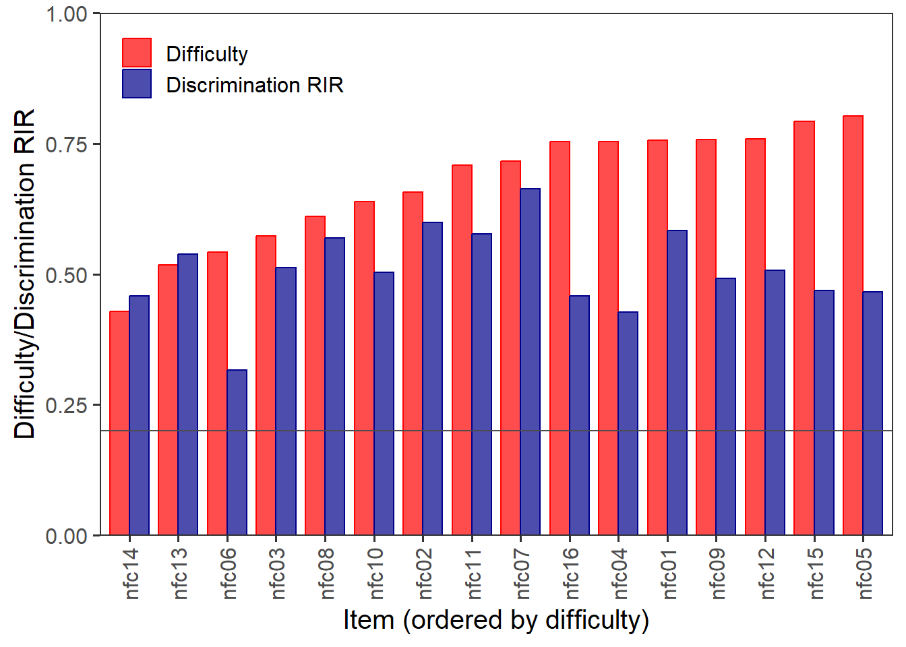

psych paketindeki splitHalf() fonksiyonu ile bu işlem çok daha kolaydır. Bu
fonksiyon, belirli bir veri kümesi için tüm (ya da en azından çok sayıda) olası
split-half güvenilirlik değerlerini hesaplar. Bu fonksiyonu kullanmak için sadece
analiz edilecek veri setini belirtmek yeterlidir.


```r
psych::splitHalf(r = ters_matris)
```

```
## Split half reliabilities  
## Call: psych::splitHalf(r = ters_matris)
## 
## Maximum split half reliability (lambda 4) =  0.92
## Guttman lambda 6                          =  0.88
## Average split half reliability            =  0.87
## Guttman lambda 3 (alpha)                  =  0.87
## Guttman lambda 2                          =  0.88
## Minimum split half reliability  (beta)    =  0.78
## Average interitem r =  0.3  with median =  0.29
```


```r
 sp_rel <- psych::splitHalf(r = ters_matris, raw = TRUE)
 hist(x = sp_rel$raw,
 breaks = 101,
 xlab = "İki yarı güvenirliği",
 main = "Tum iki yarı guvenirlikleri")
 abline(v = mean(sp_rel$raw), col = "red", lwd = 2, lty = 2)
```

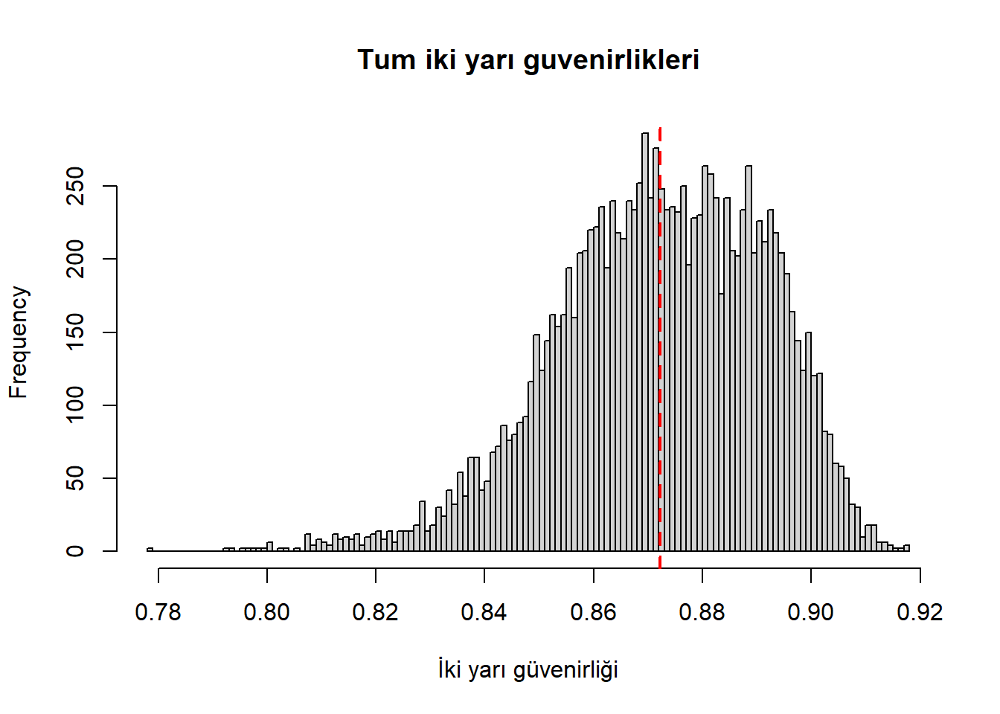

İç tuttarlık
İç tutarlılık, bir ölçüm aracındaki maddeler arasındaki homojenlik derecesidir.


```r
itemanalysis_ctt
```

```
## 
##  Number of Items 
##  16 
## 
##  Number of Examinees 
##  1209 
## 
##  Coefficient Alpha 
##  0.87
```


Benzer şekilde, psych içinde alpha() fonksiyonunu kullanarak madde analizi
yaptığımızda, iç tutarlılık sonuçlarını da elde ettik. Tekrar itemanalysis_psych
yazdırdığımızda aşağıdaki sonuçları görebiliriz:


```r
itemanalysis_psych
```

```
## 
## Reliability analysis   
## Call: psych::alpha(x = ters_matris)
## 
##   raw_alpha std.alpha G6(smc) average_r S/N    ase mean   sd median_r
##       0.87      0.87    0.88       0.3 6.8 0.0054    5 0.82     0.29
## 
##     95% confidence boundaries 
##          lower alpha upper
## Feldt     0.86  0.87  0.88
## Duhachek  0.86  0.87  0.88
## 
##  Reliability if an item is dropped:
##       raw_alpha std.alpha G6(smc) average_r S/N alpha se  var.r med.r
## nfc01      0.86      0.86    0.87      0.29 6.2   0.0059 0.0098  0.27
## nfc02      0.86      0.86    0.87      0.29 6.2   0.0059 0.0091  0.28
## nfc03      0.86      0.86    0.88      0.30 6.4   0.0058 0.0094  0.29
## nfc04      0.87      0.87    0.88      0.31 6.6   0.0056 0.0098  0.30
## nfc05      0.86      0.87    0.88      0.30 6.5   0.0057 0.0100  0.30
## nfc06      0.87      0.87    0.89      0.31 6.9   0.0054 0.0084  0.31
## nfc07      0.86      0.86    0.87      0.29 6.0   0.0060 0.0092  0.27
## nfc08      0.86      0.86    0.88      0.29 6.3   0.0059 0.0098  0.28
## nfc09      0.86      0.87    0.88      0.30 6.4   0.0057 0.0097  0.30
## nfc10      0.86      0.87    0.88      0.30 6.4   0.0058 0.0099  0.29
## nfc11      0.86      0.86    0.87      0.29 6.2   0.0059 0.0096  0.28
## nfc12      0.86      0.87    0.88      0.30 6.4   0.0058 0.0098  0.29
## nfc13      0.86      0.86    0.87      0.30 6.3   0.0058 0.0091  0.29
## nfc14      0.87      0.87    0.88      0.30 6.5   0.0057 0.0088  0.29
## nfc15      0.86      0.87    0.87      0.30 6.5   0.0057 0.0084  0.30
## nfc16      0.87      0.87    0.87      0.30 6.5   0.0057 0.0083  0.30
## 
##  Item statistics 
##          n raw.r std.r r.cor r.drop mean  sd
## nfc01 1209  0.64  0.65  0.62   0.58  5.5 1.2
## nfc02 1209  0.66  0.67  0.65   0.60  4.9 1.4
## nfc03 1209  0.59  0.59  0.56   0.51  4.4 1.4
## nfc04 1209  0.52  0.51  0.46   0.43  5.5 1.5
## nfc05 1209  0.54  0.55  0.50   0.47  5.8 1.2
## nfc06 1209  0.42  0.41  0.34   0.32  4.3 1.5
## nfc07 1209  0.72  0.72  0.70   0.66  5.3 1.3
## nfc08 1209  0.65  0.64  0.61   0.57  4.7 1.6
## nfc09 1209  0.58  0.57  0.53   0.49  5.5 1.5
## nfc10 1209  0.59  0.58  0.54   0.50  4.8 1.5
## nfc11 1209  0.65  0.64  0.62   0.58  5.3 1.4
## nfc12 1209  0.58  0.58  0.54   0.51  5.6 1.4
## nfc13 1209  0.61  0.61  0.59   0.54  4.1 1.4
## nfc14 1209  0.54  0.54  0.51   0.46  3.6 1.5
## nfc15 1209  0.55  0.55  0.53   0.47  5.8 1.3
## nfc16 1209  0.54  0.54  0.53   0.46  5.5 1.4
## 
## Non missing response frequency for each item
##          1    2    3    4    5    6    7 miss
## nfc01 0.01 0.02 0.05 0.07 0.25 0.43 0.18    0
## nfc02 0.01 0.05 0.10 0.18 0.27 0.26 0.12    0
## nfc03 0.02 0.08 0.15 0.22 0.29 0.19 0.05    0
## nfc04 0.01 0.05 0.06 0.08 0.15 0.37 0.28    0
## nfc05 0.01 0.02 0.03 0.06 0.21 0.33 0.34    0
## nfc06 0.04 0.11 0.14 0.27 0.21 0.19 0.05    0
## nfc07 0.01 0.03 0.07 0.14 0.24 0.35 0.17    0
## nfc08 0.02 0.08 0.13 0.18 0.24 0.23 0.11    0
## nfc09 0.02 0.03 0.07 0.11 0.15 0.28 0.34    0
## nfc10 0.03 0.06 0.12 0.15 0.25 0.28 0.12    0
## nfc11 0.01 0.04 0.09 0.13 0.22 0.30 0.21    0
## nfc12 0.01 0.02 0.09 0.09 0.18 0.32 0.30    0
## nfc13 0.04 0.11 0.19 0.25 0.25 0.13 0.04    0
## nfc14 0.09 0.16 0.21 0.29 0.15 0.07 0.03    0
## nfc15 0.01 0.02 0.05 0.07 0.17 0.32 0.36    0
## nfc16 0.01 0.03 0.06 0.08 0.22 0.31 0.28    0
```


İç tuttarlık
raw_alpha: Maddeler arasındaki kovaryanslara dayalı alfa katsayısı (≥ 0,7
değerleri “kabul edilebilir” güvenilirliği gösterir)
std.alpha: Maddeler arasındaki korelasyonlara dayalı standartlaştırılmış alfa
katsayısı
G6: Guttman’ın Lambda 6 güvenilirliği
average_r: Ortalama öğeler arası korelasyonlar
S/N: Sinyal/Gürültü oranı, burada s/n = nr/(1 − r)

ase: Alfa katsayısının standart hatası
Ortalama: Maddelerin ortalaması alınarak veya toplanarak oluşturulan ölçek
ortalaması
sd: Toplam puanın standart sapması
median_r: Medyan öğeler arası korelasyonlar


İç tuttarlık
Bu değerler arasında, iç tutarlılığı yorumlamak için raw_alpha değerini kullanırız.
NFC Ölçeği için yüksek iç tutarlılığa işaret etmektedir. Çıktının “Bir madde
çıkarılırsa güvenilirlik” başlığı altındaki ikinci kısmı, her bir madde araçtan
çıkarıldıktan sonra iç tutarlılığın nasıl değiştiğini göstermektedir. Örneğimizde,
ham_alfa sütunu iç tutarlılığın ya aynı kaldığını ya da 0,86’ya düştüğünü
göstermektedir, bu da maddelerin hiçbirini çıkarmanın güvenilirliği artırmamıza
yardımcı olmayacağını ve bu nedenle orijinal ölçeği kullanmamız gerektiğini
göstermektedir.


İç tuttarlık
NFC Ölçeği için iç tutarlılığı hesaplamak üzere QME paketini ( )
kullanacağız. Alfa katsayısı ve Guttman’ın lambda güvenilirlik istatistiklerine ek
olarak, QME paketi Feldt-Gilmer ve Feldt-Brennan güvenilirlik istatistiklerini de
hesaplar.


```r
reliability_qme <- QME::analyze(test = ters_matris, id = FALSE, na_to_0 = FALSE)
```

```
## Adding id column.
```

```r
 reliability_qme$test_level
```

```
## $descriptives
##                          Value
## Minimum Score       21.0000000
## Maximum Score      112.0000000
## Mean Score          80.6228288
## Median Score        82.0000000
## Standard Deviation  13.1904670
## IQR                 17.0000000
## Skewness (G1)       -0.6471103
## Kurtosis (G2)        0.7557418
## 
## $reliability
##                    Estimate    95% LL    95% UL      SEM
## Guttman's L2      0.8731550 0.8624677 0.8833207 4.697826
## Guttman's L4      0.8932339 0.8842384 0.9017905 4.309996
## Feldt-Gilmer      0.8717610 0.8609563 0.8820384 4.723569
## Feldt-Brennan     0.8712988 0.8604551 0.8816133 4.732074
## Coefficient Alpha 0.8704009 0.8594817 0.8807874 4.748551
```


Spearman-Brown formülü
İlk olarak, NFC ölçeğinin uzunluğunu 0,5 kat
kısaltmanın güvenirliği nasıl değiştirileceğini
inceleyeceğiz (yani, uzunluğu 16 maddeden 8 maddeye
düşürmek)


```r
CTT::spearman.brown(r.xx = 0.87, input = 0.5, n.or.r = "n")
```

```
## $r.new
## [1] 0.7699115
```


Çıktı, NFC Ölçeğinin uzunluğunu 16 maddeden 8
maddeye düşürmek zorunda kalsaydık, iç tutarlılığın
kabaca 0,77 olacağını göstermektedir.


iç tutarlılığı 0.87’den (mevcut değer) 0.90’a (hedef değer)
çıkarmak için kaç maddeye daha ihtiyacımız olacağını
göreceğiz.


```r
n <- CTT::spearman.brown(r.xx = 0.87, input = 0.90, n.or.r = "r")
round(n$n.new * 16, digits = 0)
```

```
## [1] 22
```


Yukarıdaki sonuç, 0,90’lık iç tutarlılık düzeyine ulaşmak
için 22 maddeye (yani orijinal NFC maddeleriyle benzer
özelliklere sahip 6 ek maddeye) ihtiyacımız olduğunu
göstermektedir.

Ölçüt bağlantılı geçerlik
Ölçüt bağıntılı geçerlik, bir ölçme aracının aynı (veya benzer yapıyı) ölçen başka
bir aracın sonucunu ne kadar iyi tahmin ettiğini gösterir.
eşzamanlı geçerlik
yordama geçerlik
Öz-Kontrol Ölçeği’nin kısa formundan alınan öz-kontrol puanları (
),
Yetişkin Mizaç Anketi ( ) Çabalı Kontrol
Ölçeğinden alınan çabalı kontrol puanları ve
Eylem Kontrol Ölçeğinden ( ) alınan eylem yönelimi puanları.
Önceki araştırmaların bulgularına dayanarak, NFC ile diğer üç yapı (öz kontrol,
çaba gerektiren kontrol ve eylem kontrolü) arasında pozitif, küçük ila orta düzeyde
ilişkiler bulmayı bekliyoruz.


İlk olarak, NFC Ölçeği için 1 ila 7 arasındaki madde
puanlarını -3 ila +3 olarak yeniden kodlama car
paketindeki ( ) recode()
fonkisyonu ile yapılabilir.


```r
recode_nfc <- function(x) {
car::recode(x, "1=-3; 2=-2; 3=-1; 4=0; 5=1; 6=2; 7=3")
 }
 ters_matris <- apply(ters_matris,
 2, # her bir sutuna uygulanir
 recode_nfc)
 nfc_score <- rowSums(ters_matris)
 summary(nfc_score)
```

```
##    Min. 1st Qu.  Median    Mean 3rd Qu.    Max. 
##  -43.00    9.00   18.00   16.62   26.00   48.00
```


Ölçüt bağlantılı geçerlik


```r
hist(nfc_score,
 xlab = "NFC Toplam Puan",
 main = "NFC Puan Dağılımı")
```

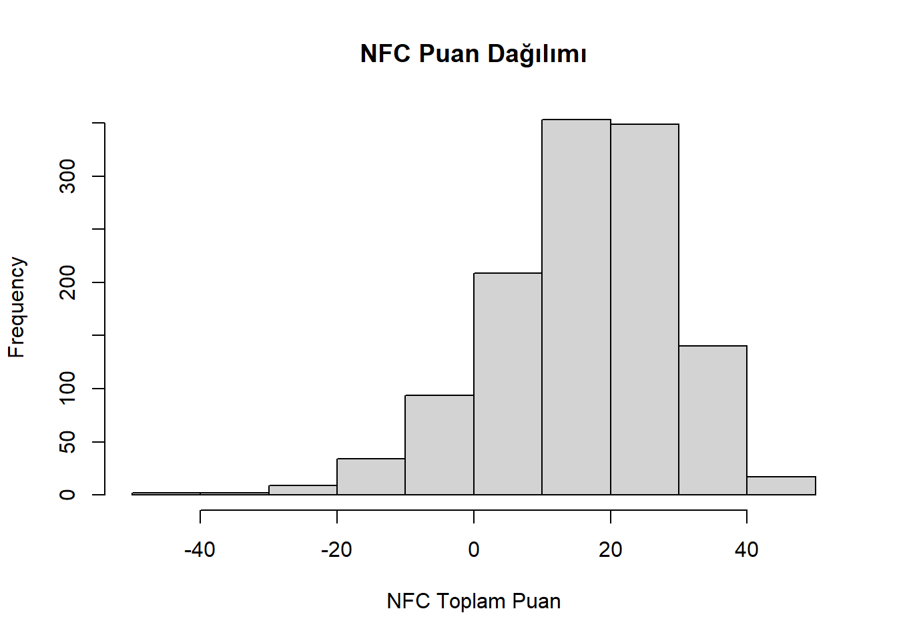


NFC Ölçeği puanlarını diğer ölçeklerden gelen puanlarla
tek bir veri kümesinde birleştirebiliriz.

```r
 scores <- cbind(nfc_score, nfc[, c("action_orientation",
"self_control", "effortful_control")])
```


```r
cormat_scores <- 
cor(scores, use = "pairwise.complete.obs")

ggcorrplot::ggcorrplot(corr = cormat_scores,
type = "lower", 
show.diag = TRUE,
lab = TRUE, 
lab_size = 3) 
```


korelasyon matrisi grafiği, NFC Ölçeği puanları ile diğer ölçeklerden alınan
puanlar arasında gerçekten de pozitif, küçük ila orta düzeyde bir korelasyon
olduğunu göstermektedir. Bunların sadece ölçek puanları arasındaki ham
korelasyonlar olduğunu unutmayın. Yani, her bir ölçekte yer alan ölçüm
hatasından kaynaklanan zayıflama için düzeltilmemiştir. Zayıflatılmış
korelasyonları elde etmek için psych paketinden correct.cor() fonksiyonunu
kullanacağız. Bu fonksiyonu kullanmak için, ölçek puanlarının ham korelasyon
matrisini ve güvenilirlik (yani iç tutarlılık) tahminlerinin bir vektörünü
listelememiz gerekir. NFC Ölçeği için güvenilirlik tahmini 0.87’dir ve üç kriter
ölçümü için güvenilirlik tahminleri ( ) şeklindedir:
Eylem Kontrol Ölçeği: 0.791
Özdenetim Ölçeği: 0.817
Çabalı Kontrol Ölçeği: 0.783


Bu bilgiyi kullanarak, zayıflatılmış korelasyonları aşağıdaki gibi hesaplayabiliriz:


```r
psych::correct.cor(x = cormat_scores, 
                   y = c(0.87, 0.791, 0.817, 0.783)) %>%
  round(., 2) %>%
  kbl() %>%
  kable_styling(bootstrap_options = c("striped", "condensed"), font_size = 13)
```

<table class="table table-striped table-condensed" style="font-size: 13px; margin-left: auto; margin-right: auto;">
 <thead>
  <tr>
   <th style="text-align:left;">   </th>
   <th style="text-align:right;"> nfc_score </th>
   <th style="text-align:right;"> action_orientation </th>
   <th style="text-align:right;"> self_control </th>
   <th style="text-align:right;"> effortful_control </th>
  </tr>
 </thead>
<tbody>
  <tr>
   <td style="text-align:left;"> nfc_score </td>
   <td style="text-align:right;"> 0.87 </td>
   <td style="text-align:right;"> 0.34 </td>
   <td style="text-align:right;"> 0.31 </td>
   <td style="text-align:right;"> 0.35 </td>
  </tr>
  <tr>
   <td style="text-align:left;"> action_orientation </td>
   <td style="text-align:right;"> 0.28 </td>
   <td style="text-align:right;"> 0.79 </td>
   <td style="text-align:right;"> 0.54 </td>
   <td style="text-align:right;"> 0.69 </td>
  </tr>
  <tr>
   <td style="text-align:left;"> self_control </td>
   <td style="text-align:right;"> 0.26 </td>
   <td style="text-align:right;"> 0.44 </td>
   <td style="text-align:right;"> 0.82 </td>
   <td style="text-align:right;"> 0.87 </td>
  </tr>
  <tr>
   <td style="text-align:left;"> effortful_control </td>
   <td style="text-align:right;"> 0.29 </td>
   <td style="text-align:right;"> 0.54 </td>
   <td style="text-align:right;"> 0.69 </td>
   <td style="text-align:right;"> 0.78 </td>
  </tr>
</tbody>
</table>


yeni korelasyon matrisinde, üst köşegen kısmı zayıflama için düzeltilmiş dört
ölçek puanı arasındaki korelasyonları, köşegen kısmı dört ölçek için güvenilirlik
tahminlerini ve alt köşegen kısmı dört ölçek puanı arasındaki orijinal (yani ham)
korelasyonları göstermektedir. Zayıflama için düzeltme uygulandıktan sonra,
yeni korelasyon değerleri ham değerlerinden daha yüksek hale gelmiştir.
Örneğin, NFC ölçeğinden alınan puanlar Çabalı Kontrol Ölçeğinden alınan
puanlarla korelasyona sahipken, iki ölçek arasındaki düzeltilmiş korelasyon ’tir.


Madde Geçerlik İndeksi
NFC Ölçeğinden alınan toplam puanlar ile ölçüt
ölçümleri arasındaki ilişkiye ek olarak, NFC Ölçeğindeki
her bir madde ile ölçüt ölçümlerinden alınan puanlar
arasındaki ilişkiyi kontrol etmek için madde geçerlilik
indeksini (IVI) de hesaplayabiliriz. IVI -0,5 ile 0,5
arasında değişebilir ve büyük değerler (mutlak
büyüklük olarak) daha yüksek geçerliliğe işaret eder.
ivi() fonksiyonu orijinal olarak paketinden
gelmektedir


```r
ivi <- function(item, criterion) {
s_i <- sd(item, na.rm = TRUE)
r <- cor(item, criterion, use = "complete.obs")
index <- s_i * r
return(index)
}

nfc_ivi <- apply(ters_matris, 
2,                
function(x) ivi(item = x,
criterion = nfc$action_orientation))

nfc_ivi <- as.data.frame(nfc_ivi)
print(nfc_ivi)
```

```
##          nfc_ivi
## nfc01 0.37297915
## nfc02 0.21153487
## nfc03 0.19981987
## nfc04 0.14540417
## nfc05 0.06209198
## nfc06 0.20228579
## nfc07 0.26048244
## nfc08 0.25950684
## nfc09 0.25584111
## nfc10 0.44981819
## nfc11 0.27994998
## nfc12 0.24413937
## nfc13 0.29590845
## nfc14 0.29309729
## nfc15 0.03979380
## nfc16 0.10474004
```

